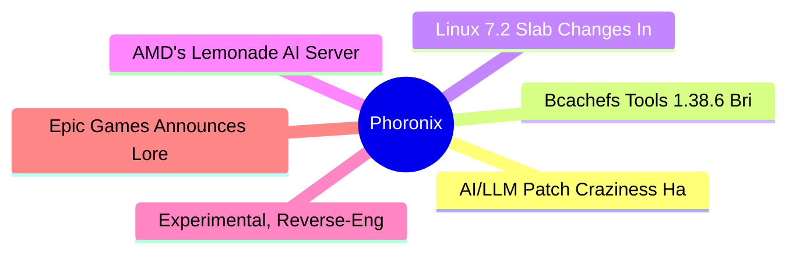

# ⚙️ Phoronix Top 6 (2026-06-18)

## 思维导图

## 列表（6 条）

### 1. AI/LLM Patch Craziness Having An Impact On ARM64 Linux Kernel Development
- **链接**: [https://www.phoronix.com/news/ARM64-Linux-7.2-Changes](https://www.phoronix.com/news/ARM64-Linux-7.2-Changes)
- **作者**: Michael Larabel
- **发布**: Wed, 17 Jun 2026 20:26:00 -0400
- **简介**: The ongoing rise in AI/LLM-generated patches hitting the mailing lists and affecting development workflows continues to impact Linux kernel development. For the ARM64 architecture updates in Linux 7.2 is an interesting a

### 2. Bcachefs Tools 1.38.6 Brings Many Performance Improvements
- **链接**: [https://www.phoronix.com/news/Bcachefs-Tools-1.38.6](https://www.phoronix.com/news/Bcachefs-Tools-1.38.6)
- **作者**: Michael Larabel
- **发布**: Wed, 17 Jun 2026 16:06:22 -0400
- **简介**: Kent Overstreet announced the release today of Bcachefs-Tools 1.38.6 as the user-space tools built around the Bcachefs copy-on-write file-system. There are a few new features and a lot of performance work in v1.38.6 with

### 3. Linux 7.2 Slab Changes Include More Performance Optimizations
- **链接**: [https://www.phoronix.com/news/Linux-7.2-Slab](https://www.phoronix.com/news/Linux-7.2-Slab)
- **作者**: Michael Larabel
- **发布**: Wed, 17 Jun 2026 16:00:48 -0400
- **简介**: The slab memory allocation changes for Linux 7.2 have been merged and continue to see more work around shaves and performance optimizations...

### 4. AMD's Lemonade AI Server Now Much More Useful With MCP Server Integration
- **链接**: [https://www.phoronix.com/news/AMD-Lemonade-10.8-Released](https://www.phoronix.com/news/AMD-Lemonade-10.8-Released)
- **作者**: Michael Larabel
- **发布**: Wed, 17 Jun 2026 15:43:23 -0400
- **简介**: The open-source Lemonade AI server for "100% free and private" AI usage across Windows and Linux in leveraging AMD Ryzen AI NPUs, Radeon GPUs, and x86_64 CPUs, is now much more powerful with today's v10.8 release...

### 5. Experimental, Reverse-Engineered & AI Assisted Rust Driver Targets Modern DisplayLink Hardware
- **链接**: [https://www.phoronix.com/news/Experimental-Vino-DRM-Driver](https://www.phoronix.com/news/Experimental-Vino-DRM-Driver)
- **作者**: Michael Larabel
- **发布**: Wed, 17 Jun 2026 12:23:37 -0400
- **简介**: The original DisplayLink USB display adapters were great for working with an upstream, open-source driver while sadly the newer DisplayLink tech has been limited to an out-of-tree driver and proprietary user-space daemon

### 6. Epic Games Announces Lore Open-Source Version Control System
- **链接**: [https://www.phoronix.com/news/Epic-Games-Lore-VCS](https://www.phoronix.com/news/Epic-Games-Lore-VCS)
- **作者**: Michael Larabel
- **发布**: Wed, 17 Jun 2026 10:45:20 -0400
- **简介**: Epic Games announced today they have created a new version control system that is now open-source as Lore. Given the proliferation and excellence of Git, you may be wondering why Epic Games is pursuing another VCS option
