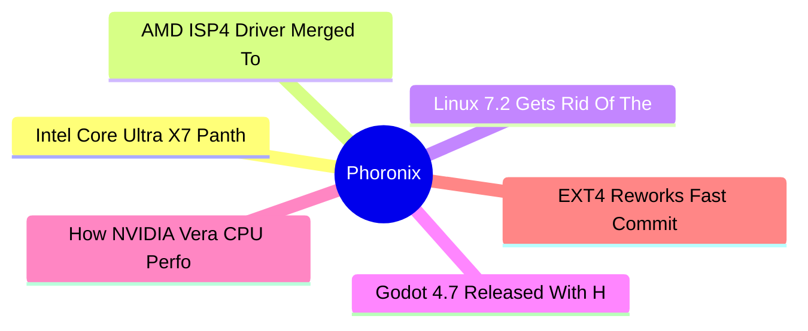

# ⚙️ Phoronix Top 6 (2026-06-22)

## 思维导图

## 列表（6 条，0 条含全文）

### 1. Intel Core Ultra X7 Panther Lake Performance On Linux 7.1
- **链接**: [https://www.phoronix.com/review/linux-71-panther-lake](https://www.phoronix.com/review/linux-71-panther-lake)
- **作者**: Michael Larabel
- **发布**: Wed, 17 Jun 2026 10:30:00 -0400
- **简介**: After recently noting the Intel Arc B580 Battlemage performance improving with Linux 7.1 and similarly finding performance gains for the Arc Pro B70 on Linux 7.1, several Phoronix readers have been wondering whether the 

### 2. AMD ISP4 Driver Merged To Linux 7.2 Kernel
- **链接**: [https://www.phoronix.com/news/Linux-7.2-Media](https://www.phoronix.com/news/Linux-7.2-Media)
- **作者**: Michael Larabel
- **发布**: Thu, 18 Jun 2026 21:00:00 -0400
- **简介**: The media subsystem changes were merged tonight for the Linux 7.2 merge window and it includes the long-awaited AMD ISP4 driver now in the mainline kernel.. This ISP4 driver is what completes the loop for enabling the we

### 3. Linux 7.2 Gets Rid Of The Last Optimized MD5 Implementation
- **链接**: [https://www.phoronix.com/news/Linux-7.2-MD5-Generic-Only](https://www.phoronix.com/news/Linux-7.2-MD5-Generic-Only)
- **作者**: Michael Larabel
- **发布**: Thu, 18 Jun 2026 20:47:04 -0400
- **简介**: The Linux kernel has dropped  the last of its architecture-specific optimized MD5 hashing algorithm implementations...

### 4. Godot 4.7 Released With HDR Output Support
- **链接**: [https://www.phoronix.com/news/Godot-4.7-Released](https://www.phoronix.com/news/Godot-4.7-Released)
- **作者**: Michael Larabel
- **发布**: Thu, 18 Jun 2026 15:42:45 -0400
- **简介**: Godot 4.7 is out today as the newest feature release for this leading open-source, cross-platform game engine...

### 5. How NVIDIA Vera CPU Performance Compares To The Ampere Altra Max
- **链接**: [https://www.phoronix.com/review/ampere-altra-nvidia-vera](https://www.phoronix.com/review/ampere-altra-nvidia-vera)
- **作者**: Michael Larabel
- **发布**: Thu, 18 Jun 2026 14:43:06 -0400
- **简介**: Last month on Phoronix was an exclusive first look at the NVIDIA Vera CPU performance compared to prior-generation NVIDIA Grace as well as the current AMD EPYC and Intel Xeon competition. Following that was looking at ho

### 6. EXT4 Reworks Fast Commit Handling & Faster Directory Hash Computation
- **链接**: [https://www.phoronix.com/news/Linux-7.2-EXT4](https://www.phoronix.com/news/Linux-7.2-EXT4)
- **作者**: Michael Larabel
- **发布**: Thu, 18 Jun 2026 13:53:17 -0400
- **简介**: The EXT4 file-system improvements were merged today for Linux 7.2 with some enticing optimizations...
