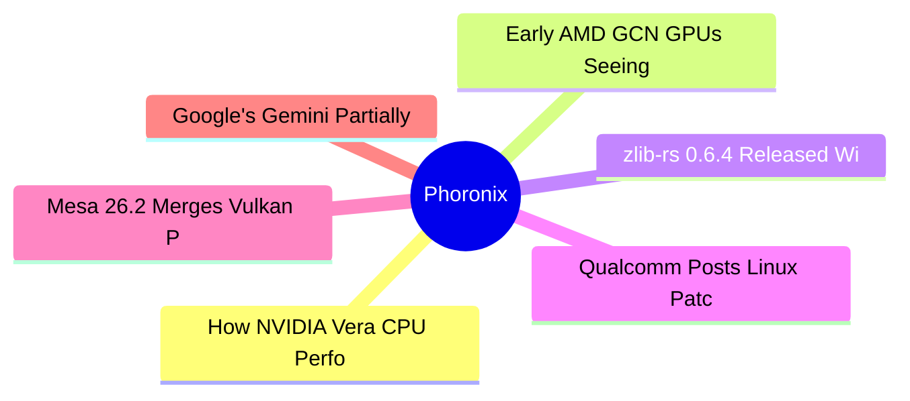

# ⚙️ Phoronix Top 6 (2026-06-23)

## 思维导图

## 列表（6 条，0 条含全文）

### 1. How NVIDIA Vera CPU Performance Compares To The Ampere Altra Max
- **链接**: [https://www.phoronix.com/review/ampere-altra-nvidia-vera](https://www.phoronix.com/review/ampere-altra-nvidia-vera)
- **作者**: Michael Larabel
- **发布**: Thu, 18 Jun 2026 14:43:06 -0400
- **简介**: Last month on Phoronix was an exclusive first look at the NVIDIA Vera CPU performance compared to prior-generation NVIDIA Grace as well as the current AMD EPYC and Intel Xeon competition. Following that was looking at ho

### 2. Early AMD GCN GPUs Seeing Improved GPU Recovery - Another Valve-Led Linux Improvement
- **链接**: [https://www.phoronix.com/news/AMD-Early-GCN-Better-Recovery](https://www.phoronix.com/news/AMD-Early-GCN-Better-Recovery)
- **作者**: Michael Larabel
- **发布**: Sun, 21 Jun 2026 20:37:29 -0400
- **简介**: Early AMD Radeon Graphics Core Next "GCN" GPUs are seeing work to improve the GPU recovery process in the event of hangs. This work is yet another improvement for older AMD GPUs being led by Valve's open-source Linux gra

### 3. zlib-rs 0.6.4 Released With Fix For Intel Raptor Lake Crash, SIMD Optimizations
- **链接**: [https://www.phoronix.com/news/zlib-rs-0.6.4](https://www.phoronix.com/news/zlib-rs-0.6.4)
- **作者**: Michael Larabel
- **发布**: Sun, 21 Jun 2026 15:33:11 -0400
- **简介**: As a follow-up to last week's article around  Firefox leveraging zlib-rs and some nice upstream improvements to this Rust-based Zlib implementation, the zlib-rs 0.6.4 release is now available to ship all of these latest 

### 4. Qualcomm Posts Linux Patches For HP EliteBook X G2q X2 Elite Laptop
- **链接**: [https://www.phoronix.com/news/HP-EliteBook-X-G2q-Linux](https://www.phoronix.com/news/HP-EliteBook-X-G2q-Linux)
- **作者**: Michael Larabel
- **发布**: Sun, 21 Jun 2026 10:38:15 -0400
- **简介**: Last month Qualcomm engineers posted patches bringing up the Lenovo Yoga Slim 7x Gen11 Snapdragon X2 laptop on Linux. Sent out this weekend were a new set of patches from Qualcomm for bringing up the HP EliteBook X G2q l

### 5. Mesa 26.2 Merges Vulkan Present Timing Support For X11/XWayland
- **链接**: [https://www.phoronix.com/news/Mesa-26.2-X11-Present-Timing](https://www.phoronix.com/news/Mesa-26.2-X11-Present-Timing)
- **作者**: Michael Larabel
- **发布**: Sun, 21 Jun 2026 08:49:30 -0400
- **简介**: Mesa's Vulkan windowing system integration (WSI) code now has support for present timing support "VK_EXT_present_timing" with X11 and XWayland...

### 6. Google's Gemini Partially Figures Out A Lengthy Linux Boot Time On Modern ASUS Laptop
- **链接**: [https://www.phoronix.com/news/Gemini-ASUS-Laptop-Boot-Time](https://www.phoronix.com/news/Gemini-ASUS-Laptop-Boot-Time)
- **作者**: Michael Larabel
- **发布**: Sun, 21 Jun 2026 06:43:53 -0400
- **简介**: Google Antigravity with the Gemini 3.5 Flash model helped a Linux user sort out a situation where his laptop was taking around 36 seconds to boot the kernel, which shouldn't be the case for the high-end laptop with AMD R
