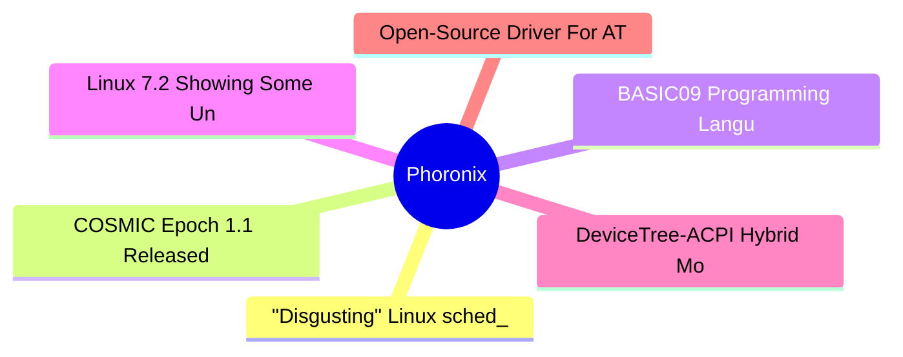

# ⚙️ Phoronix Top 6 (2026-06-24)

## 思维导图

## 列表（6 条，0 条含全文）

### 1. "Disgusting" Linux sched_ext Source Code Restructured Following Complaint By Linus Torvalds
- **链接**: [https://www.phoronix.com/news/Linux-Sched-Ext-Restructured](https://www.phoronix.com/news/Linux-Sched-Ext-Restructured)
- **作者**: Michael Larabel
- **发布**: Tue, 23 Jun 2026 20:23:09 -0400
- **简介**: Last week the main set of sched_ext changes were merged for Linux 7.2 that included continued work on sub-scheduler support. While Linus Torvalds didn't object to any of the features being worked on for this extensible s

### 2. COSMIC Epoch 1.1 Released With COSMIC-Monitor, Compositor Improvements
- **链接**: [https://www.phoronix.com/news/COSMIC-Epoch-1.1](https://www.phoronix.com/news/COSMIC-Epoch-1.1)
- **作者**: Michael Larabel
- **发布**: Tue, 23 Jun 2026 16:49:04 -0400
- **简介**: System76 today released COSMIC Epoch 1.1 as the newest feature release as well as being their first time bumping the minor version number since the December release of COSMIC 1.0...

### 3. BASIC09 Programming Language Front-End Developed For LLVM
- **链接**: [https://www.phoronix.com/news/BASIC09-LLVM-Front-End](https://www.phoronix.com/news/BASIC09-LLVM-Front-End)
- **作者**: Michael Larabel
- **发布**: Tue, 23 Jun 2026 15:28:14 -0400
- **简介**: The 46-year-old BASIC09 programming language has new compiler support with a front-end having been developed for the LLVM compiler stack. BASIC09 was developed in 1980 for the Motorola 6809 CPU running with the OS-9 oper

### 4. Linux 7.2 Showing Some Unexpected & Nice Performance Gains On AMD EPYC Sorano
- **链接**: [https://www.phoronix.com/news/Linux-7.2--EPYC-Sorano-Network](https://www.phoronix.com/news/Linux-7.2--EPYC-Sorano-Network)
- **作者**: Michael Larabel
- **发布**: Tue, 23 Jun 2026 12:22:15 -0400
- **简介**: While the Linux 7.2 merge window doesn't wrap up until this weekend as the feature cut-off for new material, I have already begun some early benchmarks of the code currently staged for this next version of the Linux kern

### 5. DeviceTree-ACPI Hybrid Mode Proposed For Improving Linux Support On Snapdragon Laptops
- **链接**: [https://www.phoronix.com/news/DT-ACPI-Hybrid-Mode-Linux](https://www.phoronix.com/news/DT-ACPI-Hybrid-Mode-Linux)
- **作者**: Michael Larabel
- **发布**: Tue, 23 Jun 2026 11:23:51 -0400
- **简介**: Over the years while working at Red Hat, Hans de Goede was known for driving many wonderful Linux laptop improvements benefiting AMD/Intel x86_64 hardware. Hans left Red Hat last year and ended up joining Qualcomm to adv

### 6. Open-Source Driver For ATI R300 Era GPUs Seeing Improved Power Mac Support In 2026
- **链接**: [https://www.phoronix.com/news/ATI-R300-Big-Endian-2026](https://www.phoronix.com/news/ATI-R300-Big-Endian-2026)
- **作者**: Michael Larabel
- **发布**: Tue, 23 Jun 2026 10:21:01 -0400
- **简介**: For those that happen to still be running a 22+ year old Apple Power Mac such as those from 2004 with an IBM PowerPC processor and ATI Radeon 9600 XT or 9800 XT graphics, there are open-source driver improvements for Lin
