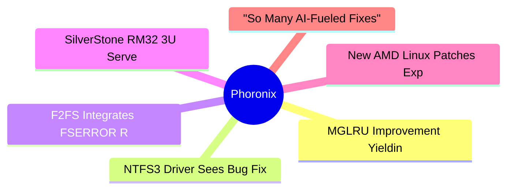

# ⚙️ Phoronix Top 6 (2026-06-25)

## 思维导图

## 列表（6 条，0 条含全文）

### 1. MGLRU Improvement Yielding Nice Gains On Linux 7.2: MongoDB 30~100% Higher Throughput
- **链接**: [https://www.phoronix.com/news/Linux-7.2-MM](https://www.phoronix.com/news/Linux-7.2-MM)
- **作者**: Michael Larabel
- **发布**: Wed, 24 Jun 2026 17:19:23 -0400
- **简介**: The many memory management "MM" related improvements were recently merged to Git for the Linux 7.2 kernel. As typical most kernel cycles, some of the low-level improvements can yield nice efficiency wins and better perfo

### 2. NTFS3 Driver Sees Bug Fixes & Minor Improvements With Linux 7.2
- **链接**: [https://www.phoronix.com/news/Linux-7.2-NTFS3](https://www.phoronix.com/news/Linux-7.2-NTFS3)
- **作者**: Michael Larabel
- **发布**: Wed, 24 Jun 2026 14:11:00 -0400
- **简介**: While the new NTFS file-system driver merged for  Linux 7.1 and has seen more improvements for Linux 7.2, for now at least the NTFS3 kernel driver continues to be maintained with new fixes and improvements. NTFS3 is the 

### 3. F2FS Integrates FSERROR Reporting, Reduces Memory Footprint In Linux 7.2
- **链接**: [https://www.phoronix.com/news/Linux-7.2-F2FS](https://www.phoronix.com/news/Linux-7.2-F2FS)
- **作者**: Michael Larabel
- **发布**: Wed, 24 Jun 2026 12:48:12 -0400
- **简介**: The Flash-Friendly File-System (F2FS) changes have landed for Linux 7.2...

### 4. SilverStone RM32 3U Server Chassis + 1000W Extreme 1000Rz Platinum PSU
- **链接**: [https://www.phoronix.com/review/silverstone-rm32](https://www.phoronix.com/review/silverstone-rm32)
- **作者**: Michael Larabel
- **发布**: Wed, 24 Jun 2026 11:30:05 -0400
- **简介**: For those with limited rack space and wanting to assemble a high-end server/workstation, the SilverStone RM32 provides a lot of opportunities in being a 3U rackmount chassis that can accommodate an E-ATX or SSI-EEB mothe

### 5. New AMD Linux Patches Expose Gamma 2.4 + Gamma 2.6 Curves
- **链接**: [https://www.phoronix.com/news/AMDGPU-Linux-Gamma-2.4-2.6](https://www.phoronix.com/news/AMDGPU-Linux-Gamma-2.4-2.6)
- **作者**: Michael Larabel
- **发布**: Wed, 24 Jun 2026 10:22:00 -0400
- **简介**: In addition to AMD engineers being busy rolling out HDMI 2.1 for their open-source Linux driver at long last, another notable display-related improvement on the way to their AMDGPU kernel graphics driver is exposing the 

### 6. "So Many AI-Fueled Fixes" Means No New ARM64 KVM Features For Linux 7.2
- **链接**: [https://www.phoronix.com/news/Linux-7.2-KVM](https://www.phoronix.com/news/Linux-7.2-KVM)
- **作者**: Michael Larabel
- **发布**: Wed, 24 Jun 2026 09:55:40 -0400
- **简介**: The KVM virtualization-related changes were merged a few days ago for the ongoing Linux 7.2 kernel merge window. While there are a number of features/improvements for AMD and Intel virtualization as well as the likes of 
