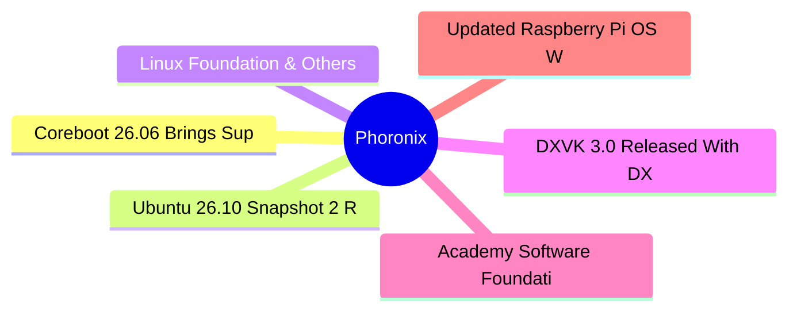

# ⚙️ Phoronix Top 6 (2026-06-29)

## 思维导图

## 列表（6 条，0 条含全文）

### 1. Coreboot 26.06 Brings Support For Intel Nova Lake, AMD Strix Halo & 31 New Boards
- **链接**: [https://www.phoronix.com/news/Coreboot-26.06-Released](https://www.phoronix.com/news/Coreboot-26.06-Released)
- **作者**: Michael Larabel
- **发布**: Thu, 25 Jun 2026 20:39:22 -0400
- **简介**: Coreboot 26.06 is out today as the latest quarterly feature release for this software project providing open-source system firmware support for a growing number of platforms...

### 2. Ubuntu 26.10 Snapshot 2 Released For Monthly Testing
- **链接**: [https://www.phoronix.com/news/Ubuntu-26.10-Snapshot-2](https://www.phoronix.com/news/Ubuntu-26.10-Snapshot-2)
- **作者**: Michael Larabel
- **发布**: Thu, 25 Jun 2026 20:25:01 -0400
- **简介**: Daily ISOs of Ubuntu 26.10 "Stonking Stingray" continue to be published, but for those preferring something a bit more regulated, out today is Ubuntu 26.10 Snapshot 2 as the second monthly ISO image...

### 3. Linux Foundation & Others Launch "Akrites" To Defend Open-Source Software From AI-Enabled Exploits
- **链接**: [https://www.phoronix.com/news/Akrites](https://www.phoronix.com/news/Akrites)
- **作者**: Michael Larabel
- **发布**: Thu, 25 Jun 2026 17:09:00 -0400
- **简介**: The Linux Foundation along with others like Amazon, Anthropic, OpenAI, NVIDIA, Microsoft, Red Hat, and others have joined forces to launch Akrites. The Akrites project is aiming to help defend critical open-source softwa

### 4. DXVK 3.0 Released With DXBC-SPIRV For Shader Compilation, Descriptor Heaps By Default
- **链接**: [https://www.phoronix.com/news/DXVK-3.0-Release](https://www.phoronix.com/news/DXVK-3.0-Release)
- **作者**: Michael Larabel
- **发布**: Thu, 25 Jun 2026 16:29:46 -0400
- **简介**: Philip Rebohle announced the release today of DXVK 3.0 as the latest major feature release for this Direct3D 8 / 9 / 10 / 11 implementation atop the Vulkan API for use by Wine and Valve's Steam Play (Proton)...

### 5. Academy Software Foundation Announces The "Wayland For Artists Working Group"
- **链接**: [https://www.phoronix.com/news/Wayland-For-Artists](https://www.phoronix.com/news/Wayland-For-Artists)
- **作者**: Michael Larabel
- **发布**: Thu, 25 Jun 2026 14:12:38 -0400
- **简介**: The Academy Software Foundation that advances open-source efforts for the VFX/cinema industry and more with the likes of OpenVDB, OpenMoonRay, Open Shading Language, and other projects, has announced the formation of a n

### 6. Updated Raspberry Pi OS With Linux 6.18 LTS Delivers Some Performance Benefits
- **链接**: [https://www.phoronix.com/review/raspberry-pi-os-linux-618](https://www.phoronix.com/review/raspberry-pi-os-linux-618)
- **作者**: Michael Larabel
- **发布**: Thu, 25 Jun 2026 12:30:00 -0400
- **简介**: Last week marked the release of an updated Raspberry Pi OS that moved to Linux 6.18 LTS from its former Linux 6.12 kernel base along with making a number of other package updates. Given the jump to the newer Long Term Su
