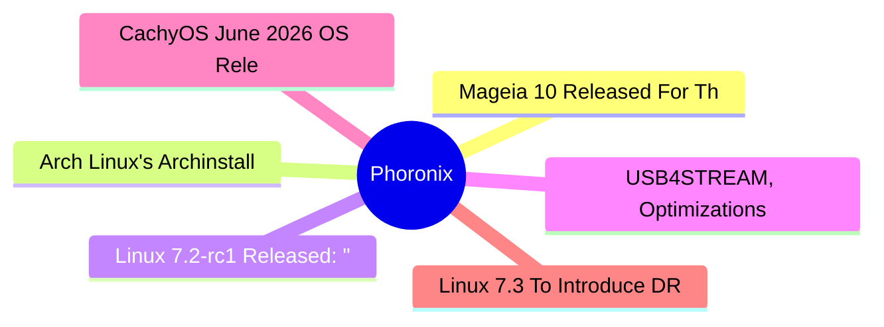

# ⚙️ Phoronix Top 6 (2026-06-30)

## 思维导图

## 列表（6 条，0 条含全文）

### 1. Mageia 10 Released For This Linux Distribution Carrying On The Mandrake Legacy
- **链接**: [https://www.phoronix.com/news/Mageia-10-Released](https://www.phoronix.com/news/Mageia-10-Released)
- **作者**: Michael Larabel
- **发布**: Sun, 28 Jun 2026 21:10:08 -0400
- **简介**: Mageia 10 ISOs are now available for this Linux distribution long ago derived from Mandriva Linux and in turn the legendary Mandrake Linux...

### 2. Arch Linux's Archinstall 4.4 Adds Dank Material Shell + Niri Desktop Option
- **链接**: [https://www.phoronix.com/news/Arch-Linux-Archinstall-4.4](https://www.phoronix.com/news/Arch-Linux-Archinstall-4.4)
- **作者**: Michael Larabel
- **发布**: Sun, 28 Jun 2026 20:41:53 -0400
- **简介**: Ahead of the July 2026 ISO refresh for Arch Linux, a new Archinstall 4.4 release has been tagged for this text-based and very convenient installer for Arch Linux...

### 3. Linux 7.2-rc1 Released: "Things Look Reasonably Normal" While Landing AMDGPU HDMI 2.1 FRL, AMD ISP4 & CAS
- **链接**: [https://www.phoronix.com/news/Linux-7.2-rc1-Released](https://www.phoronix.com/news/Linux-7.2-rc1-Released)
- **作者**: Michael Larabel
- **发布**: Sun, 28 Jun 2026 16:04:19 -0400
- **简介**: As expected, Linux 7.2-rc1 was released a brief time ago to cap off the Linux 7.2 merge window. Now it's off for eight weeks or so of testing before Linux 7.2 stable is released that will in turn go on to power the likes

### 4. USB4STREAM, Optimizations, Jay & Other Popular Intel Linux News From This Quarter
- **链接**: [https://www.phoronix.com/news/Intel-Linux-Q2-2026](https://www.phoronix.com/news/Intel-Linux-Q2-2026)
- **作者**: Michael Larabel
- **发布**: Sun, 28 Jun 2026 14:49:28 -0400
- **简介**: With Q2'2026 working toward a close, here is a look back at the most popular Intel Linux and open-source news for the quarter...

### 5. CachyOS June 2026 OS Released With More Performance Optimizations
- **链接**: [https://www.phoronix.com/news/CachyOS-June-2026-Released](https://www.phoronix.com/news/CachyOS-June-2026-Released)
- **作者**: Michael Larabel
- **发布**: Sun, 28 Jun 2026 10:49:10 -0400
- **简介**: CachyOS is out today with a new feature release for this Arch Linux powered distribution that delivers stellar out-of-the-box performance...

### 6. Linux 7.3 To Introduce DRM "Color Format" Property With AMD GPU Driver Support
- **链接**: [https://www.phoronix.com/news/Linux-7.3-DRM-Color-Format](https://www.phoronix.com/news/Linux-7.3-DRM-Color-Format)
- **作者**: Michael Larabel
- **发布**: Sun, 28 Jun 2026 09:34:22 -0400
- **简介**: While the Linux 7.2 kernel merge window is only ending later today to cap off the feature work on this next version of the Linux kernel, already for the Linux 7.3 kernel cycle later in the year there is one notable featu
