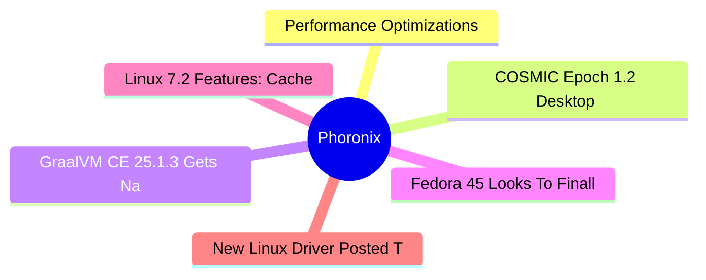

# ⚙️ Phoronix Top 6 (2026-07-01)

## 思维导图

## 列表（6 条，0 条含全文）

### 1. Performance Optimizations, NVIDIA Vera, Arc Pro B70 & Other Linux Highlights From Q2
- **链接**: [https://www.phoronix.com/news/Q2-2026-Highlights](https://www.phoronix.com/news/Q2-2026-Highlights)
- **作者**: Michael Larabel
- **发布**: Tue, 30 Jun 2026 20:24:26 -0400
- **简介**: As the last planned article on Phoronix of Q2, here is a look back at what excited readers the most in the second quarter. There were 872 original news articles this quarter as well as 54 Linux hardware reviews / multi-p

### 2. COSMIC Epoch 1.2 Desktop Fixes Flickering Issues For Intel Graphics
- **链接**: [https://www.phoronix.com/news/COSMIC-Epoch-1.2](https://www.phoronix.com/news/COSMIC-Epoch-1.2)
- **作者**: Michael Larabel
- **发布**: Tue, 30 Jun 2026 18:30:38 -0400
- **简介**: Just a week after the COSMIC Epoch 1.1 release with its slick new system monitor, COSMIC Epoch 1.2 is now available for this Rust-based desktop developed by System76...

### 3. GraalVM CE 25.1.3 Gets Native Image "Hello World" Program Down To
- **链接**: [https://www.phoronix.com/news/GraalVM-Community-25.1.3](https://www.phoronix.com/news/GraalVM-Community-25.1.3)
- **作者**: Michael Larabel
- **发布**: Tue, 30 Jun 2026 16:11:40 -0400
- **简介**: GraalVM, the advanced JDK focused on ahead-of-time (AOT) Native Image compilation and since last year began shifting focus to more non-Java languages like Python and JavaScript,  is out with its newest community feature 

### 4. Fedora 45 Looks To Finally Offer Install Support For Stratis Storage
- **链接**: [https://www.phoronix.com/news/Fedora-45-Stratis-Storage](https://www.phoronix.com/news/Fedora-45-Stratis-Storage)
- **作者**: Michael Larabel
- **发布**: Tue, 30 Jun 2026 14:00:00 -0400
- **简介**: Ever since RHEL deprecated their short-lived Btrfs plans, Red Hat engineers over the past decade have been developing Stratis Storage as their storage management solution leveraging XFS, LUKS, DM, and their Rust-based da

### 5. Linux 7.2 Features: Cache Aware Scheduling, USB4STREAM, AMD ISP4, AMDGPU HDMI 2.1 FRL
- **链接**: [https://www.phoronix.com/review/linux-72-features](https://www.phoronix.com/review/linux-72-features)
- **作者**: Michael Larabel
- **发布**: Tue, 30 Jun 2026 12:20:00 -0400
- **简介**: Linux 7.2 is working toward release in August with its more than 43 million lines in the codebase. With Linux 7.2 there are many new changes in tow as summed up in today's feature overview.

### 6. New Linux Driver Posted To Enable Keyboard Support On M3 MacBooks
- **链接**: [https://www.phoronix.com/news/Apple-DockChannel-M3-Keyboard](https://www.phoronix.com/news/Apple-DockChannel-M3-Keyboard)
- **作者**: Michael Larabel
- **发布**: Tue, 30 Jun 2026 12:05:00 -0400
- **简介**: While Linux 7.2 introduces the ability to boot on Apple M3 Macs, it's not yet remotely useful for end-users wanting to use an Apple Mac/MacBook as their daily system. As it stands now, the M3 Macs boot to a simple consol
