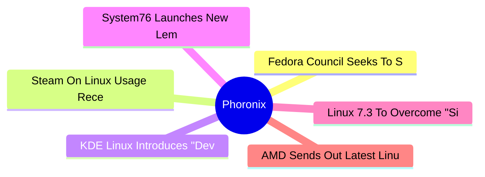

# ⚙️ Phoronix Top 6 (2026-07-03)

## 思维导图

## 列表（6 条，0 条含全文）

### 1. Fedora Council Seeks To Shutdown Current Discussions Over AI Developer Desktop
- **链接**: [https://www.phoronix.com/news/Fedora-Council-AI-Desktop](https://www.phoronix.com/news/Fedora-Council-AI-Desktop)
- **作者**: Michael Larabel
- **发布**: Wed, 01 Jul 2026 21:40:00 -0400
- **简介**: Stemming from the widely varying views over the recent Fedora proposal for an "AI Developer Desktop" catering to running local AI and machine learning workloads in pre-configured environments with a seamless hardware-acc

### 2. Steam On Linux Usage Receded A Bit In June
- **链接**: [https://www.phoronix.com/news/Steam-Survey-June-2026](https://www.phoronix.com/news/Steam-Survey-June-2026)
- **作者**: Michael Larabel
- **发布**: Wed, 01 Jul 2026 20:23:25 -0400
- **简介**: Back in March Steam on Linux use shot up to 5.33% as a big 3.1% improvement over February. In April it dropped to 4.52% and then fell to 3.99% in May. Valve just published the Steam Survey numbers for June and it points 

### 3. KDE Linux Introduces "Developer Mode" Option, Easier Log Collection
- **链接**: [https://www.phoronix.com/news/KDE-Linux-June-2026](https://www.phoronix.com/news/KDE-Linux-June-2026)
- **作者**: Michael Larabel
- **发布**: Wed, 01 Jul 2026 17:06:06 -0400
- **简介**: With the start of the new month comes a new progress report on the KDE Linux distribution for the prior month. Even with KDE developers being busy to ship Plasma 6.7 in June, they still accomplished a lot when it comes t

### 4. System76 Launches New Lemur Pro Laptop Powered By Intel Panther Lake
- **链接**: [https://www.phoronix.com/news/System76-Lemur-Pro-Panther-Lake](https://www.phoronix.com/news/System76-Lemur-Pro-Panther-Lake)
- **作者**: Michael Larabel
- **发布**: Wed, 01 Jul 2026 14:01:20 -0400
- **简介**: System76 today announced their new Lemur Pro high-end Linux laptop that is now powered by the Core Ultra Series 3 "Panther Lake" SoCs...

### 5. Linux 7.3 To Overcome "Significant Bottleneck" For Small I/O With PCIe Gen5 NVMe SSDs
- **链接**: [https://www.phoronix.com/news/Linux-7.3-Faster-Small-Direct](https://www.phoronix.com/news/Linux-7.3-Faster-Small-Direct)
- **作者**: Michael Larabel
- **发布**: Wed, 01 Jul 2026 12:06:06 -0400
- **简介**: While the Linux 7.2 feature merge window ended just days ago and the better part of two months now before v7.2 will be released as stable, there are already features beginning to accumulate that will target the Linux 7.3

### 6. AMD Sends Out Latest Linux Patches For RMPOPT Optimization
- **链接**: [https://www.phoronix.com/news/AMD-RMPOPT-Linux-v10](https://www.phoronix.com/news/AMD-RMPOPT-Linux-v10)
- **作者**: Michael Larabel
- **发布**: Wed, 01 Jul 2026 11:38:00 -0400
- **简介**: Earlier this year AMD disclosed the RMPOPT instruction that given the timing will seemingly be introduced with upcoming Zen 6 EPYC "Venice" processors. The RMPOPT feature amounts to a performance optimization for AMD EPY
