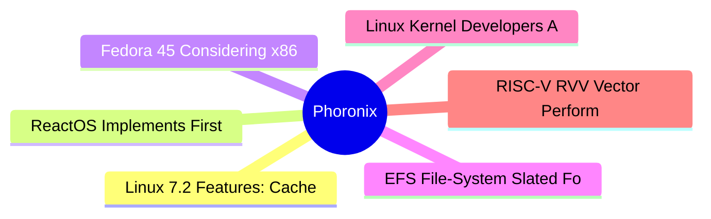

# ⚙️ Phoronix Top 6 (2026-07-05)

## 思维导图

## 列表（6 条，0 条含全文）

### 1. Linux 7.2 Features: Cache Aware Scheduling, USB4STREAM, AMD ISP4, AMDGPU HDMI 2.1 FRL
- **链接**: [https://www.phoronix.com/review/linux-72-features](https://www.phoronix.com/review/linux-72-features)
- **作者**: Michael Larabel
- **发布**: Tue, 30 Jun 2026 12:20:00 -0400
- **简介**: Linux 7.2 is working toward release in August with its more than 43 million lines in the codebase. With Linux 7.2 there are many new changes in tow as summed up in today's feature overview.

### 2. ReactOS Implements First Windows NT6 System Call In Step Toward Vista Compatibility
- **链接**: [https://www.phoronix.com/news/ReactOS-First-NT6-Syscall](https://www.phoronix.com/news/ReactOS-First-NT6-Syscall)
- **作者**: Michael Larabel
- **发布**: Thu, 02 Jul 2026 20:22:38 -0400
- **简介**: The ReactOS project that is striving to be the "open-source Windows" with Windows driver and software binary compatibility hit another milestone today.  ReactOS to date has primarily targeted Windows NT 5.2 as the archit

### 3. Fedora 45 Considering x86_64 Shadow Stack Usage By Default
- **链接**: [https://www.phoronix.com/news/Fedora-45-Consider-Shadow-Stack](https://www.phoronix.com/news/Fedora-45-Consider-Shadow-Stack)
- **作者**: Michael Larabel
- **发布**: Thu, 02 Jul 2026 17:17:35 -0400
- **简介**: A change proposal under consideration for Fedora Linux 45 would enable x86_64 Shadow Stack usage by default in the name of better security on modern Intel and AMD systems...

### 4. EFS File-System Slated For Removal With Linux 7.3 After 20+ Years Unmaintained
- **链接**: [https://www.phoronix.com/news/EFS-File-System-Removal-Coming](https://www.phoronix.com/news/EFS-File-System-Removal-Coming)
- **作者**: Michael Larabel
- **发布**: Thu, 02 Jul 2026 13:39:06 -0400
- **简介**: The EFS file-system was used for non-ISO9660 CD-ROMs and disk partitions on SGI IRIX before IRIX 6.0 switched over to XFS. Inside the Linux kernel has been a read-only EFS file-system driver without a maintainer for 20+ 

### 5. Linux Kernel Developers Again Discussing AI Agent Attribution - Potentially Dropping It
- **链接**: [https://www.phoronix.com/news/Linux-AI-Attribution-Again](https://www.phoronix.com/news/Linux-AI-Attribution-Again)
- **作者**: Michael Larabel
- **发布**: Thu, 02 Jul 2026 11:11:00 -0400
- **简介**: When AI/LLM agents are used in the creation of Linux kernel patches, the policy for a while now has been that it should be specified using an "Assisted-by" tag as part of the patches/commits. But Linux kernel developers 

### 6. RISC-V RVV Vector Performance Benchmarks With The SpacemiT K3 SoC
- **链接**: [https://www.phoronix.com/review/risc-v-rvv-vector-benchmarks](https://www.phoronix.com/review/risc-v-rvv-vector-benchmarks)
- **作者**: Michael Larabel
- **发布**: Thu, 02 Jul 2026 10:10:00 -0400
- **简介**: Since May we have been benchmarking the SpacemiT K3 RISC-V SoC as one of the first to market RISC-V chips supporting the RVA23 profile. The SpacemiT K3 has shown how far RISC-V performance has come in the past half decad
