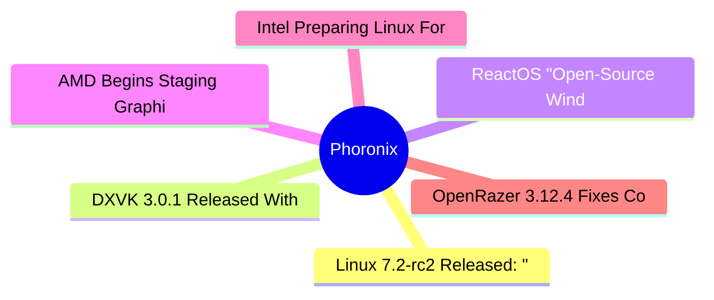

# ⚙️ Phoronix Top 6 (2026-07-07)

## 思维导图

## 列表（6 条，0 条含全文）

### 1. Linux 7.2-rc2 Released: "Things Look Very Normal"
- **链接**: [https://www.phoronix.com/news/Linux-7.2-rc2-Released](https://www.phoronix.com/news/Linux-7.2-rc2-Released)
- **作者**: Michael Larabel
- **发布**: Sun, 05 Jul 2026 21:08:38 -0400
- **简介**: Linux 7.2-rc2 is now available for testing in working toward the stable Linux 7.2 release in August...

### 2. DXVK 3.0.1 Released With More Game Fixes, Other Improvements
- **链接**: [https://www.phoronix.com/news/DXVK-3.0.1-Released](https://www.phoronix.com/news/DXVK-3.0.1-Released)
- **作者**: Michael Larabel
- **发布**: Sun, 05 Jul 2026 19:08:24 -0400
- **简介**: Following the release of DXVK 3.0 from late June that brought several big changes, DXVK 3.0.1 is out today with shipping various game fixes and other improvements to this important piece of Valve's Steam Play (Proton) fo

### 3. ReactOS "Open-Source Windows" Project Now Capable Of Running Half-Life 2
- **链接**: [https://www.phoronix.com/news/Half-Life-2-ReactOS](https://www.phoronix.com/news/Half-Life-2-ReactOS)
- **作者**: Michael Larabel
- **发布**: Sun, 05 Jul 2026 06:42:40 -0400
- **简介**: One month ago it was exciting to see the open-source ReactOS operating system running Valve's Half-Life game. Little to realize less than 30 days later it would also be running Half-Life 2...

### 4. AMD Begins Staging Graphics Driver Changes For Linux 7.3
- **链接**: [https://www.phoronix.com/news/AMDGPU-AMDKFD-Start-Linux-7.3](https://www.phoronix.com/news/AMDGPU-AMDKFD-Start-Linux-7.3)
- **作者**: Michael Larabel
- **发布**: Sun, 05 Jul 2026 06:32:18 -0400
- **简介**: In addition to Intel beginning to volley graphics driver patches for Linux 7.3, this week AMD also began sending out their pull requests of "new stuff" to DRM-Next for the Linux 7.3 kernel cycle...

### 5. Intel Preparing Linux For IPU8 Web Camera Support With Nova Lake Laptops
- **链接**: [https://www.phoronix.com/news/Intel-IPU8-With-Nova-Lake](https://www.phoronix.com/news/Intel-IPU8-With-Nova-Lake)
- **作者**: Michael Larabel
- **发布**: Sun, 05 Jul 2026 06:14:00 -0400
- **简介**: More Linux kernel patches have been surfacing that confirm next-gen, high-end Nova Lake laptops will feature IPU8 image processing capabilities...

### 6. OpenRazer 3.12.4 Fixes Compatibility With Linux 7.2
- **链接**: [https://www.phoronix.com/news/OpenRazer-3.12.4](https://www.phoronix.com/news/OpenRazer-3.12.4)
- **作者**: Michael Larabel
- **发布**: Sat, 04 Jul 2026 20:33:48 -0400
- **简介**: OpenRazer 3.12.4 is now available as the newest update to these out-of-tree, unofficial Linux drivers for Razer devices. OpenRazer when paired with the likes of Polychromatic or other GUI options is what makes for a nice
