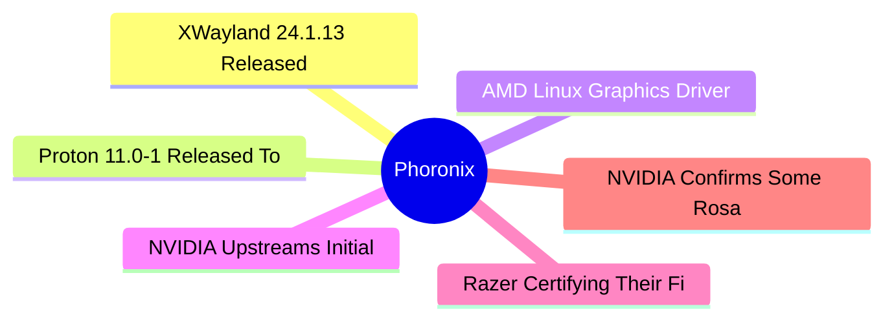

# ⚙️ Phoronix Top 6 (2026-07-08)

## 思维导图

## 列表（6 条，0 条含全文）

### 1. XWayland 24.1.13 Released To Fix Two More Security Issues In The X.Org Codebase
- **链接**: [https://www.phoronix.com/news/XWayland-24.1.13-Released](https://www.phoronix.com/news/XWayland-24.1.13-Released)
- **作者**: Michael Larabel
- **发布**: Tue, 07 Jul 2026 21:44:06 -0400
- **简介**: Two more security issues were made public today concerning the X.Org Server codebase and in turn XWayland also being affected...

### 2. Proton 11.0-1 Released To Advance Valve's Steam Play For The Best Linux Experience Yet
- **链接**: [https://www.phoronix.com/news/Proton-11.0-1](https://www.phoronix.com/news/Proton-11.0-1)
- **作者**: Michael Larabel
- **发布**: Tue, 07 Jul 2026 17:10:27 -0400
- **简介**: Proton 11.0-1 was just released as stable as the newest major version of this downstream of Wine that powers Valve's Steam Play to provide for a great Windows gaming experience across conventional Linux systems plus the 

### 3. AMD Linux Graphics Driver Working To Clear Out All Of Its BUG()s
- **链接**: [https://www.phoronix.com/news/AMDGPU-Clearing-Out-BUGs](https://www.phoronix.com/news/AMDGPU-Clearing-Out-BUGs)
- **作者**: Michael Larabel
- **发布**: Tue, 07 Jul 2026 16:53:44 -0400
- **简介**: AMDGPU kernel driver maintainer Alex Deucher of AMD sent out a set of 30 patches today working on clearing out all of the BUG() usage within this Linux kernel graphics driver...

### 4. NVIDIA Upstreams Initial Rigel CPU Core Support Into GCC Compiler
- **链接**: [https://www.phoronix.com/news/NVIDIA-Rigel-Upstream-GCC](https://www.phoronix.com/news/NVIDIA-Rigel-Upstream-GCC)
- **作者**: Michael Larabel
- **发布**: Tue, 07 Jul 2026 11:45:00 -0400
- **简介**: That didn't take long... Mere minutes after NVIDIA confirmed some basic Rosa CPU details and its "Rigel" CPU core, merged to the upstream GNU Compiler Collection (GCC) codebase is initial enablement on the NVIDIA Rigel c

### 5. Razer Certifying Their First Laptop For Linux: Razer Blade 18 RZ09-0582
- **链接**: [https://www.phoronix.com/review/razer-blade-18-linux](https://www.phoronix.com/review/razer-blade-18-linux)
- **作者**: Michael Larabel
- **发布**: Tue, 07 Jul 2026 11:38:00 -0400
- **简介**: Razer is a brand synonymous with gaming and finally in 2026 they are in the process of certifying their first laptop for Ubuntu Linux. This laptop going through Ubuntu Linux certification is the Razer Blade 18 RZ09-0582 

### 6. NVIDIA Confirms Some Rosa CPU Details With Its Rigel Core
- **链接**: [https://www.phoronix.com/news/NVIDIA-Rosa-CPU-Rigel-Core](https://www.phoronix.com/news/NVIDIA-Rosa-CPU-Rigel-Core)
- **作者**: Michael Larabel
- **发布**: Tue, 07 Jul 2026 11:27:58 -0400
- **简介**: In a blog post today talking up the single threaded CPU performance of their Vera CPU with Olympus cores, NVIDIA confirmed a few basic details of their next-gen Rosa CPU featuring their "Rigel" core...
