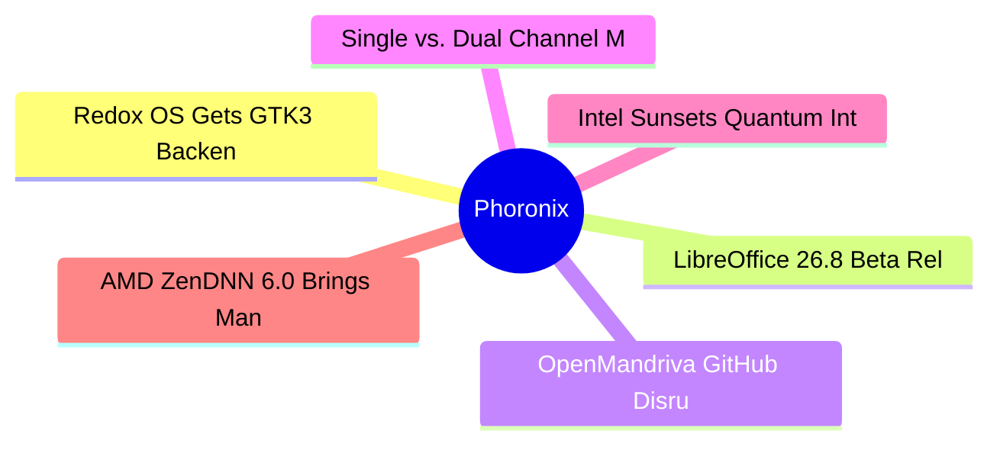

# ⚙️ Phoronix Top 6 (2026-07-10)

## 思维导图

## 列表（6 条，0 条含全文）

### 1. Redox OS Gets GTK3 Backend For Orbital Desktop, Fractional Scaling & USB Gamepads
- **链接**: [https://www.phoronix.com/news/Redox-OS-June-2026](https://www.phoronix.com/news/Redox-OS-June-2026)
- **作者**: Michael Larabel
- **发布**: Wed, 08 Jul 2026 14:30:02 -0400
- **简介**: The open-source, Rust-based Redox OS platform had a very eventful June with many new features implemented and more software ported over to run on this from-scratch operating system...

### 2. LibreOffice 26.8 Beta Released For Improving This Free Software Office Suite
- **链接**: [https://www.phoronix.com/news/LibreOffice-26.8-Beta-1](https://www.phoronix.com/news/LibreOffice-26.8-Beta-1)
- **作者**: Michael Larabel
- **发布**: Wed, 08 Jul 2026 12:27:11 -0400
- **简介**: The Document Foundation today announced the first beta release of the LibreOffice 26.8 open-source office suite set for its stable debut in August...

### 3. OpenMandriva GitHub Disrupted & Nefarious Package Push In Sabotage Attempt
- **链接**: [https://www.phoronix.com/news/OpenMandriva-Disrupted](https://www.phoronix.com/news/OpenMandriva-Disrupted)
- **作者**: Michael Larabel
- **发布**: Wed, 08 Jul 2026 12:05:22 -0400
- **简介**: The OpenMandriva project put out a statement today concerning an attempted distribution sabotage effort. Part of the OpenMandriva GitHub repository was deleted and there was an empty package push made to OpenMandriva's C

### 4. Single vs. Dual Channel Memory Performance With The Intel Core Ultra 7 270K Plus
- **链接**: [https://www.phoronix.com/review/single-dual-memory-linux](https://www.phoronix.com/review/single-dual-memory-linux)
- **作者**: Michael Larabel
- **发布**: Wed, 08 Jul 2026 10:48:06 -0400
- **简介**: Given today's pricing environment around system memory, a Phoronix Premium supporter recently requested some benchmarks to quantify the performance difference from single to dual channel memory. In considering a new comp

### 5. Intel Sunsets Quantum Intrinsics & Other Open-Source Projects This Week
- **链接**: [https://www.phoronix.com/news/Intel-Ends-Quantum-Intrinsics](https://www.phoronix.com/news/Intel-Ends-Quantum-Intrinsics)
- **作者**: Michael Larabel
- **发布**: Wed, 08 Jul 2026 09:37:39 -0400
- **简介**: Intel has formally archived some more of their now-unmaintained open-source projects this week...

### 6. AMD ZenDNN 6.0 Brings Many Improvements For Accelerating Inference On Ryzen/EPYC CPUs
- **链接**: [https://www.phoronix.com/news/AMD-ZenDNN-6.0](https://www.phoronix.com/news/AMD-ZenDNN-6.0)
- **作者**: Michael Larabel
- **发布**: Wed, 08 Jul 2026 09:07:42 -0400
- **简介**: AMD ZenDNN 6.0 released today as a significant update to this open-source deep neural network library for helping to accelerate inferencing on AMD Zen processors from Ryzen to EPYC...
