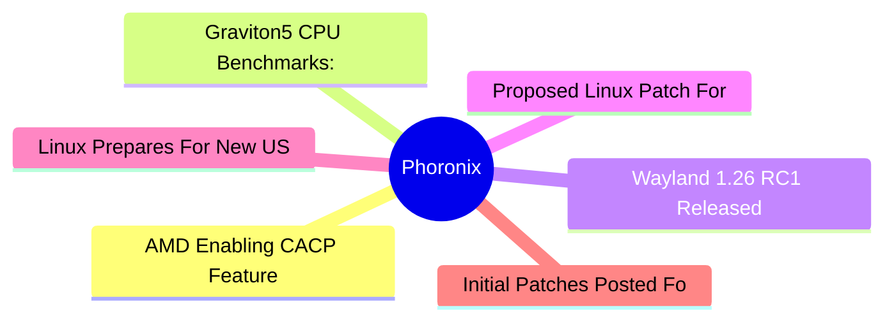

# ⚙️ Phoronix Top 6 (2026-07-14)

## 思维导图

## 列表（6 条，0 条含全文）

### 1. AMD Enabling CACP Feature On Linux For Greater OLED Power Savings
- **链接**: [https://www.phoronix.com/news/AMDGPU-DC-Enabling-CACP](https://www.phoronix.com/news/AMDGPU-DC-Enabling-CACP)
- **作者**: Michael Larabel
- **发布**: Thu, 09 Jul 2026 20:51:44 -0400
- **简介**: Today's batch of AMDGPU Display Code "DC" updates bring a few noteworthy items for benefiting modern hardware under Linux...

### 2. Graviton5 CPU Benchmarks: 30% Geo Mean Improvement Over Graviton4
- **链接**: [https://www.phoronix.com/review/aws-graviton5](https://www.phoronix.com/review/aws-graviton5)
- **作者**: Michael Larabel
- **发布**: Thu, 09 Jul 2026 13:53:00 -0400
- **简介**: After originally announcing Graviton5 last December, recently AWS finally made the M9g and M9gd instances generally available as the first featuring these new in-house ARM server processors for the EC2 cloud. Graviton5 m

### 3. Wayland 1.26 RC1 Released With New Event To Help Ensure Correct Pointer Coordinates
- **链接**: [https://www.phoronix.com/news/Wayland-1.26-RC1](https://www.phoronix.com/news/Wayland-1.26-RC1)
- **作者**: Michael Larabel
- **发布**: Thu, 09 Jul 2026 11:47:43 -0400
- **简介**: In addition to Weston 16 nearing release and its release candidate out today, the Wayland 1.26 release candidate was just issued with a few notable changes on top of the more typical bug fixing...

### 4. Proposed Linux Patch For A Brief Delay To Match PCI Spec Will Hopefully Address Some Bugs
- **链接**: [https://www.phoronix.com/news/Linux-Delay-D3cold-Patch-Fix](https://www.phoronix.com/news/Linux-Delay-D3cold-Patch-Fix)
- **作者**: Michael Larabel
- **发布**: Thu, 09 Jul 2026 09:35:01 -0400
- **简介**: Going back to February there was a bug report around the xHCI controller dieing on resume from s2idle when using an AMD Ryzen AI Max+ "Strix Halo" Framework Desktop. In turn all USB devices behind the xHCI controller are

### 5. Linux Prepares For New USB-C Security Feature On Lenovo ThinkPads
- **链接**: [https://www.phoronix.com/news/ThinkPad-USB-C-Restricted-Mode](https://www.phoronix.com/news/ThinkPad-USB-C-Restricted-Mode)
- **作者**: Michael Larabel
- **发布**: Thu, 09 Jul 2026 09:02:38 -0400
- **简介**: Newer Lenovo ThinkPad systems feature a security feature called USB-C Security Restricted Mode that is in the process of being wired up for reporting under Linux...

### 6. Initial Patches Posted For Booting The Apple M4 On Linux
- **链接**: [https://www.phoronix.com/news/Apple-M4-DT-Linux](https://www.phoronix.com/news/Apple-M4-DT-Linux)
- **作者**: Michael Larabel
- **发布**: Thu, 09 Jul 2026 06:22:02 -0400
- **简介**: With the Linux 7.2 kernel there is initial support for booting the Apple M3 SoC on Linux but it's not yet functional for end users with just booting to a simple console. There are now Device Tree files posted for booting
