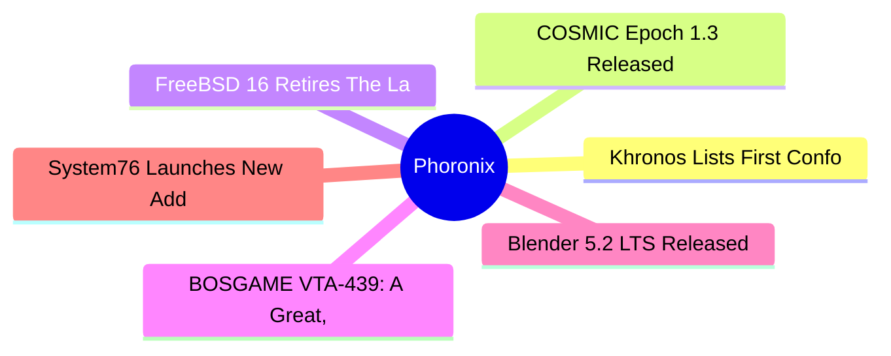

# ⚙️ Phoronix Top 6 (2026-07-15)

## 思维导图

## 列表（6 条，0 条含全文）

### 1. Khronos Lists First Conformant OpenCL 3.1 Implementation: Apple M1/M2 On Asahi Linux With Rusticl
- **链接**: [https://www.phoronix.com/news/OpenCL-3.1-Conformance-Apple](https://www.phoronix.com/news/OpenCL-3.1-Conformance-Apple)
- **作者**: Michael Larabel
- **发布**: Tue, 14 Jul 2026 21:14:32 -0400
- **简介**: Back in May OpenCL 3.1 was announced with a focus on AI and HPC workloads. Just over two months later, this incremental update over OpenCL 3.0 now has its first listed conformant OpenCL 3.1 implementation for passing the

### 2. COSMIC Epoch 1.3 Released With New Frosted Glass Option
- **链接**: [https://www.phoronix.com/news/COSMIC-Epoch-1.3](https://www.phoronix.com/news/COSMIC-Epoch-1.3)
- **作者**: Michael Larabel
- **发布**: Tue, 14 Jul 2026 18:41:01 -0400
- **简介**: For those that were intrigued by the COSMIC desktop's "Frosted Glass" effect, it's now available in released form with today's COSMIC Epoch 1.3 release...

### 3. FreeBSD 16 Retires The Last Of Its GPL Code From Its Base System
- **链接**: [https://www.phoronix.com/news/FreeBSD-16-Goes-GPL-Free](https://www.phoronix.com/news/FreeBSD-16-Goes-GPL-Free)
- **作者**: Michael Larabel
- **发布**: Tue, 14 Jul 2026 15:38:47 -0400
- **简介**: As of this past week in the FreeBSD source tree for FreeBSD 16, the last of the GNU GPL licensed code from the base system has been retired...

### 4. BOSGAME VTA-439: A Great, Linux-Friendly Mini PC Powered By AMD Ryzen AI 9 HX 470
- **链接**: [https://www.phoronix.com/review/bosgame-vta-439](https://www.phoronix.com/review/bosgame-vta-439)
- **作者**: Michael Larabel
- **发布**: Tue, 14 Jul 2026 14:57:06 -0400
- **简介**: For those that were intrigued by the recent launch of the AMD Ryzen AI Halo developer platform with a very capable mini PC but looking for something more affordable and not needing quite as much horsepower or AI focus, B

### 5. Blender 5.2 LTS Released With Many Great Enhancements
- **链接**: [https://www.phoronix.com/news/Blender-5.2-Released](https://www.phoronix.com/news/Blender-5.2-Released)
- **作者**: Michael Larabel
- **发布**: Tue, 14 Jul 2026 12:11:04 -0400
- **简介**: Blender 5.2 is out today as the newest Long Term Support release for this leading, open-source 3D modeling software...

### 6. System76 Launches New Adder Pro Laptop With NVIDIA GPU, 2K OLED & Up To 96GB RAM
- **链接**: [https://www.phoronix.com/news/System76-Adder-Pro-2026](https://www.phoronix.com/news/System76-Adder-Pro-2026)
- **作者**: Michael Larabel
- **发布**: Tue, 14 Jul 2026 11:25:53 -0400
- **简介**: System76 today announced their new Adder Pro laptop that they are promoting as the "gamer's dream machine" with its NVIDIA graphics, 2K OLED 500 nit display, up to 96GB RAM, and 3.37 lb weight...
