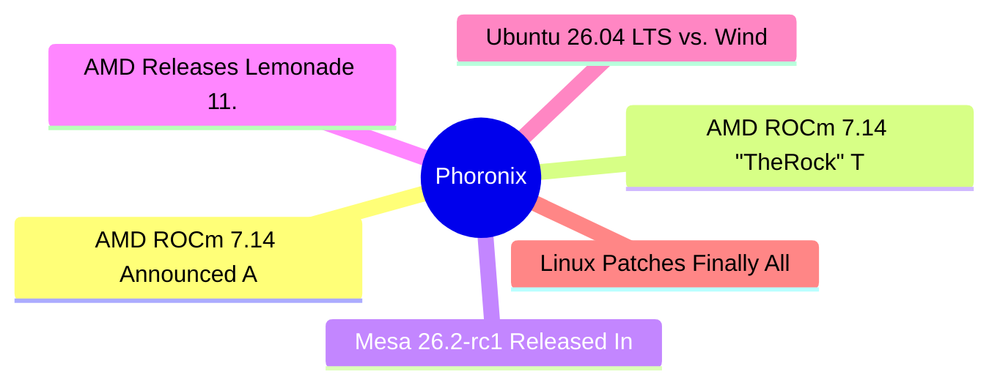

# ⚙️ Phoronix Top 6 (2026-07-16)

## 思维导图

## 列表（6 条，0 条含全文）

### 1. AMD ROCm 7.14 Announced As New Production Release, Ryzen AI 400 Series Support
- **链接**: [https://www.phoronix.com/news/AMD-ROCm-7.14](https://www.phoronix.com/news/AMD-ROCm-7.14)
- **作者**: Michael Larabel
- **发布**: Wed, 15 Jul 2026 22:49:17 -0400
- **简介**: As a follow-up to the article over ROCm 7.14 being tagged, AMD has formally announced the availability of ROCm 7.14 and it's their new production release rather than being a tech preview...

### 2. AMD ROCm 7.14 "TheRock" Tech Preview Tagged For Latest AMD GPU Compute Stack
- **链接**: [https://www.phoronix.com/news/AMD-ROCm-TheRock-7.14](https://www.phoronix.com/news/AMD-ROCm-TheRock-7.14)
- **作者**: Michael Larabel
- **发布**: Wed, 15 Jul 2026 20:21:31 -0400
- **简介**: AMD's software team appears to be busy getting ready for next week's Advancing AI event happening next week in San Francisco. In addition to the release today of the Lemonade 11.0 local AI server, TheRock 7.14 was also t

### 3. Mesa 26.2-rc1 Released In Ending Feature Work For This Quarter's 3D Graphics Stack
- **链接**: [https://www.phoronix.com/news/Mesa-26.2-rc1-Released](https://www.phoronix.com/news/Mesa-26.2-rc1-Released)
- **作者**: Michael Larabel
- **发布**: Wed, 15 Jul 2026 17:10:31 -0400
- **简介**: Mesa 26.2 was branched today from Mesa Git and in turn Mesa 26.3-devel is now open on mainline...

### 4. AMD Releases Lemonade 11.0 Local AI Server With Text-To-Speech, Other New Features
- **链接**: [https://www.phoronix.com/news/AMD-Lemonade-11.0](https://www.phoronix.com/news/AMD-Lemonade-11.0)
- **作者**: Michael Larabel
- **发布**: Wed, 15 Jul 2026 15:51:32 -0400
- **简介**: Ahead of the AMD Advancing AI event next week, today AMD released Lemonade 11.0 as the latest feature release of their local AI server supporting AMD Ryzen CPUs, AMD Radeon GPUs, and AMD Ryzen AI NPU acceleration...

### 5. Ubuntu 26.04 LTS vs. Windows 11 vs. CachyOS Performance On A $5399 Laptop
- **链接**: [https://www.phoronix.com/review/razer-blade18-windows-linux](https://www.phoronix.com/review/razer-blade18-windows-linux)
- **作者**: Michael Larabel
- **发布**: Wed, 15 Jul 2026 12:15:15 -0400
- **简介**: Earlier this month on Phoronix I reviewed the Razer Blade 18 RZ09-0582 as the first laptop Razer is certifying for Linux use via Canonical's hardware certification program for Linux. It offered very nice performance with

### 6. Linux Patches Finally Allow Apple Magic Keyboard/Mouse Battery Monitoring Via Bluetooth
- **链接**: [https://www.phoronix.com/news/Apple-Magic-Bluetooth-Battery](https://www.phoronix.com/news/Apple-Magic-Bluetooth-Battery)
- **作者**: Michael Larabel
- **发布**: Wed, 15 Jul 2026 08:54:47 -0400
- **简介**: Besides the ongoing challenges of enabling newer Apple Silicon SoC support on Linux, Apple peripheral support on Linux remains a mixed bag depending on the product as well. The latest functionality now being addressed is
