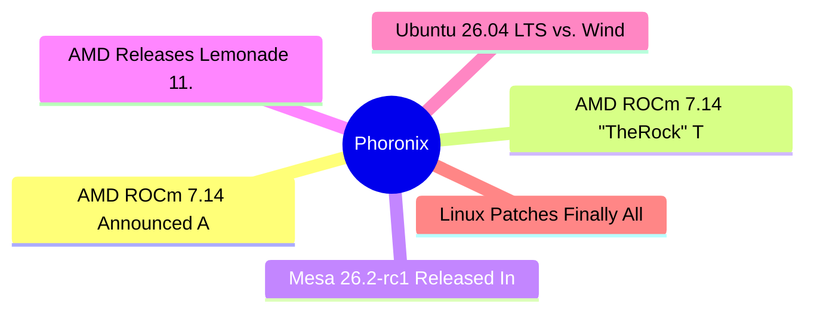

# ⚙️ Phoronix Top 6 (2026-07-17)

## 思维导图

## 列表（6 条，3 条含全文）

### 1. AMD ROCm 7.14 Announced As New Production Release, Ryzen AI 400 Series Support
- **链接**: [https://www.phoronix.com/news/AMD-ROCm-7.14](https://www.phoronix.com/news/AMD-ROCm-7.14)
- **作者**: Michael Larabel
- **发布**: Wed, 15 Jul 2026 22:49:17 -0400
- **简介**: As a follow-up to the article over ROCm 7.14 being tagged, AMD has formally announced the availability of ROCm 7.14 and it's their new production release rather than being a tech preview...

📄 全文（2470 字符，点击展开）

# AMD ROCm 7.14 Announced As New Production Release, Ryzen AI 400 Series Support

[ROCm 7.14 being tagged](https://www.phoronix.com/news/AMD-ROCm-TheRock-7.14), AMD has formally announced the availability of ROCm 7.14 and it's their new production release rather than being a tech preview.

Since ROCm 7.9,

[the 7.9+ releases have served as "tech preview" releases](https://www.phoronix.com/news/ROCm-Core-SDK-7.9)while ROCm 7.0/7.1/7.2 were stable series. Up to now my assumption was that the ROCm 7.9+ tech preview releases would culminate with ROCm 8.0 being stable. Now as quite a surprise, ROCm 7.14 was announced today -- ahead of next week's AMD Advancing AI event -- as the new production release. Quite the version numbering mess.

ROCm 7.14 "

*marks the start of our future production releases. users on 7.2 and older are encouraged to migrate and follow the transition guide on rocm docs*" per the AMD documentation. Beyond the build system overhaul with TheRock, new to ROCm 7.14 is officially adding support for the Ryzen AI 400 series, including the new Ryzen AI Max+ PRO 495 / PRO 490 / PRO 485 products and lower-end Ryzen AI 430/440 series offerings.

ROCm 7.14 also adds official support for RHEL 9.8 and RHEL 10.2, SUSE Linux Enterprise 15 SP7 / SLES 16 / Debian 13 for the Instinct MI350P hardware, and more.

ROCm 7.14 also delivers improved GPU virtualization, AI inference and framework enhancements, and a variety of HIP enhancements for better CUDA parity.

AMD's

[blog post](https://rocm.blogs.amd.com/ecosystems-and-partners/rocm-7.14-blog/README.html)tonight announcing ROCm 7.14 goes on to add:

"ROCm 7.14 represents more than a feature release—it establishes a new foundation for the future of AMD’s AI software platform. With TheRock now serving as ROCm’s production build and release infrastructure, ROCm is now a modular software platform capable of delivering innovation more rapidly while improving software quality and simplifying deployment.

Whether you’re developing on Ryzen AI workstations, scaling distributed training across AMD Instinct clusters, or deploying enterprise AI services in production, ROCm 7.14 provides the tools, performance, and flexibility needed to build the next generation of AI applications. Stay tuned for more updates from Advancing AI Day."

More details on the plethora of ROCm 7.14 changes can be found via the

[release notes](https://rocm.docs.amd.com/en/docs-7.14.0/about/release-notes.html).

### 2. AMD ROCm 7.14 "TheRock" Tech Preview Tagged For Latest AMD GPU Compute Stack
- **链接**: [https://www.phoronix.com/news/AMD-ROCm-TheRock-7.14](https://www.phoronix.com/news/AMD-ROCm-TheRock-7.14)
- **作者**: Michael Larabel
- **发布**: Wed, 15 Jul 2026 20:21:31 -0400
- **简介**: AMD's software team appears to be busy getting ready for next week's Advancing AI event happening next week in San Francisco. In addition to the release today of the Lemonade 11.0 local AI server, TheRock 7.14 was also t

📄 全文（1633 字符，点击展开）

# AMD ROCm 7.14 "TheRock" Tech Preview Tagged For Latest AMD GPU Compute Stack

[Lemonade 11.0 local AI server](https://www.phoronix.com/news/AMD-Lemonade-11.0), TheRock 7.14 was also tagged as the modern build system for ROCm working on the latest tech preview releases of this open-source AMD GPU compute stack.

TheRock 7.14 was tagged today to align for the ROCm 7.14 tech preview stack. No detailed release notes have yet to be published and the

[official documentation](https://rocm.docs.amd.com/en/7.13.0-preview/)continues to point to ROCm 7.13 being the latest tech preview, but in any case TheRock 7.14 was tagged earlier and now available for those interested in making use of the latest AMD GPU compute capabilities.

From what I have been able to dig up, AMD ROCm "TheRock" 7.14 brings AI training enhancements for different data types, a variety of mostly minor performance enhancements but some seeing 10~16% improvements for select AI workloads like Comfy UI, and continuing to improve the Microsoft Windows support for ROCm. There have also been a variety of bug fixes and different enhancements targeting specific Radeon and Instinct hardware.

Hopefully the official release notes / documentation make it out soon but for those eager to try out the latest ROCm tech preview capabilities can find TheRock 7.14 via

[GitHub](https://github.com/ROCm/TheRock/releases/tag/therock-7.14). We'll see what more announcements come next week out of AMD Advancing AI in San Francisco.

**Update:**

[AMD ROCm 7.14 Announced As New Production Release, Ryzen AI 400 Series Support](https://www.phoronix.com/news/AMD-ROCm-7.14)

### 3. Mesa 26.2-rc1 Released In Ending Feature Work For This Quarter's 3D Graphics Stack
- **链接**: [https://www.phoronix.com/news/Mesa-26.2-rc1-Released](https://www.phoronix.com/news/Mesa-26.2-rc1-Released)
- **作者**: Michael Larabel
- **发布**: Wed, 15 Jul 2026 17:10:31 -0400
- **简介**: Mesa 26.2 was branched today from Mesa Git and in turn Mesa 26.3-devel is now open on mainline...

📄 全文（4021 字符，点击展开）

# Mesa 26.2-rc1 Released In Ending Feature Work For This Quarter's 3D Graphics Stack

[Mesa 26.2](https://www.phoronix.com/search/Mesa+26.2)was branched today from Mesa Git and in turn Mesa 26.3-devel is now open on mainline.

Mesa 26.2 is working toward a stable release in August while until then the weekly release candidates have commenced. Mesa 26.2 brings a number of optimizations to the Intel ANV and AMD RADV Vulkan drivers, continued work on Vulkan Video, the KosmicKrisp Vulkan to Apple Metal driver now supports Vulkan 1.4, Rusticl continues providing better OpenCL support, the NVIDIA NVK Vulkan driver continued maturing, the new KRAID compiler was merged for the Arm Mali Panfrost/PanVK drivers, early work on AMD GFX12.1 graphics support, and a variety of new Vulkan extensions were merged. Even the old Radeon R600g and R300g drivers saw a number of fixes during the Mesa 26.2 feature development period.

The Mesa release notes sum up the Mesa 26.2 highlights as:

- cl_khr_subgroup_rotate on radeonsi

- cl_khr_subgroup_rotate on iris

- VK_EXT_shader_uniform_buffer_unsized_array on panvk

- VK_KHR_shader_constant_data on RADV

- VK_EXT_dynamic_rendering_unused_attachments on panvk

- protectedMemory support on RADV/GFX10+ and VEGA10

- VK_KHR_performance_query on RADV/GFX11

- VK_EXT_conservative_rasterization on panvk

- shaderImageGatherExtended on pvr

- static C++ stdlib required on rusticl to workaround applications using their own C++ stdlib

- VK_EXT_pipeline_protected_access on RADV

- VK_EXT_extended_dynamic_state3 on panvk

- GL_ARB_texture_query_lod on panfrost/v9+

- VK_KHR_maintenance11 on RADV

- OpenCL 3.1 support for rusticl on asahi, iris, radeonsi, llvmpipe and zink

- VK_KHR_workgroup_memory_explicit_layout on pvr

- VK_KHR_maintenance5 on pvr

- VK_KHR_calibrated_timestamps on hasvk

- VK_KHR_present_id on pvr

- VK_KHR_present_wait on pvr

- VK_KHR_present_id2 on hasvk

- VK_KHR_present_wait2 on hasvk

- VK_KHR_shader_fma on RADV

- VK_EXT_shader_split_barrier on RADV/GFX12

- VK_KHR_shader_fma on nvk

- Support for G1-Ultra, G1-Premium and G1-Pro GPUs on Panfrost and PanVK

- VK_EXT_shader_atomic_float on nvk

- VK_{KHR,EXT}_index_type_uint8 on pvr

- VK_EXT_debug_marker in vulkan runtime

- VK_EXT_mesh_shader on NVK

- VK_KHR_device_fault on RADV

- VK_EXT_present_timing now also on wsi/x11

- VK_EXT_present_timing on hasvk

- VK_GOOGLE_display_timing for KHR_display (and opt-in for x11, wayland) on anv, hasvk, hk, nvk, panvk, pvr, radv, tu, v3dv

- VK_KHR_shader_abort on RADV

- VK_KHR_shader_fma on panvk

- VK_NV_shader_atomic_float16_vector on NVK

- VK_KHR_compute_shader_derivatives on panvk

- VK_EXT_shader_subgroup_ballot on pvr

- VK_EXT_shader_subgroup_vote on pvr

- VK_KHR_shader_subgroup_rotate on pvr

- VK_KHR_shader_subgroup_uniform_control_flow on pvr

- VK_EXT_subgroup_size_control on pvr

- VK_EXT_rasterization_order_attachment_access on panvk

- VK_ARM_rasterization_order_attachment_access on panvk

- GL_OES_texture_float on etnaviv/HALF_FLOAT

- GL_ARB_texture_float on etnaviv/HALF_FLOAT

- VK_NVX_binary_import on NVK

- VK_EXT_image_sliced_view_of_3d on panvk

- VK_EXT_shader_tile_image on panvk

- VK_KHR_internally_synchronized_queues on panvk

- VK_KHR_workgroup_memory_explicit_layout on panvk

- VK_EXT_device_memory_report on pvr

- VK_EXT_descriptor_heap enabled by default on anv, RADV

- VK_EXT_device_address_binding_report on panvk

- VK_EXT_multisampled_render_to_single_sampled on RADV/Android

- VK_KHR_shader_fma on anv

- VK_KHR_extended_flags on RADV

- VK_EXT_display_surface_counter on pvr

- VK_EXT_display_control on pvr

- VK_EXT_direct_mode_display on pvr

- VK_KHR_surface_maintenance1 on pvr

- VK_EXT_surface_maintenance1 on pvr

- VK_KHR_swapchain_maintenance1 on pvr

- VK_EXT_swapchain_maintenance1 on pvr

- VK_EXT_swapchain_colorspace on pvr

- VK_EXT_acquire_drm_display on pvr

- VK_KHR_unified_image_layouts on pvr

- VK_KHR_shader_quad_control on v3dv

- VK_KHR_s

...（截断，原文 4296+ 字符）

### 4. AMD Releases Lemonade 11.0 Local AI Server With Text-To-Speech, Other New Features
- **链接**: [https://www.phoronix.com/news/AMD-Lemonade-11.0](https://www.phoronix.com/news/AMD-Lemonade-11.0)
- **作者**: Michael Larabel
- **发布**: Wed, 15 Jul 2026 15:51:32 -0400
- **简介**: Ahead of the AMD Advancing AI event next week, today AMD released Lemonade 11.0 as the latest feature release of their local AI server supporting AMD Ryzen CPUs, AMD Radeon GPUs, and AMD Ryzen AI NPU acceleration...

### 5. Ubuntu 26.04 LTS vs. Windows 11 vs. CachyOS Performance On A $5399 Laptop
- **链接**: [https://www.phoronix.com/review/razer-blade18-windows-linux](https://www.phoronix.com/review/razer-blade18-windows-linux)
- **作者**: Michael Larabel
- **发布**: Wed, 15 Jul 2026 12:15:15 -0400
- **简介**: Earlier this month on Phoronix I reviewed the Razer Blade 18 RZ09-0582 as the first laptop Razer is certifying for Linux use via Canonical's hardware certification program for Linux. It offered very nice performance with

### 6. Linux Patches Finally Allow Apple Magic Keyboard/Mouse Battery Monitoring Via Bluetooth
- **链接**: [https://www.phoronix.com/news/Apple-Magic-Bluetooth-Battery](https://www.phoronix.com/news/Apple-Magic-Bluetooth-Battery)
- **作者**: Michael Larabel
- **发布**: Wed, 15 Jul 2026 08:54:47 -0400
- **简介**: Besides the ongoing challenges of enabling newer Apple Silicon SoC support on Linux, Apple peripheral support on Linux remains a mixed bag depending on the product as well. The latest functionality now being addressed is
