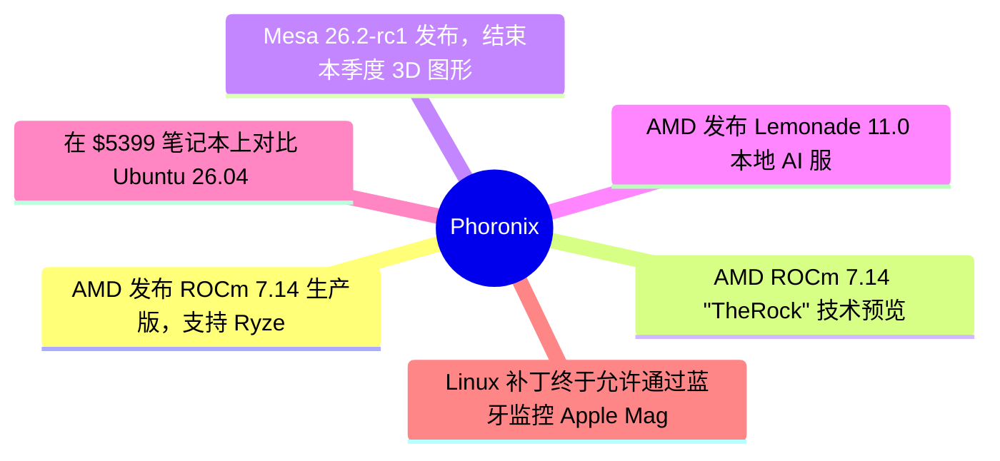
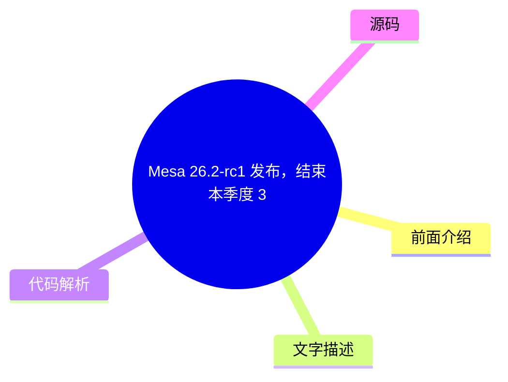

# ⚙️ Phoronix Top 6 (2026-07-18)

## 前面介绍

- 数据源：Phoronix
- 抓取日期：2026-07-18
- 条目数：6
- 含完整正文：6
- 含代码片段：0
- 组织方式：前面介绍 / 树状图 / 文字描述 / 代码解析 / 源码

## 思维导图

## 详细整理（6 条，6 条含全文，0 条含代码）

### 1. AMD 发布 ROCm 7.14 生产版，支持 Ryzen AI 400 系列
- **链接**: [https://www.phoronix.com/news/AMD-ROCm-7.14](https://www.phoronix.com/news/AMD-ROCm-7.14)
- **作者**: Michael Larabel
- **发布**: Wed, 15 Jul 2026 22:49:17 -0400

#### 前面介绍

- AMD 正式发布 ROCm 7.14 生产版本，标志着未来生产发布的开始。
- 新增对 Ryzen AI 400 系列的支持，包括 Ryzen AI Max+ PRO 495/490/485 及低端的 430/440 系列。
- 支持 RHEL 9.8、RHEL 10.2、SLES 15 SP7/SLES 16 和 Debian 13。

#### 树状图

#### 文字描述

- ROCm 7.14 是继 7.9 之后首个作为生产版本发布的版本，取代了之前的预览版本。
- 构建系统已全面升级为 TheRock，旨在提高软件质量和简化部署。
- 增强了 GPU 虚拟化、AI 推理和框架支持，并改进了 HIP 以更好地实现与 CUDA 的兼容性。
- AMD 宣布将于下周的 Advancing AI 活动中提供更多更新。
- 用户被鼓励从 7.2 及更早版本迁移，并遵循官方文档中的迁移指南。

#### 代码解析

- 本文未提供源码，以下为实现思路或结构解析：
- ROCm 7.14 的发布标志着软件栈从预览模式转向生产模式，TheRock 构建系统成为核心基础设施。
- 通过支持新的 Ryzen AI 400 硬件，AMD 正在扩展其 AI 软件平台对本地工作站和企业级集群的覆盖范围。
- HIP 的改进和框架增强旨在降低开发者从 CUDA 迁移到 ROCm 的门槛。

#### 源码

#### 中文节选

# AMD 发布 ROCm 7.14 新生产版本，支持 Ryzen AI 400 系列

[ROCm 7.14 已打标签](https://www.phoronix.com/news/AMD-ROCm-TheRock-7.14)，AMD 正式宣布了 ROCm 7.14 的可用性，这是他们的新生产版本，而非技术预览版。

自 ROCm 7.9 以来，

[7.9 及更高版本一直充当“技术预览”版本](https://www.phoronix.com/news/ROCm-Core-SDK-7.9)，而 ROCm 7.0/7.1/7.2 是稳定系列。到目前为止，我的假设是 ROCm 7.9+ 技术预览版本将以 ROCm 8.0 稳定版告终。现在令人相当意外的是，AMD 今天宣布了 ROCm 7.14——就在下周的 AMD Advancing AI 活动之前——作为新的生产版本。版本号相当混乱。

根据 AMD 文档，ROCm 7.14 “标志着我们未来生产版本的开端。鼓励 7.2 及更早版本的用户迁移并遵循 rocm 文档中的过渡指南”。除了与 TheRock 一起进行的构建系统大修外，ROCm 7.14 的新增功能还包括正式添加对 Ryzen AI 400 系列的支持，包括新的 Ryzen AI Max+ PRO 495 / PRO 490 / PRO 485 产品以及更低价位的 Ryzen AI 430/440 系列产品。

ROCm 7.14 还为 Instinct MI350P 硬件正式添加了对 RHEL 9.8 和 RHEL 10.2、SUSE Linux Enterprise 15 SP7 / SLES 16 / Debian 13 的支持，以及更多支持。

ROCm 7.14 还带来了改进的 GPU 虚拟化、AI 推理和框架增强，以及各种 HIP 增强功能，以更好地实现 CUDA 兼容性。

AMD 今晚发布的[博客文章](https://rocm.blogs.amd.com/ecosystems-and-partners/rocm-7.14-blog/README.html)宣布了 ROCm 7.14，并补充道：

“ROCm 7.14 不仅仅是一个功能版本——它为 AMD AI 软件平台的未来奠定了新的基础。随着 TheRock 现在作为 ROCm 的生产构建和发布基础设施，ROCm 现在是一个模块化软件平台，能够更快速地交付创新，同时提高软件质量并简化部署。”

无论您是在 Ryzen AI 工作站上开发，还是在 AMD Instinct 集群上扩展分布式训练，亦或是在生产环境中部署企业级 AI 服务，ROCm 7.14 都提供了构建下一代 AI 应用所需的工具、性能和灵活性。请关注 Advancing AI Day 的更多更新。

更多关于 ROCm 7.14 变更的详细信息，请参阅

[发布说明](https://rocm.docs.amd.com/en/docs-7.14.0/about/release-notes.html)。

#### 完整正文（中文）

# AMD 发布 ROCm 7.14 新生产版本，支持 Ryzen AI 400 系列

[ROCm 7.14 已打标签](https://www.phoronix.com/news/AMD-ROCm-TheRock-7.14)，AMD 正式宣布了 ROCm 7.14 的可用性，这是他们的新生产版本，而非技术预览版。

自 ROCm 7.9 以来，

[7.9 及更高版本一直充当“技术预览”版本](https://www.phoronix.com/news/ROCm-Core-SDK-7.9)，而 ROCm 7.0/7.1/7.2 是稳定系列。到目前为止，我的假设是 ROCm 7.9+ 技术预览版本将以 ROCm 8.0 稳定版告终。现在令人相当意外的是，AMD 今天宣布了 ROCm 7.14——就在下周的 AMD Advancing AI 活动之前——作为新的生产版本。版本号相当混乱。

根据 AMD 文档，ROCm 7.14 “标志着我们未来生产版本的开端。鼓励 7.2 及更早版本的用户迁移并遵循 rocm 文档中的过渡指南”。除了与 TheRock 一起进行的构建系统大修外，ROCm 7.14 的新增功能还包括正式添加对 Ryzen AI 400 系列的支持，包括新的 Ryzen AI Max+ PRO 495 / PRO 490 / PRO 485 产品以及更低价位的 Ryzen AI 430/440 系列产品。

ROCm 7.14 还为 Instinct MI350P 硬件正式添加了对 RHEL 9.8 和 RHEL 10.2、SUSE Linux Enterprise 15 SP7 / SLES 16 / Debian 13 的支持，以及更多支持。

ROCm 7.14 还带来了改进的 GPU 虚拟化、AI 推理和框架增强，以及各种 HIP 增强功能，以更好地实现 CUDA 兼容性。

AMD 今晚发布的[博客文章](https://rocm.blogs.amd.com/ecosystems-and-partners/rocm-7.14-blog/README.html)宣布了 ROCm 7.14，并补充道：

“ROCm 7.14 不仅仅是一个功能版本——它为 AMD AI 软件平台的未来奠定了新的基础。随着 TheRock 现在作为 ROCm 的生产构建和发布基础设施，ROCm 现在是一个模块化软件平台，能够更快速地交付创新，同时提高软件质量并简化部署。”

无论您是在 Ryzen AI 工作站上开发，还是在 AMD Instinct 集群上扩展分布式训练，亦或是在生产环境中部署企业级 AI 服务，ROCm 7.14 都提供了构建下一代 AI 应用所需的工具、性能和灵活性。请关注 Advancing AI Day 的更多更新。

更多关于 ROCm 7.14 变更的详细信息，请参阅

[发布说明](https://rocm.docs.amd.com/en/docs-7.14.0/about/release-notes.html)。

### 2. AMD ROCm 7.14 "TheRock" 技术预览标签已打上
- **链接**: [https://www.phoronix.com/news/AMD-ROCm-TheRock-7.14](https://www.phoronix.com/news/AMD-ROCm-TheRock-7.14)
- **作者**: Michael Larabel
- **发布**: Wed, 15 Jul 2026 20:21:31 -0400

#### 前面介绍

- AMD 为即将到来的 Advancing AI 事件做准备，发布了 TheRock 7.14 构建系统标签。
- TheRock 7.14 带来了针对不同数据类型的 AI 训练增强。
- 部分 AI 工作负载性能提升 10% 至 16%，并改进了 Windows 支持。

#### 树状图

#### 文字描述

- TheRock 7.14 被标记为 ROCm 最新技术预览栈的现代构建系统。
- 尽管官方文档仍指向 7.13，但 7.14 已在 GitHub 上发布供开发者测试。
- 包含针对特定 Radeon 和 Instinct 硬件的多种 bug 修复和增强功能。
- Comfy UI 等特定 AI 工作负载的性能提升显著。

#### 代码解析

- 本文未提供源码，以下为实现思路或结构解析：
- TheRock 作为构建系统，负责处理 ROCm 的技术预览版本发布流程。
- 通过将电池状态获取操作移至工作队列，解决了在蓝牙上下文中原子操作导致的死锁问题。
- 该构建系统的更新为后续的稳定版本发布奠定了基础。

#### 源码

#### 中文节选

# AMD ROCm 7.14 "TheRock" 技术预览标签已打上，适用于最新的 AMD GPU 计算栈

[Lemonade 11.0 本地 AI 服务器](https://www.phoronix.com/news/AMD-Lemonade-11.0)，TheRock 7.14 也被标记为 ROCm 的工作在最新技术预览版本上的现代构建系统。

TheRock 7.14 今天被打上标签，以与 ROCm 7.14 技术预览栈保持一致。尚未发布详细的发布说明，但

[官方文档](https://rocm.docs.amd.com/en/7.13.0-preview/)继续指向 ROCm 7.13 是最新的技术预览，但无论如何 TheRock 7.14 之前就已经被打上标签，现在可供有兴趣利用最新 AMD GPU 计算能力的人使用。

据我所挖掘到的信息，AMD ROCm "TheRock" 7.14 为不同数据类型带来了 AI 训练增强，各种主要是微小的性能增强，但针对某些 AI 工作负载（如 Comfy UI）的改进幅度可达 10~16%，并继续改进 ROCm 对 Microsoft Windows 的支持。此外，还有各种针对特定 Radeon 和 Instinct 硬件的错误修复和不同增强功能。

希望官方发布说明/文档能尽快发布，但对于急于尝试最新 ROCm 技术预览功能的人，可以通过

[GitHub](https://github.com/ROCm/TheRock/releases/tag/therock-7.14) 找到 TheRock 7.14。我们来看看 AMD Advancing AI 在旧金山下周还会带来什么更多公告。

**更新：**

[AMD ROCm 7.14 宣布为新的生产版本，支持 Ryzen AI 400 系列](https://www.phoronix.com/news/AMD-ROCm-7.14)

#### 完整正文（中文）

# AMD ROCm 7.14 "TheRock" 技术预览标签已打上，适用于最新的 AMD GPU 计算栈

[Lemonade 11.0 本地 AI 服务器](https://www.phoronix.com/news/AMD-Lemonade-11.0)，TheRock 7.14 也被标记为 ROCm 的工作在最新技术预览版本上的现代构建系统。

TheRock 7.14 今天被打上标签，以与 ROCm 7.14 技术预览栈保持一致。尚未发布详细的发布说明，但

[官方文档](https://rocm.docs.amd.com/en/7.13.0-preview/)继续指向 ROCm 7.13 是最新的技术预览，但无论如何 TheRock 7.14 之前就已经被打上标签，现在可供有兴趣利用最新 AMD GPU 计算能力的人使用。

据我所挖掘到的信息，AMD ROCm "TheRock" 7.14 为不同数据类型带来了 AI 训练增强，各种主要是微小的性能增强，但针对某些 AI 工作负载（如 Comfy UI）的改进幅度可达 10~16%，并继续改进 ROCm 对 Microsoft Windows 的支持。此外，还有各种针对特定 Radeon 和 Instinct 硬件的错误修复和不同增强功能。

希望官方发布说明/文档能尽快发布，但对于急于尝试最新 ROCm 技术预览功能的人，可以通过

[GitHub](https://github.com/ROCm/TheRock/releases/tag/therock-7.14) 找到 TheRock 7.14。我们来看看 AMD Advancing AI 在旧金山下周还会带来什么更多公告。

**更新：**

[AMD ROCm 7.14 宣布为新的生产版本，支持 Ryzen AI 400 系列](https://www.phoronix.com/news/AMD-ROCm-7.14)

### 3. Mesa 26.2-rc1 发布，结束本季度 3D 图形栈功能开发
- **链接**: [https://www.phoronix.com/news/Mesa-26.2-rc1-Released](https://www.phoronix.com/news/Mesa-26.2-rc1-Released)
- **作者**: Michael Larabel
- **发布**: Wed, 15 Jul 2026 17:10:31 -0400

#### 前面介绍

- Mesa 26.2 分支已创建，进入候选发布阶段。
- 优化了 Intel ANV 和 AMD RADV Vulkan 驱动。
- 支持 Vulkan 1.4，并增加了大量新的 Vulkan 扩展。

#### 树状图

#### 文字描述

- Mesa 26.2 计划于八月发布稳定版，目前已进入每周候选发布阶段。
- AMD RADV 驱动获得了对受保护内存、性能查询和保守光栅化的支持。
- PanVK 驱动获得了对 Vulkan 1.4、动态状态 3 和网格着色器的支持。
- NVK 驱动继续成熟，支持了更多着色器原子操作和扩展。
- Rusticl 继续改进 OpenCL 支持，并在多个后端上实现了 OpenCL 3.1。
- 旧版 R600g 和 R300g 驱动也获得了一些修复。

#### 代码解析

- 本文未提供源码，以下为实现思路或结构解析：
- Mesa 26.2 的发布标志着本季度 3D 图形栈功能开发的结束，进入稳定发布周期。
- 通过合并新的 KRAID 编译器，增强了 Arm Mali Panfrost/PanVK 驱动的功能。
- 对 Vulkan 扩展的大量支持（如 VK_EXT_mesh_shader）提升了跨平台图形兼容性。
- OpenCL 3.1 的支持确保了 Rusticl 在现代 Linux 发行版中的可用性。

#### 源码

#### 中文节选

# Mesa 26.2-rc1 发布：本季度 3D 图形栈的收尾工作

[Mesa 26.2](https://www.phoronix.com/search/Mesa+26.2)今天从 Mesa Git 分支出来，随之 Mesa 26.3-devel 在主干上开放。

Mesa 26.2 正致力于在八月发布稳定版本，在此期间每周发布候选版本已经开始。Mesa 26.2 为 Intel ANV 和 AMD RADV Vulkan 驱动带来了多项优化，继续推进 Vulkan Video 的工作，KosmicKrisp（Vulkan 到 Apple Metal 的驱动）现在支持 Vulkan 1.4，Rusticl 继续提供更好的 OpenCL 支持，NVIDIA NVK Vulkan 驱动继续成熟，新的 KRAID 编译器已合并用于 Arm Mali Panfrost/PanVK 驱动，AMD GFX12.1 图形支持的前期工作，以及各种新的 Vulkan 扩展被合并。即使在 Mesa 26.2 功能开发期间，旧的 Radeon R600g 和 R300g 驱动也看到了许多修复。

Mesa 发布说明总结了 Mesa 26.2 的亮点：

- radeonsi 上的 cl_khr_subgroup_rotate
- iris 上的 cl_khr_subgroup_rotate
- panvk 上的 VK_EXT_shader_uniform_buffer_unsized_array
- RADV 上的 VK_KHR_shader_constant_data
- panvk 上的 VK_EXT_dynamic_rendering_unused_attachments
- RADV/GFX10+ 和 VEGA10 上的 protectedMemory 支持
- RADV/GFX11 上的 VK_KHR_performance_query
- panvk 上的 VK_EXT_conservative_rasterization
- pvr 上的 shaderImageGatherExtended
- rusticl 上为解决应用程序使用自己的 C++ 标准库而要求的静态 C++ 标准库
- RADV 上的 VK_EXT_pipeline_protected_access
- panvk 上的 VK_EXT_extended_dynamic_state3
- panfrost/v9+ 上的 GL_ARB_texture_query_lod
- RADV 上的 VK_KHR_maintenance11
- asahi、iris、radeonsi、llvmpipe 和 zink 上 rusticl 的 OpenCL 3.1 支持
- pvr 上的 VK_KHR_workgroup_memory_explicit_layout
- pvr 上的 VK_KHR_maintenance5
- hasvk 上的 VK_KHR_calibrated_timestamps
- pvr 上的 VK_KHR_present_id
- pvr 上的 VK_KHR_present_wait
- hasvk 上的 VK_KHR_present_id2
- hasvk 上的 VK_KHR_present_wait2
- RADV 上的 VK_KHR_shader_fma
- RADV/GFX12 上的 VK_EXT_shader_split_barrier
- nvk 上的 VK_KHR_shader_fma
- Panfrost 和 PanVK 上对 G1-Ultra、G1-Premium 和 G1-Pro GPU 的支持
- nvk 上的 VK_EXT_shader_atomic_float

- VK_{KHR,EXT}_index_type_uint8 on pvr

- VK_EXT_debug_marker in vulkan runtime

- VK_EXT_mesh_shader on NVK

- VK_KHR_device_fault on RADV

- VK_EXT_present_timing now also on wsi/x11

- VK_EXT_present_timing on hasvk

- VK_GOOGLE_display_timing for KHR_display (and opt-in for x11, wayland) on anv, hasvk, hk, nvk, panvk, pvr, radv, tu, v3dv

- VK_KHR_shader_abort on RADV

- VK_KHR_shader_fma on panvk

- VK_NV_shader_atomic_float16_vector on NVK

- VK_KHR_compute_shader_derivatives on panvk

- VK_EXT_shader_subgroup_ballot on pvr

- VK_EXT_shader_subgroup_vote on pvr

- VK_KHR_shader_subgroup_rotate on pvr

- VK_KHR_shader_subgroup_uniform_control_flow on pvr

- VK_EXT_subgroup_size_control on pvr

- VK_EXT_rasterization_order_attachment_access on panvk

- VK_ARM_rasterization_order_attachment_access on panvk

- GL

#### 完整正文（中文）

# Mesa 26.2-rc1 发布：本季度 3D 图形栈的收尾工作

[Mesa 26.2](https://www.phoronix.com/search/Mesa+26.2)今天从 Mesa Git 分支出来，随之 Mesa 26.3-devel 在主干上开放。

Mesa 26.2 正致力于在八月发布稳定版本，在此期间每周发布候选版本已经开始。Mesa 26.2 为 Intel ANV 和 AMD RADV Vulkan 驱动带来了多项优化，继续推进 Vulkan Video 的工作，KosmicKrisp（Vulkan 到 Apple Metal 的驱动）现在支持 Vulkan 1.4，Rusticl 继续提供更好的 OpenCL 支持，NVIDIA NVK Vulkan 驱动继续成熟，新的 KRAID 编译器已合并用于 Arm Mali Panfrost/PanVK 驱动，AMD GFX12.1 图形支持的前期工作，以及各种新的 Vulkan 扩展被合并。即使在 Mesa 26.2 功能开发期间，旧的 Radeon R600g 和 R300g 驱动也看到了许多修复。

Mesa 发布说明总结了 Mesa 26.2 的亮点：

- radeonsi 上的 cl_khr_subgroup_rotate
- iris 上的 cl_khr_subgroup_rotate
- panvk 上的 VK_EXT_shader_uniform_buffer_unsized_array
- RADV 上的 VK_KHR_shader_constant_data
- panvk 上的 VK_EXT_dynamic_rendering_unused_attachments
- RADV/GFX10+ 和 VEGA10 上的 protectedMemory 支持
- RADV/GFX11 上的 VK_KHR_performance_query
- panvk 上的 VK_EXT_conservative_rasterization
- pvr 上的 shaderImageGatherExtended
- rusticl 上为解决应用程序使用自己的 C++ 标准库而要求的静态 C++ 标准库
- RADV 上的 VK_EXT_pipeline_protected_access
- panvk 上的 VK_EXT_extended_dynamic_state3
- panfrost/v9+ 上的 GL_ARB_texture_query_lod
- RADV 上的 VK_KHR_maintenance11
- asahi、iris、radeonsi、llvmpipe 和 zink 上 rusticl 的 OpenCL 3.1 支持
- pvr 上的 VK_KHR_workgroup_memory_explicit_layout
- pvr 上的 VK_KHR_maintenance5
- hasvk 上的 VK_KHR_calibrated_timestamps
- pvr 上的 VK_KHR_present_id
- pvr 上的 VK_KHR_present_wait
- hasvk 上的 VK_KHR_present_id2
- hasvk 上的 VK_KHR_present_wait2
- RADV 上的 VK_KHR_shader_fma
- RADV/GFX12 上的 VK_EXT_shader_split_barrier
- nvk 上的 VK_KHR_shader_fma
- Panfrost 和 PanVK 上对 G1-Ultra、G1-Premium 和 G1-Pro GPU 的支持
- nvk 上的 VK_EXT_shader_atomic_float

- pvr 上的 VK_{KHR,EXT}_index_type_uint8

- vulkan 运行时中的 VK_EXT_debug_marker

- NVK 上的 VK_EXT_mesh_shader

- RADV 上的 VK_KHR_device_fault

- wsi/x11 上现在也支持 VK_EXT_present_timing

- hasvk 上的 VK_EXT_present_timing

- anv、hasvk、hk、nvk、panvk、pvr、radv、tu、v3dv 上的 KHR_display（以及 x11、wayland 的可选支持）的 VK_GOOGLE_display_timing

- RADV 上的 VK_KHR_shader_abort

- panvk 上的 VK_KHR_shader_fma

- NVK 上的 VK_NV_shader_atomic_float16_vector

- panvk 上的 VK_KHR_compute_shader_derivatives

- pvr 上的 VK_EXT_shader_subgroup_ballot

- pvr 上的 VK_EXT_shader_subgroup_vote

- pvr 上的 VK_KHR_shader_subgroup_rotate

- pvr 上的 VK_KHR_shader_subgroup_uniform_control_flow

- pvr 上的 VK_EXT_subgroup_size_control

- panvk 上的 VK_EXT_rasterization_order_attachment_access

- panvk 上的 VK_ARM_rasterization_order_attachment_access

- etnaviv/HALF_FLOAT 上的 GL_OES_texture_float

- etnaviv/HALF_FLOAT 上的 GL_ARB_texture_float

- NVK 上的 VK_NVX_binary_import

- panvk 上的 VK_EXT_image_sliced_view_of_3d

- panvk 上的 VK_EXT_shader_tile_image

- panvk 上的 VK_KHR_internally_synchronized_queues

- panvk 上的 VK_KHR_workgroup_memory_explicit_layout

- pvr 上的 VK_EXT_device_memory_report

- anv、RADV 默认启用 VK_EXT_descriptor_heap

- panvk 上的 VK_EXT_device_address_binding_report

- RADV/Android 上的 VK_EXT_multisampled_render_to_single_sampled

- anv 上的 VK_KHR_shader_fma

- RADV 上的 VK_KHR_extended_flags

- pvr 上的 VK_EXT_display_surface_counter

- pvr 上的 VK_EXT_display_control

- pvr 上的 VK_EXT_direct_mode_display

- pvr 上的 VK_KHR_surface_maintenance1

- pvr 上的 VK_EXT_surface_maintenance1

- pvr 上的 VK_KHR_swapchain_maintenance1

- pvr 上的 VK_EXT_swapchain_maintenance1

- pvr 上的 VK_EXT_swapchain_colorspace

- pvr 上的 VK_EXT_acquire_drm_display

- pvr 上的 VK_KHR_unified_image_layouts

- v3dv 上的 VK_KHR_shader_quad_control

- v3dv 上的 VK_KHR_shader_subgroup_rotate

- v3dv 上的 VK_KHR_shader_maximal_reconvergence

- panvk 上的 VK_EXT_shader_image_atomic_int64

通过[邮件列表公告](https://lists.freedesktop.org/archives/mesa-dev/2026-July/226672.html)下载以及关于今天 Mesa 26.2-rc1 发布的简要详情。

### 4. AMD 发布 Lemonade 11.0 本地 AI 服务器，支持语音克隆与 3D 生成
- **链接**: [https://www.phoronix.com/news/AMD-Lemonade-11.0](https://www.phoronix.com/news/AMD-Lemonade-11.0)
- **作者**: Michael Larabel
- **发布**: Wed, 15 Jul 2026 15:51:32 -0400

#### 前面介绍

- Lemonade 11.0 引入了基于 OpenMOSS 的文本转语音 (TTS) 功能。
- 新增 3D 生成模态，支持 Trellis.2 图像转 3D 管道。
- Linux 用户现在可以自动安装 FastFlowLM NPU 后端。

#### 树状图

#### 文字描述

- Lemonade 11.0 是一款完全开源的本地 AI 服务器，支持 AMD 硬件。
- TTS 功能集成了语音克隆和语音设计模型，并拥有专门的 GUI 面板。
- 新增的 3D 生成功能通过 POST /v1/3d/generations 端点提供，并配有模型查看器。
- 支持 ModelScope 作为第二个远程模型注册表，与 Hugging Face 并列。
- FastFlowLM NPU 后端在 Linux 上的安装更加自动化，增加了 prefer_system 配置标志。

#### 代码解析

- 本文未提供源码，以下为实现思路或结构解析：
- Lemonade 11.0 通过扩展 API 端点（如 /v1/3d/generations）和 GUI 面板，增强了本地 AI 应用的交互性。
- OpenMOSS 后端的集成使得高级语音合成功能可以直接在本地硬件上运行。
- 支持多种模型注册表（Hugging Face 和 ModelScope）为开发者提供了更灵活的模型获取方式。
- 自动化的 NPU 后端安装简化了在 Linux 环境下的部署流程。

#### 源码

#### 中文节选

# AMD 发布 Lemonade 11.0 本地 AI 服务器，支持文本转语音及其他新功能

Lemonade 仍然是尝试在 Windows 和 Linux 上的 AMD 硬件上本地加速 AI 潜力的绝佳方式。除了作为一款优秀的 AMD AI 硬件演示工具外，它本身也很有用，因为它完全开源，并支持最新的大型语言模型。

Lemonade 11.0 带来了使用 OpenMOSS 后端的文本转语音 (TTS) 支持，并支持语音克隆和语音设计模型。此 TTS 支持已集成到 Lemonade UI 中。

Lemonade 11.0 还引入了一种新的 3D 生成模态，并配备了应用内模型查看器。对于 Linux 用户来说，Lemonade 11.0 的另一个不错改进是 FastFlowLM NPU 后端现在会在 Linux 上自动安装。

亮点

- 新的 3D 生成模态移植了 Trellis.2 图像转 3D 流水线，公开了 POST /v1/3d/generations 端点以及带有应用内模型查看器的 GUI 3D 面板。
- 文本转语音随 OpenMOSS 后端一同到来，包括语音克隆和语音设计模型，以及 GUI 中专用的 TTS 面板。
- 在 /chat/completions、/completions 或 /responses 上命名 collection.router 模型现在会运行其路由引擎，并通过 x_lemonade_route body 字段和 x-lemonade-route header 报告所选路由。
- ModelScope 现在作为第二个远程模型注册表与 Hugging Face 并列支持，CLI、API 和桌面应用均支持源选择。
- FastFlowLM NPU 后端现在在 Linux 上自动安装，而无需手动系统包安装，并引入了新的 prefer_system 配置标志。

Lemonade 11.0 的下载和更多详细信息请访问

[GitHub](https://github.com/lemonade-sdk/lemonade/releases/tag/v11.0.0)。

#### 完整正文（中文）

# AMD 发布 Lemonade 11.0 本地 AI 服务器，支持文本转语音及其他新功能

Lemonade 仍然是尝试在 Windows 和 Linux 上的 AMD 硬件上本地加速 AI 潜力的绝佳方式。除了作为一款优秀的 AMD AI 硬件演示工具外，它本身也很有用，因为它完全开源，并支持最新的大型语言模型。

Lemonade 11.0 带来了使用 OpenMOSS 后端的文本转语音 (TTS) 支持，并支持语音克隆和语音设计模型。此 TTS 支持已集成到 Lemonade UI 中。

Lemonade 11.0 还引入了一种新的 3D 生成模态，并配备了应用内模型查看器。对于 Linux 用户来说，Lemonade 11.0 的另一个不错改进是 FastFlowLM NPU 后端现在会在 Linux 上自动安装。

亮点

- 新的 3D 生成模态移植了 Trellis.2 图像转 3D 流水线，公开了 POST /v1/3d/generations 端点以及带有应用内模型查看器的 GUI 3D 面板。
- 文本转语音随 OpenMOSS 后端一同到来，包括语音克隆和语音设计模型，以及 GUI 中专用的 TTS 面板。
- 在 /chat/completions、/completions 或 /responses 上命名 collection.router 模型现在会运行其路由引擎，并通过 x_lemonade_route body 字段和 x-lemonade-route header 报告所选路由。
- ModelScope 现在作为第二个远程模型注册表与 Hugging Face 并列支持，CLI、API 和桌面应用均支持源选择。
- FastFlowLM NPU 后端现在在 Linux 上自动安装，而无需手动系统包安装，并引入了新的 prefer_system 配置标志。

Lemonade 11.0 的下载和更多详细信息请访问

[GitHub](https://github.com/lemonade-sdk/lemonade/releases/tag/v11.0.0)。

### 5. 在 $5399 笔记本上对比 Ubuntu 26.04 LTS、Windows 11 和 CachyOS 性能
- **链接**: [https://www.phoronix.com/review/razer-blade18-windows-linux](https://www.phoronix.com/review/razer-blade18-windows-linux)
- **作者**: Michael Larabel
- **发布**: Wed, 15 Jul 2026 12:15:15 -0400

#### 前面介绍

- 测试对象为 Razer Blade 18 笔记本，配置了 Intel Core Ultra 9 290HX 和 RTX 5090。
- 对比了 Ubuntu 26.04 LTS、Windows 11 和滚动发行版 CachyOS 的性能。
- 所有测试均使用官方 NVIDIA 驱动程序。

#### 树状图

#### 文字描述

- Razer Blade 18 是 Razer 首款通过 Canonical 认证的 Linux 笔记本。
- CachyOS 使用了较新的 Linux 7.1 内核和 GCC 16.1.1。
- Windows 11 和 Ubuntu 26.04 LTS 使用的是 NVIDIA R595 驱动。
- CachyOS 使用了更新的 NVIDIA R610 驱动。
- 文章提供了详细的基准测试对比数据。

#### 代码解析

- 本文未提供源码，以下为实现思路或结构解析：
- 性能对比测试展示了不同 Linux 发行版在相同硬件配置下的差异，特别是内核版本和驱动版本的影响。
- CachyOS 作为滚动发行版，利用了最新的内核和编译器，可能在某些场景下表现更优。
- 官方驱动程序的使用确保了测试结果的公平性，排除了 Nouveau 驱动的干扰。
- 硬件认证程序为 Linux 用户提供了更多选择，特别是针对高端工作站级笔记本。

#### 源码

#### 中文节选

# Ubuntu 26.04 LTS 与 Windows 11 及 CachyOS 在 5399 美元笔记本电脑上的性能对比

上个月，我在 Phoronix 上评测了 Razer Blade 18 RZ09-0582，作为 [Razer 首款通过 Canonical Linux 硬件认证计划认证的笔记本电脑](https://www.phoronix.com/review/razer-blade-18-linux)。它配备了 Intel Core Ultra 9 290HX Plus 和 NVIDIA GeForce RTX 5090 显卡，提供了非常出色的性能，尽管配置价格为 5399 美元。该评测包含了 Ubuntu 26.04 LTS 的基准测试，但对于那些想知道 Ubuntu 与 Windows 11 在这款游戏/AI 开发笔记本电脑上的性能对比的人，这里提供了对比基准测试，同时也加入了滚动发布版 CachyOS 发行版。

本文包含的基准测试对比了 Razer 出厂配置的 Microsoft Windows 11 与默认的 Ubuntu 26.04 LTS 环境（使用 Linux 7.0 内核和其他默认软件组件）。最后，在同一台笔记本电脑上还测试了专注于性能的基于 Arch Linux 的 CachyOS 发行版，以查看这款笔记本电脑上更前沿的 Linux 性能表现。

考虑到使用的是 NVIDIA GeForce RTX 5090 显卡，所有测试均使用了各发行版仓库中提供的官方 NVIDIA Windows/Linux 驱动程序。没有进行 Nouveau 对比，但对于那些对 GeForce RTX 5090 笔记本 GPU 性能感兴趣的人来说，将会有单独的 NVIDIA 与 Nouveau 对比。

截至上周，滚动发布的 CachyOS 使用的是 Linux 7.1 内核、GCC 16.1.1，并且已经使用了 NVIDIA R610 驱动程序，而 Windows 11 和 Ubuntu 26.04 则使用的是 R595。

#### 完整正文（中文）

# Ubuntu 26.04 LTS 与 Windows 11 及 CachyOS 在 5399 美元笔记本电脑上的性能对比

上个月，我在 Phoronix 上评测了 Razer Blade 18 RZ09-0582，作为 [Razer 首款通过 Canonical Linux 硬件认证计划认证的笔记本电脑](https://www.phoronix.com/review/razer-blade-18-linux)。它配备了 Intel Core Ultra 9 290HX Plus 和 NVIDIA GeForce RTX 5090 显卡，提供了非常出色的性能，尽管配置价格为 5399 美元。该评测包含了 Ubuntu 26.04 LTS 的基准测试，但对于那些想知道 Ubuntu 与 Windows 11 在这款游戏/AI 开发笔记本电脑上的性能对比的人，这里提供了对比基准测试，同时也加入了滚动发布版 CachyOS 发行版。

本文包含的基准测试对比了 Razer 出厂配置的 Microsoft Windows 11 与默认的 Ubuntu 26.04 LTS 环境（使用 Linux 7.0 内核和其他默认软件组件）。最后，在同一台笔记本电脑上还测试了专注于性能的基于 Arch Linux 的 CachyOS 发行版，以查看这款笔记本电脑上更前沿的 Linux 性能表现。

考虑到使用的是 NVIDIA GeForce RTX 5090 显卡，所有测试均使用了各发行版仓库中提供的官方 NVIDIA Windows/Linux 驱动程序。没有进行 Nouveau 对比，但对于那些对 GeForce RTX 5090 笔记本 GPU 性能感兴趣的人来说，将会有单独的 NVIDIA 与 Nouveau 对比。

截至上周，滚动发布的 CachyOS 使用的是 Linux 7.1 内核、GCC 16.1.1，并且已经使用了 NVIDIA R610 驱动程序，而 Windows 11 和 Ubuntu 26.04 则使用的是 R595。

### 6. Linux 补丁终于允许通过蓝牙监控 Apple Magic 键盘/鼠标电量
- **链接**: [https://www.phoronix.com/news/Apple-Magic-Bluetooth-Battery](https://www.phoronix.com/news/Apple-Magic-Bluetooth-Battery)
- **作者**: Michael Larabel
- **发布**: Wed, 15 Jul 2026 08:54:47 -0400

#### 前面介绍

- 解决了 Apple Magic Mouse 和 Magic Keyboard 在蓝牙连接下电量显示为 0% 的问题。
- 通过将电池状态获取操作移至工作队列，解决了原子上下文中的死锁问题。
- 补丁已提交审核，有望进入 Linux 主线内核。

#### 树状图

#### 文字描述

- Linux 之前已支持 Apple 外设的输入功能，但电量报告仅限 USB 连接。
- 开源开发者 Alec Hall 发布了一组补丁来修复蓝牙电量报告功能。
- 补丁通过将获取操作移至工作队列，解决了在蓝牙上下文中原子操作导致的死锁。
- 补丁还教会了 hid-magicmouse 驱动从设备状态字节报告充电状态。
- 补丁已在 Magic Keyboard 2021 和 Magic Trackpad 2 上通过 BlueZ (uhid) 测试。

#### 代码解析

- 本文未提供源码，以下为实现思路或结构解析：
- 该补丁解决了 HID 设备在蓝牙传输层进行状态查询时的上下文冲突问题。
- 通过将 GET_REPORT 操作从原子回调移至工作队列，确保了系统在获取电池状态时的稳定性。
- 对设备状态字节位的解释修复了电量显示逻辑，使其能正确反映充电状态。
- 此改进将显著提升使用 Apple 无线外设的 Linux 用户体验。

#### 源码

#### 中文节选

# Linux 补丁终于允许通过蓝牙监控 Apple Magic Keyboard/鼠标电池

[在 Linux 上启用对更新款 Apple Silicon SoC 的支持](https://www.phoronix.com/news/Linux-DT-Apple-M3-Pro-Max-Ultra)，Linux 上的 Apple 外设支持情况好坏参半，具体取决于产品。目前正在解决的新功能是让 Apple Magic Mouse 和 Magic Keyboard 在通过蓝牙连接时能够正常报告电池电量。

Linux 已经将

[Magic Mouse](https://www.phoronix.com/search/Magic+Mouse)和

[Magic Keyboard](https://www.phoronix.com/search/Magic+Keyboard)作为输入设备支持，但其中一个限制是电池报告仅在通过 USB 连接时有效……这并不是很实用，因为通过蓝牙无线连接时电池电量才更加重要。当前的 Linux 内核版本会通过蓝牙报告 Apple 设备的电池电量为 0%，这显然毫无帮助。

开源开发者 Alec Hall 发布了一套补丁，以使 Apple Magic Keyboard 和 Magic Mouse 2、Magic Trackpad 2 的蓝牙电池报告功能正常工作。Alec 在

[补丁系列](https://lore.kernel.org/lkml/20260714101235.99447-1-signshop.alec@gmail.com/)中解释了该补丁系列解决了这一显著缺陷：

“Apple 的 Magic Keyboard 和 Magic Trackpad 2 / Magic Mouse 2 会向主机报告其电池电量，但内核仅通过 USB 暴露该信息；通过蓝牙时，power_supply 一直卡在 0%，尽管这些设备几乎一直是通过蓝牙使用的。两个驱动程序都已经获取了电池电量（对输入报告 0x90 执行 GET_REPORT），但仅通过 USB。在蓝牙上 naive（简单）地启用该功能会导致机器死锁：该获取操作运行在一个定时器回调（原子上下文）中，而 uhid 传输在 hid_hw_request() 内部睡眠。因此，每个驱动程序的补丁都会在通过蓝牙启用该功能之前，将该获取操作移至工作队列。最后一个补丁教导 hid-magicmouse 从设备的状态字节报告充电状态。”

补丁 3 解释了一个通过经验确定的供应商状态字节位含义；如果审查人员更喜欢，我可以将其重写为报告描述符修复，暴露 HID_BAT_CHARGING。

在 Magic Keyboard 2021 和 Magic Trackpad 2 上通过 BlueZ (uhid) 进行了测试。"

这些补丁目前正在审查中，希望能让这些 hid-magicmouse 和 hid-apple 驱动改进进入主线 Linux 内核。

#### 完整正文（中文）

# Linux 补丁终于允许通过蓝牙监控 Apple Magic Keyboard/鼠标电池

[在 Linux 上启用对更新款 Apple Silicon SoC 的支持](https://www.phoronix.com/news/Linux-DT-Apple-M3-Pro-Max-Ultra)，Linux 上的 Apple 外设支持情况好坏参半，具体取决于产品。目前正在解决的新功能是让 Apple Magic Mouse 和 Magic Keyboard 在通过蓝牙连接时能够正常报告电池电量。

Linux 已经将

[Magic Mouse](https://www.phoronix.com/search/Magic+Mouse)和

[Magic Keyboard](https://www.phoronix.com/search/Magic+Keyboard)作为输入设备支持，但其中一个限制是电池报告仅在通过 USB 连接时有效……这并不是很实用，因为通过蓝牙无线连接时电池电量才更加重要。当前的 Linux 内核版本会通过蓝牙报告 Apple 设备的电池电量为 0%，这显然毫无帮助。

开源开发者 Alec Hall 发布了一套补丁，以使 Apple Magic Keyboard 和 Magic Mouse 2、Magic Trackpad 2 的蓝牙电池报告功能正常工作。Alec 在

[补丁系列](https://lore.kernel.org/lkml/20260714101235.99447-1-signshop.alec@gmail.com/)中解释了该补丁系列解决了这一显著缺陷：

“Apple 的 Magic Keyboard 和 Magic Trackpad 2 / Magic Mouse 2 会向主机报告其电池电量，但内核仅通过 USB 暴露该信息；通过蓝牙时，power_supply 一直卡在 0%，尽管这些设备几乎一直是通过蓝牙使用的。两个驱动程序都已经获取了电池电量（对输入报告 0x90 执行 GET_REPORT），但仅通过 USB。在蓝牙上 naive（简单）地启用该功能会导致机器死锁：该获取操作运行在一个定时器回调（原子上下文）中，而 uhid 传输在 hid_hw_request() 内部睡眠。因此，每个驱动程序的补丁都会在通过蓝牙启用该功能之前，将该获取操作移至工作队列。最后一个补丁教导 hid-magicmouse 从设备的状态字节报告充电状态。”

补丁 3 解释了一个通过经验确定的供应商状态字节位含义；如果审查人员更喜欢，我可以将其重写为报告描述符修复，暴露 HID_BAT_CHARGING。

在 Magic Keyboard 2021 和 Magic Trackpad 2 上通过 BlueZ (uhid) 进行了测试。"

这些补丁目前正在审查中，希望能让这些 hid-magicmouse 和 hid-apple 驱动改进进入主线 Linux 内核。

