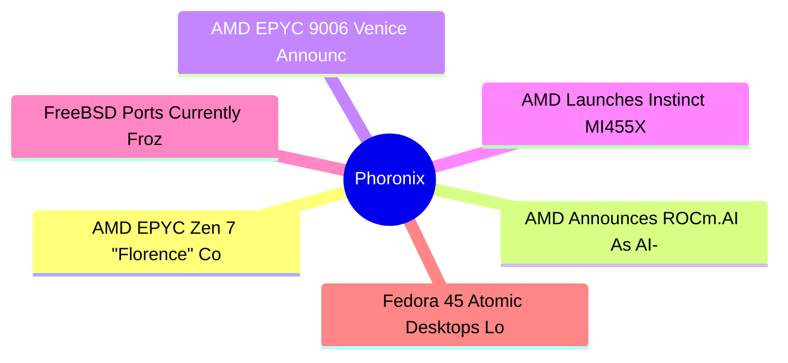
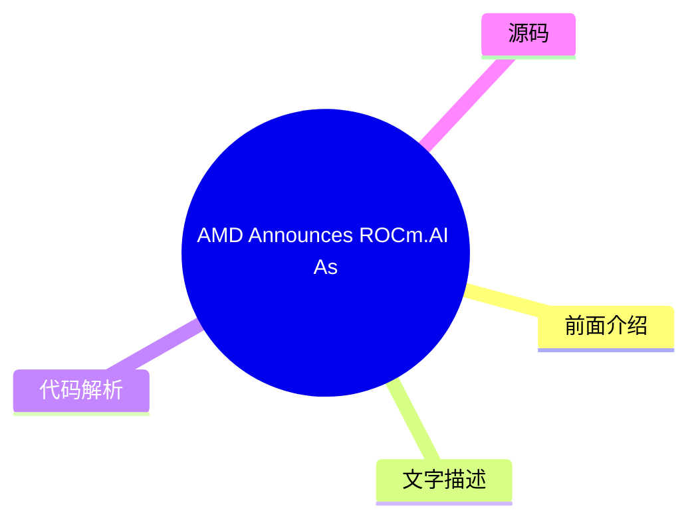
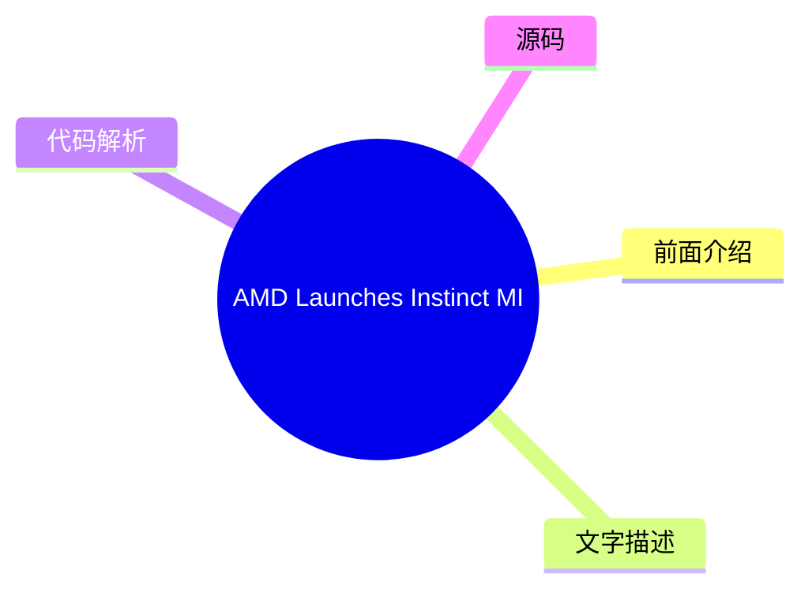
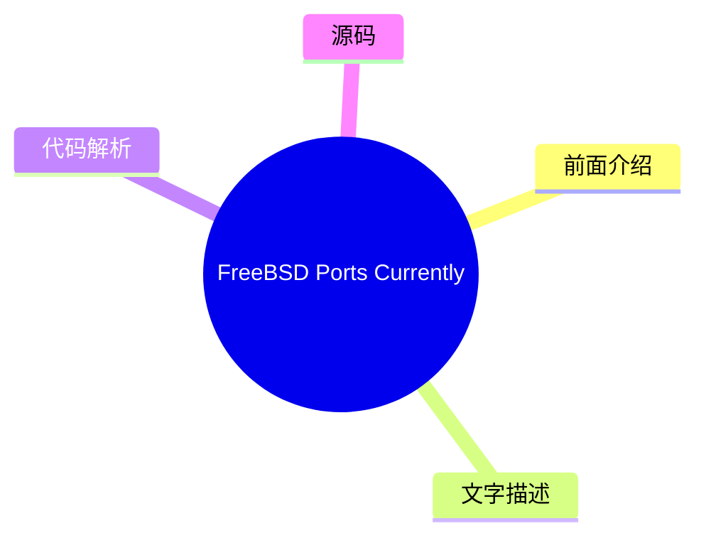
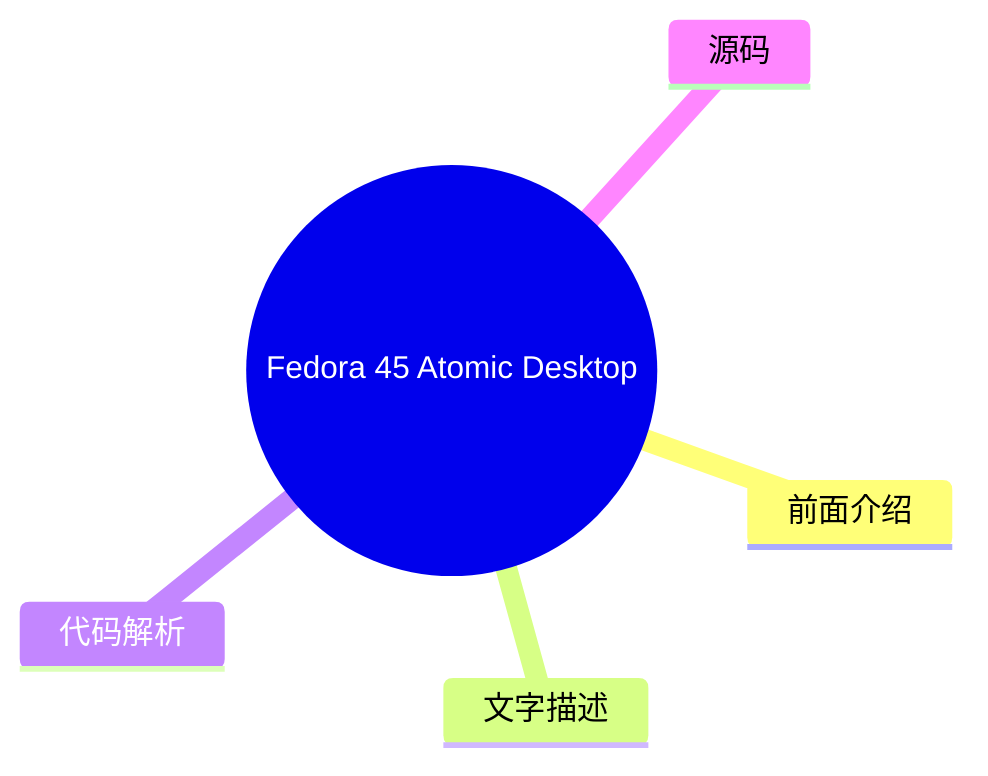

# ⚙️ Phoronix Top 6 (2026-07-27)

## 前面介绍

- 数据源：Phoronix
- 抓取日期：2026-07-27
- 条目数：6
- 含完整正文：6
- 含代码片段：0
- 组织方式：前面介绍 / 树状图 / 文字描述 / 代码解析 / 源码

## 思维导图

## 详细整理（6 条，6 条含全文，0 条含代码）

### 1. AMD EPYC Zen 7 "Florence" Confirmed With ACE, Next-Gen Memory
- **链接**: [https://www.phoronix.com/news/AMD-EPYC-Zen-7-Florence-Zen-8](https://www.phoronix.com/news/AMD-EPYC-Zen-7-Florence-Zen-8)
- **作者**: Michael Larabel
- **发布**: Thu, 23 Jul 2026 15:16:29 -0400

#### 前面介绍

- After announcing the AMD EPYC 9006 "Venice" processors today at AMD Advancing AI 2026, Lisa Su ended her keynote by confirming EPYC Zen 7 "Florence" details as well as EPYC Zen 8 "Ravenna" being in development...
- 作者：Michael Larabel
- 发布时间：Thu, 23 Jul 2026 15:16:29 -0400

#### 树状图

#### 文字描述

- # AMD EPYC Zen 7 "Florence" Confirmed With ACE, Next-Gen Memory [announcing the AMD EPYC 9006 "Venice" processors](https://www.phoronix.com/review/amd-epyc-9006-venice)today at AMD Advancing AI 2026, Lisa Su ended her keynote by confirming EPYC Zen 7 "Florence" details as well as EPYC Zen 8 "Ravenna" being in development. Lisa confirmed that AMD EPYC Zen 7 "Florence" will featu

#### 代码解析

- 本文未检测到明确代码块，内容更偏新闻、观点或方法论。

#### 源码

#### 中文节选

# AMD EPYC Zen 7 "Florence" Confirmed With ACE, Next-Gen Memory

[announcing the AMD EPYC 9006 "Venice" processors](https://www.phoronix.com/review/amd-epyc-9006-venice)today at AMD Advancing AI 2026, Lisa Su ended her keynote by confirming EPYC Zen 7 "Florence" details as well as EPYC Zen 8 "Ravenna" being in development.

Lisa confirmed that AMD EPYC Zen 7 "Florence" will feature a next-gen process node, ACE AI compute extensions, and next-gen memory with the latest MRDIMM and LPDDR tech.

Not too surprising of a disclosure but expected. The ACE extensions are the fruit of the x86 Advisory Working Group between AMD and Intel. AMD engineers have already been

[working on ACE compiler patches for GCC](https://www.phoronix.com/news/GCC-AVX10-V2-AUX-Patches)and was assumed it's for Zen 7 cores. Now it's confirmed that 7th Gen EPYC will indeed bring ACE for bettering the EPYC capabilities in AI software and as the successor to Intel's Advanced Matrix Extensions (AMX).

Lisa also confirmed that EPYC Zen 8 "Ravenna" is in development.

Lisa also shared next-gen Helios is AMD Helios 500 with EPYC Verano and Instinct MI500 series and AMD Pensando Como and Monza networking. AMD EPYC Helios 600 after that will be AMD EPYC Ferrara with Instinct MI600 series and AMD Pensando Palma and Levanza.

#### 完整正文（中文）

# AMD EPYC Zen 7 "Florence" 确认配备 ACE 和下一代内存

[今天在 AMD Advancing AI 2026 上宣布 AMD EPYC 9006 "Venice" 处理器](https://www.phoronix.com/review/amd-epyc-9006-venice)时，苏姿丰在结束主题演讲时确认了 EPYC Zen 7 "Florence" 的细节，以及 EPYC Zen 8 "Ravenna" 正在开发中。

苏姿丰确认，AMD EPYC Zen 7 "Florence" 将采用下一代工艺节点、ACE AI 计算扩展以及配备最新 MRDIMM 和 LPDDR 技术的下一代内存。

披露的内容并不太令人惊讶，但也在意料之中。ACE 扩展是 AMD 和英特尔之间 x86 咨询工作组合作的成果。AMD 工程师此前已经一直在

[为 GCC 开发 ACE 编译器补丁](https://www.phoronix.com/news/GCC-AVX10-V2-AUX-Patches)，并假设这是用于 Zen 7 核心的。现在确认第 7 代 EPYC 确实将带来 ACE，以增强 EPYC 在 AI 软件中的能力，并作为英特尔高级矩阵扩展（AMX）的继任者。

苏姿丰还确认 EPYC Zen 8 "Ravenna" 正在开发中。

苏姿丰还分享了下一代 Helios，即 AMD Helios 500，包含 EPYC Verano 和 Instinct MI500 系列，以及 AMD Pensando Como 和 Monza 网络产品。随后的 AMD EPYC Helios 600 将是配备 Instinct MI600 系列和 AMD Pensando Palma、Levanza 网络产品的 AMD EPYC Ferrara。

### 2. AMD Announces ROCm.AI As AI-Driven Platform For Developers
- **链接**: [https://www.phoronix.com/news/AMD-ROCm-AI](https://www.phoronix.com/news/AMD-ROCm-AI)
- **作者**: Michael Larabel
- **发布**: Thu, 23 Jul 2026 13:45:00 -0400

#### 前面介绍

- In addition to Instinct MI455X and Helios launching along with the new AMD EPYC 9006 "Venice" processors, AMD used their annual Advancing AI day to announce ROCm.AI as an AI-driven platform for developers...
- 作者：Michael Larabel
- 发布时间：Thu, 23 Jul 2026 13:45:00 -0400

#### 树状图

#### 文字描述

- # AMD Announces ROCm.AI As AI-Driven Platform For Developers [Instinct MI455X and Helios](https://www.phoronix.com/news/AMD-Instinct-MI455X-Helios)launching along with the new [AMD EPYC 9006 "Venice" processors](https://www.phoronix.com/review/amd-epyc-9006-venice), AMD used their annual Advancing AI day to announce ROCm.AI as an AI-driven platform for developers. Following the

#### 代码解析

- 本文未检测到明确代码块，内容更偏新闻、观点或方法论。

#### 源码

#### 中文节选

# AMD Announces ROCm.AI As AI-Driven Platform For Developers

[Instinct MI455X and Helios](https://www.phoronix.com/news/AMD-Instinct-MI455X-Helios)launching along with the new

[AMD EPYC 9006 "Venice" processors](https://www.phoronix.com/review/amd-epyc-9006-venice), AMD used their annual Advancing AI day to announce ROCm.AI as an AI-driven platform for developers.

Following the recent

[ROCm 7.14](https://www.phoronix.com/search/ROCm+7.14)release, ROCm.AI will be part of the next release in August for leveraging AI to help developers adapt their code for in turn running on ROCm.

ROCm.AI provides skills for popular agents like Claude, Codex, Cursor, and Gemini to help them become "ROCm superusers" to provide AI-assisted optimizations for adapting or improving codebases around ROCm and is capable of end-to-end AI workload optimizations with its new Hyperloom component. Hyperloom aims to automate the optimization of end-to-end inference workloads and helps with analyzing, kernel optimizations, and validation in a much shorter time than would take with the effort manually.

ROCm.AI leverages AI-powered optimizations for compute kernels, memory management, parallelization, and scheduling for enhancing both AI inference and training performance.

ROCm.AI in theory sounds fantastic: using AI to help adapt your software for AMD's AI stack. In practice it will be interesting to see how well it works across diverse codebases. AMD's claims are that ROCm.ui delivers an average of 3.3x inference improvement and 2.4x training improvement -- though that's compared to ROCm 7.0 as a baseline.

Those are the light details for now but we look forward to learning more about ROCm.AI in its next release due out in August.

#### 完整正文（中文）

# AMD Announces ROCm.AI As AI-Driven Platform For Developers

[Instinct MI455X and Helios](https://www.phoronix.com/news/AMD-Instinct-MI455X-Helios)launching along with the new

[AMD EPYC 9006 "Venice" processors](https://www.phoronix.com/review/amd-epyc-9006-venice), AMD used their annual Advancing AI day to announce ROCm.AI as an AI-driven platform for developers.

Following the recent

[ROCm 7.14](https://www.phoronix.com/search/ROCm+7.14)release, ROCm.AI will be part of the next release in August for leveraging AI to help developers adapt their code for in turn running on ROCm.

ROCm.AI provides skills for popular agents like Claude, Codex, Cursor, and Gemini to help them become "ROCm superusers" to provide AI-assisted optimizations for adapting or improving codebases around ROCm and is capable of end-to-end AI workload optimizations with its new Hyperloom component. Hyperloom aims to automate the optimization of end-to-end inference workloads and helps with analyzing, kernel optimizations, and validation in a much shorter time than would take with the effort manually.

ROCm.AI leverages AI-powered optimizations for compute kernels, memory management, parallelization, and scheduling for enhancing both AI inference and training performance.

ROCm.AI in theory sounds fantastic: using AI to help adapt your software for AMD's AI stack. In practice it will be interesting to see how well it works across diverse codebases. AMD's claims are that ROCm.ui delivers an average of 3.3x inference improvement and 2.4x training improvement -- though that's compared to ROCm 7.0 as a baseline.

Those are the light details for now but we look forward to learning more about ROCm.AI in its next release due out in August.

### 3. AMD EPYC 9006 Venice Announced & Looks Poised To Be A Grand Slam
- **链接**: [https://www.phoronix.com/review/amd-epyc-9006-venice](https://www.phoronix.com/review/amd-epyc-9006-venice)
- **作者**: Michael Larabel
- **发布**: Thu, 23 Jul 2026 13:20:00 -0400

#### 前面介绍

- While AMD EPYC 9005 "Turin" launched just under two years ago, it has aged remarkably well. It is one of the few CPU generations in my past 22 years of Linux hardware reviews/benchmarking that has still captivated me two years on in finding still typ
- 作者：Michael Larabel
- 发布时间：Thu, 23 Jul 2026 13:20:00 -0400

#### 树状图

#### 文字描述

- # AMD EPYC 9006 Venice Announced & Looks Poised To Be A Grand Slam While AMD [EPYC 9005](https://www.phoronix.com/search/EPYC+9005) "Turin" launched just under two years ago, it has aged remarkably well. It is one of the few CPU generations in my past 22 years of Linux hardware reviews/benchmarking that has still captivated me two years on in finding still typically industry-le

#### 代码解析

- 本文未检测到明确代码块，内容更偏新闻、观点或方法论。

#### 源码

#### 中文节选

# AMD EPYC 9006 Venice Announced & Looks Poised To Be A Grand Slam

While AMD [EPYC 9005](https://www.phoronix.com/search/EPYC+9005) "Turin" launched just under two years ago, it has aged remarkably well. It is one of the few CPU generations in my past 22 years of Linux hardware reviews/benchmarking that has still captivated me two years on in finding still typically industry-leading performance across varying workloads, exceptional reliability, and all around a very robust platform. Today though at AMD Advancing AI 2026, Lisa Su formally announced EPYC 9006 "Venice" for taking their server offerings to the next level in the agentic AI era.

Part of what made AMD EPYC 9005 rather timeless is that it has performed incredibly well against the competition.  Even for more recent CPUs like [NVIDIA Vera](https://www.phoronix.com/review/nvidia-vera-benchmarks) or [EPYC Turin outperforming Amazon's new Graviton5](https://www.phoronix.com/review/graviton5-epyc-xeon), Turin has aged superb. Yet here we are with EPYC Venice in production.

Against Intel Xeon 6 Granite Rapids, the advantage with Intel has been MRDIMMs for [greater memory bandwidth in memory intensive workloads over DDR5-6400 (albeit with greater power and cost)](https://www.phoronix.com/review/ddr5-6400-mrdimm-8800) or workloads prepared to make use of [Advanced Matrix Extensions](https://www.phoronix.com/search/Advanced+Matrix+Extensions) (AMX). With EPYC Venice, AMD is now supporting Gen2 MRDIMM-12800 memory as well as DDR5-8000 memory. That right there eliminates Granite Rapid's advantage with just leaving AMX for select AI workloads as a unique trait. While AMD EPYC 9006 series does not support AMX, Venice does improve AMD's AVX-512 support with [AVX-512 BMM](https://www.phoronix.com/search/AVX-512+BMM). That will be interesting to benchmark the AVX-512 BMM impact in future articles on Phoronix with up-to-date compilers.

Beyond DDR5-8000 and MRDIMM-12800 MT/s speeds, EPYC Venice supports up to 16 channel memory per socket. Given EPYC 9005 Turin's performance advantage overall, pair that with around 20% more performance per core for a total knockout. Even for workloads like Nginx HTTPS web serving, AMD demonstrated 1.2x gen-on-gen performance. And with Zen 6C up to 256 cores / 512 threads per socket.

AMD EPYC 9006 Venice also supports PCIe Gen 6 with up to 160 lanes in a dual socket configuration. There are also new power management features with Venice like FAST, UBPS, and UPP that will be fun to test and evaluate. EPYC Venice clock frequencies will top out at 5.0GHz for the 96 core processor.

Venice is made up of EPYC 9006 SP7 processors, EPYC 9006 SP8 for more optimized server value, and EPYC 9006X SP7 for the Venice-X 3D V-Cache processors that will debut in 2027. AMD EPYC 9006 LP "Verano" is also on the way for EPYC Zen 6 with LPDDR memory in the second half of 2027.

While "announced" today, during the embargoed briefings in San Francisco, no EPYC 9006 SKU tables or the like were

#### 完整正文（中文）

# AMD EPYC 9006 Venice 发布，看起来势在必得

虽然 AMD [EPYC 9005](https://www.phoronix.com/search/EPYC+9005) “Turin”在不到两年前发布，但它依然保持了惊人的生命力。在我过去 22 年的 Linux 硬件评测/基准测试经历中，它是少数几个在两年后依然让我着迷的 CPU 代际之一，在各种工作负载中仍能保持通常的行业领先性能、卓越的可靠性，以及整体非常稳健的平台。然而今天在 AMD Advancing AI 2026 上，苏姿丰正式宣布了 EPYC 9006 “Venice”，旨在在代理 AI 时代将其服务器产品推向新的高度。

AMD EPYC 9005 能够如此经久不衰的部分原因在于它与竞争对手相比表现极其出色。即使是像 [NVIDIA Vera](https://www.phoronix.com/review/nvidia-vera-benchmarks) 或 [EPYC Turin 超越亚马逊新的 Graviton5](https://www.phoronix.com/review/graviton5-epyc-xeon) 这样的较新 CPU，Turin 依然表现优异。然而现在，EPYC Venice 已经投入生产。

在与 Intel Xeon 6 Granite Rapids 的竞争中，Intel 的优势在于 MRDIMM，这可以在内存密集型工作负载中提供比 DDR5-6400 更高的内存带宽（尽管功耗和成本更高），或者支持准备使用 [高级矩阵扩展](https://www.phoronix.com/search/Advanced+Matrix+Extensions) (AMX) 的工作负载。随着 EPYC Venice 的推出，AMD 现在支持 Gen2 MRDIMM-12800 内存以及 DDR5-8000 内存。这直接消除了 Granite Rapids 仅在特定 AI 工作负载中使用 AMX 作为独特特性的优势。虽然 AMD EPYC 9006 系列不支持 AMX，但 Venice 通过 [AVX-512 BMM](https://www.phoronix.com/search/AVX-512+BMM) 改进了 AMD 的 AVX-512 支持。这将很有趣，可以在 Phoronix 未来的文章中通过最新的编译器来基准测试 AVX-512 BMM 的影响。

在 DDR5-8000 和 MRDIMM-12800 MT/s 速度之上，EPYC Venice 每个插槽支持多达 16 条内存通道。鉴于 EPYC 9005 Turin 整体性能优势，结合每核心约 20% 的性能提升，可谓整体碾压。即使是 Nginx HTTPS 网站服务等工作负载，AMD 也展示了 1.2 倍的代际性能提升。Zen 6C 每个插槽最多拥有 256 个核心 / 512 个线程。

AMD EPYC 9006 Venice 还支持 PCIe Gen 6，在双插槽配置下最多拥有 160 条通道。Venice 还引入了 FAST、UBPS 和 UPP 等新的电源管理功能，值得进行测试和评估。EPYC Venice 的时钟频率在 96 核处理器上将达到 5.0GHz。

Venice 由 EPYC 9006 SP7 处理器、用于更优服务器价值的 EPYC 9006 SP8，以及将于 2027 年推出的 Venice-X 3D V-Cache 处理器 EPYC 9006X SP7 组成。AMD EPYC 9006 LP "Verano" 也即将推出，用于搭载 LPDDR 内存、面向 EPYC Zen 6 的服务器，时间定在 2027 年下半年。

虽然今天宣布了，但在旧金山禁令简报期间，并未分享任何 EPYC 9006 型号表之类的内容，EPYC 9006 SP7 也要到第四季度才会上市。因此，对某些人来说，这更像是一次软发布。但考虑到 EPYC 9005 系列表现强劲，即使 AMD 的宣称只实现了一半（这很不寻常），考虑到 EPYC 9005 当前的强劲表现，它依然会脱颖而出，成为行业领先者。

AMD EPYC 9006 Venice 的基准测试很快将在 Phoronix 上进行。该基准测试将没有任何人为干预、选定的基准测试限制、禁止报告功耗/频率或其他限制：在测试 EPYC Venice 时不会有此类限制。AMD 表示，他们致力于公平展示其在当今多样化的智能体 AI 时代以及更多传统 Linux 服务器工作负载、HPC 等方面的交付能力，且不受限制。

From the numbers presented by AMD of EPYC Venice, the processor is delivering decisive wins over the Intel Xeon and ARM server CPU competition, which even if interpreted rather conservatively on the side of caution should still be very strong and excellent shape considering the current dominating position with EPYC 9005 Turin. Furthermore, Intel's competition with Xeon Diamond Rapids isn't coming out until at least 2027. Very interesting times ahead in the Linux server space.

**If you enjoyed this article consider  joining Phoronix Premium to view this site ad-free, multi-page articles on a single page, and other benefits. PayPal or Stripe tips are also graciously accepted. Thanks for your support.**

### 4. AMD Launches Instinct MI455X, Helios AI Rack
- **链接**: [https://www.phoronix.com/news/AMD-Instinct-MI455X-Helios](https://www.phoronix.com/news/AMD-Instinct-MI455X-Helios)
- **作者**: Michael Larabel
- **发布**: Thu, 23 Jul 2026 12:59:00 -0400

#### 前面介绍

- Lisa Su at AMD Advancing AI 2026 just launched the new Instinct MI455X GPUs and the Helios rack...
- 作者：Michael Larabel
- 发布时间：Thu, 23 Jul 2026 12:59:00 -0400

#### 树状图

#### 文字描述

- # AMD Launches Instinct MI455X, Helios AI Rack Instinct MI455X is AMD's new very potent accelerator offering with 432GB of HBM4 memory and manufactured on a 2nm process. The peak MXFP8 and MXFP4 come in at up to 4x the Instinct MI355X for a very loft generational upgrade. With 50% more HBM capacity is support for larger AI models. Going along with the Instinct MI455X launch is 

#### 代码解析

- 本文未检测到明确代码块，内容更偏新闻、观点或方法论。

#### 源码

#### 中文节选

# AMD 推出 Instinct MI455X 和 Helios AI 机架

Instinct MI455X 是 AMD 的新一代高性能加速器，配备 432GB HBM4 内存，采用 2nm 工艺制造。其峰值 MXFP8 和 MXFP4 性能相比 Instinct MI355X 提升高达 4 倍，实现了非常显著的代际升级。此外，其 HBM 容量增加了 50%，支持更大的 AI 模型。

随着 Instinct MI455X 的发布，备受期待的 Helios 平台也一同亮相，该平台将 AMD EPYC Venice 处理器与 Instinct MI455X GPU 以及 AMD Pensando 网络技术相结合。

AMD Helios 现已全面投产，本周在旧金山亲眼目睹后，其表现令人印象深刻。发货将在本季度晚些时候开始，并在 Q4 和 2027 年 H1 逐步增加。Helios 每个机架提供 4,600 个 CPU 核心和 18,000 个 GPU 计算单元。

AMD 还重申，Instinct MI500 系列将于 2027 年推出，Instinct MI600 系列将于 2028 年推出。

#### 完整正文（中文）

# AMD 推出 Instinct MI455X 和 Helios AI 机架

Instinct MI455X 是 AMD 的新一代高性能加速器，配备 432GB HBM4 内存，采用 2nm 工艺制造。其峰值 MXFP8 和 MXFP4 性能相比 Instinct MI355X 提升高达 4 倍，实现了非常显著的代际升级。此外，其 HBM 容量增加了 50%，支持更大的 AI 模型。

随着 Instinct MI455X 的发布，备受期待的 Helios 平台也一同亮相，该平台将 AMD EPYC Venice 处理器与 Instinct MI455X GPU 以及 AMD Pensando 网络技术相结合。

AMD Helios 现已全面投产，本周在旧金山亲眼目睹后，其表现令人印象深刻。发货将在本季度晚些时候开始，并在 Q4 和 2027 年 H1 逐步增加。Helios 每个机架提供 4,600 个 CPU 核心和 18,000 个 GPU 计算单元。

AMD 还重申，Instinct MI500 系列将于 2027 年推出，Instinct MI600 系列将于 2028 年推出。

### 5. FreeBSD Ports Currently Frozen Due To A Very Large Commit
- **链接**: [https://www.phoronix.com/news/FreeBSD-Ports-Frozen-2026](https://www.phoronix.com/news/FreeBSD-Ports-Frozen-2026)
- **作者**: Michael Larabel
- **发布**: Thu, 23 Jul 2026 12:25:59 -0400

#### 前面介绍

- The FreeBSD project issued a statement today over the FreeBSD Ports repository having been frozen for the past two days. The freeze is not due to a malicious compromise but rather a very large commit breaking things...
- 作者：Michael Larabel
- 发布时间：Thu, 23 Jul 2026 12:25:59 -0400

#### 树状图

#### 文字描述

- # FreeBSD Ports Currently Frozen Due To A Very Large Commit Since 21 July the FreeBSD Ports repository has been frozen and as of writing remains that way. The status of the FreeBSD Ports freeze is being communicated via [this web page](https://www.freebsd.org/news/2026-ports-freeze/). A [mailing list post](https://lists.freebsd.org/archives/freebsd-announce/2026-July/000294.htm

#### 代码解析

- 本文未检测到明确代码块，内容更偏新闻、观点或方法论。

#### 源码

#### 中文节选

# FreeBSD Ports 因一次非常大的提交而暂停

自 7 月 21 日起，FreeBSD Ports 仓库已被冻结，截至撰写本文时仍处于冻结状态。FreeBSD Ports 冻结的状态通过[此网页](https://www.freebsd.org/news/2026-ports-freeze/)进行通报。一封[邮件列表帖子](https://lists.freebsd.org/archives/freebsd-announce/2026-July/000294.html)详细说明了此次冻结，原因是一个 150MB 的文件被提交，导致镜像到类似 GitHub 等具有 100MB 硬性大小限制的服务时出现故障。

“您可能已经注意到，截至撰写本文时，ports 仓库已经冻结了近 24 小时。关于当前情况及后续步骤的声明如下。

最近，一个 150MB 的二进制文件被提交到 ports 树，因此 core@ 决定实施 ports 树的临时冻结，以执行一些清理工作。有问题的提交切断了我们 ports 树到 github.com 的镜像，因为他们的文件大小硬性限制为 100MB，并在仓库历史中引入了一个存疑许可的 blob。

鉴于 github.com 镜像对我们的社区很重要，我们正在积极采取措施删除有问题的提交，并恢复对外部服务的镜像。没有担心 ports 树被破坏。冻结完全是旨在限制需要重写的提交数量，以便发布修正后的状态。

对我们来说，为社区和下游消费者提供可重现且可持续的修正此问题的路径非常重要。正如您所知，纠正此类问题并不总是像[期望的那样]直截了当。

我们正在积极制定现有检出需要遵循的说明，以便赶上这些修正。为了完全透明，我们还将提供一种程序，用于验证官方仓库的更改仅限于我们声称的范围。

我们还在实施服务器端钩子，以防止此类情况在未来再次发生。”

Please stay tuned for additional updates from us, and thank you for your time."

Addressing this remains ongoing but at least it was not a malicious compromise, unlike

[the recent Arch Linux AUR fiasco](https://www.phoronix.com/news/Arch-Linux-AUR-Russian-Spam).

#### 完整正文（中文）

# FreeBSD Ports 因一次非常大的提交而暂停

自 7 月 21 日起，FreeBSD Ports 仓库已被冻结，截至撰写本文时仍处于冻结状态。FreeBSD Ports 冻结的状态通过[此网页](https://www.freebsd.org/news/2026-ports-freeze/)进行通报。一封[邮件列表帖子](https://lists.freebsd.org/archives/freebsd-announce/2026-July/000294.html)详细说明了此次冻结，原因是一个 150MB 的文件被提交，导致镜像到类似 GitHub 等具有 100MB 硬性大小限制的服务时出现故障。

“您可能已经注意到，截至撰写本文时，ports 仓库已经冻结了近 24 小时。关于当前情况及后续步骤的声明如下。

最近，一个 150MB 的二进制文件被提交到 ports 树，因此 core@ 决定实施 ports 树的临时冻结，以执行一些清理工作。有问题的提交切断了我们 ports 树到 github.com 的镜像，因为他们的文件大小硬性限制为 100MB，并在仓库历史中引入了一个存疑许可的 blob。

鉴于 github.com 镜像对我们的社区很重要，我们正在积极采取措施删除有问题的提交，并恢复对外部服务的镜像。没有担心 ports 树被破坏。冻结完全是旨在限制需要重写的提交数量，以便发布修正后的状态。

对我们来说，为社区和下游消费者提供可重现且可持续的修正此问题的路径非常重要。正如您所知，纠正此类问题并不总是像[期望的那样]直截了当。

我们正在积极制定现有检出需要遵循的说明，以便赶上这些修正。为了完全透明，我们还将提供一种程序，用于验证官方仓库的更改仅限于我们声称的范围。

我们还在实施服务器端钩子，以防止此类情况在未来再次发生。”

Please stay tuned for additional updates from us, and thank you for your time."

Addressing this remains ongoing but at least it was not a malicious compromise, unlike

[the recent Arch Linux AUR fiasco](https://www.phoronix.com/news/Arch-Linux-AUR-Russian-Spam).

### 6. Fedora 45 Atomic Desktops Look To Allow For Web-Based Remote Installations
- **链接**: [https://www.phoronix.com/news/Fedora-45-Atomic-Remote-Install](https://www.phoronix.com/news/Fedora-45-Atomic-Remote-Install)
- **作者**: Michael Larabel
- **发布**: Thu, 23 Jul 2026 09:52:00 -0400

#### 前面介绍

- One of the latest change proposals filed for Fedora Linux 45 is for supporting web-based remote installations of Fedora Atomic Desktop images...
- 作者：Michael Larabel
- 发布时间：Thu, 23 Jul 2026 09:52:00 -0400

#### 树状图

#### 文字描述

- # Fedora 45 Atomic Desktops Look To Allow For Web-Based Remote Installations The change still needs to be approved by the Fedora Engineering and Steering Committee (FESCo), but the plan is beginning with Fedora 45 to allow for the Anaconda WebUI to be supported for remote installations of Fedora Atomic Desktop images. The Fedora Anaconda WebUI itself has been [in the works for 

#### 代码解析

- 本文未检测到明确代码块，内容更偏新闻、观点或方法论。

#### 源码

#### 中文节选

# Fedora 45 Atomic Desktops 计划支持基于 Web 的远程安装

该变更仍需 Fedora 工程与指导委员会（FESCo）批准，但计划从 Fedora 45 开始，允许 Anaconda WebUI 支持远程安装 Fedora Atomic Desktop 镜像。Fedora Anaconda WebUI 本身已经

[酝酿了一段时间](https://www.phoronix.com/news/Fedora-Web-UI-Installer-2023)，现在即将将其暴露给 Fedora Atomic Desktop 世界，作为安装的一个新选项。

部署 Fedora Atomic Desktop 到系统的用户将能够使用“inst.webui.remote”内核参数引导系统，然后通过 HTTPS 从另一台机器上的 Web 浏览器完成操作系统安装。出于安全考虑，Anaconda WebUI 提供了基于 PIN 的身份验证支持。此变更将惠及所有 Fedora Atomic Desktop 镜像，如 Silverblue 和 Kinoite。

最初，针对 Fedora Atomic Desktop 镜像的这种基于 Web 的远程安装支持将被视为技术预览。除了基于 PIN 的身份验证外，还使用 HTTPS 进行安全通信。同样，这也将在引导时通过“inst.webui.remote”选项进行可选启用。

希望了解更多关于 Fedora 45 Atomic Desktop 远程安装提案的用户，可以通过

[Fedora Wiki](https://fedoraproject.org/wiki/Changes/Web_Based_Remote_Installation_Support_For_Atomic_Desktops) 查看规划详情。

#### 完整正文（中文）

# Fedora 45 Atomic Desktops 计划支持基于 Web 的远程安装

该变更仍需 Fedora 工程与指导委员会（FESCo）批准，但计划从 Fedora 45 开始，允许 Anaconda WebUI 支持远程安装 Fedora Atomic Desktop 镜像。Fedora Anaconda WebUI 本身已经

[酝酿了一段时间](https://www.phoronix.com/news/Fedora-Web-UI-Installer-2023)，现在即将将其暴露给 Fedora Atomic Desktop 世界，作为安装的一个新选项。

部署 Fedora Atomic Desktop 到系统的用户将能够使用“inst.webui.remote”内核参数引导系统，然后通过 HTTPS 从另一台机器上的 Web 浏览器完成操作系统安装。出于安全考虑，Anaconda WebUI 提供了基于 PIN 的身份验证支持。此变更将惠及所有 Fedora Atomic Desktop 镜像，如 Silverblue 和 Kinoite。

最初，针对 Fedora Atomic Desktop 镜像的这种基于 Web 的远程安装支持将被视为技术预览。除了基于 PIN 的身份验证外，还使用 HTTPS 进行安全通信。同样，这也将在引导时通过“inst.webui.remote”选项进行可选启用。

希望了解更多关于 Fedora 45 Atomic Desktop 远程安装提案的用户，可以通过

[Fedora Wiki](https://fedoraproject.org/wiki/Changes/Web_Based_Remote_Installation_Support_For_Atomic_Desktops) 查看规划详情。

