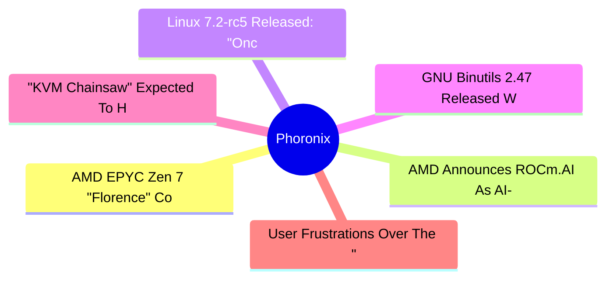
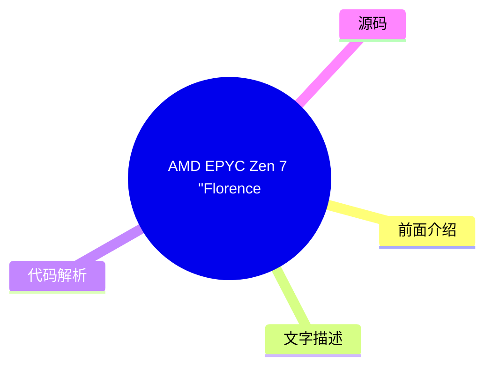
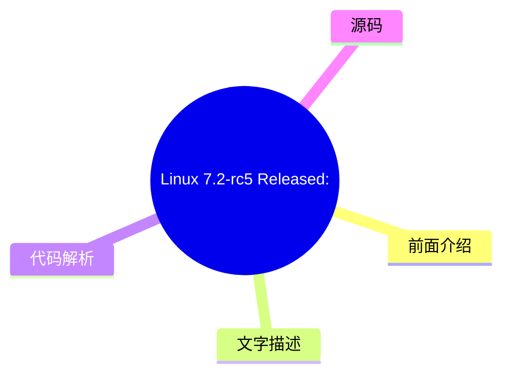
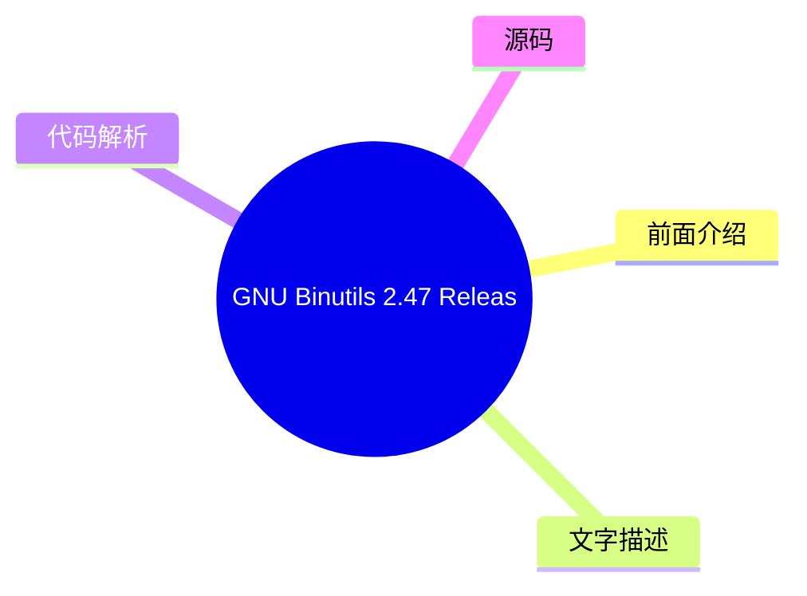

# ⚙️ Phoronix Top 6 (2026-07-28)

## 前面介绍

- 数据源：Phoronix
- 抓取日期：2026-07-28
- 条目数：6
- 含完整正文：6
- 含代码片段：0
- 组织方式：前面介绍 / 树状图 / 文字描述 / 代码解析 / 源码

## 思维导图



## 详细整理（6 条，6 条含全文，0 条含代码）

### 1. AMD EPYC Zen 7 "Florence" Confirmed With ACE, Next-Gen Memory
- **链接**: [https://www.phoronix.com/news/AMD-EPYC-Zen-7-Florence-Zen-8](https://www.phoronix.com/news/AMD-EPYC-Zen-7-Florence-Zen-8)
- **作者**: Michael Larabel
- **发布**: Thu, 23 Jul 2026 15:16:29 -0400

#### 前面介绍

- After announcing the AMD EPYC 9006 "Venice" processors today at AMD Advancing AI 2026, Lisa Su ended her keynote by confirming EPYC Zen 7 "Florence" details as well as EPYC Zen 8 "Ravenna" being in development...
- 作者：Michael Larabel
- 发布时间：Thu, 23 Jul 2026 15:16:29 -0400

#### 树状图



#### 文字描述

- # AMD EPYC Zen 7 "Florence" Confirmed With ACE, Next-Gen Memory [announcing the AMD EPYC 9006 "Venice" processors](https://www.phoronix.com/review/amd-epyc-9006-venice)today at AMD Advancing AI 2026, Lisa Su ended her keynote by confirming EPYC Zen 7 "Florence" details as well as EPYC Zen 8 "Ravenna" being in development. Lisa confirmed that AMD EPYC Zen 7 "Florence" will featu

#### 代码解析

- 本文未检测到明确代码块，内容更偏新闻、观点或方法论。

#### 源码

#### 中文节选

# AMD EPYC Zen 7 "Florence" Confirmed With ACE, Next-Gen Memory

[announcing the AMD EPYC 9006 "Venice" processors](https://www.phoronix.com/review/amd-epyc-9006-venice)today at AMD Advancing AI 2026, Lisa Su ended her keynote by confirming EPYC Zen 7 "Florence" details as well as EPYC Zen 8 "Ravenna" being in development.

Lisa confirmed that AMD EPYC Zen 7 "Florence" will feature a next-gen process node, ACE AI compute extensions, and next-gen memory with the latest MRDIMM and LPDDR tech.

Not too surprising of a disclosure but expected. The ACE extensions are the fruit of the x86 Advisory Working Group between AMD and Intel. AMD engineers have already been

[working on ACE compiler patches for GCC](https://www.phoronix.com/news/GCC-AVX10-V2-AUX-Patches)and was assumed it's for Zen 7 cores. Now it's confirmed that 7th Gen EPYC will indeed bring ACE for bettering the EPYC capabilities in AI software and as the successor to Intel's Advanced Matrix Extensions (AMX).

Lisa also confirmed that EPYC Zen 8 "Ravenna" is in development.

Lisa also shared next-gen Helios is AMD Helios 500 with EPYC Verano and Instinct MI500 series and AMD Pensando Como and Monza networking. AMD EPYC Helios 600 after that will be AMD EPYC Ferrara with Instinct MI600 series and AMD Pensando Palma and Levanza.

#### 完整正文（中文）

# AMD EPYC Zen 7 "Florence" Confirmed With ACE, Next-Gen Memory

[announcing the AMD EPYC 9006 "Venice" processors](https://www.phoronix.com/review/amd-epyc-9006-venice)today at AMD Advancing AI 2026, Lisa Su ended her keynote by confirming EPYC Zen 7 "Florence" details as well as EPYC Zen 8 "Ravenna" being in development.

Lisa confirmed that AMD EPYC Zen 7 "Florence" will feature a next-gen process node, ACE AI compute extensions, and next-gen memory with the latest MRDIMM and LPDDR tech.

Not too surprising of a disclosure but expected. The ACE extensions are the fruit of the x86 Advisory Working Group between AMD and Intel. AMD engineers have already been

[working on ACE compiler patches for GCC](https://www.phoronix.com/news/GCC-AVX10-V2-AUX-Patches)and was assumed it's for Zen 7 cores. Now it's confirmed that 7th Gen EPYC will indeed bring ACE for bettering the EPYC capabilities in AI software and as the successor to Intel's Advanced Matrix Extensions (AMX).

Lisa also confirmed that EPYC Zen 8 "Ravenna" is in development.

Lisa also shared next-gen Helios is AMD Helios 500 with EPYC Verano and Instinct MI500 series and AMD Pensando Como and Monza networking. AMD EPYC Helios 600 after that will be AMD EPYC Ferrara with Instinct MI600 series and AMD Pensando Palma and Levanza.


### 2. AMD Announces ROCm.AI As AI-Driven Platform For Developers
- **链接**: [https://www.phoronix.com/news/AMD-ROCm-AI](https://www.phoronix.com/news/AMD-ROCm-AI)
- **作者**: Michael Larabel
- **发布**: Thu, 23 Jul 2026 13:45:00 -0400

#### 前面介绍

- In addition to Instinct MI455X and Helios launching along with the new AMD EPYC 9006 "Venice" processors, AMD used their annual Advancing AI day to announce ROCm.AI as an AI-driven platform for developers...
- 作者：Michael Larabel
- 发布时间：Thu, 23 Jul 2026 13:45:00 -0400

#### 树状图


#### 文字描述

- # AMD Announces ROCm.AI As AI-Driven Platform For Developers [Instinct MI455X and Helios](https://www.phoronix.com/news/AMD-Instinct-MI455X-Helios)launching along with the new [AMD EPYC 9006 "Venice" processors](https://www.phoronix.com/review/amd-epyc-9006-venice), AMD used their annual Advancing AI day to announce ROCm.AI as an AI-driven platform for developers. Following the

#### 代码解析

- 本文未检测到明确代码块，内容更偏新闻、观点或方法论。

#### 源码

#### 中文节选

# AMD Announces ROCm.AI As AI-Driven Platform For Developers

[Instinct MI455X and Helios](https://www.phoronix.com/news/AMD-Instinct-MI455X-Helios)launching along with the new

[AMD EPYC 9006 "Venice" processors](https://www.phoronix.com/review/amd-epyc-9006-venice), AMD used their annual Advancing AI day to announce ROCm.AI as an AI-driven platform for developers.

Following the recent

[ROCm 7.14](https://www.phoronix.com/search/ROCm+7.14)release, ROCm.AI will be part of the next release in August for leveraging AI to help developers adapt their code for in turn running on ROCm.

ROCm.AI provides skills for popular agents like Claude, Codex, Cursor, and Gemini to help them become "ROCm superusers" to provide AI-assisted optimizations for adapting or improving codebases around ROCm and is capable of end-to-end AI workload optimizations with its new Hyperloom component. Hyperloom aims to automate the optimization of end-to-end inference workloads and helps with analyzing, kernel optimizations, and validation in a much shorter time than would take with the effort manually.

ROCm.AI leverages AI-powered optimizations for compute kernels, memory management, parallelization, and scheduling for enhancing both AI inference and training performance.

ROCm.AI in theory sounds fantastic: using AI to help adapt your software for AMD's AI stack. In practice it will be interesting to see how well it works across diverse codebases. AMD's claims are that ROCm.ui delivers an average of 3.3x inference improvement and 2.4x training improvement -- though that's compared to ROCm 7.0 as a baseline.

Those are the light details for now but we look forward to learning more about ROCm.AI in its next release due out in August.

#### 完整正文（中文）

# AMD 宣布推出 ROCm.AI，面向开发者的 AI 驱动平台

[Instinct MI455X 和 Helios](https://www.phoronix.com/news/AMD-Instinct-MI455X-Helios)与新的

[AMD EPYC 9006 "Venice" 处理器](https://www.phoronix.com/review/amd-epyc-9006-venice)一同发布，AMD 在其年度 Advancing AI 日上宣布了 ROCm.AI，这是一个面向开发者的 AI 驱动平台。

继最近发布的

[ROCm 7.14](https://www.phoronix.com/search/ROCm+7.14)之后，ROCm.AI 将作为下一版本的一部分于八月发布，旨在利用 AI 帮助开发者调整代码，使其能够在 ROCm 上运行。

ROCm.AI 为 Claude、Codex、Cursor 和 Gemini 等流行代理提供技能，帮助它们成为“ROCm 超级用户”，从而为围绕 ROCm 调整或改进代码库提供 AI 辅助优化，并利用其新的 Hyperloom 组件实现端到端 AI 工作负载优化。Hyperloom 旨在自动化端到端推理工作负载的优化，并能帮助分析、内核优化和验证，其速度远快于手动完成这些工作所需的时间。

ROCm.AI 利用 AI 驱动的优化来增强计算内核、内存管理、并行化和调度，从而提升 AI 推理和训练性能。

ROCm.AI 在理论上听起来非常出色：利用 AI 帮助开发者调整软件以适配 AMD 的 AI 堆栈。在实践中，它将很有趣地看到它在各种代码库中的表现如何。AMD 的声明称，ROCm.ui 在推理方面平均带来 3.3 倍的提升，在训练方面平均带来 2.4 倍的提升——尽管这是与 ROCm 7.0 作为基准进行的对比。

目前仅有这些初步细节，我们期待在八月发布的下一个版本中了解更多关于 ROCm.AI 的信息。


### 3. Linux 7.2-rc5 Released: "Once More We Have Quite A Massive -rc5"
- **链接**: [https://www.phoronix.com/news/Linux-7.2-rc5-Released](https://www.phoronix.com/news/Linux-7.2-rc5-Released)
- **作者**: Michael Larabel
- **发布**: Sun, 26 Jul 2026 18:05:14 -0400

#### 前面介绍

- In working toward releasing the stable Linux 7.2 kernel in less than one month's time, out today is Linux 7.2-rc5 to ship this week's latest bug/regression fixes and help facilitate more testing of this in-development kernel version...
- 作者：Michael Larabel
- 发布时间：Sun, 26 Jul 2026 18:05:14 -0400

#### 树状图



#### 文字描述

- # Linux 7.2-rc5 Released: "Once More We Have Quite A Massive -rc5" [Linux 7.2](https://www.phoronix.com/search/Linux+7.2)kernel in less than one month's time, out today is Linux 7.2-rc5 to ship this week's latest bug/regression fixes and help facilitate more testing of this in-development kernel version. Linux 7.2-rc5 brings a variety of bug fixes, many of which continue to tur

#### 代码解析

- 本文未检测到明确代码块，内容更偏新闻、观点或方法论。

#### 源码

#### 中文节选

# Linux 7.2-rc5 Released: "Once More We Have Quite A Massive -rc5"

[Linux 7.2](https://www.phoronix.com/search/Linux+7.2)kernel in less than one month's time, out today is Linux 7.2-rc5 to ship this week's latest bug/regression fixes and help facilitate more testing of this in-development kernel version.

Linux 7.2-rc5 brings a variety of bug fixes, many of which continue to turn up via AI/LLM agents. Linux 7.2-rc5 brings

[the "new normal" of audio fixes](https://www.phoronix.com/news/Linux-7.2-rc5-Audio-Fixes)across the board, driven on by many AI-powered discoveries and lots of quirky hardware out there. Linux 7.2-rc5 also

[fixes an issue in the IEEE-1394 Firewire IPv4 networking](https://www.phoronix.com/news/Linux-7.2-Fix-IPv4-Firewire)that has existed in the mainline Linux kernel since 2009.

Linus Torvalds wrote in today's

[7.2-rc5 announcement](https://lore.kernel.org/lkml/CAHk-=whS0VZVKRDJL46JKLyD2BjcrMmVtOwtz4v=75t8w+QVbw@mail.gmail.com/T/#u):

"It's Sunday afternoon, and once more we have quite a massive -rc5.


The same thing happened in 7.1, so part of it is just the "new normal". But I think this time the bigger part of it is that the networking tree ended up having some pent up work from the previous week due to conference distractions. So over a third of the patch is networking, although the bulk of that is obviously on the driver side.


There are all the usual other drivers in here too, although for a change there are more USB changes than GPU drivers. So that's something. But there's a little bit of everything on the driver side (sound, tty, block, firewire - you get the idea).


And then there's everything else: tooling (selftest and perf), fielsystems (smb, btrfs), rust and arch fixes, documentation...


So it's a bit too big for my liking, but nothing in there strikes me as particularly strange or scary."

There are

[many new features and changes with Linux 7.2](https://www.phoronix.com/review/linux-72-features)that will ideally debut as stable in three weeks on 16 August.

#### 完整正文（中文）

# Linux 7.2-rc5 Released: "Once More We Have Quite A Massive -rc5"

[Linux 7.2](https://www.phoronix.com/search/Linux+7.2)kernel in less than one month's time, out today is Linux 7.2-rc5 to ship this week's latest bug/regression fixes and help facilitate more testing of this in-development kernel version.

Linux 7.2-rc5 brings a variety of bug fixes, many of which continue to turn up via AI/LLM agents. Linux 7.2-rc5 brings

[the "new normal" of audio fixes](https://www.phoronix.com/news/Linux-7.2-rc5-Audio-Fixes)across the board, driven on by many AI-powered discoveries and lots of quirky hardware out there. Linux 7.2-rc5 also

[fixes an issue in the IEEE-1394 Firewire IPv4 networking](https://www.phoronix.com/news/Linux-7.2-Fix-IPv4-Firewire)that has existed in the mainline Linux kernel since 2009.

Linus Torvalds wrote in today's

[7.2-rc5 announcement](https://lore.kernel.org/lkml/CAHk-=whS0VZVKRDJL46JKLyD2BjcrMmVtOwtz4v=75t8w+QVbw@mail.gmail.com/T/#u):

"It's Sunday afternoon, and once more we have quite a massive -rc5.


The same thing happened in 7.1, so part of it is just the "new normal". But I think this time the bigger part of it is that the networking tree ended up having some pent up work from the previous week due to conference distractions. So over a third of the patch is networking, although the bulk of that is obviously on the driver side.


There are all the usual other drivers in here too, although for a change there are more USB changes than GPU drivers. So that's something. But there's a little bit of everything on the driver side (sound, tty, block, firewire - you get the idea).


And then there's everything else: tooling (selftest and perf), fielsystems (smb, btrfs), rust and arch fixes, documentation...


So it's a bit too big for my liking, but nothing in there strikes me as particularly strange or scary."

There are

[many new features and changes with Linux 7.2](https://www.phoronix.com/review/linux-72-features)that will ideally debut as stable in three weeks on 16 August.


### 4. GNU Binutils 2.47 Released With More RISC-V Extensions, New Options
- **链接**: [https://www.phoronix.com/news/GNU-Binutils-2.47](https://www.phoronix.com/news/GNU-Binutils-2.47)
- **作者**: Michael Larabel
- **发布**: Sun, 26 Jul 2026 15:36:15 -0400

#### 前面介绍

- Along with this weekend's release of GNU C Library 2.44, the GNU Binutils 2.47 release is also now available for this important set of binary utilities common to Linux systems and other platforms with the GNU toolchain...
- 作者：Michael Larabel
- 发布时间：Sun, 26 Jul 2026 15:36:15 -0400

#### 树状图



#### 文字描述

- # GNU Binutils 2.47 Released With More RISC-V Extensions, New Options [GNU C Library 2.44](https://www.phoronix.com/news/GNU-C-Library-glibc-2.44), the GNU Binutils 2.47 release is also now available for this important set of binary utilities common to Linux systems and other platforms with the GNU toolchain. GNU Binutils 2.47 introduces a new **--reloc-section-sym=[all|interna

#### 代码解析

- 本文未检测到明确代码块，内容更偏新闻、观点或方法论。

#### 源码

#### 中文节选

# GNU Binutils 2.47 发布，支持更多 RISC-V 扩展和新选项

[GNU C Library 2.44](https://www.phoronix.com/news/GNU-C-Library-glibc-2.44)，GNU Binutils 2.47 版本现已发布，这是 Linux 系统及其他平台 GNU 工具链中一组重要的二进制工具。

GNU Binutils 2.47 引入了一个新的

**--reloc-section-sym=[all|internal|none]**汇编器命令行选项，用于控制是否调整引用本地绑定符号的重定位以使用节符号。Objdump 和 readelf 现在拥有一个

**--debug-dir=[DIR]**选项，用于告知在哪里查找独立的调试信息文件。Objdump 额外添加了一个

**-map-global-vars**选项，用于显示目标文件中全局变量的位置和类型。此外，链接器还支持新的

**--start-lib**和

**--end-lib**选项，以及针对所有格式中都没有符号索引的归档文件的

**--no-link-mapless**和

**--link-mapless**选项。

BFD 链接器还添加了零级优化。当使用带有 "-O 0" 的 BFD 时，它将停止合并可合并节的内容。这使链接过程快得多，但代价是生成的二进制文件更大。Binutils 2.47 还弃用了对 32 位 s390 目标的支持，同时仍维护 64 位 s390x 目标。

GNU Binutils 2.47 添加了对更新的 RISC-V 标准扩展的支持，包括 zalasr v1.0、svrsw60t59b v1.0、zvabd v1.0、smpmpmt v1.0、zvqwdota8i、zvqwdota16i、zvfwdota16bf 和 zvfqwdota8f v1.0、zvqwbdota8i、zvqwbdota16i、zvfwbdota16bf、zvfqwbdota8f 和 zvfbdota32f v1.0，以及 SpacemiT：xsmtvdot v1.0、xsmtvdotii v1.0。

通过

[邮件列表公告](https://lists.gnu.org/archive/html/info-gnu/2026-07/msg00006.html)可下载 GNU Binutils 2.47 及更多详细信息。

#### 完整正文（中文）

# GNU Binutils 2.47 发布，支持更多 RISC-V 扩展和新选项

[GNU C Library 2.44](https://www.phoronix.com/news/GNU-C-Library-glibc-2.44)，GNU Binutils 2.47 版本现已发布，这是 Linux 系统及其他平台 GNU 工具链中一组重要的二进制工具。

GNU Binutils 2.47 引入了一个新的

**--reloc-section-sym=[all|internal|none]**汇编器命令行选项，用于控制是否调整引用本地绑定符号的重定位以使用节符号。Objdump 和 readelf 现在拥有一个

**--debug-dir=[DIR]**选项，用于告知在哪里查找独立的调试信息文件。Objdump 额外添加了一个

**-map-global-vars**选项，用于显示目标文件中全局变量的位置和类型。此外，链接器还支持新的

**--start-lib**和

**--end-lib**选项，以及针对所有格式中都没有符号索引的归档文件的

**--no-link-mapless**和

**--link-mapless**选项。

BFD 链接器还添加了零级优化。当使用带有 "-O 0" 的 BFD 时，它将停止合并可合并节的内容。这使链接过程快得多，但代价是生成的二进制文件更大。Binutils 2.47 还弃用了对 32 位 s390 目标的支持，同时仍维护 64 位 s390x 目标。

GNU Binutils 2.47 添加了对更新的 RISC-V 标准扩展的支持，包括 zalasr v1.0、svrsw60t59b v1.0、zvabd v1.0、smpmpmt v1.0、zvqwdota8i、zvqwdota16i、zvfwdota16bf 和 zvfqwdota8f v1.0、zvqwbdota8i、zvqwbdota16i、zvfwbdota16bf、zvfqwbdota8f 和 zvfbdota32f v1.0，以及 SpacemiT：xsmtvdot v1.0、xsmtvdotii v1.0。

通过

[邮件列表公告](https://lists.gnu.org/archive/html/info-gnu/2026-07/msg00006.html)可下载 GNU Binutils 2.47 及更多详细信息。


### 5. "KVM Chainsaw" Expected To Hit Linux 7.3 For Dealing With God Data Structure
- **链接**: [https://www.phoronix.com/news/KVM-Chainsaw-Linux-7.3](https://www.phoronix.com/news/KVM-Chainsaw-Linux-7.3)
- **作者**: Michael Larabel
- **发布**: Sun, 26 Jul 2026 11:32:26 -0400

#### 前面介绍

- A patch series that appears destined for the upcoming Linux 7.3 merge window is what's dubbed the "KVM Chainsaw" as a major code clean-up in dealing with the kvm_mmu "god data structure"...
- 作者：Michael Larabel
- 发布时间：Sun, 26 Jul 2026 11:32:26 -0400

#### 树状图

```mermaid
mindmap
  root(("KVM Chainsaw" Expected ))
    前面介绍
    文字描述
    代码解析
    源码
```

#### 文字描述

- # "KVM Chainsaw" Expected To Hit Linux 7.3 For Dealing With God Data Structure Red Hat engineer and KVM maintainer Paolo Bonzini has merged the kvm-chainsaw branch to KVM's "next" Git branch. With this KVM Chainsaw work now in the next branch, it should be submitted for the upcoming Linux 7.3 cycle. The KVM Chainsaw work deals with the kvm_mmu structure being overloaded with mu

#### 代码解析

- 本文未检测到明确代码块，内容更偏新闻、观点或方法论。

#### 源码

#### 中文节选

# “KVM Chainsaw” 预计将在 Linux 7.3 中发布，用于处理“上帝数据结构”

红帽工程师兼 KVM 维护者 Paolo Bonzini 已将 kvm-chainsaw 分支合并到 KVM 的 “next” Git 分支中。随着 KVM Chainsaw 工作现在进入了 next 分支，它应该会被提交到即将到来的 Linux 7.3 周期中。

KVM Chainsaw 工作处理了 kvm_mmu 结构因多重用途而变得臃肿的问题，并将其拆分为三部分，以便更好地处理当前的 KVM 用法。Paolo 在[合并到 KVM.git next 分支](https://git.kernel.org/pub/scm/virt/kvm/kvm.git/commit/?id=a204badd8432f93b7e862e7dac6db0fe3d65f370)时解释了 KVM Chainsaw：

“kvm_mmu 是一个‘上帝数据结构’，包含三个不同的任务：描述客户机页表的格式、遍历客户机页表以及构建页表。这意味着（已经命名不当的）nested_mmu 只使用了其中一部分，因为它没有页表需要构建。

此外，某些部分在客户机和主机页表之间被重用（例如保留位检测器），而其他部分则没有；例如，permission_fault 被简化代码（如 is_executable_pte()）所取代。

该系列代码通过将 kvm_mmu 拆分为三部分来清理这些问题：

- kvm_pagewalk 是页表遍历器。每个 vCPU 有两个，gva_walk 和 ngpa_walk。walk_mmu 总是被单个 gva_walk 替换，无论运行的是 L1 还是 L2 客户机，这与当前代码将其在 root_mmu 和 nested_mmu 之间移动不同。

- kvm_mmu 保留页表构建功能。它使用页表遍历器来构建影子页；对于 root_mmu 始终是 gva_walk，对于 guest_mmu 始终是 ngpa_walk。

- kvm_page_format 允许 KVM 对已存在的 PTE 进行操作，并将 permission_mask() 周围的代码与现有的 struct rsvd_bits_validate 合并。kvm_pagewalk 和 kvm_mmu 都有自己的 kvm_page_format，就像 struct kvm_mmu 针对客户机 PTE 和 SPTE 保留位检查有两个 struct rsvd_bits_validate 实例一样。”

The cleanup alone already does something useful, which is to reduce the confusion between guest_mmu and nested_mmu. nested_mmu came to exist long before the introduction of guest_mmu and stole the obvious name, resulting in comments like "Exempt nested MMUs" where the code actually exempts guest_mmu. Renaming guest_mmu could be the next step, though the RFC had multiple opinions about how to do this.


However, the last patch also shows the code reuse benefits can be used for new features too. By adapting the permission_fault() machinery and using it to test SPTEs against struct kvm_page_fault, it makes it possible to support SPTEs that have XS!=XU; these were not supported yet by KVM, but could now be added via memory attributes."

Look for this and a lot more with Linux 7.3, with the merge window opening up during the back half of August.

#### 完整正文（中文）

# “KVM Chainsaw” 预计将在 Linux 7.3 中发布，用于处理“上帝数据结构”

红帽工程师兼 KVM 维护者 Paolo Bonzini 已将 kvm-chainsaw 分支合并到 KVM 的 “next” Git 分支中。随着 KVM Chainsaw 工作现在进入了 next 分支，它应该会被提交到即将到来的 Linux 7.3 周期中。

KVM Chainsaw 工作处理了 kvm_mmu 结构因多重用途而变得臃肿的问题，并将其拆分为三部分，以便更好地处理当前的 KVM 用法。Paolo 在[合并到 KVM.git next 分支](https://git.kernel.org/pub/scm/virt/kvm/kvm.git/commit/?id=a204badd8432f93b7e862e7dac6db0fe3d65f370)时解释了 KVM Chainsaw：

“kvm_mmu 是一个‘上帝数据结构’，包含三个不同的任务：描述客户机页表的格式、遍历客户机页表以及构建页表。这意味着（已经命名不当的）nested_mmu 只使用了其中一部分，因为它没有页表需要构建。

此外，某些部分在客户机和主机页表之间被重用（例如保留位检测器），而其他部分则没有；例如，permission_fault 被简化代码（如 is_executable_pte()）所取代。

该系列代码通过将 kvm_mmu 拆分为三部分来清理这些问题：

- kvm_pagewalk 是页表遍历器。每个 vCPU 有两个，gva_walk 和 ngpa_walk。walk_mmu 总是被单个 gva_walk 替换，无论运行的是 L1 还是 L2 客户机，这与当前代码将其在 root_mmu 和 nested_mmu 之间移动不同。

- kvm_mmu 保留页表构建功能。它使用页表遍历器来构建影子页；对于 root_mmu 始终是 gva_walk，对于 guest_mmu 始终是 ngpa_walk。

- kvm_page_format 允许 KVM 对已存在的 PTE 进行操作，并将 permission_mask() 周围的代码与现有的 struct rsvd_bits_validate 合并。kvm_pagewalk 和 kvm_mmu 都有自己的 kvm_page_format，就像 struct kvm_mmu 针对客户机 PTE 和 SPTE 保留位检查有两个 struct rsvd_bits_validate 实例一样。”

清理工作本身就已经很有用，那就是减少 guest_mmu 和 nested_mmu 之间的混淆。nested_mmu 出现的时间远早于 guest_mmu 的引入，并且抢占了显而易见的名字，导致出现类似“豁免 nested MMUs”的注释，而代码实际豁免的却是 guest_mmu。重命名 guest_mmu 可能是下一步，尽管 RFC 中关于如何操作有多种意见。

然而，最后一补丁也表明代码重用带来的好处同样适用于新功能。通过适配 permission_fault() 机制，并将其用于根据 struct kvm_page_fault 测试 SPTE，现在就有可能支持 XS!=XU 的 SPTE；这些 SPTE 目前尚未被 KVM 支持，但现在可以通过内存属性添加。

敬请期待 Linux 7.3 带来的更多内容，合并窗口将于八月底后半段开启。


### 6. User Frustrations Over The "Tragic State of FreeBSD Audio/Sound" Support
- **链接**: [https://www.phoronix.com/news/Tragic-FreeBSD-Audio-Support](https://www.phoronix.com/news/Tragic-FreeBSD-Audio-Support)
- **作者**: Michael Larabel
- **发布**: Sun, 26 Jul 2026 09:24:46 -0400

#### 前面介绍

- Besides the FreeBSD graphics and WiFi drivers lagging behind Linux and other operating systems, the FreeBSD audio driver support and handling of audio streams with FreeBSD on the desktop can be problematic depending upon the hardware/system. One of t
- 作者：Michael Larabel
- 发布时间：Sun, 26 Jul 2026 09:24:46 -0400

#### 树状图


#### 文字描述

- # User Frustrations Over The "Tragic State of FreeBSD Audio/Sound" Support This long-running mailing list thread began with a user being frustrated over a regression later in the FreeBSD 14 series that has remained at least as of FreeBSD 15.1 where there were "LOTS of sound/audio related things." There would be "random boozing sounds" from unknown sources. And other audio playb

#### 代码解析

- 本文未检测到明确代码块，内容更偏新闻、观点或方法论。

#### 源码

#### 中文节选

# User Frustrations Over The "Tragic State of FreeBSD Audio/Sound" Support

This long-running mailing list thread began with a user being frustrated over a regression later in the FreeBSD 14 series that has remained at least as of FreeBSD 15.1 where there were "LOTS of sound/audio related things." There would be "random boozing sounds" from unknown sources. And other audio playback problems. This wasn't with some state of the art hardware either but an aging ThinkPad from nearly a decade ago.

"But these random 'boozing' sounds are just unacceptable ... and I can not even tell where they came from ... is it OSS problem? Is is PulseAudio problem? Something in between? Because there is NOTHING in the logs for audio.

...

... and its not some fancy laptop from yesterday ... its a ThinkPad T480 from 2018 for fuck sake - hardware like that used to run smooth as Carlos Sainz 'smooth operator' in Singapore GP ... but not anymore."

[The mailing list thread](https://lists.freebsd.org/archives/freebsd-stable/2026-July/index.html)went from there with some other users also venting their frustration over audio problems on FreeBSD. Some have been resorting to using AI/LLMs for hunting down audio code troubles on FreeBSD. Some attribute their audio pain points to using PulseAudio.

While not an immediate solution, the FreeBSD Foundation has been sponsoring development work on improving the audio driver support. That is part of the effort for improving FreeBSD on laptops. Patches improving the audio support for FreeBSD have been gradually landing and some attribute that as potentially the cause for the recent uptick in audio-related problems with landing changes incrementally over time rather than landing the big audio rework once it's all completed and properly vetted.

So while FreeBSD graphics and WiFi drivers have been seeing much attention lately, there is also work happening behind the scenes on the audio support. Hopefully in due course the FreeBSD audio support will be in good shape as an important aspect of the desktop experience.

#### 完整正文（中文）

# User Frustrations Over The "Tragic State of FreeBSD Audio/Sound" Support

This long-running mailing list thread began with a user being frustrated over a regression later in the FreeBSD 14 series that has remained at least as of FreeBSD 15.1 where there were "LOTS of sound/audio related things." There would be "random boozing sounds" from unknown sources. And other audio playback problems. This wasn't with some state of the art hardware either but an aging ThinkPad from nearly a decade ago.

"But these random 'boozing' sounds are just unacceptable ... and I can not even tell where they came from ... is it OSS problem? Is is PulseAudio problem? Something in between? Because there is NOTHING in the logs for audio.

...

... and its not some fancy laptop from yesterday ... its a ThinkPad T480 from 2018 for fuck sake - hardware like that used to run smooth as Carlos Sainz 'smooth operator' in Singapore GP ... but not anymore."

[The mailing list thread](https://lists.freebsd.org/archives/freebsd-stable/2026-July/index.html)went from there with some other users also venting their frustration over audio problems on FreeBSD. Some have been resorting to using AI/LLMs for hunting down audio code troubles on FreeBSD. Some attribute their audio pain points to using PulseAudio.

While not an immediate solution, the FreeBSD Foundation has been sponsoring development work on improving the audio driver support. That is part of the effort for improving FreeBSD on laptops. Patches improving the audio support for FreeBSD have been gradually landing and some attribute that as potentially the cause for the recent uptick in audio-related problems with landing changes incrementally over time rather than landing the big audio rework once it's all completed and properly vetted.

So while FreeBSD graphics and WiFi drivers have been seeing much attention lately, there is also work happening behind the scenes on the audio support. Hopefully in due course the FreeBSD audio support will be in good shape as an important aspect of the desktop experience.

