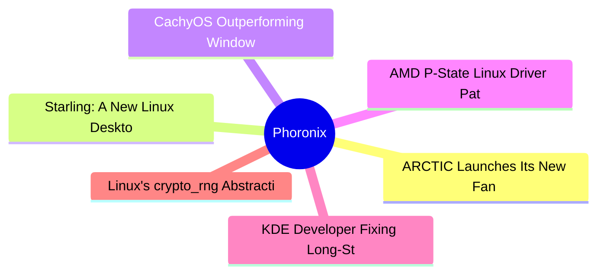
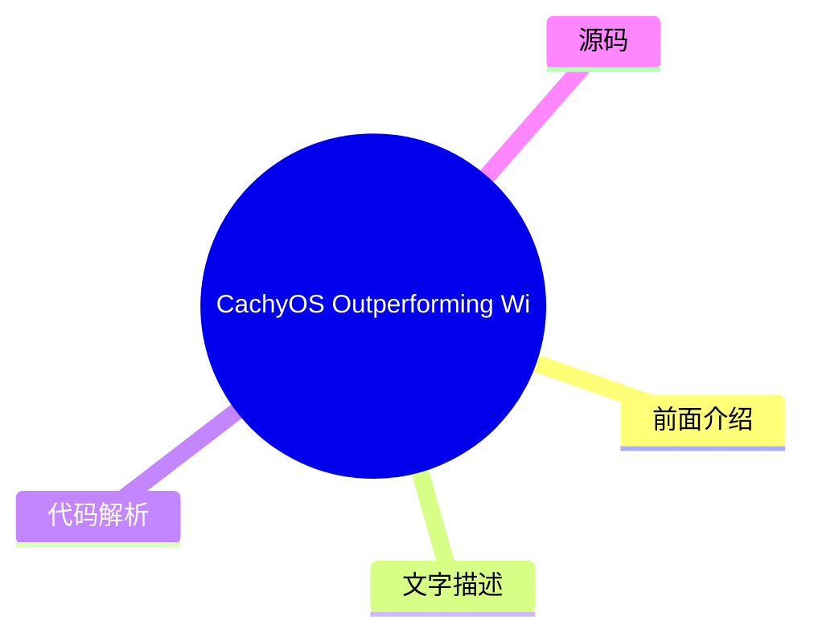
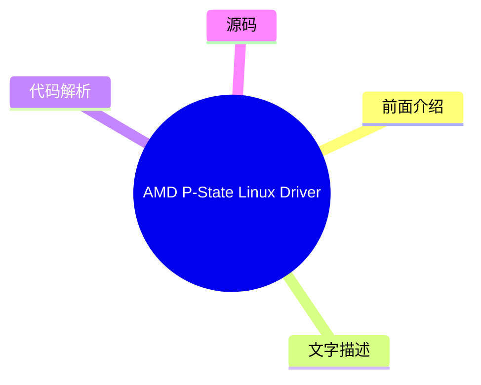
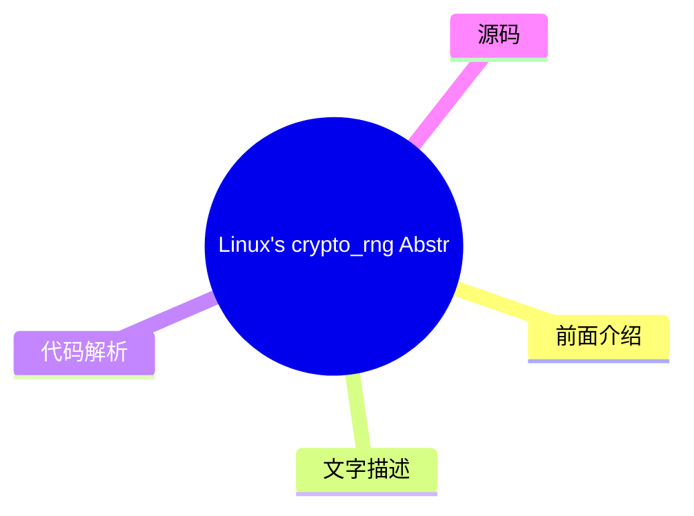

# ⚙️ Phoronix Top 6 (2026-07-29)

## 前面介绍

- 数据源：Phoronix
- 抓取日期：2026-07-29
- 条目数：6
- 含完整正文：6
- 含代码片段：0
- 组织方式：前面介绍 / 树状图 / 文字描述 / 代码解析 / 源码

## 思维导图

## 详细整理（6 条，6 条含全文，0 条含代码）

### 1. ARCTIC Launches Its New Fan Controller That Already Has Mainline Linux Support
- **链接**: [https://www.phoronix.com/news/ARCTIC-Fan-Controller-Launches](https://www.phoronix.com/news/ARCTIC-Fan-Controller-Launches)
- **作者**: Michael Larabel
- **发布**: Tue, 28 Jul 2026 20:38:00 -0400

#### 前面介绍

- In over 22 years of Linux hardware reviews and testing at Phoronix, I have never been more excited for a fan controller... ARCTIC today launched their new Fan Controller and in making the product very unique for Linux users, it already has mainline L
- 作者：Michael Larabel
- 发布时间：Tue, 28 Jul 2026 20:38:00 -0400

#### 树状图

#### 文字描述

- # ARCTIC Launches Its New Fan Controller That Already Has Mainline Linux Support [over 22 years of Linux hardware reviews and testing](https://www.phoronix.com/news/Phoronix-Turns-22)at Phoronix, I have never been more excited for a fan controller... ARCTIC today launched their new Fan Controller and in making the product very unique for Linux users, it already has mainline Lin

#### 代码解析

- 本文未检测到明确代码块，内容更偏新闻、观点或方法论。

#### 源码

#### 中文节选

# ARCTIC 发布其新的风扇控制器，并已获得主线 Linux 支持

在 Phoronix 超过 22 年的 Linux 硬件评测和测试中，我从未对一款风扇控制器如此兴奋……ARCTIC 今天发布了他们的新风扇控制器，为了使其对 Linux 用户非常独特，它已经通过 ARCTIC 直接贡献的开源驱动程序获得了主线 Linux 内核的支持。

早在 3 月

[ARCTIC Cooling 发布了 Linux 风扇控制器驱动程序](https://www.phoronix.com/news/ARCTIC-Fan-Controller-Linux)以支持多达 10 个风扇通道，并很好地集成了 Linux HWMON 接口用于风扇控制和监控。起初有点令人困惑，因为现有的 ARCTIC 风扇控制产品没有任何 USB 接口用于与系统通信，因此不清楚它对应什么。

ARCTIC

[继续致力于他们的风扇控制器驱动程序](https://www.phoronix.com/news/ARCTIC-Fan-Controller-Linux-7.2)，并明确这是用于一款新的/未发布的产品。该驱动程序已

[为 Linux 7.2 内核主线化](https://www.phoronix.com/news/Linux-7.2-HWMON)，该内核将于 8 月下半月作为稳定版发布。

之所以如此独特，是因为老牌 Linux 用户知道，通常风扇控制器厂商不会提供任何 Linux 支持，尤其是发布前支持。通常 Linux 上的任何桌面风扇控制驱动程序大多留给热情的 Linux/开源客户，他们自行进行逆向工程并创建驱动程序。在这种情况下，ARCTIC 不仅向主线内核贡献了一个开源驱动程序，而且是在产品发布前完成的。向他们致敬，因为我不记得在桌面风扇控制领域以前有过类似的情况。事实上，这很令人悲哀，在 2026 年，更多的桌面 PC 散热厂商没有直接向 Linux 内核贡献更多内容，这竟然是一件令人兴奋的事情。

今天早上，他们在 X 上

[宣布](https://x.com/ARCTIChannel/status/2082073563947737321)新款“ARCTIC 风扇控制器”已发布。他们在公告中注明，这款 10 通道风扇控制器甚至“开源且 Linux 就绪”。

除此之外，他们在[产品页面](https://www.arctic.de/en/Fan-Controller/ACFAN00351A)上提到了 Linux 支持。也有 Windows 和 macOS 支持。

这款新的风扇控制器也非常便宜。最初的[亚马逊产品页面](https://amzn.to/4z3XBcz)（联盟链接）将这款对 Linux 友好的风扇控制器定价仅为 9 美元。ARCTIC 将很快寄送评测样机，以便在未来的 Phoronix 文章中确认 Linux 驱动支持并进行测试。

#### 完整正文（中文）

# ARCTIC 发布其新的风扇控制器，并已获得主线 Linux 支持

在 Phoronix 超过 22 年的 Linux 硬件评测和测试中，我从未对一款风扇控制器如此兴奋……ARCTIC 今天发布了他们的新风扇控制器，为了使其对 Linux 用户非常独特，它已经通过 ARCTIC 直接贡献的开源驱动程序获得了主线 Linux 内核的支持。

早在 3 月

[ARCTIC Cooling 发布了 Linux 风扇控制器驱动程序](https://www.phoronix.com/news/ARCTIC-Fan-Controller-Linux)以支持多达 10 个风扇通道，并很好地集成了 Linux HWMON 接口用于风扇控制和监控。起初有点令人困惑，因为现有的 ARCTIC 风扇控制产品没有任何 USB 接口用于与系统通信，因此不清楚它对应什么。

ARCTIC

[继续致力于他们的风扇控制器驱动程序](https://www.phoronix.com/news/ARCTIC-Fan-Controller-Linux-7.2)，并明确这是用于一款新的/未发布的产品。该驱动程序已

[为 Linux 7.2 内核主线化](https://www.phoronix.com/news/Linux-7.2-HWMON)，该内核将于 8 月下半月作为稳定版发布。

之所以如此独特，是因为老牌 Linux 用户知道，通常风扇控制器厂商不会提供任何 Linux 支持，尤其是发布前支持。通常 Linux 上的任何桌面风扇控制驱动程序大多留给热情的 Linux/开源客户，他们自行进行逆向工程并创建驱动程序。在这种情况下，ARCTIC 不仅向主线内核贡献了一个开源驱动程序，而且是在产品发布前完成的。向他们致敬，因为我不记得在桌面风扇控制领域以前有过类似的情况。事实上，这很令人悲哀，在 2026 年，更多的桌面 PC 散热厂商没有直接向 Linux 内核贡献更多内容，这竟然是一件令人兴奋的事情。

今天早上，他们在 X 上

[宣布](https://x.com/ARCTIChannel/status/2082073563947737321)新款“ARCTIC 风扇控制器”已发布。他们在公告中注明，这款 10 通道风扇控制器甚至“开源且 Linux 就绪”。

除此之外，他们在[产品页面](https://www.arctic.de/en/Fan-Controller/ACFAN00351A)上提到了 Linux 支持。也有 Windows 和 macOS 支持。

这款新的风扇控制器也非常便宜。最初的[亚马逊产品页面](https://amzn.to/4z3XBcz)（联盟链接）将这款对 Linux 友好的风扇控制器定价仅为 9 美元。ARCTIC 将很快寄送评测样机，以便在未来的 Phoronix 文章中确认 Linux 驱动支持并进行测试。

### 2. Starling: A New Linux Desktop Written In Swift, Own Wayland Compositor & Written With AI
- **链接**: [https://www.phoronix.com/news/Starling-Swift-Desktop](https://www.phoronix.com/news/Starling-Swift-Desktop)
- **作者**: Michael Larabel
- **发布**: Tue, 28 Jul 2026 11:50:00 -0400

#### 前面介绍

- There's yet another new open-source desktop option for Linux users in the era of new open-source projects largely written via AI/LLMs. Starling is this new project largely written via Claude and using the Swift programming language for the desktop wh
- 作者：Michael Larabel
- 发布时间：Tue, 28 Jul 2026 11:50:00 -0400

#### 树状图

#### 文字描述

- # Starling: A New Linux Desktop Written In Swift, Own Wayland Compositor & Written With AI For those that enjoy trying out evaluating new Linux desktop options, Starling was just announced as a new desktop option written over the past half-year largely via AI (Claude). In a message to Phoronix, the sole developer working on this project with Claude explains its technical stack 

#### 代码解析

- 本文未检测到明确代码块，内容更偏新闻、观点或方法论。

#### 源码

#### 中文节选

# Starling：一款用 Swift 编写的全新 Linux 桌面，拥有自己的 Wayland 合成器，并使用 AI 编写

对于那些喜欢尝试和评估新的 Linux 桌面选项的人来说，Starling 刚刚宣布为一个新的桌面选项，它是过去半年中主要通过 AI（Claude）编写的。在给 Phoronix 的一条消息中，这位与 Claude 共同开发该项目的唯一开发者解释了其技术栈：

- 它自己的 Wayland 合成器，用 C 编写，实现了 xdg-shell、linux-dmabuf（零拷贝导入）、viewporter、fractional-scale-v1、pointer-constraints、relative-pointer、text-input-v3、presentation-time、primary-selection、idle-inhibit、cursor-shape-v1、xdg-decoration、xdg-activation、xdg-output 和 wlr-data-control。

- 内置 X11 服务器（DRI3/Present），以便 X11 客户端也能运行。

- 通过 DRM/KMS 嵌入器在 Flutter 引擎的 C 核心上运行。Shell、窗口管理器、合成器和应用程序是 Swift —— UI 框架是 Flutter 框架的完整 Swift 移植版，没有 Dart 虚拟机。

- 非特权会话：DRM 主控和输入来自 logind（通过 libseat），而不是以 root 身份运行。像任何 Wayland 会话一样通过 GDM 启动。

- 作为原生客户端运行真实应用程序 —— Chrome、VS Code、Slack、IntelliJ、GIMP 和 Blender（通过 linux-dmabuf 的 EEVEE 视口）—— 涵盖 Chromium/Electron、Qt6、GTK3/4、JetBrains Runtime 和 Blender 的 GHOST。

- 作为约 53 MB 的 .deb 包在 Ubuntu 26.04 上发布。已在 AMD（Radeon 780M）和虚拟机中的 virtio-gpu/virgl 上验证。

这是一个诚实的早期预览（v0.2）：已测试 AMD 和 virtio-gpu，Intel/NVIDIA 尚未测试；缩放目前固定为 2.0；仅支持 Ubuntu 26.04。

对于那些想知道 Starling 看起来是什么样的人：

那些希望了解更多关于 Starling 信息的人可以通过项目网站了解：

[Starling.build](https://starling.build/)。Apache 2.0 许可的代码可在

[GitHub](https://github.com/starling-build/starling) 上获取。对于那些想要尝试这款最新的 AI 编写的桌面和合成器的人，提供了一个预构建的 Ubuntu 26.04 LTS Debian 包。

#### 完整正文（中文）

# Starling：一款用 Swift 编写的全新 Linux 桌面，拥有自己的 Wayland 合成器，并使用 AI 编写

对于那些喜欢尝试和评估新的 Linux 桌面选项的人来说，Starling 刚刚宣布为一个新的桌面选项，它是过去半年中主要通过 AI（Claude）编写的。在给 Phoronix 的一条消息中，这位与 Claude 共同开发该项目的唯一开发者解释了其技术栈：

- 它自己的 Wayland 合成器，用 C 编写，实现了 xdg-shell、linux-dmabuf（零拷贝导入）、viewporter、fractional-scale-v1、pointer-constraints、relative-pointer、text-input-v3、presentation-time、primary-selection、idle-inhibit、cursor-shape-v1、xdg-decoration、xdg-activation、xdg-output 和 wlr-data-control。

- 内置 X11 服务器（DRI3/Present），以便 X11 客户端也能运行。

- 通过 DRM/KMS 嵌入器在 Flutter 引擎的 C 核心上运行。Shell、窗口管理器、合成器和应用程序是 Swift —— UI 框架是 Flutter 框架的完整 Swift 移植版，没有 Dart 虚拟机。

- 非特权会话：DRM 主控和输入来自 logind（通过 libseat），而不是以 root 身份运行。像任何 Wayland 会话一样通过 GDM 启动。

- 作为原生客户端运行真实应用程序 —— Chrome、VS Code、Slack、IntelliJ、GIMP 和 Blender（通过 linux-dmabuf 的 EEVEE 视口）—— 涵盖 Chromium/Electron、Qt6、GTK3/4、JetBrains Runtime 和 Blender 的 GHOST。

- 作为约 53 MB 的 .deb 包在 Ubuntu 26.04 上发布。已在 AMD（Radeon 780M）和虚拟机中的 virtio-gpu/virgl 上验证。

这是一个诚实的早期预览（v0.2）：已测试 AMD 和 virtio-gpu，Intel/NVIDIA 尚未测试；缩放目前固定为 2.0；仅支持 Ubuntu 26.04。

对于那些想知道 Starling 看起来是什么样的人：

那些希望了解更多关于 Starling 信息的人可以通过项目网站了解：

[Starling.build](https://starling.build/)。Apache 2.0 许可的代码可在

[GitHub](https://github.com/starling-build/starling) 上获取。对于那些想要尝试这款最新的 AI 编写的桌面和合成器的人，提供了一个预构建的 Ubuntu 26.04 LTS Debian 包。

### 3. CachyOS Outperforming Windows 11, Slight Advantage Over Ubuntu & Fedora On AMD Ryzen AI 9 HX 470
- **链接**: [https://www.phoronix.com/review/amd-hx470-windows-linux](https://www.phoronix.com/review/amd-hx470-windows-linux)
- **作者**: Michael Larabel
- **发布**: Tue, 28 Jul 2026 10:04:04 -0400

#### 前面介绍

- A recent mini PC being benchmarked at Phoronix is the BOSGAME VTA-439 that employs the new AMD Ryzen AI 9 HX 470 Gorgon Point SoC. With the BOSGAME mini PC having shipped with Microsoft Windows 11, here are some comparison benchmarks of the out-of-th
- 作者：Michael Larabel
- 发布时间：Tue, 28 Jul 2026 10:04:04 -0400

#### 树状图

#### 文字描述

- # CachyOS Outperforming Windows 11, Slight Advantage Over Ubuntu & Fedora On AMD Ryzen AI 9 HX 470 A recent mini PC being benchmarked at Phoronix is the [BOSGAME VTA-439](https://www.phoronix.com/review/bosgame-vta-439) that employs the new AMD Ryzen AI 9 HX 470 Gorgon Point SoC. With the BOSGAME mini PC having shipped with Microsoft Windows 11, here are some comparison benchma

#### 代码解析

- 本文未检测到明确代码块，内容更偏新闻、观点或方法论。

#### 源码

#### 中文节选

# CachyOS 超越 Windows 11，在 AMD Ryzen AI 9 HX 470 上略胜 Ubuntu 和 Fedora

Phoronix 最近对一款 [BOSGAME VTA-439](https://www.phoronix.com/review/bosgame-vta-439) 进行了基准测试，该设备采用了新的 AMD Ryzen AI 9 HX 470 Gorgon Point SoC。由于 BOSGAME 迷你电脑出厂预装了 Microsoft Windows 11，以下是与 Ubuntu 26.04 LTS 和 Fedora Workstation 44 的开箱即用性能对比，同时也加入了基于滚动发布、高度优化的 Arch Linux 发行版 CachyOS 进行测试。

BOSGAME VTA-439 是一款有趣的迷你电脑，配备了 12 核心 / 24 线程的 AMD Ryzen AI 9 HX 470 及其 Radeon 890M 集成 RDNA 3.5 显卡。评测样机配备了双 16GB DDR5-5600 内存（总计 32GB）和 1TB NVMe SSD。

这款 BOSGAME 迷你电脑出厂预装的是 Microsoft Windows 11 Pro，并在截至 7 月 8 日的所有可用 Microsoft Windows 更新下进行了测试。随后，在测试过程中，又对其进行了 Ubuntu 26.04 LTS、Fedora Workstation 44 和 CachyOS 的全新安装。

每个操作系统都以其开箱即用的配置运行，以查看这些不同的操作系统在 AMD Ryzen AI 9 HX 470 Gorgon Point 平台上的性能表现。

#### 完整正文（中文）

# CachyOS 超越 Windows 11，在 AMD Ryzen AI 9 HX 470 上略胜 Ubuntu 和 Fedora

Phoronix 最近对一款 [BOSGAME VTA-439](https://www.phoronix.com/review/bosgame-vta-439) 进行了基准测试，该设备采用了新的 AMD Ryzen AI 9 HX 470 Gorgon Point SoC。由于 BOSGAME 迷你电脑出厂预装了 Microsoft Windows 11，以下是与 Ubuntu 26.04 LTS 和 Fedora Workstation 44 的开箱即用性能对比，同时也加入了基于滚动发布、高度优化的 Arch Linux 发行版 CachyOS 进行测试。

BOSGAME VTA-439 是一款有趣的迷你电脑，配备了 12 核心 / 24 线程的 AMD Ryzen AI 9 HX 470 及其 Radeon 890M 集成 RDNA 3.5 显卡。评测样机配备了双 16GB DDR5-5600 内存（总计 32GB）和 1TB NVMe SSD。

这款 BOSGAME 迷你电脑出厂预装的是 Microsoft Windows 11 Pro，并在截至 7 月 8 日的所有可用 Microsoft Windows 更新下进行了测试。随后，在测试过程中，又对其进行了 Ubuntu 26.04 LTS、Fedora Workstation 44 和 CachyOS 的全新安装。

每个操作系统都以其开箱即用的配置运行，以查看这些不同的操作系统在 AMD Ryzen AI 9 HX 470 Gorgon Point 平台上的性能表现。

### 4. AMD P-State Linux Driver Patches Can Boost 1%-Low FPS Gaming Performance By 31%
- **链接**: [https://www.phoronix.com/news/AMD-P-State-Better-1p-Lows](https://www.phoronix.com/news/AMD-P-State-Better-1p-Lows)
- **作者**: Michael Larabel
- **发布**: Tue, 28 Jul 2026 06:03:00 -0400

#### 前面介绍

- A set of patches posted today to the Linux kernel mailing list implement per-core Energy Performance Preference (EPP) boosting for recently-busy CPUs. This feature is designed to have a dramatic impact for Linux gaming and helping especially with the
- 作者：Michael Larabel
- 发布时间：Tue, 28 Jul 2026 06:03:00 -0400

#### 树状图

#### 文字描述

- # AMD P-State Linux Driver Patches Can Boost 1%-Low FPS Gaming Performance By 31% David Vernet who is a Linux kernel hacker at Meta by day has taken to improving the AMD P-State driver with the proposed "epp_boost" feature for helping with the Linux gaming performance. Vernet sums up the situation well with the current AMD P-State CPU frequency scaling driver behavior and the m

#### 代码解析

- 本文未检测到明确代码块，内容更偏新闻、观点或方法论。

#### 源码

#### 中文节选

# AMD P-State Linux 驱动补丁可提升 1%-低 FPS 游戏性能 31%

David Vernet 是 Meta 的 Linux 内核黑客，他致力于改进 AMD P-State 驱动，提出了“epp_boost”功能以帮助提升 Linux 游戏性能。Vernet 很好地总结了当前 AMD P-State CPU 频率缩放驱动程序的行为以及这种动态 EPP 加速模式的动机：

“在主动（EPP）模式下，平台会根据 EPP 提示在 min_perf 和 max_perf 之间自主选择操作点，内核仅在策略或限制更改时重写 CPPC 请求。如果一个工作负载主要由一个几乎一直忙碌的线程主导，并且该线程频繁进行短时间休眠（例如在游戏工作负载中很常见），那么在这种策略下表现会很差。每次休眠都会衰减硬件的性能信号，导致唤醒后的突发性能从低操作点开始，从而增加尾部延迟，尽管 CPU 在可用工作负载时实际上已完全忙碌。

如上所述，这里的激励案例是游戏。游戏的主线程或渲染线程通常每帧都会在 futex 或 GPU fence 上短暂阻塞，由此产生的频率下降会直接表现为卡顿帧和膨胀的帧时间百分位。

在 cpufreq 层面解决这个问题需要走一条相当狭窄的道路。全局强制 EPP=performance 虽然修复了尾部问题，但会为每个工作负载中的每个核心消耗功率，这在 CPU 和 GPU 共享功耗预算的掌上设备上很重要。提高忙碌核心的 min_perf 似乎是明显的手术式修复方案，但这会将核心锁定在或高于标称频率，即使在微空闲和垂直同步等待期间也是如此。在我运行的 Van Gogh（Steam Deck）实验中，这会干扰 SMU 共享的 CPU/GPU 加速管理，导致帧时间尾部相对于什么都不做出现退化。”

该系列补丁添加了一个可选的、每核心的 EPP 加速功能。当 epp_boost 模块参数启用时，update-util 钩子最多每 10 毫秒采样一次每个核心的 C0 占用率（delta MPERF 除以 delta TSC）。如果采样显示核心至少有 50% 的忙碌时间，则将其 MSR_AMD_CPPC_REQ 的 EPP 字段设置为性能（0），并保持该状态，直到 300 毫秒内没有再次出现忙碌采样，此时钩子将恢复策略管理最后存储在 cppc_req_cached 中的请求。

在使用《文明 VI》游戏基准测试时，最终结果相当令人兴奋，1%-low FPS 提升了 31.8%，而 p99 帧时间改善了 4.1%。这是在 Steam Deck 上进行的测试，其他现代 AMD Ryzen 手持设备以及系统也能从中受益。

[该补丁系列](https://lore.kernel.org/linux-pm/20260728073150.54964-1-void@manifault.com/)为 AMD P-State 驱动提供了该改进。除了需要这些补丁外，还需要设置 **amd_pstate.epp_boost=1** 才能激活该模式。在打补丁的内核上，可以通过 */sys/module/amd_pstate/parameters/epp_boost* 检查（或在运行时设置）该功能的状态。这将很有趣地看到

#### 完整正文（中文）

# AMD P-State Linux 驱动补丁可提升 1%-低 FPS 游戏性能 31%

David Vernet 是 Meta 的 Linux 内核黑客，他致力于改进 AMD P-State 驱动，提出了“epp_boost”功能以帮助提升 Linux 游戏性能。Vernet 很好地总结了当前 AMD P-State CPU 频率缩放驱动程序的行为以及这种动态 EPP 加速模式的动机：

“在主动（EPP）模式下，平台会根据 EPP 提示在 min_perf 和 max_perf 之间自主选择操作点，内核仅在策略或限制更改时重写 CPPC 请求。如果一个工作负载主要由一个几乎一直忙碌的线程主导，并且该线程频繁进行短时间休眠（例如在游戏工作负载中很常见），那么在这种策略下表现会很差。每次休眠都会衰减硬件的性能信号，导致唤醒后的突发性能从低操作点开始，从而增加尾部延迟，尽管 CPU 在可用工作负载时实际上已完全忙碌。

如上所述，这里的激励案例是游戏。游戏的主线程或渲染线程通常每帧都会在 futex 或 GPU fence 上短暂阻塞，由此产生的频率下降会直接表现为卡顿帧和膨胀的帧时间百分位。

在 cpufreq 层面解决这个问题需要走一条相当狭窄的道路。全局强制 EPP=performance 虽然修复了尾部问题，但会为每个工作负载中的每个核心消耗功率，这在 CPU 和 GPU 共享功耗预算的掌上设备上很重要。提高忙碌核心的 min_perf 似乎是明显的手术式修复方案，但这会将核心锁定在或高于标称频率，即使在微空闲和垂直同步等待期间也是如此。在我运行的 Van Gogh（Steam Deck）实验中，这会干扰 SMU 共享的 CPU/GPU 加速管理，导致帧时间尾部相对于什么都不做出现退化。”

该系列补丁引入了一个可选的、每核心的 EPP 加速功能。当启用 epp_boost 模块参数时，update-util 钩子最多每 10 毫秒采样一次每个核心的 C0 占用率（delta MPERF 除以 delta TSC）。如果采样显示核心至少有 50% 的忙碌时间，则将其 MSR_AMD_CPPC_REQ 的 EPP 字段设置为性能（0），并保持该状态，直到 300 毫秒内没有再次出现忙碌采样，此时钩子将恢复策略管理最后存储在 cppc_req_cached 中的请求。

使用《文明 VI》游戏基准测试的最终结果相当令人兴奋，1%-low FPS 提升了 31.8%，而 p99 帧时间改善了 4.1%。这是在 Steam Deck 上进行的测试，其他现代 AMD Ryzen 手持设备以及大型系统也将从中受益。

[该补丁系列](https://lore.kernel.org/linux-pm/20260728073150.54964-1-void@manifault.com/)为 AMD P-State 驱动提供了这一改进。除了需要这些补丁外，还需要设置 **amd_pstate.epp_boost=1** 才能激活该模式。对于打补丁的内核，可以通过 */sys/module/amd_pstate/parameters/epp_boost* 检查（或在运行时设置）该功能的状态。由于《文明 VI》易于测试且可复现，因此被选作该 AMD epp_boost 功能的测试候选。这项有前景的工作仍需经过补丁审查，特别是需要 AMD Linux 内核工程师的审查，但希望它能在不久的将来合并到主线内核中，以进一步增强 AMD Linux 的游戏体验。

### 5. KDE Developer Fixing Long-Standing Bug Over Very Long Small-File Copy Times
- **链接**: [https://www.phoronix.com/news/KDE-Ridiculous-File-Copy-Times](https://www.phoronix.com/news/KDE-Ridiculous-File-Copy-Times)
- **作者**: Michael Larabel
- **发布**: Tue, 28 Jul 2026 05:50:02 -0400

#### 前面介绍

- Since 2014 there has been a KDE bug report titled Ridiculously slow file copy (multiple small files). With the Dolphin file manager or other KIO-based KDE programs, copying many small files can be much slower than using the cp command directly or oth
- 作者：Michael Larabel
- 发布时间：Tue, 28 Jul 2026 05:50:02 -0400

#### 树状图

#### 文字描述

- # KDE Developer Fixing Long-Standing Bug Over Very Long Small-File Copy Times [Ridiculously slow file copy (multiple small files)](https://bugs.kde.org/show_bug.cgi?id=342056). With the Dolphin file manager or other KIO-based KDE programs, copying many small files can be much slower than using the *cp*command directly or other copying programs like *rsync*, Finally that issue i

#### 代码解析

- 本文未检测到明确代码块，内容更偏新闻、观点或方法论。

#### 源码

#### 中文节选

# KDE 开发者修复长期存在的 Bug，解决极长的小文件复制时间

[极其缓慢的文件复制（多个小文件）](https://bugs.kde.org/show_bug.cgi?id=342056)。在使用 Dolphin 文件管理器或其他基于 KIO 的 KDE 程序时，复制许多小文件的速度可能比直接使用

*cp*命令或其他复制程序（如

*rsync*）慢得多。最终，这个问题正在解决过程中，旨在解决 KDE Plasma 桌面上处理许多小文件时复制时间极慢的问题。

KDE 开发者 Méven Car 最近着手解决 KIO 代码中复制许多小文件时速度令人痛苦地缓慢这一长期缺陷。简而言之，Car 在 KIO 方面进行了工作，移除了内存传输并批量复制，将整个文件运行折叠为单个命令。

该代码尚未合并，但预计将在 6.29 版本之后发布。根据提供的性能数据，与使用

*cp*相比，建议的代码在很大程度上消除了长文件复制时间：

Méven Car 在他的博客文章中评论道：

“小文件的情况就是故事。KIO 6.28 比 cp 慢大约 20 倍，这正是 2014 年报告所抱怨的比例。移除用于进程内工作程序的套接字，以及不再每文件探测一次目标文件系统，将其时间从大约 1.6 秒减少到 0.4 秒（大约 4 倍）。批量复制将其时间减少到 88 毫秒，基本上达到了 cp 的速度，比 6.28 快大约 18 倍。那句‘我使用 cp 而不是 dolphin’终于有了答案。”

有兴趣了解 KDE KIO 这一重大改进的人可以通过

[这篇博客文章](https://blogs.kde.org/2026/07/28/making-kio-copy-many-files-fast/)了解更多。

#### 完整正文（中文）

# KDE 开发者修复长期存在的 Bug，解决极长的小文件复制时间

[极其缓慢的文件复制（多个小文件）](https://bugs.kde.org/show_bug.cgi?id=342056)。在使用 Dolphin 文件管理器或其他基于 KIO 的 KDE 程序时，复制许多小文件的速度可能比直接使用

*cp*命令或其他复制程序（如

*rsync*）慢得多。最终，这个问题正在解决过程中，旨在解决 KDE Plasma 桌面上处理许多小文件时复制时间极慢的问题。

KDE 开发者 Méven Car 最近着手解决 KIO 代码中复制许多小文件时速度令人痛苦地缓慢这一长期缺陷。简而言之，Car 在 KIO 方面进行了工作，移除了内存传输并批量复制，将整个文件运行折叠为单个命令。

该代码尚未合并，但预计将在 6.29 版本之后发布。根据提供的性能数据，与使用

*cp*相比，建议的代码在很大程度上消除了长文件复制时间：

Méven Car 在他的博客文章中评论道：

“小文件的情况就是故事。KIO 6.28 比 cp 慢大约 20 倍，这正是 2014 年报告所抱怨的比例。移除用于进程内工作程序的套接字，以及不再每文件探测一次目标文件系统，将其时间从大约 1.6 秒减少到 0.4 秒（大约 4 倍）。批量复制将其时间减少到 88 毫秒，基本上达到了 cp 的速度，比 6.28 快大约 18 倍。那句‘我使用 cp 而不是 dolphin’终于有了答案。”

有兴趣了解 KDE KIO 这一重大改进的人可以通过

[这篇博客文章](https://blogs.kde.org/2026/07/28/making-kio-copy-many-files-fast/)了解更多。

### 6. Linux's crypto_rng Abstraction Layer Next On The Chopping Block
- **链接**: [https://www.phoronix.com/news/Linux-crypto-rng-Removal-Patch](https://www.phoronix.com/news/Linux-crypto-rng-Removal-Patch)
- **作者**: Michael Larabel
- **发布**: Tue, 28 Jul 2026 05:41:49 -0400

#### 前面介绍

- In addition to the deprecation and stripping down of AF_ALG, another piece of the Linux kernel crypto code steaming ahead toward removal is the crypto_rng abstraction layer...
- 作者：Michael Larabel
- 发布时间：Tue, 28 Jul 2026 05:41:49 -0400

#### 树状图

#### 文字描述

- # Linux's crypto_rng Abstraction Layer Next On The Chopping Block [AF_ALG](https://www.phoronix.com/search/AF_ALG), another piece of the Linux kernel crypto code steaming ahead toward removal is the crypto_rng abstraction layer. Linux crypto subsystem expert Eric Biggers of Google is working to remove the crypto_rng abstraction layer from the kernel. This generic interface for 

#### 代码解析

- 本文未检测到明确代码块，内容更偏新闻、观点或方法论。

#### 源码

#### 中文节选

# Linux 的 crypto_rng 抽象层即将被砍掉

[AF_ALG](https://www.phoronix.com/search/AF_ALG) 是 Linux 内核加密代码中另一个正加速走向移除的部分，即 crypto_rng 抽象层。

Linux 内核加密子系统专家、来自 Google 的 Eric Biggers 正致力于从内核中移除 crypto_rng 抽象层。随着推荐直接使用确定性随机比特生成器 (DRBG) 和 Jitterentropy 模块的 API，这个用于 RNG 的通用接口最终变得不再必要。

Biggers 在通过

[wip-rng Git 分支](https://git.kernel.org/pub/scm/linux/kernel/git/ebiggers/linux.git/commit/?h=wip-rng&id=b3d559623a0829567d9f40d2d71da0e63ba7f549)

提交的补丁中解释道：

“crypto_rng 抽象层被设计为随机数生成器的通用接口。然而，现在它仅被用于实现一个‘NIST 批准’的 RNG 以及支持它的‘jitterentropy’熵收集器（出于认证原因）。

以前，一些硬件 RNG 驱动程序支持 crypto_rng。然而，该功能未被使用，只会造成混淆，因为它与实际使用的 hw_random 接口并存。

反映这一现实，让我们移除 crypto_rng 抽象层，并让 drbg 和 jitterentropy 模块直接提供专用的 API。

为了实现这一点，相应地更新 crypto_rng 的用户：

- algif_rng.c 现在直接调用 DRBG 和 jitterentropy API。

- __crypto_stdrng_get_bytes() 现在直接调用 DRBG API。

- DRBG 自测从 testmgr 移至 drbg.c 本身，并直接使用 DRBG API。”

我们将拭目以待，看看这是否会被提交以在即将到来的 Linux v7.3 周期中消除 crypto_rng 接口。

#### 完整正文（中文）

# Linux 的 crypto_rng 抽象层即将被砍掉

[AF_ALG](https://www.phoronix.com/search/AF_ALG) 是 Linux 内核加密代码中另一个正加速走向移除的部分，即 crypto_rng 抽象层。

Linux 内核加密子系统专家、来自 Google 的 Eric Biggers 正致力于从内核中移除 crypto_rng 抽象层。随着推荐直接使用确定性随机比特生成器 (DRBG) 和 Jitterentropy 模块的 API，这个用于 RNG 的通用接口最终变得不再必要。

Biggers 在通过

[wip-rng Git 分支](https://git.kernel.org/pub/scm/linux/kernel/git/ebiggers/linux.git/commit/?h=wip-rng&id=b3d559623a0829567d9f40d2d71da0e63ba7f549)

提交的补丁中解释道：

“crypto_rng 抽象层被设计为随机数生成器的通用接口。然而，现在它仅被用于实现一个‘NIST 批准’的 RNG 以及支持它的‘jitterentropy’熵收集器（出于认证原因）。

以前，一些硬件 RNG 驱动程序支持 crypto_rng。然而，该功能未被使用，只会造成混淆，因为它与实际使用的 hw_random 接口并存。

反映这一现实，让我们移除 crypto_rng 抽象层，并让 drbg 和 jitterentropy 模块直接提供专用的 API。

为了实现这一点，相应地更新 crypto_rng 的用户：

- algif_rng.c 现在直接调用 DRBG 和 jitterentropy API。

- __crypto_stdrng_get_bytes() 现在直接调用 DRBG API。

- DRBG 自测从 testmgr 移至 drbg.c 本身，并直接使用 DRBG API。”

我们将拭目以待，看看这是否会被提交以在即将到来的 Linux v7.3 周期中消除 crypto_rng 接口。

