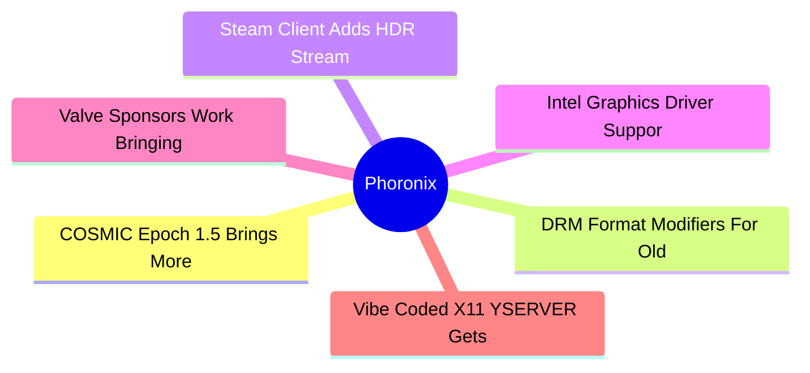
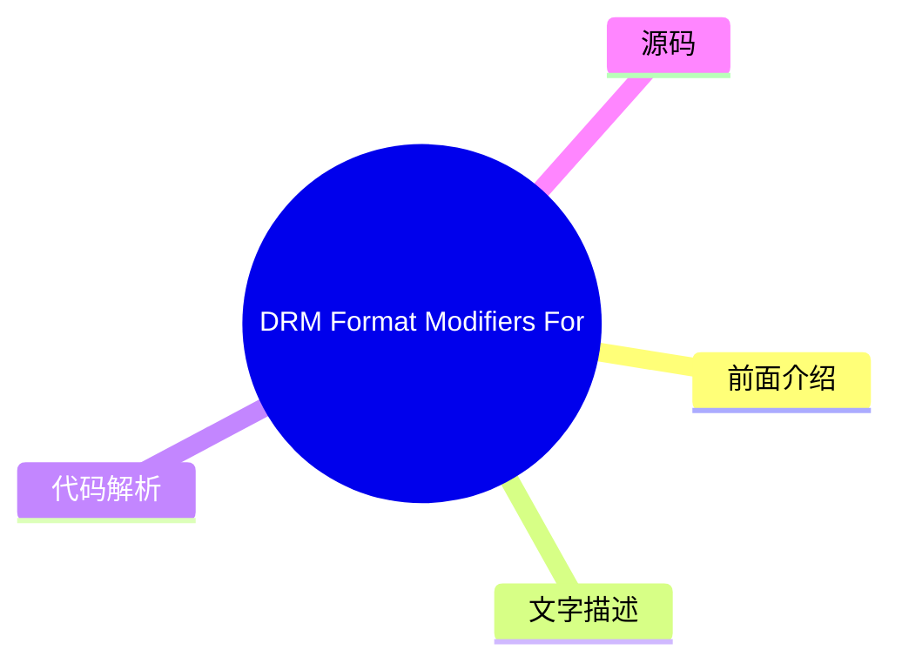
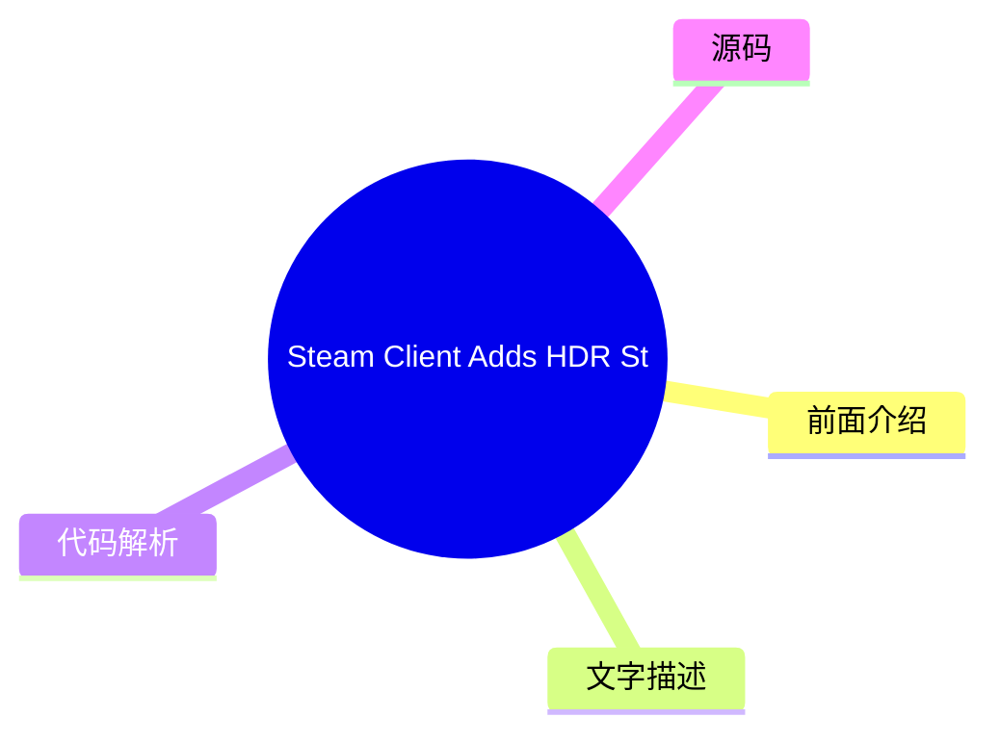
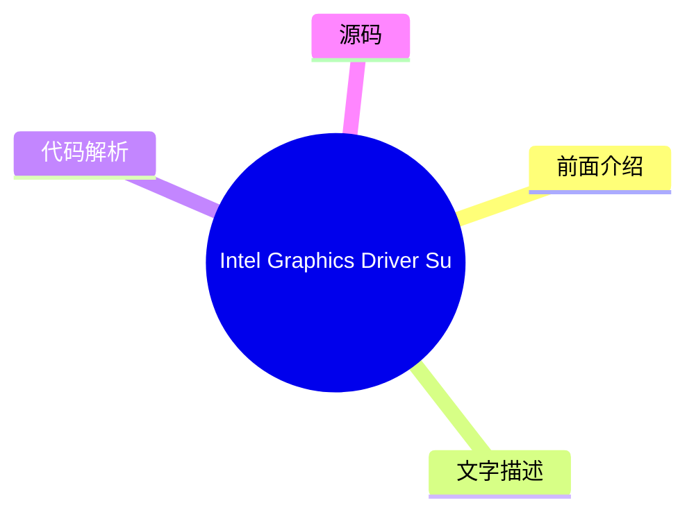
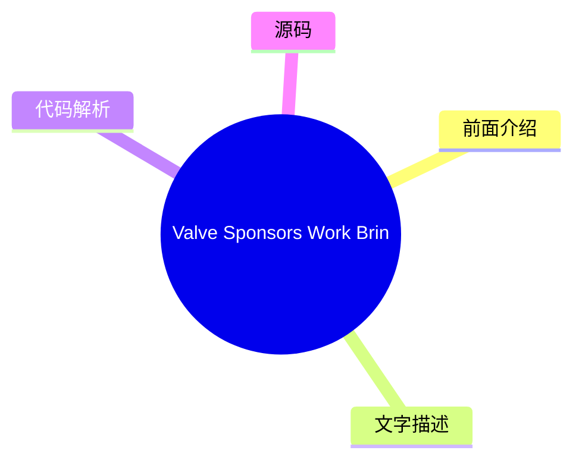

# ⚙️ Phoronix Top 6 (2026-07-30)

## 前面介绍

- 数据源：Phoronix
- 抓取日期：2026-07-30
- 条目数：6
- 含完整正文：6
- 含代码片段：0
- 组织方式：前面介绍 / 树状图 / 文字描述 / 代码解析 / 源码

## 思维导图

## 详细整理（6 条，6 条含全文，0 条含代码）

### 1. COSMIC Epoch 1.5 Brings More Fixes & Improvements To System76's Desktop
- **链接**: [https://www.phoronix.com/news/COSMIC-Epoch-1.5-Released](https://www.phoronix.com/news/COSMIC-Epoch-1.5-Released)
- **作者**: Michael Larabel
- **发布**: Wed, 29 Jul 2026 20:21:55 -0400

#### 前面介绍

- The System76 and Pop!_OS developers continue quickly iterating on their Rust-based COSMIC desktop environment...
- 作者：Michael Larabel
- 发布时间：Wed, 29 Jul 2026 20:21:55 -0400

#### 树状图

#### 文字描述

- # COSMIC Epoch 1.5 Brings More Fixes & Improvements To System76's Desktop Just a week since their [COSMIC Epoch 1.4 with COSMIC Monitor improvements and fixes](https://www.phoronix.com/news/COSMIC-Epoch-1.4), COSMIC Epoch 1.5 is now available. COSMIC 1.5 now makes use of EXIF orientation data for the COSMIC background handling, the COSMIC Compositor fixes an issue with Chromium

#### 代码解析

- 本文未检测到明确代码块，内容更偏新闻、观点或方法论。

#### 源码

#### 中文节选

# COSMIC Epoch 1.5 Brings More Fixes & Improvements To System76's Desktop

Just a week since their

[COSMIC Epoch 1.4 with COSMIC Monitor improvements and fixes](https://www.phoronix.com/news/COSMIC-Epoch-1.4), COSMIC Epoch 1.5 is now available. COSMIC 1.5 now makes use of EXIF orientation data for the COSMIC background handling, the COSMIC Compositor fixes an issue with Chromium-based apps breaking with below 1.0 fractional scaling, better handling by the compositor during GPU resets, and the COSMIC Greeter can now use the cosmic-keymap-unstable-v1 Wayland protocol.

COSMIC Epoch 1.5 also brings various fixes to COSMIC Panel, including for the recently added Frosted Glass effect. There is also a COSMIC Panel fix for high CPU usage when the screen is locked.

Plus there are a wide variety of other fixes in COSMIC Epoch 1.5 as outlined on

[GitHub](https://github.com/pop-os/cosmic-epoch/releases/tag/epoch-1.5.0).

#### 完整正文（中文）

# COSMIC Epoch 1.5 Brings More Fixes & Improvements To System76's Desktop

Just a week since their

[COSMIC Epoch 1.4 with COSMIC Monitor improvements and fixes](https://www.phoronix.com/news/COSMIC-Epoch-1.4), COSMIC Epoch 1.5 is now available. COSMIC 1.5 now makes use of EXIF orientation data for the COSMIC background handling, the COSMIC Compositor fixes an issue with Chromium-based apps breaking with below 1.0 fractional scaling, better handling by the compositor during GPU resets, and the COSMIC Greeter can now use the cosmic-keymap-unstable-v1 Wayland protocol.

COSMIC Epoch 1.5 also brings various fixes to COSMIC Panel, including for the recently added Frosted Glass effect. There is also a COSMIC Panel fix for high CPU usage when the screen is locked.

Plus there are a wide variety of other fixes in COSMIC Epoch 1.5 as outlined on

[GitHub](https://github.com/pop-os/cosmic-epoch/releases/tag/epoch-1.5.0).

### 2. DRM Format Modifiers For Old AMD GPUs Coming With Linux 7.3: Thanks Valve
- **链接**: [https://www.phoronix.com/news/Linux-7.3-AMDGPU-GFX6-Modifiers](https://www.phoronix.com/news/Linux-7.3-AMDGPU-GFX6-Modifiers)
- **作者**: Michael Larabel
- **发布**: Wed, 29 Jul 2026 16:47:11 -0400

#### 前面介绍

- Sent out today was another week's worth of features and other code changes to the AMDGPU kernel graphics driver and AMDKFD kernel compute driver. We are nearing the cut-off of new feature material for next month's Linux 7.3 kernel but there is some n
- 作者：Michael Larabel
- 发布时间：Wed, 29 Jul 2026 16:47:11 -0400

#### 树状图

#### 文字描述

- # DRM Format Modifiers For Old AMD GPUs Coming With Linux 7.3: Thanks Valve [Linux 7.3](https://www.phoronix.com/search/Linux+7.3)kernel but there is some nice feature work in store for this week. For those on an older AMD Radeon GPU with GFX6 through GFX8 era IP, which equates to the original Radeon HD 7000 series "GCN 1.0" graphics cards up through the Polaris and FIji based 

#### 代码解析

- 本文未检测到明确代码块，内容更偏新闻、观点或方法论。

#### 源码

#### 中文节选

# DRM Format Modifiers For Old AMD GPUs Coming With Linux 7.3: Thanks Valve

[Linux 7.3](https://www.phoronix.com/search/Linux+7.3)kernel but there is some nice feature work in store for this week.

For those on an older AMD Radeon GPU with GFX6 through GFX8 era IP, which equates to the original Radeon HD 7000 series "GCN 1.0" graphics cards up through the Polaris and FIji based graphics cards, there is now

[DRM format modifier support for these old GPUs](https://www.phoronix.com/news/AMD-DRM-Format-Modifiers-GCN). This is another improvement for old AMD Radeon graphics processors by Timur Kristóf of Valve's open-source Linux graphics driver team.

DRM format modifiers provide details on tiling, compression, and other attributes for image buffers. Depending upon the layout it can also help with better performance and other more versatile use-cases. DRM format modifiers support can allow Vulkan-powered Wayland compositors, compositors running on the Zink OpenGL-on-Vulkan layer, interoperability between different graphics APIs, and more.

That GFX6 through GFX9 modifiers support is one of the interesting changes in this week's AMDGPU/AMDKFD pull. Also notable is the

[Apple Studio Display fixes](https://www.phoronix.com/news/AMDGPU-DC-Apple-Studio-Display).

There is also a GEM close optimization, DCN 4.2 display core IP updates, and

[removing old BUG() calls](https://www.phoronix.com/news/AMDGPU-Clearing-Out-BUGs).

There are also many bug fixes for both the AMDGPU and AMDKFD drivers. The full list of these changes queuing up for Linux 7.3 can be found via

[this pull request](https://lore.kernel.org/dri-devel/20260729201801.4073097-1-alexander.deucher@amd.com/).

#### 完整正文（中文）

# DRM Format Modifiers For Old AMD GPUs Coming With Linux 7.3: Thanks Valve

[Linux 7.3](https://www.phoronix.com/search/Linux+7.3)kernel but there is some nice feature work in store for this week.

For those on an older AMD Radeon GPU with GFX6 through GFX8 era IP, which equates to the original Radeon HD 7000 series "GCN 1.0" graphics cards up through the Polaris and FIji based graphics cards, there is now

[DRM format modifier support for these old GPUs](https://www.phoronix.com/news/AMD-DRM-Format-Modifiers-GCN). This is another improvement for old AMD Radeon graphics processors by Timur Kristóf of Valve's open-source Linux graphics driver team.

DRM format modifiers provide details on tiling, compression, and other attributes for image buffers. Depending upon the layout it can also help with better performance and other more versatile use-cases. DRM format modifiers support can allow Vulkan-powered Wayland compositors, compositors running on the Zink OpenGL-on-Vulkan layer, interoperability between different graphics APIs, and more.

That GFX6 through GFX9 modifiers support is one of the interesting changes in this week's AMDGPU/AMDKFD pull. Also notable is the

[Apple Studio Display fixes](https://www.phoronix.com/news/AMDGPU-DC-Apple-Studio-Display).

There is also a GEM close optimization, DCN 4.2 display core IP updates, and

[removing old BUG() calls](https://www.phoronix.com/news/AMDGPU-Clearing-Out-BUGs).

There are also many bug fixes for both the AMDGPU and AMDKFD drivers. The full list of these changes queuing up for Linux 7.3 can be found via

[this pull request](https://lore.kernel.org/dri-devel/20260729201801.4073097-1-alexander.deucher@amd.com/).

### 3. Steam Client Adds HDR Streaming On Steam Deck OLED, AV1 Video Streaming
- **链接**: [https://www.phoronix.com/news/Steam-Beta-Video-Streaming](https://www.phoronix.com/news/Steam-Beta-Video-Streaming)
- **作者**: Michael Larabel
- **发布**: Wed, 29 Jul 2026 15:07:07 -0400

#### 前面介绍

- Today's Steam client beta update brings some new game streaming enhancements for Linux gamers...
- 作者：Michael Larabel
- 发布时间：Wed, 29 Jul 2026 15:07:07 -0400

#### 树状图

#### 文字描述

- # Steam Client Adds HDR Streaming On Steam Deck OLED, AV1 Video Streaming First up, for those using the Steam Deck OLED model, there is now support for high dynamic range (HDR) streaming support baked into this newest Steam client beta. The second Steam streaming enhancement in today's beta is support for AV1 video streaming on the Steam Deck. This AV1 video streaming works whe

#### 代码解析

- 本文未检测到明确代码块，内容更偏新闻、观点或方法论。

#### 源码

#### 中文节选

# Steam Client Adds HDR Streaming On Steam Deck OLED, AV1 Video Streaming

First up, for those using the Steam Deck OLED model, there is now support for high dynamic range (HDR) streaming support baked into this newest Steam client beta.

The second Steam streaming enhancement in today's beta is support for AV1 video streaming on the Steam Deck. This AV1 video streaming works when using the experimental SteamRT3 Steam client. Great for those preferring the modern, open AV1 format in place of proprietary video codecs.

Those are the main highlights while there are also a couple of fixes as noted in the

[release notes](https://steamcommunity.com/groups/SteamClientBeta/announcements/detail/706653017740411333)for today's Steam Client beta.

#### 完整正文（中文）

# Steam Client Adds HDR Streaming On Steam Deck OLED, AV1 Video Streaming

First up, for those using the Steam Deck OLED model, there is now support for high dynamic range (HDR) streaming support baked into this newest Steam client beta.

The second Steam streaming enhancement in today's beta is support for AV1 video streaming on the Steam Deck. This AV1 video streaming works when using the experimental SteamRT3 Steam client. Great for those preferring the modern, open AV1 format in place of proprietary video codecs.

Those are the main highlights while there are also a couple of fixes as noted in the

[release notes](https://steamcommunity.com/groups/SteamClientBeta/announcements/detail/706653017740411333)for today's Steam Client beta.

### 4. Intel Graphics Driver Support For Xe3 "Peak Bandwidth Threshold" Feature In Linux 7.3
- **链接**: [https://www.phoronix.com/news/Intel-Linux-7.3-Peak-Bandwidth](https://www.phoronix.com/news/Intel-Linux-7.3-Peak-Bandwidth)
- **作者**: Michael Larabel
- **发布**: Wed, 29 Jul 2026 09:12:09 -0400

#### 前面介绍

- Intel today sent out their latest batch of kernel graphics driver updates that are ready for staging ahead of next month's Linux 7.3 merge window...
- 作者：Michael Larabel
- 发布时间：Wed, 29 Jul 2026 09:12:09 -0400

#### 树状图

#### 文字描述

- # Intel Graphics Driver Support For Xe3 "Peak Bandwidth Threshold" Feature In Linux 7.3 [Linux 7.3](https://www.phoronix.com/search/Linux+7.3)merge window. For end-users one of the interesting changes part of this feature pull is a Peak Bandwidth Threshold feature found with Xe3 Panther Lake graphics and newer as a power savings feature. This can reduce power management demands

#### 代码解析

- 本文未检测到明确代码块，内容更偏新闻、观点或方法论。

#### 源码

#### 中文节选

# Intel Graphics Driver Support For Xe3 "Peak Bandwidth Threshold" Feature In Linux 7.3

[Linux 7.3](https://www.phoronix.com/search/Linux+7.3)merge window.

For end-users one of the interesting changes part of this feature pull is a Peak Bandwidth Threshold feature found with Xe3 Panther Lake graphics and newer as a power savings feature. This can reduce power management demands for the latest Xe3 graphics hardware on Linux.

The patches providing this Peak Bandwidth Threshold feature explain:

"On Xe3+, the SoC can lower the fabric frequency when the display needs less bandwidth than the minimum GV point. This threshold is defined as 20 GB/s. The driver can choose to request this threshold when the required data rate falls below it.

Add an extra QGV entry, with both peak bw and derated bw set to 20 GB/s, to the bandwidth info when all of the following hold:

1. The platform is Xe3+.

2. There is at least one existing QGV point.

3. The number of QGV points is below 8 (the maximum).

Once a plane group is found, the driver iterates over all QGV points in that group to find the best match for the required data rate. If the required data rate is below 20 GB/s, it selects the peak bw from this new QGV point (20 GB/s)."

No numbers were provided as part of the patches for indicating the relative power savings benefit.

This week's Intel DRM pull also enables Ultra-High Bit Rate (UHBR) link rates for Thunderbolt tunneled links, adding the blend mode property to all planes supporting alpha blending, and various bug fixes and other enhancements.

More details on this week's feature patches can be found via

[the pull request](https://lore.kernel.org/dri-devel/cb1b5a644d75589cbcdcc8ec8160968140426439@intel.com/).

#### 完整正文（中文）

# Intel Graphics Driver Support For Xe3 "Peak Bandwidth Threshold" Feature In Linux 7.3

[Linux 7.3](https://www.phoronix.com/search/Linux+7.3)merge window.

For end-users one of the interesting changes part of this feature pull is a Peak Bandwidth Threshold feature found with Xe3 Panther Lake graphics and newer as a power savings feature. This can reduce power management demands for the latest Xe3 graphics hardware on Linux.

The patches providing this Peak Bandwidth Threshold feature explain:

"On Xe3+, the SoC can lower the fabric frequency when the display needs less bandwidth than the minimum GV point. This threshold is defined as 20 GB/s. The driver can choose to request this threshold when the required data rate falls below it.

Add an extra QGV entry, with both peak bw and derated bw set to 20 GB/s, to the bandwidth info when all of the following hold:

1. The platform is Xe3+.

2. There is at least one existing QGV point.

3. The number of QGV points is below 8 (the maximum).

Once a plane group is found, the driver iterates over all QGV points in that group to find the best match for the required data rate. If the required data rate is below 20 GB/s, it selects the peak bw from this new QGV point (20 GB/s)."

No numbers were provided as part of the patches for indicating the relative power savings benefit.

This week's Intel DRM pull also enables Ultra-High Bit Rate (UHBR) link rates for Thunderbolt tunneled links, adding the blend mode property to all planes supporting alpha blending, and various bug fixes and other enhancements.

More details on this week's feature patches can be found via

[the pull request](https://lore.kernel.org/dri-devel/cb1b5a644d75589cbcdcc8ec8160968140426439@intel.com/).

### 5. Valve Sponsors Work Bringing Open-Source RADV Driver To Windows
- **链接**: [https://www.phoronix.com/news/Valve-Sponsors-RADV-Windows](https://www.phoronix.com/news/Valve-Sponsors-RADV-Windows)
- **作者**: Michael Larabel
- **发布**: Wed, 29 Jul 2026 06:35:22 -0400

#### 前面介绍

- Valve has been sponsoring Collabora engineers with early phase, exploratory work for trying to bring the open-source Radeon Vulkan "RADV" driver to Microsoft Windows...
- 作者：Michael Larabel
- 发布时间：Wed, 29 Jul 2026 06:35:22 -0400

#### 树状图

#### 文字描述

- # Valve Sponsors Work Bringing Open-Source RADV Driver To Windows Experimental work is underway for porting the Mesa RADV Vulkan driver to Windows as this open-source driver implementation used by Linux gamers and a large part to the success of the AMD-powered Steam Deck and now Steam Machine. Valve funds multiple developers working on the open-source RADV Vulkan driver and oth

#### 代码解析

- 本文未检测到明确代码块，内容更偏新闻、观点或方法论。

#### 源码

#### 中文节选

# Valve 赞助将开源 RADV 驱动移植到 Windows 的工作

正在为将 Mesa RADV Vulkan 驱动移植到 Windows 进行实验性工作，因为这款开源驱动实现被 Linux 游戏玩家使用，并且是 AMD 驱动的 Steam Deck 和现在的 Steam Machine 成功的重要组成部分。Valve 资助了多名正在开发开源 RADV Vulkan 驱动和 Linux 图形栈其他部分的开发者。现在，他们正在赞助 Collabora 的开发者，试图让 RADV 在 Microsoft Windows 上可行。

Louis-Francis Ratté-Boulianne 发表了一篇博客文章，重点介绍了他们在将 RADV 移植到 Windows 方面的初步工作。除了在 Windows 上进行 Windows WDDM2 集成外，将 RADV 移植到 Windows 的一个主要挑战在于依赖 AMD Radeon Software Windows 内核驱动。

尝试将 AMDGPU Linux 内核图形驱动移植到 Windows 目前超出了这项工作的范围，因此他们正在致力于将 RADV 移植到 Windows，同时依赖 AMD 的官方 Windows 内核驱动。这反过来又导致了逆向工程和其他步骤，以弄清楚专有内核驱动的数据结构和其他元素，以便 RADV 能够适应使用它。

最终，为了真正取得良好效果，他们要么需要 Windows 上 AMD 内核图形驱动的稳定且经过文档记录的接口，要么需要创建一个中间件库，位于 RADV 和内核驱动之间，作为一个稳定的接口来处理 AMD Radeon Software Windows 驱动版本之间未记录的更改。

正如在

[博客文章](https://www.collabora.com/news-and-blog/news-and-events/cracking-windows-open-porting-radv-to-win32.html)中所展示的，他们已经成功演示了在 Windows 上使用 RADV 运行《反恐精英 2》：

实验性代码可以通过

[this development branch](https://gitlab.freedesktop.org/lfrb/mesa/-/tree/wddm2?ref_type=heads)找到。

#### 完整正文（中文）

# Valve 赞助将开源 RADV 驱动移植到 Windows 的工作

正在为将 Mesa RADV Vulkan 驱动移植到 Windows 进行实验性工作，因为这款开源驱动实现被 Linux 游戏玩家使用，并且是 AMD 驱动的 Steam Deck 和现在的 Steam Machine 成功的重要组成部分。Valve 资助了多名正在开发开源 RADV Vulkan 驱动和 Linux 图形栈其他部分的开发者。现在，他们正在赞助 Collabora 的开发者，试图让 RADV 在 Microsoft Windows 上可行。

Louis-Francis Ratté-Boulianne 发表了一篇博客文章，重点介绍了他们在将 RADV 移植到 Windows 方面的初步工作。除了在 Windows 上进行 Windows WDDM2 集成外，将 RADV 移植到 Windows 的一个主要挑战在于依赖 AMD Radeon Software Windows 内核驱动。

尝试将 AMDGPU Linux 内核图形驱动移植到 Windows 目前超出了这项工作的范围，因此他们正在致力于将 RADV 移植到 Windows，同时依赖 AMD 的官方 Windows 内核驱动。这反过来又导致了逆向工程和其他步骤，以弄清楚专有内核驱动的数据结构和其他元素，以便 RADV 能够适应使用它。

最终，为了真正取得良好效果，他们要么需要 Windows 上 AMD 内核图形驱动的稳定且经过文档记录的接口，要么需要创建一个中间件库，位于 RADV 和内核驱动之间，作为一个稳定的接口来处理 AMD Radeon Software Windows 驱动版本之间未记录的更改。

正如在

[博客文章](https://www.collabora.com/news-and-blog/news-and-events/cracking-windows-open-porting-radv-to-win32.html)中所展示的，他们已经成功演示了在 Windows 上使用 RADV 运行《反恐精英 2》：

实验性代码可以通过

[this development branch](https://gitlab.freedesktop.org/lfrb/mesa/-/tree/wddm2?ref_type=heads)找到。

### 6. Vibe Coded X11 YSERVER Gets Steam Working, Full-Screen Games With Cinnamon
- **链接**: [https://www.phoronix.com/news/YSERVER-1.4](https://www.phoronix.com/news/YSERVER-1.4)
- **作者**: Michael Larabel
- **发布**: Wed, 29 Jul 2026 06:19:44 -0400

#### 前面介绍

- A new software creation that debuted this summer was YSERVER as a modern X11 server written in Rust largely by AI via Claude Code. This YSERVER implementation has continued implementing more X11 protocol and other functionality to get more desktop en
- 作者：Michael Larabel
- 发布时间：Wed, 29 Jul 2026 06:19:44 -0400

#### 树状图

#### 文字描述

- # Vibe Coded X11 YSERVER Gets Steam Working, Full-Screen Games With Cinnamon [YSERVER as a modern X11 server written in Rust](https://www.phoronix.com/news/YSERVER-Rust-X11-Server)largely by AI via Claude Code. This YSERVER implementation has continued [implementing more X11 protocol and other functionality](https://www.phoronix.com/news/YSERVER-1.3-Released)to get more desktop

#### 代码解析

- 本文未检测到明确代码块，内容更偏新闻、观点或方法论。

#### 源码

#### 中文节选

# Vibe Coded X11 YSERVER Gets Steam Working, Full-Screen Games With Cinnamon

[YSERVER as a modern X11 server written in Rust](https://www.phoronix.com/news/YSERVER-Rust-X11-Server)largely by AI via Claude Code. This YSERVER implementation has continued

[implementing more X11 protocol and other functionality](https://www.phoronix.com/news/YSERVER-1.3-Released)to get more desktop environments and apps working surprisingly okay on this vibe coded X11 server. YSERVER 1.4 is now available as the latest in this quest.

YSERVER 1.4 notably gets Chrome and Steam GPU acceleration working. YSERVER worked on its GLX pixel buffer handling so they are backed by real GPU pixmap which in turn gets Chrome and Steam working with WebGL acceleration.

YSERVER 1.4 also now has KDE Plasma RandR resize support working, ARGB pop-ups with Plasma, and full-screen games and video playback working under the Cinnamon desktop.

[Sonic DE as a KDE Plasma X11 fork](https://www.phoronix.com/news/SonicDE-Improving-KDE-X11-Code)has also been successfully tested on YSERVER.

YSERVER was also recently

[qualified](https://github.com/joske/yserver/discussions/96)on openSUSE Tumbleweed with KDE Plasma on NVIDIA hardware:

Scanout buffers are also now allocated via GBM and imported into Vulkan for better driver and DRM modifier support.

In a message to Phoronix, the recent YSERVER enhancements in full include:

"- starty launcher (startx-style: display number picking, MIT-MAGIC-COOKIE-1, session teardown)

- man pages and other packaging improvements

- GLX pbuffers, backed by a real GPU pixmap - Chrome and Steam now get GPU acceleration

- Present completions paced to the vblank, and the Present 1.4 acquire timeline honored (fixes free-running clients, fullscreen video, Plasma's spinner)

- keyboard layout switching: stale per-key overrides cleared and a legacy MappingNotify broadcast, so clients pick up the new layout

- FreeColors dispatched instead of failing with BadRequest (Tk compatibility)

- scanout buffers allocated via GBM and imported into Vulkan (wider driver/modifier coverage)

- yserver is now truly idle when nothing happens

- core-loop fairness and backpressure

- RANDR output properties, read and write (minors 12/13/14)

- RANDR output identity passthrough: EDID, EDID_DATA, ConnectorType

- RANDR fractional refresh rates from real kernel mode timings

- Xorg-compatible output names (HDMI-1, not HDMI-A-1)

- X-Resource client accounting with LocalClientPID in QueryClientIds

- per-device libinput settings (mice and touchpads) actually apply

- XI1 feedback controls, resolution control, real event selections

- pointer motion history (GetMotionEvents)

- XI2: relative RawMotion deltas, scroll-stop on finger-lift, implicit pointer grabs, unified freeze state

- XTEST cursor comparison

- RENDER: full standard PictOp family, a8-mask destinations for CompositeGlyphs, ClipByChildren parity for Composite/Glyphs/Traps/Tris

- perf: glyph rendering batched into one instanc

#### 完整正文（中文）

# Vibe Coded X11 YSERVER Gets Steam Working, Full-Screen Games With Cinnamon

[YSERVER as a modern X11 server written in Rust](https://www.phoronix.com/news/YSERVER-Rust-X11-Server) largely by AI via Claude Code. This YSERVER implementation has continued

[implementing more X11 protocol and other functionality](https://www.phoronix.com/news/YSERVER-1.3-Released) to get more desktop environments and apps working surprisingly okay on this vibe coded X11 server. YSERVER 1.4 is now available as the latest in this quest.

YSERVER 1.4 notably gets Chrome and Steam GPU acceleration working. YSERVER worked on its GLX pixel buffer handling so they are backed by real GPU pixmap which in turn gets Chrome and Steam working with WebGL acceleration.

YSERVER 1.4 also now has KDE Plasma RandR resize support working, ARGB pop-ups with Plasma, and full-screen games and video playback working under the Cinnamon desktop.

[Sonic DE as a KDE Plasma X11 fork](https://www.phoronix.com/news/SonicDE-Improving-KDE-X11-Code) has also been successfully tested on YSERVER.

YSERVER was also recently

[qualified](https://github.com/joske/yserver/discussions/96) on openSUSE Tumbleweed with KDE Plasma on NVIDIA hardware:

Scanout buffers are also now allocated via GBM and imported into Vulkan for better driver and DRM modifier support.

In a message to Phoronix, the recent YSERVER enhancements in full include:

"- starty launcher (startx-style: display number picking, MIT-MAGIC-COOKIE-1, session teardown)

- man pages and other packaging improvements

- GLX pbuffers, backed by a real GPU pixmap - Chrome and Steam now get GPU acceleration

- Present completions paced to the vblank, and the Present 1.4 acquire timeline honored (fixes free-running clients, fullscreen video, Plasma's spinner)

- keyboard layout switching: stale per-key overrides cleared and a legacy MappingNotify broadcast, so clients pick up the new layout

- FreeColors dispatched instead of failing with BadRequest (Tk compatibility)

- scanout buffers allocated via GBM and imported into Vulkan (wider driver/modifier coverage)

- yserver is now truly idle when nothing happens

- core-loop fairness and backpressure

- RANDR output properties, read and write (minors 12/13/14)

- RANDR output identity passthrough: EDID, EDID_DATA, ConnectorType

- RANDR fractional refresh rates from real kernel mode timings

- Xorg-compatible output names (HDMI-1, not HDMI-A-1)

- X-Resource client accounting with LocalClientPID in QueryClientIds

- per-device libinput settings (mice and touchpads) actually apply

- XI1 feedback controls, resolution control, real event selections

- pointer motion history (GetMotionEvents)

- XI2: relative RawMotion deltas, scroll-stop on finger-lift, implicit pointer grabs, unified freeze state

- XTEST cursor comparison

- RENDER: full standard PictOp family, a8-mask destinations for CompositeGlyphs, ClipByChildren parity for Composite/Glyphs/Traps/Tris

- perf: glyph rendering batched into one instanced draw per text run

- cursor recoloring, and depth-1 wire bitmaps for XCreatePixmapCursor

- XKB group state and GetMap component filtering

- CopyArea source resolution simplified

- stable-toolchain build fixed on Ubuntu 26.04

- Direct-only seat model (libseat dependency dropped)

- much better responsiveness on NVIDIA GPUs

- newly working apps: Steam (WebGL), ImageMagick 'import' region-select, KDE Plasma RandR resize + ARGB popups, fullscreen games/video under Cinnamon

- newly tested and fixed desktops: sonic DE (KDE plasma X11 fork)

- binary releases for Fedora/Debian/Ubuntu/Alpine

- AUR PKGBUILD 'yserver'"

Those wishing to try out YSERVER 1.4 from source code or pre-built RPM and Debian packages can find this Rust X11 server implementation on

[GitHub](https://github.com/joske/yserver/releases/tag/v1.4.0).

