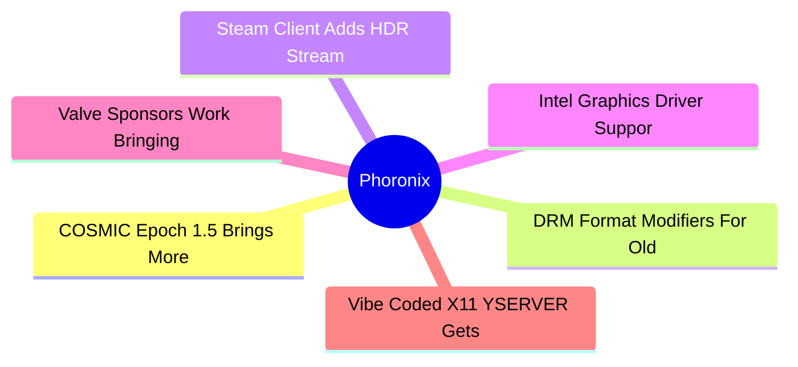
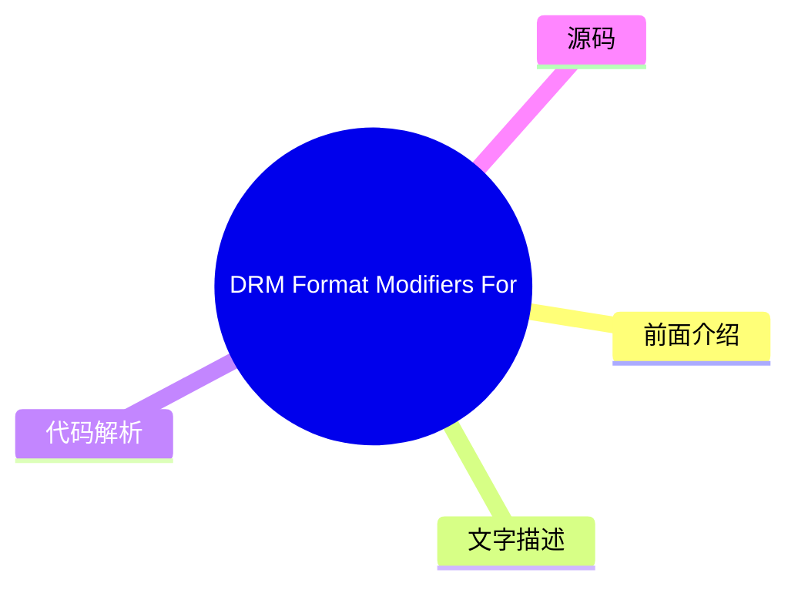
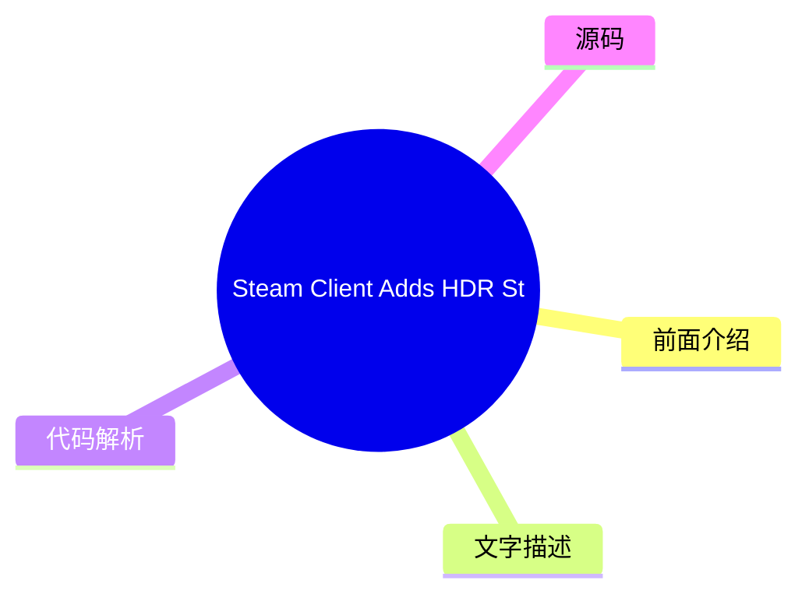
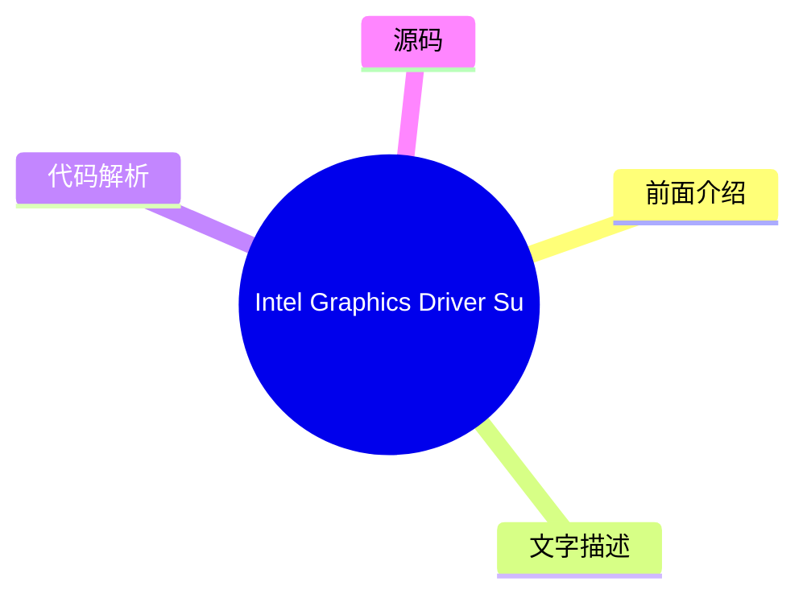
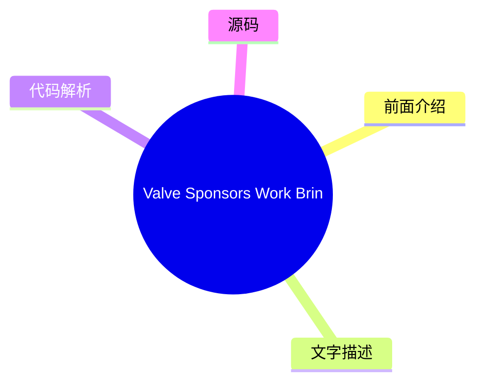

# ⚙️ Phoronix Top 6 (2026-07-31)

## 前面介绍

- 数据源：Phoronix
- 抓取日期：2026-07-31
- 条目数：6
- 含完整正文：0
- 含代码片段：0
- 组织方式：前面介绍 / 树状图 / 文字描述 / 代码解析 / 源码

## 思维导图

## 详细整理（6 条，0 条含全文，0 条含代码）

### 1. COSMIC Epoch 1.5 Brings More Fixes & Improvements To System76's Desktop
- **链接**: [https://www.phoronix.com/news/COSMIC-Epoch-1.5-Released](https://www.phoronix.com/news/COSMIC-Epoch-1.5-Released)
- **作者**: Michael Larabel
- **发布**: Wed, 29 Jul 2026 20:21:55 -0400

#### 前面介绍

- The System76 and Pop!_OS developers continue quickly iterating on their Rust-based COSMIC desktop environment...
- 作者：Michael Larabel
- 发布时间：Wed, 29 Jul 2026 20:21:55 -0400

#### 树状图

#### 文字描述

- The System76 and Pop!_OS developers continue quickly iterating on their Rust-based COSMIC desktop environment...

#### 代码解析

- 本文未检测到明确代码块，内容更偏新闻、观点或方法论。

#### 源码

未抓到可展示源码或原文节选。

### 2. DRM Format Modifiers For Old AMD GPUs Coming With Linux 7.3: Thanks Valve
- **链接**: [https://www.phoronix.com/news/Linux-7.3-AMDGPU-GFX6-Modifiers](https://www.phoronix.com/news/Linux-7.3-AMDGPU-GFX6-Modifiers)
- **作者**: Michael Larabel
- **发布**: Wed, 29 Jul 2026 16:47:11 -0400

#### 前面介绍

- Sent out today was another week's worth of features and other code changes to the AMDGPU kernel graphics driver and AMDKFD kernel compute driver. We are nearing the cut-off of new feature material for next month's Linux 7.3 kernel but there is some n
- 作者：Michael Larabel
- 发布时间：Wed, 29 Jul 2026 16:47:11 -0400

#### 树状图

#### 文字描述

- Sent out today was another week's worth of features and other code changes to the AMDGPU kernel graphics driver and AMDKFD kernel compute driver. We are nearing the cut-off of new feature material for next month's Linux 7.3 kernel but there is some n

#### 代码解析

- 本文未检测到明确代码块，内容更偏新闻、观点或方法论。

#### 源码

未抓到可展示源码或原文节选。

### 3. Steam Client Adds HDR Streaming On Steam Deck OLED, AV1 Video Streaming
- **链接**: [https://www.phoronix.com/news/Steam-Beta-Video-Streaming](https://www.phoronix.com/news/Steam-Beta-Video-Streaming)
- **作者**: Michael Larabel
- **发布**: Wed, 29 Jul 2026 15:07:07 -0400

#### 前面介绍

- Today's Steam client beta update brings some new game streaming enhancements for Linux gamers...
- 作者：Michael Larabel
- 发布时间：Wed, 29 Jul 2026 15:07:07 -0400

#### 树状图

#### 文字描述

- Today's Steam client beta update brings some new game streaming enhancements for Linux gamers...

#### 代码解析

- 本文未检测到明确代码块，内容更偏新闻、观点或方法论。

#### 源码

未抓到可展示源码或原文节选。

### 4. Intel Graphics Driver Support For Xe3 "Peak Bandwidth Threshold" Feature In Linux 7.3
- **链接**: [https://www.phoronix.com/news/Intel-Linux-7.3-Peak-Bandwidth](https://www.phoronix.com/news/Intel-Linux-7.3-Peak-Bandwidth)
- **作者**: Michael Larabel
- **发布**: Wed, 29 Jul 2026 09:12:09 -0400

#### 前面介绍

- Intel today sent out their latest batch of kernel graphics driver updates that are ready for staging ahead of next month's Linux 7.3 merge window...
- 作者：Michael Larabel
- 发布时间：Wed, 29 Jul 2026 09:12:09 -0400

#### 树状图

#### 文字描述

- Intel today sent out their latest batch of kernel graphics driver updates that are ready for staging ahead of next month's Linux 7.3 merge window...

#### 代码解析

- 本文未检测到明确代码块，内容更偏新闻、观点或方法论。

#### 源码

未抓到可展示源码或原文节选。

### 5. Valve Sponsors Work Bringing Open-Source RADV Driver To Windows
- **链接**: [https://www.phoronix.com/news/Valve-Sponsors-RADV-Windows](https://www.phoronix.com/news/Valve-Sponsors-RADV-Windows)
- **作者**: Michael Larabel
- **发布**: Wed, 29 Jul 2026 06:35:22 -0400

#### 前面介绍

- Valve has been sponsoring Collabora engineers with early phase, exploratory work for trying to bring the open-source Radeon Vulkan "RADV" driver to Microsoft Windows...
- 作者：Michael Larabel
- 发布时间：Wed, 29 Jul 2026 06:35:22 -0400

#### 树状图

#### 文字描述

- Valve has been sponsoring Collabora engineers with early phase, exploratory work for trying to bring the open-source Radeon Vulkan "RADV" driver to Microsoft Windows...

#### 代码解析

- 本文未检测到明确代码块，内容更偏新闻、观点或方法论。

#### 源码

未抓到可展示源码或原文节选。

### 6. Vibe Coded X11 YSERVER Gets Steam Working, Full-Screen Games With Cinnamon
- **链接**: [https://www.phoronix.com/news/YSERVER-1.4](https://www.phoronix.com/news/YSERVER-1.4)
- **作者**: Michael Larabel
- **发布**: Wed, 29 Jul 2026 06:19:44 -0400

#### 前面介绍

- A new software creation that debuted this summer was YSERVER as a modern X11 server written in Rust largely by AI via Claude Code. This YSERVER implementation has continued implementing more X11 protocol and other functionality to get more desktop en
- 作者：Michael Larabel
- 发布时间：Wed, 29 Jul 2026 06:19:44 -0400

#### 树状图

#### 文字描述

- A new software creation that debuted this summer was YSERVER as a modern X11 server written in Rust largely by AI via Claude Code. This YSERVER implementation has continued implementing more X11 protocol and other functionality to get more desktop en

#### 代码解析

- 本文未检测到明确代码块，内容更偏新闻、观点或方法论。

#### 源码

未抓到可展示源码或原文节选。

