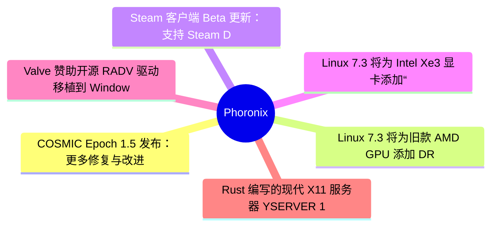
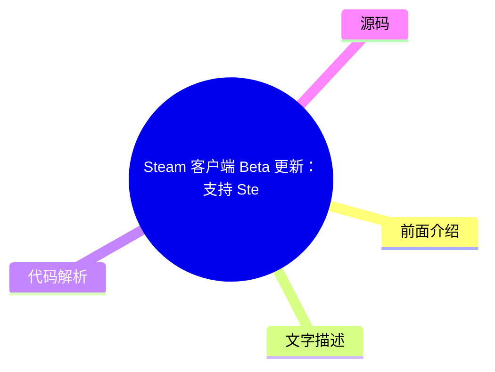
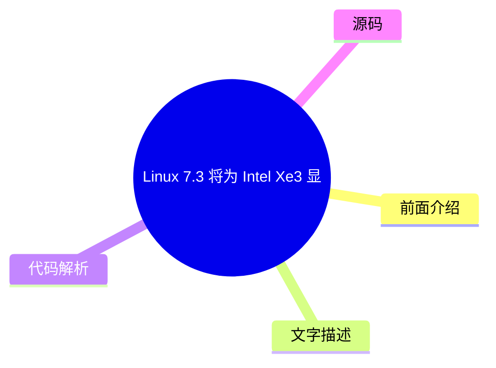
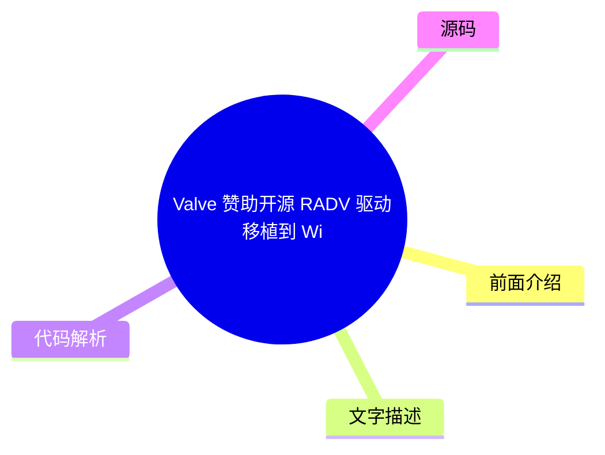

# ⚙️ Phoronix Top 6 (2026-08-01)

## 前面介绍

- 数据源：Phoronix
- 抓取日期：2026-08-01
- 条目数：6
- 含完整正文：6
- 含代码片段：0
- 组织方式：前面介绍 / 树状图 / 文字描述 / 代码解析 / 源码

## 思维导图

## 详细整理（6 条，6 条含全文，0 条含代码）

### 1. COSMIC Epoch 1.5 发布：更多修复与改进
- **链接**: [https://www.phoronix.com/news/COSMIC-Epoch-1.5-Released](https://www.phoronix.com/news/COSMIC-Epoch-1.5-Released)
- **作者**: Michael Larabel
- **发布**: Wed, 29 Jul 2026 20:21:55 -0400

#### 前面介绍

- System76 和 Pop!_OS 开发者继续快速迭代其基于 Rust 的 COSMIC 桌面环境。
- 新增了对 EXIF 方向数据的支持，用于处理 COSMIC 背景图片。
- 修复了 Chromium 应用在低于 1.0 分辨率缩放时崩溃的问题。

#### 树状图

#### 文字描述

- COSMIC Epoch 1.5 在背景处理上利用了 EXIF 方向数据，解决了图片方向错误的问题。
- 合成器修复了 GPU 重置期间的处理问题，提高了系统稳定性。
- 登录界面现在可以使用 cosmic-keymap-unstable-v1 Wayland 协议。
- 面板修复了高 CPU 占用问题，特别是在屏幕锁定时。
- 面板还修复了近期添加的“毛玻璃”效果相关的问题。
- 更多详细修复内容可在 GitHub 发布页面查看。

#### 代码解析

- 本文未提供源码，以下为实现思路或结构解析：
- 1. 背景处理逻辑：读取图片元数据中的 EXIF 方向信息，并在渲染时应用旋转矩阵。
- 2. 合成器缩放修复：针对 Chromium 等应用的 0.x 分数缩放，调整了合成器的坐标转换逻辑。
- 3. 登录界面协议：集成了 Wayland 的键位映射协议，以支持多语言和动态键盘切换。

#### 源码

#### 中文节选

# COSMIC Epoch 1.5 为 System76 的桌面带来更多修复与改进

距离发布

[COSMIC Epoch 1.4，包含 COSMIC Monitor 的改进与修复](https://www.phoronix.com/news/COSMIC-Epoch-1.4) 仅仅一周，COSMIC Epoch 1.5 现已发布。COSMIC 1.5 现在在处理 COSMIC 背景时会使用 EXIF 方向数据，COSMIC Compositor 修复了基于 Chromium 的应用在低于 1.0 分辨率缩放时崩溃的问题，在 GPU 重置期间对合成器的处理更好，并且 COSMIC Greeter 现在可以使用 cosmic-keymap-unstable-v1 Wayland 协议。

COSMIC Epoch 1.5 还为 COSMIC Panel 带来了各种修复，包括针对最近添加的毛玻璃效果的修复。此外，当屏幕锁定时，COSMIC Panel 还修复了高 CPU 使用率的问题。

此外，COSMIC Epoch 1.5 中还有大量其他修复，详情请参阅

[GitHub](https://github.com/pop-os/cosmic-epoch/releases/tag/epoch-1.5.0)。

#### 完整正文（中文）

# COSMIC Epoch 1.5 为 System76 的桌面带来更多修复与改进

距离发布

[COSMIC Epoch 1.4，包含 COSMIC Monitor 的改进与修复](https://www.phoronix.com/news/COSMIC-Epoch-1.4) 仅仅一周，COSMIC Epoch 1.5 现已发布。COSMIC 1.5 现在在处理 COSMIC 背景时会使用 EXIF 方向数据，COSMIC Compositor 修复了基于 Chromium 的应用在低于 1.0 分辨率缩放时崩溃的问题，在 GPU 重置期间对合成器的处理更好，并且 COSMIC Greeter 现在可以使用 cosmic-keymap-unstable-v1 Wayland 协议。

COSMIC Epoch 1.5 还为 COSMIC Panel 带来了各种修复，包括针对最近添加的毛玻璃效果的修复。此外，当屏幕锁定时，COSMIC Panel 还修复了高 CPU 使用率的问题。

此外，COSMIC Epoch 1.5 中还有大量其他修复，详情请参阅

[GitHub](https://github.com/pop-os/cosmic-epoch/releases/tag/epoch-1.5.0)。

### 2. Linux 7.3 将为旧款 AMD GPU 添加 DRM 格式修饰符支持
- **链接**: [https://www.phoronix.com/news/Linux-7.3-AMDGPU-GFX6-Modifiers](https://www.phoronix.com/news/Linux-7.3-AMDGPU-GFX6-Modifiers)
- **作者**: Michael Larabel
- **发布**: Wed, 29 Jul 2026 16:47:11 -0400

#### 前面介绍

- Valve 开源团队为 Linux 7.3 内核贡献了旧款 AMD 显卡（GFX6-GFX8）的 DRM 格式修饰符支持。
- 这有助于提高旧显卡在 Vulkan 和 Wayland 合成器中的性能和兼容性。
- 同时修复了 Apple Studio Display 的显示问题。

#### 树状图

#### 文字描述

- DRM 格式修饰符提供了关于图像缓冲区平铺、压缩和其他属性的详细信息。
- 支持这些修饰符可以让 Vulkan 驱动、Zink OpenGL-on-Vulkan 层以及不同图形 API 之间实现更好的互操作性。
- 此次更新涵盖了 Radeon HD 7000 系列（GCN 1.0）到 Polaris 和 Fiji 架构的显卡。
- 驱动程序还进行了 GEM 关闭优化、DCN 4.2 显示核心 IP 更新，并移除了旧的 BUG() 调用。
- AMDKFD 内核计算驱动也包含了许多 bug 修复。
- 完整的更改列表可以通过 Linux 内核邮件列表中的拉取请求查看。

#### 代码解析

- 本文未提供源码，以下为实现思路或结构解析：
- 1. 修饰符映射：在驱动中建立旧 GPU 架构与 DRM 修饰符类型的映射表，以支持特定的内存布局。
- 2. 零拷贝优化：利用修饰符信息，允许图形缓冲区直接以优化的内存布局进行传输，减少 CPU 拷贝开销。
- 3. 显示核心更新：更新 DCN 4.2 IP 的寄存器配置和时序逻辑，以适配新的显示输出需求。

#### 源码

#### 中文节选

# Linux 7.3 将为旧款 AMD GPU 带来 DRM 格式修饰符：感谢 Valve

[Linux 7.3](https://www.phoronix.com/search/Linux+7.3) 内核，但这周也有一些不错的功能更新。

对于那些使用 GFX6 到 GFX8 时代 IP 的旧款 AMD Radeon GPU（相当于最初的 Radeon HD 7000 系列“GCN 1.0”显卡，一直到基于 Polaris 和 Fiji 的显卡）来说，现在有了

[这些旧款 GPU 的 DRM 格式修饰符支持](https://www.phoronix.com/news/AMD-DRM-Format-Modifiers-GCN)。这是 Valve 开源 Linux 图形驱动团队成员 Timur Kristóf 为旧款 AMD Radeon 图形处理器带来的另一项改进。

DRM 格式修饰符提供了图像缓冲区的平铺、压缩和其他属性的详细信息。根据布局的不同，它还可以帮助提高性能以及其他更多样化的用例。DRM 格式修饰符支持可以允许基于 Vulkan 的 Wayland 合成器、在 Zink OpenGL-on-Vulkan 层上运行的合成器、不同图形 API 之间的互操作性等。

GFX6 到 GFX9 的修饰符支持是本周 AMDGPU/AMDKFD 合并请求中的有趣变化之一。值得注意的是

[Apple Studio Display 修复](https://www.phoronix.com/news/AMDGPU-DC-Apple-Studio-Display)。

此外，还有 GEM 关闭优化、DCN 4.2 显示核心 IP 更新，以及

[移除旧的 BUG() 调用](https://www.phoronix.com/news/AMDGPU-Clearing-Out-BUGs)。

AMDGPU 和 AMDKFD 驱动程序也有许多 bug 修复。这些即将排队进入 Linux 7.3 的更改的完整列表可以通过

[这个合并请求](https://lore.kernel.org/dri-devel/20260729201801.4073097-1-alexander.deucher@amd.com/)找到。

#### 完整正文（中文）

# Linux 7.3 将为旧款 AMD GPU 带来 DRM 格式修饰符：感谢 Valve

[Linux 7.3](https://www.phoronix.com/search/Linux+7.3) 内核，但这周也有一些不错的功能更新。

对于那些使用 GFX6 到 GFX8 时代 IP 的旧款 AMD Radeon GPU（相当于最初的 Radeon HD 7000 系列“GCN 1.0”显卡，一直到基于 Polaris 和 Fiji 的显卡）来说，现在有了

[这些旧款 GPU 的 DRM 格式修饰符支持](https://www.phoronix.com/news/AMD-DRM-Format-Modifiers-GCN)。这是 Valve 开源 Linux 图形驱动团队成员 Timur Kristóf 为旧款 AMD Radeon 图形处理器带来的另一项改进。

DRM 格式修饰符提供了图像缓冲区的平铺、压缩和其他属性的详细信息。根据布局的不同，它还可以帮助提高性能以及其他更多样化的用例。DRM 格式修饰符支持可以允许基于 Vulkan 的 Wayland 合成器、在 Zink OpenGL-on-Vulkan 层上运行的合成器、不同图形 API 之间的互操作性等。

GFX6 到 GFX9 的修饰符支持是本周 AMDGPU/AMDKFD 合并请求中的有趣变化之一。值得注意的是

[Apple Studio Display 修复](https://www.phoronix.com/news/AMDGPU-DC-Apple-Studio-Display)。

此外，还有 GEM 关闭优化、DCN 4.2 显示核心 IP 更新，以及

[移除旧的 BUG() 调用](https://www.phoronix.com/news/AMDGPU-Clearing-Out-BUGs)。

AMDGPU 和 AMDKFD 驱动程序也有许多 bug 修复。这些即将排队进入 Linux 7.3 的更改的完整列表可以通过

[这个合并请求](https://lore.kernel.org/dri-devel/20260729201801.4073097-1-alexander.deucher@amd.com/)找到。

### 3. Steam 客户端 Beta 更新：支持 Steam Deck OLED HDR 流媒体与 AV1
- **链接**: [https://www.phoronix.com/news/Steam-Beta-Video-Streaming](https://www.phoronix.com/news/Steam-Beta-Video-Streaming)
- **作者**: Michael Larabel
- **发布**: Wed, 29 Jul 2026 15:07:07 -0400

#### 前面介绍

- Steam 客户端 Beta 版本为 Steam Deck OLED 模型增加了高动态范围（HDR）流媒体支持。
- 引入了基于实验性 SteamRT3 客户端的 AV1 视频流媒体功能。
- 为 Linux 游戏玩家提供了更现代、开放的 AV1 视频格式支持。

#### 树状图

#### 文字描述

- 对于使用 Steam Deck OLED 的用户，现在可以在流式传输游戏时享受 HDR 视觉效果。
- AV1 视频流媒体功能允许用户使用开源的 AV1 编解码器替代专有的视频编解码器。
- 该功能依赖于实验性的 SteamRT3 Steam 客户端。
- 更新还包含了一些修复，具体细节可在 Steam 客户端 Beta 的发布说明中查看。

#### 代码解析

- 本文未提供源码，以下为实现思路或结构解析：
- 1. HDR 渲染管线：在流媒体传输过程中，将源端的 HDR 元数据（如色调映射曲线）传递给接收端，并在显示端进行相应的色彩空间转换。
- 2. AV1 解码器集成：在客户端中集成 AV1 硬件或软件解码器，以实现低延迟的视频流播放。
- 3. 协议适配：调整流媒体传输协议，以支持 AV1 编码帧的传输和同步。

#### 源码

#### 中文节选

# Steam 客户端在 Steam Deck OLED 上添加 HDR 流媒体和 AV1 视频流媒体

首先，对于使用 Steam Deck OLED 型号的用户，最新的 Steam 客户端测试版中现已内置高动态范围 (HDR) 流媒体支持。

今天测试版中的第二个 Steam 流媒体增强功能是支持 Steam Deck 上的 AV1 视频流媒体。在使用实验性的 SteamRT3 Steam 客户端时，此 AV1 视频流媒体功能可用。对于那些更喜欢现代、开放的 AV1 格式而非专有视频编解码器的用户来说，这非常棒。

以下是主要亮点，此外还有一些修复，如 [发布说明](https://steamcommunity.com/groups/SteamClientBeta/announcements/detail/706653017740411333) 中所述。

#### 完整正文（中文）

# Steam 客户端在 Steam Deck OLED 上添加 HDR 流媒体和 AV1 视频流媒体

首先，对于使用 Steam Deck OLED 型号的用户，最新的 Steam 客户端测试版中现已内置高动态范围 (HDR) 流媒体支持。

今天测试版中的第二个 Steam 流媒体增强功能是支持 Steam Deck 上的 AV1 视频流媒体。在使用实验性的 SteamRT3 Steam 客户端时，此 AV1 视频流媒体功能可用。对于那些更喜欢现代、开放的 AV1 格式而非专有视频编解码器的用户来说，这非常棒。

以下是主要亮点，此外还有一些修复，如 [发布说明](https://steamcommunity.com/groups/SteamClientBeta/announcements/detail/706653017740411333) 中所述。

### 4. Linux 7.3 将为 Intel Xe3 显卡添加“峰值带宽阈值”特性支持
- **链接**: [https://www.phoronix.com/news/Intel-Linux-7.3-Peak-Bandwidth](https://www.phoronix.com/news/Intel-Linux-7.3-Peak-Bandwidth)
- **作者**: Michael Larabel
- **发布**: Wed, 29 Jul 2026 09:12:09 -0400

#### 前面介绍

- Intel 为即将到来的 Linux 7.3 内核合并窗口提交了 Xe3 “峰值带宽阈值”特性的驱动补丁。
- 该特性旨在降低 Xe3 图形硬件在 Linux 下的功耗管理需求。
- 同时支持 Thunderbolt 隧道链路的超高比特率（UHBR）链路速率。

#### 树状图

#### 文字描述

- 峰值带宽阈值特性是针对 Xe3 Panther Lake 及更新显卡设计的电源管理功能。
- 当显示所需的带宽低于最小 GV 点时，SoC 可以降低 fabric 频率。
- 阈值被定义为 20 GB/s，驱动程序会在所需数据率低于此值时请求该阈值。
- 驱动程序会检查平台是否为 Xe3+、是否存在现有 QGV 点以及 QGV 点数量是否低于 8 个。
- 一旦找到合适的平面组，驱动程序会遍历其中的 QGV 点以找到最佳匹配。
- 如果所需数据率低于 20 GB/s，则选择新添加的 QGV 点的峰值带宽。
- 更新还启用了 Thunderbolt 隧道链路的 UHBR 链路速率，并为所有支持 Alpha 混合的平面添加了混合模式属性。

#### 代码解析

- 本文未提供源码，以下为实现思路或结构解析：
- 1. 动态频率调节：根据当前显示负载动态调整 SoC fabric 频率，以在保证性能的同时降低功耗。
- 2. QGV 点管理：在带宽信息中动态插入额外的 QGV 条目，用于处理低带宽场景下的频率选择。
- 3. 平面混合模式：为图形平面添加混合模式属性，支持更复杂的透明度和合成效果。

#### 源码

#### 中文节选

# Linux 7.3 中针对 Xe3 “峰值带宽阈值”功能的 Intel 图形驱动支持

[Linux 7.3](https://www.phoronix.com/search/Linux+7.3)合并窗口。

对于终端用户而言，此功能拉取中的一项有趣更改是 Xe3 Panther Lake 图形芯片及更新型号中发现的“峰值带宽阈值”功能，它作为一种省电特性存在。这可以降低 Linux 上最新 Xe3 图形硬件的功耗管理需求。

提供此“峰值带宽阈值”功能的补丁解释道：

“在 Xe3+ 上，当显示所需带宽低于最小 GV 点时，SoC 可以降低 fabric 频率。该阈值定义为 20 GB/s。当所需数据速率低于该阈值时，驱动程序可以选择请求该阈值。

当满足以下所有条件时，在带宽信息中添加一个额外的 QGV 条目，其峰值带宽和降额带宽均设置为 20 GB/s：

1. 平台为 Xe3+。

2. 至少存在一个现有的 QGV 点。

3. QGV 点的数量低于 8（最大值）。

一旦找到平面组，驱动程序会遍历该组中的所有 QGV 点，以找到与所需数据速率的最佳匹配。如果所需数据速率低于 20 GB/s，它将从此新的 QGV 点中选择峰值带宽（20 GB/s）。”

补丁中没有提供任何数字来指示相对的省电效益。

本周的 Intel DRM 拉取请求还启用了 Thunderbolt 隧道链路的超高速比特率 (UHBR)，为所有支持 Alpha 混合的平面添加了混合模式属性，以及各种错误修复和其他增强功能。

有关本周功能补丁的更多详细信息，请参阅

[该拉取请求](https://lore.kernel.org/dri-devel/cb1b5a644d75589cbcdcc8ec8160968140426439@intel.com/)。

#### 完整正文（中文）

# Linux 7.3 中针对 Xe3 “峰值带宽阈值”功能的 Intel 图形驱动支持

[Linux 7.3](https://www.phoronix.com/search/Linux+7.3)合并窗口。

对于终端用户而言，此功能拉取中的一项有趣更改是 Xe3 Panther Lake 图形芯片及更新型号中发现的“峰值带宽阈值”功能，它作为一种省电特性存在。这可以降低 Linux 上最新 Xe3 图形硬件的功耗管理需求。

提供此“峰值带宽阈值”功能的补丁解释道：

“在 Xe3+ 上，当显示所需带宽低于最小 GV 点时，SoC 可以降低 fabric 频率。该阈值定义为 20 GB/s。当所需数据速率低于该阈值时，驱动程序可以选择请求该阈值。

当满足以下所有条件时，在带宽信息中添加一个额外的 QGV 条目，其峰值带宽和降额带宽均设置为 20 GB/s：

1. 平台为 Xe3+。

2. 至少存在一个现有的 QGV 点。

3. QGV 点的数量低于 8（最大值）。

一旦找到平面组，驱动程序会遍历该组中的所有 QGV 点，以找到与所需数据速率的最佳匹配。如果所需数据速率低于 20 GB/s，它将从此新的 QGV 点中选择峰值带宽（20 GB/s）。”

补丁中没有提供任何数字来指示相对的省电效益。

本周的 Intel DRM 拉取请求还启用了 Thunderbolt 隧道链路的超高速比特率 (UHBR)，为所有支持 Alpha 混合的平面添加了混合模式属性，以及各种错误修复和其他增强功能。

有关本周功能补丁的更多详细信息，请参阅

[该拉取请求](https://lore.kernel.org/dri-devel/cb1b5a644d75589cbcdcc8ec8160968140426439@intel.com/)。

### 5. Valve 赞助开源 RADV 驱动移植到 Windows 的工作
- **链接**: [https://www.phoronix.com/news/Valve-Sponsors-RADV-Windows](https://www.phoronix.com/news/Valve-Sponsors-RADV-Windows)
- **作者**: Michael Larabel
- **发布**: Wed, 29 Jul 2026 06:35:22 -0400

#### 前面介绍

- Valve 正在赞助 Collabora 工程师将开源的 Radeon Vulkan 驱动（RADV）移植到 Windows 平台。
- 主要挑战在于需要依赖 AMD 的专有 Windows 内核驱动程序。
- 目前已在 Windows 上成功演示了 Counter-Strike 2 的运行。

#### 树状图

#### 文字描述

- RADV 是 Linux 游戏玩家广泛使用的开源 AMD Vulkan 驱动，也是 Steam Deck 成功的关键。
- 移植工作包括实现 Windows WDDM2 集成。
- 由于 AMDGPU Linux 内核驱动移植到 Windows 的范围超出了当前工作，因此 RADV 将依赖 AMD 的官方 Windows 内核驱动。
- 这导致了需要对专有驱动程序的数据结构和元素进行逆向工程。
- 为了使 RADV 在 Windows 上正常工作，需要创建一个位于 RADV 和内核驱动之间的 shim 库，以提供稳定的接口。
- Collabora 工程师已成功在 Windows 上演示了 Counter-Strike 2 的运行。
- 实验性代码可在 Mesa 的开发分支中找到。

#### 代码解析

- 本文未提供源码，以下为实现思路或结构解析：
- 1. WDDM2 接口适配：将 RADV 的命令缓冲区提交逻辑转换为 Windows WDDM2 图形驱动程序的接口格式。
- 2. 内核驱动交互：通过 Shim 库封装对 AMD Windows 内核驱动的调用，处理未公开的数据结构变化。
- 3. 图形管线构建：在 Windows 环境下重新构建 Vulkan 图形管线，以兼容 Windows 的渲染管线状态对象（PSO）。

#### 源码

#### 中文节选

# Valve 赞助工作将开源 RADV 驱动移植到 Windows

正在开展将 Mesa RADV Vulkan 驱动移植到 Windows 的实验性工作，因为该开源驱动实现被 Linux 游戏玩家使用，也是 AMD 驱动的 Steam Deck 和现在的 Steam Machine 成功的一大关键部分。Valve 资助了多名致力于开源 RADV Vulkan 驱动和 Linux 图形栈其他部分开发的开发者。现在，他们正在赞助 Collabora 的开发者，试图让 RADV 在 Microsoft Windows 上可行。

Louis-Francis Ratté-Boulianne 发布了一篇博客文章，重点介绍了他们在将 RADV 移植到 Windows 方面的初步工作。除了致力于 Windows 的 Windows WDDM2 集成外，将 RADV 移植到 Windows 的一个主要挑战在于依赖 AMD Radeon Software Windows 内核驱动。

目前的工作范围不包括尝试将 AMDGPU Linux 内核图形驱动移植到 Windows，因此他们正在致力于将 RADV 移植到 Windows，同时依赖 AMD 的官方 Windows 内核驱动。这反过来又导致了逆向工程和其他步骤，以弄清楚专有内核驱动的数据结构和其他元素，以便 RADV 能够适应并使用它。

最终，为了真正取得良好效果，他们要么需要 Windows 上 AMD 内核图形驱动的稳定且文档化的接口，要么需要创建一个中间件库，位于 RADV 和内核驱动之间，作为一个稳定的接口来处理 AMD Radeon Software Windows 驱动版本之间未记录的更改。

正如在

[博客文章](https://www.collabora.com/news-and-blog/news-and-events/cracking-windows-open-porting-radv-to-win32.html)中所展示的，他们已经成功演示了在 Windows 上使用 RADV 运行《反恐精英 2》：

实验性代码可以通过

[这个开发分支](https://gitlab.freedesktop.org/lfrb/mesa/-/tree/wddm2?ref_type=heads)找到。

#### 完整正文（中文）

# Valve 赞助工作将开源 RADV 驱动移植到 Windows

正在开展将 Mesa RADV Vulkan 驱动移植到 Windows 的实验性工作，因为该开源驱动实现被 Linux 游戏玩家使用，也是 AMD 驱动的 Steam Deck 和现在的 Steam Machine 成功的一大关键部分。Valve 资助了多名致力于开源 RADV Vulkan 驱动和 Linux 图形栈其他部分开发的开发者。现在，他们正在赞助 Collabora 的开发者，试图让 RADV 在 Microsoft Windows 上可行。

Louis-Francis Ratté-Boulianne 发布了一篇博客文章，重点介绍了他们在将 RADV 移植到 Windows 方面的初步工作。除了致力于 Windows 的 Windows WDDM2 集成外，将 RADV 移植到 Windows 的一个主要挑战在于依赖 AMD Radeon Software Windows 内核驱动。

目前的工作范围不包括尝试将 AMDGPU Linux 内核图形驱动移植到 Windows，因此他们正在致力于将 RADV 移植到 Windows，同时依赖 AMD 的官方 Windows 内核驱动。这反过来又导致了逆向工程和其他步骤，以弄清楚专有内核驱动的数据结构和其他元素，以便 RADV 能够适应并使用它。

最终，为了真正取得良好效果，他们要么需要 Windows 上 AMD 内核图形驱动的稳定且文档化的接口，要么需要创建一个中间件库，位于 RADV 和内核驱动之间，作为一个稳定的接口来处理 AMD Radeon Software Windows 驱动版本之间未记录的更改。

正如在

[博客文章](https://www.collabora.com/news-and-blog/news-and-events/cracking-windows-open-porting-radv-to-win32.html)中所展示的，他们已经成功演示了在 Windows 上使用 RADV 运行《反恐精英 2》：

实验性代码可以通过

[这个开发分支](https://gitlab.freedesktop.org/lfrb/mesa/-/tree/wddm2?ref_type=heads)找到。

### 6. Rust 编写的现代 X11 服务器 YSERVER 1.4 发布
- **链接**: [https://www.phoronix.com/news/YSERVER-1.4](https://www.phoronix.com/news/YSERVER-1.4)
- **作者**: Michael Larabel
- **发布**: Wed, 29 Jul 2026 06:19:44 -0400

#### 前面介绍

- YSERVER 是一个由 AI 通过 Claude Code 编写的现代 X11 服务器，现已支持 Chrome 和 Steam 的 GPU 加速。
- 新增了对 KDE Plasma RandR 调整大小、ARGB 弹窗以及 Cinnamon 桌面下的全屏游戏支持。
- 该服务器已通过 openSUSE Tumbleweed 的测试认证。

#### 树状图

#### 文字描述

- YSERVER 1.4 是 YSERVER 项目的最新版本，继续实现更多的 X11 协议和功能。
- 通过实现 GLX 像素缓冲区处理，使其支持真实的 GPU 位图，从而实现了 Chrome 和 Steam 的 WebGL 加速。
- 新增了 KDE Plasma 的 RandR 调整大小和 ARGB 弹窗支持。
- 在 Cinnamon 桌面环境下，现在可以正常播放全屏游戏和视频。
- 扫描缓冲区现在通过 GBM 分配并导入到 Vulkan 中，以获得更好的驱动和 DRM 修饰符支持。
- 更新还包括启动器、手册页、键盘布局切换、FreeColors 调度以及各种性能优化。
- YSERVER 现在支持 Fedora、Debian、Ubuntu 和 Alpine 的二进制发行版。

#### 代码解析

- 本文未提供源码，以下为实现思路或结构解析：
- 1. GLX PBuffer 实现：通过 GBM 分配 GPU 内存作为像素缓冲区，绕过传统的 X11 位图传输，实现硬件加速。
- 2. Vulkan 扫描输出：将 X11 的扫描输出请求转换为 Vulkan 的图像导入操作，以利用现代 GPU 的特性。
- 3. 事件处理优化：实现了公平的核心循环和背压机制，确保在高负载下系统响应更加流畅。

#### 源码

#### 中文节选

# Vibe Coded X11 YSERVER Gets Steam Working, Full-Screen Games With Cinnamon

[YSERVER as a modern X11 server written in Rust](https://www.phoronix.com/news/YSERVER-Rust-X11-Server)largely by AI via Claude Code. This YSERVER implementation has continued

[implementing more X11 protocol and other functionality](https://www.phoronix.com/news/YSERVER-1.3-Released)to get more desktop environments and apps working surprisingly okay on this vibe coded X11 server. YSERVER 1.4 is now available as the latest in this quest.

YSERVER 1.4 notably gets Chrome and Steam GPU acceleration working. YSERVER worked on its GLX pixel buffer handling so they are backed by real GPU pixmap which in turn gets Chrome and Steam working with WebGL acceleration.

YSERVER 1.4 also now has KDE Plasma RandR resize support working, ARGB pop-ups with Plasma, and full-screen games and video playback working under the Cinnamon desktop.

[Sonic DE as a KDE Plasma X11 fork](https://www.phoronix.com/news/SonicDE-Improving-KDE-X11-Code)has also been successfully tested on YSERVER.

YSERVER was also recently

[qualified](https://github.com/joske/yserver/discussions/96)on openSUSE Tumbleweed with KDE Plasma on NVIDIA hardware:

Scanout buffers are also now allocated via GBM and imported into Vulkan for better driver and DRM modifier support.

In a message to Phoronix, the recent YSERVER enhancements in full include:

"- starty launcher (startx-style: display number picking, MIT-MAGIC-COOKIE-1, session teardown)

- man pages and other packaging improvements

- GLX pbuffers, backed by a real GPU pixmap - Chrome and Steam now get GPU acceleration

- Present completions paced to the vblank, and the Present 1.4 acquire timeline honored (fixes free-running clients, fullscreen video, Plasma's spinner)

- keyboard layout switching: stale per-key overrides cleared and a legacy MappingNotify broadcast, so clients pick up the new layout

- FreeColors dispatched instead of failing with BadRequest (Tk compatibility)

- scanout buffers allocated via GBM and imported into Vulkan (wider driver/modifier coverage)

- yserver is now truly idle when nothing happens

- core-loop fairness and backpressure

- RANDR output properties, read and write (minors 12/13/14)

- RANDR output identity passthrough: EDID, EDID_DATA, ConnectorType

- RANDR fractional refresh rates from real kernel mode timings

- Xorg-compatible output names (HDMI-1, not HDMI-A-1)

- X-Resource client accounting with LocalClientPID in QueryClientIds

- per-device libinput settings (mice and touchpads) actually apply

- XI1 feedback controls, resolution control, real event selections

- pointer motion history (GetMotionEvents)

- XI2: relative RawMotion deltas, scroll-stop on finger-lift, implicit pointer grabs, unified freeze state

- XTEST cursor comparison

- RENDER: full standard PictOp family, a8-mask destinations for CompositeGlyphs, ClipByChildren parity for Composite/Glyphs/Traps/Tris

- perf: glyph rendering batched into one instanc

#### 完整正文（中文）

# Vibe Coded X11 YSERVER Gets Steam Working, Full-Screen Games With Cinnamon

[YSERVER as a modern X11 server written in Rust](https://www.phoronix.com/news/YSERVER-Rust-X11-Server)largely by AI via Claude Code. This YSERVER implementation has continued

[implementing more X11 protocol and other functionality](https://www.phoronix.com/news/YSERVER-1.3-Released)to get more desktop environments and apps working surprisingly okay on this vibe coded X11 server. YSERVER 1.4 is now available as the latest in this quest.

YSERVER 1.4 notably gets Chrome and Steam GPU acceleration working. YSERVER worked on its GLX pixel buffer handling so they are backed by real GPU pixmap which in turn gets Chrome and Steam working with WebGL acceleration.

YSERVER 1.4 also now has KDE Plasma RandR resize support working, ARGB pop-ups with Plasma, and full-screen games and video playback working under the Cinnamon desktop.

[Sonic DE as a KDE Plasma X11 fork](https://www.phoronix.com/news/SonicDE-Improving-KDE-X11-Code)has also been successfully tested on YSERVER.

YSERVER was also recently

[qualified](https://github.com/joske/yserver/discussions/96)on openSUSE Tumbleweed with KDE Plasma on NVIDIA hardware:

Scanout buffers are also now allocated via GBM and imported into Vulkan for better driver and DRM modifier support.

In a message to Phoronix, the recent YSERVER enhancements in full include:

"- starty launcher (startx-style: display number picking, MIT-MAGIC-COOKIE-1, session teardown)

- man pages and other packaging improvements

- GLX pbuffers, backed by a real GPU pixmap - Chrome and Steam now get GPU acceleration

- Present completions paced to the vblank, and the Present 1.4 acquire timeline honored (fixes free-running clients, fullscreen video, Plasma's spinner)

- keyboard layout switching: stale per-key overrides cleared and a legacy MappingNotify broadcast, so clients pick up the new layout

- FreeColors dispatched instead of failing with BadRequest (Tk compatibility)

- scanout buffers allocated via GBM and imported into Vulkan (wider driver/modifier coverage)

- yserver is now truly idle when nothing happens

- core-loop fairness and backpressure

- RANDR output properties, read and write (minors 12/13/14)

- RANDR output identity passthrough: EDID, EDID_DATA, ConnectorType

- RANDR fractional refresh rates from real kernel mode timings

- Xorg-compatible output names (HDMI-1, not HDMI-A-1)

- X-Resource client accounting with LocalClientPID in QueryClientIds

- per-device libinput settings (mice and touchpads) actually apply

- XI1 feedback controls, resolution control, real event selections

- pointer motion history (GetMotionEvents)

- XI2: relative RawMotion deltas, scroll-stop on finger-lift, implicit pointer grabs, unified freeze state

- XTEST cursor comparison

- RENDER: full standard PictOp family, a8-mask destinations for CompositeGlyphs, ClipByChildren parity for Composite/Glyphs/Traps/Tris

- perf: glyph rendering batched into one instanced draw per text run

- cursor recoloring, and depth-1 wire bitmaps for XCreatePixmapCursor

- XKB group state and GetMap component filtering

- CopyArea source resolution simplified

- stable-toolchain build fixed on Ubuntu 26.04

- Direct-only seat model (libseat dependency dropped)

- much better responsiveness on NVIDIA GPUs

- newly working apps: Steam (WebGL), ImageMagick 'import' region-select, KDE Plasma RandR resize + ARGB popups, fullscreen games/video under Cinnamon

- newly tested and fixed desktops: sonic DE (KDE plasma X11 fork)

- binary releases for Fedora/Debian/Ubuntu/Alpine

- AUR PKGBUILD 'yserver'"

Those wishing to try out YSERVER 1.4 from source code or pre-built RPM and Debian packages can find this Rust X11 server implementation on

[GitHub](https://github.com/joske/yserver/releases/tag/v1.4.0).

