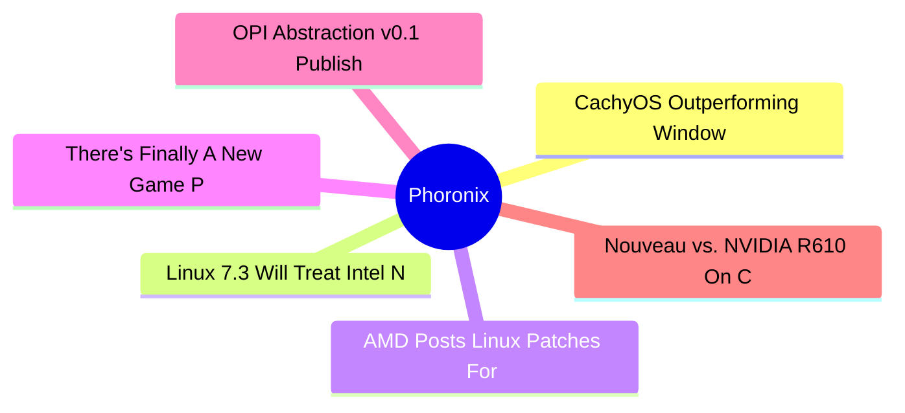
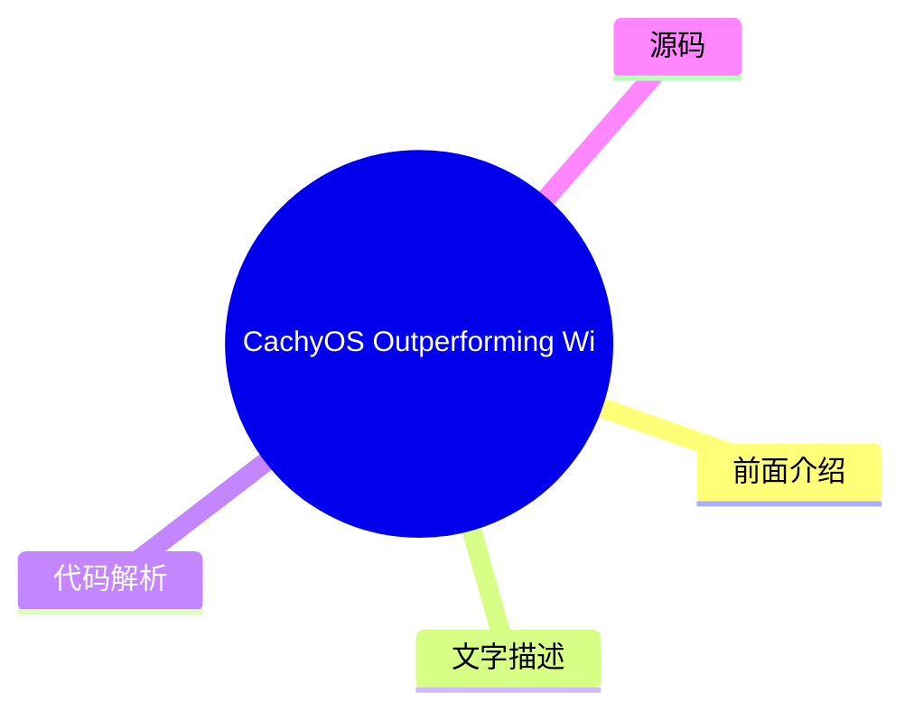
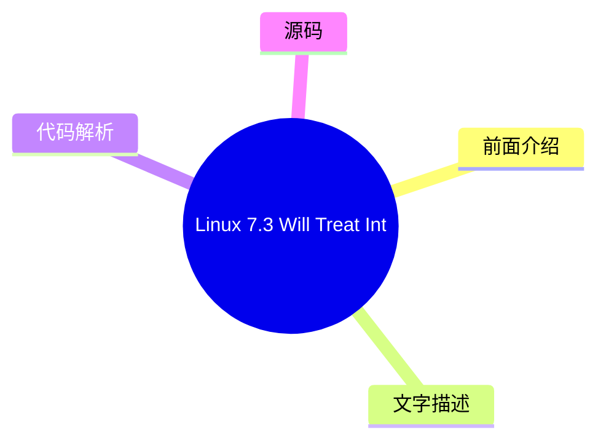
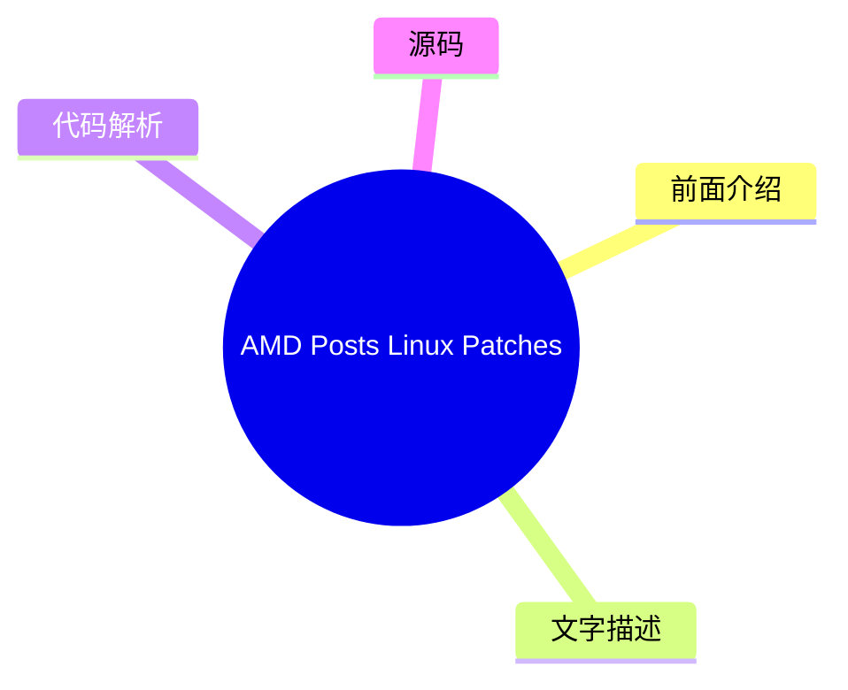
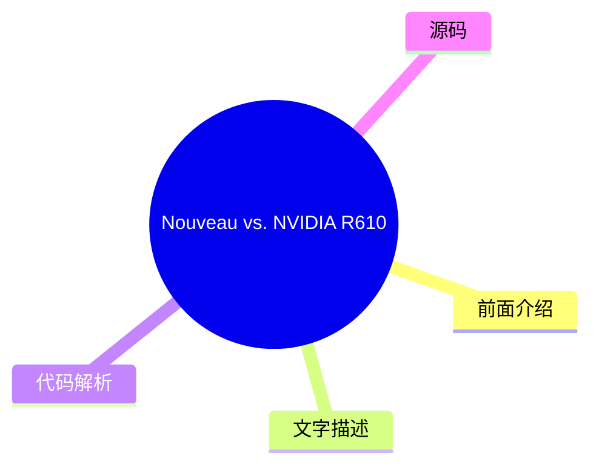

# ⚙️ Phoronix Top 6 (2026-08-02)

## 前面介绍

- 数据源：Phoronix
- 抓取日期：2026-08-02
- 条目数：6
- 含完整正文：0
- 含代码片段：0
- 组织方式：前面介绍 / 树状图 / 文字描述 / 代码解析 / 源码

## 思维导图

## 详细整理（6 条，0 条含全文，0 条含代码）

### 1. CachyOS Outperforming Windows 11, Slight Advantage Over Ubuntu & Fedora On AMD Ryzen AI 9 HX 470
- **链接**: [https://www.phoronix.com/review/amd-hx470-windows-linux](https://www.phoronix.com/review/amd-hx470-windows-linux)
- **作者**: Michael Larabel
- **发布**: Tue, 28 Jul 2026 10:04:04 -0400

#### 前面介绍

- A recent mini PC being benchmarked at Phoronix is the BOSGAME VTA-439 that employs the new AMD Ryzen AI 9 HX 470 Gorgon Point SoC. With the BOSGAME mini PC having shipped with Microsoft Windows 11, here are some comparison benchmarks of the out-of-th
- 作者：Michael Larabel
- 发布时间：Tue, 28 Jul 2026 10:04:04 -0400

#### 树状图

#### 文字描述

- A recent mini PC being benchmarked at Phoronix is the BOSGAME VTA-439 that employs the new AMD Ryzen AI 9 HX 470 Gorgon Point SoC. With the BOSGAME mini PC having shipped with Microsoft Windows 11, here are some comparison benchmarks of the out-of-th

#### 代码解析

- 本文未检测到明确代码块，内容更偏新闻、观点或方法论。

#### 源码

未抓到可展示源码或原文节选。

### 2. Linux 7.3 Will Treat Intel Nova Lake S Graphics As Stable
- **链接**: [https://www.phoronix.com/news/Linux-7.3-Intel-NVL-S-Stable](https://www.phoronix.com/news/Linux-7.3-Intel-NVL-S-Stable)
- **作者**: Michael Larabel
- **发布**: Thu, 30 Jul 2026 17:10:00 -0400

#### 前面介绍

- Ahead of the next-generation Intel Nova Lake processors expected to begin rolling out around the start of 2027, the upcoming Linux 7.3 kernel cycle is going to begin treating Nova Lake S processors with their integrated graphics as stable...
- 作者：Michael Larabel
- 发布时间：Thu, 30 Jul 2026 17:10:00 -0400

#### 树状图

#### 文字描述

- Ahead of the next-generation Intel Nova Lake processors expected to begin rolling out around the start of 2027, the upcoming Linux 7.3 kernel cycle is going to begin treating Nova Lake S processors with their integrated graphics as stable...

#### 代码解析

- 本文未检测到明确代码块，内容更偏新闻、观点或方法论。

#### 源码

未抓到可展示源码或原文节选。

### 3. AMD Posts Linux Patches For HDMI 2.1 Auto Low-Latency Mode "ALLM" & VRR
- **链接**: [https://www.phoronix.com/news/AMDGPU-HDMI-2.1-ALLM](https://www.phoronix.com/news/AMDGPU-HDMI-2.1-ALLM)
- **作者**: Michael Larabel
- **发布**: Thu, 30 Jul 2026 14:36:07 -0400

#### 前面介绍

- Following AMD posting AMDGPU patches for HDMI 2.1 FRL support after the HDMI 2.1 open-source support was long blocked by the HDMI Forum, as part of working toward a complete HDMI 2.1 implementation in this AMD Linux driver it was followed by HDMI 2.1
- 作者：Michael Larabel
- 发布时间：Thu, 30 Jul 2026 14:36:07 -0400

#### 树状图

#### 文字描述

- Following AMD posting AMDGPU patches for HDMI 2.1 FRL support after the HDMI 2.1 open-source support was long blocked by the HDMI Forum, as part of working toward a complete HDMI 2.1 implementation in this AMD Linux driver it was followed by HDMI 2.1

#### 代码解析

- 本文未检测到明确代码块，内容更偏新闻、观点或方法论。

#### 源码

未抓到可展示源码或原文节选。

### 4. There's Finally A New Game Powered By The Unigine 2 Engine
- **链接**: [https://www.phoronix.com/news/Unigine-Engine-3-Rideshare](https://www.phoronix.com/news/Unigine-Engine-3-Rideshare)
- **作者**: Michael Larabel
- **发布**: Thu, 30 Jul 2026 13:30:00 -0400

#### 前面介绍

- It's been about a decade since seeing any new games released on the visually-impressive, Linux-friendly Unigine Engine. Unigine Corp has mostly been focusing on Unigine Engine usage for simulations and other professional applications, but coming as a
- 作者：Michael Larabel
- 发布时间：Thu, 30 Jul 2026 13:30:00 -0400

#### 树状图

#### 文字描述

- It's been about a decade since seeing any new games released on the visually-impressive, Linux-friendly Unigine Engine. Unigine Corp has mostly been focusing on Unigine Engine usage for simulations and other professional applications, but coming as a

#### 代码解析

- 本文未检测到明确代码块，内容更偏新闻、观点或方法论。

#### 源码

未抓到可展示源码或原文节选。

### 5. OPI Abstraction v0.1 Published With Aiming To Standardize DPU/IPU Ecosystems
- **链接**: [https://www.phoronix.com/news/Open-Programmable-OPI-DPU-IPU](https://www.phoronix.com/news/Open-Programmable-OPI-DPU-IPU)
- **作者**: Michael Larabel
- **发布**: Thu, 30 Jul 2026 13:05:56 -0400

#### 前面介绍

- The Linux Foundation hosted Open Programmable Infrastructure "OPI" announced its first coordinated release with OPI Abstraction v0.1. The work of the Open Programmable Infrastructure is hoping to standardize the data processing unit (DPU) and infrast
- 作者：Michael Larabel
- 发布时间：Thu, 30 Jul 2026 13:05:56 -0400

#### 树状图

#### 文字描述

- The Linux Foundation hosted Open Programmable Infrastructure "OPI" announced its first coordinated release with OPI Abstraction v0.1. The work of the Open Programmable Infrastructure is hoping to standardize the data processing unit (DPU) and infrast

#### 代码解析

- 本文未检测到明确代码块，内容更偏新闻、观点或方法论。

#### 源码

未抓到可展示源码或原文节选。

### 6. Nouveau vs. NVIDIA R610 On CachyOS With The GeForce RTX 5090 Laptop GPU
- **链接**: [https://www.phoronix.com/review/nvidia-rtx-5090-laptop-linux](https://www.phoronix.com/review/nvidia-rtx-5090-laptop-linux)
- **作者**: Michael Larabel
- **发布**: Thu, 30 Jul 2026 11:00:00 -0400

#### 前面介绍

- With the Razer Blade 18 as the first laptop Razer's certifying for (Ubuntu) Linux use while testing it out I was predominantly using the NVIDIA R610 official driver stack. Some users were interested though in how well this laptop is working with the
- 作者：Michael Larabel
- 发布时间：Thu, 30 Jul 2026 11:00:00 -0400

#### 树状图

#### 文字描述

- With the Razer Blade 18 as the first laptop Razer's certifying for (Ubuntu) Linux use while testing it out I was predominantly using the NVIDIA R610 official driver stack. Some users were interested though in how well this laptop is working with the

#### 代码解析

- 本文未检测到明确代码块，内容更偏新闻、观点或方法论。

#### 源码

未抓到可展示源码或原文节选。

