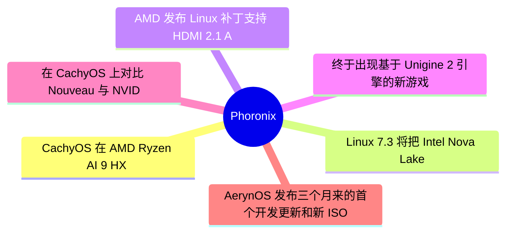
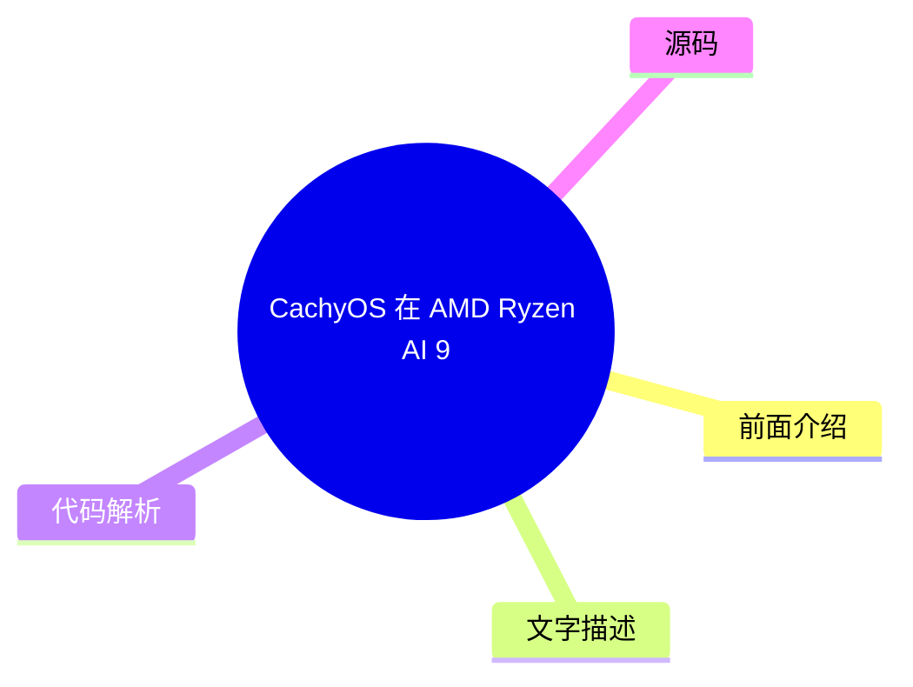
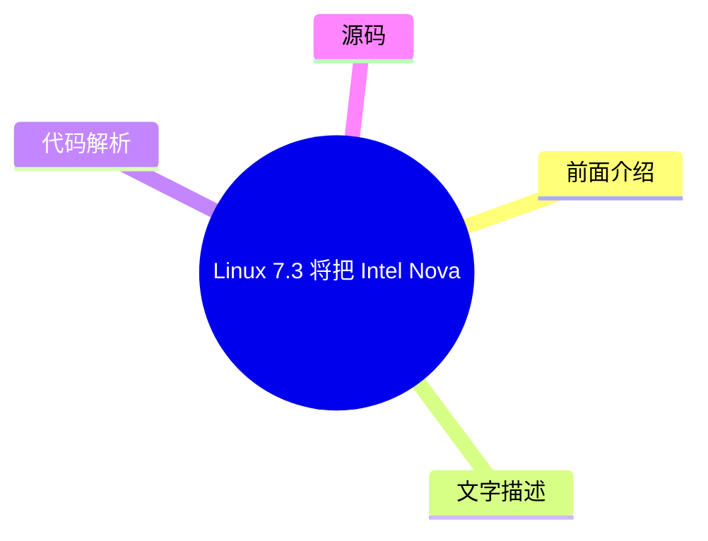

# ⚙️ Phoronix Top 6 (2026-08-03)

## 前面介绍

- 数据源：Phoronix
- 抓取日期：2026-08-03
- 条目数：6
- 含完整正文：6
- 含代码片段：0
- 组织方式：前面介绍 / 树状图 / 文字描述 / 代码解析 / 源码

## 思维导图

## 详细整理（6 条，6 条含全文，0 条含代码）

### 1. CachyOS 在 AMD Ryzen AI 9 HX 470 上超越 Windows 11
- **链接**: [https://www.phoronix.com/review/amd-hx470-windows-linux](https://www.phoronix.com/review/amd-hx470-windows-linux)
- **作者**: Michael Larabel
- **发布**: Tue, 28 Jul 2026 10:04:04 -0400

#### 前面介绍

- 测试了 BOSGAME VTA-439 迷你电脑，搭载 AMD Ryzen AI 9 HX 470 处理器。
- 对比了 Windows 11、Ubuntu 26.04 LTS、Fedora Workstation 44 和 CachyOS。
- CachyOS 在该平台上表现优异，略优于 Ubuntu 和 Fedora。

#### 树状图

#### 文字描述

- BOSGAME VTA-439 迷你电脑配备了 12 核心 / 24 线程的 AMD Ryzen AI 9 HX 470 处理器，以及 Radeon 890M 集成 RDNA 3.5 显卡。
- 测试设备配备了双 16GB DDR5-5600 内存（总计 32GB）和 1TB NVMe SSD。
- Windows 11 Pro 预装在设备上，并安装了截至 7 月 8 日的所有更新。
- 随后进行了 Ubuntu 26.04 LTS、Fedora Workstation 44 和 CachyOS 的全新安装测试。
- 所有操作系统均使用出厂默认配置进行测试，以比较不同系统在 AMD Ryzen AI 9 HX 470 平台上的性能。

#### 代码解析

- 本
- 文
- 未
- 提
- 供
- 源
- 码
- ，
- 以
- 下
- 为
- 实
- 现
- 思
- 路
- 或
- 结
- 构
- 解
- 析

#### 源码

#### 中文节选

# CachyOS 在 AMD Ryzen AI 9 HX 470 上超越 Windows 11，在 Ubuntu & Fedora 上略占优势

Phoronix 最近正在测试一款迷你电脑，即 [BOSGAME VTA-439](https://www.phoronix.com/review/bosgame-vta-439)，该设备采用了新的 AMD Ryzen AI 9 HX 470 Gorgon Point SoC。由于 BOSGAME 迷你电脑出厂时预装了 Microsoft Windows 11，以下是与 Ubuntu 26.04 LTS 和 Fedora Workstation 44 的开箱性能对比基准测试，同时也加入了基于滚动发布、高度优化的 Arch Linux 发行版 CachyOS 进行对比。

BOSGAME VTA-439 是一款有趣的迷你电脑，配备了 12 核心 / 24 线程的 AMD Ryzen AI 9 HX 470 及其 Radeon 890M 集成 RDNA 3.5 显卡。评测样机配备了双 16GB DDR5-5600 内存（总计 32GB）和 1TB NVMe SSD。

这款 BOSGAME 迷你电脑出厂预装的是 Microsoft Windows 11 Pro，并在截至 7 月 8 日的所有可用 Microsoft Windows 更新下进行了测试。随后，在测试过程中，又进行了 Ubuntu 26.04 LTS、Fedora Workstation 44 和 CachyOS 的全新安装。

每个操作系统都以其开箱配置运行，以查看这些不同的操作系统在 AMD Ryzen AI 9 HX 470 Gorgon Point 平台上的性能表现。

#### 完整正文（中文）

# CachyOS 在 AMD Ryzen AI 9 HX 470 上超越 Windows 11，在 Ubuntu & Fedora 上略占优势

Phoronix 最近正在测试一款迷你电脑，即 [BOSGAME VTA-439](https://www.phoronix.com/review/bosgame-vta-439)，该设备采用了新的 AMD Ryzen AI 9 HX 470 Gorgon Point SoC。由于 BOSGAME 迷你电脑出厂时预装了 Microsoft Windows 11，以下是与 Ubuntu 26.04 LTS 和 Fedora Workstation 44 的开箱性能对比基准测试，同时也加入了基于滚动发布、高度优化的 Arch Linux 发行版 CachyOS 进行对比。

BOSGAME VTA-439 是一款有趣的迷你电脑，配备了 12 核心 / 24 线程的 AMD Ryzen AI 9 HX 470 及其 Radeon 890M 集成 RDNA 3.5 显卡。评测样机配备了双 16GB DDR5-5600 内存（总计 32GB）和 1TB NVMe SSD。

这款 BOSGAME 迷你电脑出厂预装的是 Microsoft Windows 11 Pro，并在截至 7 月 8 日的所有可用 Microsoft Windows 更新下进行了测试。随后，在测试过程中，又进行了 Ubuntu 26.04 LTS、Fedora Workstation 44 和 CachyOS 的全新安装。

每个操作系统都以其开箱配置运行，以查看这些不同的操作系统在 AMD Ryzen AI 9 HX 470 Gorgon Point 平台上的性能表现。

### 2. Linux 7.3 将把 Intel Nova Lake S 显卡视为稳定
- **链接**: [https://www.phoronix.com/news/Linux-7.3-Intel-NVL-S-Stable](https://www.phoronix.com/news/Linux-7.3-Intel-NVL-S-Stable)
- **作者**: Michael Larabel
- **发布**: Thu, 30 Jul 2026 17:10:00 -0400

#### 前面介绍

- Linux 7.3 内核将默认启用 Nova Lake S 集成显卡。
- 此前需要使用 force_probe 参数手动启用 Nova Lake S 支持。
- 这是 Xe3P 图形支持的一部分，包含各种新修复和改进。

#### 树状图

#### 文字描述

- Intel 软件工程师已将 Xe3P 图形支持上游化，其中包括 Nova Lake 的集成显卡。
- 在 Linux 7.3 之前，Nova Lake S 集成显卡支持处于实验阶段，需要使用 'force_probe=' 模块参数手动启用。
- Linux 7.3 将把 Nova Lake S 显卡视为稳定，从而默认启用。
- 移除 force_probe 要求的补丁说明 'NVL-S 已经足够稳定，我们可以去掉 force_probe 要求。'
- 该补丁是即将到来的 Linux 7.3 合并窗口所需的 DRM-Next 的一部分。
- 除了默认启用 Nova Lake S 显卡外，还包含各种新变通方案、GuC 更新、RAS 改进和其他修复。

#### 代码解析

- 本
- 文
- 未
- 提
- 供
- 源
- 码
- ，
- 以
- 下
- 为
- 实
- 现
- 思
- 路
- 或
- 结
- 构
- 解
- 析

#### 源码

#### 中文节选

# Linux 7.3 将把 Intel Nova Lake S 显卡视为稳定版

许多个月以来，Intel 软件工程师一直在上游化 Xe3P 图形支持，以及 Nova Lake 的集成显卡。主线内核中已经有了 Nova Lake 集成显卡的实验性支持，但在现有内核中，需要使用“force_probe=”模块参数配合 Intel 显卡 PCI 设备 ID 来手动启用该支持。但从 Linux 7.3 开始，Nova Lake S 显卡将被视为稳定版，因此将默认启用。

[该补丁](https://lore.kernel.org/all/20260722-nvl_s-drop-force_probe-v1-1-db944d940cff@intel.com/)移除了对 NVL-S 的“force_probe”要求，仅备注道：

“NVL-S 已经足够稳定，我们可以移除 force_probe 要求。就这样做吧。”

该补丁是即将发送到 DRM-Next 的最终

[drm-xe-next 拉取请求](https://lore.kernel.org/dri-devel/amt2kDVdyBK6VEyU@intel.com/)的一部分，该请求将在下个月的 Linux 7.3 合并窗口之前进入 DRM-Next 的暂存区。除了开箱即用地启用 NVL-S 显卡外，还有各种新的变通方法、GuC 更新、RAS 改进以及其他修复。

因此，如果您希望在未来的几个月里在 Linux 上使用 Nova Lake S 集成显卡，请将 Linux 7.3 视为安全的最小基础版本。

#### 完整正文（中文）

# Linux 7.3 将把 Intel Nova Lake S 显卡视为稳定版

许多个月以来，Intel 软件工程师一直在上游化 Xe3P 图形支持，以及 Nova Lake 的集成显卡。主线内核中已经有了 Nova Lake 集成显卡的实验性支持，但在现有内核中，需要使用“force_probe=”模块参数配合 Intel 显卡 PCI 设备 ID 来手动启用该支持。但从 Linux 7.3 开始，Nova Lake S 显卡将被视为稳定版，因此将默认启用。

[该补丁](https://lore.kernel.org/all/20260722-nvl_s-drop-force_probe-v1-1-db944d940cff@intel.com/)移除了对 NVL-S 的“force_probe”要求，仅备注道：

“NVL-S 已经足够稳定，我们可以移除 force_probe 要求。就这样做吧。”

该补丁是即将发送到 DRM-Next 的最终

[drm-xe-next 拉取请求](https://lore.kernel.org/dri-devel/amt2kDVdyBK6VEyU@intel.com/)的一部分，该请求将在下个月的 Linux 7.3 合并窗口之前进入 DRM-Next 的暂存区。除了开箱即用地启用 NVL-S 显卡外，还有各种新的变通方法、GuC 更新、RAS 改进以及其他修复。

因此，如果您希望在未来的几个月里在 Linux 上使用 Nova Lake S 集成显卡，请将 Linux 7.3 视为安全的最小基础版本。

### 3. AMD 发布 Linux 补丁支持 HDMI 2.1 ALLM 和 VRR
- **链接**: [https://www.phoronix.com/news/AMDGPU-HDMI-2.1-ALLM](https://www.phoronix.com/news/AMDGPU-HDMI-2.1-ALLM)
- **作者**: Michael Larabel
- **发布**: Thu, 30 Jul 2026 14:36:07 -0400

#### 前面介绍

- AMD 发布了 AMDGPU 补丁以启用 HDMI 2.1 自动低延迟模式 (ALLM)。
- 补丁还支持 HDMI 2.1 可变刷新率 (VRR)。
- 这标志着 Linux 游戏体验的又一重要里程碑。

#### 树状图

#### 文字描述

- 继 HDMI 2.1 开源支持被 HDMI 论坛长期阻塞后，AMD 发布了 AMDGPU 补丁以支持 HDMI 2.1 FRL。
- 随后又发布了 HDMI 2.1 显示流压缩 (DSC) 支持。
- 最新的进展是启用 HDMI 2.1 的自动低延迟模式 (ALLM) 和 HDMI 可变刷新率 (VRR)。
- HDMI ALLM 允许计算机（或游戏系统）向显示设备通知以开启 '游戏模式'，以优化更快的游戏速度。
- 其目的是减少延迟和滞后，为现代电视/显示器提供更快的游戏体验。
- 根据用户空间请求，当内容类型设置为 '游戏' 或启用 '游戏-VRR' 可变刷新率时，AMDGPU 驱动程序将启用 HDMI 2.1 ALLM。
- 另一个令人兴奋的元素是 HDMI 2.1 VRR 支持，DisplayPort VRR 已被 AMDGPU 驱动程序长期支持。
- 这些补丁已发布在邮件列表上供审查。由于时间紧迫，可能会在 8 月下旬的 Linux v7.3 合并窗口或 v7.4 中决定。

#### 代码解析

- 本
- 文
- 未
- 提
- 供
- 源
- 码
- ，
- 以
- 下
- 为
- 实
- 现
- 思
- 路
- 或
- 结
- 构
- 解
- 析

#### 源码

#### 中文节选

# AMD 发布 Linux 补丁以支持 HDMI 2.1 自动低延迟模式 (ALLM) 和可变刷新率 (VRR)

继 HDMI 2.1 开源支持长期被 HDMI 论坛阻碍后，[AMD 发布了 AMDGPU HDMI 2.1 FRL 支持补丁](https://www.phoronix.com/news/AMDGPU-HDMI-2.1-FRL-Patches)，作为在 AMD Linux 驱动程序中实现完整 HDMI 2.1 功能的一部分，随后又发布了

[HDMI 2.1 显示流压缩](https://www.phoronix.com/news/HDMI-2.1-DSC-AMDGPU-FRL)
(DSC) 支持。现在 AMDGPU HDMI 2.1 启用路径的最新进展是启用自动低延迟模式 (ALLM) 以及 HDMI 可变刷新率！

今天发布的补丁来自 AMD，用于在 AMDGPU Linux 驱动程序中启用 HDMI 2.1 的自动低延迟模式。HDMI ALLM 允许您的计算机（或游戏系统）告知显示设备开启“游戏模式”，以针对更快的游戏速度进行优化。其目的是为了减少延迟和滞后，从而为现代电视/显示器提供更快的游戏体验。

通过 AMDGPU 驱动程序补丁，当设置的内容类型为“游戏”（根据用户空间请求）或启用“游戏-VRR”可变刷新率时，将启用 HDMI 2.1 ALLM。

另一个令人兴奋的元素是 HDMI 2.1 VRR 支持，而 DisplayPort VRR 早已被 AMDGPU 驱动程序长期支持。这是 AMD Radeon 显卡 Linux 游戏玩家的另一个令人兴奋的里程碑，终于可以享受 HDMI 2.1 VRR 了。

[补丁](https://lists.freedesktop.org/archives/amd-gfx/2026-July/149621.html)现在已在邮件列表上供审查。虽然距离即将到来的 Linux v7.3 合并窗口的 DRM-Next 截止日期时间越来越紧，但我们将看看它是否能在 8 月下旬的下一个内核周期中实现，或者是否会被推迟到 v7.4。无论如何，很高兴看到更多 AMDGPU HDMI 2.1 支持的进展。

#### 完整正文（中文）

# AMD 发布 Linux 补丁以支持 HDMI 2.1 自动低延迟模式 (ALLM) 和可变刷新率 (VRR)

继 HDMI 2.1 开源支持长期被 HDMI 论坛阻碍后，[AMD 发布了 AMDGPU HDMI 2.1 FRL 支持补丁](https://www.phoronix.com/news/AMDGPU-HDMI-2.1-FRL-Patches)，作为在 AMD Linux 驱动程序中实现完整 HDMI 2.1 功能的一部分，随后又发布了

[HDMI 2.1 显示流压缩](https://www.phoronix.com/news/HDMI-2.1-DSC-AMDGPU-FRL)
(DSC) 支持。现在 AMDGPU HDMI 2.1 启用路径的最新进展是启用自动低延迟模式 (ALLM) 以及 HDMI 可变刷新率！

今天发布的补丁来自 AMD，用于在 AMDGPU Linux 驱动程序中启用 HDMI 2.1 的自动低延迟模式。HDMI ALLM 允许您的计算机（或游戏系统）告知显示设备开启“游戏模式”，以针对更快的游戏速度进行优化。其目的是为了减少延迟和滞后，从而为现代电视/显示器提供更快的游戏体验。

通过 AMDGPU 驱动程序补丁，当设置的内容类型为“游戏”（根据用户空间请求）或启用“游戏-VRR”可变刷新率时，将启用 HDMI 2.1 ALLM。

另一个令人兴奋的元素是 HDMI 2.1 VRR 支持，而 DisplayPort VRR 早已被 AMDGPU 驱动程序长期支持。这是 AMD Radeon 显卡 Linux 游戏玩家的另一个令人兴奋的里程碑，终于可以享受 HDMI 2.1 VRR 了。

[补丁](https://lists.freedesktop.org/archives/amd-gfx/2026-July/149621.html)现在已在邮件列表上供审查。虽然距离即将到来的 Linux v7.3 合并窗口的 DRM-Next 截止日期时间越来越紧，但我们将看看它是否能在 8 月下旬的下一个内核周期中实现，或者是否会被推迟到 v7.4。无论如何，很高兴看到更多 AMDGPU HDMI 2.1 支持的进展。

### 4. 终于出现基于 Unigine 2 引擎的新游戏
- **链接**: [https://www.phoronix.com/news/Unigine-Engine-3-Rideshare](https://www.phoronix.com/news/Unigine-Engine-3-Rideshare)
- **作者**: Michael Larabel
- **发布**: Thu, 30 Jul 2026 13:30:00 -0400

#### 前面介绍

- Unigine 2 引擎自十年前以来首次应用于新游戏。
- 游戏《Rideshare Stimulator》由 Unigine Studio 开发，Saber Interactive 发行。
- 游戏计划在 Steam 上发布，支持 Windows 11，并计划支持 Linux。

#### 树状图

#### 文字描述

- Unigine Studio 和 Saber Interactive 合作开发了《Rideshare Stimulator》，这是一款沉浸式驾驶游戏。
- 游戏设定为乘客共享业务的司机和所有者，玩法独特。
- 该游戏尚未发布，已在 Steam 上列为即将推出。
- 虽然 Unigine 2 官方支持 Linux，但该游戏目前仅列出了 Windows 11 支持。
- 即使没有官方的 Linux 版本，Steam Play 也能提供支持。
- 感兴趣的玩家可以访问 Saber Games 网站了解更多信息。

#### 代码解析

- 本
- 文
- 未
- 提
- 供
- 源
- 码
- ，
- 以
- 下
- 为
- 实
- 现
- 思
- 路
- 或
- 结
- 构
- 解
- 析

#### 源码

#### 中文节选

# 终于有一款基于 Unigine 2 引擎的新游戏

由 Unigine Studio 开发、Saber Interactive 发行的是 Rideshare "Stimulator"，一款沉浸式驾驶游戏。这款独特的游戏设定围绕你作为网约车司机和车主展开。相当独特的一款游戏。

该游戏尚未发布，在

[Steam](https://store.steampowered.com/app/2366590/Rideshare_Stimulator/)上列为即将推出。最初的列表至少针对 Windows 11。虽然 Unigine 2 官方支持 Linux，但即使这款游戏没有官方的 Linux 版本，至少还有 Steam Play。

对这款游戏感兴趣的人可以在

[Saber Games](https://saber.games/rideshare/)上了解更多关于 Rideshare Stimulator 的信息。

#### 完整正文（中文）

# 终于有一款基于 Unigine 2 引擎的新游戏

由 Unigine Studio 开发、Saber Interactive 发行的是 Rideshare "Stimulator"，一款沉浸式驾驶游戏。这款独特的游戏设定围绕你作为网约车司机和车主展开。相当独特的一款游戏。

该游戏尚未发布，在

[Steam](https://store.steampowered.com/app/2366590/Rideshare_Stimulator/)上列为即将推出。最初的列表至少针对 Windows 11。虽然 Unigine 2 官方支持 Linux，但即使这款游戏没有官方的 Linux 版本，至少还有 Steam Play。

对这款游戏感兴趣的人可以在

[Saber Games](https://saber.games/rideshare/)上了解更多关于 Rideshare Stimulator 的信息。

### 5. 在 CachyOS 上对比 Nouveau 与 NVIDIA R610 驱动
- **链接**: [https://www.phoronix.com/review/nvidia-rtx-5090-laptop-linux](https://www.phoronix.com/review/nvidia-rtx-5090-laptop-linux)
- **作者**: Michael Larabel
- **发布**: Thu, 30 Jul 2026 11:00:00 -0400

#### 前面介绍

- 测试了 Razer Blade 18 笔记本在 CachyOS 上的 Nouveau+NVK 与官方 NVIDIA R610 驱动性能。
- 测试平台搭载 GeForce RTX 5090 笔记本 GPU。
- 官方驱动在性能和 CUDA 支持方面仍占优势。

#### 树状图

#### 文字描述

- Razer Blade 18 是 Razer 首款获得 Ubuntu Linux 认证的笔记本电脑，主要使用 NVIDIA R610 官方驱动栈。
- 测试了开源的上游 Nouveau+NVK 驱动栈在该笔记本上的表现。
- 测试使用的是 Linux 7.1 内核和 Mesa 26.1.4。
- Razer Blade 18 搭载了 Intel Core Ultra 9 290HX Plus、双 16GB DDR5-6400 内存、2TB Samsung NVMe SSD 和 GeForce RTX 5090 笔记本 GPU。
- 大多数 GeForce RTX 5090 笔记本 GPU 用户最好使用官方 NVIDIA 驱动栈。
- 除了性能差异外，官方驱动栈还提供 CUDA 访问权限，而开源驱动则无法提供。
- 官方驱动还支持 OpenCL 以及 NVENC/NVDEC 等功能。
- NVK 目前还不支持 Vulkan 光线追踪支持，这是不使用官方 NVIDIA Linux 驱动时的一个显著缺点。

#### 代码解析

- 本
- 文
- 未
- 提
- 供
- 源
- 码
- ，
- 以
- 下
- 为
- 实
- 现
- 思
- 路
- 或
- 结
- 构
- 解
- 析

#### 源码

#### 中文节选

# CachyOS 上 NVIDIA R610 与 Nouveau 对比：搭载 GeForce RTX 5090 笔记本 GPU

在[测试 Razer Blade 18（这是 Razer 首款认证用于（Ubuntu）Linux 的笔记本）](https://www.phoronix.com/review/razer-blade-18-linux)时，我主要使用的是 NVIDIA R610 官方驱动栈。不过，一些用户对这款笔记本在开源、上游 Nouveau+NVK 驱动栈下的表现很感兴趣，因为 Razer 也在推广这款高端笔记本用于 Linux。在归还评测机之前，我运行了一些图形基准测试，以查看搭载旗舰级 GeForce RTX 5090 笔记本 GPU 的 Razer Blade RZ09-0582 在 Nouveau+NVK 下的性能。

对于那些好奇 NVIDIA GeForce RTX 5090 笔记本 GPU 在 NVIDIA 官方 R610 驱动和开源、上游 Nouveau 内核驱动与 Mesa NVK Vulkan 驱动之间表现差异的人来说，这一轮基准测试正是为了解决这个问题。在搭载 Linux 7.1 内核的 CachyOS 上测试 Razer Blade 18 时，我使用了 NVIDIA 610.43.02 官方驱动栈与 Linux 7.1.3 + Mesa 26.1.4（滚动发布发行版）组合下的 Nouveau+NVK 进行了基准测试。

提醒一下，Razer Blade 18 RZ09-0582 配备了 Intel Core Ultra 9 290HX Plus、2 x 16GB DDR5-6400 内存、2TB Samsung NVMe SSD 以及 24GB 显存的 GeForce RTX 5090 笔记本 GPU。

从那里开始，运行了各种图形基准测试，以查看 Nouveau+NVK 在这款配备强大 GeForce RTX 5090 Laptop GPU 的高端 Razer 笔记本电脑上的表现。虽然在进行性能数据测试之前，绝大多数使用 GeForce RTX 5090 Laptop GPU 或其他 Blackwell 硬件的用户最好还是使用官方 NVIDIA 驱动程序栈。除了性能差异外，许多购买 [一款 5000 多美元的笔记本电脑](https://www.phoronix.com/review/razer-blade18-windows-linux)（截至撰写时为 5399 美元）的用户都是为了 AI/LLM 和开发目的，如果没有官方驱动程序栈，您将无法访问 CUDA。此外，还有官方 NVIDIA 驱动程序栈中提供的 OpenCL 支持以及其他功能，如 NVENC/NVDEC 等。NVK 目前还没有任何 Vulkan 光线追踪支持，这是不使用官方 NVIDIA Linux 驱动程序时的另一个显著缺点。无论如何，读者的请求和个人好奇心促使我在实验室里测试这款高端笔记本电脑时，运行了一些新鲜的 NVIDIA 与 Nouveau 基准测试。

#### 完整正文（中文）

# CachyOS 上 NVIDIA R610 与 Nouveau 对比：搭载 GeForce RTX 5090 笔记本 GPU

在[测试 Razer Blade 18（这是 Razer 首款认证用于（Ubuntu）Linux 的笔记本）](https://www.phoronix.com/review/razer-blade-18-linux)时，我主要使用的是 NVIDIA R610 官方驱动栈。不过，一些用户对这款笔记本在开源、上游 Nouveau+NVK 驱动栈下的表现很感兴趣，因为 Razer 也在推广这款高端笔记本用于 Linux。在归还评测机之前，我运行了一些图形基准测试，以查看搭载旗舰级 GeForce RTX 5090 笔记本 GPU 的 Razer Blade RZ09-0582 在 Nouveau+NVK 下的性能。

对于那些好奇 NVIDIA GeForce RTX 5090 笔记本 GPU 在 NVIDIA 官方 R610 驱动和开源、上游 Nouveau 内核驱动与 Mesa NVK Vulkan 驱动之间表现差异的人来说，这一轮基准测试正是为了解决这个问题。在搭载 Linux 7.1 内核的 CachyOS 上测试 Razer Blade 18 时，我使用了 NVIDIA 610.43.02 官方驱动栈与 Linux 7.1.3 + Mesa 26.1.4（滚动发布发行版）组合下的 Nouveau+NVK 进行了基准测试。

提醒一下，Razer Blade 18 RZ09-0582 配备了 Intel Core Ultra 9 290HX Plus、2 x 16GB DDR5-6400 内存、2TB Samsung NVMe SSD 以及 24GB 显存的 GeForce RTX 5090 笔记本 GPU。

从那里开始，运行了各种图形基准测试，以查看 Nouveau+NVK 在这款配备强大 GeForce RTX 5090 Laptop GPU 的高端 Razer 笔记本电脑上的表现。虽然在进行性能数据测试之前，绝大多数使用 GeForce RTX 5090 Laptop GPU 或其他 Blackwell 硬件的用户最好还是使用官方 NVIDIA 驱动程序栈。除了性能差异外，许多购买 [一款 5000 多美元的笔记本电脑](https://www.phoronix.com/review/razer-blade18-windows-linux)（截至撰写时为 5399 美元）的用户都是为了 AI/LLM 和开发目的，如果没有官方驱动程序栈，您将无法访问 CUDA。此外，还有官方 NVIDIA 驱动程序栈中提供的 OpenCL 支持以及其他功能，如 NVENC/NVDEC 等。NVK 目前还没有任何 Vulkan 光线追踪支持，这是不使用官方 NVIDIA Linux 驱动程序时的另一个显著缺点。无论如何，读者的请求和个人好奇心促使我在实验室里测试这款高端笔记本电脑时，运行了一些新鲜的 NVIDIA 与 Nouveau 基准测试。

### 6. AerynOS 发布三个月来的首个开发更新和新 ISO
- **链接**: [https://www.phoronix.com/news/AerynOS-Big-Update-2026](https://www.phoronix.com/news/AerynOS-Big-Update-2026)
- **作者**: Michael Larabel
- **发布**: Sun, 02 Aug 2026 20:23:32 -0400

#### 前面介绍

- AerynOS 发布了三个月来的首个开发更新和 ISO 镜像。
- 更新包括实验性 OpenZFS 文件系统支持、Wayland 集成改进。
- 升级到 Linux 7.1 内核和 NVIDIA R610 驱动。

#### 树状图

#### 文字描述

- AerynOS 开发保持强劲，发布了最新的从零开始的 Linux 发行版更新。
- 开发人员专注于确保 Linux 发行版的坚实基础，并改进构建/包工具和其他基础设施。
- 面向最终用户的近期添加包括实验性 OpenZFS 文件系统支持。
- 继续改进 Wayland 集成，并提升了硬件支持能力。
- 系统已升级到 Linux 7.1 稳定内核以及 NVIDIA R610 驱动和其他软件更新。
- 软件包更新包括 COSMIC 1.5 桌面、KDE Plasma 6.7.3、PHP 8.5.9、QEMU 11.0.3、Wine 11.14 等。
- 更多详情和下载链接可在 AerynOS.com 博客上找到。

#### 代码解析

- 本
- 文
- 未
- 提
- 供
- 源
- 码
- ，
- 以
- 下
- 为
- 实
- 现
- 思
- 路
- 或
- 结
- 构
- 解
- 析

#### 源码

#### 中文节选

# AerynOS 发布三个月来首个开发更新及新 ISO

[the last AerynOS development update and new ISO spin](https://www.phoronix.com/news/AerynOS-April-2026-Update)但幸运的是，今天已被一个新的开发更新和 ISO 镜像所取代。AerynOS 的开发势头依然强劲且持续进行，在这个从零开始的 Linux 发行版最新版本中发现了许多更改。

AerynOS 开发人员一直致力于确保其 Linux 发行版的坚实基础，并推进其围绕 Linux 发行版开发的愿景。AerynOS 开发人员继续增强其构建/打包工具和其他基础设施工作。对于终端用户，一些最近的添加包括实验性的 OpenZFS 文件系统支持、持续的 Wayland 集成改进，以及通过迁移到 Linux 7.1 稳定内核以及 NVIDIA R610 驱动程序和其他软件更新带来的更好的硬件支持。

AerynOS 中的一些最近软件包更新包括 COSMIC 1.5 桌面、KDE Plasma 6.7.3、PHP 8.5.9、QEMU 11.0.3、Wine 11.14 以及许多其他更新。

今日 AerynOS 更新的下载链接和更多详情请访问

[the AerynOS.com blog](https://aerynos.com/blog/2026/08/02/solid-foundations-are-leading-to-expanding-horizons/)。

#### 完整正文（中文）

# AerynOS 发布三个月来首个开发更新及新 ISO

[the last AerynOS development update and new ISO spin](https://www.phoronix.com/news/AerynOS-April-2026-Update)但幸运的是，今天已被一个新的开发更新和 ISO 镜像所取代。AerynOS 的开发势头依然强劲且持续进行，在这个从零开始的 Linux 发行版最新版本中发现了许多更改。

AerynOS 开发人员一直致力于确保其 Linux 发行版的坚实基础，并推进其围绕 Linux 发行版开发的愿景。AerynOS 开发人员继续增强其构建/打包工具和其他基础设施工作。对于终端用户，一些最近的添加包括实验性的 OpenZFS 文件系统支持、持续的 Wayland 集成改进，以及通过迁移到 Linux 7.1 稳定内核以及 NVIDIA R610 驱动程序和其他软件更新带来的更好的硬件支持。

AerynOS 中的一些最近软件包更新包括 COSMIC 1.5 桌面、KDE Plasma 6.7.3、PHP 8.5.9、QEMU 11.0.3、Wine 11.14 以及许多其他更新。

今日 AerynOS 更新的下载链接和更多详情请访问

[the AerynOS.com blog](https://aerynos.com/blog/2026/08/02/solid-foundations-are-leading-to-expanding-horizons/)。

