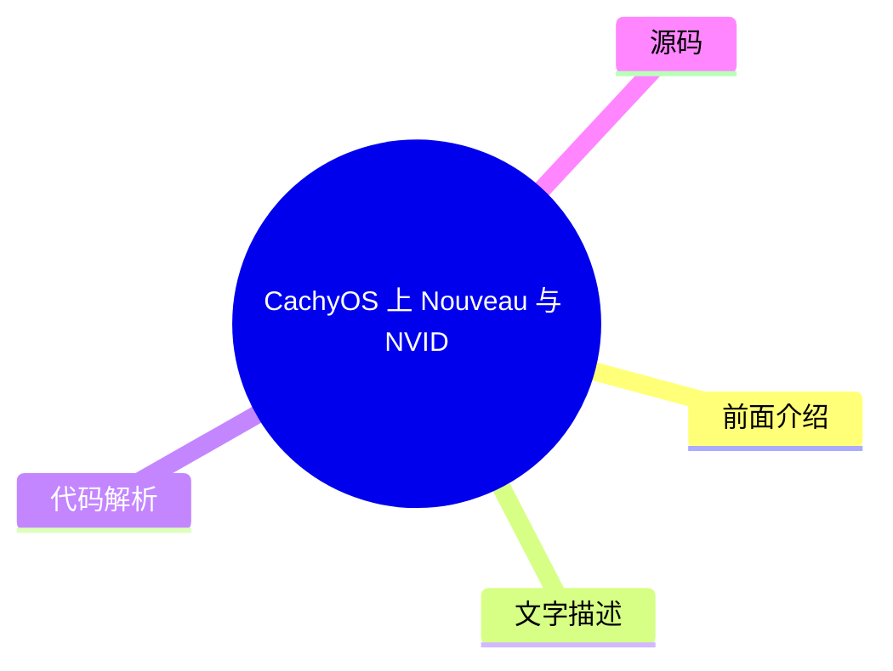
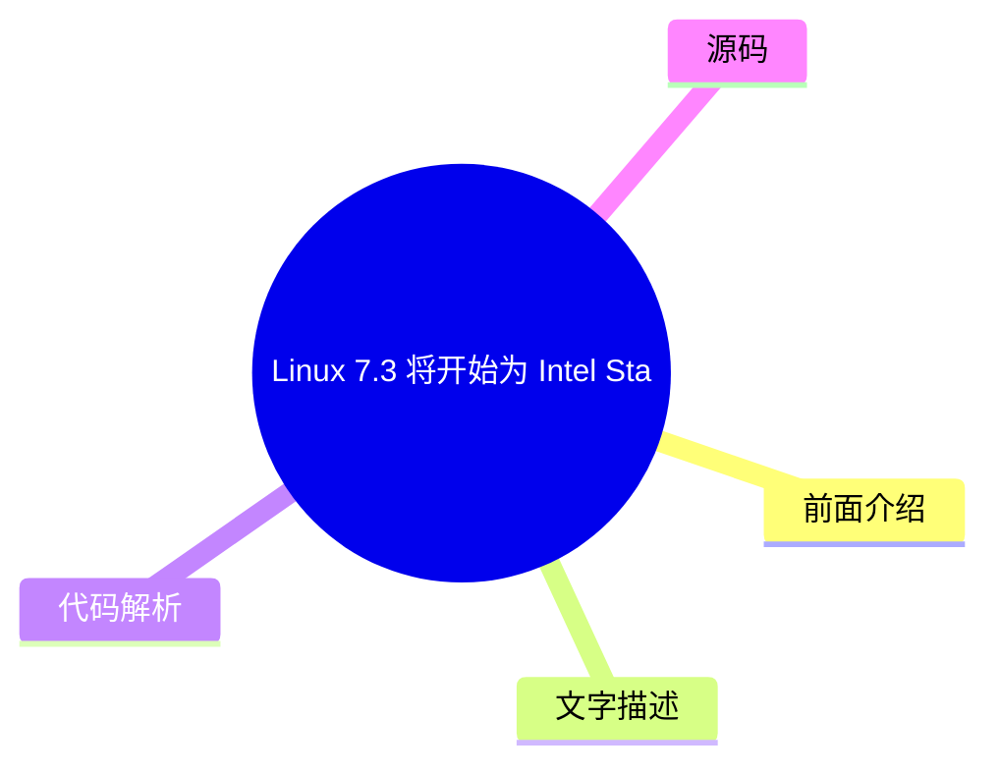

# ⚙️ Phoronix Top 6 (2026-08-04)

## 前面介绍

- 数据源：Phoronix
- 抓取日期：2026-08-04
- 条目数：6
- 含完整正文：6
- 含代码片段：0
- 组织方式：前面介绍 / 树状图 / 文字描述 / 代码解析 / 源码

## 思维导图

```mermaid
mindmap
  root((Phoronix))
    CachyOS 上 Nouveau 与 NVIDIA R
    AerynOS 发布三个月来的首个开发更新与 ISO
    Linux 7.2-rc6 发布：这是“巨大”的候选版本
    Linux 7.3 将开始为 Intel Starfir
    Linux 7.3 将支持 Qualcomm Adren
    Ubuntu Touch 正在迈向 Ubuntu 26.
```

## 详细整理（6 条，6 条含全文，0 条含代码）

### 1. CachyOS 上 Nouveau 与 NVIDIA R610 驱动性能对比
- **链接**: [https://www.phoronix.com/review/nvidia-rtx-5090-laptop-linux](https://www.phoronix.com/review/nvidia-rtx-5090-laptop-linux)
- **作者**: Michael Larabel
- **发布**: Thu, 30 Jul 2026 11:00:00 -0400

#### 前面介绍

- 测试了开源 Nouveau+NVK 驱动与官方 NVIDIA R610 驱动在 Razer Blade 18 上的性能差异。
- 对比了 Linux 7.1 内核下 RTX 5090 笔记本显卡的基准测试结果。
- 分析了开源驱动在 CUDA、OpenCL 和 NVENC/NVDEC 等功能上的缺失。

#### 树状图

#### 文字描述

- 测试平台为搭载 Intel Core Ultra 9 290HX Plus 处理器、24GB 显存和 2TB SSD 的 Razer Blade 18。
- 官方 NVIDIA R610 驱动在性能和功能上优于开源 Nouveau+NVK 组合。
- 开源驱动目前尚不支持 Vulkan 光线追踪功能，限制了其在高端应用中的表现。
- 对于主要进行 AI/LLM 开发或需要 CUDA 支持的用户，建议使用官方驱动栈。
- 尽管开源驱动存在局限，但仍有用户对其在 Linux 上的兼容性和性能表现感兴趣。

#### 代码解析

- 本
- 文
- 未
- 提
- 供
- 源
- 码
- ，
- 以
- 下
- 为
- 实
- 现
- 思
- 路
- 或
- 结
- 构
- 解
- 析

#### 源码

#### 中文节选

# CachyOS 上 NVIDIA R610 与 Nouveau 对比：搭载 GeForce RTX 5090 笔记本 GPU

在[测试 Razer Blade 18（这是 Razer 首款认证用于（Ubuntu）Linux 的笔记本）](https://www.phoronix.com/review/razer-blade-18-linux)时，我主要使用的是 NVIDIA R610 官方驱动栈。不过，一些用户对这款笔记本在开源、上游 Nouveau+NVK 驱动栈下的表现很感兴趣，因为 Razer 也在营销这款高端笔记本用于 Linux。在归还评测机之前，我运行了一些图形基准测试，以查看搭载旗舰级 GeForce RTX 5090 笔记本 GPU 的 Razer Blade RZ09-0582 在 Nouveau+NVK 下的性能。

对于那些好奇 NVIDIA GeForce RTX 5090 笔记本 GPU 在 NVIDIA 官方 R610 驱动和开源、上游 Nouveau 内核驱动与 Mesa NVK Vulkan 驱动之间表现差异的人来说，这一轮基准测试正是为了解决这个问题。在 CachyOS 上使用 Linux 7.1 内核测试 Razer Blade 18 时，我使用了 NVIDIA 610.43.02 官方驱动栈，并与 Linux 7.1.3（滚动发布发行版）上搭配 Mesa 26.1.4 的 Nouveau+NVK 组合进行了对比测试。

作为提醒，Razer Blade 18 RZ09-0582 搭载了 Intel Core Ultra 9 290HX Plus、2 x 16GB DDR5-6400 内存、2TB Samsung NVMe SSD 以及 24GB 显存的 GeForce RTX 5090 笔记本 GPU。

From there a variety of graphics benchmarks were run to see how Nouveau+NVK can work on this high-end Razer laptop with the powerful GeForce RTX 5090 Laptop GPU. Though before getting to the performance numbers, the vast majority of those using the GeForce RTX 5090 Laptop GPU or other Blackwell hardware are best off using the official NVIDIA driver stack. Besides the performance difference, many buying [a $5k+ USD laptop](https://www.phoronix.com/review/razer-blade18-windows-linux) ($5399 as of writing) will be doing so for AI/LLM and development purposes and without the official driver stack you lose out on access to CUDA. Plus the OpenCL support and other features like NVENC/NVDEC and more found with the official NVIDIA driver stack. NVK also doesn't yet have any Vulkan ray-tracing support as another notable shortcoming when not using the official NVIDIA Linux driver. In any case, reader requests and personal curiosity led me to running some fresh NVIDIA vs. Nouveau benchmarks while I had this high-end laptop in the lab for testing.

#### 完整正文（中文）

# CachyOS 上 NVIDIA R610 与 Nouveau 对比：搭载 GeForce RTX 5090 笔记本 GPU

在[测试 Razer Blade 18（这是 Razer 首款认证用于（Ubuntu）Linux 的笔记本）](https://www.phoronix.com/review/razer-blade-18-linux)时，我主要使用的是 NVIDIA R610 官方驱动栈。不过，一些用户对这款笔记本在开源、上游 Nouveau+NVK 驱动栈下的表现很感兴趣，因为 Razer 也在营销这款高端笔记本用于 Linux。在归还评测机之前，我运行了一些图形基准测试，以查看搭载旗舰级 GeForce RTX 5090 笔记本 GPU 的 Razer Blade RZ09-0582 在 Nouveau+NVK 下的性能。

对于那些好奇 NVIDIA GeForce RTX 5090 笔记本 GPU 在 NVIDIA 官方 R610 驱动和开源、上游 Nouveau 内核驱动与 Mesa NVK Vulkan 驱动之间表现差异的人来说，这一轮基准测试正是为了解决这个问题。在 CachyOS 上使用 Linux 7.1 内核测试 Razer Blade 18 时，我使用了 NVIDIA 610.43.02 官方驱动栈，并与 Linux 7.1.3（滚动发布发行版）上搭配 Mesa 26.1.4 的 Nouveau+NVK 组合进行了对比测试。

作为提醒，Razer Blade 18 RZ09-0582 搭载了 Intel Core Ultra 9 290HX Plus、2 x 16GB DDR5-6400 内存、2TB Samsung NVMe SSD 以及 24GB 显存的 GeForce RTX 5090 笔记本 GPU。

从那里，运行了各种图形基准测试，以查看 Nouveau+NVK 在这款配备强大 GeForce RTX 5090 笔记本电脑 GPU 的高端 Razer 笔记本电脑上表现如何。不过在看到性能数据之前，绝大多数使用 GeForce RTX 5090 笔记本电脑 GPU 或其他 Blackwell 硬件的用户最好还是使用官方 NVIDIA 驱动程序栈。除了性能差异外，许多购买 [一款 5000 多美元的笔记本电脑](https://www.phoronix.com/review/razer-blade18-windows-linux)（截至撰写时为 5399 美元）的用户都是为了 AI/LLM 和开发目的，如果没有官方驱动程序栈，他们将无法访问 CUDA。此外，还有官方 NVIDIA 驱动程序栈中提供的 OpenCL 支持以及其他功能，如 NVENC/NVDEC 等。NVK 目前还没有任何 Vulkan 光线追踪支持，这是不使用官方 NVIDIA Linux 驱动程序时的另一个显著缺陷。无论如何，读者的请求和个人好奇心促使我在实验室里测试这款高端笔记本电脑时，运行了一些新鲜的 NVIDIA 与 Nouveau 基准测试。

### 2. AerynOS 发布三个月来的首个开发更新与 ISO
- **链接**: [https://www.phoronix.com/news/AerynOS-Big-Update-2026](https://www.phoronix.com/news/AerynOS-Big-Update-2026)
- **作者**: Michael Larabel
- **发布**: Sun, 02 Aug 2026 20:23:32 -0400

#### 前面介绍

- AerynOS 发布了三个月以来的首个开发更新和新 ISO 镜像。
- 更新重点包括构建工具的改进、OpenZFS 文件系统支持和 Wayland 集成优化。
- 系统升级至 Linux 7.1 稳定内核并支持 NVIDIA R610 驱动。

#### 树状图

#### 文字描述

- AerynOS 开发团队致力于构建稳固的 Linux 发行版基础并推进其愿景。
- 本次更新引入了实验性的 OpenZFS 文件系统支持，增强了数据管理能力。
- Wayland 集成得到进一步改善，提升了图形界面的性能和兼容性。
- 硬件支持方面，系统已迁移至 Linux 7.1 稳定内核，并支持 NVIDIA R610 驱动。
- 软件包更新包括 COSMIC 1.5 桌面环境、KDE Plasma 6.7.3、PHP 8.5.9、QEMU 11.0.3 和 Wine 11.14。

#### 代码解析

- 本
- 文
- 未
- 提
- 供
- 源
- 码
- ，
- 以
- 下
- 为
- 实
- 现
- 思
- 路
- 或
- 结
- 构
- 解
- 析

#### 源码

#### 中文节选

# AerynOS 发布三个月来首个开发更新及新 ISO

[the last AerynOS development update and new ISO spin](https://www.phoronix.com/news/AerynOS-April-2026-Update)但幸运的是，今天已被一个新的开发更新和 ISO 镜像所取代。AerynOS 的开发依然强劲且持续进行，在这次从零开始的 Linux 发行版发布中发现了许多变化。

AerynOS 开发人员一直致力于确保其 Linux 发行版拥有坚实的基础，并推进其围绕 Linux 发行版开发的愿景。AerynOS 开发人员继续改进其构建/打包工具和其他基础设施工作。对于终端用户，一些最近的添加包括实验性的 OpenZFS 文件系统支持、持续的 Wayland 集成改进，以及通过迁移到 Linux 7.1 稳定内核以及 NVIDIA R610 驱动程序和其他软件更新带来的更好的硬件支持。

AerynOS 中一些最近的软件包更新包括 COSMIC 1.5 桌面、KDE Plasma 6.7.3、PHP 8.5.9、QEMU 11.0.3、Wine 11.14 以及许多其他更新。

有关今天 AerynOS 更新的下载和更多详细信息，请访问

[the AerynOS.com blog](https://aerynos.com/blog/2026/08/02/solid-foundations-are-leading-to-expanding-horizons/)。

#### 完整正文（中文）

# AerynOS 发布三个月来首个开发更新及新 ISO

[the last AerynOS development update and new ISO spin](https://www.phoronix.com/news/AerynOS-April-2026-Update)但幸运的是，今天已被一个新的开发更新和 ISO 镜像所取代。AerynOS 的开发依然强劲且持续进行，在这次从零开始的 Linux 发行版发布中发现了许多变化。

AerynOS 开发人员一直致力于确保其 Linux 发行版拥有坚实的基础，并推进其围绕 Linux 发行版开发的愿景。AerynOS 开发人员继续改进其构建/打包工具和其他基础设施工作。对于终端用户，一些最近的添加包括实验性的 OpenZFS 文件系统支持、持续的 Wayland 集成改进，以及通过迁移到 Linux 7.1 稳定内核以及 NVIDIA R610 驱动程序和其他软件更新带来的更好的硬件支持。

AerynOS 中一些最近的软件包更新包括 COSMIC 1.5 桌面、KDE Plasma 6.7.3、PHP 8.5.9、QEMU 11.0.3、Wine 11.14 以及许多其他更新。

有关今天 AerynOS 更新的下载和更多详细信息，请访问

[the AerynOS.com blog](https://aerynos.com/blog/2026/08/02/solid-foundations-are-leading-to-expanding-horizons/)。

### 3. Linux 7.2-rc6 发布：这是“巨大”的候选版本
- **链接**: [https://www.phoronix.com/news/Linux-7.2-rc6-Released](https://www.phoronix.com/news/Linux-7.2-rc6-Released)
- **作者**: Michael Larabel
- **发布**: Sun, 02 Aug 2026 19:38:50 -0400

#### 前面介绍

- Linux 7.2-rc6 包含了大量驱动和网络相关的修复补丁。
- 修复了西数 SATA 硬盘的兼容性问题以及 AMD Zen 5 CPU 型号识别错误。
- Linus Torvalds 称这是近年来最大的 rc6 版本之一。

#### 树状图

#### 文字描述

- Linux 7.2-rc6 是迈向 7.2 稳定版的重要测试版本，预计两周内发布。
- 本次更新中，音频修复和 DRM 图形驱动修复的数量远超预期。
- 修复了 Western Digital SATA 硬盘的 bug，解决了潜在的存储问题。
- 修正了部分 AMD Zen 5 CPU 被错误识别为 Zen 6 的问题。
- 驱动补丁占比接近 60%，网络补丁占 20%，其余为架构、工具和文件系统更新。

#### 代码解析

- 本
- 文
- 未
- 提
- 供
- 源
- 码
- ，
- 以
- 下
- 为
- 实
- 现
- 思
- 路
- 或
- 结
- 构
- 解
- 析

#### 源码

#### 中文节选

# Linux 7.2-rc6 发布：“这个 RC 很大”

[Linux 7.2](https://www.phoronix.com/search/Linux+7.2)内核有望在两周后发布。

Linux 7.2-rc6 已发布，伴随着另一轮大量的错误修复……继近期由于 AI/LLM 编码代理导致修复和其他 Linux 内核补丁增加之后，[音频修复远超预期](https://www.phoronix.com/news/Linux-7.2-rc6-Sound-Fixes)。Linux DRM 内核图形驱动程序的修复也大量涌入。本周登陆的许多其他更改还包括[绕过有故障的西部数据 SATA 驱动器](https://www.phoronix.com/news/Linux-7.2-rc6-ATA)以及[一些 AMD Zen 5 CPU 型号被错误识别为 Zen 6](https://www.phoronix.com/news/Linux-7.2-rc6-Fixing-Zen-5-IDs)。

林纳斯·托瓦兹在[7.2-rc6 公告](https://lore.kernel.org/lkml/CAHk-=whoz5Uy-kmrdzjrpCJCVWW3fni31c-zsHcH7TkOhRhfOA@mail.gmail.com/T/#u)中写道：

“嗯。这个 rc 很大。即使是按照‘新常态’的标准，这也是一个很大的 rc，我认为这至少是几年来最大的 rc6。

统计数据看起来并不特别奇怪：驱动程序略低于 60%，网络占 20%，其余 20% 是‘其他’（架构、工具、文件系统——没有什么特别奇怪的）。而且驱动程序方面是通常的 gpu 和网络驱动程序，但并非仅限于此——我们还有音频、spi、ata 等。

所以有很多网络方面的内容，这至少部分是会议时间安排导致的持续积压。我希望这就是全部内容，但在这一点上更改如此之多确实有点令人不安，即使这里没有任何东西看起来特别奇怪。

这里没有什么东西在尖叫‘糟糕’或暗示发布需要推迟，但我确实希望我们在剩下的两周里能平静下来。”

查看[Linux 7.2 功能概述](https://www.phoronix.com/review/linux-72-features)，以了解在这个将于八月底推出的内核版本中发现更改的更多详情。

#### 完整正文（中文）

# Linux 7.2-rc6 发布：“这个 RC 很大”

[Linux 7.2](https://www.phoronix.com/search/Linux+7.2)内核有望在两周后发布。

Linux 7.2-rc6 已发布，伴随着另一轮大量的错误修复……继近期由于 AI/LLM 编码代理导致修复和其他 Linux 内核补丁增加之后，[音频修复远超预期](https://www.phoronix.com/news/Linux-7.2-rc6-Sound-Fixes)。Linux DRM 内核图形驱动程序的修复也大量涌入。本周登陆的许多其他更改还包括[绕过有故障的西部数据 SATA 驱动器](https://www.phoronix.com/news/Linux-7.2-rc6-ATA)以及[一些 AMD Zen 5 CPU 型号被错误识别为 Zen 6](https://www.phoronix.com/news/Linux-7.2-rc6-Fixing-Zen-5-IDs)。

林纳斯·托瓦兹在[7.2-rc6 公告](https://lore.kernel.org/lkml/CAHk-=whoz5Uy-kmrdzjrpCJCVWW3fni31c-zsHcH7TkOhRhfOA@mail.gmail.com/T/#u)中写道：

“嗯。这个 rc 很大。即使是按照‘新常态’的标准，这也是一个很大的 rc，我认为这至少是几年来最大的 rc6。

统计数据看起来并不特别奇怪：驱动程序略低于 60%，网络占 20%，其余 20% 是‘其他’（架构、工具、文件系统——没有什么特别奇怪的）。而且驱动程序方面是通常的 gpu 和网络驱动程序，但并非仅限于此——我们还有音频、spi、ata 等。

所以有很多网络方面的内容，这至少部分是会议时间安排导致的持续积压。我希望这就是全部内容，但在这一点上更改如此之多确实有点令人不安，即使这里没有任何东西看起来特别奇怪。

这里没有什么东西在尖叫‘糟糕’或暗示发布需要推迟，但我确实希望我们在剩下的两周里能平静下来。”

查看[Linux 7.2 功能概述](https://www.phoronix.com/review/linux-72-features)，以了解在这个将于八月底推出的内核版本中发现更改的更多详情。

### 4. Linux 7.3 将开始为 Intel Starfire SoC 奠定基础
- **链接**: [https://www.phoronix.com/news/Intel-Starfire-Starts-Linux-7.3](https://www.phoronix.com/news/Intel-Starfire-Starts-Linux-7.3)
- **作者**: Michael Larabel
- **发布**: Sun, 02 Aug 2026 10:32:25 -0400

#### 前面介绍

- Intel Starfire 是一款面向极端环境（如太空）的太空级 SoC。
- Linux 7.3 将通过 EDAC 子系统支持 Intel Starfire。
- Starfire 的内存架构与 Panther Lake 非常相似，将复用现有代码路径。

#### 树状图

#### 文字描述

- Intel 在 7 月宣布了 Starfire SoC，工程样片预计本季度发货。
- 该 SoC 采用美国制造的 18A 工艺，专为 Linux 环境设计。
- 首个补丁已提交到 EDAC 的 edac-for-next 分支，添加了 Starfire 设备支持。
- 从 EDAC 角度看，Starfire 与 Panther Lake 极其相似，仅需新的设备 ID。
- 更多补丁预计将添加新的设备 ID 并遵循现有的 Panther Lake 驱动代码路径。
- Linux 内核中已存在名为 Starfire 的网络驱动，需注意区分。

#### 代码解析

- 本
- 文
- 未
- 提
- 供
- 源
- 码
- ，
- 以
- 下
- 为
- 实
- 现
- 思
- 路
- 或
- 结
- 构
- 解
- 析

#### 源码

#### 中文节选

# Linux 7.3 开始为 Intel Starfire 奠定基础

Intel 于 7 月宣布了空间级 Starfire SoC，并计划在本季度开始发货工程样品。这些在美国制造的 18A SoC 专为极端环境设计，在这些环境中 Linux 比 Windows 更常见。

上周，该补丁被排队放入错误检测与纠正 (EDAC) 子系统的 edac-for-next Git 分支中：

[该补丁](https://git.kernel.org/pub/scm/linux/kernel/git/ras/ras.git/commit/?h=edac-for-next&id=1713cc6b0e1904cf2c2b477ff25faf163c43cbdf)添加了 Intel Starfire SoC 支持。从 EDAC 角度来看，在内存架构方面，Starfire 与 Panther Lake 非常接近，并重用了 IGEN6 驱动程序中的现有代码路径。最终只需要一个新的设备 ID 即可实现 Starfire 的错误检测和纠正处理。

这是目前看到的关于 Linux 上 Intel Starfire 的第一个补丁。预计会有更多补丁，很可能主要是添加新的设备 ID，并遵循现有的 Panther Lake 驱动程序支持代码路径。也有可能 Starfire 本质上与之前提到的 Linux 内核中的“加固”版 Panther Lake 相同。

无论如何，随着 Intel [Panther Lake](https://www.phoronix.com/search/Panther+Lake) Linux 支持目前状况良好，一旦所有必要的设备 ID 添加到位，Starfire Linux 支持也应该处于良好状态。还值得一提的是，Intel 的 Starfire 并不是 Linux 内核空间中唯一的“Starfire”，因为主线 Linux 内核中还有一个现有的 Adaptec Starfire 网络驱动程序。

#### 完整正文（中文）

# Linux 7.3 开始为 Intel Starfire 奠定基础

Intel 于 7 月宣布了空间级 Starfire SoC，并计划在本季度开始发货工程样品。这些在美国制造的 18A SoC 专为极端环境设计，在这些环境中 Linux 比 Windows 更常见。

上周，该补丁被排队放入错误检测与纠正 (EDAC) 子系统的 edac-for-next Git 分支中：

[该补丁](https://git.kernel.org/pub/scm/linux/kernel/git/ras/ras.git/commit/?h=edac-for-next&id=1713cc6b0e1904cf2c2b477ff25faf163c43cbdf)添加了 Intel Starfire SoC 支持。从 EDAC 角度来看，在内存架构方面，Starfire 与 Panther Lake 非常接近，并重用了 IGEN6 驱动程序中的现有代码路径。最终只需要一个新的设备 ID 即可实现 Starfire 的错误检测和纠正处理。

这是目前看到的关于 Linux 上 Intel Starfire 的第一个补丁。预计会有更多补丁，很可能主要是添加新的设备 ID，并遵循现有的 Panther Lake 驱动程序支持代码路径。也有可能 Starfire 本质上与之前提到的 Linux 内核中的“加固”版 Panther Lake 相同。

无论如何，随着 Intel [Panther Lake](https://www.phoronix.com/search/Panther+Lake) Linux 支持目前状况良好，一旦所有必要的设备 ID 添加到位，Starfire Linux 支持也应该处于良好状态。还值得一提的是，Intel 的 Starfire 并不是 Linux 内核空间中唯一的“Starfire”，因为主线 Linux 内核中还有一个现有的 Adaptec Starfire 网络驱动程序。

### 5. Linux 7.3 将支持 Qualcomm Adreno 704 和 722 GPU
- **链接**: [https://www.phoronix.com/news/Linux-7.3-MSM-DRM-Driver](https://www.phoronix.com/news/Linux-7.3-MSM-DRM-Driver)
- **作者**: Michael Larabel
- **发布**: Sun, 02 Aug 2026 06:47:00 -0400

#### 前面介绍

- Qualcomm MSM DRM 驱动将为 Linux 7.3 添加 Adreno 704 和 722 GPU 支持。
- Adreno 722 将用于 Snapdragon 7 Gen 4 等高性能 SoC。
- 更新还包含对即将推出的 Qualcomm Shikra SoC 的 GPU 支持绑定。

#### 树状图

#### 文字描述

- MSM 驱动功能拉取请求将支持 Adreno 704 和 Adreno 722 图形处理器。
- Adreno 704 主要用于 UNO-Q 等嵌入式平台。
- Adreno 722 是更强大的版本，应用于 Snapdragon 7 Gen 4 等芯片组。
- 更新还添加了支持即将推出的 Qualcomm Shikra SoC 的设备树绑定。
- Shikra SoC 近期已获得大量 Linux 启用补丁，GPU 支持现已就绪。
- MSM 驱动更新还包括 FBDEV 模拟改进和销毁修复。

#### 代码解析

- 本
- 文
- 未
- 提
- 供
- 源
- 码
- ，
- 以
- 下
- 为
- 实
- 现
- 思
- 路
- 或
- 结
- 构
- 解
- 析

#### 源码

#### 中文节选

# Linux 7.3 将支持 Qualcomm Adreno 704 和 Adreno 722 GPU

这次 MSM 驱动功能拉取将添加对 Adreno 704 和 Adreno 722 GPU 的支持。Adreno 704 是一些嵌入式平台（如 UNO-Q）中发现的 GPU。而 Adreno 722 则是像 Snapdragon 7 Gen 4 SoC 那样更强大的兄弟芯片。

MSM 驱动拉取还添加了用于支持即将推出的 Qualcomm Shikra SoC 的设备树绑定。Qualcomm Shikra 近期已经出现了大量的 Linux 启用补丁，现在其 GPU 支持也将就位，以支持主线 Linux 7.3。

本次下一个内核版本的 MSM 更新还带来了 FBDEV 模拟的改进、销毁修复以及其他各种修复。Linux 7.3 的完整 Qualcomm MSM 内核驱动补丁列表可以通过

[此拉取请求](https://lore.kernel.org/dri-devel/CACSVV00Qo3Ercwm5NOcDtifB8JV36No7zQnShNZSj=OBfW=9cg@mail.gmail.com/) 查看。Linux 7.3 合并窗口预计将于 8 月下半月开始。

#### 完整正文（中文）

# Linux 7.3 将支持 Qualcomm Adreno 704 和 Adreno 722 GPU

这次 MSM 驱动功能拉取将添加对 Adreno 704 和 Adreno 722 GPU 的支持。Adreno 704 是一些嵌入式平台（如 UNO-Q）中发现的 GPU。而 Adreno 722 则是像 Snapdragon 7 Gen 4 SoC 那样更强大的兄弟芯片。

MSM 驱动拉取还添加了用于支持即将推出的 Qualcomm Shikra SoC 的设备树绑定。Qualcomm Shikra 近期已经出现了大量的 Linux 启用补丁，现在其 GPU 支持也将就位，以支持主线 Linux 7.3。

本次下一个内核版本的 MSM 更新还带来了 FBDEV 模拟的改进、销毁修复以及其他各种修复。Linux 7.3 的完整 Qualcomm MSM 内核驱动补丁列表可以通过

[此拉取请求](https://lore.kernel.org/dri-devel/CACSVV00Qo3Ercwm5NOcDtifB8JV36No7zQnShNZSj=OBfW=9cg@mail.gmail.com/) 查看。Linux 7.3 合并窗口预计将于 8 月下半月开始。

### 6. Ubuntu Touch 正在迈向 Ubuntu 26.04，更新 Vulkan 与应用
- **链接**: [https://www.phoronix.com/news/Ubuntu-Touch-Toward-26.04](https://www.phoronix.com/news/Ubuntu-Touch-Toward-26.04)
- **作者**: Michael Larabel
- **发布**: Sun, 02 Aug 2026 06:37:06 -0400

#### 前面介绍

- Ubuntu Touch 24.04-2.0 已发布，包含部分 Vulkan 支持和 Widevine DRM。
- 开发重点包括 PulseAudio 集成、Halium 16 移植和 Waydroid 实验性支持。
- 计划发布 Ubuntu 26.04-1.0 以切换到 Ubuntu 26.04 LTS 基础。

#### 树状图

#### 文字描述

- 社区维护的 Ubuntu Touch 移动版本正在推进向 Ubuntu 26.04 基础的过渡。
- 24.04-2.0 版本引入了部分场景下的 Vulkan 支持，并增强了 Widevine DRM 流媒体支持。
- 正在更新浏览器并改进设备加密处理。
- 开发工作包括 PulseAudio 集成更新、Halium 16 移植以及内核补丁以优化电池续航。
- 正在实验 Waydroid 以支持 Play Integrity API，旨在让 Android 银行应用在 Ubuntu Touch 上运行。
- Snap 包的 Vulkan 支持正在开发中，同时进行了多项安全改进。

#### 代码解析

- 本
- 文
- 未
- 提
- 供
- 源
- 码
- ，
- 以
- 下
- 为
- 实
- 现
- 思
- 路
- 或
- 结
- 构
- 解
- 析

#### 源码

#### 中文节选

# Ubuntu Touch 正在迈向 Ubuntu 26.04、Vulkan 和应用更新

[Ubuntu Touch 24.04-2.0](https://www.phoronix.com/news/Ubuntu-Touch-24.04-2.0-Release)（针对这个由社区维护的 Ubuntu Linux 移动版本）关于其即将到来的开发工作以及最终过渡到 Ubuntu 26.04 基础的更多细节现已公布。

Ubuntu Touch Q&A 195 现已发布（实际上报告日期是 7 月 25 日，但直到昨天才出现在他们的 RSS 订阅源中），其中概述了他们当前的开发工作以及通往即将发布的版本的路线图。随着 Ubuntu Touch 24.04-2.0 的发布，他们在某些场景下已部分支持 Vulkan，为 DRM 内容流媒体提供 Widevine 支持，更新了浏览器，并改进了设备加密处理，以及其他更改。

正在进行的一些开发工作包括 PulseAudio 集成更新、基于 Halium 16 的移植以支持更新的 Android 设备，内核补丁以启用冻结用户进程而非休眠以延长电池寿命，以及支持 Play Integrity API 的 Waydroid 实验。如果他们能实现 Play Integrity 支持，他们就可以让一些 Android 银行应用等在 Ubuntu Touch 上运行。

许多 Ubuntu Touch 应用最近已更新并继续看到新的工作，正在为 Snap 包开发 Vulkan 支持，以及各种安全改进。

Ubuntu Touch 24.04-2.1 计划在最近的 -2.0 版本基础上发布一些小的改进和修复。但更大的里程碑是 Ubuntu 26.04-1.0，旨在切换到 Ubuntu 26.04 LTS 基础。目前没有发布 Ubuntu Touch 26.04-1.0 的时间表，但这正在努力实现的目标。更多详情可在此处找到：

[UBports.com](https://ubports.com/blog/ubports-news-1/ubuntu-touch-q-a-195-4009)。

#### 完整正文（中文）

# Ubuntu Touch 正在迈向 Ubuntu 26.04、Vulkan 和应用更新

[Ubuntu Touch 24.04-2.0](https://www.phoronix.com/news/Ubuntu-Touch-24.04-2.0-Release)（针对这个由社区维护的 Ubuntu Linux 移动版本）关于其即将到来的开发工作以及最终过渡到 Ubuntu 26.04 基础的更多细节现已公布。

Ubuntu Touch Q&A 195 现已发布（实际上报告日期是 7 月 25 日，但直到昨天才出现在他们的 RSS 订阅源中），其中概述了他们当前的开发工作以及通往即将发布的版本的路线图。随着 Ubuntu Touch 24.04-2.0 的发布，他们在某些场景下已部分支持 Vulkan，为 DRM 内容流媒体提供 Widevine 支持，更新了浏览器，并改进了设备加密处理，以及其他更改。

正在进行的一些开发工作包括 PulseAudio 集成更新、基于 Halium 16 的移植以支持更新的 Android 设备，内核补丁以启用冻结用户进程而非休眠以延长电池寿命，以及支持 Play Integrity API 的 Waydroid 实验。如果他们能实现 Play Integrity 支持，他们就可以让一些 Android 银行应用等在 Ubuntu Touch 上运行。

许多 Ubuntu Touch 应用最近已更新并继续看到新的工作，正在为 Snap 包开发 Vulkan 支持，以及各种安全改进。

Ubuntu Touch 24.04-2.1 计划在最近的 -2.0 版本基础上发布一些小的改进和修复。但更大的里程碑是 Ubuntu 26.04-1.0，旨在切换到 Ubuntu 26.04 LTS 基础。目前没有发布 Ubuntu Touch 26.04-1.0 的时间表，但这正在努力实现的目标。更多详情可在此处找到：

[UBports.com](https://ubports.com/blog/ubports-news-1/ubuntu-touch-q-a-195-4009)。

