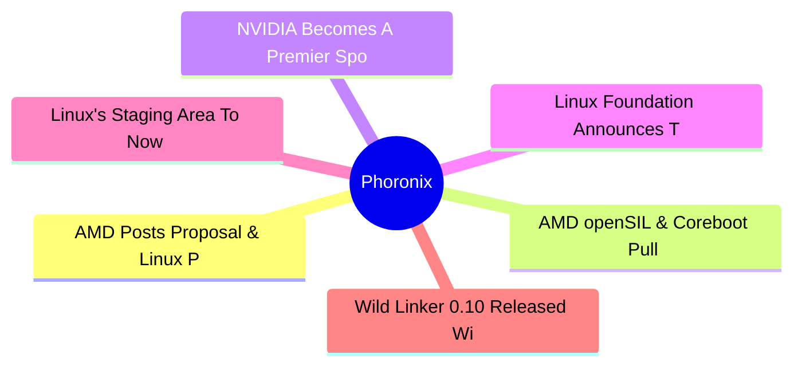
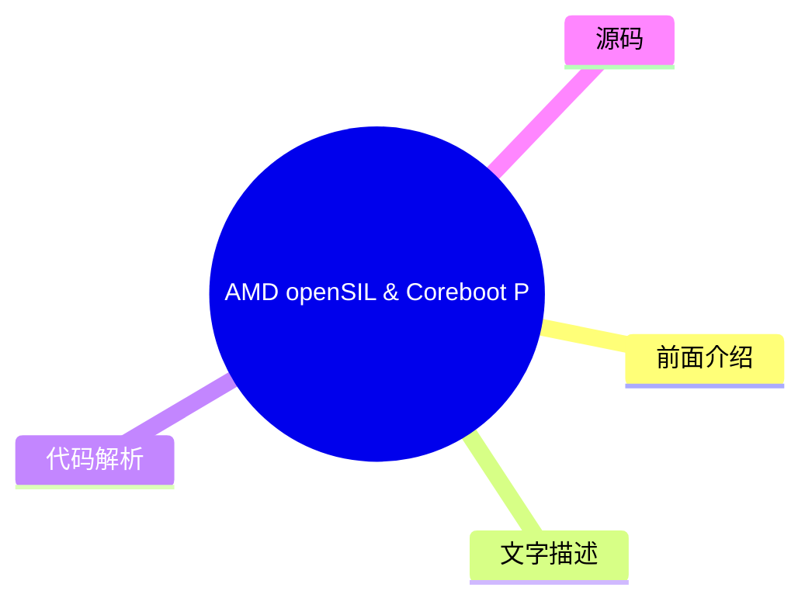
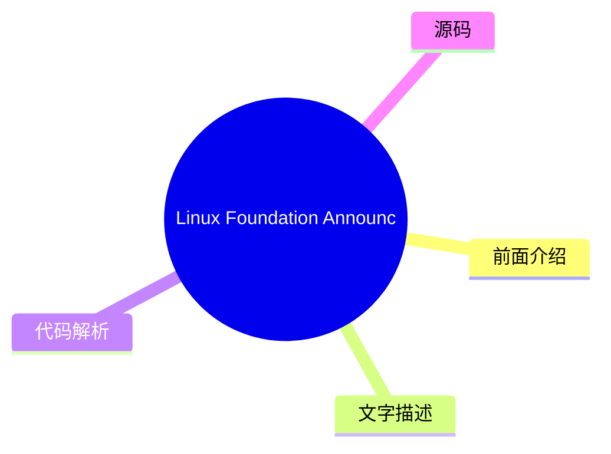

# ⚙️ Phoronix Top 6 (2026-08-05)

## 前面介绍

- 数据源：Phoronix
- 抓取日期：2026-08-05
- 条目数：6
- 含完整正文：0
- 含代码片段：0
- 组织方式：前面介绍 / 树状图 / 文字描述 / 代码解析 / 源码

## 思维导图

## 详细整理（6 条，0 条含全文，0 条含代码）

### 1. AMD Posts Proposal & Linux Patches For eSPI Subsystem
- **链接**: [https://www.phoronix.com/news/AMD-eSPI-Linux-Patches](https://www.phoronix.com/news/AMD-eSPI-Linux-Patches)
- **作者**: Michael Larabel
- **发布**: Tue, 04 Aug 2026 20:33:08 -0400

#### 前面介绍

- AMD has posted patches proposing a new Linux subsystem for the Enhanced Serial Peripheral Interface (eSPI) standard that was in turn originally developed by Intel. With AMD now making use of eSPI, they are proposing a new subsystem for it within the
- 作者：Michael Larabel
- 发布时间：Tue, 04 Aug 2026 20:33:08 -0400

#### 树状图

#### 文字描述

- AMD has posted patches proposing a new Linux subsystem for the Enhanced Serial Peripheral Interface (eSPI) standard that was in turn originally developed by Intel. With AMD now making use of eSPI, they are proposing a new subsystem for it within the

#### 代码解析

- 本文未检测到明确代码块，内容更偏新闻、观点或方法论。

#### 源码

未抓到可展示源码或原文节选。

### 2. AMD openSIL & Coreboot Pull Requests For Phoenix AM5 Support
- **链接**: [https://www.phoronix.com/news/AMD-openSIL-Phoenix-AM5-PR](https://www.phoronix.com/news/AMD-openSIL-Phoenix-AM5-PR)
- **作者**: Michael Larabel
- **发布**: Tue, 04 Aug 2026 10:07:29 -0400

#### 前面介绍

- Last week the 3mdeb firmware consulting firm released the first open-source firmware for a modern AMD Ryzen AM5 platform with their work to port AMD openSIL and Coreboot in their downstream Dasharo flavor to an MSI desktop ATX motherboard. Now that i
- 作者：Michael Larabel
- 发布时间：Tue, 04 Aug 2026 10:07:29 -0400

#### 树状图

#### 文字描述

- Last week the 3mdeb firmware consulting firm released the first open-source firmware for a modern AMD Ryzen AM5 platform with their work to port AMD openSIL and Coreboot in their downstream Dasharo flavor to an MSI desktop ATX motherboard. Now that i

#### 代码解析

- 本文未检测到明确代码块，内容更偏新闻、观点或方法论。

#### 源码

未抓到可展示源码或原文节选。

### 3. NVIDIA Becomes A Premier Sponsor Of LVFS / Fwupd
- **链接**: [https://www.phoronix.com/news/NVIDIA-Premier-Sponsor-LVFS](https://www.phoronix.com/news/NVIDIA-Premier-Sponsor-LVFS)
- **作者**: Michael Larabel
- **发布**: Tue, 04 Aug 2026 09:43:44 -0400

#### 前面介绍

- Now this is a pleasant and very unexpected surprise... NVIDIA has become the latest premier sponsor of the Linux Vendor Firmware Service (LVFS)...
- 作者：Michael Larabel
- 发布时间：Tue, 04 Aug 2026 09:43:44 -0400

#### 树状图

#### 文字描述

- Now this is a pleasant and very unexpected surprise... NVIDIA has become the latest premier sponsor of the Linux Vendor Firmware Service (LVFS)...

#### 代码解析

- 本文未检测到明确代码块，内容更偏新闻、观点或方法论。

#### 源码

未抓到可展示源码或原文节选。

### 4. Linux Foundation Announces Tokenomics Foundation For "Economics & ROI Of AI Value"
- **链接**: [https://www.phoronix.com/news/Linux-Foundation-Tokenomics](https://www.phoronix.com/news/Linux-Foundation-Tokenomics)
- **作者**: Michael Larabel
- **发布**: Tue, 04 Aug 2026 08:14:14 -0400

#### 前面介绍

- Last month the Linux Foundation launched the x402 Foundation to standardize Internet-native payments for AI agents as their latest AI play. That followed other "AI" initiatives from dealing with AI exploits to AI asset and data exchange. Today they h
- 作者：Michael Larabel
- 发布时间：Tue, 04 Aug 2026 08:14:14 -0400

#### 树状图

#### 文字描述

- Last month the Linux Foundation launched the x402 Foundation to standardize Internet-native payments for AI agents as their latest AI play. That followed other "AI" initiatives from dealing with AI exploits to AI asset and data exchange. Today they h

#### 代码解析

- 本文未检测到明确代码块，内容更偏新闻、观点或方法论。

#### 源码

未抓到可展示源码或原文节选。

### 5. Linux's Staging Area To Now Reject LLM-Generated Patches, Except For Real Security Fixes
- **链接**: [https://www.phoronix.com/news/Linux-Staging-Reject-LLMs](https://www.phoronix.com/news/Linux-Staging-Reject-LLMs)
- **作者**: Michael Larabel
- **发布**: Tue, 04 Aug 2026 06:29:29 -0400

#### 前面介绍

- While Linux's second-in-command Greg Kroah-Hartman does use AI / LLMs himself to success in the Linux kernel, given the "onslaught" of kernel patches produced by large language models and the intent on the Linux kernel's staging area being an area fo
- 作者：Michael Larabel
- 发布时间：Tue, 04 Aug 2026 06:29:29 -0400

#### 树状图

#### 文字描述

- While Linux's second-in-command Greg Kroah-Hartman does use AI / LLMs himself to success in the Linux kernel, given the "onslaught" of kernel patches produced by large language models and the intent on the Linux kernel's staging area being an area fo

#### 代码解析

- 本文未检测到明确代码块，内容更偏新闻、观点或方法论。

#### 源码

未抓到可展示源码或原文节选。

### 6. Wild Linker 0.10 Released With GDB Index Support, Mitigation For Btrfs Performance
- **链接**: [https://www.phoronix.com/news/Wild-Linker-0.10](https://www.phoronix.com/news/Wild-Linker-0.10)
- **作者**: Michael Larabel
- **发布**: Tue, 04 Aug 2026 06:14:21 -0400

#### 前面介绍

- Wild 0.10 released overnight as this very fast linker for Linux that is written in the Rust programming language and focused on iterative development...
- 作者：Michael Larabel
- 发布时间：Tue, 04 Aug 2026 06:14:21 -0400

#### 树状图

#### 文字描述

- Wild 0.10 released overnight as this very fast linker for Linux that is written in the Rust programming language and focused on iterative development...

#### 代码解析

- 本文未检测到明确代码块，内容更偏新闻、观点或方法论。

#### 源码

未抓到可展示源码或原文节选。

