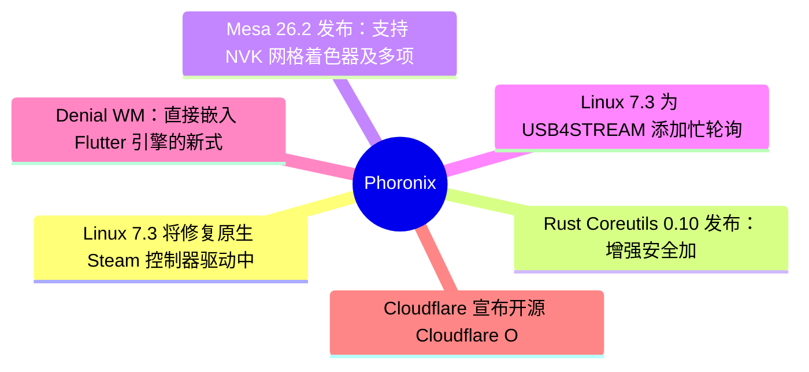
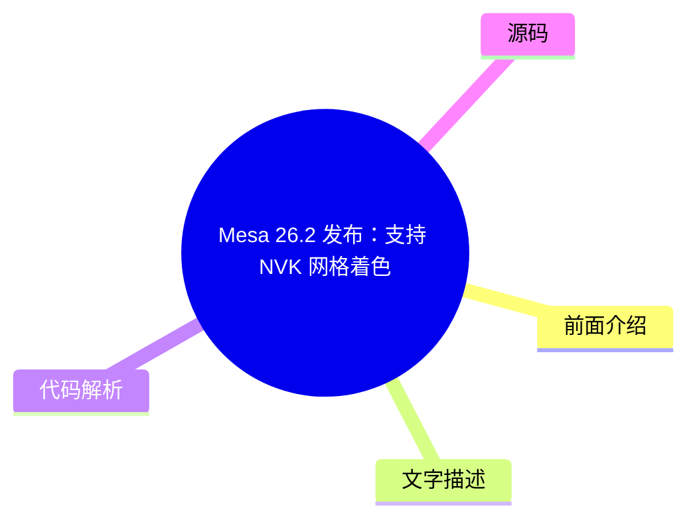

# ⚙️ Phoronix Top 6 (2026-08-06)

## 前面介绍

- 数据源：Phoronix
- 抓取日期：2026-08-06
- 条目数：6
- 含完整正文：6
- 含代码片段：0
- 组织方式：前面介绍 / 树状图 / 文字描述 / 代码解析 / 源码

## 思维导图

## 详细整理（6 条，6 条含全文，0 条含代码）

### 1. Linux 7.3 将修复原生 Steam 控制器驱动中的传感器支持缺失
- **链接**: [https://www.phoronix.com/news/Linux-7.3-Steam-Controller](https://www.phoronix.com/news/Linux-7.3-Steam-Controller)
- **作者**: Michael Larabel
- **发布**: Wed, 05 Aug 2026 20:44:00 -0400

#### 前面介绍

- Linux 7.3 内核将修复原生 HID 驱动对原始 Steam 控制器传感器事件的支持。
- 这是继 Steam Deck 支持之后，为 Steam 控制器添加的功能对齐。
- 该补丁增加了约 200 行代码，使驱动更接近 Steam 客户端和 SDL 的功能完整度。

#### 树状图

#### 文字描述

- Linux 内核长期拥有用于 Steam 控制器的 hid-steam 驱动，但一直缺乏对传感器事件的支持。
- 传感器事件由加速度计、陀螺仪、触摸握把等硬件组件触发，可用于触发游戏动作或切换行为。
- Vicki Pfau 提交的补丁消息指出，此前仅支持 Steam Deck 的传感器，现在为 Steam 控制器添加了缺失的支持。
- 该更新使原生驱动与 Steam 客户端和 SDL 库的功能更加对等。
- 除了传感器支持外，还有其他 HID 驱动补丁被合并，包括一些小的改进。

#### 代码解析

- 本
- 文
- 未
- 提
- 供
- 源
- 码
- ，
- 以
- 下
- 为
- 实
- 现
- 思
- 路
- 或
- 结
- 构
- 解
- 析
- ：
- 

- 1
- .
-  
- 驱
- 动
- 程
- 序
- 通
- 过
-  
- H
- I
- D
-  
- 子
- 系
- 统
- 接
- 口
- 与
- 硬
- 件
- 通
- 信
- 。
- 

- 2
- .
-  
- 新
- 增
- 的
- 代
- 码
- 路
- 径
- 专
- 门
- 处
- 理
- 传
- 感
- 器
- 数
- 据
- 输
- 入
- 事
- 件
- 。
- 

- 3
- .
-  
- 传
- 感
- 器
- 数
- 据
- 被
- 映
- 射
- 到
- 特
- 定
- 的
- 输
- 入
- 事
- 件
- 类
- 型
- ，
- 供
- 上
- 层
- 应
- 用
- 使
- 用
- 。

#### 源码

#### 中文节选

# Linux 7.3 To Fix Longstanding Gap In The Native Driver For Original Steam Controller

The Linux kernel has long had the

[hid-steam](https://www.phoronix.com/search/hid-steam)driver for supporting the Steam Controller outside of user-space solutions like the Steam client or SDL library. But the Steam HID driver has lacked support for sensor events, which are data inputs triggered by physical hardware components like the controller's accelerometers, gyroscope, touch grips, and more. These sensor events can be used for triggering in-game actions or toggling other behavior without necessarily pressing physical buttons.

Ahead of the Linux 7.3 merge window, a

[patch](https://git.kernel.org/pub/scm/linux/kernel/git/hid/hid.git/commit/?h=for-next&id=2eb7cf02b52156ebd19c7c14a7f5228c6adfcf97)is added to the HID subsystem's "next" branch for supporting sensor events with the original Steam Controller. Vicki Pfau who authored this patch elaborated in the commit message:

"Sensor support was added for the Steam Deck previously, but Steam Controller sensor events were never added. This adds that missing support, bringing Steam Controller support much closer to feature parity with things like SDL and Steam itself."

Some 200 lines of code get that feature now supported for the Steam HID driver with the upcoming Linux 7.3 cycle and as stated closer to feature parity with the original Steam Controller support in Steam/SDL.

In addition, a number of other Steam HID driver patches have been

[merged](https://git.kernel.org/pub/scm/linux/kernel/git/hid/hid.git/commit/?h=for-next&id=2caf9fe6d30d55c5406228918aac8869144320ff)to HID's for-next code with other minor improvements for this driver.

#### 完整正文（中文）

# Linux 7.3 将修复原生驱动对原版 Steam 控制器的长期缺失

Linux 内核长期以来一直拥有

[hid-steam](https://www.phoronix.com/search/hid-steam)驱动程序，用于在 Steam 客户端或 SDL 库等用户空间解决方案之外支持 Steam 控制器。但 Steam HID 驱动程序缺乏对传感器事件的支持，这些事件是由控制器的加速度计、陀螺仪、触摸握把等物理硬件组件触发的数据输入。这些传感器事件可用于触发游戏内动作或切换其他行为，而无需按下物理按钮。

在 Linux 7.3 合并窗口之前，一个

[补丁](https://git.kernel.org/pub/scm/linux/kernel/git/hid/hid.git/commit/?h=for-next&id=2eb7cf02b52156ebd19c7c14a7f5228c6adfcf97)被添加到 HID 子系统的“next”分支中，以支持原版 Steam 控制器的传感器事件。编写此补丁的 Vicki Pfau 在提交信息中详细说明道：

“此前已为 Steam Deck 添加了传感器支持，但从未为 Steam 控制器添加传感器事件。这增加了缺失的支持，使 Steam 控制器支持更接近 SDL 和 Steam 本身等功能。”

大约 200 行代码现在使该功能在即将到来的 Linux 7.3 周期中支持 Steam HID 驱动程序，如前所述，这使其更接近 Steam/SDL 中对原版 Steam 控制器的支持。

此外，还有其他几个 Steam HID 驱动程序补丁已

[合并](https://git.kernel.org/pub/scm/linux/kernel/git/hid/hid.git/commit/?h=for-next&id=2caf9fe6d30d55c5406228918aac8869144320ff)到 HID 的 for-next 代码中，并包含该驱动程序的其他一些小改进。

### 2. Rust Coreutils 0.10 发布：增强安全加固并提升 GNU 兼容性
- **链接**: [https://www.phoronix.com/news/Rust-Coreutils-0.10](https://www.phoronix.com/news/Rust-Coreutils-0.10)
- **作者**: Michael Larabel
- **发布**: Wed, 05 Aug 2026 18:59:00 -0400

#### 前面介绍

- Rust Coreutils 0.10 通过了更多 GNU 测试用例，通过率创历史新高。
- 新增了 TOCTOU 安全修复、SELinux 标签应用等安全加固措施。
- 支持原子交换路径的 mv 命令和单文件系统删除的 rm 命令。

#### 树状图

#### 文字描述

- Rust Coreutils 0.10 是 GNU Coreutils 的 Rust 实现版本，专注于安全性和兼容性。
- 该版本通过了另外 20 个 GNU 测试用例，总通过率达到 93.48%，为历史最高水平。
- 兼容性更新涉及行为对齐、不同 CPU 条件下的 nproc 处理、日期范围处理及格式差异。
- 错误消息得到了显著改进，许多工具移除了 panic 和 abort 行为。
- 安全加固包括第二轮 Time-of-Check to Time of-Use (TOCTOU) 修正、安全递归下降修复。
- mkdir、mkfifo、mknod 等命令现在在创建时应用 SELinux 标签。

#### 代码解析

- 本
- 文
- 未
- 提
- 供
- 源
- 码
- ，
- 以
- 下
- 为
- 实
- 现
- 思
- 路
- 或
- 结
- 构
- 解
- 析
- ：
- 

- 1
- .
-  
- 通
- 过
- 改
- 进
- 错
- 误
- 处
- 理
- 逻
- 辑
- 来
- 移
- 除
-  
- p
- a
- n
- i
- c
-  
- 和
-  
- a
- b
- o
- r
- t
- 。
- 

- 2
- .
-  
- 在
- 文
- 件
- 系
- 统
- 操
- 作
- 中
- 应
- 用
-  
- S
- E
- L
- i
- n
- u
- x
-  
- 上
- 下
- 文
- 标
- 签
- 以
- 增
- 强
- 安
- 全
- 性
- 。
- 

- 3
- .
-  
- 优
- 化
- 了
- 原
- 子
- 交
- 换
- 和
- 单
- 文
- 件
- 系
- 统
- 删
- 除
- 等
- 操
- 作
- 的
- 实
- 现
- 。

#### 源码

#### 中文节选

# Rust Coreutils 0.10 Released With More Security Hardening, Increased GNU Compatibility

Rust Coreutils 0.10 is now passing for another 20 GNU Test Suite cases, bringing the total pass rate to 93.48% as an all-time high. These GNU compatibility updates involved better aligning on behavior, nproc handling for different CPU conditions, date out-of-range years, and various formatting differences. Many error messages for Rust Coreutils have also been improved.

The Rust Coreutils 0.10 release also went through a second round of security hardening with more Time-of-Check to Time of-Use (TOCTOU) corrections,safe recursive descent fixes, SELinux labels now applied at creation for mkdir / mkfifo / mknod, and other security updates.

This new release also removes panics and aborts from a range of different core utilities, the

*mv --exchange*is now supported for atomically swapping two paths,

*rm --one-file-system*is now supported, and there are also various performance improvements and other improvements.

Downloads and the full list of changes with Rust Coreutils 0.10 can be found via

[GitHub](https://github.com/uutils/coreutils/releases/tag/0.10.0).

#### 完整正文（中文）

# Rust Coreutils 0.10 发布，包含更多安全加固和提升的 GNU 兼容性

Rust Coreutils 0.10 现已通过另外 20 个 GNU 测试套件用例，将通过率提升至历史最高的 93.48%。这些 GNU 兼容性更新涉及更好地对齐行为、针对不同 CPU 条件的 nproc 处理、日期超出范围的年份以及各种格式差异。Rust Coreutils 的许多错误信息也得到了改进。

Rust Coreutils 0.10 版本还经历了第二轮安全加固，包括更多的时序检查到时序使用（TOCTOU）修正、安全递归下降修复、在创建时应用 SELinux 标签的 mkdir / mkfifo / mknod，以及其他安全更新。

此新版本还移除了多种核心实用程序中的 panic 和 abort，*mv --exchange* 现在支持原子性地交换两个路径，*rm --one-file-system* 现在已受支持，此外还有各种性能改进和其他改进。

下载和 Rust Coreutils 0.10 的完整更改列表可通过

[GitHub](https://github.com/uutils/coreutils/releases/tag/0.10.0) 查看。

### 3. Mesa 26.2 发布：支持 NVK 网格着色器及多项 Vulkan 改进
- **链接**: [https://www.phoronix.com/news/Mesa-26.2-Released](https://www.phoronix.com/news/Mesa-26.2-Released)
- **作者**: Michael Larabel
- **发布**: Wed, 05 Aug 2026 18:13:57 -0400

#### 前面介绍

- Mesa 26.2 为 NVIDIA NVK 驱动添加了 VK_EXT_mesh_shader 支持。
- 新增了用于检查加速结构和光线追踪调度的 Gamma 工具。
- 支持 G1-Ultra、G1-Premium 和 G1-Pro GPU，并增加了大量 Vulkan 扩展。

#### 树状图

#### 文字描述

- Mesa 26.2 是开源 OpenGL 和 Vulkan 驱动程序的季度功能更新。
- 在 Vulkan API 方面，NVK 驱动继续成熟，Intel ANV 和 AMD RADV 驱动获得多项优化。
- KosmicKrisp 驱动现在支持 Vulkan 1.4，Rusticl 继续提供更好的 OpenCL 支持。
- 新增了 KRAID 编译器用于 Arm Mali Panfrost/PanVK 驱动。
- 早期工作开始支持 AMD GFX12.1 图形，并合并了多种新的 Vulkan 扩展。
- R600g 和 R300g 老驱动在开发期间也获得了多项修复。

#### 代码解析

- 本
- 文
- 未
- 提
- 供
- 源
- 码
- ，
- 以
- 下
- 为
- 实
- 现
- 思
- 路
- 或
- 结
- 构
- 解
- 析
- ：
- 

- 1
- .
-  
- N
- V
- K
-  
- 驱
- 动
- 实
- 现
- 了
-  
- V
- K
- _
- E
- X
- T
- _
- m
- e
- s
- h
- _
- s
- h
- a
- d
- e
- r
-  
- 扩
- 展
- 以
- 支
- 持
- 网
- 格
- 着
- 色
- 器
- 。
- 

- 2
- .
-  
- G
- a
- m
- m
- a
-  
- 工
- 具
- 目
- 前
- 仅
- 支
- 持
-  
- R
- A
- D
- V
-  
- 驱
- 动
- 用
- 于
- 调
- 试
- 加
- 速
- 结
- 构
- 。
- 

- 3
- .
-  
- 通
- 过
- 扩
- 展
- 支
- 持
-  
- G
- 1
-  
- 系
- 列
- 新
-  
- G
- P
- U
-  
- 和
- 多
- 种
-  
- V
- u
- l
- k
- a
- n
-  
- 特
- 性
- 。

#### 源码

#### 中文节选

# Mesa 26.2 Released With NVK Mesh Shader Support, Many Other Vulkan Improvements

[Mesa 26.2](https://www.phoronix.com/search/Mesa+26.2)is another splendid feature update for these open-source user-space 3D drivers, especially on the Vulkan API side where much of the activity is typically focused but also still seeing good progress for Zink OpenGL-on-Vulkan as well as Rusticl for OpenCL on Gallium3D.

Mesa 26.2 brings a number of optimizations to the Intel ANV and AMD RADV Vulkan drivers, continued work on Vulkan Video, the KosmicKrisp Vulkan to Apple Metal driver now supports Vulkan 1.4, Rusticl continues providing better OpenCL support, the NVIDIA NVK Vulkan driver continued maturing, the new KRAID compiler was merged for the Arm Mali Panfrost/PanVK drivers, early work on AMD GFX12.1 graphics support, and a variety of new Vulkan extensions were merged. Even the old Radeon R600g and R300g drivers saw a number of fixes during the Mesa 26.2 feature development period.

The full list of new OpenGL and Vulkan extensions and other work is listed below:

"A few highlights since Mesa 26.1:

- Gamma, a new tool for inspecting acceleration structures and ray tracing dispatches, was added. Currently, only RADV is supported.

- NVK gained support for VK_EXT_mesh_shader.

- KosmicKrisp now exposes Vulkan 1.4

Users can expect the usual flurry of improvements across all drivers and

components, including these new extensions & features highlighted by their

developers (in no particular order):

- cl_khr_subgroup_rotate on radeonsi

- cl_khr_subgroup_rotate on iris

- VK_EXT_shader_uniform_buffer_unsized_array on panvk

- VK_KHR_shader_constant_data on RADV

- VK_EXT_dynamic_rendering_unused_attachments on panvk

- protectedMemory support on RADV/GFX10+ and VEGA10

- VK_KHR_performance_query on RADV/GFX11

- VK_EXT_conservative_rasterization on panvk

- shaderImageGatherExtended on pvr

- VK_EXT_pipeline_protected_access on RADV

- VK_EXT_extended_dynamic_state3 on panvk

- GL_ARB_texture_query_lod on panfrost/v9+

- VK_KHR_maintenance11 on RADV

- OpenCL 3.1 support for rusticl on asahi, iris, radeonsi, llvmpipe and zink

- VK_KHR_workgroup_memory_explicit_layout on pvr

- VK_KHR_maintenance5 on pvr

- VK_KHR_calibrated_timestamps on hasvk

- VK_KHR_present_id on pvr

- VK_KHR_present_wait on pvr

- VK_KHR_present_id2 on hasvk

- VK_KHR_present_wait2 on hasvk

- VK_KHR_shader_fma on RADV

- VK_EXT_shader_split_barrier on RADV/GFX12

- VK_KHR_shader_fma on nvk

- Support for G1-Ultra, G1-Premium and G1-Pro GPUs on Panfrost and PanVK

- VK_EXT_shader_atomic_float on nvk

- VK_{KHR,EXT}_index_type_uint8 on pvr

- VK_EXT_debug_marker in vulkan runtime

- VK_EXT_mesh_shader on NVK

- VK_KHR_device_fault on RADV

- VK_EXT_present_timing now also on x11

- VK_EXT_present_timing on hasvk

- VK_GOOGLE_display_timing for KHR_display (and opt-in for x11, wayland)

on anv, hasvk, hk, nvk, panvk, pvr, radv, tu, v3dv

- VK_KHR_shader_abort on RADV

- VK_KHR_shader_fma o

#### 完整正文（中文）

# Mesa 26.2 发布，支持 NVK 网格着色器及其他多项 Vulkan 改进

[Mesa 26.2](https://www.phoronix.com/search/Mesa+26.2)是这些开源用户空间 3D 驱动程序的又一个出色功能更新，特别是在 Vulkan API 方面，通常大部分活动都集中于此，同时 Zink（OpenGL-on-Vulkan）和 Gallium3D 上的 Rusticl（OpenCL）也继续取得了良好进展。

Mesa 26.2 为 Intel ANV 和 AMD RADV Vulkan 驱动程序带来了多项优化，继续推进 Vulkan Video 的工作，KosmicKrisp（Vulkan 到 Apple Metal 的驱动）现在支持 Vulkan 1.4，Rusticl 继续提供更好的 OpenCL 支持，NVIDIA NVK Vulkan 驱动程序继续成熟，新的 KRAID 编译器已合并用于 Arm Mali Panfrost/PanVK 驱动程序，AMD GFX12.1 图形支持的早期工作，以及各种新的 Vulkan 扩展被合并。即使在 Mesa 26.2 功能开发期间，旧的 Radeon R600g 和 R300g 驱动程序也看到了多项修复。

新的 OpenGL 和 Vulkan 扩展以及其他工作的完整列表如下：

“自 Mesa 26.1 以来的几个亮点：

- 添加了 Gamma，这是一个用于检查加速结构和光线追踪调度的新工具。目前仅支持 RADV。

- NVK 获得了对 VK_EXT_mesh_shader 的支持。

- KosmicKrisp 现在暴露了 Vulkan 1.4

用户可以期待所有驱动程序和组件的通常会有的一连串改进，包括这些由其开发者强调的新扩展和功能（按任意顺序）：

- radeonsi 上的 cl_khr_subgroup_rotate
- iris 上的 cl_khr_subgroup_rotate
- panvk 上的 VK_EXT_shader_uniform_buffer_unsized_array
- RADV 上的 VK_KHR_shader_constant_data
- panvk 上的 VK_EXT_dynamic_rendering_unused_attachments
- RADV/GFX10+ 和 VEGA10 上的 protectedMemory 支持
- RADV/GFX11 上的 VK_KHR_performance_query
- panvk 上的 VK_EXT_conservative_rasterization
- pvr 上的 shaderImageGatherExtended
- RADV 上的 VK_EXT_pipeline_protected_access
- panvk 上的 VK_EXT_extended_dynamic_state3
- panfrost/v9+ 上的 GL_ARB_texture_query_lod
- RADV 上的 VK_KHR_maintenance11
- asahi、iris、radeonsi、llvmpipe 和 zink 上 rusticl 的 OpenCL 3.1 支持
- pvr 上的 VK_KHR_workgroup_memory_explicit_layout

- VK_KHR_maintenance5 on pvr

- VK_KHR_calibrated_timestamps on hasvk

- VK_KHR_present_id on pvr

- VK_KHR_present_wait on pvr

- VK_KHR_present_id2 on hasvk

- VK_KHR_present_wait2 on hasvk

- VK_KHR_shader_fma on RADV

- VK_EXT_shader_split_barrier on RADV/GFX12

- VK_KHR_shader_fma on nvk

- Support for G1-Ultra, G1-Premium and G1-Pro GPUs on Panfrost and PanVK

- VK_EXT_shader_atomic_float on nvk

- VK_{KHR,EXT}_index_type_uint8 on pvr

- VK_EXT_debug_marker in vulkan runtime

- VK_EXT_mesh_shader on NVK

- VK_KHR_device_fault on RADV

- VK_EXT_present_timing now also on x11

- VK_EXT_present_timing on hasvk

- VK_GOOGLE_display_timing for KHR_display (and opt-in for x11, wayland)

on anv, hasvk, hk, nvk, panvk, pvr, radv, tu, v3dv

- VK_KHR_shader_abort on RADV

- VK_KHR_shader_fma on panvk

- VK_NV_shader_atomic_float16_vector on NVK

- VK_KHR_compute_shader_derivatives on panvk

- VK_EXT_shader_subgroup_ballot, VK_EXT_shader_subgroup_vote, VK_KHR_shader_subgroup_rotate, VK_KHR_shader_subgroup_uniform_control_flow, VK_EXT_subgroup_size_control on pvr

- VK_EXT_rasterization_order_attachment_access & VK_ARM_rasterization_order_attachment_access on panvk

- GL_OES_texture_float & GL_ARB_texture_float on etnaviv/HALF_FLOAT

- VK_NVX_binary_import on NVK

- VK_EXT_image_sliced_view_of_3d on panvk

- VK_EXT_shader_tile_image on panvk

- VK_KHR_internally_synchronized_queues on panvk

- VK_KHR_workgroup_memory_explicit_layout on panvk

- VK_EXT_device_memory_report on pvr

- VK_EXT_descriptor_heap enabled by default on anv, RADV

- VK_EXT_device_address_binding_report on panvk

- VK_EXT_multisampled_render_to_single_sampled on RADV/Android

- VK_KHR_shader_fma on anv

- VK_KHR_extended_flags on RADV

- VK_EXT_display_surface_counter, VK_EXT_display_control, VK_EXT_direct_mode_display, VK_KHR_surface_maintenance1, VK_EXT_surface_maintenance1, VK_KHR_swapchain_maintenance1, VK_EXT_swapchain_maintenance1, VK_EXT_swapchain_colorspace, VK_EXT_acquire_drm_display, VK_KHR_unified_image_layouts on pvr

- VK_KHR_shader_quad_control, VK_KHR_shader_subgroup_rotate, VK_KHR_shader_maximal_reconvergence on v3dv

- VK_EXT_shader_image_atomic_int64 on panvk

- VK_EXT_host_image_copy on RADV/GFX10.3+"

More details via the

[release announcement](https://lists.freedesktop.org/archives/mesa-dev/2026-August/226690.html).

### 4. Linux 7.3 为 USB4STREAM 添加忙轮询选项以降低延迟
- **链接**: [https://www.phoronix.com/news/USB4STREAM-Lower-Latency](https://www.phoronix.com/news/USB4STREAM-Lower-Latency)
- **作者**: Michael Larabel
- **发布**: Wed, 05 Aug 2026 17:27:47 -0400

#### 前面介绍

- USB4STREAM 是 Linux 7.2 中引入的 Intel 开发方案，用于快速在 USB4 系统间传输数据。
- 新添加的忙轮询模式通过增加 CPU 占用来换取更低的传输延迟。
- 可以通过 ConfigFS 接口动态切换忙轮询模式。

#### 树状图

#### 文字描述

- Linux 7.3 将为 USB4STREAM 添加忙轮询模式，以提供更低延迟的数据传输。
- 忙轮询模式通过 ConfigFS 属性 busy_poll 激活，将环切换到轮询模式。
- 使用中断和调度工作会增加延迟，因此延迟关键应用可能希望避免这种情况。
- 忙轮询模式的代价是消耗更多的 CPU 周期，且无法使用 poll(2) 系统调用。
- 该功能可以通过 /sys/kernel/config/thunderbolt/stream/[xdomain].[service]/$name/busy_poll 接口进行切换。
- 补丁目前位于 thunderbolt.git 的 next 分支，等待 Linux 7.3 合并窗口。

#### 代码解析

- 本
- 文
- 未
- 提
- 供
- 源
- 码
- ，
- 以
- 下
- 为
- 实
- 现
- 思
- 路
- 或
- 结
- 构
- 解
- 析
- ：
- 

- 1
- .
-  
- 通
- 过
-  
- C
- o
- n
- f
- i
- g
- F
- S
-  
- 接
- 口
- 暴
- 露
-  
- b
- u
- s
- y
- _
- p
- o
- l
- l
-  
- 属
- 性
- 供
- 用
- 户
- 空
- 间
- 控
- 制
- 。
- 

- 2
- .
-  
- 切
- 换
- 到
- 轮
- 询
- 模
- 式
- 后
- ，
- 驱
- 动
- 程
- 序
- 不
- 再
- 依
- 赖
- 中
- 断
- 机
- 制
- ，
- 而
- 是
- 主
- 动
- 检
- 查
- 数
- 据
- 。
- 

- 3
- .
-  
- 这
- 种
- 模
- 式
- 适
- 合
- 对
- 延
- 迟
- 敏
- 感
- 的
- 场
- 景
- ，
- 但
- 会
- 显
- 著
- 增
- 加
-  
- C
- P
- U
-  
- 负
- 载
- 。

#### 源码

#### 中文节选

# USB4STREAM Adding Busy Poll Option For Lower Latency At The Cost Of Increased CPU Cycles

[USB4STREAM as an Intel-developed solution for quickly sending data between USB4 connected systems](https://www.phoronix.com/news/USB4STREAM-In-Linux-7.2). Now for the upcoming Linux 7.3 cycle, a busy poll mode is being added to provide lower-latency data transfers at the expense of increased CPU activity.

Intel engineers developed the USB4STREAM protocol as

[a super simple way for transferring raw packets between hosts using USB4/Thunderbolt](https://www.phoronix.com/news/Intel-Linux-USB4STREAM). Intel Thunderbolt expert Mika Westerberg with the assistance of Claude Opus 4.8 has devised a means of busy polling for USB4STREAM to provide lower latency transfers. The queued patch explains:

"Using interrupts and scheduling workers increase latency so latency critical applications may want to avoid that. Make this possible in USB4STREAM by adding a new ConfigFS attribute: busy_poll that, when activated switches the rings to polling mode. The cost for lower latency is that this burns more CPU cycles and things like poll(2) cannot be used."

This busy poll mode for USB4STREAM with Linux 7.3+ can be toggled via the

*/sys/kernel/config/thunderbolt/stream/[xdomain].[service]/$name/busy_poll*interface.

The patch is currently in

[thunderbolt.git's next branch](https://git.kernel.org/pub/scm/linux/kernel/git/westeri/thunderbolt.git/commit/?h=next&id=e120d14d03b3db5f4ac049f32328c4951a532a90)ahead of the upcoming Linux 7.3 merge window.

#### 完整正文（中文）

# USB4STREAM 添加忙轮询选项以降低延迟，代价是增加 CPU 周期

[USB4STREAM 作为一种由 Intel 开发的用于在 USB4 连接的系统之间快速传输数据的解决方案](https://www.phoronix.com/news/USB4STREAM-In-Linux-7.2)。现在，为了即将到来的 Linux 7.3 版本周期，正在添加一种忙轮询模式，以提供低延迟的数据传输，但代价是增加 CPU 活动量。

Intel 工程师开发了 USB4STREAM 协议，作为

[一种使用 USB4/Thunderbolt 在主机之间传输原始数据包的超级简单方式](https://www.phoronix.com/news/Intel-Linux-USB4STREAM)。Intel Thunderbolt 专家 Mika Westerberg 在 Claude Opus 4.8 的协助下，设计了一种用于 USB4STREAM 的忙轮询方法，以提供低延迟传输。补丁说明如下：

“使用中断和调度工作线程会增加延迟，因此延迟关键型应用可能希望避免这种情况。通过添加一个新的 ConfigFS 属性：busy_poll，在 USB4STREAM 中实现这一点，当激活时，它将环切换到轮询模式。降低延迟的代价是这会消耗更多 CPU 周期，并且诸如 poll(2) 之类的函数无法使用。”

在 Linux 7.3+ 中，USB4STREAM 的这种忙轮询模式可以通过

*/sys/kernel/config/thunderbolt/stream/[xdomain].[service]/$name/busy_poll*接口进行切换。

该补丁目前位于

[thunderbolt.git 的 next 分支](https://git.kernel.org/pub/scm/linux/kernel/git/westeri/thunderbolt.git/commit/?h=next&id=e120d14d03b3db5f4ac049f32328c4951a532a90)上，位于即将到来的 Linux 7.3 合并窗口之前。

### 5. Denial WM：直接嵌入 Flutter 引擎的新式 Wayland 合成器
- **链接**: [https://www.phoronix.com/news/Denial-WM-Compositor](https://www.phoronix.com/news/Denial-WM-Compositor)
- **作者**: Michael Larabel
- **发布**: Wed, 05 Aug 2026 12:10:08 -0400

#### 前面介绍

- Denial 是一个基于 Flutter 的原生 Wayland 合成器，专注于 Arch Linux 集成。
- 它直接嵌入 Flutter 引擎，不运行在另一个合成器之上，渲染效率高。
- 支持原生 Wayland 应用、XWayland、Steam 及 Proton 游戏运行。

#### 树状图

#### 文字描述

- Denial 是一个 Flutter 原生 Wayland 合成器，目前处于 Alpha 阶段。
- 它直接嵌入 Flutter 引擎，Rust 和 Smithay 合成器处理 Wayland 协议状态、输入、DMA-BUFs 等。
- Wayland 应用缓冲区通过 EGL_EXT_image_dma_buf_import 导入为 Flutter 场景的 GPU 纹理。
- Flutter 直接渲染到用于 KMS 展示的 GBM 缓冲区，没有中间渲染目标或二次合成。
- 开发者表示 Denial 已成为其日常桌面环境，支持多显示器配置、通知、音频控制等。
- 项目保留了 Flutter 开发工作流，提供热重载、性能分析和调试模式。

#### 代码解析

- 本
- 文
- 未
- 提
- 供
- 源
- 码
- ，
- 以
- 下
- 为
- 实
- 现
- 思
- 路
- 或
- 结
- 构
- 解
- 析
- ：
- 

- 1
- .
-  
- 通
- 过
- 直
- 接
- 嵌
- 入
-  
- F
- l
- u
- t
- t
- e
- r
-  
- 引
- 擎
- 实
- 现
- 高
- 性
- 能
- 渲
- 染
- 。
- 

- 2
- .
-  
- 使
- 用
-  
- D
- M
- A
- -
- B
- U
- F
-  
- 和
-  
- G
- B
- M
-  
- 缓
- 冲
- 区
- 实
- 现
- 零
- 拷
- 贝
- 的
-  
- G
- P
- U
-  
- 传
- 输
- 。
- 

- 3
- .
-  
- 针
- 对
-  
- C
- o
- m
- p
- o
- s
- i
- t
- o
- r
-  
- 进
- 行
- 了
- 专
- 门
- 的
- 优
- 化
- ，
- 包
- 括
- 外
- 部
- 纹
- 理
- 损
- 坏
- 跟
- 踪
- 和
- 帧
- 调
- 度
- 。

#### 源码

#### 中文节选

# Denial WM：直接嵌入 Flutter 的全新 Wayland 合成器

Denial 目前被视为 Flutter 原生 Wayland 合成器的 Alpha 软件。Denial 的首席开发者在 Phoronix 上发文并解释了其设计理念：

“Denial 不会在另一个合成器之上作为应用程序运行 Flutter：它直接嵌入 Flutter 引擎，而 Rust 和 Smithay 合成器负责处理 Wayland 协议状态、输入、DMA-BUF、DRM/KMS 呈现和原生资源生命周期。

Wayland DMA-BUF 支持的应用程序缓冲区被导入到 Flutter 场景中作为 GPU 纹理（使用 EGL_EXT_image_dma_buf_import），无需 CPU 回读、像素拷贝或纹理上传。

Flutter 直接渲染到用于 KMS 呈现的 GBM 缓冲区中。没有中间渲染目标、最终拷贝或第二次合成器传递。

Denial 已经成为我的日常桌面：

- 原生 Wayland 应用程序（如 Chromium、Firefox、Blender、Discord）

- XWayland

- Steam 和高要求的 Proton 游戏（我测试了《明日方舟：终末地》、《鸣潮》、《无期迷途》和《最终幻想 XIV》），在我的测试中均运行完美

- 多显示器配置，已为 nwg-displays 实现了专用的 Denial 后端，并准备好提交上游

- 通知

- 音频，支持每窗口音量控制

- 屏幕锁定和 DPMS

- 屏幕共享（使用 OBS 测试）

- 带有 CI/CD 的已签名 Arch 软件包

...

该项目保留了正常的 Flutter 开发工作流：一个可选的开发包为实时桌面 shell 提供了 Flutter Inspector、DevTools 和热重载，无需重启合成器或关闭正在运行的应用程序。可以在 Denial 运行时启用/禁用分析和调试模式。

Denial 使用针对合成器优化的自定义 Flutter 引擎和 Skia 构建，包括外部纹理损坏跟踪、专用帧调度以及消除热绘制依赖路径中的堆分配。优化对于桌面合成器至关重要，因此大部分工作都用于优化低且一致的帧时间。”

看起来这是一个有趣的项目，至少比其他一些 Wayland 合成器拥有更多原创的目标。

希望了解更多关于 Denial 的人可以通过以下方式：

[DenialWM.org](https://denialwm.org/)，且 GPLv3+ 代码托管在

[GitHub](https://github.com/denialwm/denial)。

#### 完整正文（中文）

# Denial WM：直接嵌入 Flutter 的全新 Wayland 合成器

Denial 目前被视为 Flutter 原生 Wayland 合成器的 Alpha 软件。Denial 的首席开发者在 Phoronix 上发文并解释了其设计理念：

“Denial 不会在另一个合成器之上作为应用程序运行 Flutter：它直接嵌入 Flutter 引擎，而 Rust 和 Smithay 合成器负责处理 Wayland 协议状态、输入、DMA-BUF、DRM/KMS 呈现和原生资源生命周期。

Wayland DMA-BUF 支持的应用程序缓冲区被导入到 Flutter 场景中作为 GPU 纹理（使用 EGL_EXT_image_dma_buf_import），无需 CPU 回读、像素拷贝或纹理上传。

Flutter 直接渲染到用于 KMS 呈现的 GBM 缓冲区中。没有中间渲染目标、最终拷贝或第二次合成器传递。

Denial 已经成为我的日常桌面：

- 原生 Wayland 应用程序（如 Chromium、Firefox、Blender、Discord）

- XWayland

- Steam 和高要求的 Proton 游戏（我测试了《明日方舟：终末地》、《鸣潮》、《无期迷途》和《最终幻想 XIV》），在我的测试中均运行完美

- 多显示器配置，已为 nwg-displays 实现了专用的 Denial 后端，并准备好提交上游

- 通知

- 音频，支持每窗口音量控制

- 屏幕锁定和 DPMS

- 屏幕共享（使用 OBS 测试）

- 带有 CI/CD 的已签名 Arch 软件包

...

该项目保留了正常的 Flutter 开发工作流：一个可选的开发包为实时桌面 shell 提供了 Flutter Inspector、DevTools 和热重载，无需重启合成器或关闭正在运行的应用程序。可以在 Denial 运行时启用/禁用分析和调试模式。

Denial 使用针对合成器优化的自定义 Flutter 引擎和 Skia 构建，包括外部纹理损坏跟踪、专用帧调度以及消除热绘制依赖路径中的堆分配。优化对于桌面合成器至关重要，因此大部分工作都用于优化低且一致的帧时间。”

看起来这是一个有趣的项目，至少比其他一些 Wayland 合成器拥有更多原创的目标。

希望了解更多关于 Denial 的人可以通过以下方式：

[DenialWM.org](https://denialwm.org/)，且 GPLv3+ 代码托管在

[GitHub](https://github.com/denialwm/denial)。

### 6. Cloudflare 宣布开源 Cloudflare OS 作为 AI 操作系统
- **链接**: [https://www.phoronix.com/news/Cloudflare-OS](https://www.phoronix.com/news/Cloudflare-OS)
- **作者**: Michael Larabel
- **发布**: Wed, 05 Aug 2026 09:16:43 -0400

#### 前面介绍

- Cloudflare OS 是一个开源的 AI 操作系统平台，用于管理代理和应用程序。
- 它结合了代理工作区、安全治理框架和可修改应用平台。
- 该平台旨在让 AI 在公司上下文和技能的基础上安全地工作。

#### 树状图

#### 文字描述

- Cloudflare OS 是 Cloudflare 内部使用的系统，旨在作为 AI 工作负载的操作系统。
- 它不是传统的计算机操作系统，而是用于公司 AI 生产力操作的系统。
- 平台由三部分组成：基于上下文的代理工作区、安全治理框架、可修改应用平台。
- 用户可以通过对话开始，系统可以基于公司知识库和工具生成文档、应用或工作流。
- 代码在 GitHub 上开源，许可证为 Apache 2.0。
- 平台强调安全性，允许安全团队放心使用，同时提供类似传统操作系统的计算负载管理能力。

#### 代码解析

- 本
- 文
- 未
- 提
- 供
- 源
- 码
- ，
- 以
- 下
- 为
- 实
- 现
- 思
- 路
- 或
- 结
- 构
- 解
- 析
- ：
- 

- 1
- .
-  
- 平
- 台
- 通
- 过
- 隔
- 离
- 运
- 行
- 时
- 允
- 许
- 代
- 理
- 编
- 写
- 和
- 运
- 行
- 代
- 码
- 。
- 

- 2
- .
-  
- 安
- 全
- 框
- 架
- 确
- 保
- 对
- 内
- 部
- 数
- 据
- 和
- 服
- 务
- 的
- 安
- 全
- 访
- 问
- 。
- 

- 3
- .
-  
- 提
- 供
- 可
- 构
- 建
- 、
- 共
- 享
- 和
- 修
- 改
- 的
- 个
- 人
- 应
- 用
- 平
- 台
- 。

#### 源码

#### 中文节选

# Cloudflare 宣布开源 Cloudflare OS 作为 AI“操作系统”

Cloudflare OS 已在 Cloudflare 内部使用，并在今天的

[公告](https://blog.cloudflare.com/cloudflare-os/)中被描述为：

“Cloudflare OS 从您浏览器中的对话开始，就像许多其他 AI 工具一样。不同的是，每次对话都基于您的组织精心策划的上下文和技能。给工作区设定一个目标，它就可以利用这些知识，并使用您的组织已经使用的工具和数据来实现该目标。

Cloudflare OS 结合了三个部分：

- 一个基于公司精心策划的上下文和技能的代理工作区，拥有一个代理可以编写和运行代码的隔离运行时环境。
- 一个用于安全访问内部数据和服务的全新安全和治理框架。
- 一个供人们构建、共享和持续更改的个人、可修改应用程序平台。

始于对话的内容可以变成文档、应用程序或持续执行工作的流程。”

虽然使用了“OS”和“操作系统”这两个词，但它并不是传统的操作系统。

该项目在 GitHub 上开源，地址为

[cloudflare-os](https://github.com/cloudflare/cloudflare-os)，并澄清了其操作系统用法的含义：

“这不是一个传统的计算机操作系统。我们在两种意义上使用‘操作系统’一词：

- 一种是为了让公司能够安全地使用 AI 进行生产，以便安全团队可以安心睡觉。
- 一种是为了 AI 工作负载，类似于传统操作系统管理计算工作负载的方式。”

Cloudflare OS 代码根据 Apache 2.0 许可证开源。

想要了解更多关于这个 Cloudflare OS AI 操作系统的信息，可以访问

[os.cloudflare.app](https://os.cloudflare.app/)。

#### 完整正文（中文）

# Cloudflare 宣布开源 Cloudflare OS 作为 AI“操作系统”

Cloudflare OS 已在 Cloudflare 内部使用，并在今天的

[公告](https://blog.cloudflare.com/cloudflare-os/)中被描述为：

“Cloudflare OS 从您浏览器中的对话开始，就像许多其他 AI 工具一样。不同的是，每次对话都基于您的组织精心策划的上下文和技能。给工作区设定一个目标，它就可以利用这些知识，并使用您的组织已经使用的工具和数据来实现该目标。

Cloudflare OS 结合了三个部分：

- 一个基于公司精心策划的上下文和技能的代理工作区，拥有一个代理可以编写和运行代码的隔离运行时环境。
- 一个用于安全访问内部数据和服务的全新安全和治理框架。
- 一个供人们构建、共享和持续更改的个人、可修改应用程序平台。

始于对话的内容可以变成文档、应用程序或持续执行工作的流程。”

虽然使用了“OS”和“操作系统”这两个词，但它并不是传统的操作系统。

该项目在 GitHub 上开源，地址为

[cloudflare-os](https://github.com/cloudflare/cloudflare-os)，并澄清了其操作系统用法的含义：

“这不是一个传统的计算机操作系统。我们在两种意义上使用‘操作系统’一词：

- 一种是为了让公司能够安全地使用 AI 进行生产，以便安全团队可以安心睡觉。
- 一种是为了 AI 工作负载，类似于传统操作系统管理计算工作负载的方式。”

Cloudflare OS 代码根据 Apache 2.0 许可证开源。

想要了解更多关于这个 Cloudflare OS AI 操作系统的信息，可以访问

[os.cloudflare.app](https://os.cloudflare.app/)。

