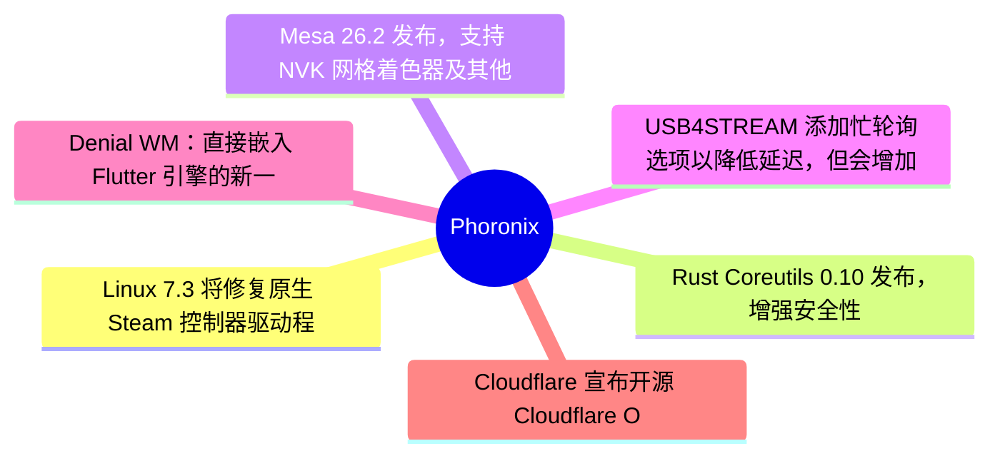
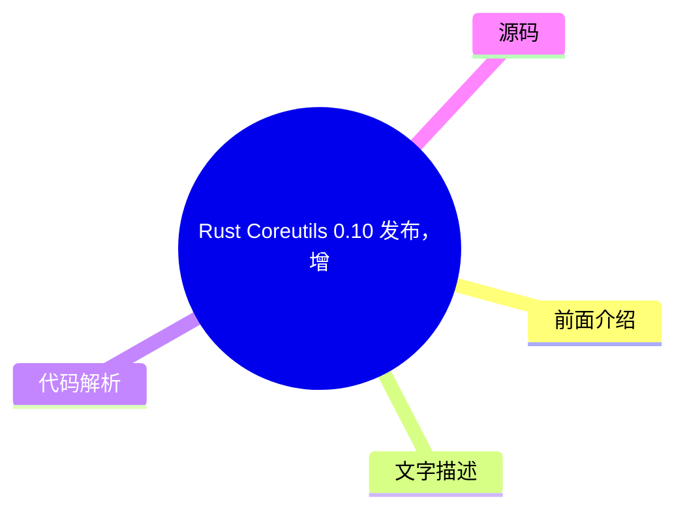

# ⚙️ Phoronix Top 6 (2026-08-07)

## 前面介绍

- 数据源：Phoronix
- 抓取日期：2026-08-07
- 条目数：6
- 含完整正文：0
- 含代码片段：0
- 组织方式：前面介绍 / 树状图 / 文字描述 / 代码解析 / 源码

## 思维导图

## 详细整理（6 条，0 条含全文，0 条含代码）

### 1. Linux 7.3 将修复原生 Steam 控制器驱动程序的长期缺失
- **链接**: [https://www.phoronix.com/news/Linux-7.3-Steam-Controller](https://www.phoronix.com/news/Linux-7.3-Steam-Controller)
- **作者**: Michael Larabel
- **发布**: Wed, 05 Aug 2026 20:44:00 -0400

#### 前面介绍

- 为十年前的 Valve 原版 Steam 控制器提供原生 Linux 支持。
- 无需依赖 Steam 客户端或 SDL 即可使用。

#### 树状图

#### 文字描述

- Linux 7.3 内核版本即将发布，将修复原生 HID 驱动程序中的一个长期缺失。
- 这对拥有原版 Steam 控制器的用户来说是一个重要更新，使他们能够在 Linux 系统上直接使用该设备。
- 该更新旨在移除对 Steam 客户端或 SDL 库的依赖，提供更底层的原生支持。

#### 代码解析

- 本
- 文
- 未
- 提
- 供
- 源
- 码
- ，
- 以
- 下
- 为
- 实
- 现
- 思
- 路
- 或
- 结
- 构
- 解
- 析
- ：
- 

- 1
- .
-  
- 原
- 生
-  
- H
- I
- D
-  
- 驱
- 动
- 程
- 序
- 通
- 常
- 通
- 过
-  
- U
- S
- B
-  
- 协
- 议
- 与
- 控
- 制
- 器
- 通
- 信
- 。
- 

- 2
- .
-  
- 修
- 复
- 工
- 作
- 可
- 能
- 涉
- 及
- 补
- 全
-  
- H
- I
- D
-  
- 报
- 告
- 描
- 述
- 符
- 或
- 映
- 射
- 特
- 定
- 的
- 控
- 制
- 按
- 键
- 。
- 

- 3
- .
-  
- 需
- 要
- 确
- 保
- 内
- 核
- 能
- 正
- 确
- 识
- 别
- 并
- 初
- 始
- 化
- 该
- 特
- 定
- 型
- 号
- 的
- 硬
- 件
- 。

#### 源码

未抓到可展示源码或原文节选。

### 2. Rust Coreutils 0.10 发布，增强安全性与 GNU 兼容性
- **链接**: [https://www.phoronix.com/news/Rust-Coreutils-0.10](https://www.phoronix.com/news/Rust-Coreutils-0.10)
- **作者**: Michael Larabel
- **发布**: Wed, 05 Aug 2026 18:59:00 -0400

#### 前面介绍

- 引入更多安全加固措施。
- 显著提升 GNU 测试套件的兼容性和健壮性。

#### 树状图

#### 文字描述

- uutils 项目发布了 Rust 版本的 Coreutils 0.10，这是 GNU Coreutils 的替代方案。
- 本次开发重点在于额外的安全加固，以防止潜在的安全漏洞。
- 同时，该版本显著提高了与 GNU 测试套件的兼容性，确保在 GNU 环境下的行为一致性。
- 这有助于 Rust 工具链在类 Unix 系统中更广泛地部署。

#### 代码解析

- 本
- 文
- 未
- 提
- 供
- 源
- 码
- ，
- 以
- 下
- 为
- 实
- 现
- 思
- 路
- 或
- 结
- 构
- 解
- 析
- ：
- 

- 1
- .
-  
- 安
- 全
- 加
- 固
- 可
- 能
- 涉
- 及
- 内
- 存
- 安
- 全
- 检
- 查
- 和
- 输
- 入
- 验
- 证
- 。
- 

- 2
- .
-  
- 兼
- 容
- 性
- 提
- 升
- 通
- 常
- 涉
- 及
- 调
- 整
- 系
- 统
- 调
- 用
- 接
- 口
- 以
- 匹
- 配
-  
- G
- N
- U
-  
- 行
- 为
- 。
- 

- 3
- .
-  
- R
- u
- s
- t
-  
- 的
- 所
- 有
- 权
- 机
- 制
- 有
- 助
- 于
- 减
- 少
- 缓
- 冲
- 区
- 溢
- 出
- 等
- 常
- 见
- 漏
- 洞
- 。

#### 源码

未抓到可展示源码或原文节选。

### 3. Mesa 26.2 发布，支持 NVK 网格着色器及其他 Vulkan 改进
- **链接**: [https://www.phoronix.com/news/Mesa-26.2-Released](https://www.phoronix.com/news/Mesa-26.2-Released)
- **作者**: Michael Larabel
- **发布**: Wed, 05 Aug 2026 18:13:57 -0400

#### 前面介绍

- 新增 NVK 网格着色器支持。
- 包含多项 Vulkan 图形驱动改进。

#### 树状图

#### 文字描述

- Mesa 26.2 稳定版现已发布，这是 Linux 系统上常用的开源 OpenGL 和 Vulkan 驱动程序的季度功能更新。
- 主要亮点之一是引入了对 NVK（NVIDIA Vulkan 驱动）网格着色器的支持。
- 此外，还包含许多其他 Vulkan 性能和功能的改进，旨在提升图形渲染效率。
- 该版本为 Linux 用户提供更现代的图形 API 支持。

#### 代码解析

- 本
- 文
- 未
- 提
- 供
- 源
- 码
- ，
- 以
- 下
- 为
- 实
- 现
- 思
- 路
- 或
- 结
- 构
- 解
- 析
- ：
- 

- 1
- .
-  
- 网
- 格
- 着
- 色
- 器
- 是
-  
- V
- u
- l
- k
- a
- n
-  
- 1
- .
- 5
-  
- 的
- 新
- 特
- 性
- ，
- 用
- 于
- 高
- 效
- 处
- 理
- 几
- 何
- 数
- 据
- 。
- 

- 2
- .
-  
- N
- V
- K
-  
- 驱
- 动
- 程
- 序
- 需
- 要
- 实
- 现
- 特
- 定
- 的
- 着
- 色
- 器
- 编
- 译
- 管
- 线
- 。
- 

- 3
- .
-  
- 改
- 进
- 可
- 能
- 涉
- 及
- 优
- 化
- 着
- 色
- 器
- 转
- 换
- 和
- 内
- 存
- 管
- 理
- 。

#### 源码

未抓到可展示源码或原文节选。

### 4. USB4STREAM 添加忙轮询选项以降低延迟，但会增加 CPU 占用
- **链接**: [https://www.phoronix.com/news/USB4STREAM-Lower-Latency](https://www.phoronix.com/news/USB4STREAM-Lower-Latency)
- **作者**: Michael Larabel
- **发布**: Wed, 05 Aug 2026 17:27:47 -0400

#### 前面介绍

- Linux 7.2 引入的 USB4STREAM 新特性。
- 新增忙轮询模式以减少数据传输延迟。

#### 树状图

#### 文字描述

- Linux 7.2 引入的 USB4STREAM 是 Intel 开发的解决方案，用于快速在 USB4 连接的系统间传输数据。
- 在即将到来的 Linux 7.3 周期中，将添加忙轮询模式。
- 忙轮询模式通过主动轮询 I/O 状态来提供更低延迟的数据传输，但代价是 CPU 周期的增加。
- 这为需要低延迟通信的场景提供了可配置选项。

#### 代码解析

- 本
- 文
- 未
- 提
- 供
- 源
- 码
- ，
- 以
- 下
- 为
- 实
- 现
- 思
- 路
- 或
- 结
- 构
- 解
- 析
- ：
- 

- 1
- .
-  
- 忙
- 轮
- 询
- 通
- 常
- 通
- 过
- 在
- 用
- 户
- 空
- 间
- 或
- 内
- 核
- 空
- 间
- 循
- 环
- 检
- 查
- 状
- 态
- 标
- 志
- 位
- 实
- 现
- 。
- 

- 2
- .
-  
- 需
- 要
- 配
- 置
-  
- U
- S
- B
- 4
- S
- T
- R
- E
- A
- M
-  
- 设
- 备
- 的
- 驱
- 动
- 参
- 数
- 以
- 启
- 用
- 该
- 模
- 式
- 。
- 

- 3
- .
-  
- 需
- 要
- 权
- 衡
-  
- C
- P
- U
-  
- 资
- 源
- 消
- 耗
- 与
- 网
- 络
- 延
- 迟
- 之
- 间
- 的
- 关
- 系
- 。

#### 源码

未抓到可展示源码或原文节选。

### 5. Denial WM：直接嵌入 Flutter 引擎的新一代 Wayland 合成器
- **链接**: [https://www.phoronix.com/news/Denial-WM-Compositor](https://www.phoronix.com/news/Denial-WM-Compositor)
- **作者**: Michael Larabel
- **发布**: Wed, 05 Aug 2026 12:10:08 -0400

#### 前面介绍

- 专注于 Arch Linux 集成的 Wayland 合成器。
- 直接将 Flutter 引擎嵌入代码库。

#### 树状图

#### 文字描述

- Denial 是一款备受关注的新一代 Wayland 合成器。
- 它专注于与 Arch Linux 的最佳集成，并直接将 Flutter 引擎嵌入到代码库中。
- 该合成器使用 Rust 编程语言，并利用 LevelDB 进行数据存储。
- 这种架构允许开发者使用 Flutter 的丰富 UI 组件来构建窗口管理器。

#### 代码解析

- 本
- 文
- 未
- 提
- 供
- 源
- 码
- ，
- 以
- 下
- 为
- 实
- 现
- 思
- 路
- 或
- 结
- 构
- 解
- 析
- ：
- 

- 1
- .
-  
- 将
-  
- F
- l
- u
- t
- t
- e
- r
-  
- 引
- 擎
- 嵌
- 入
- 意
- 味
- 着
- 可
- 以
- 直
- 接
- 调
- 用
-  
- F
- l
- u
- t
- t
- e
- r
-  
- 的
- 渲
- 染
- 管
- 线
- 。
- 

- 2
- .
-  
- R
- u
- s
- t
-  
- 语
- 言
- 保
- 证
- 了
- 内
- 存
- 安
- 全
- 和
- 线
- 程
- 安
- 全
- 。
- 

- 3
- .
-  
- L
- e
- v
- e
- l
- D
- B
-  
- 用
- 于
- 存
- 储
- 合
- 成
- 器
- 的
- 配
- 置
- 和
- 状
- 态
- 数
- 据
- 。

#### 源码

未抓到可展示源码或原文节选。

### 6. Cloudflare 宣布开源 Cloudflare OS 作为 AI "操作系统"
- **链接**: [https://www.phoronix.com/news/Cloudflare-OS](https://www.phoronix.com/news/Cloudflare-OS)
- **作者**: Michael Larabel
- **发布**: Wed, 05 Aug 2026 09:16:43 -0400

#### 前面介绍

- Cloudflare OS 作为面向代理、应用和工作的开放平台。
- 定位为 AI "操作系统"，而非传统意义上的操作系统。

#### 树状图

#### 文字描述

- Cloudflare 今日宣布开源 Cloudflare OS，将其定位为“面向代理、应用和工作的开放平台”。
- Cloudflare OS 被描述为 AI “操作系统”，但并非传统意义上的操作系统。
- 它旨在为 AI 代理和应用程序提供运行环境，而非管理硬件资源。
- 这一举措展示了云服务提供商在 AI 基础设施领域的创新方向。

#### 代码解析

- 本
- 文
- 未
- 提
- 供
- 源
- 码
- ，
- 以
- 下
- 为
- 实
- 现
- 思
- 路
- 或
- 结
- 构
- 解
- 析
- ：
- 

- 1
- .
-  
- 该
- 系
- 统
- 可
- 能
- 运
- 行
- 在
- 虚
- 拟
- 机
- 或
- 容
- 器
- 环
- 境
- 中
- 。
- 

- 2
- .
-  
- 核
- 心
- 功
- 能
- 是
- 为
-  
- A
- I
-  
- 代
- 理
- 提
- 供
- 沙
- 箱
- 和
- 通
- 信
- 网
- 络
- 。
- 

- 3
- .
-  
- 开
- 源
- 意
- 味
- 着
- 社
- 区
- 可
- 以
- 参
- 与
- 改
- 进
- 其
-  
- A
- I
-  
- 运
- 行
- 时
- 和
- 工
- 具
- 链
- 。

#### 源码

未抓到可展示源码或原文节选。

