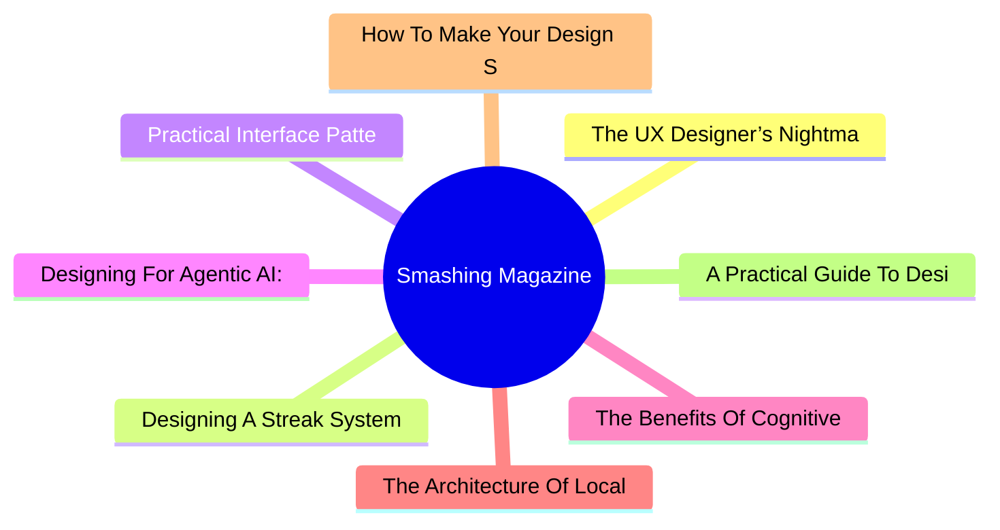

# 🔥 Smashing Magazine Top 8 (2026-06-12)

## 思维导图

## 列表（8 条）

### 1. The UX Designer’s Nightmare: When “Production-Ready” Becomes A Design Deliverable
- **链接**: [https://smashingmagazine.com/2026/04/production-ready-becomes-design-deliverable-ux/](https://smashingmagazine.com/2026/04/production-ready-becomes-design-deliverable-ux/)
- **发布**: Wed, 22 Apr 2026 10:00:00 GMT
- **简介**: In a rush to embrace AI, the industry is redefining what it means to be a UX designer, blurring the line between design and engineering. Carrie Webster explores what’s gained, what’s lost, and why designers need to remai

### 2. Designing A Streak System: The UX And Psychology Of Streaks
- **链接**: [https://smashingmagazine.com/2026/02/designing-streak-system-ux-psychology/](https://smashingmagazine.com/2026/02/designing-streak-system-ux-psychology/)
- **发布**: Wed, 18 Feb 2026 15:00:00 GMT
- **简介**: What makes streaks so powerful and addictive? To design them well, you need to understand how they align with human psychology. Victor Ayomipo breaks down the UX and design principles behind effective streak systems.

### 3. Practical Interface Patterns For AI Transparency (Part 2)
- **链接**: [https://smashingmagazine.com/2026/05/practical-interface-patterns-ai-transparency/](https://smashingmagazine.com/2026/05/practical-interface-patterns-ai-transparency/)
- **发布**: Wed, 13 May 2026 13:00:00 GMT
- **简介**: Why traditional loading patterns like spinners fail in agentic AI experiences, and how interface patterns that reveal the system’s process, status, and decision-making can improve transparency and build user trust.

### 4. Designing For Agentic AI: Practical UX Patterns For Control, Consent, And Accountability
- **链接**: [https://smashingmagazine.com/2026/02/designing-agentic-ai-practical-ux-patterns/](https://smashingmagazine.com/2026/02/designing-agentic-ai-practical-ux-patterns/)
- **发布**: Wed, 11 Feb 2026 13:00:00 GMT
- **简介**: Autonomy is an output of a technical system. Trustworthiness is an output of a design process. Here are concrete design patterns, operational frameworks, and organizational practices for building agentic systems that are

### 5. The Benefits Of Cognitive Inclusion In UX Research
- **链接**: [https://smashingmagazine.com/2026/06/benefits-cognitive-inclusion-ux-research/](https://smashingmagazine.com/2026/06/benefits-cognitive-inclusion-ux-research/)
- **发布**: Wed, 10 Jun 2026 10:00:00 GMT
- **简介**: Findings from an exploratory user research study highlighting the unique insights and practical UX recommendations shared by participants with cognitive disabilities.

### 6. The Architecture Of Local-First Web Development
- **链接**: [https://smashingmagazine.com/2026/05/architecture-local-first-web-development/](https://smashingmagazine.com/2026/05/architecture-local-first-web-development/)
- **发布**: Wed, 06 May 2026 10:00:00 GMT
- **简介**: An honest perspective on building local-first web apps in 2026, written for developers who’ve been doing this long enough to be skeptical of silver bullets.

### 7. How To Make Your Design System AI-Ready
- **链接**: [https://smashingmagazine.com/2026/06/how-make-design-system-ai-ready/](https://smashingmagazine.com/2026/06/how-make-design-system-ai-ready/)
- **发布**: Wed, 03 Jun 2026 13:00:00 GMT
- **简介**: Practical guide on how to reduce drifts, minimize mistakes, maintain context, and improve the quality of AI-generated prototypes. Brought to you by Design Patterns For AI Interfaces, **friendly video course on UX** and d

### 8. A Practical Guide To Design Principles
- **链接**: [https://smashingmagazine.com/2026/04/practical-guide-design-principles/](https://smashingmagazine.com/2026/04/practical-guide-design-principles/)
- **发布**: Wed, 01 Apr 2026 10:00:00 GMT
- **简介**: Design principles with references, examples, and methods for quick look-up. Brought to you by Design Patterns For AI Interfaces, **friendly video courses on UX** and design patterns by Vitaly.
