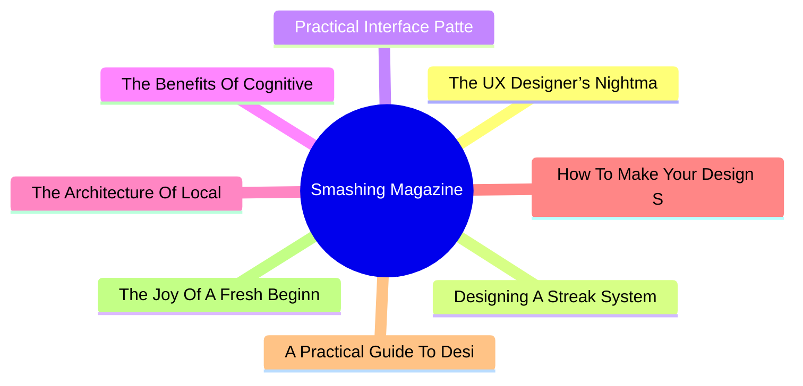

# 🔥 Smashing Magazine Top 8 (2026-07-01)

## 思维导图

## 列表（8 条，2 条含全文）

### 1. The UX Designer’s Nightmare: When “Production-Ready” Becomes A Design Deliverable
- **链接**: [https://smashingmagazine.com/2026/04/production-ready-becomes-design-deliverable-ux/](https://smashingmagazine.com/2026/04/production-ready-becomes-design-deliverable-ux/)
- **发布**: Wed, 22 Apr 2026 10:00:00 GMT
- **简介**: In a rush to embrace AI, the industry is redefining what it means to be a UX designer, blurring the line between design and engineering. Carrie Webster explores what’s gained, what’s lost, and why designers need to remai

📄 全文（4022 字符，点击展开）

In early 2026, I noticed that the UX designer’s toolkit seemed to shift overnight. The industry standard *“Should designers code?”* debate was abruptly settled by the market, not through a consensus of our craft, but through the brute force of job requirements. If you browse LinkedIn today, you’ll notice a stark change: UX roles increasingly demand ** AI-augmented development**, 

**technical orchestration,**and

**production-ready prototyping.**

For many, including myself, this is the ultimate design job nightmare. We are being asked to deliver both the “vibe” and the “code” simultaneously, using AI agents to bridge a technical gap that previously took years of computer science knowledge and coding experience to cross. But as the industry rushes to meet these new expectations, they are discovering that AI-generated functional code is not always *good* code.

## The LinkedIn Pressure Cooker: Role Creep In 2026

The job market is sending a clear signal. While traditional graphic design roles are expected to grow by only **3%** through 2034, UX, UI, and [Product Design roles](https://www.nobledesktop.com/careers/designer/job-outlook#:~:text=The%20projected%20future%20growth%20figures%20for%20Digital,job%20growth%20(which%20lies%20somewhere%20around%205%25).) are projected to grow by **16%** over the same period.

However, this growth is increasingly tied to the rise of **AI product development**, where “design skills” have recently become the #1 most in-demand capability, even ahead of coding and cloud infrastructure. Companies building these platforms are no longer just looking for visual designers; they need professionals who can “[translate technical capability into human-centered experiences](https://humbldesign.io/blog-posts/will-ai-replace-designers-2026).”

This creates a high-stakes environment for the UX designer. We are no longer just responsible for the interface; we are expected to understand the technical logic well enough to ensure that complex AI capabilities feel intuitive, safe, and useful for the human on the other side of the screen. Designers are being pushed toward a **“design engineer” model**, where we must bridge the gap between abstract [AI logic and user-facing code](https://www.refontelearning.com/blog/ui-ux-designer-engineering-in-2026-crafting-future-ready-user-experiences#skills-and-competencies-for-the-2026-uiux-designer-3).

A [recent survey](https://www.lyssna.com/blog/ux-design-trends/) found that **73% of designers** now view AI as a primary collaborator rather than just a tool. However, this “collaboration” often looks like “role creep.” Recruiters are often not just looking for someone who understands user empathy and information architecture — they want someone who can also prompt a React component into existence and push it to a repository!

This shift has created a **competency gap**.

As an experienced senior designer who has spent decades mastering the nuances of cognitive load, accessibility standards, and ethnographic research, I am suddenly finding myself being judged on my ability to debug a CSS Flexbox issue or manage a Git branch.

The nightmare isn’t the technology itself. It’s the **reallocation of value**.

“

### The Competence Trap: Two Job Skill Sets, One Average Result

There is potentially a very dangerous myth circulating in boardrooms that AI makes a designer “equal” to an engineer. This narrative suggests that because an LLM can generate a functional JavaScript event handler, the person prompting it doesn’t need to understand the underlying logic. In reality, attempting to master two disparate, deep fields simultaneously will most likely lead to being **averagely competent** at both.

### The “Averagely Competent” Dilemma

For a senior UX designer to become a senior-level coder is like asking a master chef to also be a master plumber because “they both work in the kitchen.” You might get the water running, but you won’t know why the pipes are rattling.

- **The “cogniti

...（截断，原文 10033+ 字符）

### 2. Designing A Streak System: The UX And Psychology Of Streaks
- **链接**: [https://smashingmagazine.com/2026/02/designing-streak-system-ux-psychology/](https://smashingmagazine.com/2026/02/designing-streak-system-ux-psychology/)
- **发布**: Wed, 18 Feb 2026 15:00:00 GMT
- **简介**: What makes streaks so powerful and addictive? To design them well, you need to understand how they align with human psychology. Victor Ayomipo breaks down the UX and design principles behind effective streak systems.

📄 全文（4022 字符，点击展开）

I’m sure you’ve heard of streaks or used an app with one. But ever wondered why streaks are so popular and powerful? Well, there is the obvious one that apps want as much of your attention as possible, but aside from that, did you know that when the popular learning app Duolingo introduced iOS widgets to display streaks, [user commitment surged by 60%](https://www.orizon.co/blog/duolingos-gamification-secrets#:~:text=When%20Duolingo%20introduced%20an%20iOS%20widget%20displaying%20streaks%2C%20user%20commitment%20increased%20by%2060%25!). Sixty percent is a massive shift in behaviour and demonstrates how “streak” patterns can be used to increase engagement and drive usage.

At its most basic, **a streak is the number of consecutive days that a user completes a specific activity**. Some people also define it as a “gamified” habit or a metric designed to encourage consistent usage.

But streaks transcend beyond being a metric or a record in an app; it is more psychological than that. Human instincts are easy to influence with the right factors. Look at these three factors: **progress**, **pride**, and fear of missing out (commonly called [FOMO](https://www.smashingmagazine.com/2019/11/fomo-increase-conversions/)). What do all these have in common? *Effort*. The more effort you put into something, the more it shapes your identity, and that is how streaks crosses into the world of behavioural psychology.

Now, with great power comes great responsibility, and because of that, there’s a dark side to streaks.

In this article, we’ll be going into the psychology, UX, and design principles behind building an effective streak system. We’ll look at (1) why our brains almost instinctively respond to streak activity, (2) how to design streaks in ways that genuinely help users, and (3) the technical work involved in building a streak pattern.

## The Psychology Behind Streaks

To design and build an effective streak system, we need to understand how it aligns with how our brains are wired. Like, what makes it so effective to the extent that we feel so much intense dedication to protect our streaks?

There are three interesting, well-documented psychology principles that support what makes streaks so powerful and addictive.

### Loss Aversion

This is probably the strongest force behind streaks. I say this because most times, you almost can’t avoid this in life.

Think of it this way: If a friend gives you $100, you’d be happy. But if you lost $100 from your wallet, that would hurt way more. The emotional weight of those situations isn’t equal. Loss hurts way more than gain feels good.

Let’s take it further and say that I give you $100 and ask you to play a gamble. There’s a 50% chance you win another $100 and a 50% chance you lose the original $100. Would you take it? I wouldn’t. Most people wouldn’t. That’s loss aversion.

If you think about it, it is logical, it is understandable, it is human.

The concept behind loss aversion is that we feel the pain of losing something twice as much as the pleasure of gaining something of equal value. In psychological terms, loss lingers more than gains do.

You probably see how this relates to streaks. To build a noticeable streak, it requires effort; as a streak grows, the motivation behind it begins to fade; or more accurately, it starts to become secondary.

Here’s an example: Say your friend has a three-day streak closing their [“Move Rings” on their Apple Watch](https://www.apple.com/watch/close-your-rings/). They have almost nothing to lose beyond wanting to achieve their goal and be consistent. At the same time, you have an impressive 219-day streak going. Chances are that you are trapped by the *fear of losing it*. You most likely aren’t thinking about the achievement at this point; it’s more about protecting your invested effort, and that is loss aversion.

[Duolingo explains how loss aversion contributes to a user’s reluctance to break a long streak](https://blog.duolingo.com/how-duolingo-str

...（截断，原文 26284+ 字符）

### 3. Practical Interface Patterns For AI Transparency (Part 2)
- **链接**: [https://smashingmagazine.com/2026/05/practical-interface-patterns-ai-transparency/](https://smashingmagazine.com/2026/05/practical-interface-patterns-ai-transparency/)
- **发布**: Wed, 13 May 2026 13:00:00 GMT
- **简介**: Why traditional loading patterns like spinners fail in agentic AI experiences, and how interface patterns that reveal the system’s process, status, and decision-making can improve transparency and build user trust.

### 4. The Benefits Of Cognitive Inclusion In UX Research
- **链接**: [https://smashingmagazine.com/2026/06/benefits-cognitive-inclusion-ux-research/](https://smashingmagazine.com/2026/06/benefits-cognitive-inclusion-ux-research/)
- **发布**: Wed, 10 Jun 2026 10:00:00 GMT
- **简介**: Findings from an exploratory user research study highlighting the unique insights and practical UX recommendations shared by participants with cognitive disabilities.

### 5. The Architecture Of Local-First Web Development
- **链接**: [https://smashingmagazine.com/2026/05/architecture-local-first-web-development/](https://smashingmagazine.com/2026/05/architecture-local-first-web-development/)
- **发布**: Wed, 06 May 2026 10:00:00 GMT
- **简介**: An honest perspective on building local-first web apps in 2026, written for developers who’ve been doing this long enough to be skeptical of silver bullets.

### 6. How To Make Your Design System AI-Ready
- **链接**: [https://smashingmagazine.com/2026/06/how-make-design-system-ai-ready/](https://smashingmagazine.com/2026/06/how-make-design-system-ai-ready/)
- **发布**: Wed, 03 Jun 2026 13:00:00 GMT
- **简介**: Practical guide on how to reduce drifts, minimize mistakes, maintain context, and improve the quality of AI-generated prototypes. Brought to you by Design Patterns For AI Interfaces, **friendly video course on UX** and d

### 7. A Practical Guide To Design Principles
- **链接**: [https://smashingmagazine.com/2026/04/practical-guide-design-principles/](https://smashingmagazine.com/2026/04/practical-guide-design-principles/)
- **发布**: Wed, 01 Apr 2026 10:00:00 GMT
- **简介**: Design principles with references, examples, and methods for quick look-up. Brought to you by Design Patterns For AI Interfaces, **friendly video courses on UX** and design patterns by Vitaly.

### 8. The Joy Of A Fresh Beginning (April 2026 Wallpapers Edition)
- **链接**: [https://smashingmagazine.com/2026/03/desktop-wallpaper-calendars-april-2026/](https://smashingmagazine.com/2026/03/desktop-wallpaper-calendars-april-2026/)
- **发布**: Tue, 31 Mar 2026 11:00:00 GMT
- **简介**: With the new month just around the corner, could there be a better occasion to freshen up your desktop? If you’re looking for some unique and inspiring wallpapers to accompany you on all those adventures that April may b
