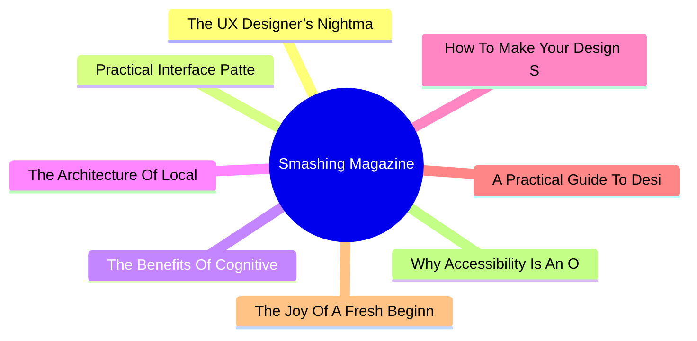

# 🔥 Smashing Magazine Top 8 (2026-07-04)

## 思维导图

## 列表（8 条，2 条含全文）

### 1. The UX Designer’s Nightmare: When “Production-Ready” Becomes A Design Deliverable
- **链接**: [https://smashingmagazine.com/2026/04/production-ready-becomes-design-deliverable-ux/](https://smashingmagazine.com/2026/04/production-ready-becomes-design-deliverable-ux/)
- **发布**: Wed, 22 Apr 2026 10:00:00 GMT
- **简介**: In a rush to embrace AI, the industry is redefining what it means to be a UX designer, blurring the line between design and engineering. Carrie Webster explores what’s gained, what’s lost, and why designers need to remai

📄 全文（4022 字符，点击展开）

In early 2026, I noticed that the UX designer’s toolkit seemed to shift overnight. The industry standard *“Should designers code?”* debate was abruptly settled by the market, not through a consensus of our craft, but through the brute force of job requirements. If you browse LinkedIn today, you’ll notice a stark change: UX roles increasingly demand ** AI-augmented development**, 

**technical orchestration,**and

**production-ready prototyping.**

For many, including myself, this is the ultimate design job nightmare. We are being asked to deliver both the “vibe” and the “code” simultaneously, using AI agents to bridge a technical gap that previously took years of computer science knowledge and coding experience to cross. But as the industry rushes to meet these new expectations, they are discovering that AI-generated functional code is not always *good* code.

## The LinkedIn Pressure Cooker: Role Creep In 2026

The job market is sending a clear signal. While traditional graphic design roles are expected to grow by only **3%** through 2034, UX, UI, and [Product Design roles](https://www.nobledesktop.com/careers/designer/job-outlook#:~:text=The%20projected%20future%20growth%20figures%20for%20Digital,job%20growth%20(which%20lies%20somewhere%20around%205%25).) are projected to grow by **16%** over the same period.

However, this growth is increasingly tied to the rise of **AI product development**, where “design skills” have recently become the #1 most in-demand capability, even ahead of coding and cloud infrastructure. Companies building these platforms are no longer just looking for visual designers; they need professionals who can “[translate technical capability into human-centered experiences](https://humbldesign.io/blog-posts/will-ai-replace-designers-2026).”

This creates a high-stakes environment for the UX designer. We are no longer just responsible for the interface; we are expected to understand the technical logic well enough to ensure that complex AI capabilities feel intuitive, safe, and useful for the human on the other side of the screen. Designers are being pushed toward a **“design engineer” model**, where we must bridge the gap between abstract [AI logic and user-facing code](https://www.refontelearning.com/blog/ui-ux-designer-engineering-in-2026-crafting-future-ready-user-experiences#skills-and-competencies-for-the-2026-uiux-designer-3).

A [recent survey](https://www.lyssna.com/blog/ux-design-trends/) found that **73% of designers** now view AI as a primary collaborator rather than just a tool. However, this “collaboration” often looks like “role creep.” Recruiters are often not just looking for someone who understands user empathy and information architecture — they want someone who can also prompt a React component into existence and push it to a repository!

This shift has created a **competency gap**.

As an experienced senior designer who has spent decades mastering the nuances of cognitive load, accessibility standards, and ethnographic research, I am suddenly finding myself being judged on my ability to debug a CSS Flexbox issue or manage a Git branch.

The nightmare isn’t the technology itself. It’s the **reallocation of value**.

“

### The Competence Trap: Two Job Skill Sets, One Average Result

There is potentially a very dangerous myth circulating in boardrooms that AI makes a designer “equal” to an engineer. This narrative suggests that because an LLM can generate a functional JavaScript event handler, the person prompting it doesn’t need to understand the underlying logic. In reality, attempting to master two disparate, deep fields simultaneously will most likely lead to being **averagely competent** at both.

### The “Averagely Competent” Dilemma

For a senior UX designer to become a senior-level coder is like asking a master chef to also be a master plumber because “they both work in the kitchen.” You might get the water running, but you won’t know why the pipes are rattling.

- **The “cogniti

...（截断，原文 10033+ 字符）

### 2. Practical Interface Patterns For AI Transparency (Part 2)
- **链接**: [https://smashingmagazine.com/2026/05/practical-interface-patterns-ai-transparency/](https://smashingmagazine.com/2026/05/practical-interface-patterns-ai-transparency/)
- **发布**: Wed, 13 May 2026 13:00:00 GMT
- **简介**: Why traditional loading patterns like spinners fail in agentic AI experiences, and how interface patterns that reveal the system’s process, status, and decision-making can improve transparency and build user trust.

📄 全文（4022 字符，点击展开）

In the [first part of this series](https://www.smashingmagazine.com/2026/04/identifying-necessary-transparency-moments-agentic-ai-part1/), we talked about the **Decision Node Audit**. We mapped out the internal workings of our AI system to pinpoint the exact moments it makes decisions based on probabilities. This told us when the system needs to be transparent with the user. Now, the big question is *how* to share that information.

You’ve got your **Transparency Matrix** ready. You know which behind-the-scenes API calls need a visible status update. Your engineers are on board with the technical aspects. The next step is designing the visual container for those updates.

We face a legacy problem. For thirty years, interface designers have relied on a single pattern to handle latency: **the spinner**. The spinning wheel, the throbber, the progress bar. These patterns communicate a specific technical reality. They tell the user that the system is retrieving data. The delay is caused by bandwidth or file size.

AI agents introduce a new kind of wait time. When an agent pauses for twenty seconds, it’s not just downloading something; it’s *thinking*. It’s figuring out the best steps, weighing options, and creating the content you asked for.

If we use a basic spinning icon for this “thinking time,” users get confused and anxious. They watch a looping animation and can’t tell if the system is stalled or crashed. They don’t know if the agent is handling a very complicated task or if it has simply failed.

To build user trust, we need to turn this waiting time into a **moment for reassurance**. Instead of a passive *“something is happening,”* we need to communicate an active, *“Here is exactly how I am working to solve your problem.”*

## Writing Clear Status Updates

We often think of transparency as a visual design problem, but it’s really about the **words** we use. Simple, clear explanations (the microcopy) are what build trust and separate a reliable AI from one that feels broken.

We need to retire generic placeholders like *Loading* or *Working*. These words are remnants of the era of static software. Instead, we must construct our status updates using a specific formula that mirrors the agency of the system. Let’s stop using vague words like “Loading” or “Working.” Those terms belong to the past, when software was simple and static. Instead, we should create status updates that clearly tell the user what the system is *actually doing* and make the system’s actions transparent.

Imagine, for the sake of an example, you are deploying agentic AI that will help team members organize their calendars and plan recurring meetings on their behalf, once prompted.

When an AI displays a message like “Checking availability” for an unknown amount of time, users often feel lost because it doesn’t offer enough information. While they understand the AI is looking at a calendar, they don’t know *whose* calendar it is, what other steps are involved (before or after), or if the AI even remembered the people and purpose of the scheduling request. Waiting for the final result can be a tense, uneasy experience, like anticipating a gift that you suspect might be a prank.

Perplexity AI provides a strong example of doing status updates right. Figure 1 below shows that when users ask a question, the interface displays exactly what it is doing in real time. You see a list of activities updating as they are accomplished. Users do not need to guess what is happening as the AI works.

## The Agentic Update Formula

To give people useful status updates, we need to connect what the system is *doing* with *why* it’s doing it. Keeping with our scheduling agent example, the system should break down that waiting period into at least four clear, separate steps.

- First, the interface displays *Checking your calendar to find open times for a recurring Thursday call with [Name(s)]*.
- Then, it updates to: *Cross-checking availability with [Name(s)] calendars*.
-

...（截断，原文 21693+ 字符）

### 3. The Benefits Of Cognitive Inclusion In UX Research
- **链接**: [https://smashingmagazine.com/2026/06/benefits-cognitive-inclusion-ux-research/](https://smashingmagazine.com/2026/06/benefits-cognitive-inclusion-ux-research/)
- **发布**: Wed, 10 Jun 2026 10:00:00 GMT
- **简介**: Findings from an exploratory user research study highlighting the unique insights and practical UX recommendations shared by participants with cognitive disabilities.

### 4. The Architecture Of Local-First Web Development
- **链接**: [https://smashingmagazine.com/2026/05/architecture-local-first-web-development/](https://smashingmagazine.com/2026/05/architecture-local-first-web-development/)
- **发布**: Wed, 06 May 2026 10:00:00 GMT
- **简介**: An honest perspective on building local-first web apps in 2026, written for developers who’ve been doing this long enough to be skeptical of silver bullets.

### 5. How To Make Your Design System AI-Ready
- **链接**: [https://smashingmagazine.com/2026/06/how-make-design-system-ai-ready/](https://smashingmagazine.com/2026/06/how-make-design-system-ai-ready/)
- **发布**: Wed, 03 Jun 2026 13:00:00 GMT
- **简介**: Practical guide on how to reduce drifts, minimize mistakes, maintain context, and improve the quality of AI-generated prototypes. Brought to you by Design Patterns For AI Interfaces, **friendly video course on UX** and d

### 6. A Practical Guide To Design Principles
- **链接**: [https://smashingmagazine.com/2026/04/practical-guide-design-principles/](https://smashingmagazine.com/2026/04/practical-guide-design-principles/)
- **发布**: Wed, 01 Apr 2026 10:00:00 GMT
- **简介**: Design principles with references, examples, and methods for quick look-up. Brought to you by Design Patterns For AI Interfaces, **friendly video courses on UX** and design patterns by Vitaly.

### 7. The Joy Of A Fresh Beginning (April 2026 Wallpapers Edition)
- **链接**: [https://smashingmagazine.com/2026/03/desktop-wallpaper-calendars-april-2026/](https://smashingmagazine.com/2026/03/desktop-wallpaper-calendars-april-2026/)
- **发布**: Tue, 31 Mar 2026 11:00:00 GMT
- **简介**: With the new month just around the corner, could there be a better occasion to freshen up your desktop? If you’re looking for some unique and inspiring wallpapers to accompany you on all those adventures that April may b

### 8. Why Accessibility Is An Operational Capability, Not A Feature
- **链接**: [https://smashingmagazine.com/2026/06/why-accessibility-operational-capability-not-feature/](https://smashingmagazine.com/2026/06/why-accessibility-operational-capability-not-feature/)
- **发布**: Tue, 30 Jun 2026 12:00:00 GMT
- **简介**: Teams can generate UI faster than ever, but they still have to guarantee that what they ship is usable, secure, and maintainable. Accessibility as an operational capability rather than a compliance checklist or end-of-pr
