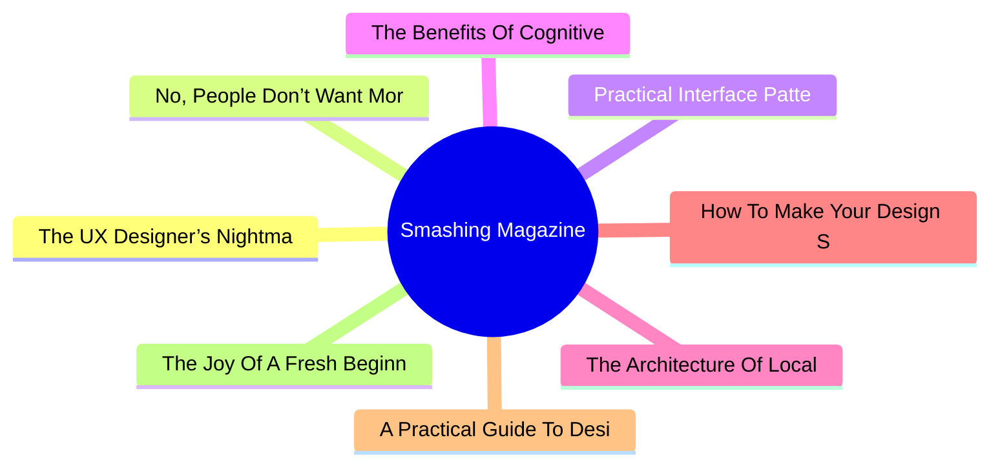

# 🔥 Smashing Magazine Top 8 (2026-07-17)

## 思维导图

## 列表（8 条，2 条含全文）

### 1. The UX Designer’s Nightmare: When “Production-Ready” Becomes A Design Deliverable
- **链接**: [https://smashingmagazine.com/2026/04/production-ready-becomes-design-deliverable-ux/](https://smashingmagazine.com/2026/04/production-ready-becomes-design-deliverable-ux/)
- **发布**: Wed, 22 Apr 2026 10:00:00 GMT
- **简介**: In a rush to embrace AI, the industry is redefining what it means to be a UX designer, blurring the line between design and engineering. Carrie Webster explores what’s gained, what’s lost, and why designers need to remai

📄 全文（4022 字符，点击展开）

In early 2026, I noticed that the UX designer’s toolkit seemed to shift overnight. The industry standard *“Should designers code?”* debate was abruptly settled by the market, not through a consensus of our craft, but through the brute force of job requirements. If you browse LinkedIn today, you’ll notice a stark change: UX roles increasingly demand ** AI-augmented development**, 

**technical orchestration,**and

**production-ready prototyping.**

For many, including myself, this is the ultimate design job nightmare. We are being asked to deliver both the “vibe” and the “code” simultaneously, using AI agents to bridge a technical gap that previously took years of computer science knowledge and coding experience to cross. But as the industry rushes to meet these new expectations, they are discovering that AI-generated functional code is not always *good* code.

## The LinkedIn Pressure Cooker: Role Creep In 2026

The job market is sending a clear signal. While traditional graphic design roles are expected to grow by only **3%** through 2034, UX, UI, and [Product Design roles](https://www.nobledesktop.com/careers/designer/job-outlook#:~:text=The%20projected%20future%20growth%20figures%20for%20Digital,job%20growth%20(which%20lies%20somewhere%20around%205%25).) are projected to grow by **16%** over the same period.

However, this growth is increasingly tied to the rise of **AI product development**, where “design skills” have recently become the #1 most in-demand capability, even ahead of coding and cloud infrastructure. Companies building these platforms are no longer just looking for visual designers; they need professionals who can “[translate technical capability into human-centered experiences](https://humbldesign.io/blog-posts/will-ai-replace-designers-2026).”

This creates a high-stakes environment for the UX designer. We are no longer just responsible for the interface; we are expected to understand the technical logic well enough to ensure that complex AI capabilities feel intuitive, safe, and useful for the human on the other side of the screen. Designers are being pushed toward a **“design engineer” model**, where we must bridge the gap between abstract [AI logic and user-facing code](https://www.refontelearning.com/blog/ui-ux-designer-engineering-in-2026-crafting-future-ready-user-experiences#skills-and-competencies-for-the-2026-uiux-designer-3).

A [recent survey](https://www.lyssna.com/blog/ux-design-trends/) found that **73% of designers** now view AI as a primary collaborator rather than just a tool. However, this “collaboration” often looks like “role creep.” Recruiters are often not just looking for someone who understands user empathy and information architecture — they want someone who can also prompt a React component into existence and push it to a repository!

This shift has created a **competency gap**.

As an experienced senior designer who has spent decades mastering the nuances of cognitive load, accessibility standards, and ethnographic research, I am suddenly finding myself being judged on my ability to debug a CSS Flexbox issue or manage a Git branch.

The nightmare isn’t the technology itself. It’s the **reallocation of value**.

“

### The Competence Trap: Two Job Skill Sets, One Average Result

There is potentially a very dangerous myth circulating in boardrooms that AI makes a designer “equal” to an engineer. This narrative suggests that because an LLM can generate a functional JavaScript event handler, the person prompting it doesn’t need to understand the underlying logic. In reality, attempting to master two disparate, deep fields simultaneously will most likely lead to being **averagely competent** at both.

### The “Averagely Competent” Dilemma

For a senior UX designer to become a senior-level coder is like asking a master chef to also be a master plumber because “they both work in the kitchen.” You might get the water running, but you won’t know why the pipes are rattling.

- **The “cogniti

...（截断，原文 10033+ 字符）

### 2. No, People Don’t Want More AI In Their Life
- **链接**: [https://smashingmagazine.com/2026/07/people-dont-want-more-ai/](https://smashingmagazine.com/2026/07/people-dont-want-more-ai/)
- **发布**: Wed, 15 Jul 2026 10:00:00 GMT
- **简介**: Many companies assume everyone craves new AI features. But the reality is that most people don't want more AI &mdash; at least not in the way most AI leaders envision it. Brought to you by Design Patterns For AI Interfac

📄 全文（4021 字符，点击展开）

Many companies silently assume that everybody wants more AI in their lives. That people are **craving new AI features**, new AI products, new AI workflows — that would all magically replace all existing outdated practices and broken ways of working.

But in reality, it seems like **people don’t want more AI** at all — at least not in the way most AI leaders envision it. Unsurprisingly, many AI features have [low adoption and retention](https://www.mindstudio.ai/blog/ai-adoption-gap-ibm-2026-study) — at a very high cost of delivery, and a high risk of reputation damage.

## The AI People Don’t Need

It’s remarkably difficult to make a strong argument with senior leadership, but [AI is not a value proposition](https://www.nngroup.com/articles/powered-by-ai-is-not-a-value-proposition/). New AI features don’t magically make for happy or excited customers. Because AI features are often bolt-ons and separate tools for employees to use, they typically **take people out** of their regular way of working.

AI is pretty good at **amplifying shortcuts and shortcomings** in organizations — from data quality to decision making. It can’t magically fix years of accumulated quick patches, technical debt, broken culture and internal politics. If anything, they become more visible with AI as inconsistencies or conflicting priorities and get handed directly to users, who are then left to make sense of the mess themselves.

Because in most organizations, work typically requires hopping on and off between plenty of disconnected and fragmented systems, with a new AI tool, they now have yet another system that they also need to hop on and off. Often it produces more work, and typically it’s not particularly rewarding work either.

On top of that, people are very much aware of the [cost of finding and fixing AI hallucinations](https://www.nngroup.com/articles/ai-chatbots-discourage-error-checking/). Asking AI to generate a response **might feel easier** than writing from scratch, but it has a cost:

- **Skim through**the entire AI output,
- **Spot key points**to focus attention on,
- **Review/verify key points**, one-by-one,
- **Check rationale**for what follows next,
- **Articulate corrections**+ regenerate,
- **Review the response**(a number of times).

For many people, AI isn’t something they can proactively choose and explore on their own — it arrives uninvited, at someone else’s pace. On top of that, plenty of messages amplify **fears and worries about AI** replacing work — so it’s hardly surprising that the perception of AI isn’t excitement. It’s **resistance to change** and deep anxiety about one’s place in a world that seems to be changing without them.

At best, AI features might be silently accepted or nodded away. At worst, AI **raises concerns**, doubts, caution — and calls for a healthy dose of skepticism. And sometimes it’s perceived as a threat or **liability** — because unlike other features, AI is neither predictable nor reliable.

People don’t dream of **AI art museums** or AI fridges or AI hotel reception or AI-narrated children’s books. They don’t want their children to have **romantic AI partners**. Most people don’t want to actively manage (and clean up after) a **swarm of AI agents** roaming in their bank accounts and acting on their behalf in the real world. And most notably, people don’t really want a magical box to speak to or type into all the time.

## The AI People Actually Need

I’m always puzzled by the comparison of AI features with how unreliable humans are. But people don’t compare software with other people. They **compare features with features** — and if one feature in one product is unreliable, while a similar feature works flawlessly in another, they choose the latter. It’s not about AI or not AI, but rather what works consistently and reliably, and what doesn’t.

Many conversations about AI are conversations about the speed of delivery. But to many people, there is little value in increasing the speed of delive

...（截断，原文 8338+ 字符）

### 3. Practical Interface Patterns For AI Transparency (Part 2)
- **链接**: [https://smashingmagazine.com/2026/05/practical-interface-patterns-ai-transparency/](https://smashingmagazine.com/2026/05/practical-interface-patterns-ai-transparency/)
- **发布**: Wed, 13 May 2026 13:00:00 GMT
- **简介**: Why traditional loading patterns like spinners fail in agentic AI experiences, and how interface patterns that reveal the system’s process, status, and decision-making can improve transparency and build user trust.

### 4. The Benefits Of Cognitive Inclusion In UX Research
- **链接**: [https://smashingmagazine.com/2026/06/benefits-cognitive-inclusion-ux-research/](https://smashingmagazine.com/2026/06/benefits-cognitive-inclusion-ux-research/)
- **发布**: Wed, 10 Jun 2026 10:00:00 GMT
- **简介**: Findings from an exploratory user research study highlighting the unique insights and practical UX recommendations shared by participants with cognitive disabilities.

### 5. The Architecture Of Local-First Web Development
- **链接**: [https://smashingmagazine.com/2026/05/architecture-local-first-web-development/](https://smashingmagazine.com/2026/05/architecture-local-first-web-development/)
- **发布**: Wed, 06 May 2026 10:00:00 GMT
- **简介**: An honest perspective on building local-first web apps in 2026, written for developers who’ve been doing this long enough to be skeptical of silver bullets.

### 6. How To Make Your Design System AI-Ready
- **链接**: [https://smashingmagazine.com/2026/06/how-make-design-system-ai-ready/](https://smashingmagazine.com/2026/06/how-make-design-system-ai-ready/)
- **发布**: Wed, 03 Jun 2026 13:00:00 GMT
- **简介**: Practical guide on how to reduce drifts, minimize mistakes, maintain context, and improve the quality of AI-generated prototypes. Brought to you by Design Patterns For AI Interfaces, **friendly video course on UX** and d

### 7. A Practical Guide To Design Principles
- **链接**: [https://smashingmagazine.com/2026/04/practical-guide-design-principles/](https://smashingmagazine.com/2026/04/practical-guide-design-principles/)
- **发布**: Wed, 01 Apr 2026 10:00:00 GMT
- **简介**: Design principles with references, examples, and methods for quick look-up. Brought to you by Design Patterns For AI Interfaces, **friendly video courses on UX** and design patterns by Vitaly.

### 8. The Joy Of A Fresh Beginning (April 2026 Wallpapers Edition)
- **链接**: [https://smashingmagazine.com/2026/03/desktop-wallpaper-calendars-april-2026/](https://smashingmagazine.com/2026/03/desktop-wallpaper-calendars-april-2026/)
- **发布**: Tue, 31 Mar 2026 11:00:00 GMT
- **简介**: With the new month just around the corner, could there be a better occasion to freshen up your desktop? If you’re looking for some unique and inspiring wallpapers to accompany you on all those adventures that April may b
