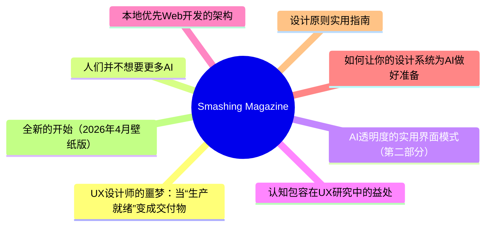
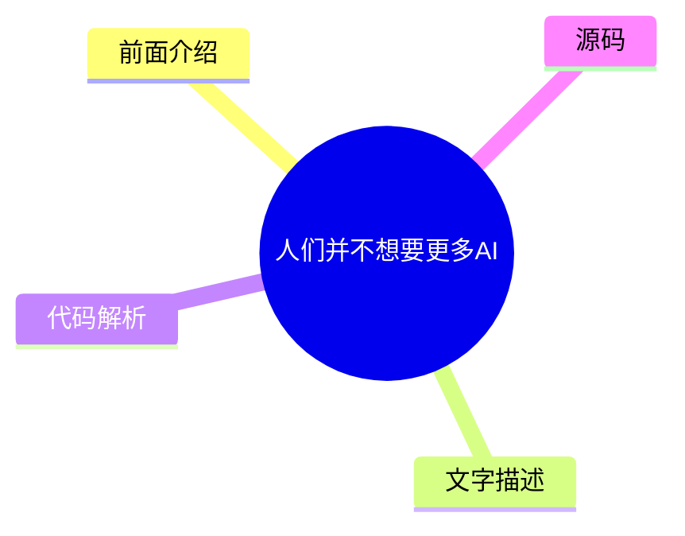
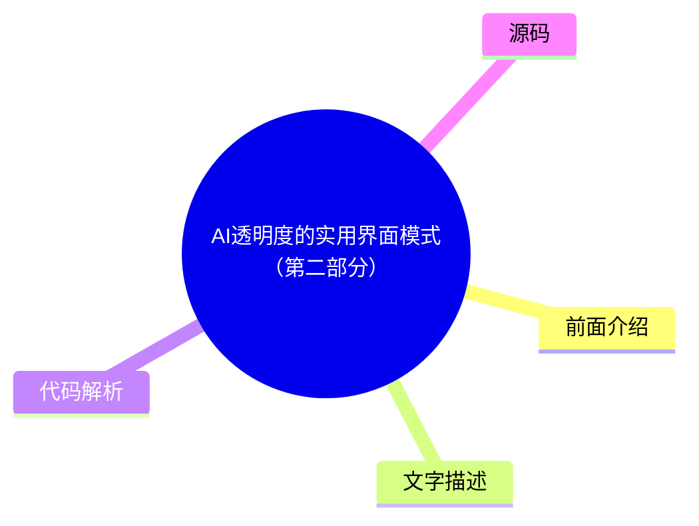
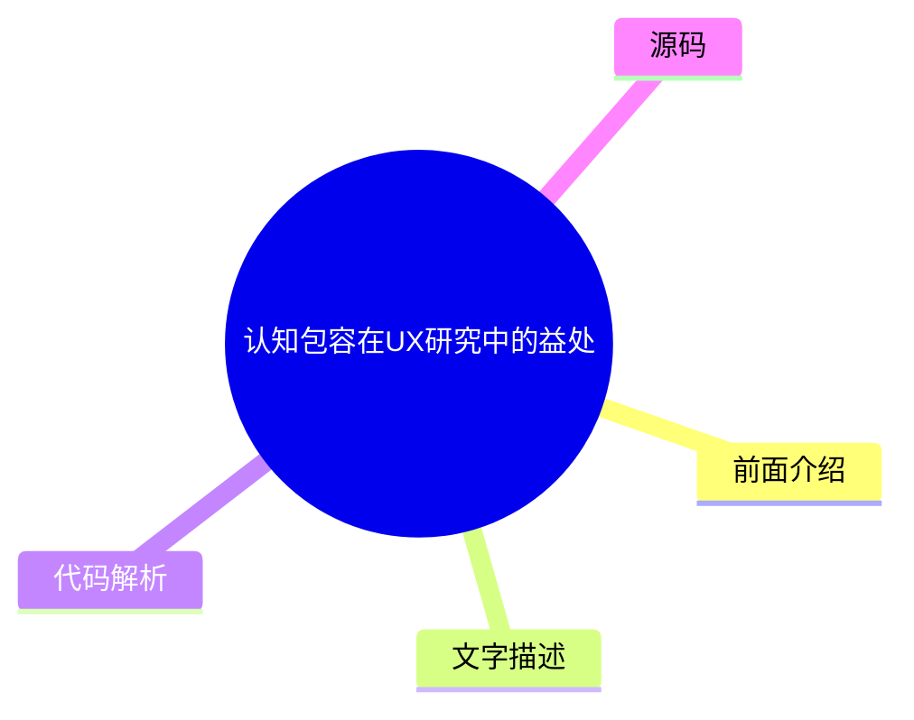
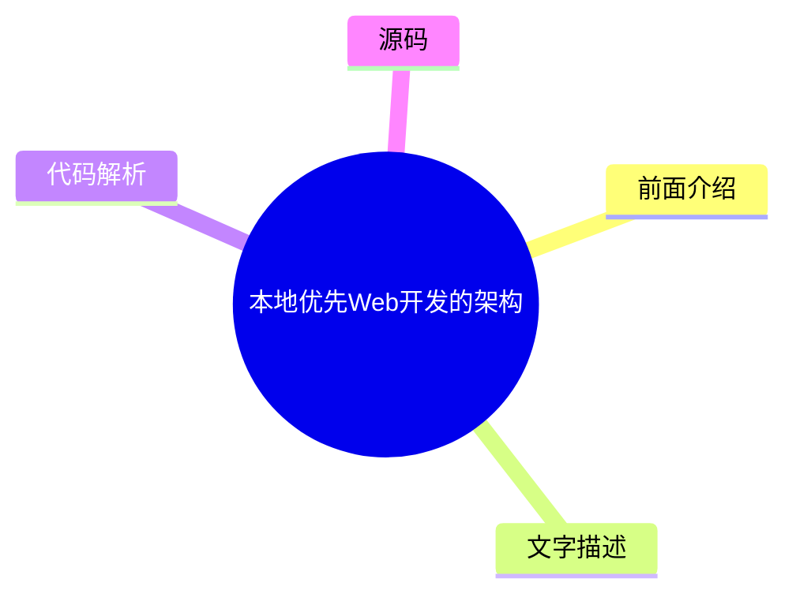
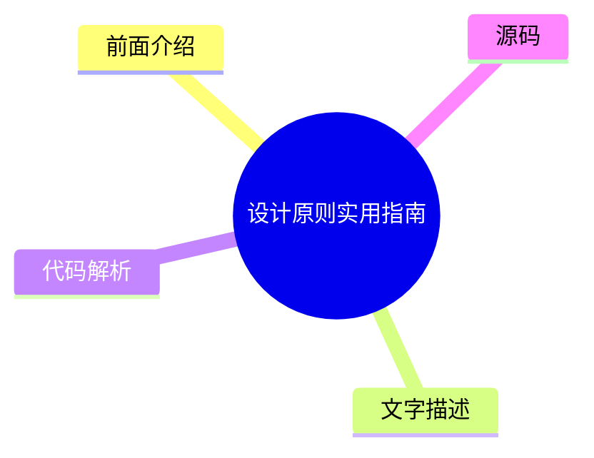

# 🔥 Smashing Magazine Top 8 (2026-07-18)

## 前面介绍

- 数据源：Smashing Magazine
- 抓取日期：2026-07-18
- 条目数：8
- 含完整正文：8
- 含代码片段：1
- 组织方式：前面介绍 / 树状图 / 文字描述 / 代码解析 / 源码

## 思维导图



## 详细整理（8 条，8 条含全文，1 条含代码）

### 1. UX设计师的噩梦：当“生产就绪”变成交付物
- **链接**: [https://smashingmagazine.com/2026/04/production-ready-becomes-design-deliverable-ux/](https://smashingmagazine.com/2026/04/production-ready-becomes-design-deliverable-ux/)
- **发布**: Wed, 22 Apr 2026 10:00:00 GMT

#### 前面介绍

- 行业标准正在重新定义UX设计师的角色，模糊了设计与工程的界限。
- 设计师被要求同时交付“氛围感”和“代码”，导致能力陷阱。
- 过度依赖AI生成代码可能导致设计师在调试和逻辑理解上出现能力断层。

#### 树状图


#### 文字描述

- 2026年，LinkedIn等招聘平台上的UX职位要求发生了显著变化，越来越多地要求具备AI增强开发、技术编排和生产就绪原型设计的能力。
- 虽然设计类岗位整体增长，但与AI产品开发相关的“设计技能”需求已超越编码和云基础设施，成为最热门的能力。
- 设计师被推向“设计工程师”模式，需要理解技术逻辑以确保AI功能对用户直观、安全且有用。
- 试图同时精通两个截然不同的深领域（如设计+工程）通常会导致在两者上都只能达到“平庸的胜任力”。
- 研究表明，使用AI辅助会显著降低对概念的理解和掌握，且在调试方面，AI依赖型用户与手写代码者之间存在巨大差距。
- 如果设计师无法理解并手动追踪AI生成代码的逻辑，一旦出现高流量下的故障，他们将从专家变为 liability（负债/隐患）。

#### 代码解析

- 本文未提供源码，以下为实现思路或结构解析
- 核心问题在于“价值重新分配”：设计师不应被要求成为全栈工程师，而应专注于用户体验的把控。
- 应建立明确的边界，区分哪些任务适合AI辅助，哪些必须由人类专家完成。
- 设计师需要保持对底层逻辑的理解，以便在AI生成代码失效时能够进行有效的调试和修复。

#### 源码

#### 中文节选

2026年初，我注意到 UX 设计师工具箱似乎在一夜之间发生了转变。行业标准“设计师应该写代码吗？”的争论被市场突然平息了，不是通过我们行业的共识，而是通过职位要求的蛮力。如果你今天浏览 LinkedIn，你会注意到一个显著的变化：UX 职位越来越多地要求 ** AI 增强开发**、**技术编排**和**生产就绪的原型设计**。

对许多人来说，包括我自己，这是终极的设计噩梦。我们被要求同时交付“氛围感”和“代码”，使用 AI 代理来跨越以前需要多年的计算机科学知识和编码经验才能跨越的技术鸿沟。但随着行业急于满足这些新期望，他们发现 AI 生成的功能性代码并不总是*好*代码。

## LinkedIn 的压力锅：2026 年的角色蔓延

就业市场发出了一个明确的信号。虽然传统平面设计职位预计到 2034 年仅增长 **3%**，但 UX、UI 和 [产品设计职位](https://www.nobledesktop.com/careers/designer/job-outlook#:~:text=The%20projected%20future%20growth%20figures%20for%20Digital,job%20growth%20(which%20lies%20somewhere%20around%205%25).) 在同一时期预计增长 **16%**。

然而，这种增长越来越多地与 **AI 产品开发**的兴起相关联，其中“设计技能”最近已成为需求量最大的能力，甚至超过了编码和云基础设施。构建这些平台的公司不再仅仅寻找视觉设计师；他们需要能够“将技术能力转化为以人为中心体验”的专业人士。

这为 UX 设计师创造了一个高风险的环境。我们不再仅仅负责界面；我们被期望充分理解技术逻辑，以确保复杂的 AI 功能对屏幕另一端的人类来说感觉直观、安全且有用。设计师正被推向一种 **“设计工程师”** 模式，我们必须弥合抽象的 [AI 逻辑与面向用户的代码](https://www.refontelearning.com/blog/ui-ux-designer-engineering-in-2026-crafting-future-ready-user-experiences#skills-and-competencies-for-the-2026-uiux-designer-3) 之间的差距。

一项 [最近的调查](https://www.lyssna.com/blog/ux-design-trends/) 发现，**73% 的设计师**现在将 AI 视为主要的合作伙伴，而不仅仅是一种工具。然而，这种“协作”往往看起来像是“角色蔓延”。招聘人员往往不仅是在寻找一个理解用户同理心和信息架构的人——他们想要的是那个能够通过提示词让 React 组件凭空出现并将其推送到仓库的人！

这种转变创造了一个 **能力差距**。

作为一名经验丰富的资深设计师，我在几十年的时间里磨练了认知负荷、无障碍标准等方面的细微差别，

#### 完整正文（中文）

2026年初，我注意到 UX 设计师工具箱似乎在一夜之间发生了转变。行业标准“设计师应该写代码吗？”的争论被市场突然平息了，不是通过我们行业的共识，而是通过职位要求的蛮力。如果你今天浏览 LinkedIn，你会注意到一个显著的变化：UX 职位越来越多地要求 ** AI 增强开发**、**技术编排**和**生产就绪的原型设计**。

对许多人来说，包括我自己，这是终极的设计噩梦。我们被要求同时交付“氛围感”和“代码”，使用 AI 代理来跨越以前需要多年的计算机科学知识和编码经验才能跨越的技术鸿沟。但随着行业急于满足这些新期望，他们发现 AI 生成的功能性代码并不总是*好*代码。

## LinkedIn 的压力锅：2026 年的角色蔓延

就业市场发出了一个明确的信号。虽然传统平面设计职位预计到 2034 年仅增长 **3%**，但 UX、UI 和 [产品设计职位](https://www.nobledesktop.com/careers/designer/job-outlook#:~:text=The%20projected%20future%20growth%20figures%20for%20Digital,job%20growth%20(which%20lies%20somewhere%20around%205%25).) 在同一时期预计增长 **16%**。

然而，这种增长越来越多地与 **AI 产品开发**的兴起相关联，其中“设计技能”最近已成为需求量最大的能力，甚至超过了编码和云基础设施。构建这些平台的公司不再仅仅寻找视觉设计师；他们需要能够“将技术能力转化为以人为中心体验”的专业人士。

这为 UX 设计师创造了一个高风险的环境。我们不再仅仅对界面负责；我们被期望充分理解技术逻辑，以确保复杂的 AI 功能对屏幕另一端的人类来说感觉直观、安全且有用。设计师正被推向一种 **“设计工程师”** 模式，我们必须弥合抽象的 [AI 逻辑与面向用户的代码](https://www.refontelearning.com/blog/ui-ux-designer-engineering-in-2026-crafting-future-ready-user-experiences#skills-and-competencies-for-the-2026-uiux-designer-3) 之间的差距。

一项 [最近的调查](https://www.lyssna.com/blog/ux-design-trends/) 发现，**73% 的设计师**现在将 AI 视为主要的合作伙伴，而不仅仅是一个工具。然而，这种“协作”往往看起来像是“角色蔓延”。招聘人员往往不仅仅是在寻找一个理解用户同理心和信息架构的人——他们想要的是那个能够通过提示词让 React 组件凭空出现并将其推送到仓库的人！

这种转变创造了一个 **能力差距**。

作为一名经验丰富的资深设计师，我在几十年的时间里掌握了认知负荷、无障碍标准和民族志研究的细微差别，但我突然发现自己正被评判调试 CSS Flexbox 问题或管理 Git 分支的能力。

噩梦本身并不是技术。而是 **价值的重新分配**。

“

### 能力陷阱：两种工作技能集，一个平庸的结果

董事会中可能正在流传一个非常危险的神话，即 AI 使设计师与工程师“平等”。这种叙事暗示，因为 LLM 可以生成功能性的 JavaScript 事件处理程序，所以提示它的人不需要理解底层逻辑。实际上，试图同时掌握两个截然不同且深奥的领域，很可能会导致在两者上都变得 **平庸**。

### “平庸”的两难困境

对于资深 UX 设计师来说，要成为资深级程序员，就像要求一位主厨同时也是一位水管工，因为“他们都在厨房工作”。你可能会让水流起来，但你不会知道管道为什么会发出嘎吱声。

- **“认知卸载”风险。**
 研究表明，虽然 AI 可以加快任务完成速度，但它往往会导致概念掌握的显著下降。在一项受控研究中，使用 AI 辅助的参与者在理解测试中的得分比那些手动编写代码的人低 [17%](https://www.psychologytoday.com/au/blog/the-asymmetric-brain/202602/cognitive-offloading-using-ai-reduces-new-skill-formation)。
- **调试差距。**
 AI 依赖型用户和手动编码者之间最大的性能差距在于 [调试](https://www.anthropic.com/research/AI-assistance-coding-skills)。当设计师使用 AI 编写他们不完全理解的代码时，他们没有能力识别 *何时* 以及 *为何* 它会失败。

因此，如果设计师发布了一个在流量高峰期间崩溃且无法手动追踪逻辑的 AI 生成组件，他们就不再是专家。他们现在成了隐患。

### 未优化代码的高昂代价

任何有经验的代码工程师都会告诉你，如果没有正确的提示词，仅凭 AI 生成代码会导致大量的返工。由于大多数设计师缺乏审计 AI 提供的代码的技术基础，他们无意中发布了大量的 [“质量债务”](https://gocrossbridge.com/blog/ai-generated-code/)。

## 设计师生成 AI 代码中的常见问题

- **安全漏洞**
 近期报告显示，高达 [92% 的 AI 生成代码库](https://www.sherlockforensics.com/pages/ai-code-security-report-2026.html)至少包含一个关键漏洞。设计师可能看到一个功能正常的登录表单，却不知道它在 XSS 防御方面的失败率高达 86%，XSS 防御是旨在防止攻击者向受信任的网站注入恶意脚本的安全措施。
- **可访问性错觉**

AI 经常生成缺乏语义完整性的“功能性”应用。设计师可能会提示一个“美观且功能齐全的切换开关”，但 AI 可能会提供一个非语义化的 `<div>`，它缺乏键盘焦点和屏幕阅读器兼容性，从而制造了 [可访问性债务](https://www.levelaccess.com/blog/accessibility-debt-in-software-development-and-how-to-engineer-it-out/)，这种债务日后修复起来代价高昂。

- **性能惩罚**
 AI 生成的代码往往冗长。与人工编写的代码相比，AI 导致的代码重复率高出 [4 倍](https://www.netcorpsoftwaredevelopment.com/blog/ai-generated-code-statistics)。这种冗长性会减慢页面加载速度，生成巨大的 CSS 文件，并对 SEO 产生负面影响。对业务而言，任务看起来是“完成了”。但对于连接缓慢的用户或屏幕阅读器用户来说，该网站是一场噩梦。

## 创造更多工作，而非更少

AI 的承诺是设计师可以在不麻烦工程师的情况下发布功能。现实却是诞生了一种 **“返工税”**，正在耗尽整个行业的工程资源。

- **清理工作**
 组织发现，虽然开发速度提高了，但每个 Pull Request 中的事故率也上升了 [23.5%](https://blog.exceeds.ai/ai-code-analysis-benchmark-reports/)。一些工程团队现在花费了周中相当大的一部分时间来清理设计团队跳过严格审查流程而交付的“AI 废料”。
- **沟通鸿沟**
 只有 [69% 的设计师](https://www.lyssna.com/blog/ux-design-trends/)认为 AI 提高了他们工作的质量，相比之下，**82% 的开发者**有此感觉。这种差距之所以存在，是因为“能编译的代码”与“可维护的代码”是不同的。

当设计师移交的 AI 生成的代码忽略了公司的内部命名约定或管理模式时，他们并没有帮助工程师；他们是在制造一个以后必须由其他人解决的谜题。

### 解决方案

我们需要摆脱“**独行全栈设计师**”的噩梦，转向 **设计师/程序员协作** 的模式。

**理想的现实：**

- **伙伴关系**

与其让设计师试图成为平庸的程序员，他们应该参与 **human-AI-human loop（人机交互循环）**。资深 UX 设计师应与工程师合作使用 AI；设计师为 **意图、无障碍性和用户流程** 创建提示词，而工程师为 **架构和性能** 创建提示词。

- **Design systems as guardrails（设计系统作为护栏）**
 为了防止无障碍债务大规模蔓延，[可访问组件必须是设计系统的默认选项](https://webaim.org/projects/million/)。AI 应用于将这些标记输入到您的 UI 中，确保生成的代码也保持在“单一事实来源”之内。

## Beyond The Prompt（超越提示词）

目前行业处于“AI 迷恋”状态，但钟摆最终会回归质量。

“
那些在没有工程监督的情况下优先考虑“设计师交付代码”的企业，最终将面临技术债务、安全漏洞和无障碍诉讼的清算。那些在 2026 年及以后蓬勃发展起来的设计师，将是那些拒绝成为“提示词操作员”，而是将自己定位为 **用户体验守护者** 的人。这对经验丰富的设计师和行业来说都是完美的结果。

我们的价值一直在于我们能够为屏幕另一端的人类进行倡导。我们必须利用 AI 来增强我们的设计思维，使我们能够测试更多的想法并更快地迭代，但我们绝不能让它取代确保我们的设计在技术上对每个人都*有效*的专门工程专业知识。

### UX 设计师总结清单

- **协同工作。**
 将 AI 生成的代码作为起点，与您的开发人员沟通。不要将其作为避免与他们合作的捷径。请他们帮助您创建代码生成的提示词，以获得最佳结果。
- **理解“原因”。**
 永远不要提交您不理解代码。如果您无法解释 AI 生成的逻辑是如何工作的，就不要将其包含在您的工作中。
- **为所有人设计。**
 好的设计不仅仅是外观。使用 AI 检查您的代码是否对使用屏幕阅读器或键盘的人有效，而不仅仅是让事物看起来漂亮。


### 2. 人们并不想要更多AI
- **链接**: [https://smashingmagazine.com/2026/07/people-dont-want-more-ai/](https://smashingmagazine.com/2026/07/people-dont-want-more-ai/)
- **发布**: Wed, 15 Jul 2026 10:00:00 GMT

#### 前面介绍

- 大多数公司误以为用户渴望新AI功能，但现实是用户更看重可靠性和效率。
- AI往往暴露了组织内部的缺陷（如数据质量差、决策混乱），而非修复它们。
- 用户希望AI增强而非替代工作流，自动化枯燥任务以保留创造性的价值。

#### 树状图



#### 文字描述

- 许多AI功能因高昂的交付成本和低采用率而失败，且可能损害品牌声誉。
- AI并非价值主张，它通常作为附加工具，迫使员工在多个碎片化系统间切换，增加了工作负担。
- 用户非常清楚验证AI幻觉所需的时间和精力成本，这往往导致对AI的怀疑而非兴奋。
- 人们不想要AI伴侣、AI博物馆或全自动管理的银行账户，他们更希望AI能处理繁琐、无聊的日常事务。
- 用户比较的是功能与功能，而非软件与人类。如果AI功能不稳定，他们会选择其他可靠的产品。
- 人们希望工作能做得好，有足够的时间思考，并享受过程中的成就感，而不仅仅是加速交付。

#### 代码解析

- 本文未提供源码，以下为实现思路或结构解析
- 设计AI功能时应遵循“增强而非替代”的原则，专注于解决用户痛点而非堆砌技术术语。
- 确保AI输出的透明度和可解释性，减少用户对“黑盒”操作的焦虑。
- 在产品设计中，应优先考虑功能的稳定性、可预测性和实用性，而非单纯追求AI技术的应用。

#### 源码

#### 中文节选

许多公司默默假设每个人都希望生活中有更多的 AI。人们渴望新的 AI 功能、新的 AI 产品、新的 AI 工作流程——这些都会神奇地取代所有现有的过时做法和糟糕的工作方式。

但在现实中，似乎人们根本不需要更多的 AI——至少不是大多数 AI 领导者所设想的那种方式。毫不奇怪，许多 AI 功能的[采用率和留存率很低](https://www.mindstudio.ai/blog/ai-adoption-gap-ibm-2026-study)——在极高的交付成本和极高的声誉受损风险下。

## 人们不需要的 AI

向高级管理层提出强有力的论点非常困难，但[AI 不是价值主张](https://www.nngroup.com/articles/powered-by-ai-is-not-a-value-proposition/)。新的 AI 功能并不会神奇地让客户感到快乐或兴奋。由于 AI 功能通常是附加项和员工使用的独立工具，它们通常会**把人从**他们常规的工作方式中**带离**。

AI 非常擅长**放大组织中的捷径和不足**——从数据质量到决策制定。它无法神奇地修复多年积累的快速修补、技术债务、糟糕的文化和内部政治。如果有任何影响，这些不一致或相互冲突的优先事项会随着 AI 变得更加明显，并直接交给用户，然后用户不得不自己去理清这些混乱。

因为在大多数组织中，工作通常需要在大量不连接和碎片化的系统之间来回切换，有了新的 AI 工具，他们现在又多了一个需要来回切换的系统。这通常会产生更多的工作，而且通常也不是特别令人满意的工作。

除此之外，人们非常清楚[查找和修复 AI 幻觉的成本](https://www.nngroup.com/articles/ai-chatbots-discourage-error-checking/)。要求 AI 生成响应**可能感觉比从头开始编写更容易**，但这是有代价的：

- **浏览**整个 AI 输出，
- **找出**需要重点关注的关键点，
- **逐一审查/验证**关键点，
- **检查**后续内容的**理由**，

- **纠正**+ 重新生成，
- **审查**响应（多次）。

对许多人来说，AI 并不是他们可以主动选择和探索的东西——它不请自来，按照别人的节奏到来。此外，大量信息放大了关于 AI 取代工作的**恐惧和担忧**——因此，对 AI 的看法并非兴奋。这是对**变革的抵抗**，以及对在一个似乎在未参与的情况下发生改变的世界中自身位置的深深焦虑。

在最好的情况下，AI 功能可能被默默接受或点头认可。在最坏的情况下，AI 会引发**担忧**、怀疑、谨慎——并呼吁保持健康的怀疑态度。有时它被视为威胁或**责任**——因为与其他功能不同，AI 既不可预测也不可靠。

人们并不梦想

#### 完整正文（中文）

许多公司默默假设每个人都希望生活中有更多的 AI。人们渴望新的 AI 功能、新的 AI 产品、新的 AI 工作流程——这些都会神奇地取代所有现有的过时做法和糟糕的工作方式。

但在现实中，似乎人们根本不需要更多的 AI——至少不是大多数 AI 领导者所设想的那种方式。毫不奇怪，许多 AI 功能的[采用率和留存率很低](https://www.mindstudio.ai/blog/ai-adoption-gap-ibm-2026-study)——在极高的交付成本和极高的声誉受损风险下。

## 人们不需要的 AI

向高级管理层提出强有力的论点非常困难，但[AI 不是价值主张](https://www.nngroup.com/articles/powered-by-ai-is-not-a-value-proposition/)。新的 AI 功能并不会神奇地让客户感到快乐或兴奋。由于 AI 功能通常是附加项和员工使用的独立工具，它们通常会**把人从**他们常规的工作方式中**带离**。

AI 非常擅长**放大组织中的捷径和不足**——从数据质量到决策制定。它无法神奇地修复多年积累的快速修补、技术债务、糟糕的文化和内部政治。如果有任何影响，这些不一致或相互冲突的优先事项会随着 AI 变得更加明显，并直接交给用户，然后用户不得不自己去理清这些混乱。

因为在大多数组织中，工作通常需要在大量不连接和碎片化的系统之间来回切换，有了新的 AI 工具，他们现在又多了一个需要来回切换的系统。这通常会产生更多的工作，而且通常也不是特别令人满意的工作。

除此之外，人们非常清楚[查找和修复 AI 幻觉的成本](https://www.nngroup.com/articles/ai-chatbots-discourage-error-checking/)。要求 AI 生成响应**可能感觉比从头开始编写更容易**，但这是有代价的：

- **浏览**整个 AI 输出，
- **找出**需要重点关注的关键点，
- **逐一审查/验证**关键点，
- **检查**后续内容的**理由**，

- **纠正内容**+ 重新生成，
- **审查回复**(多次)。

对许多人来说，AI 并不是他们可以主动选择和探索的东西——它是不请自来的，按照别人的节奏到来。此外，大量的信息都在放大关于 AI 取代工作的**恐惧和担忧**——因此，人们对 AI 的感知并非兴奋。这更多是**对改变的抗拒**，以及对在一个似乎正在脱离他们而改变的世界中自身位置的深深焦虑。

在最好的情况下，AI 功能可能只是被默默接受或敷衍过去。在最坏的情况下，AI 会引发**担忧、怀疑和谨慎**——并呼吁保持健康的怀疑态度。有时它被视为一种威胁或**责任**——因为与其他功能不同，AI 既不可预测也不可靠。

人们不会梦想拥有**AI 艺术博物馆**、AI 冰箱、AI 酒店前台或 AI 叙述的儿童读物。他们不希望他们的孩子拥有**浪漫的 AI 伴侣**。大多数人不想主动管理（并在事后清理）一群在他们的银行账户中漫游并在现实世界中代表他们行动的**AI 代理**。最值得注意的是，人们并不真的想要一个可以随时与之交谈或输入的魔法盒子。

## 人们真正需要的 AI

对于将 AI 功能与人类的不稳定性进行比较，我总是感到困惑。但人们不会将软件与其他人进行比较。他们**将功能与功能进行比较**——如果一个产品中的某个功能不可靠，而另一个产品中的类似功能却能完美运行，他们就会选择后者。这无关乎 AI 或非 AI，而在于什么能一致可靠地工作，什么不能。

关于 AI 的许多对话都是关于交付速度的。但对许多人来说，提高交付速度并没有多少价值。他们想要把事情做好，有足够的时间去思考和做出良好的决策。他们也想**享受他们花在事情上的时间**，而不仅仅是更快地交付。随着一次 vibe-coded（情感编码）的改变，一种巨大的成就感和满足感正在慢慢消失。

人们很少改变。经过这么多年，他们（仍然）想要的是每次都**快速、易用、可靠、可预测且有用**的功能。理想情况下，他们不想要那些会取代整个工作流程的功能，而是想要**增强**他们工作方式的功能——以及接管那些他们觉得毫无乐趣的最枯燥、恼人和无聊的任务。

许多工作[暴露于 AI 自动化之下](https://www.washingtonpost.com/technology/interactive/2026/jobs-most-affected-ai-automation/)，但在其中许多工作中，仍有一部分是具有回报的、独特的、创造性的，需要品味、观点，甚至可能需要人类的直觉。如果 AI **自动化了其中的枯燥部分**，那对每个人来说都是一种优势。这也是提高生产力并为日常生活带来更多乐趣的原因。

当 AI 自动化了繁琐且消耗精力的任务时，它的价值更容易理解。但要做到这一点，AI 不应感觉像是一个附加组件。它应该**深度集成**到人们现有的工作流程中。它还必须匹配他们经过多年或几十年开发和微调的现有**心智模型**。AI 应该适应人们的思维和决策方式，而不是反过来。

这些功能被标记为“AI”、“智能”或“自动化”并不重要。然而，它们必须对使用它们的人有效。这意味着人们必须**了解实际能帮助他们的用例**，并受到启发去自己发现更多用例。

具有讽刺意味的是，在那里表现良好的工具并不是“AI 优先”的——它们是**“AI 次之”**的。微妙、谦逊、冷静、无处不在，在背景中扮演支持性的角色，用于那些原本极其枯燥且不必要的任务。

我不想读 AI 写的书。我不想看 AI 画的画。我不想让 AI 教我的孩子。我不想有 AI 治疗师。我不想让 AI 做我的医疗决定。我想让 AI 做所有让我感到疲惫的**体力和脑力劳动**，这样我就可以阅读人类写的书，去美术馆欣赏人类创作的艺术。我想要的是让我的生活更轻松，而不是强迫我改变自己。

—[Bo Young Lee](https://www.linkedin.com/feed/update/urn:li:share:7467162929474420737/)

## 总结

也许是我忽略了更大的图景，又或许我只是老派——但我**真的很喜欢人**。他们的故事、他们的思考、他们的情感、他们的热情、他们的欢笑。AI 在许多情况下都非常有帮助，但人也一样。在这两者之间，我每次都会倾向于**与一个人共度时光**——无论他们多么不完美。

不，**人们的生活不需要更多的 AI**——他们需要 AI 来自动化处理每天必须应对的枯燥事务，这样他们才有更多的时间和精力去做他们真正热爱和享受的事情。这并不意味着花更多时间与 AI 在一起——而是花更多时间与爱的人在一起。

## 认识“AI 界面设计模式”

认识 [Design Patterns For AI Interfaces](https://ai-design-patterns.com/)，这是 Vitaly 的新 **视频课程**，包含来自真实产品的实用示例——并即将举办一场 **[现场 UX 培训](https://smashingconf.com/online-workshops/workshops/ai-interfaces-vitaly-friedman/)**。

[跳转到免费预览](https://www.youtube.com/watch?v=jhZ3el3n-u0)。

## 有用的资源

- [AI 采用差距：IBM 2026 研究](https://www.mindstudio.ai/blog/ai-adoption-gap-ibm-2026-study)，作者 MindStudio
- [“由 AI 驱动”并非价值主张](https://www.nngroup.com/articles/powered-by-ai-is-not-a-value-proposition/)，作者 Nielsen Norman Group
- [AI 聊天机器人会阻碍错误检查](https://www.nngroup.com/articles/ai-chatbots-discourage-error-checking/)，作者 Nielsen Norman Group
- [受 AI 自动化影响最大的工作](https://www.washingtonpost.com/technology/interactive/2026/jobs-most-affected-ai-automation/)，作者 The Washington Post
- [关于 AI 以及我们实际上对它的期望](https://www.linkedin.com/feed/update/urn:li:share:7467162929474420737/)，作者 Bo Young Lee


### 3. AI透明度的实用界面模式（第二部分）
- **链接**: [https://smashingmagazine.com/2026/05/practical-interface-patterns-ai-transparency/](https://smashingmagazine.com/2026/05/practical-interface-patterns-ai-transparency/)
- **发布**: Wed, 13 May 2026 13:00:00 GMT

#### 前面介绍

- 传统的加载动画（如旋转器）在AI代理体验中无法传达“思考”过程，容易引发用户焦虑。
- 通过揭示系统状态、决策过程和步骤，可以建立用户信任。
- 使用清晰的状态更新公式（动作词+具体项目+限制/规则）来传达AI的实时进展。

#### 树状图



#### 文字描述

- AI代理的等待时间不同于传统的网络延迟，它是系统在权衡选项和生成内容的过程。
- 使用模糊的“加载中”或“工作中”等词汇会让用户感到困惑，无法判断系统是卡死还是正在处理复杂任务。
- Perplexity AI 提供了良好的示例，通过实时显示活动列表让用户确切知道AI正在做什么。
- 状态更新公式应包含三个部分：一个强有力的动作词、AI正在处理的具体项目，以及任何限制或规则。
- 这种结构化的沟通将技术过程与用户的实际生活联系起来，使等待过程变得可理解且安心。
- 透明度不仅关乎视觉设计，更关乎我们使用的文字（微文案），清晰简洁的解释是建立信任的关键。

#### 代码解析

- 本文未提供源码，以下为实现思路或结构解析
- 状态更新应避免使用静态软件时代的通用占位符，而应采用动态、描述性的语言。
- 在实现上，需要将后端API调用与前端UI状态更新解耦，确保用户界面能实时反映系统的内部决策节点。
- 设计系统应包含一套标准化的状态文案模板，供开发者在不同场景下调用，以保证一致性和准确性。

#### 源码

#### 中文节选

在[本系列的第一部分](https://www.smashingmagazine.com/2026/04/identifying-necessary-transparency-moments-agentic-ai-part1/)中，我们讨论了**决策节点审计**。我们梳理了 AI 系统的内部运作机制，以精确定位其基于概率做出决策的确切时刻。这让我们知道了系统何时需要向用户保持透明。现在，核心问题是*如何*分享这些信息。

你已经准备好了**透明度矩阵**。你知道哪些后台 API 调用需要显示状态更新。你的工程师也认可技术层面的细节。接下来的步骤是为这些更新设计视觉容器。

我们面临一个遗留问题。三十年来，界面设计师一直依赖一种模式来处理延迟：**旋转图标**。旋转的圆圈、闪烁的图标、进度条。这些模式传达了一种特定的技术现实。它们告诉用户系统正在检索数据。延迟是由带宽或文件大小引起的。

AI 代理引入了一种新的等待时间。当代理暂停二十秒时，它不仅仅是在下载某些内容；它是在*思考*。它正在确定最佳步骤，权衡选项，并为你请求的内容进行创作。

如果我们用基本的旋转图标来表示这种“思考时间”，用户会感到困惑和焦虑。他们看着循环播放的动画，无法判断系统是卡住了还是崩溃了。他们不知道代理是在处理一个非常复杂的任务，还是仅仅失败了。

为了建立用户信任，我们需要将这段等待时间转化为一个**安抚时刻**。与其被动地表示“正在发生某事”，我们需要传达一种主动的“这正是我正在努力解决您的问题的方式”。

## 撰写清晰的状态更新

我们常将透明度视为一个视觉设计问题，但实际上它关乎我们使用的**文字**。简单、清晰的解释（微文案）才是建立信任的关键，也是区分可靠 AI 和感觉像出故障的 AI 的因素。

我们需要淘汰像 *Loading* 或 *Working* 这样的通用占位符。这些词汇是静态软件时代的遗留产物。相反，我们必须使用特定的公式构建状态更新，以反映系统的自主性。让我们停止使用“Loading”或“Working”这类模糊的词汇。这些术语属于过去，那时软件简单且静态。相反，我们应该创建状态更新，明确告知用户系统*实际上正在做什么*，并使系统的操作透明化。

想象一下，为了举例说明，你正在部署代理 AI，它会在被提示后帮助团队成员整理日程并代为安排 recurring meetings（定期会议）。

当 AI 显示类似“Checking availability”（检查可用性）的消息并持续了未知时长时，用户往往会感到迷茫，因为提供的信息不足。虽然他们理解 AI 正在查看日历，但他们不知道查看的是*谁的*日历，还涉及哪些步骤（之前或之后）

#### 完整正文（中文）

在[本系列的第一部分](https://www.smashingmagazine.com/2026/04/identifying-necessary-transparency-moments-agentic-ai-part1/)中，我们讨论了**决策节点审计**。我们梳理了 AI 系统的内部运作机制，以精确定位其基于概率做出决策的确切时刻。这让我们知道了系统何时需要向用户保持透明。现在，核心问题是*如何*分享这些信息。

你已经准备好了**透明度矩阵**。你知道哪些后台 API 调用需要显示状态更新。你的工程师也认可技术层面的细节。接下来的步骤是为这些更新设计视觉容器。

我们面临一个遗留问题。三十年来，界面设计师一直依赖一种模式来处理延迟：**旋转图标**。旋转的圆圈、闪烁的图标、进度条。这些模式传达了一种特定的技术现实。它们告诉用户系统正在检索数据。延迟是由带宽或文件大小引起的。

AI 代理引入了一种新的等待时间。当代理暂停二十秒时，它不仅仅是在下载某些内容；它是在*思考*。它正在确定最佳步骤，权衡选项，并为你请求的内容进行创作。

如果我们用基本的旋转图标来表示这种“思考时间”，用户会感到困惑和焦虑。他们看着循环播放的动画，无法判断系统是卡住了还是崩溃了。他们不知道代理是在处理一个非常复杂的任务，还是仅仅失败了。

为了建立用户信任，我们需要将这段等待时间转化为一个**安抚时刻**。与其被动地表示“正在发生某事”，我们需要传达一种主动的“这正是我正在努力解决您的问题的方式”。

## 撰写清晰的状态更新

我们常将透明度视为一个视觉设计问题，但实际上它关乎我们使用的**文字**。简单、清晰的解释（微文案）才是建立信任的关键，也是区分可靠 AI 和感觉像出故障的 AI 的因素。

我们需要淘汰像 *Loading* 或 *Working* 这样的通用占位符。这些词汇是静态软件时代的遗留产物。相反，我们必须使用特定的公式构建状态更新，以反映系统的自主性。让我们停止使用“Loading”或“Working”这类模糊的词汇。这些术语属于过去，那时的软件简单且静态。相反，我们应该创建能清晰告知用户系统*正在实际做什么*的状态更新，并让系统的操作变得透明。

想象一下，为了举例，你正在部署一个代理 AI，它会在被提示后帮助团队成员整理日程并代为安排 recurring meetings（定期会议）。

当 AI 对未知的时间段显示类似“Checking availability”（检查可用性）的消息时，用户往往会感到迷茫，因为提供的信息不足。虽然他们理解 AI 正在查看日历，但他们不知道它查看的是*谁的*日历，涉及哪些其他步骤（之前或之后），或者 AI 是否还记得日程安排请求中的人和目的。等待最终结果可能是一种紧张、不安的体验，就像在期待一份你怀疑可能是恶作剧的礼物一样。

Perplexity AI 提供了正确处理状态更新的绝佳范例。下图 1 显示，当用户提问时，界面会实时显示它正在执行的确切操作。你会看到活动列表随着任务的完成而更新。用户无需猜测 AI 在工作时正在发生什么。

## 代理更新公式

为了提供有用的状态更新，我们需要将系统正在*做*的事情与其*为什么*这样做联系起来。继续以我们的日程安排代理为例，系统应该将这段等待时间分解为至少四个清晰、独立的步骤。

- 首先，界面显示 *Checking your calendar to find open times for a recurring Thursday call with [Name(s)]*（正在检查你的日历，为与 [Name(s)] 的每周四例行通话寻找空闲时间）。
- 然后，它更新为：*Cross-checking availability with [Name(s)] calendars*（正在与 [Name(s)] 的日历交叉核对可用性）。
- 接下来，它可能会显示：*Syncing [Name(s)] schedules to secure your meeting time on [Data and Time]*（正在同步 [Name(s)] 的日程，以锁定你在 [Data and Time] 的会议时间）。

- 最后，在结束时，代理可能会声明他们已成功完成任务，并请求用户检查其电子邮件，以确认已发送给有定期会议的群组的邀请。

这种沟通过程将技术流程立足于用户的实际生活。

让 AI 的进展易于理解，归结为一个三部分结构：一个强有力的**动作词**、AI 正在处理的内容（**具体项目**）以及它必须遵守的任何**限制**或规则。

想象一下 AI 帮你预订旅行。一个薄弱、无用的更新只会是：*正在搜索航班……*

一个更好的更新使用了以下公式：

- **动作词：**- *扫描*
- **具体项目：**- *汉莎航空和联合航空的价格*
- **限制/规则：**- *寻找任何低于 600 美元的。*

这种方法清楚地表明用户，AI 理解了他们的请求，并且正在设定的边界内工作。

## 匹配语气与风险矩阵

AI 应该听起来像人还是表现得像机器人？正确的答案取决于任务的重要性，我们可以使用我们**决策节点审计**中的**影响/风险矩阵**来计算这一点。

对于简单、低风险的任务，友好、对话式的语气效果最好。例如，日程安排助手可以说它正在检查你的日历以寻找最佳时间。这为用户创造了一种舒适、轻松的体验。

然而，高风险任务需要清晰、机械的准确性。如果 AI 正在管理大额资金转账或复杂的数据库迁移，用户不想要一个有趣的界面；他们想要的是精确性。一个显示 *“我正在为你的钱深思熟虑”* 的屏幕可能会引起恐慌。相反，界面应该使用像 *“正在验证账户路由号码”* 这样的直接语言。通过调整 AI 的“个性”以匹配风险级别，我们为用户提供了他们在那一刻确切需要的体验。虽然影响/风险矩阵提供了必要的起点，但适当 AI 声音和语气的最终决定因素是严格的**用户研究**。

对于任何一组规则来说，都不可能预测出在每一组用户或每一种情况下，哪些确切的词语或语气能够建立信任或引发压力。这就是为什么动手研究至关重要。你需要：

- [运行 A/B 测试](https://medium.com/@alienoghli/the-essential-guide-to-a-b-testing-a84b853c16e0)
- [开展可用性研究](https://uxplanet.org/usability-testing-the-complete-guide-e162898f68db)
- [进行访谈](https://ixdf.org/literature/article/how-to-conduct-user-interviews)

这种研究确保了 AI 的“个性”对于实际使用该系统的人们及其特定环境来说，是舒适且恰当的。

我们现在已经涵盖了 *“什么”* —— 那些关键的微文案、清晰的动作动词以及让 AI 状态更新诚实且具有信息量的必要限制。但仅有文字是不够的。隐藏在糟糕界面中的完美句子，仍然是对透明度的失败。

下一个挑战是 *“如何”* —— 为该消息设计物理交付系统。你可以把状态更新公式看作引擎，把界面模式看作汽车。强大的引擎需要一个可靠、设计良好的底盘来承载它行驶在道路上。

## 界面模式：代理的库

一旦我们有了正确的词语，就需要 **正确的容器**。关键在于将消息的权重与模式的可见性相匹配。一个微小的后台任务（比如代理在后台默默整理你的文件）不需要一个响亮、闪烁的横幅。该消息最好以微妙的方式传达。一个高风险、多步骤的过程（比如转账）可能需要更稳健的容器，以强制用户集中注意力。

通过创建这些模式的库，我们确保在正确的时刻提供正确程度的透明度，将等待的焦虑转化为知情自信的时刻。让我们回顾几个常见且关键的模式。

### 活跃的面包屑：AI 在后台工作

对于那些 AI 在后台安静处理的低重要性任务，我们需要一种方法来向用户展示它正在工作，而又不会不断分散他们的注意力。我们可以称之为活跃的面包屑。

想象一个 AI 正在为您起草回复的电子邮件应用。您不希望出现令人分心的弹出消息。相反，一个微小的、微妙的状态指示器会在应用程序的边框或菜单区域内闪烁。

该解决方案需要超越静态图标。活体面包屑会在不同的文本更新之间平滑过渡。它可能会从 *Reading email*（阅读邮件）闪烁到 *Drafting reply*（起草回复）再到 *Checking tone*（检查语气）。如果您想查看其进度，它就在那里，提供一种安静的确定性，表明任务正在进行中，但不会要求您立即关注。

### 动态检查清单

在处理关键、高风险的任务时——例如处理复杂的金融交易或迁移大型、复杂的数据集——我们建议使用 **Dynamic Checklist**（动态检查清单）（如图 3 所示）。

该模式为用户提供了一个强大的锚点，提供了关于 **流程进度** 的清晰度和信心。动态检查清单列出了 AI 代理将要采取的每一个计划步骤，而不仅仅是一条简单的进度条。它清晰地高亮显示当前正在进行的步骤，将先前的步骤标记为已完成，并列出未来的操作为待处理状态。

例如：

- **Step 1**: Verify Account Balance- **[Complete]**.
- **Step 2**: Convert Currency- **[Processing]**.
- **Step 3**: Transfer Funds- **[Pending]**.

动态检查清单相比传统的进度条具有显著优势，因为它能巧妙地管理不可预测的时间。如果货币转换（Step 2）意外地需要额外十秒钟，用户不会感到突然的焦虑或恐慌。他们可以完全了解系统的确切位置，理解延迟发生在 *Converting Currency*（转换货币）步骤期间。因为他们认识到这可能是一个复杂的操作，所以他们自然会更加耐心，并信任系统正在进行的操作。

该模式本身是一个引人注目的 UI 构思，但设计师必须记住，其实现会将任务转化为全栈设计需求。与简单的加载标志不同，动态检查清单需要一个健壮的前端状态管理系统来监听步骤完成事件，这些事件通常由后端 webhook 结构触发。这确保了界面始终反映代理在工作流中的实时位置。

### 思考切换

一些信息需求较高或对透明度要求较高的用户可能不会信任简单的摘要；他们想查看系统的原始处理过程。针对这一受众群体，我们设计了 **Thinking Toggle**（思考切换）。

这是一个简单的渐进式披露 UI 控件，类似于一个倒三角形或“查看日志”按钮，它允许用户将友好的状态更新展开为原始终端视图。它显示 AI 代理的经过清理的逻辑日志，例如：

- *查询 API 端点 /v2/search*；
- *收到响应：200 OK*；
- *按相关性评分 > 0.8 过滤结果*。

许多人永远不会打开此视图。然而，对于需要深度透明的用户来说，该切换开关的存在本身就是一种信任信号。它向他们保证系统没有隐瞒任何内容。

请记住，这种深度透明度伴随着一个关键的技术风险。即使对于最专业的受众，在显示之前也必须对这些原始日志进行清理和抽象。这一步骤是不可商量的，旨在防止意外暴露专有业务逻辑、内部数据结构名称或可被利用的安全令牌。这一流程确保了信任是通过诚实建立的，而不是通过安全漏洞。

### 为部分成功进行设计

在标准软件中，事情通常非黑即白。文件要么保存，要么不保存。但在 AI 代理中，事情是...（截断，原文 21693+ 字符）


### 4. 认知包容在UX研究中的益处
- **链接**: [https://smashingmagazine.com/2026/06/benefits-cognitive-inclusion-ux-research/](https://smashingmagazine.com/2026/06/benefits-cognitive-inclusion-ux-research/)
- **发布**: Wed, 10 Jun 2026 10:00:00 GMT

#### 前面介绍

- 认知障碍是美国最常见的残疾类型，且呈快速增长趋势。
- 与普通用户研究相比，认知障碍用户能提供独特的洞察和更深入的可用性问题发现。
- 通过专门的筛选、访谈方法和工具，可以有效地与认知障碍用户进行合作研究。

#### 树状图



#### 文字描述

- 认知障碍包括影响信息处理、记忆、注意力和学习的多种状况，通常与神经多样性（如ADHD、自闭症、阅读障碍）相关。
- 研究团队通过筛选工具识别具有记忆、专注和学习挑战的参与者，并进行了30次用户访谈。
- 研究使用了三种不同类型的网站（高蛋白食谱、书店、美发沙龙）来测试多样化的任务。
- 所有参与者都完成了“可访问可用性量表（AUS）”调查，以量化他们对数字产品的体验。
- 研究发现，认知障碍用户往往能发现普通用户忽略的细微可用性问题，提供了更全面的视角。
- 这种方法不仅提高了产品的包容性，也丰富了UX设计的知识库，证明了认知包容的价值。

#### 代码解析

- 本文未提供源码，以下为实现思路或结构解析
- 在研究工具开发中，应优先考虑无障碍性，例如确保屏幕阅读器能正确解析访谈记录。
- 数据收集和分析阶段应采用结构化方法，便于后续对认知障碍用户的特定行为模式进行分类研究。
- 研究结果应被记录并分享，以帮助整个行业改进针对认知障碍用户的设计实践和可用性测试方法。

#### 源码

#### 中文节选

2024年夏天，我成为了一个专家研究小组的联合主席，该小组汇聚在一起，旨在确定如何最好地与认知障碍人士进行无障碍测试。这是我为 Fable 所做的工作，目前我是那里的创新副总裁。

认知障碍是一个统称，涵盖了多种影响人们处理信息方式的障碍，通常会影响记忆、专注力和/或学习能力。它是美国最常见的残疾类型（根据 [CDC](https://www.cdc.gov/disability-and-health/articles-documents/disability-impacts-all-of-us-infographic.html) 数据为 13.9%），且认知障碍正在迅速增加（[耶鲁大学研究](https://news.yale.edu/2025/09/24/growing-number-us-adults-report-cognitive-disability)）。

我们为自己设定了四个目标，以了解如何与这一群体合作：

- 我们应该如何招募和筛选参与者？
- 与认知障碍参与者进行研究的最佳实践是什么？
- 这些方法在真实的研究中有效吗？
- 记录我们所学到的内容，以便分享。

我们创建了一份筛选问卷，以招募那些自我认定为在记忆、专注和学习方面存在挑战的人。我们还审查了涉及认知障碍测试者的已发表研究，以了解与他们合作的最佳实践。

接下来，我们在一项试点研究中，对这 25 名初始测试者测试了这些最佳实践。我们迭代优化了我们的方法，并创建了一份指南，用于指导与认知障碍测试者进行用户访谈，以及一份能够量化他们使用数字产品体验的调查问卷。最后，我们[记录了我们所学到的内容](https://makeitfable.com/article/cognitive-accessibility-pilot-case-study/)。

在与这组新的测试者完成试点研究后，我感觉到他们能比过去我与之合作的普通人群（gen pop）用户研究参与者发现更多的可用性见解。我着手验证这一直觉。

## 认知可用性研究

我决定与 Fable 的合作伙伴加州大学欧文分校合作开展一项联合研究，在 Syed Fatiul Huq 的协助下，并得到 Fable 研究员 Pranav Pidathala、Ali Brown 和 Michael Fagan 的帮助，以验证我关于使用认知测试人员能获得更多见解的假设是否成立。

我使用 AI 原型工具生成了三个网站用于这项研究。我想要三种不同类型的网站，具有不同的用户目标和内容，以便我可以在研究中测试各种任务。

### 表 1：测试的网站和任务

| 网站 | [Strong Snacks](https://v0-strong-snacks.vercel.app/) | [Turning Pages](https://v0-bookstore-nu.vercel.app/) | [Crown & Comb](https://v0-crown-and-comb.vercel.app/) | 
|---|---|---|---|
| 描述 | 这是一个提供三成分高蛋白食谱的网站。食谱可以按类别浏览（素食、增肌等）。该网站还包含关于蛋白质的博客文章和联系信息。 | 这是一个书店网站，拥有精选阅读目录。它具有扩展

#### 完整正文（中文）

2024年夏天，我成为了一个专家研究小组的联合主席，该小组汇聚在一起，旨在确定如何最好地与认知障碍人士进行无障碍测试。这是我为 Fable 所做的工作，目前我是那里的创新副总裁。

认知障碍是一个统称，涵盖了多种影响人们处理信息方式的障碍，通常会影响记忆、专注力和/或学习能力。它是美国最常见的残疾类型（根据 [CDC](https://www.cdc.gov/disability-and-health/articles-documents/disability-impacts-all-of-us-infographic.html) 数据为 13.9%），且认知障碍正在迅速增加（[耶鲁大学研究](https://news.yale.edu/2025/09/24/growing-number-us-adults-report-cognitive-disability)）。

我们为自己设定了四个目标，以了解如何与这一群体合作：

- 我们应该如何招募和筛选参与者？
- 与认知障碍参与者进行研究的最佳实践是什么？
- 这些方法在真实的研究中有效吗？
- 记录我们所学到的内容，以便分享。

我们创建了一份筛选问卷，以招募那些自我认定为在记忆、专注和学习方面存在挑战的人。我们还审查了涉及认知障碍测试者的已发表研究，以了解与他们合作的最佳实践。

接下来，我们在一项试点研究中，对这 25 名初始测试者测试了这些最佳实践。我们迭代优化了我们的方法，并创建了一份指南，用于指导与认知障碍测试者进行用户访谈，以及一份能够量化他们使用数字产品体验的调查问卷。最后，我们[记录了我们所学到的内容](https://makeitfable.com/article/cognitive-accessibility-pilot-case-study/)。

在与这组新的测试者完成试点研究后，我感觉到他们能比过去我与之合作的普通人群（gen pop）用户研究参与者发现更多的可用性见解。我着手验证这一直觉。

## 认知可用性研究

我决定与 Fable 的合作伙伴加州大学尔湾分校合作开展一项联合研究，在 Syed Fatiul Huq 的协助下，并得到 Fable 研究员 Pranav Pidathala、Ali Brown 和 Michael Fagan 的帮助，以验证我关于使用认知测试人员能获得更多见解的假设是否成立。

我使用 AI 原型工具生成了三个网站用于这项研究。我想要三种不同类型的网站，具有不同的用户目标和内容，以便我可以在研究中测试各种任务。

### 表 1：测试的网站和任务

| 网站 | [Strong Snacks](https://v0-strong-snacks.vercel.app/) | [Turning Pages](https://v0-bookstore-nu.vercel.app/) | [Crown & Comb](https://v0-crown-and-comb.vercel.app/) | 
|---|---|---|---|
| 描述 | 这是一个提供三成分高蛋白食谱的网站。食谱可以按类别（素食、增肌等）浏览。该网站还包含关于蛋白质的博客文章和联系信息。 | 这是一个书店网站，拥有精选阅读目录。它具有按书籍类型进行的大量筛选功能、用于建立喜好和厌恶档案的书籍滑动功能、自定义书单、购物车和结账功能。 | 这是一个美发沙龙网站，允许您在线预订预约和咨询。它拥有 VIP 计划和各种访客可以购买的特别套餐。 | 
| 设计 | 简单、粗野主义、明亮、大量图片。 | 情绪化、经典、深色、大量书籍封面图片。 | 大胆、简洁、黑白为主，点缀色彩。 | 
| 内容 | 食谱、博客文章。 | 书籍和书单。 | 服务、体验指南、会员信息。 | 
| 关键功能 | 按类别筛选、订阅通讯。 | 购物车、书籍匹配、书单、推荐。 | 预约预订。 | 
| 任务 | 
 | 
 | 
 | 

我们使用了一份包含关于记忆力、专注力和学习能力问题的单一筛选问卷，并根据参与者是否自我认定为存在认知挑战，将他们分为两组。

认知障碍包括神经多样性。神经多样性是一个统称，用于描述那些大脑处理信息和学习方式不同的人。它最常用于描述患有学习障碍（如阅读障碍）、ADHD（注意缺陷多动障碍）和自闭症的人群。

我们对每个网站进行了30次用户访谈，每个网站10人。每个网站的认知障碍参与者和普通人群参与者各5人。在每次访谈中，参与者在一个研究人员主持的在线用户访谈中完成了针对一个网站的所有任务。

所有参与者在会话结束时都完成了一份[可访问可用性量表（AUS）调查](https://makeitfable.com/accessible-usability-scale/)。这是一份免费的、采用知识共享许可协议的10题调查，用于评估网站和移动应用的可访问性。

## 数据分析方法

我审查了所有的研究录音和逐字稿，并记录了参与者每次提出顾虑、问题、困难或询问某事物如何运作的情况。我将这些全部计为问题。我还记录了参与者遗漏了任务中的一部分内容的情况，即使他们自己没有注意到。我还记录了参与者提出的每一个改进建议。

发现的问题示例包括：

- 图片太高，需要大量滚动才能看到内容（参与者 noted）。
- 我在喜欢或不喜欢一本书时没有任何反馈（参与者 noted）。
- 参与者第一次错过了必填的邮政信箱复选框（我 observed）。

建议的示例包括：

- 我希望看到一个蛋白质对比表格。
- “更多信息”标签页应该移到更上面。
- 我希望获得更多关于推荐列表是如何生成的信息。

每个参与者的问题和建议只计算一次，即使他们提到了两次，但不同参与者之间当然会有重复的问题和建议。在涉及多个参与者的用户体验研究中，你预计会发现每个参与者都有类似的问题，这是一个信号，表明该问题是一个普遍存在的挑战。

## 认知可用性研究的结果

在测试的三个网站中：

- 认知障碍参与者发现了 197 个问题。
- 普通人群参与者发现了 113 个问题。
- 认知障碍参与者提出了 93 条建议。
- 普通人群参与者提出了 54 条建议。
- 认知障碍参与者发现的内容、按钮、图标、视觉元素和媒体相关问题比普通人群参与者更多。

结果与我的直觉一致：认知障碍参与者发现的问题和提出的建议分别是普通人群参与者的 1.8 倍。

让我们深入探讨每个网站的数据。请注意，AUS 评分范围从 0 到 100，分数越高代表可用性越好。

### 表 2：Strong Snacks

该网站是所有测试网站中设计和内容最简单的，因此整体问题最少，中位数 AUS 分数最高。数据与您对易于使用和简单网站的预期相符。

在该网站上，认知障碍参与者平均发现了 3.4 个更多问题，提出了 2.2 个更多建议。他们对整体体验的平均得分比普通人群参与者低 13.7 分。

| 总问题数 | 平均问题数 | 中位数问题数 | 总建议数 | 平均建议数 | 中位数建议数 | 平均 AUS | 中位数 AUS | |
|---|---|---|---|---|---|---|---|---|
| 普通人群 | 32 | 6.4 | 6 | 13 | 2.6 | 2 | 90.5 | 97.5 | 
| 认知障碍 | 49 | 9.8 | 9 | 24 | 4.8 | 4 | 76.8 | 73.0 | 

### 表 3：Turning Pages

这是功能最多样化、任务最多（4 个）的网站，因此参与者发现的问题最多也就不足为奇了。

在这里，认知障碍参与者平均发现了 6 个更多问题，提出了 3.2 个更多建议。他们的整体体验平均得分也比普通人群参与者低 17.2 分。

| 总问题数 | 平均问题数 | 中位数问题数 | 总建议数 | 平均建议数 | 中位数建议数 | 平均 AUS | 中位数 AUS | |
|---|---|---|---|---|---|---|---|---|
| 普通人群 | 55 | 11 | 10 | 26 | 5.2 | 4 | 78.0 | 80.0 | 
| 认知障碍 | 86 | 17 | 15 | 42 | 8.4 | 6 | 60.8 | 58.0 | 

### 表 4：Crown & Comb

这个网站是有意设计得复杂的，任务 3，即寻找婚纱套餐，本意就是极难完成的。

在这个最后一个网站上，认知参与者在平均情况下发现了 7 个更多的问题，并提出了 2.4 个更多建议。他们对整体体验的平均得分比普通人群参与者高 14.3 分。

| 总问题数 | 平均问题数 | 中位数问题数 | 总建议数 | 平均建议数 | 中位数建议数 | 平均 AUS | 中位数 AUS | |
|---|---|---|---|---|---|---|---|---|
| 普通人群 | 26 | 5 | 4 | 15 | 3 | 3 | 49.5 | 35.0 | 
| 认知 | 62 | 12 | 11 | 27 | 5.4 | 2 | 63.8 | 68.0 | 

认知参与者和普通人群参与者在表 3 和表 4 中的 AUS 得分上发生了一些有趣的情况。认知参与者对 Crown & Comb 的评分高于 Turning Pages，而普通人群的评分则相反——对 Turning Pages 评分更高，对 Crown & Comb 评分更低。如果我要猜测原因，我怀疑在 Turning Pages 上发现更多问题对认知参与者可用性感知的影响，比普通人群参与者更大。

这两个网站之间另一个主要区别，如下表 5 所述，是认知参与者在 Turning Pages 上发现了更多关于按钮和链接的问题，而在 Crown & Comb 上发现了更多关于图标和视觉元素的问题。这在我看来表明，Turning Pages 上的交互更具挑战性，比视觉元素的问题更具挑战性。

### 定性发现

至于更定性的发现，我研究了两组参与者发现的问题类型的趋势。

**认知参与者**：

- 更倾向于标记图标或视觉元素的问题。
- 更频繁地暴露内容方面的问题。
- 提供了更丰富的定性评论，经常解释为什么某样东西难以找到或令人困惑。

**普通人群参与者**：

- 较少标记概念或理解障碍。
- 提供的反馈较短，通常在任务完成后就停止了。

### 表 5：各类别问题数量

当我按类别对问题进行分组时，认知参与者在以下问题上出现的频率更高：内容、按钮和链接（可用性和功能）、图标或视觉元素，以及媒体（视频、动画）。他们在导航问题上几乎与普通人群参与者持平（45 对 46）。

| Strong Snacks | Turning Pages | Crown & Comb | ||||
|---|---|---|---|---|---|---|
| 问题类别 | 普通人群 | 认知 | 普通人群 | 认知 | 普通人群 | 认知 |
| 内容 | 11 | 22 | 11 | 30 | 23 | 36 |
| 导航 | 18 | 22 | 25 | 17 | 2 | 7 |
| 按钮和链接 | 0 | 5 | 7 | 20 | 3 | 0 |
| 图标或视觉元素 | 3 | 16 | 2 | 3 | 4 | 23 |
| 媒体 | 0 | 2 | 0 | 1 | 0 | 0 |

让我们来看看在 Crown & Comb 会话中，一位认知参与者和一位普通人群参与者提供的评论。这位认知参与者给出的 AUS 得分为 38，而普通人群参与者给出的 AUS 得分为 27.5。我选择比较这两位参与者，因为他们都在各自的小组中给出了最低分。

注意他们在描述整体体验时的差异，如下面的引语所示。普通人群参与者解释说这令人沮丧且不吸引人。认知参与者感到精疲力竭，且难以集中注意力。我将这种体验解读为对认知参与者的整体幸福感产生了更深远的影响。

普通人群参与者引语

“一旦你有了治疗名称和一点解释，以及像持续时间这样的信息和价格，一旦你点击进去，就应该能够立即与该服务进行交互。并且
...（截断，原文 21693+ 字符）


### 5. 本地优先Web开发的架构
- **链接**: [https://smashingmagazine.com/2026/05/architecture-local-first-web-development/](https://smashingmagazine.com/2026/05/architecture-local-first-web-development/)
- **发布**: Wed, 06 May 2026 10:00:00 GMT

#### 前面介绍

- 本地优先架构强调客户端持有数据主副本，而非依赖服务器。
- 它不同于离线优先或PWA，是一种改变数据所有权和同步逻辑的数据架构。
- 在数据由客户端生成、需要协作或离线工作的场景下，本地优先架构是最佳选择。

#### 树状图



#### 文字描述

- 作者在演示项目因网络问题失败后，开始认真研究本地优先架构，认为这是解决依赖远程服务器的良方。
- 本地优先意味着客户端拥有自己的数据库，渲染即时，并在后台与服务器或其他设备同步。
- 服务器在本地优先架构中仅作为同步节点，负责认证、备份和访问控制，而非数据的唯一权威。
- 本地优先并不适合所有场景：当数据主要由服务器生成（如分析仪表板、社交媒体）时，传统API模式更合适。
- 对于需要强事务一致性（如银行、库存管理）的系统，本地优先的最终一致性可能导致数据不一致。
- 对于简单的CRUD应用且无离线需求时，引入同步引擎可能属于过度工程化。

#### 代码解析

- 本文未提供源码，以下为实现思路或结构解析
- 核心架构应采用CRDTs（无冲突复制数据类型）或OT（操作转换）等算法来处理多设备间的数据同步冲突。
- 客户端数据库应使用SQLite等嵌入式数据库，确保在离线状态下也能进行读写操作。
- 同步层需要处理网络断开、冲突解决和离线队列管理，确保数据在恢复网络后能平滑地推送到服务器。

#### 源码

#### 源码片段 1（text）

```text
import { SQLiteAPI } from 'wa-sqlite';
import { OPFSCoopSyncVFS } from 'wa-sqlite/src/examples/OPFSCoopSyncVFS.js';
async function initDatabase() {
  const module = await SQLiteAPI.initialize();
  const vfs = new OPFSCoopSyncVFS('pm-tool-db');
  await vfs.initialize(module);
  const db = await module.open_v2('workspace.db');
  // HACK: wa-sqlite doesn't handle concurrent writes well on Safari,
  // so we serialize through a queue. See vlcn-io/wa-sqlite#247
  await module.exec(db, `PRAGMA journal_mode=WAL`);
  await module.exec(db, `
    CREATE TABLE IF NOT EXISTS tasks (
      id TEXT PRIMARY KEY,
      title TEXT NOT NULL,
      status TEXT DEFAULT 'backlog',
      assignee_id TEXT,
      project_id TEXT NOT NULL,
      position REAL DEFAULT 0,
      created_at TEXT DEFAULT (datetime('now')),
      updated_at TEXT DEFAULT (datetime('now'))
    )
  `);
  return db;
}
```

#### 完整正文（中文）

去年十月，我坐在里斯本的酒店房间里，就在我本该演示团队花了四个月时间构建的项目管理工具的前一天晚上。酒店 Wi-Fi 正在搞那种“已连接”但实际什么也加载不出来的把戏。我眼睁睁看着我们的应用——这个我真心引以为豪的东西——渲染出一个空白的屏幕，上面转着加载圈。然后是一个超时错误。然后什么都没有了。

我掏出手机，通过蜂窝网络共享热点，连上了不稳定的网络。应用加载了，但每一次点击都要等两秒钟。创建任务？加载圈。在列之间移动任务？加载圈。我坐在那里想：我们在 React 中构建了前端，在 Node 中构建了后端，一个 Postgres 数据库，一个 Redis 缓存，一个 GraphQL API，光是任务看板就有六个解析器。所有这些基础设施，结果这该死的东西在不用向三千英里外的服务器往返请求的情况下，竟然无法显示我自己的数据。

那就是我开始认真研究 **本地优先架构** 的那个晚上。不是因为我读了一篇博客文章或看了一条推文。而是因为我感到 **尴尬**。

我想先说明一件事：我在头一年左右一直把本地优先视为学术研究而加以排斥。2019 年《Ink & Switch “本地优先软件”论文》发表时我读了，心想：“很酷的研究，对真正的应用来说不实用。”我错了。2019 年的工具确实还没准备好。但我也很懒，默认使用我已经知道的架构。那篇论文列出了软件的七个理想：**快速、多设备、离线、协作、长寿、隐私、用户所有权**。我记得当时觉得这些听起来像是一个愿望清单，而不是工程要求。

七年过去了，我使用本地优先模式发布了三款生产级应用。我也从两个项目中移除了本地优先方案，因为那是个错误的决定。我有自己的观点。其中一些可能是不对的。但这些都是经验之谈。

所以，这就是我对在 2026 年构建本地优先 Web 应用实际看法的总结，是写给那些已经做了足够久、以至于对灵丹妙药持怀疑态度的开发者的。

## “本地优先”的真正含义（以及挥之不去的困惑）

我需要澄清一点，因为我在聚会中经常遇到这个话题。**本地优先不是离线优先。** 它不是“加一个 Service Worker 就完事了”。它不是 PWA 的同义词。我在会议演讲中见过所有这些概念被混为一谈，这让我有点抓狂。

离线优先意味着你的应用能优雅地处理网络中断，但[服务器仍然是真理之源](https://www.smashingmagazine.com/2019/04/cloudflare-workers-serverless/)。当网络恢复时，服务器胜出。缓存优先（Service Worker 缓存响应）是一种性能优化。你是在更快地提供陈旧数据，这很好，但你并没有改变谁*拥有*数据。PWA 只是一种交付机制：可安装、可缓存、推送通知。这些都不是数据架构。

**本地优先是一种数据架构。** 用户的设备保存着他们数据的主副本。应用读写本地数据库。渲染即时。在后台与服务器或其他设备同步。服务器，当它存在时，只是一个具有特殊权限（身份验证、备份、访问控制）的同步节点。但它不是守门人。

Ink & Switch 论文定义了七项理想，我认为它们仍然成立。但在实践中最重要的、改变你构建方式的那一项是：

客户端不是仅仅为了显示数据而请求权限的薄视图。客户端是分布式系统中的一个节点，拥有自己的数据库。

这种区别听起来很微妙。其实不然。它改变了你的整个技术栈。

## 诚实面对早期：何时不应这样做

我把这一点放在前面，因为我看到太多开发者（包括曾经的我）对一种新架构感到兴奋，然后强行将其套用到不适合的项目中。我在上一份工作中浪费了大约六周时间，试图让本地优先的方法适用于内部分析仪表板。我的同事 Sarah 最终把我拉到一边说，“数据是在服务器上生成的。没有什么需要复制到客户端的。你在做什么？”她说得对。

本地优先并不适合数据主要由服务器生成的情况。分析仪表盘、社交媒体信息流、搜索结果：服务器*生成*了这些数据，因此通过 API 请求消费它们的客户端完全没问题。

对于需要强事务一致性的系统来说，这是错误的。银行业务、支付处理和库存管理。如果两个人试图购买库存中最后一件商品，你需要一个具有 [ACID](https://en.wikipedia.org/wiki/ACID) 保证的单一权威数据库来做决定。最终一致性会让你赔钱，或者更糟。

对于没有离线或协作需求的简单 CRUD 应用来说，这是大材小用。如果你正在构建一个由办公室里五个人使用的内部管理面板，且网络状况良好，添加同步引擎就是过度设计。而且，对于无法放入客户端设备的大型数据集来说，这在物理上也是不切实际的。

但它的闪光点在于：笔记、文档编辑、协作设计工具、项目管理、连接不稳定的现场应用，基本上任何**数据隐私是卖点**的地方，以及任何具有**实时协作**功能的地方。换句话说，它非常适合**用户生成数据**，这类数据受益于即时交互，并且应该在服务器宕机时依然可用。

我希望有人早点告诉我的另一件事是：你不必全盘投入。我在 otherwise 传统应用中的 *特定功能* 上使用本地优先，取得了最好的效果。博客编辑器中的离线草稿。项目管理工具中 otherwise 标准 REST 的实时协作笔记。

“

## 副本，而非请求

如果你用过 Git，你就已经理解了这种心智模型。

SVN（还记得 SVN 吗？）是集中式的。一个服务器。你检出文件，进行更改，并提交到服务器。服务器挂了？无法提交。甚至无法查看历史。

Git 给每个开发者提供了一个完整的克隆。你在本地提交、分支和合并。准备好后进行推送和拉取。远程仓库很重要，但它不是唯一的真理副本。

**本地优先的 Web 开发是应用数据的 Git。** 每个客户端设备都持有相关数据的副本（完整或部分）。写入操作发生在本地。同步在后台进行推送/拉取。冲突通过定义好的合并策略来解决。

我记得第一次在实践中理解这一点的时候。我正在原型化一个任务看板，并编写了一个添加任务的函数。在我们旧有的架构中，流程是这样的：

- POST 到 API。
- 等待响应。
- 如果成功，更新本地状态。
- 如果失败，显示错误提示，可能还要回滚乐观更新。

而在本地优先版本中，流程是：写入本地 SQLite，完成。UI 立即更新，因为它读取的是同一个本地数据库。同步随时发生。没有加载状态，没有针对写入本身的错误处理，没有乐观更新逻辑（因为没有什么需要“乐观”的；本地写入*就是*状态）。

这种影响会波及方方面面。你不需要 React Query 或 SWR 来获取数据，因为你根本不需要获取。你不需要 Redux 或 Zustand 来管理服务器派生的状态，因为本地数据库*就是*你的状态。你的路由不会触发 API 调用。认证的工作方式也不同了，因为服务器不会在每次读取时都检查权限。

如果你是那种（像我一样）喜欢从空间角度思考的人，下面这个视觉对比可能会有帮助：

在左边，每一次用户交互都是一次往返。点击，等待，渲染。在右边，读取和写入直接命中本地数据库。同步服务器依然存在，但它是在后台工作。用户永远不需要等待它。这就是根本性的转变。

但我可能说得有点太早了。在我们可以讨论同步和冲突之前，我们需要先谈谈数据实际上在客户端的哪里。

## 数据在客户端的存储位置

忘掉 `localStorage` 吧。它是同步的（会阻塞主线程），上限只有 5-10 MB，而且只能存储字符串。它用来存主题偏好还可以。但它不是数据库。

IndexedDB 是那个没人喜欢的苦力。它存在于每个浏览器中，它是异步的，可以处理数百兆的数据，但它的 API 绝对令人难以忍受。我总共只直接使用过它一次。现在我是通过抽象层来使用它，或者更常见的是，我根本不使用它。

因为 2026 年的真正故事是 SQLite 通过 WebAssembly 在浏览器中运行。

我知道这听起来像是个花招，但并非如此。编译为 WASM 的 SQLite，持久化到源私有文件系统（OPFS），能在浏览器中给你一个*真正的关系型数据库*。完整的 SQL 查询。事务。索引。应有尽有。

OPFS 是让这一切变得可行的较新 API。它为 Web 应用提供了一个带有高性能同步访问（在 Web Workers 中）的沙盒文件系统，这正是 SQLite 所需要的。在 OPFS 之前，你可以在内存中运行 SQLite 并手动持久化到 IndexedDB，这虽然可行，但速度慢且脆弱。

以下是真实项目中初始化的大致样子（这里我使用的是 [wa-sqlite](https://github.com/rhashimoto/wa-sqlite)，这是我运气最好的库）：

```javascript
import { SQLiteAPI } from 'wa-sqlite';
import { OPFSCoopSyncVFS } from 'wa-sqlite/src/examples/OPFSCoopSyncVFS.js';
async function initDatabase() {
  const module = await SQLiteAPI.initialize();
  const vfs = new OPFSCoopSyncVFS('pm-tool-db');
  await vfs.initialize(module);
  const db = await module.open_v2('workspace.db');
  // HACK: wa-sqlite 在 Safari 上处理并发写入效果不佳，
  // 所以我们通过队列进行串行化。参见 vlcn-io/wa-sqlite#247
  await module.exec(db, `PRAGMA journal_mode=WAL`);
  await module.exec(db, `
    CREATE TABLE IF NOT EXISTS tasks (
      id TEXT PRIMARY KEY,
      title TEXT NOT NULL,
      status TEXT DEFAULT 'backlog',
      assignee_id TEXT,
      project_id TEXT NOT NULL,
      position REAL DEFAULT 0,
      created_at TEXT DEFAULT (datetime('now')),
      updated_at TEXT DEFAULT (datetime('now'))
    )
  `);
  return db;
}
```

在生产环境中，我将所有数据库访问都包装在一个写入队列中，该队列对变更进行序列化处理。我还将每次失败的写入操作都记录到 Sentry 中，包含完整的 SQL 语句（当然已清除 PII），因为在用户的浏览器中调试数据库问题没有这些遥测数据简直是地狱。

我浪费了将近两天时间才遇到的坑：Safari 的 OPFS 实现在细微之处与 Chrome 的表现不同。具体来说，我在 Safari 18 的某些 iframe 上下文中遇到了一个 bug，`createSyncAccessHandle()` 会静默失败。没有错误，也没有异常。它就是不起作用。最终我不得不在 Safari 上回退到基于 IndexedDB 的持久化方案，虽然速度较慢，但至少能用。（据我了解，[Safari 19⁄26](https://developer.apple.com/documentation/safari-release-notes/safari-26-release-notes) 修复了这个问题，但我尚未验证。）

我实际使用过的选项的快速对比：

| 存储 | 适用于 | 注意事项 | 
|---|---|---| 
| IndexedDB | 广泛兼容性，中等数据量 | 极差的开发体验，不支持 SQL，代码冗长 | 
| OPFS + SQLite WASM | 关系型数据，复杂查询，严肃应用 | Safari 的怪癖，增加约 400KB 打包体积 | 
| PGlite (WASM 中的 Postgres) | 客户端完整 Postgres 兼容性 | 较新，打包体积较大，仍在成熟中 | 

我还尝试过 [ cr-sqlite](https://github.com/vlcn-io/cr-sqlite)，它直接在 SQLite 表中添加了 CRDT 列支持。想法很巧妙，但我在 2025 年底评估时发现它对于生产环境来说太早了。合并语义有时会令人意外，在 SQLite 中调试 CRDT 状态非常痛苦。我今年晚些时候会重新评估它。

## 真正难的部分

本地存储数据是一个已解决的问题。跨设备和用户可靠地同步它才是让你生出白发的地方。

...（截断，原文 40266+ 字符）


### 6. 如何让你的设计系统为AI做好准备
- **链接**: [https://smashingmagazine.com/2026/06/how-make-design-system-ai-ready/](https://smashingmagazine.com/2026/06/how-make-design-system-ai-ready/)
- **发布**: Wed, 03 Jun 2026 13:00:00 GMT

#### 前面介绍

- AI生成的原型往往质量参差不齐，源于设计系统中的不一致和缺乏指导。
- 将设计决策视为基础设施，通过规范文件和令牌层为AI提供明确的指导。
- 使用审计工具（如FigmaLint）检测硬编码值和缺失状态，确保AI生成内容的质量。

#### 树状图


#### 文字描述

- AI无法凭空解决技术债务或设计债务，它需要清晰的决策、优先级和定义明确的原则。
- 设计决策应被记录在结构化的规范文件（Markdown）中，供AI在生成原型时读取和遵循。
- 令牌层（Token Layer）维护系统中的所有变量（颜色、间距等），确保AI从封闭的变量集中选择，而非随意创造。
- 审计脚本可以扫描原型并标记硬编码值或错误，作为AI生成内容的反馈机制。
- 当设计系统更新时，同步例程应确保AI读取的是最新的规范文件，避免使用过时的规则。
- 这种方法不仅提高了AI生成代码的质量，也强制要求团队对设计决策进行更严谨的文档化。

#### 代码解析

- 本文未提供源码，以下为实现思路或结构解析
- 规范文件应包含设计原则、组件使用指南、间距规则和色彩选择等具体指令。
- 令牌层应与设计工具（如Figma）和代码库（如CSS变量）保持同步，确保一致性。
- 审计脚本可以集成到CI/CD流程中，在代码合并前自动检查设计系统的一致性和合规性。

#### 源码

#### 中文节选

**AI 生成的原型**往往无法提供始终如可观的成果，这是因为设计系统中散布着许多微小的不一致之处。这些不一致可能源于未记录的决策、从未清理过的硬编码值，或者是**过度依赖 AI** 去自行理解线框图或设计流程。

昨天，我在 Atlassian 的 Hardik Pandya 的一篇[实用指南](https://hvpandya.com/llm-design-systems)中偶然发现，该指南详细介绍了**如何减少偏差**、最小化错误、保持上下文，并提高 AI 生成的原型的质量。让我们来看看它是如何运作的。

## 1. 设计决策即基础设施

不出所料，更好的 AI 原型**源于更好的数据**——但也源于更好的人工指导。我们不应假设 AI 知道如何选择正确的组件，也不应假设它懂得如何进行无障碍设计。它需要优先级、清晰的决策路径、设计原则、示例以及注意事项。

事实上，我们应该将设计决策视为**基础设施**。这意味着，每次我们做出决策——不仅仅是设计决策，甚至包括如何实际优先安排工作以及我们在此如何做出决策——都必须有一条路径进入规范文件，随后由 AI 消费这些文件。

## 2. 审计：FigmaLint

审计设计系统质量的有用工具之一是 [FigmaLint](https://www.figma.com/community/plugin/1521241390290871981/figmalint)。这是一个有用的**免费 Figma 插件**，用于审计令牌、状态、无障碍性、绑定令牌、重命名图层、检测分离的实例、缺失的交互状态和硬编码值——以及准备设计文档。

如果你经常需要与**供应商和第三方**打交道，他们向你提供设计系统和组件库，那么有一个得力的助手会非常有帮助——特别是如果你想提高原型的质量、AI 生成的代码以及 AI 编写的文档质量的话。

## 3. 三层结构：规范文件 + 令牌层 + 审计

为确保质量，我们以“**规范文件**”的形式建立设计原则、指南和规则。它是有结构的 Markdown 文件，包含间距规则、颜色选择、组件使用指南、优先级等。AI 在每次生成原型时都会读取并重用该规范文件。

由于规范文件是文本文件，它不仅**成本效益更高**，而且准确得多，这仅仅是因为我们不再依赖 AI 从线框图中识别或解码模式，而是获取具体的指南。事实上，扩展代码往往比从线框图生成代码更有效。

**令牌层**列出并维护设计系统中使用的所有令牌。AI 始终从一组封闭的命名变量中选择，而不是临时编造合理的值。

**审计脚本**会捕获 AI 的错误。它会扫描原型，并标记每个硬编码的值，并在必要时将其标记。它可以是一个常规软件来执行此操作，wit

#### 完整正文（中文）

**AI 生成的原型**往往无法提供始终如可观的成果，这是因为设计系统中散布着许多微小的不一致之处。这些不一致可能源于未记录的决策、从未清理过的硬编码值，或者是**过度依赖 AI** 去自行理解线框图或设计流程。

昨天，我在 Atlassian 的 Hardik Pandya 的一篇[实用指南](https://hvpandya.com/llm-design-systems)中偶然发现，该指南详细介绍了**如何减少偏差**、最小化错误、保持上下文，并提高 AI 生成的原型的质量。让我们来看看它是如何运作的。

## 1. 设计决策即基础设施

不出所料，更好的 AI 原型**源于更好的数据**——但也源于更好的人工指导。我们不应假设 AI 知道如何选择正确的组件，也不应假设它懂得如何进行无障碍设计。它需要优先级、清晰的决策路径、设计原则、示例以及注意事项。

事实上，我们应该将设计决策视为**基础设施**。这意味着，每次我们做出决策——不仅仅是设计决策，甚至包括如何实际优先安排工作以及我们在此如何做出决策——都必须有一条路径进入规范文件，随后由 AI 消费这些文件。

## 2. 审计：FigmaLint

审计设计系统质量的有用工具之一是 [FigmaLint](https://www.figma.com/community/plugin/1521241390290871981/figmalint)。这是一个有用的**免费 Figma 插件**，用于审计令牌、状态、无障碍性、绑定令牌、重命名图层、检测分离的实例、缺失的交互状态和硬编码值——以及准备设计文档。

如果你经常需要与**供应商和第三方**打交道，他们向你提供设计系统和组件库，那么有一个得力的助手会非常有帮助——特别是如果你想提高原型的质量、AI 生成的代码以及 AI 编写的文档质量的话。

## 3. 三层结构：规范文件 + 令牌层 + 审计

为了确保质量，我们以“**规范文件**”的形式建立设计原则、指南和规则。这是一种结构化的 Markdown 文件，包含间距规则、颜色选择、组件使用指南、优先级等。AI 在每次生成原型时都会读取并重用该规范文件。

由于规范文件是文本文件，这要**更具成本效益**，而且要准确得多，仅仅是因为我们不是依赖 AI 从线框图中识别或解码模式，而是获取具体的指南。事实上，扩展代码通常比从线框图生成代码更有效。

**令牌层**列出并维护设计系统中使用的所有令牌。AI 总是从一组封闭的命名变量中选择，而不是临时编造看似合理的值。

**审计脚本**会捕获 AI 出错的地方。它会扫描原型，标记每一个硬编码的值，并在必要时将其标记出来。它可以是一个常规软件执行此操作，AI 等待其反馈返回。

最后，当设计系统**发布更新**时，同步例程会标记哪些规范文件需要更新。目标是确保 AI 始终读取最新的、当前的规范，而不是针对过时版本编写的规范。

## 4. AI 就绪设计系统的示例

## 总结

归根结底，如果没有适当的指导，AI **无法神奇地解决**技术债务或设计债务。它严重依赖于明确的决策、既定的优先级和定义良好的原则。

设计师在指导 AI 时越**深思熟虑和精确**，整体结果就会越好。这不仅需要清理和改进设计系统，还需要随着时间的推移维护它们，因为决策需要渗透到 Markdown 文件中。我们将忙上好几年。

## 认识“AI 界面的设计模式”

认识 [Design Patterns For AI Interfaces](https://ai-design-patterns.com/)，这是 Vitaly 的新

**视频课程**，包含数百个真实案例和 UX 指南，用于设计人们真正使用的 AI 功能——今年晚些时候还有

[现场 UX 培训](https://smashingconf.com/online-workshops/workshops/ai-interfaces-vitaly-friedman/)。

[跳转到免费预览](https://www.youtube.com/watch?v=jhZ3el3n-u0).

## 有用资源

- [FigmaLint](https://www.figma.com/community/plugin/1521241390290871981/figmalint)，作者 TJ Pitre
- [Atlassian AI-就绪设计系统示例](https://atlassian.design/)，作者 Atlassian
- [Carbon AI-就绪设计系统示例](https://carbondesignsystem.com/llms.txt)，作者 IBM
- [CMS 设计系统 AI-就绪示例](https://design.cms.gov/llms.txt)，作者 美国医疗保险和医疗补助服务中心
- [Nordhealth AI-就绪设计系统示例](https://nordhealth.design/ai/)，作者 Nordhealth


### 7. 设计原则实用指南
- **链接**: [https://smashingmagazine.com/2026/04/practical-guide-design-principles/](https://smashingmagazine.com/2026/04/practical-guide-design-principles/)
- **发布**: Wed, 01 Apr 2026 10:00:00 GMT

#### 前面介绍

- 设计原则是团队围绕共同目标、价值观和信念的指南针，而非僵化的规则。
- 好的设计原则具有明确的观点，解释了“不做什么”以及产品在世界中的立场。
- 通过结构化的工作坊和类比，可以将抽象的原则转化为可落地、可验证的设计决策。

#### 树状图



#### 文字描述

- 设计原则有助于统一团队方向，在AI热潮和快速交付的压力下保持设计的连贯性。
- 它们是设计师在默认情况下应用的无声决策依据，减少了无休止的辩论。
- Ben Brignell的Principles.design网站提供了230多个设计原则和方法的指针，是宝贵的资源。
- Dieter Rams的“好的设计”十原则强调谦逊、实用和诚实，而非空洞的愿景。
- Anthropic的宪法、Linear的代理设计原则等都是优秀的设计原则示例。
- 建立设计原则需要团队协作，通过8步工作坊（如研究、类比、属性提取）将个人见解转化为集体共识。

#### 代码解析

- 本文未提供源码，以下为实现思路或结构解析
- 设计原则应被转化为具体的检查清单或决策矩阵，供开发人员在编写代码或设计组件时参考。
- 在文档系统中，设计原则应作为最高优先级的指导文档，位于组件规范和样式指南之上。
- 定期回顾和更新设计原则，确保它们与产品的演进和团队价值观的变化保持一致。

#### 源码

#### 中文节选

我们经常把设计原则视为严格的准则，用来规定设计决策。但实际上，它们是团结团队围绕共同目标、记录组织所体现的价值观和信念的强大工具。

它们统一团队并指导决策。它们还能让我们在所有的炒作、重大假设、对更快交付的渴望以及 AI 产生的垃圾代码中站稳脚跟。但是，我们如何选择合适的原则，又如何开始呢？让我们来一探究竟。

## 现实世界中的设计原则

在我们可以在几分钟内生成任何可用的设计和代码的时代，我们需要更好地决定**什么值得设计和构建**——以及我们希望我们的产品体现什么样的价值观。

这类似于语调和语气。你可能不会刻意去设计它，但最终用户会为你定义它。因此，如果没有原则，许多公司举措都是**随机的、零星的、临时的**——对外界来说，它们显得模糊、不一致，或者仅仅是枯燥乏味。

**设计原则**是设计师可以**酌情应用**的设计指南和考量因素——默认情况下，无需对已经达成共识的内容进行争论或讨论。

多年来，我一直不断参考的一个绝佳资源是 Ben Brignell 的 [Principles.design](https://principles.design)。它拥有 **230 条关于设计原则和方法**的指针，可搜索和分类，涵盖了从语言和基础设施到硬件和组织的一切内容。

## 良好设计的 10 条原则

这里不缺原则。但好的原则不仅仅是具有*远见卓识*——它们**有自己的观点**，它们解释了我们*不做什么*，就像解释我们做什么一样多。它们还解释了我们在世界上**代表什么**——超越利润、股价以及我们周围所有的炒作和噪音。

多年前，我遇到了 [Dieter Rams 的 10 条良好设计原则](https://www.vitsoe.com/gb/about/good-design#good-design-is-innovative)（见上文），这是一份非常**谦逊、务实且具体**的原则概述，这些原则指导、塑造并守护着他的博朗设计工作。

我们**没有**空洞的愿景，也没有夸张的声明：只是对我们所做之事的清晰概述，以及对我们正在设计的产品所怀有的雄心和关怀所在。它是诚实、真诚的，在许多方面都**充满人性**。

### 设计原则示例

我珍藏了许多**精彩**的示例：

- [Anthropic 的宪法](https://www.anthropic.com/constitution)
- Joshua Porter 的《产品设计原则》([Principles of Product Design](https://principles.design/examples/principles-of-product-design))
- Whitney Hess, PCC 的《体验设计指导原则》([Guiding Principles for Experience Design](https://principles.design/examples/20-guiding-principles-for-experience-design))
- Heydon Pickering 的《Web 无障碍原则》([Principles of Web Accessibility](https://github.com/Heydon/principles-of-web-accessibility))
- Jon Yablonski 的《人性化设计》([Humane by Design](https://humanebydesign.com))

#### 完整正文（中文）

我们经常把设计原则视为严格的准则，用来规定设计决策。但实际上，它们是团结团队围绕共同目标、记录组织所体现的价值观和信念的强大工具。

它们统一团队并指导决策。它们还能让我们在所有的炒作、重大假设、对更快交付的渴望以及 AI 产生的垃圾代码中站稳脚跟。但是，我们如何选择合适的原则，又如何开始呢？让我们来一探究竟。

## 现实世界中的设计原则

在我们可以在几分钟内生成任何可用的设计和代码的时代，我们需要更好地决定**什么值得设计和构建**——以及我们希望我们的产品体现什么样的价值观。

这类似于语调和语气。你可能不会刻意去设计它，但最终用户会为你定义它。因此，如果没有原则，许多公司举措都是**随机的、零星的、临时的**——对外界来说，它们显得模糊、不一致，或者仅仅是枯燥乏味。

**设计原则**是设计师可以**酌情应用**的设计指南和考量因素——默认情况下，无需对已经达成共识的内容进行争论或讨论。

多年来，我一直不断参考的一个绝佳资源是 Ben Brignell 的 [Principles.design](https://principles.design)。它拥有 **230 条关于设计原则和方法**的指针，可搜索和分类，涵盖了从语言和基础设施到硬件和组织的一切内容。

## 良好设计的 10 条原则

这里不缺原则。但好的原则不仅仅是具有*远见卓识*——它们**有自己的观点**，它们解释了我们*不做什么*，就像解释我们做什么一样多。它们还解释了我们在世界上**代表什么**——超越利润、股价以及我们周围所有的炒作和噪音。

多年前，我遇到了 [Dieter Rams 的 10 条良好设计原则](https://www.vitsoe.com/gb/about/good-design#good-design-is-innovative)（见上文），这是一份非常**谦逊、务实且具体**的原则概述，这些原则指导、塑造并守护着他的博朗设计工作。

这里没有**愿景式的宣称**，也没有宏大的豪言壮语：只是对我们所做之事的清晰概述，以及我们在设计的产品中，其雄心与关怀所在。它是诚实、真诚的，在许多方面都**充满人文关怀**。

### 设计原则示例

我保存了许多**精彩示例**：

- [Anthropic 的宪法](https://www.anthropic.com/constitution)
- [Joshua Porter 的产品设计原则](https://principles.design/examples/principles-of-product-design)
- [Whitney Hess, PCC 的体验设计指导原则](https://principles.design/examples/20-guiding-principles-for-experience-design)
- [Heydon Pickering 的 Web 无障碍设计原则](https://github.com/Heydon/principles-of-web-accessibility)
- [Jon Yablonski 的以人为本的设计](https://humanebydesign.com)
- [Brian Colcord 的语音 UX 设计原则](https://principles.design/examples/designing-for-voice-interfaces)
- [Linear 的智能体设计原则](https://linear.app/developers/aig)
- [Emmet Connolly 的 AI 聊天机器人设计原则](https://www.intercom.com/blog/principles-bot-design/)
- [Ben Sauer 的语音 UX 原则](https://voiceprinciples.com)

### 设计系统中的设计原则

## 如何确立设计原则

设计原则可以是个人化的，但通常它们是由**整个产品团队**共同承诺和塑造的。设计原则**不仅仅是给设计师看的**。用户的体验涵盖了从性能到支持再到客户服务的方方面面，理想情况下，参与者也应涵盖这些领域。

然而在实践中，确立原则可能会感觉极具挑战性。它们抽象、空泛且往往模棱两可，而且往往很难达成一致。

你可以通过一个**简单的 8 步工作坊**（受 [Marcin Treder](https://medium.com/@marcintreder/design-system-sprint-4-design-principles-8efb22d8a208)、[Maria Meireles](https://medium.com/design-bootcamp/design-principles-workshop-a-template-15c7c90458f2) 和 [Better](https://www.better.care/blog-en/establishing-design-principles-for-a-design-system-and-what-it-taught-us/) 启发）开始：

- **会前研究**

研究用户如何谈论产品、他们欣赏什么以及他们使用的词汇。
- **进入原则模式**
 邀请 6–8 名参与者，让他们选择自己最喜欢的物品，并用 3 个词来描述它。
- **产品类比**
 将产品与实物进行比较（例如，“保时捷 911”或“博朗音响系统”）。
- **提取属性**
 每个人在沉默中独立写下 3–5 个初步原则，然后按主题分组进行审查。
- **将属性与研究联系起来**
 将属性与实际的用户痛点或需求联系起来，以确保它们立足于现实。
- **价值陈述**
 我们撰写 *“因为 Y，所以我们想要 X”* 这样的句子，以表达我们思维背后的理由。
- **转向原则**
 移除类比，以创建将指导我们设计过程的持久规则。
- **现实核查**
 在我们的产品中搜索正面和负面的例子，以查看原则是在被遵守还是被忽视。

### 原则工作坊的实用入门套件

- [设计原则工作坊 (Figma 模板)](https://medium.com/design-bootcamp/design-principles-workshop-a-template-15c7c90458f2)，作者 Maria Meireles
- [设计原则工作坊 (FigJam 模板)](https://www.figma.com/community/file/1051212964426062558)，作者 Richard Picot
- [如何创建设计原则 (Miro 工作坊模板)](https://miro.com/templates/design-principles-workshop/)，作者 NanoGiants

## 总结

创建原则只是工作的一小部分；大部分工作是关于**有效地分享和嵌入它们**。如果不找到**将设计原则设为默认**的方法，就很难取得进展——通过重新审视设置、模板、命名约定和输出。

原则有助于**避免无休止的讨论**，这些讨论通常源于个人偏好或品味。但设计不应是品味的问题；它必须由我们的目标和价值观来指导。设计原则正好可以帮助做到这一点。

## 认识“AI 界面的设计模式”

认识 [AI 界面的设计模式](https://ai-design-patterns.com/)，这是 Vitaly 的新

**视频课程**，包含数百个真实案例和 UX 指南，用于设计人们真正使用的 AI 功能——带有

今年晚些时候将举办[实时 UX 培训](https://smashingconf.com/online-workshops/workshops/ai-interfaces-vitaly-friedman/)。

[跳转到免费预览](https://www.youtube.com/watch?v=jhZ3el3n-u0)。

## 有用的资源

- [设计原则合集](https://principles.design)，作者 Ben Brignell
- “[如何制定设计原则](https://medium.com/@marcintreder/design-system-sprint-4-design-principles-8efb22d8a208)”，作者 Marcin Treder
- “[为设计系统建立设计原则以及它教会了我们什么](https://www.better.care/blog-en/establishing-design-principles-for-a-design-system-and-what-it-taught-us/)”，作者 Better Design Team
- [设计原则](https://principles.adactio.com)，作者 Jeremy Keith
- [设计原则合集](https://www.designprinciplesftw.com)，作者 Gabriel Svennerberg
- [设计原则工作坊 (Figma 模板)](https://medium.com/design-bootcamp/design-principles-workshop-a-template-15c7c90458f2)，作者 Maria Meireles
- [设计原则工作坊 (FigJam 模板)](https://www.figma.com/community/file/1051212964426062558)，作者 Richard Picot
- [如何创建设计原则 (Miro 工作坊模板)](https://miro.com/templates/design-principles-workshop/)，作者 NanoGiants
- [设计系统中的模态框](https://designsystems.surf/components/modal)


### 8. 全新的开始（2026年4月壁纸版）
- **链接**: [https://smashingmagazine.com/2026/03/desktop-wallpaper-calendars-april-2026/](https://smashingmagazine.com/2026/03/desktop-wallpaper-calendars-april-2026/)
- **发布**: Tue, 31 Mar 2026 11:00:00 GMT

#### 前面介绍

- Smashing Magazine的月度壁纸系列已持续超过15年，由社区成员创作。
- 本期壁纸以“四月绽放”为主题，为用户带来充满活力和色彩的桌面体验。
- 所有壁纸均提供多种分辨率下载，并包含日历版本和无日历版本。

#### 树状图


#### 文字描述

- 壁纸由全球各地的创意人士设计，旨在为屏幕带来积极的氛围和灵感。
- 主题“四月绽放”呼应了春季的到来，象征着在漫长冬季后寻找阳光和意义的时刻。
- 艺术家们拥有完全的创作自由，主题不受编辑干预，完全源于他们自身的情感和体验。
- 用户可以点击预览图查看大图，并根据自己的屏幕分辨率选择合适的下载链接。
- 社区欢迎任何有设计想法的人加入，共同创作和分享壁纸。
- 这不仅是一个壁纸合集，更是社区协作和创意表达的体现。

#### 代码解析

- 本文未提供源码，以下为实现思路或结构解析
- 图片资源应采用响应式设计，确保在不同尺寸的屏幕上都能保持良好的显示效果。
- 下载链接应包含清晰的文件名和分辨率标识，方便用户快速识别和选择。
- 页面布局应简洁美观，突出壁纸的预览效果，同时提供便捷的导航和提交入口。

#### 源码

#### 中文节选

以一点灵感助推开启新的一月——这就是我们[月度壁纸系列](https://www.smashingmagazine.com/category/wallpapers)的理念，该系列已经持续了15年多。每个月，这些壁纸都是由**社区为社区**创作的，任何有设计想法的人都可以[加入](https://www.smashingmagazine.com/desktop-wallpaper-calendars-join-in/)——无论是经验丰富的设计师，还是怀揣梦想的艺术家。

在本期中，来自世界各地的创意人士再次激发了灵感，设计了定能为您的屏幕**带来美好氛围**的桌面壁纸。您可以在下方找到它们，准备好以各种屏幕分辨率下载。非常感谢每一位与我们分享设计的人——你们真是太棒了！

如果您也想在未来的文章中**被 featured**，请随时[提交您的壁纸](https://www.smashingmagazine.com/desktop-wallpaper-calendars-join-in/)。我们迫不及待地想看看您会创作出什么！祝四月快乐！

- 您可以**点击每张图片查看大图预览**。
- 我们尊重并认真考虑每一位艺术家的作品背后的想法和动机。这就是为什么我们给予所有艺术家**完全的自由去探索他们的创造力**，并通过作品表达情感和体验。这也是为什么壁纸的主题没有受到我们的任何影响，而是由艺术家们从零开始设计的。

## 四月绽放

寻找彩色复活节彩蛋的时机恰到好处。在经历了漫长的冬天寻找阳光和意义之后，四月绽放的花朵从未如此受欢迎。——由塞尔维亚的[Ginger It Solutions](https://www.gingeritsolutions.com/)设计。

- [预览](https://www.smashingmagazine.com/files/wallpapers/apr-26/april-blooms/apr-26-april-blooms-preview.png)

- 带日历：[320x480](https://www.smashingmagazine.com/files/wallpapers/apr-26/april-blooms/cal/apr-26-april-blooms-cal-320x480.png)，[640x480](https://www.smashingmagazine.com/files/wallpapers/apr-26/april-blooms/cal/apr-26-april-blooms-cal-640x480.png)，[800x480](https://www.smashingmagazine.com/files/wallpapers/apr-26/april-blooms/cal/apr-26-april-blooms-cal-800x480.png)，[800x600](https://www.smashingmagazine.com/files/wallpapers/apr-26/april-blooms/cal/apr-26-april-blooms-cal-800x600.png)，[1024x768](https://www.smashingmagazine.com/files/wallpapers/apr-26/april-blooms/cal/apr-26-april-blooms-cal-1024x768.png)，[1024x1024](https://www.smashingmagazine.com/files/wallpapers/apr-26/april-blooms/cal/apr-26-april-blooms-cal-1024x1024.png)，[1152x864](https://www.smashingmagazine.com/files/wallpapers/apr-26/april-blooms/cal/apr-26-april-blooms-cal-1152x864.png)，[1280x720](https://www.smashingmagazine.com/files/wallpapers/apr-26/april-blooms/cal/apr-26-april-blooms-cal-1280x720.png)，[1280x800](https://www.smashingmagazine.com/files/wallpapers/apr-26/a

#### 完整正文（中文）

以一点灵感助推开启新的一月——这就是我们[月度壁纸系列](https://www.smashingmagazine.com/category/wallpapers)的理念，该系列已经持续了15年多。每个月，这些壁纸都是由**社区为社区**创作的，任何有设计想法的人都可以[加入](https://www.smashingmagazine.com/desktop-wallpaper-calendars-join-in/)——无论是经验丰富的设计师，还是怀揣梦想的艺术家。

在本期中，来自世界各地的创意人士再次激发了灵感，设计了定能为您的屏幕**带来美好氛围**的桌面壁纸。您可以在下方找到它们，准备好以各种屏幕分辨率下载。非常感谢每一位与我们分享设计的人——你们真是太棒了！

如果您也想在未来的文章中**被 featured**，请随时[提交您的壁纸](https://www.smashingmagazine.com/desktop-wallpaper-calendars-join-in/)。我们迫不及待地想看看您会创作出什么！祝四月快乐！

- 您可以**点击每张图片查看大图预览**。
- 我们尊重并认真考虑每一位艺术家的作品背后的想法和动机。这就是为什么我们给予所有艺术家**完全的自由去探索他们的创造力**，并通过作品表达情感和体验。这也是为什么壁纸的主题没有受到我们的任何影响，而是由艺术家们从零开始设计的。

## 四月绽放

寻找彩色复活节彩蛋的时机恰到好处。在经历了漫长的冬天寻找阳光和意义之后，四月绽放的花朵从未如此受欢迎。——由塞尔维亚的[Ginger It Solutions](https://www.gingeritsolutions.com/)设计。

- [预览](https://www.smashingmagazine.com/files/wallpapers/apr-26/april-blooms/apr-26-april-blooms-preview.png)

- 带日历：[320x480](https://www.smashingmagazine.com/files/wallpapers/apr-26/april-blooms/cal/apr-26-april-blooms-cal-320x480.png)，[640x480](https://www.smashingmagazine.com/files/wallpapers/apr-26/april-blooms/cal/apr-26-april-blooms-cal-640x480.png)，[800x480](https://www.smashingmagazine.com/files/wallpapers/apr-26/april-blooms/cal/apr-26-april-blooms-cal-800x480.png)，[800x600](https://www.smashingmagazine.com/files/wallpapers/apr-26/april-blooms/cal/apr-26-april-blooms-cal-800x600.png)，[1024x768](https://www.smashingmagazine.com/files/wallpapers/apr-26/april-blooms/cal/apr-26-april-blooms-cal-1024x768.png)，[1024x1024](https://www.smashingmagazine.com/files/wallpapers/apr-26/april-blooms/cal/apr-26-april-blooms-cal-1024x1024.png)，[1152x864](https://www.smashingmagazine.com/files/wallpapers/apr-26/april-blooms/cal/apr-26-april-blooms-cal-1152x864.png)，[1280x720](https://www.smashingmagazine.com/files/wallpapers/apr-26/april-blooms/cal/apr-26-april-blooms-cal-1280x720.png)，[1280x800](https://www.smashingmagazine.com/files/wallpapers/apr-26/april-blooms/cal/apr-26-april-blooms-cal-1280x800.png)，[1280x960](https://www.smashingmagazine.com/files/wallpapers/apr-26/april-blooms/cal/apr-26-april-blooms-cal-1280x960.png)，[1280x1024](https://www.smashingmagazine.com/files/wallpapers/apr-26/april-blooms/cal/apr-26-april-blooms-cal-1280x1024.png)，[1400x1050](https://www.smashingmagazine.com/files/wallpapers/apr-26/april-blooms/cal/apr-26-april-blooms-cal-1400x1050.png)，[1440x900](https://www.smashingmagazine.com/files/wallpapers/apr-26/april-blooms/cal/apr-26-april-blooms-cal-1440x900.png)，[1600x1200](https://www.smashingmagazine.com/files/wallpapers/apr-26/april-blooms/cal/apr-26-april-blooms-cal-1600x1200.png)，[1680x1050](https://www.smashingmagazine.com/files/wallpapers/apr-26/april-blooms/cal/apr-26-april-blooms-cal-1680x1050.png)，[1680x1200](https://www.smashingmagazine.com/files/wallpapers/apr-26/april-blooms/cal/apr-26-april-blooms-cal-1680x1200.png)，[1920x1080](https://www.smashingmagazine.com/files/wallpapers/apr-26/april-blooms/cal/apr-26-april-blooms-cal-1920x1080.png)，[1920x1200](https://www.smashingmagazine.com/files/wallpapers/apr-26/april-blooms/cal/apr-26-april-blooms-cal-1920x1200.png)，[1920x1440](https://www.smashingmagazine.com/files/wallpapers/apr-26/april-blooms/cal/apr-26-april-blooms-cal-1920x1440.png)，[2560x1440](https://www.smashingmagazine.com/files/wallpapers/apr-26/april-blooms/cal/apr-26-april-blooms-cal-2560x1440.png)

- 无日历：[320x480](https://www.smashingmagazine.com/files/wallpapers/apr-26/april-blooms/nocal/apr-26-april-blooms-nocal-320x480.png)，[640x480](https://www.smashingmagazine.com/files/wallpapers/apr-26/april-blooms/nocal/apr-26-april-blooms-nocal-640x480.png)，[800x480](https://www.smashingmagazine.com/files/wallpapers/apr-26/april-blooms/nocal/apr-26-april-blooms-nocal-800x480.png)，[800x600](https://www.smashingmagazine.com/files/wallpapers/apr-26/april-blooms/nocal/apr-26-april-blooms-nocal-800x600.png)，[1024x768](https://www.smashingmagazine.com/files/wallpapers/apr-26/april-blooms/nocal/apr-26-april-blooms-nocal-1024x768.png)，[1024x1024](https://www.smashingmagazine.com/files/wallpapers/apr-26/april-blooms/nocal/apr-26-april-blooms-nocal-1024x1024.png)，[1152x864](https://www.smashingmagazine.com/files/wallpapers/apr-26/april-blooms/nocal/apr-26-april-blooms-nocal-1152x864.png)，[1280x720](https://www.smashingmagazine.com/files/wallpapers/apr-26/april-blooms/nocal/apr-26-april-blooms-nocal-1280x720.png)，[1280x800](https://www.smashingmagazine.com/files/wallpapers/apr-26/april-blooms/nocal/apr-26-april-blooms-nocal-1280x800.png)，[1280x960](https://www.smashingmagazine.com/files/wallpapers/apr-26/april-blooms/nocal/apr-26-april-blooms-nocal-1280x960.png)，[1280x1024](https://www.smashingmagazine.com/files/wallpapers/apr-26/april-blooms/nocal/apr-26-april-blooms-nocal-1280x1024.png)，[1400x1050](https://www.smashingmagazine.com/files/wallpapers/apr-26/april-blooms/nocal/apr-26-april-blooms-nocal-1400x1050.png)，[1440x900](https://www.smashingmagazine.com/files/wallpapers/apr-26/april-blooms/nocal/apr-26-april-blooms-nocal-1440x900.png)，[1600x1200](https://www.smashingmagazine.com/files/wallpapers/apr-26/april-blooms/nocal/apr-26-april-blooms-nocal-1600x1200.png)，[1680x1050](https://www.smashingmagazine.com/files/wallpapers/apr-26/april-blooms/nocal/apr-26-april-blooms-nocal-1680x1050.png)，[1680x1200](https://www.smashingmagazine.com/files/wallpapers/apr-26/april-blooms/nocal/apr-26-april-blooms-nocal-1680x1200.png)，[1920x1080](https://www.smashingmagazine.com/files/wallpapers/apr-26/april-blooms/nocal/apr-26-april-blooms-nocal-1920x1080.png)，[1920x1200](https://www.smashingmagazine.com/files/wallpapers/apr-26/april-blooms/nocal/apr-26-april-blooms-nocal-1920x1200.png)，[1920x1440](https://www.smashingmagazine.com/files/wallpapers/apr-26/april-blooms/nocal/apr-26-april-blooms-nocal-1920x1440.png)，[2560x1440](https://www.smashingmagazine.com/files/wallpapers/apr-26/april-blooms/nocal/apr-26-april-blooms-nocal-2560x1440.png)

## 盛放的幸福

由来自西班牙的 [Ricardo Gimenes](https://www.ricklopez.eu/) 设计。

- [预览](https://www.smashingmagazine.com/files/wallpapers/apr-26/happiness-in-full-bloom/apr-26-happiness-in-full-bloom-preview.png)

- 带日历：[640x480](https://www.smashingmagazine.com/files/wallpapers/apr-26/happiness-in-full-bloom/cal/apr-26-happiness-in-full-bloom-cal-640x480.png)，[800x480](https://www.smashingmagazine.com/files/wallpapers/apr-26/happiness-in-full-bloom/cal/apr-26-happiness-in-full-bloom-cal-800x480.png)，[800x600](https://www.smashingmagazine.com/files/wallpapers/apr-26/happiness-in-full-bloom/cal/apr-26-happiness-in-full-bloom-cal-800x600.png)，[1024x768](https://www.smashingmagazine.com/files/wallpapers/apr-26/happiness-in-full-bloom/cal/apr-26-happiness-in-full-bloom-cal-1024x768.png)，[1024x1024](https://www.smashingmagazine.com/files/wallpapers/apr-26/happiness-in-full-bloom/cal/apr-26-happiness-in-full-bloom-cal-1024x1024.png)，[1152x864](https://www.smashingmagazine.com/files/wallpapers/apr-26/happiness-in-full-bloom/cal/apr-26-happiness-in-full-bloom-cal-1152x864.png)，[1280x720](https://www.smashingmagazine.com/files/wallpapers/apr-26/happiness-in-full-bloom/cal/apr-26-happiness-in-full-bloom-cal-1280x720.png)，[1280x800](https://www.smashingmagazine.com/files/wallpapers/apr-26/happiness-in-full-bloom/cal/apr-26-happiness-in-full-bloom-cal-1280x800.png)，[1280x960](https://www.smashingmagazine.com/files/wallpapers/apr-26/happiness-in-full-bloom/cal/apr-26-happiness-in-full-bloom-cal-1280x960.png)，[1280x1024](https://www.smashingmagazine.com/files/wallpapers/apr-26/happiness-in-full-bloom/cal/apr-26-happiness-in-full-bloom-cal-1280x1024.png)，[1366x768](https://www.smashingmagazine.com/files/wallpapers/apr-26/happiness-in-full-bloom/cal/apr-26-happiness-in-full-bloom-cal-1366x768.png)，[1400x1050](https://www.smashingmagazine.com/files/wallpapers/apr-26/happiness-in-full-bloom/cal/apr-26-happiness-in-full-bloom-cal-1400x1050.png)，[1440x900](https://www.smashingmagazine.com/files/wallpapers/apr-26/happiness-in-full-bloom/cal/apr-26-happiness-in-full-bloom-cal-1440x900.png)，[1600x1200](https://www.smashingmagazine.com/files/wallpapers/apr-26/happiness-in-full-bloom/cal/apr-26-happiness-in-full-bloom-cal-1600x1200.png)，[1680x1050](https://www.smashingmagazine.com/files/wallpapers/apr-26/happiness-in-full-bloom/cal/apr-26-happiness-in-full-bloom-cal-1680x1050.png)，[1680x1200](https://www.smashingmagazine.com/files/wallpapers/apr-26/happiness-in-full-bloom/cal/apr-26-happiness-in-full-bloom-cal-1680x1200.png)，[1920x1080](https://www.smashingmagazine.com/files/wallpapers/apr-26/happiness-in-full-bloom/cal/apr-26-happiness-in-full-bloom-cal-1920x1080.png)，[1920x1200](https://www.smashingmagazine.com/files/wallpapers/apr-26/happiness-in-full-bloom/cal/apr-26-happiness-in-full-bloom-cal-1920x1200.png)，[1920x1440](https://www.smashingmagazine.com/files/wallpapers/apr-26/happiness-in-full-bloom/cal/apr-26-happiness-in-full-bloom-cal-1920x1440.png)，[2560x1440](https://www.smashingmagazine.com/files/wallpapers/apr-26/happiness-in-full-bloom/cal/apr-26-happiness-in-full-bloom-cal-2560x1440.png)，[3840x2160](https://www.smashingmagazine.com/files/wallpapers/apr-26/happiness-in-full-bloom/cal/apr-26-happiness-in-full-bloom-cal-3840x2160.png)

- 无日历：[640x480](https://www.smashingmagazine.com/files/wallpapers/apr-26/happiness-in-full-bloom/nocal/apr-26-happiness-in-full-bloom-nocal-640x480.png)，[800x480](https://www.smashingmagazine.com/files/wallpapers/apr-26/happiness-in-full-bloom/nocal/apr-26-happiness-in-full-bloom-nocal-800x480.png)，[800x600](https://www.smashingmagazine.com/files/wallpapers/apr-26/happiness-in-full-bloom/nocal/apr-26-happiness-in-full-bloom-nocal-800x600.png)，[1024x768](https://www.smashingmagazine.com/files/wallpapers/apr-26/happiness-in-full-bloom/nocal/apr-26-happiness-in-full-bloom-nocal-1024x768.png)，[1024x1024](https://www.smashingmagazine.com/files/wallpapers/apr-26/happiness-in-full-bloom/nocal/apr-26-happiness-in-full-bloom-nocal-1024x1024.png)，[1152x864](https://www.smashingmagazine.com/files/wallpapers/apr-26/happiness-in-full-bloom/nocal/apr-26-happiness-in-full-bloom-nocal-1152x864.png)，[1280x720](https://www.smashingmagazine.com/files/wallpapers/apr-26/happiness-in-full-bloom/nocal/apr-26-happiness-in-full-bloom-nocal-1280x720.png)，[1280x800](https://www.smashingmagazine.com/files/wallpapers/apr-26/happiness-in-full-bloom/nocal/apr-26-happiness-in-full-bloom-nocal-1280x800.png)，[1280x960](https://www.smashingmagazine.com/files/wallpapers/apr-26/happiness-in-full-bloom/nocal/apr-26-happiness-in-full-bloom-nocal-1280x960.png)，[1280x1024](https://www.smashingmagazine.com/files/wallpapers/apr-26/happiness-in-full-bloom/nocal/apr-26-happiness-in-full-bloom-nocal-1280x1024.png)，[1366x768](https://www.smashingmagazine.com/files/wallpapers/apr-26/happiness-in-full-bloom/nocal/apr-26-happiness-in-full-bloom-nocal-1366x768.png)，[1400x1050](https://www.smashingmagazine.com/files/wallpapers/apr-26/happiness-in-full-bloom/nocal/apr-26-happiness-in-full-bloom-nocal-1400x1050.png)，[1440x900](https://www.smashingmagazine.com/files/wallpapers/apr-26/happiness-in-full-bloom/nocal/apr-26-happiness-in-full-bloom-nocal-1440x900.png)，[1680x1050](https://www.smashingmagazine.com/files/wallpapers/apr-26/happiness-in-full-bloom/nocal/apr-26-happiness-in-full-bloom-nocal-1680x1050.png)，[1920x1080](https://www.smashingmagazine.com/files/wallpapers/apr-26/happiness-in-full-bloom/nocal/apr-26-happiness-in-full-bloom-nocal-1920x1080.png)，[1920x1200](https://www.smashingmagazine.com/files/wallpapers/apr-26/happiness-in-full-bloom/nocal/apr-26-happiness-in-full-bloom-nocal-1920x1200.png)，[2560x1440](https://www.smashingmagazine.com/files/wallpapers/apr-26/happiness-in-full-bloom/nocal/apr-26-happiness-in-full-bloom-nocal-2560x1440.png)，[3840x2160](https://www.smashingmagazine.com/files/wallpapers/apr-26/happiness-in-full-bloom/nocal/apr-26-happiness-in-full-bloom-nocal-3840x2160.png)，[3840x2400](https://www.smashingmagazine.com/files/wallpapers/apr-26/happiness-in-full-bloom/nocal/apr-26-happiness-in-full-bloom-nocal-3840x2400.png)，[7680x4320](https://www.smashingmagazine.com/files/wallpapers/apr-26/happiness-in-full-bloom/nocal/apr-26-happiness-in-full-bloom-nocal-7680x4320.png)，[7680x4800](https://www.smashingmagazine.com/files/wallpapers/apr-26/happiness-in-full-bloom/nocal/apr-26-happiness-in-full-bloom-nocal-7680x4800.png)，[800x600](https://www.smashingmagazine.com/files/wallpapers/apr-26/happiness-in-full-bloom/nocal/apr-26-happiness-in-full-bloom-nocal-800x600.png)，[1024x768](https://www.smashingmagazine.com/files/wallpapers/apr-26/happiness-in-full-bloom/nocal/apr-26-happiness-in-full-bloom-nocal-1024x768.png)，[1280x1024](https://www.smashingmagazine.com/files/wallpapers/apr-26/happiness-in-full-bloom/nocal/apr-26-happiness-in-full-bloom-nocal-1280x1024.png)，[1600x1200](https://www.smashingmagazine.com/files/wallpapers/apr-26/happiness-in-full-bloom/nocal/apr-26-happiness-in-full-bloom-nocal-1600x1200.png)，[1920x1200](https://www.smashingmagazine.com/files/wallpapers/apr-26/happiness-in-full-bloom/nocal/apr-26-happiness-in-full-bloom-nocal-1920x1200.png)，[2560x1600](https://www.smashingmagazine.com/files/wallpapers/apr-26/happiness-in-full-bloom/nocal/apr-26-happiness-in-full-bloom-nocal-2560x1600.png)，[3840x2160](https://www.smashingmagazine.com/files/wallpapers/apr-26/happiness-in-full-bloom/nocal/apr-26-happiness-in-full-bloom-nocal-3840x2160.png)，[5120x2880](https://www.smashingmagazine.com/files/wallpapers/apr-26/happiness-in-full-bloom/nocal/apr-26-happiness-in-full-bloom-nocal-5120x2880.png)，[5120x3200](https://www.smashingmagazine.com/files/wallpapers/apr-26/happiness-in-full-bloom/nocal/apr-26-happiness-in-full-bloom-nocal-5120x3200.png)，[800x600](https://www.smashingmagazine.com/files/wallpapers/apr-26/happiness-in-full-bloom/nocal/apr-26-happiness-in-full-bloom-nocal-800x600.png)，[1024x768](https://www.smashingmagazine.com/files/wallpapers/apr-26/happiness-in-full-bloom/nocal/apr-26-happiness-in-full-bloom-nocal-1024x768.png)，[1280x1024](https://www.smashingmagazine.com/files/wallpapers/apr-26/happiness-in-full-bloom/nocal/apr-26-happiness-in-full-bloom-nocal-1280x1024.png)，[1600x1200](https://www.smashingmagazine.com/files/wallpapers/apr-26/happiness-in-full-bloom/nocal/apr-26-happiness-in-full-bloom-nocal-1600x1200.png)，[1920x1200](https://www.smashingmagazine.com/files/wallpapers/apr-26/happiness-in-full-bloom/nocal/apr-26-happiness-in-full-bloom-nocal-1920x1200.png)，[2560x1600](https://www.smashingmagazine.com/files/wallpapers/apr-26/happiness-in-full-bloom/nocal/apr-26-happiness-in-full-bloom-nocal-2560x1600.png)，[3840x2160](https://www.smashingmagazine.com/files/wallpapers/apr-26/happiness-in-full-bloom/nocal/apr-26-happiness-in-full-bloom-nocal-3840x2160.png)，[5120x2880](https://www.smashingmagazine.com/files/wallpapers/apr-26/happiness-in-full-bloom/nocal/apr-26-happiness-in-full-bloom-nocal-5120x2880.png)，[5120x3200](https://www.smashingmagazine.com/files/wallpapers/apr-26/happiness-in-full-bloom/nocal/apr-26-happiness-in-full-bloom-nocal-5120x3200.png)，[800x600](https://www.smashingmagazine.com/files/wallpapers/apr-26/happiness-in-full-bloom/nocal/apr-26-happiness-in-full-bloom-nocal-800x600.png)，[1024x768](https://www.smashingmagazine.com/files/wallpapers/apr-26/happiness-in-full-bloom/nocal/apr-26-happiness-in-full-bloom-nocal-1024x768.png)，[1280x1024](https://www.smashingmagazine.com/files/wallpapers/apr-26/happiness-in-full-bloom/nocal/apr-26-happiness-in-full-bloom-nocal-1280x1024.png)，[1600x1200](https://www.smashingmagazine.com/files/wallpapers/apr-26/happiness-in-full-bloom/nocal/apr-26-happiness-in-full-bloom-nocal-1600x1200.png)，[1920x1200](https://www.smashingmagazine.com/files/wallpapers/apr-26/happiness-in-full-bloom/nocal/apr-26-happiness-in-full-bloom-nocal-1920x1200.png)，[2560x1600](https://www.smashingmagazine.com/files/wallpapers/apr-26/happiness-in-full-bloom/nocal/apr-26-happiness-in-full-bloom-nocal-2560x1600.png)，[3840x2160](https://www.smashingmagazine.com/files/wallpapers/apr-26/happiness-in-full-bloom/nocal/apr-26-happiness-in-full-bloom-nocal-3840x2160.png)，[5120x2880](https://www.smashingmagazine.com/files/wallpapers/apr-26/happiness-in-full-bloom/nocal/apr-26-happiness-in-full-bloom-nocal-5120x2880.png)，[5120x3200](https://www.smashingmagazine.com/files/wallpapers/apr-26/happiness-in-full-bloom/nocal/apr-26-happiness-in-full-bloom-nocal-5120x3200.png)，[800x600](https://www.smashingmagazine.com/files/wallpapers/apr-26/happiness-in-full-bloom/nocal/apr-26-happiness-in-full-bloom-nocal-800x600.png)，[1024x768](https://www.smashingmagazine.com/files/wallpapers/apr-26/happiness-in-full-bloom/nocal/apr-26-happiness-in-full-bloom-nocal-1024x768.png)，[1280x1024](https://www.smashingmagazine.com/files/wallpapers/apr-26/happiness-in-full-bloom/nocal/apr-26-happiness-in-full-bloom-nocal-1280x1024.png)，[1600x1200](https://www.smashingmagazine.com/files/wallpapers/apr-26/happiness-in-full-bloom/nocal/apr-26-happiness-in-full-bloom-nocal-1600x1200.png)，[1920x1200](https://www.smashingmagazine.com/files/wallpapers/apr-26/happiness-in-full-bloom/nocal/apr-26-happiness-in-full-bloom-nocal-1920x1200.png)，[2560x1600](https://www.smashingmagazine.com/files/wallpapers/apr-26/happiness-in-full-bloom/nocal/apr-26-happiness-in-full-bloom-nocal-2560x1600.png)，[3840x2160](https://www.smashingmagazine.com/files/wallpapers/apr-26/happiness-in-full-bloom/nocal/apr-26-happiness-in-full-bloom-nocal-3840x2160.png)，[5120x2880](https://www.smashingmagazine.com/files/wallpapers/apr-26/happiness-in-full-bloom/nocal/apr-26-happiness-in-full-bloom-nocal-5120x2880.png)，[5120x3200](https://www.smashingmagazine.com/files/wallpapers/apr-26/happiness-in-full-bloom/nocal/apr-26-happiness-in-full-bloom-nocal-5120x3200.png)，[800x600](https://www.smashingmagazine.com/files/wallpapers/apr-26/happiness-in-full-bloom/nocal/apr-26-happiness-in-full-bloom-nocal-800x600.png)，[1024x768](https://www.smashingmagazine.com/files/wallpapers/apr-26/happiness-in-full-bloom/nocal/apr-26-happiness-in-full-bloom-nocal-1024x

