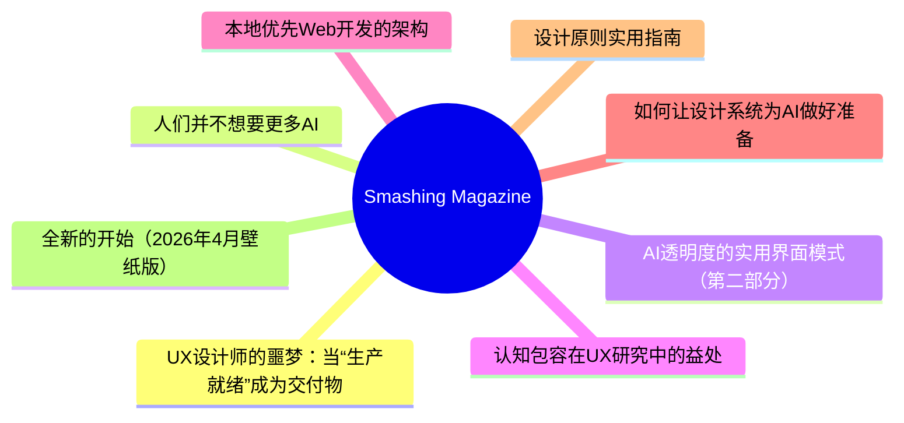
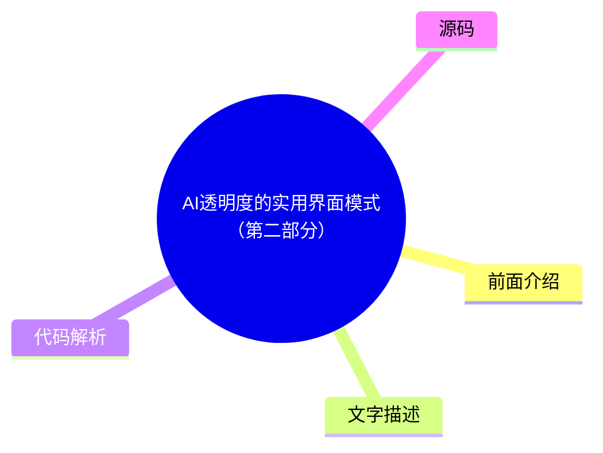

# 🔥 Smashing Magazine Top 8 (2026-07-27)

## 前面介绍

- 数据源：Smashing Magazine
- 抓取日期：2026-07-27
- 条目数：8
- 含完整正文：8
- 含代码片段：1
- 组织方式：前面介绍 / 树状图 / 文字描述 / 代码解析 / 源码

## 思维导图



## 详细整理（8 条，8 条含全文，1 条含代码）

### 1. UX设计师的噩梦：当“生产就绪”成为交付物
- **链接**: [https://smashingmagazine.com/2026/04/production-ready-becomes-design-deliverable-ux/](https://smashingmagazine.com/2026/04/production-ready-becomes-design-deliverable-ux/)
- **发布**: Wed, 22 Apr 2026 10:00:00 GMT

#### 前面介绍

- 行业正重新定义UX设计师的角色，模糊设计与工程的界限。
- 设计师被要求同时交付“氛围感”和“代码”，使用AI填补技术鸿沟。
- AI生成的功能性代码并不总是高质量代码，可能导致设计能力退化。

#### 树状图


#### 文字描述

- 2026年，LinkedIn上的职位描述显示，UX角色越来越要求具备AI增强开发、技术编排和生产就绪的原型设计能力。
- 这种转变导致了“能力陷阱”，试图同时精通两个截然不同的深度领域，结果往往导致在两者上都只能达到平庸水平。
- 研究表明，依赖AI辅助会导致概念掌握显著下降，使用AI辅助的参与者在理解测试中得分比手写代码的人低17%。
- 设计师使用AI编写不理解其底层逻辑的代码时，无法识别失败的原因和时机，这导致在流量高峰期出现故障时，设计师从专家变成了负债。
- 这种“平庸胜任”的困境不仅影响代码质量，还可能导致系统在关键时刻不可靠，从而损害用户体验和信任。

#### 代码解析

- 本文未提供源码，以下为实现思路或结构解析：
1. 核心冲突：设计师被期望成为“设计工程师”，需要理解AI逻辑并将其转化为用户可用的代码。
- 2. 风险点：过度依赖AI进行认知卸载，导致设计师失去调试和优化代码的能力，无法应对复杂的技术问题。
- 3. 架构建议：设计师应保持对底层逻辑的理解，避免完全外包给AI，确保在AI生成的代码出现问题时能够进行干预和修复。

#### 源码

#### 中文节选

2026年初，我注意到 UX 设计师工具箱似乎在一夜之间发生了转变。行业标准 *“设计师应该写代码吗？”* 的争论被市场突然平息了，不是通过我们行业的共识，而是通过职位要求的蛮力。如果你今天浏览 LinkedIn，你会注意到一个显著的变化：UX 职位越来越要求 ** AI 增强型开发**，

**技术编排，**

以及

**生产就绪的原型设计。**

对许多人来说，包括我自己，这是终极的设计噩梦。我们被要求同时交付“氛围感”和“代码”，使用 AI 代理来弥合一个以前需要多年的计算机科学知识和编码经验才能跨越的技术鸿沟。但随着行业急于满足这些新期望，他们发现 AI 生成的功能性代码并不总是 *好* 代码。

## LinkedIn 的压力锅：2026 年的角色蔓延

就业市场发出了明确的信号。虽然传统平面设计职位预计到 2034 年仅增长 **3%**，但 UX、UI 和 [产品设计职位](https://www.nobledesktop.com/careers/designer/job-outlook#:~:text=The%20projected%20future%20growth%20figures%20for%20Digital,job%20growth%20(which%20lies%20somewhere%20around%205%25).) 在同一时期预计增长 **16%**。

然而，这种增长越来越与 **AI 产品开发** 的兴起挂钩，其中“设计技能”最近已成为需求量最大的能力，甚至超过了编码和云基础设施。构建这些平台的公司不再仅仅寻找视觉设计师；他们需要能够“将技术能力转化为以人为中心体验”的专业人士。

这为 UX 设计师创造了一个高风险的环境。我们不再仅仅对界面负责；我们被期望充分理解技术逻辑，以确保复杂的 AI 功能对屏幕另一端的人类来说感觉直观、安全且有用。设计师正被推向一种 **“设计工程师”** 模式，即我们必须弥合抽象 [AI 逻辑与面向用户的代码](https://www.refontelearning.com/blog/ui-ux-designer-engineering-in-2026-crafting-future-ready-user-experiences#skills-and-competencies-for-the-2026-uiux-designer-3) 之间的差距。

一项 [最近的调查](https://www.lyssna.com/blog/ux-design-trends/) 发现，**73% 的设计师**现在将 AI 视为主要的合作伙伴，而不仅仅是一种工具。然而，这种“协作”往往看起来像是“角色蔓延”。招聘人员往往不仅是在寻找理解用户同理心和信息架构的人——他们想要的是那些能够通过提示词让 React 组件凭空出现并将其推送到代码库的人！

这种转变已经造成了一个 **能力差距**。

作为一名经验丰富的资深设计师，几十年来我一直致力于掌握认知负荷、无障碍标准等方面的细微差别，以及……

#### 完整正文（中文）

2026年初，我注意到 UX 设计师工具箱似乎在一夜之间发生了转变。行业标准 *“设计师应该写代码吗？”* 的争论被市场突然平息了，不是通过我们行业的共识，而是通过职位要求的蛮力。如果你今天浏览 LinkedIn，你会注意到一个显著的变化：UX 职位越来越要求 ** AI 增强型开发**，

**技术编排，**

以及

**生产就绪的原型设计。**

对许多人来说，包括我自己，这是终极的设计噩梦。我们被要求同时交付“氛围感”和“代码”，使用 AI 代理来弥合一个以前需要多年的计算机科学知识和编码经验才能跨越的技术鸿沟。但随着行业急于满足这些新期望，他们发现 AI 生成的功能性代码并不总是 *好* 代码。

## LinkedIn 的压力锅：2026 年的角色蔓延

就业市场发出了明确的信号。虽然传统平面设计职位预计到 2034 年仅增长 **3%**，但 UX、UI 和 [产品设计职位](https://www.nobledesktop.com/careers/designer/job-outlook#:~:text=The%20projected%20future%20growth%20figures%20for%20Digital,job%20growth%20(which%20lies%20somewhere%20around%205%25).) 在同一时期预计增长 **16%**。

然而，这种增长越来越与 **AI 产品开发** 的兴起挂钩，其中“设计技能”最近已成为需求量最大的能力，甚至超过了编码和云基础设施。构建这些平台的公司不再仅仅寻找视觉设计师；他们需要能够“将技术能力转化为以人为中心体验”的专业人士。

This creates a high-stakes environment for the UX designer. We are no longer just responsible for the interface; we are expected to understand the technical logic well enough to ensure that complex AI capabilities feel intuitive, safe, and useful for the human on the other side of the screen. Designers are being pushed toward a **“design engineer” model**, where we must bridge the gap between abstract [AI logic and user-facing code](https://www.refontelearning.com/blog/ui-ux-designer-engineering-in-2026-crafting-future-ready-user-experiences#skills-and-competencies-for-the-2026-uiux-designer-3).

A [recent survey](https://www.lyssna.com/blog/ux-design-trends/) found that **73% of designers** now view AI as a primary collaborator rather than just a tool. However, this “collaboration” often looks like “role creep.” Recruiters are often not just looking for someone who understands user empathy and information architecture — they want someone who can also prompt a React component into existence and push it to a repository!

This shift has created a **competency gap**.

As an experienced senior designer who has spent decades mastering the nuances of cognitive load, accessibility standards, and ethnographic research, I am suddenly finding myself being judged on my ability to debug a CSS Flexbox issue or manage a Git branch.

The nightmare isn’t the technology itself. It’s the **reallocation of value**.

“

### The Competence Trap: Two Job Skill Sets, One Average Result

There is potentially a very dangerous myth circulating in boardrooms that AI makes a designer “equal” to an engineer. This narrative suggests that because an LLM can generate a functional JavaScript event handler, the person prompting it doesn’t need to understand the underlying logic. In reality, attempting to master two disparate, deep fields simultaneously will most likely lead to being **averagely competent** at both.

### The “Averagely Competent” Dilemma

For a senior UX designer to become a senior-level coder is like asking a master chef to also be a master plumber because “they both work in the kitchen.” You might get the water running, but you won’t know why the pipes are rattling.


- **The “cognitive offloading” risk.**
 Research shows that while AI can speed up task completion, it often leads to a significant decrease in conceptual mastery. In a controlled study, participants using AI assistance scored- [17% lower](https://www.psychologytoday.com/au/blog/the-asymmetric-brain/202602/cognitive-offloading-using-ai-reduces-new-skill-formation)on comprehension tests than those who coded by hand.
- **The debugging gap.**
 The largest performance gap between AI-reliant users and hand-coders is in- [debugging](https://www.anthropic.com/research/AI-assistance-coding-skills). When a designer uses AI to write code they don’t fully understand, they don’t have the ability to identify- *when*and- *why*it fails.

So, if a designer ships an AI-generated component that breaks during a high-traffic event and cannot manually trace the logic, they are no longer an expert. They are now a liability.

### The High Cost Of Unoptimised Code

Any experienced code engineer will tell you that creating code with AI without the right prompt leads to a lot of rework. Because most designers lack the technical foundation to audit the code the AI gives them, they are inadvertently shipping massive amounts of [“Quality Debt”](https://gocrossbridge.com/blog/ai-generated-code/).

## Common Issues In Designer-Generated AI Code

- **The security flaw**
 Recent reports indicate that up to- [92% of AI-generated codebases](https://www.sherlockforensics.com/pages/ai-code-security-report-2026.html)contain at least one critical vulnerability. A designer might see a functioning login form, unaware that it has an 86% failure rate in XSS defense, which are the security measures aimed at preventing attackers from injecting malicious scripts into trusted websites.
- **The accessibility illusion**

 AI often generates “functional” applications that lack semantic integrity. A designer might prompt a “beautiful and functional toggle switch,” but the AI may provide a non-semantic- `<div>`that lacks keyboard focus and screen-reader compatibility, creating- [Accessibility Debt](https://www.levelaccess.com/blog/accessibility-debt-in-software-development-and-how-to-engineer-it-out/)that is expensive to fix later.
- **The performance penalty**
 AI-generated code tends to be verbose. AI is linked to- [4x more code duplication](https://www.netcorpsoftwaredevelopment.com/blog/ai-generated-code-statistics)than human-written code. This verbosity slows down page loads, creates massive CSS files, and negatively impacts SEO. To a business, the task looks “done.” To a user with a slow connection or a screen reader, the site is a nightmare.

## Creating More Work, Not Less

The promise of AI was that designers could ship features without bothering the engineers. The reality has been the birth of a **“Rework Tax”** that is draining engineering resources across the industry.

- **Cleaning up**
 Organisations are finding that while velocity increases, incidents per Pull Request are also rising by- [23.5%](https://blog.exceeds.ai/ai-code-analysis-benchmark-reports/). Some engineering teams now spend a significant portion of their week cleaning up “AI slop” delivered by design teams who skipped a rigorous review process.
- **The communication gap**
 Only- [69% of designers](https://www.lyssna.com/blog/ux-design-trends/)feel AI improves the quality of their work, compared to- **82% of developers**. This gap exists because “code that compiles” is not the same as “code that is maintainable.”

When a designer hands off AI-generated code that ignores a company’s internal naming conventions or management patterns, they aren’t helping the engineer; they are creating a puzzle that someone else has to solve later.

### The Solution

We need to move away from the nightmare of the “**Solo Full-Stack Designer**” and toward a model of **designer/coder collaboration**.

**The ideal reality:**

- **The Partnership**

 Instead of designers trying to be mediocre coders, they should work in a- **human-AI-human loop**. A senior UX designer should work- *with*an engineer to use AI; the designer creates prompts for- **intent, accessibility, and user flow**, while the engineer creates prompts for- **architecture and performance**.
- **Design systems as guardrails**
 To prevent accessibility debt from spreading at scale,- [accessible components must be the default](https://webaim.org/projects/million/)in your design system. AI should be used to feed these tokens into your UI, ensuring that even generated code stays within the “source of truth.”

## Beyond The Prompt

The industry is currently in a state of “AI Infatuation,” but the pendulum will eventually swing back toward quality.

“

Businesses that prioritise “designer-shipped code” without engineering oversight will eventually face a reckoning of technical debt, security breaches, and accessibility lawsuits. The designers who thrive in 2026 and beyond will be those who refuse to be “prompt operators” and instead position themselves as the **guardians of the user experience**. This is the perfect outcome for experienced designers and for the industry.

Our value has always been our ability to advocate for the human on the other side of the screen. We must use AI to augment our design thinking, allowing us to test more ideas and iterate faster, but we must never let it replace the specialised engineering expertise that ensures our designs technically *work* for everyone.

### Summary Checklist for UX Designers

- **Work Together.**
 Use AI-made code as a starting point to talk with your developers. Don’t use it as a shortcut to avoid working with them. Ask them to help you with prompts for code creation for the best outcomes.
- **Understand the “Why”.**
 Never submit code you don’t understand. If you can’t explain how the AI-generated logic works, don’t include it in your work.
- **Build for Everyone.**
 Good design is more than just looks. Use AI to check if your code works for people using screen readers or keyboards, not just to make things look pretty.


### 2. 人们并不想要更多AI
- **链接**: [https://smashingmagazine.com/2026/07/people-dont-want-more-ai/](https://smashingmagazine.com/2026/07/people-dont-want-more-ai/)
- **发布**: Wed, 15 Jul 2026 10:00:00 GMT

#### 前面介绍

- 大多数公司误以为用户渴望新AI功能，但现实是用户对AI持怀疑和抵触态度。
- AI功能往往只是附加工具，增加了用户在不同系统间切换的负担，且容易暴露组织内部的缺陷。
- 用户真正需要的是可靠、可预测且能增强工作流而非替代工作流的工具，而不是管理一堆不可靠的AI代理。

#### 树状图


#### 文字描述

- 许多AI功能尽管交付成本高昂，但采用率和留存率却很低。AI往往放大了组织中的捷径和缺陷，如数据质量问题，却无法修复长期积累的技术债。
- 用户非常清楚检查和修正AI幻觉的成本，这包括反复阅读、验证和重新生成响应，这种过程往往比从头编写更耗时。
- AI的到来往往伴随着对被取代的恐惧，导致用户对AI产生焦虑和抵触，而非兴奋。
- 用户并不梦想AI艺术博物馆或AI伴侣，他们不希望主动管理银行账户中的AI代理，也不希望全天候与一个不可预测的“魔法盒子”交互。
- 用户更看重功能的稳定性和可靠性，而非速度。他们希望AI自动化枯燥的任务，从而保留有意义的、创造性的工作。

#### 代码解析

- 本文未提供源码，以下为实现思路或结构解析：
1. 用户体验核心：AI应作为增强工具，而非颠覆工作流的替代品，重点在于自动化繁琐任务。
- 2. 可靠性优先：用户比较的是功能间的表现，而非AI与人类的表现，因此确保功能的稳定性和一致性至关重要。
- 3. 信任构建：避免使用模糊的提示词，提供清晰、可验证的输出，减少用户对AI幻觉和不可预测性的担忧。

#### 源码

#### 中文节选

Many companies silently assume that everybody wants more AI in their lives. That people are **craving new AI features**, new AI products, new AI workflows — that would all magically replace all existing outdated practices and broken ways of working.

But in reality, it seems like **people don’t want more AI** at all — at least not in the way most AI leaders envision it. Unsurprisingly, many AI features have [low adoption and retention](https://www.mindstudio.ai/blog/ai-adoption-gap-ibm-2026-study) — at a very high cost of delivery, and a high risk of reputation damage.

## The AI People Don’t Need

It’s remarkably difficult to make a strong argument with senior leadership, but [AI is not a value proposition](https://www.nngroup.com/articles/powered-by-ai-is-not-a-value-proposition/). New AI features don’t magically make for happy or excited customers. Because AI features are often bolt-ons and separate tools for employees to use, they typically **take people out** of their regular way of working.

AI is pretty good at **amplifying shortcuts and shortcomings** in organizations — from data quality to decision making. It can’t magically fix years of accumulated quick patches, technical debt, broken culture and internal politics. If anything, they become more visible with AI as inconsistencies or conflicting priorities and get handed directly to users, who are then left to make sense of the mess themselves.

Because in most organizations, work typically requires hopping on and off between plenty of disconnected and fragmented systems, with a new AI tool, they now have yet another system that they also need to hop on and off. Often it produces more work, and typically it’s not particularly rewarding work either.

On top of that, people are very much aware of the [cost of finding and fixing AI hallucinations](https://www.nngroup.com/articles/ai-chatbots-discourage-error-checking/). Asking AI to generate a response **might feel easier** than writing from scratch, but it has a cost:

- **Skim through**the entire AI output,
- **Spot key points**to focus attention on,
- **Review/verify key points**, one-by-one,
- **Check rationale**for what follows next,

- **Articulate corrections**+ regenerate，
- **Review the response**(a number of times)。

对于许多人来说，AI 并不是他们可以主动选择和探索的东西——它是不请自来的，按照别人的节奏到来。除此之外，大量的信息都在放大**对 AI 取代工作的恐惧和担忧**——因此，人们对 AI 的感知并非兴奋，而是**对变革的抗拒**以及对自身在世界中地位的深深焦虑，这个世界似乎正在没有他们的情况下发生改变。

在最好的情况下，AI 功能可能只是被默默接受或被敷衍了事。在最坏的情况下，AI 会**引发担忧、怀疑、谨慎**——并呼吁保持健康的怀疑态度。有时它被视为一种威胁或**责任**——因为与其他功能不同，AI 既不可预测也不可靠。

人们并不梦想着

#### 完整正文（中文）

Many companies silently assume that everybody wants more AI in their lives. That people are **craving new AI features**, new AI products, new AI workflows — that would all magically replace all existing outdated practices and broken ways of working.

But in reality, it seems like **people don’t want more AI** at all — at least not in the way most AI leaders envision it. Unsurprisingly, many AI features have [low adoption and retention](https://www.mindstudio.ai/blog/ai-adoption-gap-ibm-2026-study) — at a very high cost of delivery, and a high risk of reputation damage.

## The AI People Don’t Need

It’s remarkably difficult to make a strong argument with senior leadership, but [AI is not a value proposition](https://www.nngroup.com/articles/powered-by-ai-is-not-a-value-proposition/). New AI features don’t magically make for happy or excited customers. Because AI features are often bolt-ons and separate tools for employees to use, they typically **take people out** of their regular way of working.

AI is pretty good at **amplifying shortcuts and shortcomings** in organizations — from data quality to decision making. It can’t magically fix years of accumulated quick patches, technical debt, broken culture and internal politics. If anything, they become more visible with AI as inconsistencies or conflicting priorities and get handed directly to users, who are then left to make sense of the mess themselves.

Because in most organizations, work typically requires hopping on and off between plenty of disconnected and fragmented systems, with a new AI tool, they now have yet another system that they also need to hop on and off. Often it produces more work, and typically it’s not particularly rewarding work either.

On top of that, people are very much aware of the [cost of finding and fixing AI hallucinations](https://www.nngroup.com/articles/ai-chatbots-discourage-error-checking/). Asking AI to generate a response **might feel easier** than writing from scratch, but it has a cost:

- **Skim through**the entire AI output,
- **Spot key points**to focus attention on,
- **Review/verify key points**, one-by-one,
- **Check rationale**for what follows next,

- **Articulate corrections**+ regenerate,
- **Review the response**(a number of times).

For many people, AI isn’t something they can proactively choose and explore on their own — it arrives uninvited, at someone else’s pace. On top of that, plenty of messages amplify **fears and worries about AI** replacing work — so it’s hardly surprising that the perception of AI isn’t excitement. It’s **resistance to change** and deep anxiety about one’s place in a world that seems to be changing without them.

At best, AI features might be silently accepted or nodded away. At worst, AI **raises concerns**, doubts, caution — and calls for a healthy dose of skepticism. And sometimes it’s perceived as a threat or **liability** — because unlike other features, AI is neither predictable nor reliable.

People don’t dream of **AI art museums** or AI fridges or AI hotel reception or AI-narrated children’s books. They don’t want their children to have **romantic AI partners**. Most people don’t want to actively manage (and clean up after) a **swarm of AI agents** roaming in their bank accounts and acting on their behalf in the real world. And most notably, people don’t really want a magical box to speak to or type into all the time.

## The AI People Actually Need

I’m always puzzled by the comparison of AI features with how unreliable humans are. But people don’t compare software with other people. They **compare features with features** — and if one feature in one product is unreliable, while a similar feature works flawlessly in another, they choose the latter. It’s not about AI or not AI, but rather what works consistently and reliably, and what doesn’t.

Many conversations about AI are conversations about the speed of delivery. But to many people, there is little value in increasing the speed of delivery. They want to do things well, with enough time to think and make good decisions. They also want to **enjoy the time they spend working on things**, rather than just ship faster. There is an enormous feeling of reward and achievement that slowly disappears, one vibe-coded change at a time.


People don’t change much. And after all these years, they (still) want features that are fast, accessible, **reliable, predictable and useful** — every single time. And ideally not the ones that replace their entire workflow, but that **augment** their way of working — and that take over the most mundane, annoying, and boring tasks that they find no pleasure in.

Many jobs are [exposed to AI automation](https://www.washingtonpost.com/technology/interactive/2026/jobs-most-affected-ai-automation/), but in many of them there is a rewarding, unique, creative part that requires taste, point of view, and perhaps even human intuition. And if AI **automates boring parts** of it, that’s an advantage for everyone. That’s also what enhances productivity and brings more joy in daily life.

When AI automates tedious and mentally exhausting tasks, its value is much easier to grasp. But for that, AI shouldn’t feel like a bolt-on. It should be **deeply integrated** into people’s existing workflows. It must also match existing **mental models** that they have developed and fine-tuned for years or decades. AI should adapt to how people think and make decisions, not the other way around.

And it doesn’t really matter if these features are branded as “AI”, “smart” or “automation”. However, they must work well for people using them. And that means that people must be **aware of use cases** where it actually helps them, and be inspired to find more use cases on their own.

Ironically, tools that work well there aren’t “AI-first” — they are **“AI-second”**. Subtle, humble, calm, ambient, taking a supportive role in the background for work that otherwise is remarkably dull and unnecessary.

I don’t want to readbooks written by AI. I don’t want to gaze upon paintings by AI. I don’t want AI to teach my children. I don’t want to have an AI therapist. I don’t want AI making my medical decisions. I want AI to do all thephysical and mental laborthat taxes me so I can read books written by humans and go to art galleries to engage with art made by humans. I want AI that makes my life easier rather than forces me to change myself.


—[Bo Young Lee](https://www.linkedin.com/feed/update/urn:li:share:7467162929474420737/)

## Wrapping Up

Perhaps I’m missing a bigger picture, and perhaps I’m just old school — but **I really do like people**. Their stories, their thinking, their emotions, their enthusiasm, their laughing. AI can be remarkably helpful in many situations, but so are people. And between the two, I would favor **spending time with a human** — however imperfect they are — every single time.

No, **people don’t need more AI in their lives** — they need AI to automate all the boring stuff they have to deal with every day, so they have more time and headspace to do things that they actually love and enjoy doing. That doesn’t mean spending more time with AI — but spending more time with people they love.

## Meet “Design Patterns For AI Interfaces”

Meet [ Design Patterns For AI Interfaces](https://ai-design-patterns.com/), Vitaly’s new 

**video course**with practical examples from real-life products — with a

[live UX training](https://smashingconf.com/online-workshops/workshops/ai-interfaces-vitaly-friedman/)happening soon.

[Jump to a free preview](https://www.youtube.com/watch?v=jhZ3el3n-u0).

## Useful Resources

- [AI Adoption Gap: IBM 2026 Study](https://www.mindstudio.ai/blog/ai-adoption-gap-ibm-2026-study), by MindStudio
- [Powered by AI Is Not a Value Proposition](https://www.nngroup.com/articles/powered-by-ai-is-not-a-value-proposition/), by Nielsen Norman Group
- [AI Chatbots Discourage Error Checking](https://www.nngroup.com/articles/ai-chatbots-discourage-error-checking/), by Nielsen Norman Group
- [The Jobs Most Exposed to AI Automation](https://www.washingtonpost.com/technology/interactive/2026/jobs-most-affected-ai-automation/), by The Washington Post
- [On AI and What We Actually Want From It](https://www.linkedin.com/feed/update/urn:li:share:7467162929474420737/), by Bo Young Lee


### 3. AI透明度的实用界面模式（第二部分）
- **链接**: [https://smashingmagazine.com/2026/05/practical-interface-patterns-ai-transparency/](https://smashingmagazine.com/2026/05/practical-interface-patterns-ai-transparency/)
- **发布**: Wed, 13 May 2026 13:00:00 GMT

#### 前面介绍

- 传统的加载模式（如旋转器）在代理式AI体验中会导致用户困惑和焦虑。
- 通过揭示系统的过程、状态和决策制定过程，可以建立用户信任并改善透明度。
- 使用清晰的微文案和特定的公式来传达AI正在做什么，能让用户感到安心。

#### 树状图



#### 文字描述

- AI代理的等待时间不仅仅是数据下载，而是“思考”过程，使用通用的加载图标会让用户无法判断系统是卡顿还是崩溃。
- 透明度不仅仅是视觉设计问题，更是关于所使用的词语。应避免使用“加载”或“工作”等通用占位符，转而使用具体的公式。
- Perplexity AI提供了一个很好的例子，它实时显示正在进行的活动列表，让用户无需猜测AI正在做什么。
- 代理更新公式包含三个部分：强有力的动作词、AI正在处理的具体项目以及任何限制或规则。
- 例如，与其只显示“搜索航班……”，不如显示“扫描汉莎航空和联合航空的价格，以找到任何低于600美元的航班”。
- 这种结构化的沟通将技术过程扎根于用户的实际生活中，使AI的进度易于理解。

#### 代码解析

- 本文未提供源码，以下为实现思路或结构解析：
1. 状态更新公式：Action Word（动作词）+ Specific Item（具体项目）+ Limits/Rules（限制/规则）。
- 2. 示例应用：在预订旅行时，AI应明确告知用户正在扫描哪些航空公司的价格以及设定的预算上限。
- 3. 用户体验优化：将模糊的等待时间转化为主动的“正在为您解决问题”的信号，减少用户的焦虑感。

#### 源码

#### 中文节选

In the [first part of this series](https://www.smashingmagazine.com/2026/04/identifying-necessary-transparency-moments-agentic-ai-part1/), we talked about the **Decision Node Audit**. We mapped out the internal workings of our AI system to pinpoint the exact moments it makes decisions based on probabilities. This told us when the system needs to be transparent with the user. Now, the big question is *how* to share that information.

You’ve got your **Transparency Matrix** ready. You know which behind-the-scenes API calls need a visible status update. Your engineers are on board with the technical aspects. The next step is designing the visual container for those updates.

We face a legacy problem. For thirty years, interface designers have relied on a single pattern to handle latency: **the spinner**. The spinning wheel, the throbber, the progress bar. These patterns communicate a specific technical reality. They tell the user that the system is retrieving data. The delay is caused by bandwidth or file size.

AI agents introduce a new kind of wait time. When an agent pauses for twenty seconds, it’s not just downloading something; it’s *thinking*. It’s figuring out the best steps, weighing options, and creating the content you asked for.

If we use a basic spinning icon for this “thinking time,” users get confused and anxious. They watch a looping animation and can’t tell if the system is stalled or crashed. They don’t know if the agent is handling a very complicated task or if it has simply failed.

To build user trust, we need to turn this waiting time into a **moment for reassurance**. Instead of a passive *“something is happening,”* we need to communicate an active, *“Here is exactly how I am working to solve your problem.”*

## Writing Clear Status Updates

We often think of transparency as a visual design problem, but it’s really about the **words** we use. Simple, clear explanations (the microcopy) are what build trust and separate a reliable AI from one that feels broken.


我们需要淘汰像 *Loading* 或 *Working* 这样的通用占位符。这些词汇是静态软件时代的遗留产物。相反，我们必须使用特定的公式来构建状态更新，以反映系统的自主性。让我们停止使用“Loading”或“Working”这类模糊的词汇。这些术语属于过去，那时软件简单且静态。相反，我们应该创建状态更新，明确告知用户系统*实际上正在做什么*，并使系统的操作透明化。

想象一下，为了举例说明，你正在部署一个代理 AI，它会在被提示后帮助团队成员整理日历并代为安排 recurring meetings（定期会议）。

当 AI 显示类似“Checking availability（检查可用性）”的消息并持续了未知的时间时，用户往往会感到迷茫，因为提供的信息不够充分。虽然他们理解 AI 正在查看日历，但他们不知道查看的是*谁的*日历，还涉及哪些步骤（之前或之后）

#### 完整正文（中文）

In the [first part of this series](https://www.smashingmagazine.com/2026/04/identifying-necessary-transparency-moments-agentic-ai-part1/), we talked about the **Decision Node Audit**. We mapped out the internal workings of our AI system to pinpoint the exact moments it makes decisions based on probabilities. This told us when the system needs to be transparent with the user. Now, the big question is *how* to share that information.

You’ve got your **Transparency Matrix** ready. You know which behind-the-scenes API calls need a visible status update. Your engineers are on board with the technical aspects. The next step is designing the visual container for those updates.

We face a legacy problem. For thirty years, interface designers have relied on a single pattern to handle latency: **the spinner**. The spinning wheel, the throbber, the progress bar. These patterns communicate a specific technical reality. They tell the user that the system is retrieving data. The delay is caused by bandwidth or file size.

AI agents introduce a new kind of wait time. When an agent pauses for twenty seconds, it’s not just downloading something; it’s *thinking*. It’s figuring out the best steps, weighing options, and creating the content you asked for.

If we use a basic spinning icon for this “thinking time,” users get confused and anxious. They watch a looping animation and can’t tell if the system is stalled or crashed. They don’t know if the agent is handling a very complicated task or if it has simply failed.

To build user trust, we need to turn this waiting time into a **moment for reassurance**. Instead of a passive *“something is happening,”* we need to communicate an active, *“Here is exactly how I am working to solve your problem.”*

## Writing Clear Status Updates

We often think of transparency as a visual design problem, but it’s really about the **words** we use. Simple, clear explanations (the microcopy) are what build trust and separate a reliable AI from one that feels broken.


We need to retire generic placeholders like *Loading* or *Working*. These words are remnants of the era of static software. Instead, we must construct our status updates using a specific formula that mirrors the agency of the system. Let’s stop using vague words like “Loading” or “Working.” Those terms belong to the past, when software was simple and static. Instead, we should create status updates that clearly tell the user what the system is *actually doing* and make the system’s actions transparent.

Imagine, for the sake of an example, you are deploying agentic AI that will help team members organize their calendars and plan recurring meetings on their behalf, once prompted.

When an AI displays a message like “Checking availability” for an unknown amount of time, users often feel lost because it doesn’t offer enough information. While they understand the AI is looking at a calendar, they don’t know *whose* calendar it is, what other steps are involved (before or after), or if the AI even remembered the people and purpose of the scheduling request. Waiting for the final result can be a tense, uneasy experience, like anticipating a gift that you suspect might be a prank.

Perplexity AI provides a strong example of doing status updates right. Figure 1 below shows that when users ask a question, the interface displays exactly what it is doing in real time. You see a list of activities updating as they are accomplished. Users do not need to guess what is happening as the AI works.

## The Agentic Update Formula

To give people useful status updates, we need to connect what the system is *doing* with *why* it’s doing it. Keeping with our scheduling agent example, the system should break down that waiting period into at least four clear, separate steps.

- First, the interface displays *Checking your calendar to find open times for a recurring Thursday call with [Name(s)]*.
- Then, it updates to: *Cross-checking availability with [Name(s)] calendars*.
- Next, it might display: *Syncing [Name(s)] schedules to secure your meeting time on [Data and Time]*.

- Finally, at the conclusion, the agent might state they have successfully completed the task and request the user check their email to confirm the invite that’s been shared with the group having the recurring meeting.

This communication process grounds the technical process in the user’s actual life.

Making an AI’s progress easy to understand boils down to a three-part structure: a strong **Action Word**, what the AI is working on (the **Specific Item**), and any **Limits** or rules it has to follow.

Think about an AI helping you book a trip. A weak, unhelpful update would just be: *Searching for flights…*

A much better update uses the formula:

- **Action Word:**- *Scanning*
- **Specific Item:**- *the prices on Lufthansa and United*
- **Limits/Rules:**- *to find anything under $600.*

This approach clearly shows the user that the AI understood their request and is working within the set boundaries.

## Matching Tone to the Risk Matrix

Should an AI sound like a person or act like a robot? The right answer depends on the task’s importance, which we can figure out using the **Impact/Risk Matrix** from our **Decision Node Audit**.

For simple, low-risk tasks, a friendly, conversational tone works best. For example, a scheduling assistant can say it’s checking your calendar for the best time. This creates a comfortable, easygoing experience for the user.

However, high-stakes tasks demand clear, mechanical accuracy. If the AI is managing a big financial transfer or a complicated database migration, users don’t want a playful interface; they want precision. A screen that says *“I am thinking hard about your money”* would possibly cause panic. Instead, the interface should use straightforward language like *“Verifying account routing numbers.”* By adjusting the AI’s “personality” to match the level of risk, we give users exactly the experience they need in that moment. While the Impact/Risk Matrix provides a necessary starting point, the ultimate determinant of the appropriate AI voice and tone is rigorous **user research**.


It’s impossible for any set of rules to predict the exact words or tone that will build trust or cause stress for every group of users or in every situation. That’s why hands-on research is essential. You need to:

- [Run A/B tests](https://medium.com/@alienoghli/the-essential-guide-to-a-b-testing-a84b853c16e0)
- [Conduct usability studies](https://uxplanet.org/usability-testing-the-complete-guide-e162898f68db)
- [Perform interviews](https://ixdf.org/literature/article/how-to-conduct-user-interviews)

This kind of research ensures the AI’s “personality” is comfortable and appropriate for the actual people who will be using the system in their specific context.

We’ve now covered the *“what”* — the critical microcopy, the clear action words, and the necessary limits that make an AI status update honest and informative. But words alone aren’t enough. A perfect sentence hidden in a poor interface is still a failure of transparency.

The next challenge is the *“how”* — designing the physical delivery system for that message. You can think of the status update formula as the engine, and the interface pattern as the car. A powerful engine needs a reliable, well-designed chassis to carry it down the road.

## Interface Patterns: A Library For Agents

Once we have the right words, we need **the right container**. The key is matching the message’s weight to the pattern’s visibility. A tiny background task (like an agent gently tidying up your files) doesn’t need a loud, flashing banner. That message is best delivered subtly. A high-stakes, multi-step process (like moving money) potentially demands a more robust container that forces the user to pay attention.

By creating a library of these patterns, we ensure the right level of transparency is delivered at the right moment, turning the anxiety of waiting into a moment of informed confidence. Let’s review a few common, critical patterns.

### The Living Breadcrumb: AI Working in the Background

For those low-importance tasks that an AI is handling quietly in the background, we need a way to show users it’s working without constantly distracting them. We can call this the living breadcrumb.


想象一个邮件应用，其中 AI 正在为你起草回复。你不想被突兀的弹窗消息打扰。相反，一个微小的、微妙的状态指示器会在应用程序的边框或菜单区域内闪烁。

该方案需要超越静态图标。这个动态面包屑会在不同的文本更新之间平滑过渡。它可能会从 *Reading email*（阅读邮件）闪烁到 *Drafting reply*（起草回复）再到 *Checking tone*（检查语气）。如果你想要查看它的进度，它就在那里，提供一种安静的确认，表明任务正在进行中，但不会要求你立即关注。

### 动态检查清单

在处理关键、高风险的任务时——例如处理复杂的金融交易或迁移大型、复杂的数据集——我们建议使用 **Dynamic Checklist**（动态检查清单）（如图 3 所示）。

该模式为用户提供了一个强大的锚点，提供了关于 **流程进度** 的清晰度和信心。它不是简单的进度条，而是列出了 AI 代理将要执行的每一个计划步骤。它清晰地高亮显示当前正在进行的步骤，将前面的步骤标记为已完成，并列出未来的操作为待处理状态。

例如：

- **Step 1**: Verify Account Balance（验证账户余额）- **[Complete]**（已完成）。
- **Step 2**: Convert Currency（转换货币）- **[Processing]**（处理中）。
- **Step 3**: Transfer Funds（转账）- **[Pending]**（待处理）。

动态检查清单相比传统的进度条具有显著优势，因为它能巧妙地管理不可预测的时间。如果货币转换（Step 2）意外地需要额外十秒钟，用户不会感到突然的焦虑或恐慌。他们对系统的确切位置拥有完全的可见性，并理解延迟发生在 *Converting Currency*（转换货币）步骤期间。因为他们认识到这是一个可能复杂的操作，因此他们对系统正在进行的工工作会更加耐心和信任。

The pattern itself is a compelling UI idea, but designers must remember that its implementation transforms the task into a full-stack design requirement. Unlike a simple loading flag, the dynamic checklist requires a robust front-end state management system to listen for step-completion events, which are typically triggered by a back-end webhook structure. This ensures the interface is always reflecting the agent’s real-time position in the workflow.

### The Thinking Toggle

Some users with higher information needs or higher needs for transparency may not trust a simple summary; they want to see the system’s raw processing. For this audience, we’ve designed the **Thinking Toggle**.

This is a simple progressive disclosure UI control, like a chevron or a “View Logs” button, that lets the user expand a friendly status update into a raw terminal view. It displays the sanitized logic logs of the AI agent, such as:

- *Querying API endpoint /v2/search*;
- *Response received: 200 OK*;
- *Filtering results by relevance score > 0.8*.

Many people will never open this view. However, for the user who needs deep transparency, the very presence of this toggle is a signal of trust. It reassures them that the system is not concealing anything.

Keep in mind, with this deep transparency comes a critical technical risk. Even for your most expert audience, you must sanitize and abstract these raw logs before display. This step is non-negotiable to prevent accidentally exposing proprietary business logic, internal data structure names, or security tokens that could be exploited. This process ensures trust is built through honesty, not security vulnerability.

### Designing For Partial Success

In standard software, things are often black or white. A file either saves or it doesn’t. But with AI agents, things ar

...（截断，原文 21693+ 字符）


### 4. 认知包容在UX研究中的益处
- **链接**: [https://smashingmagazine.com/2026/06/benefits-cognitive-inclusion-ux-research/](https://smashingmagazine.com/2026/06/benefits-cognitive-inclusion-ux-research/)
- **发布**: Wed, 10 Jun 2026 10:00:00 GMT

#### 前面介绍

- 认知障碍是影响信息处理、记忆、专注力和学习能力的最普遍残疾类型。
- 与普通人群相比，认知障碍用户能提供独特的见解，且往往能发现更多可用性问题。
- 针对认知障碍用户的可用性测试需要特定的招募、筛选和研究方法，以确保研究的有效性。

#### 树状图


#### 文字描述

- 认知障碍包括神经多样性，如阅读障碍、ADHD和自闭症。研究显示，认知障碍在成年人中正在迅速增加。
- 研究团队创建了专门的筛选器来招募有记忆、专注和学习挑战的参与者，并制定了与认知参与者合作的最佳实践指南。
- 在试点研究中，认知障碍用户在三个不同网站上的表现揭示了普通用户可能忽略的可用性问题。
- 研究采用了“认知与普通人群”的对比方法，每个网站都有5名认知障碍用户和5名普通用户参与，以验证假设。
- 所有参与者都完成了“可访问可用性量表”（AUS）调查，以量化他们对数字产品的体验。
- 数据分析显示，认知障碍用户在界面导航、任务完成和错误处理方面面临更多困难，这为设计改进提供了宝贵的见解。

#### 代码解析

- 本文未提供源码，以下为实现思路或结构解析：
1. 研究方法：采用混合方法，结合用户访谈、问卷调查和可用性测试，以全面了解认知障碍用户的需求。
- 2. 筛选机制：使用特定的筛选器将参与者分为认知挑战组和普通组，确保研究的对比性。
- 3. 数据收集：记录所有访谈和转录，并记录参与者提出的每一个关注点、问题或困难，以便进行深入分析。

#### 源码

#### 中文节选

In the summer of 2024, I became co-chair of a working group of expert researchers who came together to determine how best to perform accessibility testing with people with cognitive disabilities. This was work I did for Fable, where I am currently VP of Innovation.

Cognitive disability is an umbrella term for several disabilities that impact how people process information, and it usually affects memory, focus, and/or learning. It is the most prevalent disability in the U.S. (13.9% via [CDC](https://www.cdc.gov/disability-and-health/articles-documents/disability-impacts-all-of-us-infographic.html)), and cognitive disability is increasing rapidly ([Yale study](https://news.yale.edu/2025/09/24/growing-number-us-adults-report-cognitive-disability)).

We set four goals for ourselves to learn how to work with this audience:

- How should we recruit and screen participants?
- What are best practices for research with cognitive participants?
- Do these methods work in a real study?
- Documenting what we learned so that we could share it.

We created a screener to recruit people who self-identified as having challenges with memory, focus, and learning. We also reviewed published studies that involved cognitive testers to learn best practices for working with them.

Next, we tested these best practices with an initial group of 25 testers in a pilot study. We fine-tuned our approach iteratively and created a guide to running user interviews with cognitive testers and a survey that could quantify their experiences using digital products. Finally, we [documented what we learned](https://makeitfable.com/article/cognitive-accessibility-pilot-case-study/).

After our pilot study with this new group of testers finished, I felt that they would uncover more usability insights than the general population (gen pop) user research participants I’d worked with in the past. I set out to validate this hunch.

## The Cognitive Usability Study


我决定与 Fable 的合作伙伴加州大学尔湾分校合作开展一项联合研究，在 Syed Fatiul Huq 的协助下，并在 Fable 研究员 Pranav Pidathala、Ali Brown 和 Michael Fagan 的帮助下，以验证我关于使用认知测试人员能获得更多见解的假设是否成立。

我使用 AI 原型工具生成了三个网站用于这项研究。我想要三种不同类型的网站，具有不同的用户目标和内容，以便在研究中测试各种任务。

### 表 1：测试的网站与任务

| 网站 | [Strong Snacks](https://v0-strong-snacks.vercel.app/) | [Turning Pages](https://v0-bookstore-nu.vercel.app/) | [Crown & Comb](https://v0-crown-and-comb.vercel.app/) | 
|---|---|---|---|
| 描述 | 这是一个提供三成分高蛋白食谱的网站。食谱可以按类别浏览（素食、增肌等）。该网站还包含关于蛋白质的博客文章和联系信息。 | 这是一个书店网站，拥有精选阅读目录。它具有扩展

#### 完整正文（中文）

In the summer of 2024, I became co-chair of a working group of expert researchers who came together to determine how best to perform accessibility testing with people with cognitive disabilities. This was work I did for Fable, where I am currently VP of Innovation.

Cognitive disability is an umbrella term for several disabilities that impact how people process information, and it usually affects memory, focus, and/or learning. It is the most prevalent disability in the U.S. (13.9% via [CDC](https://www.cdc.gov/disability-and-health/articles-documents/disability-impacts-all-of-us-infographic.html)), and cognitive disability is increasing rapidly ([Yale study](https://news.yale.edu/2025/09/24/growing-number-us-adults-report-cognitive-disability)).

We set four goals for ourselves to learn how to work with this audience:

- How should we recruit and screen participants?
- What are best practices for research with cognitive participants?
- Do these methods work in a real study?
- Documenting what we learned so that we could share it.

We created a screener to recruit people who self-identified as having challenges with memory, focus, and learning. We also reviewed published studies that involved cognitive testers to learn best practices for working with them.

Next, we tested these best practices with an initial group of 25 testers in a pilot study. We fine-tuned our approach iteratively and created a guide to running user interviews with cognitive testers and a survey that could quantify their experiences using digital products. Finally, we [documented what we learned](https://makeitfable.com/article/cognitive-accessibility-pilot-case-study/).

After our pilot study with this new group of testers finished, I felt that they would uncover more usability insights than the general population (gen pop) user research participants I’d worked with in the past. I set out to validate this hunch.

## The Cognitive Usability Study


I decided to run a joint study with Fable’s partners at the University of California, Irvine, in collaboration with Syed Fatiul Huq and with help from Fable researchers Pranav Pidathala, Ali Brown, and Michael Fagan to see if my hypothesis about finding more insights with cognitive testers proved true or not.

I generated three websites for the study using an AI prototyping tool. I wanted three different types of sites with different user goals and content so I could test a variety of tasks in the study.

### Table 1: Websites And Tasks Tested

| Website | [Strong Snacks](https://v0-strong-snacks.vercel.app/) | [Turning Pages](https://v0-bookstore-nu.vercel.app/) | [Crown & Comb](https://v0-crown-and-comb.vercel.app/) | 
|---|---|---|---|
| Description | This is a website for three-ingredient high-protein recipes. Recipes can be browsed by category (vegan, muscle building, etc.). The site also features blog posts about protein and contact information. | This website is for a bookstore with a catalog of curated reads. It features extensive filtering by book genre, a book swiping feature to build a profile of likes and dislikes, custom book lists, a shopping cart, and checkout. | A website for a hair salon that allows you to book appointments and consultations online. It has a VIP program and a variety of special packages visitors can buy. | 
| Design | Simple, brutalist, bright, lots of pictures. | Moody, classic, dark, lots of pictures of book covers. | Bold, clean, black and white with bursts of color. | 
| Content | Recipes, blog posts. | Books and book lists. | Services, experience guide, membership information. | 
| Key functionality | Filter by category, newsletter subscription. | Shopping cart, book matching, book lists, recommendations. | Appointment booking. | 
| Tasks | 
 | 
 | 
 | 

We used a single screener with questions about memory, focus, and learning, and screened participants into two groups based on whether they self-identified as having cognitive challenges or not.


认知障碍包括神经多样性。神经多样性是一个统称，用于描述大脑处理信息和学习方式不同的人群。它最常用于描述患有学习障碍（如阅读障碍）、多动症和自闭症的人群。

我们对每个网站进行了 30 次用户访谈，每个网站 10 人。对于每个网站，认知障碍参与者和普通人群参与者的比例均为 5:5。在每次访谈中，参与者在一个研究人员主持的在线用户访谈中完成一个网站的所有任务。

所有参与者在会话结束时都完成了一份[可访问可用性量表（AUS）调查](https://makeitfable.com/accessible-usability-scale/)。这是一份免费的、采用知识共享许可协议的 10 题调查，用于评估网站和移动应用的可访问性。

## 数据分析方法

我审查了所有的研究录音和逐字稿，并记录了参与者每次提出担忧、问题、困难或询问某事物工作原理的情况。我将所有这些情况都计为问题。我还记录了参与者遗漏了任务中某一部分的情况，即使他们自己没有注意到。我还记录了参与者提出的每一条改进建议。

发现的问题示例包括：

- 照片太高，需要大量滚动才能看到内容（参与者指出）。
- 当我喜欢或不喜欢一本书时，没有任何反馈（参与者指出）。
- 参与者第一次错过了必填的邮政信箱复选框（我观察到）。

建议的示例包括：

- 我希望看到蛋白质对比表。
- “更多信息”标签页应该移到更靠上的位置。
- 我希望获得更多关于推荐列表是如何生成的信息。

每个参与者的问题和建议只计算一次，即使他们提到了两次，但在不同参与者之间，问题和建议当然会有重复。在涉及多个参与者的用户体验研究中，预期会发现每个参与者都会遇到类似的问题，这表明该问题是一个普遍存在的挑战。

## 认知可用性研究的结果

Across the three websites tested:

- Cognitive participants identified 197 issues.
- Gen pop participants identified 113 issues.
- Cognitive participants made 93 suggestions.
- Gen pop participants made 54 suggestions.
- Cognitive participants surfaced more issues related to content, buttons, icons, visual elements, and media than gen pop participants.

The results aligned with my instincts: participants with cognitive disabilities identified 1.8 times more issues and made 1.8 times more suggestions than gen pop participants.

Let’s dive deeper into the data for each website. Note that an AUS score ranges from 0 to 100, with higher numbers representing better usability than lower numbers.

### Table 2: Strong Snacks

This site had the simplest design and content of all websites tested in the study and accordingly had the lowest overall issues and the highest median AUS scores. The data aligns with what you’d expect from an easy-to-use and simple website.

On this website, cognitive participants found 3.4 more issues and made 2.2 more suggestions on average. Their average score of the overall experience was 13.7 points lower than that of the gen pop participants.

| Total issues | Average issues | Median issues | Total suggestions | Average suggestions | Median suggestions | Average AUS | Median AUS | |
|---|---|---|---|---|---|---|---|---|
| Gen pop | 32 | 6.4 | 6 | 13 | 2.6 | 2 | 90.5 | 97.5 | 
| Cognitive | 49 | 9.8 | 9 | 24 | 4.8 | 4 | 76.8 | 73.0 | 

### Table 3: Turning Pages

This was the website with the most varied functionality and the most tasks to complete (4), so it’s not surprising that participants found the most issues.

Here, cognitive participants found 6 more issues and made 3.2 more suggestions on average. They also scored the overall experience 17.2 points lower than gen pop participants on average.

| Total issues | Average issues | Median issues | Total suggestions | Average suggestions | Median suggestions | Average AUS | Median AUS | |
|---|---|---|---|---|---|---|---|---|
| Gen pop | 55 | 11 | 10 | 26 | 5.2 | 4 | 78.0 | 80.0 | 
| Cognitive | 86 | 17 | 15 | 42 | 8.4 | 6 | 60.8 | 58.0 | 

### Table 4: Crown & Comb


This website was intentionally designed to be complex, and task 3, finding the bridal package, was meant to be extremely difficult to complete.

On this last website, cognitive participants on average found 7 more issues and made 2.4 more suggestions. Their average score for the overall experience was 14.3 points **higher** than the gen pop participants.

| Total issues | Average issues | Median issues | Total suggestions | Average suggestions | Median suggestions | Average AUS | Median AUS | |
|---|---|---|---|---|---|---|---|---|
| Gen pop | 26 | 5 | 4 | 15 | 3 | 3 | 49.5 | 35.0 | 
| Cognitive | 62 | 12 | 11 | 27 | 5.4 | 2 | 63.8 | 68.0 | 

Something interesting happened with the AUS scores for cognitive and gen pop participants in Tables 3 and 4. Cognitive participants scored Crown & Comb higher than Turning Pages, but gen pop scored the opposite — higher for Turning Pages and lower for Crown & Comb. If I had to guess why, I suspect finding more issues on Turning Pages impacted the cognitive participants’ perceptions of usability more than the gen pop participants’.

The other major difference between the sites, outlined in Table 5 below, was that cognitive participants found many more issues with buttons and links on Turning Pages and more issues with icons and visual elements on Crown & Comb. This suggests to me that the interactions being challenging on Turning Pages were a more significant challenge than issues with visual elements.

### Qualitative Findings

When it comes to the more qualitative findings, I looked at trends in the types of issues found by both groups of participants.

**Cognitive participants**:

- Were more likely to flag issues with icons or visual elements.
- Surfaced problems with content more frequently.
- Gave richer qualitative commentary, often explaining why something was hard to find or confusing.

**Gen pop participants**:

- Were less likely to flag conceptual or comprehension barriers.
- Gave shorter feedback, often stopping once the task was complete.

### Table 5: Number Of Issues By Category


When I grouped issues by category, the following issues surfaced more often with cognitive participants: content, buttons and links (affordances and function), icons or visual elements, and media (video, animations). They nearly tied with gen pop participants on navigation issues (45 vs 46).

| Strong Snacks | Turning Pages | Crown & Comb | ||||
|---|---|---|---|---|---|---|
| Issue category | Gen pop | Cognitive | Gen pop | Cognitive | Gen pop | Cognitive | 
| Content | 11 | 22 | 11 | 30 | 23 | 36 | 
| Navigation | 18 | 22 | 25 | 17 | 2 | 7 | 
| Buttons and links | 0 | 5 | 7 | 20 | 3 | 0 | 
| Icons or visual elements | 3 | 16 | 2 | 3 | 4 | 23 | 
| Media | 0 | 2 | 0 | 1 | 0 | 0 | 

Let’s look at the commentary provided by one cognitive participant versus one gen pop participant in the Crown & Comb sessions. The cognitive participant gave an AUS score of 38, and the gen pop participant gave an AUS score of 27.5. I chose to compare these two participants because they both gave the lowest scores within their group.

Notice the differences in how they described the overall experience in the quotes below. The gen pop participant explained it was frustrating and not engaging. The cognitive participant felt drained and less able to focus. I interpreted the experience as having a more profound impact on the cognitive participant’s overall wellbeing.

Gen pop participant quote

“As soon as you have a name of a treatment and a little explanation and like the duration and the price, as soon as you click onto that, it should be that you can interact with that service straight away. And

...（截断，原文 21693+ 字符）


### 5. 本地优先Web开发的架构
- **链接**: [https://smashingmagazine.com/2026/05/architecture-local-first-web-development/](https://smashingmagazine.com/2026/05/architecture-local-first-web-development/)
- **发布**: Wed, 06 May 2026 10:00:00 GMT

#### 前面介绍

- 本地优先架构将用户设备作为数据的主要副本，而非服务器。
- 它不是离线优先或PWA的简单替代，而是一种改变整个技术栈的数据架构。
- 在数据主要由服务器生成或需要强事务一致性的场景中，本地优先架构并不适用。

#### 树状图


#### 文字描述

- 作者在演示项目时因网络问题导致应用无法加载，从而开始认真研究本地优先架构。
- 本地优先并不意味着离线优先或PWA，它是一种数据架构，客户端拥有自己的数据库，服务器仅作为同步对等节点。
- Ink & Switch论文定义的七个理想包括：快速、多设备、离线、协作、长寿、隐私和用户所有权。
- 本地优先架构不适合数据主要由服务器生成的场景，如分析仪表板、社交媒体 feeds 或搜索结果。
- 它也不适合需要强事务一致性的系统，如银行、支付处理和库存管理，因为最终一致性可能导致数据不一致。
- 对于没有离线或协作需求的简单CRUD应用，添加同步引擎是过度设计。

#### 代码解析

- 本文未提供源码，以下为实现思路或结构解析：
1. 架构定义：客户端是分布式系统中的一个节点，拥有自己的数据库，服务器仅用于同步和备份。
- 2. 适用场景：适用于需要离线工作、多设备同步和用户拥有数据的场景，如笔记应用、任务管理工具。
- 3. 不适用场景：不适合服务器生成数据、需要强一致性或简单CRUD应用，避免过度工程化。

#### 源码

#### 源码片段 1（text）

```text
import { SQLiteAPI } from 'wa-sqlite';
import { OPFSCoopSyncVFS } from 'wa-sqlite/src/examples/OPFSCoopSyncVFS.js';
async function initDatabase() {
  const module = await SQLiteAPI.initialize();
  const vfs = new OPFSCoopSyncVFS('pm-tool-db');
  await vfs.initialize(module);
  const db = await module.open_v2('workspace.db');
  // HACK: wa-sqlite doesn't handle concurrent writes well on Safari,
  // so we serialize through a queue. See vlcn-io/wa-sqlite#247
  await module.exec(db, `PRAGMA journal_mode=WAL`);
  await module.exec(db, `
    CREATE TABLE IF NOT EXISTS tasks (
      id TEXT PRIMARY KEY,
      title TEXT NOT NULL,
      status TEXT DEFAULT 'backlog',
      assignee_id TEXT,
      project_id TEXT NOT NULL,
      position REAL DEFAULT 0,
      created_at TEXT DEFAULT (datetime('now')),
      updated_at TEXT DEFAULT (datetime('now'))
    )
  `);
  return db;
}
```

#### 完整正文（中文）

Last October, I was sitting in a hotel room in Lisbon, the night before I was supposed to demo a project management tool my team had spent four months building. The hotel Wi-Fi was doing that thing where it *connects* but nothing actually loads. And I watched our app, this thing I was genuinely proud of, render a blank screen with a spinner. Then a timeout error. Then nothing.

I pulled out my phone, tethered to cellular, and got a shaky connection. The app loaded, but every click was a two-second wait. Create a task? Spinner. Move a task between columns? Spinner. I sat there thinking: we built a front end in React, a back end in Node, a Postgres database, a Redis cache, a GraphQL API with six resolvers just for the task board. All that infrastructure, and the damn thing can’t show me my own data without a round-trip to a server 3,000 miles away.

That was the night I started seriously looking at **local-first architecture**. Not because I read a blog post or saw a tweet. Because I was *embarrassed*.

I want to be upfront about something: I spent the first year or so dismissing local-first as academic. I read the [Ink & Switch “Local-First Software” paper](https://www.inkandswitch.com/local-first-software/) when it came out in 2019 and thought, *“Cool research, not practical for real apps.”* I was wrong. The tooling in 2019 genuinely wasn’t ready. But I was also being lazy, defaulting to the architecture I already knew. The paper laid out seven ideals for software: **fast, multi-device, offline, collaboration, longevity, privacy, user ownership**. And I remember thinking those sounded like a wish list, not engineering requirements.

Seven years later, I’ve shipped three production apps using local-first patterns. I’ve also ripped local-first out of two projects where it was the wrong call. I have opinions. Some of them are probably wrong. But they’re earned.

So here’s what I actually think about building local-first web apps in 2026, written for developers who’ve been doing this long enough to be skeptical of silver bullets.

## What “Local-First” Actually Means (And The Confusion That Won’t Die)


我需要澄清一下，因为我在聚会中经常遇到这个话题。**本地优先不是离线优先。** 这不是“加个 Service Worker 就完事了”。它不是 PWA 的同义词。我在会议演讲中见过所有这些概念被混为一谈，这让我有点抓狂。

离线优先意味着你的应用能优雅地处理网络中断，但[服务器仍然是真理之源](https://www.smashingmagazine.com/2019/04/cloudflare-workers-serverless/)。当网络恢复时，服务器胜出。缓存优先（Service Worker 缓存响应）是一种性能优化。你是在更快地提供陈旧数据，这很好，但你并没有改变谁*拥有*数据。PWA 只是一种交付机制：可安装、可缓存、推送通知。这些都不是数据架构。

**本地优先是一种数据架构。** 你的用户的设备保存着他们数据的副本。应用读写本地数据库。即时渲染。在后台与服务器或其他设备同步。服务器（如果存在的话）只是一个具有特殊权限（身份验证、备份、访问控制）的同步节点。但它不是守门人。

Ink & Switch 的论文定义了七个理想原则，我认为它们仍然成立。但在实践中最重要的、改变你构建一切方式的原则是这一条：

客户端不是一个仅仅请求权限来显示数据的薄视图。客户端是一个分布式系统中的节点，拥有自己的数据库。

这种区别听起来很微妙。其实不然。它改变了你的整个技术栈。

## 诚实面对早期：何时不应这样做

我把这一点放在前面，因为我看到太多开发者（包括曾经的我）对新架构感到兴奋，然后强行将其套用到不适合的项目中。我在上一份工作中浪费了大约六周时间，试图让本地优先的方法适用于一个内部分析仪表板。我的同事 Sarah 最后把我拉到一边说，“数据是在服务器上生成的。没有什么需要复制到客户端的。你在做什么？”她是对的。

Local-first is a bad fit when your data is primarily server-generated. Analytics dashboards, social media feeds, search results: the server *produces* this data, so the client consuming it via API requests is completely fine.

It’s wrong for systems that need strong transactional consistency. Banking, payment processing, and inventory management. If two people try to buy the last item in stock, you need a single authoritative database making that decision with [ACID](https://en.wikipedia.org/wiki/ACID) guarantees. Eventual consistency will lose you money, or worse.

It’s overkill for simple CRUD apps with no offline or collaboration needs. If you’re building an internal admin panel used by five people in an office with good internet, adding a sync engine is over-engineering. And it’s physically impractical for massive datasets that won’t fit on client devices.

But here’s where it shines: note-taking, document editing, collaborative design tools, project management, field apps with unreliable connectivity, basically anything where **data privacy is a selling point**, as well as anything with **real-time collaboration**. In other words, it’s great for **user-generated data** that benefits from instant interaction and should survive the server going down.

One more thing I wish someone had told me earlier: you don’t have to go all-in. I’ve had the best results using local-first for *specific features* within otherwise traditional apps. Offline drafts in a blog editor. Real-time collaborative notes inside a project management tool that’s otherwise standard REST.

“

## Replicas, Not Requests

If you’ve used Git, you already understand the mental model.

SVN (remember SVN?) was centralized. One server. You check out files, make changes, and commit to the server. Server down? Can’t commit. Can’t even see history.

Git gave every developer a full clone. You commit locally, branch locally, and merge locally. Push and pull when you’re ready. The remote repository is important, but it’s not the only copy of the truth.


**Local-first web development is Git for application data.** Every client device holds a replica (full or partial) of the relevant data. Writes happen locally. Sync is push/pull in the background. Conflicts get resolved through defined merge strategies.

I remember the first time this clicked for me in practice. I was prototyping a task board, and I wrote a function to add a task. In our old architecture, it would be:

- POST to API.
- Wait for the response.
- If success, update the local state.
- If failure, show error toast and maybe roll back optimistic update.

In the local-first version, it was: write to local SQLite, done. The UI updated instantly because it was reading from the same local database. Sync happened whenever. No loading state, no error handling for the write itself, no optimistic update logic (because there’s nothing to be “optimistic” about; the local write *is* the state).

The implications ripple through everything. You don’t need React Query or SWR for data fetching, because you’re not fetching. You don’t need Redux or Zustand for server-derived state, because the local database *is* your state. Your routing doesn’t trigger API calls. Authentication works differently because the server isn’t checking permissions on every read.

Here’s a visual comparison that might help if you’re the kind of person (like me) who thinks spatially:

On the left, every user interaction is a round-trip. Click, wait, render. On the right, reads and writes hit the local database directly. The sync server is still there, but it’s doing its work in the background. The user never waits for it. That’s the fundamental shift.

But I’m getting ahead of myself. Before we can talk about sync and conflicts, we need to talk about where the data actually lives on the client.

## Where Data Lives on the Client

Forget `localStorage`. It’s synchronous (blocks the main thread), caps at 5-10 MB, and only stores strings. It’s fine for a theme preference. It’s not a database.


IndexedDB is the workhorse that nobody loves. It’s in every browser, it’s asynchronous, it can handle hundreds of megabytes, and its API is absolutely miserable to work with. I’ve used it directly a grand total of once. Now I use it through abstractions or, more often, I don’t use it at all.

Because the real story in 2026 is SQLite running in the browser via WebAssembly.

I know that sounds like a party trick, but it’s not. SQLite compiled to WASM, persisted to the Origin Private File System (OPFS), gives you a *real relational database* in the browser. Full SQL queries. Transactions. Indexes. The works.

OPFS is the newer API that makes this practical. It gives web apps a sandboxed file system with high-performance synchronous access (in Web Workers), which is exactly what SQLite needs. Before OPFS, you could run SQLite in memory and manually persist to IndexedDB, which worked but was slow and fragile.

Here’s roughly what initialization looks like in a real project (I’m using [ wa-sqlite](https://github.com/rhashimoto/wa-sqlite) here, which is the library I’ve had the best luck with):

```
import { SQLiteAPI } from 'wa-sqlite';
import { OPFSCoopSyncVFS } from 'wa-sqlite/src/examples/OPFSCoopSyncVFS.js';
async function initDatabase() {
  const module = await SQLiteAPI.initialize();
  const vfs = new OPFSCoopSyncVFS('pm-tool-db');
  await vfs.initialize(module);
  const db = await module.open_v2('workspace.db');
  // HACK: wa-sqlite doesn't handle concurrent writes well on Safari,
  // so we serialize through a queue. See vlcn-io/wa-sqlite#247
  await module.exec(db, `PRAGMA journal_mode=WAL`);
  await module.exec(db, `
    CREATE TABLE IF NOT EXISTS tasks (
      id TEXT PRIMARY KEY,
      title TEXT NOT NULL,
      status TEXT DEFAULT 'backlog',
      assignee_id TEXT,
      project_id TEXT NOT NULL,
      position REAL DEFAULT 0,
      created_at TEXT DEFAULT (datetime('now')),
      updated_at TEXT DEFAULT (datetime('now'))
    )
  `);
  return db;
}
```

在生产环境中，我将所有数据库访问都包装在一个写入队列中，该队列会对变更进行序列化。我还将每次失败的写入都记录到 Sentry 中，包含完整的 SQL 语句（当然，已去除 PII），因为在用户的浏览器中调试数据库问题没有这些遥测数据简直是地狱。

我浪费了将近两天时间才意识到的一个陷阱：Safari 的 OPFS 实现与 Chrome 的实现存在微妙差异。具体来说，我遇到了一个 bug，即 `createSyncAccessHandle()` 在 Safari 18 的某些 iframe 上下文中会静默失败。没有错误，也没有异常。它就是不工作。最终我不得不在 Safari 上回退到基于 IndexedDB 的持久化方案，虽然速度较慢，但至少能用。（据我了解，[Safari 19⁄26](https://developer.apple.com/documentation/safari-release-notes/safari-26-release-notes) 修复了这个问题，但我尚未验证。）

我实际使用过的选项的快速对比：

| 存储 | 适用于 | 注意事项 | 
|---|---|---| 
| IndexedDB | 广泛兼容性，中等数据量 | 极差的开发体验 (DX)，不支持 SQL，代码冗长 | 
| OPFS + SQLite WASM | 关系型数据，复杂查询，严肃的应用 | Safari 的怪异行为，增加约 400KB 的包体积 | 
| PGlite (WASM 中的 Postgres) | 客户端上的完整 Postgres 兼容性 | 较新，包体积较大，仍在成熟中 | 

我还尝试过 [ cr-sqlite](https://github.com/vlcn-io/cr-sqlite)，它直接在 SQLite 表中添加了 CRDT 列支持。想法很巧妙，但我在 2025 年底评估时发现它对于生产使用来说太早了。合并语义有时会令人意外，在 SQLite 中调试 CRDT 状态非常痛苦。我今年晚些时候会再考虑它。

## 真正困难的部分

在本地存储数据是一个已解决的问题。跨设备和用户可靠地同步它才是让你生出白发的地方。

...（截断，原文 40266+ 字符）


### 6. 如何让设计系统为AI做好准备
- **链接**: [https://smashingmagazine.com/2026/06/how-make-design-system-ai-ready/](https://smashingmagazine.com/2026/06/how-make-design-system-ai-ready/)
- **发布**: Wed, 03 Jun 2026 13:00:00 GMT

#### 前面介绍

- AI生成的原型往往因为设计系统中的微小不一致而表现不佳。
- 将设计决策视为基础设施，通过规范文件、令牌层和审计脚本来引导AI。
- 使用FigmaLint等工具审计设计系统，确保AI生成的代码和文档质量。

#### 树状图


#### 文字描述

- 更好的AI原型来自更好的数据和更明确的人类指导。AI需要明确的决策路径、设计原则和示例。
- 设计决策应被视为基础设施，每次决策都必须记录在规范文件中，供AI读取和遵循。
- 规范文件是结构化的Markdown文件，包含间距规则、颜色选择、组件使用指南和优先级。
- 令牌层维护所有使用的令牌，AI从封闭的命名变量集中选择，而不是随意发明值。
- 审计脚本扫描原型并标记硬编码值，确保AI遵循规范。
- 当设计系统更新时，同步例程会标记需要更新的规范文件，确保AI始终读取最新的规范。

#### 代码解析

- 本文未提供源码，以下为实现思路或结构解析：
1. 规范文件：将设计决策和规则结构化为Markdown文件，作为AI生成的输入源，提高准确性和成本效益。
- 2. 令牌管理：维护一个封闭的命名变量集，确保AI生成的代码使用一致的令牌值，减少不一致性。
- 3. 自动化审计：使用脚本或工具自动检测硬编码值和缺失状态，确保设计系统的质量和一致性。

#### 源码

#### 中文节选

**AI 生成的原型**往往无法提供始终如可观的成果，这是因为设计系统中散布着许多微小的不一致之处。这些不一致可能源于未记录的决策、从未清理的硬编码值，或者**过度依赖 AI** 去自行理解线框图或设计流程。

昨天，我在 Atlassian 的 Hardik Pandya 的 [一份实用的指南](https://hvpandya.com/llm-design-systems) 中发现了一些有用的内容，该指南详细介绍了**如何减少偏差**、最大限度地减少错误、保持上下文，并提高 AI 生成的原型的质量。让我们来看看它是如何运作的。

## 1. 设计决策即基础设施

不出所料，更好的 AI 原型**源于更好的数据**——但也源于更好的人工指导。我们不应假设 AI 知道如何选择正确的组件，以及如何考虑无障碍性进行设计。它需要优先级、清晰的决策路径、设计原则、示例以及注意事项。

事实上，我们应该将设计决策视为**基础设施**。这意味着，每当我们做出决策时——不仅仅是设计决策，甚至包括如何实际确定工作优先级以及我们在这里如何做出决策——都必须有一条路径进入规范文件，然后由 AI 消费这些内容。

## 2. 审计：FigmaLint

审计设计系统质量的有用工具之一是 [FigmaLint](https://www.figma.com/community/plugin/1521241390290871981/figmalint)。这是一个有用的**免费 Figma 插件**，用于审计令牌、状态、无障碍性、绑定令牌、重命名图层、检测分离的实例、缺失的交互状态和硬编码值——以及准备设计文档。

如果你经常需要与**供应商和第三方**合作，他们向你提供设计系统和组件库，那么身边有一个这样的助手会非常有帮助——特别是如果你想提高原型的质量、AI 生成的代码和 AI 编写的文档质量的话。

## 3. 三层结构：规范文件 + 令牌层 + 审计

为确保质量，我们以“**规范文件**”的形式建立设计原则、指南和规则。它是结构化的 Markdown 文件，包含间距规则、颜色选择、组件使用指南、优先级等。AI 在每次生成原型时都会读取并重用该规范文件。

由于规范文件是文本文件，它不仅**更具成本效益**，而且更加准确，这是因为我们不再依赖 AI 从线框图中识别或解码模式，而是获取具体的指南。事实上，扩展代码往往比从线框图生成代码更有效。

**令牌层**列出了并维护了设计系统中使用的所有令牌。AI 始终从一组封闭的命名变量中选择，而不是临时编造看似合理的值。

**审计脚本**会捕获 AI 的错误。它会扫描原型，标记每一个硬编码的值，并在必要时将其标记。它可以是一个常规软件来执行此操作，与

#### 完整正文（中文）

**AI 生成的原型**往往无法提供始终如可观的成果，这是因为设计系统中散布着许多微小的不一致之处。这些不一致可能源于未记录的决策、从未清理的硬编码值，或者**过度依赖 AI** 去自行理解线框图或设计流程。

昨天，我在 Atlassian 的 Hardik Pandya 的 [一份实用的指南](https://hvpandya.com/llm-design-systems) 中发现了一些有用的内容，该指南详细介绍了**如何减少偏差**、最大限度地减少错误、保持上下文，并提高 AI 生成的原型的质量。让我们来看看它是如何运作的。

## 1. 设计决策即基础设施

不出所料，更好的 AI 原型**源于更好的数据**——但也源于更好的人工指导。我们不应假设 AI 知道如何选择正确的组件，以及如何考虑无障碍性进行设计。它需要优先级、清晰的决策路径、设计原则、示例以及注意事项。

事实上，我们应该将设计决策视为**基础设施**。这意味着，每当我们做出决策时——不仅仅是设计决策，甚至包括如何实际确定工作优先级以及我们在这里如何做出决策——都必须有一条路径进入规范文件，然后由 AI 消费这些内容。

## 2. 审计：FigmaLint

审计设计系统质量的有用工具之一是 [FigmaLint](https://www.figma.com/community/plugin/1521241390290871981/figmalint)。这是一个有用的**免费 Figma 插件**，用于审计令牌、状态、无障碍性、绑定令牌、重命名图层、检测分离的实例、缺失的交互状态和硬编码值——以及准备设计文档。

如果你经常需要与**供应商和第三方**合作，他们向你提供设计系统和组件库，那么身边有一个这样的助手会非常有帮助——特别是如果你想提高原型的质量、AI 生成的代码和 AI 编写的文档质量的话。

## 3. 三层结构：规范文件 + 令牌层 + 审计

To ensure quality, we establish design principles, guidelines, and rules in the form of “**spec files”**. It’s structured Markdown files that include spacing rules, color choices, component usage guidelines, priorities, etc. AI is going to read and reuse that spec file every time it’s going to generate a prototype.

Because the spec files are text files, it’s much more **cost-effective** but also much more accurate, just because we don’t rely on AI recognizing or decoding patterns from mock-ups but get specific guidelines instead. In fact, extending code is often a more effective way than generating code from mock-ups.

The **token layer** lists and keeps updated all tokens used throughout the design system. AI always chooses from a closed set of named variables instead of inventing plausible values ad hoc.

An **audit script** catches what AI gets wrong. It scans the prototype and flags every hard-coded value and flags it if necessary. It can be a regular software doing that, with AI waiting for its feedback to come back.

Finally, when a design system **ships updates**, a sync routine flags which spec files need updating. The goal is to make sure that AI always reads up-to-date, current specs, not the ones written against an outdated version.

## 4. Examples of AI-Ready Design Systems

## Wrapping Up

Ultimately, AI **cannot magically resolve** technical debt or design debt without proper guidance. It relies heavily on clear decisions, established priorities, and well-defined principles.

The more **deliberate and precise** designers are in guiding AI, the better the overall outcomes will be. This requires not just cleaning up and improving design systems but also maintaining them over time as decisions need to trickle down into Markdown files. We’ll be busy for years to come.

## Meet “Design Patterns For AI Interfaces”

Meet [ Design Patterns For AI Interfaces](https://ai-design-patterns.com/), Vitaly’s new 

**video course**with 100s of real-life examples and UX guidelines to design AI features that people actually use — with a

[live UX training](https://smashingconf.com/online-workshops/workshops/ai-interfaces-vitaly-friedman/)later this year.


[跳转到免费预览](https://www.youtube.com/watch?v=jhZ3el3n-u0).

## 有用资源

- [FigmaLint](https://www.figma.com/community/plugin/1521241390290871981/figmalint)，作者：TJ Pitre
- [Atlassian AI-就绪设计系统示例](https://atlassian.design/)，作者：Atlassian
- [Carbon AI-就绪设计系统示例](https://carbondesignsystem.com/llms.txt)，作者：IBM
- [CMS 设计系统 AI-就绪示例](https://design.cms.gov/llms.txt)，作者：美国医疗保健和医疗补助服务中心
- [Nordhealth AI-就绪设计系统示例](https://nordhealth.design/ai/)，作者：Nordhealth


### 7. 设计原则实用指南
- **链接**: [https://smashingmagazine.com/2026/04/practical-guide-design-principles/](https://smashingmagazine.com/2026/04/practical-guide-design-principles/)
- **发布**: Wed, 01 Apr 2026 10:00:00 GMT

#### 前面介绍

- 设计原则是团结团队、记录价值观和指导决策的有力工具。
- 好的设计原则有明确的观点，解释了“不做什么”和“我们代表什么”。
- 通过简单的8步工作坊，团队可以共同建立和定义设计原则。

#### 树状图


#### 文字描述

- 设计原则是设计师在默认情况下应用的设计考虑，无需反复讨论。它们帮助团队在AI生成的“设计垃圾”中保持方向。
- Ben Brignell的Principles.design提供了230个指针，涵盖了从语言到组织的各个方面。
- Dieter Rams的10项良好设计原则强调谦逊、实用和具体，而非空洞的愿景声明。
- Anthropic的宪法、Linear的代理设计原则等都是优秀的设计原则示例。
- 设计原则不应仅由设计师定义，应涵盖产品团队的所有成员，包括开发、支持和客户服务。
- 建立原则的8步工作坊包括研究、类比提取、属性链接和价值陈述，确保原则扎根于现实。

#### 代码解析

- 本文未提供源码，以下为实现思路或结构解析：
1. 原则定义：设计原则是指导设计决策的价值观和信念，而非僵化的规则。
- 2. 团队协作：通过工作坊让整个团队参与定义原则，确保共识和归属感。
- 3. 实践应用：将原则应用于具体的设计决策中，作为判断好坏的标准，避免盲目跟风或随意设计。

#### 源码

#### 中文节选

We often see design principles as rigid guidelines that dictate design decisions. But actually, they are an incredible tool to **rally the team around a shared purpose** and document the values and beliefs that an organization embodies.

They align teams and inform decision-making. They also keep us afloat amidst all the hype, big assumptions, desire for faster delivery, and AI workslop. But how do we choose the right ones, and how do we get started? Let’s find out.

## Real-World Design Principles

In times when we can generate any passable design and code within minutes, we need to decide better **what’s worth designing and building** — and what values we want our products to embody.

It’s similar to voice and tone. You might not design it intentionally, but then end users will define it for you. And so, without principles, many company initiatives are **random, sporadic, ad-hoc** — and feel vague, inconsistent, or simply dull to the outside world.

**Design principles** are guidelines and design considerations that [designers apply with discretion](https://ixdf.org/literature/topics/design-principles) — by default, without debating or discussing what has already been agreed upon.

One fantastic resource that I keep coming back to after all these years is Ben Brignell’s [Principles.design](https://principles.design). It has **230 pointers for design principles and methods**, searchable and tagged, covering everything from language and infrastructure to hardware and organizations.

## 10 Principles Of Good Design

There is no shortage of principles out there. But the good ones are more than just being *visionary* — they **have a point of view**, and they explain what we *don’t do* as much as what we do. They also explain what **we stand for** in the world — beyond profits, stock prices, and all the hype and noise around us.

Many years ago, I encountered [Dieter Rams’ 10 principles of good design](https://www.vitsoe.com/gb/about/good-design#good-design-is-innovative) (see above), a very **humble, practical and tangible** overview of principles that were informing, shaping, and guarding his design work at Braun.


我们**没有**空洞的愿景或夸张的声明：只是清晰地概述了我们所做的工作，以及我们在设计的产品中寄托的雄心与关怀。它是诚实、真诚的，在许多方面都**充满人文关怀**。

### 设计原则示例

我保存了许多**精彩示例**：

- [Anthropic 的宪法](https://www.anthropic.com/constitution)
- [Joshua Porter 的《产品设计原则》](https://principles.design/examples/principles-of-product-design)
- [Whitney Hess, PCC 的《体验设计指导原则》](https://principles.design/examples/20-guiding-principles-for-experience-design)
- [Heydon Pickering 的《Web 无障碍原则》](https://github.com/Heydon/principles-of-web-accessibility)
- [Jon Yablonski 的《以人为本的设计》](https://humanebydesign.com)

#### 完整正文（中文）

我们经常把设计原则视为僵化的准则，用来规定设计决策。但实际上，它们是**团结团队围绕共同目标**的惊人工具，也是记录组织所体现的价值观和信念的文档。

它们统一团队并指导决策。它们还能让我们在所有的炒作、巨大假设、对更快交付的渴望以及 AI 产生的垃圾内容中保持清醒。但是，我们如何选择合适的原则，又如何开始呢？让我们来一探究竟。

## 现实世界中的设计原则

在我们可以在几分钟内生成任何可用的设计和代码的时代，我们需要更好地决定**什么值得设计和构建**——以及我们希望我们的产品体现什么价值观。

这类似于声音和语气。你可能不会刻意去设计它，但最终用户会为你定义它。因此，如果没有原则，许多公司举措都是**随机的、零星的、临时的**——对外界来说，它们感觉模糊、不一致，或者仅仅是枯燥乏味的。

**设计原则**是设计师在[有 discretion（ discretion/酌情/自主权）地应用](https://ixdf.org/literature/topics/design-principles)时遵循的指南和设计考量——默认情况下，无需对已经达成共识的内容进行辩论或讨论。

多年来，我不断回访的一个极好的资源是 Ben Brignell 的 [Principles.design](https://principles.design)。它有**230 条关于设计原则和方法**的指针，可搜索和标记，涵盖了从语言和基础设施到硬件和组织的一切内容。

## 好设计的 10 条原则

这里的原则并不匮乏。但好的原则不仅仅是*具有远见*——它们**有自己的观点**，它们解释了我们*不做什么*，就像解释我们做什么一样多。它们还解释了我们在世界上**代表什么**——超越利润、股价以及我们周围所有的炒作和噪音。

多年前，我遇到了 [Dieter Rams 的好设计 10 条原则](https://www.vitsoe.com/gb/about/good-design#good-design-is-innovative)（见上文），这是一份非常**谦逊、实用且具体**的原则概述，这些原则指导、塑造并守护着他的 Braun 设计工作。

There are **no visionary claims**, and no big bold statements: just a clear overview of what we do, and where our ambition and care lie for the products we are designing. It’s honest, sincere, and in many ways beautifully **humane**.

### Examples Of Design Principles

There are plenty of **wonderful examples** that I keep close:

- [Anthropic’s Constitution](https://www.anthropic.com/constitution)
- [Principles of Product Design](https://principles.design/examples/principles-of-product-design), by Joshua Porter
- [Guiding Principles for Experience Design](https://principles.design/examples/20-guiding-principles-for-experience-design), by Whitney Hess, PCC
- [Principles of Web Accessibility](https://github.com/Heydon/principles-of-web-accessibility), by Heydon Pickering
- [Humane by Design](https://humanebydesign.com), by Jon Yablonski
- [Designing Voice UX Principles](https://principles.design/examples/designing-for-voice-interfaces), by Brian Colcord
- [Agentic Design Principles](https://linear.app/developers/aig), by Linear
- [AI Chatbot Design Principles](https://www.intercom.com/blog/principles-bot-design/), by Emmet Connolly
- [Voice UX Principles](https://voiceprinciples.com), by Ben Sauer

### Design Principles In Design Systems

## How To Establish Design Principles

Design principles can be personal, but usually they are committed to and shaped by the **entire product team**. Design principles **aren’t just for designers**. User’s experience is *everything* from performance to support to customer service, and ideally, participants would cover these areas as well.

In practice, though, establishing principles might feel incredibly challenging. They are abstract and fluffy and often ambiguous, and often very difficult to agree upon.

You can get started with a **simple 8-step workshop** (inspired by [Marcin Treder](https://medium.com/@marcintreder/design-system-sprint-4-design-principles-8efb22d8a208), [Maria Meireles](https://medium.com/design-bootcamp/design-principles-workshop-a-template-15c7c90458f2) and [Better](https://www.better.care/blog-en/establishing-design-principles-for-a-design-system-and-what-it-taught-us/)):

- **Pre-session Research**

 Study how users speak about the products, what they appreciate, and the words they use.
- **Get Into Principles Mode**
 Invite 6–8 participants, ask them to choose their favorite object, and describe it in 3 words.
- **Product Analogies**
 Compare product to tangible items (e.g., ‘A Porsche 911’ or ‘a Braun audio system’).
- **Extract Attributes**
 Individually, in silence, everyone writes 3–5 initial principles, which are then grouped by theme for review.
- **Link Attributes To Research**
 Link attributes to actual user pain points or desires, to make sure they are grounded in reality.
- **Value Statements**
 We write- *‘We want X because of Y’*sentences that express the rationale behind our thinking.
- **Move to Principles**
 Remove analogies to create enduring rules that will guide our design process.
- **Reality Check**
 Search for both positive and negative examples in our products to see where principles are being met or ignored.

### Useful Starter Kits For Principles Workshops

- [Design Principles Workshop (Figma Template)](https://medium.com/design-bootcamp/design-principles-workshop-a-template-15c7c90458f2), by Maria Meireles
- [Design Principles Workshop (FigJam Template)](https://www.figma.com/community/file/1051212964426062558), by Richard Picot
- [How to Create Design Principles (Miro Workshop Template)](https://miro.com/templates/design-principles-workshop/), by NanoGiants

## Wrapping Up

Creating principles is only a small portion of the work; most work is about **effectively sharing and embedding them**. It’s difficult to get anywhere without finding ways to **make design principles a default** — by revisiting settings, templates, naming conventions, and output.

Principles help **avoid endless discussions** that often stem from personal preferences or taste. But design should not be a matter of taste; it must be guided by our goals and values. Design principles can help with just that.

## Meet “Design Patterns For AI Interfaces”

Meet [ Design Patterns For AI Interfaces](https://ai-design-patterns.com/), Vitaly’s new 

**video course**with 100s of real-life examples and UX guidelines to design AI features that people actually use — with a


[live UX training](https://smashingconf.com/online-workshops/workshops/ai-interfaces-vitaly-friedman/)later this year.

[Jump to a free preview](https://www.youtube.com/watch?v=jhZ3el3n-u0).

## Useful Resources

- [Design Principles Collection](https://principles.design), by Ben Brignell
- “[How To Establish Design Principles](https://medium.com/@marcintreder/design-system-sprint-4-design-principles-8efb22d8a208)”, by Marcin Treder
- “[Establishing Design Principles for a Design System and What It Taught Us](https://www.better.care/blog-en/establishing-design-principles-for-a-design-system-and-what-it-taught-us/)”, by Better Design Team
- [Design Principles](https://principles.adactio.com), by Jeremy Keith
- [Design Principles Collection](https://www.designprinciplesftw.com), by Gabriel Svennerberg
- [Design Principles Workshop (Figma Template)](https://medium.com/design-bootcamp/design-principles-workshop-a-template-15c7c90458f2), by Maria Meireles
- [Design Principles Workshop (FigJam Template)](https://www.figma.com/community/file/1051212964426062558), by Richard Picot
- [How to Create Design Principles (Miro Workshop Template)](https://miro.com/templates/design-principles-workshop/), by NanoGiants
- [Modals in Design Systems](https://designsystems.surf/components/modal)


### 8. 全新的开始（2026年4月壁纸版）
- **链接**: [https://smashingmagazine.com/2026/03/desktop-wallpaper-calendars-april-2026/](https://smashingmagazine.com/2026/03/desktop-wallpaper-calendars-april-2026/)
- **发布**: Tue, 31 Mar 2026 11:00:00 GMT

#### 前面介绍

- Smashing Magazine的月度壁纸系列已持续超过15年，由社区成员创作。
- 4月壁纸主题为“四月绽放”，由塞尔维亚的Ginger It Solutions设计。
- 壁纸提供多种分辨率下载，包括带日历和不带日历的版本，供用户自由选择。

#### 树状图


#### 文字描述

- 每月壁纸系列由社区成员创作，旨在为用户提供灵感和新鲜感。
- 4月的壁纸以“四月绽放”为主题，灵感来源于寻找彩色复活节彩蛋和冬去春来的意义。
- 设计者赋予了艺术家完全的自由来探索创意和表达情感，主题不受编辑影响，完全由艺术家从零开始设计。
- 用户可以点击图片查看大图预览，并选择适合自己屏幕分辨率的版本。
- 所有艺术家都受到尊重，他们的动机和想法都被认真考虑。
- 欢迎有设计想法的艺术家加入社区，提交自己的作品以获得展示机会。

#### 代码解析

- 本文未提供源码，以下为实现思路或结构解析：
1. 内容创作：壁纸由社区成员自由创作，强调创意和情感表达，而非编辑干预。
- 2. 格式支持：提供广泛的屏幕分辨率选择，包括带日历和不带日历的版本，以满足不同用户需求。
- 3. 社区互动：通过展示和下载壁纸，增强社区成员之间的互动和归属感。

#### 源码

#### 中文节选

以一点灵感助推开启新的一月——这就是我们 [每月壁纸系列](https://www.smashingmagazine.com/category/wallpapers) 的理念，该系列已经持续了 15 多年。每个月，这些壁纸都由**社区为社区**创作，任何有设计想法的人都可以[加入](https://www.smashingmagazine.com/desktop-wallpaper-calendars-join-in/)——无论是经验丰富的设计师，还是怀揣梦想的艺术家。

在本期中，来自世界各地的创意人士再次激发了灵感，设计了绝对能为您的屏幕**带来好心情**的桌面壁纸。您可以在下方找到它们，准备好以各种屏幕分辨率下载。非常感谢每一位与我们分享设计作品的人——你们真是太棒了！

如果您也想在我们要发布的文章中**被 featured**，请毫不犹豫地[提交您的壁纸](https://www.smashingmagazine.com/desktop-wallpaper-calendars-join-in/)。我们迫不及待地想看看您会创作出什么！祝大家四月快乐！

- 您可以**点击每张图片查看大图预览**。
- 我们尊重并认真考虑每一位艺术家作品背后的想法和动机。这就是为什么我们给予所有艺术家**完全的自由去探索他们的创造力**，并通过作品表达情感和体验。这也是为什么壁纸的主题没有受到我们的任何影响，而是由艺术家们从零开始设计的。

## 四月绽放

寻找色彩斑斓的复活节彩蛋恰逢其时。在经历了漫长的冬天寻找阳光和意义之后，四月绽放的花朵从未如此受欢迎。—— 由塞尔维亚的 [Ginger It Solutions](https://www.gingeritsolutions.com/) 设计。

- [预览图](https://www.smashingmagazine.com/files/wallpapers/apr-26/april-blooms/apr-26-april-blooms-preview.png)

- 带日历：[320x480](https://www.smashingmagazine.com/files/wallpapers/apr-26/april-blooms/cal/apr-26-april-blooms-cal-320x480.png)，[640x480](https://www.smashingmagazine.com/files/wallpapers/apr-26/april-blooms/cal/apr-26-april-blooms-cal-640x480.png)，[800x480](https://www.smashingmagazine.com/files/wallpapers/apr-26/april-blooms/cal/apr-26-april-blooms-cal-800x480.png)，[800x600](https://www.smashingmagazine.com/files/wallpapers/apr-26/april-blooms/cal/apr-26-april-blooms-cal-800x600.png)，[1024x768](https://www.smashingmagazine.com/files/wallpapers/apr-26/april-blooms/cal/apr-26-april-blooms-cal-1024x768.png)，[1024x1024](https://www.smashingmagazine.com/files/wallpapers/apr-26/april-blooms/cal/apr-26-april-blooms-cal-1024x1024.png)，[1152x864](https://www.smashingmagazine.com/files/wallpapers/apr-26/april-blooms/cal/apr-26-april-blooms-cal-1152x864.png)，[1280x720](https://www.smashingmagazine.com/files/wallpapers/apr-26/april-blooms/cal/apr-26-april-blooms-cal-1280x720.png)，[1280x800](https://www.smashingmagazine.com/files/wallpapers/apr-26/a

#### 完整正文（中文）

以一点灵感助推开启新的一月——这就是我们 [每月壁纸系列](https://www.smashingmagazine.com/category/wallpapers) 的理念，该系列已经持续了 15 多年。每个月，这些壁纸都由**社区为社区**创作，任何有设计想法的人都可以[加入](https://www.smashingmagazine.com/desktop-wallpaper-calendars-join-in/)——无论是经验丰富的设计师，还是怀揣梦想的艺术家。

在本期中，来自世界各地的创意人士再次激发了灵感，设计了绝对能为您的屏幕**带来好心情**的桌面壁纸。您可以在下方找到它们，准备好以各种屏幕分辨率下载。非常感谢每一位与我们分享设计作品的人——你们真是太棒了！

如果您也想在我们要发布的文章中**被 featured**，请毫不犹豫地[提交您的壁纸](https://www.smashingmagazine.com/desktop-wallpaper-calendars-join-in/)。我们迫不及待地想看看您会创作出什么！祝大家四月快乐！

- 您可以**点击每张图片查看大图预览**。
- 我们尊重并认真考虑每一位艺术家作品背后的想法和动机。这就是为什么我们给予所有艺术家**完全的自由去探索他们的创造力**，并通过作品表达情感和体验。这也是为什么壁纸的主题没有受到我们的任何影响，而是由艺术家们从零开始设计的。

## 四月绽放

寻找色彩斑斓的复活节彩蛋恰逢其时。在经历了漫长的冬天寻找阳光和意义之后，四月绽放的花朵从未如此受欢迎。—— 由塞尔维亚的 [Ginger It Solutions](https://www.gingeritsolutions.com/) 设计。

- [预览图](https://www.smashingmagazine.com/files/wallpapers/apr-26/april-blooms/apr-26-april-blooms-preview.png)

- with calendar: [320x480](https://www.smashingmagazine.com/files/wallpapers/apr-26/april-blooms/cal/apr-26-april-blooms-cal-320x480.png),[640x480](https://www.smashingmagazine.com/files/wallpapers/apr-26/april-blooms/cal/apr-26-april-blooms-cal-640x480.png),[800x480](https://www.smashingmagazine.com/files/wallpapers/apr-26/april-blooms/cal/apr-26-april-blooms-cal-800x480.png),[800x600](https://www.smashingmagazine.com/files/wallpapers/apr-26/april-blooms/cal/apr-26-april-blooms-cal-800x600.png),[1024x768](https://www.smashingmagazine.com/files/wallpapers/apr-26/april-blooms/cal/apr-26-april-blooms-cal-1024x768.png),[1024x1024](https://www.smashingmagazine.com/files/wallpapers/apr-26/april-blooms/cal/apr-26-april-blooms-cal-1024x1024.png),[1152x864](https://www.smashingmagazine.com/files/wallpapers/apr-26/april-blooms/cal/apr-26-april-blooms-cal-1152x864.png),[1280x720](https://www.smashingmagazine.com/files/wallpapers/apr-26/april-blooms/cal/apr-26-april-blooms-cal-1280x720.png),[1280x800](https://www.smashingmagazine.com/files/wallpapers/apr-26/april-blooms/cal/apr-26-april-blooms-cal-1280x800.png),[1280x960](https://www.smashingmagazine.com/files/wallpapers/apr-26/april-blooms/cal/apr-26-april-blooms-cal-1280x960.png),[1280x1024](https://www.smashingmagazine.com/files/wallpapers/apr-26/april-blooms/cal/apr-26-april-blooms-cal-1280x1024.png),[1400x1050](https://www.smashingmagazine.com/files/wallpapers/apr-26/april-blooms/cal/apr-26-april-blooms-cal-1400x1050.png),[1440x900](https://www.smashingmagazine.com/files/wallpapers/apr-26/april-blooms/cal/apr-26-april-blooms-cal-1440x900.png),[1600x1200](https://www.smashingmagazine.com/files/wallpapers/apr-26/april-blooms/cal/apr-26-april-blooms-cal-1600x1200.png),[1680x1050](https://www.smashingmagazine.com/files/wallpapers/apr-26/april-blooms/cal/apr-26-april-blooms-cal-1680x1050.png),[1680x1200](https://www.smashingmagazine.com/files/wallpapers/apr-26/april-blooms/cal/apr-26-april-blooms-cal-1680x1200.png),[1920x1080](https://www.smashingmagazine.com/files/wallpapers/apr-26/april-blooms/cal/apr-26-april-blooms-cal-1920x1080.png),[1920x1200](https://www.smashingmagazine.com/files/wallpapers/apr-26/april-blooms/cal/apr-26-april-blooms-cal-1920x1200.png),[1920x1440](https://www.smashingmagazine.com/files/wallpapers/apr-26/april-blooms/cal/apr-26-april-blooms-cal-1920x1440.png),[2560x1440](https://www.smashingmagazine.com/files/wallpapers/apr-26/april-blooms/cal/apr-26-april-blooms-cal-2560x1440.png)

- without calendar: [320x480](https://www.smashingmagazine.com/files/wallpapers/apr-26/april-blooms/nocal/apr-26-april-blooms-nocal-320x480.png),[640x480](https://www.smashingmagazine.com/files/wallpapers/apr-26/april-blooms/nocal/apr-26-april-blooms-nocal-640x480.png),[800x480](https://www.smashingmagazine.com/files/wallpapers/apr-26/april-blooms/nocal/apr-26-april-blooms-nocal-800x480.png),[800x600](https://www.smashingmagazine.com/files/wallpapers/apr-26/april-blooms/nocal/apr-26-april-blooms-nocal-800x600.png),[1024x768](https://www.smashingmagazine.com/files/wallpapers/apr-26/april-blooms/nocal/apr-26-april-blooms-nocal-1024x768.png),[1024x1024](https://www.smashingmagazine.com/files/wallpapers/apr-26/april-blooms/nocal/apr-26-april-blooms-nocal-1024x1024.png),[1152x864](https://www.smashingmagazine.com/files/wallpapers/apr-26/april-blooms/nocal/apr-26-april-blooms-nocal-1152x864.png),[1280x720](https://www.smashingmagazine.com/files/wallpapers/apr-26/april-blooms/nocal/apr-26-april-blooms-nocal-1280x720.png),[1280x800](https://www.smashingmagazine.com/files/wallpapers/apr-26/april-blooms/nocal/apr-26-april-blooms-nocal-1280x800.png),[1280x960](https://www.smashingmagazine.com/files/wallpapers/apr-26/april-blooms/nocal/apr-26-april-blooms-nocal-1280x960.png),[1280x1024](https://www.smashingmagazine.com/files/wallpapers/apr-26/april-blooms/nocal/apr-26-april-blooms-nocal-1280x1024.png),[1400x1050](https://www.smashingmagazine.com/files/wallpapers/apr-26/april-blooms/nocal/apr-26-april-blooms-nocal-1400x1050.png),[1440x900](https://www.smashingmagazine.com/files/wallpapers/apr-26/april-blooms/nocal/apr-26-april-blooms-nocal-1440x900.png),[1600x1200](https://www.smashingmagazine.com/files/wallpapers/apr-26/april-blooms/nocal/apr-26-april-blooms-nocal-1600x1200.png),[1680x1050](https://www.smashingmagazine.com/files/wallpapers/apr-26/april-blooms/nocal/apr-26-april-blooms-nocal-1680x1050.png),[1680x1200](https://www.smashingmagazine.com/files/wallpapers/apr-26/april-blooms/nocal/apr-26-april-blooms-nocal-1680x1200.png),[1920x1080](https://www.smashingmagazine.com/files/wallpapers/apr-26/april-blooms/nocal/apr-26-april-blooms-nocal-1920x1080.png),[1920x1200](https://www.smashingmagazine.com/files/wallpapers/apr-26/april-blooms/nocal/apr-26-april-blooms-nocal-1920x1200.png),[1920x1440](https://www.smashingmagazine.com/files/wallpapers/apr-26/april-blooms/nocal/apr-26-april-blooms-nocal-1920x1440.png),[2560x1440](https://www.smashingmagazine.com/files/wallpapers/apr-26/april-blooms/nocal/apr-26-april-blooms-nocal-2560x1440.png)

## 绽放的幸福

由来自西班牙的 [Ricardo Gimenes](https://www.ricklopez.eu/) 设计。

- [预览](https://www.smashingmagazine.com/files/wallpapers/apr-26/happiness-in-full-bloom/apr-26-happiness-in-full-bloom-preview.png)

- 带日历：[640x480](https://www.smashingmagazine.com/files/wallpapers/apr-26/happiness-in-full-bloom/cal/apr-26-happiness-in-full-bloom-cal-640x480.png)，[800x480](https://www.smashingmagazine.com/files/wallpapers/apr-26/happiness-in-full-bloom/cal/apr-26-happiness-in-full-bloom-cal-800x480.png)，[800x600](https://www.smashingmagazine.com/files/wallpapers/apr-26/happiness-in-full-bloom/cal/apr-26-happiness-in-full-bloom-cal-800x600.png)，[1024x768](https://www.smashingmagazine.com/files/wallpapers/apr-26/happiness-in-full-bloom/cal/apr-26-happiness-in-full-bloom-cal-1024x768.png)，[1024x1024](https://www.smashingmagazine.com/files/wallpapers/apr-26/happiness-in-full-bloom/cal/apr-26-happiness-in-full-bloom-cal-1024x1024.png)，[1152x864](https://www.smashingmagazine.com/files/wallpapers/apr-26/happiness-in-full-bloom/cal/apr-26-happiness-in-full-bloom-cal-1152x864.png)，[1280x720](https://www.smashingmagazine.com/files/wallpapers/apr-26/happiness-in-full-bloom/cal/apr-26-happiness-in-full-bloom-cal-1280x720.png)，[1280x800](https://www.smashingmagazine.com/files/wallpapers/apr-26/happiness-in-full-bloom/cal/apr-26-happiness-in-full-bloom-cal-1280x800.png)，[1280x960](https://www.smashingmagazine.com/files/wallpapers/apr-26/happiness-in-full-bloom/cal/apr-26-happiness-in-full-bloom-cal-1280x960.png)，[1280x1024](https://www.smashingmagazine.com/files/wallpapers/apr-26/happiness-in-full-bloom/cal/apr-26-happiness-in-full-bloom-cal-1280x1024.png)，[1366x768](https://www.smashingmagazine.com/files/wallpapers/apr-26/happiness-in-full-bloom/cal/apr-26-happiness-in-full-bloom-cal-1366x768.png)，[1400x1050](https://www.smashingmagazine.com/files/wallpapers/apr-26/happiness-in-full-bloom/cal/apr-26-happiness-in-full-bloom-cal-1400x1050.png)，[1440x900](https://www.smashingmagazine.com/files/wallpapers/apr-26/happiness-in-full-bloom/cal/apr-26-happiness-in-full-bloom-cal-1440x900.png)，[1600x1200](https://www.smashingmagazine.com/files/wallpapers/apr-26/happiness-in-full-bloom/cal/apr-26-happiness-in-full-bloom-cal-1600x1200.png)，[1680x1050](https://www.smashingmagazine.com/files/wallpapers/apr-26/happiness-in-full-bloom/cal/apr-26-happiness-in-full-bloom-cal-1680x1050.png)，[1680x1200](https://www.smashingmagazine.com/files/wallpapers/apr-26/happiness-in-full-bloom/cal/apr-26-happiness-in-full-bloom-cal-1680x1200.png)，[1920x1080](https://www.smashingmagazine.com/files/wallpapers/apr-26/happiness-in-full-bloom/cal/apr-26-happiness-in-full-bloom-cal-1920x1080.png)，[1920x1200](https://www.smashingmagazine.com/files/wallpapers/apr-26/happiness-in-full-bloom/cal/apr-26-happiness-in-full-bloom-cal-1920x1200.png)，[1920x1440](https://www.smashingmagazine.com/files/wallpapers/apr-26/happiness-in-full-bloom/cal/apr-26-happiness-in-full-bloom-cal-1920x1440.png)，[2560x1440](https://www.smashingmagazine.com/files/wallpapers/apr-26/happiness-in-full-bloom/cal/apr-26-happiness-in-full-bloom-cal-2560x1440.png)，[3840x2160](https://www.smashingmagazine.com/files/wallpapers/apr-26/happiness-in-full-bloom/cal/apr-26-happiness-in-full-bloom-cal-3840x2160.png)

- without calendar: [640x480](https://www.smashingmagazine.com/files/wallpapers/apr-26/happiness-in-full-bloom/nocal/apr-26-happiness-in-full-bloom-nocal-640x480.png),[800x480](https://www.smashingmagazine.com/files/wallpapers/apr-26/happiness-in-full-bloom/nocal/apr-26-happiness-in-full-bloom-nocal-800x480.png),[800x600](https://www.smashingmagazine.com/files/wallpapers/apr-26/happiness-in-full-bloom/nocal/apr-26-happiness-in-full-bloom-nocal-800x600.png),[1024x768](https://www.smashingmagazine.com/files/wallpapers/apr-26/happiness-in-full-bloom/nocal/apr-26-happiness-in-full-bloom-nocal-1024x768.png),[1024x1024](https://www.smashingmagazine.com/files/wallpapers/apr-26/happiness-in-full-bloom/nocal/apr-26-happiness-in-full-bloom-nocal-1024x1024.png),[1152x864](https://www.smashingmagazine.com/files/wallpapers/apr-26/happiness-in-full-bloom/nocal/apr-26-happiness-in-full-bloom-nocal-1152x864.png),[1280x720](https://www.smashingmagazine.com/files/wallpapers/apr-26/happiness-in-full-bloom/nocal/apr-26-happiness-in-full-bloom-nocal-1280x720.png),[1280x800](https://www.smashingmagazine.com/files/wallpapers/apr-26/happiness-in-full-bloom/nocal/apr-26-happiness-in-full-bloom-nocal-1280x800.png),[1280x960](https://www.smashingmagazine.com/files/wallpapers/apr-26/happiness-in-full-bloom/nocal/apr-26-happiness-in-full-bloom-nocal-1280x960.png),[1280x1024](https://www.smashingmagazine.com/files/wallpapers/apr-26/happiness-in-full-bloom/nocal/apr-26-happiness-in-full-bloom-nocal-1280x1024.png),[1366x768](https://www.smashingmagazine.com/files/wallpapers/apr-26/happiness-in-full-bloom/nocal/apr-26-happiness-in-full-bloom-nocal-1366x768.png),[1400x1050](https://www.smashing

...（截断，原文 75313+ 字符）

