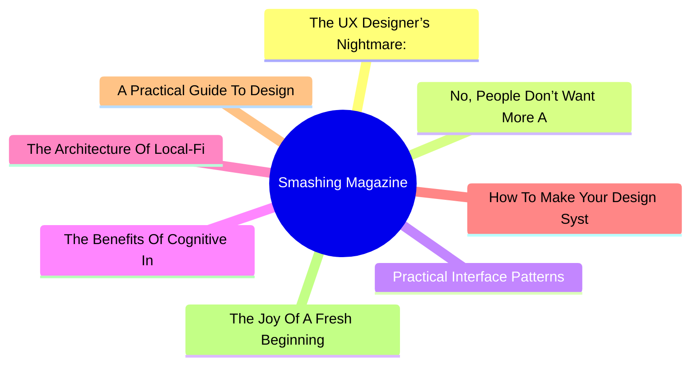
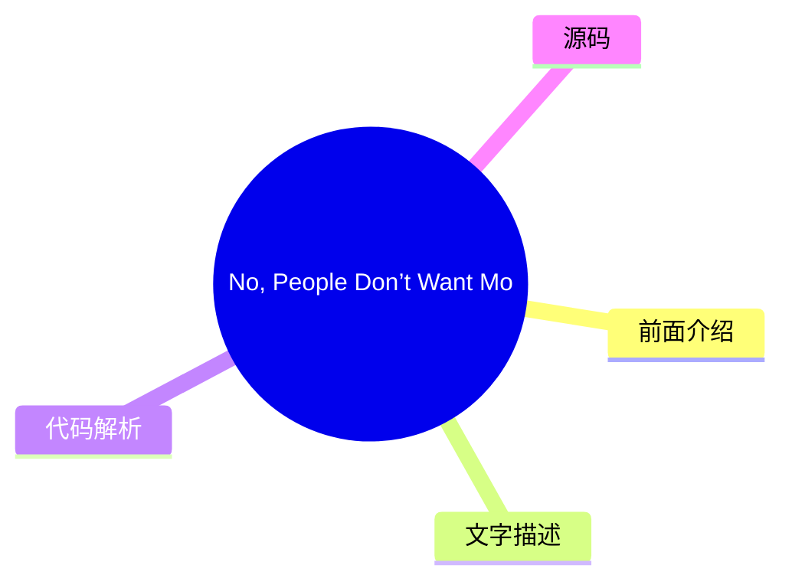
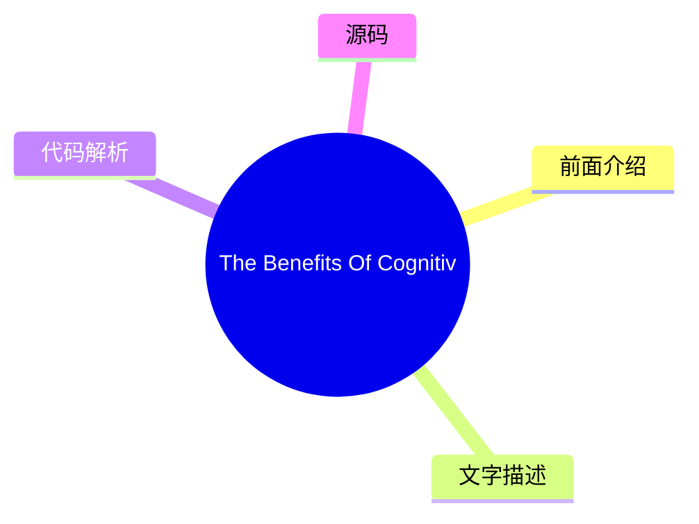
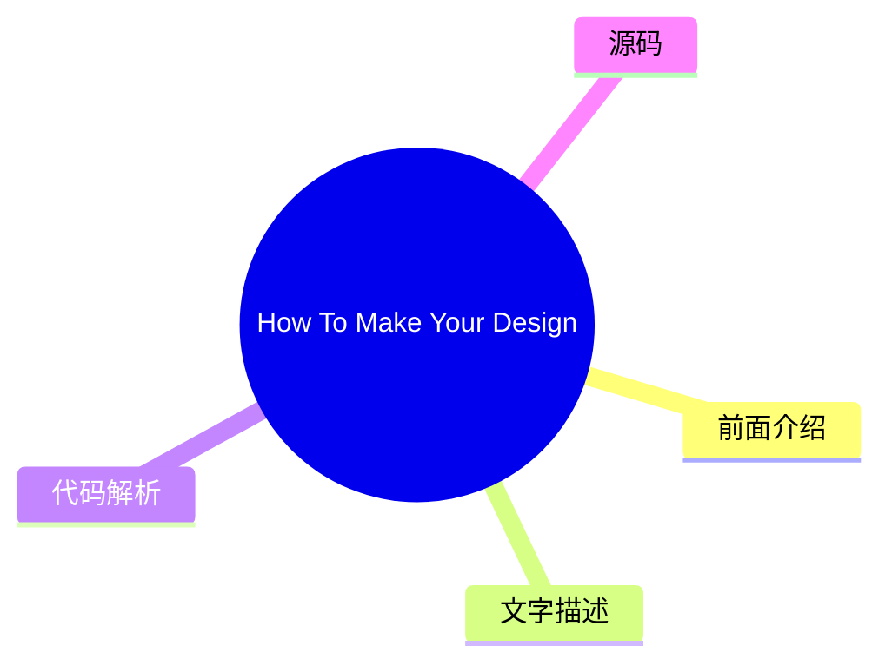
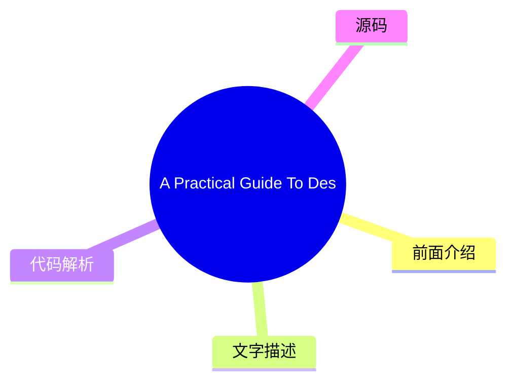
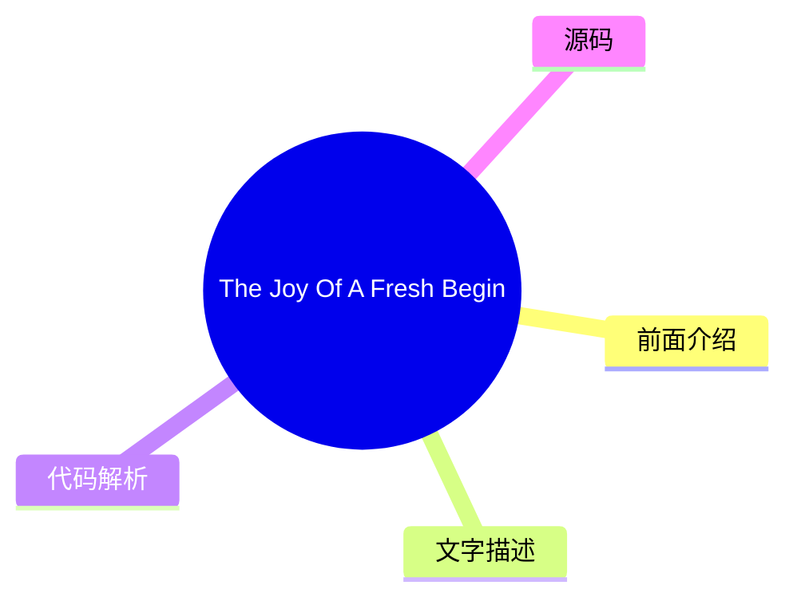

# 🔥 Smashing Magazine Top 8 (2026-07-28)

## 前面介绍

- 数据源：Smashing Magazine
- 抓取日期：2026-07-28
- 条目数：8
- 含完整正文：8
- 含代码片段：1
- 组织方式：前面介绍 / 树状图 / 文字描述 / 代码解析 / 源码

## 思维导图



## 详细整理（8 条，8 条含全文，1 条含代码）

### 1. The UX Designer’s Nightmare: When “Production-Ready” Becomes A Design Deliverable
- **链接**: [https://smashingmagazine.com/2026/04/production-ready-becomes-design-deliverable-ux/](https://smashingmagazine.com/2026/04/production-ready-becomes-design-deliverable-ux/)
- **发布**: Wed, 22 Apr 2026 10:00:00 GMT

#### 前面介绍

- In a rush to embrace AI, the industry is redefining what it means to be a UX designer, blurring the line between design and engineering. Carrie Webster explores what’s gained, what’s lost, and why designers need to remain the guardians of the user ex
- 发布时间：Wed, 22 Apr 2026 10:00:00 GMT

#### 树状图


#### 文字描述

- In early 2026, I noticed that the UX designer’s toolkit seemed to shift overnight. The industry standard *“Should designers code?”* debate was abruptly settled by the market, not through a consensus of our craft, but through the brute force of job requirements. If you browse LinkedIn today, you’ll notice a stark change: UX roles increasingly demand ** AI-augmented development**
- ## The LinkedIn Pressure Cooker: Role Creep In 2026 The job market is sending a clear signal. While traditional graphic design roles are expected to grow by only **3%** through 2034, UX, UI, and [Product Design roles](https://www.nobledesktop.com/careers/designer/job-outlook#:~:text=The%20projected%20future%20growth%20figures%20for%20Digital,job%20growth%20(which%20lies%20somew
- ### The Competence Trap: Two Job Skill Sets, One Average Result There is potentially a very dangerous myth circulating in boardrooms that AI makes a designer “equal” to an engineer. This narrative suggests that because an LLM can generate a functional JavaScript event handler, the person prompting it doesn’t need to understand the underlying logic. In reality, attempting to mas
- ### The “Averagely Competent” Dilemma For a senior UX designer to become a senior-level coder is like asking a master chef to also be a master plumber because “they both work in the kitchen.” You might get the water running, but you won’t know why the pipes are rattling. - **The “cognitive offloading” risk.** Research shows that while AI can speed up task completion, it often l

#### 代码解析

- 本文未检测到明确代码块，内容更偏新闻、观点或方法论。

#### 源码

#### 中文节选

2026年初，我注意到 UX 设计师工具箱似乎在一夜之间发生了转变。行业标准“设计师应该会写代码吗？”的争论被市场突然平息了，不是通过我们行业的共识，而是通过职位要求的蛮力。如果你今天浏览 LinkedIn，你会注意到一个显著的变化：UX 职位越来越要求 **AI 增强型开发**、**技术编排**和 **生产就绪的原型设计**。

对许多人来说，包括我自己，这是终极的设计噩梦。我们被要求同时交付“氛围感”和“代码”，使用 AI 代理来跨越一个以前需要多年的计算机科学知识和编码经验才能跨越的技术鸿沟。但随着行业匆忙满足这些新期望，他们发现 AI 生成的功能性代码并不总是*好*代码。

## LinkedIn 的压力锅：2026 年的角色蔓延

就业市场发出了一个明确的信号。虽然传统平面设计职位预计到 2034 年仅增长 **3%**，但 UX、UI 和 [产品设计职位](https://www.nobledesktop.com/careers/designer/job-outlook#:~:text=The%20projected%20future%20growth%20figures%20for%20Digital,job%20growth%20(which%20lies%20somewhere%20around%205%25).) 在同一时期预计增长 **16%**。

然而，这种增长越来越多地与 **AI 产品开发**的兴起相关联，其中“设计技能”最近已成为 #1 最受欢迎的能力，甚至领先于编码和云基础设施。构建这些平台的公司不再仅仅寻找视觉设计师；他们需要能够“将技术能力转化为以人为中心体验”的专业人士。

This creates a high-stakes environment for the UX designer. We are no longer just responsible for the interface; we are expected to understand the technical logic well enough to ensure that complex AI capabilities feel intuitive, safe, and useful for the human on the other side of the screen. Designers are being pushed toward a **“design engineer” model**, where we must bridge the gap between abstract [AI logic and user-facing code](https://www.refontelearning.com/blog/ui-ux-designer-engineering-in-2026-crafting-future-ready-user-experiences#skills-and-competencies-for-the-2026-uiux-designer-3).

A [recent survey](https://www.lyssna.com/blog/ux-design-trends/) found that **73% of designers** now view AI as a primary collaborator rather than just a tool. However, this “collaboration” often looks like “role creep.” Recruiters are often not just looking for someone who understands user empathy and information architecture — they want someone who can also prompt a React component into existence and push it to a repository!

This shift has created a **competency gap**.

As an experienced senior designer who has spent decades mastering the nuances of cognitive load, accessibility standards, an

#### 完整正文（中文）

2026年初，我注意到 UX 设计师工具箱似乎在一夜之间发生了转变。行业标准“设计师应该会写代码吗？”的争论被市场突然平息了，不是通过我们行业的共识，而是通过职位要求的蛮力。如果你今天浏览 LinkedIn，你会注意到一个显著的变化：UX 职位越来越要求 **AI 增强型开发**、**技术编排**和 **生产就绪的原型设计**。

对许多人来说，包括我自己，这是终极的设计噩梦。我们被要求同时交付“氛围感”和“代码”，使用 AI 代理来跨越一个以前需要多年的计算机科学知识和编码经验才能跨越的技术鸿沟。但随着行业匆忙满足这些新期望，他们发现 AI 生成的功能性代码并不总是*好*代码。

## LinkedIn 的压力锅：2026 年的角色蔓延

就业市场发出了一个明确的信号。虽然传统平面设计职位预计到 2034 年仅增长 **3%**，但 UX、UI 和 [产品设计职位](https://www.nobledesktop.com/careers/designer/job-outlook#:~:text=The%20projected%20future%20growth%20figures%20for%20Digital,job%20growth%20(which%20lies%20somewhere%20around%205%25).) 在同一时期预计增长 **16%**。

然而，这种增长越来越多地与 **AI 产品开发**的兴起相关联，其中“设计技能”最近已成为 #1 最受欢迎的能力，甚至领先于编码和云基础设施。构建这些平台的公司不再仅仅寻找视觉设计师；他们需要能够“将技术能力转化为以人为中心体验”的专业人士。

This creates a high-stakes environment for the UX designer. We are no longer just responsible for the interface; we are expected to understand the technical logic well enough to ensure that complex AI capabilities feel intuitive, safe, and useful for the human on the other side of the screen. Designers are being pushed toward a **“design engineer” model**, where we must bridge the gap between abstract [AI logic and user-facing code](https://www.refontelearning.com/blog/ui-ux-designer-engineering-in-2026-crafting-future-ready-user-experiences#skills-and-competencies-for-the-2026-uiux-designer-3).

A [recent survey](https://www.lyssna.com/blog/ux-design-trends/) found that **73% of designers** now view AI as a primary collaborator rather than just a tool. However, this “collaboration” often looks like “role creep.” Recruiters are often not just looking for someone who understands user empathy and information architecture — they want someone who can also prompt a React component into existence and push it to a repository!

This shift has created a **competency gap**.

As an experienced senior designer who has spent decades mastering the nuances of cognitive load, accessibility standards, and ethnographic research, I am suddenly finding myself being judged on my ability to debug a CSS Flexbox issue or manage a Git branch.

The nightmare isn’t the technology itself. It’s the **reallocation of value**.

“

### The Competence Trap: Two Job Skill Sets, One Average Result

There is potentially a very dangerous myth circulating in boardrooms that AI makes a designer “equal” to an engineer. This narrative suggests that because an LLM can generate a functional JavaScript event handler, the person prompting it doesn’t need to understand the underlying logic. In reality, attempting to master two disparate, deep fields simultaneously will most likely lead to being **averagely competent** at both.

### The “Averagely Competent” Dilemma

For a senior UX designer to become a senior-level coder is like asking a master chef to also be a master plumber because “they both work in the kitchen.” You might get the water running, but you won’t know why the pipes are rattling.


- **The “cognitive offloading” risk.**
 Research shows that while AI can speed up task completion, it often leads to a significant decrease in conceptual mastery. In a controlled study, participants using AI assistance scored- [17% lower](https://www.psychologytoday.com/au/blog/the-asymmetric-brain/202602/cognitive-offloading-using-ai-reduces-new-skill-formation)on comprehension tests than those who coded by hand.
- **The debugging gap.**
 The largest performance gap between AI-reliant users and hand-coders is in- [debugging](https://www.anthropic.com/research/AI-assistance-coding-skills). When a designer uses AI to write code they don’t fully understand, they don’t have the ability to identify- *when*and- *why*it fails.

So, if a designer ships an AI-generated component that breaks during a high-traffic event and cannot manually trace the logic, they are no longer an expert. They are now a liability.

### The High Cost Of Unoptimised Code

Any experienced code engineer will tell you that creating code with AI without the right prompt leads to a lot of rework. Because most designers lack the technical foundation to audit the code the AI gives them, they are inadvertently shipping massive amounts of [“Quality Debt”](https://gocrossbridge.com/blog/ai-generated-code/).

## Common Issues In Designer-Generated AI Code

- **The security flaw**
 Recent reports indicate that up to- [92% of AI-generated codebases](https://www.sherlockforensics.com/pages/ai-code-security-report-2026.html)contain at least one critical vulnerability. A designer might see a functioning login form, unaware that it has an 86% failure rate in XSS defense, which are the security measures aimed at preventing attackers from injecting malicious scripts into trusted websites.
- **The accessibility illusion**

 AI often generates “functional” applications that lack semantic integrity. A designer might prompt a “beautiful and functional toggle switch,” but the AI may provide a non-semantic- `<div>`that lacks keyboard focus and screen-reader compatibility, creating- [Accessibility Debt](https://www.levelaccess.com/blog/accessibility-debt-in-software-development-and-how-to-engineer-it-out/)that is expensive to fix later.
- **The performance penalty**
 AI-generated code tends to be verbose. AI is linked to- [4x more code duplication](https://www.netcorpsoftwaredevelopment.com/blog/ai-generated-code-statistics)than human-written code. This verbosity slows down page loads, creates massive CSS files, and negatively impacts SEO. To a business, the task looks “done.” To a user with a slow connection or a screen reader, the site is a nightmare.

## Creating More Work, Not Less

The promise of AI was that designers could ship features without bothering the engineers. The reality has been the birth of a **“Rework Tax”** that is draining engineering resources across the industry.

- **Cleaning up**
 Organisations are finding that while velocity increases, incidents per Pull Request are also rising by- [23.5%](https://blog.exceeds.ai/ai-code-analysis-benchmark-reports/). Some engineering teams now spend a significant portion of their week cleaning up “AI slop” delivered by design teams who skipped a rigorous review process.
- **The communication gap**
 Only- [69% of designers](https://www.lyssna.com/blog/ux-design-trends/)feel AI improves the quality of their work, compared to- **82% of developers**. This gap exists because “code that compiles” is not the same as “code that is maintainable.”

When a designer hands off AI-generated code that ignores a company’s internal naming conventions or management patterns, they aren’t helping the engineer; they are creating a puzzle that someone else has to solve later.

### The Solution

We need to move away from the nightmare of the “**Solo Full-Stack Designer**” and toward a model of **designer/coder collaboration**.

**The ideal reality:**

- **The Partnership**

 Instead of designers trying to be mediocre coders, they should work in a- **human-AI-human loop**. A senior UX designer should work- *with*an engineer to use AI; the designer creates prompts for- **intent, accessibility, and user flow**, while the engineer creates prompts for- **architecture and performance**.
- **Design systems as guardrails**
 To prevent accessibility debt from spreading at scale,- [accessible components must be the default](https://webaim.org/projects/million/)in your design system. AI should be used to feed these tokens into your UI, ensuring that even generated code stays within the “source of truth.”

## Beyond The Prompt

The industry is currently in a state of “AI Infatuation,” but the pendulum will eventually swing back toward quality.

“

Businesses that prioritise “designer-shipped code” without engineering oversight will eventually face a reckoning of technical debt, security breaches, and accessibility lawsuits. The designers who thrive in 2026 and beyond will be those who refuse to be “prompt operators” and instead position themselves as the **guardians of the user experience**. This is the perfect outcome for experienced designers and for the industry.

Our value has always been our ability to advocate for the human on the other side of the screen. We must use AI to augment our design thinking, allowing us to test more ideas and iterate faster, but we must never let it replace the specialised engineering expertise that ensures our designs technically *work* for everyone.

### Summary Checklist for UX Designers

- **Work Together.**
 Use AI-made code as a starting point to talk with your developers. Don’t use it as a shortcut to avoid working with them. Ask them to help you with prompts for code creation for the best outcomes.
- **Understand the “Why”.**
 Never submit code you don’t understand. If you can’t explain how the AI-generated logic works, don’t include it in your work.
- **Build for Everyone.**
 Good design is more than just looks. Use AI to check if your code works for people using screen readers or keyboards, not just to make things look pretty.


### 2. No, People Don’t Want More AI In Their Life
- **链接**: [https://smashingmagazine.com/2026/07/people-dont-want-more-ai/](https://smashingmagazine.com/2026/07/people-dont-want-more-ai/)
- **发布**: Wed, 15 Jul 2026 10:00:00 GMT

#### 前面介绍

- Many companies assume everyone craves new AI features. But the reality is that most people don't want more AI &mdash; at least not in the way most AI leaders envision it. Brought to you by Design Patterns For AI Interfaces, **friendly video courses o
- 发布时间：Wed, 15 Jul 2026 10:00:00 GMT

#### 树状图



#### 文字描述

- Many companies silently assume that everybody wants more AI in their lives. That people are **craving new AI features**, new AI products, new AI workflows — that would all magically replace all existing outdated practices and broken ways of working. But in reality, it seems like **people don’t want more AI** at all — at least not in the way most AI leaders envision it. Unsurpri
- ## The AI People Don’t Need It’s remarkably difficult to make a strong argument with senior leadership, but [AI is not a value proposition](https://www.nngroup.com/articles/powered-by-ai-is-not-a-value-proposition/). New AI features don’t magically make for happy or excited customers. Because AI features are often bolt-ons and separate tools for employees to use, they typically
- ## The AI People Actually Need I’m always puzzled by the comparison of AI features with how unreliable humans are. But people don’t compare software with other people. They **compare features with features** — and if one feature in one product is unreliable, while a similar feature works flawlessly in another, they choose the latter. It’s not about AI or not AI, but rather what
- ## Wrapping Up Perhaps I’m missing a bigger picture, and perhaps I’m just old school — but **I really do like people**. Their stories, their thinking, their emotions, their enthusiasm, their laughing. AI can be remarkably helpful in many situations, but so are people. And between the two, I would favor **spending time with a human** — however imperfect they are — every single t

#### 代码解析

- 本文未检测到明确代码块，内容更偏新闻、观点或方法论。

#### 源码

#### 中文节选

Many companies silently assume that everybody wants more AI in their lives. That people are **craving new AI features**, new AI products, new AI workflows — that would all magically replace all existing outdated practices and broken ways of working.

But in reality, it seems like **people don’t want more AI** at all — at least not in the way most AI leaders envision it. Unsurprisingly, many AI features have [low adoption and retention](https://www.mindstudio.ai/blog/ai-adoption-gap-ibm-2026-study) — at a very high cost of delivery, and a high risk of reputation damage.

## The AI People Don’t Need

It’s remarkably difficult to make a strong argument with senior leadership, but [AI is not a value proposition](https://www.nngroup.com/articles/powered-by-ai-is-not-a-value-proposition/). New AI features don’t magically make for happy or excited customers. Because AI features are often bolt-ons and separate tools for employees to use, they typically **take people out** of their regular way of working.

AI is pretty good at **amplifying shortcuts and shortcomings** in organizations — from data quality to decision making. It can’t magically fix years of accumulated quick patches, technical debt, broken culture and internal politics. If anything, they become more visible with AI as inconsistencies or conflicting priorities and get handed directly to users, who are then left to make sense of the mess themselves.

Because in most organizations, work typically requires hopping on and off between plenty of disconnected and fragmented systems, with a new AI tool, they now have yet another system that they also need to hop on and off. Often it produces more work, and typically it’s not particularly rewarding work either.

On top of that, people are very much aware of the [cost of finding and fixing AI hallucinations](https://www.nngroup.com/articles/ai-chatbots-discourage-error-checking/). Asking AI to generate a response **might feel easier** than writing from scratch, but it has a cost:

- **Skim through**the entire AI output,
- **Spot key points**to focus attention on,
- **Review/verify key points**, one-by-one,
- **Check rationale**for what follows next,

- **Articulate corrections**+ regenerate,
- **Review the response**(a number of times).

For many people, AI isn’t something they can proactively choose and explore on their own — it arrives uninvited, at someone else’s pace. On top of that, plenty of messages amplify **fears and worries about AI** replacing work — so it’s hardly surprising that the perception of AI isn’t excitement. It’s **resistance to change** and deep anxiety about one’s place in a world that seems to be changing without them.

At best, AI features might be silently accepted or nodded away. At worst, AI **raises concerns**, doubts, caution — and calls for a healthy dose of skepticism. And sometimes it’s perceived as a threat or **liability** — because unlike other features, AI is neither predictable nor reliable.

People don’t dream of

#### 完整正文（中文）

Many companies silently assume that everybody wants more AI in their lives. That people are **craving new AI features**, new AI products, new AI workflows — that would all magically replace all existing outdated practices and broken ways of working.

But in reality, it seems like **people don’t want more AI** at all — at least not in the way most AI leaders envision it. Unsurprisingly, many AI features have [low adoption and retention](https://www.mindstudio.ai/blog/ai-adoption-gap-ibm-2026-study) — at a very high cost of delivery, and a high risk of reputation damage.

## The AI People Don’t Need

It’s remarkably difficult to make a strong argument with senior leadership, but [AI is not a value proposition](https://www.nngroup.com/articles/powered-by-ai-is-not-a-value-proposition/). New AI features don’t magically make for happy or excited customers. Because AI features are often bolt-ons and separate tools for employees to use, they typically **take people out** of their regular way of working.

AI is pretty good at **amplifying shortcuts and shortcomings** in organizations — from data quality to decision making. It can’t magically fix years of accumulated quick patches, technical debt, broken culture and internal politics. If anything, they become more visible with AI as inconsistencies or conflicting priorities and get handed directly to users, who are then left to make sense of the mess themselves.

Because in most organizations, work typically requires hopping on and off between plenty of disconnected and fragmented systems, with a new AI tool, they now have yet another system that they also need to hop on and off. Often it produces more work, and typically it’s not particularly rewarding work either.

On top of that, people are very much aware of the [cost of finding and fixing AI hallucinations](https://www.nngroup.com/articles/ai-chatbots-discourage-error-checking/). Asking AI to generate a response **might feel easier** than writing from scratch, but it has a cost:

- **Skim through**the entire AI output,
- **Spot key points**to focus attention on,
- **Review/verify key points**, one-by-one,
- **Check rationale**for what follows next,

- **纠正表述**+ 重新生成，
- **审查回复**(多次)。

对许多人来说，AI 并非他们可以主动选择和探索的东西——它不请自来，按照别人的节奏到来。此外，大量信息都在放大关于 AI 取代工作的**恐惧和担忧**——因此，人们对 AI 的看法并非兴奋。那是**对改变的抗拒**，以及对在一个似乎正在脱离自己而改变的世界中自身位置的深深焦虑。

在最好的情况下，AI 功能可能只是被默默接受或敷衍过去。在最坏的情况下，AI 会引发**担忧、怀疑、谨慎**——并呼吁保持健康的怀疑态度。有时它被视为一种威胁或**责任**——因为与其他功能不同，AI 既不可预测也不可靠。

人们不会梦想拥有**AI 艺术博物馆**、AI 冰箱、AI 酒店前台或 AI 叙述的儿童读物。他们不希望自己的孩子拥有**浪漫的 AI 伴侣**。大多数人不想主动管理（并善后）一群在银行账户中漫游并在现实生活中代表他们行动的**AI 代理**。最值得注意的是，人们并不真的想要一个可以随时与之交谈或输入的魔法盒子。

## 人们真正需要的 AI

人们总是对将 AI 功能与人类的不稳定性进行比较感到困惑。但人们不会将软件与其他人进行比较。他们**将功能与功能进行比较**——如果一个产品中的某个功能不可靠，而另一个产品中的类似功能却能完美运行，他们就会选择后者。这无关乎 AI 或非 AI，而在于什么能始终如一且可靠地工作，什么不能。

许多关于 AI 的讨论都是关于交付速度的。但对许多人来说，提高交付速度并没有多少价值。他们想要把事情做好，有足够的时间去思考和做出良好的决策。他们还希望**享受花在事情上的时间**，而不仅仅是更快地交付。随着每一次 vibe-coded（氛围编码）式的改变，一种巨大的成就感和满足感正在慢慢消失。

People don’t change much. And after all these years, they (still) want features that are fast, accessible, **reliable, predictable and useful** — every single time. And ideally not the ones that replace their entire workflow, but that **augment** their way of working — and that take over the most mundane, annoying, and boring tasks that they find no pleasure in.

Many jobs are [exposed to AI automation](https://www.washingtonpost.com/technology/interactive/2026/jobs-most-affected-ai-automation/), but in many of them there is a rewarding, unique, creative part that requires taste, point of view, and perhaps even human intuition. And if AI **automates boring parts** of it, that’s an advantage for everyone. That’s also what enhances productivity and brings more joy in daily life.

When AI automates tedious and mentally exhausting tasks, its value is much easier to grasp. But for that, AI shouldn’t feel like a bolt-on. It should be **deeply integrated** into people’s existing workflows. It must also match existing **mental models** that they have developed and fine-tuned for years or decades. AI should adapt to how people think and make decisions, not the other way around.

And it doesn’t really matter if these features are branded as “AI”, “smart” or “automation”. However, they must work well for people using them. And that means that people must be **aware of use cases** where it actually helps them, and be inspired to find more use cases on their own.

Ironically, tools that work well there aren’t “AI-first” — they are **“AI-second”**. Subtle, humble, calm, ambient, taking a supportive role in the background for work that otherwise is remarkably dull and unnecessary.

I don’t want to readbooks written by AI. I don’t want to gaze upon paintings by AI. I don’t want AI to teach my children. I don’t want to have an AI therapist. I don’t want AI making my medical decisions. I want AI to do all thephysical and mental laborthat taxes me so I can read books written by humans and go to art galleries to engage with art made by humans. I want AI that makes my life easier rather than forces me to change myself.


—[Bo Young Lee](https://www.linkedin.com/feed/update/urn:li:share:7467162929474420737/)

## Wrapping Up

Perhaps I’m missing a bigger picture, and perhaps I’m just old school — but **I really do like people**. Their stories, their thinking, their emotions, their enthusiasm, their laughing. AI can be remarkably helpful in many situations, but so are people. And between the two, I would favor **spending time with a human** — however imperfect they are — every single time.

No, **people don’t need more AI in their lives** — they need AI to automate all the boring stuff they have to deal with every day, so they have more time and headspace to do things that they actually love and enjoy doing. That doesn’t mean spending more time with AI — but spending more time with people they love.

## Meet “Design Patterns For AI Interfaces”

Meet [ Design Patterns For AI Interfaces](https://ai-design-patterns.com/), Vitaly’s new 

**video course**with practical examples from real-life products — with a

[live UX training](https://smashingconf.com/online-workshops/workshops/ai-interfaces-vitaly-friedman/)happening soon.

[Jump to a free preview](https://www.youtube.com/watch?v=jhZ3el3n-u0).

## Useful Resources

- [AI Adoption Gap: IBM 2026 Study](https://www.mindstudio.ai/blog/ai-adoption-gap-ibm-2026-study), by MindStudio
- [Powered by AI Is Not a Value Proposition](https://www.nngroup.com/articles/powered-by-ai-is-not-a-value-proposition/), by Nielsen Norman Group
- [AI Chatbots Discourage Error Checking](https://www.nngroup.com/articles/ai-chatbots-discourage-error-checking/), by Nielsen Norman Group
- [The Jobs Most Exposed to AI Automation](https://www.washingtonpost.com/technology/interactive/2026/jobs-most-affected-ai-automation/), by The Washington Post
- [On AI and What We Actually Want From It](https://www.linkedin.com/feed/update/urn:li:share:7467162929474420737/), by Bo Young Lee


### 3. Practical Interface Patterns For AI Transparency (Part 2)
- **链接**: [https://smashingmagazine.com/2026/05/practical-interface-patterns-ai-transparency/](https://smashingmagazine.com/2026/05/practical-interface-patterns-ai-transparency/)
- **发布**: Wed, 13 May 2026 13:00:00 GMT

#### 前面介绍

- Why traditional loading patterns like spinners fail in agentic AI experiences, and how interface patterns that reveal the system’s process, status, and decision-making can improve transparency and build user trust.
- 发布时间：Wed, 13 May 2026 13:00:00 GMT

#### 树状图


#### 文字描述

- In the [first part of this series](https://www.smashingmagazine.com/2026/04/identifying-necessary-transparency-moments-agentic-ai-part1/), we talked about the **Decision Node Audit**. We mapped out the internal workings of our AI system to pinpoint the exact moments it makes decisions based on probabilities. This told us when the system needs to be transparent with the user. No
- ## Writing Clear Status Updates We often think of transparency as a visual design problem, but it’s really about the **words** we use. Simple, clear explanations (the microcopy) are what build trust and separate a reliable AI from one that feels broken. We need to retire generic placeholders like *Loading* or *Working*. These words are remnants of the era of static software. In
- ## The Agentic Update Formula To give people useful status updates, we need to connect what the system is *doing* with *why* it’s doing it. Keeping with our scheduling agent example, the system should break down that waiting period into at least four clear, separate steps. - First, the interface displays *Checking your calendar to find open times for a recurring Thursday call w
- ## Matching Tone to the Risk Matrix Should an AI sound like a person or act like a robot? The right answer depends on the task’s importance, which we can figure out using the **Impact/Risk Matrix** from our **Decision Node Audit**. For simple, low-risk tasks, a friendly, conversational tone works best. For example, a scheduling assistant can say it’s checking your calendar for 

#### 代码解析

- 本文未检测到明确代码块，内容更偏新闻、观点或方法论。

#### 源码

#### 中文节选

在[本系列的第一部分](https://www.smashingmagazine.com/2026/04/identifying-necessary-transparency-moments-agentic-ai-part1/)中，我们讨论了**决策节点审计**。我们梳理了 AI 系统的内部运作机制，以精确定位其基于概率做出决策的确切时刻。这让我们知道了系统何时需要向用户保持透明。现在，核心问题是*如何*分享这些信息。

你已经准备好了**透明度矩阵**。你知道哪些后台 API 调用需要显示状态更新。你的工程师也认同技术层面的细节。下一步是为这些更新设计视觉容器。

我们面临一个遗留问题。三十年来，界面设计师一直依赖一种单一的模式来处理延迟：**旋转图标**。旋转的圆圈、闪烁的光标、进度条。这些模式传达了一种特定的技术现实。它们告诉用户系统正在检索数据。延迟是由带宽或文件大小引起的。

AI 代理引入了一种新的等待时间。当代理暂停二十秒时，它不仅仅是在下载某样东西；它是在*思考*。它正在确定最佳步骤，权衡选项，并为你请求的内容进行创作。

如果我们用基本的旋转图标来表示这种“思考时间”，用户会感到困惑和焦虑。他们看着循环播放的动画，无法判断系统是卡住了还是崩溃了。他们不知道代理是在处理一个非常复杂的任务，还是仅仅失败了。

为了建立用户信任，我们需要将这段等待时间转化为一个**安抚时刻**。与其使用被动的“正在发生某事”，我们需要传达一种主动的“这正是我正在努力解决您问题的具体方式”。

## 编写清晰的状态更新

我们常把透明度视为一个视觉设计问题，但实际上，它关乎我们使用的**文字**。简单、清晰的解释（微文案）才是建立信任的关键，也是区分可靠 AI 和感觉像坏掉的 AI 的分水岭。

我们需要淘汰像 *Loading* 或 *Working* 这样的通用占位符。这些词汇是静态软件时代的遗留产物。相反，我们必须使用特定的公式来构建状态更新，以反映系统的自主性。让我们停止使用像“Loading”或“Working”这样模糊的词汇。这些术语属于过去，那时软件简单且静态。相反，我们应该创建状态更新，清楚地告诉用户系统实际上正在做什么，并使系统的操作透明。

为了举例说明，想象一下你正在部署代理式 AI，它将在被提示后帮助团队成员整理日历并代为规划 recurring meetings（定期会议）。

当 AI 显示类似“Checking availability”的消息持续了未知的时间时，用户往往会感到迷茫，因为它提供的信息不够。虽然他们理解 AI 正在查看日历，但他们不知道查看的是*谁的*日历，还涉及哪些步骤（之前或之后）。

#### 完整正文（中文）

在[本系列的第一部分](https://www.smashingmagazine.com/2026/04/identifying-necessary-transparency-moments-agentic-ai-part1/)中，我们讨论了**决策节点审计**。我们梳理了 AI 系统的内部运作机制，以精确定位其基于概率做出决策的确切时刻。这让我们知道了系统何时需要向用户保持透明。现在，核心问题是*如何*分享这些信息。

你已经准备好了**透明度矩阵**。你知道哪些后台 API 调用需要显示状态更新。你的工程师也认同技术层面的细节。下一步是为这些更新设计视觉容器。

我们面临一个遗留问题。三十年来，界面设计师一直依赖一种单一的模式来处理延迟：**旋转图标**。旋转的圆圈、闪烁的光标、进度条。这些模式传达了一种特定的技术现实。它们告诉用户系统正在检索数据。延迟是由带宽或文件大小引起的。

AI 代理引入了一种新的等待时间。当代理暂停二十秒时，它不仅仅是在下载某样东西；它是在*思考*。它正在确定最佳步骤，权衡选项，并为你请求的内容进行创作。

如果我们用基本的旋转图标来表示这种“思考时间”，用户会感到困惑和焦虑。他们看着循环播放的动画，无法判断系统是卡住了还是崩溃了。他们不知道代理是在处理一个非常复杂的任务，还是仅仅失败了。

为了建立用户信任，我们需要将这段等待时间转化为一个**安抚时刻**。与其使用被动的“正在发生某事”，我们需要传达一种主动的“这正是我正在努力解决您问题的具体方式”。

## 编写清晰的状态更新

我们常把透明度视为一个视觉设计问题，但实际上，它关乎我们使用的**文字**。简单、清晰的解释（微文案）才是建立信任的关键，也是区分可靠 AI 和感觉像坏掉的 AI 的分水岭。

我们需要淘汰像 *Loading* 或 *Working* 这样的通用占位符。这些词汇是静态软件时代的遗留产物。相反，我们必须使用特定的公式来构建状态更新，以反映系统的自主性。让我们停止使用像“Loading”或“Working”这样模糊的词汇。这些术语属于过去，那时软件简单且静态。相反，我们应该创建清晰告知用户系统*实际上正在做什么*的状态更新，并使系统的操作透明化。

想象一下，为了举例说明，你正在部署一个代理 AI，它会在被提示后帮助团队成员整理日历并代表他们安排定期会议。

当 AI 显示类似“Checking availability”（检查可用性）的消息并持续了未知的时间时，用户往往会感到迷茫，因为它提供的信息不够。虽然他们理解 AI 正在查看日历，但他们不知道它查看的是*谁的*日历，涉及哪些其他步骤（之前或之后），或者 AI 是否记住了日程安排请求中的人和目的。等待最终结果可能是一种紧张、不安的体验，就像在期待一份你怀疑可能是恶作剧的礼物一样。

Perplexity AI 提供了一个正确进行状态更新的绝佳范例。下图 1 显示，当用户提问时，界面会实时显示它正在执行的确切操作。你会看到活动列表随着任务的完成而更新。在 AI 工作时，用户无需猜测正在发生什么。

## 代理更新公式

为了提供有用的状态更新，我们需要将系统*正在做什么*与*为什么做*联系起来。沿用我们的日程安排代理示例，系统应该将等待期分解为至少四个清晰、独立的步骤。

- 首先，界面显示 *Checking your calendar to find open times for a recurring Thursday call with [Name(s)]*（正在检查你的日历，以查找与 [Name(s)] 进行每周四通话的空闲时间）。
- 然后，它更新为：*Cross-checking availability with [Name(s)] calendars*（正在与 [Name(s)] 的日历交叉核对可用性）。
- 接下来，它可能会显示：*Syncing [Name(s)] schedules to secure your meeting time on [Data and Time]*（正在同步 [Name(s)] 的日程，以锁定你在 [Data and Time] 的会议时间）。

- Finally, at the conclusion, the agent might state they have successfully completed the task and request the user check their email to confirm the invite that’s been shared with the group having the recurring meeting.

This communication process grounds the technical process in the user’s actual life.

Making an AI’s progress easy to understand boils down to a three-part structure: a strong **Action Word**, what the AI is working on (the **Specific Item**), and any **Limits** or rules it has to follow.

Think about an AI helping you book a trip. A weak, unhelpful update would just be: *Searching for flights…*

A much better update uses the formula:

- **Action Word:**- *Scanning*
- **Specific Item:**- *the prices on Lufthansa and United*
- **Limits/Rules:**- *to find anything under $600.*

This approach clearly shows the user that the AI understood their request and is working within the set boundaries.

## Matching Tone to the Risk Matrix

Should an AI sound like a person or act like a robot? The right answer depends on the task’s importance, which we can figure out using the **Impact/Risk Matrix** from our **Decision Node Audit**.

For simple, low-risk tasks, a friendly, conversational tone works best. For example, a scheduling assistant can say it’s checking your calendar for the best time. This creates a comfortable, easygoing experience for the user.

However, high-stakes tasks demand clear, mechanical accuracy. If the AI is managing a big financial transfer or a complicated database migration, users don’t want a playful interface; they want precision. A screen that says *“I am thinking hard about your money”* would possibly cause panic. Instead, the interface should use straightforward language like *“Verifying account routing numbers.”* By adjusting the AI’s “personality” to match the level of risk, we give users exactly the experience they need in that moment. While the Impact/Risk Matrix provides a necessary starting point, the ultimate determinant of the appropriate AI voice and tone is rigorous **user research**.


It’s impossible for any set of rules to predict the exact words or tone that will build trust or cause stress for every group of users or in every situation. That’s why hands-on research is essential. You need to:

- [Run A/B tests](https://medium.com/@alienoghli/the-essential-guide-to-a-b-testing-a84b853c16e0)
- [Conduct usability studies](https://uxplanet.org/usability-testing-the-complete-guide-e162898f68db)
- [Perform interviews](https://ixdf.org/literature/article/how-to-conduct-user-interviews)

This kind of research ensures the AI’s “personality” is comfortable and appropriate for the actual people who will be using the system in their specific context.

We’ve now covered the *“what”* — the critical microcopy, the clear action words, and the necessary limits that make an AI status update honest and informative. But words alone aren’t enough. A perfect sentence hidden in a poor interface is still a failure of transparency.

The next challenge is the *“how”* — designing the physical delivery system for that message. You can think of the status update formula as the engine, and the interface pattern as the car. A powerful engine needs a reliable, well-designed chassis to carry it down the road.

## Interface Patterns: A Library For Agents

Once we have the right words, we need **the right container**. The key is matching the message’s weight to the pattern’s visibility. A tiny background task (like an agent gently tidying up your files) doesn’t need a loud, flashing banner. That message is best delivered subtly. A high-stakes, multi-step process (like moving money) potentially demands a more robust container that forces the user to pay attention.

By creating a library of these patterns, we ensure the right level of transparency is delivered at the right moment, turning the anxiety of waiting into a moment of informed confidence. Let’s review a few common, critical patterns.

### The Living Breadcrumb: AI Working in the Background

For those low-importance tasks that an AI is handling quietly in the background, we need a way to show users it’s working without constantly distracting them. We can call this the living breadcrumb.


想象一个邮件应用，AI 正在为你起草回复。你不想看到突兀的弹窗消息。相反，一个微小的、微妙的状态指示器会在应用程序的边框或菜单区域中闪烁。

该解决方案需要超越静态图标。这个动态面包屑会在不同的文本更新之间流畅地过渡。它可能会从 *Reading email*（阅读邮件）闪烁到 *Drafting reply*（起草回复）再到 *Checking tone*（检查语气）。如果你想要查看它的进度，它就在那里，提供一种安静的确认，表明任务正在进行中，但不会要求你立即关注。

### 动态检查清单

在处理关键、高风险的任务时——例如处理复杂的金融交易或迁移大型、复杂的数据集——我们建议使用 **Dynamic Checklist**（动态检查清单）（如图 3 所示）。

这种模式为用户提供了一个强大的锚点，提供了关于 **流程进度** 的清晰度和信心。它不是简单的进度条，而是列出了 AI 代理将要采取的每一个计划步骤。它清楚地高亮显示当前正在进行的步骤，将前面的步骤标记为已完成，并列出未来的操作为待处理状态。

例如：

- **Step 1**: Verify Account Balance- **[Complete]**（验证账户余额- **[已完成]**）。
- **Step 2**: Convert Currency- **[Processing]**（转换货币- **[处理中]**）。
- **Step 3**: Transfer Funds- **[Pending]**（转账- **[待处理]**）。

与传统的进度条相比，动态检查清单提供了显著的优势，因为它能熟练地管理不可预测的时间。如果货币转换（Step 2）意外地需要额外十秒钟，用户不会感到突然的焦虑或恐慌。他们对系统的确切位置拥有完全的可见性，并理解延迟发生在 *Converting Currency*（转换货币）步骤期间。因为他们认识到这可能是一个复杂的操作，所以他们对系统正在进行的工工作会更加耐心和信任。

The pattern itself is a compelling UI idea, but designers must remember that its implementation transforms the task into a full-stack design requirement. Unlike a simple loading flag, the dynamic checklist requires a robust front-end state management system to listen for step-completion events, which are typically triggered by a back-end webhook structure. This ensures the interface is always reflecting the agent’s real-time position in the workflow.

### The Thinking Toggle

Some users with higher information needs or higher needs for transparency may not trust a simple summary; they want to see the system’s raw processing. For this audience, we’ve designed the **Thinking Toggle**.

This is a simple progressive disclosure UI control, like a chevron or a “View Logs” button, that lets the user expand a friendly status update into a raw terminal view. It displays the sanitized logic logs of the AI agent, such as:

- *Querying API endpoint /v2/search*;
- *Response received: 200 OK*;
- *Filtering results by relevance score > 0.8*.

Many people will never open this view. However, for the user who needs deep transparency, the very presence of this toggle is a signal of trust. It reassures them that the system is not concealing anything.

Keep in mind, with this deep transparency comes a critical technical risk. Even for your most expert audience, you must sanitize and abstract these raw logs before display. This step is non-negotiable to prevent accidentally exposing proprietary business logic, internal data structure names, or security tokens that could be exploited. This process ensures trust is built through honesty, not security vulnerability.

### Designing For Partial Success

In standard software, things are often black or white. A file either saves or it doesn’t. But with AI agents, things ar

...（截断，原文 21693+ 字符）


### 4. The Benefits Of Cognitive Inclusion In UX Research
- **链接**: [https://smashingmagazine.com/2026/06/benefits-cognitive-inclusion-ux-research/](https://smashingmagazine.com/2026/06/benefits-cognitive-inclusion-ux-research/)
- **发布**: Wed, 10 Jun 2026 10:00:00 GMT

#### 前面介绍

- Findings from an exploratory user research study highlighting the unique insights and practical UX recommendations shared by participants with cognitive disabilities.
- 发布时间：Wed, 10 Jun 2026 10:00:00 GMT

#### 树状图



#### 文字描述

- In the summer of 2024, I became co-chair of a working group of expert researchers who came together to determine how best to perform accessibility testing with people with cognitive disabilities. This was work I did for Fable, where I am currently VP of Innovation. Cognitive disability is an umbrella term for several disabilities that impact how people process information, and 
- ## The Cognitive Usability Study I decided to run a joint study with Fable’s partners at the University of California, Irvine, in collaboration with Syed Fatiul Huq and with help from Fable researchers Pranav Pidathala, Ali Brown, and Michael Fagan to see if my hypothesis about finding more insights with cognitive testers proved true or not. I generated three websites for the s
- ### Table 1: Websites And Tasks Tested | Website | [Strong Snacks](https://v0-strong-snacks.vercel.app/) | [Turning Pages](https://v0-bookstore-nu.vercel.app/) | [Crown & Comb](https://v0-crown-and-comb.vercel.app/) | |---|---|---|---| | Description | This is a website for three-ingredient high-protein recipes. Recipes can be browsed by category (vegan, muscle building, etc.). 
- ## Data Analysis Approach I reviewed all the study recordings and transcripts and made note of every time a participant raised a concern, question, difficulty, or asked a question about how something worked. I counted all of these as issues. I also noted where a participant missed something that was part of a task, even if they didn’t notice it themselves. I also noted every su

#### 代码解析

- 本文未检测到明确代码块，内容更偏新闻、观点或方法论。

#### 源码

#### 中文节选

2024年夏天，我成为了一个专家研究小组的联合主席，该小组致力于确定如何最好地与认知障碍人士进行无障碍测试。这是我在 Fable 的工作，我目前担任创新副总裁。

认知障碍是一个统称，指影响人们处理信息的多种障碍，通常会影响记忆、专注力和/或学习能力。它是美国最常见的残疾类型（通过 [CDC](https://www.cdc.gov/disability-and-health/articles-documents/disability-impacts-all-of-us-infographic.html) 占 13.9%），且认知障碍正在迅速增加（[耶鲁大学研究](https://news.yale.edu/2025/09/24/growing-number-us-adults-report-cognitive-disability)）。

我们为自己设定了四个目标，以了解如何与这一群体合作：

- 我们应该如何招募和筛选参与者？
- 与认知障碍参与者进行研究的最佳实践是什么？
- 这些方法在真实研究中是否有效？
- 记录我们所学到的内容，以便分享。

我们创建了一份筛选问卷，以招募那些自我认定为在记忆、专注力和/或学习方面存在挑战的人。我们还审查了涉及认知障碍测试人员的已发表研究，以了解与他们合作的最佳实践。

接下来，我们在一项试点研究中，对这 25 名初始测试人员测试了这些最佳实践。我们迭代优化了方法，并创建了一份指南，用于指导如何与认知障碍测试人员进行用户访谈，以及一份能够量化他们使用数字产品体验的调查问卷。最后，我们[记录了我们所学到的内容](https://makeitfable.com/article/cognitive-accessibility-pilot-case-study/)。

在与这组新测试人员的试点研究结束后，我感到他们能比过去我合作过的普通人群（gen pop）用户研究参与者发现更多的可用性见解。我着手验证这一直觉。

## 认知可用性研究

我决定与 Fable 的合作伙伴加州大学尔湾分校合作开展一项联合研究，在 Syed Fatiul Huq 的协助下，并得到 Fable 研究员 Pranav Pidathala、Ali Brown 和 Michael Fagan 的帮助，以验证我关于使用认知测试人员能获得更多见解的假设是否成立。

我使用 AI 原型工具生成了三个网站用于这项研究。我想要三种不同类型的网站，具有不同的用户目标和内容，以便我可以在研究中测试各种任务。

### 表 1：测试的网站和任务

| 网站 | [Strong Snacks](https://v0-strong-snacks.vercel.app/) | [Turning Pages](https://v0-bookstore-nu.vercel.app/) | [Crown & Comb](https://v0-crown-and-comb.vercel.app/) | 
|---|---|---|---|
| 描述 | 这是一个提供三成分高蛋白食谱的网站。食谱可以按类别浏览（素食、增肌等）。该网站还包含关于蛋白质的博客文章和联系信息。 | 这是一个书店网站，拥有精选阅读目录。它具有扩展

#### 完整正文（中文）

2024年夏天，我成为了一个专家研究小组的联合主席，该小组致力于确定如何最好地与认知障碍人士进行无障碍测试。这是我在 Fable 的工作，我目前担任创新副总裁。

认知障碍是一个统称，指影响人们处理信息的多种障碍，通常会影响记忆、专注力和/或学习能力。它是美国最常见的残疾类型（通过 [CDC](https://www.cdc.gov/disability-and-health/articles-documents/disability-impacts-all-of-us-infographic.html) 占 13.9%），且认知障碍正在迅速增加（[耶鲁大学研究](https://news.yale.edu/2025/09/24/growing-number-us-adults-report-cognitive-disability)）。

我们为自己设定了四个目标，以了解如何与这一群体合作：

- 我们应该如何招募和筛选参与者？
- 与认知障碍参与者进行研究的最佳实践是什么？
- 这些方法在真实研究中是否有效？
- 记录我们所学到的内容，以便分享。

我们创建了一份筛选问卷，以招募那些自我认定为在记忆、专注力和/或学习方面存在挑战的人。我们还审查了涉及认知障碍测试人员的已发表研究，以了解与他们合作的最佳实践。

接下来，我们在一项试点研究中，对这 25 名初始测试人员测试了这些最佳实践。我们迭代优化了方法，并创建了一份指南，用于指导如何与认知障碍测试人员进行用户访谈，以及一份能够量化他们使用数字产品体验的调查问卷。最后，我们[记录了我们所学到的内容](https://makeitfable.com/article/cognitive-accessibility-pilot-case-study/)。

在与这组新测试人员的试点研究结束后，我感到他们能比过去我合作过的普通人群（gen pop）用户研究参与者发现更多的可用性见解。我着手验证这一直觉。

## 认知可用性研究

I decided to run a joint study with Fable’s partners at the University of California, Irvine, in collaboration with Syed Fatiul Huq and with help from Fable researchers Pranav Pidathala, Ali Brown, and Michael Fagan to see if my hypothesis about finding more insights with cognitive testers proved true or not.

I generated three websites for the study using an AI prototyping tool. I wanted three different types of sites with different user goals and content so I could test a variety of tasks in the study.

### Table 1: Websites And Tasks Tested

| Website | [Strong Snacks](https://v0-strong-snacks.vercel.app/) | [Turning Pages](https://v0-bookstore-nu.vercel.app/) | [Crown & Comb](https://v0-crown-and-comb.vercel.app/) | 
|---|---|---|---|
| Description | This is a website for three-ingredient high-protein recipes. Recipes can be browsed by category (vegan, muscle building, etc.). The site also features blog posts about protein and contact information. | This website is for a bookstore with a catalog of curated reads. It features extensive filtering by book genre, a book swiping feature to build a profile of likes and dislikes, custom book lists, a shopping cart, and checkout. | A website for a hair salon that allows you to book appointments and consultations online. It has a VIP program and a variety of special packages visitors can buy. | 
| Design | Simple, brutalist, bright, lots of pictures. | Moody, classic, dark, lots of pictures of book covers. | Bold, clean, black and white with bursts of color. | 
| Content | Recipes, blog posts. | Books and book lists. | Services, experience guide, membership information. | 
| Key functionality | Filter by category, newsletter subscription. | Shopping cart, book matching, book lists, recommendations. | Appointment booking. | 
| Tasks | 
 | 
 | 
 | 

We used a single screener with questions about memory, focus, and learning, and screened participants into two groups based on whether they self-identified as having cognitive challenges or not.


Cognitive disability includes neurodiversity. Neurodivergent is an umbrella term used to describe people whose brains process information and learn differently. It is most commonly used for people who have learning disabilities (e.g., Dyslexia), ADHD, and Autism.

We ran 30 user interviews, 10 per website, with an even 5⁄5 split between cognitive and gen pop participants for each website. In each session, a participant completed all the tasks for one website during an online user interview facilitated by one of the researchers involved in the study.

All participants completed an [Accessible Usability Scale (AUS) survey](https://makeitfable.com/accessible-usability-scale/) at the end of their session. This is a free, Creative Commons-licensed 10-question survey to evaluate the usability of websites and mobile apps.

## Data Analysis Approach

I reviewed all the study recordings and transcripts and made note of every time a participant raised a concern, question, difficulty, or asked a question about how something worked. I counted all of these as issues. I also noted where a participant missed something that was part of a task, even if they didn’t notice it themselves. I also noted every suggestion for improvement made by participants.

Examples of issues found included:

- Photo is too tall and requires a lot of scrolling to get to content (noted by participant).
- I get no feedback when I like or dislike a book (noted by participant).
- Participant missed the required P.O. Box checkbox the first time (observed by me).

Examples of suggestions included:

- I would like to see a protein comparison in a table.
- The “More information” tab should be moved up higher.
- I would like more information on how the recommendation list is created.

Issues and suggestions were counted once per participant, even if they mentioned the same thing twice, but there are, of course, repeat issues and suggestions across the different participants. It is expected in UX research with multiple participants that you’ll find similar issues with each participant, and that is a signal that an issue is a universal challenge.

## Findings Of The Cognitive Usability Study


在测试的三个网站中：

- 认知障碍参与者发现了 197 个问题。
- 普通人群参与者发现了 113 个问题。
- 认知障碍参与者提出了 93 条建议。
- 普通人群参与者提出了 54 条建议。
- 认知障碍参与者发现的内容、按钮、图标、视觉元素和媒体相关问题比普通人群参与者更多。

结果与我的直觉一致：具有认知障碍的参与者发现的问题和提出的建议分别是普通人群参与者的 1.8 倍。

让我们深入探讨每个网站的数据。请注意，AUS 评分范围从 0 到 100，数字越高代表可用性越好。

### 表 2：Strong Snacks

该网站是所有测试网站中设计和内容最简单的，因此总体问题最少，中位数 AUS 评分最高。数据与您对易用且简单网站的预期相符。

在该网站上，认知障碍参与者平均发现了 3.4 个更多的问题，提出了 2.2 个更多的建议。他们对整体体验的平均评分比普通人群参与者低 13.7 分。

| 总问题数 | 平均问题数 | 中位数问题数 | 总建议数 | 平均建议数 | 中位数建议数 | 平均 AUS | 中位数 AUS | |
|---|---|---|---|---|---|---|---|---|
| 普通人群 | 32 | 6.4 | 6 | 13 | 2.6 | 2 | 90.5 | 97.5 | 
| 认知障碍 | 49 | 9.8 | 9 | 24 | 4.8 | 4 | 76.8 | 73.0 | 

### 表 3：Turning Pages

这是功能最多样化、任务最多（4 个）的网站，因此参与者发现的问题最多也就不足为奇了。

在这里，认知障碍参与者平均发现了 6 个更多的问题，提出了 3.2 个更多的建议。他们的整体体验平均评分也比普通人群参与者低 17.2 分。

| 总问题数 | 平均问题数 | 中位数问题数 | 总建议数 | 平均建议数 | 中位数建议数 | 平均 AUS | 中位数 AUS | |
|---|---|---|---|---|---|---|---|---|
| 普通人群 | 55 | 11 | 10 | 26 | 5.2 | 4 | 78.0 | 80.0 | 
| 认知障碍 | 86 | 17 | 15 | 42 | 8.4 | 6 | 60.8 | 58.0 | 

### 表 4：Crown & Comb

这个网站被故意设计得很复杂，任务 3（寻找婚纱套餐）旨在极难完成。

在这个最后一个网站上，认知参与者在平均情况下发现了 7 个更多的问题，并提出了 2.4 个更多建议。他们对整体体验的平均得分比普通人群参与者高 14.3 分。

| 总问题数 | 平均问题数 | 中位数问题数 | 总建议数 | 平均建议数 | 中位数建议数 | 平均 AUS | 中位数 AUS | |
|---|---|---|---|---|---|---|---|---|
| 普通人群 | 26 | 5 | 4 | 15 | 3 | 3 | 49.5 | 35.0 | 
| 认知 | 62 | 12 | 11 | 27 | 5.4 | 2 | 63.8 | 68.0 | 

认知参与者和普通人群参与者在表 3 和表 4 中的 AUS 得分上发生了一些有趣的情况。认知参与者对 Crown & Comb 的评分高于 Turning Pages，但普通人群的评分相反——对 Turning Pages 评分更高，对 Crown & Comb 评分更低。如果我要猜测原因，我怀疑在 Turning Pages 上发现更多问题对认知参与者可用性感知的影响大于普通人群参与者。

这两个网站之间另一个主要区别，如下表 5 所述，是认知参与者在 Turning Pages 上发现了更多关于按钮和链接的问题，而在 Crown & Comb 上发现了更多关于图标和视觉元素的问题。这在我看来表明，Turning Pages 上交互的挑战比视觉元素的问题更具挑战性。

### 定性发现

关于更定性的发现，我查看了两组参与者发现的问题类型的趋势。

**认知参与者**：

- 更倾向于标记图标或视觉元素的问题。
- 更频繁地暴露内容方面的问题。
- 提供了更丰富的定性评论，经常解释为什么某物难以找到或令人困惑。

**普通人群参与者**：

- 较少标记概念或理解障碍。
- 提供的反馈较短，通常在任务完成后就停止了。

### 表 5：各类别问题数量

When I grouped issues by category, the following issues surfaced more often with cognitive participants: content, buttons and links (affordances and function), icons or visual elements, and media (video, animations). They nearly tied with gen pop participants on navigation issues (45 vs 46).

| Strong Snacks | Turning Pages | Crown & Comb | ||||
|---|---|---|---|---|---|---|
| Issue category | Gen pop | Cognitive | Gen pop | Cognitive | Gen pop | Cognitive | 
| Content | 11 | 22 | 11 | 30 | 23 | 36 | 
| Navigation | 18 | 22 | 25 | 17 | 2 | 7 | 
| Buttons and links | 0 | 5 | 7 | 20 | 3 | 0 | 
| Icons or visual elements | 3 | 16 | 2 | 3 | 4 | 23 | 
| Media | 0 | 2 | 0 | 1 | 0 | 0 | 

Let’s look at the commentary provided by one cognitive participant versus one gen pop participant in the Crown & Comb sessions. The cognitive participant gave an AUS score of 38, and the gen pop participant gave an AUS score of 27.5. I chose to compare these two participants because they both gave the lowest scores within their group.

Notice the differences in how they described the overall experience in the quotes below. The gen pop participant explained it was frustrating and not engaging. The cognitive participant felt drained and less able to focus. I interpreted the experience as having a more profound impact on the cognitive participant’s overall wellbeing.

Gen pop participant quote

“As soon as you have a name of a treatment and a little explanation and like the duration and the price, as soon as you click onto that, it should be that you can interact with that service straight away. And

...（截断，原文 21693+ 字符）


### 5. The Architecture Of Local-First Web Development
- **链接**: [https://smashingmagazine.com/2026/05/architecture-local-first-web-development/](https://smashingmagazine.com/2026/05/architecture-local-first-web-development/)
- **发布**: Wed, 06 May 2026 10:00:00 GMT

#### 前面介绍

- An honest perspective on building local-first web apps in 2026, written for developers who’ve been doing this long enough to be skeptical of silver bullets.
- 发布时间：Wed, 06 May 2026 10:00:00 GMT

#### 树状图


#### 文字描述

- Last October, I was sitting in a hotel room in Lisbon, the night before I was supposed to demo a project management tool my team had spent four months building. The hotel Wi-Fi was doing that thing where it *connects* but nothing actually loads. And I watched our app, this thing I was genuinely proud of, render a blank screen with a spinner. Then a timeout error. Then nothing. 
- ## What “Local-First” Actually Means (And The Confusion That Won’t Die) I need to clear something up because I keep having this conversation at meetups. **Local-first is not offline-first.** It’s not “add a service worker and call it a day.” It’s not a synonym for PWA. I’ve seen all of these conflated in conference talks, and it drives me a little crazy. Offline-first means you
- ## Be Honest Early: When You Should Not Do This I’m putting this near the top because I’ve watched too many developers (including myself, once) get excited about a new architecture and shoehorn it into projects where it doesn’t belong. I wasted about six weeks trying to make a local-first approach work for an internal analytics dashboard at a previous job. My colleague Sarah fi
- ## Replicas, Not Requests If you’ve used Git, you already understand the mental model. SVN (remember SVN?) was centralized. One server. You check out files, make changes, and commit to the server. Server down? Can’t commit. Can’t even see history. Git gave every developer a full clone. You commit locally, branch locally, and merge locally. Push and pull when you’re ready. The r

#### 代码解析

- `text`: 包含函数或类定义，适合直接抽成可复用实现。

#### 源码

#### 源码片段 1（text）

```text
import { SQLiteAPI } from 'wa-sqlite';
import { OPFSCoopSyncVFS } from 'wa-sqlite/src/examples/OPFSCoopSyncVFS.js';
async function initDatabase() {
  const module = await SQLiteAPI.initialize();
  const vfs = new OPFSCoopSyncVFS('pm-tool-db');
  await vfs.initialize(module);
  const db = await module.open_v2('workspace.db');
  // HACK: wa-sqlite doesn't handle concurrent writes well on Safari,
  // so we serialize through a queue. See vlcn-io/wa-sqlite#247
  await module.exec(db, `PRAGMA journal_mode=WAL`);
  await module.exec(db, `
    CREATE TABLE IF NOT EXISTS tasks (
      id TEXT PRIMARY KEY,
      title TEXT NOT NULL,
      status TEXT DEFAULT 'backlog',
      assignee_id TEXT,
      project_id TEXT NOT NULL,
      position REAL DEFAULT 0,
      created_at TEXT DEFAULT (datetime('now')),
      updated_at TEXT DEFAULT (datetime('now'))
    )
  `);
  return db;
}
```

#### 完整正文（中文）

去年十月，我坐在里斯本的酒店房间里，就在我本该演示团队花了四个月时间构建的项目管理工具的前一天晚上。酒店 Wi-Fi 出现了那种“已连接”但实际什么也加载不出来的情况。我眼睁睁看着我们的应用——这个我真心引以为豪的东西——渲染出一个带旋转图标的空白屏幕。然后是一个超时错误。然后什么都没有了。

我掏出手机，通过蜂窝网络共享热点，连上了不稳定的网络。应用加载了，但每一次点击都要等两秒钟。创建任务？转圈圈。在列之间移动任务？转圈圈。我坐在那里想：我们在 React 中构建了前端，在 Node 中构建了后端，一个 Postgres 数据库，一个 Redis 缓存，一个 GraphQL API，光是为了任务看板就有六个解析器。所有这些基础设施，结果这该死的东西却无法在没有往返 3,000 英里外服务器的情况下向我展示我自己的数据。

也就是那个晚上，我开始认真研究 **本地优先架构**。不是因为我读了一篇博客文章或看到了一条推文。而是因为我感到 **羞愧**。

我想先说明一件事：在最初的几年里，我一直把本地优先视为学术研究而加以排斥。2019 年《Ink & Switch “Local-First Software” 论文》发表时我读了，心想：“很酷的研究，对真实应用来说不实用。”我错了。2019 年的工具确实还没准备好。但我也很懒，默认使用我已经熟悉的架构。那篇论文列出了软件的七个理想标准：**快速、多设备、离线、协作、长寿、隐私、用户所有权**。我记得当时觉得这些听起来像是一个愿望清单，而不是工程要求。

七年过去了，我使用本地优先模式发布了三款生产级应用。我也曾将本地优先从两个项目中剔除，因为那不是正确的选择。我有自己的观点。其中一些可能是不对的。但这些都是经验之谈。

所以，这就是我在 2026 年构建本地优先 Web 应用时真正的想法，是写给那些已经做了足够久、对“银弹”持怀疑态度的开发者的。

## “本地优先”的真正含义（以及挥之不去的困惑）

我需要澄清一点，因为我在聚会中经常遇到这个话题。**Local-first 不是 offline-first。** 这不是“加个 service worker 就完事了”。它也不是 PWA 的同义词。我在会议演讲中见过所有这些概念被混为一谈，这让我有点抓狂。

Offline-first 意味着你的应用能优雅地处理网络中断，但[服务器仍然是真理之源](https://www.smashingmagazine.com/2019/04/cloudflare-workers-serverless/)。当网络恢复时，服务器胜出。Cache-first（service worker 缓存响应）是一种性能优化。你是在更快地提供陈旧数据，这很好，但你并没有改变谁*拥有*数据。PWA 只是一种交付机制：可安装、可缓存、推送通知。这些都不是数据架构。

**Local-first 是一种数据架构。** 你的用户设备持有其数据的主副本。应用读取和写入本地数据库。即时渲染。在后台与服务器或其他设备同步。服务器（如果存在的话）只是一个具有特殊权限（认证、备份、访问控制）的同步节点。但它不是守门人。

Ink & Switch 论文定义了七个理想，我认为它们仍然成立。但在实践中最重要的一个，那个改变你构建一切方式的是：

客户端不是仅仅为了展示数据而请求权限的薄视图。客户端是分布式系统中的一个节点，拥有自己的数据库。

这种区别听起来很微妙。其实不然。它改变了你的整个技术栈。

## 诚实面对：何时不应这样做

我把这一点放在前面，因为我看到太多开发者（包括曾经的我）对一种新架构感到兴奋，然后强行将其套用到不适合的项目中。我在上一份工作中浪费了大约六周时间，试图让 local-first 方法适用于内部分析仪表板。我的同事 Sarah 最后把我拉到一边说，“数据是在服务器上生成的。没有什么需要复制到客户端的。你在干什么？”她是对的。

Local-first 在你的数据主要由服务器生成时并不适用。分析仪表板、社交媒体信息流、搜索结果：服务器*生成*了这些数据，因此通过 API 请求消费它们的客户端完全没问题。

对于需要强事务一致性的系统来说，这是错误的。银行、支付处理和库存管理。如果两个人试图购买库存中的最后一项，你需要一个具有 [ACID](https://en.wikipedia.org/wiki/ACID) 保证的单一权威数据库来做决定。最终一致性会让你赔钱，或者更糟。

对于没有离线或协作需求的简单 CRUD 应用来说，这是大材小用。如果你正在构建一个由办公室里五个人使用、且网络良好的内部管理面板，添加同步引擎就是过度设计。而且对于无法放入客户端设备的大型数据集来说，这在物理上也是不切实际的。

但它的闪光点在于：笔记、文档编辑、协作设计工具、项目管理、连接不稳定的现场应用，基本上任何**数据隐私是卖点**的地方，以及任何具有**实时协作**功能的地方。换句话说，它非常适合**用户生成数据**，这类数据受益于即时交互，并且应该在服务器宕机时依然可用。

我希望有人早点告诉我的另一件事是：你不必全盘投入。我在 otherwise 传统应用中的特定功能上使用 local-first 取得了最佳效果。博客编辑器中的离线草稿。项目管理工具内部（该工具本身是标准的 REST）的实时协作笔记。

“

## Replicas, Not Requests

如果你用过 Git，你已经理解了这种思维模型。

SVN（还记得 SVN 吗？）是集中式的。一个服务器。你检出文件，进行更改，然后提交到服务器。服务器挂了？无法提交。甚至无法查看历史。

Git 给每个开发者提供了一个完整的克隆。你本地提交、本地分支、本地合并。准备好时再推和拉。远程仓库很重要，但它不是唯一的真相副本。

**本地优先的 Web 开发就是应用数据的 Git。** 每个客户端设备都持有相关数据的副本（完整或部分）。写入操作发生在本地。同步在后台进行推送/拉取。冲突通过定义好的合并策略来解决。

我记得第一次在实践中理解这一点时。我正在原型化一个任务看板，我写了一个添加任务的函数。在我们旧架构中，流程是这样的：

- POST 到 API。
- 等待响应。
- 如果成功，更新本地状态。
- 如果失败，显示错误提示，可能回滚乐观更新。

而在本地优先版本中，流程是：写入本地 SQLite，完成。UI 立即更新，因为它读取的是同一个本地数据库。同步随时发生。没有加载状态，没有针对写入本身的错误处理，没有乐观更新逻辑（因为没有什么需要“乐观”的；本地写入*就是*状态）。

这种影响会波及方方面面。你不需要 React Query 或 SWR 来获取数据，因为你根本不需要获取。你不需要 Redux 或 Zustand 来管理服务器派生的状态，因为本地数据库*就是*你的状态。你的路由不会触发 API 调用。认证的工作方式也不同了，因为服务器不会在每次读取时都检查权限。

如果你是那种（像我一样）喜欢从空间角度思考的人，下面这个视觉对比可能会有帮助：

在左边，每一次用户交互都是一次往返。点击，等待，渲染。在右边，读取和写入直接命中本地数据库。同步服务器依然存在，但它是在后台工作。用户永远不会等待它。这就是根本性的转变。

但我好像有点跑题了。在讨论同步和冲突之前，我们需要先谈谈数据实际上在客户端的哪里。

## 数据在客户端的存储位置

忘掉 `localStorage` 吧。它是同步的（会阻塞主线程），上限只有 5-10 MB，而且只能存储字符串。它用来存主题偏好还可以。但它不是数据库。

IndexedDB 是那个没人喜欢的苦力。它存在于每个浏览器中，它是异步的，可以处理数百兆的数据，但它的 API 绝对让人痛苦不堪。我总共只直接使用过它一次。现在我是通过抽象层来使用它，或者更常见的是，我根本不使用它。

因为 2026 年真正的故事是 SQLite 通过 WebAssembly 在浏览器中运行。

我知道这听起来像是个花招，但并非如此。编译为 WASM 的 SQLite，持久化到 Origin Private File System (OPFS)，能在浏览器中给你提供一个*真正的关系型数据库*。完整的 SQL 查询。事务。索引。应有尽有。

OPFS 是让这一切变得可行的较新 API。它为 Web 应用程序提供了一个带有高性能同步访问（在 Web Workers 中）的沙盒文件系统，这正是 SQLite 所需要的。在 OPFS 之前，你可以在内存中运行 SQLite 并手动持久化到 IndexedDB，虽然能用，但速度慢且脆弱。

下面是一个真实项目中初始化的大致样子（我在这里使用了 [wa-sqlite](https://github.com/rhashimoto/wa-sqlite)，这是我运气最好的库）：

```javascript
import { SQLiteAPI } from 'wa-sqlite';
import { OPFSCoopSyncVFS } from 'wa-sqlite/src/examples/OPFSCoopSyncVFS.js';
async function initDatabase() {
  const module = await SQLiteAPI.initialize();
  const vfs = new OPFSCoopSyncVFS('pm-tool-db');
  await vfs.initialize(module);
  const db = await module.open_v2('workspace.db');
  // HACK: wa-sqlite 在 Safari 上处理并发写入效果不佳，
  // 所以我们通过队列进行串行化。参见 vlcn-io/wa-sqlite#247
  await module.exec(db, `PRAGMA journal_mode=WAL`);
  await module.exec(db, `
    CREATE TABLE IF NOT EXISTS tasks (
      id TEXT PRIMARY KEY,
      title TEXT NOT NULL,
      status TEXT DEFAULT 'backlog',
      assignee_id TEXT,
      project_id TEXT NOT NULL,
      position REAL DEFAULT 0,
      created_at TEXT DEFAULT (datetime('now')),
      updated_at TEXT DEFAULT (datetime('now'))
    )
  `);
  return db;
}
```

在生产环境中，我将所有数据库访问都包装在一个写入队列中，该队列会对变更进行序列化。我还将每次失败的写入都记录到 Sentry 中，包含完整的 SQL 语句（当然，已清除 PII），因为在用户的浏览器中调试数据库问题没有这些遥测数据简直是地狱。

我浪费了将近两天时间才遇到的一个陷阱：Safari 的 OPFS 实现在细微之处与 Chrome 的表现不同。具体来说，我在 Safari 18 的某些 iframe 上下文中遇到了一个 bug，`createSyncAccessHandle()` 会静默失败。没有错误，没有异常。它就是不起作用。我最终在 Safari 上回退到了基于 IndexedDB 的持久化方案，虽然速度较慢，但至少能用。（据我了解 [Safari 19⁄26](https://developer.apple.com/documentation/safari-release-notes/safari-26-release-notes) 修复了这个问题，但我尚未验证。）

我实际使用过的选项的快速对比：

| 存储 | 适合 | 注意事项 | 
|---|---|---| 
| IndexedDB | 广泛的兼容性，中等数据量 | 极差的开发体验 (DX)，不支持 SQL，代码冗长 | 
| OPFS + SQLite WASM | 关系型数据，复杂查询，严肃的应用 | Safari 的怪癖，增加约 400KB 的包体积 | 
| PGlite (WASM 中的 Postgres) | 客户端上的完整 Postgres 兼容性 | 较新，包体积较大，仍在成熟中 | 

我还尝试过 [ cr-sqlite](https://github.com/vlcn-io/cr-sqlite)，它直接在 SQLite 表中添加了 CRDT 列支持。这个想法很巧妙，但我在 2025 年底评估时发现它对于生产环境来说太早了。合并语义有时会令人惊讶，在 SQLite 中调试 CRDT 状态非常痛苦。我今年晚些时候会重新考虑它。

## 真正困难的部分

在本地存储数据是一个已解决的问题。跨设备和用户可靠地同步数据才是让你生出白发的地方。

...（截断，原文 40266+ 字符）


### 6. How To Make Your Design System AI-Ready
- **链接**: [https://smashingmagazine.com/2026/06/how-make-design-system-ai-ready/](https://smashingmagazine.com/2026/06/how-make-design-system-ai-ready/)
- **发布**: Wed, 03 Jun 2026 13:00:00 GMT

#### 前面介绍

- Practical guide on how to reduce drifts, minimize mistakes, maintain context, and improve the quality of AI-generated prototypes. Brought to you by Design Patterns For AI Interfaces, **friendly video course on UX** and design patterns by Vitaly.
- 发布时间：Wed, 03 Jun 2026 13:00:00 GMT

#### 树状图



#### 文字描述

- **AI-generated prototypes** often don’t deliver consistently decent results because of tiny inconsistencies scattered all across a design system. I’s decisions made but not documented, hard-coded values never cleaned up, or **relying too much on AI** making sense of mock-ups or design flows on its own. Yesterday I stumbled upon a [useful practical guide](https://hvpandya.com/ll
- ## 1. Design Decisions Are Infrastructure Unsurprisingly, better AI prototypes **come from better data** — but also from better human guidance. We shouldn’t assume that AI knows how to choose the right component and how to design with accessibility in mind. It needs priorities, a clear path on how we make decisions, design principles, examples, do’s and don’ts. In fact, we shou
- ## 2. Auditing: FigmaLint One of the useful tools to audit the quality of the design system is [FigmaLint](https://www.figma.com/community/plugin/1521241390290871981/figmalint). It’s a useful **free Figma plugin** for auditing tokens, states, accessibility, binding tokens, renaming layers, detecting detached instances, missing interactive states and hard-coded values — and prep
- ## 3. Three Layers: Spec Files + Token Layer + Auditing To ensure quality, we establish design principles, guidelines, and rules in the form of “**spec files”**. It’s structured Markdown files that include spacing rules, color choices, component usage guidelines, priorities, etc. AI is going to read and reuse that spec file every time it’s going to generate a prototype. Because

#### 代码解析

- 本文未检测到明确代码块，内容更偏新闻、观点或方法论。

#### 源码

#### 中文节选

**AI-generated prototypes** often don’t deliver consistently decent results because of tiny inconsistencies scattered all across a design system. I’s decisions made but not documented, hard-coded values never cleaned up, or **relying too much on AI** making sense of mock-ups or design flows on its own.

Yesterday I stumbled upon a [useful practical guide](https://hvpandya.com/llm-design-systems) by Hardik Pandya from Atlassian — on **how to reduce drifts**, minimize mistakes, maintain context, and improve the quality of AI-generated prototypes. Let’s see how it works.

## 1. Design Decisions Are Infrastructure

Unsurprisingly, better AI prototypes **come from better data** — but also from better human guidance. We shouldn’t assume that AI knows how to choose the right component and how to design with accessibility in mind. It needs priorities, a clear path on how we make decisions, design principles, examples, do’s and don’ts.

In fact, we should treat design decisions as **infrastructure**. That means that every time we make a decision — not just a design decision, but even a decision on how to actually prioritize our work and how we make decisions around here — it must find a path into the spec file that is then consumed by AI.

## 2. Auditing: FigmaLint

One of the useful tools to audit the quality of the design system is [FigmaLint](https://www.figma.com/community/plugin/1521241390290871981/figmalint). It’s a useful **free Figma plugin** for auditing tokens, states, accessibility, binding tokens, renaming layers, detecting detached instances, missing interactive states and hard-coded values — and preparing the design documentation.

If you often have to work with **vendors and third parties** who supply you with their design systems and component libraries, that’s a great helper to have by your side — especially if you want to improve the quality of prototypes, AI-generated code, and AI-written documentation.

## 3. Three Layers: Spec Files + Token Layer + Auditing


为了确保质量，我们以“**规范文件**”的形式建立设计原则、指南和规则。它是有结构的 Markdown 文件，包含间距规则、颜色选择、组件使用指南、优先级等。AI 在每次生成原型时都会读取并重用该规范文件。

由于规范文件是文本文件，它不仅**更具成本效益**，而且更加准确，这仅仅是因为我们不是依赖 AI 从线框图中识别或解码模式，而是获取具体的指南。事实上，扩展代码通常比从线框图中生成代码更有效。

**令牌层**列出并维护设计系统中使用的所有令牌。AI 始终从一组封闭的命名变量中选择，而不是临时编造看似合理的值。

**审计脚本**可以捕捉 AI 出错的地方。它会扫描原型，标记每一个硬编码的值，并在必要时进行标记。它可以是执行此操作的常规软件，与

#### 完整正文（中文）

**AI-generated prototypes** often don’t deliver consistently decent results because of tiny inconsistencies scattered all across a design system. I’s decisions made but not documented, hard-coded values never cleaned up, or **relying too much on AI** making sense of mock-ups or design flows on its own.

Yesterday I stumbled upon a [useful practical guide](https://hvpandya.com/llm-design-systems) by Hardik Pandya from Atlassian — on **how to reduce drifts**, minimize mistakes, maintain context, and improve the quality of AI-generated prototypes. Let’s see how it works.

## 1. Design Decisions Are Infrastructure

Unsurprisingly, better AI prototypes **come from better data** — but also from better human guidance. We shouldn’t assume that AI knows how to choose the right component and how to design with accessibility in mind. It needs priorities, a clear path on how we make decisions, design principles, examples, do’s and don’ts.

In fact, we should treat design decisions as **infrastructure**. That means that every time we make a decision — not just a design decision, but even a decision on how to actually prioritize our work and how we make decisions around here — it must find a path into the spec file that is then consumed by AI.

## 2. Auditing: FigmaLint

One of the useful tools to audit the quality of the design system is [FigmaLint](https://www.figma.com/community/plugin/1521241390290871981/figmalint). It’s a useful **free Figma plugin** for auditing tokens, states, accessibility, binding tokens, renaming layers, detecting detached instances, missing interactive states and hard-coded values — and preparing the design documentation.

If you often have to work with **vendors and third parties** who supply you with their design systems and component libraries, that’s a great helper to have by your side — especially if you want to improve the quality of prototypes, AI-generated code, and AI-written documentation.

## 3. Three Layers: Spec Files + Token Layer + Auditing


为确保质量，我们以“**规范文件**”的形式建立设计原则、指南和规则。这是结构化的 Markdown 文件，包含间距规则、色彩选择、组件使用指南、优先级等内容。AI 在每次生成原型时都会读取并重用该规范文件。

由于规范文件是文本文件，它不仅**更具成本效益**，而且更加准确，这仅仅是因为我们不是依赖 AI 从线框图中识别或解码模式，而是获取具体的指南。事实上，扩展代码往往比从线框图生成代码更有效。

**令牌层**列出了并维护了设计系统中使用的所有令牌。AI 总是从一组封闭的命名变量中进行选择，而不是临时编造看似合理的值。

**审计脚本**会捕捉 AI 出错的地方。它会扫描原型，标记每个硬编码的值，并在必要时进行标记。它可以是一个常规软件执行此操作，AI 等待其反馈返回。

最后，当设计系统**发布更新**时，同步例程会标记哪些规范文件需要更新。目标是确保 AI 始终读取最新、当前的规范，而不是针对过时版本编写的规范。

## 4. AI 就绪设计系统的示例

## 总结

归根结底，如果没有适当的指导，AI **无法神奇地解决**技术债务或设计债务。它严重依赖于明确的决策、既定的优先级和定义良好的原则。

设计师在指导 AI 时越**深思熟虑和精确**，整体结果就会越好。这不仅需要清理和改进设计系统，还需要随着时间的推移进行维护，因为决策需要渗透到 Markdown 文件中。我们将未来几年都很忙。

## 认识“AI 界面的设计模式”

认识 [Design Patterns For AI Interfaces](https://ai-design-patterns.com/)，这是 Vitaly 的新

**视频课程**，包含数百个真实案例和 UX 指南，用于设计人们真正使用的 AI 功能——今年晚些时候还有

[现场 UX 培训](https://smashingconf.com/online-workshops/workshops/ai-interfaces-vitaly-friedman/)。

[Jump to a free preview](https://www.youtube.com/watch?v=jhZ3el3n-u0).

## Useful Resources

- [FigmaLint](https://www.figma.com/community/plugin/1521241390290871981/figmalint), by TJ Pitre
- [Atlassian AI-Ready Design System Example](https://atlassian.design/), by Atlassian
- [Carbon AI-Ready Design System Example](https://carbondesignsystem.com/llms.txt), by IBM
- [CMS Design System AI-Ready Example](https://design.cms.gov/llms.txt), by Centers for Medicare & Medicaid Services
- [Nordhealth AI-Ready Design System Example](https://nordhealth.design/ai/), by Nordhealth


### 7. A Practical Guide To Design Principles
- **链接**: [https://smashingmagazine.com/2026/04/practical-guide-design-principles/](https://smashingmagazine.com/2026/04/practical-guide-design-principles/)
- **发布**: Wed, 01 Apr 2026 10:00:00 GMT

#### 前面介绍

- Design principles with references, examples, and methods for quick look-up. Brought to you by Design Patterns For AI Interfaces, **friendly video courses on UX** and design patterns by Vitaly.
- 发布时间：Wed, 01 Apr 2026 10:00:00 GMT

#### 树状图



#### 文字描述

- We often see design principles as rigid guidelines that dictate design decisions. But actually, they are an incredible tool to **rally the team around a shared purpose** and document the values and beliefs that an organization embodies. They align teams and inform decision-making. They also keep us afloat amidst all the hype, big assumptions, desire for faster delivery, and AI 
- ## Real-World Design Principles In times when we can generate any passable design and code within minutes, we need to decide better **what’s worth designing and building** — and what values we want our products to embody. It’s similar to voice and tone. You might not design it intentionally, but then end users will define it for you. And so, without principles, many company ini
- ## 10 Principles Of Good Design There is no shortage of principles out there. But the good ones are more than just being *visionary* — they **have a point of view**, and they explain what we *don’t do* as much as what we do. They also explain what **we stand for** in the world — beyond profits, stock prices, and all the hype and noise around us. Many years ago, I encountered [D
- ### Examples Of Design Principles There are plenty of **wonderful examples** that I keep close: - [Anthropic’s Constitution](https://www.anthropic.com/constitution) - [Principles of Product Design](https://principles.design/examples/principles-of-product-design), by Joshua Porter - [Guiding Principles for Experience Design](https://principles.design/examples/20-guiding-principl

#### 代码解析

- 本文未检测到明确代码块，内容更偏新闻、观点或方法论。

#### 源码

#### 中文节选

我们经常把设计原则视为严格的准则，用来规定设计决策。但实际上，它们是团结团队围绕共同目标、记录组织所体现的价值观和信念的强大工具。

它们能统一团队并指导决策。它们还能让我们在所有的炒作、巨大假设、追求更快交付以及 AI 产生的垃圾代码中保持清醒。但是，我们该如何选择合适的原则，又该如何开始呢？让我们来一探究竟。

## 现实中的设计原则

在我们可以在几分钟内生成任何可用的设计和代码的时代，我们需要更好地决定**什么值得设计和构建**——以及我们希望我们的产品体现什么样的价值观。

这类似于语调和语气。你可能不会刻意去设计它，但最终用户会为你定义它。因此，如果没有原则，许多公司举措都会是**随机的、零星的、临时的**——并且对外界来说感觉模糊、不一致，或者仅仅是枯燥乏味的。

**设计原则**是设计师在[有 discretion 地应用](https://ixdf.org/literature/topics/design-principles)的设计指南和考量——默认情况下，无需对已经达成共识的内容进行争论或讨论。

多年来，我一直不断参考的一个绝佳资源是 Ben Brignell 的 [Principles.design](https://principles.design)。它拥有**230 条关于设计原则和方法**的指针，可搜索和分类，涵盖了从语言和基础设施到硬件和组织的方方面面。

## 良好设计的 10 条原则

这里的原则并不匮乏。但好的原则不仅仅是*具有远见卓识*——它们**有自己的观点**，并且解释了我们*不做*什么，就像解释我们做什么一样多。它们还解释了我们在世界上**代表什么**——超越利润、股价以及我们周围所有的炒作和噪音。

多年前，我遇到了 [Dieter Rams 的良好设计 10 条原则](https://www.vitsoe.com/gb/about/good-design#good-design-is-innovative)（见上文），这是对原则非常**谦逊、务实且具体**的概述，这些原则指导、塑造并守护着他在 Braun 的设计工作。

我们**没有**任何**愿景式的宣称**，也没有任何宏大而大胆的声明：只是对我们所做之事的清晰概述，以及我们在所设计产品上的雄心与关怀所在。它是诚实、真诚的，在许多方面都**充满人性**。

### 设计原则示例

有许多**精彩绝伦的示例**被我珍视在心：

- [Anthropic 宪章](https://www.anthropic.com/constitution)
- Joshua Porter 的《产品设计原则》([Principles of Product Design](https://principles.design/examples/principles-of-product-design))
- Whitney Hess, PCC 的《体验设计指导原则》([Guiding Principles for Experience Design](https://principles.design/examples/20-guiding-principles-for-experience-design))
- Heydon Pickering 的《Web 可访问性原则》([Principles of Web Accessibility](https://github.com/Heydon/principles-of-web-accessibility))
- Jon Yablonski 的《人性化设计》([Humane by Design](https://humanebydesign.com))

#### 完整正文（中文）

我们经常把设计原则视为严格的准则，用来规定设计决策。但实际上，它们是团结团队围绕共同目标、记录组织所体现的价值观和信念的强大工具。

它们能统一团队并指导决策。它们还能让我们在所有的炒作、巨大假设、追求更快交付以及 AI 产生的垃圾代码中保持清醒。但是，我们该如何选择合适的原则，又该如何开始呢？让我们来一探究竟。

## 现实中的设计原则

在我们可以在几分钟内生成任何可用的设计和代码的时代，我们需要更好地决定**什么值得设计和构建**——以及我们希望我们的产品体现什么样的价值观。

这类似于语调和语气。你可能不会刻意去设计它，但最终用户会为你定义它。因此，如果没有原则，许多公司举措都会是**随机的、零星的、临时的**——并且对外界来说感觉模糊、不一致，或者仅仅是枯燥乏味的。

**设计原则**是设计师在[有 discretion 地应用](https://ixdf.org/literature/topics/design-principles)的设计指南和考量——默认情况下，无需对已经达成共识的内容进行争论或讨论。

多年来，我一直不断参考的一个绝佳资源是 Ben Brignell 的 [Principles.design](https://principles.design)。它拥有**230 条关于设计原则和方法**的指针，可搜索和分类，涵盖了从语言和基础设施到硬件和组织的方方面面。

## 良好设计的 10 条原则

这里的原则并不匮乏。但好的原则不仅仅是*具有远见卓识*——它们**有自己的观点**，并且解释了我们*不做*什么，就像解释我们做什么一样多。它们还解释了我们在世界上**代表什么**——超越利润、股价以及我们周围所有的炒作和噪音。

多年前，我遇到了 [Dieter Rams 的良好设计 10 条原则](https://www.vitsoe.com/gb/about/good-design#good-design-is-innovative)（见上文），这是对原则非常**谦逊、务实且具体**的概述，这些原则指导、塑造并守护着他在 Braun 的设计工作。

没有**宏大的愿景**，也没有大胆的声明：只是对我们所做之事的清晰概述，以及我们在设计的产品中，其雄心和关怀所在所在。它是诚实、真诚的，在许多方面都**充满人性**。

### 设计原则示例

有许多**精彩绝伦的示例**被我珍藏：

- [Anthropic 宪章](https://www.anthropic.com/constitution)
- [产品设计原则](https://principles.design/examples/principles-of-product-design)，作者 Joshua Porter
- [体验设计指导原则](https://principles.design/examples/20-guiding-principles-for-experience-design)，作者 Whitney Hess, PCC
- [Web 无障碍原则](https://github.com/Heydon/principles-of-web-accessibility)，作者 Heydon Pickering
- [以人为本的设计](https://humanebydesign.com)，作者 Jon Yablonski
- [语音 UX 设计原则](https://principles.design/examples/designing-for-voice-interfaces)，作者 Brian Colcord
- [智能体设计原则](https://linear.app/developers/aig)，作者 Linear
- [AI 聊天机器人设计原则](https://www.intercom.com/blog/principles-bot-design/)，作者 Emmet Connolly
- [语音 UX 原则](https://voiceprinciples.com)，作者 Ben Sauer

### 设计系统中的设计原则

## 如何确立设计原则

设计原则可以是个人化的，但通常它们是整个产品团队共同承诺并塑造的。设计原则**不仅仅是给设计师看的**。用户的体验涵盖了从性能到支持再到客户服务的方方面面，理想情况下，参与者也应涵盖这些领域。

然而在实践中，确立原则可能会让人感觉极具挑战性。它们抽象、空泛且往往模棱两可，而且往往很难达成一致。

你可以通过一个**简单的 8 步工作坊**（灵感源自 [Marcin Treder](https://medium.com/@marcintreder/design-system-sprint-4-design-principles-8efb22d8a208)、[Maria Meireles](https://medium.com/design-bootcamp/design-principles-workshop-a-template-15c7c90458f2) 和 [Better](https://www.better.care/blog-en/establishing-design-principles-for-a-design-system-and-what-it-taught-us/)）开始：

- **会前研究**

研究用户如何谈论产品，他们欣赏什么，以及他们使用的词汇。
- **进入原则模式**
 邀请 6–8 名参与者，让他们选择自己最喜欢的物品，并用 3 个词来描述它。
- **产品类比**
 将产品与实物进行比较（例如，“保时捷 911”或“博朗音响系统”）。
- **提取属性**
 每个人在沉默中单独写下 3–5 个初步原则，然后按主题分组进行审查。
- **将属性与研究联系起来**
 将属性与实际的用户痛点或需求联系起来，以确保它们立足于现实。
- **价值陈述**
 我们撰写 *“因为 Y，我们想要 X”* 这样的句子，以表达我们思考背后的理由。
- **转向原则**
 移除类比，以创建能够指导我们设计过程的持久规则。
- **现实核查**
 在我们的产品中搜索正面和反面的例子，以查看原则是在被遵守还是被忽视。

### 原则工作坊的实用入门套件

- [设计原则工作坊 (Figma 模板)](https://medium.com/design-bootcamp/design-principles-workshop-a-template-15c7c90458f2)，作者 Maria Meireles
- [设计原则工作坊 (FigJam 模板)](https://www.figma.com/community/file/1051212964426062558)，作者 Richard Picot
- [如何创建设计原则 (Miro 工作坊模板)](https://miro.com/templates/design-principles-workshop/)，作者 NanoGiants

## 总结

创建原则只是工作的一小部分；大部分工作在于**有效地分享和嵌入它们**。如果不找到**使设计原则成为默认**的方法——通过重新审视设置、模板、命名约定和输出——就很难取得任何进展。

原则有助于**避免无休止的讨论**，而这些讨论通常源于个人偏好或品味。但设计不应是品味的问题；它必须由我们的目标和价值观来指导。设计原则正是为此提供帮助。

## 认识“AI 界面的设计模式”

认识 [AI 界面的设计模式](https://ai-design-patterns.com/)，这是 Vitaly 的新

**视频课程**，包含数百个真实案例和 UX 指南，用于设计人们真正使用的 AI 功能——带有

[live UX training](https://smashingconf.com/online-workshops/workshops/ai-interfaces-vitaly-friedman/)later this year.

[Jump to a free preview](https://www.youtube.com/watch?v=jhZ3el3n-u0).

## Useful Resources

- [Design Principles Collection](https://principles.design), by Ben Brignell
- “[How To Establish Design Principles](https://medium.com/@marcintreder/design-system-sprint-4-design-principles-8efb22d8a208)”, by Marcin Treder
- “[Establishing Design Principles for a Design System and What It Taught Us](https://www.better.care/blog-en/establishing-design-principles-for-a-design-system-and-what-it-taught-us/)”, by Better Design Team
- [Design Principles](https://principles.adactio.com), by Jeremy Keith
- [Design Principles Collection](https://www.designprinciplesftw.com), by Gabriel Svennerberg
- [Design Principles Workshop (Figma Template)](https://medium.com/design-bootcamp/design-principles-workshop-a-template-15c7c90458f2), by Maria Meireles
- [Design Principles Workshop (FigJam Template)](https://www.figma.com/community/file/1051212964426062558), by Richard Picot
- [How to Create Design Principles (Miro Workshop Template)](https://miro.com/templates/design-principles-workshop/), by NanoGiants
- [Modals in Design Systems](https://designsystems.surf/components/modal)


### 8. The Joy Of A Fresh Beginning (April 2026 Wallpapers Edition)
- **链接**: [https://smashingmagazine.com/2026/03/desktop-wallpaper-calendars-april-2026/](https://smashingmagazine.com/2026/03/desktop-wallpaper-calendars-april-2026/)
- **发布**: Tue, 31 Mar 2026 11:00:00 GMT

#### 前面介绍

- With the new month just around the corner, could there be a better occasion to freshen up your desktop? If you’re looking for some unique and inspiring wallpapers to accompany you on all those adventures that April may bring — and maybe spark some ne
- 发布时间：Tue, 31 Mar 2026 11:00:00 GMT

#### 树状图



#### 文字描述

- Starting the new month with a little inspiration boost — that’s the idea behind our [monthly wallpapers series](https://www.smashingmagazine.com/category/wallpapers) which has been going on for more than 15 years already. Each month, the wallpapers are **created by the community for the community**, and everyone who has an idea for a design is welcome to [join in](https://www.s
- ## April Blooms The search for colorful Easter eggs comes at just the right time. After long winter months of searching for sunlight and meaning, April blooms have never been more welcome. — Designed by [Ginger It Solutions](https://www.gingeritsolutions.com/) from Serbia. - [preview](https://www.smashingmagazine.com/files/wallpapers/apr-26/april-blooms/apr-26-april-blooms-prev
- ## Happiness In Full Bloom Designed by [Ricardo Gimenes](https://www.ricklopez.eu/) from Spain. - [preview](https://www.smashingmagazine.com/files/wallpapers/apr-26/happiness-in-full-bloom/apr-26-happiness-in-full-bloom-preview.png) - with calendar: [640x480](https://www.smashingmagazine.com/files/wallpapers/apr-26/happiness-in-full-bloom/cal/apr-26-happiness-in-full-bloom-cal-

#### 代码解析

- 本文未检测到明确代码块，内容更偏新闻、观点或方法论。

#### 源码

#### 中文节选

Starting the new month with a little inspiration boost — that’s the idea behind our [monthly wallpapers series](https://www.smashingmagazine.com/category/wallpapers) which has been going on for more than 15 years already. Each month, the wallpapers are **created by the community for the community**, and everyone who has an idea for a design is welcome to [join in](https://www.smashingmagazine.com/desktop-wallpaper-calendars-join-in/) — experienced designers just like aspiring artists.

For this edition, creative folks from across the globe once again got their ideas flowing and designed desktop wallpapers that are sure to **bring some good vibes to your screens**. You’ll find them compiled below, ready to be downloaded in a variety of screen resolutions. A huge thank-you to everyone who shared their designs with us — you’re truly *smashing*!

If *you* too would like to **get featured** in one of our upcoming posts, please don’t hesitate to [submit your wallpaper](https://www.smashingmagazine.com/desktop-wallpaper-calendars-join-in/). We can’t wait to see what you’ll come up with! Happy April!

- You can **click on every image to see a larger preview**.
- We respect and carefully consider the ideas and motivation behind each and every artist’s work. This is why we give all artists the **full freedom to explore their creativity**and express emotions and experience through their works. This is also why the themes of the wallpapers weren’t anyhow influenced by us but rather designed from scratch by the artists themselves.

## April Blooms

The search for colorful Easter eggs comes at just the right time. After long winter months of searching for sunlight and meaning, April blooms have never been more welcome. — Designed by [Ginger It Solutions](https://www.gingeritsolutions.com/) from Serbia.

- [preview](https://www.smashingmagazine.com/files/wallpapers/apr-26/april-blooms/apr-26-april-blooms-preview.png)

- 带日历：[320x480](https://www.smashingmagazine.com/files/wallpapers/apr-26/april-blooms/cal/apr-26-april-blooms-cal-320x480.png)，[640x480](https://www.smashingmagazine.com/files/wallpapers/apr-26/april-blooms/cal/apr-26-april-blooms-cal-640x480.png)，[800x480](https://www.smashingmagazine.com/files/wallpapers/apr-26/april-blooms/cal/apr-26-april-blooms-cal-800x480.png)，[800x600](https://www.smashingmagazine.com/files/wallpapers/apr-26/april-blooms/cal/apr-26-april-blooms-cal-800x600.png)，[1024x768](https://www.smashingmagazine.com/files/wallpapers/apr-26/april-blooms/cal/apr-26-april-blooms-cal-1024x768.png)，[1024x1024](https://www.smashingmagazine.com/files/wallpapers/apr-26/april-blooms/cal/apr-26-april-blooms-cal-1024x1024.png)，[1152x864](https://www.smashingmagazine.com/files/wallpapers/apr-26/april-blooms/cal/apr-26-april-blooms-cal-1152x864.png)，[1280x720](https://www.smashingmagazine.com/files/wallpapers/apr-26/april-blooms/cal/apr-26-april-blooms-cal-1280x720.png)，[1280x800](https://www.smashingmagazine.com/files/wallpapers/apr-26/a

#### 完整正文（中文）

Starting the new month with a little inspiration boost — that’s the idea behind our [monthly wallpapers series](https://www.smashingmagazine.com/category/wallpapers) which has been going on for more than 15 years already. Each month, the wallpapers are **created by the community for the community**, and everyone who has an idea for a design is welcome to [join in](https://www.smashingmagazine.com/desktop-wallpaper-calendars-join-in/) — experienced designers just like aspiring artists.

For this edition, creative folks from across the globe once again got their ideas flowing and designed desktop wallpapers that are sure to **bring some good vibes to your screens**. You’ll find them compiled below, ready to be downloaded in a variety of screen resolutions. A huge thank-you to everyone who shared their designs with us — you’re truly *smashing*!

If *you* too would like to **get featured** in one of our upcoming posts, please don’t hesitate to [submit your wallpaper](https://www.smashingmagazine.com/desktop-wallpaper-calendars-join-in/). We can’t wait to see what you’ll come up with! Happy April!

- You can **click on every image to see a larger preview**.
- We respect and carefully consider the ideas and motivation behind each and every artist’s work. This is why we give all artists the **full freedom to explore their creativity**and express emotions and experience through their works. This is also why the themes of the wallpapers weren’t anyhow influenced by us but rather designed from scratch by the artists themselves.

## April Blooms

The search for colorful Easter eggs comes at just the right time. After long winter months of searching for sunlight and meaning, April blooms have never been more welcome. — Designed by [Ginger It Solutions](https://www.gingeritsolutions.com/) from Serbia.

- [preview](https://www.smashingmagazine.com/files/wallpapers/apr-26/april-blooms/apr-26-april-blooms-preview.png)

- with calendar: [320x480](https://www.smashingmagazine.com/files/wallpapers/apr-26/april-blooms/cal/apr-26-april-blooms-cal-320x480.png),[640x480](https://www.smashingmagazine.com/files/wallpapers/apr-26/april-blooms/cal/apr-26-april-blooms-cal-640x480.png),[800x480](https://www.smashingmagazine.com/files/wallpapers/apr-26/april-blooms/cal/apr-26-april-blooms-cal-800x480.png),[800x600](https://www.smashingmagazine.com/files/wallpapers/apr-26/april-blooms/cal/apr-26-april-blooms-cal-800x600.png),[1024x768](https://www.smashingmagazine.com/files/wallpapers/apr-26/april-blooms/cal/apr-26-april-blooms-cal-1024x768.png),[1024x1024](https://www.smashingmagazine.com/files/wallpapers/apr-26/april-blooms/cal/apr-26-april-blooms-cal-1024x1024.png),[1152x864](https://www.smashingmagazine.com/files/wallpapers/apr-26/april-blooms/cal/apr-26-april-blooms-cal-1152x864.png),[1280x720](https://www.smashingmagazine.com/files/wallpapers/apr-26/april-blooms/cal/apr-26-april-blooms-cal-1280x720.png),[1280x800](https://www.smashingmagazine.com/files/wallpapers/apr-26/april-blooms/cal/apr-26-april-blooms-cal-1280x800.png),[1280x960](https://www.smashingmagazine.com/files/wallpapers/apr-26/april-blooms/cal/apr-26-april-blooms-cal-1280x960.png),[1280x1024](https://www.smashingmagazine.com/files/wallpapers/apr-26/april-blooms/cal/apr-26-april-blooms-cal-1280x1024.png),[1400x1050](https://www.smashingmagazine.com/files/wallpapers/apr-26/april-blooms/cal/apr-26-april-blooms-cal-1400x1050.png),[1440x900](https://www.smashingmagazine.com/files/wallpapers/apr-26/april-blooms/cal/apr-26-april-blooms-cal-1440x900.png),[1600x1200](https://www.smashingmagazine.com/files/wallpapers/apr-26/april-blooms/cal/apr-26-april-blooms-cal-1600x1200.png),[1680x1050](https://www.smashingmagazine.com/files/wallpapers/apr-26/april-blooms/cal/apr-26-april-blooms-cal-1680x1050.png),[1680x1200](https://www.smashingmagazine.com/files/wallpapers/apr-26/april-blooms/cal/apr-26-april-blooms-cal-1680x1200.png),[1920x1080](https://www.smashingmagazine.com/files/wallpapers/apr-26/april-blooms/cal/apr-26-april-blooms-cal-1920x1080.png),[1920x1200](https://www.smashingmagazine.com/files/wallpapers/apr-26/april-blooms/cal/apr-26-april-blooms-cal-1920x1200.png),[1920x1440](https://www.smashingmagazine.com/files/wallpapers/apr-26/april-blooms/cal/apr-26-april-blooms-cal-1920x1440.png),[2560x1440](https://www.smashingmagazine.com/files/wallpapers/apr-26/april-blooms/cal/apr-26-april-blooms-cal-2560x1440.png)

- without calendar: [320x480](https://www.smashingmagazine.com/files/wallpapers/apr-26/april-blooms/nocal/apr-26-april-blooms-nocal-320x480.png),[640x480](https://www.smashingmagazine.com/files/wallpapers/apr-26/april-blooms/nocal/apr-26-april-blooms-nocal-640x480.png),[800x480](https://www.smashingmagazine.com/files/wallpapers/apr-26/april-blooms/nocal/apr-26-april-blooms-nocal-800x480.png),[800x600](https://www.smashingmagazine.com/files/wallpapers/apr-26/april-blooms/nocal/apr-26-april-blooms-nocal-800x600.png),[1024x768](https://www.smashingmagazine.com/files/wallpapers/apr-26/april-blooms/nocal/apr-26-april-blooms-nocal-1024x768.png),[1024x1024](https://www.smashingmagazine.com/files/wallpapers/apr-26/april-blooms/nocal/apr-26-april-blooms-nocal-1024x1024.png),[1152x864](https://www.smashingmagazine.com/files/wallpapers/apr-26/april-blooms/nocal/apr-26-april-blooms-nocal-1152x864.png),[1280x720](https://www.smashingmagazine.com/files/wallpapers/apr-26/april-blooms/nocal/apr-26-april-blooms-nocal-1280x720.png),[1280x800](https://www.smashingmagazine.com/files/wallpapers/apr-26/april-blooms/nocal/apr-26-april-blooms-nocal-1280x800.png),[1280x960](https://www.smashingmagazine.com/files/wallpapers/apr-26/april-blooms/nocal/apr-26-april-blooms-nocal-1280x960.png),[1280x1024](https://www.smashingmagazine.com/files/wallpapers/apr-26/april-blooms/nocal/apr-26-april-blooms-nocal-1280x1024.png),[1400x1050](https://www.smashingmagazine.com/files/wallpapers/apr-26/april-blooms/nocal/apr-26-april-blooms-nocal-1400x1050.png),[1440x900](https://www.smashingmagazine.com/files/wallpapers/apr-26/april-blooms/nocal/apr-26-april-blooms-nocal-1440x900.png),[1600x1200](https://www.smashingmagazine.com/files/wallpapers/apr-26/april-blooms/nocal/apr-26-april-blooms-nocal-1600x1200.png),[1680x1050](https://www.smashingmagazine.com/files/wallpapers/apr-26/april-blooms/nocal/apr-26-april-blooms-nocal-1680x1050.png),[1680x1200](https://www.smashingmagazine.com/files/wallpapers/apr-26/april-blooms/nocal/apr-26-april-blooms-nocal-1680x1200.png),[1920x1080](https://www.smashingmagazine.com/files/wallpapers/apr-26/april-blooms/nocal/apr-26-april-blooms-nocal-1920x1080.png),[1920x1200](https://www.smashingmagazine.com/files/wallpapers/apr-26/april-blooms/nocal/apr-26-april-blooms-nocal-1920x1200.png),[1920x1440](https://www.smashingmagazine.com/files/wallpapers/apr-26/april-blooms/nocal/apr-26-april-blooms-nocal-1920x1440.png),[2560x1440](https://www.smashingmagazine.com/files/wallpapers/apr-26/april-blooms/nocal/apr-26-april-blooms-nocal-2560x1440.png)


## Happiness In Full Bloom

Designed by [Ricardo Gimenes](https://www.ricklopez.eu/) from Spain.

- [preview](https://www.smashingmagazine.com/files/wallpapers/apr-26/happiness-in-full-bloom/apr-26-happiness-in-full-bloom-preview.png)

- with calendar: [640x480](https://www.smashingmagazine.com/files/wallpapers/apr-26/happiness-in-full-bloom/cal/apr-26-happiness-in-full-bloom-cal-640x480.png),[800x480](https://www.smashingmagazine.com/files/wallpapers/apr-26/happiness-in-full-bloom/cal/apr-26-happiness-in-full-bloom-cal-800x480.png),[800x600](https://www.smashingmagazine.com/files/wallpapers/apr-26/happiness-in-full-bloom/cal/apr-26-happiness-in-full-bloom-cal-800x600.png),[1024x768](https://www.smashingmagazine.com/files/wallpapers/apr-26/happiness-in-full-bloom/cal/apr-26-happiness-in-full-bloom-cal-1024x768.png),[1024x1024](https://www.smashingmagazine.com/files/wallpapers/apr-26/happiness-in-full-bloom/cal/apr-26-happiness-in-full-bloom-cal-1024x1024.png),[1152x864](https://www.smashingmagazine.com/files/wallpapers/apr-26/happiness-in-full-bloom/cal/apr-26-happiness-in-full-bloom-cal-1152x864.png),[1280x720](https://www.smashingmagazine.com/files/wallpapers/apr-26/happiness-in-full-bloom/cal/apr-26-happiness-in-full-bloom-cal-1280x720.png),[1280x800](https://www.smashingmagazine.com/files/wallpapers/apr-26/happiness-in-full-bloom/cal/apr-26-happiness-in-full-bloom-cal-1280x800.png),[1280x960](https://www.smashingmagazine.com/files/wallpapers/apr-26/happiness-in-full-bloom/cal/apr-26-happiness-in-full-bloom-cal-1280x960.png),[1280x1024](https://www.smashingmagazine.com/files/wallpapers/apr-26/happiness-in-full-bloom/cal/apr-26-happiness-in-full-bloom-cal-1280x1024.png),[1366x768](https://www.smashingmagazine.com/files/wallpapers/apr-26/happiness-in-full-bloom/cal/apr-26-happiness-in-full-bloom-cal-1366x768.png),[1400x1050](https://www.smashingmagazine.com/files/wallpapers/apr-26/happiness-in-full-bloom/cal/apr-26-happiness-in-full-bloom-cal-1400x1050.png),[1440x900](https://www.smashingmagazine.com/files/wallpapers/apr-26/happiness-in-full-bloom/cal/apr-26-happiness-in-full-bloom-cal-1440x900.png),[1600x1200](https://www.smashingmagazine.com/files/wallpapers/apr-26/happiness-in-full-bloom/cal/apr-26-happiness-in-full-bloom-cal-1600x1200.png),[1680x1050](https://www.smashingmagazine.com/files/wallpapers/apr-26/happiness-in-full-bloom/cal/apr-26-happiness-in-full-bloom-cal-1680x1050.png),[1680x1200](https://www.smashingmagazine.com/files/wallpapers/apr-26/happiness-in-full-bloom/cal/apr-26-happiness-in-full-bloom-cal-1680x1200.png),[1920x1080](https://www.smashingmagazine.com/files/wallpapers/apr-26/happiness-in-full-bloom/cal/apr-26-happiness-in-full-bloom-cal-1920x1080.png),[1920x1200](https://www.smashingmagazine.com/files/wallpapers/apr-26/happiness-in-full-bloom/cal/apr-26-happiness-in-full-bloom-cal-1920x1200.png),[1920x1440](https://www.smashingmagazine.com/files/wallpapers/apr-26/happiness-in-full-bloom/cal/apr-26-happiness-in-full-bloom-cal-1920x1440.png),[2560x1440](https://www.smashingmagazine.com/files/wallpapers/apr-26/happiness-in-full-bloom/cal/apr-26-happiness-in-full-bloom-cal-2560x1440.png),[3840x2160](https://www.smashingmagazine.com/files/wallpapers/apr-26/happiness-in-full-bloom/cal/apr-26-happiness-in-full-bloom-cal-3840x2160.png)

- without calendar: [640x480](https://www.smashingmagazine.com/files/wallpapers/apr-26/happiness-in-full-bloom/nocal/apr-26-happiness-in-full-bloom-nocal-640x480.png),[800x480](https://www.smashingmagazine.com/files/wallpapers/apr-26/happiness-in-full-bloom/nocal/apr-26-happiness-in-full-bloom-nocal-800x480.png),[800x600](https://www.smashingmagazine.com/files/wallpapers/apr-26/happiness-in-full-bloom/nocal/apr-26-happiness-in-full-bloom-nocal-800x600.png),[1024x768](https://www.smashingmagazine.com/files/wallpapers/apr-26/happiness-in-full-bloom/nocal/apr-26-happiness-in-full-bloom-nocal-1024x768.png),[1024x1024](https://www.smashingmagazine.com/files/wallpapers/apr-26/happiness-in-full-bloom/nocal/apr-26-happiness-in-full-bloom-nocal-1024x1024.png),[1152x864](https://www.smashingmagazine.com/files/wallpapers/apr-26/happiness-in-full-bloom/nocal/apr-26-happiness-in-full-bloom-nocal-1152x864.png),[1280x720](https://www.smashingmagazine.com/files/wallpapers/apr-26/happiness-in-full-bloom/nocal/apr-26-happiness-in-full-bloom-nocal-1280x720.png),[1280x800](https://www.smashingmagazine.com/files/wallpapers/apr-26/happiness-in-full-bloom/nocal/apr-26-happiness-in-full-bloom-nocal-1280x800.png),[1280x960](https://www.smashingmagazine.com/files/wallpapers/apr-26/happiness-in-full-bloom/nocal/apr-26-happiness-in-full-bloom-nocal-1280x960.png),[1280x1024](https://www.smashingmagazine.com/files/wallpapers/apr-26/happiness-in-full-bloom/nocal/apr-26-happiness-in-full-bloom-nocal-1280x1024.png),[1366x768](https://www.smashingmagazine.com/files/wallpapers/apr-26/happiness-in-full-bloom/nocal/apr-26-happiness-in-full-bloom-nocal-1366x768.png),[1400x1050](https://www.smashing

...（截断，原文 75313+ 字符）

