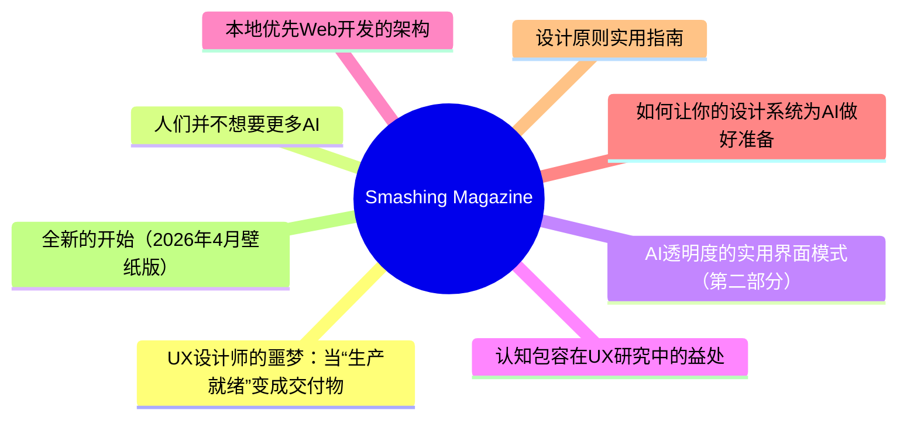
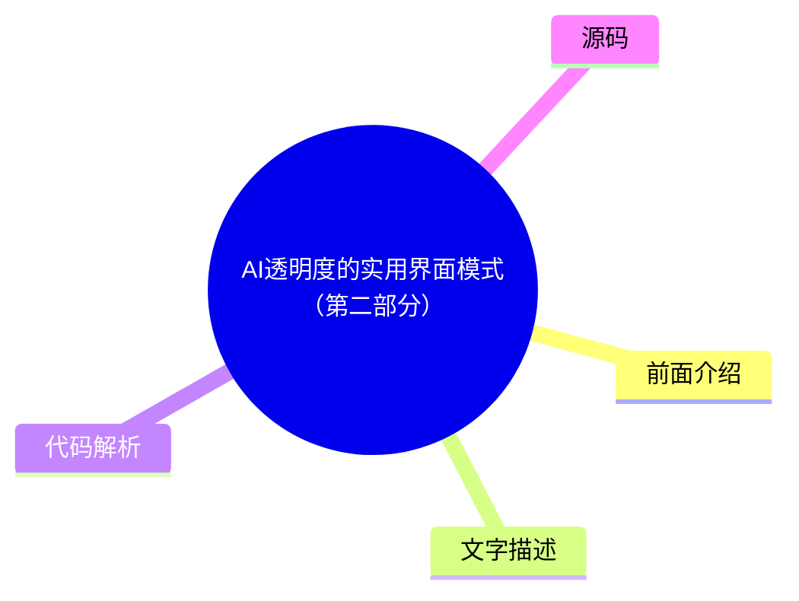

# 🔥 Smashing Magazine Top 8 (2026-07-29)

## 前面介绍

- 数据源：Smashing Magazine
- 抓取日期：2026-07-29
- 条目数：8
- 含完整正文：8
- 含代码片段：1
- 组织方式：前面介绍 / 树状图 / 文字描述 / 代码解析 / 源码

## 思维导图



## 详细整理（8 条，8 条含全文，1 条含代码）

### 1. UX设计师的噩梦：当“生产就绪”变成交付物
- **链接**: [https://smashingmagazine.com/2026/04/production-ready-becomes-design-deliverable-ux/](https://smashingmagazine.com/2026/04/production-ready-becomes-design-deliverable-ux/)
- **发布**: Wed, 22 Apr 2026 10:00:00 GMT

#### 前面介绍

- 行业标准被市场强行定义，设计师需同时交付“氛围感”和“代码”。
- AI代理虽然能生成功能代码，但往往不是“好”代码。
- 设计师面临能力陷阱，试图精通两个截然不同的领域可能导致平庸。

#### 树状图


#### 文字描述

- 2026年，UX设计师的工具箱发生了剧变。LinkedIn上的职位描述显示，企业越来越要求设计师具备AI增强开发、技术编排和生产就绪的原型设计能力。
- 这种转变导致了“角色蔓延”，招聘者不仅要求同理心，还要求设计师能直接生成React组件并推送到仓库。
- 经验丰富的设计师突然被要求具备调试CSS Flexbox或管理Git分支的能力，这引发了关于价值重新分配的焦虑。
- 试图同时成为资深设计师和资深程序员会导致“平庸胜任”的困境，因为认知卸载会降低对底层逻辑的理解。
- AI生成的代码在处理高流量事件时容易崩溃，而缺乏代码理解的设计师无法手动追踪逻辑，从而成为系统中的隐患。

#### 代码解析

- 本文未提供源码，以下为实现思路或结构解析：1. 需要建立决策节点审计机制，识别AI系统何时基于概率做出决策。2. 设计透明度矩阵，明确哪些后台API调用需要向用户展示状态更新。3. 将等待时间转化为安抚时刻，使用主动的“我正在如何解决问题”的描述替代被动的“正在加载”。4. 采用“代理更新公式”，将系统动作分解为清晰的步骤，如检查日历、交叉核对可用性、同步日程等。

#### 源码

#### 中文节选

2026年初，我注意到 UX 设计师工具箱似乎在一夜之间发生了转变。行业标准“设计师应该写代码吗？”的争论被市场突然平息了，不是通过我们行业的共识，而是通过职位要求的蛮力。如果你今天浏览 LinkedIn，你会注意到一个显著的变化：UX 职位越来越要求 ** AI 增强开发**、**技术编排**和**生产就绪的原型设计**。

对许多人来说，包括我自己，这是终极的设计噩梦。我们被要求同时交付“氛围”和“代码”，使用 AI 代理来跨越以前需要多年的计算机科学知识和编码经验才能跨越的技术鸿沟。但随着行业匆忙满足这些新期望，他们发现 AI 生成的功能性代码并不总是*好*代码。

## LinkedIn 的压力锅：2026 年的角色蔓延

就业市场发出了明确的信号。虽然传统平面设计职位预计到 2034 年仅增长 **3%**，但 UX、UI 和 [产品设计职位](https://www.nobledesktop.com/careers/designer/job-outlook#:~:text=The%20projected%20future%20growth%20figures%20for%20Digital,job%20growth%20(which%20lies%20somewhere%20around%205%25).) 在同一时期预计增长 **16%**。

然而，这种增长越来越多地与 **AI 产品开发**的兴起相关联，其中“设计技能”最近已成为需求量最大的能力，甚至领先于编码和云基础设施。构建这些平台的公司不再仅仅寻找视觉设计师；他们需要能够“将技术能力转化为以人为中心体验”的专业人士。

这为 UX 设计师创造了一个高风险的环境。我们不再仅仅对界面负责；我们被期望充分理解技术逻辑，以确保复杂的 AI 功能对于屏幕另一端的人类来说感觉直观、安全且有用。设计师正被推向一种 **“设计工程师”** 模式，我们必须弥合抽象的 [AI 逻辑与面向用户的代码](https://www.refontelearning.com/blog/ui-ux-designer-engineering-in-2026-crafting-future-ready-user-experiences#skills-and-competencies-for-the-2026-uiux-designer-3) 之间的差距。

一项 [最近的调查](https://www.lyssna.com/blog/ux-design-trends/) 发现，**73% 的设计师**现在将 AI 视为主要的合作伙伴，而不仅仅是一种工具。然而，这种“协作”往往看起来像是“角色蔓延”。招聘人员往往不仅是在寻找一个理解用户同理心和信息架构的人——他们想要的是那个能够通过提示词让 React 组件凭空出现并将其推送到仓库的人！

这种转变已经造成了一个 **能力差距**。

作为一名经验丰富的资深设计师，我在几十年的时间里掌握了认知负荷、无障碍标准等的细微差别，但

#### 完整正文（中文）

2026年初，我注意到 UX 设计师工具箱似乎在一夜之间发生了转变。行业标准“设计师应该写代码吗？”的争论被市场突然平息了，不是通过我们行业的共识，而是通过职位要求的蛮力。如果你今天浏览 LinkedIn，你会注意到一个显著的变化：UX 职位越来越要求 ** AI 增强开发**、**技术编排**和**生产就绪的原型设计**。

对许多人来说，包括我自己，这是终极的设计噩梦。我们被要求同时交付“氛围”和“代码”，使用 AI 代理来跨越以前需要多年的计算机科学知识和编码经验才能跨越的技术鸿沟。但随着行业匆忙满足这些新期望，他们发现 AI 生成的功能性代码并不总是*好*代码。

## LinkedIn 的压力锅：2026 年的角色蔓延

就业市场发出了明确的信号。虽然传统平面设计职位预计到 2034 年仅增长 **3%**，但 UX、UI 和 [产品设计职位](https://www.nobledesktop.com/careers/designer/job-outlook#:~:text=The%20projected%20future%20growth%20figures%20for%20Digital,job%20growth%20(which%20lies%20somewhere%20around%205%25).) 在同一时期预计增长 **16%**。

然而，这种增长越来越多地与 **AI 产品开发**的兴起相关联，其中“设计技能”最近已成为需求量最大的能力，甚至领先于编码和云基础设施。构建这些平台的公司不再仅仅寻找视觉设计师；他们需要能够“将技术能力转化为以人为中心体验”的专业人士。

这为 UX 设计师创造了一个高风险的环境。我们不再仅仅对界面负责；我们被期望充分理解技术逻辑，以确保复杂的 AI 功能对屏幕另一端的人类来说感觉直观、安全且有用。设计师正被推向一种 **“设计工程师”** 模式，我们必须弥合抽象的 [AI 逻辑和面向用户的代码](https://www.refontelearning.com/blog/ui-ux-designer-engineering-in-2026-crafting-future-ready-user-experiences#skills-and-competencies-for-the-2026-uiux-designer-3) 之间的差距。

一项 [最近的调查](https://www.lyssna.com/blog/ux-design-trends/) 发现，**73% 的设计师**现在将 AI 视为主要的合作伙伴，而不仅仅是一种工具。然而，这种“协作”往往看起来像是“角色蔓延”。招聘人员往往不仅寻找那些理解用户同理心和信息架构的人——他们还想要那些能够通过提示词让 React 组件凭空出现并将其推送到仓库的人！

这种转变创造了一个 **能力差距**。

作为一名在认知负荷、无障碍标准和民族志研究方面花费数十年掌握细微差别的资深设计师，我突然发现自己正在被评判调试 CSS Flexbox 问题或管理 Git 分支的能力。

噩梦并非技术本身。而是 **价值的重新分配**。

“

### 能力陷阱：两种工作技能集，一个平庸的结果

董事会中可能正在流传一个非常危险的神话，即 AI 使设计师与工程师“平等”。这种叙事暗示，因为 LLM 可以生成功能性的 JavaScript 事件处理程序，那么提示它的人就不需要理解底层逻辑。实际上，试图同时掌握两个截然不同且深奥的领域，很可能会导致在两者上都变得 **平庸**。

### “平庸能力”的两难困境

要让资深 UX 设计师成为资深级程序员，就像要求一位主厨同时也成为一位管道大师，因为“他们都在厨房工作”。你可能会让水流起来，但你不会知道管道为什么会发出嘎嘎声。

- **“认知卸载”风险。**
 研究表明，虽然 AI 可以加快任务完成速度，但它往往会导致概念掌握的显著下降。在一项受控研究中，使用 AI 辅助的参与者在理解测试中的得分比手动编码的参与者低 [17%](https://www.psychologytoday.com/au/blog/the-asymmetric-brain/202602/cognitive-offloading-using-ai-reduces-new-skill-formation)。
- **调试差距。**
 AI 依赖型用户和手动编码者之间最大的性能差距在于 [调试](https://www.anthropic.com/research/AI-assistance-coding-skills)。当设计师使用 AI 编写他们不完全理解的代码时，他们没有能力识别 *何时* 以及 *为何* 它会失败。

因此，如果设计师发布了一个在流量高峰期间崩溃且无法手动追踪逻辑的 AI 生成组件，他们就不再是专家。他们现在成了一个隐患。

### 未优化代码的高昂代价

任何有经验的代码工程师都会告诉你，如果没有正确的提示词，仅凭 AI 生成代码会导致大量的返工。由于大多数设计师缺乏审计 AI 提供的代码的技术基础，他们会在无意中发布大量的 [“质量债务”](https://gocrossbridge.com/blog/ai-generated-code/)。

## 设计师生成 AI 代码中的常见问题

- **安全漏洞**
 近期报告显示，高达 [92% 的 AI 生成代码库](https://www.sherlockforensics.com/pages/ai-code-security-report-2026.html)至少包含一个关键漏洞。设计师可能看到一个功能正常的登录表单，却不知道它在 XSS 防御方面的失败率高达 86%，XSS 防御是旨在防止攻击者将恶意脚本注入到受信任网站的安全措施。
- **无障碍错觉**

AI 经常生成缺乏语义完整性的“功能性”应用。设计师可能会提示生成一个“美观且功能齐全的切换开关”，但 AI 可能会提供一个非语义化的 `<div>`，它缺乏键盘焦点和屏幕阅读器兼容性，从而产生了 [可访问性债务](https://www.levelaccess.com/blog/accessibility-debt-in-software-development-and-how-to-engineer-it-out/)，日后修复起来代价高昂。

- **性能惩罚**
 AI 生成的代码往往冗长。与人工编写的代码相比，AI 导致的代码重复率高出 [4 倍](https://www.netcorpsoftwaredevelopment.com/blog/ai-generated-code-statistics)。这种冗长性会拖慢页面加载速度，生成巨大的 CSS 文件，并对 SEO 产生负面影响。对业务而言，任务看起来是“完成了”。但对连接缓慢的用户或屏幕阅读器用户来说，该网站是一场噩梦。

## 创造更多工作，而非更少

AI 的承诺是设计师可以在不麻烦工程师的情况下发布功能。现实却是诞生了一种 **“返工税”**，正在耗尽整个行业的工程资源。

- **清理工作**
 组织发现，虽然开发速度提高了，但每个拉取请求（Pull Request）中的事故率也上升了 [23.5%](https://blog.exceeds.ai/ai-code-analysis-benchmark-reports/)。一些工程团队现在花费了周中相当大的一部分时间来清理设计团队跳过严格审查流程而交付的“AI 废料”。
- **沟通鸿沟**
 只有 [69% 的设计师](https://www.lyssna.com/blog/ux-design-trends/)认为 AI 提高了他们工作的质量，相比之下，**82% 的开发者**有此感觉。这种差距之所以存在，是因为“能编译的代码”并不等同于“可维护的代码”。

当设计师移交的 AI 生成的代码忽略了公司的内部命名约定或管理模式时，他们并没有帮助工程师；他们是在制造一个以后必须由别人解决的谜题。

### 解决方案

我们需要摆脱“**独行全栈设计师**”的噩梦，转向 **设计师/程序员协作** 的模式。

**理想的现实：**

- **伙伴关系**

 Instead of designers trying to be mediocre coders, they should work in a- **human-AI-human loop**. A senior UX designer should work- *with*an engineer to use AI; the designer creates prompts for- **intent, accessibility, and user flow**, while the engineer creates prompts for- **architecture and performance**.
- **Design systems as guardrails**
 To prevent accessibility debt from spreading at scale,- [accessible components must be the default](https://webaim.org/projects/million/)in your design system. AI should be used to feed these tokens into your UI, ensuring that even generated code stays within the “source of truth.”

## Beyond The Prompt

The industry is currently in a state of “AI Infatuation,” but the pendulum will eventually swing back toward quality.

“

Businesses that prioritise “designer-shipped code” without engineering oversight will eventually face a reckoning of technical debt, security breaches, and accessibility lawsuits. The designers who thrive in 2026 and beyond will be those who refuse to be “prompt operators” and instead position themselves as the **guardians of the user experience**. This is the perfect outcome for experienced designers and for the industry.

Our value has always been our ability to advocate for the human on the other side of the screen. We must use AI to augment our design thinking, allowing us to test more ideas and iterate faster, but we must never let it replace the specialised engineering expertise that ensures our designs technically *work* for everyone.

### Summary Checklist for UX Designers

- **Work Together.**
 Use AI-made code as a starting point to talk with your developers. Don’t use it as a shortcut to avoid working with them. Ask them to help you with prompts for code creation for the best outcomes.
- **Understand the “Why”.**
 Never submit code you don’t understand. If you can’t explain how the AI-generated logic works, don’t include it in your work.
- **Build for Everyone.**
 Good design is more than just looks. Use AI to check if your code works for people using screen readers or keyboards, not just to make things look pretty.


### 2. 人们并不想要更多AI
- **链接**: [https://smashingmagazine.com/2026/07/people-dont-want-more-ai/](https://smashingmagazine.com/2026/07/people-dont-want-more-ai/)
- **发布**: Wed, 15 Jul 2026 10:00:00 GMT

#### 前面介绍

- 大多数公司误以为用户渴望新AI功能，但现实是用户对AI持怀疑和抵触态度。
- AI功能往往增加了工作负担，因为它们需要用户在多个碎片化系统间切换，且容易暴露组织内部的缺陷。
- 人们真正需要的是可靠、可预测且能增强工作流而非完全取代工作流的工具。

#### 树状图


#### 文字描述

- 许多公司假设每个人都在渴望AI，但实际上，AI功能的采用率和留存率很低，且交付成本高昂。
- AI往往放大了组织中的捷径和缺陷，如数据质量差、决策失误，而无法修复多年的技术债务或文化问题。
- 用户需要花费大量时间验证AI的输出，这实际上增加了工作量，且AI带来的焦虑感往往超过便利性。
- 人们并不想要AI艺术博物馆、AI伴侣或管理银行账户中的AI代理，他们更看重功能的稳定性和可靠性。
- 用户希望AI自动化枯燥的任务，从而让他们有时间享受创造性工作，而不是仅仅为了加快交付速度。

#### 代码解析

- 本文未提供源码，以下为实现思路或结构解析：1. 在设计AI功能时，应专注于解决具体痛点而非盲目堆砌AI功能。2. 确保AI增强的是工作流，而不是让用户在多个系统间频繁切换。3. 设计应侧重于自动化繁琐、重复的任务，保留人类特有的创造力和判断力。4. 提供清晰、可预测的反馈机制，减少用户对AI不可控性的焦虑。

#### 源码

#### 中文节选

Many companies silently assume that everybody wants more AI in their lives. That people are **craving new AI features**, new AI products, new AI workflows — that would all magically replace all existing outdated practices and broken ways of working.

But in reality, it seems like **people don’t want more AI** at all — at least not in the way most AI leaders envision it. Unsurprisingly, many AI features have [low adoption and retention](https://www.mindstudio.ai/blog/ai-adoption-gap-ibm-2026-study) — at a very high cost of delivery, and a high risk of reputation damage.

## The AI People Don’t Need

It’s remarkably difficult to make a strong argument with senior leadership, but [AI is not a value proposition](https://www.nngroup.com/articles/powered-by-ai-is-not-a-value-proposition/). New AI features don’t magically make for happy or excited customers. Because AI features are often bolt-ons and separate tools for employees to use, they typically **take people out** of their regular way of working.

AI is pretty good at **amplifying shortcuts and shortcomings** in organizations — from data quality to decision making. It can’t magically fix years of accumulated quick patches, technical debt, broken culture and internal politics. If anything, they become more visible with AI as inconsistencies or conflicting priorities and get handed directly to users, who are then left to make sense of the mess themselves.

Because in most organizations, work typically requires hopping on and off between plenty of disconnected and fragmented systems, with a new AI tool, they now have yet another system that they also need to hop on and off. Often it produces more work, and typically it’s not particularly rewarding work either.

On top of that, people are very much aware of the [cost of finding and fixing AI hallucinations](https://www.nngroup.com/articles/ai-chatbots-discourage-error-checking/). Asking AI to generate a response **might feel easier** than writing from scratch, but it has a cost:

- **Skim through**the entire AI output,
- **Spot key points**to focus attention on,
- **Review/verify key points**, one-by-one,
- **Check rationale**for what follows next,

- **Articulate corrections**+ regenerate，
- **Review the response**(a number of times)。

对于许多人来说，AI 并不是他们可以主动选择和探索的东西——它是不请自来的，按照别人的节奏到来。此外，大量的信息都在放大关于 AI 取代工作的**恐惧和担忧**——因此，人们对 AI 的感知并非兴奋，而是对**变革的抵触**以及对自身在世界中地位的深深焦虑。

在最好的情况下，AI 功能可能只是被默默接受或被敷衍了事。在最坏的情况下，AI 会引发**担忧、怀疑、谨慎**，并呼吁保持健康的怀疑态度。有时它被视为一种威胁或**责任**——因为与其他功能不同，AI 既不可预测也不可靠。

人们并不梦想

#### 完整正文（中文）

许多公司默默假设每个人都希望在他们的生活中拥有更多的 AI。人们渴望新的 AI 功能、新的 AI 产品、新的 AI 工作流程——这些都会神奇地取代所有现有的过时做法和糟糕的工作方式。

但在现实中，似乎人们根本不需要更多的 AI——至少不是大多数 AI 领导者所设想的那种方式。毫不奇怪，许多 AI 功能的采用率和留存率都很低——以极高的交付成本为代价，且面临极高的声誉受损风险。

## 人们不需要的 AI

向高级管理层提出强有力的论点非常困难，但 AI 并不是价值主张。新的 AI 功能并不会神奇地让客户感到快乐或兴奋。由于 AI 功能通常是附加项和员工使用的独立工具，它们通常会让人**脱离**他们常规的工作方式。

AI 非常擅长**放大组织中的捷径和不足**——从数据质量到决策制定。它无法神奇地修复多年积累的快速补丁、技术债务、糟糕的文化和内部政治。如果有任何变化，它们会随着 AI 变得更加明显，表现为不一致或相互冲突的优先级，并直接交给用户，然后让用户自己去理清这些混乱。

因为在大多数组织中，工作通常需要在大量不连接和碎片化的系统之间来回切换，有了新的 AI 工具，他们现在又多了一个需要来回切换的系统。这通常会产生更多的工作，而且通常也不是特别令人满意的工作。

此外，人们非常清楚查找和修复 AI 幻觉的成本。要求 AI 生成响应可能感觉比从零开始编写更容易，但这需要付出代价：

- **通读**整个 AI 输出，
- **找出关键点**以集中注意力，
- **逐一审查/验证关键点**，
- **检查**后续内容的**理由**。

- **纠正内容**+ 重新生成，
- **审查回复**（多次）。

对许多人来说，AI 并不是他们可以主动选择和探索的东西——它不请自来，按照别人的节奏到来。此外，大量的信息都在放大关于 AI 取代工作的**恐惧和担忧**——因此，人们对 AI 的感知并非兴奋，而是对改变的**抵触**以及对自身在世界中地位的深深焦虑。

充其量，AI 功能可能只是被默默接受或被敷衍过去。最坏的情况是，AI 引发了**担忧、怀疑和谨慎**，并呼吁保持健康的怀疑态度。有时它被视为一种威胁或**责任**——因为与其他功能不同，AI 既不可预测也不可靠。

人们并不梦想着**AI 艺术博物馆**、AI 冰箱、AI 酒店前台或 AI 叙述的儿童读物。他们不希望自己的孩子拥有**浪漫的 AI 伴侣**。大多数人不想主动管理（并清理善后）在银行账户中漫游并在现实世界中代表他们行动的**一群 AI 代理**。最值得注意的是，人们并不真的想要一个可以随时与之交谈或输入的魔法盒子。

## 人们真正需要的 AI

我总是对将 AI 功能与人类的不稳定性进行比较感到困惑。但人们并不是将软件与其他人进行比较。他们是在**将功能与功能进行比较**——如果一个产品中的某个功能不可靠，而另一个产品中的类似功能却能完美运行，他们就会选择后者。这无关乎 AI 或非 AI，而在于什么能一致且可靠地工作，什么不能。

许多关于 AI 的讨论都是关于交付速度的。但对许多人来说，提高交付速度并没有多少价值。他们想要把事情做好，有足够的时间去思考和做出良好的决策。他们也希望**享受花在事情上的时间**，而不仅仅是更快地交付。随着每一次 vibe-coded（氛围编码）式的改变，一种巨大的成就感和满足感正在慢慢消失。

人们很少改变。这么多年过去了，他们（仍然）想要的是每次都**快速、易用、可靠、可预测且有用**的功能。理想情况下，这些功能不应取代他们整个工作流程，而应**增强**他们的工作方式——接管那些他们觉得枯燥、恼人且无趣的任务。

许多工作[暴露于 AI 自动化之下](https://www.washingtonpost.com/technology/interactive/2026/jobs-most-affected-ai-automation/)，但在其中许多工作中，仍有一部分是令人有回报的、独特的、富有创造性的，需要品味、观点，甚至人类直觉。如果 AI **自动化了其中的枯燥部分**，这对每个人来说都是一种优势。这也是提高生产力并为日常生活带来更多乐趣的原因。

当 AI 自动化繁琐且消耗精力的任务时，其价值更容易被理解。但要做到这一点，AI 不应感觉像是一个附加组件。它应该**深度集成**到人们现有的工作流程中。它还必须与人们多年来开发和微调的现有**心智模型**相匹配。AI 应该适应人们的思考和决策方式，而不是反过来。

这些功能被标记为“AI”、“智能”或“自动化”其实并不重要。然而，它们必须对使用它们的人有效。这意味着人们必须**了解实际能帮助他们的用例**，并受到启发去自己发现更多用例。

具有讽刺意味的是，在这些方面表现良好的工具并不是“AI 优先”的——它们是**“AI 次之”**的。它们微妙、谦逊、冷静、无处不在，在背景中扮演支持者的角色，为那些原本极其枯燥且不必要的任务提供帮助。

我不想读 AI 写的书。我不想看 AI 画的画。我不想让 AI 教我的孩子。我不想要 AI 心理咨询师。我不想要 AI 做我的医疗决定。我想让 AI 去做所有那些让我感到疲惫的**体力和脑力劳动**，这样我才能阅读人类写的书，去美术馆欣赏人类创作的艺术。我想要的是让我的生活更轻松，而不是强迫我去改变自己。

—[李宝英](https://www.linkedin.com/feed/update/urn:li:share:7467162929474420737/)

## 总结

也许是我忽略了更大的图景，又或许我只是老派——但**我真的喜欢人**。他们的故事、他们的思考、他们的情感、他们的热情、他们的笑声。AI 在许多情况下都非常有帮助，但人也一样。在这两者之间，我每次都会选择**与人类共度时光**——无论他们多么不完美。

不，**人们的生活中不需要更多的 AI**——他们需要 AI 来自动化处理每天必须应对的枯燥琐事，这样他们才有更多的时间和精力去做他们真正热爱和享受的事情。这并不意味着花更多时间与 AI 在一起——而是花更多时间与所爱的人在一起。

## 认识“AI 界面设计模式”

认识 [Design Patterns For AI Interfaces](https://ai-design-patterns.com/)，这是 Vitaly 的新

**视频课程**，包含来自真实产品的实用示例——并即将举办

[现场 UX 培训](https://smashingconf.com/online-workshops/workshops/ai-interfaces-vitaly-friedman/)。

[跳转到免费预览](https://www.youtube.com/watch?v=jhZ3el3n-u0)。

## 有用资源

- [AI 采用差距：IBM 2026 年研究](https://www.mindstudio.ai/blog/ai-adoption-gap-ibm-2026-study)，MindStudio 著
- [“由 AI 驱动”并非价值主张](https://www.nngroup.com/articles/powered-by-ai-is-not-a-value-proposition/)，Nielsen Norman Group 著
- [AI 聊天机器人会阻碍错误检查](https://www.nngroup.com/articles/ai-chatbots-discourage-error-checking/)，Nielsen Norman Group 著
- [受 AI 自动化影响最大的工作](https://www.washingtonpost.com/technology/interactive/2026/jobs-most-affected-ai-automation/)，《华盛顿邮报》著
- [关于 AI 以及我们真正希望从它那里得到什么](https://www.linkedin.com/feed/update/urn:li:share:7467162929474420737/)，Bo Young Lee 著


### 3. AI透明度的实用界面模式（第二部分）
- **链接**: [https://smashingmagazine.com/2026/05/practical-interface-patterns-ai-transparency/](https://smashingmagazine.com/2026/05/practical-interface-patterns-ai-transparency/)
- **发布**: Wed, 13 May 2026 13:00:00 GMT

#### 前面介绍

- 传统的加载模式（如旋转图标）无法传达AI代理的“思考”过程，容易引发用户焦虑。
- 透明度不仅关乎视觉设计，更关乎清晰的状态更新文案（微文案）。
- 采用“代理更新公式”可以有效地向用户展示AI正在执行的具体步骤。

#### 树状图



#### 文字描述

- 在代理式AI体验中，等待时间不仅仅是数据下载，而是复杂的推理和决策过程。使用通用的“加载中”或“工作中”会让用户感到困惑和不安。
- 为了建立用户信任，需要将等待时间转化为安抚时刻，明确告知用户系统正在如何解决问题。
- Perplexity AI 提供了很好的例子，它实时显示活动列表，让用户无需猜测AI正在做什么。
- 代理更新公式包含三个部分：强有力的动作动词、AI正在处理的具体项目，以及任何限制或规则。
- 例如，与其只说“搜索航班”，不如说“扫描汉莎航空和联合航空的价格，以找到任何低于600美元的选项”。
- 这种结构化的沟通将技术过程落地到用户的实际生活中，减少了不确定性。

#### 代码解析

- 本文未提供源码，以下为实现思路或结构解析：1. 设计状态更新时，应避免使用“加载”等模糊词汇，改用具体的动作描述。2. 将复杂的AI任务分解为至少四个清晰的步骤，如检查日历、交叉核对、同步日程。3. 在更新文案中明确限制条件，如价格范围、时间限制等。4. 确保状态更新能够实时反映AI的进展，让用户始终掌握系统状态。

#### 源码

#### 中文节选

In the [first part of this series](https://www.smashingmagazine.com/2026/04/identifying-necessary-transparency-moments-agentic-ai-part1/), we talked about the **Decision Node Audit**. We mapped out the internal workings of our AI system to pinpoint the exact moments it makes decisions based on probabilities. This told us when the system needs to be transparent with the user. Now, the big question is *how* to share that information.

You’ve got your **Transparency Matrix** ready. You know which behind-the-scenes API calls need a visible status update. Your engineers are on board with the technical aspects. The next step is designing the visual container for those updates.

We face a legacy problem. For thirty years, interface designers have relied on a single pattern to handle latency: **the spinner**. The spinning wheel, the throbber, the progress bar. These patterns communicate a specific technical reality. They tell the user that the system is retrieving data. The delay is caused by bandwidth or file size.

AI agents introduce a new kind of wait time. When an agent pauses for twenty seconds, it’s not just downloading something; it’s *thinking*. It’s figuring out the best steps, weighing options, and creating the content you asked for.

If we use a basic spinning icon for this “thinking time,” users get confused and anxious. They watch a looping animation and can’t tell if the system is stalled or crashed. They don’t know if the agent is handling a very complicated task or if it has simply failed.

To build user trust, we need to turn this waiting time into a **moment for reassurance**. Instead of a passive *“something is happening,”* we need to communicate an active, *“Here is exactly how I am working to solve your problem.”*

## Writing Clear Status Updates

We often think of transparency as a visual design problem, but it’s really about the **words** we use. Simple, clear explanations (the microcopy) are what build trust and separate a reliable AI from one that feels broken.


我们需要淘汰像 *Loading* 或 *Working* 这样的通用占位符。这些词汇是静态软件时代的遗留产物。相反，我们必须使用特定的公式来构建状态更新，以反映系统的自主性。让我们停止使用“Loading”或“Working”这类模糊的词汇。这些术语属于过去，那时软件简单且静态。相反，我们应该创建能够清晰告知用户系统*正在实际做*什么的状态更新，并使系统的操作透明化。

想象一下，为了举例，你正在部署代理 AI，它将在被提示后帮助团队成员整理日程并代为安排 recurring meetings（定期会议）。

当 AI 显示类似“Checking availability”（检查可用性）的消息且持续时间未知时，用户往往会感到迷茫，因为它提供的信息不足。虽然他们理解 AI 正在查看日历，但他们不知道*谁的*日历，也不知道涉及哪些其他步骤（之前或之后）。

#### 完整正文（中文）

在[本系列的第一部分](https://www.smashingmagazine.com/2026/04/identifying-necessary-transparency-moments-agentic-ai-part1/)中，我们讨论了**决策节点审计**。我们梳理了 AI 系统的内部运作机制，以精确定位其基于概率做出决策的确切时刻。这让我们知道系统何时需要向用户保持透明。现在，核心问题是*如何*分享这些信息。

你已经准备好了**透明度矩阵**。你知道哪些幕后 API 调用需要显示状态更新。你的工程师也认同技术层面的细节。接下来的步骤是为这些更新设计视觉容器。

我们面临一个遗留问题。三十年来，界面设计师一直依赖一种单一模式来处理延迟：**旋转器**。旋转的圆圈、闪烁图标、进度条。这些模式传达了一种特定的技术现实。它们告诉用户系统正在检索数据。延迟是由带宽或文件大小引起的。

AI 代理引入了一种新的等待时间。当代理暂停二十秒时，它不仅仅是在下载某样东西；它是在*思考*。它正在确定最佳步骤，权衡选项，并为你请求的内容进行创作。

如果我们用基本的旋转图标来表示这种“思考时间”，用户会感到困惑和焦虑。他们看着循环动画，无法判断系统是卡住了还是崩溃了。他们不知道代理是在处理一个非常复杂的任务，还是仅仅失败了。

为了建立用户信任，我们需要将这段等待时间转化为一个**安抚时刻**。与其使用被动的“正在发生某事”，我们需要传达一种主动的“这正是我正在努力解决您问题的具体方式”。

## 撰写清晰的更新状态

我们常将透明度视为一个视觉设计问题，但实际上它关乎我们使用的**文字**。简单、清晰的解释（微文案）才是建立信任并区分可靠 AI 与感觉故障的 AI 的关键。

我们需要淘汰像 *Loading* 或 *Working* 这样的通用占位符。这些词汇是静态软件时代的遗留产物。相反，我们必须使用特定的公式来构建状态更新，以反映系统的能动性。让我们停止使用“Loading”或“Working”这类模糊的词汇。这些术语属于过去，那时的软件简单且静态。相反，我们应该创建能够清晰告知用户系统*实际上正在做什么*的状态更新，并使系统的操作透明化。

想象一下，为了举例说明，你正在部署一个代理 AI，它将帮助团队成员整理日程并代表他们安排 recurring meetings（定期会议），只需给出提示即可。

当 AI 对未知的时间段显示类似“Checking availability（检查可用性）”的消息时，用户往往会感到迷茫，因为它提供的信息不够充分。虽然他们理解 AI 正在查看日历，但他们不知道查看的是*谁的*日历，涉及哪些其他步骤（之前或之后），或者 AI 是否还记得日程安排请求中的人和目的。等待最终结果可能是一种紧张、不安的体验，就像在期待一个你怀疑可能是恶作剧的礼物一样。

Perplexity AI 提供了一个正确处理状态更新的绝佳范例。下图 1 显示，当用户提问时，界面会实时显示它正在执行的确切操作。你会看到活动列表随着任务的完成而更新。用户无需猜测 AI 在工作时正在发生什么。

## 代理更新公式

为了向用户提供有用的状态更新，我们需要将系统正在*做*的事情与*为什么*做这件事联系起来。继续以我们的日程安排代理为例，系统应该将该等待期分解为至少四个清晰、独立的步骤。

- 首先，界面显示 *Checking your calendar to find open times for a recurring Thursday call with [Name(s)]（正在检查你的日历，以查找与 [Name(s)] 进行 recurring Thursday call（每周四定期通话）的空闲时间）*。
- 然后，它更新为：*Cross-checking availability with [Name(s)] calendars（正在与 [Name(s)] 的日历交叉核对可用性）*。
- 接下来，它可能会显示：*Syncing [Name(s)] schedules to secure your meeting time on [Data and Time]（正在同步 [Name(s)] 的日程，以锁定 [Data and Time] 的会议时间）*。

- 最后，在结束时，代理可能会声明他们已成功完成任务，并请求用户检查其电子邮件，以确认已发送给有定期会议的群组的邀请。

这种沟通过程将技术流程立足于用户的实际生活。

让 AI 的进展易于理解，归结为一个三部分结构：一个强有力的**动作词**、AI 正在处理的内容（**具体项目**）以及它必须遵守的任何**限制**或规则。

想象一下 AI 帮你预订旅行的场景。一个薄弱、无用的更新可能只是：*正在搜索航班……*

一个更好的更新使用了以下公式：

- **动作词：**- *扫描*
- **具体项目：**- *汉莎航空和联合航空的价格*
- **限制/规则：**- *查找任何低于 600 美元的。*

这种方法清楚地表明用户，AI 理解了他们的请求，并且正在设定的边界内工作。

## 匹配语气与风险矩阵

AI 应该听起来像人还是表现得像机器人？正确的答案取决于任务的重要性，我们可以使用我们**决策节点审计**中的**影响/风险矩阵**来计算这一点。

对于简单、低风险的任务，友好、对话式的语气效果最好。例如，调度助手可以说它正在检查您的日历以寻找最佳时间。这为用户创造了一种舒适、轻松的体验。

然而，高风险任务需要清晰、机械的准确性。如果 AI 正在管理大额资金转账或复杂的数据库迁移，用户不想要一个有趣的界面；他们需要的是精确性。一个显示 *“我正在为您的资金深思熟虑”* 的屏幕可能会引起恐慌。相反，界面应该使用像 *“正在验证账户路由号码”* 这样的直接语言。通过调整 AI 的“个性”以匹配风险水平，我们为用户提供了他们在那一刻确切需要的体验。虽然影响/风险矩阵提供了必要的起点，但适当 AI 语音和语气的最终决定因素是严格的**用户研究**。

对于任何一组规则来说，都不可能预测出能建立信任或引发压力的确切措辞或语气，无论是在任何用户群体中，还是在任何情况下。这就是为什么动手研究至关重要。你需要：

- [运行 A/B 测试](https://medium.com/@alienoghli/the-essential-guide-to-a-b-testing-a84b853c16e0)
- [进行可用性研究](https://uxplanet.org/usability-testing-the-complete-guide-e162898f68db)
- [进行访谈](https://ixdf.org/literature/article/how-to-conduct-user-interviews)

这种研究确保了 AI 的“个性”对于实际使用该系统的人及其特定语境来说，是舒适且恰当的。

我们现在已经涵盖了 *“什么”* —— 那些关键的微文案、清晰的行动词汇，以及使 AI 状态更新诚实且具有信息量的必要限制。但仅有文字是不够的。隐藏在糟糕界面中的完美句子，依然是透明度的失败。

下一个挑战是 *“如何”* —— 为该消息设计物理传递系统。你可以把状态更新公式看作引擎，把界面模式看作汽车。强大的引擎需要一个可靠、设计良好的底盘来承载它行驶在道路上。

## 界面模式：智能体的库

一旦我们有了正确的文字，就需要 **正确的容器**。关键在于将消息的权重与模式的可见性相匹配。一个微小的后台任务（比如智能体在后台默默整理你的文件）不需要大声闪烁的横幅。该消息最好以微妙的方式传达。一个高风险的多步骤流程（比如转账）可能需要更稳健的容器，以迫使用户集中注意力。

通过创建这些模式的库，我们确保在正确的时刻提供适当的透明度，将等待的焦虑转化为知情自信的时刻。让我们回顾几个常见且关键的模式。

### 活跃的面包屑：AI 在后台工作

对于那些 AI 在后台静默处理的低重要性任务，我们需要一种方式来向用户展示它正在工作，而又不会不断分散他们的注意力。我们可以称之为活跃的面包屑。

想象一个邮件应用，其中 AI 正在为您起草回复。您不希望出现令人分心的弹出消息。相反，一个微小的、微妙的状态指示器会在应用程序的边框或菜单区域内闪烁。

该方案需要超越静态图标。这个动态面包屑会在不同的文本更新之间平滑过渡。它可能会从 *Reading email*（阅读邮件）闪烁到 *Drafting reply*（起草回复）再到 *Checking tone*（检查语气）。如果您想查看其进度，它就在那里，提供一种安静的保障，表明任务正在进行中，但不会要求您立即关注。

### 动态检查清单

在处理关键、高风险的任务时——例如处理复杂的金融交易或迁移大型、复杂的数据集——我们建议使用 **Dynamic Checklist**（动态检查清单）（如图 3 所示）。

该模式为用户提供了一个强大的锚点，提供了关于 **流程进度** 的清晰度和信心。动态检查清单列出了 AI 代理将要采取的每一个计划步骤，而不仅仅是一条简单的进度条。它清晰地高亮显示当前正在进行的步骤，将前面的步骤标记为已完成，并列出未来的操作为待处理状态。

例如：

- **Step 1**: Verify Account Balance- **[Complete]**.
- **Step 2**: Convert Currency- **[Processing]**.
- **Step 3**: Transfer Funds- **[Pending]**.

动态检查清单相比传统的进度条具有显著优势，因为它能巧妙地管理不可预测的时间。如果货币转换（Step 2）意外地需要额外十秒钟，用户不会感到突然的焦虑或恐慌。他们对系统的确切位置拥有完全的可见性，并理解延迟正在 *Converting Currency*（转换货币）步骤期间发生。因为他们认识到这是一个可能复杂的操作，所以他们自然会更加耐心，并信任系统正在进行的这项工作。

该模式本身是一个引人注目的 UI 构思，但设计师必须记住，其实现会将任务转化为全栈设计需求。与简单的加载标志不同，动态清单需要一个健壮的前端状态管理系统来监听步骤完成事件，这些事件通常由后端 webhook 结构触发。这确保了界面始终反映代理在工作流中的实时位置。

### 思考切换

一些信息需求较高或对透明度要求较高的用户可能不会信任简单的摘要；他们想查看系统的原始处理过程。对于这类受众，我们设计了 **Thinking Toggle**（思考切换）。

这是一个简单的渐进式披露 UI 控件，类似于一个倒三角形或“查看日志”按钮，允许用户将友好的状态更新展开为原始终端视图。它显示 AI 代理的已清理逻辑日志，例如：

- *查询 API 端点 /v2/search*；
- *收到响应：200 OK*；
- *按相关性分数 > 0.8 过滤结果*。

许多人永远不会打开此视图。然而，对于需要深度透明度的用户来说，该切换开关的存在本身就是一种信任信号。它向他们保证系统没有隐瞒任何内容。

请记住，这种深度透明度伴随着一个关键的技术风险。即使对于您最专业的受众，在显示之前也必须对这些原始日志进行清理和抽象。这一步骤是不可商量的，以防止意外暴露专有业务逻辑、内部数据结构名称或可能被利用的安全令牌。此过程确保信任是通过诚实而非安全漏洞建立的。

### 为部分成功进行设计

在标准软件中，事情通常非黑即白。文件要么保存，要么不保存。但在 AI 代理中，事情是……（截断，原文 21693+ 字符）


### 4. 认知包容在UX研究中的益处
- **链接**: [https://smashingmagazine.com/2026/06/benefits-cognitive-inclusion-ux-research/](https://smashingmagazine.com/2026/06/benefits-cognitive-inclusion-ux-research/)
- **发布**: Wed, 10 Jun 2026 10:00:00 GMT

#### 前面介绍

- 认知障碍是影响信息处理、记忆和学习的最普遍残疾类型，且呈快速增长趋势。
- 与传统用户研究相比，认知障碍参与者的研究能揭示更多独特的可用性洞察。
- 通过专门的筛选器和访谈方法，可以有效地招募和测试认知障碍用户。

#### 树状图


#### 文字描述

- 认知障碍包括神经多样性，如阅读障碍、ADHD和自闭症。在美国，约有13.9%的人口受此影响。
- 研究团队制定了筛选器，招募有记忆、专注和学习挑战的参与者，并测试了最佳实践。
- 研究涉及三个不同类型的网站（高蛋白食谱、书店、美发沙龙），分别测试了30名认知障碍用户和普通用户。
- 所有参与者都完成了可访问性可用性量表（AUS）调查，以量化他们对数字产品的体验。
- 研究发现，认知障碍用户在研究中提出的关注点、问题和困难往往比普通用户更深刻。
- 这表明在设计包容性产品时，必须考虑认知障碍用户的具体需求和体验。

#### 代码解析

- 本文未提供源码，以下为实现思路或结构解析：1. 在筛选参与者时，应关注自我报告的记忆、专注和学习挑战。2. 在访谈中，应给予用户更多时间完成任务，避免匆忙。3. 设计界面时应提供清晰的导航和反馈，减少认知负荷。4. 鼓励用户分享他们的困难和建议，以便更好地理解他们的需求。

#### 源码

#### 中文节选

In the summer of 2024, I became co-chair of a working group of expert researchers who came together to determine how best to perform accessibility testing with people with cognitive disabilities. This was work I did for Fable, where I am currently VP of Innovation.

Cognitive disability is an umbrella term for several disabilities that impact how people process information, and it usually affects memory, focus, and/or learning. It is the most prevalent disability in the U.S. (13.9% via [CDC](https://www.cdc.gov/disability-and-health/articles-documents/disability-impacts-all-of-us-infographic.html)), and cognitive disability is increasing rapidly ([Yale study](https://news.yale.edu/2025/09/24/growing-number-us-adults-report-cognitive-disability)).

We set four goals for ourselves to learn how to work with this audience:

- How should we recruit and screen participants?
- What are best practices for research with cognitive participants?
- Do these methods work in a real study?
- Documenting what we learned so that we could share it.

We created a screener to recruit people who self-identified as having challenges with memory, focus, and learning. We also reviewed published studies that involved cognitive testers to learn best practices for working with them.

Next, we tested these best practices with an initial group of 25 testers in a pilot study. We fine-tuned our approach iteratively and created a guide to running user interviews with cognitive testers and a survey that could quantify their experiences using digital products. Finally, we [documented what we learned](https://makeitfable.com/article/cognitive-accessibility-pilot-case-study/).

After our pilot study with this new group of testers finished, I felt that they would uncover more usability insights than the general population (gen pop) user research participants I’d worked with in the past. I set out to validate this hunch.

## The Cognitive Usability Study


我决定与 Fable 的合作伙伴——加州大学尔湾分校——联合开展一项研究，在 Syed Fatiul Huq 的协助下，并得到 Fable 研究员 Pranav Pidathala、Ali Brown 和 Michael Fagan 的支持，以验证我关于使用认知测试人员能获得更多洞察的假设是否成立。

我使用 AI 原型工具生成了三个网站用于这项研究。我想要三种不同类型的网站，具有不同的用户目标和内容，以便我可以在研究中测试各种任务。

### 表 1：测试的网站与任务

| 网站 | [Strong Snacks](https://v0-strong-snacks.vercel.app/) | [Turning Pages](https://v0-bookstore-nu.vercel.app/) | [Crown & Comb](https://v0-crown-and-comb.vercel.app/) | 
|---|---|---|---|
| 描述 | 这是一个提供三成分高蛋白食谱的网站。食谱可以按类别（素食、增肌等）浏览。该网站还包含关于蛋白质的博客文章和联系信息。 | 这是一个书店网站，拥有精选阅读目录。它具有扩展

#### 完整正文（中文）

2024年夏天，我成为了一个专家研究小组的联合主席，该小组汇聚在一起，旨在确定如何最好地与认知障碍人士进行无障碍测试。这是我为 Fable 所做的工作，我目前在那里担任创新副总裁。

认知障碍是一个统称，涵盖了几种影响人们处理信息方式的障碍，通常会影响记忆、专注力和/或学习能力。它是美国最常见的残疾类型（通过 [CDC](https://www.cdc.gov/disability-and-health/articles-documents/disability-impacts-all-of-us-infographic.html) 数据为 13.9%），且认知障碍正在迅速增加（[耶鲁大学研究](https://news.yale.edu/2025/09/24/growing-number-us-adults-report-cognitive-disability)）。

我们为自己设定了四个目标，以学习如何与这一受众群体合作：

- 我们应该如何招募和筛选参与者？
- 与认知障碍参与者进行研究的最佳实践是什么？
- 这些方法在实际研究中有效吗？
- 记录我们所学到的内容，以便分享。

我们创建了一份筛选问卷，以招募那些自我认定为在记忆、专注和学习方面存在挑战的人。我们还审查了涉及认知障碍测试人员的已发表研究，以学习与他们合作的最佳实践。

接下来，我们在一项试点研究中，对这 25 名初始测试人员测试了这些最佳实践。我们迭代优化了方法，并创建了一份指南，用于指导与认知障碍测试人员进行用户访谈，以及一份能够量化他们使用数字产品体验的调查问卷。最后，我们[记录了我们所学到的内容](https://makeitfable.com/article/cognitive-accessibility-pilot-case-study/)。

在与这组新的测试人员完成试点研究后，我觉得他们能比过去我与一般人群（gen pop）用户研究参与者一起工作时发现更多的可用性见解。我开始着手验证这一直觉。

## 认知可用性研究

我决定与 Fable 的合作伙伴加州大学欧文分校合作开展一项联合研究，在 Syed Fatiul Huq 的协助下，并得到 Fable 研究人员 Pranav Pidathala、Ali Brown 和 Michael Fagan 的帮助，以验证我关于使用认知测试人员能获得更多洞察的假设是否成立。

我使用了一个 AI 原型制作工具生成了三个网站。我想要三种不同类型的网站，具有不同的用户目标和内容，以便在研究中测试各种任务。

### 表 1：测试的网站和任务

| 网站 | [Strong Snacks](https://v0-strong-snacks.vercel.app/) | [Turning Pages](https://v0-bookstore-nu.vercel.app/) | [Crown & Comb](https://v0-crown-and-comb.vercel.app/) | 
|---|---|---|---|
| 描述 | 这是一个提供三种配料高蛋白食谱的网站。食谱可以按类别（素食、增肌等）浏览。该网站还包含关于蛋白质的博客文章和联系信息。 | 这是一个书店网站，拥有精选阅读目录。它具有按书籍类型进行广泛筛选的功能、用于建立喜好和厌恶档案的书籍滑动功能、自定义书单、购物车和结账功能。 | 这是一个美发沙龙网站，允许您在线预订预约和咨询。它拥有 VIP 计划和访客可以购买的各种特别套餐。 | 
| 设计 | 简单、粗野主义、明亮、大量图片。 | 情绪化、经典、深色、大量书籍封面图片。 | 大胆、简洁、黑白配色，点缀色彩。 | 
| 内容 | 食谱、博客文章。 | 书籍和书单。 | 服务、体验指南、会员信息。 | 
| 关键功能 | 按类别筛选、订阅通讯。 | 购物车、书籍匹配、书单、推荐。 | 预约预订。 | 
| 任务 | 
 | 
 | 
 | 

我们使用了一份包含关于记忆力、专注力和学习能力问题的单一筛选问卷，并根据参与者是否自我认定为存在认知挑战，将他们分为两组。

认知障碍包括神经多样性。神经多样性是一个统称，用于描述大脑处理信息和学习方式不同的人群。它最常用于描述患有学习障碍（如阅读障碍）、ADHD（注意缺陷多动障碍）和自闭症的人群。

我们对每个网站进行了30次用户访谈，每个网站10人。对于每个网站，认知障碍参与者和普通人群参与者的比例均为5:5。在每次访谈中，参与者在一个研究人员的在线引导下，完成一个网站的所有任务。

所有参与者在会话结束时都完成了一份[可访问可用性量表（AUS）调查](https://makeitfable.com/accessible-usability-scale/)。这是一份免费的、采用知识共享许可协议的10题调查，用于评估网站和移动应用的可访问性。

## 数据分析方法

我审查了所有的研究录音和逐字稿，并记录了参与者提出的每一个担忧、问题、困难或询问某事物工作原理的情况。我将所有这些情况都计为问题。我还记录了参与者遗漏了任务中包含的某些内容的情况，即使他们自己没有注意到。我还记录了参与者提出的每一个改进建议。

发现的问题示例包括：

- 照片太高，需要大量滚动才能看到内容（参与者指出）。
- 我在喜欢或不喜欢一本书时没有任何反馈（参与者指出）。
- 参与者第一次遗漏了必填的邮政信箱复选框（我观察到）。

建议的示例包括：

- 我希望看到蛋白质对比表。
- “更多信息”标签页应该移到更靠上的位置。
- 我希望获得更多关于推荐列表是如何生成的信息。

每个参与者的问题和建议只计算一次，即使他们提到了两次，但不同参与者之间当然会有重复的问题和建议。在涉及多个参与者的用户体验研究中，预期你会发现每个参与者都会遇到类似的问题，这表明该问题是一个普遍存在的挑战。

## 认知可用性研究的结果

在测试的三个网站中：

- 认知障碍参与者识别出了 197 个问题。
- 普通人群参与者识别出了 113 个问题。
- 认知障碍参与者提出了 93 条建议。
- 普通人群参与者提出了 54 条建议。
- 认知障碍参与者发现的内容、按钮、图标、视觉元素和媒体相关问题比普通人群参与者更多。

结果与我的直觉一致：具有认知障碍的参与者发现的问题和提出的建议分别是普通人群参与者的 1.8 倍。

让我们深入探讨每个网站的数据。请注意，AUS 评分范围从 0 到 100，数字越高代表可用性越好。

### 表 2：Strong Snacks

该网站是研究中所有测试网站中设计和内容最简单的，因此总体问题最少，中位数 AUS 评分最高。数据与您从易于使用和简单的网站中预期的结果相符。

在该网站上，认知障碍参与者平均发现了 3.4 个更多的问题，提出了 2.2 个更多的建议。他们对整体体验的平均得分比普通人群参与者低 13.7 分。

| 总问题数 | 平均问题数 | 中位数问题数 | 总建议数 | 平均建议数 | 中位数建议数 | 平均 AUS | 中位数 AUS | |
|---|---|---|---|---|---|---|---|---|
| 普通人群 | 32 | 6.4 | 6 | 13 | 2.6 | 2 | 90.5 | 97.5 | 
| 认知障碍 | 49 | 9.8 | 9 | 24 | 4.8 | 4 | 76.8 | 73.0 | 

### 表 3：Turning Pages

这是功能最多样化且任务最多（4 个）的网站，因此参与者发现的问题最多也就不足为奇了。

在这里，认知障碍参与者平均发现了 6 个更多的问题，提出了 3.2 个更多的建议。他们的整体体验平均得分也比普通人群参与者低 17.2 分。

| 总问题数 | 平均问题数 | 中位数问题数 | 总建议数 | 平均建议数 | 中位数建议数 | 平均 AUS | 中位数 AUS | |
|---|---|---|---|---|---|---|---|---|
| 普通人群 | 55 | 11 | 10 | 26 | 5.2 | 4 | 78.0 | 80.0 | 
| 认知障碍 | 86 | 17 | 15 | 42 | 8.4 | 6 | 60.8 | 58.0 | 

### 表 4：Crown & Comb

这个网站被有意设计得非常复杂，任务 3（寻找婚纱套餐）的完成难度本就极高。

在最后一个网站上，认知型参与者在平均情况下发现了 7 个更多的问题，并提出了 2.4 个更多建议。他们对整体体验的平均评分比普通人群参与者高 14.3 分。

| 总问题数 | 平均问题数 | 中位数问题数 | 总建议数 | 平均建议数 | 中位数建议数 | 平均 AUS | 中位数 AUS | |
|---|---|---|---|---|---|---|---|---|
| 普通人群 | 26 | 5 | 4 | 15 | 3 | 3 | 49.5 | 35.0 | 
| 认知型 | 62 | 12 | 11 | 27 | 5.4 | 2 | 63.8 | 68.0 | 

认知型和普通人群参与者在表 3 和表 4 中的 AUS 分数出现了一些有趣的情况。认知型参与者对 Crown & Comb 的评分高于 Turning Pages，但普通人群的评分则相反——对 Turning Pages 的评分更高，对 Crown & Comb 的评分更低。如果我要猜测原因，我怀疑在 Turning Pages 上发现更多问题对认知型参与者可用性感知的影响，比普通人群参与者更大。

这两个网站之间另一个主要区别，如下表 5 所示，是认知型参与者在 Turning Pages 上发现了更多关于按钮和链接的问题，而在 Crown & Comb 上发现了更多关于图标和视觉元素的问题。这在我看来表明，Turning Pages 上交互的挑战性比视觉元素的问题更具挑战性。

### 定性发现

关于更定性的发现，我分析了两组参与者发现的问题类型的趋势。

**认知型参与者**：

- 更倾向于标记图标或视觉元素的问题。
- 更频繁地暴露出内容方面的问题。
- 提供了更丰富的定性评论，经常解释为什么某样东西难以找到或令人困惑。

**普通人群参与者**：

- 更少标记概念性或理解障碍。
- 提供的反馈较短，通常在任务完成后就停止了。

### 表 5：各类别问题数量

当我按类别对问题进行分组时，认知型参与者在以下问题上出现的频率更高：内容、按钮和链接（功能与交互）、图标或视觉元素，以及媒体（视频、动画）。他们在导航问题上几乎与普通人群参与者持平（45 对 46）。

| Strong Snacks | Turning Pages | Crown & Comb | ||||
|---|---|---|---|---|---|---|
| Issue category | Gen pop | Cognitive | Gen pop | Cognitive | Gen pop | Cognitive | 
| Content | 11 | 22 | 11 | 30 | 23 | 36 | 
| Navigation | 18 | 22 | 25 | 17 | 2 | 7 | 
| Buttons and links | 0 | 5 | 7 | 20 | 3 | 0 | 
| Icons or visual elements | 3 | 16 | 2 | 3 | 4 | 23 | 
| Media | 0 | 2 | 0 | 1 | 0 | 0 | 

让我们来看看在 Crown & Comb 会话中，一位认知型参与者和一位普通人群参与者提供的评论。认知型参与者的 AUS 得分为 38，普通人群参与者的 AUS 得分为 27.5。我选择比较这两位参与者，因为他们都在各自的小组中给出了最低分。

注意他们在下方的引语中描述整体体验时的差异。普通人群参与者解释说这令人沮丧且不吸引人。认知型参与者感到精疲力竭，且难以集中注意力。我将这种体验解读为对认知型参与者的整体幸福感产生了更深远的影响。

普通人群参与者引语

“一旦你有了治疗名称和一点解释，以及像持续时间这样的信息，还有价格，一旦你点击进去，就应该能够立即与该服务进行交互。并且

...（截断，原文 21693+ 字符）


### 5. 本地优先Web开发的架构
- **链接**: [https://smashingmagazine.com/2026/05/architecture-local-first-web-development/](https://smashingmagazine.com/2026/05/architecture-local-first-web-development/)
- **发布**: Wed, 06 May 2026 10:00:00 GMT

#### 前面介绍

- 本地优先架构要求用户的设备持有数据的副本，服务器仅作为同步节点，而非唯一真相源。
- 本地优先与离线优先不同，离线优先意味着服务器仍是真相源，而本地优先则改变了数据架构。
- 在数据主要由服务器生成或需要强事务一致性的场景下，本地优先架构并不适用。

#### 树状图


#### 文字描述

- 客户端不再是薄视图，而是分布式系统中的节点，拥有自己的数据库。
- 这种架构要求客户端处理数据冲突和同步，服务器仅负责备份和访问控制。
- 本地优先架构需要强大的离线数据存储和同步机制，以确保用户体验的流畅性。
- 开发者需要权衡本地优先架构的复杂性和其带来的好处，如隐私保护和离线可用性。
- 本地优先架构是构建现代Web应用的强大工具，但需要仔细设计和实施。

#### 代码解析

- 本文未提供源码，以下为实现思路或结构解析：1. 确定数据所有权，将客户端作为主要数据存储，服务器作为同步节点。2. 实现离线数据存储和同步机制，确保数据在离线时也能正常工作。3. 处理数据冲突和同步问题，确保数据的一致性。4. 在需要强事务一致性的场景下，避免使用本地优先架构。

#### 源码

#### 源码片段 1（text）

```text
import { SQLiteAPI } from 'wa-sqlite';
import { OPFSCoopSyncVFS } from 'wa-sqlite/src/examples/OPFSCoopSyncVFS.js';
async function initDatabase() {
  const module = await SQLiteAPI.initialize();
  const vfs = new OPFSCoopSyncVFS('pm-tool-db');
  await vfs.initialize(module);
  const db = await module.open_v2('workspace.db');
  // HACK: wa-sqlite doesn't handle concurrent writes well on Safari,
  // so we serialize through a queue. See vlcn-io/wa-sqlite#247
  await module.exec(db, `PRAGMA journal_mode=WAL`);
  await module.exec(db, `
    CREATE TABLE IF NOT EXISTS tasks (
      id TEXT PRIMARY KEY,
      title TEXT NOT NULL,
      status TEXT DEFAULT 'backlog',
      assignee_id TEXT,
      project_id TEXT NOT NULL,
      position REAL DEFAULT 0,
      created_at TEXT DEFAULT (datetime('now')),
      updated_at TEXT DEFAULT (datetime('now'))
    )
  `);
  return db;
}
```

#### 完整正文（中文）

去年十月，我坐在里斯本的酒店房间里，就在我本该演示团队花了四个月时间构建的项目管理工具的前一天晚上。酒店 Wi-Fi 做那种“已连接”但实际什么也加载不出来的鬼样子。我眼睁睁看着我们的应用——这个我真心引以为豪的东西——渲染出一个带旋转图标的空白屏幕。然后是一个超时错误。然后什么都没有了。

我掏出手机，开启蜂窝网络共享，连上了不稳定的信号。应用加载了，但每一次点击都要等两秒。创建任务？转圈圈。在列之间移动任务？转圈圈。我坐在那里想：我们在 React 上构建了前端，在 Node 上构建了后端，Postgres 数据库，Redis 缓存，GraphQL API，光是任务看板就有六个解析器。所有这些基础设施，结果这该死的东西连我自己的数据都显示不出来，还得绕道去 3,000 英里外的服务器转一圈。

那就是我开始认真研究 **本地优先架构** 的那个晚上。不是因为读了一篇博客文章或看了一条推文。是因为我感到 **羞愧**。

我想先说明一件事：在最初的几年里，我一直把本地优先当成学术理论来不屑一顾。2019 年《Ink & Switch “本地优先软件”论文》发表时我读了，心想：“很酷的研究，对真正的应用来说不实用。”我错了。2019 年的工具确实还没准备好。但我当时也很懒，默认采用我熟悉的架构。那篇论文列出了软件的七个理想标准：**快速、多设备、离线、协作、长寿、隐私、用户所有权**。我记得当时觉得这些听起来像是一个愿望清单，而不是工程要求。

七年过去了，我通过本地优先模式发布了三个生产级应用。我也把两个项目中的本地优先架构拆除了，因为那是错误的选择。我有自己的观点。其中一些可能也是错的。但这些都是我应得的。

所以，这是我对在 2026 年构建本地优先 Web 应用的一些真实想法，写给那些已经做了足够久、对“银弹”持怀疑态度的开发者。

## “本地优先”到底意味着什么（以及挥之不去的困惑）

I need to clear something up because I keep having this conversation at meetups. **Local-first is not offline-first.** It’s not “add a service worker and call it a day.” It’s not a synonym for PWA. I’ve seen all of these conflated in conference talks, and it drives me a little crazy.

Offline-first means your app handles network loss gracefully, but [the server is still the source of truth](https://www.smashingmagazine.com/2019/04/cloudflare-workers-serverless/). When the network comes back, the server wins. Cache-first (service workers caching responses) is a performance optimization. You’re serving stale data faster, which is great, but you haven’t changed who *owns* the data. PWAs are a delivery mechanism: installable, cached, push notifications. None of these is a data architecture.

**Local-first is a data architecture.** Your user’s device holds the primary copy of their data. The app reads and writes to a local database. Renders instantly. Syncs with servers or other devices in the background. The server, when it exists, is a sync peer with some special authority (authentication, backup, access control). But it’s not the gatekeeper.

The Ink & Switch paper defined seven ideals, and I think they still hold up. But the one that matters most in practice, the one that changes how you build everything, is this:

The client is not a thin view requesting permission to show data. The client is anodein a distributed system with its own database.

That distinction sounds subtle. It isn’t. It changes your entire stack.

## Be Honest Early: When You Should Not Do This

I’m putting this near the top because I’ve watched too many developers (including myself, once) get excited about a new architecture and shoehorn it into projects where it doesn’t belong. I wasted about six weeks trying to make a local-first approach work for an internal analytics dashboard at a previous job. My colleague Sarah finally pulled me aside and said, *“The data is generated on the server. There’s nothing to replicate to the client. What are you doing?”* She was right.


Local-first 在你的数据主要由服务器生成时并不适用。分析仪表盘、社交媒体信息流、搜索结果：服务器*生成*了这些数据，因此通过 API 请求消费这些数据的客户端完全没问题。

对于需要强事务一致性的系统来说，这是错误的。银行、支付处理和库存管理。如果两个人试图购买库存中的最后一件商品，你需要一个拥有 [ACID](https://en.wikipedia.org/wiki/ACID) 保证的单一权威数据库来做决定。最终一致性会让你赔钱，或者更糟。

对于没有离线或协作需求的简单 CRUD 应用来说，这是大材小用。如果你正在构建一个由办公室里五个人使用的内部管理面板，且网络良好，添加同步引擎就是过度设计。而且，对于无法放入客户端设备的大型数据集来说，这在物理上也是不切实际的。

但它的闪光点在于：笔记、文档编辑、协作设计工具、项目管理、连接不稳定的现场应用，基本上任何**数据隐私是卖点**的地方，以及任何具有**实时协作**功能的地方。换句话说，它非常适合**用户生成数据**，这些数据受益于即时交互，并且应该在服务器宕机时依然存活。

我希望有人早点告诉我的另一件事是：你不必全盘投入。我在 otherwise 传统应用中的 *特定功能* 上使用 local-first，取得了最好的效果。博客编辑器中的离线草稿。项目管理工具内部（该工具本身是标准的 REST）的实时协作笔记。

“

## 复制品，而非请求

如果你用过 Git，你就已经理解了这种思维模型。

SVN（还记得 SVN 吗？）是集中式的。一个服务器。你检出文件，进行修改，然后提交到服务器。服务器挂了？无法提交。甚至无法查看历史。

Git 给每个开发人员提供了一个完整的克隆。你在本地提交、分支和合并。准备好后进行推送和拉取。远程仓库很重要，但它不是唯一的真相副本。

**本地优先的 Web 开发是应用数据的 Git。** 每个客户端设备都持有相关数据的副本（完整或部分）。写入操作发生在本地。同步在后台进行推送/拉取。冲突通过定义好的合并策略来解决。

我记得第一次在实践中理解这一点的时候。我正在原型化一个任务看板，并编写了一个添加任务的函数。在我们旧有的架构中，流程是这样的：

- POST 到 API。
- 等待响应。
- 如果成功，更新本地状态。
- 如果失败，显示错误提示，并可能回滚乐观更新。

而在本地优先的版本中，流程是：写入本地 SQLite，完成。UI 立即更新，因为它读取的是同一个本地数据库。同步随时发生。没有加载状态，没有针对写入本身的错误处理，没有乐观更新逻辑（因为没有什么需要“乐观”的；本地写入*就是*状态）。

这种影响波及了方方面面。你不需要 React Query 或 SWR 来获取数据，因为你根本不需要获取。你不需要 Redux 或 Zustand 来管理服务器派生的状态，因为本地数据库*就是*你的状态。你的路由不会触发 API 调用。认证的工作方式也不同了，因为服务器不会在每次读取时都检查权限。

如果你是那种（像我一样）喜欢空间思维的人，下面这个视觉对比可能会有帮助：

在左边，每一次用户交互都是一次往返。点击，等待，渲染。在右边，读取和写入直接命中本地数据库。同步服务器依然存在，但它是在后台工作。用户永远不需要等待它。这就是根本性的转变。

但我可能说得有点快了。在讨论同步和冲突之前，我们需要先谈谈数据实际上在客户端的哪里存储。

## 数据在客户端的存储位置

忘掉 `localStorage` 吧。它是同步的（会阻塞主线程），上限只有 5-10 MB，而且只能存储字符串。它用来存主题偏好还可以。但它不是数据库。

IndexedDB 是那个没人喜欢的苦力。它存在于每个浏览器中，它是异步的，可以处理几百兆的数据，但它的 API 简直是令人难以忍受的。我总共只直接使用过它一次。现在我是通过抽象层来使用它，或者更常见的是，我根本不使用它。

因为 2026 年的真正故事是 SQLite 通过 WebAssembly 在浏览器中运行。

我知道这听起来像个把戏，但并非如此。编译为 WASM 的 SQLite，持久化到 Origin Private File System (OPFS)，会在浏览器中给你一个*真正的关系型数据库*。完整的 SQL 查询。事务。索引。应有尽有。

OPFS 是让这一切变得实用的较新 API。它为 Web 应用程序提供了一个具有高性能同步访问（在 Web Workers 中）的沙盒文件系统，这正是 SQLite 所需要的。在 OPFS 之前，你可以在内存中运行 SQLite 并手动持久化到 IndexedDB，虽然可行，但速度慢且脆弱。

下面是一个真实项目中初始化的大致样子（我在这里使用的是 [wa-sqlite](https://github.com/rhashimoto/wa-sqlite)，这是我运气最好的库）：

```javascript
import { SQLiteAPI } from 'wa-sqlite';
import { OPFSCoopSyncVFS } from 'wa-sqlite/src/examples/OPFSCoopSyncVFS.js';
async function initDatabase() {
  const module = await SQLiteAPI.initialize();
  const vfs = new OPFSCoopSyncVFS('pm-tool-db');
  await vfs.initialize(module);
  const db = await module.open_v2('workspace.db');
  // HACK: wa-sqlite 在 Safari 上处理并发写入效果不佳，
  // 所以我们通过队列进行序列化。参见 vlcn-io/wa-sqlite#247
  await module.exec(db, `PRAGMA journal_mode=WAL`);
  await module.exec(db, `
    CREATE TABLE IF NOT EXISTS tasks (
      id TEXT PRIMARY KEY,
      title TEXT NOT NULL,
      status TEXT DEFAULT 'backlog',
      assignee_id TEXT,
      project_id TEXT NOT NULL,
      position REAL DEFAULT 0,
      created_at TEXT DEFAULT (datetime('now')),
      updated_at TEXT DEFAULT (datetime('now'))
    )
  `);
  return db;
}
```

在生产环境中，我将所有数据库访问都包装在一个写入队列中，该队列对变更进行序列化。我还将每次失败的写入都记录到 Sentry 中，包含完整的 SQL 语句（显然已去除个人身份信息），因为在用户的浏览器中调试数据库问题没有这些遥测数据简直是地狱。

我浪费了将近两天时间遇到的一个陷阱：Safari 的 OPFS 实现在细微之处与 Chrome 的表现不同。具体来说，我在 Safari 18 的某些 iframe 上下文中遇到了一个 bug，`createSyncAccessHandle()` 会静默失败。没有错误，也没有异常。它就是不起作用。我最终在 Safari 上回退到了基于 IndexedDB 的持久化，虽然较慢但至少能用。（据我了解 [Safari 19⁄26](https://developer.apple.com/documentation/safari-release-notes/safari-26-release-notes) 修复了这个问题，但我还没有验证。）

我实际使用过的选项的快速比较：

| 存储 | 适用场景 | 注意事项 | 
|---|---|---| 
| IndexedDB | 广泛的兼容性，中等数据量 | 极差的开发体验，无 SQL，冗长 | 
| OPFS + SQLite WASM | 关系型数据，复杂查询，严肃的应用 | Safari 的怪癖，增加约 400KB 的包体积 | 
| PGlite (WASM 中的 Postgres) | 客户端上的完整 Postgres 兼容性 | 较新，包体积较大，仍在成熟中 | 

我也尝试过 [ cr-sqlite](https://github.com/vlcn-io/cr-sqlite)，它直接在 SQLite 表中添加了 CRDT 列支持。想法很巧妙，但我在 2025 年底评估时发现它对于生产使用来说太早了。合并语义有时会令人惊讶，在 SQLite 中调试 CRDT 状态很痛苦。我今年晚些时候会再重新审视它。

## 真正困难的部分

本地存储数据是一个已解决的问题。跨设备和用户可靠地同步它才是让你生出白发的地方。

...（截断，原文 40266+ 字符）


### 6. 如何让你的设计系统为AI做好准备
- **链接**: [https://smashingmagazine.com/2026/06/how-make-design-system-ai-ready/](https://smashingmagazine.com/2026/06/how-make-design-system-ai-ready/)
- **发布**: Wed, 03 Jun 2026 13:00:00 GMT

#### 前面介绍

- AI生成的原型往往不一致，因为设计系统存在漂移、硬编码值和缺乏上下文。
- 应将设计决策视为基础设施，并将其记录在规范文件中供AI读取。
- 使用规范文件、令牌层和审计脚本来确保AI生成的代码质量和一致性。

#### 树状图


#### 文字描述

- AI生成的原型质量取决于更好的数据和更清晰的人类指导。AI需要优先级、决策路径和设计原则。
- 设计决策应被视为基础设施，每次决策都必须记录在规范文件中，供AI使用。
- FigmaLint 是一个有用的插件，可以审计令牌、状态、可访问性和硬编码值。
- 建立三层结构：规范文件（Markdown）、令牌层（命名变量）和审计脚本。
- 规范文件是结构化的文本文件，包含间距规则、颜色选择和组件使用指南。
- 令牌层确保AI从封闭的命名变量中选择值，而不是随意发明值。
- 审计脚本会扫描原型并标记硬编码值，确保AI生成的代码符合设计系统规范。

#### 代码解析

- 本文未提供源码，以下为实现思路或结构解析：1. 将设计决策记录在Markdown规范文件中，明确组件使用指南和优先级。2. 使用令牌层管理设计系统中的颜色、间距等变量，确保一致性。3. 使用FigmaLint等工具审计设计系统，检测硬编码值和缺失状态。4. 建立同步机制，确保AI始终读取最新的规范文件。

#### 源码

#### 中文节选

**AI 生成的原型**往往无法提供始终如可观的成果，这是因为设计系统中散布着许多微小的不一致之处。这些不一致可能源于未记录的决策、从未清理过的硬编码值，或者是**过度依赖 AI** 去自行理解线框图或设计流程。

昨天，我在 Atlassian 的 Hardik Pandya 那里发现了一篇[实用的实用指南](https://hvpandya.com/llm-design-systems)，内容是关于**如何减少偏差**、最大限度地减少错误、保持上下文，以及提高 AI 生成的原型的质量。让我们来看看它是如何运作的。

## 1. 设计决策即基础设施

不出所料，更好的 AI 原型**源于更好的数据**——但也源于更好的人工指导。我们不应假设 AI 知道如何选择正确的组件，也不应假设 AI 会以无障碍性为考量进行设计。它需要优先级、清晰的决策路径、设计原则、示例以及注意事项。

事实上，我们应该将设计决策视为**基础设施**。这意味着，每当我们做出一个决策——不仅仅是设计决策，甚至包括如何实际确定工作优先级以及我们在此处如何做出决策——它都必须有一条路径进入规范文件，供 AI 消费。

## 2. 审计：FigmaLint

审计设计系统质量的有用工具之一是 [FigmaLint](https://www.figma.com/community/plugin/1521241390290871981/figmalint)。这是一个有用的**免费 Figma 插件**，用于审计令牌、状态、无障碍性、绑定令牌、重命名图层、检测分离的实例、缺失的交互状态和硬编码值——以及准备设计文档。

如果你经常需要与**供应商和第三方**打交道，他们向你提供设计系统和组件库，那么身边有一个这样的助手会非常有帮助——特别是如果你想提高原型的质量、AI 生成的代码和 AI 编写的文档质量的话。

## 3. 三层结构：规范文件 + 令牌层 + 审计

为确保质量，我们以“**规范文件**”的形式建立设计原则、指南和规则。这是一种结构化的 Markdown 文件，包含间距规则、颜色选择、组件使用指南、优先级等。AI 在每次生成原型时都会读取并重用该规范文件。

由于规范文件是文本文件，它不仅**更具成本效益**，而且准确得多，这是因为我们不再依赖 AI 从线框图中识别或解码模式，而是获取具体的指南。事实上，扩展代码通常比从线框图生成代码更有效。

**令牌层**列出了并维护了设计系统中使用的所有令牌。AI 总是从一组封闭的命名变量中进行选择，而不是临时编造看似合理的值。

**审计脚本**用于捕捉 AI 的错误。它会扫描原型，标记每一个硬编码的值，并在必要时进行标记。它可以是执行此操作的常规软件，与

#### 完整正文（中文）

**AI 生成的原型**往往无法提供始终如可观的成果，这是因为设计系统中散布着许多微小的不一致之处。这些不一致可能源于未记录的决策、从未清理过的硬编码值，或者是**过度依赖 AI** 去自行理解线框图或设计流程。

昨天，我在 Atlassian 的 Hardik Pandya 那里发现了一篇[实用的实用指南](https://hvpandya.com/llm-design-systems)，内容是关于**如何减少偏差**、最大限度地减少错误、保持上下文，以及提高 AI 生成的原型的质量。让我们来看看它是如何运作的。

## 1. 设计决策即基础设施

不出所料，更好的 AI 原型**源于更好的数据**——但也源于更好的人工指导。我们不应假设 AI 知道如何选择正确的组件，也不应假设 AI 会以无障碍性为考量进行设计。它需要优先级、清晰的决策路径、设计原则、示例以及注意事项。

事实上，我们应该将设计决策视为**基础设施**。这意味着，每当我们做出一个决策——不仅仅是设计决策，甚至包括如何实际确定工作优先级以及我们在此处如何做出决策——它都必须有一条路径进入规范文件，供 AI 消费。

## 2. 审计：FigmaLint

审计设计系统质量的有用工具之一是 [FigmaLint](https://www.figma.com/community/plugin/1521241390290871981/figmalint)。这是一个有用的**免费 Figma 插件**，用于审计令牌、状态、无障碍性、绑定令牌、重命名图层、检测分离的实例、缺失的交互状态和硬编码值——以及准备设计文档。

如果你经常需要与**供应商和第三方**打交道，他们向你提供设计系统和组件库，那么身边有一个这样的助手会非常有帮助——特别是如果你想提高原型的质量、AI 生成的代码和 AI 编写的文档质量的话。

## 3. 三层结构：规范文件 + 令牌层 + 审计

To ensure quality, we establish design principles, guidelines, and rules in the form of “**spec files”**. It’s structured Markdown files that include spacing rules, color choices, component usage guidelines, priorities, etc. AI is going to read and reuse that spec file every time it’s going to generate a prototype.

Because the spec files are text files, it’s much more **cost-effective** but also much more accurate, just because we don’t rely on AI recognizing or decoding patterns from mock-ups but get specific guidelines instead. In fact, extending code is often a more effective way than generating code from mock-ups.

The **token layer** lists and keeps updated all tokens used throughout the design system. AI always chooses from a closed set of named variables instead of inventing plausible values ad hoc.

An **audit script** catches what AI gets wrong. It scans the prototype and flags every hard-coded value and flags it if necessary. It can be a regular software doing that, with AI waiting for its feedback to come back.

Finally, when a design system **ships updates**, a sync routine flags which spec files need updating. The goal is to make sure that AI always reads up-to-date, current specs, not the ones written against an outdated version.

## 4. Examples of AI-Ready Design Systems

## Wrapping Up

Ultimately, AI **cannot magically resolve** technical debt or design debt without proper guidance. It relies heavily on clear decisions, established priorities, and well-defined principles.

The more **deliberate and precise** designers are in guiding AI, the better the overall outcomes will be. This requires not just cleaning up and improving design systems but also maintaining them over time as decisions need to trickle down into Markdown files. We’ll be busy for years to come.

## Meet “Design Patterns For AI Interfaces”

Meet [ Design Patterns For AI Interfaces](https://ai-design-patterns.com/), Vitaly’s new 

**video course**with 100s of real-life examples and UX guidelines to design AI features that people actually use — with a

[live UX training](https://smashingconf.com/online-workshops/workshops/ai-interfaces-vitaly-friedman/)later this year.


[跳转到免费预览](https://www.youtube.com/watch?v=jhZ3el3n-u0).

## 有用的资源

- [FigmaLint](https://www.figma.com/community/plugin/1521241390290871981/figmalint)，作者 TJ Pitre
- [Atlassian AI-Ready Design System Example](https://atlassian.design/)，作者 Atlassian
- [Carbon AI-Ready Design System Example](https://carbondesignsystem.com/llms.txt)，作者 IBM
- [CMS Design System AI-Ready Example](https://design.cms.gov/llms.txt)，作者 Centers for Medicare & Medicaid Services
- [Nordhealth AI-Ready Design System Example](https://nordhealth.design/ai/)，作者 Nordhealth


### 7. 设计原则实用指南
- **链接**: [https://smashingmagazine.com/2026/04/practical-guide-design-principles/](https://smashingmagazine.com/2026/04/practical-guide-design-principles/)
- **发布**: Wed, 01 Apr 2026 10:00:00 GMT

#### 前面介绍

- 设计原则是团结团队、记录组织价值观和信念的强大工具。
- 好的设计原则具有明确的观点，解释了“不做什么”以及“我们代表什么”。
- 可以通过8步工作坊来建立和定义设计原则。

#### 树状图


#### 文字描述

- 设计原则不仅仅是刚性指南，它们是指导决策的考虑因素，默认情况下无需反复讨论。
- 在AI时代，我们需要决定“值得设计什么”以及“产品应体现什么价值观”。
- Dieter Rams的10条好设计原则提供了实用且谦逊的视角，强调诚实和真诚。
- Anthropic的宪法、Linear的代理设计原则等都是优秀的设计原则示例。
- 设计原则不应仅由设计师制定，产品团队的其他成员（如开发、支持）也应参与。
- 建立原则的8步工作坊包括：研究用户语言、提取属性、将属性与用户痛点联系起来等。
- 设计原则有助于在炒作和快速交付的压力下保持团队方向一致。

#### 代码解析

- 本文未提供源码，以下为实现思路或结构解析：1. 参考Principles.design等资源，获取230多条设计原则指针和方法。2. 从Dieter Rams的10条好设计原则中汲取灵感，关注实用性和谦逊。3. 建立包含Anthropic宪法、产品设计原则等在内的原则库。4. 通过工作坊将原则与团队的实际工作流程和价值观结合起来。

#### 源码

#### 中文节选

We often see design principles as rigid guidelines that dictate design decisions. But actually, they are an incredible tool to **rally the team around a shared purpose** and document the values and beliefs that an organization embodies.

They align teams and inform decision-making. They also keep us afloat amidst all the hype, big assumptions, desire for faster delivery, and AI workslop. But how do we choose the right ones, and how do we get started? Let’s find out.

## Real-World Design Principles

In times when we can generate any passable design and code within minutes, we need to decide better **what’s worth designing and building** — and what values we want our products to embody.

It’s similar to voice and tone. You might not design it intentionally, but then end users will define it for you. And so, without principles, many company initiatives are **random, sporadic, ad-hoc** — and feel vague, inconsistent, or simply dull to the outside world.

**Design principles** are guidelines and design considerations that [designers apply with discretion](https://ixdf.org/literature/topics/design-principles) — by default, without debating or discussing what has already been agreed upon.

One fantastic resource that I keep coming back to after all these years is Ben Brignell’s [Principles.design](https://principles.design). It has **230 pointers for design principles and methods**, searchable and tagged, covering everything from language and infrastructure to hardware and organizations.

## 10 Principles Of Good Design

There is no shortage of principles out there. But the good ones are more than just being *visionary* — they **have a point of view**, and they explain what we *don’t do* as much as what we do. They also explain what **we stand for** in the world — beyond profits, stock prices, and all the hype and noise around us.

Many years ago, I encountered [Dieter Rams’ 10 principles of good design](https://www.vitsoe.com/gb/about/good-design#good-design-is-innovative) (see above), a very **humble, practical and tangible** overview of principles that were informing, shaping, and guarding his design work at Braun.


There are **no visionary claims**, and no big bold statements: just a clear overview of what we do, and where our ambition and care lie for the products we are designing. It’s honest, sincere, and in many ways beautifully **humane**.

### Examples Of Design Principles

There are plenty of **wonderful examples** that I keep close:

- [Anthropic’s Constitution](https://www.anthropic.com/constitution)
- [Principles of Product Design](https://principles.design/examples/principles-of-product-design), by Joshua Porter
- [Guiding Principles for Experience Design](https://principles.design/examples/20-guiding-principles-for-experience-design), by Whitney Hess, PCC
- [Principles of Web Accessibility](https://github.com/Heydon/principles-of-web-accessibility), by Heydon Pickering
- [Humane by Design](https://humanebydesign.com), by Jon Yablonski
-

#### 完整正文（中文）

We often see design principles as rigid guidelines that dictate design decisions. But actually, they are an incredible tool to **rally the team around a shared purpose** and document the values and beliefs that an organization embodies.

They align teams and inform decision-making. They also keep us afloat amidst all the hype, big assumptions, desire for faster delivery, and AI workslop. But how do we choose the right ones, and how do we get started? Let’s find out.

## Real-World Design Principles

In times when we can generate any passable design and code within minutes, we need to decide better **what’s worth designing and building** — and what values we want our products to embody.

It’s similar to voice and tone. You might not design it intentionally, but then end users will define it for you. And so, without principles, many company initiatives are **random, sporadic, ad-hoc** — and feel vague, inconsistent, or simply dull to the outside world.

**Design principles** are guidelines and design considerations that [designers apply with discretion](https://ixdf.org/literature/topics/design-principles) — by default, without debating or discussing what has already been agreed upon.

One fantastic resource that I keep coming back to after all these years is Ben Brignell’s [Principles.design](https://principles.design). It has **230 pointers for design principles and methods**, searchable and tagged, covering everything from language and infrastructure to hardware and organizations.

## 10 Principles Of Good Design

There is no shortage of principles out there. But the good ones are more than just being *visionary* — they **have a point of view**, and they explain what we *don’t do* as much as what we do. They also explain what **we stand for** in the world — beyond profits, stock prices, and all the hype and noise around us.

Many years ago, I encountered [Dieter Rams’ 10 principles of good design](https://www.vitsoe.com/gb/about/good-design#good-design-is-innovative) (see above), a very **humble, practical and tangible** overview of principles that were informing, shaping, and guarding his design work at Braun.


There are **no visionary claims**, and no big bold statements: just a clear overview of what we do, and where our ambition and care lie for the products we are designing. It’s honest, sincere, and in many ways beautifully **humane**.

### Examples Of Design Principles

There are plenty of **wonderful examples** that I keep close:

- [Anthropic’s Constitution](https://www.anthropic.com/constitution)
- [Principles of Product Design](https://principles.design/examples/principles-of-product-design), by Joshua Porter
- [Guiding Principles for Experience Design](https://principles.design/examples/20-guiding-principles-for-experience-design), by Whitney Hess, PCC
- [Principles of Web Accessibility](https://github.com/Heydon/principles-of-web-accessibility), by Heydon Pickering
- [Humane by Design](https://humanebydesign.com), by Jon Yablonski
- [Designing Voice UX Principles](https://principles.design/examples/designing-for-voice-interfaces), by Brian Colcord
- [Agentic Design Principles](https://linear.app/developers/aig), by Linear
- [AI Chatbot Design Principles](https://www.intercom.com/blog/principles-bot-design/), by Emmet Connolly
- [Voice UX Principles](https://voiceprinciples.com), by Ben Sauer

### Design Principles In Design Systems

## How To Establish Design Principles

Design principles can be personal, but usually they are committed to and shaped by the **entire product team**. Design principles **aren’t just for designers**. User’s experience is *everything* from performance to support to customer service, and ideally, participants would cover these areas as well.

In practice, though, establishing principles might feel incredibly challenging. They are abstract and fluffy and often ambiguous, and often very difficult to agree upon.

You can get started with a **simple 8-step workshop** (inspired by [Marcin Treder](https://medium.com/@marcintreder/design-system-sprint-4-design-principles-8efb22d8a208), [Maria Meireles](https://medium.com/design-bootcamp/design-principles-workshop-a-template-15c7c90458f2) and [Better](https://www.better.care/blog-en/establishing-design-principles-for-a-design-system-and-what-it-taught-us/)):

- **Pre-session Research**

 Study how users speak about the products, what they appreciate, and the words they use.
- **Get Into Principles Mode**
 Invite 6–8 participants, ask them to choose their favorite object, and describe it in 3 words.
- **Product Analogies**
 Compare product to tangible items (e.g., ‘A Porsche 911’ or ‘a Braun audio system’).
- **Extract Attributes**
 Individually, in silence, everyone writes 3–5 initial principles, which are then grouped by theme for review.
- **Link Attributes To Research**
 Link attributes to actual user pain points or desires, to make sure they are grounded in reality.
- **Value Statements**
 We write- *‘We want X because of Y’*sentences that express the rationale behind our thinking.
- **Move to Principles**
 Remove analogies to create enduring rules that will guide our design process.
- **Reality Check**
 Search for both positive and negative examples in our products to see where principles are being met or ignored.

### Useful Starter Kits For Principles Workshops

- [Design Principles Workshop (Figma Template)](https://medium.com/design-bootcamp/design-principles-workshop-a-template-15c7c90458f2), by Maria Meireles
- [Design Principles Workshop (FigJam Template)](https://www.figma.com/community/file/1051212964426062558), by Richard Picot
- [How to Create Design Principles (Miro Workshop Template)](https://miro.com/templates/design-principles-workshop/), by NanoGiants

## Wrapping Up

Creating principles is only a small portion of the work; most work is about **effectively sharing and embedding them**. It’s difficult to get anywhere without finding ways to **make design principles a default** — by revisiting settings, templates, naming conventions, and output.

Principles help **avoid endless discussions** that often stem from personal preferences or taste. But design should not be a matter of taste; it must be guided by our goals and values. Design principles can help with just that.

## Meet “Design Patterns For AI Interfaces”

Meet [ Design Patterns For AI Interfaces](https://ai-design-patterns.com/), Vitaly’s new 

**video course**with 100s of real-life examples and UX guidelines to design AI features that people actually use — with a


[live UX training](https://smashingconf.com/online-workshops/workshops/ai-interfaces-vitaly-friedman/)later this year.

[Jump to a free preview](https://www.youtube.com/watch?v=jhZ3el3n-u0).

## Useful Resources

- [Design Principles Collection](https://principles.design), by Ben Brignell
- “[How To Establish Design Principles](https://medium.com/@marcintreder/design-system-sprint-4-design-principles-8efb22d8a208)”, by Marcin Treder
- “[Establishing Design Principles for a Design System and What It Taught Us](https://www.better.care/blog-en/establishing-design-principles-for-a-design-system-and-what-it-taught-us/)”, by Better Design Team
- [Design Principles](https://principles.adactio.com), by Jeremy Keith
- [Design Principles Collection](https://www.designprinciplesftw.com), by Gabriel Svennerberg
- [Design Principles Workshop (Figma Template)](https://medium.com/design-bootcamp/design-principles-workshop-a-template-15c7c90458f2), by Maria Meireles
- [Design Principles Workshop (FigJam Template)](https://www.figma.com/community/file/1051212964426062558), by Richard Picot
- [How to Create Design Principles (Miro Workshop Template)](https://miro.com/templates/design-principles-workshop/), by NanoGiants
- [Modals in Design Systems](https://designsystems.surf/components/modal)


### 8. 全新的开始（2026年4月壁纸版）
- **链接**: [https://smashingmagazine.com/2026/03/desktop-wallpaper-calendars-april-2026/](https://smashingmagazine.com/2026/03/desktop-wallpaper-calendars-april-2026/)
- **发布**: Tue, 31 Mar 2026 11:00:00 GMT

#### 前面介绍

- Smashing Magazine的月度壁纸系列已持续15年，由社区成员为社区创作。
- 4月的壁纸主题为“春日绽放”，由塞尔维亚的Ginger It Solutions设计。
- 壁纸提供多种分辨率下载，包括带日历和不带日历的版本。

#### 树状图


#### 文字描述

- 4月的壁纸旨在为桌面带来新的灵感和活力，迎接春天的到来。
- 设计主题为“春日绽放”，灵感来源于寻找彩色复活节彩蛋的过程。
- 壁纸由全球各地的创意人士设计，完全自由地表达他们的情感和体验。
- 用户可以点击图片查看大图预览，并下载适合自己屏幕分辨率的版本。
- 作者感谢所有分享设计的社区成员，并鼓励更多人参与创作。
- 4月壁纸系列展示了社区的创造力和对美的追求。

#### 代码解析

- 本文未提供源码，以下为实现思路或结构解析：1. 壁纸设计应具有独特的视觉风格和主题，以激发用户的灵感。2. 提供多种分辨率选项，确保不同屏幕尺寸的用户都能获得良好的体验。3. 包含带日历和不带日历的版本，满足用户的不同需求。4. 鼓励社区参与，共同创作和分享设计作品。

#### 源码

#### 中文节选

Starting the new month with a little inspiration boost — that’s the idea behind our [monthly wallpapers series](https://www.smashingmagazine.com/category/wallpapers) which has been going on for more than 15 years already. Each month, the wallpapers are **created by the community for the community**, and everyone who has an idea for a design is welcome to [join in](https://www.smashingmagazine.com/desktop-wallpaper-calendars-join-in/) — experienced designers just like aspiring artists.

For this edition, creative folks from across the globe once again got their ideas flowing and designed desktop wallpapers that are sure to **bring some good vibes to your screens**. You’ll find them compiled below, ready to be downloaded in a variety of screen resolutions. A huge thank-you to everyone who shared their designs with us — you’re truly *smashing*!

If *you* too would like to **get featured** in one of our upcoming posts, please don’t hesitate to [submit your wallpaper](https://www.smashingmagazine.com/desktop-wallpaper-calendars-join-in/). We can’t wait to see what you’ll come up with! Happy April!

- You can **click on every image to see a larger preview**.
- We respect and carefully consider the ideas and motivation behind each and every artist’s work. This is why we give all artists the **full freedom to explore their creativity**and express emotions and experience through their works. This is also why the themes of the wallpapers weren’t anyhow influenced by us but rather designed from scratch by the artists themselves.

## April Blooms

The search for colorful Easter eggs comes at just the right time. After long winter months of searching for sunlight and meaning, April blooms have never been more welcome. — Designed by [Ginger It Solutions](https://www.gingeritsolutions.com/) from Serbia.

- [preview](https://www.smashingmagazine.com/files/wallpapers/apr-26/april-blooms/apr-26-april-blooms-preview.png)

- with calendar: [320x480](https://www.smashingmagazine.com/files/wallpapers/apr-26/april-blooms/cal/apr-26-april-blooms-cal-320x480.png),[640x480](https://www.smashingmagazine.com/files/wallpapers/apr-26/april-blooms/cal/apr-26-april-blooms-cal-640x480.png),[800x480](https://www.smashingmagazine.com/files/wallpapers/apr-26/april-blooms/cal/apr-26-april-blooms-cal-800x480.png),[800x600](https://www.smashingmagazine.com/files/wallpapers/apr-26/april-blooms/cal/apr-26-april-blooms-cal-800x600.png),[1024x768](https://www.smashingmagazine.com/files/wallpapers/apr-26/april-blooms/cal/apr-26-april-blooms-cal-1024x768.png),[1024x1024](https://www.smashingmagazine.com/files/wallpapers/apr-26/april-blooms/cal/apr-26-april-blooms-cal-1024x1024.png),[1152x864](https://www.smashingmagazine.com/files/wallpapers/apr-26/april-blooms/cal/apr-26-april-blooms-cal-1152x864.png),[1280x720](https://www.smashingmagazine.com/files/wallpapers/apr-26/april-blooms/cal/apr-26-april-blooms-cal-1280x720.png),[1280x800](https://www.smashingmagazine.com/files/wallpapers/apr-26/a

#### 完整正文（中文）

Starting the new month with a little inspiration boost — that’s the idea behind our [monthly wallpapers series](https://www.smashingmagazine.com/category/wallpapers) which has been going on for more than 15 years already. Each month, the wallpapers are **created by the community for the community**, and everyone who has an idea for a design is welcome to [join in](https://www.smashingmagazine.com/desktop-wallpaper-calendars-join-in/) — experienced designers just like aspiring artists.

For this edition, creative folks from across the globe once again got their ideas flowing and designed desktop wallpapers that are sure to **bring some good vibes to your screens**. You’ll find them compiled below, ready to be downloaded in a variety of screen resolutions. A huge thank-you to everyone who shared their designs with us — you’re truly *smashing*!

If *you* too would like to **get featured** in one of our upcoming posts, please don’t hesitate to [submit your wallpaper](https://www.smashingmagazine.com/desktop-wallpaper-calendars-join-in/). We can’t wait to see what you’ll come up with! Happy April!

- You can **click on every image to see a larger preview**.
- We respect and carefully consider the ideas and motivation behind each and every artist’s work. This is why we give all artists the **full freedom to explore their creativity**and express emotions and experience through their works. This is also why the themes of the wallpapers weren’t anyhow influenced by us but rather designed from scratch by the artists themselves.

## April Blooms

The search for colorful Easter eggs comes at just the right time. After long winter months of searching for sunlight and meaning, April blooms have never been more welcome. — Designed by [Ginger It Solutions](https://www.gingeritsolutions.com/) from Serbia.

- [preview](https://www.smashingmagazine.com/files/wallpapers/apr-26/april-blooms/apr-26-april-blooms-preview.png)

- with calendar: [320x480](https://www.smashingmagazine.com/files/wallpapers/apr-26/april-blooms/cal/apr-26-april-blooms-cal-320x480.png),[640x480](https://www.smashingmagazine.com/files/wallpapers/apr-26/april-blooms/cal/apr-26-april-blooms-cal-640x480.png),[800x480](https://www.smashingmagazine.com/files/wallpapers/apr-26/april-blooms/cal/apr-26-april-blooms-cal-800x480.png),[800x600](https://www.smashingmagazine.com/files/wallpapers/apr-26/april-blooms/cal/apr-26-april-blooms-cal-800x600.png),[1024x768](https://www.smashingmagazine.com/files/wallpapers/apr-26/april-blooms/cal/apr-26-april-blooms-cal-1024x768.png),[1024x1024](https://www.smashingmagazine.com/files/wallpapers/apr-26/april-blooms/cal/apr-26-april-blooms-cal-1024x1024.png),[1152x864](https://www.smashingmagazine.com/files/wallpapers/apr-26/april-blooms/cal/apr-26-april-blooms-cal-1152x864.png),[1280x720](https://www.smashingmagazine.com/files/wallpapers/apr-26/april-blooms/cal/apr-26-april-blooms-cal-1280x720.png),[1280x800](https://www.smashingmagazine.com/files/wallpapers/apr-26/april-blooms/cal/apr-26-april-blooms-cal-1280x800.png),[1280x960](https://www.smashingmagazine.com/files/wallpapers/apr-26/april-blooms/cal/apr-26-april-blooms-cal-1280x960.png),[1280x1024](https://www.smashingmagazine.com/files/wallpapers/apr-26/april-blooms/cal/apr-26-april-blooms-cal-1280x1024.png),[1400x1050](https://www.smashingmagazine.com/files/wallpapers/apr-26/april-blooms/cal/apr-26-april-blooms-cal-1400x1050.png),[1440x900](https://www.smashingmagazine.com/files/wallpapers/apr-26/april-blooms/cal/apr-26-april-blooms-cal-1440x900.png),[1600x1200](https://www.smashingmagazine.com/files/wallpapers/apr-26/april-blooms/cal/apr-26-april-blooms-cal-1600x1200.png),[1680x1050](https://www.smashingmagazine.com/files/wallpapers/apr-26/april-blooms/cal/apr-26-april-blooms-cal-1680x1050.png),[1680x1200](https://www.smashingmagazine.com/files/wallpapers/apr-26/april-blooms/cal/apr-26-april-blooms-cal-1680x1200.png),[1920x1080](https://www.smashingmagazine.com/files/wallpapers/apr-26/april-blooms/cal/apr-26-april-blooms-cal-1920x1080.png),[1920x1200](https://www.smashingmagazine.com/files/wallpapers/apr-26/april-blooms/cal/apr-26-april-blooms-cal-1920x1200.png),[1920x1440](https://www.smashingmagazine.com/files/wallpapers/apr-26/april-blooms/cal/apr-26-april-blooms-cal-1920x1440.png),[2560x1440](https://www.smashingmagazine.com/files/wallpapers/apr-26/april-blooms/cal/apr-26-april-blooms-cal-2560x1440.png)

- without calendar: [320x480](https://www.smashingmagazine.com/files/wallpapers/apr-26/april-blooms/nocal/apr-26-april-blooms-nocal-320x480.png),[640x480](https://www.smashingmagazine.com/files/wallpapers/apr-26/april-blooms/nocal/apr-26-april-blooms-nocal-640x480.png),[800x480](https://www.smashingmagazine.com/files/wallpapers/apr-26/april-blooms/nocal/apr-26-april-blooms-nocal-800x480.png),[800x600](https://www.smashingmagazine.com/files/wallpapers/apr-26/april-blooms/nocal/apr-26-april-blooms-nocal-800x600.png),[1024x768](https://www.smashingmagazine.com/files/wallpapers/apr-26/april-blooms/nocal/apr-26-april-blooms-nocal-1024x768.png),[1024x1024](https://www.smashingmagazine.com/files/wallpapers/apr-26/april-blooms/nocal/apr-26-april-blooms-nocal-1024x1024.png),[1152x864](https://www.smashingmagazine.com/files/wallpapers/apr-26/april-blooms/nocal/apr-26-april-blooms-nocal-1152x864.png),[1280x720](https://www.smashingmagazine.com/files/wallpapers/apr-26/april-blooms/nocal/apr-26-april-blooms-nocal-1280x720.png),[1280x800](https://www.smashingmagazine.com/files/wallpapers/apr-26/april-blooms/nocal/apr-26-april-blooms-nocal-1280x800.png),[1280x960](https://www.smashingmagazine.com/files/wallpapers/apr-26/april-blooms/nocal/apr-26-april-blooms-nocal-1280x960.png),[1280x1024](https://www.smashingmagazine.com/files/wallpapers/apr-26/april-blooms/nocal/apr-26-april-blooms-nocal-1280x1024.png),[1400x1050](https://www.smashingmagazine.com/files/wallpapers/apr-26/april-blooms/nocal/apr-26-april-blooms-nocal-1400x1050.png),[1440x900](https://www.smashingmagazine.com/files/wallpapers/apr-26/april-blooms/nocal/apr-26-april-blooms-nocal-1440x900.png),[1600x1200](https://www.smashingmagazine.com/files/wallpapers/apr-26/april-blooms/nocal/apr-26-april-blooms-nocal-1600x1200.png),[1680x1050](https://www.smashingmagazine.com/files/wallpapers/apr-26/april-blooms/nocal/apr-26-april-blooms-nocal-1680x1050.png),[1680x1200](https://www.smashingmagazine.com/files/wallpapers/apr-26/april-blooms/nocal/apr-26-april-blooms-nocal-1680x1200.png),[1920x1080](https://www.smashingmagazine.com/files/wallpapers/apr-26/april-blooms/nocal/apr-26-april-blooms-nocal-1920x1080.png),[1920x1200](https://www.smashingmagazine.com/files/wallpapers/apr-26/april-blooms/nocal/apr-26-april-blooms-nocal-1920x1200.png),[1920x1440](https://www.smashingmagazine.com/files/wallpapers/apr-26/april-blooms/nocal/apr-26-april-blooms-nocal-1920x1440.png),[2560x1440](https://www.smashingmagazine.com/files/wallpapers/apr-26/april-blooms/nocal/apr-26-april-blooms-nocal-2560x1440.png)


## Happiness In Full Bloom

Designed by [Ricardo Gimenes](https://www.ricklopez.eu/) from Spain.

- [preview](https://www.smashingmagazine.com/files/wallpapers/apr-26/happiness-in-full-bloom/apr-26-happiness-in-full-bloom-preview.png)

- with calendar: [640x480](https://www.smashingmagazine.com/files/wallpapers/apr-26/happiness-in-full-bloom/cal/apr-26-happiness-in-full-bloom-cal-640x480.png),[800x480](https://www.smashingmagazine.com/files/wallpapers/apr-26/happiness-in-full-bloom/cal/apr-26-happiness-in-full-bloom-cal-800x480.png),[800x600](https://www.smashingmagazine.com/files/wallpapers/apr-26/happiness-in-full-bloom/cal/apr-26-happiness-in-full-bloom-cal-800x600.png),[1024x768](https://www.smashingmagazine.com/files/wallpapers/apr-26/happiness-in-full-bloom/cal/apr-26-happiness-in-full-bloom-cal-1024x768.png),[1024x1024](https://www.smashingmagazine.com/files/wallpapers/apr-26/happiness-in-full-bloom/cal/apr-26-happiness-in-full-bloom-cal-1024x1024.png),[1152x864](https://www.smashingmagazine.com/files/wallpapers/apr-26/happiness-in-full-bloom/cal/apr-26-happiness-in-full-bloom-cal-1152x864.png),[1280x720](https://www.smashingmagazine.com/files/wallpapers/apr-26/happiness-in-full-bloom/cal/apr-26-happiness-in-full-bloom-cal-1280x720.png),[1280x800](https://www.smashingmagazine.com/files/wallpapers/apr-26/happiness-in-full-bloom/cal/apr-26-happiness-in-full-bloom-cal-1280x800.png),[1280x960](https://www.smashingmagazine.com/files/wallpapers/apr-26/happiness-in-full-bloom/cal/apr-26-happiness-in-full-bloom-cal-1280x960.png),[1280x1024](https://www.smashingmagazine.com/files/wallpapers/apr-26/happiness-in-full-bloom/cal/apr-26-happiness-in-full-bloom-cal-1280x1024.png),[1366x768](https://www.smashingmagazine.com/files/wallpapers/apr-26/happiness-in-full-bloom/cal/apr-26-happiness-in-full-bloom-cal-1366x768.png),[1400x1050](https://www.smashingmagazine.com/files/wallpapers/apr-26/happiness-in-full-bloom/cal/apr-26-happiness-in-full-bloom-cal-1400x1050.png),[1440x900](https://www.smashingmagazine.com/files/wallpapers/apr-26/happiness-in-full-bloom/cal/apr-26-happiness-in-full-bloom-cal-1440x900.png),[1600x1200](https://www.smashingmagazine.com/files/wallpapers/apr-26/happiness-in-full-bloom/cal/apr-26-happiness-in-full-bloom-cal-1600x1200.png),[1680x1050](https://www.smashingmagazine.com/files/wallpapers/apr-26/happiness-in-full-bloom/cal/apr-26-happiness-in-full-bloom-cal-1680x1050.png),[1680x1200](https://www.smashingmagazine.com/files/wallpapers/apr-26/happiness-in-full-bloom/cal/apr-26-happiness-in-full-bloom-cal-1680x1200.png),[1920x1080](https://www.smashingmagazine.com/files/wallpapers/apr-26/happiness-in-full-bloom/cal/apr-26-happiness-in-full-bloom-cal-1920x1080.png),[1920x1200](https://www.smashingmagazine.com/files/wallpapers/apr-26/happiness-in-full-bloom/cal/apr-26-happiness-in-full-bloom-cal-1920x1200.png),[1920x1440](https://www.smashingmagazine.com/files/wallpapers/apr-26/happiness-in-full-bloom/cal/apr-26-happiness-in-full-bloom-cal-1920x1440.png),[2560x1440](https://www.smashingmagazine.com/files/wallpapers/apr-26/happiness-in-full-bloom/cal/apr-26-happiness-in-full-bloom-cal-2560x1440.png),[3840x2160](https://www.smashingmagazine.com/files/wallpapers/apr-26/happiness-in-full-bloom/cal/apr-26-happiness-in-full-bloom-cal-3840x2160.png)

- without calendar: [640x480](https://www.smashingmagazine.com/files/wallpapers/apr-26/happiness-in-full-bloom/nocal/apr-26-happiness-in-full-bloom-nocal-640x480.png),[800x480](https://www.smashingmagazine.com/files/wallpapers/apr-26/happiness-in-full-bloom/nocal/apr-26-happiness-in-full-bloom-nocal-800x480.png),[800x600](https://www.smashingmagazine.com/files/wallpapers/apr-26/happiness-in-full-bloom/nocal/apr-26-happiness-in-full-bloom-nocal-800x600.png),[1024x768](https://www.smashingmagazine.com/files/wallpapers/apr-26/happiness-in-full-bloom/nocal/apr-26-happiness-in-full-bloom-nocal-1024x768.png),[1024x1024](https://www.smashingmagazine.com/files/wallpapers/apr-26/happiness-in-full-bloom/nocal/apr-26-happiness-in-full-bloom-nocal-1024x1024.png),[1152x864](https://www.smashingmagazine.com/files/wallpapers/apr-26/happiness-in-full-bloom/nocal/apr-26-happiness-in-full-bloom-nocal-1152x864.png),[1280x720](https://www.smashingmagazine.com/files/wallpapers/apr-26/happiness-in-full-bloom/nocal/apr-26-happiness-in-full-bloom-nocal-1280x720.png),[1280x800](https://www.smashingmagazine.com/files/wallpapers/apr-26/happiness-in-full-bloom/nocal/apr-26-happiness-in-full-bloom-nocal-1280x800.png),[1280x960](https://www.smashingmagazine.com/files/wallpapers/apr-26/happiness-in-full-bloom/nocal/apr-26-happiness-in-full-bloom-nocal-1280x960.png),[1280x1024](https://www.smashingmagazine.com/files/wallpapers/apr-26/happiness-in-full-bloom/nocal/apr-26-happiness-in-full-bloom-nocal-1280x1024.png),[1366x768](https://www.smashingmagazine.com/files/wallpapers/apr-26/happiness-in-full-bloom/nocal/apr-26-happiness-in-full-bloom-nocal-1366x768.png),[1400x1050](https://www.smashing

...（截断，原文 75313+ 字符）

