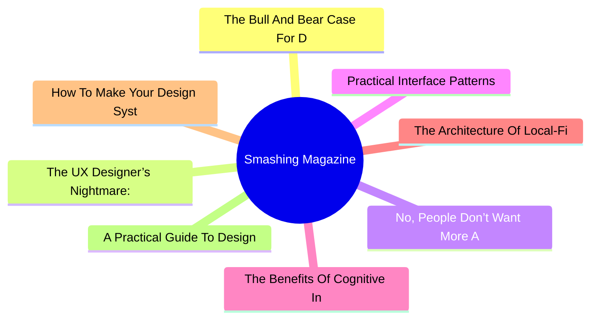
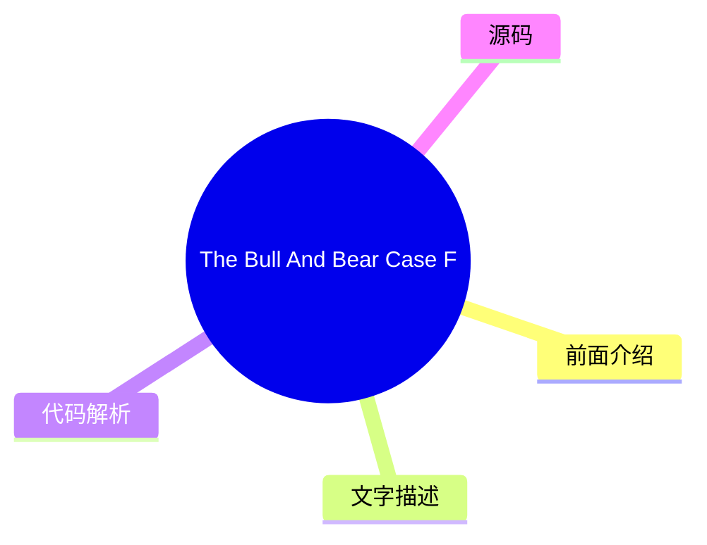
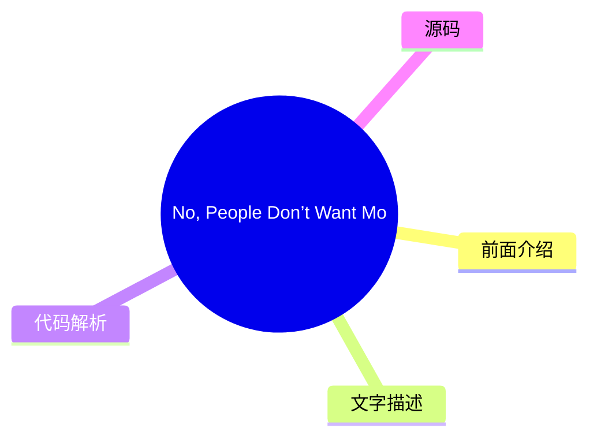
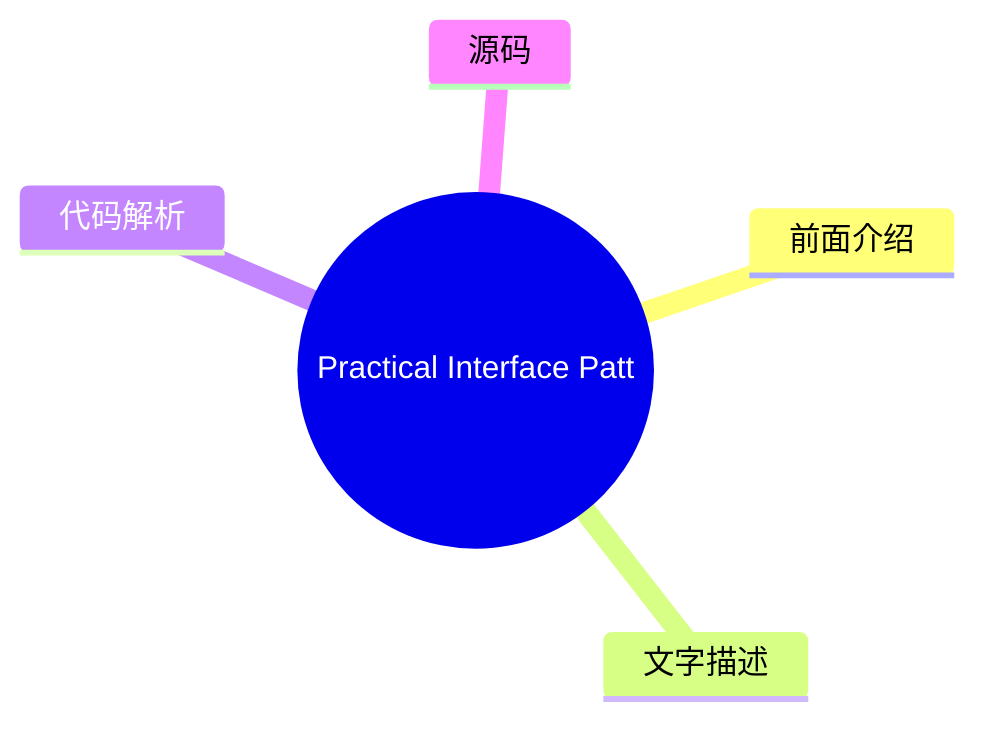
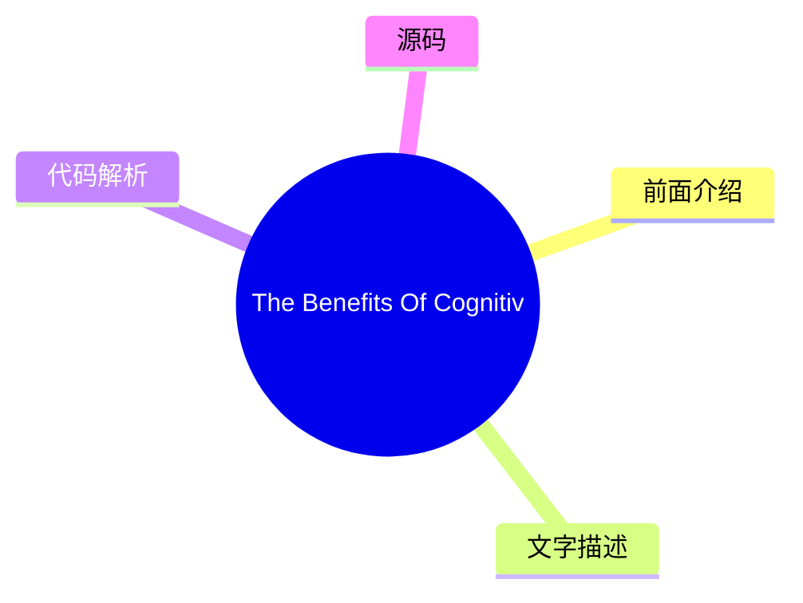
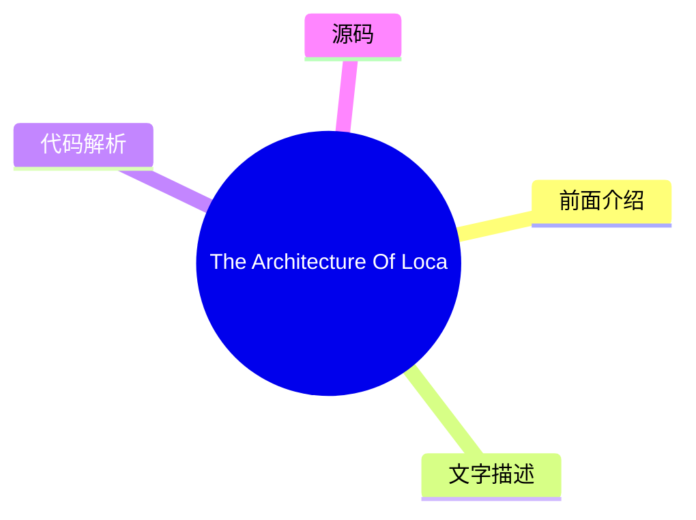
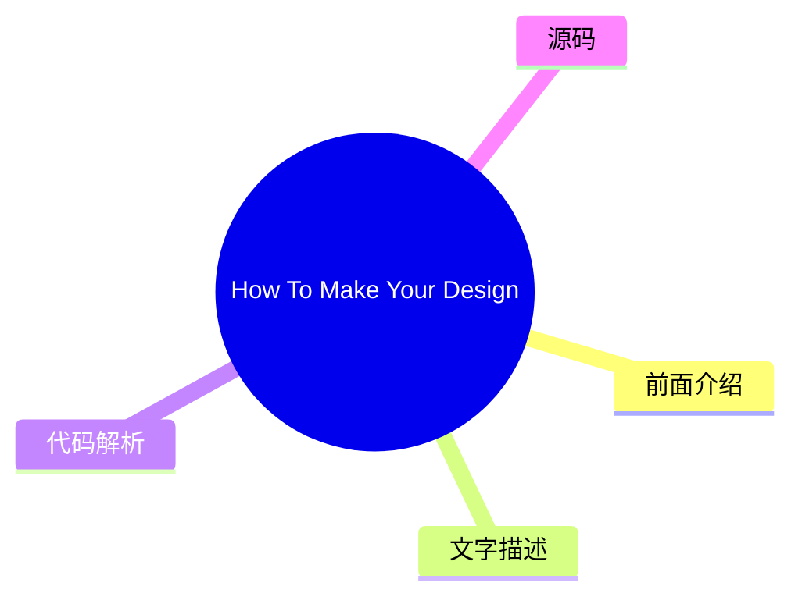
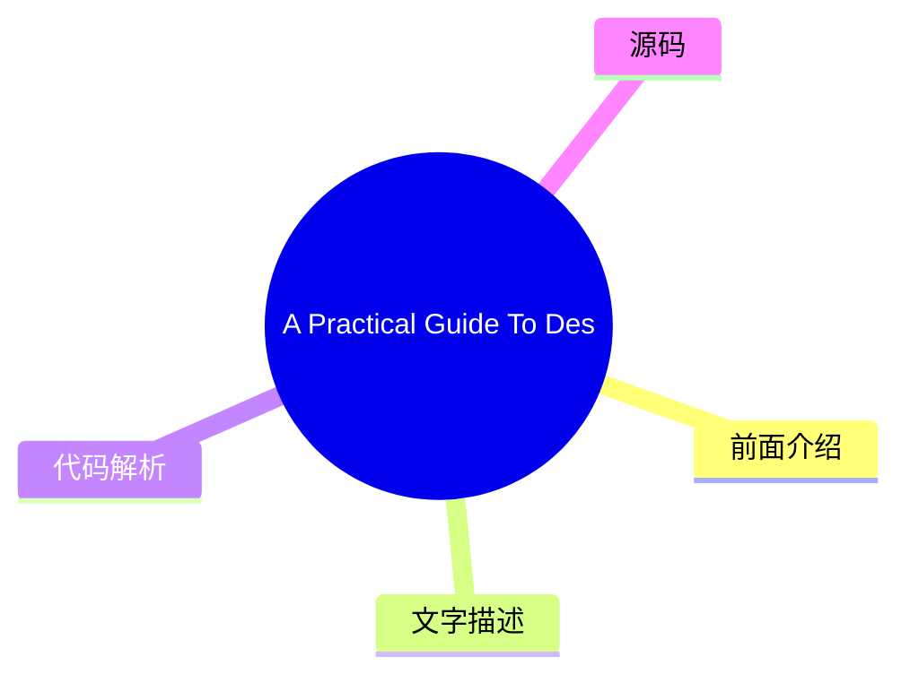

# 🔥 Smashing Magazine Top 8 (2026-07-30)

## 前面介绍

- 数据源：Smashing Magazine
- 抓取日期：2026-07-30
- 条目数：8
- 含完整正文：8
- 含代码片段：1
- 组织方式：前面介绍 / 树状图 / 文字描述 / 代码解析 / 源码

## 思维导图



## 详细整理（8 条，8 条含全文，1 条含代码）

### 1. The Bull And Bear Case For Digital Design In The Age Of AI
- **链接**: [https://smashingmagazine.com/2026/07/bull-and-bear-case-digital-design-age-ai/](https://smashingmagazine.com/2026/07/bull-and-bear-case-digital-design-age-ai/)
- **发布**: Wed, 29 Jul 2026 13:00:00 GMT

#### 前面介绍

- As AI reshapes product design, it could give designers greater autonomy or expose the gaps that autonomy makes harder to hide. Exploring both the bull and bear cases, Andy Budd examines what happens when designers need less permission to act.
- 发布时间：Wed, 29 Jul 2026 13:00:00 GMT

#### 树状图



#### 文字描述

- Designers have spent years saying they would do better work if the organisation got out of the way. Not always in those exact words, obviously. It usually comes out as something more reasonable: we didn’t get enough engineering time, product had already decided the solution, the roadmap was too packed, leadership only cared about this quarter’s numbers, research got cut, the ex
- ## The Bull Case: Designers Need Less Permission A good designer can now move from *“we should fix this”* to *“I fixed this, and pushed it live.”* They can prototype the alternative onboarding flow, write and test clearer product copy, build a rough working version of the interaction, clean up small pieces of design debt without waiting three months for a roadmap slot, and make
- ## The Bear Case: Autonomy Exposes The Gaps Autonomy has teeth. If AI gives designers more room to act, it also removes some of the cover. The same constraints that held good designers back have also protected weaker ones from being tested too directly. For years, it has been easy to say: I had a better idea, but we never got the engineering time. Sometimes that was exactly wha
- ## Where I Think We Might End Up The painful part is that both futures can be true at the same time. AI can make the best designers more capable and many average designers less necessary. It can give design more agency while reducing design headcount. It can help a small number of designers move closer to product leadership while pushing others into governance and clean-up work

#### 代码解析

- 本文未检测到明确代码块，内容更偏新闻、观点或方法论。

#### 源码

#### 中文节选

Designers have spent years saying they would do better work if the organisation got out of the way. Not always in those exact words, obviously. It usually comes out as something more reasonable: we didn’t get enough engineering time, product had already decided the solution, the roadmap was too packed, leadership only cared about this quarter’s numbers, research got cut, the experiment was never run properly, the design debt was known about, but nobody wanted to spend a sprint fixing it.

Much of this is true. Most designers have worked inside that awkward middle space between product and engineering. Product frames the problem, or at least thinks it does. Engineering decides what is feasible, or at least what is affordable. Design is expected to make the thing clearer, simpler, more coherent, more usable, and occasionally more desirable, while also being careful not to disrupt the plan too much.

That position has always been uncomfortable.

Designers are told to think strategically, but often lack the power to act strategically.

They can spot the broken onboarding flow, the confusing upgrade path, the empty state that makes users feel stupid, the feature that looks reasonable in a product review but makes no sense in real use. Seeing the problem is one thing. Getting it fixed is another.

So design often becomes an **argument**. You make the case. You annotate the flow. You bring the research clip. You point to the support tickets. You show the Figma prototype. You explain why the *“small edge case”* is actually the first-run experience for half your new users. Then everyone nods, agrees it matters, and moves on to whatever had already made it onto the roadmap.

This is one reason AI is more interesting for design than the usual *“will it replace designers?”* debate suggests. The real change is not that designers can make more screens. Nobody needs more screens. The interesting change is that designers **may need less permission**.

## The Bull Case: Designers Need Less Permission


一位优秀的设计师现在可以从 *“我们应该修复这个问题”* 转变为 *“我已经修复了这个问题，并将其推上线。”* 他们可以针对替代的引导流程制作原型，编写并测试更清晰的产品文案，构建交互的粗略工作版本，在不等待三个月的路线图空档期的情况下清理零散的设计债务，并让更好的东西变得**足够显眼**，以至于**难以被忽视**。

这改变了工作的政治格局。设计往往依赖于说服，因为设计师缺乏直接的生产手段。AI 削弱了这种依赖性。并非在所有地方，也并非针对所有事情。复杂的产品仍然需要架构、基础设施、数据模型、权限、安全、合规、遗留系统，以及其他所有让软件变得困难的、不那么光鲜的理由。但边界正在移动。

现在，有想法和将想法变为现实之间的差距，可以通过拥有正确工具的、充满动力的设计师跨越。

在这个未来的版本中，设计

#### 完整正文（中文）

Designers have spent years saying they would do better work if the organisation got out of the way. Not always in those exact words, obviously. It usually comes out as something more reasonable: we didn’t get enough engineering time, product had already decided the solution, the roadmap was too packed, leadership only cared about this quarter’s numbers, research got cut, the experiment was never run properly, the design debt was known about, but nobody wanted to spend a sprint fixing it.

Much of this is true. Most designers have worked inside that awkward middle space between product and engineering. Product frames the problem, or at least thinks it does. Engineering decides what is feasible, or at least what is affordable. Design is expected to make the thing clearer, simpler, more coherent, more usable, and occasionally more desirable, while also being careful not to disrupt the plan too much.

That position has always been uncomfortable.

Designers are told to think strategically, but often lack the power to act strategically.

They can spot the broken onboarding flow, the confusing upgrade path, the empty state that makes users feel stupid, the feature that looks reasonable in a product review but makes no sense in real use. Seeing the problem is one thing. Getting it fixed is another.

So design often becomes an **argument**. You make the case. You annotate the flow. You bring the research clip. You point to the support tickets. You show the Figma prototype. You explain why the *“small edge case”* is actually the first-run experience for half your new users. Then everyone nods, agrees it matters, and moves on to whatever had already made it onto the roadmap.

This is one reason AI is more interesting for design than the usual *“will it replace designers?”* debate suggests. The real change is not that designers can make more screens. Nobody needs more screens. The interesting change is that designers **may need less permission**.

## The Bull Case: Designers Need Less Permission


优秀的设计师现在可以从 *“我们应该修复这个问题”* 转变为 *“我已经修复了这个问题，并已上线。”* 他们可以构建替代性引导流程的原型，撰写并测试更清晰的产品文案，制作交互的粗略可用版本，无需等待三个月的路线图排期，就能清理零散的设计债务，并让更好的东西变得**足够显眼**，以至于**难以被忽视**。

这改变了工作的政治生态。设计往往依赖说服，因为设计师缺乏直接的生产手段。AI 削弱了这种依赖性。并非在所有地方，也并非针对所有事物。复杂的产品依然拥有架构、基础设施、数据模型、权限、安全、合规、遗留系统，以及所有其他导致软件难以开发的、不那么光鲜的理由。但边界正在移动。

现在，拥有想法和将想法变为现实之间的差距，可以通过拥有正确工具的积极进取的设计师来跨越。

在这个未来的版本中，设计师变得**不再那么依赖许可**：不再依赖产品经理来认可问题，不再依赖工程师来实现每一个微小的改进，不再受困于内部批评家、品味提供者或 Figma 操作员的角色。他们更能进行制作、测试、修复和发布。

最优秀的设计师开始看起来不太像传统的产品设计师，而更像**混合型产品领导者**。他们依然关心交互、层级、语言、流程、品牌和工艺，但他们也理解问题的商业形态。他们能够做出权衡。他们可以用代码进行原型设计，或者非常接近代码。他们可以利用 AI 快速探索选项，然后运用判断力将其中大部分舍弃。他们可以与创始人或产品经理坐在一起，在一天结束时，将模糊的产品顾虑转化为具体的东西。

这些人可能会变少，但更难被忽视。当前的设计-组织模式在一定程度上是围绕**稀缺性**构建的：稀缺的工程时间、缓慢的生产流程、昂贵的原型制作、专家之间的交接，以及跨团队繁重的协调工作。如果 AI 减少了其中一些稀缺性，它可能会减少围绕这些稀缺性而衍生出的某些角色的需求。乐观的情况并非每个设计师都能保住工作并获得生产力提升。那感觉像是一种一厢情愿的想法。更可信的版本是，设计师的总数会减少，但留下的设计师对产品拥有**更大的直接影响力**。

这对最强的设计师来说并不是一个糟糕的结果。这甚至可能是许多设计师多年来一直渴望的事情。

## 熊市观点：自主性暴露了差距

自主性是有牙齿的。如果 AI 给设计师更多的行动空间，它也会移除一些掩护。那些限制优秀设计师发挥的约束条件，同时也保护了较弱的设计师免受过于直接的考验。

多年来，人们很容易说：我有一个更好的想法，但我们从未获得过工程时间。有时情况确实如此。有时更好的想法从未真正超越仅仅是一个批评。它没有被具体化。它没有被测试。它没有处理那些尴尬的权衡取舍。它听起来很有力，因为它安全地存在于已发布事物的对立面。

许多设计师擅长发现哪里出了问题。擅长决定应该发生什么的人较少。而能将这种替代方案变得足够具体以便他人评判的人就更少了。AI 将暴露出这一差距。

如果你能制作出推荐的原型，那么这个推荐就必须变得更好。如果你能让替代方案流畅运行，那么这个流程就必须经得起细节的考验。如果你能测试产品文案，你就必须关心用户阅读时会发生什么。如果你能修复那块小的设计债务，你就必须决定它是否真的值得修复。

Some designers are not as strategic as they think they are. They have learned the language of strategy without the discomfort of **owning outcomes**. They can talk about user needs, business goals, systems thinking, and product quality, but struggle when asked to make a call. They want influence, but not the **exposure** that comes with it.

The profession has spent a long time arguing that design deserves more power. Fine. But more power means fewer excuses. It means the work is judged less by the elegance of the argument and more by the quality of the thing you made, tested, or changed. That is a better standard, but it will not be kind to everyone.

There is a second bear case, and it is probably the one large design teams should worry about most. Product and engineering already have more institutional power than design in most companies. They own the roadmap, the technical architecture, the sprint machinery, the metrics, and usually the language leadership understands. Design often has to translate its concerns into someone else’s terms before they count.

AI may not rebalance that power. It may hand product and engineering enough **design capability** to make design easier to bypass. A PM who can generate a decent flow, decent copy, and a decent prototype may not feel the same need to involve design early. An engineer who can use AI to produce a reasonable interface may decide the design system covers enough of the decision-making. A founder who can get to a polished demo in an afternoon may confuse polish with product thinking.

The problem is not that these people will suddenly become great designers. The problem is that many companies do not know the difference between great design and plausible design. **Plausible design is dangerous.** It looks coherent in a product review. It uses the right components. The spacing is fine. The copy is not embarrassing. The flow mostly works. Nobody in the meeting feels strongly enough to object. So it ships.


A lot of bad product decisions already survive because they look plausible. AI will produce more of them. This is where design could lose ground quickly: not because taste, judgment, research, and interaction thinking stop mattering, but because the visible outputs of design become easier for other functions to imitate.

If a company already thinks design is mostly screens, prototypes, and polish, AI gives it a cheaper way to get those things.

In that world, design does not gain more agency. It gets narrowed. The remaining designers manage the design system, police component usage, review flows that have already been decided, tidy the interface, maintain brand consistency, and get pulled into high-stakes launches, executive demos, and the occasional messy cross-platform problem. Useful work, but a smaller surface area. Less shaping the product, more maintaining the furniture.

This is why the *“AI will automate the boring 20%”* argument feels too comforting. In some companies, perhaps that is what happens. But in large tech organisations, where design teams grew around coordination, production and process, the cut could be much deeper. Not 20%. Maybe 50%. Maybe more. Especially in places where leadership never really understood why the design team had grown so large in the first place.

## Where I Think We Might End Up

The painful part is that both futures can be true at the same time. AI can make the best designers more capable and many average designers less necessary. It can give design more agency while reducing design headcount. It can help a small number of designers move closer to product leadership while pushing others into governance and clean-up work. It can free designers from waiting for permission, then reveal that some were more comfortable waiting than acting.

“


他们将拥有品味，但品味是不够的。他们需要**产品判断力**、**技术好奇心**、**商业意识**，以及在每一个变量都确定之前做出决策的**胆识**。他们需要能够自如地在客户对话、原型、定价问题、品牌疑问和混乱的实现细节之间切换，而无需坚持认为所有这些都属于别人。

我不完全确定我们会走向何方。我希望它更接近于*利好情形*：更少的权限结构，更多的创造，更多的自主权，以及更好的设计师终于能够展示他们的能力，而不受周围机器的掣肘。

我担心它可能更接近于*利空情形*：产品和工程吸纳了大部分工作，公司认为看似合理的设计就足够好了，设计失去了地位、人员编制和战略阵地。

实际上，它可能只是两者的某种令人不适的混合体。一些设计师将利用 AI 获得更多的自主权。一些公司将利用它来减少对设计师的需求。一些团队将产出更好的作品，因为判断与执行之间的距离缩短了。另一些团队将交付更多看似平庸的作品，因为房间里没有人能分辨出其中的差别。

多年来，设计师一直声称，如果不受周围组织的束缚，他们可以创造更多的价值。AI 即将检验这一说法。有些人将最终证明这一点。有些人会发现，这些束缚其实是在帮他们的忙。

### 更多资源

- “[Good from Afar, But Far from Good: AI Prototyping in Real Design Contexts](https://www.nngroup.com/articles/ai-prototyping/)，” Huei-Hsin Wang 和 Megan Brown*(NN/Group)*
 最近，UX 设计领域充斥着各种由 AI 驱动的原型工具，它们能从自然语言提示中即时生成界面。尽管营销炒作巨大，但这项针对真实设计场景的评估显示，虽然这些工具可以遵循指令以实现一般目标，但它们往往缺乏权衡设计取舍的精细度，也无法在没有人类广泛指导的情况下产出深思熟虑的高质量设计。

- “[AI Design Tools Are Marginally Better: Status Update](https://www.nngroup.com/articles/ai-design-tools-update-2/?lm=ai-prototyping&pt=article),” Megan Brown, Caleb Sponheim and Taylor Dykes*(NN/Group)*
 AI-powered design tools have improved, but we’re stil

...（截断，原文 12457+ 字符）


### 2. The UX Designer’s Nightmare: When “Production-Ready” Becomes A Design Deliverable
- **链接**: [https://smashingmagazine.com/2026/04/production-ready-becomes-design-deliverable-ux/](https://smashingmagazine.com/2026/04/production-ready-becomes-design-deliverable-ux/)
- **发布**: Wed, 22 Apr 2026 10:00:00 GMT

#### 前面介绍

- In a rush to embrace AI, the industry is redefining what it means to be a UX designer, blurring the line between design and engineering. Carrie Webster explores what’s gained, what’s lost, and why designers need to remain the guardians of the user ex
- 发布时间：Wed, 22 Apr 2026 10:00:00 GMT

#### 树状图


#### 文字描述

- In early 2026, I noticed that the UX designer’s toolkit seemed to shift overnight. The industry standard *“Should designers code?”* debate was abruptly settled by the market, not through a consensus of our craft, but through the brute force of job requirements. If you browse LinkedIn today, you’ll notice a stark change: UX roles increasingly demand ** AI-augmented development**
- ## The LinkedIn Pressure Cooker: Role Creep In 2026 The job market is sending a clear signal. While traditional graphic design roles are expected to grow by only **3%** through 2034, UX, UI, and [Product Design roles](https://www.nobledesktop.com/careers/designer/job-outlook#:~:text=The%20projected%20future%20growth%20figures%20for%20Digital,job%20growth%20(which%20lies%20somew
- ### The Competence Trap: Two Job Skill Sets, One Average Result There is potentially a very dangerous myth circulating in boardrooms that AI makes a designer “equal” to an engineer. This narrative suggests that because an LLM can generate a functional JavaScript event handler, the person prompting it doesn’t need to understand the underlying logic. In reality, attempting to mas
- ### The “Averagely Competent” Dilemma For a senior UX designer to become a senior-level coder is like asking a master chef to also be a master plumber because “they both work in the kitchen.” You might get the water running, but you won’t know why the pipes are rattling. - **The “cognitive offloading” risk.** Research shows that while AI can speed up task completion, it often l

#### 代码解析

- 本文未检测到明确代码块，内容更偏新闻、观点或方法论。

#### 源码

#### 中文节选

In early 2026, I noticed that the UX designer’s toolkit seemed to shift overnight. The industry standard *“Should designers code?”* debate was abruptly settled by the market, not through a consensus of our craft, but through the brute force of job requirements. If you browse LinkedIn today, you’ll notice a stark change: UX roles increasingly demand ** AI-augmented development**, 

**technical orchestration,**and

**production-ready prototyping.**

For many, including myself, this is the ultimate design job nightmare. We are being asked to deliver both the “vibe” and the “code” simultaneously, using AI agents to bridge a technical gap that previously took years of computer science knowledge and coding experience to cross. But as the industry rushes to meet these new expectations, they are discovering that AI-generated functional code is not always *good* code.

## The LinkedIn Pressure Cooker: Role Creep In 2026

The job market is sending a clear signal. While traditional graphic design roles are expected to grow by only **3%** through 2034, UX, UI, and [Product Design roles](https://www.nobledesktop.com/careers/designer/job-outlook#:~:text=The%20projected%20future%20growth%20figures%20for%20Digital,job%20growth%20(which%20lies%20somewhere%20around%205%25).) are projected to grow by **16%** over the same period.

However, this growth is increasingly tied to the rise of **AI product development**, where “design skills” have recently become the #1 most in-demand capability, even ahead of coding and cloud infrastructure. Companies building these platforms are no longer just looking for visual designers; they need professionals who can “[translate technical capability into human-centered experiences](https://humbldesign.io/blog-posts/will-ai-replace-designers-2026).”


This creates a high-stakes environment for the UX designer. We are no longer just responsible for the interface; we are expected to understand the technical logic well enough to ensure that complex AI capabilities feel intuitive, safe, and useful for the human on the other side of the screen. Designers are being pushed toward a **“design engineer” model**, where we must bridge the gap between abstract [AI logic and user-facing code](https://www.refontelearning.com/blog/ui-ux-designer-engineering-in-2026-crafting-future-ready-user-experiences#skills-and-competencies-for-the-2026-uiux-designer-3).

A [recent survey](https://www.lyssna.com/blog/ux-design-trends/) found that **73% of designers** now view AI as a primary collaborator rather than just a tool. However, this “collaboration” often looks like “role creep.” Recruiters are often not just looking for someone who understands user empathy and information architecture — they want someone who can also prompt a React component into existence and push it to a repository!

This shift has created a **competency gap**.

As an experienced senior designer who has spent decades mastering the nuances of cognitive load, accessibility standards, an

#### 完整正文（中文）

In early 2026, I noticed that the UX designer’s toolkit seemed to shift overnight. The industry standard *“Should designers code?”* debate was abruptly settled by the market, not through a consensus of our craft, but through the brute force of job requirements. If you browse LinkedIn today, you’ll notice a stark change: UX roles increasingly demand ** AI-augmented development**, 

**technical orchestration,**and

**production-ready prototyping.**

For many, including myself, this is the ultimate design job nightmare. We are being asked to deliver both the “vibe” and the “code” simultaneously, using AI agents to bridge a technical gap that previously took years of computer science knowledge and coding experience to cross. But as the industry rushes to meet these new expectations, they are discovering that AI-generated functional code is not always *good* code.

## The LinkedIn Pressure Cooker: Role Creep In 2026

The job market is sending a clear signal. While traditional graphic design roles are expected to grow by only **3%** through 2034, UX, UI, and [Product Design roles](https://www.nobledesktop.com/careers/designer/job-outlook#:~:text=The%20projected%20future%20growth%20figures%20for%20Digital,job%20growth%20(which%20lies%20somewhere%20around%205%25).) are projected to grow by **16%** over the same period.

However, this growth is increasingly tied to the rise of **AI product development**, where “design skills” have recently become the #1 most in-demand capability, even ahead of coding and cloud infrastructure. Companies building these platforms are no longer just looking for visual designers; they need professionals who can “[translate technical capability into human-centered experiences](https://humbldesign.io/blog-posts/will-ai-replace-designers-2026).”


This creates a high-stakes environment for the UX designer. We are no longer just responsible for the interface; we are expected to understand the technical logic well enough to ensure that complex AI capabilities feel intuitive, safe, and useful for the human on the other side of the screen. Designers are being pushed toward a **“design engineer” model**, where we must bridge the gap between abstract [AI logic and user-facing code](https://www.refontelearning.com/blog/ui-ux-designer-engineering-in-2026-crafting-future-ready-user-experiences#skills-and-competencies-for-the-2026-uiux-designer-3).

A [recent survey](https://www.lyssna.com/blog/ux-design-trends/) found that **73% of designers** now view AI as a primary collaborator rather than just a tool. However, this “collaboration” often looks like “role creep.” Recruiters are often not just looking for someone who understands user empathy and information architecture — they want someone who can also prompt a React component into existence and push it to a repository!

This shift has created a **competency gap**.

As an experienced senior designer who has spent decades mastering the nuances of cognitive load, accessibility standards, and ethnographic research, I am suddenly finding myself being judged on my ability to debug a CSS Flexbox issue or manage a Git branch.

The nightmare isn’t the technology itself. It’s the **reallocation of value**.

“

### The Competence Trap: Two Job Skill Sets, One Average Result

There is potentially a very dangerous myth circulating in boardrooms that AI makes a designer “equal” to an engineer. This narrative suggests that because an LLM can generate a functional JavaScript event handler, the person prompting it doesn’t need to understand the underlying logic. In reality, attempting to master two disparate, deep fields simultaneously will most likely lead to being **averagely competent** at both.

### The “Averagely Competent” Dilemma

For a senior UX designer to become a senior-level coder is like asking a master chef to also be a master plumber because “they both work in the kitchen.” You might get the water running, but you won’t know why the pipes are rattling.


- **“认知卸载”风险。**
 研究表明，虽然 AI 可以加快任务完成速度，但它往往会导致概念掌握能力的显著下降。在一项受控研究中，使用 AI 辅助的参与者在理解测试中的得分比那些手动编写代码的参与者低 [17%](https://www.psychologytoday.com/au/blog/the-asymmetric-brain/202602/cognitive-offloading-using-ai-reduces-new-skill-formation)。
- **调试差距。**
 AI 依赖型用户和手动编码人员之间最大的性能差距在于 [调试](https://www.anthropic.com/research/AI-assistance-coding-skills)。当设计师使用 AI 编写他们不完全理解的代码时，他们没有能力识别 *何时* 以及 *为何* 它会失败。

因此，如果设计师发布了一个在流量高峰期间崩溃且无法手动追踪逻辑的 AI 生成组件，他们就不再是专家。他们现在成了一个隐患。

### 未优化代码的高昂代价

任何有经验的代码工程师都会告诉你，如果没有正确的提示词，使用 AI 创建代码会导致大量的返工。由于大多数设计师缺乏审计 AI 给出的代码的技术基础，他们无意中发送了大量 [“质量债务”](https://gocrossbridge.com/blog/ai-generated-code/)。

## 设计师生成 AI 代码中的常见问题

- **安全漏洞**
 近期报告显示，高达 [92% 的 AI 生成代码库](https://www.sherlockforensics.com/pages/ai-code-security-report-2026.html)包含至少一个关键漏洞。设计师可能看到一个功能正常的登录表单，却不知道它在 XSS 防御方面的失败率高达 86%，XSS 防御是旨在防止攻击者将恶意脚本注入到受信任网站的安全措施。
- **可访问性错觉**

 AI often generates “functional” applications that lack semantic integrity. A designer might prompt a “beautiful and functional toggle switch,” but the AI may provide a non-semantic- `<div>`that lacks keyboard focus and screen-reader compatibility, creating- [Accessibility Debt](https://www.levelaccess.com/blog/accessibility-debt-in-software-development-and-how-to-engineer-it-out/)that is expensive to fix later.
- **The performance penalty**
 AI-generated code tends to be verbose. AI is linked to- [4x more code duplication](https://www.netcorpsoftwaredevelopment.com/blog/ai-generated-code-statistics)than human-written code. This verbosity slows down page loads, creates massive CSS files, and negatively impacts SEO. To a business, the task looks “done.” To a user with a slow connection or a screen reader, the site is a nightmare.

## Creating More Work, Not Less

The promise of AI was that designers could ship features without bothering the engineers. The reality has been the birth of a **“Rework Tax”** that is draining engineering resources across the industry.

- **Cleaning up**
 Organisations are finding that while velocity increases, incidents per Pull Request are also rising by- [23.5%](https://blog.exceeds.ai/ai-code-analysis-benchmark-reports/). Some engineering teams now spend a significant portion of their week cleaning up “AI slop” delivered by design teams who skipped a rigorous review process.
- **The communication gap**
 Only- [69% of designers](https://www.lyssna.com/blog/ux-design-trends/)feel AI improves the quality of their work, compared to- **82% of developers**. This gap exists because “code that compiles” is not the same as “code that is maintainable.”

When a designer hands off AI-generated code that ignores a company’s internal naming conventions or management patterns, they aren’t helping the engineer; they are creating a puzzle that someone else has to solve later.

### The Solution

We need to move away from the nightmare of the “**Solo Full-Stack Designer**” and toward a model of **designer/coder collaboration**.

**The ideal reality:**

- **The Partnership**

与其让设计师试图成为平庸的程序员，他们应该参与 **人机协作循环**。资深 UX 设计师应与工程师合作使用 AI；设计师为 **意图、无障碍性和用户流程** 创建提示词，而工程师为 **架构和性能** 创建提示词。

- **将设计系统作为护栏**
 为了防止无障碍债务大规模蔓延，[无障碍组件必须是设计系统的默认设置](https://webaim.org/projects/million/)。AI 应用于将这些标记输入到您的 UI 中，确保生成的代码也保持在“真理之源”的范围内。

## 超越提示词

目前行业处于“AI 迷恋”状态，但钟摆最终会回归质量。

“
那些在没有工程监督的情况下优先考虑“设计师交付代码”的企业，最终将面临技术债务、安全漏洞和无障碍诉讼的清算。在 2026 年及以后蓬勃发展起来的设计师将是那些拒绝成为“提示词操作员”，而是将自己定位为 **用户体验守护者** 的人。这对经验丰富的设计师和行业来说都是完美的结果。

我们的价值一直在于我们能够为屏幕另一端的人进行倡导。我们必须利用 AI 来增强我们的设计思维，使我们能够测试更多想法并迭代得更快，但我们绝不能让它取代确保我们的设计在技术上对每个人都能 *正常工作* 的专业工程专业知识。

### UX 设计师总结清单

- **共同协作。**
 将 AI 生成的代码作为起点，与您的开发者进行沟通。不要将其作为跳过与他们合作的捷径。请他们帮助您为代码创建编写提示词，以获得最佳结果。
- **理解“原因”。**
 永远不要提交您不理解代码。如果您无法解释 AI 生成的逻辑是如何工作的，就不要将其包含在您的工作中。
- **为所有人设计。**
 好的设计不仅仅是外观。使用 AI 检查您的代码是否适用于使用屏幕阅读器或键盘的人，而不仅仅是让事物看起来漂亮。


### 3. No, People Don’t Want More AI In Their Life
- **链接**: [https://smashingmagazine.com/2026/07/people-dont-want-more-ai/](https://smashingmagazine.com/2026/07/people-dont-want-more-ai/)
- **发布**: Wed, 15 Jul 2026 10:00:00 GMT

#### 前面介绍

- Many companies assume everyone craves new AI features. But the reality is that most people don't want more AI &mdash; at least not in the way most AI leaders envision it. Brought to you by Design Patterns For AI Interfaces, **friendly video courses o
- 发布时间：Wed, 15 Jul 2026 10:00:00 GMT

#### 树状图



#### 文字描述

- Many companies silently assume that everybody wants more AI in their lives. That people are **craving new AI features**, new AI products, new AI workflows — that would all magically replace all existing outdated practices and broken ways of working. But in reality, it seems like **people don’t want more AI** at all — at least not in the way most AI leaders envision it. Unsurpri
- ## The AI People Don’t Need It’s remarkably difficult to make a strong argument with senior leadership, but [AI is not a value proposition](https://www.nngroup.com/articles/powered-by-ai-is-not-a-value-proposition/). New AI features don’t magically make for happy or excited customers. Because AI features are often bolt-ons and separate tools for employees to use, they typically
- ## The AI People Actually Need I’m always puzzled by the comparison of AI features with how unreliable humans are. But people don’t compare software with other people. They **compare features with features** — and if one feature in one product is unreliable, while a similar feature works flawlessly in another, they choose the latter. It’s not about AI or not AI, but rather what
- ## Wrapping Up Perhaps I’m missing a bigger picture, and perhaps I’m just old school — but **I really do like people**. Their stories, their thinking, their emotions, their enthusiasm, their laughing. AI can be remarkably helpful in many situations, but so are people. And between the two, I would favor **spending time with a human** — however imperfect they are — every single t

#### 代码解析

- 本文未检测到明确代码块，内容更偏新闻、观点或方法论。

#### 源码

#### 中文节选

Many companies silently assume that everybody wants more AI in their lives. That people are **craving new AI features**, new AI products, new AI workflows — that would all magically replace all existing outdated practices and broken ways of working.

But in reality, it seems like **people don’t want more AI** at all — at least not in the way most AI leaders envision it. Unsurprisingly, many AI features have [low adoption and retention](https://www.mindstudio.ai/blog/ai-adoption-gap-ibm-2026-study) — at a very high cost of delivery, and a high risk of reputation damage.

## The AI People Don’t Need

It’s remarkably difficult to make a strong argument with senior leadership, but [AI is not a value proposition](https://www.nngroup.com/articles/powered-by-ai-is-not-a-value-proposition/). New AI features don’t magically make for happy or excited customers. Because AI features are often bolt-ons and separate tools for employees to use, they typically **take people out** of their regular way of working.

AI is pretty good at **amplifying shortcuts and shortcomings** in organizations — from data quality to decision making. It can’t magically fix years of accumulated quick patches, technical debt, broken culture and internal politics. If anything, they become more visible with AI as inconsistencies or conflicting priorities and get handed directly to users, who are then left to make sense of the mess themselves.

Because in most organizations, work typically requires hopping on and off between plenty of disconnected and fragmented systems, with a new AI tool, they now have yet another system that they also need to hop on and off. Often it produces more work, and typically it’s not particularly rewarding work either.

On top of that, people are very much aware of the [cost of finding and fixing AI hallucinations](https://www.nngroup.com/articles/ai-chatbots-discourage-error-checking/). Asking AI to generate a response **might feel easier** than writing from scratch, but it has a cost:

- **Skim through**the entire AI output,
- **Spot key points**to focus attention on,
- **Review/verify key points**, one-by-one,
- **Check rationale**for what follows next,

- **纠正表述**+ 重新生成，
- **审查回复**(多次)。

对许多人来说，AI 并非他们可以主动选择和探索的东西——它不请自来，按照别人的节奏到来。此外，大量信息都在放大**对 AI 取代工作的恐惧和担忧**——因此，人们对 AI 的感知并非兴奋。而是**对变革的抗拒**以及对自身在世界中地位的深深焦虑，这个世界似乎正在发生改变，而他们却被排除在外。

在最好的情况下，AI 功能可能只是被默默接受或敷衍了事。在最坏的情况下，AI 会**引发担忧、怀疑、谨慎**——并呼吁保持健康的怀疑态度。有时它被视为威胁或**责任**——因为与其他功能不同，AI 既不可预测也不可靠。

人们并不梦想着

#### 完整正文（中文）

许多公司默默假设每个人都想在生活中拥有更多 AI。人们渴望新的 AI 功能、新的 AI 产品、新的 AI 工作流——这些都能神奇地取代所有现有的过时做法和糟糕的工作方式。

但在现实中，似乎人们根本不需要更多 AI——至少不是大多数 AI 领导者设想的那种方式。毫不意外，许多 AI 功能的[采用率和留存率很低](https://www.mindstudio.ai/blog/ai-adoption-gap-ibm-2026-study)——在极高的交付成本和极高的声誉损害风险下。

## 人们不需要的 AI

很难向高级管理层提出强有力的论据，但 [AI 不是价值主张](https://www.nngroup.com/articles/powered-by-ai-is-not-a-value-proposition/)。新的 AI 功能并不会神奇地让客户感到快乐或兴奋。由于 AI 功能通常是附加项和员工使用的独立工具，它们通常会**把人从**他们常规的工作方式中**剥离**出来。

AI 非常擅长**放大组织中的捷径和缺陷**——从数据质量到决策制定。它无法神奇地修复多年积累的快速补丁、技术债务、糟糕的文化和内部政治。如果有任何作用，随着不一致或冲突的优先级变得可见，AI 会将这些直接交给用户，然后让用户自己去理清这些混乱。

因为在大多数组织中，工作通常需要在大量不连贯和碎片化的系统之间频繁切换，有了新的 AI 工具，他们现在又多了一个需要切换的系统。这通常会产生更多工作，而且通常也不是特别有回报的工作。

除此之外，人们非常清楚[查找和修复 AI 幻觉的成本](https://www.nngroup.com/articles/ai-chatbots-discourage-error-checking/)。要求 AI 生成回应**可能感觉比从零开始编写更容易**，但这是有代价的：

- **浏览**整个 AI 输出，
- **发现**需要重点关注的关键点，
- **逐一审查/验证**关键点，
- **检查**后续内容的**理由**。

- **Articulate corrections**+ regenerate,
- **Review the response**(a number of times).

For many people, AI isn’t something they can proactively choose and explore on their own — it arrives uninvited, at someone else’s pace. On top of that, plenty of messages amplify **fears and worries about AI** replacing work — so it’s hardly surprising that the perception of AI isn’t excitement. It’s **resistance to change** and deep anxiety about one’s place in a world that seems to be changing without them.

At best, AI features might be silently accepted or nodded away. At worst, AI **raises concerns**, doubts, caution — and calls for a healthy dose of skepticism. And sometimes it’s perceived as a threat or **liability** — because unlike other features, AI is neither predictable nor reliable.

People don’t dream of **AI art museums** or AI fridges or AI hotel reception or AI-narrated children’s books. They don’t want their children to have **romantic AI partners**. Most people don’t want to actively manage (and clean up after) a **swarm of AI agents** roaming in their bank accounts and acting on their behalf in the real world. And most notably, people don’t really want a magical box to speak to or type into all the time.

## The AI People Actually Need

I’m always puzzled by the comparison of AI features with how unreliable humans are. But people don’t compare software with other people. They **compare features with features** — and if one feature in one product is unreliable, while a similar feature works flawlessly in another, they choose the latter. It’s not about AI or not AI, but rather what works consistently and reliably, and what doesn’t.

Many conversations about AI are conversations about the speed of delivery. But to many people, there is little value in increasing the speed of delivery. They want to do things well, with enough time to think and make good decisions. They also want to **enjoy the time they spend working on things**, rather than just ship faster. There is an enormous feeling of reward and achievement that slowly disappears, one vibe-coded change at a time.


人们很少改变。在这么多年过去后，他们（仍然）想要的是每一次都**快速、易用、可靠、可预测且有用**的功能。理想情况下，这些功能不应取代他们整个工作流程，而应**增强**他们的工作方式——接管那些他们觉得枯燥、恼人且无聊的任务，而这些任务是他们从中找不到乐趣的。

许多工作[暴露于 AI 自动化](https://www.washingtonpost.com/technology/interactive/2026/jobs-most-affected-ai-automation/)之下，但在其中许多工作中，仍有一部分是具有回报的、独特的、富有创造性的，需要品味、观点，甚至人类直觉。如果 AI **自动化了其中的枯燥部分**，这对每个人来说都是一种优势。这也是提高生产力并为日常生活带来更多乐趣的原因所在。

当 AI 自动化那些繁琐且消耗精力的任务时，它的价值更容易被理解。但要做到这一点，AI 不应感觉像是一个附加组件。它应该**深度集成**到人们现有的工作流程中。它还必须与人们多年来开发和微调的现有**心智模型**相匹配。AI 应该适应人们的思维和决策方式，而不是反过来。

这些功能被标记为“AI”、“智能”或“自动化”并不重要。然而，它们必须对使用它们的人有效。这意味着人们必须**了解实际能帮助他们用例**，并受到启发去自己发现更多用例。

具有讽刺意味的是，在这些方面表现良好的工具并不是“AI 优先”的——它们是**“AI 次之”**的。它们微妙、谦逊、冷静、无处不在，在背景中扮演支持性的角色，让原本极其枯燥且不必要的任务变得轻松。

我不想读 AI 写的书。我不想看 AI 画的画。我不想让 AI 教我的孩子。我不想有 AI 治疗师。我不想让 AI 做我的医疗决定。我想让 AI 做所有让我感到疲惫的**体力和脑力劳动**，这样我就可以阅读人类写的书，去美术馆欣赏人类创作的艺术。我想让 AI 让我的生活更轻松，而不是强迫我改变自己。

—[Bo Young Lee](https://www.linkedin.com/feed/update/urn:li:share:7467162929474420737/)

## 总结

也许是我忽略了更大的图景，又或许我只是老派——但我**真的很喜欢人**。他们的故事、他们的想法、他们的情感、他们的热情、他们的笑声。AI 在许多情况下都非常有帮助，但人也一样。在这两者之间，我每次都会选择**与人类共度时光**——无论他们多么不完美。

不，**人们不需要在他们的生活中有更多的 AI**——他们需要 AI 来自动化他们每天必须处理的枯燥事情，这样他们就有更多的时间和空间去做他们真正热爱和享受的事情。这并不意味着花更多的时间与 AI 在一起——而是花更多的时间与他们爱的人在一起。

## 认识“AI 界面设计模式”

认识 [Design Patterns For AI Interfaces](https://ai-design-patterns.com/)，这是 Vitaly 的新

**视频课程**，包含来自真实产品的实用示例——并即将举办

[live UX 培训](https://smashingconf.com/online-workshops/workshops/ai-interfaces-vitaly-friedman/)。

[跳转到免费预览](https://www.youtube.com/watch?v=jhZ3el3n-u0)。

## 有用的资源

- [AI 采用差距：IBM 2026 研究](https://www.mindstudio.ai/blog/ai-adoption-gap-ibm-2026-study)，作者 MindStudio
- [Powered by AI 不是价值主张](https://www.nngroup.com/articles/powered-by-ai-is-not-a-value-proposition/)，作者 Nielsen Norman Group
- [AI 聊天机器人会阻碍错误检查](https://www.nngroup.com/articles/ai-chatbots-discourage-error-checking/)，作者 Nielsen Norman Group
- [受 AI 自动化影响最大的工作](https://www.washingtonpost.com/technology/interactive/2026/jobs-most-affected-ai-automation/)，作者 The Washington Post
- [关于 AI 以及我们实际上对它的期望](https://www.linkedin.com/feed/update/urn:li:share:7467162929474420737/)，作者 Bo Young Lee


### 4. Practical Interface Patterns For AI Transparency (Part 2)
- **链接**: [https://smashingmagazine.com/2026/05/practical-interface-patterns-ai-transparency/](https://smashingmagazine.com/2026/05/practical-interface-patterns-ai-transparency/)
- **发布**: Wed, 13 May 2026 13:00:00 GMT

#### 前面介绍

- Why traditional loading patterns like spinners fail in agentic AI experiences, and how interface patterns that reveal the system’s process, status, and decision-making can improve transparency and build user trust.
- 发布时间：Wed, 13 May 2026 13:00:00 GMT

#### 树状图



#### 文字描述

- In the [first part of this series](https://www.smashingmagazine.com/2026/04/identifying-necessary-transparency-moments-agentic-ai-part1/), we talked about the **Decision Node Audit**. We mapped out the internal workings of our AI system to pinpoint the exact moments it makes decisions based on probabilities. This told us when the system needs to be transparent with the user. No
- ## Writing Clear Status Updates We often think of transparency as a visual design problem, but it’s really about the **words** we use. Simple, clear explanations (the microcopy) are what build trust and separate a reliable AI from one that feels broken. We need to retire generic placeholders like *Loading* or *Working*. These words are remnants of the era of static software. In
- ## The Agentic Update Formula To give people useful status updates, we need to connect what the system is *doing* with *why* it’s doing it. Keeping with our scheduling agent example, the system should break down that waiting period into at least four clear, separate steps. - First, the interface displays *Checking your calendar to find open times for a recurring Thursday call w
- ## Matching Tone to the Risk Matrix Should an AI sound like a person or act like a robot? The right answer depends on the task’s importance, which we can figure out using the **Impact/Risk Matrix** from our **Decision Node Audit**. For simple, low-risk tasks, a friendly, conversational tone works best. For example, a scheduling assistant can say it’s checking your calendar for 

#### 代码解析

- 本文未检测到明确代码块，内容更偏新闻、观点或方法论。

#### 源码

#### 中文节选

在本文系列的第一部分中，我们讨论了**决策节点审计**。我们梳理了 AI 系统的内部运作机制，以精确定位其基于概率做出决策的确切时刻。这让我们知道了系统需要在何时向用户保持透明。现在，关键问题在于*如何*分享这些信息。

你已经准备好了**透明度矩阵**。你知道哪些后台 API 调用需要显示状态更新。你的工程师也认同技术层面的细节。接下来的步骤是为这些更新设计视觉容器。

我们面临着一个遗留问题。三十年来，界面设计师一直依赖一种单一的模式来处理延迟：**旋转图标**。旋转的圆圈、闪烁器、进度条。这些模式传达了一种特定的技术现实。它们告诉用户系统正在检索数据。延迟是由带宽或文件大小引起的。

AI 代理引入了一种新的等待时间。当代理暂停二十秒时，它不仅仅是在下载某物；它是在*思考*。它正在确定最佳步骤，权衡选项，并为你请求的内容进行创作。

如果我们用基本的旋转图标来表示这种“思考时间”，用户会感到困惑和焦虑。他们看着循环动画，无法判断系统是卡住了还是崩溃了。他们不知道代理是在处理一个非常复杂的任务，还是仅仅失败了。

为了建立用户信任，我们需要将这段等待时间转化为一个**安抚时刻**。与其被动地表示“正在发生某事”，我们需要传达一种主动的“这正是我正在努力解决您问题的具体方式”。

## 编写清晰的状态更新

我们常将透明度视为一个视觉设计问题，但实际上它关乎我们使用的**文字**。简单、清晰的解释（微文案）才是建立信任、区分可靠 AI 与感觉像故障的 AI 的关键。

We need to retire generic placeholders like *Loading* or *Working*. These words are remnants of the era of static software. Instead, we must construct our status updates using a specific formula that mirrors the agency of the system. Let’s stop using vague words like “Loading” or “Working.” Those terms belong to the past, when software was simple and static. Instead, we should create status updates that clearly tell the user what the system is *actually doing* and make the system’s actions transparent.

Imagine, for the sake of an example, you are deploying agentic AI that will help team members organize their calendars and plan recurring meetings on their behalf, once prompted.

When an AI displays a message like “Checking availability” for an unknown amount of time, users often feel lost because it doesn’t offer enough information. While they understand the AI is looking at a calendar, they don’t know *whose* calendar it is, what other steps are involved (before or aft

#### 完整正文（中文）

在本文系列的第一部分中，我们讨论了**决策节点审计**。我们梳理了 AI 系统的内部运作机制，以精确定位其基于概率做出决策的确切时刻。这让我们知道了系统需要在何时向用户保持透明。现在，关键问题在于*如何*分享这些信息。

你已经准备好了**透明度矩阵**。你知道哪些后台 API 调用需要显示状态更新。你的工程师也认同技术层面的细节。接下来的步骤是为这些更新设计视觉容器。

我们面临着一个遗留问题。三十年来，界面设计师一直依赖一种单一的模式来处理延迟：**旋转图标**。旋转的圆圈、闪烁器、进度条。这些模式传达了一种特定的技术现实。它们告诉用户系统正在检索数据。延迟是由带宽或文件大小引起的。

AI 代理引入了一种新的等待时间。当代理暂停二十秒时，它不仅仅是在下载某物；它是在*思考*。它正在确定最佳步骤，权衡选项，并为你请求的内容进行创作。

如果我们用基本的旋转图标来表示这种“思考时间”，用户会感到困惑和焦虑。他们看着循环动画，无法判断系统是卡住了还是崩溃了。他们不知道代理是在处理一个非常复杂的任务，还是仅仅失败了。

为了建立用户信任，我们需要将这段等待时间转化为一个**安抚时刻**。与其被动地表示“正在发生某事”，我们需要传达一种主动的“这正是我正在努力解决您问题的具体方式”。

## 编写清晰的状态更新

我们常将透明度视为一个视觉设计问题，但实际上它关乎我们使用的**文字**。简单、清晰的解释（微文案）才是建立信任、区分可靠 AI 与感觉像故障的 AI 的关键。

我们需要淘汰像 *Loading* 或 *Working* 这样的通用占位符。这些词汇是静态软件时代的遗留产物。相反，我们必须使用一种特定的公式来构建状态更新，以反映系统的自主性。让我们停止使用“Loading”或“Working”这类模糊的词汇。这些术语属于过去，那时软件简单且静态。相反，我们应该创建状态更新，清楚地告诉用户系统*实际上正在做什么*，并使系统的操作透明化。

想象一下，为了举例说明，你正在部署一个代理 AI，它会在被提示后帮助团队成员整理日历并代为规划 recurring 会议。

当 AI 对未知的时间段显示类似“Checking availability”的消息时，用户往往会感到迷茫，因为它提供的信息不够。虽然他们理解 AI 正在查看日历，但他们不知道它查看的是*谁的*日历，涉及哪些其他步骤（之前或之后），或者 AI 是否还记得日程安排请求中的人和目的。等待最终结果可能是一种紧张、不安的体验，就像在期待一份你怀疑可能是恶作剧的礼物一样。

Perplexity AI 提供了正确处理状态更新的一个有力范例。下图 1 显示，当用户提问时，界面会实时显示它正在执行的确切操作。你会看到活动列表随着任务的完成而更新。在 AI 工作时，用户无需猜测正在发生什么。

## 代理更新公式

为了提供有用的状态更新，我们需要将系统正在*做*什么与*为什么*做它联系起来。继续以我们的日程安排代理为例，系统应该将等待时间分解为至少四个清晰、独立的步骤。

- 首先，界面显示 *Checking your calendar to find open times for a recurring Thursday call with [Name(s)]*。
- 然后，它更新为：*Cross-checking availability with [Name(s)] calendars*。
- 接下来，它可能会显示：*Syncing [Name(s)] schedules to secure your meeting time on [Data and Time]*。

- Finally, at the conclusion, the agent might state they have successfully completed the task and request the user check their email to confirm the invite that’s been shared with the group having the recurring meeting.

This communication process grounds the technical process in the user’s actual life.

Making an AI’s progress easy to understand boils down to a three-part structure: a strong **Action Word**, what the AI is working on (the **Specific Item**), and any **Limits** or rules it has to follow.

Think about an AI helping you book a trip. A weak, unhelpful update would just be: *Searching for flights…*

A much better update uses the formula:

- **Action Word:**- *Scanning*
- **Specific Item:**- *the prices on Lufthansa and United*
- **Limits/Rules:**- *to find anything under $600.*

This approach clearly shows the user that the AI understood their request and is working within the set boundaries.

## Matching Tone to the Risk Matrix

Should an AI sound like a person or act like a robot? The right answer depends on the task’s importance, which we can figure out using the **Impact/Risk Matrix** from our **Decision Node Audit**.

For simple, low-risk tasks, a friendly, conversational tone works best. For example, a scheduling assistant can say it’s checking your calendar for the best time. This creates a comfortable, easygoing experience for the user.

However, high-stakes tasks demand clear, mechanical accuracy. If the AI is managing a big financial transfer or a complicated database migration, users don’t want a playful interface; they want precision. A screen that says *“I am thinking hard about your money”* would possibly cause panic. Instead, the interface should use straightforward language like *“Verifying account routing numbers.”* By adjusting the AI’s “personality” to match the level of risk, we give users exactly the experience they need in that moment. While the Impact/Risk Matrix provides a necessary starting point, the ultimate determinant of the appropriate AI voice and tone is rigorous **user research**.


It’s impossible for any set of rules to predict the exact words or tone that will build trust or cause stress for every group of users or in every situation. That’s why hands-on research is essential. You need to:

- [Run A/B tests](https://medium.com/@alienoghli/the-essential-guide-to-a-b-testing-a84b853c16e0)
- [Conduct usability studies](https://uxplanet.org/usability-testing-the-complete-guide-e162898f68db)
- [Perform interviews](https://ixdf.org/literature/article/how-to-conduct-user-interviews)

This kind of research ensures the AI’s “personality” is comfortable and appropriate for the actual people who will be using the system in their specific context.

We’ve now covered the *“what”* — the critical microcopy, the clear action words, and the necessary limits that make an AI status update honest and informative. But words alone aren’t enough. A perfect sentence hidden in a poor interface is still a failure of transparency.

The next challenge is the *“how”* — designing the physical delivery system for that message. You can think of the status update formula as the engine, and the interface pattern as the car. A powerful engine needs a reliable, well-designed chassis to carry it down the road.

## Interface Patterns: A Library For Agents

Once we have the right words, we need **the right container**. The key is matching the message’s weight to the pattern’s visibility. A tiny background task (like an agent gently tidying up your files) doesn’t need a loud, flashing banner. That message is best delivered subtly. A high-stakes, multi-step process (like moving money) potentially demands a more robust container that forces the user to pay attention.

By creating a library of these patterns, we ensure the right level of transparency is delivered at the right moment, turning the anxiety of waiting into a moment of informed confidence. Let’s review a few common, critical patterns.

### The Living Breadcrumb: AI Working in the Background

For those low-importance tasks that an AI is handling quietly in the background, we need a way to show users it’s working without constantly distracting them. We can call this the living breadcrumb.


Think of an email app where an AI is drafting a reply for you. You don’t want a disruptive pop-up message. Instead, a small, subtle status indicator pulses within the application’s border or menu area.

The solution needs to go beyond a static icon. The living breadcrumb smoothly transitions between different text updates. It might pulse from *Reading email* to *Drafting reply* to *Checking tone*. It’s there if you want to check on its progress, offering a quiet assurance that the task is underway, but it won’t demand your immediate attention.

### Dynamic Checklists

When dealing with critical, high-stakes tasks — like processing a complex financial transaction or migrating a large, intricate dataset — we recommend using a **Dynamic Checklist** (illustrated in Figure 3).

This pattern serves as a powerful anchor for the user, providing clarity and confidence about the **process’s progress**. Instead of a simple bar, the Dynamic Checklist lays out every planned step the AI agent will take. It clearly highlights the step that is currently in progress, marks preceding steps as complete, and lists future actions as pending.

For example:

- **Step 1**: Verify Account Balance- **[Complete]**.
- **Step 2**: Convert Currency- **[Processing]**.
- **Step 3**: Transfer Funds- **[Pending]**.

The Dynamic Checklist offers a significant advantage over a traditional progress bar because it expertly manages unpredictable time. If the currency conversion (Step 2) unexpectedly requires an extra ten seconds, the user won’t feel sudden anxiety or panic. They have full visibility into the system’s exact location, understanding that the delay is occurring during the *Converting Currency* step. Because they recognize this is a potentially complex action, they are naturally more patient and trusting of the system’s ongoing work.


The pattern itself is a compelling UI idea, but designers must remember that its implementation transforms the task into a full-stack design requirement. Unlike a simple loading flag, the dynamic checklist requires a robust front-end state management system to listen for step-completion events, which are typically triggered by a back-end webhook structure. This ensures the interface is always reflecting the agent’s real-time position in the workflow.

### The Thinking Toggle

Some users with higher information needs or higher needs for transparency may not trust a simple summary; they want to see the system’s raw processing. For this audience, we’ve designed the **Thinking Toggle**.

This is a simple progressive disclosure UI control, like a chevron or a “View Logs” button, that lets the user expand a friendly status update into a raw terminal view. It displays the sanitized logic logs of the AI agent, such as:

- *Querying API endpoint /v2/search*;
- *Response received: 200 OK*;
- *Filtering results by relevance score > 0.8*.

Many people will never open this view. However, for the user who needs deep transparency, the very presence of this toggle is a signal of trust. It reassures them that the system is not concealing anything.

Keep in mind, with this deep transparency comes a critical technical risk. Even for your most expert audience, you must sanitize and abstract these raw logs before display. This step is non-negotiable to prevent accidentally exposing proprietary business logic, internal data structure names, or security tokens that could be exploited. This process ensures trust is built through honesty, not security vulnerability.

### Designing For Partial Success

In standard software, things are often black or white. A file either saves or it doesn’t. But with AI agents, things ar

...（截断，原文 21693+ 字符）


### 5. The Benefits Of Cognitive Inclusion In UX Research
- **链接**: [https://smashingmagazine.com/2026/06/benefits-cognitive-inclusion-ux-research/](https://smashingmagazine.com/2026/06/benefits-cognitive-inclusion-ux-research/)
- **发布**: Wed, 10 Jun 2026 10:00:00 GMT

#### 前面介绍

- Findings from an exploratory user research study highlighting the unique insights and practical UX recommendations shared by participants with cognitive disabilities.
- 发布时间：Wed, 10 Jun 2026 10:00:00 GMT

#### 树状图



#### 文字描述

- In the summer of 2024, I became co-chair of a working group of expert researchers who came together to determine how best to perform accessibility testing with people with cognitive disabilities. This was work I did for Fable, where I am currently VP of Innovation. Cognitive disability is an umbrella term for several disabilities that impact how people process information, and 
- ## The Cognitive Usability Study I decided to run a joint study with Fable’s partners at the University of California, Irvine, in collaboration with Syed Fatiul Huq and with help from Fable researchers Pranav Pidathala, Ali Brown, and Michael Fagan to see if my hypothesis about finding more insights with cognitive testers proved true or not. I generated three websites for the s
- ### Table 1: Websites And Tasks Tested | Website | [Strong Snacks](https://v0-strong-snacks.vercel.app/) | [Turning Pages](https://v0-bookstore-nu.vercel.app/) | [Crown & Comb](https://v0-crown-and-comb.vercel.app/) | |---|---|---|---| | Description | This is a website for three-ingredient high-protein recipes. Recipes can be browsed by category (vegan, muscle building, etc.). 
- ## Data Analysis Approach I reviewed all the study recordings and transcripts and made note of every time a participant raised a concern, question, difficulty, or asked a question about how something worked. I counted all of these as issues. I also noted where a participant missed something that was part of a task, even if they didn’t notice it themselves. I also noted every su

#### 代码解析

- 本文未检测到明确代码块，内容更偏新闻、观点或方法论。

#### 源码

#### 中文节选

2024年夏天，我成为了一个专家研究小组的联合主席，该小组由致力于确定如何最好地与认知障碍人士进行无障碍测试的研究人员组成。这是我为 Fable 所做的工作，目前我是那里的创新副总裁。

认知障碍是一个统称，涵盖了几种影响人们处理信息方式的障碍，通常会影响记忆、专注力和/或学习能力。它是美国最常见的残疾类型（通过 [CDC](https://www.cdc.gov/disability-and-health/articles-documents/disability-impacts-all-of-us-infographic.html) 占 13.9%），且认知障碍正在迅速增加（[耶鲁研究](https://news.yale.edu/2025/09/24/growing-number-us-adults-report-cognitive-disability)）。

我们为自己设定了四个目标，以了解如何与这一群体合作：

- 我们应该如何招募和筛选参与者？
- 与认知障碍参与者进行研究的最佳实践是什么？
- 这些方法在真实研究中有效吗？
- 记录我们所学到的内容，以便分享。

我们创建了一份筛选问卷，以招募那些自我认定为在记忆、专注力和/或学习方面存在挑战的人。我们还审查了涉及认知障碍测试者的已发表研究，以了解与他们合作的最佳实践。

接下来，我们在一项试点研究中，对这 25 名初始测试者测试了这些最佳实践。我们迭代优化了我们的方法，并创建了一份指南，用于与认知障碍测试者进行用户访谈，以及一份可以量化他们使用数字产品体验的调查问卷。最后，我们[记录了我们所学到的内容](https://makeitfable.com/article/cognitive-accessibility-pilot-case-study/)。

在针对这一新测试者群体进行的试点研究结束后，我觉得他们能比过去我与之合作的普通人群（gen pop）用户研究参与者发现更多的可用性见解。我开始着手验证这一直觉。

## 认知可用性研究

我决定与 Fable 的合作伙伴加州大学欧文分校合作开展一项联合研究，在 Syed Fatiul Huq 的协助下，并得到 Fable 研究人员 Pranav Pidathala、Ali Brown 和 Michael Fagan 的帮助，以验证我关于使用认知测试人员能获得更多见解的假设是否成立。

我使用 AI 原型工具生成了三个网站用于研究。我想要三种不同类型的网站，具有不同的用户目标和内容，以便我可以在研究中测试各种任务。

### 表 1：测试的网站和任务

| 网站 | [Strong Snacks](https://v0-strong-snacks.vercel.app/) | [Turning Pages](https://v0-bookstore-nu.vercel.app/) | [Crown & Comb](https://v0-crown-and-comb.vercel.app/) | 
|---|---|---|---|
| 描述 | 这是一个提供三成分高蛋白食谱的网站。食谱可以按类别（素食、增肌等）浏览。该网站还包含关于蛋白质的博客文章和联系信息。 | 这是一个书店网站，拥有精选阅读目录。它具有扩展

#### 完整正文（中文）

2024年夏天，我成为了一个专家研究小组的联合主席，该小组由致力于确定如何最好地与认知障碍人士进行无障碍测试的研究人员组成。这是我为 Fable 所做的工作，目前我是那里的创新副总裁。

认知障碍是一个统称，涵盖了几种影响人们处理信息方式的障碍，通常会影响记忆、专注力和/或学习能力。它是美国最常见的残疾类型（通过 [CDC](https://www.cdc.gov/disability-and-health/articles-documents/disability-impacts-all-of-us-infographic.html) 占 13.9%），且认知障碍正在迅速增加（[耶鲁研究](https://news.yale.edu/2025/09/24/growing-number-us-adults-report-cognitive-disability)）。

我们为自己设定了四个目标，以了解如何与这一群体合作：

- 我们应该如何招募和筛选参与者？
- 与认知障碍参与者进行研究的最佳实践是什么？
- 这些方法在真实研究中有效吗？
- 记录我们所学到的内容，以便分享。

我们创建了一份筛选问卷，以招募那些自我认定为在记忆、专注力和/或学习方面存在挑战的人。我们还审查了涉及认知障碍测试者的已发表研究，以了解与他们合作的最佳实践。

接下来，我们在一项试点研究中，对这 25 名初始测试者测试了这些最佳实践。我们迭代优化了我们的方法，并创建了一份指南，用于与认知障碍测试者进行用户访谈，以及一份可以量化他们使用数字产品体验的调查问卷。最后，我们[记录了我们所学到的内容](https://makeitfable.com/article/cognitive-accessibility-pilot-case-study/)。

在针对这一新测试者群体进行的试点研究结束后，我觉得他们能比过去我与之合作的普通人群（gen pop）用户研究参与者发现更多的可用性见解。我开始着手验证这一直觉。

## 认知可用性研究

I decided to run a joint study with Fable’s partners at the University of California, Irvine, in collaboration with Syed Fatiul Huq and with help from Fable researchers Pranav Pidathala, Ali Brown, and Michael Fagan to see if my hypothesis about finding more insights with cognitive testers proved true or not.

I generated three websites for the study using an AI prototyping tool. I wanted three different types of sites with different user goals and content so I could test a variety of tasks in the study.

### Table 1: Websites And Tasks Tested

| Website | [Strong Snacks](https://v0-strong-snacks.vercel.app/) | [Turning Pages](https://v0-bookstore-nu.vercel.app/) | [Crown & Comb](https://v0-crown-and-comb.vercel.app/) | 
|---|---|---|---|
| Description | This is a website for three-ingredient high-protein recipes. Recipes can be browsed by category (vegan, muscle building, etc.). The site also features blog posts about protein and contact information. | This website is for a bookstore with a catalog of curated reads. It features extensive filtering by book genre, a book swiping feature to build a profile of likes and dislikes, custom book lists, a shopping cart, and checkout. | A website for a hair salon that allows you to book appointments and consultations online. It has a VIP program and a variety of special packages visitors can buy. | 
| Design | Simple, brutalist, bright, lots of pictures. | Moody, classic, dark, lots of pictures of book covers. | Bold, clean, black and white with bursts of color. | 
| Content | Recipes, blog posts. | Books and book lists. | Services, experience guide, membership information. | 
| Key functionality | Filter by category, newsletter subscription. | Shopping cart, book matching, book lists, recommendations. | Appointment booking. | 
| Tasks | 
 | 
 | 
 | 

We used a single screener with questions about memory, focus, and learning, and screened participants into two groups based on whether they self-identified as having cognitive challenges or not.


Cognitive disability includes neurodiversity. Neurodivergent is an umbrella term used to describe people whose brains process information and learn differently. It is most commonly used for people who have learning disabilities (e.g., Dyslexia), ADHD, and Autism.

We ran 30 user interviews, 10 per website, with an even 5⁄5 split between cognitive and gen pop participants for each website. In each session, a participant completed all the tasks for one website during an online user interview facilitated by one of the researchers involved in the study.

All participants completed an [Accessible Usability Scale (AUS) survey](https://makeitfable.com/accessible-usability-scale/) at the end of their session. This is a free, Creative Commons-licensed 10-question survey to evaluate the usability of websites and mobile apps.

## Data Analysis Approach

I reviewed all the study recordings and transcripts and made note of every time a participant raised a concern, question, difficulty, or asked a question about how something worked. I counted all of these as issues. I also noted where a participant missed something that was part of a task, even if they didn’t notice it themselves. I also noted every suggestion for improvement made by participants.

Examples of issues found included:

- Photo is too tall and requires a lot of scrolling to get to content (noted by participant).
- I get no feedback when I like or dislike a book (noted by participant).
- Participant missed the required P.O. Box checkbox the first time (observed by me).

Examples of suggestions included:

- I would like to see a protein comparison in a table.
- The “More information” tab should be moved up higher.
- I would like more information on how the recommendation list is created.

Issues and suggestions were counted once per participant, even if they mentioned the same thing twice, but there are, of course, repeat issues and suggestions across the different participants. It is expected in UX research with multiple participants that you’ll find similar issues with each participant, and that is a signal that an issue is a universal challenge.

## Findings Of The Cognitive Usability Study


在测试的三个网站中：

- 认知障碍参与者识别出了 197 个问题。
- 普通人群参与者识别出了 113 个问题。
- 认知障碍参与者提出了 93 条建议。
- 普通人群参与者提出了 54 条建议。
- 认知障碍参与者发现的问题更多与内容、按钮、图标、视觉元素和媒体相关，而普通人群参与者则较少。

结果与我的直觉一致：有认知障碍的参与者发现的问题数量是普通人群参与者的 1.8 倍，提出的建议数量也是普通人群参与者的 1.8 倍。

让我们深入探讨每个网站的数据。请注意，AUS 评分范围从 0 到 100，分数越高代表可用性越好。

### 表 2：Strong Snacks

该网站是所有测试网站中设计和内容最简单的，因此整体问题最少，中位数 AUS 分数最高。数据与您从易用且简单的网站中预期的结果相符。

在该网站上，认知障碍参与者平均发现了 3.4 个更多问题，提出了 2.2 个更多建议。他们对整体体验的平均得分比普通人群参与者低 13.7 分。

| 总问题数 | 平均问题数 | 中位数问题数 | 总建议数 | 平均建议数 | 中位数建议数 | 平均 AUS | 中位数 AUS | |
|---|---|---|---|---|---|---|---|---|
| 普通人群 | 32 | 6.4 | 6 | 13 | 2.6 | 2 | 90.5 | 97.5 | 
| 认知障碍 | 49 | 9.8 | 9 | 24 | 4.8 | 4 | 76.8 | 73.0 | 

### 表 3：Turning Pages

这是功能最多样化、任务最多（4 个）的网站，因此参与者发现的问题最多也就不足为奇了。

在这里，认知障碍参与者平均发现了 6 个更多问题，提出了 3.2 个更多建议。他们的整体体验平均得分也比普通人群参与者低 17.2 分。

| 总问题数 | 平均问题数 | 中位数问题数 | 总建议数 | 平均建议数 | 中位数建议数 | 平均 AUS | 中位数 AUS | |
|---|---|---|---|---|---|---|---|---|
| 普通人群 | 55 | 11 | 10 | 26 | 5.2 | 4 | 78.0 | 80.0 | 
| 认知障碍 | 86 | 17 | 15 | 42 | 8.4 | 6 | 60.8 | 58.0 | 

### 表 4：Crown & Comb

这个网站被特意设计得很复杂，任务 3（寻找婚纱套餐）本意就是极难完成的。

在这个最后一个网站上，认知型参与者在平均情况下发现了 7 个更多的问题，并提出了 2.4 个更多建议。他们对整体体验的平均得分比普通人群参与者高出 14.3 分。

| 总问题数 | 平均问题数 | 中位数问题数 | 总建议数 | 平均建议数 | 中位数建议数 | 平均 AUS | 中位数 AUS | |
|---|---|---|---|---|---|---|---|---|
| 普通人群 | 26 | 5 | 4 | 15 | 3 | 3 | 49.5 | 35.0 | 
| 认知型 | 62 | 12 | 11 | 27 | 5.4 | 2 | 63.8 | 68.0 | 

认知型和普通人群参与者在第 3 表和第 4 表中的 AUS 得分出现了一些有趣的情况。认知型参与者对 Crown & Comb 的评分高于 Turning Pages，但普通人群的评分则相反——对 Turning Pages 的评分更高，对 Crown & Comb 的评分更低。如果非要我猜原因，我怀疑在 Turning Pages 上发现更多问题对认知型参与者可用性感知的影响，比普通人群参与者更大。

这两个网站之间另一个主要区别，如下表 5 所述，是认知型参与者在 Turning Pages 上发现了更多关于按钮和链接的问题，而在 Crown & Comb 上发现了更多关于图标和视觉元素的问题。这在我看来表明，Turning Pages 上交互的挑战性比视觉元素的问题更具挑战性。

### 定性发现

至于更定性的发现，我分析了两组参与者发现的问题类型的趋势。

**认知型参与者**：

- 更倾向于标记图标或视觉元素方面的问题。
- 更频繁地暴露出内容方面的问题。
- 提供了更丰富的定性评论，经常解释为什么某样东西难以找到或令人困惑。

**普通人群参与者**：

- 较少标记概念或理解障碍。
- 提供的反馈较短，通常在任务完成后就停止了。

### 表 5：各类别问题数量

When I grouped issues by category, the following issues surfaced more often with cognitive participants: content, buttons and links (affordances and function), icons or visual elements, and media (video, animations). They nearly tied with gen pop participants on navigation issues (45 vs 46).

| Strong Snacks | Turning Pages | Crown & Comb | ||||
|---|---|---|---|---|---|---|
| Issue category | Gen pop | Cognitive | Gen pop | Cognitive | Gen pop | Cognitive | 
| Content | 11 | 22 | 11 | 30 | 23 | 36 | 
| Navigation | 18 | 22 | 25 | 17 | 2 | 7 | 
| Buttons and links | 0 | 5 | 7 | 20 | 3 | 0 | 
| Icons or visual elements | 3 | 16 | 2 | 3 | 4 | 23 | 
| Media | 0 | 2 | 0 | 1 | 0 | 0 | 

Let’s look at the commentary provided by one cognitive participant versus one gen pop participant in the Crown & Comb sessions. The cognitive participant gave an AUS score of 38, and the gen pop participant gave an AUS score of 27.5. I chose to compare these two participants because they both gave the lowest scores within their group.

Notice the differences in how they described the overall experience in the quotes below. The gen pop participant explained it was frustrating and not engaging. The cognitive participant felt drained and less able to focus. I interpreted the experience as having a more profound impact on the cognitive participant’s overall wellbeing.

Gen pop participant quote

“As soon as you have a name of a treatment and a little explanation and like the duration and the price, as soon as you click onto that, it should be that you can interact with that service straight away. And

...（截断，原文 21693+ 字符）


### 6. The Architecture Of Local-First Web Development
- **链接**: [https://smashingmagazine.com/2026/05/architecture-local-first-web-development/](https://smashingmagazine.com/2026/05/architecture-local-first-web-development/)
- **发布**: Wed, 06 May 2026 10:00:00 GMT

#### 前面介绍

- An honest perspective on building local-first web apps in 2026, written for developers who’ve been doing this long enough to be skeptical of silver bullets.
- 发布时间：Wed, 06 May 2026 10:00:00 GMT

#### 树状图



#### 文字描述

- Last October, I was sitting in a hotel room in Lisbon, the night before I was supposed to demo a project management tool my team had spent four months building. The hotel Wi-Fi was doing that thing where it *connects* but nothing actually loads. And I watched our app, this thing I was genuinely proud of, render a blank screen with a spinner. Then a timeout error. Then nothing. 
- ## What “Local-First” Actually Means (And The Confusion That Won’t Die) I need to clear something up because I keep having this conversation at meetups. **Local-first is not offline-first.** It’s not “add a service worker and call it a day.” It’s not a synonym for PWA. I’ve seen all of these conflated in conference talks, and it drives me a little crazy. Offline-first means you
- ## Be Honest Early: When You Should Not Do This I’m putting this near the top because I’ve watched too many developers (including myself, once) get excited about a new architecture and shoehorn it into projects where it doesn’t belong. I wasted about six weeks trying to make a local-first approach work for an internal analytics dashboard at a previous job. My colleague Sarah fi
- ## Replicas, Not Requests If you’ve used Git, you already understand the mental model. SVN (remember SVN?) was centralized. One server. You check out files, make changes, and commit to the server. Server down? Can’t commit. Can’t even see history. Git gave every developer a full clone. You commit locally, branch locally, and merge locally. Push and pull when you’re ready. The r

#### 代码解析

- `text`: 包含函数或类定义，适合直接抽成可复用实现。

#### 源码

#### 源码片段 1（text）

```text
import { SQLiteAPI } from 'wa-sqlite';
import { OPFSCoopSyncVFS } from 'wa-sqlite/src/examples/OPFSCoopSyncVFS.js';
async function initDatabase() {
  const module = await SQLiteAPI.initialize();
  const vfs = new OPFSCoopSyncVFS('pm-tool-db');
  await vfs.initialize(module);
  const db = await module.open_v2('workspace.db');
  // HACK: wa-sqlite doesn't handle concurrent writes well on Safari,
  // so we serialize through a queue. See vlcn-io/wa-sqlite#247
  await module.exec(db, `PRAGMA journal_mode=WAL`);
  await module.exec(db, `
    CREATE TABLE IF NOT EXISTS tasks (
      id TEXT PRIMARY KEY,
      title TEXT NOT NULL,
      status TEXT DEFAULT 'backlog',
      assignee_id TEXT,
      project_id TEXT NOT NULL,
      position REAL DEFAULT 0,
      created_at TEXT DEFAULT (datetime('now')),
      updated_at TEXT DEFAULT (datetime('now'))
    )
  `);
  return db;
}
```

#### 完整正文（中文）

去年十月，我坐在里斯本的酒店房间里，就在我本该演示团队花了四个月时间构建的项目管理工具的前一天晚上。酒店 Wi-Fi 正在搞那种“已连接”但实际什么也加载不出来的鬼把戏。我眼睁睁看着我们的应用——这个我真心引以为豪的东西——渲染出一个带有旋转图标的空白屏幕。然后是一个超时错误。然后什么都没有了。

我掏出手机，通过蜂窝网络共享热点，连上了不稳定的信号。应用加载了，但每一次点击都要等两秒钟。创建任务？转圈圈。在列之间移动任务？转圈圈。我坐在那里心想：我们用 React 构建了前端，用 Node 构建了后端，Postgres 数据库，Redis 缓存，GraphQL API，光是任务看板就有六个解析器。所有这些基础设施，结果这该死的东西却无法展示我的数据，除非先向三千英里外的一个服务器发送往返请求。

那就是我开始认真研究 **本地优先架构** 的那个晚上。不是因为我读了一篇博客文章或看了一条推文。而是因为我感到 **羞愧**。

我想坦诚地说明一件事：我在头一年左右一直把本地优先视为学术研究而嗤之以鼻。2019 年当 [Ink & Switch “本地优先软件”论文](https://www.inkandswitch.com/local-first-software/) 发布时，我读了一下，心想：“很酷的研究，对真正的应用来说不实用。”我错了。2019 年的工具确实还没准备好。但我当时也很懒，默认使用我已知的架构。那篇论文列出了软件的七个理想标准：**快速、多设备、离线、协作、长寿、隐私、用户所有权**。我记得当时觉得这些听起来像是一个愿望清单，而不是工程要求。

七年过去了，我使用本地优先模式发布了三款生产级应用。我也曾将本地优先从两个项目中剔除，因为那是个错误的决定。我有自己的观点。其中一些可能也是错的。但这些观点都是我应得的。

所以，这就是我对在 2026 年构建本地优先 Web 应用的一些真实看法，写给我这些已经做了很久、对灵丹妙药持怀疑态度的开发者。

## “本地优先”到底意味着什么（以及挥之不去的困惑）

我需要澄清一下，因为我在聚会中总是进行这样的对话。**本地优先不是离线优先。** 它不是“加一个 Service Worker 就完事了”。它不是 PWA 的同义词。我在会议演讲中见过所有这些概念被混为一谈，这让我有点抓狂。

离线优先意味着你的应用能优雅地处理网络中断，但[服务器仍然是真理之源](https://www.smashingmagazine.com/2019/04/cloudflare-workers-serverless/)。当网络恢复时，服务器胜出。缓存优先（Service Worker 缓存响应）是一种性能优化。你更快地提供陈旧数据，这很好，但你并没有改变谁*拥有*数据。PWA 只是一种交付机制：可安装、可缓存、推送通知。这些都不是数据架构。

**本地优先是一种数据架构。** 你的用户的设备持有其数据的主要副本。应用读取和写入本地数据库。即时渲染。在后台与服务器或其他设备同步。服务器，当它存在时，只是一个具有特殊权限（身份验证、备份、访问控制）的同步对等节点。但它不是守门人。

Ink & Switch 论文定义了七个理想，我认为它们仍然成立。但在实践中最重要的、改变你构建一切方式的是这一条：

客户端不是一个仅仅请求权限来显示数据的薄视图。客户端是一个分布式系统中的节点，拥有自己的数据库。

这种区别听起来很微妙。其实不然。它改变了你的整个技术栈。

## 诚实面对早期：何时不应这样做

我把这一点放在前面，因为我看到太多开发者（包括曾经的我）对一种新架构感到兴奋，然后强行将其塞进不适合的项目中。我在上一份工作中浪费了大约六周时间，试图让本地优先的方法适用于一个内部分析仪表板。我的同事 Sarah 终于把我拉到一边说，“数据是在服务器上生成的。没有什么需要复制到客户端的。你在做什么？”她说得对。

Local-first 是一种糟糕的适配，当你的数据主要是服务器生成的时。分析仪表板、社交媒体信息流、搜索结果：服务器*产生*了这些数据，因此通过 API 请求消费它的客户端是完全没问题的。

对于需要强事务一致性的系统来说，这是错误的。银行业务、支付处理和库存管理。如果两个人试图购买库存中的最后一项，你需要一个拥有 [ACID](https://en.wikipedia.org/wiki/ACID) 保证的单一权威数据库来做决定。最终一致性会让你赔钱，或者更糟。

对于没有离线或协作需求的简单 CRUD 应用来说，这是大材小用。如果你正在构建一个由办公室里五个人使用的内部管理面板，且网络良好，添加同步引擎就是过度设计。而且，对于无法放入客户端设备的海量数据集来说，这在物理上是不切实际的。

但它的闪光点在于：笔记、文档编辑、协作设计工具、项目管理、连接不稳定的现场应用，基本上任何**数据隐私是卖点**的地方，以及任何具有**实时协作**功能的地方。换句话说，它非常适合**用户生成数据**，这类数据受益于即时交互，并且应该在服务器宕机的情况下依然存在。

还有一件事我希望早点有人告诉我：你不必全盘投入。我在 otherwise 传统应用中的*特定功能*中使用 local-first 时，获得了最好的效果。博客编辑器中的离线草稿。项目管理工具中 otherwise 标准 REST 的实时协作笔记。

“

## 复制品，而非请求

如果你用过 Git，你就已经理解了这种心智模型。

SVN（还记得 SVN 吗？）是集中式的。一个服务器。你检出文件，进行更改，然后提交到服务器。服务器挂了？无法提交。甚至无法查看历史记录。

Git 给每个开发者提供了一个完整的克隆。你在本地提交、分支和合并。准备好后推送到和拉取。远程仓库很重要，但它不是唯一的真相副本。

**Local-first web development is Git for application data.** Every client device holds a replica (full or partial) of the relevant data. Writes happen locally. Sync is push/pull in the background. Conflicts get resolved through defined merge strategies.

I remember the first time this clicked for me in practice. I was prototyping a task board, and I wrote a function to add a task. In our old architecture, it would be:

- POST to API.
- Wait for the response.
- If success, update the local state.
- If failure, show error toast and maybe roll back optimistic update.

In the local-first version, it was: write to local SQLite, done. The UI updated instantly because it was reading from the same local database. Sync happened whenever. No loading state, no error handling for the write itself, no optimistic update logic (because there’s nothing to be “optimistic” about; the local write *is* the state).

The implications ripple through everything. You don’t need React Query or SWR for data fetching, because you’re not fetching. You don’t need Redux or Zustand for server-derived state, because the local database *is* your state. Your routing doesn’t trigger API calls. Authentication works differently because the server isn’t checking permissions on every read.

Here’s a visual comparison that might help if you’re the kind of person (like me) who thinks spatially:

On the left, every user interaction is a round-trip. Click, wait, render. On the right, reads and writes hit the local database directly. The sync server is still there, but it’s doing its work in the background. The user never waits for it. That’s the fundamental shift.

But I’m getting ahead of myself. Before we can talk about sync and conflicts, we need to talk about where the data actually lives on the client.

## Where Data Lives on the Client

Forget `localStorage`. It’s synchronous (blocks the main thread), caps at 5-10 MB, and only stores strings. It’s fine for a theme preference. It’s not a database.


IndexedDB 是那个没人喜欢的苦力。它存在于每个浏览器中，它是异步的，可以处理几百兆的数据，但它的 API 绝对令人痛苦不堪。我总共只直接使用过它一次。现在我是通过抽象层来使用它，或者更常见的是，我根本不使用它。

因为 2026 年的真正故事是 SQLite 通过 WebAssembly 在浏览器中运行。

我知道这听起来像是个花招，但并非如此。编译为 WASM 的 SQLite，持久化到 Origin Private File System (OPFS)，能在浏览器中给你一个*真正的关系型数据库*。完整的 SQL 查询。事务。索引。应有尽有。

OPFS 是让这一切成为现实的较新 API。它为 Web 应用提供了一个具有高性能同步访问（在 Web Workers 中）的沙盒文件系统，这正是 SQLite 所需要的。在 OPFS 之前，你可以在内存中运行 SQLite 并手动持久化到 IndexedDB，虽然可行但速度慢且脆弱。

下面是一个真实项目中初始化的大致样子（我在这里使用了 [wa-sqlite](https://github.com/rhashimoto/wa-sqlite)，这是我运气最好的库）：

```javascript
import { SQLiteAPI } from 'wa-sqlite';
import { OPFSCoopSyncVFS } from 'wa-sqlite/src/examples/OPFSCoopSyncVFS.js';
async function initDatabase() {
  const module = await SQLiteAPI.initialize();
  const vfs = new OPFSCoopSyncVFS('pm-tool-db');
  await vfs.initialize(module);
  const db = await module.open_v2('workspace.db');
  // HACK: wa-sqlite 在 Safari 上处理并发写入效果不佳，
  // 所以我们通过队列进行串行化。参见 vlcn-io/wa-sqlite#247
  await module.exec(db, `PRAGMA journal_mode=WAL`);
  await module.exec(db, `
    CREATE TABLE IF NOT EXISTS tasks (
      id TEXT PRIMARY KEY,
      title TEXT NOT NULL,
      status TEXT DEFAULT 'backlog',
      assignee_id TEXT,
      project_id TEXT NOT NULL,
      position REAL DEFAULT 0,
      created_at TEXT DEFAULT (datetime('now')),
      updated_at TEXT DEFAULT (datetime('now'))
    )
  `);
  return db;
}
```

In production, I wrap all database access in a write queue that serializes mutations. I also log every failed write to Sentry with the full SQL statement (scrubbed of PII, obviously) because debugging database issues in a user’s browser is hell without that telemetry.

A gotcha I wasted almost two days on: Safari’s OPFS implementation behaves differently from Chrome’s in subtle ways. Specifically, I hit a bug where `createSyncAccessHandle()` would silently fail in certain iframe contexts on Safari 18. There’s no error, no exception. It just doesn’t work. I ended up falling back to IndexedDB-backed persistence on Safari, which was slower but at least functioned. (I’m told [Safari  19⁄26](https://developer.apple.com/documentation/safari-release-notes/safari-26-release-notes) fixes this, but I haven’t verified it yet.)

Quick comparison of the options I’ve actually used:

| Storage | Good For | Watch Out For | 
|---|---|---|
| IndexedDB | Broad compatibility, moderate data | Terrible DX, no SQL, verbose | 
| OPFS + SQLite WASM | Relational data, complex queries, serious apps | Safari quirks, ~400KB bundle addition | 
| PGlite (Postgres in WASM) | Full Postgres compatibility on client | Newer, larger bundle, still maturing | 

I’ve also tried [ cr-sqlite](https://github.com/vlcn-io/cr-sqlite), which adds CRDT column support directly to SQLite tables. Clever idea, but I found it too early-stage for production use when I evaluated it in late 2025. The merge semantics were sometimes surprising, and debugging CRDT state inside SQLite was painful. I’d revisit it later this year.

## The Part That’s Actually Hard

Storing data locally is a solved problem. Syncing it reliably across devices and users is where you earn your gray hairs.

...（截断，原文 40266+ 字符）


### 7. How To Make Your Design System AI-Ready
- **链接**: [https://smashingmagazine.com/2026/06/how-make-design-system-ai-ready/](https://smashingmagazine.com/2026/06/how-make-design-system-ai-ready/)
- **发布**: Wed, 03 Jun 2026 13:00:00 GMT

#### 前面介绍

- Practical guide on how to reduce drifts, minimize mistakes, maintain context, and improve the quality of AI-generated prototypes. Brought to you by Design Patterns For AI Interfaces, **friendly video course on UX** and design patterns by Vitaly.
- 发布时间：Wed, 03 Jun 2026 13:00:00 GMT

#### 树状图



#### 文字描述

- **AI-generated prototypes** often don’t deliver consistently decent results because of tiny inconsistencies scattered all across a design system. I’s decisions made but not documented, hard-coded values never cleaned up, or **relying too much on AI** making sense of mock-ups or design flows on its own. Yesterday I stumbled upon a [useful practical guide](https://hvpandya.com/ll
- ## 1. Design Decisions Are Infrastructure Unsurprisingly, better AI prototypes **come from better data** — but also from better human guidance. We shouldn’t assume that AI knows how to choose the right component and how to design with accessibility in mind. It needs priorities, a clear path on how we make decisions, design principles, examples, do’s and don’ts. In fact, we shou
- ## 2. Auditing: FigmaLint One of the useful tools to audit the quality of the design system is [FigmaLint](https://www.figma.com/community/plugin/1521241390290871981/figmalint). It’s a useful **free Figma plugin** for auditing tokens, states, accessibility, binding tokens, renaming layers, detecting detached instances, missing interactive states and hard-coded values — and prep
- ## 3. Three Layers: Spec Files + Token Layer + Auditing To ensure quality, we establish design principles, guidelines, and rules in the form of “**spec files”**. It’s structured Markdown files that include spacing rules, color choices, component usage guidelines, priorities, etc. AI is going to read and reuse that spec file every time it’s going to generate a prototype. Because

#### 代码解析

- 本文未检测到明确代码块，内容更偏新闻、观点或方法论。

#### 源码

#### 中文节选

**AI 生成的原型**往往无法提供始终如可观的成果，这是因为设计系统中散布着许多微小的不一致之处。这些不一致可能源于决策未记录、硬编码的值从未清理，或者**过度依赖 AI** 去自行理解线框图或设计流程。

昨天，我偶然发现了 Atlassian 的 Hardik Pandya 发布的一篇[实用的实用指南](https://hvpandya.com/llm-design-systems)，内容是关于**如何减少偏差**、最大限度地减少错误、保持上下文，并提高 AI 生成的原型的质量。让我们来看看它是如何运作的。

## 1. 设计决策即基础设施

不出所料，更好的 AI 原型**源于更好的数据**——但也源于更好的人工指导。我们不应假设 AI 知道如何选择正确的组件，以及如何考虑无障碍性。它需要优先级、清晰的决策路径、设计原则、示例、以及注意事项。

事实上，我们应该将设计决策视为**基础设施**。这意味着，每次我们做出决策——不仅仅是设计决策，甚至包括如何实际确定工作优先级以及我们如何做出决策——都必须找到一条路径进入规范文件，随后由 AI 消费这些文件。

## 2. 审计：FigmaLint

审计设计系统质量的有用工具之一是 [FigmaLint](https://www.figma.com/community/plugin/1521241390290871981/figmalint)。这是一个有用的**免费 Figma 插件**，用于审计令牌、状态、无障碍性、绑定令牌、重命名图层、检测分离的实例、缺失的交互状态和硬编码的值——以及准备设计文档。

如果你经常需要与**供应商和第三方**合作，他们为你提供设计系统和组件库，那么有一个得力助手在身边会非常有帮助——特别是如果你想提高原型的质量、AI 生成的代码和 AI 编写的文档质量的话。

## 3. 三层结构：规范文件 + 令牌层 + 审计

为确保质量，我们以“**规范文件**”的形式建立设计原则、指南和规则。这是一种结构化的 Markdown 文件，包含间距规则、颜色选择、组件使用指南、优先级等。AI 每次生成原型时都会读取并重用该规范文件。

由于规范文件是文本文件，这要**更具成本效益**，同时也更加准确，因为我们不依赖 AI 从线框图中识别或解码模式，而是获取具体的指南。事实上，扩展代码通常比从线框图生成代码更有效。

**令牌层**列出并维护设计系统中使用的所有令牌。AI 始终从一组封闭的命名变量中选择，而不是临时编造合理的值。

**审计脚本**能捕获 AI 的错误。它会扫描原型，并标记所有硬编码的值，并在必要时进行标记。它可以是执行此操作的常规软件，与

#### 完整正文（中文）

**AI 生成的原型**往往无法提供始终如可观的成果，这是因为设计系统中散布着许多微小的不一致之处。这些不一致可能源于决策未记录、硬编码的值从未清理，或者**过度依赖 AI** 去自行理解线框图或设计流程。

昨天，我偶然发现了 Atlassian 的 Hardik Pandya 发布的一篇[实用的实用指南](https://hvpandya.com/llm-design-systems)，内容是关于**如何减少偏差**、最大限度地减少错误、保持上下文，并提高 AI 生成的原型的质量。让我们来看看它是如何运作的。

## 1. 设计决策即基础设施

不出所料，更好的 AI 原型**源于更好的数据**——但也源于更好的人工指导。我们不应假设 AI 知道如何选择正确的组件，以及如何考虑无障碍性。它需要优先级、清晰的决策路径、设计原则、示例、以及注意事项。

事实上，我们应该将设计决策视为**基础设施**。这意味着，每次我们做出决策——不仅仅是设计决策，甚至包括如何实际确定工作优先级以及我们如何做出决策——都必须找到一条路径进入规范文件，随后由 AI 消费这些文件。

## 2. 审计：FigmaLint

审计设计系统质量的有用工具之一是 [FigmaLint](https://www.figma.com/community/plugin/1521241390290871981/figmalint)。这是一个有用的**免费 Figma 插件**，用于审计令牌、状态、无障碍性、绑定令牌、重命名图层、检测分离的实例、缺失的交互状态和硬编码的值——以及准备设计文档。

如果你经常需要与**供应商和第三方**合作，他们为你提供设计系统和组件库，那么有一个得力助手在身边会非常有帮助——特别是如果你想提高原型的质量、AI 生成的代码和 AI 编写的文档质量的话。

## 3. 三层结构：规范文件 + 令牌层 + 审计

为确保质量，我们以“**规范文件**”的形式建立设计原则、指南和规则。这是一种结构化的 Markdown 文件，包含间距规则、颜色选择、组件使用指南、优先级等内容。AI 每次生成原型时都会读取并重用该规范文件。

由于规范文件是文本文件，它不仅**更具成本效益**，而且准确得多，这仅仅是因为我们不是依赖 AI 从线框图中识别或解码模式，而是获取具体的指南。事实上，扩展代码通常比从线框图生成代码更有效。

**令牌层**列出了并维护设计系统中使用的所有令牌。AI 始终从一组封闭的命名变量中选择，而不是临时编造合理的值。

**审计脚本**会捕获 AI 的错误。它会扫描原型，标记每一个硬编码的值，并在必要时进行标记。它可以是执行此操作的常规软件，AI 等待其反馈返回。

最后，当设计系统**发布更新**时，同步例程会标记哪些规范文件需要更新。目标是确保 AI 始终读取最新的、当前的规范，而不是针对过时版本编写的规范。

## 4. AI 就绪设计系统的示例

## 总结

归根结底，如果没有适当的指导，AI **无法神奇地解决**技术债务或设计债务。它严重依赖于明确的决策、既定的优先级和定义良好的原则。

设计师在指导 AI 时越**深思熟虑和精确**，整体结果就会越好。这不仅需要清理和改进设计系统，还需要随着时间的推移对其进行维护，因为决策需要渗透到 Markdown 文件中。我们将忙上好几年。

## 见识“AI 界面的设计模式”

见识 [Design Patterns For AI Interfaces](https://ai-design-patterns.com/)，这是 Vitaly 的新

**视频课程**，包含数百个真实案例和 UX 指南，用于设计人们真正使用的 AI 功能——今年晚些时候还有

[现场 UX 培训](https://smashingconf.com/online-workshops/workshops/ai-interfaces-vitaly-friedman/)。

[跳转到免费预览](https://www.youtube.com/watch?v=jhZ3el3n-u0).

## 有用资源

- [FigmaLint](https://www.figma.com/community/plugin/1521241390290871981/figmalint)，作者 TJ Pitre
- [Atlassian AI-Ready Design System Example](https://atlassian.design/)，作者 Atlassian
- [Carbon AI-Ready Design System Example](https://carbondesignsystem.com/llms.txt)，作者 IBM
- [CMS Design System AI-Ready Example](https://design.cms.gov/llms.txt)，作者 Centers for Medicare & Medicaid Services
- [Nordhealth AI-Ready Design System Example](https://nordhealth.design/ai/)，作者 Nordhealth


### 8. A Practical Guide To Design Principles
- **链接**: [https://smashingmagazine.com/2026/04/practical-guide-design-principles/](https://smashingmagazine.com/2026/04/practical-guide-design-principles/)
- **发布**: Wed, 01 Apr 2026 10:00:00 GMT

#### 前面介绍

- Design principles with references, examples, and methods for quick look-up. Brought to you by Design Patterns For AI Interfaces, **friendly video courses on UX** and design patterns by Vitaly.
- 发布时间：Wed, 01 Apr 2026 10:00:00 GMT

#### 树状图



#### 文字描述

- We often see design principles as rigid guidelines that dictate design decisions. But actually, they are an incredible tool to **rally the team around a shared purpose** and document the values and beliefs that an organization embodies. They align teams and inform decision-making. They also keep us afloat amidst all the hype, big assumptions, desire for faster delivery, and AI 
- ## Real-World Design Principles In times when we can generate any passable design and code within minutes, we need to decide better **what’s worth designing and building** — and what values we want our products to embody. It’s similar to voice and tone. You might not design it intentionally, but then end users will define it for you. And so, without principles, many company ini
- ## 10 Principles Of Good Design There is no shortage of principles out there. But the good ones are more than just being *visionary* — they **have a point of view**, and they explain what we *don’t do* as much as what we do. They also explain what **we stand for** in the world — beyond profits, stock prices, and all the hype and noise around us. Many years ago, I encountered [D
- ### Examples Of Design Principles There are plenty of **wonderful examples** that I keep close: - [Anthropic’s Constitution](https://www.anthropic.com/constitution) - [Principles of Product Design](https://principles.design/examples/principles-of-product-design), by Joshua Porter - [Guiding Principles for Experience Design](https://principles.design/examples/20-guiding-principl

#### 代码解析

- 本文未检测到明确代码块，内容更偏新闻、观点或方法论。

#### 源码

#### 中文节选

We often see design principles as rigid guidelines that dictate design decisions. But actually, they are an incredible tool to **rally the team around a shared purpose** and document the values and beliefs that an organization embodies.

They align teams and inform decision-making. They also keep us afloat amidst all the hype, big assumptions, desire for faster delivery, and AI workslop. But how do we choose the right ones, and how do we get started? Let’s find out.

## Real-World Design Principles

In times when we can generate any passable design and code within minutes, we need to decide better **what’s worth designing and building** — and what values we want our products to embody.

It’s similar to voice and tone. You might not design it intentionally, but then end users will define it for you. And so, without principles, many company initiatives are **random, sporadic, ad-hoc** — and feel vague, inconsistent, or simply dull to the outside world.

**Design principles** are guidelines and design considerations that [designers apply with discretion](https://ixdf.org/literature/topics/design-principles) — by default, without debating or discussing what has already been agreed upon.

One fantastic resource that I keep coming back to after all these years is Ben Brignell’s [Principles.design](https://principles.design). It has **230 pointers for design principles and methods**, searchable and tagged, covering everything from language and infrastructure to hardware and organizations.

## 10 Principles Of Good Design

There is no shortage of principles out there. But the good ones are more than just being *visionary* — they **have a point of view**, and they explain what we *don’t do* as much as what we do. They also explain what **we stand for** in the world — beyond profits, stock prices, and all the hype and noise around us.

Many years ago, I encountered [Dieter Rams’ 10 principles of good design](https://www.vitsoe.com/gb/about/good-design#good-design-is-innovative) (see above), a very **humble, practical and tangible** overview of principles that were informing, shaping, and guarding his design work at Braun.


There are **no visionary claims**, and no big bold statements: just a clear overview of what we do, and where our ambition and care lie for the products we are designing. It’s honest, sincere, and in many ways beautifully **humane**.

### Examples Of Design Principles

There are plenty of **wonderful examples** that I keep close:

- [Anthropic’s Constitution](https://www.anthropic.com/constitution)
- [Principles of Product Design](https://principles.design/examples/principles-of-product-design), by Joshua Porter
- [Guiding Principles for Experience Design](https://principles.design/examples/20-guiding-principles-for-experience-design), by Whitney Hess, PCC
- [Principles of Web Accessibility](https://github.com/Heydon/principles-of-web-accessibility), by Heydon Pickering
- [Humane by Design](https://humanebydesign.com), by Jon Yablonski
-

#### 完整正文（中文）

我们经常把设计原则视为僵化的准则，用来规定设计决策。但实际上，它们是**让团队围绕共同目标团结起来**的绝佳工具，也是记录组织所体现的价值观和信念的载体。

它们统一团队并指导决策。它们还能让我们在所有的炒作、重大假设、对快速交付的渴望以及 AI 产生的垃圾代码中站稳脚跟。但是，我们该如何选择合适的原则，又该如何开始呢？让我们来一探究竟。

## 现实世界中的设计原则

在我们可以在几分钟内生成任何可用的设计和代码的时代，我们需要更好地决定**什么值得设计和构建**——以及我们希望我们的产品体现什么样的价值观。

这类似于语调和语气。你可能不会刻意去设计它，但最终用户会为你定义它。因此，如果没有原则，许多公司举措都是**随机的、零星的、临时的**——对外界来说，它们感觉模糊、不一致，或者仅仅是枯燥乏味的。

**设计原则**是设计师在[有 discretion 地应用的设计指南和设计考量](https://ixdf.org/literature/topics/design-principles)——默认情况下，无需对已经达成共识的内容进行争论或讨论。

多年来我一直反复参考的一个绝佳资源是 Ben Brignell 的 [Principles.design](https://principles.design)。它拥有**230 条关于设计原则和方法的设计指针**，可搜索、可标记，涵盖了从语言和基础设施到硬件和组织的方方面面。

## 好设计的 10 条原则

这里并不缺乏原则。但好的原则不仅仅是*具有远见卓识*——它们**有明确的观点**，它们解释了我们*不做什么*，就像解释我们做什么一样多。它们还解释了我们在世界上**代表什么**——超越利润、股价以及我们周围所有的炒作和噪音。

多年前，我遇到了 [Dieter Rams 的好设计 10 条原则](https://www.vitsoe.com/gb/about/good-design#good-design-is-innovative)（见上文），这是一份非常**谦逊、务实且具体**的原则概述，这些原则指导、塑造并守护着他的博朗设计工作。

There are **no visionary claims**, and no big bold statements: just a clear overview of what we do, and where our ambition and care lie for the products we are designing. It’s honest, sincere, and in many ways beautifully **humane**.

### Examples Of Design Principles

There are plenty of **wonderful examples** that I keep close:

- [Anthropic’s Constitution](https://www.anthropic.com/constitution)
- [Principles of Product Design](https://principles.design/examples/principles-of-product-design), by Joshua Porter
- [Guiding Principles for Experience Design](https://principles.design/examples/20-guiding-principles-for-experience-design), by Whitney Hess, PCC
- [Principles of Web Accessibility](https://github.com/Heydon/principles-of-web-accessibility), by Heydon Pickering
- [Humane by Design](https://humanebydesign.com), by Jon Yablonski
- [Designing Voice UX Principles](https://principles.design/examples/designing-for-voice-interfaces), by Brian Colcord
- [Agentic Design Principles](https://linear.app/developers/aig), by Linear
- [AI Chatbot Design Principles](https://www.intercom.com/blog/principles-bot-design/), by Emmet Connolly
- [Voice UX Principles](https://voiceprinciples.com), by Ben Sauer

### Design Principles In Design Systems

## How To Establish Design Principles

Design principles can be personal, but usually they are committed to and shaped by the **entire product team**. Design principles **aren’t just for designers**. User’s experience is *everything* from performance to support to customer service, and ideally, participants would cover these areas as well.

In practice, though, establishing principles might feel incredibly challenging. They are abstract and fluffy and often ambiguous, and often very difficult to agree upon.

You can get started with a **simple 8-step workshop** (inspired by [Marcin Treder](https://medium.com/@marcintreder/design-system-sprint-4-design-principles-8efb22d8a208), [Maria Meireles](https://medium.com/design-bootcamp/design-principles-workshop-a-template-15c7c90458f2) and [Better](https://www.better.care/blog-en/establishing-design-principles-for-a-design-system-and-what-it-taught-us/)):

- **Pre-session Research**

 Study how users speak about the products, what they appreciate, and the words they use.
- **Get Into Principles Mode**
 Invite 6–8 participants, ask them to choose their favorite object, and describe it in 3 words.
- **Product Analogies**
 Compare product to tangible items (e.g., ‘A Porsche 911’ or ‘a Braun audio system’).
- **Extract Attributes**
 Individually, in silence, everyone writes 3–5 initial principles, which are then grouped by theme for review.
- **Link Attributes To Research**
 Link attributes to actual user pain points or desires, to make sure they are grounded in reality.
- **Value Statements**
 We write- *‘We want X because of Y’*sentences that express the rationale behind our thinking.
- **Move to Principles**
 Remove analogies to create enduring rules that will guide our design process.
- **Reality Check**
 Search for both positive and negative examples in our products to see where principles are being met or ignored.

### Useful Starter Kits For Principles Workshops

- [Design Principles Workshop (Figma Template)](https://medium.com/design-bootcamp/design-principles-workshop-a-template-15c7c90458f2), by Maria Meireles
- [Design Principles Workshop (FigJam Template)](https://www.figma.com/community/file/1051212964426062558), by Richard Picot
- [How to Create Design Principles (Miro Workshop Template)](https://miro.com/templates/design-principles-workshop/), by NanoGiants

## Wrapping Up

Creating principles is only a small portion of the work; most work is about **effectively sharing and embedding them**. It’s difficult to get anywhere without finding ways to **make design principles a default** — by revisiting settings, templates, naming conventions, and output.

Principles help **avoid endless discussions** that often stem from personal preferences or taste. But design should not be a matter of taste; it must be guided by our goals and values. Design principles can help with just that.

## Meet “Design Patterns For AI Interfaces”

Meet [ Design Patterns For AI Interfaces](https://ai-design-patterns.com/), Vitaly’s new 

**video course**with 100s of real-life examples and UX guidelines to design AI features that people actually use — with a


今年晚些时候将有[实时 UX 培训](https://smashingconf.com/online-workshops/workshops/ai-interfaces-vitaly-friedman/)。

[跳转到免费预览](https://www.youtube.com/watch?v=jhZ3el3n-u0)。

## 有用的资源

- [设计原则合集](https://principles.design)，作者 Ben Brignell
- “[如何建立设计原则](https://medium.com/@marcintreder/design-system-sprint-4-design-principles-8efb22d8a208)”，作者 Marcin Treder
- “[为设计系统建立设计原则及其带给我们的启示](https://www.better.care/blog-en/establishing-design-principles-for-a-design-system-and-what-it-taught-us/)”，作者 Better Design Team
- [设计原则](https://principles.adactio.com)，作者 Jeremy Keith
- [设计原则合集](https://www.designprinciplesftw.com)，作者 Gabriel Svennerberg
- [设计原则工作坊 (Figma 模板)](https://medium.com/design-bootcamp/design-principles-workshop-a-template-15c7c90458f2)，作者 Maria Meireles
- [设计原则工作坊 (FigJam 模板)](https://www.figma.com/community/file/1051212964426062558)，作者 Richard Picot
- [如何创建设计原则 (Miro 工作坊模板)](https://miro.com/templates/design-principles-workshop/)，作者 NanoGiants
- [设计系统中的模态框](https://designsystems.surf/components/modal)

