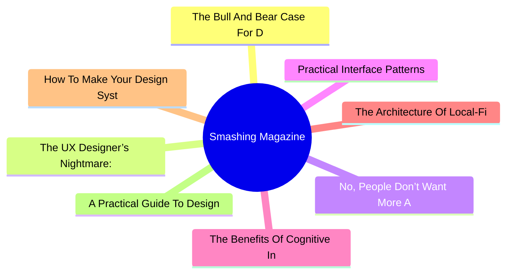
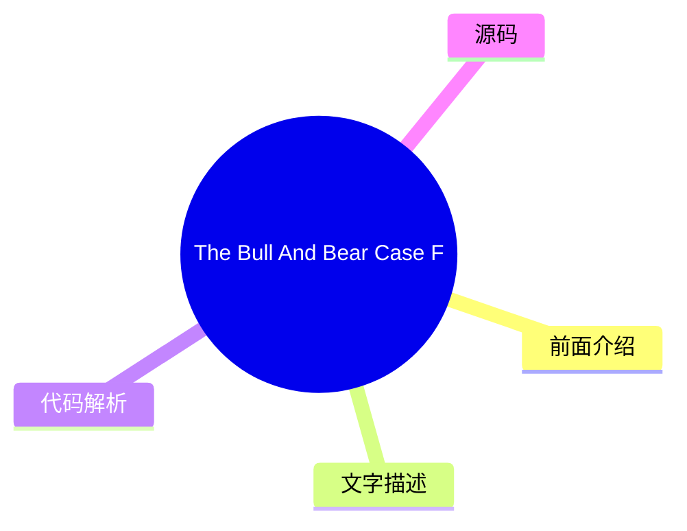
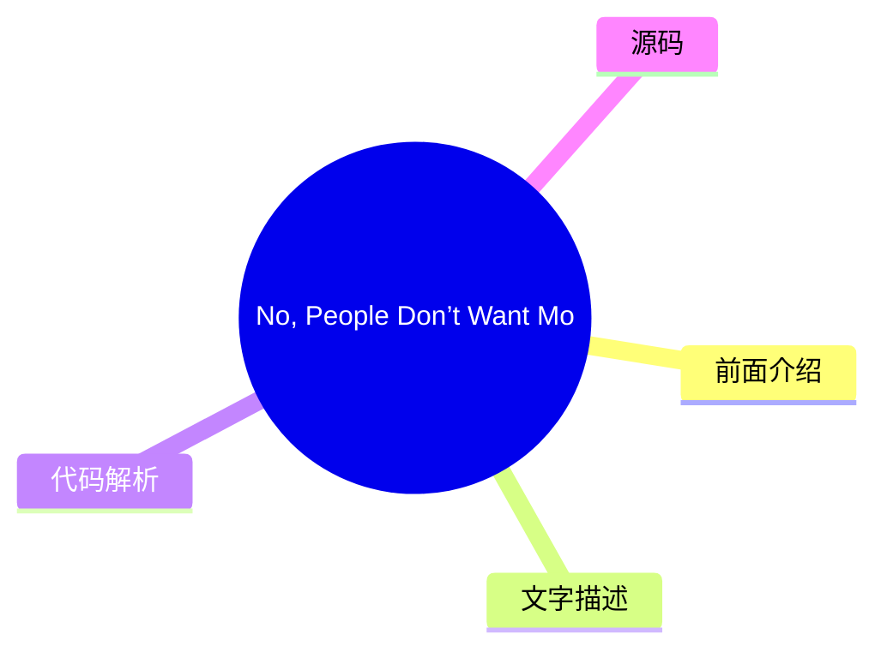
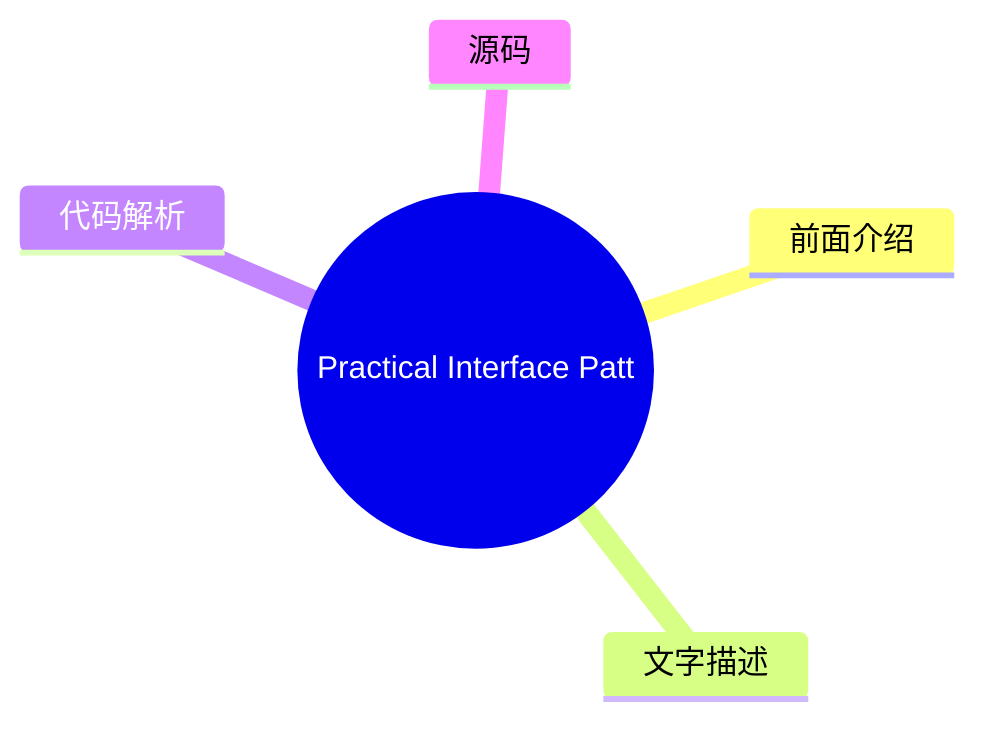
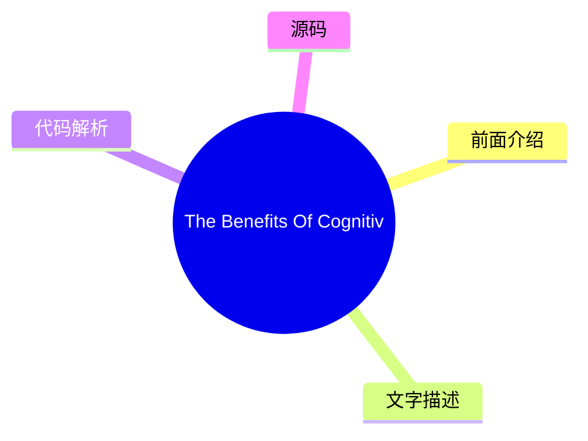
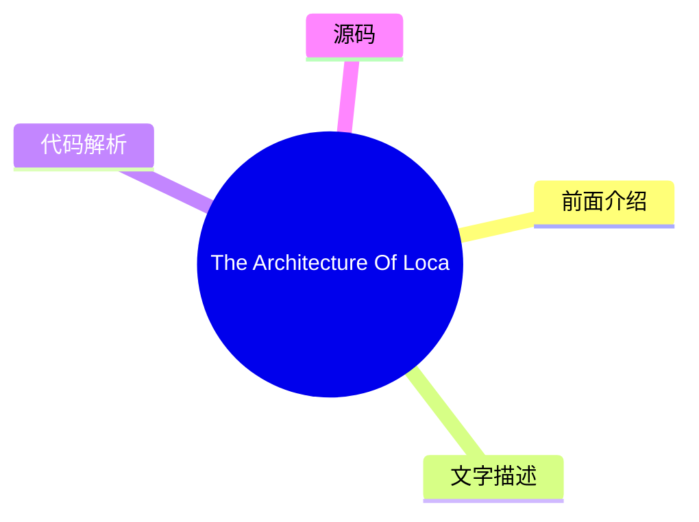
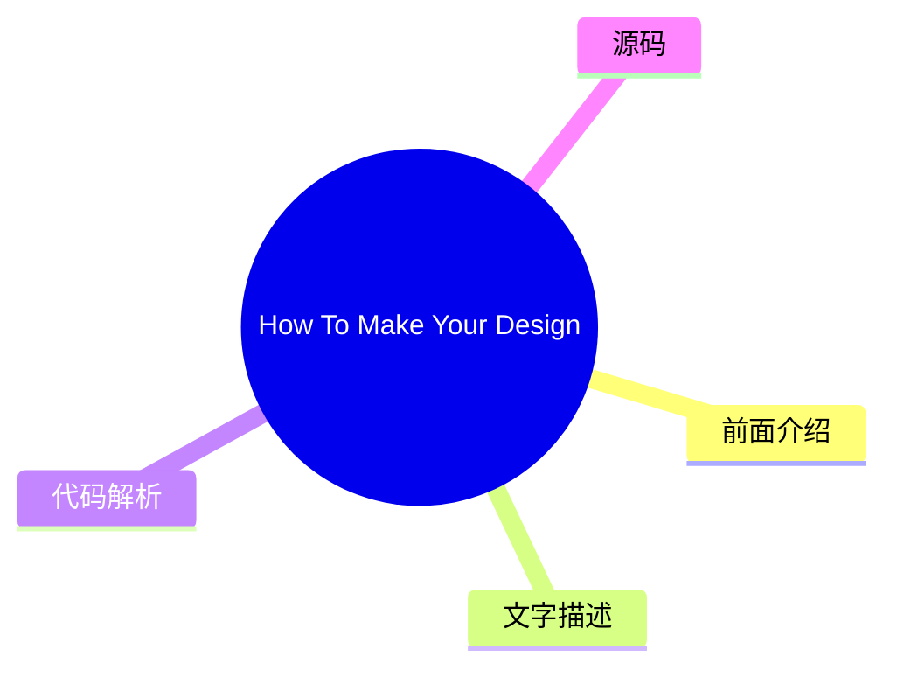
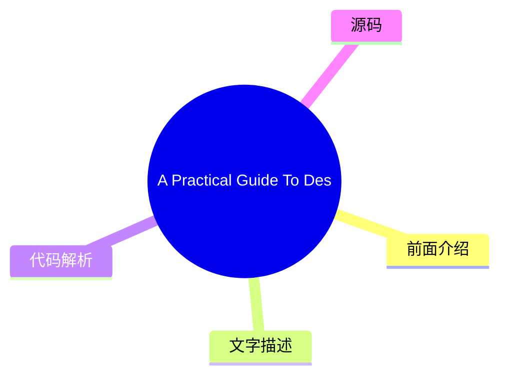

# 🔥 Smashing Magazine Top 8 (2026-07-31)

## 前面介绍

- 数据源：Smashing Magazine
- 抓取日期：2026-07-31
- 条目数：8
- 含完整正文：8
- 含代码片段：1
- 组织方式：前面介绍 / 树状图 / 文字描述 / 代码解析 / 源码

## 思维导图



## 详细整理（8 条，8 条含全文，1 条含代码）

### 1. The Bull And Bear Case For Digital Design In The Age Of AI
- **链接**: [https://smashingmagazine.com/2026/07/bull-and-bear-case-digital-design-age-ai/](https://smashingmagazine.com/2026/07/bull-and-bear-case-digital-design-age-ai/)
- **发布**: Wed, 29 Jul 2026 13:00:00 GMT

#### 前面介绍

- As AI reshapes product design, it could give designers greater autonomy or expose the gaps that autonomy makes harder to hide. Exploring both the bull and bear cases, Andy Budd examines what happens when designers need less permission to act.
- 发布时间：Wed, 29 Jul 2026 13:00:00 GMT

#### 树状图



#### 文字描述

- Designers have spent years saying they would do better work if the organisation got out of the way. Not always in those exact words, obviously. It usually comes out as something more reasonable: we didn’t get enough engineering time, product had already decided the solution, the roadmap was too packed, leadership only cared about this quarter’s numbers, research got cut, the ex
- ## The Bull Case: Designers Need Less Permission A good designer can now move from *“we should fix this”* to *“I fixed this, and pushed it live.”* They can prototype the alternative onboarding flow, write and test clearer product copy, build a rough working version of the interaction, clean up small pieces of design debt without waiting three months for a roadmap slot, and make
- ## The Bear Case: Autonomy Exposes The Gaps Autonomy has teeth. If AI gives designers more room to act, it also removes some of the cover. The same constraints that held good designers back have also protected weaker ones from being tested too directly. For years, it has been easy to say: I had a better idea, but we never got the engineering time. Sometimes that was exactly wha
- ## Where I Think We Might End Up The painful part is that both futures can be true at the same time. AI can make the best designers more capable and many average designers less necessary. It can give design more agency while reducing design headcount. It can help a small number of designers move closer to product leadership while pushing others into governance and clean-up work

#### 代码解析

- 本文未检测到明确代码块，内容更偏新闻、观点或方法论。

#### 源码

#### 中文节选

Designers have spent years saying they would do better work if the organisation got out of the way. Not always in those exact words, obviously. It usually comes out as something more reasonable: we didn’t get enough engineering time, product had already decided the solution, the roadmap was too packed, leadership only cared about this quarter’s numbers, research got cut, the experiment was never run properly, the design debt was known about, but nobody wanted to spend a sprint fixing it.

Much of this is true. Most designers have worked inside that awkward middle space between product and engineering. Product frames the problem, or at least thinks it does. Engineering decides what is feasible, or at least what is affordable. Design is expected to make the thing clearer, simpler, more coherent, more usable, and occasionally more desirable, while also being careful not to disrupt the plan too much.

That position has always been uncomfortable.

Designers are told to think strategically, but often lack the power to act strategically.

They can spot the broken onboarding flow, the confusing upgrade path, the empty state that makes users feel stupid, the feature that looks reasonable in a product review but makes no sense in real use. Seeing the problem is one thing. Getting it fixed is another.

So design often becomes an **argument**. You make the case. You annotate the flow. You bring the research clip. You point to the support tickets. You show the Figma prototype. You explain why the *“small edge case”* is actually the first-run experience for half your new users. Then everyone nods, agrees it matters, and moves on to whatever had already made it onto the roadmap.

This is one reason AI is more interesting for design than the usual *“will it replace designers?”* debate suggests. The real change is not that designers can make more screens. Nobody needs more screens. The interesting change is that designers **may need less permission**.

## The Bull Case: Designers Need Less Permission


A good designer can now move from *“we should fix this”* to *“I fixed this, and pushed it live.”* They can prototype the alternative onboarding flow, write and test clearer product copy, build a rough working version of the interaction, clean up small pieces of design debt without waiting three months for a roadmap slot, and make the better thing **visible enough** that it becomes **harder to ignore**.

That changes the politics of the work. Design has often relied on persuasion because designers lacked direct means of production. AI weakens that dependency. Not everywhere, and not for everything. Complex products still have architecture, infrastructure, data models, permissions, security, compliance, legacy systems, and all the other unglamorous reasons software is hard. But the boundary is moving.

More of the gap between having the idea and making the idea real can now be crossed by a motivated designer with the right tools.

In this version of the future, design

#### 完整正文（中文）

设计师们多年来一直表示，如果组织能少插手，他们就能做出更好的作品。当然，这未必是原话。通常表达得更委婉一些：我们没拿到足够的工程时间，产品已经决定了解决方案，路线图排得太满，领导层只关心本季度的业绩，研究被砍了，实验从未正确运行，设计债务虽然众所周知，但没人愿意花一个冲刺周期去修复。

这其中很多都是事实。大多数设计师都在产品和工程之间那个尴尬的中间地带工作过。产品界定问题，或者至少自认为界定了问题。工程决定什么是可行的，或者至少什么是负担得起的。设计则被期望让事物更清晰、更简单、更连贯、更易用，偶尔还要更吸引人，同时还要小心不要过多地破坏计划。

这种处境一直都很尴尬。

设计师被告知要战略性思考，但往往缺乏战略性行动的权力。

他们能发现糟糕的引导流程、令人困惑的升级路径、让用户感到愚蠢的空状态、在产品评审中看起来合理但在实际使用中毫无意义的特性。发现问题是一回事。让问题得到修复是另一回事。

因此，设计往往变成了**争论**。你提出论据。你标注流程。你拿出研究片段。你指向支持工单。你展示 Figma 原型。你解释为什么那个*“小边缘情况”*实际上是半数新用户的首次运行体验。然后大家都点头，表示同意这很重要，然后转而去处理那些已经排上路线图的事情。

这就是 AI 对设计来说比通常的*“AI 会取代设计师吗？”*的争论更有趣的原因之一。真正的变化不在于设计师能制作更多的界面。没人需要更多的界面。有趣的变化在于设计师**可能需要更少的许可**。

## 看涨理由：设计师需要更少的许可

优秀的设计师现在可以从 *“我们应该修复这个问题”* 转变为 *“我已经修复了这个问题，并已上线。”* 他们可以原型化替代的引导流程，编写并测试更清晰的产品文案，构建交互的粗略可用版本，在不等待三个月的路线图排期的情况下清理零散的设计债务，并让更好的东西变得**足够显眼**，以至于变得**难以忽视**。

这改变了工作的政治生态。设计往往依赖说服，因为设计师缺乏直接的生产手段。AI 削弱了这种依赖。并非在所有地方，也并非针对所有事物。复杂的产品仍然需要架构、基础设施、数据模型、权限、安全、合规、遗留系统以及所有其他让软件变得困难的、不显眼的原因。但边界正在移动。

现在，有动力且拥有正确工具的设计师可以跨越从拥有想法到将想法变为现实之间的鸿沟。

在这个未来的版本中，设计师变得**更少依赖许可**：更少依赖产品经理来认可问题，更少依赖工程师来实现每一个微小的改进，更少受困于内部批评者、品味提供者或 Figma 操作员的角色。他们更有能力去制作、测试、修复和发布。

最优秀的设计师开始看起来更不像传统的产品设计师，而更像**混合型产品领导者**。他们仍然关注交互、层级、语言、流程、品牌和工艺，但他们也理解问题的商业形态。他们可以做出权衡。他们可以用代码进行原型设计，或者非常接近代码。他们可以利用 AI 快速探索选项，然后运用判断力将其中大部分舍弃。他们可以与创始人或产品经理坐在一起，在一天结束时将模糊的产品顾虑转化为具体的东西。

There may be fewer of these people, but they will be harder to ignore. The current design-org model was partly built around **scarcity**: scarce engineering time, slow production, expensive prototypes, handoffs between specialists, heavy coordination across teams. If AI reduces some of that scarcity, it probably reduces the need for some of the roles that grew around it. The optimistic case is not that every designer keeps their job and gets a productivity boost. That feels like wishful thinking. The more believable version is that the total number of designers goes down, but the designers who remain have **more direct influence over the product**.

That is not a bad outcome for the strongest designers. It may even be the thing many of them have wanted for years.

## The Bear Case: Autonomy Exposes The Gaps

Autonomy has teeth. If AI gives designers more room to act, it also removes some of the cover. The same constraints that held good designers back have also protected weaker ones from being tested too directly.

For years, it has been easy to say: I had a better idea, but we never got the engineering time. Sometimes that was exactly what happened. Sometimes the better idea was never really more than a critique. It had not been made concrete. It had not been tested. It had not dealt with the awkward trade-offs. It sounded strong because it lived safely in opposition to the shipped thing.

A lot of designers are good at noticing what is wrong. Fewer are good at deciding what should happen instead. Fewer still can make that alternative real enough for other people to judge. AI will expose this gap.

If you can prototype the recommendation, the recommendation has to get better. If you can make the alternative flow, the flow has to survive contact with details. If you can test the product copy, you have to care what happens when users read it. If you can fix the small piece of design debt, you have to decide whether it was really worth fixing.


Some designers are not as strategic as they think they are. They have learned the language of strategy without the discomfort of **owning outcomes**. They can talk about user needs, business goals, systems thinking, and product quality, but struggle when asked to make a call. They want influence, but not the **exposure** that comes with it.

The profession has spent a long time arguing that design deserves more power. Fine. But more power means fewer excuses. It means the work is judged less by the elegance of the argument and more by the quality of the thing you made, tested, or changed. That is a better standard, but it will not be kind to everyone.

There is a second bear case, and it is probably the one large design teams should worry about most. Product and engineering already have more institutional power than design in most companies. They own the roadmap, the technical architecture, the sprint machinery, the metrics, and usually the language leadership understands. Design often has to translate its concerns into someone else’s terms before they count.

AI may not rebalance that power. It may hand product and engineering enough **design capability** to make design easier to bypass. A PM who can generate a decent flow, decent copy, and a decent prototype may not feel the same need to involve design early. An engineer who can use AI to produce a reasonable interface may decide the design system covers enough of the decision-making. A founder who can get to a polished demo in an afternoon may confuse polish with product thinking.

The problem is not that these people will suddenly become great designers. The problem is that many companies do not know the difference between great design and plausible design. **Plausible design is dangerous.** It looks coherent in a product review. It uses the right components. The spacing is fine. The copy is not embarrassing. The flow mostly works. Nobody in the meeting feels strongly enough to object. So it ships.


A lot of bad product decisions already survive because they look plausible. AI will produce more of them. This is where design could lose ground quickly: not because taste, judgment, research, and interaction thinking stop mattering, but because the visible outputs of design become easier for other functions to imitate.

If a company already thinks design is mostly screens, prototypes, and polish, AI gives it a cheaper way to get those things.

In that world, design does not gain more agency. It gets narrowed. The remaining designers manage the design system, police component usage, review flows that have already been decided, tidy the interface, maintain brand consistency, and get pulled into high-stakes launches, executive demos, and the occasional messy cross-platform problem. Useful work, but a smaller surface area. Less shaping the product, more maintaining the furniture.

This is why the *“AI will automate the boring 20%”* argument feels too comforting. In some companies, perhaps that is what happens. But in large tech organisations, where design teams grew around coordination, production and process, the cut could be much deeper. Not 20%. Maybe 50%. Maybe more. Especially in places where leadership never really understood why the design team had grown so large in the first place.

## Where I Think We Might End Up

The painful part is that both futures can be true at the same time. AI can make the best designers more capable and many average designers less necessary. It can give design more agency while reducing design headcount. It can help a small number of designers move closer to product leadership while pushing others into governance and clean-up work. It can free designers from waiting for permission, then reveal that some were more comfortable waiting than acting.

“


They will have taste, but taste will not be enough. They will need **product judgment**, **technical curiosity**, **commercial awareness** and the nerve to make decisions before every variable is settled. They will need to be comfortable moving between a customer conversation, a prototype, a pricing concern, a brand question, and a messy implementation detail without insisting that all of those belong to someone else.

I’m not completely sure where we end up. I hope it is closer to the *bull case*: fewer permission structures, more making, more agency, better designers finally able to show what they can do without being held back by the machinery around them.

I fear it may be closer to the *bear case*: product and engineering absorb much of the work, companies decide plausible design is good enough, and design loses status, headcount, and strategic ground.

In reality, it will probably be some uncomfortable mix of the two. Some designers will use AI to gain more agency. Some companies will use it to need fewer designers. Some teams will produce better work because the distance between judgment and execution gets shorter. Others will ship more plausible mediocrity because nobody in the room can tell the difference.

For years, designers have said they could create more value if they were less constrained by the organisation around them. AI is about to test that claim. Some will finally get to prove it. Some will find out the constraints were doing them a favour.

### Further Resources

- “[Good from Afar, But Far from Good: AI Prototyping in Real Design Contexts](https://www.nngroup.com/articles/ai-prototyping/),” Huei-Hsin Wang and Megan Brown*(NN/Group)*
 Lately, the UX design field has been flooded with AI-powered prototyping tools that generate interfaces instantly from natural-language prompts. Despite the massive marketing hype, this evaluation with real design scenarios revealed that while these tools can follow instructions to achieve a general goal, they often lack the sophistication to weigh design tradeoffs and to produce thoughtful, high-quality designs without extensive guidance from humans.

- “[AI Design Tools Are Marginally Better: Status Update](https://www.nngroup.com/articles/ai-design-tools-update-2/?lm=ai-prototyping&pt=article),” Megan Brown, Caleb Sponheim and Taylor Dykes*(NN/Group)*
 AI-powered design tools have improved, but we’re stil

...（截断，原文 12457+ 字符）


### 2. The UX Designer’s Nightmare: When “Production-Ready” Becomes A Design Deliverable
- **链接**: [https://smashingmagazine.com/2026/04/production-ready-becomes-design-deliverable-ux/](https://smashingmagazine.com/2026/04/production-ready-becomes-design-deliverable-ux/)
- **发布**: Wed, 22 Apr 2026 10:00:00 GMT

#### 前面介绍

- In a rush to embrace AI, the industry is redefining what it means to be a UX designer, blurring the line between design and engineering. Carrie Webster explores what’s gained, what’s lost, and why designers need to remain the guardians of the user ex
- 发布时间：Wed, 22 Apr 2026 10:00:00 GMT

#### 树状图


#### 文字描述

- In early 2026, I noticed that the UX designer’s toolkit seemed to shift overnight. The industry standard *“Should designers code?”* debate was abruptly settled by the market, not through a consensus of our craft, but through the brute force of job requirements. If you browse LinkedIn today, you’ll notice a stark change: UX roles increasingly demand ** AI-augmented development**
- ## The LinkedIn Pressure Cooker: Role Creep In 2026 The job market is sending a clear signal. While traditional graphic design roles are expected to grow by only **3%** through 2034, UX, UI, and [Product Design roles](https://www.nobledesktop.com/careers/designer/job-outlook#:~:text=The%20projected%20future%20growth%20figures%20for%20Digital,job%20growth%20(which%20lies%20somew
- ### The Competence Trap: Two Job Skill Sets, One Average Result There is potentially a very dangerous myth circulating in boardrooms that AI makes a designer “equal” to an engineer. This narrative suggests that because an LLM can generate a functional JavaScript event handler, the person prompting it doesn’t need to understand the underlying logic. In reality, attempting to mas
- ### The “Averagely Competent” Dilemma For a senior UX designer to become a senior-level coder is like asking a master chef to also be a master plumber because “they both work in the kitchen.” You might get the water running, but you won’t know why the pipes are rattling. - **The “cognitive offloading” risk.** Research shows that while AI can speed up task completion, it often l

#### 代码解析

- 本文未检测到明确代码块，内容更偏新闻、观点或方法论。

#### 源码

#### 中文节选

In early 2026, I noticed that the UX designer’s toolkit seemed to shift overnight. The industry standard *“Should designers code?”* debate was abruptly settled by the market, not through a consensus of our craft, but through the brute force of job requirements. If you browse LinkedIn today, you’ll notice a stark change: UX roles increasingly demand ** AI-augmented development**, 

**technical orchestration,**and

**production-ready prototyping.**

For many, including myself, this is the ultimate design job nightmare. We are being asked to deliver both the “vibe” and the “code” simultaneously, using AI agents to bridge a technical gap that previously took years of computer science knowledge and coding experience to cross. But as the industry rushes to meet these new expectations, they are discovering that AI-generated functional code is not always *good* code.

## The LinkedIn Pressure Cooker: Role Creep In 2026

The job market is sending a clear signal. While traditional graphic design roles are expected to grow by only **3%** through 2034, UX, UI, and [Product Design roles](https://www.nobledesktop.com/careers/designer/job-outlook#:~:text=The%20projected%20future%20growth%20figures%20for%20Digital,job%20growth%20(which%20lies%20somewhere%20around%205%25).) are projected to grow by **16%** over the same period.

However, this growth is increasingly tied to the rise of **AI product development**, where “design skills” have recently become the #1 most in-demand capability, even ahead of coding and cloud infrastructure. Companies building these platforms are no longer just looking for visual designers; they need professionals who can “[translate technical capability into human-centered experiences](https://humbldesign.io/blog-posts/will-ai-replace-designers-2026).”


This creates a high-stakes environment for the UX designer. We are no longer just responsible for the interface; we are expected to understand the technical logic well enough to ensure that complex AI capabilities feel intuitive, safe, and useful for the human on the other side of the screen. Designers are being pushed toward a **“design engineer” model**, where we must bridge the gap between abstract [AI logic and user-facing code](https://www.refontelearning.com/blog/ui-ux-designer-engineering-in-2026-crafting-future-ready-user-experiences#skills-and-competencies-for-the-2026-uiux-designer-3).

A [recent survey](https://www.lyssna.com/blog/ux-design-trends/) found that **73% of designers** now view AI as a primary collaborator rather than just a tool. However, this “collaboration” often looks like “role creep.” Recruiters are often not just looking for someone who understands user empathy and information architecture — they want someone who can also prompt a React component into existence and push it to a repository!

This shift has created a **competency gap**.

As an experienced senior designer who has spent decades mastering the nuances of cognitive load, accessibility standards, an

#### 完整正文（中文）

In early 2026, I noticed that the UX designer’s toolkit seemed to shift overnight. The industry standard *“Should designers code?”* debate was abruptly settled by the market, not through a consensus of our craft, but through the brute force of job requirements. If you browse LinkedIn today, you’ll notice a stark change: UX roles increasingly demand ** AI-augmented development**, 

**technical orchestration,**and

**production-ready prototyping.**

For many, including myself, this is the ultimate design job nightmare. We are being asked to deliver both the “vibe” and the “code” simultaneously, using AI agents to bridge a technical gap that previously took years of computer science knowledge and coding experience to cross. But as the industry rushes to meet these new expectations, they are discovering that AI-generated functional code is not always *good* code.

## The LinkedIn Pressure Cooker: Role Creep In 2026

The job market is sending a clear signal. While traditional graphic design roles are expected to grow by only **3%** through 2034, UX, UI, and [Product Design roles](https://www.nobledesktop.com/careers/designer/job-outlook#:~:text=The%20projected%20future%20growth%20figures%20for%20Digital,job%20growth%20(which%20lies%20somewhere%20around%205%25).) are projected to grow by **16%** over the same period.

However, this growth is increasingly tied to the rise of **AI product development**, where “design skills” have recently become the #1 most in-demand capability, even ahead of coding and cloud infrastructure. Companies building these platforms are no longer just looking for visual designers; they need professionals who can “[translate technical capability into human-centered experiences](https://humbldesign.io/blog-posts/will-ai-replace-designers-2026).”


这为 UX 设计师创造了一个高风险的环境。我们不再仅仅对界面负责；我们被期望充分理解技术逻辑，以确保复杂的 AI 功能对屏幕另一端的人类来说感觉直观、安全且有用。设计师正被推向一种 **“设计工程师”** 模式，我们必须弥合抽象 [AI 逻辑与面向用户的代码](https://www.refontelearning.com/blog/ui-ux-designer-engineering-in-2026-crafting-future-ready-user-experiences#skills-and-competencies-for-the-2026-uiux-designer-3) 之间的差距。

一项 [最近的调查](https://www.lyssna.com/blog/ux-design-trends/) 发现，**73% 的设计师**现在将 AI 视为主要的合作伙伴，而不仅仅是一种工具。然而，这种“协作”往往看起来像是“角色蔓延”。招聘人员往往不仅寻找那些理解用户同理心和信息架构的人——他们还想要那些能够通过提示词让 React 组件凭空出现并将其推送到仓库的人！

这种转变创造了一个 **能力差距**。

作为一名在认知负荷、无障碍标准和民族志研究方面花费数十年掌握细微差别的资深设计师，我突然发现自己正被评判调试 CSS Flexbox 问题或管理 Git 分支的能力。

噩梦并非技术本身。而是 **价值的重新分配**。

“

### 能力陷阱：两种工作技能集，一个平庸的结果

董事会中可能正在流传一个非常危险的神话，即 AI 使设计师与工程师“平等”。这种叙事暗示，因为 LLM 可以生成功能性的 JavaScript 事件处理程序，那么提示它的人就不需要理解底层逻辑。实际上，试图同时掌握两个截然不同且深奥的领域，很可能会导致在两者上都变得 **平庸**。

### “平庸能力”的两难困境

对于资深 UX 设计师来说，要成为资深级程序员，就像要求一位主厨同时也成为水管工，因为“他们都在厨房工作”。你可能能让水流起来，但你不会知道管道为什么会发出嘎嘎声。

- **The “cognitive offloading” risk.**
 Research shows that while AI can speed up task completion, it often leads to a significant decrease in conceptual mastery. In a controlled study, participants using AI assistance scored- [17% lower](https://www.psychologytoday.com/au/blog/the-asymmetric-brain/202602/cognitive-offloading-using-ai-reduces-new-skill-formation)on comprehension tests than those who coded by hand.
- **The debugging gap.**
 The largest performance gap between AI-reliant users and hand-coders is in- [debugging](https://www.anthropic.com/research/AI-assistance-coding-skills). When a designer uses AI to write code they don’t fully understand, they don’t have the ability to identify- *when*and- *why*it fails.

So, if a designer ships an AI-generated component that breaks during a high-traffic event and cannot manually trace the logic, they are no longer an expert. They are now a liability.

### The High Cost Of Unoptimised Code

Any experienced code engineer will tell you that creating code with AI without the right prompt leads to a lot of rework. Because most designers lack the technical foundation to audit the code the AI gives them, they are inadvertently shipping massive amounts of [“Quality Debt”](https://gocrossbridge.com/blog/ai-generated-code/).

## Common Issues In Designer-Generated AI Code

- **The security flaw**
 Recent reports indicate that up to- [92% of AI-generated codebases](https://www.sherlockforensics.com/pages/ai-code-security-report-2026.html)contain at least one critical vulnerability. A designer might see a functioning login form, unaware that it has an 86% failure rate in XSS defense, which are the security measures aimed at preventing attackers from injecting malicious scripts into trusted websites.
- **The accessibility illusion**

AI 经常生成缺乏语义完整性的“功能性”应用程序。设计师可能会提示生成一个“美观且功能齐全的切换开关”，但 AI 可能会提供一个非语义化的 `<div>`，该元素缺乏键盘焦点和屏幕阅读器兼容性，从而产生了 [可访问性债务](https://www.levelaccess.com/blog/accessibility-debt-in-software-development-and-how-to-engineer-it-out/)，日后修复起来代价高昂。

- **性能惩罚**
 AI 生成的代码往往冗长。AI 导致的 [代码重复率比人工编写的代码高出 4 倍](https://www.netcorpsoftwaredevelopment.com/blog/ai-generated-code-statistics)。这种冗长性会减慢页面加载速度，生成巨大的 CSS 文件，并对 SEO 产生负面影响。对于业务而言，任务看起来是“完成了”。但对于连接缓慢的用户或屏幕阅读器用户来说，该网站是一场噩梦。

## 创造更多工作，而非更少

AI 的承诺是设计师可以在不麻烦工程师的情况下发布功能。现实情况是，诞生了一种 **“返工税”**，正在耗尽整个行业的工程资源。

- **清理工作**
 组织发现，虽然开发速度提高了，但每个拉取请求（Pull Request）中的事故率也上升了 [23.5%](https://blog.exceeds.ai/ai-code-analysis-benchmark-reports/)。一些工程团队现在花费了周中相当大的一部分时间来清理设计团队跳过严格审查流程而交付的“AI 废料”。
- **沟通鸿沟**
 只有 [69% 的设计师](https://www.lyssna.com/blog/ux-design-trends/)认为 AI 提高了他们工作的质量，相比之下，**82% 的开发者**认为如此。这种差距之所以存在，是因为“能编译的代码”与“可维护的代码”是不同的。

当设计师移交忽略公司内部命名约定或管理模式模式的 AI 生成的代码时，他们并没有帮助工程师；他们是在制造一个以后必须由其他人解决的谜题。

### 解决方案

我们需要摆脱“**独行全栈设计师**”的噩梦，转向 **设计师/程序员协作** 的模式。

**理想的现实：**

- **伙伴关系**

 Instead of designers trying to be mediocre coders, they should work in a- **human-AI-human loop**. A senior UX designer should work- *with*an engineer to use AI; the designer creates prompts for- **intent, accessibility, and user flow**, while the engineer creates prompts for- **architecture and performance**.
- **Design systems as guardrails**
 To prevent accessibility debt from spreading at scale,- [accessible components must be the default](https://webaim.org/projects/million/)in your design system. AI should be used to feed these tokens into your UI, ensuring that even generated code stays within the “source of truth.”

## Beyond The Prompt

The industry is currently in a state of “AI Infatuation,” but the pendulum will eventually swing back toward quality.

“

Businesses that prioritise “designer-shipped code” without engineering oversight will eventually face a reckoning of technical debt, security breaches, and accessibility lawsuits. The designers who thrive in 2026 and beyond will be those who refuse to be “prompt operators” and instead position themselves as the **guardians of the user experience**. This is the perfect outcome for experienced designers and for the industry.

Our value has always been our ability to advocate for the human on the other side of the screen. We must use AI to augment our design thinking, allowing us to test more ideas and iterate faster, but we must never let it replace the specialised engineering expertise that ensures our designs technically *work* for everyone.

### Summary Checklist for UX Designers

- **Work Together.**
 Use AI-made code as a starting point to talk with your developers. Don’t use it as a shortcut to avoid working with them. Ask them to help you with prompts for code creation for the best outcomes.
- **Understand the “Why”.**
 Never submit code you don’t understand. If you can’t explain how the AI-generated logic works, don’t include it in your work.
- **Build for Everyone.**
 Good design is more than just looks. Use AI to check if your code works for people using screen readers or keyboards, not just to make things look pretty.


### 3. No, People Don’t Want More AI In Their Life
- **链接**: [https://smashingmagazine.com/2026/07/people-dont-want-more-ai/](https://smashingmagazine.com/2026/07/people-dont-want-more-ai/)
- **发布**: Wed, 15 Jul 2026 10:00:00 GMT

#### 前面介绍

- Many companies assume everyone craves new AI features. But the reality is that most people don't want more AI &mdash; at least not in the way most AI leaders envision it. Brought to you by Design Patterns For AI Interfaces, **friendly video courses o
- 发布时间：Wed, 15 Jul 2026 10:00:00 GMT

#### 树状图



#### 文字描述

- Many companies silently assume that everybody wants more AI in their lives. That people are **craving new AI features**, new AI products, new AI workflows — that would all magically replace all existing outdated practices and broken ways of working. But in reality, it seems like **people don’t want more AI** at all — at least not in the way most AI leaders envision it. Unsurpri
- ## The AI People Don’t Need It’s remarkably difficult to make a strong argument with senior leadership, but [AI is not a value proposition](https://www.nngroup.com/articles/powered-by-ai-is-not-a-value-proposition/). New AI features don’t magically make for happy or excited customers. Because AI features are often bolt-ons and separate tools for employees to use, they typically
- ## The AI People Actually Need I’m always puzzled by the comparison of AI features with how unreliable humans are. But people don’t compare software with other people. They **compare features with features** — and if one feature in one product is unreliable, while a similar feature works flawlessly in another, they choose the latter. It’s not about AI or not AI, but rather what
- ## Wrapping Up Perhaps I’m missing a bigger picture, and perhaps I’m just old school — but **I really do like people**. Their stories, their thinking, their emotions, their enthusiasm, their laughing. AI can be remarkably helpful in many situations, but so are people. And between the two, I would favor **spending time with a human** — however imperfect they are — every single t

#### 代码解析

- 本文未检测到明确代码块，内容更偏新闻、观点或方法论。

#### 源码

#### 中文节选

Many companies silently assume that everybody wants more AI in their lives. That people are **craving new AI features**, new AI products, new AI workflows — that would all magically replace all existing outdated practices and broken ways of working.

But in reality, it seems like **people don’t want more AI** at all — at least not in the way most AI leaders envision it. Unsurprisingly, many AI features have [low adoption and retention](https://www.mindstudio.ai/blog/ai-adoption-gap-ibm-2026-study) — at a very high cost of delivery, and a high risk of reputation damage.

## The AI People Don’t Need

It’s remarkably difficult to make a strong argument with senior leadership, but [AI is not a value proposition](https://www.nngroup.com/articles/powered-by-ai-is-not-a-value-proposition/). New AI features don’t magically make for happy or excited customers. Because AI features are often bolt-ons and separate tools for employees to use, they typically **take people out** of their regular way of working.

AI is pretty good at **amplifying shortcuts and shortcomings** in organizations — from data quality to decision making. It can’t magically fix years of accumulated quick patches, technical debt, broken culture and internal politics. If anything, they become more visible with AI as inconsistencies or conflicting priorities and get handed directly to users, who are then left to make sense of the mess themselves.

Because in most organizations, work typically requires hopping on and off between plenty of disconnected and fragmented systems, with a new AI tool, they now have yet another system that they also need to hop on and off. Often it produces more work, and typically it’s not particularly rewarding work either.

On top of that, people are very much aware of the [cost of finding and fixing AI hallucinations](https://www.nngroup.com/articles/ai-chatbots-discourage-error-checking/). Asking AI to generate a response **might feel easier** than writing from scratch, but it has a cost:

- **Skim through**the entire AI output,
- **Spot key points**to focus attention on,
- **Review/verify key points**, one-by-one,
- **Check rationale**for what follows next,

- **Articulate corrections**+ regenerate,
- **Review the response**(a number of times).

For many people, AI isn’t something they can proactively choose and explore on their own — it arrives uninvited, at someone else’s pace. On top of that, plenty of messages amplify **fears and worries about AI** replacing work — so it’s hardly surprising that the perception of AI isn’t excitement. It’s **resistance to change** and deep anxiety about one’s place in a world that seems to be changing without them.

At best, AI features might be silently accepted or nodded away. At worst, AI **raises concerns**, doubts, caution — and calls for a healthy dose of skepticism. And sometimes it’s perceived as a threat or **liability** — because unlike other features, AI is neither predictable nor reliable.

People don’t dream of

#### 完整正文（中文）

Many companies silently assume that everybody wants more AI in their lives. That people are **craving new AI features**, new AI products, new AI workflows — that would all magically replace all existing outdated practices and broken ways of working.

But in reality, it seems like **people don’t want more AI** at all — at least not in the way most AI leaders envision it. Unsurprisingly, many AI features have [low adoption and retention](https://www.mindstudio.ai/blog/ai-adoption-gap-ibm-2026-study) — at a very high cost of delivery, and a high risk of reputation damage.

## The AI People Don’t Need

It’s remarkably difficult to make a strong argument with senior leadership, but [AI is not a value proposition](https://www.nngroup.com/articles/powered-by-ai-is-not-a-value-proposition/). New AI features don’t magically make for happy or excited customers. Because AI features are often bolt-ons and separate tools for employees to use, they typically **take people out** of their regular way of working.

AI is pretty good at **amplifying shortcuts and shortcomings** in organizations — from data quality to decision making. It can’t magically fix years of accumulated quick patches, technical debt, broken culture and internal politics. If anything, they become more visible with AI as inconsistencies or conflicting priorities and get handed directly to users, who are then left to make sense of the mess themselves.

Because in most organizations, work typically requires hopping on and off between plenty of disconnected and fragmented systems, with a new AI tool, they now have yet another system that they also need to hop on and off. Often it produces more work, and typically it’s not particularly rewarding work either.

On top of that, people are very much aware of the [cost of finding and fixing AI hallucinations](https://www.nngroup.com/articles/ai-chatbots-discourage-error-checking/). Asking AI to generate a response **might feel easier** than writing from scratch, but it has a cost:

- **Skim through**the entire AI output,
- **Spot key points**to focus attention on,
- **Review/verify key points**, one-by-one,
- **Check rationale**for what follows next,

- **Articulate corrections**+ regenerate,
- **Review the response**(a number of times).

For many people, AI isn’t something they can proactively choose and explore on their own — it arrives uninvited, at someone else’s pace. On top of that, plenty of messages amplify **fears and worries about AI** replacing work — so it’s hardly surprising that the perception of AI isn’t excitement. It’s **resistance to change** and deep anxiety about one’s place in a world that seems to be changing without them.

At best, AI features might be silently accepted or nodded away. At worst, AI **raises concerns**, doubts, caution — and calls for a healthy dose of skepticism. And sometimes it’s perceived as a threat or **liability** — because unlike other features, AI is neither predictable nor reliable.

People don’t dream of **AI art museums** or AI fridges or AI hotel reception or AI-narrated children’s books. They don’t want their children to have **romantic AI partners**. Most people don’t want to actively manage (and clean up after) a **swarm of AI agents** roaming in their bank accounts and acting on their behalf in the real world. And most notably, people don’t really want a magical box to speak to or type into all the time.

## The AI People Actually Need

I’m always puzzled by the comparison of AI features with how unreliable humans are. But people don’t compare software with other people. They **compare features with features** — and if one feature in one product is unreliable, while a similar feature works flawlessly in another, they choose the latter. It’s not about AI or not AI, but rather what works consistently and reliably, and what doesn’t.

Many conversations about AI are conversations about the speed of delivery. But to many people, there is little value in increasing the speed of delivery. They want to do things well, with enough time to think and make good decisions. They also want to **enjoy the time they spend working on things**, rather than just ship faster. There is an enormous feeling of reward and achievement that slowly disappears, one vibe-coded change at a time.


People don’t change much. And after all these years, they (still) want features that are fast, accessible, **reliable, predictable and useful** — every single time. And ideally not the ones that replace their entire workflow, but that **augment** their way of working — and that take over the most mundane, annoying, and boring tasks that they find no pleasure in.

Many jobs are [exposed to AI automation](https://www.washingtonpost.com/technology/interactive/2026/jobs-most-affected-ai-automation/), but in many of them there is a rewarding, unique, creative part that requires taste, point of view, and perhaps even human intuition. And if AI **automates boring parts** of it, that’s an advantage for everyone. That’s also what enhances productivity and brings more joy in daily life.

When AI automates tedious and mentally exhausting tasks, its value is much easier to grasp. But for that, AI shouldn’t feel like a bolt-on. It should be **deeply integrated** into people’s existing workflows. It must also match existing **mental models** that they have developed and fine-tuned for years or decades. AI should adapt to how people think and make decisions, not the other way around.

And it doesn’t really matter if these features are branded as “AI”, “smart” or “automation”. However, they must work well for people using them. And that means that people must be **aware of use cases** where it actually helps them, and be inspired to find more use cases on their own.

Ironically, tools that work well there aren’t “AI-first” — they are **“AI-second”**. Subtle, humble, calm, ambient, taking a supportive role in the background for work that otherwise is remarkably dull and unnecessary.

I don’t want to readbooks written by AI. I don’t want to gaze upon paintings by AI. I don’t want AI to teach my children. I don’t want to have an AI therapist. I don’t want AI making my medical decisions. I want AI to do all thephysical and mental laborthat taxes me so I can read books written by humans and go to art galleries to engage with art made by humans. I want AI that makes my life easier rather than forces me to change myself.


—[Bo Young Lee](https://www.linkedin.com/feed/update/urn:li:share:7467162929474420737/)

## Wrapping Up

Perhaps I’m missing a bigger picture, and perhaps I’m just old school — but **I really do like people**. Their stories, their thinking, their emotions, their enthusiasm, their laughing. AI can be remarkably helpful in many situations, but so are people. And between the two, I would favor **spending time with a human** — however imperfect they are — every single time.

No, **people don’t need more AI in their lives** — they need AI to automate all the boring stuff they have to deal with every day, so they have more time and headspace to do things that they actually love and enjoy doing. That doesn’t mean spending more time with AI — but spending more time with people they love.

## Meet “Design Patterns For AI Interfaces”

Meet [ Design Patterns For AI Interfaces](https://ai-design-patterns.com/), Vitaly’s new 

**video course**with practical examples from real-life products — with a

[live UX training](https://smashingconf.com/online-workshops/workshops/ai-interfaces-vitaly-friedman/)happening soon.

[Jump to a free preview](https://www.youtube.com/watch?v=jhZ3el3n-u0).

## Useful Resources

- [AI Adoption Gap: IBM 2026 Study](https://www.mindstudio.ai/blog/ai-adoption-gap-ibm-2026-study), by MindStudio
- [Powered by AI Is Not a Value Proposition](https://www.nngroup.com/articles/powered-by-ai-is-not-a-value-proposition/), by Nielsen Norman Group
- [AI Chatbots Discourage Error Checking](https://www.nngroup.com/articles/ai-chatbots-discourage-error-checking/), by Nielsen Norman Group
- [The Jobs Most Exposed to AI Automation](https://www.washingtonpost.com/technology/interactive/2026/jobs-most-affected-ai-automation/), by The Washington Post
- [On AI and What We Actually Want From It](https://www.linkedin.com/feed/update/urn:li:share:7467162929474420737/), by Bo Young Lee


### 4. Practical Interface Patterns For AI Transparency (Part 2)
- **链接**: [https://smashingmagazine.com/2026/05/practical-interface-patterns-ai-transparency/](https://smashingmagazine.com/2026/05/practical-interface-patterns-ai-transparency/)
- **发布**: Wed, 13 May 2026 13:00:00 GMT

#### 前面介绍

- Why traditional loading patterns like spinners fail in agentic AI experiences, and how interface patterns that reveal the system’s process, status, and decision-making can improve transparency and build user trust.
- 发布时间：Wed, 13 May 2026 13:00:00 GMT

#### 树状图



#### 文字描述

- In the [first part of this series](https://www.smashingmagazine.com/2026/04/identifying-necessary-transparency-moments-agentic-ai-part1/), we talked about the **Decision Node Audit**. We mapped out the internal workings of our AI system to pinpoint the exact moments it makes decisions based on probabilities. This told us when the system needs to be transparent with the user. No
- ## Writing Clear Status Updates We often think of transparency as a visual design problem, but it’s really about the **words** we use. Simple, clear explanations (the microcopy) are what build trust and separate a reliable AI from one that feels broken. We need to retire generic placeholders like *Loading* or *Working*. These words are remnants of the era of static software. In
- ## The Agentic Update Formula To give people useful status updates, we need to connect what the system is *doing* with *why* it’s doing it. Keeping with our scheduling agent example, the system should break down that waiting period into at least four clear, separate steps. - First, the interface displays *Checking your calendar to find open times for a recurring Thursday call w
- ## Matching Tone to the Risk Matrix Should an AI sound like a person or act like a robot? The right answer depends on the task’s importance, which we can figure out using the **Impact/Risk Matrix** from our **Decision Node Audit**. For simple, low-risk tasks, a friendly, conversational tone works best. For example, a scheduling assistant can say it’s checking your calendar for 

#### 代码解析

- 本文未检测到明确代码块，内容更偏新闻、观点或方法论。

#### 源码

#### 中文节选

In the [first part of this series](https://www.smashingmagazine.com/2026/04/identifying-necessary-transparency-moments-agentic-ai-part1/), we talked about the **Decision Node Audit**. We mapped out the internal workings of our AI system to pinpoint the exact moments it makes decisions based on probabilities. This told us when the system needs to be transparent with the user. Now, the big question is *how* to share that information.

You’ve got your **Transparency Matrix** ready. You know which behind-the-scenes API calls need a visible status update. Your engineers are on board with the technical aspects. The next step is designing the visual container for those updates.

We face a legacy problem. For thirty years, interface designers have relied on a single pattern to handle latency: **the spinner**. The spinning wheel, the throbber, the progress bar. These patterns communicate a specific technical reality. They tell the user that the system is retrieving data. The delay is caused by bandwidth or file size.

AI agents introduce a new kind of wait time. When an agent pauses for twenty seconds, it’s not just downloading something; it’s *thinking*. It’s figuring out the best steps, weighing options, and creating the content you asked for.

If we use a basic spinning icon for this “thinking time,” users get confused and anxious. They watch a looping animation and can’t tell if the system is stalled or crashed. They don’t know if the agent is handling a very complicated task or if it has simply failed.

To build user trust, we need to turn this waiting time into a **moment for reassurance**. Instead of a passive *“something is happening,”* we need to communicate an active, *“Here is exactly how I am working to solve your problem.”*

## Writing Clear Status Updates

We often think of transparency as a visual design problem, but it’s really about the **words** we use. Simple, clear explanations (the microcopy) are what build trust and separate a reliable AI from one that feels broken.


We need to retire generic placeholders like *Loading* or *Working*. These words are remnants of the era of static software. Instead, we must construct our status updates using a specific formula that mirrors the agency of the system. Let’s stop using vague words like “Loading” or “Working.” Those terms belong to the past, when software was simple and static. Instead, we should create status updates that clearly tell the user what the system is *actually doing* and make the system’s actions transparent.

Imagine, for the sake of an example, you are deploying agentic AI that will help team members organize their calendars and plan recurring meetings on their behalf, once prompted.

When an AI displays a message like “Checking availability” for an unknown amount of time, users often feel lost because it doesn’t offer enough information. While they understand the AI is looking at a calendar, they don’t know *whose* calendar it is, what other steps are involved (before or aft

#### 完整正文（中文）

在[本系列的第一部分](https://www.smashingmagazine.com/2026/04/identifying-necessary-transparency-moments-agentic-ai-part1/)中，我们讨论了**决策节点审计**。我们梳理了 AI 系统的内部运作机制，以精确定位其基于概率做出决策的确切时刻。这让我们知道系统何时需要向用户保持透明。现在，核心问题是*如何*分享这些信息。

你已经准备好了**透明度矩阵**。你知道哪些后台 API 调用需要显示状态更新。你的工程师也认可技术层面的实现。接下来的步骤是设计承载这些更新的视觉容器。

我们面临一个遗留问题。三十年来，界面设计师一直依赖一种模式来处理延迟：**旋转器**。旋转的圆圈、闪烁的图标、进度条。这些模式传达了一种特定的技术现实。它们告诉用户系统正在检索数据。延迟是由带宽或文件大小引起的。

AI 代理引入了一种新的等待时间。当代理暂停二十秒时，它不仅仅是在下载某些内容；它是在*思考*。它正在确定最佳步骤，权衡选项，并为你请求的内容进行创作。

如果我们用基本的旋转图标来表示这种“思考时间”，用户会感到困惑和焦虑。他们看着循环播放的动画，无法判断系统是卡住了还是崩溃了。他们不知道代理是在处理一个非常复杂的任务，还是仅仅失败了。

为了建立用户信任，我们需要将这段等待时间转化为一个**安抚时刻**。与其使用被动的“正在发生某事”，我们需要传达一种主动的“这正是我正在努力解决您问题的具体方式”。

## 撰写清晰的更新状态

我们常将透明度视为一个视觉设计问题，但实际上它关乎我们使用的**文字**。简单、清晰的解释（微文案）才是建立信任的关键，它们能将可靠的 AI 与感觉像是有故障的 AI 区分开来。

We need to retire generic placeholders like *Loading* or *Working*. These words are remnants of the era of static software. Instead, we must construct our status updates using a specific formula that mirrors the agency of the system. Let’s stop using vague words like “Loading” or “Working.” Those terms belong to the past, when software was simple and static. Instead, we should create status updates that clearly tell the user what the system is *actually doing* and make the system’s actions transparent.

Imagine, for the sake of an example, you are deploying agentic AI that will help team members organize their calendars and plan recurring meetings on their behalf, once prompted.

When an AI displays a message like “Checking availability” for an unknown amount of time, users often feel lost because it doesn’t offer enough information. While they understand the AI is looking at a calendar, they don’t know *whose* calendar it is, what other steps are involved (before or after), or if the AI even remembered the people and purpose of the scheduling request. Waiting for the final result can be a tense, uneasy experience, like anticipating a gift that you suspect might be a prank.

Perplexity AI provides a strong example of doing status updates right. Figure 1 below shows that when users ask a question, the interface displays exactly what it is doing in real time. You see a list of activities updating as they are accomplished. Users do not need to guess what is happening as the AI works.

## The Agentic Update Formula

To give people useful status updates, we need to connect what the system is *doing* with *why* it’s doing it. Keeping with our scheduling agent example, the system should break down that waiting period into at least four clear, separate steps.

- First, the interface displays *Checking your calendar to find open times for a recurring Thursday call with [Name(s)]*.
- Then, it updates to: *Cross-checking availability with [Name(s)] calendars*.
- Next, it might display: *Syncing [Name(s)] schedules to secure your meeting time on [Data and Time]*.

- Finally, at the conclusion, the agent might state they have successfully completed the task and request the user check their email to confirm the invite that’s been shared with the group having the recurring meeting.

This communication process grounds the technical process in the user’s actual life.

Making an AI’s progress easy to understand boils down to a three-part structure: a strong **Action Word**, what the AI is working on (the **Specific Item**), and any **Limits** or rules it has to follow.

Think about an AI helping you book a trip. A weak, unhelpful update would just be: *Searching for flights…*

A much better update uses the formula:

- **Action Word:**- *Scanning*
- **Specific Item:**- *the prices on Lufthansa and United*
- **Limits/Rules:**- *to find anything under $600.*

This approach clearly shows the user that the AI understood their request and is working within the set boundaries.

## Matching Tone to the Risk Matrix

Should an AI sound like a person or act like a robot? The right answer depends on the task’s importance, which we can figure out using the **Impact/Risk Matrix** from our **Decision Node Audit**.

For simple, low-risk tasks, a friendly, conversational tone works best. For example, a scheduling assistant can say it’s checking your calendar for the best time. This creates a comfortable, easygoing experience for the user.

However, high-stakes tasks demand clear, mechanical accuracy. If the AI is managing a big financial transfer or a complicated database migration, users don’t want a playful interface; they want precision. A screen that says *“I am thinking hard about your money”* would possibly cause panic. Instead, the interface should use straightforward language like *“Verifying account routing numbers.”* By adjusting the AI’s “personality” to match the level of risk, we give users exactly the experience they need in that moment. While the Impact/Risk Matrix provides a necessary starting point, the ultimate determinant of the appropriate AI voice and tone is rigorous **user research**.


It’s impossible for any set of rules to predict the exact words or tone that will build trust or cause stress for every group of users or in every situation. That’s why hands-on research is essential. You need to:

- [Run A/B tests](https://medium.com/@alienoghli/the-essential-guide-to-a-b-testing-a84b853c16e0)
- [Conduct usability studies](https://uxplanet.org/usability-testing-the-complete-guide-e162898f68db)
- [Perform interviews](https://ixdf.org/literature/article/how-to-conduct-user-interviews)

This kind of research ensures the AI’s “personality” is comfortable and appropriate for the actual people who will be using the system in their specific context.

We’ve now covered the *“what”* — the critical microcopy, the clear action words, and the necessary limits that make an AI status update honest and informative. But words alone aren’t enough. A perfect sentence hidden in a poor interface is still a failure of transparency.

The next challenge is the *“how”* — designing the physical delivery system for that message. You can think of the status update formula as the engine, and the interface pattern as the car. A powerful engine needs a reliable, well-designed chassis to carry it down the road.

## Interface Patterns: A Library For Agents

Once we have the right words, we need **the right container**. The key is matching the message’s weight to the pattern’s visibility. A tiny background task (like an agent gently tidying up your files) doesn’t need a loud, flashing banner. That message is best delivered subtly. A high-stakes, multi-step process (like moving money) potentially demands a more robust container that forces the user to pay attention.

By creating a library of these patterns, we ensure the right level of transparency is delivered at the right moment, turning the anxiety of waiting into a moment of informed confidence. Let’s review a few common, critical patterns.

### The Living Breadcrumb: AI Working in the Background

For those low-importance tasks that an AI is handling quietly in the background, we need a way to show users it’s working without constantly distracting them. We can call this the living breadcrumb.


Think of an email app where an AI is drafting a reply for you. You don’t want a disruptive pop-up message. Instead, a small, subtle status indicator pulses within the application’s border or menu area.

The solution needs to go beyond a static icon. The living breadcrumb smoothly transitions between different text updates. It might pulse from *Reading email* to *Drafting reply* to *Checking tone*. It’s there if you want to check on its progress, offering a quiet assurance that the task is underway, but it won’t demand your immediate attention.

### Dynamic Checklists

When dealing with critical, high-stakes tasks — like processing a complex financial transaction or migrating a large, intricate dataset — we recommend using a **Dynamic Checklist** (illustrated in Figure 3).

This pattern serves as a powerful anchor for the user, providing clarity and confidence about the **process’s progress**. Instead of a simple bar, the Dynamic Checklist lays out every planned step the AI agent will take. It clearly highlights the step that is currently in progress, marks preceding steps as complete, and lists future actions as pending.

For example:

- **Step 1**: Verify Account Balance- **[Complete]**.
- **Step 2**: Convert Currency- **[Processing]**.
- **Step 3**: Transfer Funds- **[Pending]**.

The Dynamic Checklist offers a significant advantage over a traditional progress bar because it expertly manages unpredictable time. If the currency conversion (Step 2) unexpectedly requires an extra ten seconds, the user won’t feel sudden anxiety or panic. They have full visibility into the system’s exact location, understanding that the delay is occurring during the *Converting Currency* step. Because they recognize this is a potentially complex action, they are naturally more patient and trusting of the system’s ongoing work.


The pattern itself is a compelling UI idea, but designers must remember that its implementation transforms the task into a full-stack design requirement. Unlike a simple loading flag, the dynamic checklist requires a robust front-end state management system to listen for step-completion events, which are typically triggered by a back-end webhook structure. This ensures the interface is always reflecting the agent’s real-time position in the workflow.

### The Thinking Toggle

Some users with higher information needs or higher needs for transparency may not trust a simple summary; they want to see the system’s raw processing. For this audience, we’ve designed the **Thinking Toggle**.

This is a simple progressive disclosure UI control, like a chevron or a “View Logs” button, that lets the user expand a friendly status update into a raw terminal view. It displays the sanitized logic logs of the AI agent, such as:

- *Querying API endpoint /v2/search*;
- *Response received: 200 OK*;
- *Filtering results by relevance score > 0.8*.

Many people will never open this view. However, for the user who needs deep transparency, the very presence of this toggle is a signal of trust. It reassures them that the system is not concealing anything.

Keep in mind, with this deep transparency comes a critical technical risk. Even for your most expert audience, you must sanitize and abstract these raw logs before display. This step is non-negotiable to prevent accidentally exposing proprietary business logic, internal data structure names, or security tokens that could be exploited. This process ensures trust is built through honesty, not security vulnerability.

### Designing For Partial Success

In standard software, things are often black or white. A file either saves or it doesn’t. But with AI agents, things ar

...（截断，原文 21693+ 字符）


### 5. The Benefits Of Cognitive Inclusion In UX Research
- **链接**: [https://smashingmagazine.com/2026/06/benefits-cognitive-inclusion-ux-research/](https://smashingmagazine.com/2026/06/benefits-cognitive-inclusion-ux-research/)
- **发布**: Wed, 10 Jun 2026 10:00:00 GMT

#### 前面介绍

- Findings from an exploratory user research study highlighting the unique insights and practical UX recommendations shared by participants with cognitive disabilities.
- 发布时间：Wed, 10 Jun 2026 10:00:00 GMT

#### 树状图



#### 文字描述

- In the summer of 2024, I became co-chair of a working group of expert researchers who came together to determine how best to perform accessibility testing with people with cognitive disabilities. This was work I did for Fable, where I am currently VP of Innovation. Cognitive disability is an umbrella term for several disabilities that impact how people process information, and 
- ## The Cognitive Usability Study I decided to run a joint study with Fable’s partners at the University of California, Irvine, in collaboration with Syed Fatiul Huq and with help from Fable researchers Pranav Pidathala, Ali Brown, and Michael Fagan to see if my hypothesis about finding more insights with cognitive testers proved true or not. I generated three websites for the s
- ### Table 1: Websites And Tasks Tested | Website | [Strong Snacks](https://v0-strong-snacks.vercel.app/) | [Turning Pages](https://v0-bookstore-nu.vercel.app/) | [Crown & Comb](https://v0-crown-and-comb.vercel.app/) | |---|---|---|---| | Description | This is a website for three-ingredient high-protein recipes. Recipes can be browsed by category (vegan, muscle building, etc.). 
- ## Data Analysis Approach I reviewed all the study recordings and transcripts and made note of every time a participant raised a concern, question, difficulty, or asked a question about how something worked. I counted all of these as issues. I also noted where a participant missed something that was part of a task, even if they didn’t notice it themselves. I also noted every su

#### 代码解析

- 本文未检测到明确代码块，内容更偏新闻、观点或方法论。

#### 源码

#### 中文节选

2024年夏天，我成为了一个专家研究小组的联合主席，该小组致力于确定如何最好地与认知障碍人士进行无障碍测试。这是我在 Fable 的工作，目前我是那里的创新副总裁。

认知障碍是一个统称，指影响人们处理信息的多种障碍，通常会影响记忆、专注力和/或学习能力。它是美国最常见的残疾类型（通过 [CDC](https://www.cdc.gov/disability-and-health/articles-documents/disability-impacts-all-of-us-infographic.html) 数据为 13.9%），且认知障碍正在迅速增加（[耶鲁研究](https://news.yale.edu/2025/09/24/growing-number-us-adults-report-cognitive-disability)）。

我们为自己设定了四个目标，以学习如何与这一受众群体合作：

- 我们应该如何招募和筛选参与者？
- 与认知障碍参与者进行研究的最佳实践是什么？
- 这些方法在真实研究中有效吗？
- 记录我们的所学，以便分享。

我们创建了一份筛选问卷，以招募那些自我认定为在记忆、专注和学习方面存在挑战的人。我们还回顾了涉及认知障碍测试人员的已发表研究，以学习与他们合作的最佳实践。

接下来，我们在一项试点研究中，对这 25 名初始测试人员测试了这些最佳实践。我们迭代优化了我们的方法，并创建了一份指南，用于与认知障碍测试人员进行用户访谈，以及一份能够量化他们使用数字产品体验的调查问卷。最后，我们[记录了我们的所学](https://makeitfable.com/article/cognitive-accessibility-pilot-case-study/)。

在这个新测试人员群体完成试点研究后，我感到他们能比过去我合作过的普通人群（gen pop）用户研究参与者发现更多的可用性见解。我着手验证这一直觉。

## 认知可用性研究

I decided to run a joint study with Fable’s partners at the University of California, Irvine, in collaboration with Syed Fatiul Huq and with help from Fable researchers Pranav Pidathala, Ali Brown, and Michael Fagan to see if my hypothesis about finding more insights with cognitive testers proved true or not.

I generated three websites for the study using an AI prototyping tool. I wanted three different types of sites with different user goals and content so I could test a variety of tasks in the study.

### Table 1: Websites And Tasks Tested

| Website | [Strong Snacks](https://v0-strong-snacks.vercel.app/) | [Turning Pages](https://v0-bookstore-nu.vercel.app/) | [Crown & Comb](https://v0-crown-and-comb.vercel.app/) | 
|---|---|---|---|
| Description | This is a website for three-ingredient high-protein recipes. Recipes can be browsed by category (vegan, muscle building, etc.). The site also features blog posts about protein and contact information. | This website is for a bookstore with a catalog of curated reads. It features ext

#### 完整正文（中文）

2024年夏天，我成为了一个专家研究小组的联合主席，该小组致力于确定如何最好地与认知障碍人士进行无障碍测试。这是我在 Fable 的工作，目前我是那里的创新副总裁。

认知障碍是一个统称，指影响人们处理信息的多种障碍，通常会影响记忆、专注力和/或学习能力。它是美国最常见的残疾类型（通过 [CDC](https://www.cdc.gov/disability-and-health/articles-documents/disability-impacts-all-of-us-infographic.html) 数据为 13.9%），且认知障碍正在迅速增加（[耶鲁研究](https://news.yale.edu/2025/09/24/growing-number-us-adults-report-cognitive-disability)）。

我们为自己设定了四个目标，以学习如何与这一受众群体合作：

- 我们应该如何招募和筛选参与者？
- 与认知障碍参与者进行研究的最佳实践是什么？
- 这些方法在真实研究中有效吗？
- 记录我们的所学，以便分享。

我们创建了一份筛选问卷，以招募那些自我认定为在记忆、专注和学习方面存在挑战的人。我们还回顾了涉及认知障碍测试人员的已发表研究，以学习与他们合作的最佳实践。

接下来，我们在一项试点研究中，对这 25 名初始测试人员测试了这些最佳实践。我们迭代优化了我们的方法，并创建了一份指南，用于与认知障碍测试人员进行用户访谈，以及一份能够量化他们使用数字产品体验的调查问卷。最后，我们[记录了我们的所学](https://makeitfable.com/article/cognitive-accessibility-pilot-case-study/)。

在这个新测试人员群体完成试点研究后，我感到他们能比过去我合作过的普通人群（gen pop）用户研究参与者发现更多的可用性见解。我着手验证这一直觉。

## 认知可用性研究

我决定与 Fable 的合作伙伴加州大学欧文分校合作开展一项联合研究，在 Syed Fatiul Huq 的协助下，并得到 Fable 研究员 Pranav Pidathala、Ali Brown 和 Michael Fagan 的帮助，以验证我关于使用认知测试人员能获得更多洞察的假设是否成立。

我使用 AI 原型工具生成了三个网站用于这项研究。我想要三种不同类型的网站，具有不同的用户目标和内容，以便我可以在研究中测试各种任务。

### 表 1：测试的网站和任务

| 网站 | [Strong Snacks](https://v0-strong-snacks.vercel.app/) | [Turning Pages](https://v0-bookstore-nu.vercel.app/) | [Crown & Comb](https://v0-crown-and-comb.vercel.app/) | 
|---|---|---|---|
| 描述 | 这是一个提供三成分高蛋白食谱的网站。食谱可以按类别（素食、增肌等）浏览。该网站还包含关于蛋白质的博客文章和联系信息。 | 这是一个书店网站，拥有精选阅读目录。它具有按书籍类型进行广泛筛选的功能、用于构建喜好和厌恶档案的书籍滑动功能、自定义书单、购物车和结账功能。 | 这是一个美发沙龙网站，允许您在线预约和咨询。它拥有 VIP 计划和访客可以购买的多种特殊套餐。 | 
| 设计 | 简单、粗野主义、明亮、大量图片。 | 情绪化、经典、深色、大量书籍封面图片。 | 大胆、简洁、黑白搭配，点缀色彩。 | 
| 内容 | 食谱、博客文章。 | 书籍和书单。 | 服务、体验指南、会员信息。 | 
| 关键功能 | 按类别筛选、订阅通讯。 | 购物车、书籍匹配、书单、推荐。 | 预约预订。 | 
| 任务 | 
 | 
 | 
 | 

我们使用了一份包含关于记忆力、专注力和学习力问题的单一筛选问卷，并根据参与者是否自我认定为存在认知挑战，将他们分为两组。

Cognitive disability includes neurodiversity. Neurodivergent is an umbrella term used to describe people whose brains process information and learn differently. It is most commonly used for people who have learning disabilities (e.g., Dyslexia), ADHD, and Autism.

We ran 30 user interviews, 10 per website, with an even 5⁄5 split between cognitive and gen pop participants for each website. In each session, a participant completed all the tasks for one website during an online user interview facilitated by one of the researchers involved in the study.

All participants completed an [Accessible Usability Scale (AUS) survey](https://makeitfable.com/accessible-usability-scale/) at the end of their session. This is a free, Creative Commons-licensed 10-question survey to evaluate the usability of websites and mobile apps.

## Data Analysis Approach

I reviewed all the study recordings and transcripts and made note of every time a participant raised a concern, question, difficulty, or asked a question about how something worked. I counted all of these as issues. I also noted where a participant missed something that was part of a task, even if they didn’t notice it themselves. I also noted every suggestion for improvement made by participants.

Examples of issues found included:

- Photo is too tall and requires a lot of scrolling to get to content (noted by participant).
- I get no feedback when I like or dislike a book (noted by participant).
- Participant missed the required P.O. Box checkbox the first time (observed by me).

Examples of suggestions included:

- I would like to see a protein comparison in a table.
- The “More information” tab should be moved up higher.
- I would like more information on how the recommendation list is created.

Issues and suggestions were counted once per participant, even if they mentioned the same thing twice, but there are, of course, repeat issues and suggestions across the different participants. It is expected in UX research with multiple participants that you’ll find similar issues with each participant, and that is a signal that an issue is a universal challenge.

## Findings Of The Cognitive Usability Study


Across the three websites tested:

- Cognitive participants identified 197 issues.
- Gen pop participants identified 113 issues.
- Cognitive participants made 93 suggestions.
- Gen pop participants made 54 suggestions.
- Cognitive participants surfaced more issues related to content, buttons, icons, visual elements, and media than gen pop participants.

The results aligned with my instincts: participants with cognitive disabilities identified 1.8 times more issues and made 1.8 times more suggestions than gen pop participants.

Let’s dive deeper into the data for each website. Note that an AUS score ranges from 0 to 100, with higher numbers representing better usability than lower numbers.

### Table 2: Strong Snacks

This site had the simplest design and content of all websites tested in the study and accordingly had the lowest overall issues and the highest median AUS scores. The data aligns with what you’d expect from an easy-to-use and simple website.

On this website, cognitive participants found 3.4 more issues and made 2.2 more suggestions on average. Their average score of the overall experience was 13.7 points lower than that of the gen pop participants.

| Total issues | Average issues | Median issues | Total suggestions | Average suggestions | Median suggestions | Average AUS | Median AUS | |
|---|---|---|---|---|---|---|---|---|
| Gen pop | 32 | 6.4 | 6 | 13 | 2.6 | 2 | 90.5 | 97.5 | 
| Cognitive | 49 | 9.8 | 9 | 24 | 4.8 | 4 | 76.8 | 73.0 | 

### Table 3: Turning Pages

This was the website with the most varied functionality and the most tasks to complete (4), so it’s not surprising that participants found the most issues.

Here, cognitive participants found 6 more issues and made 3.2 more suggestions on average. They also scored the overall experience 17.2 points lower than gen pop participants on average.

| Total issues | Average issues | Median issues | Total suggestions | Average suggestions | Median suggestions | Average AUS | Median AUS | |
|---|---|---|---|---|---|---|---|---|
| Gen pop | 55 | 11 | 10 | 26 | 5.2 | 4 | 78.0 | 80.0 | 
| Cognitive | 86 | 17 | 15 | 42 | 8.4 | 6 | 60.8 | 58.0 | 

### Table 4: Crown & Comb


This website was intentionally designed to be complex, and task 3, finding the bridal package, was meant to be extremely difficult to complete.

On this last website, cognitive participants on average found 7 more issues and made 2.4 more suggestions. Their average score for the overall experience was 14.3 points **higher** than the gen pop participants.

| Total issues | Average issues | Median issues | Total suggestions | Average suggestions | Median suggestions | Average AUS | Median AUS | |
|---|---|---|---|---|---|---|---|---|
| Gen pop | 26 | 5 | 4 | 15 | 3 | 3 | 49.5 | 35.0 | 
| Cognitive | 62 | 12 | 11 | 27 | 5.4 | 2 | 63.8 | 68.0 | 

Something interesting happened with the AUS scores for cognitive and gen pop participants in Tables 3 and 4. Cognitive participants scored Crown & Comb higher than Turning Pages, but gen pop scored the opposite — higher for Turning Pages and lower for Crown & Comb. If I had to guess why, I suspect finding more issues on Turning Pages impacted the cognitive participants’ perceptions of usability more than the gen pop participants’.

The other major difference between the sites, outlined in Table 5 below, was that cognitive participants found many more issues with buttons and links on Turning Pages and more issues with icons and visual elements on Crown & Comb. This suggests to me that the interactions being challenging on Turning Pages were a more significant challenge than issues with visual elements.

### Qualitative Findings

When it comes to the more qualitative findings, I looked at trends in the types of issues found by both groups of participants.

**Cognitive participants**:

- Were more likely to flag issues with icons or visual elements.
- Surfaced problems with content more frequently.
- Gave richer qualitative commentary, often explaining why something was hard to find or confusing.

**Gen pop participants**:

- Were less likely to flag conceptual or comprehension barriers.
- Gave shorter feedback, often stopping once the task was complete.

### Table 5: Number Of Issues By Category


当我按类别对问题进行分组时，认知型参与者出现以下问题的频率更高：内容、按钮和链接（功能与可用性）、图标或视觉元素，以及媒体（视频、动画）。他们在导航问题上几乎与普通参与者持平（45 对 46）。

| Strong Snacks | Turning Pages | Crown & Comb | ||||
|---|---|---|---|---|---|---|
| 问题类别 | Gen pop | Cognitive | Gen pop | Cognitive | Gen pop | Cognitive | 
| 内容 | 11 | 22 | 11 | 30 | 23 | 36 | 
| 导航 | 18 | 22 | 25 | 17 | 2 | 7 | 
| 按钮和链接 | 0 | 5 | 7 | 20 | 3 | 0 | 
| 图标或视觉元素 | 3 | 16 | 2 | 3 | 4 | 23 | 
| 媒体 | 0 | 2 | 0 | 1 | 0 | 0 | 

让我们来看看在 Crown & Comb 会话中，一位认知型参与者与一位普通参与者提供的评论。认知型参与者给出的 AUS 得分为 38，普通参与者给出的 AUS 得分为 27.5。我选择比较这两位参与者，因为他们都在各自组中给出了最低分。

注意他们在下方的引语中描述整体体验时的差异。普通参与者解释说这令人沮丧且缺乏吸引力。认知型参与者感到精疲力竭，且难以集中注意力。我将这种体验解读为对认知型参与者的整体幸福感产生了更深远的影响。

普通参与者引语

“一旦你有了治疗名称和简短说明，以及像持续时间这样的信息和价格，一旦你点击进去，就应该能够立即与该服务进行交互。并且

...（截断，原文 21693+ 字符）


### 6. The Architecture Of Local-First Web Development
- **链接**: [https://smashingmagazine.com/2026/05/architecture-local-first-web-development/](https://smashingmagazine.com/2026/05/architecture-local-first-web-development/)
- **发布**: Wed, 06 May 2026 10:00:00 GMT

#### 前面介绍

- An honest perspective on building local-first web apps in 2026, written for developers who’ve been doing this long enough to be skeptical of silver bullets.
- 发布时间：Wed, 06 May 2026 10:00:00 GMT

#### 树状图



#### 文字描述

- Last October, I was sitting in a hotel room in Lisbon, the night before I was supposed to demo a project management tool my team had spent four months building. The hotel Wi-Fi was doing that thing where it *connects* but nothing actually loads. And I watched our app, this thing I was genuinely proud of, render a blank screen with a spinner. Then a timeout error. Then nothing. 
- ## What “Local-First” Actually Means (And The Confusion That Won’t Die) I need to clear something up because I keep having this conversation at meetups. **Local-first is not offline-first.** It’s not “add a service worker and call it a day.” It’s not a synonym for PWA. I’ve seen all of these conflated in conference talks, and it drives me a little crazy. Offline-first means you
- ## Be Honest Early: When You Should Not Do This I’m putting this near the top because I’ve watched too many developers (including myself, once) get excited about a new architecture and shoehorn it into projects where it doesn’t belong. I wasted about six weeks trying to make a local-first approach work for an internal analytics dashboard at a previous job. My colleague Sarah fi
- ## Replicas, Not Requests If you’ve used Git, you already understand the mental model. SVN (remember SVN?) was centralized. One server. You check out files, make changes, and commit to the server. Server down? Can’t commit. Can’t even see history. Git gave every developer a full clone. You commit locally, branch locally, and merge locally. Push and pull when you’re ready. The r

#### 代码解析

- `text`: 包含函数或类定义，适合直接抽成可复用实现。

#### 源码

#### 源码片段 1（text）

```text
import { SQLiteAPI } from 'wa-sqlite';
import { OPFSCoopSyncVFS } from 'wa-sqlite/src/examples/OPFSCoopSyncVFS.js';
async function initDatabase() {
  const module = await SQLiteAPI.initialize();
  const vfs = new OPFSCoopSyncVFS('pm-tool-db');
  await vfs.initialize(module);
  const db = await module.open_v2('workspace.db');
  // HACK: wa-sqlite doesn't handle concurrent writes well on Safari,
  // so we serialize through a queue. See vlcn-io/wa-sqlite#247
  await module.exec(db, `PRAGMA journal_mode=WAL`);
  await module.exec(db, `
    CREATE TABLE IF NOT EXISTS tasks (
      id TEXT PRIMARY KEY,
      title TEXT NOT NULL,
      status TEXT DEFAULT 'backlog',
      assignee_id TEXT,
      project_id TEXT NOT NULL,
      position REAL DEFAULT 0,
      created_at TEXT DEFAULT (datetime('now')),
      updated_at TEXT DEFAULT (datetime('now'))
    )
  `);
  return db;
}
```

#### 完整正文（中文）

Last October, I was sitting in a hotel room in Lisbon, the night before I was supposed to demo a project management tool my team had spent four months building. The hotel Wi-Fi was doing that thing where it *connects* but nothing actually loads. And I watched our app, this thing I was genuinely proud of, render a blank screen with a spinner. Then a timeout error. Then nothing.

I pulled out my phone, tethered to cellular, and got a shaky connection. The app loaded, but every click was a two-second wait. Create a task? Spinner. Move a task between columns? Spinner. I sat there thinking: we built a front end in React, a back end in Node, a Postgres database, a Redis cache, a GraphQL API with six resolvers just for the task board. All that infrastructure, and the damn thing can’t show me my own data without a round-trip to a server 3,000 miles away.

That was the night I started seriously looking at **local-first architecture**. Not because I read a blog post or saw a tweet. Because I was *embarrassed*.

I want to be upfront about something: I spent the first year or so dismissing local-first as academic. I read the [Ink & Switch “Local-First Software” paper](https://www.inkandswitch.com/local-first-software/) when it came out in 2019 and thought, *“Cool research, not practical for real apps.”* I was wrong. The tooling in 2019 genuinely wasn’t ready. But I was also being lazy, defaulting to the architecture I already knew. The paper laid out seven ideals for software: **fast, multi-device, offline, collaboration, longevity, privacy, user ownership**. And I remember thinking those sounded like a wish list, not engineering requirements.

Seven years later, I’ve shipped three production apps using local-first patterns. I’ve also ripped local-first out of two projects where it was the wrong call. I have opinions. Some of them are probably wrong. But they’re earned.

So here’s what I actually think about building local-first web apps in 2026, written for developers who’ve been doing this long enough to be skeptical of silver bullets.

## What “Local-First” Actually Means (And The Confusion That Won’t Die)


I need to clear something up because I keep having this conversation at meetups. **Local-first is not offline-first.** It’s not “add a service worker and call it a day.” It’s not a synonym for PWA. I’ve seen all of these conflated in conference talks, and it drives me a little crazy.

Offline-first means your app handles network loss gracefully, but [the server is still the source of truth](https://www.smashingmagazine.com/2019/04/cloudflare-workers-serverless/). When the network comes back, the server wins. Cache-first (service workers caching responses) is a performance optimization. You’re serving stale data faster, which is great, but you haven’t changed who *owns* the data. PWAs are a delivery mechanism: installable, cached, push notifications. None of these is a data architecture.

**Local-first is a data architecture.** Your user’s device holds the primary copy of their data. The app reads and writes to a local database. Renders instantly. Syncs with servers or other devices in the background. The server, when it exists, is a sync peer with some special authority (authentication, backup, access control). But it’s not the gatekeeper.

The Ink & Switch paper defined seven ideals, and I think they still hold up. But the one that matters most in practice, the one that changes how you build everything, is this:

The client is not a thin view requesting permission to show data. The client is anodein a distributed system with its own database.

That distinction sounds subtle. It isn’t. It changes your entire stack.

## Be Honest Early: When You Should Not Do This

I’m putting this near the top because I’ve watched too many developers (including myself, once) get excited about a new architecture and shoehorn it into projects where it doesn’t belong. I wasted about six weeks trying to make a local-first approach work for an internal analytics dashboard at a previous job. My colleague Sarah finally pulled me aside and said, *“The data is generated on the server. There’s nothing to replicate to the client. What are you doing?”* She was right.


Local-first is a bad fit when your data is primarily server-generated. Analytics dashboards, social media feeds, search results: the server *produces* this data, so the client consuming it via API requests is completely fine.

It’s wrong for systems that need strong transactional consistency. Banking, payment processing, and inventory management. If two people try to buy the last item in stock, you need a single authoritative database making that decision with [ACID](https://en.wikipedia.org/wiki/ACID) guarantees. Eventual consistency will lose you money, or worse.

It’s overkill for simple CRUD apps with no offline or collaboration needs. If you’re building an internal admin panel used by five people in an office with good internet, adding a sync engine is over-engineering. And it’s physically impractical for massive datasets that won’t fit on client devices.

But here’s where it shines: note-taking, document editing, collaborative design tools, project management, field apps with unreliable connectivity, basically anything where **data privacy is a selling point**, as well as anything with **real-time collaboration**. In other words, it’s great for **user-generated data** that benefits from instant interaction and should survive the server going down.

One more thing I wish someone had told me earlier: you don’t have to go all-in. I’ve had the best results using local-first for *specific features* within otherwise traditional apps. Offline drafts in a blog editor. Real-time collaborative notes inside a project management tool that’s otherwise standard REST.

“

## Replicas, Not Requests

If you’ve used Git, you already understand the mental model.

SVN (remember SVN?) was centralized. One server. You check out files, make changes, and commit to the server. Server down? Can’t commit. Can’t even see history.

Git gave every developer a full clone. You commit locally, branch locally, and merge locally. Push and pull when you’re ready. The remote repository is important, but it’s not the only copy of the truth.


**Local-first web development is Git for application data.** Every client device holds a replica (full or partial) of the relevant data. Writes happen locally. Sync is push/pull in the background. Conflicts get resolved through defined merge strategies.

I remember the first time this clicked for me in practice. I was prototyping a task board, and I wrote a function to add a task. In our old architecture, it would be:

- POST to API.
- Wait for the response.
- If success, update the local state.
- If failure, show error toast and maybe roll back optimistic update.

In the local-first version, it was: write to local SQLite, done. The UI updated instantly because it was reading from the same local database. Sync happened whenever. No loading state, no error handling for the write itself, no optimistic update logic (because there’s nothing to be “optimistic” about; the local write *is* the state).

The implications ripple through everything. You don’t need React Query or SWR for data fetching, because you’re not fetching. You don’t need Redux or Zustand for server-derived state, because the local database *is* your state. Your routing doesn’t trigger API calls. Authentication works differently because the server isn’t checking permissions on every read.

Here’s a visual comparison that might help if you’re the kind of person (like me) who thinks spatially:

On the left, every user interaction is a round-trip. Click, wait, render. On the right, reads and writes hit the local database directly. The sync server is still there, but it’s doing its work in the background. The user never waits for it. That’s the fundamental shift.

But I’m getting ahead of myself. Before we can talk about sync and conflicts, we need to talk about where the data actually lives on the client.

## Where Data Lives on the Client

Forget `localStorage`. It’s synchronous (blocks the main thread), caps at 5-10 MB, and only stores strings. It’s fine for a theme preference. It’s not a database.


IndexedDB is the workhorse that nobody loves. It’s in every browser, it’s asynchronous, it can handle hundreds of megabytes, and its API is absolutely miserable to work with. I’ve used it directly a grand total of once. Now I use it through abstractions or, more often, I don’t use it at all.

Because the real story in 2026 is SQLite running in the browser via WebAssembly.

I know that sounds like a party trick, but it’s not. SQLite compiled to WASM, persisted to the Origin Private File System (OPFS), gives you a *real relational database* in the browser. Full SQL queries. Transactions. Indexes. The works.

OPFS is the newer API that makes this practical. It gives web apps a sandboxed file system with high-performance synchronous access (in Web Workers), which is exactly what SQLite needs. Before OPFS, you could run SQLite in memory and manually persist to IndexedDB, which worked but was slow and fragile.

Here’s roughly what initialization looks like in a real project (I’m using [ wa-sqlite](https://github.com/rhashimoto/wa-sqlite) here, which is the library I’ve had the best luck with):

```
import { SQLiteAPI } from 'wa-sqlite';
import { OPFSCoopSyncVFS } from 'wa-sqlite/src/examples/OPFSCoopSyncVFS.js';
async function initDatabase() {
  const module = await SQLiteAPI.initialize();
  const vfs = new OPFSCoopSyncVFS('pm-tool-db');
  await vfs.initialize(module);
  const db = await module.open_v2('workspace.db');
  // HACK: wa-sqlite doesn't handle concurrent writes well on Safari,
  // so we serialize through a queue. See vlcn-io/wa-sqlite#247
  await module.exec(db, `PRAGMA journal_mode=WAL`);
  await module.exec(db, `
    CREATE TABLE IF NOT EXISTS tasks (
      id TEXT PRIMARY KEY,
      title TEXT NOT NULL,
      status TEXT DEFAULT 'backlog',
      assignee_id TEXT,
      project_id TEXT NOT NULL,
      position REAL DEFAULT 0,
      created_at TEXT DEFAULT (datetime('now')),
      updated_at TEXT DEFAULT (datetime('now'))
    )
  `);
  return db;
}
```

In production, I wrap all database access in a write queue that serializes mutations. I also log every failed write to Sentry with the full SQL statement (scrubbed of PII, obviously) because debugging database issues in a user’s browser is hell without that telemetry.

A gotcha I wasted almost two days on: Safari’s OPFS implementation behaves differently from Chrome’s in subtle ways. Specifically, I hit a bug where `createSyncAccessHandle()` would silently fail in certain iframe contexts on Safari 18. There’s no error, no exception. It just doesn’t work. I ended up falling back to IndexedDB-backed persistence on Safari, which was slower but at least functioned. (I’m told [Safari  19⁄26](https://developer.apple.com/documentation/safari-release-notes/safari-26-release-notes) fixes this, but I haven’t verified it yet.)

Quick comparison of the options I’ve actually used:

| Storage | Good For | Watch Out For | 
|---|---|---|
| IndexedDB | Broad compatibility, moderate data | Terrible DX, no SQL, verbose | 
| OPFS + SQLite WASM | Relational data, complex queries, serious apps | Safari quirks, ~400KB bundle addition | 
| PGlite (Postgres in WASM) | Full Postgres compatibility on client | Newer, larger bundle, still maturing | 

I’ve also tried [ cr-sqlite](https://github.com/vlcn-io/cr-sqlite), which adds CRDT column support directly to SQLite tables. Clever idea, but I found it too early-stage for production use when I evaluated it in late 2025. The merge semantics were sometimes surprising, and debugging CRDT state inside SQLite was painful. I’d revisit it later this year.

## The Part That’s Actually Hard

Storing data locally is a solved problem. Syncing it reliably across devices and users is where you earn your gray hairs.

...（截断，原文 40266+ 字符）


### 7. How To Make Your Design System AI-Ready
- **链接**: [https://smashingmagazine.com/2026/06/how-make-design-system-ai-ready/](https://smashingmagazine.com/2026/06/how-make-design-system-ai-ready/)
- **发布**: Wed, 03 Jun 2026 13:00:00 GMT

#### 前面介绍

- Practical guide on how to reduce drifts, minimize mistakes, maintain context, and improve the quality of AI-generated prototypes. Brought to you by Design Patterns For AI Interfaces, **friendly video course on UX** and design patterns by Vitaly.
- 发布时间：Wed, 03 Jun 2026 13:00:00 GMT

#### 树状图



#### 文字描述

- **AI-generated prototypes** often don’t deliver consistently decent results because of tiny inconsistencies scattered all across a design system. I’s decisions made but not documented, hard-coded values never cleaned up, or **relying too much on AI** making sense of mock-ups or design flows on its own. Yesterday I stumbled upon a [useful practical guide](https://hvpandya.com/ll
- ## 1. Design Decisions Are Infrastructure Unsurprisingly, better AI prototypes **come from better data** — but also from better human guidance. We shouldn’t assume that AI knows how to choose the right component and how to design with accessibility in mind. It needs priorities, a clear path on how we make decisions, design principles, examples, do’s and don’ts. In fact, we shou
- ## 2. Auditing: FigmaLint One of the useful tools to audit the quality of the design system is [FigmaLint](https://www.figma.com/community/plugin/1521241390290871981/figmalint). It’s a useful **free Figma plugin** for auditing tokens, states, accessibility, binding tokens, renaming layers, detecting detached instances, missing interactive states and hard-coded values — and prep
- ## 3. Three Layers: Spec Files + Token Layer + Auditing To ensure quality, we establish design principles, guidelines, and rules in the form of “**spec files”**. It’s structured Markdown files that include spacing rules, color choices, component usage guidelines, priorities, etc. AI is going to read and reuse that spec file every time it’s going to generate a prototype. Because

#### 代码解析

- 本文未检测到明确代码块，内容更偏新闻、观点或方法论。

#### 源码

#### 中文节选

**AI 生成的原型**往往无法提供始终如可观的成果，这是因为设计系统中散布着许多微小的不一致之处。这些不一致可能源于未记录的决策、从未清理过的硬编码值，或者是**过度依赖 AI** 自行理解线框图或设计流程。

昨天，我偶然发现了 Atlassian 的 Hardik Pandya 发布的一篇[实用指南](https://hvpandya.com/llm-design-systems)，内容是关于**如何减少偏差**、最小化错误、保持上下文并提高 AI 生成的原型的质量。让我们来看看它是如何运作的。

## 1. 设计决策即基础设施

不出所料，更好的 AI 原型**源于更好的数据**——但也源于更好的人工指导。我们不应假设 AI 知道如何选择正确的组件，也不应假设它能以无障碍性为考量进行设计。它需要优先级、清晰的决策路径、设计原则、示例以及注意事项。

事实上，我们应该将设计决策视为**基础设施**。这意味着，每当我们做出决策——不仅仅是设计决策，甚至包括如何实际优先安排工作以及我们在这里如何做出决策——都必须有一条路径进入规范文件，随后由 AI 消费这些内容。

## 2. 审计：FigmaLint

审计设计系统质量的有用工具之一是 [FigmaLint](https://www.figma.com/community/plugin/1521241390290871981/figmalint)。这是一个有用的**免费 Figma 插件**，用于审计令牌、状态、无障碍性、绑定令牌、重命名图层、检测分离的实例、缺失的交互状态和硬编码值——以及准备设计文档。

如果你经常需要与提供设计系统和组件库的**供应商和第三方**合作，那么身边有一个这样的助手会非常有帮助——特别是如果你想提高原型的质量、AI 生成的代码和 AI 编写的文档质量。

## 3. 三层结构：规范文件 + 令牌层 + 审计

To ensure quality, we establish design principles, guidelines, and rules in the form of “**spec files”**. It’s structured Markdown files that include spacing rules, color choices, component usage guidelines, priorities, etc. AI is going to read and reuse that spec file every time it’s going to generate a prototype.

Because the spec files are text files, it’s much more **cost-effective** but also much more accurate, just because we don’t rely on AI recognizing or decoding patterns from mock-ups but get specific guidelines instead. In fact, extending code is often a more effective way than generating code from mock-ups.

The **token layer** lists and keeps updated all tokens used throughout the design system. AI always chooses from a closed set of named variables instead of inventing plausible values ad hoc.

An **audit script** catches what AI gets wrong. It scans the prototype and flags every hard-coded value and flags it if necessary. It can be a regular software doing that, wit

#### 完整正文（中文）

**AI 生成的原型**往往无法提供始终如可观的成果，这是因为设计系统中散布着许多微小的不一致之处。这些不一致可能源于未记录的决策、从未清理过的硬编码值，或者是**过度依赖 AI** 自行理解线框图或设计流程。

昨天，我偶然发现了 Atlassian 的 Hardik Pandya 发布的一篇[实用指南](https://hvpandya.com/llm-design-systems)，内容是关于**如何减少偏差**、最小化错误、保持上下文并提高 AI 生成的原型的质量。让我们来看看它是如何运作的。

## 1. 设计决策即基础设施

不出所料，更好的 AI 原型**源于更好的数据**——但也源于更好的人工指导。我们不应假设 AI 知道如何选择正确的组件，也不应假设它能以无障碍性为考量进行设计。它需要优先级、清晰的决策路径、设计原则、示例以及注意事项。

事实上，我们应该将设计决策视为**基础设施**。这意味着，每当我们做出决策——不仅仅是设计决策，甚至包括如何实际优先安排工作以及我们在这里如何做出决策——都必须有一条路径进入规范文件，随后由 AI 消费这些内容。

## 2. 审计：FigmaLint

审计设计系统质量的有用工具之一是 [FigmaLint](https://www.figma.com/community/plugin/1521241390290871981/figmalint)。这是一个有用的**免费 Figma 插件**，用于审计令牌、状态、无障碍性、绑定令牌、重命名图层、检测分离的实例、缺失的交互状态和硬编码值——以及准备设计文档。

如果你经常需要与提供设计系统和组件库的**供应商和第三方**合作，那么身边有一个这样的助手会非常有帮助——特别是如果你想提高原型的质量、AI 生成的代码和 AI 编写的文档质量。

## 3. 三层结构：规范文件 + 令牌层 + 审计

为确保质量，我们以“**规范文件**”的形式建立设计原则、指南和规则。这是结构化的 Markdown 文件，包含间距规则、色彩选择、组件使用指南、优先级等。AI 在每次生成原型时都会读取并重用该规范文件。

由于规范文件是文本文件，它不仅**更具成本效益**，而且更加准确，因为我们不依赖 AI 从线框图中识别或解码模式，而是获取具体的指南。事实上，扩展代码通常比从线框图生成代码更有效。

**令牌层**列出并维护设计系统中使用的所有令牌。AI 总是从一组封闭的命名变量中进行选择，而不是临时编造看似合理的值。

**审计脚本**会捕捉 AI 的错误。它会扫描原型，标记每个硬编码的值，并在必要时进行标记。它可以是执行此操作的常规软件，AI 等待其反馈返回。

最后，当设计系统**发布更新**时，同步例程会标记需要更新的规范文件。其目的是确保 AI 始终读取最新、当前的规范，而不是针对过时版本编写的规范。

## 4. AI 就绪设计系统的示例

## 总结

归根结底，如果没有适当的指导，AI **无法神奇地解决**技术债务或设计债务。它严重依赖明确的决策、既定的优先级和定义良好的原则。

设计师在指导 AI 时越**深思熟虑和精确**，整体结果就会越好。这不仅需要清理和改进设计系统，还需要随着时间的推移进行维护，因为决策需要渗透到 Markdown 文件中。我们将忙上好几年。

## 认识“AI 界面的设计模式”

认识 [Design Patterns For AI Interfaces](https://ai-design-patterns.com/)，这是 Vitaly 的新

**视频课程**，包含数百个真实案例和 UX 指南，用于设计人们真正使用的 AI 功能——今年晚些时候还有

[实时 UX 培训](https://smashingconf.com/online-workshops/workshops/ai-interfaces-vitaly-friedman/)。

[跳转到免费预览](https://www.youtube.com/watch?v=jhZ3el3n-u0).

## 有用的资源

- [FigmaLint](https://www.figma.com/community/plugin/1521241390290871981/figmalint)，作者 TJ Pitre
- [Atlassian AI-Ready Design System Example](https://atlassian.design/)，作者 Atlassian
- [Carbon AI-Ready Design System Example](https://carbondesignsystem.com/llms.txt)，作者 IBM
- [CMS Design System AI-Ready Example](https://design.cms.gov/llms.txt)，作者 Centers for Medicare & Medicaid Services
- [Nordhealth AI-Ready Design System Example](https://nordhealth.design/ai/)，作者 Nordhealth


### 8. A Practical Guide To Design Principles
- **链接**: [https://smashingmagazine.com/2026/04/practical-guide-design-principles/](https://smashingmagazine.com/2026/04/practical-guide-design-principles/)
- **发布**: Wed, 01 Apr 2026 10:00:00 GMT

#### 前面介绍

- Design principles with references, examples, and methods for quick look-up. Brought to you by Design Patterns For AI Interfaces, **friendly video courses on UX** and design patterns by Vitaly.
- 发布时间：Wed, 01 Apr 2026 10:00:00 GMT

#### 树状图



#### 文字描述

- We often see design principles as rigid guidelines that dictate design decisions. But actually, they are an incredible tool to **rally the team around a shared purpose** and document the values and beliefs that an organization embodies. They align teams and inform decision-making. They also keep us afloat amidst all the hype, big assumptions, desire for faster delivery, and AI 
- ## Real-World Design Principles In times when we can generate any passable design and code within minutes, we need to decide better **what’s worth designing and building** — and what values we want our products to embody. It’s similar to voice and tone. You might not design it intentionally, but then end users will define it for you. And so, without principles, many company ini
- ## 10 Principles Of Good Design There is no shortage of principles out there. But the good ones are more than just being *visionary* — they **have a point of view**, and they explain what we *don’t do* as much as what we do. They also explain what **we stand for** in the world — beyond profits, stock prices, and all the hype and noise around us. Many years ago, I encountered [D
- ### Examples Of Design Principles There are plenty of **wonderful examples** that I keep close: - [Anthropic’s Constitution](https://www.anthropic.com/constitution) - [Principles of Product Design](https://principles.design/examples/principles-of-product-design), by Joshua Porter - [Guiding Principles for Experience Design](https://principles.design/examples/20-guiding-principl

#### 代码解析

- 本文未检测到明确代码块，内容更偏新闻、观点或方法论。

#### 源码

#### 中文节选

我们经常把设计原则视为严格的准则，用来规定设计决策。但实际上，它们是**团结团队围绕共同目标**的强大工具，也是记录组织所体现的价值观和信念的文档。

它们统一团队并指导决策。它们还能让我们在所有的炒作、重大假设、对更快交付的渴望以及 AI 产生的垃圾内容中保持清醒。但是，我们如何选择合适的原则，又如何开始呢？让我们来一探究竟。

## 现实世界中的设计原则

在我们可以在几分钟内生成任何可用的设计和代码的时代，我们需要更好地决定**什么值得设计和构建**——以及我们希望我们的产品体现什么样的价值观。

这类似于语调和语气。你可能不会刻意去设计它，但最终用户会为你定义它。因此，如果没有原则，许多公司举措都是**随机的、零星的、临时的**——对外界而言，它们感觉模糊、不一致，或者仅仅是枯燥乏味的。

**设计原则**是设计师在[有 discretion（ discretion discretion discretion discretion discretion discretion discretion discretion discretion discretion discretion discretion discretion discretion discretion discretion discretion discretion discretion discretion discretion discretion discretion discretion discretion discretion discretion discretion discretion discretion discretion discretion discretion discretion discretion discretion discretion discretion discretion discretion discretion discretion discretion discretion discretion discretion discretion discretion discretion discretion discretion discretion discretion discretion discretion discretion discretion discretion discretion discretion discretion discretion discretion discretion discretion discretion discretion discretion discretion discretion discretion discretion discretion discretion discretion discretion discretion discretion discretion discretion discretion discretion discretion discretion discretion discretion discretion discretion discretion discretion discretion discretion discretion discretion discretion discretion discretion discretion discretion discretion discretion discretion discretion discretion discretion discretion discretion discretion discretion discretion discretion discretion discretion discretion discretion discretion discretion discretion discretion discretion discretion discretion discretion discretion discretion discretion discretion discretion discretion discretion discretion discretion discretion discretion discretion discretion discretion discretion discretion discretion discretion discretion discretion discretion discretion discretion discretion discretion discretion discretion discretion discretion discretion discretion discretion discretion discretion discretion discretion discretion discretion discretion discretion discretion discretion discretion discretion discretion discretion discretion discretion discretion discretion discretion discretion discretion discretion discretion discretion discretion discretion discretion discretion discretion discretion discretion discretion discretion discretion discretion discretion discretion discretion discretion discretion discretion discretion discretion discretion discretion discretion discretion discretion discretion discretion discretion discretion discretion discretion discretion discretion discretion discretion discretion discretion discretion discretion discretion discretion discretion discretion discretion discretion discretion discretion discretion discretion discretion discretion discretion discretion discretion discretion discretion discretion discretion discretion discretion discretion discretion discretion discretion discretion discretion discretion discretion discretion discretion discretion discretion discretion discretion discretion discretion discretion discretion discretion discretion discretion discretion discretion discretion discretion discretion discretion discretion discretion discretion discretion discretion discretion discretion discretion discretion discretion discretion discretion discretion discretion discretion discretion discretion discretion discretion discretion discretion discretion discretion discretion discretion discretion discretion discretion discretion discretion discretion discretion discretion discretion discretion discretion discretion discretion discretion discretion discretion discretion discretion discretion discretion discretion discretion discretion discretion discretion discretion discretion discretion discretion discretion discretion discretion discretion discretion discretion discretion discretion discretion discretion discretion discretion discretion discretion discretion discretion discretion discretion discretion discretion discretion discretion discretion discretion discretion discretion discretion discretion discretion discretion discretion discretion discretion discretion discretion discretion discretion discretion discretion discretion discretion discretion discretion discretion discretion discretion discretion discretion discretion discretion discretion discretion discretion discretion discretion discretion discretion discretion discretion discretion discretion discretion discretion discretion discretion discretion discretion discretion discretion discretion discretion discretion discretion discretion discretion discretion discretion discretion discretion discretion discretion discretion discretion discretion discretion discretion discretion discretion discretion discretion discretion discretion discretion discretion discretion discretion discretion discretion discretion discretion discretion discretion discretion discretion discretion discretion discretion discretion discretion discretion discretion discretion discretion discretion discretion discretion discretion discretion discretion discretion discretion discretion discretion discretion discretion discretion discretion discretion discretion discretion discretion discretion discretion discretion discretion discretion discretion discretion discretion discretion discretion discretion discretion discretion discretion discretion discretion discretion discretion discretion discretion discretion discretion discretion discretion discretion discretion discretion discretion discretion discretion discretion discretion discretion discretion discretion discretion discretion discretion discretion discretion discretion discretion discretion discretion discretion discretion discretion discretion discretion discretion discretion discretion discretion discretion discretion discretion discretion discretion discretion discretion discretion discretion discretion discretion discretion discretion discretion discretion discretion discretion discretion discretion discretion discretion discretion discretion discretion discretion discretion discretion discretion discretion discretion discretion discretion discretion discretion discretion discretion discretion discretion discretion discretion discretion discretion discretion discretion discretion discretion discretion discretion discretion discretion discretion discretion discretion discretion discretion discretion discretion discretion discretion discretion discretion discretion discretion discretion discretion discretion discretion discretion discretion discretion discretion discretion discretion discretion discretion discretion discretion discretion discretion discretion discretion discretion discretion discretion discretion discretion discretion discretion discretion discretion discretion discretion discretion discretion discretion discretion discretion discretion discretion discretion discretion discretion discretion discretion discretion discretion discretion discretion discretion discretion discretion discretion discretion discretion discretion discretion discretion discretion discretion discretion discretion discretion discretion discretion discretion discretion discretion discretion discretion discretion discretion discretion discretion discretion discretion discretion discretion discretion discretion discretion discretion discretion discretion discretion discretion discretion discretion discretion discretion discretion discretion discretion discretion discretion discretion discretion discretion discretion discretion discretion discretion discretion discretion discretion discretion discretion discretion discretion discretion discretion discretion discretion discretion discretion discretion discretion discretion discretion discretion discretion discretion discretion discretion discretion discretion discretion discretion discretion discretion discretion discretion discretion discretion discretion discretion discretion discretion discretion discretion discretion discretion discretion discretion discretion discretion discretion discretion discretion discretion discretion discretion discretion discretion discretion discretion discretion discretion discretion discretion discretion discretion discretion discretion discretion discretion discretion discretion discretion discretion discretion discretion discretion discretion discretion discretion discretion discretion discretion discretion discretion discretion discretion discretion discretion discretion discretion discretion discretion discretion discretion discretion discretion discretion discretion discretion discretion discretion discretion discretion discretion discretion discretion discretion discretion discretion discretion discretion discretion discretion discretion discretion discretion discretion discretion discretion discretion discretion discretion discretion discretion discretion discretion discretion discretion discretion discretion discretion discretion discretion discretion discretion discretion discretion discretion discretion discretion discretion discretion discretion discretion discretion discretion discretion discretion discretion discretion discretion discretion discretion discretion discretion discretion discretion discretion discretion discretion discretion discretion discretion discretion discretion discretion discretion discretion discretion discretion discretion discretion discretion discretion discretion discretion discretion discretion discretion discretion discretion discretion discretion discretion discretion discretion discretion discretion discretion discretion discretion discretion discretion discretion discretion discretion discretion discretion discretion discretion discretion discretion discretion discretion discretion discretion discretion discretion discretion discretion discretion discretion discretion discretion discretion discretion discretion discretion discretion discretion discretion discretion discretion discretion discretion discretion discretion discretion discretion discretion discretion discretion discretion discretion discretion discretion discretion discretion discretion discretion discretion discretion discretion discretion discretion discretion discretion discretion discretion discretion discretion discretion discretion discretion discretion discretion discretion discretion discretion discretion discretion discretion discretion discretion discretion discretion discretion discretion discretion discretion discretion discretion discretion discretion discretion discretion discretion discretion discretion discretion discretion discretion discretion discretion discretion discretion discretion discretion discretion discretion discretion discretion discretion discretion discretion discretion discretion discretion discretion discretion discretion discretion discretion discretion discretion discretion discretion discretion discretion discretion discretion discretion discretion discretion discretion discretion discretion discretion discretion discretion discretion discretion discretion discretion discretion discretion discretion discretion discretion discretion discretion discretion discretion discretion discretion discretion discretion discretion discretion discretion discretion discretion discretion discretion discretion discretion discretion discretion discretion discretion discretion discretion discretion discretion discretion discretion discretion discretion discretion discretion discretion discretion discretion discretion discretion discretion discretion discretion discretion discretion discretion discretion discretion discretion discretion discretion discretion discretion discretion discretion discretion discretion discretion discretion discretion discretion discretion discretion discretion discretion discretion discretion discretion discretion discretion discretion discretion discretion discretion discretion discretion discretion discretion discretion discretion discretion discretion discretion discretion discretion discretion discretion discretion discretion discretion discretion discretion discretion discretion discretion discretion discretion discretion discretion discretion discretion discretion discretion discretion discretion discretion discretion discretion discretion discretion discretion discretion discretion discretion discretion discretion discretion discretion discretion discretion discretion discretion discretion discretion discretion discretion discretion discretion discretion discretion discretion discretion discretion discretion discretion discretion discretion discretion discretion discretion discretion discretion discretion discretion discretion discretion discretion discretion discretion discretion discretion discretion discretion discretion discretion discretion discretion discretion discretion discretion discretion discretion discretion discretion discretion discretion discretion discretion discretion discretion discretion discretion discretion discretion discretion discretion discretion discretion discretion discretion discretion discretion discretion discretion discretion discretion discretion discretion discretion discretion discretion discretion discretion discretion discretion discretion discretion discretion discretion discretion discretion discretion discretion discretion discretion discretion discretion discretion discretion discretion discretion discretion discretion discretion discretion discretion discretion discretion discretion discretion discretion discretion discretion discretion discretion discretion discretion discretion discretion discretion discretion discretion discretion discretion discretion discretion discretion discretion discretion discretion discretion discretion discretion discretion discretion discretion discretion discretion discretion discretion discretion discretion discretion discretion discretion discretion discretion discretion discretion discretion discretion discretion discretion discretion discretion discretion discretion discretion discretion discretion discretion discretion discretion discretion discretion discretion discretion discretion discretion discretion discretion discretion discretion discretion discretion discretion discretion discretion discretion discretion discretion discretion discretion discretion discretion discretion discretion discretion discretion discretion discretion discretion discretion discretion discretion discretion discretion discretion discretion discretion discretion discretion discretion discretion discretion discretion discretion discretion discretion discretion discretion discretion discretion discretion discretion discretion discretion discretion discretion discretion discretion discretion discretion discretion discretion discretion discretion discretion discretion discretion discretion discretion discretion discretion discretion discretion discretion discretion discretion discretion discretion discretion discretion discretion discretion discretion discretion discretion discretion discretion discretion discretion discretion discretion discretion discretion discretion discretion discretion discretion discretion discretion discretion discretion discretion discretion discretion discretion discretion discretion discretion discretion discretion discretion discretion discretion discretion discretion discretion discretion discretion discretion discretion discretion discretion discretion discretion discretion discretion discretion discretion discretion discretion discretion discretion discretion discretion discretion discretion discretion discretion discretion discretion discretion discretion discretion discretion discretion discretion discretion discretion discretion discretion discretion discretion discretion discretion discretion discretion discretion discretion discretion discretion discretion discretion discretion discretion discretion discretion discretion discretion discretion discretion discretion discretion discretion discretion discretion discretion discretion discretion discretion discretion discretion discretion discretion discretion discretion discretion discretion discretion discretion discretion discretion discretion discretion discretion discretion discretion discretion discretion discretion discretion discretion discretion discretion discretion discretion discretion discretion discretion discretion discretion discretion discretion discretion discretion discretion discretion discretion discretion discretion discretion discretion discretion discretion discretion discretion discretion discretion discretion discretion discretion discretion discretion discretion discretion discretion discretion discretion discretion discretion discretion discretion discretion discretion discretion discretion discretion discretion discretion discretion discretion discretion discretion discretion discretion discretion discretion discretion discretion discretion discretion discretion discretion discretion discretion discretion discretion discretion discretion discretion discretion discretion discretion discretion discretion discretion discretion discretion discretion discretion discretion discretion discretion discretion discretion discretion discretion discretion discretion discretion discretion discretion discretion discretion discretion discretion discretion discretion discretion discretion discretion discretion discretion discretion discretion discretion discretion discretion discretion discretion discretion discretion discretion discretion discretion discretion discretion discretion discretion discretion discretion discretion discretion discretion discretion discretion discretion discretion discretion discretion discretion discretion discretion discretion discretion discretion discretion discretion discretion discretion discretion discretion discretion discretion discretion discretion discretion discretion discretion discretion discretion discretion discretion discretion discretion discretion discretion discretion discretion discretion discretion discretion discretion discretion discretion discretion discretion discretion discretion discretion discretion discretion discretion discretion discretion discretion discretion discretion discretion discretion discretion discretion discretion discretion discretion discretion discretion discretion discretion discretion discretion discretion discretion discretion discretion discretion discretion discretion discretion discretion discretion discretion discretion discretion discretion discretion discretion discretion discretion discretion discretion discretion discretion discretion discretion discretion discretion discretion discretion discretion discretion discretion discretion discretion discretion discretion discretion discretion discretion discretion discretion discretion discretion discretion discretion discretion discretion discretion discretion discretion discretion discretion discretion discretion discretion discretion discretion discretion discretion discretion discretion discretion discretion discretion discretion discretion discretion discretion discretion discretion discretion discretion discretion discretion discretion discretion discretion discretion discretion discretion discretion discretion discretion discretion discretion discretion discretion discretion discretion discretion discretion discretion discretion discretion discretion discretion discretion discretion discretion discretion discretion discretion discretion discretion discretion discretion discretion discretion discretion discretion discretion discretion discretion discretion discretion discretion discretion discretion discretion discretion discretion discretion discretion discretion discretion discretion discretion discretion discretion discretion discretion discretion discretion discretion discretion discretion discretion discretion discretion discretion discretion discretion discretion discretion discretion discretion discretion discretion discretion discretion discretion discretion discretion discretion discretion discretion discretion discretion discretion discretion discretion discretion discretion discretion discretion discretion discretion discretion discretion discretion discretion discretion discretion discretion discretion discretion discretion discretion discretion discretion discretion discretion discretion discretion discretion discretion discretion discretion discretion discretion discretion discretion discretion discretion discretion discretion discretion discretion discretion discretion discretion discretion discretion discretion discretion discretion discretion discretion discretion discretion discretion discretion discretion discretion discretion discretion discretion discretion discretion discretion discretion discretion discretion discretion discretion discretion discretion discretion discretion discretion discretion discretion discretion discretion discretion discretion discretion discretion discretion discretion discretion discretion discretion discretion discretion discretion discretion discretion discretion discretion discretion discretion discretion discretion discretion discretion discretion discretion discretion discretion discretion discretion discretion discretion discretion discretion discretion discretion discretion discretion discretion discretion discretion discretion discretion discretion discretion discretion discretion discretion discretion discretion discretion discretion discretion discretion discretion discretion discretion discretion discretion discretion discretion discretion discretion discretion discretion discretion discretion discretion discretion discretion discretion discretion discretion discretion discretion discretion discretion discretion discretion discretion discretion discretion discretion discretion discretion discretion discretion discretion discretion discretion discretion discretion discretion discretion discretion discretion discretion discretion discretion discretion discretion discretion discretion discretion discretion discretion discretion discretion discretion discretion discretion discretion discretion discretion discretion discretion discretion discretion discretion discretion discretion discretion discretion discretion discretion discretion discretion discretion discretion discretion discretion discretion discretion discretion discretion discretion discretion discretion discretion discretion discretion discretion discretion discretion discretion discretion discretion discretion discretion discretion discretion discretion discretion discretion discretion discretion discretion discretion discretion discretion discretion discretion discretion discretion discretion discretion discretion discretion discretion discretion discretion discretion discretion discretion discretion discretion discretion discretion discretion discretion discretion discretion discretion discretion discretion discretion discretion discretion discretion discretion discretion discretion discretion discretion discretion discretion discretion discretion discretion discretion discretion discretion discretion discretion discretion discretion discretion discretion discretion discretion discretion discretion discretion discretion discretion discretion discretion discretion discretion discretion discretion discretion discretion discretion discretion discretion discretion discretion discretion discretion discretion discretion discretion discretion discretion discretion discretion discretion discretion discretion discretion discretion discretion discretion discretion discretion discretion discretion discretion discretion discretion discretion discretion discretion discretion discretion discretion discretion discretion discretion discretion discretion discretion discretion discretion discretion discretion discretion discretion discretion discretion discretion discretion discretion discretion discretion discretion discretion discretion discretion discretion discretion discretion discretion discretion discretion discretion discretion discretion discretion discretion discretion discretion discretion discretion discretion discretion discretion discretion discretion discretion discretion discretion discretion discretion discretion discretion discretion discretion discretion discretion discretion discretion discretion discretion discretion discretion discretion discretion discretion discretion discretion discretion discretion discretion discretion discretion discretion discretion discretion discretion discretion discretion discretion discretion discretion discretion discretion discretion discretion discretion discretion discretion discretion discretion discretion discretion discretion discretion discretion discretion discretion discretion discretion discretion discretion discretion discretion discretion discretion discretion discretion discretion discretion discretion discretion discretion discretion discretion discretion discretion discretion discretion discretion discretion discretion discretion discretion discretion discretion discretion discretion discretion discretion discretion discretion discretion discretion discretion discretion discretion discretion discretion discretion discretion discretion discretion discretion discretion discretion discretion discretion discretion discretion discretion discretion discretion discretion discretion discretion discretion discretion discretion discretion discretion discretion discretion discretion discretion discretion discretion discretion discretion discretion discretion discretion discretion discretion discretion discretion discretion discretion discretion discretion discretion discretion discretion discretion discretion discretion discretion discretion discretion discretion discretion discretion discretion discretion discretion discretion discretion discretion discretion discretion discretion discretion discretion discretion discretion discretion discretion discretion discretion discretion discretion discretion discretion discretion discretion discretion discretion discretion discretion discretion discretion discretion discretion discretion discretion discretion discretion discretion discretion discretion discretion discretion discretion discretion discretion discretion discretion discretion discretion discretion discretion discretion discretion discretion discretion discretion discretion discretion discretion discretion discretion discretion discretion discretion discretion discretion discretion discretion discretion discretion discretion discretion discretion discretion discretion discretion discretion discretion discretion discretion discretion discretion discretion discretion discretion discretion discretion discretion discretion discretion discretion discretion discretion discretion discretion discretion discretion discretion discretion discretion discretion discretion discretion discretion discretion discretion discretion discretion discretion discretion discretion discretion discretion discretion discretion discretion discretion discretion discretion discretion discretion discretion discretion discretion discretion discretion discretion discretion discretion discretion discretion discretion discretion discretion discretion discretion discretion discretion discretion discretion discretion discretion discretion discretion discretion discretion discretion discretion discretion discretion discretion discretion discretion discretion discretion discretion discretion discretion discretion discretion discretion discretion discretion discretion discretion discretion discretion discretion discretion discretion discretion discretion discretion discretion discretion discretion discretion discretion discretion discretion discretion discretion discretion discretion discretion discretion discretion discretion discretion discretion discretion discretion discretion discretion discretion discretion discretion discretion discretion discretion discretion discretion discretion discretion discretion discretion discretion discretion discretion discretion discretion discretion discretion discretion discretion discretion discretion discretion discretion discretion discretion discretion discretion discretion discretion discretion discretion discretion discretion discretion discretion discretion discretion discretion discretion discretion discretion discretion discretion discretion discretion discretion discretion discretion discretion discretion discretion discretion discretion discretion discretion discretion discretion discretion discretion discretion discretion discretion discretion discretion discretion discretion discretion discretion discretion discretion discretion discretion discretion discretion discretion discretion discretion discretion discretion discretion discretion discretion discretion discretion discretion discretion discretion discretion discretion discretion discretion discretion discretion discretion discretion discretion discretion discretion discretion discretion discretion discretion discretion discretion discretion discretion discretion discretion discretion discretion discretion discretion discretion discretion discretion discretion discretion discretion discretion discretion discretion discretion discretion discretion discretion discretion discretion discretion discretion discretion discretion discretion discretion discretion discretion discretion discretion discretion discretion discretion discretion discretion discretion discretion discretion discretion discretion discretion discretion discretion discretion discretion discretion discretion discretion discretion discretion discretion discretion discretion discretion discretion discretion discretion discretion discretion discretion discretion discretion discretion discretion discretion discretion discretion discretion discretion discretion discretion discretion discretion discretion discretion discretion discretion discretion discretion discretion discretion discretion discretion discretion discretion discretion discretion discretion discretion discretion discretion discretion discretion discretion discretion discretion discretion discretion discretion discretion discretion discretion discretion discretion discretion discretion discretion discretion discretion discretion discretion discretion discretion discretion discretion discretion discretion discretion discretion discretion discretion discretion discretion discretion discretion discretion discretion discretion discretion discretion discretion discretion discretion discretion discretion discretion discretion discretion discretion discretion discretion discretion discretion discretion discretion discretion discretion discretion discretion discretion discretion discretion discretion discretion discretion discretion discretion discretion discretion discretion discretion discretion discretion discretion discretion discretion discretion discretion discretion discretion discretion discretion discretion discretion

There are **no visionary claims**, and no big bold statements: just a clear overview of what we do, and where our ambition and care lie for the products we are designing. It’s honest, sincere, and in many ways beautifully **humane**.

### Examples Of Design Principles

There are plenty of **wonderful examples** that I keep close:

- [Anthropic’s Constitution](https://www.anthropic.com/constitution)
- [Principles of Product Design](https://principles.design/examples/principles-of-product-design), by Joshua Porter
- [Guiding Principles for Experience Design](https://principles.design/examples/20-guiding-principles-for-experience-design), by Whitney Hess, PCC
- [Principles of Web Accessibility](https://github.com/Heydon/principles-of-web-accessibility), by Heydon Pickering
- [Humane by Design](https://humanebydesign.com), by Jon Yablonski
-

#### 完整正文（中文）

我们经常把设计原则视为严格的准则，用来规定设计决策。但实际上，它们是**团结团队围绕共同目标**的强大工具，也是记录组织所体现的价值观和信念的文档。

它们统一团队并指导决策。它们还能让我们在所有的炒作、重大假设、对更快交付的渴望以及 AI 产生的垃圾内容中保持清醒。但是，我们如何选择合适的原则，又如何开始呢？让我们来一探究竟。

## 现实世界中的设计原则

在我们可以在几分钟内生成任何可用的设计和代码的时代，我们需要更好地决定**什么值得设计和构建**——以及我们希望我们的产品体现什么样的价值观。

这类似于语调和语气。你可能不会刻意去设计它，但最终用户会为你定义它。因此，如果没有原则，许多公司举措都是**随机的、零星的、临时的**——对外界而言，它们感觉模糊、不一致，或者仅仅是枯燥乏味的。

**设计原则**是设计师在[有 discretion（ discretion discretion discretion discretion discretion discretion discretion discretion discretion discretion discretion discretion discretion discretion discretion discretion discretion discretion discretion discretion discretion discretion discretion discretion discretion discretion discretion discretion discretion discretion discretion discretion discretion discretion discretion discretion discretion discretion discretion discretion discretion discretion discretion discretion discretion discretion discretion discretion discretion discretion discretion discretion discretion discretion discretion discretion discretion discretion discretion discretion discretion discretion discretion discretion discretion discretion discretion discretion discretion discretion discretion discretion discretion discretion discretion discretion discretion discretion discretion discretion discretion discretion discretion discretion discretion discretion discretion discretion discretion discretion discretion discretion discretion discretion discretion discretion discretion discretion discretion discretion discretion discretion discretion discretion discretion discretion discretion discretion discretion discretion discretion discretion discretion discretion discretion discretion discretion discretion discretion discretion discretion discretion discretion discretion discretion discretion discretion discretion discretion discretion discretion discretion discretion discretion discretion discretion discretion discretion discretion discretion discretion discretion discretion discretion discretion discretion discretion discretion discretion discretion discretion discretion discretion discretion discretion discretion discretion discretion discretion discretion discretion discretion discretion discretion discretion discretion discretion discretion discretion discretion discretion discretion discretion discretion discretion discretion discretion discretion discretion discretion discretion discretion discretion discretion discretion discretion discretion discretion discretion discretion discretion discretion discretion discretion discretion discretion discretion discretion discretion discretion discretion discretion discretion discretion discretion discretion discretion discretion discretion discretion discretion discretion discretion discretion discretion discretion discretion discretion discretion discretion discretion discretion discretion discretion discretion discretion discretion discretion discretion discretion discretion discretion discretion discretion discretion discretion discretion discretion discretion discretion discretion discretion discretion discretion discretion discretion discretion discretion discretion discretion discretion discretion discretion discretion discretion discretion discretion discretion discretion discretion discretion discretion discretion discretion discretion discretion discretion discretion discretion discretion discretion discretion discretion discretion discretion discretion discretion discretion discretion discretion discretion discretion discretion discretion discretion discretion discretion discretion discretion discretion discretion discretion discretion discretion discretion discretion discretion discretion discretion discretion discretion discretion discretion discretion discretion discretion discretion discretion discretion discretion discretion discretion discretion discretion discretion discretion discretion discretion discretion discretion discretion discretion discretion discretion discretion discretion discretion discretion discretion discretion discretion discretion discretion discretion discretion discretion discretion discretion discretion discretion discretion discretion discretion discretion discretion discretion discretion discretion discretion discretion discretion discretion discretion discretion discretion discretion discretion discretion discretion discretion discretion discretion discretion discretion discretion discretion discretion discretion discretion discretion discretion discretion discretion discretion discretion discretion discretion discretion discretion discretion discretion discretion discretion discretion discretion discretion discretion discretion discretion discretion discretion discretion discretion discretion discretion discretion discretion discretion discretion discretion discretion discretion discretion discretion discretion discretion discretion discretion discretion discretion discretion discretion discretion discretion discretion discretion discretion discretion discretion discretion discretion discretion discretion discretion discretion discretion discretion discretion discretion discretion discretion discretion discretion discretion discretion discretion discretion discretion discretion discretion discretion discretion discretion discretion discretion discretion discretion discretion discretion discretion discretion discretion discretion discretion discretion discretion discretion discretion discretion discretion discretion discretion discretion discretion discretion discretion discretion discretion discretion discretion discretion discretion discretion discretion discretion discretion discretion discretion discretion discretion discretion discretion discretion discretion discretion discretion discretion discretion discretion discretion discretion discretion discretion discretion discretion discretion discretion discretion discretion discretion discretion discretion discretion discretion discretion discretion discretion discretion discretion discretion discretion discretion discretion discretion discretion discretion discretion discretion discretion discretion discretion discretion discretion discretion discretion discretion discretion discretion discretion discretion discretion discretion discretion discretion discretion discretion discretion discretion discretion discretion discretion discretion discretion discretion discretion discretion discretion discretion discretion discretion discretion discretion discretion discretion discretion discretion discretion discretion discretion discretion discretion discretion discretion discretion discretion discretion discretion discretion discretion discretion discretion discretion discretion discretion discretion discretion discretion discretion discretion discretion discretion discretion discretion discretion discretion discretion discretion discretion discretion discretion discretion discretion discretion discretion discretion discretion discretion discretion discretion discretion discretion discretion discretion discretion discretion discretion discretion discretion discretion discretion discretion discretion discretion discretion discretion discretion discretion discretion discretion discretion discretion discretion discretion discretion discretion discretion discretion discretion discretion discretion discretion discretion discretion discretion discretion discretion discretion discretion discretion discretion discretion discretion discretion discretion discretion discretion discretion discretion discretion discretion discretion discretion discretion discretion discretion discretion discretion discretion discretion discretion discretion discretion discretion discretion discretion discretion discretion discretion discretion discretion discretion discretion discretion discretion discretion discretion discretion discretion discretion discretion discretion discretion discretion discretion discretion discretion discretion discretion discretion discretion discretion discretion discretion discretion discretion discretion discretion discretion discretion discretion discretion discretion discretion discretion discretion discretion discretion discretion discretion discretion discretion discretion discretion discretion discretion discretion discretion discretion discretion discretion discretion discretion discretion discretion discretion discretion discretion discretion discretion discretion discretion discretion discretion discretion discretion discretion discretion discretion discretion discretion discretion discretion discretion discretion discretion discretion discretion discretion discretion discretion discretion discretion discretion discretion discretion discretion discretion discretion discretion discretion discretion discretion discretion discretion discretion discretion discretion discretion discretion discretion discretion discretion discretion discretion discretion discretion discretion discretion discretion discretion discretion discretion discretion discretion discretion discretion discretion discretion discretion discretion discretion discretion discretion discretion discretion discretion discretion discretion discretion discretion discretion discretion discretion discretion discretion discretion discretion discretion discretion discretion discretion discretion discretion discretion discretion discretion discretion discretion discretion discretion discretion discretion discretion discretion discretion discretion discretion discretion discretion discretion discretion discretion discretion discretion discretion discretion discretion discretion discretion discretion discretion discretion discretion discretion discretion discretion discretion discretion discretion discretion discretion discretion discretion discretion discretion discretion discretion discretion discretion discretion discretion discretion discretion discretion discretion discretion discretion discretion discretion discretion discretion discretion discretion discretion discretion discretion discretion discretion discretion discretion discretion discretion discretion discretion discretion discretion discretion discretion discretion discretion discretion discretion discretion discretion discretion discretion discretion discretion discretion discretion discretion discretion discretion discretion discretion discretion discretion discretion discretion discretion discretion discretion discretion discretion discretion discretion discretion discretion discretion discretion discretion discretion discretion discretion discretion discretion discretion discretion discretion discretion discretion discretion discretion discretion discretion discretion discretion discretion discretion discretion discretion discretion discretion discretion discretion discretion discretion discretion discretion discretion discretion discretion discretion discretion discretion discretion discretion discretion discretion discretion discretion discretion discretion discretion discretion discretion discretion discretion discretion discretion discretion discretion discretion discretion discretion discretion discretion discretion discretion discretion discretion discretion discretion discretion discretion discretion discretion discretion discretion discretion discretion discretion discretion discretion discretion discretion discretion discretion discretion discretion discretion discretion discretion discretion discretion discretion discretion discretion discretion discretion discretion discretion discretion discretion discretion discretion discretion discretion discretion discretion discretion discretion discretion discretion discretion discretion discretion discretion discretion discretion discretion discretion discretion discretion discretion discretion discretion discretion discretion discretion discretion discretion discretion discretion discretion discretion discretion discretion discretion discretion discretion discretion discretion discretion discretion discretion discretion discretion discretion discretion discretion discretion discretion discretion discretion discretion discretion discretion discretion discretion discretion discretion discretion discretion discretion discretion discretion discretion discretion discretion discretion discretion discretion discretion discretion discretion discretion discretion discretion discretion discretion discretion discretion discretion discretion discretion discretion discretion discretion discretion discretion discretion discretion discretion discretion discretion discretion discretion discretion discretion discretion discretion discretion discretion discretion discretion discretion discretion discretion discretion discretion discretion discretion discretion discretion discretion discretion discretion discretion discretion discretion discretion discretion discretion discretion discretion discretion discretion discretion discretion discretion discretion discretion discretion discretion discretion discretion discretion discretion discretion discretion discretion discretion discretion discretion discretion discretion discretion discretion discretion discretion discretion discretion discretion discretion discretion discretion discretion discretion discretion discretion discretion discretion discretion discretion discretion discretion discretion discretion discretion discretion discretion discretion discretion discretion discretion discretion discretion discretion discretion discretion discretion discretion discretion discretion discretion discretion discretion discretion discretion discretion discretion discretion discretion discretion discretion discretion discretion discretion discretion discretion discretion discretion discretion discretion discretion discretion discretion discretion discretion discretion discretion discretion discretion discretion discretion discretion discretion discretion discretion discretion discretion discretion discretion discretion discretion discretion discretion discretion discretion discretion discretion discretion discretion discretion discretion discretion discretion discretion discretion discretion discretion discretion discretion discretion discretion discretion discretion discretion discretion discretion discretion discretion discretion discretion discretion discretion discretion discretion discretion discretion discretion discretion discretion discretion discretion discretion discretion discretion discretion discretion discretion discretion discretion discretion discretion discretion discretion discretion discretion discretion discretion discretion discretion discretion discretion discretion discretion discretion discretion discretion discretion discretion discretion discretion discretion discretion discretion discretion discretion discretion discretion discretion discretion discretion discretion discretion discretion discretion discretion discretion discretion discretion discretion discretion discretion discretion discretion discretion discretion discretion discretion discretion discretion discretion discretion discretion discretion discretion discretion discretion discretion discretion discretion discretion discretion discretion discretion discretion discretion discretion discretion discretion discretion discretion discretion discretion discretion discretion discretion discretion discretion discretion discretion discretion discretion discretion discretion discretion discretion discretion discretion discretion discretion discretion discretion discretion discretion discretion discretion discretion discretion discretion discretion discretion discretion discretion discretion discretion discretion discretion discretion discretion discretion discretion discretion discretion discretion discretion discretion discretion discretion discretion discretion discretion discretion discretion discretion discretion discretion discretion discretion discretion discretion discretion discretion discretion discretion discretion discretion discretion discretion discretion discretion discretion discretion discretion discretion discretion discretion discretion discretion discretion discretion discretion discretion discretion discretion discretion discretion discretion discretion discretion discretion discretion discretion discretion discretion discretion discretion discretion discretion discretion discretion discretion discretion discretion discretion discretion discretion discretion discretion discretion discretion discretion discretion discretion discretion discretion discretion discretion discretion discretion discretion discretion discretion discretion discretion discretion discretion discretion discretion discretion discretion discretion discretion discretion discretion discretion discretion discretion discretion discretion discretion discretion discretion discretion discretion discretion discretion discretion discretion discretion discretion discretion discretion discretion discretion discretion discretion discretion discretion discretion discretion discretion discretion discretion discretion discretion discretion discretion discretion discretion discretion discretion discretion discretion discretion discretion discretion discretion discretion discretion discretion discretion discretion discretion discretion discretion discretion discretion discretion discretion discretion discretion discretion discretion discretion discretion discretion discretion discretion discretion discretion discretion discretion discretion discretion discretion discretion discretion discretion discretion discretion discretion discretion discretion discretion discretion discretion discretion discretion discretion discretion discretion discretion discretion discretion discretion discretion discretion discretion discretion discretion discretion discretion discretion discretion discretion discretion discretion discretion discretion discretion discretion discretion discretion discretion discretion discretion discretion discretion discretion discretion discretion discretion discretion discretion discretion discretion discretion discretion discretion discretion discretion discretion discretion discretion discretion discretion discretion discretion discretion discretion discretion discretion discretion discretion discretion discretion discretion discretion discretion discretion discretion discretion discretion discretion discretion discretion discretion discretion discretion discretion discretion discretion discretion discretion discretion discretion discretion discretion discretion discretion discretion discretion discretion discretion discretion discretion discretion discretion discretion discretion discretion discretion discretion discretion discretion discretion discretion discretion discretion discretion discretion discretion discretion discretion discretion discretion discretion discretion discretion discretion discretion discretion discretion discretion discretion discretion discretion discretion discretion discretion discretion discretion discretion discretion discretion discretion discretion discretion discretion discretion discretion discretion discretion discretion discretion discretion discretion discretion discretion discretion discretion discretion discretion discretion discretion discretion discretion discretion discretion discretion discretion discretion discretion discretion discretion discretion discretion discretion discretion discretion discretion discretion discretion discretion discretion discretion discretion discretion discretion discretion discretion discretion discretion discretion discretion discretion discretion discretion discretion discretion discretion discretion discretion discretion discretion discretion discretion discretion discretion discretion discretion discretion discretion discretion discretion discretion discretion discretion discretion discretion discretion discretion discretion discretion discretion discretion discretion discretion discretion discretion discretion discretion discretion discretion discretion discretion discretion discretion discretion discretion discretion discretion discretion discretion discretion discretion discretion discretion discretion discretion discretion discretion discretion discretion discretion discretion discretion discretion discretion discretion discretion discretion discretion discretion discretion discretion discretion discretion discretion discretion discretion discretion discretion discretion discretion discretion discretion discretion discretion discretion discretion discretion discretion discretion discretion discretion discretion discretion discretion discretion discretion discretion discretion discretion discretion discretion discretion discretion discretion discretion discretion discretion discretion discretion discretion discretion discretion discretion discretion discretion discretion discretion discretion discretion discretion discretion discretion discretion discretion discretion discretion discretion discretion discretion discretion discretion discretion discretion discretion discretion discretion discretion discretion discretion discretion discretion discretion discretion discretion discretion discretion discretion discretion discretion discretion discretion discretion discretion discretion discretion discretion discretion discretion discretion discretion discretion discretion discretion discretion discretion discretion discretion discretion discretion discretion discretion discretion discretion discretion discretion discretion discretion discretion discretion discretion discretion discretion discretion discretion discretion discretion discretion discretion discretion discretion discretion discretion discretion discretion discretion discretion discretion discretion discretion discretion discretion discretion discretion discretion discretion discretion discretion discretion discretion discretion discretion discretion discretion discretion discretion discretion discretion discretion discretion discretion discretion discretion discretion discretion discretion discretion discretion discretion discretion discretion discretion discretion discretion discretion discretion discretion discretion discretion discretion discretion discretion discretion discretion discretion discretion discretion discretion discretion discretion discretion discretion discretion discretion discretion discretion discretion discretion discretion discretion discretion discretion discretion discretion discretion discretion discretion discretion discretion discretion discretion discretion discretion discretion discretion discretion discretion discretion discretion discretion discretion discretion discretion discretion discretion discretion discretion discretion discretion discretion discretion discretion discretion discretion discretion discretion discretion discretion discretion discretion discretion discretion discretion discretion discretion discretion discretion discretion discretion discretion discretion discretion discretion discretion discretion discretion discretion discretion discretion discretion discretion discretion discretion discretion discretion discretion discretion discretion discretion discretion discretion discretion discretion discretion discretion discretion discretion discretion discretion discretion discretion discretion discretion discretion discretion discretion discretion discretion discretion discretion discretion discretion discretion discretion discretion discretion discretion discretion discretion discretion discretion discretion discretion discretion discretion discretion discretion discretion discretion discretion discretion discretion discretion discretion discretion discretion discretion discretion discretion discretion discretion discretion discretion discretion discretion discretion discretion discretion discretion discretion discretion discretion discretion discretion discretion discretion discretion discretion discretion discretion discretion discretion discretion discretion discretion discretion discretion discretion discretion discretion discretion discretion discretion discretion discretion discretion discretion discretion discretion discretion discretion discretion discretion discretion discretion discretion discretion discretion discretion discretion discretion discretion discretion discretion discretion discretion discretion discretion discretion discretion discretion discretion discretion discretion discretion discretion discretion discretion discretion discretion discretion discretion discretion discretion discretion discretion discretion discretion discretion discretion discretion discretion discretion discretion discretion discretion discretion discretion discretion discretion discretion discretion discretion discretion discretion discretion discretion discretion discretion discretion discretion discretion discretion discretion discretion discretion discretion discretion discretion discretion discretion discretion discretion discretion discretion discretion discretion discretion discretion discretion discretion discretion discretion discretion discretion discretion discretion discretion discretion discretion discretion discretion discretion discretion discretion discretion discretion discretion discretion discretion discretion discretion discretion discretion discretion discretion discretion discretion discretion discretion discretion discretion discretion discretion discretion discretion discretion discretion discretion discretion discretion discretion discretion discretion discretion discretion discretion discretion discretion discretion discretion discretion discretion discretion discretion discretion discretion discretion discretion discretion discretion discretion discretion discretion discretion discretion discretion discretion discretion discretion discretion discretion discretion discretion discretion discretion discretion discretion discretion discretion discretion discretion discretion discretion discretion discretion discretion discretion discretion discretion discretion discretion discretion discretion discretion discretion discretion discretion discretion discretion discretion discretion discretion discretion discretion discretion discretion discretion discretion discretion discretion discretion discretion discretion discretion discretion discretion discretion discretion discretion discretion discretion discretion discretion discretion discretion discretion discretion discretion discretion discretion discretion discretion discretion discretion discretion discretion discretion discretion discretion discretion discretion discretion discretion discretion discretion discretion discretion discretion discretion discretion discretion discretion discretion discretion discretion discretion discretion discretion discretion discretion discretion discretion discretion discretion discretion discretion discretion discretion discretion discretion discretion discretion discretion discretion discretion discretion discretion discretion discretion discretion discretion discretion discretion discretion discretion discretion discretion discretion discretion discretion discretion discretion discretion discretion discretion discretion discretion discretion discretion discretion discretion discretion discretion discretion discretion discretion discretion discretion discretion discretion discretion discretion discretion discretion discretion discretion discretion discretion discretion discretion discretion discretion discretion discretion discretion discretion discretion discretion discretion discretion discretion discretion discretion discretion discretion discretion discretion discretion discretion discretion discretion discretion discretion discretion discretion discretion discretion discretion discretion discretion discretion discretion discretion discretion discretion discretion discretion discretion discretion discretion discretion discretion discretion discretion discretion discretion discretion discretion discretion discretion discretion discretion discretion discretion discretion discretion discretion discretion discretion discretion discretion discretion discretion discretion discretion discretion discretion discretion discretion discretion discretion discretion discretion discretion discretion discretion discretion discretion discretion discretion discretion discretion discretion discretion discretion discretion discretion discretion discretion discretion discretion discretion discretion discretion discretion discretion discretion discretion discretion discretion discretion discretion discretion discretion discretion discretion discretion discretion discretion discretion discretion discretion discretion discretion discretion discretion discretion discretion discretion discretion discretion discretion discretion discretion discretion discretion discretion discretion discretion discretion discretion discretion discretion discretion discretion discretion discretion discretion discretion discretion discretion discretion discretion discretion discretion discretion discretion discretion discretion discretion discretion discretion discretion discretion discretion discretion discretion discretion discretion discretion discretion discretion discretion discretion discretion discretion discretion discretion discretion discretion discretion discretion discretion discretion discretion discretion discretion discretion discretion discretion discretion discretion discretion discretion discretion discretion discretion discretion discretion discretion discretion discretion discretion discretion discretion discretion discretion discretion discretion discretion discretion discretion discretion discretion discretion discretion discretion discretion discretion discretion discretion discretion discretion discretion discretion discretion discretion discretion discretion discretion discretion discretion discretion discretion discretion discretion discretion discretion discretion discretion discretion discretion discretion discretion discretion discretion discretion discretion discretion discretion discretion discretion discretion discretion discretion discretion discretion discretion discretion discretion discretion discretion discretion discretion discretion discretion discretion discretion discretion discretion discretion discretion discretion discretion discretion discretion discretion discretion discretion discretion discretion discretion discretion discretion discretion discretion discretion discretion discretion discretion discretion discretion discretion discretion discretion discretion discretion discretion discretion discretion discretion discretion discretion discretion discretion discretion discretion discretion discretion discretion discretion discretion discretion discretion discretion discretion discretion discretion discretion discretion discretion discretion discretion discretion discretion discretion discretion discretion discretion discretion discretion discretion discretion discretion discretion discretion discretion discretion discretion discretion

There are **no visionary claims**, and no big bold statements: just a clear overview of what we do, and where our ambition and care lie for the products we are designing. It’s honest, sincere, and in many ways beautifully **humane**.

### Examples Of Design Principles

There are plenty of **wonderful examples** that I keep close:

- [Anthropic’s Constitution](https://www.anthropic.com/constitution)
- [Principles of Product Design](https://principles.design/examples/principles-of-product-design), by Joshua Porter
- [Guiding Principles for Experience Design](https://principles.design/examples/20-guiding-principles-for-experience-design), by Whitney Hess, PCC
- [Principles of Web Accessibility](https://github.com/Heydon/principles-of-web-accessibility), by Heydon Pickering
- [Humane by Design](https://humanebydesign.com), by Jon Yablonski
- [Designing Voice UX Principles](https://principles.design/examples/designing-for-voice-interfaces), by Brian Colcord
- [Agentic Design Principles](https://linear.app/developers/aig), by Linear
- [AI Chatbot Design Principles](https://www.intercom.com/blog/principles-bot-design/), by Emmet Connolly
- [Voice UX Principles](https://voiceprinciples.com), by Ben Sauer

### Design Principles In Design Systems

## How To Establish Design Principles

Design principles can be personal, but usually they are committed to and shaped by the **entire product team**. Design principles **aren’t just for designers**. User’s experience is *everything* from performance to support to customer service, and ideally, participants would cover these areas as well.

In practice, though, establishing principles might feel incredibly challenging. They are abstract and fluffy and often ambiguous, and often very difficult to agree upon.

You can get started with a **simple 8-step workshop** (inspired by [Marcin Treder](https://medium.com/@marcintreder/design-system-sprint-4-design-principles-8efb22d8a208), [Maria Meireles](https://medium.com/design-bootcamp/design-principles-workshop-a-template-15c7c90458f2) and [Better](https://www.better.care/blog-en/establishing-design-principles-for-a-design-system-and-what-it-taught-us/)):

- **Pre-session Research**

研究用户如何谈论产品，他们欣赏什么，以及他们使用的词汇。
- **进入原则模式**
 邀请 6–8 名参与者，让他们选择自己最喜欢的物品，并用 3 个词来描述它。
- **产品类比**
 将产品与实物进行比较（例如，“保时捷 911”或“博朗音响系统”）。
- **提取属性**
 每个人在沉默中单独写下 3–5 个初步原则，然后按主题分组进行审查。
- **将属性与研究联系起来**
 将属性与实际的用户痛点或需求联系起来，以确保它们立足于现实。
- **价值陈述**
 我们撰写 *“我们想要 X，因为 Y”* 的句子，以表达我们思考背后的理由。
- **转向原则**
 移除类比，以创建将指导我们设计过程的持久规则。
- **现实核查**
 在我们的产品中搜索正面和反面的例子，以查看原则是在被遵守还是被忽视。

### 原则工作坊的实用入门套件

- [设计原则工作坊（Figma 模板）](https://medium.com/design-bootcamp/design-principles-workshop-a-template-15c7c90458f2)，作者 Maria Meireles
- [设计原则工作坊（FigJam 模板）](https://www.figma.com/community/file/1051212964426062558)，作者 Richard Picot
- [如何创建设计原则（Miro 工作坊模板）](https://miro.com/templates/design-principles-workshop/)，作者 NanoGiants

## 总结

创建原则只是工作的一小部分；大部分工作是关于**有效地分享和嵌入它们**。如果不找到**使设计原则成为默认选项**的方法，就很难取得进展——通过重新审视设置、模板、命名约定和输出。

原则有助于**避免无休止的讨论**，这些讨论通常源于个人偏好或品味。但设计不应是品味的问题；它必须由我们的目标和价值观来指导。设计原则正是为此提供帮助。

## 认识“AI 界面的设计模式”

认识 [AI 界面的设计模式](https://ai-design-patterns.com/)，Vitaly 的新

**视频课程**，其中包含数百个真实案例和 UX 指南，用于设计人们真正使用的 AI 功能——带有

今年晚些时候将举办[实时 UX 培训](https://smashingconf.com/online-workshops/workshops/ai-interfaces-vitaly-friedman/)。

[跳转到免费预览](https://www.youtube.com/watch?v=jhZ3el3n-u0)。

## 有用资源

- [设计原则合集](https://principles.design)，作者 Ben Brignell
- “[如何制定设计原则](https://medium.com/@marcintreder/design-system-sprint-4-design-principles-8efb22d8a208)”，作者 Marcin Treder
- “[为设计系统建立设计原则及其带给我们的启示](https://www.better.care/blog-en/establishing-design-principles-for-a-design-system-and-what-it-taught-us/)”，作者 Better Design Team
- [设计原则](https://principles.adactio.com)，作者 Jeremy Keith
- [设计原则合集](https://www.designprinciplesftw.com)，作者 Gabriel Svennerberg
- [设计原则工作坊 (Figma 模板)](https://medium.com/design-bootcamp/design-principles-workshop-a-template-15c7c90458f2)，作者 Maria Meireles
- [设计原则工作坊 (FigJam 模板)](https://www.figma.com/community/file/1051212964426062558)，作者 Richard Picot
- [如何创建设计原则 (Miro 工作坊模板)](https://miro.com/templates/design-principles-workshop/)，作者 NanoGiants
- [设计系统中的模态框](https://designsystems.surf/components/modal)

