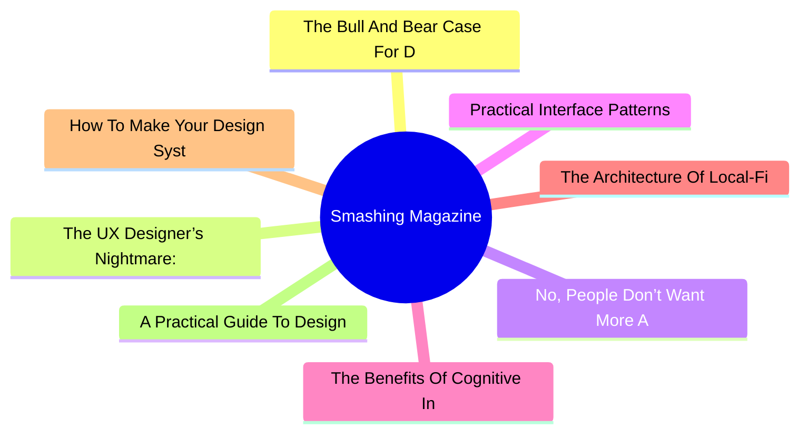
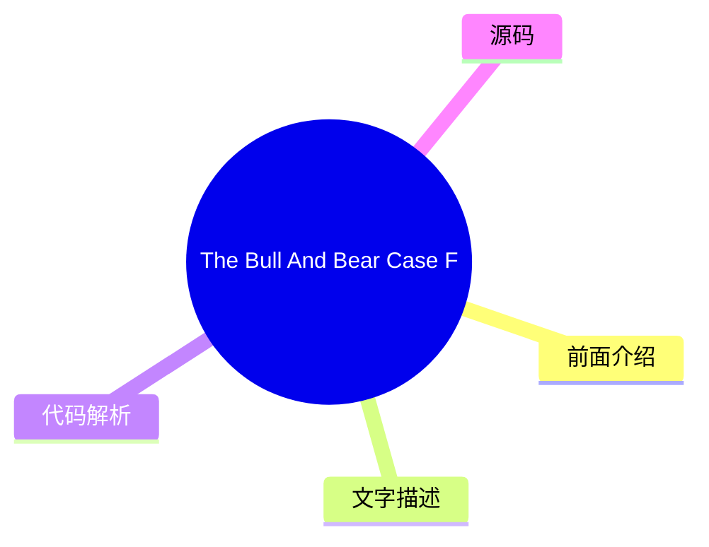
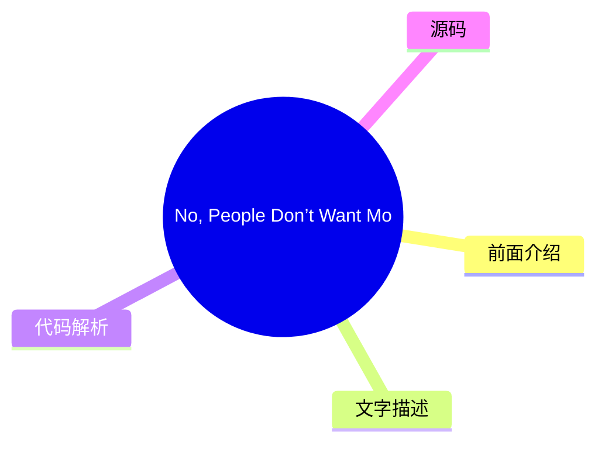
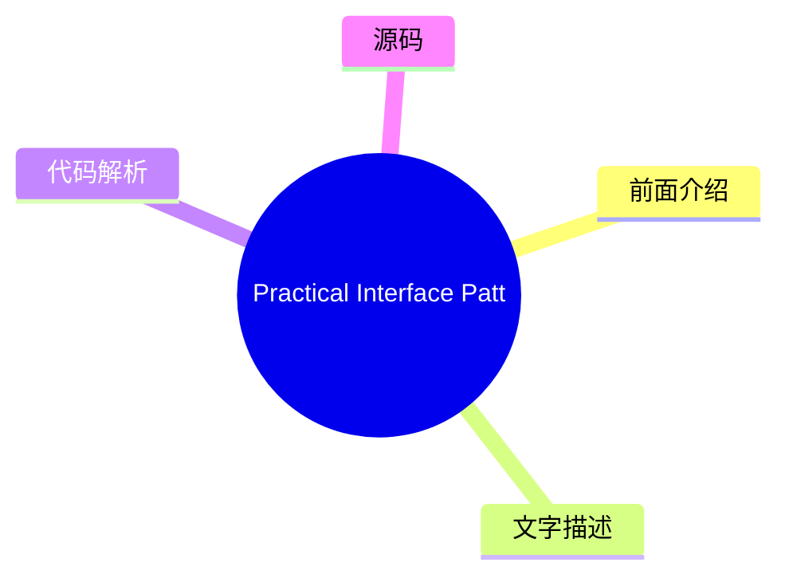
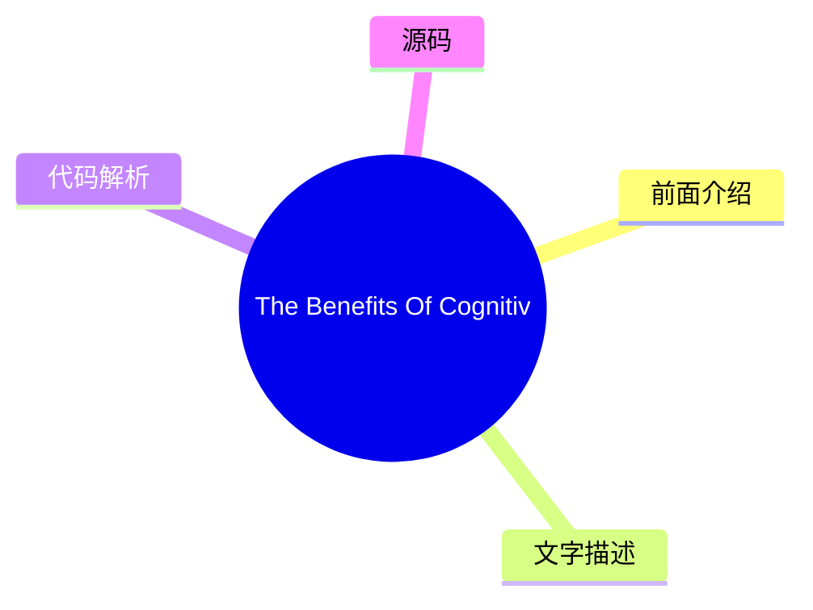
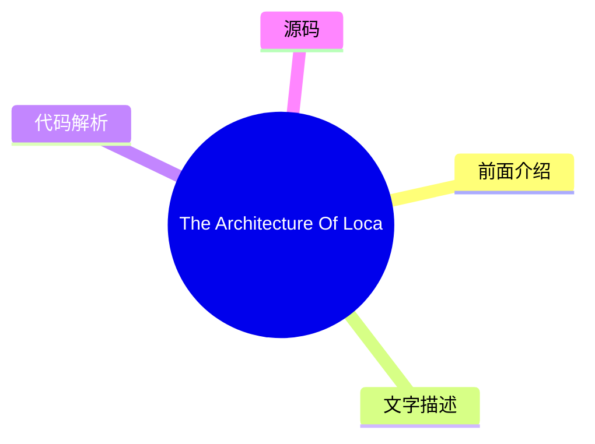
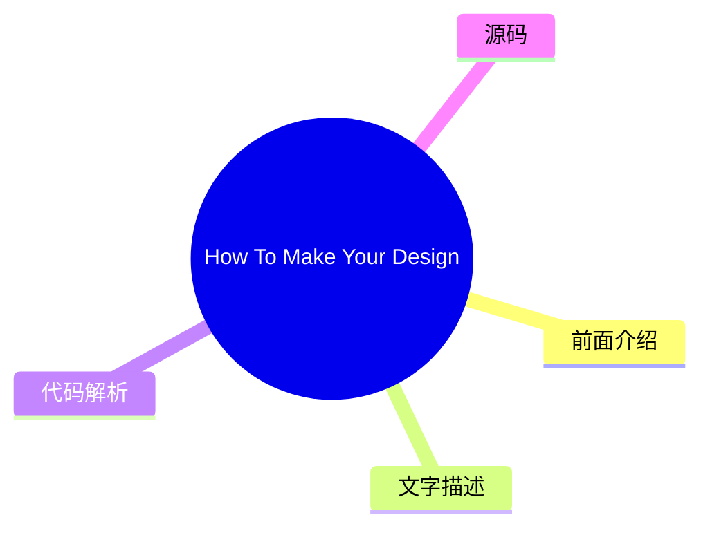
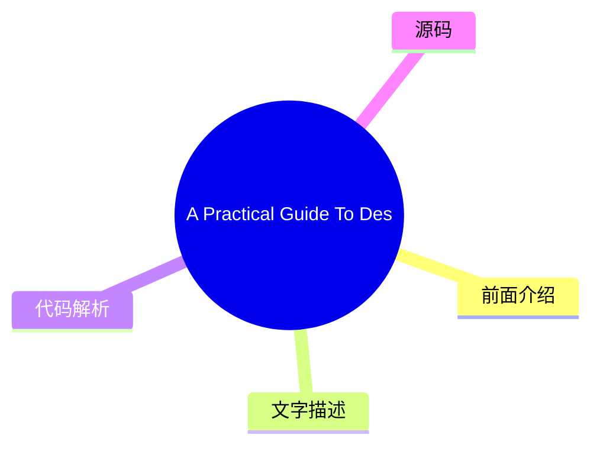

# 🔥 Smashing Magazine Top 8 (2026-08-01)

## 前面介绍

- 数据源：Smashing Magazine
- 抓取日期：2026-08-01
- 条目数：8
- 含完整正文：8
- 含代码片段：1
- 组织方式：前面介绍 / 树状图 / 文字描述 / 代码解析 / 源码

## 思维导图



## 详细整理（8 条，8 条含全文，1 条含代码）

### 1. The Bull And Bear Case For Digital Design In The Age Of AI
- **链接**: [https://smashingmagazine.com/2026/07/bull-and-bear-case-digital-design-age-ai/](https://smashingmagazine.com/2026/07/bull-and-bear-case-digital-design-age-ai/)
- **发布**: Wed, 29 Jul 2026 13:00:00 GMT

#### 前面介绍

- As AI reshapes product design, it could give designers greater autonomy or expose the gaps that autonomy makes harder to hide. Exploring both the bull and bear cases, Andy Budd examines what happens when designers need less permission to act.
- 发布时间：Wed, 29 Jul 2026 13:00:00 GMT

#### 树状图



#### 文字描述

- Designers have spent years saying they would do better work if the organisation got out of the way. Not always in those exact words, obviously. It usually comes out as something more reasonable: we didn’t get enough engineering time, product had already decided the solution, the roadmap was too packed, leadership only cared about this quarter’s numbers, research got cut, the ex
- ## The Bull Case: Designers Need Less Permission A good designer can now move from *“we should fix this”* to *“I fixed this, and pushed it live.”* They can prototype the alternative onboarding flow, write and test clearer product copy, build a rough working version of the interaction, clean up small pieces of design debt without waiting three months for a roadmap slot, and make
- ## The Bear Case: Autonomy Exposes The Gaps Autonomy has teeth. If AI gives designers more room to act, it also removes some of the cover. The same constraints that held good designers back have also protected weaker ones from being tested too directly. For years, it has been easy to say: I had a better idea, but we never got the engineering time. Sometimes that was exactly wha
- ## Where I Think We Might End Up The painful part is that both futures can be true at the same time. AI can make the best designers more capable and many average designers less necessary. It can give design more agency while reducing design headcount. It can help a small number of designers move closer to product leadership while pushing others into governance and clean-up work

#### 代码解析

- 本文未检测到明确代码块，内容更偏新闻、观点或方法论。

#### 源码

#### 中文节选

设计师们多年来一直表示，如果组织能少干涉，他们就能做出更好的作品。当然，这未必是原话。通常表达得更委婉一些：我们没有获得足够的工程时间，产品已经决定了解决方案，路线图排得太满，领导层只关心本季度的业绩，研究被砍掉了，实验从未正确运行，设计债虽然众所周知，但没人愿意花一个冲刺周期去修复。

其中很多都是事实。大多数设计师都在产品和工程之间那个尴尬的中间地带工作过。产品界定问题，或者至少自认为界定了问题。工程决定什么是可行的，或者至少什么是负担得起的。设计被期望让事物更清晰、更简单、更连贯、更易用，偶尔还要更吸引人，同时还要小心不要过多地破坏计划。

那个位置一直都不舒服。

设计师被告知要战略性思考，但往往缺乏战略性行动的权力。

他们能发现糟糕的入职流程、令人困惑的升级路径、让用户感到愚蠢的空状态、在产品评测中看起来合理但在实际使用中毫无意义的特性。发现问题是一回事。让问题得到修复是另一回事。

因此，设计往往变成了**争论**。你提出论据。你标注流程。你拿出研究片段。你指向支持工单。你展示 Figma 原型。你解释为什么那个“小边缘情况”实际上是半数新用户的首次运行体验。然后大家都点头，表示同意这很重要，然后继续去处理那些已经列入路线图的事情。

这就是 AI 对设计来说比通常的“会取代设计师吗？”的争论更有趣的原因之一。真正的变化不是设计师能制作更多的界面。没人需要更多的界面。有趣的变化是设计师**可能需要更少的许可**。

## 看涨理由：设计师需要更少的许可

一名优秀的设计师现在可以从 *“我们应该修复这个问题”* 转变为 *“我已经修复了这个问题，并将其推上线。”* 他们可以针对替代的引导流程进行原型设计，撰写并测试更清晰的产品文案，构建交互的粗略可用版本，在不等待三个月的路线图空档期的情况下清理设计债务的小碎片，并让更好的事物变得 **足够显眼**，从而变得 **难以忽视**。

这改变了工作的政治属性。设计往往依赖于说服，因为设计师缺乏直接的生产手段。AI 削弱了这种依赖性。并非在所有地方，也并非针对所有事物。复杂的产品仍然需要架构、基础设施、数据模型、权限、安全、合规、遗留系统以及所有其他让软件变得棘手的、不引人注目的原因。但边界正在移动。

现在，拥有想法和将想法变为现实之间的差距，可以通过拥有正确工具的积极进取的设计师来跨越。

在这个未来的版本中，设计

#### 完整正文（中文）

设计师们多年来一直表示，如果组织能少干涉，他们就能做出更好的作品。当然，这未必是原话。通常表达得更委婉一些：我们没有获得足够的工程时间，产品已经决定了解决方案，路线图排得太满，领导层只关心本季度的业绩，研究被砍掉了，实验从未正确运行，设计债虽然众所周知，但没人愿意花一个冲刺周期去修复。

其中很多都是事实。大多数设计师都在产品和工程之间那个尴尬的中间地带工作过。产品界定问题，或者至少自认为界定了问题。工程决定什么是可行的，或者至少什么是负担得起的。设计被期望让事物更清晰、更简单、更连贯、更易用，偶尔还要更吸引人，同时还要小心不要过多地破坏计划。

那个位置一直都不舒服。

设计师被告知要战略性思考，但往往缺乏战略性行动的权力。

他们能发现糟糕的入职流程、令人困惑的升级路径、让用户感到愚蠢的空状态、在产品评测中看起来合理但在实际使用中毫无意义的特性。发现问题是一回事。让问题得到修复是另一回事。

因此，设计往往变成了**争论**。你提出论据。你标注流程。你拿出研究片段。你指向支持工单。你展示 Figma 原型。你解释为什么那个“小边缘情况”实际上是半数新用户的首次运行体验。然后大家都点头，表示同意这很重要，然后继续去处理那些已经列入路线图的事情。

这就是 AI 对设计来说比通常的“会取代设计师吗？”的争论更有趣的原因之一。真正的变化不是设计师能制作更多的界面。没人需要更多的界面。有趣的变化是设计师**可能需要更少的许可**。

## 看涨理由：设计师需要更少的许可

A good designer can now move from *“we should fix this”* to *“I fixed this, and pushed it live.”* They can prototype the alternative onboarding flow, write and test clearer product copy, build a rough working version of the interaction, clean up small pieces of design debt without waiting three months for a roadmap slot, and make the better thing **visible enough** that it becomes **harder to ignore**.

That changes the politics of the work. Design has often relied on persuasion because designers lacked direct means of production. AI weakens that dependency. Not everywhere, and not for everything. Complex products still have architecture, infrastructure, data models, permissions, security, compliance, legacy systems, and all the other unglamorous reasons software is hard. But the boundary is moving.

More of the gap between having the idea and making the idea real can now be crossed by a motivated designer with the right tools.

In this version of the future, designers become **less permission-dependent**: less reliant on product to bless the problem, less reliant on engineering to make every small improvement real, less trapped in the role of internal critic, taste-provider, or Figma operator. More able to make, test, repair, and ship.

The best designers start to look less like traditional product designers and more like **hybrid product leaders**. They still care about interaction, hierarchy, language, flow, brand and craft, but they also understand the commercial shape of the problem. They can make trade-offs. They can prototype in code, or close enough to code. They can use AI to explore options quickly, then use judgment to throw most of them away. They can sit with a founder or PM and move from a vague product concern to something tangible by the end of the day.


There may be fewer of these people, but they will be harder to ignore. The current design-org model was partly built around **scarcity**: scarce engineering time, slow production, expensive prototypes, handoffs between specialists, heavy coordination across teams. If AI reduces some of that scarcity, it probably reduces the need for some of the roles that grew around it. The optimistic case is not that every designer keeps their job and gets a productivity boost. That feels like wishful thinking. The more believable version is that the total number of designers goes down, but the designers who remain have **more direct influence over the product**.

That is not a bad outcome for the strongest designers. It may even be the thing many of them have wanted for years.

## The Bear Case: Autonomy Exposes The Gaps

Autonomy has teeth. If AI gives designers more room to act, it also removes some of the cover. The same constraints that held good designers back have also protected weaker ones from being tested too directly.

For years, it has been easy to say: I had a better idea, but we never got the engineering time. Sometimes that was exactly what happened. Sometimes the better idea was never really more than a critique. It had not been made concrete. It had not been tested. It had not dealt with the awkward trade-offs. It sounded strong because it lived safely in opposition to the shipped thing.

A lot of designers are good at noticing what is wrong. Fewer are good at deciding what should happen instead. Fewer still can make that alternative real enough for other people to judge. AI will expose this gap.

If you can prototype the recommendation, the recommendation has to get better. If you can make the alternative flow, the flow has to survive contact with details. If you can test the product copy, you have to care what happens when users read it. If you can fix the small piece of design debt, you have to decide whether it was really worth fixing.


Some designers are not as strategic as they think they are. They have learned the language of strategy without the discomfort of **owning outcomes**. They can talk about user needs, business goals, systems thinking, and product quality, but struggle when asked to make a call. They want influence, but not the **exposure** that comes with it.

The profession has spent a long time arguing that design deserves more power. Fine. But more power means fewer excuses. It means the work is judged less by the elegance of the argument and more by the quality of the thing you made, tested, or changed. That is a better standard, but it will not be kind to everyone.

There is a second bear case, and it is probably the one large design teams should worry about most. Product and engineering already have more institutional power than design in most companies. They own the roadmap, the technical architecture, the sprint machinery, the metrics, and usually the language leadership understands. Design often has to translate its concerns into someone else’s terms before they count.

AI may not rebalance that power. It may hand product and engineering enough **design capability** to make design easier to bypass. A PM who can generate a decent flow, decent copy, and a decent prototype may not feel the same need to involve design early. An engineer who can use AI to produce a reasonable interface may decide the design system covers enough of the decision-making. A founder who can get to a polished demo in an afternoon may confuse polish with product thinking.

The problem is not that these people will suddenly become great designers. The problem is that many companies do not know the difference between great design and plausible design. **Plausible design is dangerous.** It looks coherent in a product review. It uses the right components. The spacing is fine. The copy is not embarrassing. The flow mostly works. Nobody in the meeting feels strongly enough to object. So it ships.


许多糟糕的产品决策之所以能存活，是因为它们看起来合情合理。AI 将会产出更多此类决策。这就是设计可能迅速失势的地方：并非因为品味、判断力、研究和交互思维不再重要，而是因为设计的可见输出变得更容易被其他职能模仿。

如果一家公司已经认为设计主要是屏幕、原型和打磨，AI 就会提供一种更廉价的方式来获取这些东西。

在那个世界里，设计并不会获得更多的主导权。它会被收窄。剩下的设计师将管理设计系统、监管组件使用、审查已确定的流程、整理界面、维护品牌一致性，并被拉入高风险的发布、高管演示以及偶尔出现的混乱跨平台问题中。这是有用的工作，但涉及的领域更小。更少地塑造产品，更多地维护“家具”。

这就是为什么“AI 将自动化那无聊的 20%”这一论点让人感到过于舒适的原因。在某些公司，也许确实会发生这种情况。但在大型科技组织中，设计团队是围绕协调、生产和流程发展起来的，削减的幅度可能会深得多。不是 20%。可能是 50%。甚至更多。特别是在那些领导层从未真正理解设计团队为何会变得如此庞大的地方。

## 我认为我们可能会走向何方

痛苦的是，这两种未来可能同时成立。AI 可以让最优秀的设计师变得更强大，同时让许多平庸的设计师变得不再必要。它可以在减少设计人员编制的同时，赋予设计更多的主导权。它可以帮助少数设计师更接近产品领导层，同时将其他人推向治理和清理工作。它可以解放设计师，不再需要等待许可，随后揭示出有些人其实更习惯等待而非行动。

“

他们会有品味，但品味是不够的。他们需要**产品判断力**、**技术好奇心**、**商业意识**，以及在每一个变量都确定之前做出决策的**胆识**。他们需要能够自如地在客户对话、原型、定价问题、品牌疑问和混乱的实施细节之间切换，而不坚持认为所有这些都属于别人。

我不完全确定我们会走向何方。我希望它更接近*看涨情形*：更少的审批结构，更多的动手实践，更多的自主权，以及更好的设计师终于能够展示他们的能力，而不受周围机器的掣肘。

我担心它可能更接近*看跌情形*：产品和工程吸纳了大部分工作，公司认为看似合理的设计就足够好了，而设计则失去了地位、人员编制和战略阵地。

实际上，它可能只是两者的某种令人不适的混合体。有些设计师将利用 AI 获得更多的自主权。有些公司将利用它来减少对设计师的需求。有些团队将产出更好的作品，因为判断与执行之间的距离变短了。而另一些团队将交付更多看似平庸的作品，因为房间里没有人能分辨出其中的差别。

多年来，设计师一直声称，如果不受周围组织的束缚，他们能够创造更多的价值。AI 即将验证这一说法。有些人将最终证明这一点。有些人则会发现，这些束缚其实是帮了他们的忙。

### 更多资源

- “[Good from Afar, But Far from Good: AI Prototyping in Real Design Contexts](https://www.nngroup.com/articles/ai-prototyping/)，” Huei-Hsin Wang 和 Megan Brown*(NN/Group)*
 UX 设计领域充斥着从自然语言提示生成界面的 AI 原型工具。尽管营销炒作巨大，但在真实设计场景下的评估显示，虽然这些工具可以遵循指令以实现一般目标，但它们往往缺乏权衡设计取舍的精细度，也无法在没有人类广泛指导的情况下产生深思熟虑的高质量设计。

- “[AI Design Tools Are Marginally Better: Status Update](https://www.nngroup.com/articles/ai-design-tools-update-2/?lm=ai-prototyping&pt=article),” Megan Brown, Caleb Sponheim and Taylor Dykes*(NN/Group)*
 AI-powered design tools have improved, yet we’re still nowhere near the usef

...（截断，原文 14445+ 字符）


### 2. The UX Designer’s Nightmare: When “Production-Ready” Becomes A Design Deliverable
- **链接**: [https://smashingmagazine.com/2026/04/production-ready-becomes-design-deliverable-ux/](https://smashingmagazine.com/2026/04/production-ready-becomes-design-deliverable-ux/)
- **发布**: Wed, 22 Apr 2026 10:00:00 GMT

#### 前面介绍

- In a rush to embrace AI, the industry is redefining what it means to be a UX designer, blurring the line between design and engineering. Carrie Webster explores what’s gained, what’s lost, and why designers need to remain the guardians of the user ex
- 发布时间：Wed, 22 Apr 2026 10:00:00 GMT

#### 树状图


#### 文字描述

- In early 2026, I noticed that the UX designer’s toolkit seemed to shift overnight. The industry standard *“Should designers code?”* debate was abruptly settled by the market, not through a consensus of our craft, but through the brute force of job requirements. If you browse LinkedIn today, you’ll notice a stark change: UX roles increasingly demand ** AI-augmented development**
- ## The LinkedIn Pressure Cooker: Role Creep In 2026 The job market is sending a clear signal. While traditional graphic design roles are expected to grow by only **3%** through 2034, UX, UI, and [Product Design roles](https://www.nobledesktop.com/careers/designer/job-outlook#:~:text=The%20projected%20future%20growth%20figures%20for%20Digital,job%20growth%20(which%20lies%20somew
- ### The Competence Trap: Two Job Skill Sets, One Average Result There is potentially a very dangerous myth circulating in boardrooms that AI makes a designer “equal” to an engineer. This narrative suggests that because an LLM can generate a functional JavaScript event handler, the person prompting it doesn’t need to understand the underlying logic. In reality, attempting to mas
- ### The “Averagely Competent” Dilemma For a senior UX designer to become a senior-level coder is like asking a master chef to also be a master plumber because “they both work in the kitchen.” You might get the water running, but you won’t know why the pipes are rattling. - **The “cognitive offloading” risk.** Research shows that while AI can speed up task completion, it often l

#### 代码解析

- 本文未检测到明确代码块，内容更偏新闻、观点或方法论。

#### 源码

#### 中文节选

2026年初，我注意到 UX 设计师工具箱似乎在一夜之间发生了转变。行业标准“设计师应该会写代码吗？”的争论被市场突然平息了，不是通过我们行业的共识，而是通过职位要求的蛮力。如果你今天浏览 LinkedIn，你会注意到一个显著的变化：UX 职位越来越多地要求 **AI 增强开发**、**技术编排**和**生产就绪的原型设计**。

对许多人来说，包括我自己，这是终极的设计噩梦。我们被要求同时交付“氛围感”和“代码”，使用 AI 代理来跨越以前需要多年计算机科学知识和编码经验才能跨越的技术鸿沟。但随着行业急于满足这些新期望，他们发现 AI 生成的功能性代码并不总是*好*代码。

## LinkedIn 的压力锅：2026 年的角色蔓延

就业市场发出了一个明确的信号。虽然传统平面设计职位预计到 2034 年仅增长 **3%**，但 UX、UI 和 [产品设计职位](https://www.nobledesktop.com/careers/designer/job-outlook#:~:text=The%20projected%20future%20growth%20figures%20for%20Digital,job%20growth%20(which%20lies%20somewhere%20around%205%25).) 在同一时期预计增长 **16%**。

然而，这种增长越来越多地与 **AI 产品开发**的兴起相关联，其中“设计技能”最近已成为排名第一的最具需求的能力，甚至超过了编码和云基础设施。构建这些平台的公司不再仅仅寻找视觉设计师；他们需要能够“将技术能力转化为以人为中心体验”的专业人士。

This creates a high-stakes environment for the UX designer. We are no longer just responsible for the interface; we are expected to understand the technical logic well enough to ensure that complex AI capabilities feel intuitive, safe, and useful for the human on the other side of the screen. Designers are being pushed toward a **“design engineer” model**, where we must bridge the gap between abstract [AI logic and user-facing code](https://www.refontelearning.com/blog/ui-ux-designer-engineering-in-2026-crafting-future-ready-user-experiences#skills-and-competencies-for-the-2026-uiux-designer-3).

A [recent survey](https://www.lyssna.com/blog/ux-design-trends/) found that **73% of designers** now view AI as a primary collaborator rather than just a tool. However, this “collaboration” often looks like “role creep.” Recruiters are often not just looking for someone who understands user empathy and information architecture — they want someone who can also prompt a React component into existence and push it to a repository!

This shift has created a **competency gap**.

As an experienced senior designer who has spent decades mastering the nuances of cognitive load, accessibility standards, an

#### 完整正文（中文）

2026年初，我注意到 UX 设计师工具箱似乎在一夜之间发生了转变。行业标准“设计师应该会写代码吗？”的争论被市场突然平息了，不是通过我们行业的共识，而是通过职位要求的蛮力。如果你今天浏览 LinkedIn，你会注意到一个显著的变化：UX 职位越来越多地要求 **AI 增强开发**、**技术编排**和**生产就绪的原型设计**。

对许多人来说，包括我自己，这是终极的设计噩梦。我们被要求同时交付“氛围感”和“代码”，使用 AI 代理来跨越以前需要多年计算机科学知识和编码经验才能跨越的技术鸿沟。但随着行业急于满足这些新期望，他们发现 AI 生成的功能性代码并不总是*好*代码。

## LinkedIn 的压力锅：2026 年的角色蔓延

就业市场发出了一个明确的信号。虽然传统平面设计职位预计到 2034 年仅增长 **3%**，但 UX、UI 和 [产品设计职位](https://www.nobledesktop.com/careers/designer/job-outlook#:~:text=The%20projected%20future%20growth%20figures%20for%20Digital,job%20growth%20(which%20lies%20somewhere%20around%205%25).) 在同一时期预计增长 **16%**。

然而，这种增长越来越多地与 **AI 产品开发**的兴起相关联，其中“设计技能”最近已成为排名第一的最具需求的能力，甚至超过了编码和云基础设施。构建这些平台的公司不再仅仅寻找视觉设计师；他们需要能够“将技术能力转化为以人为中心体验”的专业人士。

This creates a high-stakes environment for the UX designer. We are no longer just responsible for the interface; we are expected to understand the technical logic well enough to ensure that complex AI capabilities feel intuitive, safe, and useful for the human on the other side of the screen. Designers are being pushed toward a **“design engineer” model**, where we must bridge the gap between abstract [AI logic and user-facing code](https://www.refontelearning.com/blog/ui-ux-designer-engineering-in-2026-crafting-future-ready-user-experiences#skills-and-competencies-for-the-2026-uiux-designer-3).

A [recent survey](https://www.lyssna.com/blog/ux-design-trends/) found that **73% of designers** now view AI as a primary collaborator rather than just a tool. However, this “collaboration” often looks like “role creep.” Recruiters are often not just looking for someone who understands user empathy and information architecture — they want someone who can also prompt a React component into existence and push it to a repository!

This shift has created a **competency gap**.

As an experienced senior designer who has spent decades mastering the nuances of cognitive load, accessibility standards, and ethnographic research, I am suddenly finding myself being judged on my ability to debug a CSS Flexbox issue or manage a Git branch.

The nightmare isn’t the technology itself. It’s the **reallocation of value**.

“

### The Competence Trap: Two Job Skill Sets, One Average Result

There is potentially a very dangerous myth circulating in boardrooms that AI makes a designer “equal” to an engineer. This narrative suggests that because an LLM can generate a functional JavaScript event handler, the person prompting it doesn’t need to understand the underlying logic. In reality, attempting to master two disparate, deep fields simultaneously will most likely lead to being **averagely competent** at both.

### The “Averagely Competent” Dilemma

For a senior UX designer to become a senior-level coder is like asking a master chef to also be a master plumber because “they both work in the kitchen.” You might get the water running, but you won’t know why the pipes are rattling.


- **“认知卸载”风险。**
 研究表明，虽然 AI 可以加快任务完成速度，但它往往会导致概念掌握能力的显著下降。在一项受控研究中，使用 AI 辅助的参与者在理解测试中的得分比那些手动编写代码的人低 [17%](https://www.psychologytoday.com/au/blog/the-asymmetric-brain/202602/cognitive-offloading-using-ai-reduces-new-skill-formation)。
- **调试差距。**
 AI 依赖型用户和手动编码者之间最大的性能差距在于 [调试](https://www.anthropic.com/research/AI-assistance-coding-skills)。当设计师使用 AI 编写他们不完全理解的代码时，他们没有能力识别 *何时* 以及 *为何* 它会失败。

因此，如果设计师发布了一个在流量高峰期间崩溃且无法手动追踪逻辑的 AI 生成的组件，他们就不再是专家。他们现在成了一个隐患。

### 未优化代码的高昂代价

任何有经验的代码工程师都会告诉你，如果没有正确的提示词，仅凭 AI 创建代码会导致大量的返工。由于大多数设计师缺乏审计 AI 提供的代码的技术基础，他们会在无意中发布大量的 [“质量债务”](https://gocrossbridge.com/blog/ai-generated-code/)。

## 设计师生成 AI 代码中的常见问题

- **安全漏洞**
 近期报告显示，高达 [92% 的 AI 生成的代码库](https://www.sherlockforensics.com/pages/ai-code-security-report-2026.html)至少包含一个关键漏洞。设计师可能会看到一个功能正常的登录表单，却不知道它在 XSS 防御方面的失败率高达 86%，XSS 防御是旨在防止攻击者将恶意脚本注入到可信网站的安全措施。
- **无障碍错觉**

AI 经常生成缺乏语义完整性的“功能性”应用程序。设计师可能会提示生成一个“美观且功能齐全的切换开关”，但 AI 可能会提供一个非语义化的 `<div>`，它缺乏键盘焦点和屏幕阅读器兼容性，从而产生了 [可访问性债务](https://www.levelaccess.com/blog/accessibility-debt-in-software-development-and-how-to-engineer-it-out/)，日后修复起来代价高昂。

- **性能惩罚**
 AI 生成的代码往往冗长。AI 导致的 [代码重复率比人工编写的代码高出 4 倍](https://www.netcorpsoftwaredevelopment.com/blog/ai-generated-code-statistics)。这种冗长导致页面加载缓慢，生成巨大的 CSS 文件，并对 SEO 产生负面影响。对业务而言，任务看起来是“完成了”。但对于连接缓慢的用户或屏幕阅读器用户来说，该网站是一场噩梦。

## 创造更多工作，而非更少

AI 的承诺是设计师可以无需打扰工程师即可发布功能。现实却是诞生了一种 **“返工税”**，正在耗尽整个行业的工程资源。

- **清理工作**
 组织发现，虽然开发速度提高了，但每个拉取请求（Pull Request）中的事故率也上升了 [23.5%](https://blog.exceeds.ai/ai-code-analysis-benchmark-reports/)。一些工程团队现在每周花费大量时间清理设计团队跳过严格审查流程而交付的“AI 垃圾内容”。
- **沟通鸿沟**
 只有 [69% 的设计师](https://www.lyssna.com/blog/ux-design-trends/)认为 AI 提高了他们工作的质量，而 [82% 的开发者](https://www.lyssna.com/blog/ux-design-trends/)认为如此。这种差距之所以存在，是因为“能编译的代码”与“可维护的代码”是不同的。

当设计师移交忽略公司内部命名约定或管理模式模式的 AI 生成的代码时，他们并没有帮助工程师；他们是在制造一个以后必须由他人解决的谜题。

### 解决方案

我们需要摆脱“**独行全栈设计师**”的噩梦，转向 **设计师/程序员协作** 的模式。

**理想的现实：**

- **协作伙伴关系**

与其让设计师试图成为平庸的程序员，他们应该参与 **人机协作循环**。资深 UX 设计师应与工程师合作使用 AI；设计师为 **意图、无障碍性和用户流程** 创建提示词，而工程师为 **架构和性能** 创建提示词。

- **设计系统作为护栏**
 为了防止无障碍债务大规模蔓延，[无障碍组件必须是设计系统的默认选项](https://webaim.org/projects/million/)。AI 应用于将这些标记输入到您的 UI 中，确保生成的代码也保持在“单一事实来源”之内。

## 超越提示词

目前行业处于“AI 迷恋”状态，但钟摆最终会回归质量。

“
那些在没有工程监督的情况下优先考虑“设计师交付代码”的企业，最终将面临技术债务、安全漏洞和无障碍诉讼的清算。那些在 2026 年及以后蓬勃发展起来的设计师，将是那些拒绝成为“提示词操作员”，而是将自己定位为 **用户体验守护者** 的人。这对经验丰富的设计师和行业来说都是完美的结果。

我们的价值一直在于我们能够为屏幕另一端的人进行倡导。我们必须利用 AI 来增强我们的设计思维，使我们能够测试更多的想法并更快地迭代，但我们绝不能让它取代确保我们的设计在技术上对每个人都*有效*的专门工程专业知识。

### UX 设计师总结清单

- **共同工作。**
 将 AI 生成的代码作为起点，与开发人员沟通。不要将其作为跳过与他们合作的捷径。请他们帮助您编写代码创建的提示词，以获得最佳结果。
- **理解“原因”。**
 永远不要提交您不理解其原理的代码。如果您无法解释 AI 生成的逻辑是如何工作的，就不要将其包含在您的工作中。
- **为所有人设计。**
 好的设计不仅仅是外观。使用 AI 检查您的代码是否适用于使用屏幕阅读器或键盘的人，而不仅仅是让事物看起来漂亮。


### 3. No, People Don’t Want More AI In Their Life
- **链接**: [https://smashingmagazine.com/2026/07/people-dont-want-more-ai/](https://smashingmagazine.com/2026/07/people-dont-want-more-ai/)
- **发布**: Wed, 15 Jul 2026 10:00:00 GMT

#### 前面介绍

- Many companies assume everyone craves new AI features. But the reality is that most people don't want more AI &mdash; at least not in the way most AI leaders envision it. Brought to you by Design Patterns For AI Interfaces, **friendly video courses o
- 发布时间：Wed, 15 Jul 2026 10:00:00 GMT

#### 树状图



#### 文字描述

- Many companies silently assume that everybody wants more AI in their lives. That people are **craving new AI features**, new AI products, new AI workflows — that would all magically replace all existing outdated practices and broken ways of working. But in reality, it seems like **people don’t want more AI** at all — at least not in the way most AI leaders envision it. Unsurpri
- ## The AI People Don’t Need It’s remarkably difficult to make a strong argument with senior leadership, but [AI is not a value proposition](https://www.nngroup.com/articles/powered-by-ai-is-not-a-value-proposition/). New AI features don’t magically make for happy or excited customers. Because AI features are often bolt-ons and separate tools for employees to use, they typically
- ## The AI People Actually Need I’m always puzzled by the comparison of AI features with how unreliable humans are. But people don’t compare software with other people. They **compare features with features** — and if one feature in one product is unreliable, while a similar feature works flawlessly in another, they choose the latter. It’s not about AI or not AI, but rather what
- ## Wrapping Up Perhaps I’m missing a bigger picture, and perhaps I’m just old school — but **I really do like people**. Their stories, their thinking, their emotions, their enthusiasm, their laughing. AI can be remarkably helpful in many situations, but so are people. And between the two, I would favor **spending time with a human** — however imperfect they are — every single t

#### 代码解析

- 本文未检测到明确代码块，内容更偏新闻、观点或方法论。

#### 源码

#### 中文节选

许多公司默默假设每个人都想在他们的生活中拥有更多的 AI。人们渴望新的 AI 功能、新的 AI 产品、新的 AI 工作流——这些都会神奇地取代所有现有的过时做法和糟糕的工作方式。

但在现实中，似乎人们根本**不需要更多的 AI**——至少不是大多数 AI 领导者设想的那种方式。毫不意外，许多 AI 功能的[采用率和留存率很低](https://www.mindstudio.ai/blog/ai-adoption-gap-ibm-2026-study)——这以极高的交付成本和极高的声誉受损风险为代价。

## 人们不需要的 AI

向高级管理层进行强有力的论证出奇地困难，但[AI 不是价值主张](https://www.nngroup.com/articles/powered-by-ai-is-not-a-value-proposition/)。新的 AI 功能并不会神奇地让客户感到快乐或兴奋。由于 AI 功能通常是附加项和员工使用的独立工具，它们通常会**把人从**他们常规的工作方式中**剥离出来**。

AI 非常擅长**放大组织中的捷径和不足**——从数据质量到决策制定。它无法神奇地修复多年积累的快速修补、技术债务、糟糕的文化和内部政治。如果有任何变化，它们会随着 AI 变得更加明显，表现为不一致或相互冲突的优先级，并直接交给用户，然后让用户自己去理清这些混乱。

因为在大多数组织中，工作通常需要在大量不连接和碎片化的系统之间频繁切换，有了新的 AI 工具，他们现在又多了一个需要切换的系统。这通常会产生更多的工作，而且通常也不是特别令人满意的工作。

此外，人们非常清楚[查找和修复 AI 幻觉的成本](https://www.nngroup.com/articles/ai-chatbots-discourage-error-checking/)。要求 AI 生成响应**可能感觉比从头开始编写更容易**，但这是有代价的：

- **通读**整个 AI 输出，
- **找出**需要重点关注的关键点，
- **逐一****审查/验证**关键点，
- **检查**后续内容的**理由**，

- **Articulate corrections**+ regenerate,
- **Review the response**(a number of times).

For many people, AI isn’t something they can proactively choose and explore on their own — it arrives uninvited, at someone else’s pace. On top of that, plenty of messages amplify **fears and worries about AI** replacing work — so it’s hardly surprising that the perception of AI isn’t excitement. It’s **resistance to change** and deep anxiety about one’s place in a world that seems to be changing without them.

At best, AI features might be silently accepted or nodded away. At worst, AI **raises concerns**, doubts, caution — and calls for a healthy dose of skepticism. And sometimes it’s perceived as a threat or **liability** — because unlike other features, AI is neither predictable nor reliable.

People don’t dream of

#### 完整正文（中文）

许多公司默默假设每个人都想在他们的生活中拥有更多的 AI。人们渴望新的 AI 功能、新的 AI 产品、新的 AI 工作流——这些都会神奇地取代所有现有的过时做法和糟糕的工作方式。

但在现实中，似乎人们根本**不需要更多的 AI**——至少不是大多数 AI 领导者设想的那种方式。毫不意外，许多 AI 功能的[采用率和留存率很低](https://www.mindstudio.ai/blog/ai-adoption-gap-ibm-2026-study)——这以极高的交付成本和极高的声誉受损风险为代价。

## 人们不需要的 AI

向高级管理层进行强有力的论证出奇地困难，但[AI 不是价值主张](https://www.nngroup.com/articles/powered-by-ai-is-not-a-value-proposition/)。新的 AI 功能并不会神奇地让客户感到快乐或兴奋。由于 AI 功能通常是附加项和员工使用的独立工具，它们通常会**把人从**他们常规的工作方式中**剥离出来**。

AI 非常擅长**放大组织中的捷径和不足**——从数据质量到决策制定。它无法神奇地修复多年积累的快速修补、技术债务、糟糕的文化和内部政治。如果有任何变化，它们会随着 AI 变得更加明显，表现为不一致或相互冲突的优先级，并直接交给用户，然后让用户自己去理清这些混乱。

因为在大多数组织中，工作通常需要在大量不连接和碎片化的系统之间频繁切换，有了新的 AI 工具，他们现在又多了一个需要切换的系统。这通常会产生更多的工作，而且通常也不是特别令人满意的工作。

此外，人们非常清楚[查找和修复 AI 幻觉的成本](https://www.nngroup.com/articles/ai-chatbots-discourage-error-checking/)。要求 AI 生成响应**可能感觉比从头开始编写更容易**，但这是有代价的：

- **通读**整个 AI 输出，
- **找出**需要重点关注的关键点，
- **逐一****审查/验证**关键点，
- **检查**后续内容的**理由**，

- **纠正内容**+ 重新生成，
- **审查回复**(多次)。

对许多人来说，AI 并不是他们可以主动选择和探索的东西——它是不请自来的，按照别人的节奏到来。此外，大量的信息都在放大关于 AI 取代工作的**恐惧和担忧**——因此，人们对 AI 的看法并非兴奋。那是**对变化的抗拒**，以及对在一个似乎正在发生改变却唯独没有自己参与的世界中自身位置的深深焦虑。

在最好的情况下，AI 功能可能只是被默默接受或点头略过。在最坏的情况下，AI 会引发**担忧、怀疑、谨慎**，并呼吁保持健康的怀疑态度。有时它被视为一种威胁或**责任**——因为与其他功能不同，AI 既不可预测也不可靠。

人们不会梦想拥有**AI 艺术博物馆**、AI 冰箱、AI 酒店接待或 AI 叙述的儿童读物。他们不希望自己的孩子拥有**浪漫的 AI 伴侣**。大多数人不想主动管理（并在事后清理）在银行账户中漫游并代表他们在现实世界采取行动的**一群 AI 代理**。最值得注意的是，人们并不真的想要一个可以随时与之交谈或输入的神奇盒子。

## 人们真正需要的 AI

我对将 AI 功能与人类的不稳定性进行比较总是感到困惑。但人们不会将软件与其他人进行比较。他们**将功能与功能进行比较**——如果一个产品中的某个功能不可靠，而另一个产品中的类似功能却能完美运行，他们会选择后者。这无关乎 AI 或非 AI，而在于什么能始终如一且可靠地发挥作用，什么不能。

许多关于 AI 的讨论都是关于交付速度的。但对许多人来说，提高交付速度并没有多少价值。他们想要把事情做好，有足够的时间去思考和做出良好的决策。他们也想要**享受花在事情上的时间**，而不仅仅是更快地交付。随着每一次 vibe-coded（氛围编码）的变化，一种巨大的成就感和满足感正在慢慢消失。

People don’t change much. And after all these years, they (still) want features that are fast, accessible, **reliable, predictable and useful** — every single time. And ideally not the ones that replace their entire workflow, but that **augment** their way of working — and that take over the most mundane, annoying, and boring tasks that they find no pleasure in.

Many jobs are [exposed to AI automation](https://www.washingtonpost.com/technology/interactive/2026/jobs-most-affected-ai-automation/), but in many of them there is a rewarding, unique, creative part that requires taste, point of view, and perhaps even human intuition. And if AI **automates boring parts** of it, that’s an advantage for everyone. That’s also what enhances productivity and brings more joy in daily life.

When AI automates tedious and mentally exhausting tasks, its value is much easier to grasp. But for that, AI shouldn’t feel like a bolt-on. It should be **deeply integrated** into people’s existing workflows. It must also match existing **mental models** that they have developed and fine-tuned for years or decades. AI should adapt to how people think and make decisions, not the other way around.

And it doesn’t really matter if these features are branded as “AI”, “smart” or “automation”. However, they must work well for people using them. And that means that people must be **aware of use cases** where it actually helps them, and be inspired to find more use cases on their own.

Ironically, tools that work well there aren’t “AI-first” — they are **“AI-second”**. Subtle, humble, calm, ambient, taking a supportive role in the background for work that otherwise is remarkably dull and unnecessary.

I don’t want to readbooks written by AI. I don’t want to gaze upon paintings by AI. I don’t want AI to teach my children. I don’t want to have an AI therapist. I don’t want AI making my medical decisions. I want AI to do all thephysical and mental laborthat taxes me so I can read books written by humans and go to art galleries to engage with art made by humans. I want AI that makes my life easier rather than forces me to change myself.


—[Bo Young Lee](https://www.linkedin.com/feed/update/urn:li:share:7467162929474420737/)

## 总结

也许是我忽略了更大的图景，又或许我只是老派——但我**真的很喜欢人**。他们的故事、他们的思考、他们的情感、他们的热情、他们的笑声。AI 在许多情况下都非常有帮助，但人也一样。在这两者之间，我每次都会选择**与人类共度时光**——无论他们多么不完美。

不，**人们的生活不需要更多的 AI**——他们需要 AI 来自动化他们每天必须处理的所有无聊事情，这样他们就有更多的时间和空间去做他们真正热爱和享受的事情。这并不意味着花更多时间与 AI 在一起——而是花更多时间与他们爱的人在一起。

## 认识“AI 界面设计模式”

认识 [Design Patterns For AI Interfaces](https://ai-design-patterns.com/)，这是 Vitaly 的新

**视频课程**，包含来自真实产品的实用示例——即将举办

[live UX 培训](https://smashingconf.com/online-workshops/workshops/ai-interfaces-vitaly-friedman/)。

[跳转到免费预览](https://www.youtube.com/watch?v=jhZ3el3n-u0)。

## 有用的资源

- [AI 采用差距：IBM 2026 研究](https://www.mindstudio.ai/blog/ai-adoption-gap-ibm-2026-study)，作者 MindStudio
- [“由 AI 驱动”并非价值主张](https://www.nngroup.com/articles/powered-by-ai-is-not-a-value-proposition/)，作者 Nielsen Norman Group
- [AI 聊天机器人会阻碍错误检查](https://www.nngroup.com/articles/ai-chatbots-discourage-error-checking/)，作者 Nielsen Norman Group
- [受 AI 自动化影响最大的工作](https://www.washingtonpost.com/technology/interactive/2026/jobs-most-affected-ai-automation/)，作者 The Washington Post
- [关于 AI 以及我们实际上对它的期望](https://www.linkedin.com/feed/update/urn:li:share:7467162929474420737/)，作者 Bo Young Lee


### 4. Practical Interface Patterns For AI Transparency (Part 2)
- **链接**: [https://smashingmagazine.com/2026/05/practical-interface-patterns-ai-transparency/](https://smashingmagazine.com/2026/05/practical-interface-patterns-ai-transparency/)
- **发布**: Wed, 13 May 2026 13:00:00 GMT

#### 前面介绍

- Why traditional loading patterns like spinners fail in agentic AI experiences, and how interface patterns that reveal the system’s process, status, and decision-making can improve transparency and build user trust.
- 发布时间：Wed, 13 May 2026 13:00:00 GMT

#### 树状图



#### 文字描述

- In the [first part of this series](https://www.smashingmagazine.com/2026/04/identifying-necessary-transparency-moments-agentic-ai-part1/), we talked about the **Decision Node Audit**. We mapped out the internal workings of our AI system to pinpoint the exact moments it makes decisions based on probabilities. This told us when the system needs to be transparent with the user. No
- ## Writing Clear Status Updates We often think of transparency as a visual design problem, but it’s really about the **words** we use. Simple, clear explanations (the microcopy) are what build trust and separate a reliable AI from one that feels broken. We need to retire generic placeholders like *Loading* or *Working*. These words are remnants of the era of static software. In
- ## The Agentic Update Formula To give people useful status updates, we need to connect what the system is *doing* with *why* it’s doing it. Keeping with our scheduling agent example, the system should break down that waiting period into at least four clear, separate steps. - First, the interface displays *Checking your calendar to find open times for a recurring Thursday call w
- ## Matching Tone to the Risk Matrix Should an AI sound like a person or act like a robot? The right answer depends on the task’s importance, which we can figure out using the **Impact/Risk Matrix** from our **Decision Node Audit**. For simple, low-risk tasks, a friendly, conversational tone works best. For example, a scheduling assistant can say it’s checking your calendar for 

#### 代码解析

- 本文未检测到明确代码块，内容更偏新闻、观点或方法论。

#### 源码

#### 中文节选

在[本系列的第一部分](https://www.smashingmagazine.com/2026/04/identifying-necessary-transparency-moments-agentic-ai-part1/)中，我们讨论了**决策节点审计**。我们梳理了 AI 系统的内部运作机制，以精确定位其基于概率做出决策的确切时刻。这让我们知道系统何时需要向用户保持透明。现在，核心问题是*如何*分享这些信息。

你已经准备好了**透明度矩阵**。你知道哪些幕后 API 调用需要显示状态更新。你的工程师也认同技术层面的细节。接下来的步骤是为这些更新设计视觉容器。

我们面临着一个遗留问题。三十年来，界面设计师一直依赖一种单一的模式来处理延迟：**旋转器**。旋转的圆圈、闪烁图标、进度条。这些模式传达了一种特定的技术现实。它们告诉用户系统正在检索数据。延迟是由带宽或文件大小引起的。

AI 代理引入了一种新的等待时间。当代理暂停二十秒时，它不仅仅是在下载某样东西；它是在*思考*。它正在确定最佳步骤，权衡选项，并为你请求的内容进行创作。

如果我们用基本的旋转图标来表示这种“思考时间”，用户会感到困惑和焦虑。他们看着循环播放的动画，无法判断系统是卡住了还是崩溃了。他们不知道代理是在处理一个非常复杂的任务，还是仅仅失败了。

为了建立用户信任，我们需要将这段等待时间转化为一个**安抚时刻**。与其使用被动的“正在发生某事”，我们需要传达一种主动的“这正是我正在努力解决您问题的具体方式”。

## 撰写清晰的状态更新

我们常将透明度视为一个视觉设计问题，但实际上它关乎我们使用的**文字**。简单、清晰的解释（微文案）才是建立信任的关键，也是区分可靠 AI 与感觉像坏掉的 AI 的因素。

我们需要淘汰像 *Loading* 或 *Working* 这样的通用占位符。这些词汇是静态软件时代的遗留产物。相反，我们必须使用特定的公式来构建状态更新，以反映系统的自主性。让我们停止使用“Loading”或“Working”这类模糊的词汇。这些术语属于过去，那时软件简单且静态。相反，我们应该创建能够清晰告知用户系统*正在实际做什么*的状态更新，并使系统的操作透明化。

为了举例说明，想象一下你正在部署代理 AI，它将帮助团队成员整理日程并代表他们安排 recurring meetings，只需提示即可。

当 AI 对未知的时间段显示类似“Checking availability”的消息时，用户往往会感到迷茫，因为它提供的信息不够充分。虽然他们理解 AI 正在查看日历，但他们不知道这是*谁的*日历，还涉及哪些步骤（之前或之后）。

#### 完整正文（中文）

在[本系列的第一部分](https://www.smashingmagazine.com/2026/04/identifying-necessary-transparency-moments-agentic-ai-part1/)中，我们讨论了**决策节点审计**。我们梳理了 AI 系统的内部运作机制，以精确定位其基于概率做出决策的确切时刻。这让我们知道系统何时需要向用户保持透明。现在，核心问题是*如何*分享这些信息。

你已经准备好了**透明度矩阵**。你知道哪些幕后 API 调用需要显示状态更新。你的工程师也认同技术层面的细节。接下来的步骤是为这些更新设计视觉容器。

我们面临着一个遗留问题。三十年来，界面设计师一直依赖一种单一的模式来处理延迟：**旋转器**。旋转的圆圈、闪烁图标、进度条。这些模式传达了一种特定的技术现实。它们告诉用户系统正在检索数据。延迟是由带宽或文件大小引起的。

AI 代理引入了一种新的等待时间。当代理暂停二十秒时，它不仅仅是在下载某样东西；它是在*思考*。它正在确定最佳步骤，权衡选项，并为你请求的内容进行创作。

如果我们用基本的旋转图标来表示这种“思考时间”，用户会感到困惑和焦虑。他们看着循环播放的动画，无法判断系统是卡住了还是崩溃了。他们不知道代理是在处理一个非常复杂的任务，还是仅仅失败了。

为了建立用户信任，我们需要将这段等待时间转化为一个**安抚时刻**。与其使用被动的“正在发生某事”，我们需要传达一种主动的“这正是我正在努力解决您问题的具体方式”。

## 撰写清晰的状态更新

我们常将透明度视为一个视觉设计问题，但实际上它关乎我们使用的**文字**。简单、清晰的解释（微文案）才是建立信任的关键，也是区分可靠 AI 与感觉像坏掉的 AI 的因素。

We need to retire generic placeholders like *Loading* or *Working*. These words are remnants of the era of static software. Instead, we must construct our status updates using a specific formula that mirrors the agency of the system. Let’s stop using vague words like “Loading” or “Working.” Those terms belong to the past, when software was simple and static. Instead, we should create status updates that clearly tell the user what the system is *actually doing* and make the system’s actions transparent.

Imagine, for the sake of an example, you are deploying agentic AI that will help team members organize their calendars and plan recurring meetings on their behalf, once prompted.

When an AI displays a message like “Checking availability” for an unknown amount of time, users often feel lost because it doesn’t offer enough information. While they understand the AI is looking at a calendar, they don’t know *whose* calendar it is, what other steps are involved (before or after), or if the AI even remembered the people and purpose of the scheduling request. Waiting for the final result can be a tense, uneasy experience, like anticipating a gift that you suspect might be a prank.

Perplexity AI provides a strong example of doing status updates right. Figure 1 below shows that when users ask a question, the interface displays exactly what it is doing in real time. You see a list of activities updating as they are accomplished. Users do not need to guess what is happening as the AI works.

## The Agentic Update Formula

To give people useful status updates, we need to connect what the system is *doing* with *why* it’s doing it. Keeping with our scheduling agent example, the system should break down that waiting period into at least four clear, separate steps.

- First, the interface displays *Checking your calendar to find open times for a recurring Thursday call with [Name(s)]*.
- Then, it updates to: *Cross-checking availability with [Name(s)] calendars*.
- Next, it might display: *Syncing [Name(s)] schedules to secure your meeting time on [Data and Time]*.

- 最后，在结束时，代理可能会声明他们已成功完成任务，并请求用户检查其电子邮件，以确认已发送给有定期会议的群组的邀请。

这种沟通过程将技术流程立足于用户的实际生活。

让 AI 的进展易于理解，归结为一个三部分结构：一个强有力的**动作词**、AI 正在处理的内容（**具体项目**）以及它必须遵守的任何**限制**或规则。

想象一下 AI 帮你预订旅行。一个薄弱、无用的更新可能只是：*正在搜索航班……*

一个更好的更新使用了以下公式：

- **动作词：**- *扫描*
- **具体项目：**- *汉莎航空和联合航空的价格*
- **限制/规则：**- *查找任何低于 600 美元的。*

这种方法清楚地向用户表明，AI 理解了他们的请求，并且正在设定的边界内工作。

## 根据风险矩阵匹配语气

AI 应该听起来像人还是表现得像机器人？正确的答案取决于任务的重要性，我们可以使用 **决策节点审计** 中的 **影响/风险矩阵** 来确定这一点。

对于简单、低风险的任务，友好、对话式的语气效果最好。例如，日程安排助手可以说它正在检查您的日历以寻找最佳时间。这为用户创造了一种舒适、轻松的体验。

然而，高风险任务需要清晰、机械的准确性。如果 AI 正在管理大额资金转账或复杂的数据库迁移，用户不想要一个俏皮的界面；他们需要的是精确性。一个显示 *“我正在为您的资金深思熟虑”* 的屏幕可能会引起恐慌。相反，界面应该使用像 *“正在验证账户路由号码”* 这样直接的语言。通过调整 AI 的“个性”以匹配风险级别，我们为用户提供了他们在那一刻确切需要的那种体验。虽然影响/风险矩阵提供了必要的起点，但适当 AI 语音和语气的最终决定因素是严格的**用户研究**。

It’s impossible for any set of rules to predict the exact words or tone that will build trust or cause stress for every group of users or in every situation. That’s why hands-on research is essential. You need to:

- [Run A/B tests](https://medium.com/@alienoghli/the-essential-guide-to-a-b-testing-a84b853c16e0)
- [Conduct usability studies](https://uxplanet.org/usability-testing-the-complete-guide-e162898f68db)
- [Perform interviews](https://ixdf.org/literature/article/how-to-conduct-user-interviews)

This kind of research ensures the AI’s “personality” is comfortable and appropriate for the actual people who will be using the system in their specific context.

We’ve now covered the *“what”* — the critical microcopy, the clear action words, and the necessary limits that make an AI status update honest and informative. But words alone aren’t enough. A perfect sentence hidden in a poor interface is still a failure of transparency.

The next challenge is the *“how”* — designing the physical delivery system for that message. You can think of the status update formula as the engine, and the interface pattern as the car. A powerful engine needs a reliable, well-designed chassis to carry it down the road.

## Interface Patterns: A Library For Agents

Once we have the right words, we need **the right container**. The key is matching the message’s weight to the pattern’s visibility. A tiny background task (like an agent gently tidying up your files) doesn’t need a loud, flashing banner. That message is best delivered subtly. A high-stakes, multi-step process (like moving money) potentially demands a more robust container that forces the user to pay attention.

By creating a library of these patterns, we ensure the right level of transparency is delivered at the right moment, turning the anxiety of waiting into a moment of informed confidence. Let’s review a few common, critical patterns.

### The Living Breadcrumb: AI Working in the Background

For those low-importance tasks that an AI is handling quietly in the background, we need a way to show users it’s working without constantly distracting them. We can call this the living breadcrumb.


Think of an email app where an AI is drafting a reply for you. You don’t want a disruptive pop-up message. Instead, a small, subtle status indicator pulses within the application’s border or menu area.

The solution needs to go beyond a static icon. The living breadcrumb smoothly transitions between different text updates. It might pulse from *Reading email* to *Drafting reply* to *Checking tone*. It’s there if you want to check on its progress, offering a quiet assurance that the task is underway, but it won’t demand your immediate attention.

### Dynamic Checklists

When dealing with critical, high-stakes tasks — like processing a complex financial transaction or migrating a large, intricate dataset — we recommend using a **Dynamic Checklist** (illustrated in Figure 3).

This pattern serves as a powerful anchor for the user, providing clarity and confidence about the **process’s progress**. Instead of a simple bar, the Dynamic Checklist lays out every planned step the AI agent will take. It clearly highlights the step that is currently in progress, marks preceding steps as complete, and lists future actions as pending.

For example:

- **Step 1**: Verify Account Balance- **[Complete]**.
- **Step 2**: Convert Currency- **[Processing]**.
- **Step 3**: Transfer Funds- **[Pending]**.

The Dynamic Checklist offers a significant advantage over a traditional progress bar because it expertly manages unpredictable time. If the currency conversion (Step 2) unexpectedly requires an extra ten seconds, the user won’t feel sudden anxiety or panic. They have full visibility into the system’s exact location, understanding that the delay is occurring during the *Converting Currency* step. Because they recognize this is a potentially complex action, they are naturally more patient and trusting of the system’s ongoing work.


该模式本身是一个引人注目的 UI 构思，但设计师必须记住，其实现会将任务转化为全栈设计需求。与简单的加载标志不同，动态检查清单需要一个健壮的前端状态管理系统来监听步骤完成事件，这些事件通常由后端 webhook 结构触发。这确保了界面始终反映代理在工作流中的实时位置。

### 思考切换

一些信息需求较高或对透明度要求较高的用户可能不会信任简单的摘要；他们想看到系统的原始处理过程。对于这一受众群体，我们设计了 **Thinking Toggle（思考切换）**。

这是一个简单的渐进式披露 UI 控件，类似于一个倒三角或“查看日志”按钮，它允许用户将友好的状态更新展开为原始终端视图。它显示 AI 代理的经过清理的逻辑日志，例如：

- *查询 API 端点 /v2/search*；
- *收到响应：200 OK*；
- *按相关性得分 > 0.8 过滤结果*。

许多人永远不会打开此视图。然而，对于需要深度透明的用户来说，该切换开关的存在本身就是一种信任信号。它向他们保证系统没有隐瞒任何内容。

请记住，这种深度透明度带来了一个关键的技术风险。即使对于您最专业的受众，在显示之前也必须对这些原始日志进行清理和抽象。这一步骤是不可商量的，以防止意外暴露专有业务逻辑、内部数据结构名称或可能被利用的安全令牌。此过程确保信任是通过诚实而非安全漏洞建立的。

### 为部分成功进行设计

在标准软件中，事情通常非黑即白。文件要么保存，要么不保存。但在 AI 代理中，事情是……


### 5. The Benefits Of Cognitive Inclusion In UX Research
- **链接**: [https://smashingmagazine.com/2026/06/benefits-cognitive-inclusion-ux-research/](https://smashingmagazine.com/2026/06/benefits-cognitive-inclusion-ux-research/)
- **发布**: Wed, 10 Jun 2026 10:00:00 GMT

#### 前面介绍

- Findings from an exploratory user research study highlighting the unique insights and practical UX recommendations shared by participants with cognitive disabilities.
- 发布时间：Wed, 10 Jun 2026 10:00:00 GMT

#### 树状图



#### 文字描述

- In the summer of 2024, I became co-chair of a working group of expert researchers who came together to determine how best to perform accessibility testing with people with cognitive disabilities. This was work I did for Fable, where I am currently VP of Innovation. Cognitive disability is an umbrella term for several disabilities that impact how people process information, and 
- ## The Cognitive Usability Study I decided to run a joint study with Fable’s partners at the University of California, Irvine, in collaboration with Syed Fatiul Huq and with help from Fable researchers Pranav Pidathala, Ali Brown, and Michael Fagan to see if my hypothesis about finding more insights with cognitive testers proved true or not. I generated three websites for the s
- ### Table 1: Websites And Tasks Tested | Website | [Strong Snacks](https://v0-strong-snacks.vercel.app/) | [Turning Pages](https://v0-bookstore-nu.vercel.app/) | [Crown & Comb](https://v0-crown-and-comb.vercel.app/) | |---|---|---|---| | Description | This is a website for three-ingredient high-protein recipes. Recipes can be browsed by category (vegan, muscle building, etc.). 
- ## Data Analysis Approach I reviewed all the study recordings and transcripts and made note of every time a participant raised a concern, question, difficulty, or asked a question about how something worked. I counted all of these as issues. I also noted where a participant missed something that was part of a task, even if they didn’t notice it themselves. I also noted every su

#### 代码解析

- 本文未检测到明确代码块，内容更偏新闻、观点或方法论。

#### 源码

#### 中文节选

In the summer of 2024, I became co-chair of a working group of expert researchers who came together to determine how best to perform accessibility testing with people with cognitive disabilities. This was work I did for Fable, where I am currently VP of Innovation.

Cognitive disability is an umbrella term for several disabilities that impact how people process information, and it usually affects memory, focus, and/or learning. It is the most prevalent disability in the U.S. (13.9% via [CDC](https://www.cdc.gov/disability-and-health/articles-documents/disability-impacts-all-of-us-infographic.html)), and cognitive disability is increasing rapidly ([Yale study](https://news.yale.edu/2025/09/24/growing-number-us-adults-report-cognitive-disability)).

We set four goals for ourselves to learn how to work with this audience:

- How should we recruit and screen participants?
- What are best practices for research with cognitive participants?
- Do these methods work in a real study?
- Documenting what we learned so that we could share it.

We created a screener to recruit people who self-identified as having challenges with memory, focus, and learning. We also reviewed published studies that involved cognitive testers to learn best practices for working with them.

Next, we tested these best practices with an initial group of 25 testers in a pilot study. We fine-tuned our approach iteratively and created a guide to running user interviews with cognitive testers and a survey that could quantify their experiences using digital products. Finally, we [documented what we learned](https://makeitfable.com/article/cognitive-accessibility-pilot-case-study/).

After our pilot study with this new group of testers finished, I felt that they would uncover more usability insights than the general population (gen pop) user research participants I’d worked with in the past. I set out to validate this hunch.

## The Cognitive Usability Study


I decided to run a joint study with Fable’s partners at the University of California, Irvine, in collaboration with Syed Fatiul Huq and with help from Fable researchers Pranav Pidathala, Ali Brown, and Michael Fagan to see if my hypothesis about finding more insights with cognitive testers proved true or not.

I generated three websites for the study using an AI prototyping tool. I wanted three different types of sites with different user goals and content so I could test a variety of tasks in the study.

### Table 1: Websites And Tasks Tested

| Website | [Strong Snacks](https://v0-strong-snacks.vercel.app/) | [Turning Pages](https://v0-bookstore-nu.vercel.app/) | [Crown & Comb](https://v0-crown-and-comb.vercel.app/) | 
|---|---|---|---|
| Description | This is a website for three-ingredient high-protein recipes. Recipes can be browsed by category (vegan, muscle building, etc.). The site also features blog posts about protein and contact information. | This website is for a bookstore with a catalog of curated reads. It features ext

#### 完整正文（中文）

In the summer of 2024, I became co-chair of a working group of expert researchers who came together to determine how best to perform accessibility testing with people with cognitive disabilities. This was work I did for Fable, where I am currently VP of Innovation.

Cognitive disability is an umbrella term for several disabilities that impact how people process information, and it usually affects memory, focus, and/or learning. It is the most prevalent disability in the U.S. (13.9% via [CDC](https://www.cdc.gov/disability-and-health/articles-documents/disability-impacts-all-of-us-infographic.html)), and cognitive disability is increasing rapidly ([Yale study](https://news.yale.edu/2025/09/24/growing-number-us-adults-report-cognitive-disability)).

We set four goals for ourselves to learn how to work with this audience:

- How should we recruit and screen participants?
- What are best practices for research with cognitive participants?
- Do these methods work in a real study?
- Documenting what we learned so that we could share it.

We created a screener to recruit people who self-identified as having challenges with memory, focus, and learning. We also reviewed published studies that involved cognitive testers to learn best practices for working with them.

Next, we tested these best practices with an initial group of 25 testers in a pilot study. We fine-tuned our approach iteratively and created a guide to running user interviews with cognitive testers and a survey that could quantify their experiences using digital products. Finally, we [documented what we learned](https://makeitfable.com/article/cognitive-accessibility-pilot-case-study/).

After our pilot study with this new group of testers finished, I felt that they would uncover more usability insights than the general population (gen pop) user research participants I’d worked with in the past. I set out to validate this hunch.

## The Cognitive Usability Study


我决定与 Fable 的合作伙伴加州大学欧文分校合作开展一项联合研究，在 Syed Fatiul Huq 的协助下，并在 Fable 研究人员 Pranav Pidathala、Ali Brown 和 Michael Fagan 的帮助下，以验证我关于使用认知测试人员能获得更多洞察的假设是否成立。

我使用 AI 原型工具生成了三个网站用于这项研究。我想要三种不同类型的网站，具有不同的用户目标和内容，以便我可以在研究中测试各种任务。

### 表 1：测试的网站和任务

| 网站 | [Strong Snacks](https://v0-strong-snacks.vercel.app/) | [Turning Pages](https://v0-bookstore-nu.vercel.app/) | [Crown & Comb](https://v0-crown-and-comb.vercel.app/) | 
|---|---|---|---|
| 描述 | 这是一个提供三成分高蛋白食谱的网站。食谱可以按类别（素食、增肌等）浏览。该网站还包含关于蛋白质的博客文章和联系信息。 | 这是一个书店网站，拥有精选阅读目录。它具有按书籍类型进行的大量筛选功能、用于构建喜好和厌恶档案的书籍滑动功能、自定义书单、购物车和结账功能。 | 这是一个美发沙龙网站，允许您在线预订预约和咨询。它拥有 VIP 计划和访客可以购买的多种特别套餐。 | 
| 设计 | 简单、粗野主义、明亮、大量图片。 | 情绪化、经典、深色、大量书籍封面图片。 | 大胆、简洁、黑白为主，辅以色彩爆发。 | 
| 内容 | 食谱、博客文章。 | 书籍和书单。 | 服务、体验指南、会员信息。 | 
| 关键功能 | 按类别筛选、订阅通讯。 | 购物车、书籍匹配、书单、推荐。 | 预约预订。 | 
| 任务 | 
 | 
 | 
 | 

我们使用了一份包含关于记忆、专注力和学习问题的单一筛选问卷，并根据参与者是否自我认定为存在认知挑战，将他们分为两组。

Cognitive disability includes neurodiversity. Neurodivergent is an umbrella term used to describe people whose brains process information and learn differently. It is most commonly used for people who have learning disabilities (e.g., Dyslexia), ADHD, and Autism.

We ran 30 user interviews, 10 per website, with an even 5⁄5 split between cognitive and gen pop participants for each website. In each session, a participant completed all the tasks for one website during an online user interview facilitated by one of the researchers involved in the study.

All participants completed an [Accessible Usability Scale (AUS) survey](https://makeitfable.com/accessible-usability-scale/) at the end of their session. This is a free, Creative Commons-licensed 10-question survey to evaluate the usability of websites and mobile apps.

## Data Analysis Approach

I reviewed all the study recordings and transcripts and made note of every time a participant raised a concern, question, difficulty, or asked a question about how something worked. I counted all of these as issues. I also noted where a participant missed something that was part of a task, even if they didn’t notice it themselves. I also noted every suggestion for improvement made by participants.

Examples of issues found included:

- Photo is too tall and requires a lot of scrolling to get to content (noted by participant).
- I get no feedback when I like or dislike a book (noted by participant).
- Participant missed the required P.O. Box checkbox the first time (observed by me).

Examples of suggestions included:

- I would like to see a protein comparison in a table.
- The “More information” tab should be moved up higher.
- I would like more information on how the recommendation list is created.

Issues and suggestions were counted once per participant, even if they mentioned the same thing twice, but there are, of course, repeat issues and suggestions across the different participants. It is expected in UX research with multiple participants that you’ll find similar issues with each participant, and that is a signal that an issue is a universal challenge.

## Findings Of The Cognitive Usability Study


在测试的三个网站中：

- 认知障碍参与者发现了 197 个问题。
- 普通人群参与者发现了 113 个问题。
- 认知障碍参与者提出了 93 条建议。
- 普通人群参与者提出了 54 条建议。
- 认知障碍参与者发现的内容、按钮、图标、视觉元素和媒体相关问题比普通人群参与者更多。

结果与我的直觉一致：患有认知障碍的参与者发现的问题比普通人群参与者多 1.8 倍，提出的建议也多 1.8 倍。

让我们深入探讨每个网站的数据。请注意，AUS 评分范围为 0 到 100，分数越高代表可用性越好。

### 表 2：Strong Snacks

该网站是所有测试网站中设计和内容最简单的，因此发现的整体问题最少，中位数 AUS 分数最高。数据与您从易于使用和简单的网站中预期的结果相符。

在该网站上，认知障碍参与者平均发现了 3.4 个更多的问题，提出了 2.2 个更多的建议。他们对整体体验的平均得分比普通人群参与者低 13.7 分。

| 总问题数 | 平均问题数 | 中位数问题数 | 总建议数 | 平均建议数 | 中位数建议数 | 平均 AUS | 中位数 AUS | |
|---|---|---|---|---|---|---|---|---|
| 普通人群 | 32 | 6.4 | 6 | 13 | 2.6 | 2 | 90.5 | 97.5 | 
| 认知障碍 | 49 | 9.8 | 9 | 24 | 4.8 | 4 | 76.8 | 73.0 | 

### 表 3：Turning Pages

这是功能最多样化、任务最多（4 个）的网站，因此参与者发现的问题最多也就不足为奇了。

在这里，认知障碍参与者平均发现了 6 个更多的问题，提出了 3.2 个更多的建议。他们平均对整体体验的得分也比普通人群参与者低 17.2 分。

| 总问题数 | 平均问题数 | 中位数问题数 | 总建议数 | 平均建议数 | 中位数建议数 | 平均 AUS | 中位数 AUS | |
|---|---|---|---|---|---|---|---|---|
| 普通人群 | 55 | 11 | 10 | 26 | 5.2 | 4 | 78.0 | 80.0 | 
| 认知障碍 | 86 | 17 | 15 | 42 | 8.4 | 6 | 60.8 | 58.0 | 

### 表 4：Crown & Comb

这个网站被故意设计得很复杂，任务 3（寻找婚纱套餐）旨在极难完成。

在这个最后一个网站上，认知型参与者在平均情况下发现了 7 个更多的问题，并提出了 2.4 个更多建议。他们对整体体验的平均得分比普通人群参与者高 14.3 分。

| 总问题数 | 平均问题数 | 中位数问题数 | 总建议数 | 平均建议数 | 中位数建议数 | 平均 AUS | 中位数 AUS | |
|---|---|---|---|---|---|---|---|---|
| 普通人群 | 26 | 5 | 4 | 15 | 3 | 3 | 49.5 | 35.0 | 
| 认知型 | 62 | 12 | 11 | 27 | 5.4 | 2 | 63.8 | 68.0 | 

认知型和普通人群参与者在表 3 和表 4 中的 AUS 得分出现了一些有趣的现象。认知型参与者对 Crown & Comb 的评分高于 Turning Pages，但普通人群的评分则相反——对 Turning Pages 的评分更高，对 Crown & Comb 的评分更低。如果我要猜测原因，我怀疑在 Turning Pages 上发现更多问题对认知型参与者可用性感知的影响，比普通人群参与者更大。

这两个网站之间另一个主要区别，如下表 5 所述，是认知型参与者在 Turning Pages 上发现了更多关于按钮和链接的问题，而在 Crown & Comb 上发现了更多关于图标和视觉元素的问题。这在我看来表明，Turning Pages 上的交互更具挑战性，比视觉元素的问题更具挑战性。

### 定性发现

关于更定性的发现，我研究了两组参与者发现的问题类型的趋势。

**认知型参与者**：

- 更倾向于标记图标或视觉元素的问题。
- 更频繁地暴露出内容方面的问题。
- 提供了更丰富的定性评论，通常解释了为什么某物难以找到或令人困惑。

**普通人群参与者**：

- 较少标记概念或理解障碍。
- 提供的反馈较短，通常在任务完成后就停止了。

### 表 5：各类别问题数量

当我按类别对问题进行分组时，认知参与者在以下问题上出现的频率更高：内容、按钮和链接（功能和可用性）、图标或视觉元素，以及媒体（视频、动画）。他们在导航问题上几乎与普通人群参与者持平（45 对 46）。

| Strong Snacks | Turning Pages | Crown & Comb | ||||
|---|---|---|---|---|---|---|
| 问题类别 | Gen pop | Cognitive | Gen pop | Cognitive | Gen pop | Cognitive | 
| 内容 | 11 | 22 | 11 | 30 | 23 | 36 | 
| 导航 | 18 | 22 | 25 | 17 | 2 | 7 | 
| 按钮和链接 | 0 | 5 | 7 | 20 | 3 | 0 | 
| 图标或视觉元素 | 3 | 16 | 2 | 3 | 4 | 23 | 
| 媒体 | 0 | 2 | 0 | 1 | 0 | 0 | 

让我们来看看在 Crown & Comb 会话中，一位认知参与者和一位普通人群参与者提供的评论。认知参与者给出的 AUS 得分为 38，普通人群参与者给出的 AUS 得分为 27.5。我选择比较这两位参与者，因为他们都在各自的小组中给出了最低分。

注意他们在下面引语中描述整体体验方式的差异。普通人群参与者解释说这令人沮丧且不吸引人。认知参与者感到精疲力竭，且难以集中注意力。我将这种体验解读为对认知参与者的整体幸福感产生了更深远的影响。

普通人群参与者引语

“一旦你有了治疗名称和一点解释，以及像持续时间这样的信息和价格，一旦你点击进去，就应该能够立即与该服务进行交互。并且

...（截断，原文 21693+ 字符）


### 6. The Architecture Of Local-First Web Development
- **链接**: [https://smashingmagazine.com/2026/05/architecture-local-first-web-development/](https://smashingmagazine.com/2026/05/architecture-local-first-web-development/)
- **发布**: Wed, 06 May 2026 10:00:00 GMT

#### 前面介绍

- An honest perspective on building local-first web apps in 2026, written for developers who’ve been doing this long enough to be skeptical of silver bullets.
- 发布时间：Wed, 06 May 2026 10:00:00 GMT

#### 树状图



#### 文字描述

- Last October, I was sitting in a hotel room in Lisbon, the night before I was supposed to demo a project management tool my team had spent four months building. The hotel Wi-Fi was doing that thing where it *connects* but nothing actually loads. And I watched our app, this thing I was genuinely proud of, render a blank screen with a spinner. Then a timeout error. Then nothing. 
- ## What “Local-First” Actually Means (And The Confusion That Won’t Die) I need to clear something up because I keep having this conversation at meetups. **Local-first is not offline-first.** It’s not “add a service worker and call it a day.” It’s not a synonym for PWA. I’ve seen all of these conflated in conference talks, and it drives me a little crazy. Offline-first means you
- ## Be Honest Early: When You Should Not Do This I’m putting this near the top because I’ve watched too many developers (including myself, once) get excited about a new architecture and shoehorn it into projects where it doesn’t belong. I wasted about six weeks trying to make a local-first approach work for an internal analytics dashboard at a previous job. My colleague Sarah fi
- ## Replicas, Not Requests If you’ve used Git, you already understand the mental model. SVN (remember SVN?) was centralized. One server. You check out files, make changes, and commit to the server. Server down? Can’t commit. Can’t even see history. Git gave every developer a full clone. You commit locally, branch locally, and merge locally. Push and pull when you’re ready. The r

#### 代码解析

- `text`: 包含函数或类定义，适合直接抽成可复用实现。

#### 源码

#### 源码片段 1（text）

```text
import { SQLiteAPI } from 'wa-sqlite';
import { OPFSCoopSyncVFS } from 'wa-sqlite/src/examples/OPFSCoopSyncVFS.js';
async function initDatabase() {
  const module = await SQLiteAPI.initialize();
  const vfs = new OPFSCoopSyncVFS('pm-tool-db');
  await vfs.initialize(module);
  const db = await module.open_v2('workspace.db');
  // HACK: wa-sqlite doesn't handle concurrent writes well on Safari,
  // so we serialize through a queue. See vlcn-io/wa-sqlite#247
  await module.exec(db, `PRAGMA journal_mode=WAL`);
  await module.exec(db, `
    CREATE TABLE IF NOT EXISTS tasks (
      id TEXT PRIMARY KEY,
      title TEXT NOT NULL,
      status TEXT DEFAULT 'backlog',
      assignee_id TEXT,
      project_id TEXT NOT NULL,
      position REAL DEFAULT 0,
      created_at TEXT DEFAULT (datetime('now')),
      updated_at TEXT DEFAULT (datetime('now'))
    )
  `);
  return db;
}
```

#### 完整正文（中文）

去年十月，我坐在里斯本的酒店房间里，那是我们要演示团队花了四个月时间构建的项目管理工具的前一天晚上。酒店 Wi-Fi 在那里“连接”上了，但什么也加载不出来。我眼睁睁看着我们的应用——这个我真心引以为豪的东西——渲染出一个带有旋转图标的空白屏幕。然后是一个超时错误。然后什么都没有了。

我掏出手机，通过蜂窝网络共享热点，连接变得很不稳定。应用加载出来了，但每一次点击都要等两秒钟。创建任务？转圈圈。在列之间移动任务？转圈圈。我坐在那里心想：我们在 React 中构建了前端，在 Node 中构建了后端，Postgres 数据库，Redis 缓存，以及 GraphQL API，仅仅为了任务看板就有六个解析器。所有这些基础设施，结果这该死的东西如果不经过一次 3,000 英里外的服务器往返，就显示不出我的数据。

就是那个晚上，我开始认真考虑 **本地优先架构**。不是因为我读了一篇博客文章或看了一条推文。而是因为我感到 **羞愧**。

我想坦诚地说明一件事：在最初的几年里，我一直在把本地优先当作学术理论来排斥。2019 年《Ink & Switch “Local-First Software” 论文》发表时我读了，心想：“很酷的研究，对真正的应用来说不实用。”我错了。2019 年的工具确实还没准备好。但我当时也很懒，默认采用我已经熟悉的架构。那篇论文列出了软件的七个理想：**快速、多设备、离线、协作、长寿、隐私、用户所有权**。我记得当时觉得这些听起来像是一个愿望清单，而不是工程要求。

七年过去了，我使用本地优先模式发布了三个生产级应用。我也把本地优先从两个项目中剔除，因为那里用它是错误的决定。我有自己的观点。其中一些可能也是错的。但这些都是经验之谈。

所以，这就是我对在 2026 年构建本地优先 Web 应用真正看法的总结，是写给那些已经做了足够久、对灵丹妙药持怀疑态度的开发者的。

## “本地优先”的真正含义（以及挥之不去的困惑）

I need to clear something up because I keep having this conversation at meetups. **Local-first is not offline-first.** It’s not “add a service worker and call it a day.” It’s not a synonym for PWA. I’ve seen all of these conflated in conference talks, and it drives me a little crazy.

Offline-first means your app handles network loss gracefully, but [the server is still the source of truth](https://www.smashingmagazine.com/2019/04/cloudflare-workers-serverless/). When the network comes back, the server wins. Cache-first (service workers caching responses) is a performance optimization. You’re serving stale data faster, which is great, but you haven’t changed who *owns* the data. PWAs are a delivery mechanism: installable, cached, push notifications. None of these is a data architecture.

**Local-first is a data architecture.** Your user’s device holds the primary copy of their data. The app reads and writes to a local database. Renders instantly. Syncs with servers or other devices in the background. The server, when it exists, is a sync peer with some special authority (authentication, backup, access control). But it’s not the gatekeeper.

The Ink & Switch paper defined seven ideals, and I think they still hold up. But the one that matters most in practice, the one that changes how you build everything, is this:

The client is not a thin view requesting permission to show data. The client is anodein a distributed system with its own database.

That distinction sounds subtle. It isn’t. It changes your entire stack.

## Be Honest Early: When You Should Not Do This

I’m putting this near the top because I’ve watched too many developers (including myself, once) get excited about a new architecture and shoehorn it into projects where it doesn’t belong. I wasted about six weeks trying to make a local-first approach work for an internal analytics dashboard at a previous job. My colleague Sarah finally pulled me aside and said, *“The data is generated on the server. There’s nothing to replicate to the client. What are you doing?”* She was right.


Local-first 在你的数据主要由服务器生成时并不适用。分析仪表板、社交媒体信息流、搜索结果：服务器*生成*了这些数据，因此通过 API 请求消费它们的客户端完全没问题。

对于需要强事务一致性的系统来说，这是错误的。银行、支付处理和库存管理。如果两个人试图购买库存中的最后一件商品，你需要一个具有 [ACID](https://en.wikipedia.org/wiki/ACID) 保证的单一权威数据库来做决定。最终一致性会让你赔钱，或者更糟。

对于没有离线或协作需求的简单 CRUD 应用来说，这是大材小用。如果你正在构建一个由办公室里五个人使用的内部管理面板，且网络状况良好，添加同步引擎就是过度设计。而且，对于无法放入客户端设备的大型数据集来说，这在物理上也是不切实际的。

但它的闪光点在于：笔记、文档编辑、协作设计工具、项目管理、连接不可靠的现场应用，基本上任何**数据隐私是卖点**的地方，以及任何具有**实时协作**功能的地方。换句话说，它非常适合**用户生成数据**，这类数据受益于即时交互，并且应该在服务器宕机时依然可用。

我希望有人早点告诉我的另一件事是：你不必全盘采用。我在 otherwise 传统应用中的特定功能上使用 local-first 时，取得了最好的效果。博客编辑器中的离线草稿。项目管理工具中 otherwise 标准 REST 的实时协作笔记。

“

## 复制品，而非请求

如果你用过 Git，你就已经理解了这种思维模型。

SVN（还记得 SVN 吗？）是集中式的。一个服务器。你检出文件，进行修改，然后提交到服务器。服务器宕机？无法提交。甚至无法查看历史。

Git 给每个开发者提供了一个完整的克隆。你在本地提交、分支和合并。准备好后进行推送和拉取。远程仓库很重要，但它不是唯一的真相副本。

**本地优先的 Web 开发是应用程序数据的 Git。** 每个客户端设备都持有相关数据的副本（完整或部分）。写入操作发生在本地。同步在后台进行推送/拉取。冲突通过定义好的合并策略来解决。

我记得第一次在实践中理解这一点的时候。我正在原型化一个任务看板，并编写了一个添加任务的函数。在我们旧有的架构中，流程是这样的：

- POST 到 API。
- 等待响应。
- 如果成功，更新本地状态。
- 如果失败，显示错误提示，可能还要回滚乐观更新。

而在本地优先的版本中，流程是：写入本地 SQLite，完成。UI 立即更新，因为它读取的是同一个本地数据库。同步随时发生。没有加载状态，没有针对写入本身的错误处理，也没有乐观更新逻辑（因为没有什么需要“乐观”的；本地写入*就是*状态）。

这种影响会波及方方面面。你不需要 React Query 或 SWR 来获取数据，因为你根本不需要获取。你不需要 Redux 或 Zustand 来管理服务器派生的状态，因为本地数据库*就是*你的状态。你的路由不会触发 API 调用。认证的工作方式也不同，因为服务器不会在每次读取时都检查权限。

如果你是像我一样喜欢空间思维的人，下面这个视觉对比可能会有帮助：

在左边，每一次用户交互都是一次往返。点击，等待，渲染。在右边，读取和写入直接命中本地数据库。同步服务器依然存在，但它正在后台工作。用户永远不会等待它。这就是根本性的转变。

但我好像有点跑题了。在讨论同步和冲突之前，我们需要先谈谈数据实际上存储在客户端的哪里。

## 数据在客户端的存储位置

忘掉 `localStorage` 吧。它是同步的（会阻塞主线程），上限只有 5-10 MB，而且只能存储字符串。它适合用来存储主题偏好。但它不是数据库。

IndexedDB 是那个没人喜欢的苦力。它存在于每个浏览器中，它是异步的，可以处理数百兆的数据，但它的 API 简直是令人痛苦地难以使用。我总共只直接使用过它一次。现在我是通过抽象层来使用它，或者更常见的是，我根本不使用它。

因为 2026 年的真正故事是 SQLite 通过 WebAssembly 在浏览器中运行。

我知道这听起来像个把戏，但并非如此。编译为 WASM 的 SQLite，持久化到 Origin Private File System (OPFS)，能在浏览器中为你提供一个*真正的关系型数据库*。完整的 SQL 查询。事务。索引。应有尽有。

OPFS 是让这一切成为可能的较新 API。它为 Web 应用程序提供了一个带有高性能同步访问（在 Web Workers 中）的沙盒文件系统，这正是 SQLite 所需要的。在 OPFS 之前，你可以在内存中运行 SQLite 并手动持久化到 IndexedDB，这虽然可行，但速度慢且脆弱。

下面是一个真实项目中初始化的大致样子（我在这里使用的是 [wa-sqlite](https://github.com/rhashimoto/wa-sqlite)，这是我运气最好的库）：

```javascript
import { SQLiteAPI } from 'wa-sqlite';
import { OPFSCoopSyncVFS } from 'wa-sqlite/src/examples/OPFSCoopSyncVFS.js';
async function initDatabase() {
  const module = await SQLiteAPI.initialize();
  const vfs = new OPFSCoopSyncVFS('pm-tool-db');
  await vfs.initialize(module);
  const db = await module.open_v2('workspace.db');
  // HACK: wa-sqlite 在 Safari 上处理并发写入效果不佳，
  // 所以我们通过队列进行序列化。参见 vlcn-io/wa-sqlite#247
  await module.exec(db, `PRAGMA journal_mode=WAL`);
  await module.exec(db, `
    CREATE TABLE IF NOT EXISTS tasks (
      id TEXT PRIMARY KEY,
      title TEXT NOT NULL,
      status TEXT DEFAULT 'backlog',
      assignee_id TEXT,
      project_id TEXT NOT NULL,
      position REAL DEFAULT 0,
      created_at TEXT DEFAULT (datetime('now')),
      updated_at TEXT DEFAULT (datetime('now'))
    )
  `);
  return db;
}
```

In production, I wrap all database access in a write queue that serializes mutations. I also log every failed write to Sentry with the full SQL statement (scrubbed of PII, obviously) because debugging database issues in a user’s browser is hell without that telemetry.

A gotcha I wasted almost two days on: Safari’s OPFS implementation behaves differently from Chrome’s in subtle ways. Specifically, I hit a bug where `createSyncAccessHandle()` would silently fail in certain iframe contexts on Safari 18. There’s no error, no exception. It just doesn’t work. I ended up falling back to IndexedDB-backed persistence on Safari, which was slower but at least functioned. (I’m told [Safari  19⁄26](https://developer.apple.com/documentation/safari-release-notes/safari-26-release-notes) fixes this, but I haven’t verified it yet.)

Quick comparison of the options I’ve actually used:

| Storage | Good For | Watch Out For | 
|---|---|---|
| IndexedDB | Broad compatibility, moderate data | Terrible DX, no SQL, verbose | 
| OPFS + SQLite WASM | Relational data, complex queries, serious apps | Safari quirks, ~400KB bundle addition | 
| PGlite (Postgres in WASM) | Full Postgres compatibility on client | Newer, larger bundle, still maturing | 

I’ve also tried [ cr-sqlite](https://github.com/vlcn-io/cr-sqlite), which adds CRDT column support directly to SQLite tables. Clever idea, but I found it too early-stage for production use when I evaluated it in late 2025. The merge semantics were sometimes surprising, and debugging CRDT state inside SQLite was painful. I’d revisit it later this year.

## The Part That’s Actually Hard

Storing data locally is a solved problem. Syncing it reliably across devices and users is where you earn your gray hairs.

...（截断，原文 40266+ 字符）


### 7. How To Make Your Design System AI-Ready
- **链接**: [https://smashingmagazine.com/2026/06/how-make-design-system-ai-ready/](https://smashingmagazine.com/2026/06/how-make-design-system-ai-ready/)
- **发布**: Wed, 03 Jun 2026 13:00:00 GMT

#### 前面介绍

- Practical guide on how to reduce drifts, minimize mistakes, maintain context, and improve the quality of AI-generated prototypes. Brought to you by Design Patterns For AI Interfaces, **friendly video course on UX** and design patterns by Vitaly.
- 发布时间：Wed, 03 Jun 2026 13:00:00 GMT

#### 树状图



#### 文字描述

- **AI-generated prototypes** often don’t deliver consistently decent results because of tiny inconsistencies scattered all across a design system. I’s decisions made but not documented, hard-coded values never cleaned up, or **relying too much on AI** making sense of mock-ups or design flows on its own. Yesterday I stumbled upon a [useful practical guide](https://hvpandya.com/ll
- ## 1. Design Decisions Are Infrastructure Unsurprisingly, better AI prototypes **come from better data** — but also from better human guidance. We shouldn’t assume that AI knows how to choose the right component and how to design with accessibility in mind. It needs priorities, a clear path on how we make decisions, design principles, examples, do’s and don’ts. In fact, we shou
- ## 2. Auditing: FigmaLint One of the useful tools to audit the quality of the design system is [FigmaLint](https://www.figma.com/community/plugin/1521241390290871981/figmalint). It’s a useful **free Figma plugin** for auditing tokens, states, accessibility, binding tokens, renaming layers, detecting detached instances, missing interactive states and hard-coded values — and prep
- ## 3. Three Layers: Spec Files + Token Layer + Auditing To ensure quality, we establish design principles, guidelines, and rules in the form of “**spec files”**. It’s structured Markdown files that include spacing rules, color choices, component usage guidelines, priorities, etc. AI is going to read and reuse that spec file every time it’s going to generate a prototype. Because

#### 代码解析

- 本文未检测到明确代码块，内容更偏新闻、观点或方法论。

#### 源码

#### 中文节选

**AI 生成的原型**往往无法提供始终如可观的成果，这是因为设计系统中散布着许多微小的不一致之处。这些不一致可能源于未记录的决策、从未清理过的硬编码值，或者**过度依赖 AI** 去自行理解线框图或设计流程。

昨天，我偶然发现了 Atlassian 的 Hardik Pandya 发布的一篇[实用的实用指南](https://hvpandya.com/llm-design-systems)，内容是关于**如何减少偏差**、最小化错误、保持上下文以及提高 AI 生成的原型的质量。让我们来看看它是如何运作的。

## 1. 设计决策即基础设施

不出所料，更好的 AI 原型**源于更好的数据**——但也源于更好的人工指导。我们不应假设 AI 知道如何选择正确的组件，以及如何考虑无障碍性进行设计。它需要优先级、清晰的决策路径、设计原则、示例以及注意事项。

事实上，我们应该将设计决策视为**基础设施**。这意味着，每当我们做出决策——不仅仅是设计决策，甚至包括如何实际优先处理工作以及我们如何在此做出决策——它都必须找到一条路径进入规范文件，随后被 AI 消费。

## 2. 审计：FigmaLint

审计设计系统质量的有用工具之一是 [FigmaLint](https://www.figma.com/community/plugin/1521241390290871981/figmalint)。这是一个有用的**免费 Figma 插件**，用于审计令牌、状态、无障碍性、绑定令牌、重命名图层、检测分离的实例、缺失的交互状态和硬编码值——以及准备设计文档。

如果你经常需要与**供应商和第三方**打交道，他们向你提供设计系统和组件库，那么身边有一个这样的助手会非常有帮助——特别是如果你想提高原型的质量、AI 生成的代码和 AI 编写的文档质量。

## 3. 三层结构：规范文件 + 令牌层 + 审计

为确保质量，我们以“**规范文件**”的形式建立设计原则、指南和规则。这是结构化的 Markdown 文件，包含间距规则、颜色选择、组件使用指南、优先级等。AI 在生成原型时，每次都会读取并重用该规范文件。

由于规范文件是文本文件，这要**更具成本效益**，同时也更加准确，因为我们不依赖 AI 从线框图中识别或解码模式，而是获取具体的指南。事实上，扩展代码往往比从线框图生成代码更有效。

**令牌层**列出并维护设计系统中使用的所有令牌。AI 始终从一组封闭的命名变量中选择，而不是临时编造合理的值。

**审计脚本**会捕获 AI 的错误。它会扫描原型，标记每一个硬编码的值，并在必要时将其标记。它可以是执行此操作的常规软件，

#### 完整正文（中文）

**AI 生成的原型**往往无法提供始终如可观的成果，这是因为设计系统中散布着许多微小的不一致之处。这些不一致可能源于未记录的决策、从未清理过的硬编码值，或者**过度依赖 AI** 去自行理解线框图或设计流程。

昨天，我偶然发现了 Atlassian 的 Hardik Pandya 发布的一篇[实用的实用指南](https://hvpandya.com/llm-design-systems)，内容是关于**如何减少偏差**、最小化错误、保持上下文以及提高 AI 生成的原型的质量。让我们来看看它是如何运作的。

## 1. 设计决策即基础设施

不出所料，更好的 AI 原型**源于更好的数据**——但也源于更好的人工指导。我们不应假设 AI 知道如何选择正确的组件，以及如何考虑无障碍性进行设计。它需要优先级、清晰的决策路径、设计原则、示例以及注意事项。

事实上，我们应该将设计决策视为**基础设施**。这意味着，每当我们做出决策——不仅仅是设计决策，甚至包括如何实际优先处理工作以及我们如何在此做出决策——它都必须找到一条路径进入规范文件，随后被 AI 消费。

## 2. 审计：FigmaLint

审计设计系统质量的有用工具之一是 [FigmaLint](https://www.figma.com/community/plugin/1521241390290871981/figmalint)。这是一个有用的**免费 Figma 插件**，用于审计令牌、状态、无障碍性、绑定令牌、重命名图层、检测分离的实例、缺失的交互状态和硬编码值——以及准备设计文档。

如果你经常需要与**供应商和第三方**打交道，他们向你提供设计系统和组件库，那么身边有一个这样的助手会非常有帮助——特别是如果你想提高原型的质量、AI 生成的代码和 AI 编写的文档质量。

## 3. 三层结构：规范文件 + 令牌层 + 审计

为确保质量，我们以“**规范文件**”的形式建立设计原则、指南和规则。这是结构化的 Markdown 文件，包含间距规则、色彩选择、组件使用指南、优先级等。AI 在每次生成原型时都会读取并重用该规范文件。

由于规范文件是文本文件，这要**更具成本效益**，而且准确得多，原因在于我们不依赖 AI 从线框图中识别或解码模式，而是获取具体的指南。事实上，扩展代码往往比从线框图生成代码更有效。

**令牌层**列出并维护设计系统中使用的所有令牌。AI 总是从一组封闭的命名变量中选择，而不是临时编造合理的值。

**审计脚本**能捕捉 AI 的错误。它会扫描原型，标记每个硬编码的值，并在必要时进行标记。它可以是执行此操作的常规软件，AI 等待其反馈返回。

最后，当设计系统**发布更新**时，同步例程会标记需要更新的规范文件。目标是确保 AI 始终读取最新、当前的规范，而不是针对过时版本编写的规范。

## 4. AI 就绪设计系统的示例

## 总结

归根结底，如果没有适当的指导，AI **无法神奇地解决**技术债务或设计债务。它严重依赖于明确的决策、既定的优先级和定义良好的原则。

设计师在指导 AI 时越**深思熟虑和精确**，整体结果就会越好。这不仅需要清理和改进设计系统，还需要随着时间的推移维护它们，因为决策需要渗透到 Markdown 文件中。未来几年我们将一直很忙。

## 认识“AI 界面的设计模式”

认识 [Design Patterns For AI Interfaces](https://ai-design-patterns.com/)，这是 Vitaly 的新

**视频课程**，包含数百个真实案例和 UX 指南，用于设计人们真正使用的 AI 功能——今年晚些时候还有

[现场 UX 培训](https://smashingconf.com/online-workshops/workshops/ai-interfaces-vitaly-friedman/)。

[跳转到免费预览](https://www.youtube.com/watch?v=jhZ3el3n-u0).

## 有用的资源

- [FigmaLint](https://www.figma.com/community/plugin/1521241390290871981/figmalint)，作者 TJ Pitre
- [Atlassian AI-Ready Design System Example](https://atlassian.design/)，作者 Atlassian
- [Carbon AI-Ready Design System Example](https://carbondesignsystem.com/llms.txt)，作者 IBM
- [CMS Design System AI-Ready Example](https://design.cms.gov/llms.txt)，作者 Centers for Medicare & Medicaid Services
- [Nordhealth AI-Ready Design System Example](https://nordhealth.design/ai/)，作者 Nordhealth


### 8. A Practical Guide To Design Principles
- **链接**: [https://smashingmagazine.com/2026/04/practical-guide-design-principles/](https://smashingmagazine.com/2026/04/practical-guide-design-principles/)
- **发布**: Wed, 01 Apr 2026 10:00:00 GMT

#### 前面介绍

- Design principles with references, examples, and methods for quick look-up. Brought to you by Design Patterns For AI Interfaces, **friendly video courses on UX** and design patterns by Vitaly.
- 发布时间：Wed, 01 Apr 2026 10:00:00 GMT

#### 树状图



#### 文字描述

- We often see design principles as rigid guidelines that dictate design decisions. But actually, they are an incredible tool to **rally the team around a shared purpose** and document the values and beliefs that an organization embodies. They align teams and inform decision-making. They also keep us afloat amidst all the hype, big assumptions, desire for faster delivery, and AI 
- ## Real-World Design Principles In times when we can generate any passable design and code within minutes, we need to decide better **what’s worth designing and building** — and what values we want our products to embody. It’s similar to voice and tone. You might not design it intentionally, but then end users will define it for you. And so, without principles, many company ini
- ## 10 Principles Of Good Design There is no shortage of principles out there. But the good ones are more than just being *visionary* — they **have a point of view**, and they explain what we *don’t do* as much as what we do. They also explain what **we stand for** in the world — beyond profits, stock prices, and all the hype and noise around us. Many years ago, I encountered [D
- ### Examples Of Design Principles There are plenty of **wonderful examples** that I keep close: - [Anthropic’s Constitution](https://www.anthropic.com/constitution) - [Principles of Product Design](https://principles.design/examples/principles-of-product-design), by Joshua Porter - [Guiding Principles for Experience Design](https://principles.design/examples/20-guiding-principl

#### 代码解析

- 本文未检测到明确代码块，内容更偏新闻、观点或方法论。

#### 源码

#### 中文节选

我们经常把设计原则视为僵化的准则，用来规定设计决策。但实际上，它们是 **团结团队围绕共同目标** 的强大工具，也是记录组织所体现的价值观和信念的文档。

它们能统一团队并指导决策。它们还能让我们在所有的炒作、巨大假设、对更快交付的渴望以及 AI 产生的垃圾内容中保持清醒。但是，我们如何选择合适的原则，又如何开始呢？让我们来一探究竟。

## 现实世界中的设计原则

在我们可以在几分钟内生成任何可用的设计和代码的时代，我们需要更好地决定 **什么值得设计和构建** —— 以及我们希望我们的产品体现什么样的价值观。

这类似于语气和语调。你可能不会刻意去设计它，但最终用户会为你定义它。因此，如果没有原则，许多公司举措都是 **随机的、零星的、临时的** —— 并让外界感觉模糊、不一致，或者仅仅是枯燥乏味。

**设计原则** 是设计师在 [设计师 discretion（ discretion discretion discretion discretion discretion discretion discretion discretion discretion discretion discretion discretion discretion discretion discretion discretion discretion discretion discretion discretion discretion discretion discretion discretion discretion discretion discretion discretion discretion discretion discretion discretion discretion discretion discretion discretion discretion discretion discretion discretion discretion discretion discretion discretion discretion discretion discretion discretion discretion discretion discretion discretion discretion discretion discretion discretion discretion discretion discretion discretion discretion discretion discretion discretion discretion discretion discretion discretion discretion discretion discretion discretion discretion discretion discretion discretion discretion discretion discretion discretion discretion discretion discretion discretion discretion discretion discretion discretion discretion discretion discretion discretion discretion discretion discretion discretion discretion discretion discretion discretion discretion discretion discretion discretion discretion discretion discretion discretion discretion discretion discretion discretion discretion discretion discretion discretion discretion discretion discretion discretion discretion discretion discretion discretion discretion discretion discretion discretion discretion discretion discretion discretion discretion discretion discretion discretion discretion discretion discretion discretion discretion discretion discretion discretion discretion discretion discretion discretion discretion discretion discretion discretion discretion discretion discretion discretion discretion discretion discretion discretion discretion discretion discretion discretion discretion discretion discretion discretion discretion discretion discretion discretion discretion discretion discretion discretion discretion discretion discretion discretion discretion discretion discretion discretion discretion discretion discretion discretion discretion discretion discretion discretion discretion discretion discretion discretion discretion discretion discretion discretion discretion discretion discretion discretion discretion discretion discretion discretion discretion discretion discretion discretion discretion discretion discretion discretion discretion discretion discretion discretion discretion discretion discretion discretion discretion discretion discretion discretion discretion discretion discretion discretion discretion discretion discretion discretion discretion discretion discretion discretion discretion discretion discretion discretion discretion discretion discretion discretion discretion discretion discretion discretion discretion discretion discretion discretion discretion discretion discretion discretion discretion discretion discretion discretion discretion discretion discretion discretion discretion discretion discretion discretion discretion discretion discretion discretion discretion discretion discretion discretion discretion discretion discretion discretion discretion discretion discretion discretion discretion discretion discretion discretion discretion discretion discretion discretion discretion discretion discretion discretion discretion discretion discretion discretion discretion discretion discretion discretion discretion discretion discretion discretion discretion discretion discretion discretion discretion discretion discretion discretion discretion discretion discretion discretion discretion discretion discretion discretion discretion discretion discretion discretion discretion discretion discretion discretion discretion discretion discretion discretion discretion discretion discretion discretion discretion discretion discretion discretion discretion discretion discretion discretion discretion discretion discretion discretion discretion discretion discretion discretion discretion discretion discretion discretion discretion discretion discretion discretion discretion discretion discretion discretion discretion discretion discretion discretion discretion discretion discretion discretion discretion discretion discretion discretion discretion discretion discretion discretion discretion discretion discretion discretion discretion discretion discretion discretion discretion discretion discretion discretion discretion discretion discretion discretion discretion discretion discretion discretion discretion discretion discretion discretion discretion discretion discretion discretion discretion discretion discretion discretion discretion discretion discretion discretion discretion discretion discretion discretion discretion discretion discretion discretion discretion discretion discretion discretion discretion discretion discretion discretion discretion discretion discretion discretion discretion discretion discretion discretion discretion discretion discretion discretion discretion discretion discretion discretion discretion discretion discretion discretion discretion discretion discretion discretion discretion discretion discretion discretion discretion discretion discretion discretion discretion discretion discretion discretion discretion discretion discretion discretion discretion discretion discretion discretion discretion discretion discretion discretion discretion discretion discretion discretion discretion discretion discretion discretion discretion discretion discretion discretion discretion discretion discretion discretion discretion discretion discretion discretion discretion discretion discretion discretion discretion discretion discretion discretion discretion discretion discretion discretion discretion discretion discretion discretion discretion discretion discretion discretion discretion discretion discretion discretion discretion discretion discretion discretion discretion discretion discretion discretion discretion discretion discretion discretion discretion discretion discretion discretion discretion discretion discretion discretion discretion discretion discretion discretion discretion discretion discretion discretion discretion discretion discretion discretion discretion discretion discretion discretion discretion discretion discretion discretion discretion discretion discretion discretion discretion discretion discretion discretion discretion discretion discretion discretion discretion discretion discretion discretion discretion discretion discretion discretion discretion discretion discretion discretion discretion discretion discretion discretion discretion discretion discretion discretion discretion discretion discretion discretion discretion discretion discretion discretion discretion discretion discretion discretion discretion discretion discretion discretion discretion discretion discretion discretion discretion discretion discretion discretion discretion discretion discretion discretion discretion discretion discretion discretion discretion discretion discretion discretion discretion discretion discretion discretion discretion discretion discretion discretion discretion discretion discretion discretion discretion discretion discretion discretion discretion discretion discretion discretion discretion discretion discretion discretion discretion discretion discretion discretion discretion discretion discretion discretion discretion discretion discretion discretion discretion discretion discretion discretion discretion discretion discretion discretion discretion discretion discretion discretion discretion discretion discretion discretion discretion discretion discretion discretion discretion discretion discretion discretion discretion discretion discretion discretion discretion discretion discretion discretion discretion discretion discretion discretion discretion discretion discretion discretion discretion discretion discretion discretion discretion discretion discretion discretion discretion discretion discretion discretion discretion discretion discretion discretion discretion discretion discretion discretion discretion discretion discretion discretion discretion discretion discretion discretion discretion discretion discretion discretion discretion discretion discretion discretion discretion discretion discretion discretion discretion discretion discretion discretion discretion discretion discretion discretion discretion discretion discretion discretion discretion discretion discretion discretion discretion discretion discretion discretion discretion discretion discretion discretion discretion discretion discretion discretion discretion discretion discretion discretion discretion discretion discretion discretion discretion discretion discretion discretion discretion discretion discretion discretion discretion discretion discretion discretion discretion discretion discretion discretion discretion discretion discretion discretion discretion discretion discretion discretion discretion discretion discretion discretion discretion discretion discretion discretion discretion discretion discretion discretion discretion discretion discretion discretion discretion discretion discretion discretion discretion discretion discretion discretion discretion discretion discretion discretion discretion discretion discretion discretion discretion discretion discretion discretion discretion discretion discretion discretion discretion discretion discretion discretion discretion discretion discretion discretion discretion discretion discretion discretion discretion discretion discretion discretion discretion discretion discretion discretion discretion discretion discretion discretion discretion discretion discretion discretion discretion discretion discretion discretion discretion discretion discretion discretion discretion discretion discretion discretion discretion discretion discretion discretion discretion discretion discretion discretion discretion discretion discretion discretion discretion discretion discretion discretion discretion discretion discretion discretion discretion discretion discretion discretion discretion discretion discretion discretion discretion discretion discretion discretion discretion discretion discretion discretion discretion discretion discretion discretion discretion discretion discretion discretion discretion discretion discretion discretion discretion discretion discretion discretion discretion discretion discretion discretion discretion discretion discretion discretion discretion discretion discretion discretion discretion discretion discretion discretion discretion discretion discretion discretion discretion discretion discretion discretion discretion discretion discretion discretion discretion discretion discretion discretion discretion discretion discretion discretion discretion discretion discretion discretion discretion discretion discretion discretion discretion discretion discretion discretion discretion discretion discretion discretion discretion discretion discretion discretion discretion discretion discretion discretion discretion discretion discretion discretion discretion discretion discretion discretion discretion discretion discretion discretion discretion discretion discretion discretion discretion discretion discretion discretion discretion discretion discretion discretion discretion discretion discretion discretion discretion discretion discretion discretion discretion discretion discretion discretion discretion discretion discretion discretion discretion discretion discretion discretion discretion discretion discretion discretion discretion discretion discretion discretion discretion discretion discretion discretion discretion discretion discretion discretion discretion discretion discretion discretion discretion discretion discretion discretion discretion discretion discretion discretion discretion discretion discretion discretion discretion discretion discretion discretion discretion discretion discretion discretion discretion discretion discretion discretion discretion discretion discretion discretion discretion discretion discretion discretion discretion discretion discretion discretion discretion discretion discretion discretion discretion discretion discretion discretion discretion discretion discretion discretion discretion discretion discretion discretion discretion discretion discretion discretion discretion discretion discretion discretion discretion discretion discretion discretion discretion discretion discretion discretion discretion discretion discretion discretion discretion discretion discretion discretion discretion discretion discretion discretion discretion discretion discretion discretion discretion discretion discretion discretion discretion discretion discretion discretion discretion discretion discretion discretion discretion discretion discretion discretion discretion discretion discretion discretion discretion discretion discretion discretion discretion discretion discretion discretion discretion discretion discretion discretion discretion discretion discretion discretion discretion discretion discretion discretion discretion discretion discretion discretion discretion discretion discretion discretion discretion discretion discretion discretion discretion discretion discretion discretion discretion discretion discretion discretion discretion discretion discretion discretion discretion discretion discretion discretion discretion discretion discretion discretion discretion discretion discretion discretion discretion discretion discretion discretion discretion discretion discretion discretion discretion discretion discretion discretion discretion discretion discretion discretion discretion discretion discretion discretion discretion discretion discretion discretion discretion discretion discretion discretion discretion discretion discretion discretion discretion discretion discretion discretion discretion discretion discretion discretion discretion discretion discretion discretion discretion discretion discretion discretion discretion discretion discretion discretion discretion discretion discretion discretion discretion discretion discretion discretion discretion discretion discretion discretion discretion discretion discretion discretion discretion discretion discretion discretion discretion discretion discretion discretion discretion discretion discretion discretion discretion discretion discretion discretion discretion discretion discretion discretion discretion discretion discretion discretion discretion discretion discretion discretion discretion discretion discretion discretion discretion discretion discretion discretion discretion discretion discretion discretion discretion discretion discretion discretion discretion discretion discretion discretion discretion discretion discretion discretion discretion discretion discretion discretion discretion discretion discretion discretion discretion discretion discretion discretion discretion discretion discretion discretion discretion discretion discretion discretion discretion discretion discretion discretion discretion discretion discretion discretion discretion discretion discretion discretion discretion discretion discretion discretion discretion discretion discretion discretion discretion discretion discretion discretion discretion discretion discretion discretion discretion discretion discretion discretion discretion discretion discretion discretion discretion discretion discretion discretion discretion discretion discretion discretion discretion discretion discretion discretion discretion discretion discretion discretion discretion discretion discretion discretion discretion discretion discretion discretion discretion discretion discretion discretion discretion discretion discretion discretion discretion discretion discretion discretion discretion discretion discretion discretion discretion discretion discretion discretion discretion discretion discretion discretion discretion discretion discretion discretion discretion discretion discretion discretion discretion discretion discretion discretion discretion discretion discretion discretion discretion discretion discretion discretion discretion discretion discretion discretion discretion discretion discretion discretion discretion discretion discretion discretion discretion discretion discretion discretion discretion discretion discretion discretion discretion discretion discretion discretion discretion discretion discretion discretion discretion discretion discretion discretion discretion discretion discretion discretion discretion discretion discretion discretion discretion discretion discretion discretion discretion discretion discretion discretion discretion discretion discretion discretion discretion discretion discretion discretion discretion discretion discretion discretion discretion discretion discretion discretion discretion discretion discretion discretion discretion discretion discretion discretion discretion discretion discretion discretion discretion discretion discretion discretion discretion discretion discretion discretion discretion discretion discretion discretion discretion discretion discretion discretion discretion discretion discretion discretion discretion discretion discretion discretion discretion discretion discretion discretion discretion discretion discretion discretion discretion discretion discretion discretion discretion discretion discretion discretion discretion discretion discretion discretion discretion discretion discretion discretion discretion discretion discretion discretion discretion discretion discretion discretion discretion discretion discretion discretion discretion discretion discretion discretion discretion discretion discretion discretion discretion discretion discretion discretion discretion discretion discretion discretion discretion discretion discretion discretion discretion discretion discretion discretion discretion discretion discretion discretion discretion discretion discretion discretion discretion discretion discretion discretion discretion discretion discretion discretion discretion discretion discretion discretion discretion discretion discretion discretion discretion discretion discretion discretion discretion discretion discretion discretion discretion discretion discretion discretion discretion discretion discretion discretion discretion discretion discretion discretion discretion discretion discretion discretion discretion discretion discretion discretion discretion discretion discretion discretion discretion discretion discretion discretion discretion discretion discretion discretion discretion discretion discretion discretion discretion discretion discretion discretion discretion discretion discretion discretion discretion discretion discretion discretion discretion discretion discretion discretion discretion discretion discretion discretion discretion discretion discretion discretion discretion discretion discretion discretion discretion discretion discretion discretion discretion discretion discretion discretion discretion discretion discretion discretion discretion discretion discretion discretion discretion discretion discretion discretion discretion discretion discretion discretion discretion discretion discretion discretion discretion discretion discretion discretion discretion discretion discretion discretion discretion discretion discretion discretion discretion discretion discretion discretion discretion discretion discretion discretion discretion discretion discretion discretion discretion discretion discretion discretion discretion discretion discretion discretion discretion discretion discretion discretion discretion discretion discretion discretion discretion discretion discretion discretion discretion discretion discretion discretion discretion discretion discretion discretion discretion discretion discretion discretion discretion discretion discretion discretion discretion discretion discretion discretion discretion discretion discretion discretion discretion discretion discretion discretion discretion discretion discretion discretion discretion discretion discretion discretion discretion discretion discretion discretion discretion discretion discretion discretion discretion discretion discretion discretion discretion discretion discretion discretion discretion discretion discretion discretion discretion discretion discretion discretion discretion discretion discretion discretion discretion discretion discretion discretion discretion discretion discretion discretion discretion discretion discretion discretion discretion discretion discretion discretion discretion discretion discretion discretion discretion discretion discretion discretion discretion discretion discretion discretion discretion discretion discretion discretion discretion discretion discretion discretion discretion discretion discretion discretion discretion discretion discretion discretion discretion discretion discretion discretion discretion discretion discretion discretion discretion discretion discretion discretion discretion discretion discretion discretion discretion discretion discretion discretion discretion discretion discretion discretion discretion discretion discretion discretion discretion discretion discretion discretion discretion discretion discretion discretion discretion discretion discretion discretion discretion discretion discretion discretion discretion discretion discretion discretion discretion discretion discretion discretion discretion discretion discretion discretion discretion discretion discretion discretion discretion discretion discretion discretion discretion discretion discretion discretion discretion discretion discretion discretion discretion discretion discretion discretion discretion discretion discretion discretion discretion discretion discretion discretion discretion discretion discretion discretion discretion discretion discretion discretion discretion discretion discretion discretion discretion discretion discretion discretion discretion discretion discretion discretion discretion discretion discretion discretion discretion discretion discretion discretion discretion discretion discretion discretion discretion discretion discretion discretion discretion discretion discretion discretion discretion discretion discretion discretion discretion discretion discretion discretion discretion discretion discretion discretion discretion discretion discretion discretion discretion discretion discretion discretion discretion discretion discretion discretion discretion discretion discretion discretion discretion discretion discretion discretion discretion discretion discretion discretion discretion discretion discretion discretion discretion discretion discretion discretion discretion discretion discretion discretion discretion discretion discretion discretion discretion discretion discretion discretion discretion discretion discretion discretion discretion discretion discretion discretion discretion discretion discretion discretion discretion discretion discretion discretion discretion discretion discretion discretion discretion discretion discretion discretion discretion discretion discretion discretion discretion discretion discretion discretion discretion discretion discretion discretion discretion discretion discretion discretion discretion discretion discretion discretion discretion discretion discretion discretion discretion discretion discretion discretion discretion discretion discretion discretion discretion discretion discretion discretion discretion discretion discretion discretion discretion discretion discretion discretion discretion discretion discretion discretion discretion discretion discretion discretion discretion discretion discretion discretion discretion discretion discretion discretion discretion discretion discretion discretion discretion discretion discretion discretion discretion discretion discretion discretion discretion discretion discretion discretion discretion discretion discretion discretion discretion discretion discretion discretion discretion discretion discretion discretion discretion discretion discretion discretion discretion discretion discretion discretion discretion discretion discretion discretion discretion discretion discretion discretion discretion discretion discretion discretion discretion discretion discretion discretion discretion discretion discretion discretion discretion discretion discretion discretion discretion discretion discretion discretion discretion discretion discretion discretion discretion discretion discretion discretion discretion discretion discretion discretion discretion discretion discretion discretion discretion discretion discretion discretion discretion discretion discretion discretion discretion discretion discretion discretion discretion discretion discretion discretion discretion discretion discretion discretion discretion discretion discretion discretion discretion discretion discretion discretion discretion discretion discretion discretion discretion discretion discretion discretion discretion discretion discretion discretion discretion discretion discretion discretion discretion discretion discretion discretion discretion discretion discretion discretion discretion discretion discretion discretion discretion discretion discretion discretion discretion discretion discretion discretion discretion discretion discretion discretion discretion discretion discretion discretion discretion discretion discretion discretion discretion discretion discretion discretion discretion discretion discretion discretion discretion discretion discretion discretion discretion discretion discretion discretion discretion discretion discretion discretion discretion discretion discretion discretion discretion discretion discretion discretion discretion discretion discretion discretion discretion discretion discretion discretion discretion discretion discretion discretion discretion discretion discretion discretion discretion discretion discretion discretion discretion discretion discretion discretion discretion discretion discretion discretion discretion discretion discretion discretion discretion discretion discretion discretion discretion discretion discretion discretion discretion discretion discretion discretion discretion discretion discretion discretion discretion discretion discretion discretion discretion discretion discretion discretion discretion discretion discretion discretion discretion discretion discretion discretion discretion discretion discretion discretion discretion discretion discretion discretion discretion discretion discretion discretion discretion discretion discretion discretion discretion discretion discretion discretion discretion discretion discretion discretion discretion discretion discretion discretion discretion discretion discretion discretion discretion discretion discretion discretion discretion discretion discretion discretion discretion discretion discretion discretion discretion discretion discretion discretion discretion discretion discretion discretion discretion discretion discretion discretion discretion discretion discretion discretion discretion discretion discretion discretion discretion discretion discretion discretion discretion discretion discretion discretion discretion discretion discretion discretion discretion discretion discretion discretion discretion discretion discretion discretion discretion discretion discretion discretion discretion discretion discretion discretion discretion discretion discretion discretion discretion discretion discretion discretion discretion discretion discretion discretion discretion discretion discretion discretion discretion discretion discretion discretion discretion discretion discretion discretion discretion discretion discretion discretion discretion discretion discretion discretion discretion discretion discretion discretion discretion discretion discretion discretion discretion discretion discretion discretion discretion discretion discretion discretion discretion discretion discretion discretion discretion discretion discretion discretion discretion discretion discretion discretion discretion discretion discretion discretion discretion discretion discretion discretion discretion discretion discretion discretion discretion discretion discretion discretion discretion discretion discretion discretion discretion discretion discretion discretion discretion discretion discretion discretion discretion discretion discretion discretion discretion discretion discretion discretion discretion discretion discretion discretion discretion discretion discretion discretion discretion discretion discretion discretion discretion discretion discretion discretion discretion discretion discretion discretion discretion discretion discretion discretion discretion discretion discretion discretion discretion discretion discretion discretion discretion discretion discretion discretion discretion discretion discretion discretion discretion discretion discretion discretion discretion discretion discretion discretion discretion discretion discretion discretion discretion discretion discretion discretion discretion discretion discretion discretion discretion discretion discretion discretion discretion discretion discretion discretion discretion discretion discretion discretion discretion discretion discretion discretion discretion discretion discretion discretion discretion discretion discretion discretion discretion discretion discretion discretion discretion discretion discretion discretion discretion discretion discretion discretion discretion discretion discretion discretion discretion discretion discretion discretion discretion discretion discretion discretion discretion discretion discretion discretion discretion discretion discretion discretion discretion discretion discretion discretion discretion discretion discretion discretion discretion discretion discretion discretion discretion discretion discretion discretion discretion discretion discretion discretion discretion discretion discretion discretion discretion discretion discretion discretion discretion discretion discretion discretion discretion discretion discretion discretion discretion discretion discretion discretion discretion discretion discretion discretion discretion discretion discretion discretion discretion discretion discretion discretion discretion discretion discretion discretion discretion discretion discretion discretion discretion discretion discretion discretion discretion discretion discretion discretion discretion discretion

没有**宏大的愿景**，也没有夸张的声明：只是对我们所做之事的清晰概述，以及我们对所设计产品的雄心与关怀所在。它是诚实、真诚的，在许多方面都**充满人文关怀**。

### 设计原则示例

有许多**精彩绝伦的示例**被我珍藏在身边：

- [Anthropic 的宪法](https://www.anthropic.com/constitution)
- [Joshua Porter 的《产品设计原则》](https://principles.design/examples/principles-of-product-design)
- [Whitney Hess, PCC 的《体验设计指导原则》](https://principles.design/examples/20-guiding-principles-for-experience-design)
- [Heydon Pickering 的《Web 可访问性原则》](https://github.com/Heydon/principles-of-web-accessibility)
- [Jon Yablonski 的《以人为本的设计》](https://humanebydesign.com)

#### 完整正文（中文）

我们经常把设计原则视为僵化的准则，用来规定设计决策。但实际上，它们是 **团结团队围绕共同目标** 的强大工具，也是记录组织所体现的价值观和信念的文档。

它们能统一团队并指导决策。它们还能让我们在所有的炒作、巨大假设、对更快交付的渴望以及 AI 产生的垃圾内容中保持清醒。但是，我们如何选择合适的原则，又如何开始呢？让我们来一探究竟。

## 现实世界中的设计原则

在我们可以在几分钟内生成任何可用的设计和代码的时代，我们需要更好地决定 **什么值得设计和构建** —— 以及我们希望我们的产品体现什么样的价值观。

这类似于语气和语调。你可能不会刻意去设计它，但最终用户会为你定义它。因此，如果没有原则，许多公司举措都是 **随机的、零星的、临时的** —— 并让外界感觉模糊、不一致，或者仅仅是枯燥乏味。

**设计原则** 是设计师在 [设计师 discretion（ discretion discretion discretion discretion discretion discretion discretion discretion discretion discretion discretion discretion discretion discretion discretion discretion discretion discretion discretion discretion discretion discretion discretion discretion discretion discretion discretion discretion discretion discretion discretion discretion discretion discretion discretion discretion discretion discretion discretion discretion discretion discretion discretion discretion discretion discretion discretion discretion discretion discretion discretion discretion discretion discretion discretion discretion discretion discretion discretion discretion discretion discretion discretion discretion discretion discretion discretion discretion discretion discretion discretion discretion discretion discretion discretion discretion discretion discretion discretion discretion discretion discretion discretion discretion discretion discretion discretion discretion discretion discretion discretion discretion discretion discretion discretion discretion discretion discretion discretion discretion discretion discretion discretion discretion discretion discretion discretion discretion discretion discretion discretion discretion discretion discretion discretion discretion discretion discretion discretion discretion discretion discretion discretion discretion discretion discretion discretion discretion discretion discretion discretion discretion discretion discretion discretion discretion discretion discretion discretion discretion discretion discretion discretion discretion discretion discretion discretion discretion discretion discretion discretion discretion discretion discretion discretion discretion discretion discretion discretion discretion discretion discretion discretion discretion discretion discretion discretion discretion discretion discretion discretion discretion discretion discretion discretion discretion discretion discretion discretion discretion discretion discretion discretion discretion discretion discretion discretion discretion discretion discretion discretion discretion discretion discretion discretion discretion discretion discretion discretion discretion discretion discretion discretion discretion discretion discretion discretion discretion discretion discretion discretion discretion discretion discretion discretion discretion discretion discretion discretion discretion discretion discretion discretion discretion discretion discretion discretion discretion discretion discretion discretion discretion discretion discretion discretion discretion discretion discretion discretion discretion discretion discretion discretion discretion discretion discretion discretion discretion discretion discretion discretion discretion discretion discretion discretion discretion discretion discretion discretion discretion discretion discretion discretion discretion discretion discretion discretion discretion discretion discretion discretion discretion discretion discretion discretion discretion discretion discretion discretion discretion discretion discretion discretion discretion discretion discretion discretion discretion discretion discretion discretion discretion discretion discretion discretion discretion discretion discretion discretion discretion discretion discretion discretion discretion discretion discretion discretion discretion discretion discretion discretion discretion discretion discretion discretion discretion discretion discretion discretion discretion discretion discretion discretion discretion discretion discretion discretion discretion discretion discretion discretion discretion discretion discretion discretion discretion discretion discretion discretion discretion discretion discretion discretion discretion discretion discretion discretion discretion discretion discretion discretion discretion discretion discretion discretion discretion discretion discretion discretion discretion discretion discretion discretion discretion discretion discretion discretion discretion discretion discretion discretion discretion discretion discretion discretion discretion discretion discretion discretion discretion discretion discretion discretion discretion discretion discretion discretion discretion discretion discretion discretion discretion discretion discretion discretion discretion discretion discretion discretion discretion discretion discretion discretion discretion discretion discretion discretion discretion discretion discretion discretion discretion discretion discretion discretion discretion discretion discretion discretion discretion discretion discretion discretion discretion discretion discretion discretion discretion discretion discretion discretion discretion discretion discretion discretion discretion discretion discretion discretion discretion discretion discretion discretion discretion discretion discretion discretion discretion discretion discretion discretion discretion discretion discretion discretion discretion discretion discretion discretion discretion discretion discretion discretion discretion discretion discretion discretion discretion discretion discretion discretion discretion discretion discretion discretion discretion discretion discretion discretion discretion discretion discretion discretion discretion discretion discretion discretion discretion discretion discretion discretion discretion discretion discretion discretion discretion discretion discretion discretion discretion discretion discretion discretion discretion discretion discretion discretion discretion discretion discretion discretion discretion discretion discretion discretion discretion discretion discretion discretion discretion discretion discretion discretion discretion discretion discretion discretion discretion discretion discretion discretion discretion discretion discretion discretion discretion discretion discretion discretion discretion discretion discretion discretion discretion discretion discretion discretion discretion discretion discretion discretion discretion discretion discretion discretion discretion discretion discretion discretion discretion discretion discretion discretion discretion discretion discretion discretion discretion discretion discretion discretion discretion discretion discretion discretion discretion discretion discretion discretion discretion discretion discretion discretion discretion discretion discretion discretion discretion discretion discretion discretion discretion discretion discretion discretion discretion discretion discretion discretion discretion discretion discretion discretion discretion discretion discretion discretion discretion discretion discretion discretion discretion discretion discretion discretion discretion discretion discretion discretion discretion discretion discretion discretion discretion discretion discretion discretion discretion discretion discretion discretion discretion discretion discretion discretion discretion discretion discretion discretion discretion discretion discretion discretion discretion discretion discretion discretion discretion discretion discretion discretion discretion discretion discretion discretion discretion discretion discretion discretion discretion discretion discretion discretion discretion discretion discretion discretion discretion discretion discretion discretion discretion discretion discretion discretion discretion discretion discretion discretion discretion discretion discretion discretion discretion discretion discretion discretion discretion discretion discretion discretion discretion discretion discretion discretion discretion discretion discretion discretion discretion discretion discretion discretion discretion discretion discretion discretion discretion discretion discretion discretion discretion discretion discretion discretion discretion discretion discretion discretion discretion discretion discretion discretion discretion discretion discretion discretion discretion discretion discretion discretion discretion discretion discretion discretion discretion discretion discretion discretion discretion discretion discretion discretion discretion discretion discretion discretion discretion discretion discretion discretion discretion discretion discretion discretion discretion discretion discretion discretion discretion discretion discretion discretion discretion discretion discretion discretion discretion discretion discretion discretion discretion discretion discretion discretion discretion discretion discretion discretion discretion discretion discretion discretion discretion discretion discretion discretion discretion discretion discretion discretion discretion discretion discretion discretion discretion discretion discretion discretion discretion discretion discretion discretion discretion discretion discretion discretion discretion discretion discretion discretion discretion discretion discretion discretion discretion discretion discretion discretion discretion discretion discretion discretion discretion discretion discretion discretion discretion discretion discretion discretion discretion discretion discretion discretion discretion discretion discretion discretion discretion discretion discretion discretion discretion discretion discretion discretion discretion discretion discretion discretion discretion discretion discretion discretion discretion discretion discretion discretion discretion discretion discretion discretion discretion discretion discretion discretion discretion discretion discretion discretion discretion discretion discretion discretion discretion discretion discretion discretion discretion discretion discretion discretion discretion discretion discretion discretion discretion discretion discretion discretion discretion discretion discretion discretion discretion discretion discretion discretion discretion discretion discretion discretion discretion discretion discretion discretion discretion discretion discretion discretion discretion discretion discretion discretion discretion discretion discretion discretion discretion discretion discretion discretion discretion discretion discretion discretion discretion discretion discretion discretion discretion discretion discretion discretion discretion discretion discretion discretion discretion discretion discretion discretion discretion discretion discretion discretion discretion discretion discretion discretion discretion discretion discretion discretion discretion discretion discretion discretion discretion discretion discretion discretion discretion discretion discretion discretion discretion discretion discretion discretion discretion discretion discretion discretion discretion discretion discretion discretion discretion discretion discretion discretion discretion discretion discretion discretion discretion discretion discretion discretion discretion discretion discretion discretion discretion discretion discretion discretion discretion discretion discretion discretion discretion discretion discretion discretion discretion discretion discretion discretion discretion discretion discretion discretion discretion discretion discretion discretion discretion discretion discretion discretion discretion discretion discretion discretion discretion discretion discretion discretion discretion discretion discretion discretion discretion discretion discretion discretion discretion discretion discretion discretion discretion discretion discretion discretion discretion discretion discretion discretion discretion discretion discretion discretion discretion discretion discretion discretion discretion discretion discretion discretion discretion discretion discretion discretion discretion discretion discretion discretion discretion discretion discretion discretion discretion discretion discretion discretion discretion discretion discretion discretion discretion discretion discretion discretion discretion discretion discretion discretion discretion discretion discretion discretion discretion discretion discretion discretion discretion discretion discretion discretion discretion discretion discretion discretion discretion discretion discretion discretion discretion discretion discretion discretion discretion discretion discretion discretion discretion discretion discretion discretion discretion discretion discretion discretion discretion discretion discretion discretion discretion discretion discretion discretion discretion discretion discretion discretion discretion discretion discretion discretion discretion discretion discretion discretion discretion discretion discretion discretion discretion discretion discretion discretion discretion discretion discretion discretion discretion discretion discretion discretion discretion discretion discretion discretion discretion discretion discretion discretion discretion discretion discretion discretion discretion discretion discretion discretion discretion discretion discretion discretion discretion discretion discretion discretion discretion discretion discretion discretion discretion discretion discretion discretion discretion discretion discretion discretion discretion discretion discretion discretion discretion discretion discretion discretion discretion discretion discretion discretion discretion discretion discretion discretion discretion discretion discretion discretion discretion discretion discretion discretion discretion discretion discretion discretion discretion discretion discretion discretion discretion discretion discretion discretion discretion discretion discretion discretion discretion discretion discretion discretion discretion discretion discretion discretion discretion discretion discretion discretion discretion discretion discretion discretion discretion discretion discretion discretion discretion discretion discretion discretion discretion discretion discretion discretion discretion discretion discretion discretion discretion discretion discretion discretion discretion discretion discretion discretion discretion discretion discretion discretion discretion discretion discretion discretion discretion discretion discretion discretion discretion discretion discretion discretion discretion discretion discretion discretion discretion discretion discretion discretion discretion discretion discretion discretion discretion discretion discretion discretion discretion discretion discretion discretion discretion discretion discretion discretion discretion discretion discretion discretion discretion discretion discretion discretion discretion discretion discretion discretion discretion discretion discretion discretion discretion discretion discretion discretion discretion discretion discretion discretion discretion discretion discretion discretion discretion discretion discretion discretion discretion discretion discretion discretion discretion discretion discretion discretion discretion discretion discretion discretion discretion discretion discretion discretion discretion discretion discretion discretion discretion discretion discretion discretion discretion discretion discretion discretion discretion discretion discretion discretion discretion discretion discretion discretion discretion discretion discretion discretion discretion discretion discretion discretion discretion discretion discretion discretion discretion discretion discretion discretion discretion discretion discretion discretion discretion discretion discretion discretion discretion discretion discretion discretion discretion discretion discretion discretion discretion discretion discretion discretion discretion discretion discretion discretion discretion discretion discretion discretion discretion discretion discretion discretion discretion discretion discretion discretion discretion discretion discretion discretion discretion discretion discretion discretion discretion discretion discretion discretion discretion discretion discretion discretion discretion discretion discretion discretion discretion discretion discretion discretion discretion discretion discretion discretion discretion discretion discretion discretion discretion discretion discretion discretion discretion discretion discretion discretion discretion discretion discretion discretion discretion discretion discretion discretion discretion discretion discretion discretion discretion discretion discretion discretion discretion discretion discretion discretion discretion discretion discretion discretion discretion discretion discretion discretion discretion discretion discretion discretion discretion discretion discretion discretion discretion discretion discretion discretion discretion discretion discretion discretion discretion discretion discretion discretion discretion discretion discretion discretion discretion discretion discretion discretion discretion discretion discretion discretion discretion discretion discretion discretion discretion discretion discretion discretion discretion discretion discretion discretion discretion discretion discretion discretion discretion discretion discretion discretion discretion discretion discretion discretion discretion discretion discretion discretion discretion discretion discretion discretion discretion discretion discretion discretion discretion discretion discretion discretion discretion discretion discretion discretion discretion discretion discretion discretion discretion discretion discretion discretion discretion discretion discretion discretion discretion discretion discretion discretion discretion discretion discretion discretion discretion discretion discretion discretion discretion discretion discretion discretion discretion discretion discretion discretion discretion discretion discretion discretion discretion discretion discretion discretion discretion discretion discretion discretion discretion discretion discretion discretion discretion discretion discretion discretion discretion discretion discretion discretion discretion discretion discretion discretion discretion discretion discretion discretion discretion discretion discretion discretion discretion discretion discretion discretion discretion discretion discretion discretion discretion discretion discretion discretion discretion discretion discretion discretion discretion discretion discretion discretion discretion discretion discretion discretion discretion discretion discretion discretion discretion discretion discretion discretion discretion discretion discretion discretion discretion discretion discretion discretion discretion discretion discretion discretion discretion discretion discretion discretion discretion discretion discretion discretion discretion discretion discretion discretion discretion discretion discretion discretion discretion discretion discretion discretion discretion discretion discretion discretion discretion discretion discretion discretion discretion discretion discretion discretion discretion discretion discretion discretion discretion discretion discretion discretion discretion discretion discretion discretion discretion discretion discretion discretion discretion discretion discretion discretion discretion discretion discretion discretion discretion discretion discretion discretion discretion discretion discretion discretion discretion discretion discretion discretion discretion discretion discretion discretion discretion discretion discretion discretion discretion discretion discretion discretion discretion discretion discretion discretion discretion discretion discretion discretion discretion discretion discretion discretion discretion discretion discretion discretion discretion discretion discretion discretion discretion discretion discretion discretion discretion discretion discretion discretion discretion discretion discretion discretion discretion discretion discretion discretion discretion discretion discretion discretion discretion discretion discretion discretion discretion discretion discretion discretion discretion discretion discretion discretion discretion discretion discretion discretion discretion discretion discretion discretion discretion discretion discretion discretion discretion discretion discretion discretion discretion discretion discretion discretion discretion discretion discretion discretion discretion discretion discretion discretion discretion discretion discretion discretion discretion discretion discretion discretion discretion discretion discretion discretion discretion discretion discretion discretion discretion discretion discretion discretion discretion discretion discretion discretion discretion discretion discretion discretion discretion discretion discretion discretion discretion discretion discretion discretion discretion discretion discretion discretion discretion discretion discretion discretion discretion discretion discretion discretion discretion discretion discretion discretion discretion discretion discretion discretion discretion discretion discretion discretion discretion discretion discretion discretion discretion discretion discretion discretion discretion discretion discretion discretion discretion discretion discretion discretion discretion discretion discretion discretion discretion discretion discretion discretion discretion discretion discretion discretion discretion discretion discretion discretion discretion discretion discretion discretion discretion discretion discretion discretion discretion discretion discretion discretion discretion discretion discretion discretion discretion discretion discretion discretion discretion discretion discretion discretion discretion discretion discretion discretion discretion discretion discretion discretion discretion discretion discretion discretion discretion discretion discretion discretion discretion discretion discretion discretion discretion discretion discretion discretion discretion discretion discretion discretion discretion discretion discretion discretion discretion discretion discretion discretion discretion discretion discretion discretion discretion discretion discretion discretion discretion discretion discretion discretion discretion discretion discretion discretion discretion discretion discretion discretion discretion discretion discretion discretion discretion discretion discretion discretion discretion discretion discretion discretion discretion discretion discretion discretion discretion discretion discretion discretion discretion discretion discretion discretion discretion discretion discretion discretion discretion discretion discretion discretion discretion discretion discretion discretion discretion discretion discretion discretion discretion discretion discretion discretion discretion discretion discretion discretion discretion discretion discretion discretion discretion discretion discretion discretion discretion discretion discretion discretion discretion discretion discretion discretion discretion discretion discretion discretion discretion discretion discretion discretion discretion discretion discretion discretion discretion discretion discretion discretion discretion discretion discretion discretion discretion discretion discretion discretion discretion discretion discretion discretion discretion discretion discretion discretion discretion discretion discretion discretion discretion discretion discretion discretion discretion discretion discretion discretion discretion discretion discretion discretion discretion discretion discretion discretion discretion discretion discretion discretion discretion discretion discretion discretion discretion discretion discretion discretion discretion discretion discretion discretion discretion discretion discretion discretion discretion discretion discretion discretion discretion discretion discretion discretion discretion discretion discretion discretion discretion discretion discretion discretion discretion discretion discretion discretion discretion discretion discretion discretion discretion discretion discretion discretion discretion discretion discretion discretion discretion discretion discretion discretion discretion discretion discretion discretion discretion discretion discretion discretion discretion discretion discretion discretion discretion discretion discretion discretion discretion discretion discretion discretion discretion discretion discretion discretion discretion discretion discretion discretion discretion discretion discretion discretion discretion discretion discretion discretion discretion discretion discretion discretion discretion discretion discretion discretion discretion discretion discretion discretion discretion discretion discretion discretion discretion discretion discretion discretion discretion discretion discretion discretion discretion discretion discretion discretion discretion discretion discretion discretion discretion discretion discretion discretion discretion discretion discretion discretion discretion discretion discretion discretion discretion discretion discretion discretion discretion discretion discretion discretion discretion discretion discretion discretion discretion discretion discretion discretion discretion discretion discretion discretion discretion discretion discretion discretion discretion discretion discretion discretion discretion discretion discretion discretion discretion discretion discretion discretion discretion discretion discretion discretion discretion discretion discretion discretion discretion discretion discretion discretion discretion discretion discretion discretion discretion discretion discretion discretion discretion discretion discretion discretion discretion discretion discretion discretion discretion discretion discretion discretion discretion discretion discretion discretion discretion discretion discretion discretion discretion discretion discretion discretion discretion discretion discretion discretion discretion discretion discretion discretion discretion discretion discretion discretion discretion discretion discretion discretion discretion discretion discretion discretion discretion discretion discretion discretion discretion discretion discretion discretion discretion discretion discretion discretion discretion discretion discretion discretion discretion discretion discretion discretion discretion discretion discretion discretion discretion discretion discretion discretion discretion discretion discretion discretion discretion discretion discretion discretion discretion discretion discretion discretion discretion discretion discretion discretion discretion discretion discretion discretion discretion discretion discretion discretion discretion discretion discretion discretion discretion discretion discretion discretion discretion discretion discretion discretion discretion discretion discretion discretion discretion discretion discretion discretion discretion discretion discretion discretion discretion discretion discretion discretion discretion discretion discretion discretion discretion discretion discretion discretion discretion discretion discretion discretion discretion discretion discretion discretion discretion discretion discretion discretion discretion discretion discretion discretion discretion discretion discretion discretion discretion discretion discretion discretion discretion discretion discretion discretion discretion discretion discretion discretion discretion discretion discretion discretion discretion discretion discretion discretion discretion discretion discretion discretion discretion discretion discretion discretion discretion discretion discretion discretion discretion discretion discretion discretion discretion discretion discretion discretion discretion discretion discretion discretion discretion discretion discretion discretion discretion discretion discretion discretion discretion discretion discretion discretion discretion discretion discretion discretion discretion discretion discretion discretion discretion discretion discretion discretion discretion discretion discretion discretion discretion discretion discretion discretion discretion discretion discretion discretion discretion discretion discretion discretion discretion discretion discretion discretion discretion discretion discretion discretion discretion discretion discretion discretion discretion discretion discretion discretion discretion discretion discretion discretion discretion discretion discretion discretion discretion discretion discretion discretion discretion discretion discretion discretion discretion discretion discretion discretion discretion discretion discretion discretion discretion discretion discretion discretion discretion discretion discretion discretion discretion discretion discretion discretion discretion discretion discretion discretion discretion discretion discretion discretion discretion discretion discretion discretion discretion discretion discretion discretion discretion discretion discretion discretion discretion discretion discretion discretion discretion discretion discretion discretion discretion discretion discretion discretion discretion discretion discretion discretion discretion discretion discretion discretion discretion discretion discretion discretion discretion discretion discretion discretion discretion discretion discretion discretion discretion discretion discretion discretion discretion discretion discretion discretion discretion discretion discretion discretion discretion discretion discretion discretion discretion discretion discretion discretion discretion discretion discretion discretion discretion discretion discretion discretion discretion discretion discretion discretion discretion discretion discretion discretion discretion discretion discretion discretion discretion discretion discretion discretion discretion discretion discretion discretion discretion discretion discretion discretion discretion discretion discretion discretion discretion discretion discretion discretion discretion discretion discretion discretion discretion discretion discretion discretion discretion discretion discretion discretion discretion discretion discretion discretion discretion discretion discretion discretion discretion discretion discretion discretion discretion discretion discretion discretion discretion discretion discretion discretion discretion discretion discretion discretion discretion discretion discretion discretion discretion discretion discretion discretion discretion discretion discretion discretion discretion discretion discretion discretion discretion discretion discretion discretion discretion discretion discretion discretion discretion discretion discretion

没有**宏大的愿景声明**，也没有那些大张旗鼓的口号：只是对我们所做之事的清晰概述，以及我们在设计的产品中，其雄心与关怀所在。它是诚实、真诚的，在许多方面都**充满人文关怀**。

### 设计原则示例

我珍藏了许多**精彩绝伦的示例**：

- [Anthropic 宪章](https://www.anthropic.com/constitution)
- [Joshua Porter 的《产品设计原则》](https://principles.design/examples/principles-of-product-design)
- [Whitney Hess, PCC 的《体验设计指导原则》](https://principles.design/examples/20-guiding-principles-for-experience-design)
- [Heydon Pickering 的《Web 可访问性原则》](https://github.com/Heydon/principles-of-web-accessibility)
- [Jon Yablonski 的《设计人性化》](https://humanebydesign.com)
- [Brian Colcord 的《设计语音 UX 原则》](https://principles.design/examples/designing-for-voice-interfaces)
- [Linear 的《智能体设计原则》](https://linear.app/developers/aig)
- [Emmet Connolly 的《AI 聊天机器人设计原则》](https://www.intercom.com/blog/principles-bot-design/)
- [Ben Sauer 的《语音 UX 原则》](https://voiceprinciples.com)

### 设计系统中的设计原则

## 如何确立设计原则

设计原则可以是个人化的，但通常它们是由**整个产品团队**共同确立并塑造的。设计原则**不仅仅属于设计师**。用户的体验涵盖了从性能到支持再到客户服务的方方面面，理想情况下，团队成员也应涵盖这些领域。

然而在实践中，确立原则可能会让人感觉极具挑战性。它们抽象、空泛且往往模棱两可，而且往往很难达成一致。

你可以通过一个**简单的 8 步工作坊**（灵感来源于 [Marcin Treder](https://medium.com/@marcintreder/design-system-sprint-4-design-principles-8efb22d8a208)、[Maria Meireles](https://medium.com/design-bootcamp/design-principles-workshop-a-template-15c7c90458f2) 和 [Better](https://www.better.care/blog-en/establishing-design-principles-for-a-design-system-and-what-it-taught-us/)）开始：

- **会前研究**

研究用户如何谈论产品、他们欣赏什么以及他们使用的词汇。
- **进入原则模式**
 邀请 6–8 名参与者，请他们选择自己最喜欢的物品，并用 3 个词来描述它。
- **产品类比**
 将产品与实物进行比较（例如，“保时捷 911”或“博朗音响系统”）。
- **提取属性**
 每个人在安静中单独写下 3–5 条初步原则，然后按主题分组进行审查。
- **将属性与研究联系起来**
 将属性与实际的用户痛点或需求联系起来，以确保它们立足于现实。
- **价值陈述**
 我们写下 *“因为 Y，我们想要 X”* 这样的句子，以表达我们思维背后的理由。
- **转向原则**
 移除类比，以创建将指导我们设计过程的持久规则。
- **现实核查**
 在我们的产品中搜索正面和反面的例子，以查看原则是在被遵守还是被忽视。

### 原则工作坊的实用入门套件

- [设计原则工作坊 (Figma 模板)](https://medium.com/design-bootcamp/design-principles-workshop-a-template-15c7c90458f2)，作者 Maria Meireles
- [设计原则工作坊 (FigJam 模板)](https://www.figma.com/community/file/1051212964426062558)，作者 Richard Picot
- [如何创建设计原则 (Miro 工作坊模板)](https://miro.com/templates/design-principles-workshop/)，作者 NanoGiants

## 总结

创建原则只是工作的一小部分；大部分工作在于**有效地分享和嵌入它们**。如果不找到**让设计原则成为默认**的方法，就很难取得进展——通过重新审视设置、模板、命名约定和输出。

原则有助于**避免无休止的讨论**，这些讨论通常源于个人偏好或品味。但设计不应是品味的问题；它必须由我们的目标和价值观来指导。设计原则正是为此提供帮助。

## 认识“AI 界面的设计模式”

认识 [AI 界面的设计模式](https://ai-design-patterns.com/)，这是 Vitaly 的新

**视频课程**，包含数百个真实案例和 UX 指南，用于设计人们真正使用的 AI 功能——带有

今年晚些时候将举办 [live UX training](https://smashingconf.com/online-workshops/workshops/ai-interfaces-vitaly-friedman/)。

[跳转到免费预览](https://www.youtube.com/watch?v=jhZ3el3n-u0)。

## 有用的资源

- [Design Principles Collection](https://principles.design)，作者 Ben Brignell
- “[How To Establish Design Principles](https://medium.com/@marcintreder/design-system-sprint-4-design-principles-8efb22d8a208)”，作者 Marcin Treder
- “[Establishing Design Principles for a Design System and What It Taught Us](https://www.better.care/blog-en/establishing-design-principles-for-a-design-system-and-what-it-taught-us/)”，作者 Better Design Team
- [Design Principles](https://principles.adactio.com)，作者 Jeremy Keith
- [Design Principles Collection](https://www.designprinciplesftw.com)，作者 Gabriel Svennerberg
- [Design Principles Workshop (Figma Template)](https://medium.com/design-bootcamp/design-principles-workshop-a-template-15c7c90458f2)，作者 Maria Meireles
- [Design Principles Workshop (FigJam Template)](https://www.figma.com/community/file/1051212964426062558)，作者 Richard Picot
- [How to Create Design Principles (Miro Workshop Template)](https://miro.com/templates/design-principles-workshop/)，作者 NanoGiants
- [Modals in Design Systems](https://designsystems.surf/components/modal)

