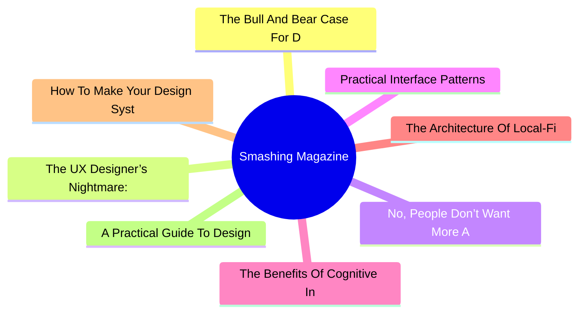
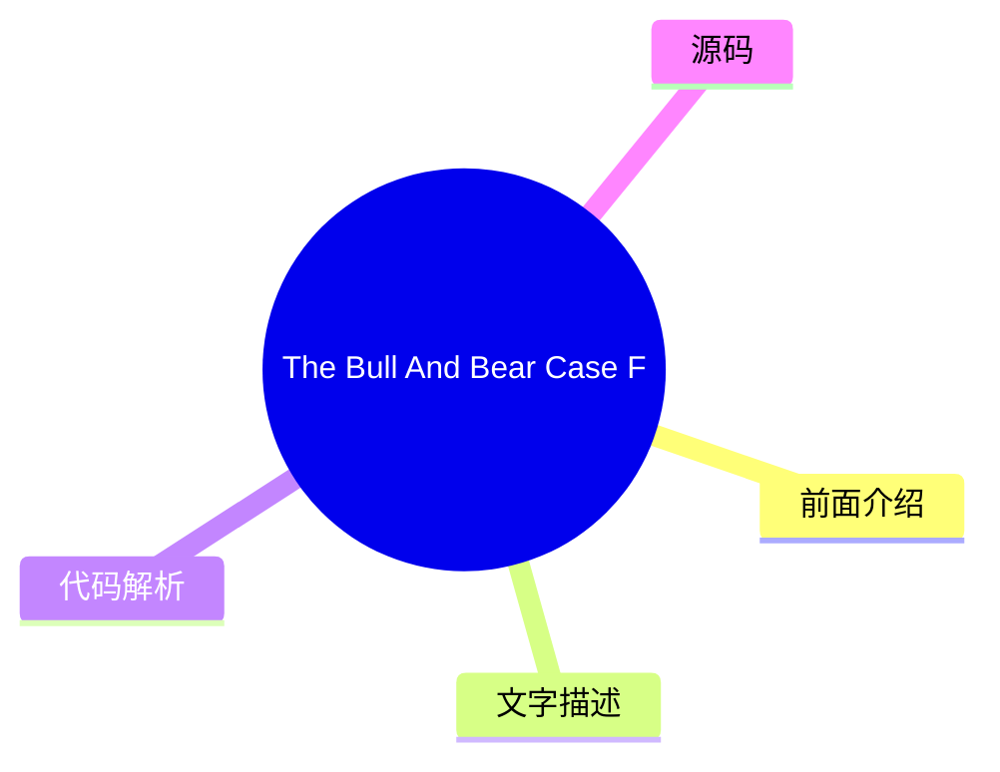
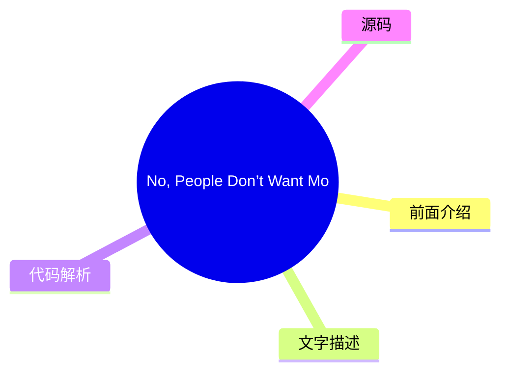
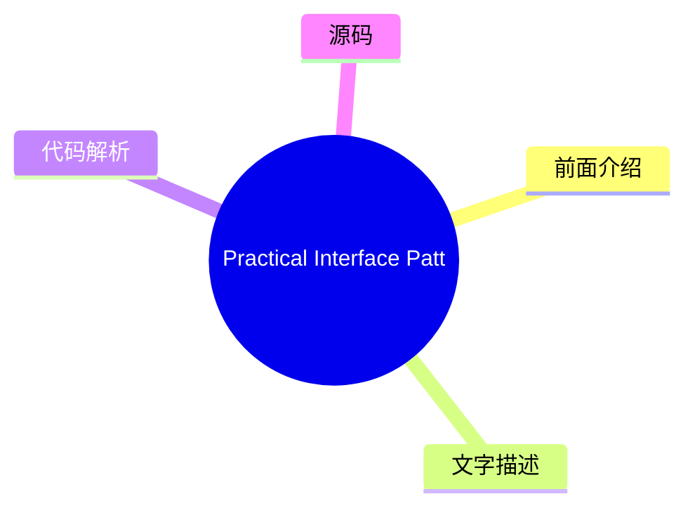
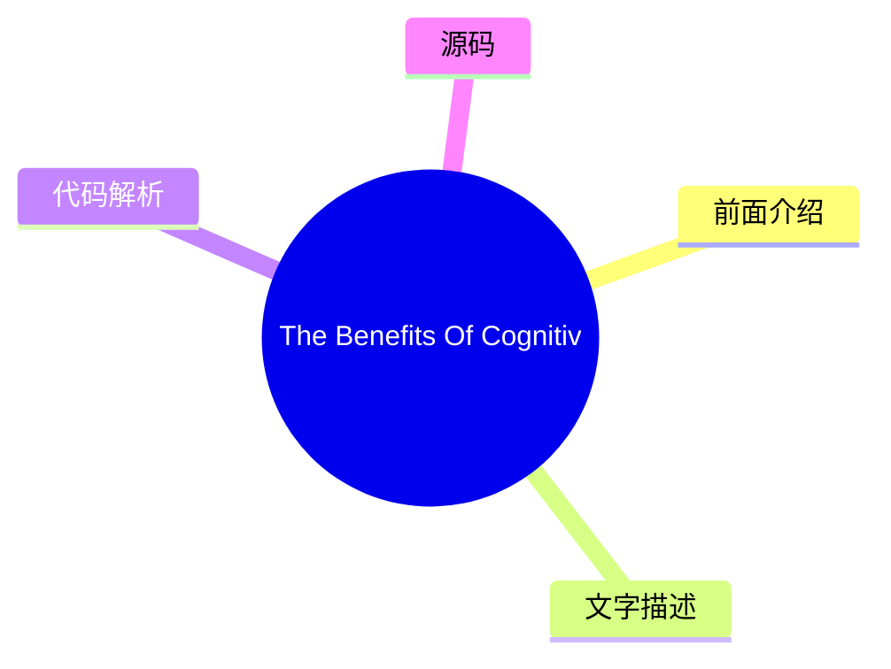
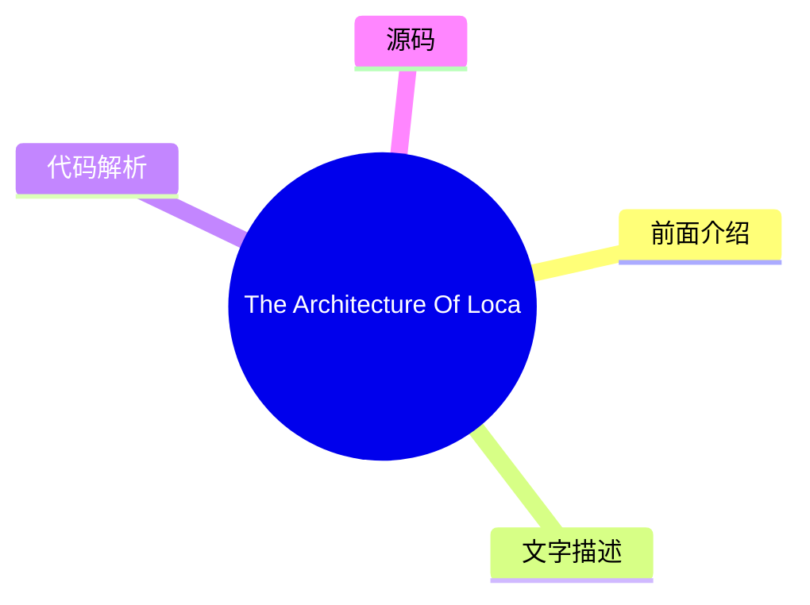
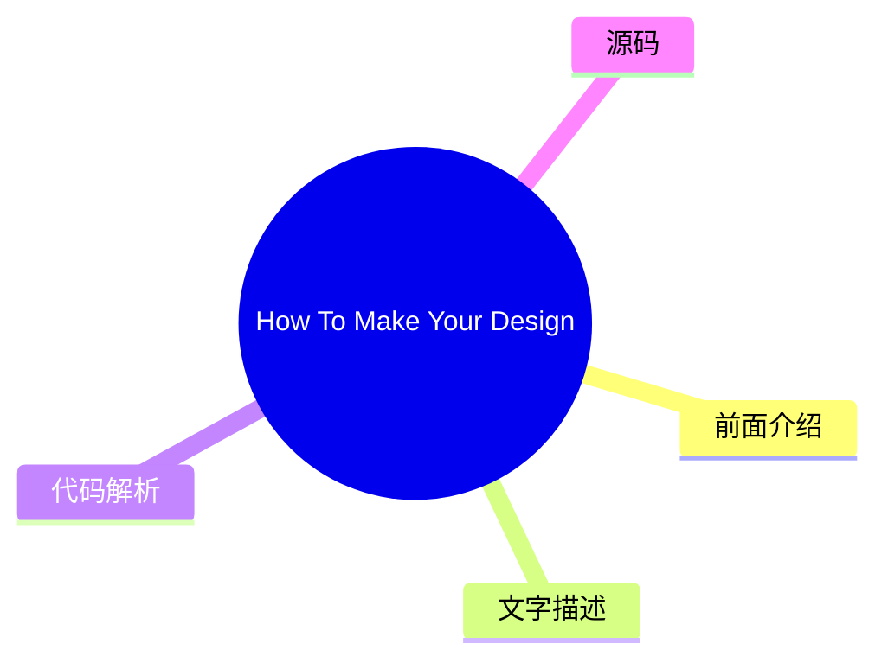
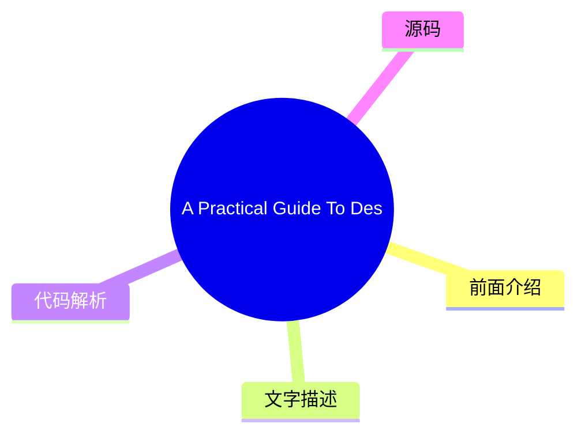

# 🔥 Smashing Magazine Top 8 (2026-08-02)

## 前面介绍

- 数据源：Smashing Magazine
- 抓取日期：2026-08-02
- 条目数：8
- 含完整正文：8
- 含代码片段：1
- 组织方式：前面介绍 / 树状图 / 文字描述 / 代码解析 / 源码

## 思维导图



## 详细整理（8 条，8 条含全文，1 条含代码）

### 1. The Bull And Bear Case For Digital Design In The Age Of AI
- **链接**: [https://smashingmagazine.com/2026/07/bull-and-bear-case-digital-design-age-ai/](https://smashingmagazine.com/2026/07/bull-and-bear-case-digital-design-age-ai/)
- **发布**: Wed, 29 Jul 2026 13:00:00 GMT

#### 前面介绍

- As AI reshapes product design, it could give designers greater autonomy or expose the gaps that autonomy makes harder to hide. Exploring both the bull and bear cases, Andy Budd examines what happens when designers need less permission to act.
- 发布时间：Wed, 29 Jul 2026 13:00:00 GMT

#### 树状图



#### 文字描述

- Designers have spent years saying they would do better work if the organisation got out of the way. Not always in those exact words, obviously. It usually comes out as something more reasonable: we didn’t get enough engineering time, product had already decided the solution, the roadmap was too packed, leadership only cared about this quarter’s numbers, research got cut, the ex
- ## The Bull Case: Designers Need Less Permission A good designer can now move from *“we should fix this”* to *“I fixed this, and pushed it live.”* They can prototype the alternative onboarding flow, write and test clearer product copy, build a rough working version of the interaction, clean up small pieces of design debt without waiting three months for a roadmap slot, and make
- ## The Bear Case: Autonomy Exposes The Gaps Autonomy has teeth. If AI gives designers more room to act, it also removes some of the cover. The same constraints that held good designers back have also protected weaker ones from being tested too directly. For years, it has been easy to say: I had a better idea, but we never got the engineering time. Sometimes that was exactly wha
- ## Where I Think We Might End Up The painful part is that both futures can be true at the same time. AI can make the best designers more capable and many average designers less necessary. It can give design more agency while reducing design headcount. It can help a small number of designers move closer to product leadership while pushing others into governance and clean-up work

#### 代码解析

- 本文未检测到明确代码块，内容更偏新闻、观点或方法论。

#### 源码

#### 中文节选

设计师们多年来一直表示，如果组织能少插手，他们就能做出更好的作品。当然，这未必是原话。通常表达得更委婉一些：我们没有获得足够的工程时间，产品已经决定了解决方案，路线图排得太满，领导层只关心本季度的业绩，研究被砍掉了，实验从未正确运行，设计债务虽然众所周知，但没人愿意花一个冲刺周期去修复。

这其中大部分是事实。大多数设计师都在产品和工程之间那个尴尬的中间地带工作过。产品界定问题，或者至少自认为界定了问题。工程决定什么是可行的，或者至少什么是负担得起的。设计被期望让事物更清晰、更简单、更连贯、更易用，偶尔还要更吸引人，同时还要小心不要过多地干扰计划。

那个位置一直都不舒服。

设计师被告知要战略性思考，但往往缺乏战略性行动的权力。

他们能发现糟糕的引导流程、令人困惑的升级路径、让用户感到愚蠢的空状态、在产品评审中看起来合理但在实际使用中毫无意义的特性。发现问题是一回事。让问题得到修复是另一回事。

因此，设计往往变成了**争论**。你提出论据。你标注流程。你展示研究片段。你指向支持工单。你展示 Figma 原型。你解释为什么那个*“小边缘情况”*实际上是你一半新用户的首次运行体验。然后大家都点头，表示同意这很重要，然后继续去处理那些已经列入路线图的事情。

这就是 AI 对设计来说比通常的*“AI 会取代设计师吗？”*的争论更有趣的原因之一。真正的变化不是设计师能制作更多的界面。没人需要更多的界面。有趣的变化是设计师**可能需要更少的许可**。

## 看涨理由：设计师需要更少的许可

A good designer can now move from *“we should fix this”* to *“I fixed this, and pushed it live.”* They can prototype the alternative onboarding flow, write and test clearer product copy, build a rough working version of the interaction, clean up small pieces of design debt without waiting three months for a roadmap slot, and make the better thing **visible enough** that it becomes **harder to ignore**.

That changes the politics of the work. Design has often relied on persuasion because designers lacked direct means of production. AI weakens that dependency. Not everywhere, and not for everything. Complex products still have architecture, infrastructure, data models, permissions, security, compliance, legacy systems, and all the other unglamorous reasons software is hard. But the boundary is moving.

More of the gap between having the idea and making the idea real can now be crossed by a motivated designer with the right tools.

In this version of the future, design

#### 完整正文（中文）

设计师们多年来一直表示，如果组织能少插手，他们就能做出更好的作品。当然，这未必是原话。通常表达得更委婉一些：我们没有获得足够的工程时间，产品已经决定了解决方案，路线图排得太满，领导层只关心本季度的业绩，研究被砍掉了，实验从未正确运行，设计债务虽然众所周知，但没人愿意花一个冲刺周期去修复。

这其中大部分是事实。大多数设计师都在产品和工程之间那个尴尬的中间地带工作过。产品界定问题，或者至少自认为界定了问题。工程决定什么是可行的，或者至少什么是负担得起的。设计被期望让事物更清晰、更简单、更连贯、更易用，偶尔还要更吸引人，同时还要小心不要过多地干扰计划。

那个位置一直都不舒服。

设计师被告知要战略性思考，但往往缺乏战略性行动的权力。

他们能发现糟糕的引导流程、令人困惑的升级路径、让用户感到愚蠢的空状态、在产品评审中看起来合理但在实际使用中毫无意义的特性。发现问题是一回事。让问题得到修复是另一回事。

因此，设计往往变成了**争论**。你提出论据。你标注流程。你展示研究片段。你指向支持工单。你展示 Figma 原型。你解释为什么那个*“小边缘情况”*实际上是你一半新用户的首次运行体验。然后大家都点头，表示同意这很重要，然后继续去处理那些已经列入路线图的事情。

这就是 AI 对设计来说比通常的*“AI 会取代设计师吗？”*的争论更有趣的原因之一。真正的变化不是设计师能制作更多的界面。没人需要更多的界面。有趣的变化是设计师**可能需要更少的许可**。

## 看涨理由：设计师需要更少的许可

优秀的设计师现在可以从 *“我们应该修复这个问题”* 转变为 *“我已经修复了这个问题，并已上线。”* 他们可以构建替代的引导流程原型，编写并测试更清晰的产品文案，构建交互的粗略可用版本，无需等待三个月的路线图空档期就能清理设计债务的小碎片，并让更好的东西变得**足够显眼**，以至于变得**难以忽视**。

这改变了工作的政治生态。设计往往依赖说服，因为设计师缺乏直接的生产手段。AI 削弱了这种依赖性。并非在所有地方，也并非针对所有事物。复杂的产品仍然需要架构、基础设施、数据模型、权限、安全、合规、遗留系统，以及软件之所以难以构建的其他所有不 glamorous 的原因。但边界正在移动。

现在，有动力的设计师借助合适的工具，可以跨越从拥有想法到将想法变为现实之间的鸿沟。

在这个未来的版本中，设计师变得**更少依赖许可**：更少依赖产品经理来认可问题，更少依赖工程师来实现每一个小的改进，更少受困于内部批评家、品味提供者或 Figma 操作员的角色。他们更有能力去制作、测试、修复和发布。

顶尖的设计师开始看起来不那么像传统的产品设计师，而更像**混合型产品领导者**。他们仍然关心交互、层级、语言、流程、品牌和工艺，但他们也理解问题的商业形态。他们能够做出权衡。他们可以用代码进行原型设计，或者足够接近代码。他们可以利用 AI 快速探索选项，然后运用判断力将其中大部分舍弃。他们可以与创始人或产品经理坐在一起，在一天结束时将模糊的产品顾虑转化为具体的东西。

这些人可能会变少，但更难被忽视。当前的设计组织模式部分是围绕**稀缺性**建立的：稀缺的工程时间、缓慢的生产、昂贵的原型、专家之间的交接、跨团队的繁重协调。如果 AI 减少了这种稀缺性，它可能会减少围绕它而生的某些角色的需求。乐观的情况并非每个设计师都能保住工作并获得生产力提升。那感觉像是一厢情愿。更可信的版本是，设计师的总数会减少，但留下的设计师对产品拥有**更多直接的影响力**。

这对最强的设计师来说并不是一个坏结果。这甚至可能是许多设计师多年来一直想要的。

## 熊市情况：自主性暴露了差距

自主性是有牙齿的。如果 AI 给设计师更多行动空间，它也移除了一些掩护。限制优秀设计师的约束条件，也保护了较弱的设计师免受过于直接的检验。

多年来，人们很容易说：我有一个更好的想法，但我们从未获得工程时间。有时确实如此。有时更好的想法从未真正超越仅仅是一个批评。它没有被具体化。它没有被测试。它没有处理尴尬的权衡。它听起来很强有力，因为它安全地存在于已发布事物的对立面。

许多设计师擅长发现哪里出了问题。擅长决定应该发生什么的人较少。能将替代方案变得足够真实以便他人评判的人更少。AI 将暴露这一差距。

如果你能对建议进行原型设计，该建议就必须变得更好。如果你能让替代方案流畅运行，该流程就必须经受细节的考验。如果你能测试产品文案，你就必须关心用户阅读时会发生什么。如果你能修复那小块设计债务，你就必须决定它是否真的值得修复。

一些设计师并不像他们自认为的那样具有战略性。他们学会了战略的语言，却无需承担**拥有结果**的痛苦。他们可以谈论用户需求、业务目标、系统思维和产品质量，但在被要求做出决策时却会感到吃力。他们想要影响力，却不想承担随之而来的**曝光度**。

这个行业花了很长时间争论设计理应拥有更多权力。好吧。但更多的权力意味着更少的借口。这意味着工作成果不再更多地由论证的优雅程度来评判，而是更多地由你制作、测试或改变的事物质量来评判。这是一个更好的标准，但它对每个人都不会仁慈。

存在第二个看空理由，这可能是大型设计团队最应该担心的。在大多数公司中，产品和工程已经比设计拥有更多的制度权力。他们掌控着路线图、技术架构、冲刺机制、指标，以及通常领导层所理解的语言。设计往往不得不将其关切转化为他人的术语，才能被重视。

AI 可能无法平衡这种权力。它可能会赋予产品和工程足够的**设计能力**，从而让绕过设计变得更容易。一个能够生成不错的流程、不错的文案和不错的原型的产品经理，可能不会觉得有必要尽早让设计介入。一个能够使用 AI 生成合理界面的工程师，可能会认为设计系统已经涵盖了足够的决策。一个能在下午就做出精美演示的创始人，可能会将精美与产品思维混为一谈。

问题不在于这些人会突然变成伟大的设计师。问题在于许多公司无法区分伟大的设计和看似合理的**设计**。**看似合理的设计是危险的。** 它在产品评审中看起来连贯。它使用了正确的组件。间距没问题。文案不丢人。流程大体上可行。会议中没有人感到强烈到足以反对。于是它就发布了。

许多糟糕的产品决策之所以能存活，是因为它们看起来合情合理。AI 将会产出更多此类决策。这就是设计可能迅速失守的地方：并非因为品味、判断力、研究和交互思维不再重要，而是因为设计的可见产出变得更容易被其他职能模仿。

如果一家公司已经认为设计主要是屏幕、原型和打磨，AI 就会为它提供一种获取这些东西的更廉价方式。

在那个世界里，设计并不会获得更多的自主权。它会被收窄。剩下的设计师将管理设计系统、规范组件使用、审查已确定的流程、整理界面、维护品牌一致性，并被拉入高风险的发布、高管演示以及偶尔出现的混乱跨平台问题中。这是有用的工作，但涉及的领域更小。更少地塑造产品，更多地维护家具（界面元素）。

这就是为什么 *“AI 将自动化那无聊的 20%”* 的论点感觉过于令人宽慰。在某些公司，也许确实如此。但在大型科技组织中，设计团队是围绕协调、制作和流程发展起来的，削减幅度可能会深得多。不是 20%。也许是 50%。甚至更多。特别是在那些领导层从未真正理解设计团队为何会变得如此庞大的地方。

## 我认为我们可能会走向何方

痛苦的是，这两种未来可能同时成立。AI 可以让最优秀的设计师变得更强大，同时让许多平庸的设计师变得不再必要。它可以在减少设计人员编制的同时，赋予设计更多的自主权。它可以帮助少数设计师更接近产品领导层，同时将其他人推向治理和清理工作。它可以让设计师摆脱等待许可的束缚，然后揭示出有些人比行动更习惯于等待。

“

They will have taste, but taste will not be enough. They will need **product judgment**, **technical curiosity**, **commercial awareness** and the nerve to make decisions before every variable is settled. They will need to be comfortable moving between a customer conversation, a prototype, a pricing concern, a brand question, and a messy implementation detail without insisting that all of those belong to someone else.

I’m not completely sure where we end up. I hope it is closer to the *bull case*: fewer permission structures, more making, more agency, better designers finally able to show what they can do without being held back by the machinery around them.

I fear it may be closer to the *bear case*: product and engineering absorb much of the work, companies decide plausible design is good enough, and design loses status, headcount, and strategic ground.

In reality, it will probably be some uncomfortable mix of the two. Some designers will use AI to gain more agency. Some companies will use it to need fewer designers. Some teams will produce better work because the distance between judgment and execution gets shorter. Others will ship more plausible mediocrity because nobody in the room can tell the difference.

For years, designers have said they could create more value if they were less constrained by the organisation around them. AI is about to test that claim. Some will finally get to prove it. Some will find out the constraints were doing them a favour.

### Further Resources

- “[Good from Afar, But Far from Good: AI Prototyping in Real Design Contexts](https://www.nngroup.com/articles/ai-prototyping/),” Huei-Hsin Wang and Megan Brown*(NN/Group)*
 The UX design field has been flooded with AI-powered prototyping tools that generate interfaces from natural-language prompts. Despite the huge marketing hype, an evaluation with real design scenarios revealed that while these tools can follow instructions to achieve a general goal, they often lack the sophistication to weigh design tradeoffs and to produce thoughtful, high-quality designs without extensive guidance from humans.

- “[AI Design Tools Are Marginally Better: Status Update](https://www.nngroup.com/articles/ai-design-tools-update-2/?lm=ai-prototyping&pt=article),” Megan Brown, Caleb Sponheim and Taylor Dykes*(NN/Group)*
 AI-powered design tools have improved, yet we’re still nowhere near the usef

...（截断，原文 14445+ 字符）


### 2. The UX Designer’s Nightmare: When “Production-Ready” Becomes A Design Deliverable
- **链接**: [https://smashingmagazine.com/2026/04/production-ready-becomes-design-deliverable-ux/](https://smashingmagazine.com/2026/04/production-ready-becomes-design-deliverable-ux/)
- **发布**: Wed, 22 Apr 2026 10:00:00 GMT

#### 前面介绍

- In a rush to embrace AI, the industry is redefining what it means to be a UX designer, blurring the line between design and engineering. Carrie Webster explores what’s gained, what’s lost, and why designers need to remain the guardians of the user ex
- 发布时间：Wed, 22 Apr 2026 10:00:00 GMT

#### 树状图


#### 文字描述

- In early 2026, I noticed that the UX designer’s toolkit seemed to shift overnight. The industry standard *“Should designers code?”* debate was abruptly settled by the market, not through a consensus of our craft, but through the brute force of job requirements. If you browse LinkedIn today, you’ll notice a stark change: UX roles increasingly demand ** AI-augmented development**
- ## The LinkedIn Pressure Cooker: Role Creep In 2026 The job market is sending a clear signal. While traditional graphic design roles are expected to grow by only **3%** through 2034, UX, UI, and [Product Design roles](https://www.nobledesktop.com/careers/designer/job-outlook#:~:text=The%20projected%20future%20growth%20figures%20for%20Digital,job%20growth%20(which%20lies%20somew
- ### The Competence Trap: Two Job Skill Sets, One Average Result There is potentially a very dangerous myth circulating in boardrooms that AI makes a designer “equal” to an engineer. This narrative suggests that because an LLM can generate a functional JavaScript event handler, the person prompting it doesn’t need to understand the underlying logic. In reality, attempting to mas
- ### The “Averagely Competent” Dilemma For a senior UX designer to become a senior-level coder is like asking a master chef to also be a master plumber because “they both work in the kitchen.” You might get the water running, but you won’t know why the pipes are rattling. - **The “cognitive offloading” risk.** Research shows that while AI can speed up task completion, it often l

#### 代码解析

- 本文未检测到明确代码块，内容更偏新闻、观点或方法论。

#### 源码

#### 中文节选

2026年初，我注意到 UX 设计师工具箱似乎在一夜之间发生了转变。行业标准 *“设计师应该会写代码吗？”* 的争论被市场突然平息了，不是通过我们行业的共识，而是通过职位要求的强力推动。如果你今天浏览 LinkedIn，你会注意到一个显著的变化：UX 职位越来越要求 ** AI 增强型开发**、**技术编排**和**生产就绪的原型**。

对许多人来说，包括我自己，这是终极的设计噩梦。我们被要求同时交付“氛围感”和“代码”，使用 AI 代理来跨越以前需要数年计算机科学知识和编码经验才能跨越的技术鸿沟。但随着行业急于满足这些新期望，他们发现 AI 生成的功能性代码并不总是*好*代码。

## LinkedIn 的压力锅：2026 年的角色膨胀

就业市场发出了一个明确的信号。虽然传统平面设计职位预计到 2034 年仅增长 **3%**，但 UX、UI 和 [产品设计职位](https://www.nobledesktop.com/careers/designer/job-outlook#:~:text=The%20projected%20future%20growth%20figures%20for%20Digital,job%20growth%20(which%20lies%20somewhere%20around%205%25).) 在同一时期预计增长 **16%**。

然而，这种增长越来越与 **AI 产品开发**的兴起相关联，其中“设计技能”最近已成为排名第一的最具需求的能力，甚至超过了编码和云基础设施。构建这些平台的公司不再仅仅寻找视觉设计师；他们需要能够“将技术能力转化为以人为中心体验”的专业人士。

This creates a high-stakes environment for the UX designer. We are no longer just responsible for the interface; we are expected to understand the technical logic well enough to ensure that complex AI capabilities feel intuitive, safe, and useful for the human on the other side of the screen. Designers are being pushed toward a **“design engineer” model**, where we must bridge the gap between abstract [AI logic and user-facing code](https://www.refontelearning.com/blog/ui-ux-designer-engineering-in-2026-crafting-future-ready-user-experiences#skills-and-competencies-for-the-2026-uiux-designer-3).

A [recent survey](https://www.lyssna.com/blog/ux-design-trends/) found that **73% of designers** now view AI as a primary collaborator rather than just a tool. However, this “collaboration” often looks like “role creep.” Recruiters are often not just looking for someone who understands user empathy and information architecture — they want someone who can also prompt a React component into existence and push it to a repository!

This shift has created a **competency gap**.

As an experienced senior designer who has spent decades mastering the nuances of cognitive load, accessibility standards, an

#### 完整正文（中文）

2026年初，我注意到 UX 设计师工具箱似乎在一夜之间发生了转变。行业标准 *“设计师应该会写代码吗？”* 的争论被市场突然平息了，不是通过我们行业的共识，而是通过职位要求的强力推动。如果你今天浏览 LinkedIn，你会注意到一个显著的变化：UX 职位越来越要求 ** AI 增强型开发**、**技术编排**和**生产就绪的原型**。

对许多人来说，包括我自己，这是终极的设计噩梦。我们被要求同时交付“氛围感”和“代码”，使用 AI 代理来跨越以前需要数年计算机科学知识和编码经验才能跨越的技术鸿沟。但随着行业急于满足这些新期望，他们发现 AI 生成的功能性代码并不总是*好*代码。

## LinkedIn 的压力锅：2026 年的角色膨胀

就业市场发出了一个明确的信号。虽然传统平面设计职位预计到 2034 年仅增长 **3%**，但 UX、UI 和 [产品设计职位](https://www.nobledesktop.com/careers/designer/job-outlook#:~:text=The%20projected%20future%20growth%20figures%20for%20Digital,job%20growth%20(which%20lies%20somewhere%20around%205%25).) 在同一时期预计增长 **16%**。

然而，这种增长越来越与 **AI 产品开发**的兴起相关联，其中“设计技能”最近已成为排名第一的最具需求的能力，甚至超过了编码和云基础设施。构建这些平台的公司不再仅仅寻找视觉设计师；他们需要能够“将技术能力转化为以人为中心体验”的专业人士。

This creates a high-stakes environment for the UX designer. We are no longer just responsible for the interface; we are expected to understand the technical logic well enough to ensure that complex AI capabilities feel intuitive, safe, and useful for the human on the other side of the screen. Designers are being pushed toward a **“design engineer” model**, where we must bridge the gap between abstract [AI logic and user-facing code](https://www.refontelearning.com/blog/ui-ux-designer-engineering-in-2026-crafting-future-ready-user-experiences#skills-and-competencies-for-the-2026-uiux-designer-3).

A [recent survey](https://www.lyssna.com/blog/ux-design-trends/) found that **73% of designers** now view AI as a primary collaborator rather than just a tool. However, this “collaboration” often looks like “role creep.” Recruiters are often not just looking for someone who understands user empathy and information architecture — they want someone who can also prompt a React component into existence and push it to a repository!

This shift has created a **competency gap**.

As an experienced senior designer who has spent decades mastering the nuances of cognitive load, accessibility standards, and ethnographic research, I am suddenly finding myself being judged on my ability to debug a CSS Flexbox issue or manage a Git branch.

The nightmare isn’t the technology itself. It’s the **reallocation of value**.

“

### The Competence Trap: Two Job Skill Sets, One Average Result

There is potentially a very dangerous myth circulating in boardrooms that AI makes a designer “equal” to an engineer. This narrative suggests that because an LLM can generate a functional JavaScript event handler, the person prompting it doesn’t need to understand the underlying logic. In reality, attempting to master two disparate, deep fields simultaneously will most likely lead to being **averagely competent** at both.

### The “Averagely Competent” Dilemma

For a senior UX designer to become a senior-level coder is like asking a master chef to also be a master plumber because “they both work in the kitchen.” You might get the water running, but you won’t know why the pipes are rattling.


- **The “cognitive offloading” risk.**
 Research shows that while AI can speed up task completion, it often leads to a significant decrease in conceptual mastery. In a controlled study, participants using AI assistance scored- [17% lower](https://www.psychologytoday.com/au/blog/the-asymmetric-brain/202602/cognitive-offloading-using-ai-reduces-new-skill-formation)on comprehension tests than those who coded by hand.
- **The debugging gap.**
 The largest performance gap between AI-reliant users and hand-coders is in- [debugging](https://www.anthropic.com/research/AI-assistance-coding-skills). When a designer uses AI to write code they don’t fully understand, they don’t have the ability to identify- *when*and- *why*it fails.

So, if a designer ships an AI-generated component that breaks during a high-traffic event and cannot manually trace the logic, they are no longer an expert. They are now a liability.

### The High Cost Of Unoptimised Code

Any experienced code engineer will tell you that creating code with AI without the right prompt leads to a lot of rework. Because most designers lack the technical foundation to audit the code the AI gives them, they are inadvertently shipping massive amounts of [“Quality Debt”](https://gocrossbridge.com/blog/ai-generated-code/).

## Common Issues In Designer-Generated AI Code

- **The security flaw**
 Recent reports indicate that up to- [92% of AI-generated codebases](https://www.sherlockforensics.com/pages/ai-code-security-report-2026.html)contain at least one critical vulnerability. A designer might see a functioning login form, unaware that it has an 86% failure rate in XSS defense, which are the security measures aimed at preventing attackers from injecting malicious scripts into trusted websites.
- **The accessibility illusion**

 AI often generates “functional” applications that lack semantic integrity. A designer might prompt a “beautiful and functional toggle switch,” but the AI may provide a non-semantic- `<div>`that lacks keyboard focus and screen-reader compatibility, creating- [Accessibility Debt](https://www.levelaccess.com/blog/accessibility-debt-in-software-development-and-how-to-engineer-it-out/)that is expensive to fix later.
- **The performance penalty**
 AI-generated code tends to be verbose. AI is linked to- [4x more code duplication](https://www.netcorpsoftwaredevelopment.com/blog/ai-generated-code-statistics)than human-written code. This verbosity slows down page loads, creates massive CSS files, and negatively impacts SEO. To a business, the task looks “done.” To a user with a slow connection or a screen reader, the site is a nightmare.

## Creating More Work, Not Less

The promise of AI was that designers could ship features without bothering the engineers. The reality has been the birth of a **“Rework Tax”** that is draining engineering resources across the industry.

- **Cleaning up**
 Organisations are finding that while velocity increases, incidents per Pull Request are also rising by- [23.5%](https://blog.exceeds.ai/ai-code-analysis-benchmark-reports/). Some engineering teams now spend a significant portion of their week cleaning up “AI slop” delivered by design teams who skipped a rigorous review process.
- **The communication gap**
 Only- [69% of designers](https://www.lyssna.com/blog/ux-design-trends/)feel AI improves the quality of their work, compared to- **82% of developers**. This gap exists because “code that compiles” is not the same as “code that is maintainable.”

When a designer hands off AI-generated code that ignores a company’s internal naming conventions or management patterns, they aren’t helping the engineer; they are creating a puzzle that someone else has to solve later.

### The Solution

We need to move away from the nightmare of the “**Solo Full-Stack Designer**” and toward a model of **designer/coder collaboration**.

**The ideal reality:**

- **The Partnership**

与其让设计师试图成为平庸的程序员，他们应该参与 **人机协作循环**。资深 UX 设计师应与工程师合作使用 AI；设计师为 **意图、无障碍性和用户流程** 创建提示词，而工程师为 **架构和性能** 创建提示词。

- **将设计系统作为护栏**
 为了防止无障碍债务大规模蔓延，[无障碍组件必须是设计系统的默认选项](https://webaim.org/projects/million/)。AI 应用于将这些标记输入到您的 UI 中，确保生成的代码也保持在“事实来源”之内。

## 超越提示词

目前行业处于“AI 迷恋”状态，但钟摆最终会摆回质量的一侧。

“
那些在没有工程监督的情况下优先考虑“设计师交付代码”的企业，最终将面临技术债务、安全漏洞和无障碍诉讼的清算。那些在 2026 年及以后蓬勃发展起来的设计师，将是那些拒绝成为“提示词操作员”，而是将自己定位为 **用户体验守护者** 的人。这对经验丰富的设计师和行业来说都是完美的结果。

我们的价值一直在于我们能够为屏幕另一端的人类进行倡导。我们必须利用 AI 来增强我们的设计思维，使我们能够测试更多想法并迭代得更快，但我们绝不能让它取代确保我们的设计在技术上对每个人都能正常运行的专门工程专业知识。

### UX 设计师总结清单

- **共同协作。**
 将 AI 生成的代码作为起点，与开发人员沟通。不要将其作为跳过与他们合作的捷径。请他们帮助您创建代码生成的提示词，以获得最佳结果。
- **理解“原因”。**
 永远不要提交您不理解代码。如果您无法解释 AI 生成的逻辑是如何工作的，就不要将其包含在您的工作中。
- **为所有人设计。**
 好的设计不仅仅是外观。使用 AI 检查您的代码是否适用于使用屏幕阅读器或键盘的人，而不仅仅是让事物看起来漂亮。


### 3. No, People Don’t Want More AI In Their Life
- **链接**: [https://smashingmagazine.com/2026/07/people-dont-want-more-ai/](https://smashingmagazine.com/2026/07/people-dont-want-more-ai/)
- **发布**: Wed, 15 Jul 2026 10:00:00 GMT

#### 前面介绍

- Many companies assume everyone craves new AI features. But the reality is that most people don't want more AI &mdash; at least not in the way most AI leaders envision it. Brought to you by Design Patterns For AI Interfaces, **friendly video courses o
- 发布时间：Wed, 15 Jul 2026 10:00:00 GMT

#### 树状图



#### 文字描述

- Many companies silently assume that everybody wants more AI in their lives. That people are **craving new AI features**, new AI products, new AI workflows — that would all magically replace all existing outdated practices and broken ways of working. But in reality, it seems like **people don’t want more AI** at all — at least not in the way most AI leaders envision it. Unsurpri
- ## The AI People Don’t Need It’s remarkably difficult to make a strong argument with senior leadership, but [AI is not a value proposition](https://www.nngroup.com/articles/powered-by-ai-is-not-a-value-proposition/). New AI features don’t magically make for happy or excited customers. Because AI features are often bolt-ons and separate tools for employees to use, they typically
- ## The AI People Actually Need I’m always puzzled by the comparison of AI features with how unreliable humans are. But people don’t compare software with other people. They **compare features with features** — and if one feature in one product is unreliable, while a similar feature works flawlessly in another, they choose the latter. It’s not about AI or not AI, but rather what
- ## Wrapping Up Perhaps I’m missing a bigger picture, and perhaps I’m just old school — but **I really do like people**. Their stories, their thinking, their emotions, their enthusiasm, their laughing. AI can be remarkably helpful in many situations, but so are people. And between the two, I would favor **spending time with a human** — however imperfect they are — every single t

#### 代码解析

- 本文未检测到明确代码块，内容更偏新闻、观点或方法论。

#### 源码

#### 中文节选

许多公司默默假设每个人都希望在他们的生活中拥有更多的 AI。人们渴望新的 AI 功能、新的 AI 产品、新的 AI 工作流——这些都会神奇地取代所有现有的过时做法和有缺陷的工作方式。

但在现实中，似乎人们根本不需要更多的 AI——至少不是大多数 AI 领导者设想的那种方式。毫不意外，许多 AI 功能的[采用率和留存率很低](https://www.mindstudio.ai/blog/ai-adoption-gap-ibm-2026-study)——这伴随着极高的交付成本和极高的声誉受损风险。

## 人们不需要的 AI

向高级管理层提出强有力的论点极其困难，但[AI 不是价值主张](https://www.nngroup.com/articles/powered-by-ai-is-not-a-value-proposition/)。新的 AI 功能并不会神奇地让客户感到快乐或兴奋。由于 AI 功能通常是附加项和员工使用的独立工具，它们通常会**把人从**他们常规的工作方式中**抽离**出来。

AI 非常擅长**放大组织中的捷径和缺陷**——从数据质量到决策制定。它无法神奇地修复多年积累的快速修补、技术债务、有缺陷的文化和内部政治。如果有任何变化，这些缺陷会随着 AI 变得更加明显，表现为不一致或相互冲突的优先级，并直接交给用户，随后用户不得不自己去弄清楚其中的混乱。

因为在大多数组织中，工作通常需要在大量不连接和碎片化的系统之间频繁切换，有了新的 AI 工具，他们现在又多了一个需要切换的系统。这通常会产生更多的工作，而且通常也不是特别令人满意的工作。

此外，人们非常清楚[发现和修复 AI 幻觉的成本](https://www.nngroup.com/articles/ai-chatbots-discourage-error-checking/)。要求 AI 生成响应**可能感觉比从头开始编写更容易**，但这是有代价的：

- **通读**整个 AI 输出，
- **找出**需要重点关注的关键点，
- **逐一审查/验证**关键点，
- **检查**后续内容的**理由**，

- **纠正内容**并重新生成，
- **审查回复**(多次)。

对许多人来说，AI 并非他们可以主动选择和探索的事物——它不请自来，按照别人的节奏到来。此外，大量信息放大了关于 AI 取代工作的**恐惧和担忧**——因此，人们对 AI 的看法并非兴奋。这是对**变革的抗拒**，以及对在一个似乎在未参与的情况下发生改变的世界中自身位置的深深焦虑。

充其量，AI 功能可能只是被默默接受或点头认可。最坏的情况是，AI 引起了**担忧、怀疑、谨慎**——并呼吁保持健康的怀疑态度。有时它被视为一种威胁或**责任**——因为与其他功能不同，AI 既不可预测也不可靠。

人们并不梦想着

#### 完整正文（中文）

许多公司默默假设每个人都希望在他们的生活中拥有更多的 AI。人们渴望新的 AI 功能、新的 AI 产品、新的 AI 工作流——这些都会神奇地取代所有现有的过时做法和有缺陷的工作方式。

但在现实中，似乎人们根本不需要更多的 AI——至少不是大多数 AI 领导者设想的那种方式。毫不意外，许多 AI 功能的[采用率和留存率很低](https://www.mindstudio.ai/blog/ai-adoption-gap-ibm-2026-study)——这伴随着极高的交付成本和极高的声誉受损风险。

## 人们不需要的 AI

向高级管理层提出强有力的论点极其困难，但[AI 不是价值主张](https://www.nngroup.com/articles/powered-by-ai-is-not-a-value-proposition/)。新的 AI 功能并不会神奇地让客户感到快乐或兴奋。由于 AI 功能通常是附加项和员工使用的独立工具，它们通常会**把人从**他们常规的工作方式中**抽离**出来。

AI 非常擅长**放大组织中的捷径和缺陷**——从数据质量到决策制定。它无法神奇地修复多年积累的快速修补、技术债务、有缺陷的文化和内部政治。如果有任何变化，这些缺陷会随着 AI 变得更加明显，表现为不一致或相互冲突的优先级，并直接交给用户，随后用户不得不自己去弄清楚其中的混乱。

因为在大多数组织中，工作通常需要在大量不连接和碎片化的系统之间频繁切换，有了新的 AI 工具，他们现在又多了一个需要切换的系统。这通常会产生更多的工作，而且通常也不是特别令人满意的工作。

此外，人们非常清楚[发现和修复 AI 幻觉的成本](https://www.nngroup.com/articles/ai-chatbots-discourage-error-checking/)。要求 AI 生成响应**可能感觉比从头开始编写更容易**，但这是有代价的：

- **通读**整个 AI 输出，
- **找出**需要重点关注的关键点，
- **逐一审查/验证**关键点，
- **检查**后续内容的**理由**，

- **纠正表述**+ 重新生成，
- **审查回复**(多次)。

对许多人来说，AI 并不是他们可以主动选择和探索的东西——它不请自来，按照别人的节奏到来。此外，大量信息放大了关于 AI 取代工作的**恐惧和担忧**——因此，人们对 AI 的感知并非兴奋。这其实是**对改变的抗拒**，以及对在一个似乎正在脱离他们而自行改变的世界中自身位置的深深焦虑。

在最好的情况下，AI 功能可能只是被默默接受或敷衍过去。在最坏的情况下，AI 会引发**担忧、怀疑、谨慎**——并呼吁保持健康的怀疑态度。有时它被视为威胁或**责任**——因为与其他功能不同，AI 既不可预测也不可靠。

人们并不梦想着**AI 艺术博物馆**、AI 冰箱、AI 酒店前台或 AI 叙述的儿童读物。他们不希望自己的孩子拥有**浪漫的 AI 伴侣**。大多数人不想主动管理（并清理善后）一群在银行账户中漫游并在现实世界中代表他们行动的**AI 代理**。最值得注意的是，人们并不真的想要一个可以随时与之交谈或输入的魔法盒子。

## 人们真正需要的 AI

我总是对将 AI 功能与人类的不稳定性进行比较感到困惑。但人们不会将软件与其他人进行比较。他们**将功能与功能进行比较**——如果一个产品中的某个功能不可靠，而另一个产品中的类似功能却能完美运行，他们就会选择后者。这无关乎 AI 或非 AI，而在于什么能一致可靠地工作，什么不能。

许多关于 AI 的讨论都是关于交付速度的。但对许多人来说，提高交付速度并没有太大价值。他们想要把事情做好，有足够的时间去思考和做出良好的决策。他们也想要**享受花在事情上的时间**，而不仅仅是更快地交付。随着每一次“氛围编码”式的改变，一种巨大的成就感和满足感正在慢慢消失。

People don’t change much. And after all these years, they (still) want features that are fast, accessible, **reliable, predictable and useful** — every single time. And ideally not the ones that replace their entire workflow, but that **augment** their way of working — and that take over the most mundane, annoying, and boring tasks that they find no pleasure in.

Many jobs are [exposed to AI automation](https://www.washingtonpost.com/technology/interactive/2026/jobs-most-affected-ai-automation/), but in many of them there is a rewarding, unique, creative part that requires taste, point of view, and perhaps even human intuition. And if AI **automates boring parts** of it, that’s an advantage for everyone. That’s also what enhances productivity and brings more joy in daily life.

When AI automates tedious and mentally exhausting tasks, its value is much easier to grasp. But for that, AI shouldn’t feel like a bolt-on. It should be **deeply integrated** into people’s existing workflows. It must also match existing **mental models** that they have developed and fine-tuned for years or decades. AI should adapt to how people think and make decisions, not the other way around.

And it doesn’t really matter if these features are branded as “AI”, “smart” or “automation”. However, they must work well for people using them. And that means that people must be **aware of use cases** where it actually helps them, and be inspired to find more use cases on their own.

Ironically, tools that work well there aren’t “AI-first” — they are **“AI-second”**. Subtle, humble, calm, ambient, taking a supportive role in the background for work that otherwise is remarkably dull and unnecessary.

I don’t want to readbooks written by AI. I don’t want to gaze upon paintings by AI. I don’t want AI to teach my children. I don’t want to have an AI therapist. I don’t want AI making my medical decisions. I want AI to do all thephysical and mental laborthat taxes me so I can read books written by humans and go to art galleries to engage with art made by humans. I want AI that makes my life easier rather than forces me to change myself.


—[Bo Young Lee](https://www.linkedin.com/feed/update/urn:li:share:7467162929474420737/)

## Wrapping Up

Perhaps I’m missing a bigger picture, and perhaps I’m just old school — but **I really do like people**. Their stories, their thinking, their emotions, their enthusiasm, their laughing. AI can be remarkably helpful in many situations, but so are people. And between the two, I would favor **spending time with a human** — however imperfect they are — every single time.

No, **people don’t need more AI in their lives** — they need AI to automate all the boring stuff they have to deal with every day, so they have more time and headspace to do things that they actually love and enjoy doing. That doesn’t mean spending more time with AI — but spending more time with people they love.

## Meet “Design Patterns For AI Interfaces”

Meet [ Design Patterns For AI Interfaces](https://ai-design-patterns.com/), Vitaly’s new 

**video course**with practical examples from real-life products — with a

[live UX training](https://smashingconf.com/online-workshops/workshops/ai-interfaces-vitaly-friedman/)happening soon.

[Jump to a free preview](https://www.youtube.com/watch?v=jhZ3el3n-u0).

## Useful Resources

- [AI Adoption Gap: IBM 2026 Study](https://www.mindstudio.ai/blog/ai-adoption-gap-ibm-2026-study), by MindStudio
- [Powered by AI Is Not a Value Proposition](https://www.nngroup.com/articles/powered-by-ai-is-not-a-value-proposition/), by Nielsen Norman Group
- [AI Chatbots Discourage Error Checking](https://www.nngroup.com/articles/ai-chatbots-discourage-error-checking/), by Nielsen Norman Group
- [The Jobs Most Exposed to AI Automation](https://www.washingtonpost.com/technology/interactive/2026/jobs-most-affected-ai-automation/), by The Washington Post
- [On AI and What We Actually Want From It](https://www.linkedin.com/feed/update/urn:li:share:7467162929474420737/), by Bo Young Lee


### 4. Practical Interface Patterns For AI Transparency (Part 2)
- **链接**: [https://smashingmagazine.com/2026/05/practical-interface-patterns-ai-transparency/](https://smashingmagazine.com/2026/05/practical-interface-patterns-ai-transparency/)
- **发布**: Wed, 13 May 2026 13:00:00 GMT

#### 前面介绍

- Why traditional loading patterns like spinners fail in agentic AI experiences, and how interface patterns that reveal the system’s process, status, and decision-making can improve transparency and build user trust.
- 发布时间：Wed, 13 May 2026 13:00:00 GMT

#### 树状图



#### 文字描述

- In the [first part of this series](https://www.smashingmagazine.com/2026/04/identifying-necessary-transparency-moments-agentic-ai-part1/), we talked about the **Decision Node Audit**. We mapped out the internal workings of our AI system to pinpoint the exact moments it makes decisions based on probabilities. This told us when the system needs to be transparent with the user. No
- ## Writing Clear Status Updates We often think of transparency as a visual design problem, but it’s really about the **words** we use. Simple, clear explanations (the microcopy) are what build trust and separate a reliable AI from one that feels broken. We need to retire generic placeholders like *Loading* or *Working*. These words are remnants of the era of static software. In
- ## The Agentic Update Formula To give people useful status updates, we need to connect what the system is *doing* with *why* it’s doing it. Keeping with our scheduling agent example, the system should break down that waiting period into at least four clear, separate steps. - First, the interface displays *Checking your calendar to find open times for a recurring Thursday call w
- ## Matching Tone to the Risk Matrix Should an AI sound like a person or act like a robot? The right answer depends on the task’s importance, which we can figure out using the **Impact/Risk Matrix** from our **Decision Node Audit**. For simple, low-risk tasks, a friendly, conversational tone works best. For example, a scheduling assistant can say it’s checking your calendar for 

#### 代码解析

- 本文未检测到明确代码块，内容更偏新闻、观点或方法论。

#### 源码

#### 中文节选

在[本系列的第一部分](https://www.smashingmagazine.com/2026/04/identifying-necessary-transparency-moments-agentic-ai-part1/)中，我们讨论了**决策节点审计**。我们梳理了 AI 系统的内部运作机制，以精确定位其基于概率做出决策的确切时刻。这让我们知道了系统何时需要向用户保持透明。现在，核心问题是*如何*分享这些信息。

你已经准备好了**透明度矩阵**。你知道哪些后台 API 调用需要显示状态更新。你的工程师也认同技术层面的细节。接下来的步骤是为这些更新设计视觉容器。

我们面临一个遗留问题。三十年来，界面设计师一直依赖一种模式来处理延迟：**旋转器**。旋转的圆圈、闪烁的图标、进度条。这些模式传达了一种特定的技术现实。它们告诉用户系统正在检索数据。延迟是由带宽或文件大小引起的。

AI 代理引入了一种新的等待时间。当代理暂停二十秒时，它不仅仅是在下载某样东西；它是在*思考*。它正在确定最佳步骤，权衡选项，并为你请求的内容进行创作。

如果我们用基本的旋转图标来表示这种“思考时间”，用户会感到困惑和焦虑。他们看着循环播放的动画，无法判断系统是卡住了还是崩溃了。他们不知道代理是在处理一个非常复杂的任务，还是仅仅失败了。

为了建立用户信任，我们需要将这段等待时间转化为一个**安抚时刻**。与其被动地表示“正在发生某事”，我们需要传达一种主动的“这正是我正在努力解决您问题的具体方式”。

## 撰写清晰的更新状态

我们常将透明度视为一个视觉设计问题，但实际上它关乎我们使用的**文字**。简单、清晰的解释（微文案）才是建立信任的关键，也是区分可靠 AI 与感觉像坏掉的 AI 的分水岭。

我们需要淘汰像 *Loading* 或 *Working* 这样的通用占位符。这些词汇是静态软件时代的遗留物。相反，我们必须使用特定的公式构建状态更新，以反映系统的自主性。让我们停止使用“Loading”或“Working”这类模糊的词汇。这些术语属于过去，当时软件简单且静态。相反，我们应该创建状态更新，明确告知用户系统*实际上正在做什么*，并使系统的操作透明。

为了举例说明，想象一下你正在部署代理 AI，它将帮助团队成员整理日历，并在被提示时代表他们规划 recurring meetings（定期会议）。

当 AI 显示类似“Checking availability（检查可用性）”的消息并持续了未知的时间时，用户往往会感到迷茫，因为它提供的信息不够。虽然他们理解 AI 正在查看日历，但他们不知道查看的是*谁的*日历，还涉及哪些步骤（之前或之后）。

#### 完整正文（中文）

在[本系列的第一部分](https://www.smashingmagazine.com/2026/04/identifying-necessary-transparency-moments-agentic-ai-part1/)中，我们讨论了**决策节点审计**。我们梳理了 AI 系统的内部运作机制，以精确定位其基于概率做出决策的确切时刻。这让我们知道了系统何时需要向用户保持透明。现在，核心问题是*如何*分享这些信息。

你已经准备好了**透明度矩阵**。你知道哪些后台 API 调用需要显示状态更新。你的工程师也认同技术层面的细节。接下来的步骤是为这些更新设计视觉容器。

我们面临一个遗留问题。三十年来，界面设计师一直依赖一种模式来处理延迟：**旋转器**。旋转的圆圈、闪烁的图标、进度条。这些模式传达了一种特定的技术现实。它们告诉用户系统正在检索数据。延迟是由带宽或文件大小引起的。

AI 代理引入了一种新的等待时间。当代理暂停二十秒时，它不仅仅是在下载某样东西；它是在*思考*。它正在确定最佳步骤，权衡选项，并为你请求的内容进行创作。

如果我们用基本的旋转图标来表示这种“思考时间”，用户会感到困惑和焦虑。他们看着循环播放的动画，无法判断系统是卡住了还是崩溃了。他们不知道代理是在处理一个非常复杂的任务，还是仅仅失败了。

为了建立用户信任，我们需要将这段等待时间转化为一个**安抚时刻**。与其被动地表示“正在发生某事”，我们需要传达一种主动的“这正是我正在努力解决您问题的具体方式”。

## 撰写清晰的更新状态

我们常将透明度视为一个视觉设计问题，但实际上它关乎我们使用的**文字**。简单、清晰的解释（微文案）才是建立信任的关键，也是区分可靠 AI 与感觉像坏掉的 AI 的分水岭。

We need to retire generic placeholders like *Loading* or *Working*. These words are remnants of the era of static software. Instead, we must construct our status updates using a specific formula that mirrors the agency of the system. Let’s stop using vague words like “Loading” or “Working.” Those terms belong to the past, when software was simple and static. Instead, we should create status updates that clearly tell the user what the system is *actually doing* and make the system’s actions transparent.

Imagine, for the sake of an example, you are deploying agentic AI that will help team members organize their calendars and plan recurring meetings on their behalf, once prompted.

When an AI displays a message like “Checking availability” for an unknown amount of time, users often feel lost because it doesn’t offer enough information. While they understand the AI is looking at a calendar, they don’t know *whose* calendar it is, what other steps are involved (before or after), or if the AI even remembered the people and purpose of the scheduling request. Waiting for the final result can be a tense, uneasy experience, like anticipating a gift that you suspect might be a prank.

Perplexity AI provides a strong example of doing status updates right. Figure 1 below shows that when users ask a question, the interface displays exactly what it is doing in real time. You see a list of activities updating as they are accomplished. Users do not need to guess what is happening as the AI works.

## The Agentic Update Formula

To give people useful status updates, we need to connect what the system is *doing* with *why* it’s doing it. Keeping with our scheduling agent example, the system should break down that waiting period into at least four clear, separate steps.

- First, the interface displays *Checking your calendar to find open times for a recurring Thursday call with [Name(s)]*.
- Then, it updates to: *Cross-checking availability with [Name(s)] calendars*.
- Next, it might display: *Syncing [Name(s)] schedules to secure your meeting time on [Data and Time]*.

- Finally, at the conclusion, the agent might state they have successfully completed the task and request the user check their email to confirm the invite that’s been shared with the group having the recurring meeting.

This communication process grounds the technical process in the user’s actual life.

Making an AI’s progress easy to understand boils down to a three-part structure: a strong **Action Word**, what the AI is working on (the **Specific Item**), and any **Limits** or rules it has to follow.

Think about an AI helping you book a trip. A weak, unhelpful update would just be: *Searching for flights…*

A much better update uses the formula:

- **Action Word:**- *Scanning*
- **Specific Item:**- *the prices on Lufthansa and United*
- **Limits/Rules:**- *to find anything under $600.*

This approach clearly shows the user that the AI understood their request and is working within the set boundaries.

## Matching Tone to the Risk Matrix

Should an AI sound like a person or act like a robot? The right answer depends on the task’s importance, which we can figure out using the **Impact/Risk Matrix** from our **Decision Node Audit**.

For simple, low-risk tasks, a friendly, conversational tone works best. For example, a scheduling assistant can say it’s checking your calendar for the best time. This creates a comfortable, easygoing experience for the user.

However, high-stakes tasks demand clear, mechanical accuracy. If the AI is managing a big financial transfer or a complicated database migration, users don’t want a playful interface; they want precision. A screen that says *“I am thinking hard about your money”* would possibly cause panic. Instead, the interface should use straightforward language like *“Verifying account routing numbers.”* By adjusting the AI’s “personality” to match the level of risk, we give users exactly the experience they need in that moment. While the Impact/Risk Matrix provides a necessary starting point, the ultimate determinant of the appropriate AI voice and tone is rigorous **user research**.


没有任何一套规则能够预测出在每一组用户或每一种情况下，哪些确切的词语或语气能够建立信任或引发压力。这就是为什么动手研究至关重要。你需要：

- [运行 A/B 测试](https://medium.com/@alienoghli/the-essential-guide-to-a-b-testing-a84b853c16e0)
- [进行可用性研究](https://uxplanet.org/usability-testing-the-complete-guide-e162898f68db)
- [开展访谈](https://ixdf.org/literature/article/how-to-conduct-user-interviews)

这类研究确保了 AI 的“个性”对于实际使用该系统的人群及其特定语境来说，是舒适且恰当的。

我们现在已经涵盖了 *“是什么”* —— 那些关键的微文案、清晰的动作动词，以及让 AI 状态更新既诚实又具信息量的必要限制。但仅有文字是不够的。隐藏在糟糕界面中的完美句子，依然是透明度的失败。

下一个挑战是 *“怎么做”* —— 为该消息设计物理传递系统。你可以把状态更新公式看作引擎，把界面模式看作汽车。强大的引擎需要一个可靠、设计良好的底盘来承载它行驶在路上。

## 界面模式：智能体的库

一旦我们有了合适的词语，就需要 **合适的容器**。关键在于将消息的权重与模式的可见性相匹配。一个微小的后台任务（比如智能体在后台默默整理你的文件）不需要一个大声闪烁的横幅。那条消息最好以微妙的方式传达。一个高风险的多步骤流程（比如转账）可能需要更稳健的容器，以迫使用户集中注意力。

通过创建这些模式的库，我们确保在正确的时刻提供适当程度的透明度，将等待的焦虑转化为知情自信的时刻。让我们回顾几个常见且关键的模式。

### 活跃的面包屑：AI 在后台工作

对于那些 AI 正在后台静默处理的低重要性任务，我们需要一种方式来向用户展示它正在工作，而又不会不断打扰他们。我们可以称之为活跃的面包屑。

Think of an email app where an AI is drafting a reply for you. You don’t want a disruptive pop-up message. Instead, a small, subtle status indicator pulses within the application’s border or menu area.

The solution needs to go beyond a static icon. The living breadcrumb smoothly transitions between different text updates. It might pulse from *Reading email* to *Drafting reply* to *Checking tone*. It’s there if you want to check on its progress, offering a quiet assurance that the task is underway, but it won’t demand your immediate attention.

### Dynamic Checklists

When dealing with critical, high-stakes tasks — like processing a complex financial transaction or migrating a large, intricate dataset — we recommend using a **Dynamic Checklist** (illustrated in Figure 3).

This pattern serves as a powerful anchor for the user, providing clarity and confidence about the **process’s progress**. Instead of a simple bar, the Dynamic Checklist lays out every planned step the AI agent will take. It clearly highlights the step that is currently in progress, marks preceding steps as complete, and lists future actions as pending.

For example:

- **Step 1**: Verify Account Balance- **[Complete]**.
- **Step 2**: Convert Currency- **[Processing]**.
- **Step 3**: Transfer Funds- **[Pending]**.

The Dynamic Checklist offers a significant advantage over a traditional progress bar because it expertly manages unpredictable time. If the currency conversion (Step 2) unexpectedly requires an extra ten seconds, the user won’t feel sudden anxiety or panic. They have full visibility into the system’s exact location, understanding that the delay is occurring during the *Converting Currency* step. Because they recognize this is a potentially complex action, they are naturally more patient and trusting of the system’s ongoing work.


The pattern itself is a compelling UI idea, but designers must remember that its implementation transforms the task into a full-stack design requirement. Unlike a simple loading flag, the dynamic checklist requires a robust front-end state management system to listen for step-completion events, which are typically triggered by a back-end webhook structure. This ensures the interface is always reflecting the agent’s real-time position in the workflow.

### The Thinking Toggle

Some users with higher information needs or higher needs for transparency may not trust a simple summary; they want to see the system’s raw processing. For this audience, we’ve designed the **Thinking Toggle**.

This is a simple progressive disclosure UI control, like a chevron or a “View Logs” button, that lets the user expand a friendly status update into a raw terminal view. It displays the sanitized logic logs of the AI agent, such as:

- *Querying API endpoint /v2/search*;
- *Response received: 200 OK*;
- *Filtering results by relevance score > 0.8*.

Many people will never open this view. However, for the user who needs deep transparency, the very presence of this toggle is a signal of trust. It reassures them that the system is not concealing anything.

Keep in mind, with this deep transparency comes a critical technical risk. Even for your most expert audience, you must sanitize and abstract these raw logs before display. This step is non-negotiable to prevent accidentally exposing proprietary business logic, internal data structure names, or security tokens that could be exploited. This process ensures trust is built through honesty, not security vulnerability.

### Designing For Partial Success

In standard software, things are often black or white. A file either saves or it doesn’t. But with AI agents, things ar

...（截断，原文 21693+ 字符）


### 5. The Benefits Of Cognitive Inclusion In UX Research
- **链接**: [https://smashingmagazine.com/2026/06/benefits-cognitive-inclusion-ux-research/](https://smashingmagazine.com/2026/06/benefits-cognitive-inclusion-ux-research/)
- **发布**: Wed, 10 Jun 2026 10:00:00 GMT

#### 前面介绍

- Findings from an exploratory user research study highlighting the unique insights and practical UX recommendations shared by participants with cognitive disabilities.
- 发布时间：Wed, 10 Jun 2026 10:00:00 GMT

#### 树状图



#### 文字描述

- In the summer of 2024, I became co-chair of a working group of expert researchers who came together to determine how best to perform accessibility testing with people with cognitive disabilities. This was work I did for Fable, where I am currently VP of Innovation. Cognitive disability is an umbrella term for several disabilities that impact how people process information, and 
- ## The Cognitive Usability Study I decided to run a joint study with Fable’s partners at the University of California, Irvine, in collaboration with Syed Fatiul Huq and with help from Fable researchers Pranav Pidathala, Ali Brown, and Michael Fagan to see if my hypothesis about finding more insights with cognitive testers proved true or not. I generated three websites for the s
- ### Table 1: Websites And Tasks Tested | Website | [Strong Snacks](https://v0-strong-snacks.vercel.app/) | [Turning Pages](https://v0-bookstore-nu.vercel.app/) | [Crown & Comb](https://v0-crown-and-comb.vercel.app/) | |---|---|---|---| | Description | This is a website for three-ingredient high-protein recipes. Recipes can be browsed by category (vegan, muscle building, etc.). 
- ## Data Analysis Approach I reviewed all the study recordings and transcripts and made note of every time a participant raised a concern, question, difficulty, or asked a question about how something worked. I counted all of these as issues. I also noted where a participant missed something that was part of a task, even if they didn’t notice it themselves. I also noted every su

#### 代码解析

- 本文未检测到明确代码块，内容更偏新闻、观点或方法论。

#### 源码

#### 中文节选

2024年夏天，我成为了一个专家研究小组的联合主席，该小组致力于确定如何最好地与认知障碍人士进行无障碍测试。这是我为 Fable 所做的工作，目前我是那里的创新副总裁。

认知障碍是一个统称，涵盖了多种影响人们处理信息方式的障碍，通常会影响记忆、专注力和/或学习能力。它是美国最常见的残疾类型（根据 [CDC](https://www.cdc.gov/disability-and-health/articles-documents/disability-impacts-all-of-us-infographic.html) 数据为 13.9%），且认知障碍正在迅速增加（根据 [耶鲁大学研究](https://news.yale.edu/2025/09/24/growing-number-us-adults-report-cognitive-disability)）。

我们为自己设定了四个目标，以学习如何与这一受众群体合作：

- 我们应该如何招募和筛选参与者？
- 与认知障碍参与者进行研究的最佳实践是什么？
- 这些方法在真实的研究中有效吗？
- 记录我们的所学，以便分享。

我们创建了一份筛选问卷，以招募那些自我认定为在记忆、专注和学习方面存在挑战的人。我们还回顾了涉及认知障碍测试人员的已发表研究，以学习与他们合作的最佳实践。

接下来，我们在一项试点研究中，对这 25 名测试人员测试了这些最佳实践。我们迭代优化了我们的方法，并创建了一份指南，用于与认知障碍测试人员进行用户访谈，以及一份能够量化他们使用数字产品体验的调查问卷。最后，我们[记录了我们的所学](https://makeitfable.com/article/cognitive-accessibility-pilot-case-study/)。

在与这组新的测试人员完成试点研究后，我感到他们能发现的可用性洞察将超过我过去合作过的普通人群（gen pop）用户研究参与者。我着手验证这一直觉。

## 认知可用性研究

我决定与 Fable 的合作伙伴加州大学欧文分校合作开展一项联合研究，在 Syed Fatiul Huq 的协助下，并得到 Fable 研究人员 Pranav Pidathala、Ali Brown 和 Michael Fagan 的帮助，以验证我关于使用认知测试人员能获得更多洞察的假设是否成立。

我使用 AI 原型工具生成了三个网站用于这项研究。我想要三种不同类型的网站，具有不同的用户目标和内容，以便我可以在研究中测试各种任务。

### 表 1：测试的网站和任务

| 网站 | [Strong Snacks](https://v0-strong-snacks.vercel.app/) | [Turning Pages](https://v0-bookstore-nu.vercel.app/) | [Crown & Comb](https://v0-crown-and-comb.vercel.app/) | 
|---|---|---|---|
| 描述 | 这是一个提供三成分高蛋白食谱的网站。食谱可以按类别浏览（素食、增肌等）。该网站还包含关于蛋白质的博客文章和联系信息。 | 这是一个书店网站，拥有精选阅读目录。它具有扩展

#### 完整正文（中文）

2024年夏天，我成为了一个专家研究小组的联合主席，该小组致力于确定如何最好地与认知障碍人士进行无障碍测试。这是我为 Fable 所做的工作，目前我是那里的创新副总裁。

认知障碍是一个统称，涵盖了多种影响人们处理信息方式的障碍，通常会影响记忆、专注力和/或学习能力。它是美国最常见的残疾类型（根据 [CDC](https://www.cdc.gov/disability-and-health/articles-documents/disability-impacts-all-of-us-infographic.html) 数据为 13.9%），且认知障碍正在迅速增加（根据 [耶鲁大学研究](https://news.yale.edu/2025/09/24/growing-number-us-adults-report-cognitive-disability)）。

我们为自己设定了四个目标，以学习如何与这一受众群体合作：

- 我们应该如何招募和筛选参与者？
- 与认知障碍参与者进行研究的最佳实践是什么？
- 这些方法在真实的研究中有效吗？
- 记录我们的所学，以便分享。

我们创建了一份筛选问卷，以招募那些自我认定为在记忆、专注和学习方面存在挑战的人。我们还回顾了涉及认知障碍测试人员的已发表研究，以学习与他们合作的最佳实践。

接下来，我们在一项试点研究中，对这 25 名测试人员测试了这些最佳实践。我们迭代优化了我们的方法，并创建了一份指南，用于与认知障碍测试人员进行用户访谈，以及一份能够量化他们使用数字产品体验的调查问卷。最后，我们[记录了我们的所学](https://makeitfable.com/article/cognitive-accessibility-pilot-case-study/)。

在与这组新的测试人员完成试点研究后，我感到他们能发现的可用性洞察将超过我过去合作过的普通人群（gen pop）用户研究参与者。我着手验证这一直觉。

## 认知可用性研究

我决定与 Fable 的合作伙伴加州大学尔湾分校合作开展一项联合研究，在 Syed Fatiul Huq 的协助下，并得到 Fable 研究人员 Pranav Pidathala、Ali Brown 和 Michael Fagan 的帮助，以验证我关于使用认知测试人员能获得更多见解的假设是否成立。

我使用 AI 原型工具生成了三个网站用于这项研究。我想要三种不同类型的网站，具有不同的用户目标和内容，以便我可以在研究中测试各种任务。

### 表 1：测试的网站和任务

| 网站 | [Strong Snacks](https://v0-strong-snacks.vercel.app/) | [Turning Pages](https://v0-bookstore-nu.vercel.app/) | [Crown & Comb](https://v0-crown-and-comb.vercel.app/) | 
|---|---|---|---|
| 描述 | 这是一个提供三成分高蛋白食谱的网站。食谱可以按类别（素食、增肌等）浏览。该网站还包含关于蛋白质的博客文章和联系信息。 | 这是一个书店网站，拥有精选阅读目录。它具有按书籍类型进行广泛筛选的功能、用于建立喜好和厌恶档案的书籍滑动功能、自定义书单、购物车和结账功能。 | 这是一个美发沙龙网站，允许您在线预约和咨询。它拥有 VIP 计划和访客可以购买的多种特别套餐。 | 
| 设计 | 简单、粗野主义、明亮、大量图片。 | 情绪化、经典、深色、大量书籍封面图片。 | 大胆、简洁、黑白配色，点缀色彩。 | 
| 内容 | 食谱、博客文章。 | 书籍和书单。 | 服务、体验指南、会员信息。 | 
| 关键功能 | 按类别筛选、订阅通讯。 | 购物车、书籍匹配、书单、推荐。 | 预约预订。 | 
| 任务 | 
 | 
 | 
 | 

我们使用了一份包含关于记忆、专注和学习问题的单一筛选问卷，并根据参与者是否自我认定为存在认知挑战，将他们分为两组。

认知障碍包括神经多样性。神经多样性是一个统称，用于描述大脑处理信息和学习方式不同的人群。它最常用于描述患有学习障碍（如阅读障碍）、ADHD（注意缺陷多动障碍）和自闭症的人群。

我们对每个网站进行了30次用户访谈，每个网站10人。对于每个网站，认知障碍参与者和普通人群参与者的比例均为5:5。在每次访谈中，参与者在一个研究人员主持的在线用户访谈中，完成一个网站的所有任务。

所有参与者在会话结束时都完成了一份[可访问可用性量表（AUS）调查](https://makeitfable.com/accessible-usability-scale/)。这是一份免费的、采用知识共享许可协议的10题调查，用于评估网站和移动应用的可用性。

## 数据分析方法

我回顾了所有的研究录音和逐字稿，并记录了参与者每次提出担忧、问题、困难或询问某事物如何运作的情况。我将所有这些情况都计为问题。我还记录了参与者遗漏了任务中某一部分的情况，即使他们自己没有注意到。我还记录了参与者提出的每一条改进建议。

发现的问题示例包括：

- 照片太高，需要大量滚动才能看到内容（参与者指出）。
- 我在喜欢或不喜欢一本书时没有任何反馈（参与者指出）。
- 参与者第一次错过了必填的邮政信箱复选框（我观察到）。

建议的示例包括：

- 我希望看到一个蛋白质对比表格。
- “更多信息”标签页应该移到更高的位置。
- 我希望获得更多关于推荐列表是如何生成的信息。

每个参与者的问题和建议只计算一次，即使他们提到过两次，但在不同参与者之间，问题和建议当然会有重复。在涉及多个参与者的用户体验研究中，你会发现每个参与者都会遇到类似的问题，这是表明该问题是一个普遍挑战的信号。

## 认知可用性研究的结果

Across the three websites tested:

- Cognitive participants identified 197 issues.
- Gen pop participants identified 113 issues.
- Cognitive participants made 93 suggestions.
- Gen pop participants made 54 suggestions.
- Cognitive participants surfaced more issues related to content, buttons, icons, visual elements, and media than gen pop participants.

The results aligned with my instincts: participants with cognitive disabilities identified 1.8 times more issues and made 1.8 times more suggestions than gen pop participants.

Let’s dive deeper into the data for each website. Note that an AUS score ranges from 0 to 100, with higher numbers representing better usability than lower numbers.

### Table 2: Strong Snacks

This site had the simplest design and content of all websites tested in the study and accordingly had the lowest overall issues and the highest median AUS scores. The data aligns with what you’d expect from an easy-to-use and simple website.

On this website, cognitive participants found 3.4 more issues and made 2.2 more suggestions on average. Their average score of the overall experience was 13.7 points lower than that of the gen pop participants.

| Total issues | Average issues | Median issues | Total suggestions | Average suggestions | Median suggestions | Average AUS | Median AUS | |
|---|---|---|---|---|---|---|---|---|
| Gen pop | 32 | 6.4 | 6 | 13 | 2.6 | 2 | 90.5 | 97.5 | 
| Cognitive | 49 | 9.8 | 9 | 24 | 4.8 | 4 | 76.8 | 73.0 | 

### Table 3: Turning Pages

This was the website with the most varied functionality and the most tasks to complete (4), so it’s not surprising that participants found the most issues.

Here, cognitive participants found 6 more issues and made 3.2 more suggestions on average. They also scored the overall experience 17.2 points lower than gen pop participants on average.

| Total issues | Average issues | Median issues | Total suggestions | Average suggestions | Median suggestions | Average AUS | Median AUS | |
|---|---|---|---|---|---|---|---|---|
| Gen pop | 55 | 11 | 10 | 26 | 5.2 | 4 | 78.0 | 80.0 | 
| Cognitive | 86 | 17 | 15 | 42 | 8.4 | 6 | 60.8 | 58.0 | 

### Table 4: Crown & Comb


This website was intentionally designed to be complex, and task 3, finding the bridal package, was meant to be extremely difficult to complete.

On this last website, cognitive participants on average found 7 more issues and made 2.4 more suggestions. Their average score for the overall experience was 14.3 points **higher** than the gen pop participants.

| Total issues | Average issues | Median issues | Total suggestions | Average suggestions | Median suggestions | Average AUS | Median AUS | |
|---|---|---|---|---|---|---|---|---|
| Gen pop | 26 | 5 | 4 | 15 | 3 | 3 | 49.5 | 35.0 | 
| Cognitive | 62 | 12 | 11 | 27 | 5.4 | 2 | 63.8 | 68.0 | 

Something interesting happened with the AUS scores for cognitive and gen pop participants in Tables 3 and 4. Cognitive participants scored Crown & Comb higher than Turning Pages, but gen pop scored the opposite — higher for Turning Pages and lower for Crown & Comb. If I had to guess why, I suspect finding more issues on Turning Pages impacted the cognitive participants’ perceptions of usability more than the gen pop participants’.

The other major difference between the sites, outlined in Table 5 below, was that cognitive participants found many more issues with buttons and links on Turning Pages and more issues with icons and visual elements on Crown & Comb. This suggests to me that the interactions being challenging on Turning Pages were a more significant challenge than issues with visual elements.

### Qualitative Findings

When it comes to the more qualitative findings, I looked at trends in the types of issues found by both groups of participants.

**Cognitive participants**:

- Were more likely to flag issues with icons or visual elements.
- Surfaced problems with content more frequently.
- Gave richer qualitative commentary, often explaining why something was hard to find or confusing.

**Gen pop participants**:

- Were less likely to flag conceptual or comprehension barriers.
- Gave shorter feedback, often stopping once the task was complete.

### Table 5: Number Of Issues By Category


当我按类别对问题进行分组时，认知型参与者在以下问题上出现得更为频繁：内容、按钮和链接（交互功能和功能）、图标或视觉元素，以及媒体（视频、动画）。他们在导航问题上几乎与普通人群参与者持平（45 对 46）。

| Strong Snacks | Turning Pages | Crown & Comb | ||||
|---|---|---|---|---|---|---|
| Issue category | Gen pop | Cognitive | Gen pop | Cognitive | Gen pop | Cognitive | 
| Content | 11 | 22 | 11 | 30 | 23 | 36 | 
| Navigation | 18 | 22 | 25 | 17 | 2 | 7 | 
| Buttons and links | 0 | 5 | 7 | 20 | 3 | 0 | 
| Icons or visual elements | 3 | 16 | 2 | 3 | 4 | 23 | 
| Media | 0 | 2 | 0 | 1 | 0 | 0 | 

让我们来看看在 Crown & Comb 会话中，一位认知型参与者和一位普通人群参与者提供的评论。认知型参与者给出了 38 分的 AUS 评分，而普通人群参与者给出了 27.5 分的 AUS 评分。我选择比较这两位参与者，因为他们都在各自的小组中给出了最低分。

注意他们在下方的引语中描述整体体验时的差异。普通人群参与者解释说这令人沮丧且缺乏吸引力。认知型参与者感到精疲力竭，且难以集中注意力。我将这种体验解读为对认知型参与者的整体幸福感产生了更深远的影响。

普通人群参与者引语

“一旦你有了治疗名称和一点解释，以及像持续时间这样的信息和价格，一旦你点击进去，就应该能够立即与该服务进行交互。并且

...（截断，原文 21693+ 字符）


### 6. The Architecture Of Local-First Web Development
- **链接**: [https://smashingmagazine.com/2026/05/architecture-local-first-web-development/](https://smashingmagazine.com/2026/05/architecture-local-first-web-development/)
- **发布**: Wed, 06 May 2026 10:00:00 GMT

#### 前面介绍

- An honest perspective on building local-first web apps in 2026, written for developers who’ve been doing this long enough to be skeptical of silver bullets.
- 发布时间：Wed, 06 May 2026 10:00:00 GMT

#### 树状图



#### 文字描述

- Last October, I was sitting in a hotel room in Lisbon, the night before I was supposed to demo a project management tool my team had spent four months building. The hotel Wi-Fi was doing that thing where it *connects* but nothing actually loads. And I watched our app, this thing I was genuinely proud of, render a blank screen with a spinner. Then a timeout error. Then nothing. 
- ## What “Local-First” Actually Means (And The Confusion That Won’t Die) I need to clear something up because I keep having this conversation at meetups. **Local-first is not offline-first.** It’s not “add a service worker and call it a day.” It’s not a synonym for PWA. I’ve seen all of these conflated in conference talks, and it drives me a little crazy. Offline-first means you
- ## Be Honest Early: When You Should Not Do This I’m putting this near the top because I’ve watched too many developers (including myself, once) get excited about a new architecture and shoehorn it into projects where it doesn’t belong. I wasted about six weeks trying to make a local-first approach work for an internal analytics dashboard at a previous job. My colleague Sarah fi
- ## Replicas, Not Requests If you’ve used Git, you already understand the mental model. SVN (remember SVN?) was centralized. One server. You check out files, make changes, and commit to the server. Server down? Can’t commit. Can’t even see history. Git gave every developer a full clone. You commit locally, branch locally, and merge locally. Push and pull when you’re ready. The r

#### 代码解析

- `text`: 包含函数或类定义，适合直接抽成可复用实现。

#### 源码

#### 源码片段 1（text）

```text
import { SQLiteAPI } from 'wa-sqlite';
import { OPFSCoopSyncVFS } from 'wa-sqlite/src/examples/OPFSCoopSyncVFS.js';
async function initDatabase() {
  const module = await SQLiteAPI.initialize();
  const vfs = new OPFSCoopSyncVFS('pm-tool-db');
  await vfs.initialize(module);
  const db = await module.open_v2('workspace.db');
  // HACK: wa-sqlite doesn't handle concurrent writes well on Safari,
  // so we serialize through a queue. See vlcn-io/wa-sqlite#247
  await module.exec(db, `PRAGMA journal_mode=WAL`);
  await module.exec(db, `
    CREATE TABLE IF NOT EXISTS tasks (
      id TEXT PRIMARY KEY,
      title TEXT NOT NULL,
      status TEXT DEFAULT 'backlog',
      assignee_id TEXT,
      project_id TEXT NOT NULL,
      position REAL DEFAULT 0,
      created_at TEXT DEFAULT (datetime('now')),
      updated_at TEXT DEFAULT (datetime('now'))
    )
  `);
  return db;
}
```

#### 完整正文（中文）

Last October, I was sitting in a hotel room in Lisbon, the night before I was supposed to demo a project management tool my team had spent four months building. The hotel Wi-Fi was doing that thing where it *connects* but nothing actually loads. And I watched our app, this thing I was genuinely proud of, render a blank screen with a spinner. Then a timeout error. Then nothing.

I pulled out my phone, tethered to cellular, and got a shaky connection. The app loaded, but every click was a two-second wait. Create a task? Spinner. Move a task between columns? Spinner. I sat there thinking: we built a front end in React, a back end in Node, a Postgres database, a Redis cache, a GraphQL API with six resolvers just for the task board. All that infrastructure, and the damn thing can’t show me my own data without a round-trip to a server 3,000 miles away.

That was the night I started seriously looking at **local-first architecture**. Not because I read a blog post or saw a tweet. Because I was *embarrassed*.

I want to be upfront about something: I spent the first year or so dismissing local-first as academic. I read the [Ink & Switch “Local-First Software” paper](https://www.inkandswitch.com/local-first-software/) when it came out in 2019 and thought, *“Cool research, not practical for real apps.”* I was wrong. The tooling in 2019 genuinely wasn’t ready. But I was also being lazy, defaulting to the architecture I already knew. The paper laid out seven ideals for software: **fast, multi-device, offline, collaboration, longevity, privacy, user ownership**. And I remember thinking those sounded like a wish list, not engineering requirements.

Seven years later, I’ve shipped three production apps using local-first patterns. I’ve also ripped local-first out of two projects where it was the wrong call. I have opinions. Some of them are probably wrong. But they’re earned.

So here’s what I actually think about building local-first web apps in 2026, written for developers who’ve been doing this long enough to be skeptical of silver bullets.

## What “Local-First” Actually Means (And The Confusion That Won’t Die)


I need to clear something up because I keep having this conversation at meetups. **Local-first is not offline-first.** It’s not “add a service worker and call it a day.” It’s not a synonym for PWA. I’ve seen all of these conflated in conference talks, and it drives me a little crazy.

Offline-first means your app handles network loss gracefully, but [the server is still the source of truth](https://www.smashingmagazine.com/2019/04/cloudflare-workers-serverless/). When the network comes back, the server wins. Cache-first (service workers caching responses) is a performance optimization. You’re serving stale data faster, which is great, but you haven’t changed who *owns* the data. PWAs are a delivery mechanism: installable, cached, push notifications. None of these is a data architecture.

**Local-first is a data architecture.** Your user’s device holds the primary copy of their data. The app reads and writes to a local database. Renders instantly. Syncs with servers or other devices in the background. The server, when it exists, is a sync peer with some special authority (authentication, backup, access control). But it’s not the gatekeeper.

The Ink & Switch paper defined seven ideals, and I think they still hold up. But the one that matters most in practice, the one that changes how you build everything, is this:

The client is not a thin view requesting permission to show data. The client is anodein a distributed system with its own database.

That distinction sounds subtle. It isn’t. It changes your entire stack.

## Be Honest Early: When You Should Not Do This

I’m putting this near the top because I’ve watched too many developers (including myself, once) get excited about a new architecture and shoehorn it into projects where it doesn’t belong. I wasted about six weeks trying to make a local-first approach work for an internal analytics dashboard at a previous job. My colleague Sarah finally pulled me aside and said, *“The data is generated on the server. There’s nothing to replicate to the client. What are you doing?”* She was right.


Local-first 在你的数据主要由服务器生成时并不适用。分析仪表盘、社交媒体信息流、搜索结果：服务器*生成*了这些数据，因此通过 API 请求消费它们的客户端完全没问题。

对于需要强事务一致性的系统来说，这是错误的。银行、支付处理和库存管理。如果两个人试图购买库存中的最后一项，你需要一个拥有 [ACID](https://en.wikipedia.org/wiki/ACID) 保证的单一权威数据库来做决定。最终一致性会让你亏钱，或者更糟。

对于没有离线或协作需求的简单 CRUD 应用来说，这是大材小用。如果你正在构建一个由办公室里五个人使用的内部管理面板，且网络良好，添加同步引擎就是过度设计。而且对于无法放入客户端设备的海量数据集来说，这在物理上也是不切实际的。

但它的闪光点在于：笔记、文档编辑、协作设计工具、项目管理、连接不稳定的现场应用，基本上任何**数据隐私是卖点**的地方，以及任何具有**实时协作**功能的地方。换句话说，它非常适合**用户生成数据**，这类数据受益于即时交互，并且应该在服务器宕机的情况下依然存在。

我希望有人早点告诉我的另一件事是：你不必全盘投入。我在 otherwise 传统应用中的特定功能上使用 local-first 获得了最佳效果。博客编辑器中的离线草稿。项目管理工具中 otherwise 标准 REST 的实时协作笔记。

“

## 副本，而非请求

如果你用过 Git，你就已经理解了这种心智模型。

SVN（还记得 SVN 吗？）是集中式的。一个服务器。你检出文件，进行修改，并提交到服务器。服务器宕机？无法提交。甚至无法查看历史。

Git 给每个开发者提供了一个完整的克隆。你在本地提交、分支和合并。准备好时再推和拉。远程仓库很重要，但它不是唯一的真相副本。

**本地优先的 Web 开发是应用程序数据的 Git。** 每个客户端设备都持有相关数据的副本（完整或部分）。写入操作发生在本地。同步在后台进行推送/拉取。冲突通过定义好的合并策略来解决。

我记得第一次在实践中理解这一点的时候。我正在原型化一个任务板，并编写了一个添加任务的函数。在我们旧有的架构中，流程是这样的：

- 向 API 发送 POST 请求。
- 等待响应。
- 如果成功，更新本地状态。
- 如果失败，显示错误提示，并可能回滚乐观更新。

而在本地优先版本中，流程是：写入本地 SQLite，完成。UI 立即更新，因为它读取的是同一个本地数据库。同步随时发生。没有加载状态，没有针对写入本身的错误处理，没有乐观更新逻辑（因为没有什么需要“乐观”的；本地写入*就是*状态）。

这种影响会波及方方面面。你不需要 React Query 或 SWR 来获取数据，因为你根本不需要获取。你不需要 Redux 或 Zustand 来管理服务器派生的状态，因为本地数据库*就是*你的状态。你的路由不会触发 API 调用。认证的工作方式也不同，因为服务器不会在每次读取时都检查权限。

如果你是像我一样喜欢从空间角度思考的人，下面这张视觉对比图可能会有帮助：

在左边，每一次用户交互都是一次往返。点击、等待、渲染。在右边，读取和写入直接命中本地数据库。同步服务器依然存在，但它正在后台工作。用户永远不会等待它。这就是根本性的转变。

但我有点跑题了。在我们可以讨论同步和冲突之前，我们需要先谈谈数据实际上在客户端的哪里。

## 数据在客户端的存储位置

忘掉 `localStorage` 吧。它是同步的（会阻塞主线程），上限只有 5-10 MB，而且只能存储字符串。它用来存储主题偏好是没问题的。但它不是数据库。

IndexedDB 是那个没人喜欢的苦力。它存在于每个浏览器中，它是异步的，可以处理数百兆的数据，但它的 API 绝对让人难以忍受。我总共只直接使用过它一次。现在我是通过抽象层来使用它，或者更常见的是，我根本不使用它。

因为 2026 年真正的故事是 SQLite 通过 WebAssembly 在浏览器中运行。

我知道这听起来像是个把戏，但并非如此。编译为 WASM 的 SQLite，持久化到 Origin Private File System (OPFS)，会在浏览器中给你一个*真正的关系型数据库*。完整的 SQL 查询。事务。索引。应有尽有。

OPFS 是让这一切变得可行的较新 API。它为 Web 应用提供了一个带有高性能同步访问（在 Web Workers 中）的沙盒文件系统，这正是 SQLite 所需要的。在 OPFS 之前，你可以在内存中运行 SQLite 并手动持久化到 IndexedDB，这虽然可行，但速度慢且脆弱。

在真实项目中，初始化大致如下所示（这里我使用的是 [wa-sqlite](https://github.com/rhashimoto/wa-sqlite)，这是我运气最好的库）：

```
import { SQLiteAPI } from 'wa-sqlite';
import { OPFSCoopSyncVFS } from 'wa-sqlite/src/examples/OPFSCoopSyncVFS.js';
async function initDatabase() {
  const module = await SQLiteAPI.initialize();
  const vfs = new OPFSCoopSyncVFS('pm-tool-db');
  await vfs.initialize(module);
  const db = await module.open_v2('workspace.db');
  // HACK: wa-sqlite 在 Safari 上处理并发写入效果不佳，
  // 所以我们通过队列进行序列化。参见 vlcn-io/wa-sqlite#247
  await module.exec(db, `PRAGMA journal_mode=WAL`);
  await module.exec(db, `
    CREATE TABLE IF NOT EXISTS tasks (
      id TEXT PRIMARY KEY,
      title TEXT NOT NULL,
      status TEXT DEFAULT 'backlog',
      assignee_id TEXT,
      project_id TEXT NOT NULL,
      position REAL DEFAULT 0,
      created_at TEXT DEFAULT (datetime('now')),
      updated_at TEXT DEFAULT (datetime('now'))
    )
  `);
  return db;
}
```

在生产环境中，我将所有数据库访问都包装在一个写入队列中，该队列对变更进行序列化。我还将每次失败的写入都记录到 Sentry，包含完整的 SQL 语句（显然已清除 PII），因为在用户的浏览器中调试数据库问题没有这些遥测数据简直是地狱。

我浪费了将近两天时间遇到的一个陷阱：Safari 的 OPFS 实现在细微之处与 Chrome 的表现不同。具体来说，我遇到了一个 bug，即 `createSyncAccessHandle()` 在 Safari 18 的某些 iframe 上下文中会静默失败。没有错误，也没有异常。它就是不起作用。我最终在 Safari 上回退到基于 IndexedDB 的持久化，虽然较慢但至少能用。（据我了解 [Safari 19⁄26](https://developer.apple.com/documentation/safari-release-notes/safari-26-release-notes) 修复了这个问题，但我尚未验证。）

我实际使用过的选项的快速比较：

| 存储 | 适合 | 注意 |
|---|---|---|
| IndexedDB | 广泛兼容，中等数据量 | 极差的开发体验，无 SQL，冗长 |
| OPFS + SQLite WASM | 关系型数据，复杂查询，严肃应用 | Safari 的怪癖，增加约 400KB 打包体积 |
| PGlite (WASM 中的 Postgres) | 客户端上的完整 Postgres 兼容性 | 较新，打包体积较大，仍在成熟中 |

我也尝试过 [ cr-sqlite](https://github.com/vlcn-io/cr-sqlite)，它直接向 SQLite 表添加了 CRDT 列支持。想法很巧妙，但我在 2025 年底评估时发现它对于生产使用来说太早了。合并语义有时令人意外，在 SQLite 中调试 CRDT 状态很痛苦。我今年晚些时候会重新考虑它。

## 真正困难的部分

本地存储数据是一个已解决的问题。跨设备和用户可靠地同步它才是让你生出白发的地方。

...（截断，原文 40266+ 字符）


### 7. How To Make Your Design System AI-Ready
- **链接**: [https://smashingmagazine.com/2026/06/how-make-design-system-ai-ready/](https://smashingmagazine.com/2026/06/how-make-design-system-ai-ready/)
- **发布**: Wed, 03 Jun 2026 13:00:00 GMT

#### 前面介绍

- Practical guide on how to reduce drifts, minimize mistakes, maintain context, and improve the quality of AI-generated prototypes. Brought to you by Design Patterns For AI Interfaces, **friendly video course on UX** and design patterns by Vitaly.
- 发布时间：Wed, 03 Jun 2026 13:00:00 GMT

#### 树状图



#### 文字描述

- **AI-generated prototypes** often don’t deliver consistently decent results because of tiny inconsistencies scattered all across a design system. I’s decisions made but not documented, hard-coded values never cleaned up, or **relying too much on AI** making sense of mock-ups or design flows on its own. Yesterday I stumbled upon a [useful practical guide](https://hvpandya.com/ll
- ## 1. Design Decisions Are Infrastructure Unsurprisingly, better AI prototypes **come from better data** — but also from better human guidance. We shouldn’t assume that AI knows how to choose the right component and how to design with accessibility in mind. It needs priorities, a clear path on how we make decisions, design principles, examples, do’s and don’ts. In fact, we shou
- ## 2. Auditing: FigmaLint One of the useful tools to audit the quality of the design system is [FigmaLint](https://www.figma.com/community/plugin/1521241390290871981/figmalint). It’s a useful **free Figma plugin** for auditing tokens, states, accessibility, binding tokens, renaming layers, detecting detached instances, missing interactive states and hard-coded values — and prep
- ## 3. Three Layers: Spec Files + Token Layer + Auditing To ensure quality, we establish design principles, guidelines, and rules in the form of “**spec files”**. It’s structured Markdown files that include spacing rules, color choices, component usage guidelines, priorities, etc. AI is going to read and reuse that spec file every time it’s going to generate a prototype. Because

#### 代码解析

- 本文未检测到明确代码块，内容更偏新闻、观点或方法论。

#### 源码

#### 中文节选

**AI-generated prototypes** often don’t deliver consistently decent results because of tiny inconsistencies scattered all across a design system. I’s decisions made but not documented, hard-coded values never cleaned up, or **relying too much on AI** making sense of mock-ups or design flows on its own.

Yesterday I stumbled upon a [useful practical guide](https://hvpandya.com/llm-design-systems) by Hardik Pandya from Atlassian — on **how to reduce drifts**, minimize mistakes, maintain context, and improve the quality of AI-generated prototypes. Let’s see how it works.

## 1. Design Decisions Are Infrastructure

Unsurprisingly, better AI prototypes **come from better data** — but also from better human guidance. We shouldn’t assume that AI knows how to choose the right component and how to design with accessibility in mind. It needs priorities, a clear path on how we make decisions, design principles, examples, do’s and don’ts.

In fact, we should treat design decisions as **infrastructure**. That means that every time we make a decision — not just a design decision, but even a decision on how to actually prioritize our work and how we make decisions around here — it must find a path into the spec file that is then consumed by AI.

## 2. Auditing: FigmaLint

One of the useful tools to audit the quality of the design system is [FigmaLint](https://www.figma.com/community/plugin/1521241390290871981/figmalint). It’s a useful **free Figma plugin** for auditing tokens, states, accessibility, binding tokens, renaming layers, detecting detached instances, missing interactive states and hard-coded values — and preparing the design documentation.

If you often have to work with **vendors and third parties** who supply you with their design systems and component libraries, that’s a great helper to have by your side — especially if you want to improve the quality of prototypes, AI-generated code, and AI-written documentation.

## 3. Three Layers: Spec Files + Token Layer + Auditing


为确保质量，我们以“**规范文件**”的形式建立设计原则、指南和规则。它是有结构的 Markdown 文件，包含间距规则、颜色选择、组件使用指南、优先级等。AI 在每次生成原型时都会读取并重用该规范文件。

由于规范文件是文本文件，它不仅**成本效益更高**，而且准确得多，这是因为我们不是依赖 AI 从线框图中识别或解码模式，而是获取具体的指南。事实上，扩展代码往往比从线框图生成代码更有效。

**令牌层**列出并维护设计系统中使用的所有令牌。AI 总是从一组封闭的命名变量中选择，而不是临时编造看似合理的值。

**审计脚本**会捕获 AI 的错误。它会扫描原型，并标记所有硬编码的值，并在必要时进行标记。它可以是一个执行此操作的常规软件，与

#### 完整正文（中文）

**AI 生成的原型**往往无法提供始终如可观的成果，这是因为设计系统中散布着许多微小的不一致之处。这些不一致可能源于未记录的决策、从未清理的硬编码值，或者是**过度依赖 AI** 去自行理解线框图或设计流程。

昨天，我偶然发现了 Atlassian 的 Hardik Pandya 发布的一篇[实用指南](https://hvpandya.com/llm-design-systems)，内容是关于**如何减少偏差**、最大限度地减少错误、保持上下文，并提高 AI 生成的原型的质量。让我们来看看它是如何运作的。

## 1. 设计决策即基础设施

不出所料，更好的 AI 原型**源于更好的数据**——但也源于更好的人工指导。我们不应假设 AI 知道如何选择正确的组件，以及如何考虑无障碍性。它需要优先级、清晰的决策路径、设计原则、示例以及注意事项。

事实上，我们应该将设计决策视为**基础设施**。这意味着，每当我们做出一个决策——不仅仅是设计决策，甚至包括如何实际优先安排工作以及我们在此如何做出决策——它都必须有一条路径进入规范文件，随后被 AI 消费。

## 2. 审计：FigmaLint

审计设计系统质量的有用工具之一是 [FigmaLint](https://www.figma.com/community/plugin/1521241390290871981/figmalint)。这是一个有用的**免费 Figma 插件**，用于审计令牌、状态、无障碍性、绑定令牌、重命名图层、检测分离的实例、缺失的交互状态和硬编码值——以及准备设计文档。

如果你经常需要与**供应商和第三方**打交道，他们向你提供设计系统和组件库，那么身边有一个这样的助手会非常有帮助——特别是如果你想提高原型的质量、AI 生成的代码和 AI 编写的文档质量的话。

## 3. 三层结构：规范文件 + 令牌层 + 审计

为了确保质量，我们以“**规范文件**”的形式建立设计原则、指南和规则。它是有结构的 Markdown 文件，包含间距规则、颜色选择、组件使用指南、优先级等。AI 在生成原型时，每次都会读取并重用该规范文件。

由于规范文件是文本文件，它不仅**成本效益更高**，而且准确得多，这是因为我们不是依赖 AI 从线框图中识别或解码模式，而是获取具体的指南。事实上，扩展代码通常比从线框图生成代码更有效。

**令牌层**列出并维护设计系统中使用的所有令牌。AI 总是从一组封闭的命名变量中选择，而不是临时编造看似合理的值。

**审计脚本**可以捕获 AI 的错误。它会扫描原型，并标记每个硬编码的值，并在必要时进行标记。它可以是一个常规软件执行此操作，AI 等待其反馈返回。

最后，当设计系统**发布更新**时，同步例程会标记需要更新的规范文件。目标是确保 AI 始终读取最新、当前的规范，而不是针对过时版本编写的规范。

## 4. AI 就绪设计系统的示例

## 总结

归根结底，如果没有适当的指导，AI **无法神奇地解决**技术债务或设计债务。它严重依赖于清晰的决策、既定的优先级和明确定义的原则。

设计师在指导 AI 时越**深思熟虑和精确**，整体结果就会越好。这不仅需要清理和改进设计系统，还需要随着时间的推移维护它们，因为决策需要渗透到 Markdown 文件中。我们将未来几年都很忙。

## 认识“AI 界面的设计模式”

认识 [Design Patterns For AI Interfaces](https://ai-design-patterns.com/)，这是 Vitaly 的新

**视频课程**，包含数百个真实案例和 UX 指南，用于设计人们真正使用的 AI 功能——今年晚些时候还有

[现场 UX 培训](https://smashingconf.com/online-workshops/workshops/ai-interfaces-vitaly-friedman/)。

[跳转到免费预览](https://www.youtube.com/watch?v=jhZ3el3n-u0).

## 有用资源

- [FigmaLint](https://www.figma.com/community/plugin/1521241390290871981/figmalint)，作者：TJ Pitre
- [Atlassian AI-Ready Design System Example](https://atlassian.design/)，作者：Atlassian
- [Carbon AI-Ready Design System Example](https://carbondesignsystem.com/llms.txt)，作者：IBM
- [CMS Design System AI-Ready Example](https://design.cms.gov/llms.txt)，作者：Centers for Medicare & Medicaid Services
- [Nordhealth AI-Ready Design System Example](https://nordhealth.design/ai/)，作者：Nordhealth


### 8. A Practical Guide To Design Principles
- **链接**: [https://smashingmagazine.com/2026/04/practical-guide-design-principles/](https://smashingmagazine.com/2026/04/practical-guide-design-principles/)
- **发布**: Wed, 01 Apr 2026 10:00:00 GMT

#### 前面介绍

- Design principles with references, examples, and methods for quick look-up. Brought to you by Design Patterns For AI Interfaces, **friendly video courses on UX** and design patterns by Vitaly.
- 发布时间：Wed, 01 Apr 2026 10:00:00 GMT

#### 树状图



#### 文字描述

- We often see design principles as rigid guidelines that dictate design decisions. But actually, they are an incredible tool to **rally the team around a shared purpose** and document the values and beliefs that an organization embodies. They align teams and inform decision-making. They also keep us afloat amidst all the hype, big assumptions, desire for faster delivery, and AI 
- ## Real-World Design Principles In times when we can generate any passable design and code within minutes, we need to decide better **what’s worth designing and building** — and what values we want our products to embody. It’s similar to voice and tone. You might not design it intentionally, but then end users will define it for you. And so, without principles, many company ini
- ## 10 Principles Of Good Design There is no shortage of principles out there. But the good ones are more than just being *visionary* — they **have a point of view**, and they explain what we *don’t do* as much as what we do. They also explain what **we stand for** in the world — beyond profits, stock prices, and all the hype and noise around us. Many years ago, I encountered [D
- ### Examples Of Design Principles There are plenty of **wonderful examples** that I keep close: - [Anthropic’s Constitution](https://www.anthropic.com/constitution) - [Principles of Product Design](https://principles.design/examples/principles-of-product-design), by Joshua Porter - [Guiding Principles for Experience Design](https://principles.design/examples/20-guiding-principl

#### 代码解析

- 本文未检测到明确代码块，内容更偏新闻、观点或方法论。

#### 源码

#### 中文节选

我们经常把设计原则视为僵化的准则，用来规定设计决策。但实际上，它们是团结团队围绕共同目标、记录组织所体现的价值观和信念的强大工具。

它们统一团队并指导决策。它们还能让我们在所有的炒作、重大假设、加快交付的渴望以及 AI 产生的垃圾内容中站稳脚跟。但是，我们如何选择合适的原则，又如何开始呢？让我们来一探究竟。

## 现实世界中的设计原则

在我们可以在几分钟内生成任何可用的设计和代码的时代，我们需要更好地决定**什么值得设计和构建**——以及我们希望我们的产品体现什么样的价值观。

这类似于语调和语气。你可能不会有意去设计它，但最终用户会为你定义它。因此，如果没有原则，许多公司举措都是**随机的、零星的、临时的**——并且对外界来说，感觉模糊、不一致，或者仅仅是枯燥乏味。

**设计原则**是设计师在[有 discretion 地应用的设计指南和设计考量](https://ixdf.org/literature/topics/design-principles)——默认情况下，无需对已经达成共识的内容进行争论或讨论。

多年来，我一直不断回到的一个绝佳资源是 Ben Brignell 的 [Principles.design](https://principles.design)。它有 **230 个关于设计原则和方法的指针**，可搜索和标记，涵盖了从语言和基础设施到硬件和组织的一切内容。

## 好设计的 10 条原则

这里的原则并不匮乏。但好的原则不仅仅是具有*远见卓识*——它们**有自己的观点**，并且解释了我们*不做什么*，就像解释我们做什么一样多。它们还解释了我们在世界上**代表什么**——超越利润、股价以及我们周围所有的炒作和噪音。

多年前，我遇到了 [Dieter Rams 的好设计 10 条原则](https://www.vitsoe.com/gb/about/good-design#good-design-is-innovative)（见上文），这是对原则非常**谦逊、实用且具体**的概述，这些原则指导、塑造并守护着他的 Braun 设计工作。

我们**没有**空洞的愿景声明，也没有夸张的豪言壮语：只是对我们所做之事的清晰概述，以及我们在设计的产品中寄托的雄心与关怀。它诚实、真挚，在许多方面都**充满人文关怀**。

### 设计原则示例

我珍藏了许多**精彩绝伦的示例**：

- [Anthropic 的宪法](https://www.anthropic.com/constitution)
- Joshua Porter 的《产品设计原则》([Principles of Product Design](https://principles.design/examples/principles-of-product-design))
- Whitney Hess, PCC 的《体验设计指导原则》([Guiding Principles for Experience Design](https://principles.design/examples/20-guiding-principles-for-experience-design))
- Heydon Pickering 的《Web 可访问性原则》([Principles of Web Accessibility](https://github.com/Heydon/principles-of-web-accessibility))
- Jon Yablonski 的《设计即人文》([Humane by Design](https://humanebydesign.com))

#### 完整正文（中文）

我们经常把设计原则视为僵化的准则，用来规定设计决策。但实际上，它们是团结团队围绕共同目标、记录组织所体现的价值观和信念的强大工具。

它们统一团队并指导决策。它们还能让我们在所有的炒作、重大假设、加快交付的渴望以及 AI 产生的垃圾内容中站稳脚跟。但是，我们如何选择合适的原则，又如何开始呢？让我们来一探究竟。

## 现实世界中的设计原则

在我们可以在几分钟内生成任何可用的设计和代码的时代，我们需要更好地决定**什么值得设计和构建**——以及我们希望我们的产品体现什么样的价值观。

这类似于语调和语气。你可能不会有意去设计它，但最终用户会为你定义它。因此，如果没有原则，许多公司举措都是**随机的、零星的、临时的**——并且对外界来说，感觉模糊、不一致，或者仅仅是枯燥乏味。

**设计原则**是设计师在[有 discretion 地应用的设计指南和设计考量](https://ixdf.org/literature/topics/design-principles)——默认情况下，无需对已经达成共识的内容进行争论或讨论。

多年来，我一直不断回到的一个绝佳资源是 Ben Brignell 的 [Principles.design](https://principles.design)。它有 **230 个关于设计原则和方法的指针**，可搜索和标记，涵盖了从语言和基础设施到硬件和组织的一切内容。

## 好设计的 10 条原则

这里的原则并不匮乏。但好的原则不仅仅是具有*远见卓识*——它们**有自己的观点**，并且解释了我们*不做什么*，就像解释我们做什么一样多。它们还解释了我们在世界上**代表什么**——超越利润、股价以及我们周围所有的炒作和噪音。

多年前，我遇到了 [Dieter Rams 的好设计 10 条原则](https://www.vitsoe.com/gb/about/good-design#good-design-is-innovative)（见上文），这是对原则非常**谦逊、实用且具体**的概述，这些原则指导、塑造并守护着他的 Braun 设计工作。

没有**愿景式的声明**，也没有那些宏大而大胆的陈述：只是对我们所做之事的清晰概述，以及我们对所设计产品的抱负与关怀所在。它是诚实、真诚的，在许多方面都**充满人文关怀**。

### 设计原则示例

有许多**精彩绝伦的示例**被我珍藏在身边：

- [Anthropic 宪章](https://www.anthropic.com/constitution)
- [产品设计原则](https://principles.design/examples/principles-of-product-design)，作者 Joshua Porter
- [体验设计指导原则](https://principles.design/examples/20-guiding-principles-for-experience-design)，作者 Whitney Hess, PCC
- [Web 可访问性原则](https://github.com/Heydon/principles-of-web-accessibility)，作者 Heydon Pickering
- [人性化设计](https://humanebydesign.com)，作者 Jon Yablonski
- [设计语音 UX 原则](https://principles.design/examples/designing-for-voice-interfaces)，作者 Brian Colcord
- [智能体设计原则](https://linear.app/developers/aig)，作者 Linear
- [AI 聊天机器人设计原则](https://www.intercom.com/blog/principles-bot-design/)，作者 Emmet Connolly
- [语音 UX 原则](https://voiceprinciples.com)，作者 Ben Sauer

### 设计系统中的设计原则

## 如何确立设计原则

设计原则可以是个人化的，但通常它们是整个产品团队共同承诺并塑造的。设计原则**不仅仅是为了设计师**。用户的体验涵盖了从性能到支持再到客户服务的方方面面，理想情况下，参与者也应涵盖这些领域。

然而在实践中，确立原则可能会让人感到极具挑战性。它们抽象、空泛且往往模棱两可，而且往往很难达成一致。

你可以通过一个**简单的 8 步工作坊**（灵感来自 [Marcin Treder](https://medium.com/@marcintreder/design-system-sprint-4-design-principles-8efb22d8a208)、[Maria Meireles](https://medium.com/design-bootcamp/design-principles-workshop-a-template-15c7c90458f2) 和 [Better](https://www.better.care/blog-en/establishing-design-principles-for-a-design-system-and-what-it-taught-us/)）开始：

- **会前研究**

研究用户如何谈论产品、他们欣赏什么以及他们使用的词汇。
- **进入原则模式**
 邀请 6–8 名参与者，让他们选择自己最喜欢的物品，并用 3 个词来描述它。
- **产品类比**
 将产品与实物进行比较（例如，“保时捷 911”或“博朗音频系统”）。
- **提取属性**
 每个人在安静中独立写下 3–5 个初步原则，然后按主题分组进行审查。
- **将属性与研究联系起来**
 将属性与实际的用户痛点或需求联系起来，以确保它们立足于现实。
- **价值陈述**
 我们编写 *“我们想要 X，因为 Y”* 这样的句子，以表达我们思考背后的理由。
- **转向原则**
 移除类比，以创建将指导我们设计过程的持久规则。
- **现实核查**
 在我们的产品中搜索正面和反面的例子，以查看原则是在被遵守还是被忽视。

### 原则工作坊的实用入门套件

- [设计原则工作坊 (Figma 模板)](https://medium.com/design-bootcamp/design-principles-workshop-a-template-15c7c90458f2)，作者 Maria Meireles
- [设计原则工作坊 (FigJam 模板)](https://www.figma.com/community/file/1051212964426062558)，作者 Richard Picot
- [如何创建设计原则 (Miro 工作坊模板)](https://miro.com/templates/design-principles-workshop/)，作者 NanoGiants

## 总结

创建原则只是工作的一小部分；大部分工作是关于**有效地分享和嵌入它们**。如果不找到**将设计原则设为默认**的方法，就很难取得进展——通过重新审视设置、模板、命名约定和输出。

原则有助于**避免无休止的争论**，这些争论通常源于个人偏好或品味。但设计不应是品味的问题；它必须由我们的目标和价值观来指导。设计原则恰好可以帮助做到这一点。

## 认识“AI 界面的设计模式”

认识 [AI 界面的设计模式](https://ai-design-patterns.com/)，这是 Vitaly 的新

**视频课程**，包含数百个真实案例和 UX 指南，用于设计人们真正使用的 AI 功能——带有

今年晚些时候的[实时 UX 培训](https://smashingconf.com/online-workshops/workshops/ai-interfaces-vitaly-friedman/)。

[跳转到免费预览](https://www.youtube.com/watch?v=jhZ3el3n-u0)。

## 有用的资源

- [设计原则合集](https://principles.design)，作者 Ben Brignell
- “[如何制定设计原则](https://medium.com/@marcintreder/design-system-sprint-4-design-principles-8efb22d8a208)”，作者 Marcin Treder
- “[为设计系统建立设计原则以及它教会了我们什么](https://www.better.care/blog-en/establishing-design-principles-for-a-design-system-and-what-it-taught-us/)”，作者 Better Design Team
- [设计原则](https://principles.adactio.com)，作者 Jeremy Keith
- [设计原则合集](https://www.designprinciplesftw.com)，作者 Gabriel Svennerberg
- [设计原则工作坊 (Figma 模板)](https://medium.com/design-bootcamp/design-principles-workshop-a-template-15c7c90458f2)，作者 Maria Meireles
- [设计原则工作坊 (FigJam 模板)](https://www.figma.com/community/file/1051212964426062558)，作者 Richard Picot
- [如何创建设计原则 (Miro 工作坊模板)](https://miro.com/templates/design-principles-workshop/)，作者 NanoGiants
- [设计系统中的模态框](https://designsystems.surf/components/modal)

