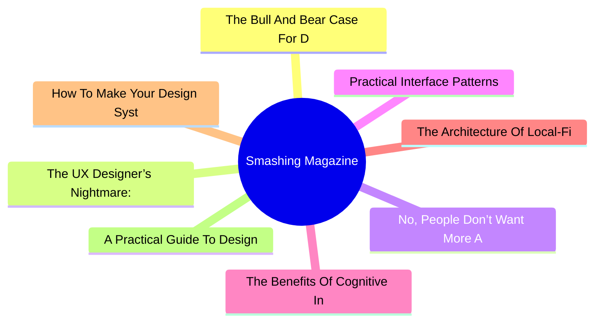
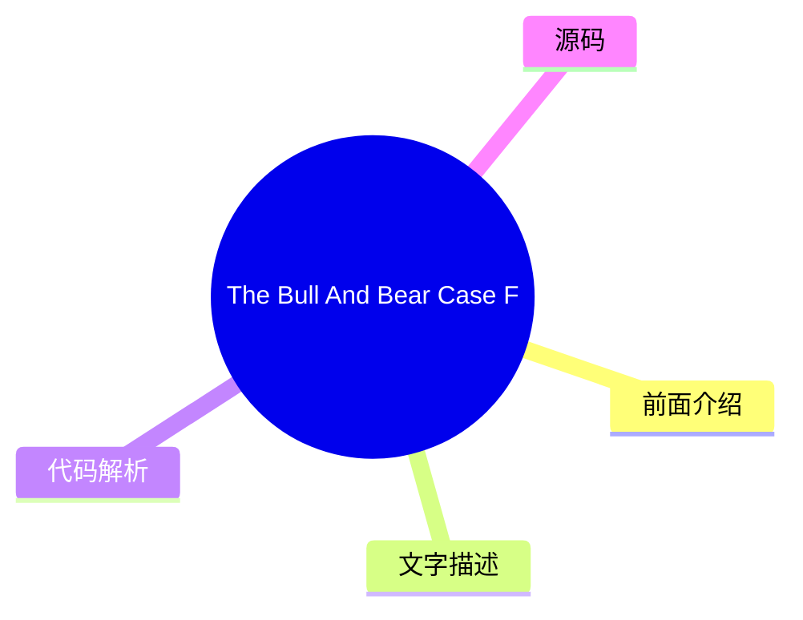
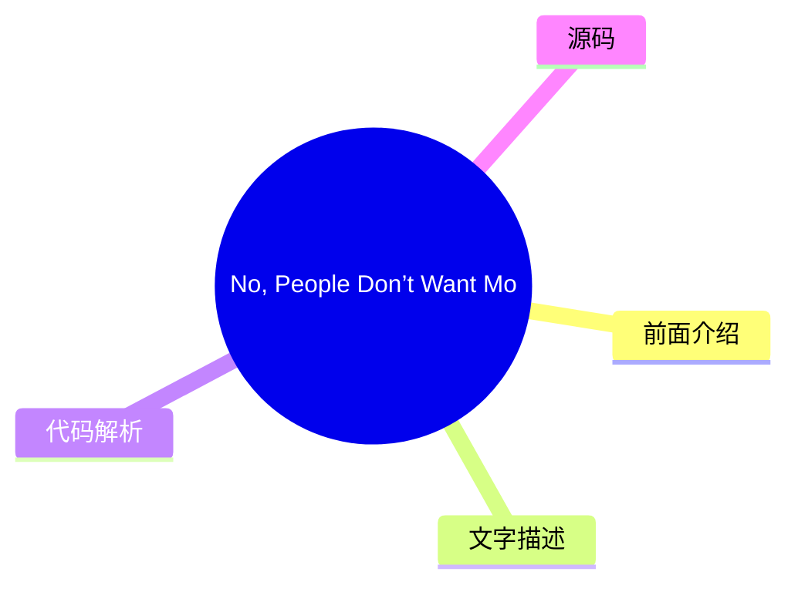
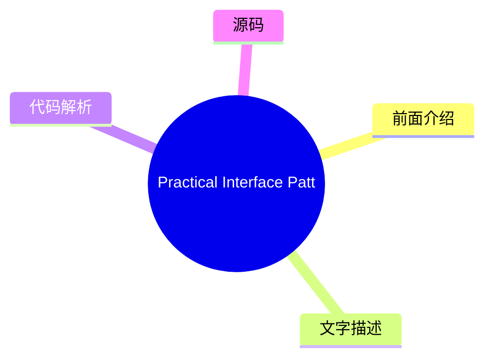
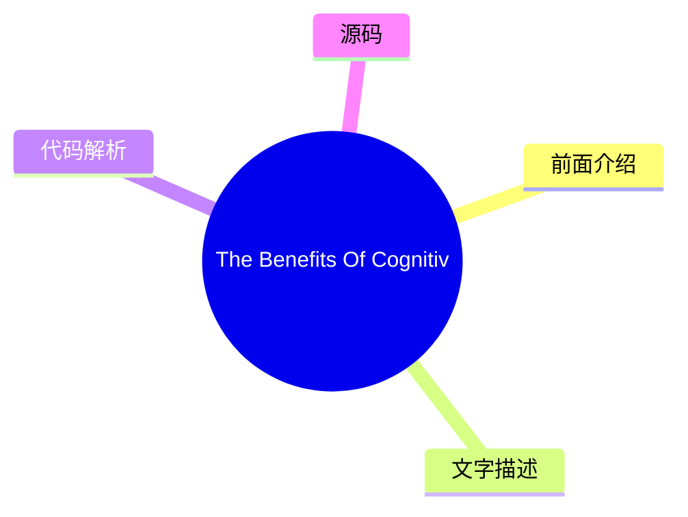
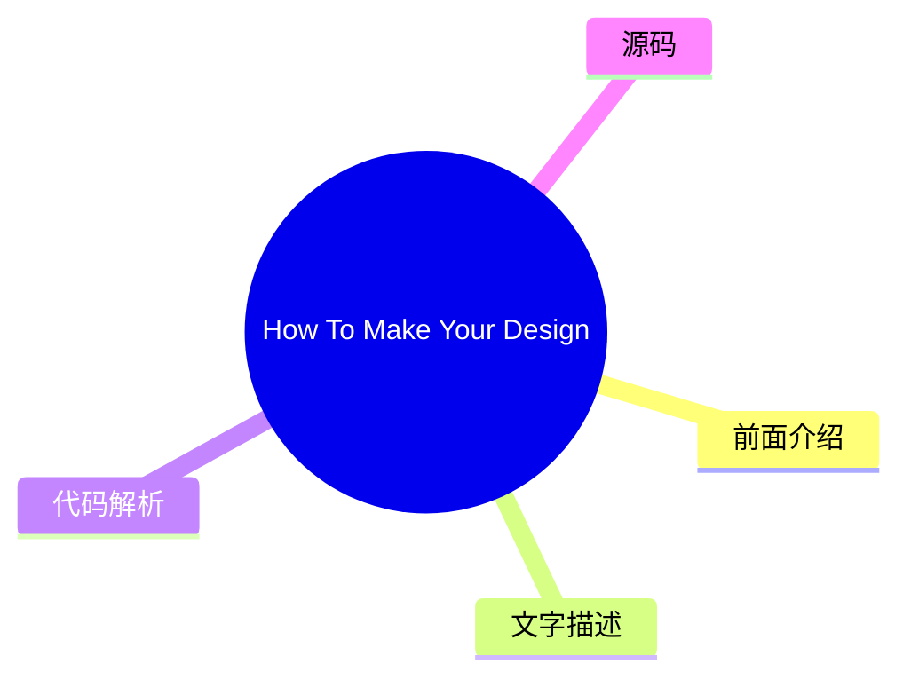
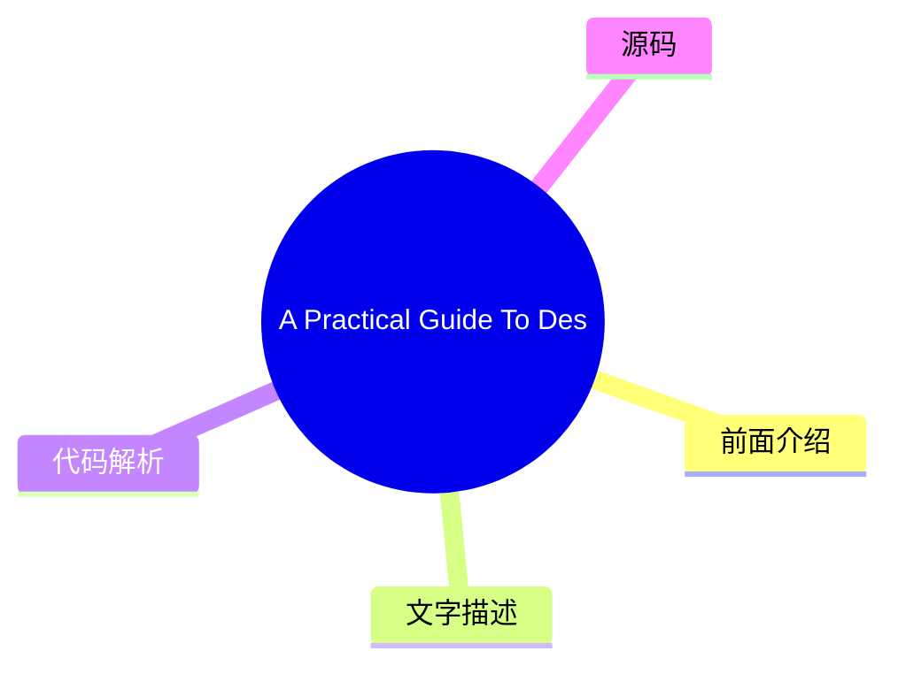

# 🔥 Smashing Magazine Top 8 (2026-08-03)

## 前面介绍

- 数据源：Smashing Magazine
- 抓取日期：2026-08-03
- 条目数：8
- 含完整正文：8
- 含代码片段：1
- 组织方式：前面介绍 / 树状图 / 文字描述 / 代码解析 / 源码

## 思维导图



## 详细整理（8 条，8 条含全文，1 条含代码）

### 1. The Bull And Bear Case For Digital Design In The Age Of AI
- **链接**: [https://smashingmagazine.com/2026/07/bull-and-bear-case-digital-design-age-ai/](https://smashingmagazine.com/2026/07/bull-and-bear-case-digital-design-age-ai/)
- **发布**: Wed, 29 Jul 2026 13:00:00 GMT

#### 前面介绍

- As AI reshapes product design, it could give designers greater autonomy or expose the gaps that autonomy makes harder to hide. Exploring both the bull and bear cases, Andy Budd examines what happens when designers need less permission to act.
- 发布时间：Wed, 29 Jul 2026 13:00:00 GMT

#### 树状图



#### 文字描述

- Designers have spent years saying they would do better work if the organisation got out of the way. Not always in those exact words, obviously. It usually comes out as something more reasonable: we didn’t get enough engineering time, product had already decided the solution, the roadmap was too packed, leadership only cared about this quarter’s numbers, research got cut, the ex
- ## The Bull Case: Designers Need Less Permission A good designer can now move from *“we should fix this”* to *“I fixed this, and pushed it live.”* They can prototype the alternative onboarding flow, write and test clearer product copy, build a rough working version of the interaction, clean up small pieces of design debt without waiting three months for a roadmap slot, and make
- ## The Bear Case: Autonomy Exposes The Gaps Autonomy has teeth. If AI gives designers more room to act, it also removes some of the cover. The same constraints that held good designers back have also protected weaker ones from being tested too directly. For years, it has been easy to say: I had a better idea, but we never got the engineering time. Sometimes that was exactly wha
- ## Where I Think We Might End Up The painful part is that both futures can be true at the same time. AI can make the best designers more capable and many average designers less necessary. It can give design more agency while reducing design headcount. It can help a small number of designers move closer to product leadership while pushing others into governance and clean-up work

#### 代码解析

- 本文未检测到明确代码块，内容更偏新闻、观点或方法论。

#### 源码

#### 中文节选

设计师们多年来一直表示，如果组织能少插手，他们就能做出更好的作品。当然，这未必是原话。通常表达得更委婉一些：我们没有获得足够的工程时间，产品已经决定了解决方案，路线图排得太满，领导层只关心本季度的数据，研究被砍掉了，实验从未正确运行，设计债虽然众所周知，但没人愿意花一个冲刺周期去修复。

这其中大部分是事实。大多数设计师都在产品和工程之间那个尴尬的中间地带工作过。产品界定问题，或者至少自认为界定了问题。工程决定什么是可行的，或者至少什么是负担得起的。设计被期望让事物更清晰、更简单、更连贯、更易用，偶尔还要更吸引人，同时还要小心不要过多地破坏计划。

这种位置一直让人不舒服。

设计师被告知要战略性思考，但往往缺乏战略性行动的权力。

他们能发现糟糕的引导流程、令人困惑的升级路径、让用户感到愚蠢的空状态，以及在产品评审中看起来合理但在实际使用中毫无意义的特性。发现问题是一回事。让问题得到解决是另一回事。

因此，设计往往变成了**争论**。你提出论据。你标注流程。你拿出研究片段。你指向支持工单。你展示 Figma 原型。你解释为什么那个*“小边缘情况”*实际上是半数新用户的首次运行体验。然后大家点头，表示同意这很重要，然后继续做那些已经列入路线图的事情。

这就是 AI 对设计来说比通常的*“会取代设计师吗？”*的争论更有趣的原因之一。真正的变化不在于设计师能制作更多的界面。没人需要更多的界面。有趣的变化在于设计师**可能需要更少的许可**。

## 看涨理由：设计师需要更少的许可

一位优秀的设计师现在可以从 *“我们应该修复这个问题”* 转变为 *“我已经修复了这个问题，并将其推送上线。”* 他们可以构建替代引导流程的原型，编写并测试更清晰的产品文案，构建交互的粗略可用版本，在不等待三个月的路线图排期的情况下清理设计债务的小碎片，并让更好的东西变得**足够显眼**，以至于变得**难以忽视**。

这改变了工作的政治生态。设计往往依赖于说服，因为设计师缺乏直接的生产手段。AI 削弱了这种依赖。并非在所有地方，也并非针对所有事物。复杂的产品仍然拥有架构、基础设施、数据模型、权限、安全、合规性、遗留系统，以及其他所有让软件变得艰难的不那么光鲜的理由。但边界正在移动。

现在，拥有想法和将想法变为现实之间的差距，可以通过拥有正确工具的积极进取的设计师跨越。

在这个未来的版本中，设计

#### 完整正文（中文）

设计师们多年来一直表示，如果组织能少插手，他们就能做出更好的作品。当然，这未必是原话。通常表达得更委婉一些：我们没有获得足够的工程时间，产品已经决定了解决方案，路线图排得太满，领导层只关心本季度的数据，研究被砍掉了，实验从未正确运行，设计债虽然众所周知，但没人愿意花一个冲刺周期去修复。

这其中大部分是事实。大多数设计师都在产品和工程之间那个尴尬的中间地带工作过。产品界定问题，或者至少自认为界定了问题。工程决定什么是可行的，或者至少什么是负担得起的。设计被期望让事物更清晰、更简单、更连贯、更易用，偶尔还要更吸引人，同时还要小心不要过多地破坏计划。

这种位置一直让人不舒服。

设计师被告知要战略性思考，但往往缺乏战略性行动的权力。

他们能发现糟糕的引导流程、令人困惑的升级路径、让用户感到愚蠢的空状态，以及在产品评审中看起来合理但在实际使用中毫无意义的特性。发现问题是一回事。让问题得到解决是另一回事。

因此，设计往往变成了**争论**。你提出论据。你标注流程。你拿出研究片段。你指向支持工单。你展示 Figma 原型。你解释为什么那个*“小边缘情况”*实际上是半数新用户的首次运行体验。然后大家点头，表示同意这很重要，然后继续做那些已经列入路线图的事情。

这就是 AI 对设计来说比通常的*“会取代设计师吗？”*的争论更有趣的原因之一。真正的变化不在于设计师能制作更多的界面。没人需要更多的界面。有趣的变化在于设计师**可能需要更少的许可**。

## 看涨理由：设计师需要更少的许可

优秀的设计师现在可以从 *“我们应该修复这个问题”* 转变为 *“我已经修复了这个问题，并已上线。”* 他们可以原型化替代的引导流程，撰写并测试更清晰的产品文案，构建交互的粗略可用版本，在不等待三个月的路线图排期的情况下清理设计债务的小碎片，并让更好的事物变得**足够显眼**，以至于变得**难以忽视**。

这改变了工作的政治生态。设计往往依赖于说服，因为设计师缺乏直接的生产手段。AI 削弱了这种依赖性。并非在所有地方，也并非针对所有事物。复杂的产品仍然需要架构、基础设施、数据模型、权限、安全、合规、遗留系统以及其他所有让软件变得棘手的、不那么光鲜的理由。但边界正在移动。

现在，有动力的设计师配合合适的工具，可以跨越从拥有想法到将想法变为现实之间的鸿沟。

在这个未来的版本中，设计师变得**不那么依赖许可**：不再依赖产品经理来认可问题，不再依赖工程师来实现每一个微小的改进，不再受困于内部批评家、品味提供者或 Figma 操作员的角色。他们更有能力去制作、测试、修复和发布。

顶尖的设计师开始看起来更不像传统的产品设计师，而更像**混合型产品领导者**。他们仍然关心交互、层级、语言、流程、品牌和工艺，但他们也理解问题的商业形态。他们能够做出权衡。他们可以用代码进行原型设计，或者足够接近代码。他们可以利用 AI 快速探索选项，然后运用判断力将其中大部分舍弃。他们可以与创始人或产品经理坐在一起，在一天结束时，将模糊的产品担忧转化为具体的东西。

这些人可能会变少，但更难被忽视。当前的设计组织模式在一定程度上是围绕**稀缺性**建立的：稀缺的工程时间、缓慢的生产、昂贵的原型、专家之间的交接、跨团队的繁重协调。如果 AI 减少了这种稀缺性，它可能会减少围绕它而生的某些角色的需求。乐观的情况并不是每个设计师都能保住工作并获得生产力提升。这感觉像是一种一厢情愿的想法。更可信的版本是，设计师的总数会减少，但留下的设计师对产品拥有**更大的直接影响力**。

这对最强的设计师来说并不是一个坏结果。这甚至可能是许多人多年来一直想要的。

## 熊市观点：自主性暴露了差距

自主性是有牙齿的。如果 AI 给设计师更多的行动空间，它也会移除一些掩护。那些限制优秀设计师发挥的约束条件，同时也保护了较弱的设计师免受过于直接的检验。

多年来，人们很容易说：我有一个更好的想法，但我们从未获得工程时间。有时确实如此。有时更好的想法从未真正超越仅仅是一种批评。它没有变得具体。它没有经过测试。它没有处理尴尬的权衡。它听起来很有力，是因为它安全地存在于已发布的东西的对立面。

许多设计师擅长发现哪里出了问题。擅长决定应该发生什么的人较少。能将替代方案变得足够具体以供他人评判的人更少。AI 将暴露这一差距。

如果你能对建议进行原型设计，建议就必须变得更好。如果你能让替代方案流畅运行，流程就必须经受细节的考验。如果你能测试产品文案，你就必须关心用户阅读时会发生什么。如果你能修复那块小的设计债务，你就必须决定它是否真的值得修复。

有些设计师并没有他们自认为的那么具有战略眼光。他们学会了战略的语言，却未曾经历过**拥有结果**的煎熬。他们可以谈论用户需求、商业目标、系统思维和产品质量，但在被要求做出决策时却会感到吃力。他们想要影响力，却不想承担随之而来的**曝光度**。

这个行业已经花费了很长时间争论设计理应拥有更多的权力。好吧。但更多的权力意味着更少的借口。这意味着工作成果不再更多地由论证的优雅程度来评判，而是更多地由你所制作、测试或改变的事物质量来评判。这是一个更好的标准，但它对每个人都不会那么仁慈。

还有第二个看空理由，这可能是大型设计团队最应该担心的。在大多数公司中，产品和工程部门已经比设计部门拥有更多的制度权力。他们掌控着路线图、技术架构、冲刺机制、指标，以及通常也是领导层所理解的语言。设计往往不得不将其关切转化为他人的术语，才能被纳入考量。

AI 可能无法重新平衡这种权力。它可能会赋予产品和工程部门足够多的**设计能力**，从而使设计变得更容易被绕过。一个能够生成不错的流程、不错的文案和不错原型的产品经理，可能不会觉得有必要尽早让设计介入。一个能够使用 AI 制作合理界面的工程师，可能会认为设计系统已经涵盖了足够的决策。一个能在一个下午就做出精致演示的创始人，可能会将精致等同于产品思维。

问题不在于这些人会突然变成伟大的设计师。问题在于许多公司无法区分伟大的设计和看似合理的**设计**。**看似合理的设计是危险的。** 它在产品评审中看起来很连贯。它使用了正确的组件。间距没问题。文案不丢人。流程大体上可行。会议中没有人会强烈到提出反对意见。于是，它就发布了。

大量糟糕的产品决策之所以能存活，是因为它们看起来貌似合理。AI 将会产出更多此类决策。这就是设计可能迅速失势的地方：并非因为品味、判断力、研究和交互思维不再重要，而是因为设计的可见产出变得更容易被其他职能模仿。

如果一家公司已经认为设计主要是屏幕、原型和打磨，AI 就会提供一种更廉价的方式来获取这些东西。

在那个世界里，设计并不会获得更多的自主权。它会被收窄。剩下的设计师将负责管理设计系统、监管组件的使用、审查已经确定的流程、整理界面、维护品牌一致性，并被拉入高风险的发布、高管演示以及偶尔出现的混乱跨平台问题中。这些是有用的工作，但涉及的领域更小。更少地塑造产品，更多的是维护家具。

这就是为什么 *“AI 将自动化那无聊的 20%”* 这个论点让人感到过于舒适的原因。在某些公司，也许确实会发生这种情况。但在大型科技组织中，设计团队是围绕协调、制作和流程发展起来的，削减的幅度可能会深得多。不是 20%。可能是 50%。甚至更多。特别是在那些领导层从未真正理解设计团队为何会变得如此庞大的地方。

## 我认为我们可能会走向何方

痛苦的是，这两种未来可能同时成立。AI 可以让最优秀的设计师变得更强大，同时让许多平庸的设计师变得不再必要。它可以在减少设计人员编制的同时，赋予设计更多的自主权。它可以帮助少数设计师更接近产品领导层，同时将其他人推向治理和清理工作。它可以让设计师摆脱等待许可的束缚，然后揭示出有些人比起行动，其实更习惯等待。

“

他们会有品味，但品味是不够的。他们需要**产品判断力**、**技术好奇心**、**商业意识**，以及在每一个变量都确定之前做出决策的**胆识**。他们需要能够自如地在客户对话、原型、定价问题、品牌疑问和混乱的实现细节之间切换，而不坚持认为所有这些都属于别人。

我不完全确定我们会走向何方。我希望它更接近*利好情形*：更少的权限结构，更多的动手实践，更多的自主权，以及更好的设计师终于能够展示他们的能力，而不受周围机器的掣肘。

我担心它可能更接近*利空情形*：产品和工程吸纳了大部分工作，公司认为看似合理的设计就足够好了，设计因此失去了地位、人员编制和战略阵地。

实际上，它可能只是两者的某种令人不适的混合体。有些设计师将利用 AI 获得更多的自主权。有些公司将利用它来减少对设计师的需求。有些团队将产出更好的作品，因为判断与执行之间的距离变短了。而另一些团队将产出更多看似合理的平庸之作，因为房间里没有人能分辨出其中的差别。

多年来，设计师们一直声称，如果不受周围组织的限制，他们能创造更多的价值。AI 即将检验这一说法。有些人将最终有机会证明这一点。有些人则会发现，那些限制其实是在帮他们的忙。

### 更多资源

- “[Good from Afar, But Far from Good: AI Prototyping in Real Design Contexts](https://www.nngroup.com/articles/ai-prototyping/)”，Huei-Hsin Wang 和 Megan Brown*(NN/Group)*
 UX 设计领域充斥着从自然语言提示生成界面的 AI 驱动原型工具。尽管营销炒作巨大，但针对真实设计场景的评估显示，虽然这些工具可以遵循指令以实现一般目标，但它们往往缺乏权衡设计取舍的精细度，也无法在没有人类广泛指导的情况下产出深思熟虑的高质量设计。

- “[AI Design Tools Are Marginally Better: Status Update](https://www.nngroup.com/articles/ai-design-tools-update-2/?lm=ai-prototyping&pt=article),” Megan Brown, Caleb Sponheim and Taylor Dykes*(NN/Group)*
 AI-powered design tools have improved, yet we’re still nowhere near the usef

...（截断，原文 14445+ 字符）


### 2. The UX Designer’s Nightmare: When “Production-Ready” Becomes A Design Deliverable
- **链接**: [https://smashingmagazine.com/2026/04/production-ready-becomes-design-deliverable-ux/](https://smashingmagazine.com/2026/04/production-ready-becomes-design-deliverable-ux/)
- **发布**: Wed, 22 Apr 2026 10:00:00 GMT

#### 前面介绍

- In a rush to embrace AI, the industry is redefining what it means to be a UX designer, blurring the line between design and engineering. Carrie Webster explores what’s gained, what’s lost, and why designers need to remain the guardians of the user ex
- 发布时间：Wed, 22 Apr 2026 10:00:00 GMT

#### 树状图


#### 文字描述

- In early 2026, I noticed that the UX designer’s toolkit seemed to shift overnight. The industry standard *“Should designers code?”* debate was abruptly settled by the market, not through a consensus of our craft, but through the brute force of job requirements. If you browse LinkedIn today, you’ll notice a stark change: UX roles increasingly demand ** AI-augmented development**
- ## The LinkedIn Pressure Cooker: Role Creep In 2026 The job market is sending a clear signal. While traditional graphic design roles are expected to grow by only **3%** through 2034, UX, UI, and [Product Design roles](https://www.nobledesktop.com/careers/designer/job-outlook#:~:text=The%20projected%20future%20growth%20figures%20for%20Digital,job%20growth%20(which%20lies%20somew
- ### The Competence Trap: Two Job Skill Sets, One Average Result There is potentially a very dangerous myth circulating in boardrooms that AI makes a designer “equal” to an engineer. This narrative suggests that because an LLM can generate a functional JavaScript event handler, the person prompting it doesn’t need to understand the underlying logic. In reality, attempting to mas
- ### The “Averagely Competent” Dilemma For a senior UX designer to become a senior-level coder is like asking a master chef to also be a master plumber because “they both work in the kitchen.” You might get the water running, but you won’t know why the pipes are rattling. - **The “cognitive offloading” risk.** Research shows that while AI can speed up task completion, it often l

#### 代码解析

- 本文未检测到明确代码块，内容更偏新闻、观点或方法论。

#### 源码

#### 中文节选

In early 2026, I noticed that the UX designer’s toolkit seemed to shift overnight. The industry standard *“Should designers code?”* debate was abruptly settled by the market, not through a consensus of our craft, but through the brute force of job requirements. If you browse LinkedIn today, you’ll notice a stark change: UX roles increasingly demand ** AI-augmented development**, 

**technical orchestration,**and

**production-ready prototyping.**

For many, including myself, this is the ultimate design job nightmare. We are being asked to deliver both the “vibe” and the “code” simultaneously, using AI agents to bridge a technical gap that previously took years of computer science knowledge and coding experience to cross. But as the industry rushes to meet these new expectations, they are discovering that AI-generated functional code is not always *good* code.

## The LinkedIn Pressure Cooker: Role Creep In 2026

The job market is sending a clear signal. While traditional graphic design roles are expected to grow by only **3%** through 2034, UX, UI, and [Product Design roles](https://www.nobledesktop.com/careers/designer/job-outlook#:~:text=The%20projected%20future%20growth%20figures%20for%20Digital,job%20growth%20(which%20lies%20somewhere%20around%205%25).) are projected to grow by **16%** over the same period.

However, this growth is increasingly tied to the rise of **AI product development**, where “design skills” have recently become the #1 most in-demand capability, even ahead of coding and cloud infrastructure. Companies building these platforms are no longer just looking for visual designers; they need professionals who can “[translate technical capability into human-centered experiences](https://humbldesign.io/blog-posts/will-ai-replace-designers-2026).”


这为 UX 设计师创造了一个高风险的环境。我们不再仅仅负责界面；我们被期望充分理解技术逻辑，以确保复杂的 AI 功能对屏幕另一端的人类来说感觉直观、安全且有用。设计师正被推向一种 **“设计工程师”** 模式，即我们必须弥合抽象 [AI 逻辑与面向用户的代码](https://www.refontelearning.com/blog/ui-ux-designer-engineering-in-2026-crafting-future-ready-user-experiences#skills-and-competencies-for-the-2026-uiux-designer-3) 之间的差距。

一项 [最近的调查](https://www.lyssna.com/blog/ux-design-trends/) 发现，**73% 的设计师**现在将 AI 视为主要的合作伙伴，而不仅仅是一种工具。然而，这种“协作”往往看起来像是“角色蔓延”。招聘人员往往不仅是在寻找一个理解用户同理心和信息架构的人——他们想要的是那个能够通过提示词让 React 组件凭空出现并将其推送到仓库的人！

这种转变创造了一个 **能力差距**。

作为一名经验丰富的资深设计师，几十年来我一直在掌握认知负荷、无障碍标准等方面的细微差别，以及

#### 完整正文（中文）

2026年初，我注意到 UX 设计师工具箱似乎在一夜之间发生了转变。行业标准“设计师应该写代码吗？”的争论被市场突然平息了，不是通过我们行业的共识，而是通过职位要求的蛮力。如果你今天浏览 LinkedIn，你会注意到一个显著的变化：UX 职位越来越要求 **AI 增强开发**、**技术编排** 和 **生产就绪的原型设计**。

对许多人来说，包括我自己，这是终极的设计噩梦。我们被要求同时交付“氛围感”和“代码”，使用 AI 代理来弥合一个以前需要多年的计算机科学知识和编码经验才能跨越的技术鸿沟。但随着行业匆忙满足这些新期望，他们发现 AI 生成的功能性代码并不总是*好*代码。

## LinkedIn 的压力锅：2026 年的角色蔓延

就业市场发出了明确的信号。虽然传统平面设计职位预计到 2034 年仅增长 **3%**，但 UX、UI 和 [产品设计职位](https://www.nobledesktop.com/careers/designer/job-outlook#:~:text=The%20projected%20future%20growth%20figures%20for%20Digital,job%20growth%20(which%20lies%20somewhere%20around%205%25).) 在同一时期预计增长 **16%**。

然而，这种增长越来越与 **AI 产品开发** 的兴起相关联，其中“设计技能”最近已成为排名第一的最具需求的能力，甚至超过了编码和云基础设施。构建这些平台的公司不再仅仅寻找视觉设计师；他们需要能够“将技术能力转化为以人为中心体验”的专业人士。

这为 UX 设计师创造了一个高风险的环境。我们不再仅仅对界面负责；我们被期望充分理解技术逻辑，以确保复杂的 AI 功能对屏幕另一端的人类来说感觉直观、安全且有用。设计师正被推向一种 **“设计工程师”** 模式，我们必须弥合抽象的 [AI 逻辑与面向用户的代码](https://www.refontelearning.com/blog/ui-ux-designer-engineering-in-2026-crafting-future-ready-user-experiences#skills-and-competencies-for-the-2026-uiux-designer-3) 之间的差距。

一项 [最近的调查](https://www.lyssna.com/blog/ux-design-trends/) 发现，**73% 的设计师**现在将 AI 视为主要的合作伙伴，而不仅仅是一种工具。然而，这种“协作”往往看起来像是“角色蔓延”。招聘人员往往不仅是在寻找理解用户同理心和信息架构的人——他们想要的是能够通过提示词让 React 组件凭空出现并将其推送到仓库的人！

这种转变创造了一个 **能力差距**。

作为一名在掌握认知负荷、无障碍标准和民族志研究细微差别方面花费了几十年的资深设计师，我突然发现自己正被根据调试 CSS Flexbox 问题或管理 Git 分支的能力来评判。

噩梦并非技术本身。而是 **价值的重新分配**。

“

### 能力陷阱：两种工作技能集，一个平庸的结果

董事会中可能正在流传一个非常危险的神话，即 AI 使设计师与工程师“平等”。这种叙事暗示，因为 LLM 可以生成功能性的 JavaScript 事件处理程序，那么提示它的人就不需要理解底层逻辑。实际上，试图同时掌握两个截然不同且深奥的领域，很可能导致在两者上都变得 **平庸**。

### “平庸”的两难困境

要让资深 UX 设计师成为资深级程序员，就像要求一位主厨同时也成为水管工，因为“他们都在厨房工作”。你可能会让水流起来，但你不会知道管道为什么会发出响声。

- **“认知卸载”风险。**
 研究表明，虽然 AI 可以加快任务完成速度，但它往往会导致概念掌握的显著下降。在一项受控研究中，使用 AI 辅助的参与者在理解测试中的得分比那些手动编写代码的参与者低 [17%](https://www.psychologytoday.com/au/blog/the-asymmetric-brain/202602/cognitive-offloading-using-ai-reduces-new-skill-formation)。
- **调试差距。**
 AI 依赖型用户和手动编码者之间最大的性能差距在于 [调试](https://www.anthropic.com/research/AI-assistance-coding-skills)。当设计师使用 AI 编写他们不完全理解的代码时，他们没有能力识别 *何时* 以及 *为何* 它会失败。

因此，如果设计师发布了一个在流量高峰期间崩溃且无法手动追踪逻辑的 AI 生成组件，他们就不再是专家。他们现在成了隐患。

### 未优化代码的高昂代价

任何有经验的代码工程师都会告诉你，如果没有正确的提示词，仅凭 AI 生成代码会导致大量的返工。由于大多数设计师缺乏审计 AI 提供的代码的技术基础，他们无意中发送了大量 [“质量债务”](https://gocrossbridge.com/blog/ai-generated-code/)。

## 设计师生成 AI 代码中的常见问题

- **安全漏洞**
 近期报告显示，高达 [92% 的 AI 生成代码库](https://www.sherlockforensics.com/pages/ai-code-security-report-2026.html)包含至少一个关键漏洞。设计师可能看到一个功能正常的登录表单，却不知道它在 XSS 防御方面的失败率高达 86%，XSS 防御是旨在防止攻击者将恶意脚本注入到可信网站的安全措施。
- **无障碍错觉**

AI 经常生成缺乏语义完整性的“功能性”应用。设计师可能会提示生成一个“美观且功能齐全的切换开关”，但 AI 可能会提供一个非语义化的 `<div>`，它缺乏键盘焦点和屏幕阅读器兼容性，从而制造了 [可访问性债务](https://www.levelaccess.com/blog/accessibility-debt-in-software-development-and-how-to-engineer-it-out/)，日后修复起来代价高昂。

- **性能惩罚**
 AI 生成的代码往往冗长。AI 导致的代码重复率比人工编写的代码高出 [4 倍](https://www.netcorpsoftwaredevelopment.com/blog/ai-generated-code-statistics)。这种冗长性会拖慢页面加载速度，生成巨大的 CSS 文件，并对 SEO 产生负面影响。对于业务方来说，任务看起来是“完成了”。但对于连接缓慢的用户或屏幕阅读器用户来说，该网站是一场噩梦。

## 创造更多工作，而非更少

AI 的承诺是设计师无需打扰工程师即可发布功能。现实却是诞生了一种 **“返工税”**，正在耗尽整个行业的工程资源。

- **清理工作**
 组织发现，虽然开发速度提高了，但每个 Pull Request 中的事故率也上升了 [23.5%](https://blog.exceeds.ai/ai-code-analysis-benchmark-reports/)。一些工程团队现在花费大量时间清理设计团队跳过严格审查流程而交付的“AI 废料”。
- **沟通鸿沟**
 只有 [69% 的设计师](https://www.lyssna.com/blog/ux-design-trends/)认为 AI 提高了他们工作的质量，相比之下，**82% 的开发者**有此感觉。这种差距之所以存在，是因为“能编译的代码”并不等同于“可维护的代码”。

当设计师移交忽略公司内部命名约定或管理模式模式的 AI 生成代码时，他们并没有帮助工程师；他们是在制造一个日后必须由他人解决的谜题。

### 解决方案

我们需要摆脱“**独行全栈设计师**”的噩梦，转向 **设计师/程序员协作** 的模式。

**理想的现实：**

- **伙伴关系**

 Instead of designers trying to be mediocre coders, they should work in a- **human-AI-human loop**. A senior UX designer should work- *with*an engineer to use AI; the designer creates prompts for- **intent, accessibility, and user flow**, while the engineer creates prompts for- **architecture and performance**.
- **Design systems as guardrails**
 To prevent accessibility debt from spreading at scale,- [accessible components must be the default](https://webaim.org/projects/million/)in your design system. AI should be used to feed these tokens into your UI, ensuring that even generated code stays within the “source of truth.”

## Beyond The Prompt

The industry is currently in a state of “AI Infatuation,” but the pendulum will eventually swing back toward quality.

“

Businesses that prioritise “designer-shipped code” without engineering oversight will eventually face a reckoning of technical debt, security breaches, and accessibility lawsuits. The designers who thrive in 2026 and beyond will be those who refuse to be “prompt operators” and instead position themselves as the **guardians of the user experience**. This is the perfect outcome for experienced designers and for the industry.

Our value has always been our ability to advocate for the human on the other side of the screen. We must use AI to augment our design thinking, allowing us to test more ideas and iterate faster, but we must never let it replace the specialised engineering expertise that ensures our designs technically *work* for everyone.

### Summary Checklist for UX Designers

- **Work Together.**
 Use AI-made code as a starting point to talk with your developers. Don’t use it as a shortcut to avoid working with them. Ask them to help you with prompts for code creation for the best outcomes.
- **Understand the “Why”.**
 Never submit code you don’t understand. If you can’t explain how the AI-generated logic works, don’t include it in your work.
- **Build for Everyone.**
 Good design is more than just looks. Use AI to check if your code works for people using screen readers or keyboards, not just to make things look pretty.


### 3. No, People Don’t Want More AI In Their Life
- **链接**: [https://smashingmagazine.com/2026/07/people-dont-want-more-ai/](https://smashingmagazine.com/2026/07/people-dont-want-more-ai/)
- **发布**: Wed, 15 Jul 2026 10:00:00 GMT

#### 前面介绍

- Many companies assume everyone craves new AI features. But the reality is that most people don't want more AI &mdash; at least not in the way most AI leaders envision it. Brought to you by Design Patterns For AI Interfaces, **friendly video courses o
- 发布时间：Wed, 15 Jul 2026 10:00:00 GMT

#### 树状图



#### 文字描述

- Many companies silently assume that everybody wants more AI in their lives. That people are **craving new AI features**, new AI products, new AI workflows — that would all magically replace all existing outdated practices and broken ways of working. But in reality, it seems like **people don’t want more AI** at all — at least not in the way most AI leaders envision it. Unsurpri
- ## The AI People Don’t Need It’s remarkably difficult to make a strong argument with senior leadership, but [AI is not a value proposition](https://www.nngroup.com/articles/powered-by-ai-is-not-a-value-proposition/). New AI features don’t magically make for happy or excited customers. Because AI features are often bolt-ons and separate tools for employees to use, they typically
- ## The AI People Actually Need I’m always puzzled by the comparison of AI features with how unreliable humans are. But people don’t compare software with other people. They **compare features with features** — and if one feature in one product is unreliable, while a similar feature works flawlessly in another, they choose the latter. It’s not about AI or not AI, but rather what
- ## Wrapping Up Perhaps I’m missing a bigger picture, and perhaps I’m just old school — but **I really do like people**. Their stories, their thinking, their emotions, their enthusiasm, their laughing. AI can be remarkably helpful in many situations, but so are people. And between the two, I would favor **spending time with a human** — however imperfect they are — every single t

#### 代码解析

- 本文未检测到明确代码块，内容更偏新闻、观点或方法论。

#### 源码

#### 中文节选

许多公司默默假设每个人都想在他们的生活中拥有更多的 AI。人们渴望新的 AI 功能、新的 AI 产品、新的 AI 工作流程——这些都会神奇地取代所有现有的过时做法和糟糕的工作方式。

但在现实中，似乎人们根本**不需要更多的 AI**——至少不是大多数 AI 领导者所设想的那种方式。毫不意外，许多 AI 功能的[采用率和留存率很低](https://www.mindstudio.ai/blog/ai-adoption-gap-ibm-2026-study)——在极高的交付成本和极高的声誉受损风险下。

## 人们不需要的 AI

向高级管理层提出强有力的论点非常困难，但[AI 不是价值主张](https://www.nngroup.com/articles/powered-by-ai-is-not-a-value-proposition/)。新的 AI 功能并不会神奇地让客户感到快乐或兴奋。由于 AI 功能通常是附加项和员工使用的独立工具，它们通常会**把人从**他们常规的工作方式中**剥离出来**。

AI 非常擅长**放大组织中的捷径和缺陷**——从数据质量到决策制定。它无法神奇地修复多年积累的快速补丁、技术债务、糟糕的文化和内部政治。如果有任何作用，这些缺陷会随着 AI 变得更加明显，表现为不一致或相互冲突的优先级，并直接交给用户，然后用户不得不自己去理清这些混乱。

因为在大多数组织中，工作通常需要在大量断开连接和碎片化的系统之间频繁切换，有了新的 AI 工具，他们现在又多了一个需要切换的系统。这通常会产生更多的工作，而且通常也不是特别令人满意的工作。

除此之外，人们非常清楚[发现和修复 AI 幻觉的成本](https://www.nngroup.com/articles/ai-chatbots-discourage-error-checking/)。要求 AI 生成响应**可能感觉比从头开始编写更容易**，但这是有代价的：

- **通读**整个 AI 输出，
- **找出关键点**以集中注意力，
- **逐一审查/验证**关键点，
- **检查**后续内容的**推理依据**，

- **Articulate corrections**+ regenerate,
- **Review the response**(a number of times).

For many people, AI isn’t something they can proactively choose and explore on their own — it arrives uninvited, at someone else’s pace. On top of that, plenty of messages amplify **fears and worries about AI** replacing work — so it’s hardly surprising that the perception of AI isn’t excitement. It’s **resistance to change** and deep anxiety about one’s place in a world that seems to be changing without them.

At best, AI features might be silently accepted or nodded away. At worst, AI **raises concerns**, doubts, caution — and calls for a healthy dose of skepticism. And sometimes it’s perceived as a threat or **liability** — because unlike other features, AI is neither predictable nor reliable.

People don’t dream of

#### 完整正文（中文）

许多公司默默假设每个人都想在他们的生活中拥有更多的 AI。人们渴望新的 AI 功能、新的 AI 产品、新的 AI 工作流程——这些都会神奇地取代所有现有的过时做法和糟糕的工作方式。

但在现实中，似乎人们根本**不需要更多的 AI**——至少不是大多数 AI 领导者所设想的那种方式。毫不意外，许多 AI 功能的[采用率和留存率很低](https://www.mindstudio.ai/blog/ai-adoption-gap-ibm-2026-study)——在极高的交付成本和极高的声誉受损风险下。

## 人们不需要的 AI

向高级管理层提出强有力的论点非常困难，但[AI 不是价值主张](https://www.nngroup.com/articles/powered-by-ai-is-not-a-value-proposition/)。新的 AI 功能并不会神奇地让客户感到快乐或兴奋。由于 AI 功能通常是附加项和员工使用的独立工具，它们通常会**把人从**他们常规的工作方式中**剥离出来**。

AI 非常擅长**放大组织中的捷径和缺陷**——从数据质量到决策制定。它无法神奇地修复多年积累的快速补丁、技术债务、糟糕的文化和内部政治。如果有任何作用，这些缺陷会随着 AI 变得更加明显，表现为不一致或相互冲突的优先级，并直接交给用户，然后用户不得不自己去理清这些混乱。

因为在大多数组织中，工作通常需要在大量断开连接和碎片化的系统之间频繁切换，有了新的 AI 工具，他们现在又多了一个需要切换的系统。这通常会产生更多的工作，而且通常也不是特别令人满意的工作。

除此之外，人们非常清楚[发现和修复 AI 幻觉的成本](https://www.nngroup.com/articles/ai-chatbots-discourage-error-checking/)。要求 AI 生成响应**可能感觉比从头开始编写更容易**，但这是有代价的：

- **通读**整个 AI 输出，
- **找出关键点**以集中注意力，
- **逐一审查/验证**关键点，
- **检查**后续内容的**推理依据**，

- **Articulate corrections**+ regenerate,
- **Review the response**(a number of times).

For many people, AI isn’t something they can proactively choose and explore on their own — it arrives uninvited, at someone else’s pace. On top of that, plenty of messages amplify **fears and worries about AI** replacing work — so it’s hardly surprising that the perception of AI isn’t excitement. It’s **resistance to change** and deep anxiety about one’s place in a world that seems to be changing without them.

At best, AI features might be silently accepted or nodded away. At worst, AI **raises concerns**, doubts, caution — and calls for a healthy dose of skepticism. And sometimes it’s perceived as a threat or **liability** — because unlike other features, AI is neither predictable nor reliable.

People don’t dream of **AI art museums** or AI fridges or AI hotel reception or AI-narrated children’s books. They don’t want their children to have **romantic AI partners**. Most people don’t want to actively manage (and clean up after) a **swarm of AI agents** roaming in their bank accounts and acting on their behalf in the real world. And most notably, people don’t really want a magical box to speak to or type into all the time.

## The AI People Actually Need

I’m always puzzled by the comparison of AI features with how unreliable humans are. But people don’t compare software with other people. They **compare features with features** — and if one feature in one product is unreliable, while a similar feature works flawlessly in another, they choose the latter. It’s not about AI or not AI, but rather what works consistently and reliably, and what doesn’t.

Many conversations about AI are conversations about the speed of delivery. But to many people, there is little value in increasing the speed of delivery. They want to do things well, with enough time to think and make good decisions. They also want to **enjoy the time they spend working on things**, rather than just ship faster. There is an enormous feeling of reward and achievement that slowly disappears, one vibe-coded change at a time.


People don’t change much. And after all these years, they (still) want features that are fast, accessible, **reliable, predictable and useful** — every single time. And ideally not the ones that replace their entire workflow, but that **augment** their way of working — and that take over the most mundane, annoying, and boring tasks that they find no pleasure in.

Many jobs are [exposed to AI automation](https://www.washingtonpost.com/technology/interactive/2026/jobs-most-affected-ai-automation/), but in many of them there is a rewarding, unique, creative part that requires taste, point of view, and perhaps even human intuition. And if AI **automates boring parts** of it, that’s an advantage for everyone. That’s also what enhances productivity and brings more joy in daily life.

When AI automates tedious and mentally exhausting tasks, its value is much easier to grasp. But for that, AI shouldn’t feel like a bolt-on. It should be **deeply integrated** into people’s existing workflows. It must also match existing **mental models** that they have developed and fine-tuned for years or decades. AI should adapt to how people think and make decisions, not the other way around.

And it doesn’t really matter if these features are branded as “AI”, “smart” or “automation”. However, they must work well for people using them. And that means that people must be **aware of use cases** where it actually helps them, and be inspired to find more use cases on their own.

Ironically, tools that work well there aren’t “AI-first” — they are **“AI-second”**. Subtle, humble, calm, ambient, taking a supportive role in the background for work that otherwise is remarkably dull and unnecessary.

I don’t want to readbooks written by AI. I don’t want to gaze upon paintings by AI. I don’t want AI to teach my children. I don’t want to have an AI therapist. I don’t want AI making my medical decisions. I want AI to do all thephysical and mental laborthat taxes me so I can read books written by humans and go to art galleries to engage with art made by humans. I want AI that makes my life easier rather than forces me to change myself.


—[Bo Young Lee](https://www.linkedin.com/feed/update/urn:li:share:7467162929474420737/)

## 总结

也许是我忽略了更大的图景，又或许我只是老派——但**我真的喜欢人**。他们的故事、他们的想法、他们的情感、他们的热情、他们的笑声。AI 在许多情况下都非常有帮助，但人也一样。而在两者之间，我愿意**花时间与人类在一起**——无论他们多么不完美——每次都如此。

不，**人们生活中不需要更多的 AI**——他们需要 AI 来自动化他们每天必须处理的枯燥事务，这样他们就有更多的时间和精力去做他们真正热爱和享受的事情。这并不意味着花更多时间与 AI 在一起——而是花更多时间与他们爱的人在一起。

## 介绍“AI 界面设计模式”

介绍 [AI 界面设计模式](https://ai-design-patterns.com/)，这是 Vitaly 的新

**视频课程**，包含来自真实产品的实用示例——同时

[即将举办一场现场 UX 培训](https://smashingconf.com/online-workshops/workshops/ai-interfaces-vitaly-friedman/)。

[跳转到免费预览](https://www.youtube.com/watch?v=jhZ3el3n-u0)。

## 有用的资源

- [AI 采用差距：IBM 2026 研究](https://www.mindstudio.ai/blog/ai-adoption-gap-ibm-2026-study)，作者 MindStudio
- [由 AI 驱动并非价值主张](https://www.nngroup.com/articles/powered-by-ai-is-not-a-value-proposition/)，作者 Nielsen Norman Group
- [AI 聊天机器人会阻碍错误检查](https://www.nngroup.com/articles/ai-chatbots-discourage-error-checking/)，作者 Nielsen Norman Group
- [受 AI 自动化影响最大的工作](https://www.washingtonpost.com/technology/interactive/2026/jobs-most-affected-ai-automation/)，作者 The Washington Post
- [关于 AI 以及我们实际上对它的期望](https://www.linkedin.com/feed/update/urn:li:share:7467162929474420737/)，作者 Bo Young Lee


### 4. Practical Interface Patterns For AI Transparency (Part 2)
- **链接**: [https://smashingmagazine.com/2026/05/practical-interface-patterns-ai-transparency/](https://smashingmagazine.com/2026/05/practical-interface-patterns-ai-transparency/)
- **发布**: Wed, 13 May 2026 13:00:00 GMT

#### 前面介绍

- Why traditional loading patterns like spinners fail in agentic AI experiences, and how interface patterns that reveal the system’s process, status, and decision-making can improve transparency and build user trust.
- 发布时间：Wed, 13 May 2026 13:00:00 GMT

#### 树状图



#### 文字描述

- In the [first part of this series](https://www.smashingmagazine.com/2026/04/identifying-necessary-transparency-moments-agentic-ai-part1/), we talked about the **Decision Node Audit**. We mapped out the internal workings of our AI system to pinpoint the exact moments it makes decisions based on probabilities. This told us when the system needs to be transparent with the user. No
- ## Writing Clear Status Updates We often think of transparency as a visual design problem, but it’s really about the **words** we use. Simple, clear explanations (the microcopy) are what build trust and separate a reliable AI from one that feels broken. We need to retire generic placeholders like *Loading* or *Working*. These words are remnants of the era of static software. In
- ## The Agentic Update Formula To give people useful status updates, we need to connect what the system is *doing* with *why* it’s doing it. Keeping with our scheduling agent example, the system should break down that waiting period into at least four clear, separate steps. - First, the interface displays *Checking your calendar to find open times for a recurring Thursday call w
- ## Matching Tone to the Risk Matrix Should an AI sound like a person or act like a robot? The right answer depends on the task’s importance, which we can figure out using the **Impact/Risk Matrix** from our **Decision Node Audit**. For simple, low-risk tasks, a friendly, conversational tone works best. For example, a scheduling assistant can say it’s checking your calendar for 

#### 代码解析

- 本文未检测到明确代码块，内容更偏新闻、观点或方法论。

#### 源码

#### 中文节选

In the [first part of this series](https://www.smashingmagazine.com/2026/04/identifying-necessary-transparency-moments-agentic-ai-part1/), we talked about the **Decision Node Audit**. We mapped out the internal workings of our AI system to pinpoint the exact moments it makes decisions based on probabilities. This told us when the system needs to be transparent with the user. Now, the big question is *how* to share that information.

You’ve got your **Transparency Matrix** ready. You know which behind-the-scenes API calls need a visible status update. Your engineers are on board with the technical aspects. The next step is designing the visual container for those updates.

We face a legacy problem. For thirty years, interface designers have relied on a single pattern to handle latency: **the spinner**. The spinning wheel, the throbber, the progress bar. These patterns communicate a specific technical reality. They tell the user that the system is retrieving data. The delay is caused by bandwidth or file size.

AI agents introduce a new kind of wait time. When an agent pauses for twenty seconds, it’s not just downloading something; it’s *thinking*. It’s figuring out the best steps, weighing options, and creating the content you asked for.

If we use a basic spinning icon for this “thinking time,” users get confused and anxious. They watch a looping animation and can’t tell if the system is stalled or crashed. They don’t know if the agent is handling a very complicated task or if it has simply failed.

To build user trust, we need to turn this waiting time into a **moment for reassurance**. Instead of a passive *“something is happening,”* we need to communicate an active, *“Here is exactly how I am working to solve your problem.”*

## Writing Clear Status Updates

We often think of transparency as a visual design problem, but it’s really about the **words** we use. Simple, clear explanations (the microcopy) are what build trust and separate a reliable AI from one that feels broken.


We need to retire generic placeholders like *Loading* or *Working*. These words are remnants of the era of static software. Instead, we must construct our status updates using a specific formula that mirrors the agency of the system. Let’s stop using vague words like “Loading” or “Working.” Those terms belong to the past, when software was simple and static. Instead, we should create status updates that clearly tell the user what the system is *actually doing* and make the system’s actions transparent.

Imagine, for the sake of an example, you are deploying agentic AI that will help team members organize their calendars and plan recurring meetings on their behalf, once prompted.

When an AI displays a message like “Checking availability” for an unknown amount of time, users often feel lost because it doesn’t offer enough information. While they understand the AI is looking at a calendar, they don’t know *whose* calendar it is, what other steps are involved (before or aft

#### 完整正文（中文）

In the [first part of this series](https://www.smashingmagazine.com/2026/04/identifying-necessary-transparency-moments-agentic-ai-part1/), we talked about the **Decision Node Audit**. We mapped out the internal workings of our AI system to pinpoint the exact moments it makes decisions based on probabilities. This told us when the system needs to be transparent with the user. Now, the big question is *how* to share that information.

You’ve got your **Transparency Matrix** ready. You know which behind-the-scenes API calls need a visible status update. Your engineers are on board with the technical aspects. The next step is designing the visual container for those updates.

We face a legacy problem. For thirty years, interface designers have relied on a single pattern to handle latency: **the spinner**. The spinning wheel, the throbber, the progress bar. These patterns communicate a specific technical reality. They tell the user that the system is retrieving data. The delay is caused by bandwidth or file size.

AI agents introduce a new kind of wait time. When an agent pauses for twenty seconds, it’s not just downloading something; it’s *thinking*. It’s figuring out the best steps, weighing options, and creating the content you asked for.

If we use a basic spinning icon for this “thinking time,” users get confused and anxious. They watch a looping animation and can’t tell if the system is stalled or crashed. They don’t know if the agent is handling a very complicated task or if it has simply failed.

To build user trust, we need to turn this waiting time into a **moment for reassurance**. Instead of a passive *“something is happening,”* we need to communicate an active, *“Here is exactly how I am working to solve your problem.”*

## Writing Clear Status Updates

We often think of transparency as a visual design problem, but it’s really about the **words** we use. Simple, clear explanations (the microcopy) are what build trust and separate a reliable AI from one that feels broken.


我们需要淘汰像 *Loading* 或 *Working* 这样的通用占位符。这些词汇是静态软件时代的遗留产物。相反，我们必须使用特定的公式来构建状态更新，以反映系统的主动性。让我们停止使用“Loading”或“Working”这类模糊的词汇。这些术语属于过去，那时软件简单且静态。相反，我们应该创建状态更新，明确告诉用户系统*实际上正在做什么*，并使系统的操作透明。

想象一下，为了举例说明，你正在部署一个代理 AI，它会在被提示后帮助团队成员整理日历并代表他们安排定期会议。

当 AI 对未知的时间段显示类似“Checking availability”（检查可用性）的消息时，用户往往会感到迷茫，因为它没有提供足够的信息。虽然他们理解 AI 正在查看日历，但他们不知道它查看的是*谁的*日历，涉及哪些其他步骤（之前或之后），或者 AI 是否记得了日程安排请求的人员和目的。等待最终结果可能是一种紧张、不安的体验，就像在期待一份你怀疑可能是恶作剧的礼物一样。

Perplexity AI 提供了正确处理状态更新的一个有力范例。下图 1 显示，当用户提问时，界面会实时显示它正在执行的确切操作。你会看到活动列表随着任务的完成而更新。用户无需猜测 AI 在工作时正在发生什么。

## 代理更新公式

为了向用户提供有用的状态更新，我们需要将系统正在*做*的事情与其*为什么*这样做联系起来。沿用我们的日程安排代理示例，系统应该将等待期分解为至少四个清晰、独立的步骤。

- 首先，界面显示 *Checking your calendar to find open times for a recurring Thursday call with [Name(s)]*（正在检查你的日历，以查找与 [Name(s)] 进行每周四通话的空闲时间）。
- 然后，它更新为：*Cross-checking availability with [Name(s)] calendars*（正在与 [Name(s)] 的日历交叉核对可用性）。
- 接下来，它可能会显示：*Syncing [Name(s)] schedules to secure your meeting time on [Data and Time]*（正在同步 [Name(s)] 的日程，以确定你在 [Data and Time] 的会议时间）。

- 最后，在结束时，代理可能会声明他们已成功完成任务，并请求用户检查其电子邮件，以确认已发送给有定期会议的群组的邀请。

这种沟通过程将技术流程立足于用户的实际生活。

让 AI 的进展易于理解，归结为一个三部分结构：一个强有力的**动作词**、AI 正在处理的内容（**具体项目**）以及它必须遵守的任何**限制**或规则。

想象一下 AI 正在帮你预订旅行。一个薄弱、无用的更新可能只是：*正在搜索航班……*

一个更好的更新使用了以下公式：

- **动作词：**- *扫描*
- **具体项目：**- *汉莎航空和联合航空的价格*
- **限制/规则：**- *查找任何低于 600 美元的。*

这种方法清楚地表明用户，AI 理解了他们的请求，并且正在设定的边界内工作。

## 匹配语气与风险矩阵

AI 应该听起来像人还是表现得像个机器人？正确的答案取决于任务的重要性，我们可以使用我们**决策节点审计**中的**影响/风险矩阵**来确定这一点。

对于简单、低风险的任务，友好、对话式的语气效果最好。例如，日程安排助手可以说它正在检查您的日历以寻找最佳时间。这为用户创造了一种舒适、轻松的体验。

然而，高风险任务需要清晰、机械的准确性。如果 AI 正在管理大额资金转账或复杂的数据库迁移，用户不想要一个有趣的界面；他们需要的是精确性。一个显示 *“我正在为您的资金深思熟虑”* 的屏幕可能会引起恐慌。相反，界面应该使用像 *“正在验证账户路由号码”* 这样直接的语言。通过调整 AI 的“个性”以匹配风险级别，我们为用户提供了他们在那一刻确切需要的那种体验。虽然影响/风险矩阵提供了必要的起点，但适当 AI 语音和语气的最终决定因素是严格的**用户研究**。

对于任何一组规则来说，都不可能预测出能在每一组用户或每一种情况下建立信任或引发压力的确切措辞或语气。这就是为什么动手研究至关重要。你需要：

- [运行 A/B 测试](https://medium.com/@alienoghli/the-essential-guide-to-a-b-testing-a84b853c16e0)
- [进行可用性研究](https://uxplanet.org/usability-testing-the-complete-guide-e162898f68db)
- [开展访谈](https://ixdf.org/literature/article/how-to-conduct-user-interviews)

这种研究确保了 AI 的“个性”对于实际使用该系统的人群及其特定环境来说，是舒适且恰当的。

我们现在已经涵盖了 *“什么”* —— 那些关键的微文案、清晰的动作动词以及让 AI 状态更新诚实且具有信息量的必要限制。但仅有文字是不够的。隐藏在糟糕界面中的完美句子，依然是透明度的失败。

下一个挑战是 *“如何”* —— 为该消息设计物理交付系统。你可以把状态更新公式看作引擎，把界面模式看作汽车。强大的引擎需要一个可靠、设计良好的底盘来承载它行驶在路上。

## 界面模式：智能体的库

一旦我们有了合适的文字，就需要 **合适的容器**。关键在于将消息的权重与模式的可见性相匹配。一个微小的后台任务（比如智能体在后台默默整理你的文件）不需要大声闪烁的横幅。该消息最好以微妙的方式传达。一个高风险的多步骤流程（比如转账）可能需要更稳健的容器，以迫使用户集中注意力。

通过创建这些模式的库，我们确保在正确的时刻提供适当程度的透明度，将等待的焦虑转化为知情自信的时刻。让我们回顾几个常见且关键的模式。

### 活跃的面包屑：AI 在后台工作

对于那些 AI 正在后台安静处理的低重要性任务，我们需要一种方式来向用户展示它正在工作，而又不会不断分散他们的注意力。我们可以称之为活跃的面包屑。

想象一个 AI 正在为您起草回复的邮件应用。您不希望出现令人分心的弹出消息。相反，一个微小的、微妙的状态指示器会在应用程序的边框或菜单区域内闪烁。

该解决方案需要超越静态图标。这个动态面包屑会在不同的文本更新之间平滑过渡。它可能会从 *Reading email*（阅读邮件）闪烁到 *Drafting reply*（起草回复）再到 *Checking tone*（检查语气）。如果您想查看其进度，它就在那里，提供一种安静的确认，表明任务正在进行中，但不会要求您立即关注。

### 动态检查清单

在处理关键的高风险任务时——例如处理复杂的金融交易或迁移大型、复杂的数据集——我们建议使用**动态检查清单**（如图 3 所示）。

该模式为用户提供了一个强大的锚点，提供了关于**流程进度**的清晰度和信心。动态检查清单列出了 AI 代理将要采取的每一个计划步骤，而不是简单的进度条。它清晰地高亮当前正在进行的步骤，将前面的步骤标记为已完成，并列出未来的操作为待处理状态。

例如：

- **步骤 1**: Verify Account Balance（验证账户余额）- **[Complete]**（已完成）。
- **步骤 2**: Convert Currency（转换货币）- **[Processing]**（处理中）。
- **步骤 3**: Transfer Funds（转账）- **[Pending]**（待处理）。

动态检查清单相比传统的进度条具有显著优势，因为它能巧妙地管理不可预测的时间。如果货币转换（步骤 2）意外地需要额外十秒钟，用户不会感到突然的焦虑或恐慌。他们对系统的确切位置拥有完全的可见性，并理解延迟发生在 *Converting Currency*（转换货币）步骤期间。因为他们认识到这是一个潜在复杂的操作，因此他们对系统正在进行的工工作自然会更加耐心和信任。

该模式本身是一个引人注目的 UI 构思，但设计师必须记住，其实现会将任务转化为一个全栈设计需求。与简单的加载标志不同，动态检查清单需要一个健壮的前端状态管理系统来监听步骤完成事件，这些事件通常由后端 webhook 结构触发。这确保了界面始终反映代理在工作流中的实时位置。

### 思考切换开关

一些信息需求较高或对透明度要求较高的用户可能不会信任简单的摘要；他们想看到系统的原始处理过程。对于这一受众群体，我们设计了 **Thinking Toggle（思考切换开关）**。

这是一个简单的渐进式披露 UI 控件，类似于一个倒三角或“查看日志”按钮，它允许用户将友好的状态更新展开为原始终端视图。它显示 AI 代理的已清理逻辑日志，例如：

- *查询 API 端点 /v2/search*；
- *收到响应：200 OK*；
- *按相关性分数 > 0.8 过滤结果*。

许多人永远不会打开此视图。然而，对于需要深度透明度的用户来说，该切换开关的存在本身就是一种信任信号。它向他们保证系统没有隐瞒任何内容。

请记住，这种深度透明度伴随着一个关键的技术风险。即使对于您最专业的受众，在显示之前也必须对这些原始日志进行清理和抽象化。这一步骤是不可商量的，以防止意外暴露专有业务逻辑、内部数据结构名称或可能被利用的安全令牌。此过程确保信任是通过诚实而非安全漏洞建立的。

### 为部分成功进行设计

在标准软件中，事情通常是黑白的。文件要么保存，要么不保存。但在 AI 代理中，事情是...（截断，原文 21693+ 字符）


### 5. The Benefits Of Cognitive Inclusion In UX Research
- **链接**: [https://smashingmagazine.com/2026/06/benefits-cognitive-inclusion-ux-research/](https://smashingmagazine.com/2026/06/benefits-cognitive-inclusion-ux-research/)
- **发布**: Wed, 10 Jun 2026 10:00:00 GMT

#### 前面介绍

- Findings from an exploratory user research study highlighting the unique insights and practical UX recommendations shared by participants with cognitive disabilities.
- 发布时间：Wed, 10 Jun 2026 10:00:00 GMT

#### 树状图



#### 文字描述

- In the summer of 2024, I became co-chair of a working group of expert researchers who came together to determine how best to perform accessibility testing with people with cognitive disabilities. This was work I did for Fable, where I am currently VP of Innovation. Cognitive disability is an umbrella term for several disabilities that impact how people process information, and 
- ## The Cognitive Usability Study I decided to run a joint study with Fable’s partners at the University of California, Irvine, in collaboration with Syed Fatiul Huq and with help from Fable researchers Pranav Pidathala, Ali Brown, and Michael Fagan to see if my hypothesis about finding more insights with cognitive testers proved true or not. I generated three websites for the s
- ### Table 1: Websites And Tasks Tested | Website | [Strong Snacks](https://v0-strong-snacks.vercel.app/) | [Turning Pages](https://v0-bookstore-nu.vercel.app/) | [Crown & Comb](https://v0-crown-and-comb.vercel.app/) | |---|---|---|---| | Description | This is a website for three-ingredient high-protein recipes. Recipes can be browsed by category (vegan, muscle building, etc.). 
- ## Data Analysis Approach I reviewed all the study recordings and transcripts and made note of every time a participant raised a concern, question, difficulty, or asked a question about how something worked. I counted all of these as issues. I also noted where a participant missed something that was part of a task, even if they didn’t notice it themselves. I also noted every su

#### 代码解析

- 本文未检测到明确代码块，内容更偏新闻、观点或方法论。

#### 源码

#### 中文节选

2024年夏天，我成为了一个专家研究人员工作组联席主席，该工作组旨在共同确定如何最好地与认知障碍人士进行无障碍测试。这是我为 Fable 所做的工作，目前我是那里的创新副总裁。

认知障碍是一个统称，涵盖了几种影响人们处理信息方式的障碍，通常会影响记忆、专注力和/或学习能力。它是美国最常见的残疾类型（通过 [CDC](https://www.cdc.gov/disability-and-health/articles-documents/disability-impacts-all-of-us-infographic.html) 占 13.9%），且认知障碍正在迅速增加（[耶鲁研究](https://news.yale.edu/2025/09/24/growing-number-us-adults-report-cognitive-disability)）。

我们为自己设定了四个目标，以学习如何与这一受众群体合作：

- 我们应该如何招募和筛选参与者？
- 与认知障碍参与者进行研究的最佳实践是什么？
- 这些方法在真实研究中有效吗？
- 记录我们的所学，以便分享。

我们创建了一份筛选问卷，以招募那些自我认定为在记忆、专注和学习方面存在挑战的人。我们还回顾了涉及认知障碍测试者的已发表研究，以学习与他们合作的最佳实践。

接下来，我们在一项试点研究中，对这 25 名测试者测试了这些最佳实践。我们迭代优化了方法，并创建了一份指南，用于指导与认知障碍测试者进行用户访谈，以及一份调查问卷，用于量化他们使用数字产品的体验。最后，我们[记录了我们的所学](https://makeitfable.com/article/cognitive-accessibility-pilot-case-study/)。

在与这组新的测试者完成试点研究后，我感觉到他们能比过去我与一般人群（Gen Pop）用户研究参与者一起工作时发现更多的可用性见解。我着手验证这一直觉。

## 认知可用性研究

我决定与 Fable 的合作伙伴加州大学欧文分校合作开展一项联合研究，在 Syed Fatiul Huq 的协助下，并得到 Fable 研究员 Pranav Pidathala、Ali Brown 和 Michael Fagan 的支持，以验证我关于使用认知测试人员能获得更多见解的假设是否成立。

我使用 AI 原型制作工具生成了三个网站用于这项研究。我想要三种不同类型的网站，具有不同的用户目标和内容，以便我能在研究中测试各种任务。

### 表 1：测试的网站和任务

| 网站 | [Strong Snacks](https://v0-strong-snacks.vercel.app/) | [Turning Pages](https://v0-bookstore-nu.vercel.app/) | [Crown & Comb](https://v0-crown-and-comb.vercel.app/) | 
|---|---|---|---|
| 描述 | 这是一个提供三成分高蛋白食谱的网站。食谱可以按类别浏览（素食、增肌等）。该网站还包含关于蛋白质的博客文章和联系信息。 | 这是一个书店网站，拥有精选阅读目录。它具有扩展

#### 完整正文（中文）

2024年夏天，我成为了一个专家研究人员工作组联席主席，该工作组旨在共同确定如何最好地与认知障碍人士进行无障碍测试。这是我为 Fable 所做的工作，目前我是那里的创新副总裁。

认知障碍是一个统称，涵盖了几种影响人们处理信息方式的障碍，通常会影响记忆、专注力和/或学习能力。它是美国最常见的残疾类型（通过 [CDC](https://www.cdc.gov/disability-and-health/articles-documents/disability-impacts-all-of-us-infographic.html) 占 13.9%），且认知障碍正在迅速增加（[耶鲁研究](https://news.yale.edu/2025/09/24/growing-number-us-adults-report-cognitive-disability)）。

我们为自己设定了四个目标，以学习如何与这一受众群体合作：

- 我们应该如何招募和筛选参与者？
- 与认知障碍参与者进行研究的最佳实践是什么？
- 这些方法在真实研究中有效吗？
- 记录我们的所学，以便分享。

我们创建了一份筛选问卷，以招募那些自我认定为在记忆、专注和学习方面存在挑战的人。我们还回顾了涉及认知障碍测试者的已发表研究，以学习与他们合作的最佳实践。

接下来，我们在一项试点研究中，对这 25 名测试者测试了这些最佳实践。我们迭代优化了方法，并创建了一份指南，用于指导与认知障碍测试者进行用户访谈，以及一份调查问卷，用于量化他们使用数字产品的体验。最后，我们[记录了我们的所学](https://makeitfable.com/article/cognitive-accessibility-pilot-case-study/)。

在与这组新的测试者完成试点研究后，我感觉到他们能比过去我与一般人群（Gen Pop）用户研究参与者一起工作时发现更多的可用性见解。我着手验证这一直觉。

## 认知可用性研究

我决定与 Fable 的合作伙伴加州大学尔湾分校合作开展一项联合研究，在 Syed Fatiul Huq 的协助下，并在 Fable 研究人员 Pranav Pidathala、Ali Brown 和 Michael Fagan 的帮助下，以验证我关于使用认知测试人员能获得更多见解的假设是否成立。

我使用 AI 原型工具生成了三个网站用于这项研究。我想要三种不同类型的网站，具有不同的用户目标和内容，以便我可以在研究中测试各种任务。

### 表 1：测试的网站和任务

| 网站 | [Strong Snacks](https://v0-strong-snacks.vercel.app/) | [Turning Pages](https://v0-bookstore-nu.vercel.app/) | [Crown & Comb](https://v0-crown-and-comb.vercel.app/) | 
|---|---|---|---|
| 描述 | 这是一个提供三种配料高蛋白食谱的网站。食谱可以按类别（素食、增肌等）浏览。该网站还包含关于蛋白质的博客文章和联系信息。 | 这是一个书店网站，拥有精选阅读目录。它具有按书籍类型进行广泛筛选的功能、用于构建喜好和厌恶档案的书籍滑动功能、自定义书单、购物车和结账功能。 | 这是一个美发沙龙网站，允许您在线预约和咨询。它拥有 VIP 计划和各种访客可以购买的特别套餐。 | 
| 设计 | 简单、粗野主义、明亮、大量图片。 | 情绪化、经典、深色、大量书籍封面图片。 | 大胆、简洁、黑白配色，辅以色彩点缀。 | 
| 内容 | 食谱、博客文章。 | 书籍和书单。 | 服务、体验指南、会员信息。 | 
| 关键功能 | 按类别筛选、订阅通讯。 | 购物车、书籍匹配、书单、推荐。 | 预约预订。 | 
| 任务 | 
 | 
 | 
 | 

我们使用了一份包含关于记忆力、专注力和学习能力问题的单一筛选问卷，并根据参与者是否自我认定为存在认知挑战，将他们分为两组。

认知障碍包括神经多样性。神经多样性是一个统称，用于描述大脑处理信息和学习方式不同的人群。它最常用于描述患有学习障碍（如阅读障碍）、ADHD（注意缺陷多动障碍）和自闭症的人群。

我们对每个网站进行了30次用户访谈，每个网站10人。对于每个网站，认知障碍参与者和普通人群参与者的比例均为5:5。在每次访谈中，参与者在一个研究人员主持的在线用户访谈中完成一个网站的所有任务。

所有参与者在会话结束时都完成了一份[可访问可用性量表（AUS）调查](https://makeitfable.com/accessible-usability-scale/)。这是一份免费、采用知识共享许可协议的10题调查，用于评估网站和移动应用的可访问性。

## 数据分析方法

我审查了所有的研究录音和逐字稿，并记录了参与者每次提出担忧、问题、困难或询问某事物如何运作的情况。我将所有这些情况都计为问题。我还记录了参与者遗漏了任务中的一部分内容的情况，即使他们自己没有注意到。我还记录了参与者提出的每一项改进建议。

发现的问题示例包括：

- 照片太高，需要大量滚动才能看到内容（参与者指出）。
- 我在喜欢或不喜欢一本书时没有任何反馈（参与者指出）。
- 参与者第一次错过了必填的邮政信箱复选框（我观察到）。

建议的示例包括：

- 我希望看到一个蛋白质对比表。
- “更多信息”标签页应该移到更靠上的位置。
- 我希望获得更多关于推荐列表是如何生成的信息。

每个参与者的问题和建议只计算一次，即使他们提到了两次，但不同参与者之间当然会有重复的问题和建议。在涉及多个参与者的用户体验研究中，你可能会发现每个参与者都有类似的问题，这是一个信号，表明该问题是一个普遍存在的挑战。

## 认知可用性研究的结果

在测试的三个网站中：

- 认知障碍参与者识别出了 197 个问题。
- 普通人群参与者识别出了 113 个问题。
- 认知障碍参与者提出了 93 条建议。
- 普通人群参与者提出了 54 条建议。
- 认知障碍参与者发现的问题更多与内容、按钮、图标、视觉元素和媒体相关，而普通人群参与者则较少。

结果与我的直觉一致：具有认知障碍的参与者发现的问题数量是普通人群参与者的 1.8 倍，提出的建议数量也是 1.8 倍。

让我们深入探讨每个网站的数据。请注意，AUS 评分范围为 0 到 100，分数越高代表可用性越好。

### 表 2：Strong Snacks

该网站是所有测试网站中设计和内容最简单的，因此总体问题最少，中位数 AUS 评分最高。数据与您对一个易于使用且简单的网站的预期相符。

在该网站上，认知障碍参与者平均发现了 3.4 个更多的问题，提出了 2.2 个更多的建议。他们对整体体验的平均得分比普通人群参与者低 13.7 分。

| 总问题数 | 平均问题数 | 中位数问题数 | 总建议数 | 平均建议数 | 中位数建议数 | 平均 AUS | 中位数 AUS | |
|---|---|---|---|---|---|---|---|---|
| 普通人群 | 32 | 6.4 | 6 | 13 | 2.6 | 2 | 90.5 | 97.5 | 
| 认知障碍 | 49 | 9.8 | 9 | 24 | 4.8 | 4 | 76.8 | 73.0 | 

### 表 3：Turning Pages

这是功能最多样化、任务最多（4 个）的网站，因此参与者发现的问题最多也就不足为奇了。

在这里，认知障碍参与者平均发现了 6 个更多的问题，提出了 3.2 个更多的建议。他们的整体体验平均得分也比普通人群参与者低 17.2 分。

| 总问题数 | 平均问题数 | 中位数问题数 | 总建议数 | 平均建议数 | 中位数建议数 | 平均 AUS | 中位数 AUS | |
|---|---|---|---|---|---|---|---|---|
| 普通人群 | 55 | 11 | 10 | 26 | 5.2 | 4 | 78.0 | 80.0 | 
| 认知障碍 | 86 | 17 | 15 | 42 | 8.4 | 6 | 60.8 | 58.0 | 

### 表 4：Crown & Comb

This website was intentionally designed to be complex, and task 3, finding the bridal package, was meant to be extremely difficult to complete.

On this last website, cognitive participants on average found 7 more issues and made 2.4 more suggestions. Their average score for the overall experience was 14.3 points **higher** than the gen pop participants.

| Total issues | Average issues | Median issues | Total suggestions | Average suggestions | Median suggestions | Average AUS | Median AUS | |
|---|---|---|---|---|---|---|---|---|
| Gen pop | 26 | 5 | 4 | 15 | 3 | 3 | 49.5 | 35.0 | 
| Cognitive | 62 | 12 | 11 | 27 | 5.4 | 2 | 63.8 | 68.0 | 

Something interesting happened with the AUS scores for cognitive and gen pop participants in Tables 3 and 4. Cognitive participants scored Crown & Comb higher than Turning Pages, but gen pop scored the opposite — higher for Turning Pages and lower for Crown & Comb. If I had to guess why, I suspect finding more issues on Turning Pages impacted the cognitive participants’ perceptions of usability more than the gen pop participants’.

The other major difference between the sites, outlined in Table 5 below, was that cognitive participants found many more issues with buttons and links on Turning Pages and more issues with icons and visual elements on Crown & Comb. This suggests to me that the interactions being challenging on Turning Pages were a more significant challenge than issues with visual elements.

### Qualitative Findings

When it comes to the more qualitative findings, I looked at trends in the types of issues found by both groups of participants.

**Cognitive participants**:

- Were more likely to flag issues with icons or visual elements.
- Surfaced problems with content more frequently.
- Gave richer qualitative commentary, often explaining why something was hard to find or confusing.

**Gen pop participants**:

- Were less likely to flag conceptual or comprehension barriers.
- Gave shorter feedback, often stopping once the task was complete.

### Table 5: Number Of Issues By Category


当我按类别对问题进行分组时，认知型参与者在以下问题上出现的频率更高：内容、按钮和链接（功能和感知性）、图标或视觉元素以及媒体（视频、动画）。他们在导航问题上的数量几乎与普通人群参与者持平（45 对 46）。

| Strong Snacks | Turning Pages | Crown & Comb | ||||
|---|---|---|---|---|---|---|
| Issue category | Gen pop | Cognitive | Gen pop | Cognitive | Gen pop | Cognitive | 
| Content | 11 | 22 | 11 | 30 | 23 | 36 | 
| Navigation | 18 | 22 | 25 | 17 | 2 | 7 | 
| Buttons and links | 0 | 5 | 7 | 20 | 3 | 0 | 
| Icons or visual elements | 3 | 16 | 2 | 3 | 4 | 23 | 
| Media | 0 | 2 | 0 | 1 | 0 | 0 | 

让我们来看看在 Crown & Comb 会话中，一位认知型参与者和一位普通人群参与者提供的评论。认知型参与者给出的 AUS 得分为 38，普通人群参与者给出的 AUS 得分为 27.5。我选择比较这两位参与者，因为他们都在各自的小组中给出了最低分。

注意他们在下方的引语中描述整体体验时的差异。普通人群参与者解释说这令人沮丧且不吸引人。认知型参与者感到精疲力竭，且难以集中注意力。我将这种体验解读为对认知型参与者的整体幸福感产生了更深远的影响。

普通人群参与者引语

“一旦你有了治疗名称和一点解释，以及像持续时间这样的信息和价格，一旦你点击进去，就应该能立即与该服务进行交互。并且

...（截断，原文 21693+ 字符）


### 6. The Architecture Of Local-First Web Development
- **链接**: [https://smashingmagazine.com/2026/05/architecture-local-first-web-development/](https://smashingmagazine.com/2026/05/architecture-local-first-web-development/)
- **发布**: Wed, 06 May 2026 10:00:00 GMT

#### 前面介绍

- An honest perspective on building local-first web apps in 2026, written for developers who’ve been doing this long enough to be skeptical of silver bullets.
- 发布时间：Wed, 06 May 2026 10:00:00 GMT

#### 树状图


#### 文字描述

- Last October, I was sitting in a hotel room in Lisbon, the night before I was supposed to demo a project management tool my team had spent four months building. The hotel Wi-Fi was doing that thing where it *connects* but nothing actually loads. And I watched our app, this thing I was genuinely proud of, render a blank screen with a spinner. Then a timeout error. Then nothing. 
- ## What “Local-First” Actually Means (And The Confusion That Won’t Die) I need to clear something up because I keep having this conversation at meetups. **Local-first is not offline-first.** It’s not “add a service worker and call it a day.” It’s not a synonym for PWA. I’ve seen all of these conflated in conference talks, and it drives me a little crazy. Offline-first means you
- ## Be Honest Early: When You Should Not Do This I’m putting this near the top because I’ve watched too many developers (including myself, once) get excited about a new architecture and shoehorn it into projects where it doesn’t belong. I wasted about six weeks trying to make a local-first approach work for an internal analytics dashboard at a previous job. My colleague Sarah fi
- ## Replicas, Not Requests If you’ve used Git, you already understand the mental model. SVN (remember SVN?) was centralized. One server. You check out files, make changes, and commit to the server. Server down? Can’t commit. Can’t even see history. Git gave every developer a full clone. You commit locally, branch locally, and merge locally. Push and pull when you’re ready. The r

#### 代码解析

- `text`: 包含函数或类定义，适合直接抽成可复用实现。

#### 源码

#### 源码片段 1（text）

```text
import { SQLiteAPI } from 'wa-sqlite';
import { OPFSCoopSyncVFS } from 'wa-sqlite/src/examples/OPFSCoopSyncVFS.js';
async function initDatabase() {
  const module = await SQLiteAPI.initialize();
  const vfs = new OPFSCoopSyncVFS('pm-tool-db');
  await vfs.initialize(module);
  const db = await module.open_v2('workspace.db');
  // HACK: wa-sqlite doesn't handle concurrent writes well on Safari,
  // so we serialize through a queue. See vlcn-io/wa-sqlite#247
  await module.exec(db, `PRAGMA journal_mode=WAL`);
  await module.exec(db, `
    CREATE TABLE IF NOT EXISTS tasks (
      id TEXT PRIMARY KEY,
      title TEXT NOT NULL,
      status TEXT DEFAULT 'backlog',
      assignee_id TEXT,
      project_id TEXT NOT NULL,
      position REAL DEFAULT 0,
      created_at TEXT DEFAULT (datetime('now')),
      updated_at TEXT DEFAULT (datetime('now'))
    )
  `);
  return db;
}
```

#### 完整正文（中文）

去年十月，我坐在里斯本的酒店房间里，那是我们要演示团队花了四个月构建的项目管理工具的前一天晚上。酒店 Wi-Fi 出现了那种“已连接”但实际什么也加载不出来的情况。我眼睁睁看着我们的应用——这个我真心引以为豪的东西——渲染出一个带旋转图标的空白屏幕。然后是一个超时错误。然后什么都没有了。

我掏出手机，开启蜂窝网络共享，连接变得很不稳定。应用加载出来了，但每一次点击都要等两秒钟。创建任务？转圈圈。在列之间移动任务？转圈圈。我坐在那里心想：我们用 React 构建了前端，用 Node 构建了后端，Postgres 数据库，Redis 缓存，GraphQL API，光是任务看板就有六个解析器。所有这些基础设施，结果这该死的东西却无法在不经过三千英里外服务器往返的情况下向我展示我自己的数据。

就是那个晚上，我开始认真研究 **本地优先架构**。不是因为我读了博客文章或看了推文。而是因为我感到 **羞愧**。

我想坦诚地说明一件事：我在头一两年里一直把本地优先当作学术研究来不屑一顾。2019 年《Ink & Switch “Local-First Software” 论文》发表时我读了，心想：“很酷的研究，对真实应用来说不实用。”我错了。2019 年的工具确实还没准备好。但我当时也很懒，默认使用我已知的架构。那篇论文列出了软件的七个理想标准：**快速、多设备、离线、协作、长寿、隐私、用户所有权**。我记得当时觉得这些听起来像是一个愿望清单，而不是工程需求。

七年过去了，我使用本地优先模式发布了三款生产级应用。我也曾将本地优先从两个项目中剔除，因为那不是正确的选择。我有自己的观点。其中一些可能也是错的。但这些都是经验之谈。

所以，以下是我对在 2026 年构建本地优先 Web 应用的一些真实想法，写给那些已经从业足够久、对“银弹”持怀疑态度的开发者。

## “本地优先”的真正含义（以及挥之不去的困惑）

我需要澄清一点，因为我在聚会中经常遇到这个话题。**本地优先不是离线优先。** 它不是“加一个 Service Worker 就完事了”。它不是 PWA 的同义词。我在会议演讲中见过所有这些概念被混为一谈，这让我有点抓狂。

离线优先意味着你的应用能优雅地处理网络中断，但[服务器仍然是真理之源](https://www.smashingmagazine.com/2019/04/cloudflare-workers-serverless/)。当网络恢复时，服务器胜出。缓存优先（Service Worker 缓存响应）是一种性能优化。你是在更快地提供陈旧数据，这很好，但你并没有改变谁*拥有*数据。PWA 只是一种交付机制：可安装、可缓存、推送通知。这些都不是数据架构。

**本地优先是一种数据架构。** 你的用户的设备保存着他们数据的副本。应用读写本地数据库。即时渲染。在后台与服务器或其他设备同步。服务器，当它存在时，只是一个具有特殊权限（身份验证、备份、访问控制）的同步节点。但它不是守门人。

Ink & Switch 论文定义了七个理想，我认为它们仍然成立。但在实践中最重要的、改变你构建一切方式的是这一条：

客户端不是仅仅为了展示数据而请求权限的薄视图。客户端是一个分布式系统中的节点，拥有自己的数据库。

这种区别听起来很微妙。其实不然。它改变了你的整个技术栈。

## 诚实面对：何时不应这样做

我把这部分放在前面，因为我看到太多开发者（包括曾经的我）对一种新架构感到兴奋，然后强行将其塞进不适合的项目中。我在上一份工作中浪费了大约六周时间，试图让本地优先的方法适用于内部分析仪表板。我的同事 Sarah 最后把我拉到一边说，“数据是在服务器上生成的。没有什么需要复制到客户端的。你在做什么？”她说得对。

Local-first is a bad fit when your data is primarily server-generated. Analytics dashboards, social media feeds, search results: the server *produces* this data, so the client consuming it via API requests is completely fine.

It’s wrong for systems that need strong transactional consistency. Banking, payment processing, and inventory management. If two people try to buy the last item in stock, you need a single authoritative database making that decision with [ACID](https://en.wikipedia.org/wiki/ACID) guarantees. Eventual consistency will lose you money, or worse.

It’s overkill for simple CRUD apps with no offline or collaboration needs. If you’re building an internal admin panel used by five people in an office with good internet, adding a sync engine is over-engineering. And it’s physically impractical for massive datasets that won’t fit on client devices.

But here’s where it shines: note-taking, document editing, collaborative design tools, project management, field apps with unreliable connectivity, basically anything where **data privacy is a selling point**, as well as anything with **real-time collaboration**. In other words, it’s great for **user-generated data** that benefits from instant interaction and should survive the server going down.

One more thing I wish someone had told me earlier: you don’t have to go all-in. I’ve had the best results using local-first for *specific features* within otherwise traditional apps. Offline drafts in a blog editor. Real-time collaborative notes inside a project management tool that’s otherwise standard REST.

“

## Replicas, Not Requests

If you’ve used Git, you already understand the mental model.

SVN (remember SVN?) was centralized. One server. You check out files, make changes, and commit to the server. Server down? Can’t commit. Can’t even see history.

Git gave every developer a full clone. You commit locally, branch locally, and merge locally. Push and pull when you’re ready. The remote repository is important, but it’s not the only copy of the truth.


**Local-first web development is Git for application data.** Every client device holds a replica (full or partial) of the relevant data. Writes happen locally. Sync is push/pull in the background. Conflicts get resolved through defined merge strategies.

I remember the first time this clicked for me in practice. I was prototyping a task board, and I wrote a function to add a task. In our old architecture, it would be:

- POST to API.
- Wait for the response.
- If success, update the local state.
- If failure, show error toast and maybe roll back optimistic update.

In the local-first version, it was: write to local SQLite, done. The UI updated instantly because it was reading from the same local database. Sync happened whenever. No loading state, no error handling for the write itself, no optimistic update logic (because there’s nothing to be “optimistic” about; the local write *is* the state).

The implications ripple through everything. You don’t need React Query or SWR for data fetching, because you’re not fetching. You don’t need Redux or Zustand for server-derived state, because the local database *is* your state. Your routing doesn’t trigger API calls. Authentication works differently because the server isn’t checking permissions on every read.

Here’s a visual comparison that might help if you’re the kind of person (like me) who thinks spatially:

On the left, every user interaction is a round-trip. Click, wait, render. On the right, reads and writes hit the local database directly. The sync server is still there, but it’s doing its work in the background. The user never waits for it. That’s the fundamental shift.

But I’m getting ahead of myself. Before we can talk about sync and conflicts, we need to talk about where the data actually lives on the client.

## Where Data Lives on the Client

Forget `localStorage`. It’s synchronous (blocks the main thread), caps at 5-10 MB, and only stores strings. It’s fine for a theme preference. It’s not a database.


IndexedDB is the workhorse that nobody loves. It’s in every browser, it’s asynchronous, it can handle hundreds of megabytes, and its API is absolutely miserable to work with. I’ve used it directly a grand total of once. Now I use it through abstractions or, more often, I don’t use it at all.

Because the real story in 2026 is SQLite running in the browser via WebAssembly.

I know that sounds like a party trick, but it’s not. SQLite compiled to WASM, persisted to the Origin Private File System (OPFS), gives you a *real relational database* in the browser. Full SQL queries. Transactions. Indexes. The works.

OPFS is the newer API that makes this practical. It gives web apps a sandboxed file system with high-performance synchronous access (in Web Workers), which is exactly what SQLite needs. Before OPFS, you could run SQLite in memory and manually persist to IndexedDB, which worked but was slow and fragile.

Here’s roughly what initialization looks like in a real project (I’m using [ wa-sqlite](https://github.com/rhashimoto/wa-sqlite) here, which is the library I’ve had the best luck with):

```
import { SQLiteAPI } from 'wa-sqlite';
import { OPFSCoopSyncVFS } from 'wa-sqlite/src/examples/OPFSCoopSyncVFS.js';
async function initDatabase() {
  const module = await SQLiteAPI.initialize();
  const vfs = new OPFSCoopSyncVFS('pm-tool-db');
  await vfs.initialize(module);
  const db = await module.open_v2('workspace.db');
  // HACK: wa-sqlite doesn't handle concurrent writes well on Safari,
  // so we serialize through a queue. See vlcn-io/wa-sqlite#247
  await module.exec(db, `PRAGMA journal_mode=WAL`);
  await module.exec(db, `
    CREATE TABLE IF NOT EXISTS tasks (
      id TEXT PRIMARY KEY,
      title TEXT NOT NULL,
      status TEXT DEFAULT 'backlog',
      assignee_id TEXT,
      project_id TEXT NOT NULL,
      position REAL DEFAULT 0,
      created_at TEXT DEFAULT (datetime('now')),
      updated_at TEXT DEFAULT (datetime('now'))
    )
  `);
  return db;
}
```

在生产环境中，我将所有数据库访问都包装在一个写入队列中，该队列对变更进行序列化。我还将每次失败的写入都记录到 Sentry 中，包含完整的 SQL 语句（显然已去除 PII），因为在用户的浏览器中调试数据库问题没有这些遥测数据简直是地狱。

我浪费了将近两天时间的一个陷阱：Safari 的 OPFS 实现在细微之处与 Chrome 的表现不同。具体来说，我遇到了一个 bug，即 `createSyncAccessHandle()` 在 Safari 18 的某些 iframe 上下文中会静默失败。没有错误，没有异常。它就是不工作。我最终在 Safari 上回退到基于 IndexedDB 的持久化，虽然更慢，但至少能正常工作。（据我了解 [Safari 19⁄26](https://developer.apple.com/documentation/safari-release-notes/safari-26-release-notes) 修复了这个问题，但我尚未验证。）

我实际使用过的选项的快速比较：

| 存储方式 | 适用场景 | 注意事项 |
|---|---|---|
| IndexedDB | 广泛的兼容性，中等数据量 | 极差的开发体验，无 SQL，冗长 |
| OPFS + SQLite WASM | 关系型数据，复杂查询，严肃应用 | Safari 的怪癖，约增加 400KB 打包体积 |
| PGlite (WASM 中的 Postgres) | 客户端上的完整 Postgres 兼容性 | 较新，打包体积较大，仍在成熟中 |

我也尝试过 [ cr-sqlite](https://github.com/vlcn-io/cr-sqlite)，它直接在 SQLite 表中添加了 CRDT 列支持。想法很巧妙，但我在 2025 年底评估时发现它对于生产使用来说太早期了。合并语义有时会令人意外，在 SQLite 中调试 CRDT 状态非常痛苦。我今年晚些时候会重新考虑它。

## 真正困难的部分

在本地存储数据是一个已解决的问题。跨设备和用户可靠地同步数据才是让你生出白发的地方。

...（截断，原文 40266+ 字符）


### 7. How To Make Your Design System AI-Ready
- **链接**: [https://smashingmagazine.com/2026/06/how-make-design-system-ai-ready/](https://smashingmagazine.com/2026/06/how-make-design-system-ai-ready/)
- **发布**: Wed, 03 Jun 2026 13:00:00 GMT

#### 前面介绍

- Practical guide on how to reduce drifts, minimize mistakes, maintain context, and improve the quality of AI-generated prototypes. Brought to you by Design Patterns For AI Interfaces, **friendly video course on UX** and design patterns by Vitaly.
- 发布时间：Wed, 03 Jun 2026 13:00:00 GMT

#### 树状图



#### 文字描述

- **AI-generated prototypes** often don’t deliver consistently decent results because of tiny inconsistencies scattered all across a design system. I’s decisions made but not documented, hard-coded values never cleaned up, or **relying too much on AI** making sense of mock-ups or design flows on its own. Yesterday I stumbled upon a [useful practical guide](https://hvpandya.com/ll
- ## 1. Design Decisions Are Infrastructure Unsurprisingly, better AI prototypes **come from better data** — but also from better human guidance. We shouldn’t assume that AI knows how to choose the right component and how to design with accessibility in mind. It needs priorities, a clear path on how we make decisions, design principles, examples, do’s and don’ts. In fact, we shou
- ## 2. Auditing: FigmaLint One of the useful tools to audit the quality of the design system is [FigmaLint](https://www.figma.com/community/plugin/1521241390290871981/figmalint). It’s a useful **free Figma plugin** for auditing tokens, states, accessibility, binding tokens, renaming layers, detecting detached instances, missing interactive states and hard-coded values — and prep
- ## 3. Three Layers: Spec Files + Token Layer + Auditing To ensure quality, we establish design principles, guidelines, and rules in the form of “**spec files”**. It’s structured Markdown files that include spacing rules, color choices, component usage guidelines, priorities, etc. AI is going to read and reuse that spec file every time it’s going to generate a prototype. Because

#### 代码解析

- 本文未检测到明确代码块，内容更偏新闻、观点或方法论。

#### 源码

#### 中文节选

**AI 生成的原型**往往无法交付始终如一 decent 的结果，这是因为设计系统中散布着微小的不一致之处。这些不一致可能源于未记录的决策、从未清理过的硬编码值，或者**过度依赖 AI** 自行理解线框图或设计流程。

昨天，我偶然发现了 Atlassian 的 Hardik Pandya 发布的一篇[实用的实用指南](https://hvpandya.com/llm-design-systems)，内容是关于**如何减少偏差**、最大限度地减少错误、保持上下文并提高 AI 生成的原型的质量。让我们看看它是如何运作的。

## 1. 设计决策即基础设施

不出所料，更好的 AI 原型**源于更好的数据**——但也源于更好的人工指导。我们不应假设 AI 知道如何选择正确的组件，以及如何考虑无障碍设计。它需要优先级、清晰的决策路径、设计原则、示例以及注意事项。

事实上，我们应该将设计决策视为**基础设施**。这意味着，每当我们做出一个决策——不仅仅是设计决策，甚至包括如何实际优先处理工作以及我们在此如何做出决策——它都必须找到一条通往规范文件的路径，然后被 AI 消费。

## 2. 审计：FigmaLint

审计设计系统质量的有用工具之一是 [FigmaLint](https://www.figma.com/community/plugin/1521241390290871981/figmalint)。这是一个有用的**免费 Figma 插件**，用于审计令牌、状态、无障碍性、绑定令牌、重命名图层、检测分离的实例、缺失的交互状态和硬编码值——以及准备设计文档。

如果你经常需要与**供应商和第三方**打交道，他们向你提供设计系统和组件库，那么身边有一个这样的助手会非常有帮助——特别是如果你想提高原型的质量、AI 生成的代码和 AI 编写的文档质量。

## 3. 三层结构：规范文件 + 令牌层 + 审计

为确保质量，我们以“**规范文件**”的形式建立设计原则、指南和规则。它是一种结构化的 Markdown 文件，包含间距规则、颜色选择、组件使用指南、优先级等。AI 在每次生成原型时都会读取并复用该规范文件。

由于规范文件是文本文件，它不仅**成本效益更高**，而且准确度也高得多，这是因为我们不再依赖 AI 从线框图中识别或解码模式，而是获取具体的指南。事实上，扩展代码往往比从线框图生成代码更有效。

**令牌层**列出了并维护设计系统中使用的所有令牌。AI 始终从一组封闭的命名变量中选择，而不是临时编造看似合理的值。

**审计脚本**用于捕捉 AI 的错误。它会扫描原型，标记每一个硬编码的值，并在必要时进行标记。它可以是一个常规软件来完成此操作，等等

#### 完整正文（中文）

**AI 生成的原型**往往无法交付始终如一 decent 的结果，这是因为设计系统中散布着微小的不一致之处。这些不一致可能源于未记录的决策、从未清理过的硬编码值，或者**过度依赖 AI** 自行理解线框图或设计流程。

昨天，我偶然发现了 Atlassian 的 Hardik Pandya 发布的一篇[实用的实用指南](https://hvpandya.com/llm-design-systems)，内容是关于**如何减少偏差**、最大限度地减少错误、保持上下文并提高 AI 生成的原型的质量。让我们看看它是如何运作的。

## 1. 设计决策即基础设施

不出所料，更好的 AI 原型**源于更好的数据**——但也源于更好的人工指导。我们不应假设 AI 知道如何选择正确的组件，以及如何考虑无障碍设计。它需要优先级、清晰的决策路径、设计原则、示例以及注意事项。

事实上，我们应该将设计决策视为**基础设施**。这意味着，每当我们做出一个决策——不仅仅是设计决策，甚至包括如何实际优先处理工作以及我们在此如何做出决策——它都必须找到一条通往规范文件的路径，然后被 AI 消费。

## 2. 审计：FigmaLint

审计设计系统质量的有用工具之一是 [FigmaLint](https://www.figma.com/community/plugin/1521241390290871981/figmalint)。这是一个有用的**免费 Figma 插件**，用于审计令牌、状态、无障碍性、绑定令牌、重命名图层、检测分离的实例、缺失的交互状态和硬编码值——以及准备设计文档。

如果你经常需要与**供应商和第三方**打交道，他们向你提供设计系统和组件库，那么身边有一个这样的助手会非常有帮助——特别是如果你想提高原型的质量、AI 生成的代码和 AI 编写的文档质量。

## 3. 三层结构：规范文件 + 令牌层 + 审计

To ensure quality, we establish design principles, guidelines, and rules in the form of “**spec files”**. It’s structured Markdown files that include spacing rules, color choices, component usage guidelines, priorities, etc. AI is going to read and reuse that spec file every time it’s going to generate a prototype.

Because the spec files are text files, it’s much more **cost-effective** but also much more accurate, just because we don’t rely on AI recognizing or decoding patterns from mock-ups but get specific guidelines instead. In fact, extending code is often a more effective way than generating code from mock-ups.

The **token layer** lists and keeps updated all tokens used throughout the design system. AI always chooses from a closed set of named variables instead of inventing plausible values ad hoc.

An **audit script** catches what AI gets wrong. It scans the prototype and flags every hard-coded value and flags it if necessary. It can be a regular software doing that, with AI waiting for its feedback to come back.

Finally, when a design system **ships updates**, a sync routine flags which spec files need updating. The goal is to make sure that AI always reads up-to-date, current specs, not the ones written against an outdated version.

## 4. Examples of AI-Ready Design Systems

## Wrapping Up

Ultimately, AI **cannot magically resolve** technical debt or design debt without proper guidance. It relies heavily on clear decisions, established priorities, and well-defined principles.

The more **deliberate and precise** designers are in guiding AI, the better the overall outcomes will be. This requires not just cleaning up and improving design systems but also maintaining them over time as decisions need to trickle down into Markdown files. We’ll be busy for years to come.

## Meet “Design Patterns For AI Interfaces”

Meet [ Design Patterns For AI Interfaces](https://ai-design-patterns.com/), Vitaly’s new 

**video course**with 100s of real-life examples and UX guidelines to design AI features that people actually use — with a

[live UX training](https://smashingconf.com/online-workshops/workshops/ai-interfaces-vitaly-friedman/)later this year.


[跳转到免费预览](https://www.youtube.com/watch?v=jhZ3el3n-u0).

## 有用的资源

- [FigmaLint](https://www.figma.com/community/plugin/1521241390290871981/figmalint)，作者 TJ Pitre
- [Atlassian AI-Ready Design System Example](https://atlassian.design/)，作者 Atlassian
- [Carbon AI-Ready Design System Example](https://carbondesignsystem.com/llms.txt)，作者 IBM
- [CMS Design System AI-Ready Example](https://design.cms.gov/llms.txt)，作者 Centers for Medicare & Medicaid Services
- [Nordhealth AI-Ready Design System Example](https://nordhealth.design/ai/)，作者 Nordhealth


### 8. A Practical Guide To Design Principles
- **链接**: [https://smashingmagazine.com/2026/04/practical-guide-design-principles/](https://smashingmagazine.com/2026/04/practical-guide-design-principles/)
- **发布**: Wed, 01 Apr 2026 10:00:00 GMT

#### 前面介绍

- Design principles with references, examples, and methods for quick look-up. Brought to you by Design Patterns For AI Interfaces, **friendly video courses on UX** and design patterns by Vitaly.
- 发布时间：Wed, 01 Apr 2026 10:00:00 GMT

#### 树状图



#### 文字描述

- We often see design principles as rigid guidelines that dictate design decisions. But actually, they are an incredible tool to **rally the team around a shared purpose** and document the values and beliefs that an organization embodies. They align teams and inform decision-making. They also keep us afloat amidst all the hype, big assumptions, desire for faster delivery, and AI 
- ## Real-World Design Principles In times when we can generate any passable design and code within minutes, we need to decide better **what’s worth designing and building** — and what values we want our products to embody. It’s similar to voice and tone. You might not design it intentionally, but then end users will define it for you. And so, without principles, many company ini
- ## 10 Principles Of Good Design There is no shortage of principles out there. But the good ones are more than just being *visionary* — they **have a point of view**, and they explain what we *don’t do* as much as what we do. They also explain what **we stand for** in the world — beyond profits, stock prices, and all the hype and noise around us. Many years ago, I encountered [D
- ### Examples Of Design Principles There are plenty of **wonderful examples** that I keep close: - [Anthropic’s Constitution](https://www.anthropic.com/constitution) - [Principles of Product Design](https://principles.design/examples/principles-of-product-design), by Joshua Porter - [Guiding Principles for Experience Design](https://principles.design/examples/20-guiding-principl

#### 代码解析

- 本文未检测到明确代码块，内容更偏新闻、观点或方法论。

#### 源码

#### 中文节选

We often see design principles as rigid guidelines that dictate design decisions. But actually, they are an incredible tool to **rally the team around a shared purpose** and document the values and beliefs that an organization embodies.

They align teams and inform decision-making. They also keep us afloat amidst all the hype, big assumptions, desire for faster delivery, and AI workslop. But how do we choose the right ones, and how do we get started? Let’s find out.

## Real-World Design Principles

In times when we can generate any passable design and code within minutes, we need to decide better **what’s worth designing and building** — and what values we want our products to embody.

It’s similar to voice and tone. You might not design it intentionally, but then end users will define it for you. And so, without principles, many company initiatives are **random, sporadic, ad-hoc** — and feel vague, inconsistent, or simply dull to the outside world.

**Design principles** are guidelines and design considerations that [designers apply with discretion](https://ixdf.org/literature/topics/design-principles) — by default, without debating or discussing what has already been agreed upon.

One fantastic resource that I keep coming back to after all these years is Ben Brignell’s [Principles.design](https://principles.design). It has **230 pointers for design principles and methods**, searchable and tagged, covering everything from language and infrastructure to hardware and organizations.

## 10 Principles Of Good Design

There is no shortage of principles out there. But the good ones are more than just being *visionary* — they **have a point of view**, and they explain what we *don’t do* as much as what we do. They also explain what **we stand for** in the world — beyond profits, stock prices, and all the hype and noise around us.

Many years ago, I encountered [Dieter Rams’ 10 principles of good design](https://www.vitsoe.com/gb/about/good-design#good-design-is-innovative) (see above), a very **humble, practical and tangible** overview of principles that were informing, shaping, and guarding his design work at Braun.


我们**没有**空洞的承诺，也没有夸大的声明：只是对我们所做之事的清晰概述，以及我们对所设计产品的雄心与关怀所在。它是诚实、真诚的，在许多方面都**充满人性**。

### 设计原则示例

我珍藏着许多**精彩**的例子：

- [Anthropic 的宪法](https://www.anthropic.com/constitution)
- Joshua Porter 的《产品设计原则》([Principles of Product Design](https://principles.design/examples/principles-of-product-design))
- Whitney Hess, PCC 的《体验设计指导原则》([Guiding Principles for Experience Design](https://principles.design/examples/20-guiding-principles-for-experience-design))
- Heydon Pickering 的《Web 可访问性原则》([Principles of Web Accessibility](https://github.com/Heydon/principles-of-web-accessibility))
- Jon Yablonski 的《人性化设计》([Humane by Design](https://humanebydesign.com))

#### 完整正文（中文）

我们经常把设计原则视为僵化的准则，用来规定设计决策。但实际上，它们是**团结团队围绕共同目标**的强大工具，也是记录组织所体现的价值观和信念的文档。

它们统一团队并指导决策。它们还能让我们在所有的炒作、巨大假设、对更快交付的渴望以及 AI 产生的垃圾代码中站稳脚跟。但是，我们如何选择合适的原则，又如何开始着手呢？让我们来一探究竟。

## 现实世界的设计原则

在我们可以用几分钟生成任何可用的设计和代码的时代，我们需要更好地决定**什么值得设计和构建**——以及我们希望我们的产品体现什么样的价值观。

这类似于语调和语气。你可能不会刻意去设计它，但最终用户会为你定义它。因此，如果没有原则，许多公司的举措就会**随机、零星、临时**——对外界来说，感觉模糊、不一致，或者仅仅是枯燥乏味。

**设计原则**是设计师**酌情应用**的指南和设计考量——默认情况下，无需对已经达成共识的内容进行辩论或讨论。

多年来，我一直反复参考的一个绝佳资源是 Ben Brignell 的 [Principles.design](https://principles.design)。它拥有**230 条关于设计原则和方法**的指针，可搜索和标记，涵盖了从语言和基础设施到硬件和组织的一切内容。

## 良好设计的 10 条原则

这里不乏各种原则。但好的原则不仅仅是*具有远见*——它们**有明确的观点**，它们解释了我们*不做什么*，就像解释我们做什么一样多。它们还解释了我们在世界上**代表什么**——超越利润、股价以及我们周围所有的炒作和噪音。

多年前，我遇到了 [Dieter Rams 的 10 条良好设计原则](https://www.vitsoe.com/gb/about/good-design#good-design-is-innovative)（见上文），这是一份非常**谦逊、务实且具体**的原则概述，这些原则指导、塑造并守护着他的博朗设计工作。

没有**宏大的愿景**，也没有夸张的声明：只是对我们所做之事的清晰概述，以及我们在设计的产品中，雄心与关怀所在之处。它是诚实、真诚的，在许多方面都**充满人文关怀**。

### 设计原则示例

有许多**精彩绝伦的示例**被我珍藏在身边：

- [Anthropic 宪章](https://www.anthropic.com/constitution)
- [Joshua Porter 的《产品设计原则》](https://principles.design/examples/principles-of-product-design)
- [Whitney Hess, PCC 的《体验设计指导原则》](https://principles.design/examples/20-guiding-principles-for-experience-design)
- [Heydon Pickering 的《Web 无障碍设计原则》](https://github.com/Heydon/principles-of-web-accessibility)
- [Jon Yablonski 的《人性化设计》](https://humanebydesign.com)
- [Brian Colcord 的《设计语音 UX 原则》](https://principles.design/examples/designing-for-voice-interfaces)
- [Linear 的《智能体设计原则》](https://linear.app/developers/aig)
- [Emmet Connolly 的《AI 聊天机器人设计原则》](https://www.intercom.com/blog/principles-bot-design/)
- [Ben Sauer 的《语音 UX 原则》](https://voiceprinciples.com)

### 设计系统中的设计原则

## 如何确立设计原则

设计原则可以是个人化的，但通常它们是整个**产品团队**共同承诺并塑造的。设计原则**不仅仅是给设计师看的**。用户的体验涵盖了从性能到支持再到客户服务的方方面面，理想情况下，团队成员也应涵盖这些领域。

然而在实践中，确立原则可能会让人感到极具挑战性。它们抽象、空泛且往往模棱两可，而且往往很难达成一致。

你可以通过一个**简单的 8 步工作坊**（灵感来源于 [Marcin Treder](https://medium.com/@marcintreder/design-system-sprint-4-design-principles-8efb22d8a208)、[Maria Meireles](https://medium.com/design-bootcamp/design-principles-workshop-a-template-15c7c90458f2) 和 [Better](https://www.better.care/blog-en/establishing-design-principles-for-a-design-system-and-what-it-taught-us/)）开始：

- **会前研究**

研究用户如何谈论产品，他们欣赏什么，以及他们使用的词汇。
- **进入原则模式**
 邀请 6–8 名参与者，让他们选择自己最喜欢的物品，并用 3 个词来描述它。
- **产品类比**
 将产品与实物进行比较（例如，“保时捷 911”或“博朗音响系统”）。
- **提取属性**
 每个人在安静中单独写下 3–5 个初步原则，然后按主题分组进行审查。
- **将属性与研究联系起来**
 将属性与实际的用户痛点或需求联系起来，以确保它们立足于现实。
- **价值陈述**
 我们写下 *“我们想要 X，因为 Y”* 这样的句子，以表达我们思维背后的理由。
- **转向原则**
 移除类比，以创建将指导我们设计过程的持久规则。
- **现实核查**
 在我们的产品中搜索正面和负面的例子，以查看原则是在被满足还是被忽视。

### 原则工作坊的实用入门套件

- [设计原则工作坊（Figma 模板）](https://medium.com/design-bootcamp/design-principles-workshop-a-template-15c7c90458f2)，作者 Maria Meireles
- [设计原则工作坊（FigJam 模板）](https://www.figma.com/community/file/1051212964426062558)，作者 Richard Picot
- [如何创建设计原则（Miro 工作坊模板）](https://miro.com/templates/design-principles-workshop/)，作者 NanoGiants

## 总结

创建原则只是工作的一小部分；大部分工作是关于**有效地分享和嵌入它们**。如果不找到**将设计原则设为默认**的方法，就很难取得进展——通过重新审视设置、模板、命名约定和输出。

原则有助于**避免无休止的讨论**，这些讨论通常源于个人偏好或品味。但设计不应是品味的问题；它必须由我们的目标和价值观来指导。设计原则恰好可以帮助做到这一点。

## 认识“AI 界面的设计模式”

认识 [AI 界面的设计模式](https://ai-design-patterns.com/)，这是 Vitaly 的新

**视频课程**，包含数百个真实案例和 UX 指南，用于设计人们真正使用的 AI 功能——带有

今年晚些时候将有[实时 UX 培训](https://smashingconf.com/online-workshops/workshops/ai-interfaces-vitaly-friedman/)。

[跳转到免费预览](https://www.youtube.com/watch?v=jhZ3el3n-u0)。

## 有用的资源

- [设计原则合集](https://principles.design)，作者 Ben Brignell
- “[如何建立设计原则](https://medium.com/@marcintreder/design-system-sprint-4-design-principles-8efb22d8a208)”，作者 Marcin Treder
- “[为设计系统建立设计原则及其带给我们的启示](https://www.better.care/blog-en/establishing-design-principles-for-a-design-system-and-what-it-taught-us/)”，作者 Better Design Team
- [设计原则](https://principles.adactio.com)，作者 Jeremy Keith
- [设计原则合集](https://www.designprinciplesftw.com)，作者 Gabriel Svennerberg
- [设计原则工作坊 (Figma 模板)](https://medium.com/design-bootcamp/design-principles-workshop-a-template-15c7c90458f2)，作者 Maria Meireles
- [设计原则工作坊 (FigJam 模板)](https://www.figma.com/community/file/1051212964426062558)，作者 Richard Picot
- [如何创建设计原则 (Miro 工作坊模板)](https://miro.com/templates/design-principles-workshop/)，作者 NanoGiants
- [设计系统中的模态框](https://designsystems.surf/components/modal)

