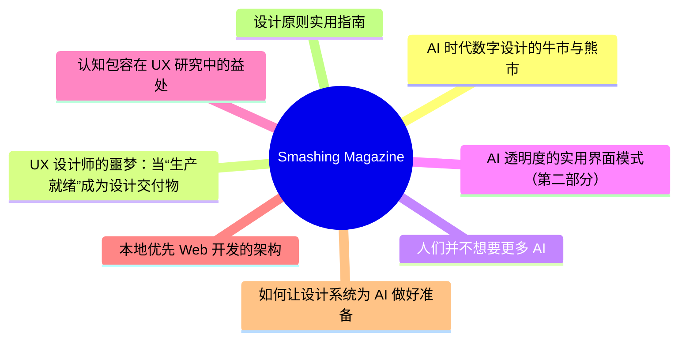
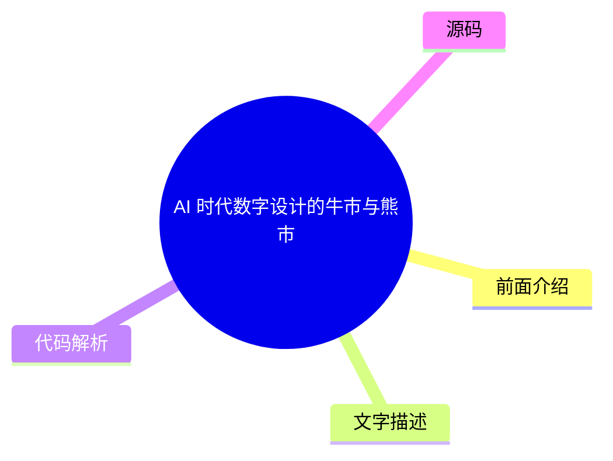
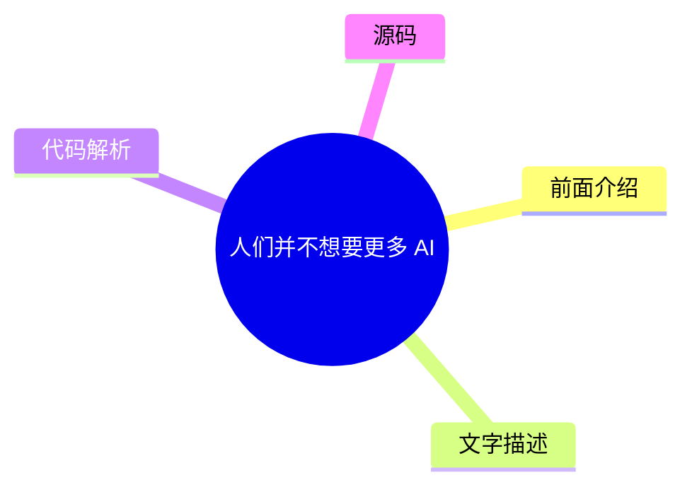
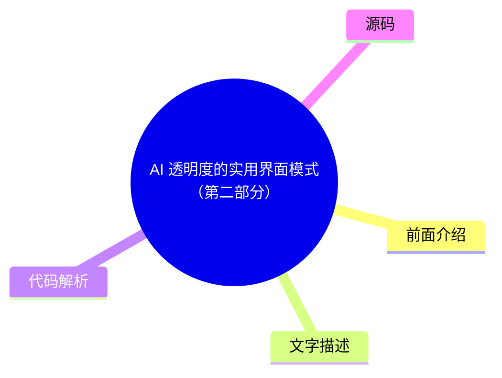
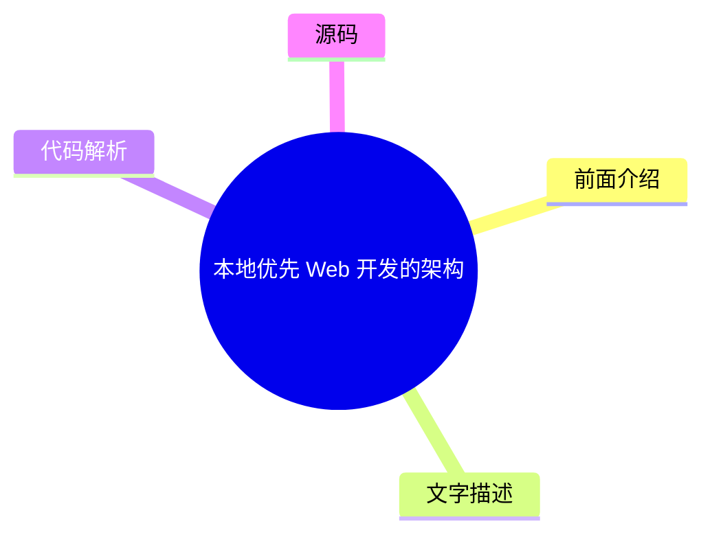
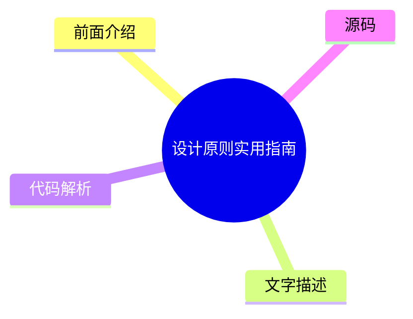

# 🔥 Smashing Magazine Top 8 (2026-08-05)

## 前面介绍

- 数据源：Smashing Magazine
- 抓取日期：2026-08-05
- 条目数：8
- 含完整正文：8
- 含代码片段：1
- 组织方式：前面介绍 / 树状图 / 文字描述 / 代码解析 / 源码

## 思维导图



## 详细整理（8 条，8 条含全文，1 条含代码）

### 1. AI 时代数字设计的牛市与熊市
- **链接**: [https://smashingmagazine.com/2026/07/bull-and-bear-case-digital-design-age-ai/](https://smashingmagazine.com/2026/07/bull-and-bear-case-digital-design-age-ai/)
- **发布**: Wed, 29 Jul 2026 13:00:00 GMT

#### 前面介绍

- AI 可能赋予设计师更多自主权，减少对组织的依赖。
- 设计师可能需要更少的许可即可行动，从“建议修复”变为“直接交付”。
- 自主性也可能暴露团队中能力较弱的成员。

#### 树状图



#### 文字描述

- 长期以来，设计师常处于产品与工程之间的尴尬位置，缺乏直接的生产手段，往往需要通过论证和说服来推动设计决策。
- AI 的出现改变了这一局面。优秀的设计师现在可以独立完成原型、编写文案、构建交互版本，甚至清理设计债务，无需等待漫长的路线图。
- 这种变化改变了设计工作的政治生态。AI 弱化了设计师对生产工具的依赖，使他们更少地依赖产品经理的批准和工程团队的支持。
- 未来的设计师将更倾向于成为“混合产品领导者”，他们不仅关注交互和品牌，还具备商业思维和代码原型能力。
- 乐观的预测是，虽然设计师的总数可能减少，但幸存下来的设计师将对产品拥有更直接的影响力。
- 然而，自主性是一把双刃剑。它不仅让优秀的设计师如虎添翼，也可能让原本能力不足的设计师暴露无遗，因为缺乏了“借口”的保护。

#### 代码解析

- 本文未提供源码，以下为实现思路或结构解析
- 核心逻辑是将设计师从“内部批评者”转变为“直接执行者”，通过 AI 工具降低技术门槛。
- 设计组织模型可能从围绕“稀缺性”（如工程时间、慢速生产）构建，转向更高效、更少协调的模式。

#### 源码

#### 中文节选

设计师们多年来一直表示，如果组织能少管闲事，他们就能做出更好的作品。当然，这并不总是用确切的措辞表达出来的。通常表达得更委婉一些：我们没有获得足够的工程时间，产品已经决定了解决方案，路线图排得太满，领导层只关心本季度的业绩，研究工作被削减，实验从未正确运行，设计债务虽然众所周知，但没人愿意花一个冲刺周期去修复。

其中很多都是事实。大多数设计师都在产品和工程之间那个尴尬的中间地带工作过。产品界定问题，或者至少自认为界定了问题。工程决定什么是可行的，或者至少什么是负担得起的。设计被期望让事物更清晰、更简单、更连贯、更易用，偶尔还要更令人向往，同时还要小心不要过多地破坏计划。

那个位置一直让人不舒服。

设计师被告知要战略性思考，但往往缺乏战略性行动的权力。

他们能发现糟糕的引导流程、令人困惑的升级路径、让用户感到愚蠢的空状态，以及那个在产品评论中看起来合理但在实际使用中毫无意义的特性。发现问题是一回事。让问题得到修复是另一回事。

因此，设计往往变成了一场**争论**。你提出论据。你标注流程。你拿出研究片段。你指向支持工单。你展示 Figma 原型。你解释为什么那个*“小边缘情况”*实际上是你一半新用户的首次运行体验。然后大家都点头，表示同意这很重要，然后继续去处理那些已经列入路线图的事情。

这就是为什么 AI 对设计来说比通常的*“它会取代设计师吗？”*的争论更有趣的原因。真正的变化不是设计师能制作更多的屏幕。没人需要更多的屏幕。有趣的变化是设计师**可能需要更少的许可**。

## 看涨理由：设计师需要更少的许可

一名优秀的设计师现在可以从 *“我们应该修复这个问题”* 转变为 *“我已经修复了这个问题，并已将其上线。”* 他们可以针对替代的引导流程制作原型，撰写并测试更清晰的产品文案，构建交互的粗略可用版本，无需等待三个月的路线图空档期即可清理设计债务中的细小部分，并让更好的事物变得**足够显眼**，以至于变得**难以被忽视**。

这改变了工作的政治属性。设计往往依赖于说服，因为设计师缺乏直接的生产手段。AI 削弱了这种依赖性。并非在所有地方，也并非针对所有事物。复杂的产品仍然需要架构、基础设施、数据模型、权限、安全、合规性、遗留系统，以及软件之所以难以构建的其他所有不引人注目的原因。但边界正在移动。

现在，有动力的设计师借助合适的工具，可以跨越从拥有想法到将想法变为现实之间的鸿沟。

在这个未来的版本中，设计

#### 完整正文（中文）

设计师们多年来一直表示，如果组织能少管闲事，他们就能做出更好的作品。当然，这并不总是用确切的措辞表达出来的。通常表达得更委婉一些：我们没有获得足够的工程时间，产品已经决定了解决方案，路线图排得太满，领导层只关心本季度的业绩，研究工作被削减，实验从未正确运行，设计债务虽然众所周知，但没人愿意花一个冲刺周期去修复。

其中很多都是事实。大多数设计师都在产品和工程之间那个尴尬的中间地带工作过。产品界定问题，或者至少自认为界定了问题。工程决定什么是可行的，或者至少什么是负担得起的。设计被期望让事物更清晰、更简单、更连贯、更易用，偶尔还要更令人向往，同时还要小心不要过多地破坏计划。

那个位置一直让人不舒服。

设计师被告知要战略性思考，但往往缺乏战略性行动的权力。

他们能发现糟糕的引导流程、令人困惑的升级路径、让用户感到愚蠢的空状态，以及那个在产品评论中看起来合理但在实际使用中毫无意义的特性。发现问题是一回事。让问题得到修复是另一回事。

因此，设计往往变成了一场**争论**。你提出论据。你标注流程。你拿出研究片段。你指向支持工单。你展示 Figma 原型。你解释为什么那个*“小边缘情况”*实际上是你一半新用户的首次运行体验。然后大家都点头，表示同意这很重要，然后继续去处理那些已经列入路线图的事情。

这就是为什么 AI 对设计来说比通常的*“它会取代设计师吗？”*的争论更有趣的原因。真正的变化不是设计师能制作更多的屏幕。没人需要更多的屏幕。有趣的变化是设计师**可能需要更少的许可**。

## 看涨理由：设计师需要更少的许可

优秀的设计师现在可以从 *“我们应该修复这个问题”* 转变为 *“我已经修复了这个问题，并已上线。”* 他们可以构建替代的引导流程原型，撰写并测试更清晰的产品文案，制作交互的粗略可用版本，无需等待三个月的路线图空档期即可清理设计债务中的细小部分，并让更好的事物变得**足够显眼**，以至于**难以被忽视**。

这改变了工作的政治生态。设计往往依赖说服，因为设计师缺乏直接的生产手段。AI 削弱了这种依赖性。并非在所有地方，也并非针对所有事物。复杂的产品仍然需要架构、基础设施、数据模型、权限、安全、合规、遗留系统，以及其他所有让软件变得棘手的、不引人注目的原因。但边界正在移动。

现在，有动力的设计师借助合适的工具，可以跨越从拥有想法到将想法变为现实之间的鸿沟。

在这个未来的版本中，设计师变得**不那么依赖许可**：不再依赖产品经理来认可问题，不再依赖工程师来实现每一个微小的改进，不再受困于内部批评者、品味提供者或 Figma 操作员的角色。他们更有能力去制作、测试、修复和发布。

顶尖的设计师开始看起来不太像传统的产品设计师，而更像**混合型产品领导者**。他们仍然关注交互、层级、语言、流程、品牌和工艺，但他们也理解问题的商业形态。他们能够做出权衡。他们可以用代码进行原型设计，或者接近代码的原型设计。他们可以利用 AI 快速探索选项，然后运用判断力将其中大部分舍弃。他们可以与创始人或产品经理坐在一起，在一天结束时，将模糊的产品顾虑转化为具体的东西。

这些人可能会变少，但他们更难被忽视。当前的设计组织模式部分是围绕**稀缺性**建立的：稀缺的工程时间、缓慢的生产、昂贵的原型、专家之间的交接、跨团队繁重的协调。如果 AI 减少了其中的一些稀缺性，它可能会减少围绕它发展起来的某些角色的需求。乐观的情况并非每个设计师都能保住工作并获得生产力提升。那感觉像是一厢情愿。更可信的版本是，设计师的总数会减少，但留下的设计师对产品拥有**更大的直接影响力**。

这对最优秀的设计师来说并不是一个糟糕的结果。这甚至可能是许多设计师多年来一直想要的。

## 熊市论点：自主性暴露了差距

自主性是有牙齿的。如果 AI 给设计师更多的行动空间，它也会移除一些掩护。那些限制优秀设计师发挥的约束，同样也保护了较弱的设计师，使他们免受过于直接的考验。

多年来，人们很容易说：我有一个更好的想法，但我们从未获得工程时间。有时确实如此。有时更好的想法从未真正超越仅仅是一个批评。它还没有被具体化。它还没有经过测试。它还没有处理尴尬的权衡取舍。它听起来很有力，因为它在已发布的产品对立面中安全地存在。

许多设计师擅长发现哪里出了问题。擅长决定应该发生什么的人较少。能将那个替代方案变得足够真实、供他人评判的人更少。AI 将暴露这一差距。

如果你能对建议进行原型设计，建议就必须变得更好。如果你能让替代方案流畅运行，该流程就必须经受住细节的考验。如果你能测试产品文案，你就必须关心用户阅读时会发生什么。如果你能修复那块小的设计债务，你就必须决定它是否真的值得修复。

一些设计师并没有他们想象的那么具有战略性。他们学会了战略的语言，却无需承担**拥有结果**的痛苦。他们可以谈论用户需求、业务目标、系统思维和产品质量，但在被要求做出决策时会感到吃力。他们想要影响力，却不想承担随之而来的**曝光度**。

这个行业花了很长时间争论设计理应拥有更多权力。好吧。但更多的权力意味着更少的借口。这意味着工作成果不再更多地由论证的优雅程度来评判，而是更多地由你制作、测试或修改的产品的质量来评判。这是一个更好的标准，但它对每个人都不会那么仁慈。

还有一个看跌理由，这可能是大型设计团队最应该担心的。在大多数公司中，产品和工程已经比设计拥有更多的制度权力。他们掌控着路线图、技术架构、冲刺机制、指标，以及通常领导层能听懂的语言。设计往往不得不将其关切转化为他人的术语，才能被重视。

AI 可能无法重新平衡这种权力。它可能会赋予产品工程师足够多的**设计能力**，从而让绕过设计变得更容易。一个能够生成不错的流程、不错的文案和不错原型的产品经理，可能不会觉得有必要尽早让设计介入。一个能够使用 AI 制作合理界面的工程师，可能会认为设计系统已经涵盖了足够的决策。一个能在下午就做出精致演示的创始人，可能会把精致等同于产品思维。

问题不在于这些人会突然变成伟大的设计师。问题在于许多公司不知道伟大的设计和看似合理的区别。**看似合理的设计是危险的。** 它在产品评审中看起来很连贯。它使用了正确的组件。间距没问题。文案不丢人。流程大体可行。会议中没有人会强烈到提出反对。于是它就发布了。

许多糟糕的产品决策之所以能存活，是因为它们看起来貌似合理。AI 将会产出更多此类决策。这就是设计可能迅速失势的地方：并非因为品味、判断力、研究和交互思维不再重要，而是因为设计的可见输出变得更容易被其他职能模仿。

如果一家公司已经认为设计主要是屏幕、原型和打磨，AI 就会为其提供一种获取这些东西的更廉价方式。

在那个世界里，设计并不会获得更多的自主权。它会被收窄。剩下的设计师将管理设计系统、监管组件的使用、审查已确定的流程、整理界面、维护品牌一致性，并被拉入高风险的发布、高管演示以及偶尔出现的混乱跨平台问题中。这是有用的工作，但涉及的领域更小。塑造产品的空间变小了，维护“家具”的工作变多了。

这就是为什么“AI 将自动化那无聊的 20%”这种论调让人感到过于舒适的原因。在某些公司，也许确实会发生这种情况。但在大型科技公司中，设计团队是围绕协调、生产和流程发展起来的，削减幅度可能会深得多。不是 20%。可能是 50%。甚至更多。特别是在那些领导层从未真正理解设计团队为何会变得如此庞大的地方。

## 我认为我们可能会走向何方

痛苦的是，这两种未来可能同时存在。AI 可以让最优秀的设计师变得更强大，同时让许多平庸的设计师变得不再必要。它可以在减少设计人员编制的同时，赋予设计更多的自主权。它可以帮助少数设计师更接近产品领导层，同时将其他人推向治理和清理工作。它可以让设计师摆脱等待许可的束缚，然后揭示出有些人其实更习惯等待而非行动。

“

他们会有品味，但品味是不够的。他们需要**产品判断力**、**技术好奇心**、**商业意识**，以及在每一个变量都确定之前做出决策的**胆识**。他们需要能够自如地在客户对话、原型、定价问题、品牌疑问和混乱的实施细节之间切换，而不坚持认为所有这些工作都属于别人。

我不完全确定我们最终会走向何方。我希望它更接近于*利好情形*：更少的审批流程，更多的动手实践，更多的自主权，以及更好的设计师终于能够展示他们的能力，而不受周围繁文缛节的束缚。

我担心它可能更接近于*利空情形*：产品和工程吸纳了大部分工作，公司认为看似合理的设计就足够好了，设计失去了地位、人员编制和战略阵地。

实际上，它可能只是这两种情况的某种令人不适的混合体。一些设计师将利用 AI 获得更多的自主权。一些公司将利用它来减少对设计师的需求。一些团队将产出更好的作品，因为判断与执行之间的距离变短了。另一些团队将产出更多看似平庸的作品，因为房间里没有人能分辨出其中的区别。

多年来，设计师们一直声称，如果不受周围组织的束缚，他们可以创造更多的价值。AI 即将验证这一说法。有些人将最终证明这一点。有些人则会发现，这些约束其实是在帮他们的忙。

### 更多资源

- “[Good from Afar, But Far from Good: AI Prototyping in Real Design Contexts](https://www.nngroup.com/articles/ai-prototyping/)”，Huei-Hsin Wang 和 Megan Brown*(NN/Group)*
 UX 设计领域充斥着从自然语言提示生成界面的 AI 原型工具。尽管营销炒作巨大，但通过真实设计场景进行的评估显示，虽然这些工具可以遵循指令以实现一般目标，但它们往往缺乏权衡设计取舍的精细度，也无法在没有人类广泛指导的情况下产生深思熟虑的高质量设计。

- “[AI Design Tools Are Marginally Better: Status Update](https://www.nngroup.com/articles/ai-design-tools-update-2/?lm=ai-prototyping&pt=article),” Megan Brown, Caleb Sponheim and Taylor Dykes*(NN/Group)*
 AI-powered design tools have improved, yet we’re still nowhere near the usef

...（截断，原文 14445+ 字符）


### 2. UX 设计师的噩梦：当“生产就绪”成为设计交付物
- **链接**: [https://smashingmagazine.com/2026/04/production-ready-becomes-design-deliverable-ux/](https://smashingmagazine.com/2026/04/production-ready-becomes-design-deliverable-ux/)
- **发布**: Wed, 22 Apr 2026 10:00:00 GMT

#### 前面介绍

- 行业正要求设计师具备 AI 增强开发、技术编排和生产就绪原型能力。
- 设计师面临“能力陷阱”，试图同时精通两个截然不同的领域往往导致平庸。
- AI 生成的代码可能存在性能和可维护性问题，增加系统风险。

#### 树状图


#### 文字描述

- 2026 年，LinkedIn 上的 UX 职位需求发生了显著变化，越来越多地要求 AI 增强开发、技术编排和生产就绪原型能力。
- 这种转变导致设计师被推向“设计工程师”模式，需要理解复杂的 AI 逻辑并将其转化为直观、安全的用户体验。
- 招聘者往往希望设计师既能理解用户同理心，又能直接编写 React 组件并推送到代码库，这造成了巨大的能力差距。
- 试图同时精通 UX 和编码会导致“平庸陷阱”，即对两个领域都只能达到平均水平，无法在任一领域达到专家级。
- 认知卸载风险表明，依赖 AI 生成代码会显著降低对底层逻辑的理解，导致调试能力下降。
- 如果设计师无法理解 AI 生成的代码逻辑，一旦系统在高流量下崩溃，他们将成为 liability（负债），而非专家。

#### 代码解析

- 本文未提供源码，以下为实现思路或结构解析
- 核心挑战在于平衡设计思维与工程逻辑，避免因盲目使用 AI 而引入技术债务。
- 建议设计师保持对底层代码逻辑的掌控力，通过理解 AI 生成的内容来确保系统的可维护性和安全性。

#### 源码

#### 中文节选

2026年初，我注意到 UX 设计师工具箱似乎在一夜之间发生了转变。行业标准的“设计师应该写代码吗？”之争被市场突然平息，不是通过我们行业的共识，而是通过职位要求的强力推动。如果你今天浏览 LinkedIn，你会注意到一个显著的变化：UX 职位越来越要求 **AI 增强型开发**、**技术编排**和**生产就绪的原型设计**。

对许多人来说，包括我自己，这是终极的设计噩梦。我们被要求同时交付“氛围感”和“代码”，使用 AI 代理来弥合此前需要数年计算机科学知识和编码经验才能跨越的技术鸿沟。然而，随着行业匆忙满足这些新期望，他们发现 AI 生成的功能性代码并不总是*好*代码。

## LinkedIn 的压力锅：2026 年的角色蔓延

就业市场发出了明确的信号。虽然传统平面设计职位预计到 2034 年仅增长 **3%**，但 UX、UI 和 [产品设计职位](https://www.nobledesktop.com/careers/designer/job-outlook#:~:text=The%20projected%20future%20growth%20figures%20for%20Digital,job%20growth%20(which%20lies%20somewhere%20around%205%25).) 在同一时期预计增长 **16%**。

然而，这种增长越来越与 **AI 产品开发**的兴起相关联，其中“设计技能”最近已成为排名第一的最具需求的能力，甚至超过了编码和云基础设施。构建这些平台的公司不再仅仅寻找视觉设计师；他们需要能够“将技术能力转化为以人为中心体验”的专业人士。

这为 UX 设计师创造了一个高风险的环境。我们不再仅仅对界面负责；我们被期望充分理解技术逻辑，以确保复杂的 AI 功能对屏幕另一端的人类来说感觉直观、安全且有用。设计师正被推向一种 **“设计工程师”** 模式，我们必须弥合抽象的 [AI 逻辑与面向用户的代码](https://www.refontelearning.com/blog/ui-ux-designer-engineering-in-2026-crafting-future-ready-user-experiences#skills-and-competencies-for-the-2026-uiux-designer-3) 之间的差距。

一项 [最近的调查](https://www.lyssna.com/blog/ux-design-trends/) 发现，**73% 的设计师**现在将 AI 视为主要的合作伙伴，而不仅仅是一种工具。然而，这种“协作”往往看起来像是“角色蔓延”。招聘人员往往不仅寻找那些理解用户同理心和信息架构的人——他们想要的是那些能够生成 React 组件并将其推送到仓库的人！

这种转变创造了一个 **能力差距**。

作为一名在认知负荷、无障碍标准等方面花费数十年时间掌握细微差别的资深设计师，

#### 完整正文（中文）

2026年初，我注意到 UX 设计师工具箱似乎在一夜之间发生了转变。行业标准的“设计师应该写代码吗？”之争被市场突然平息，不是通过我们行业的共识，而是通过职位要求的强力推动。如果你今天浏览 LinkedIn，你会注意到一个显著的变化：UX 职位越来越要求 **AI 增强型开发**、**技术编排**和**生产就绪的原型设计**。

对许多人来说，包括我自己，这是终极的设计噩梦。我们被要求同时交付“氛围感”和“代码”，使用 AI 代理来弥合此前需要数年计算机科学知识和编码经验才能跨越的技术鸿沟。然而，随着行业匆忙满足这些新期望，他们发现 AI 生成的功能性代码并不总是*好*代码。

## LinkedIn 的压力锅：2026 年的角色蔓延

就业市场发出了明确的信号。虽然传统平面设计职位预计到 2034 年仅增长 **3%**，但 UX、UI 和 [产品设计职位](https://www.nobledesktop.com/careers/designer/job-outlook#:~:text=The%20projected%20future%20growth%20figures%20for%20Digital,job%20growth%20(which%20lies%20somewhere%20around%205%25).) 在同一时期预计增长 **16%**。

然而，这种增长越来越与 **AI 产品开发**的兴起相关联，其中“设计技能”最近已成为排名第一的最具需求的能力，甚至超过了编码和云基础设施。构建这些平台的公司不再仅仅寻找视觉设计师；他们需要能够“将技术能力转化为以人为中心体验”的专业人士。

这为 UX 设计师创造了一个高风险的环境。我们不再仅仅对界面负责；我们被期望充分理解技术逻辑，以确保复杂的 AI 功能对屏幕另一端的人类来说感觉直观、安全且有用。设计师正被推向一种 **“设计工程师”** 模式，我们必须弥合抽象的 [AI 逻辑与面向用户的代码](https://www.refontelearning.com/blog/ui-ux-designer-engineering-in-2026-crafting-future-ready-user-experiences#skills-and-competencies-for-the-2026-uiux-designer-3) 之间的差距。

一项 [最近的调查](https://www.lyssna.com/blog/ux-design-trends/) 发现，**73% 的设计师**现在将 AI 视为主要的合作伙伴，而不仅仅是一个工具。然而，这种“协作”往往看起来像是“角色蔓延”。招聘人员往往不仅寻找那些理解用户同理心和信息架构的人——他们还想要一个能够生成 React 组件并将其推送到仓库的人！

这种转变创造了一个 **能力差距**。

作为一名在认知负荷、无障碍标准和民族志研究方面花费数十年掌握细微差别的资深设计师，我突然发现自己正在被调试 CSS Flexbox 问题或管理 Git 分支的能力所评判。

噩梦并非技术本身。而是 **价值的重新分配**。

“

### 能力陷阱：两种工作技能集，一个平庸的结果

董事会中可能流传着一个非常危险的神话，即 AI 使设计师与工程师“平等”。这种叙事暗示，因为 LLM 可以生成功能性的 JavaScript 事件处理程序，所以提示它的人不需要理解底层逻辑。实际上，试图同时掌握两个截然不同且深奥的领域，很可能导致在两者上都变得 **平庸**。

### “平庸”困境

对于资深 UX 设计师来说，要成为资深级程序员，就像要求一位主厨同时也是一位水管工，因为“他们都在厨房工作”。你可能会让水流动起来，但你不会知道管道为什么会发出嘎吱声。

- **“认知卸载”风险。**
 研究表明，虽然 AI 可以加快任务完成速度，但它往往会导致概念掌握能力的显著下降。在一项对照研究中，使用 AI 辅助的参与者在理解测试中的得分比手写编码的参与者低 [17%](https://www.psychologytoday.com/au/blog/the-asymmetric-brain/202602/cognitive-offloading-using-ai-reduces-new-skill-formation)。
- **调试差距。**
 依赖 AI 的用户与手写编码者之间最大的性能差距在于 [调试](https://www.anthropic.com/research/AI-assistance-coding-skills)。当设计师使用 AI 编写他们不完全理解的代码时，他们没有能力识别 *何时* 以及 *为何* 出现故障。

因此，如果设计师发布了一个在流量高峰期间崩溃且无法手动追踪逻辑的 AI 生成组件，他们就不再是专家。他们现在成了一个隐患。

### 未优化代码的高昂代价

任何有经验的代码工程师都会告诉你，如果没有正确的提示词，仅凭 AI 生成代码会导致大量的返工。由于大多数设计师缺乏审计 AI 提供的代码的技术基础，他们无意中会发布大量的 [“质量债务”](https://gocrossbridge.com/blog/ai-generated-code/)。

## 设计师生成 AI 代码中的常见问题

- **安全漏洞**
 近期报告显示，高达 [92% 的 AI 生成代码库](https://www.sherlockforensics.com/pages/ai-code-security-report-2026.html)包含至少一个关键漏洞。设计师可能会看到一个功能正常的登录表单，却不知道它在 XSS 防御方面的失败率高达 86%，XSS 防御是旨在防止攻击者向受信任的网站注入恶意脚本的安全措施。
- **无障碍错觉**

AI 经常生成缺乏语义完整性的“功能性”应用程序。设计师可能会提示生成一个“美观且功能齐全的切换开关”，但 AI 可能会提供一个非语义化的 `<div>`，该元素缺乏键盘焦点和屏幕阅读器兼容性，从而产生了 [可访问性债务](https://www.levelaccess.com/blog/accessibility-debt-in-software-development-and-how-to-engineer-it-out/)，日后修复起来代价高昂。

- **性能惩罚**
 AI 生成的代码往往冗长。AI 导致的 [代码重复率比人工编写的代码高出 4 倍](https://www.netcorpsoftwaredevelopment.com/blog/ai-generated-code-statistics)。这种冗长性会拖慢页面加载速度，生成巨大的 CSS 文件，并对 SEO 产生负面影响。对于业务来说，任务看起来是“完成了”。但对于连接缓慢的用户或屏幕阅读器用户来说，该网站是一场噩梦。

## 创造更多工作，而非更少

AI 的承诺是设计师可以在不麻烦工程师的情况下发布功能。现实情况是，一种 **“返工税”** 应运而生，正在耗尽整个行业的工程资源。

- **清理工作**
 组织发现，虽然开发速度提高了，但每个 Pull Request 中的事故率也上升了 [23.5%](https://blog.exceeds.ai/ai-code-analysis-benchmark-reports/)。一些工程团队现在花费了一周中相当一部分的时间来清理设计团队跳过严格审查流程后交付的“AI 垃圾内容”。
- **沟通鸿沟**
 只有 [69% 的设计师](https://www.lyssna.com/blog/ux-design-trends/) 感到 AI 提高了他们工作的质量，相比之下，**82% 的开发者**有这种感觉。这种差距之所以存在，是因为“能编译的代码”与“可维护的代码”是不同的。

当设计师移交的 AI 生成的代码忽略了公司的内部命名约定或管理模式时，他们并没有帮助工程师；他们是在制造一个以后必须由其他人解决的谜题。

### 解决方案

我们需要摆脱“**独狼全栈设计师**”的噩梦，转向 **设计师/程序员协作** 的模式。

**理想的现实：**

- **伙伴关系**

与其让设计师试图成为平庸的程序员，他们应该在一个**人机协作循环**中工作。资深 UX 设计师应与工程师*合作*使用 AI；设计师为**意图、可访问性和用户流程**创建提示词，而工程师为**架构和性能**创建提示词。

- **将设计系统作为护栏**
 为了防止可访问性债务大规模蔓延，[可访问组件必须是设计系统中的默认选项](https://webaim.org/projects/million/)。AI 应用于将这些标记输入到您的 UI 中，确保即使生成的代码也保持在“事实来源”的范围内。

## 超越提示词

目前行业处于“AI 迷恋”状态，但钟摆最终会回归质量。

“那些在没有工程监督的情况下优先考虑“设计师交付代码”的企业，最终将面临技术债务、安全漏洞和可访问性诉讼的清算。那些在 2026 年及以后蓬勃发展起来的设计师，将是那些拒绝成为“提示词操作员”，而是将自己定位为**用户体验守护者**的人。这对经验丰富的设计师和行业来说都是完美的结果。

我们的价值一直在于我们能够为屏幕另一端的人进行倡导。我们必须利用 AI 来增强我们的设计思维，使我们能够测试更多想法并迭代得更快，但我们绝不能让它取代确保我们的设计在技术上对*每个人*都有效的专业工程专业知识。

### UX 设计师总结清单

- **协同工作。**
 将 AI 生成的代码作为起点，与您的开发人员沟通。不要将其作为跳过与他们合作的捷径。请他们帮助您为代码创建编写最佳结果的提示词。
- **理解“原因”。**
 永远不要提交您不理解代码。如果您无法解释 AI 生成的逻辑是如何工作的，就不要将其包含在您的工作中。
- **为所有人设计。**
 好的设计不仅仅是外观。使用 AI 检查您的代码是否适用于使用屏幕阅读器或键盘的人，而不仅仅是让事物看起来漂亮。


### 3. 人们并不想要更多 AI
- **链接**: [https://smashingmagazine.com/2026/07/people-dont-want-more-ai/](https://smashingmagazine.com/2026/07/people-dont-want-more-ai/)
- **发布**: Wed, 15 Jul 2026 10:00:00 GMT

#### 前面介绍

- 大多数用户并不渴望无处不在的 AI，他们更看重可靠性和一致性。
- AI 往往会放大组织内部的缺陷和碎片化，增加用户的工作负担。
- 用户希望 AI 能够增强而非替代他们的工作流，专注于枯燥的任务。

#### 树状图



#### 文字描述

- 许多公司错误地假设用户渴望新的 AI 功能，但现实是用户对 AI 的采用率和留存率往往很低。
- AI 特性通常是附加的、独立的工具，迫使员工在多个系统之间切换，反而增加了工作量和摩擦。
- AI 无法修复组织长期积累的技术债务、文化问题和内部政治，反而可能让这些问题更加显性化。
- 用户对 AI 幻觉的警惕性很高，验证 AI 输出需要花费大量时间，这抵消了生成内容的便利性。
- 用户并不想要 AI 艺术博物馆、AI 智能冰箱或 AI 伴侣，他们更关心功能是否可靠、预测性强且有用。
- 用户希望 AI 能够自动化枯燥、重复的任务，从而让他们有更多时间专注于创造性和有价值的部分。

#### 代码解析

- 本文未提供源码，以下为实现思路或结构解析
- 核心在于理解用户对“速度”的需求并不总是高于对“质量”的需求。
- 设计重点应放在增强现有工作流上，而不是用 AI 替代整个流程，以减少用户的认知负担和焦虑。

#### 源码

#### 中文节选

许多公司默默假设每个人都想在生活中拥有更多的 AI。人们渴望新的 AI 功能、新的 AI 产品、新的 AI 工作流——认为这些神奇地取代所有现有的过时做法和糟糕的工作方式。

但在现实中，似乎人们根本不需要更多的 AI——至少不是大多数 AI 领导者设想的那种方式。毫不意外，许多 AI 功能的[采用率和留存率很低](https://www.mindstudio.ai/blog/ai-adoption-gap-ibm-2026-study)——以极高的交付成本和极高的声誉受损风险为代价。

## 人们不需要的 AI

向高级管理层进行强有力的论证非常困难，但[AI 不是价值主张](https://www.nngroup.com/articles/powered-by-ai-is-not-a-value-proposition/)。新的 AI 功能并不会神奇地让客户感到快乐或兴奋。由于 AI 功能通常是附加件和员工使用的独立工具，它们通常会**把人从**他们常规的工作方式中**剥离**出来。

AI 非常擅长**放大组织中的捷径和缺陷**——从数据质量到决策制定。它无法神奇地修复多年积累的快速补丁、技术债务、糟糕的文化和内部政治。如果有的话，随着 AI 的介入，这些不一致或相互冲突的优先事项变得更加明显，并被直接交给用户，随后用户不得不自己去理清这些混乱。

因为在大多数组织中，工作通常需要在大量不连接和碎片化的系统之间频繁切换，有了新的 AI 工具，他们现在又多了一个需要切换的系统。这通常会产生更多的工作，而且通常也不是特别令人满意的工作。

除此之外，人们非常清楚[查找和修复 AI 幻觉的成本](https://www.nngroup.com/articles/ai-chatbots-discourage-error-checking/)。要求 AI 生成响应**可能感觉比从头开始编写更容易**，但这是有代价的：

- **通读**整个 AI 输出，
- **找出关键点**以集中注意力，
- **逐一审查/验证关键点**，
- **检查**后续内容的**理由**，

- **Articulate corrections**+ regenerate,
- **Review the response**(a number of times).

For many people, AI isn’t something they can proactively choose and explore on their own — it arrives uninvited, at someone else’s pace. On top of that, plenty of messages amplify **fears and worries about AI** replacing work — so it’s hardly surprising that the perception of AI isn’t excitement. It’s **resistance to change** and deep anxiety about one’s place in a world that seems to be changing without them.

At best, AI features might be silently accepted or nodded away. At worst, AI **raises concerns**, doubts, caution — and calls for a healthy dose of skepticism. And sometimes it’s perceived as a threat or **liability** — because unlike other features, AI is neither predictable nor reliable.

People don’t dream of

#### 完整正文（中文）

许多公司默默假设每个人都想在生活中拥有更多的 AI。人们渴望新的 AI 功能、新的 AI 产品、新的 AI 工作流——认为这些神奇地取代所有现有的过时做法和糟糕的工作方式。

但在现实中，似乎人们根本不需要更多的 AI——至少不是大多数 AI 领导者设想的那种方式。毫不意外，许多 AI 功能的[采用率和留存率很低](https://www.mindstudio.ai/blog/ai-adoption-gap-ibm-2026-study)——以极高的交付成本和极高的声誉受损风险为代价。

## 人们不需要的 AI

向高级管理层进行强有力的论证非常困难，但[AI 不是价值主张](https://www.nngroup.com/articles/powered-by-ai-is-not-a-value-proposition/)。新的 AI 功能并不会神奇地让客户感到快乐或兴奋。由于 AI 功能通常是附加件和员工使用的独立工具，它们通常会**把人从**他们常规的工作方式中**剥离**出来。

AI 非常擅长**放大组织中的捷径和缺陷**——从数据质量到决策制定。它无法神奇地修复多年积累的快速补丁、技术债务、糟糕的文化和内部政治。如果有的话，随着 AI 的介入，这些不一致或相互冲突的优先事项变得更加明显，并被直接交给用户，随后用户不得不自己去理清这些混乱。

因为在大多数组织中，工作通常需要在大量不连接和碎片化的系统之间频繁切换，有了新的 AI 工具，他们现在又多了一个需要切换的系统。这通常会产生更多的工作，而且通常也不是特别令人满意的工作。

除此之外，人们非常清楚[查找和修复 AI 幻觉的成本](https://www.nngroup.com/articles/ai-chatbots-discourage-error-checking/)。要求 AI 生成响应**可能感觉比从头开始编写更容易**，但这是有代价的：

- **通读**整个 AI 输出，
- **找出关键点**以集中注意力，
- **逐一审查/验证关键点**，
- **检查**后续内容的**理由**，

- **Articulate corrections**+ regenerate，
- **Review the response**(a number of times)。

对许多人来说，AI 并不是他们可以主动选择和探索的东西——它不请自来，按照别人的节奏到来。此外，大量信息都在放大**对 AI 取代工作的恐惧和担忧**——因此，人们对 AI 的看法并非充满兴奋，而是**对改变的抗拒**以及对在一个似乎正在脱离他们而自行改变的世界中自身位置的深深焦虑。

在最好的情况下，AI 功能可能只是被默默接受或敷衍过去。在最坏的情况下，AI 会**引发担忧、疑虑、谨慎**，并呼吁保持健康的怀疑态度。有时它被视为一种威胁或**责任**——因为与其他功能不同，AI 既不可预测也不可靠。

人们并不梦想着**AI 艺术博物馆**或 AI 冰箱或 AI 酒店接待或 AI 叙述的儿童读物。他们不希望自己的孩子拥有**浪漫的 AI 伴侣**。大多数人不想主动管理（并善后）一群在银行账户中漫游并在现实世界中代表他们行动的**AI 代理**。最值得注意的是，人们并不真的想要一个可以随时与之交谈或输入的魔法盒子。

## 人们真正需要的 AI

我对将 AI 功能与人类的不稳定性进行比较总是感到困惑。但人们不会将软件与其他人进行比较。他们**将功能与功能进行比较**——如果一个产品中的某个功能不可靠，而另一个产品中的类似功能却能完美运行，他们会选择后者。这无关乎 AI 或非 AI，而在于什么能始终如一且可靠地发挥作用，什么不能。

关于 AI 的许多对话都是关于交付速度的。但对许多人来说，提高交付速度并没有什么价值。他们想要把事情做好，有足够的时间去思考和做出良好的决策。他们也想**享受花在工作上的时间**，而不仅仅是更快地交付。随着一次又一次的 vibe-coded（情绪编码/氛围编码）式改变，一种巨大的成就感和满足感正在慢慢消失。

人们很少改变。经过这么多年，他们（仍然）想要的是快速、易用、**可靠、可预测且有用**的功能——每一次都是如此。理想情况下，他们不想要那些会取代整个工作流程的功能，而是想要那些**增强**他们工作方式的功能——以及接管那些他们觉得枯燥、恼人且无聊的任务，而这些任务是他们从中找不到乐趣的。

许多工作[暴露于 AI 自动化之下](https://www.washingtonpost.com/technology/interactive/2026/jobs-most-affected-ai-automation/)，但在其中许多工作中，仍有一部分是令人愉悦的、独特的、富有创造性的，需要品味、观点，甚至人类直觉。如果 AI **自动化了其中的枯燥部分**，这对每个人来说都是一种优势。这也是提高生产力并为日常生活带来更多乐趣的原因所在。

当 AI 自动化繁琐且消耗精力的任务时，其价值更容易被理解。但要做到这一点，AI 不应该感觉像是一个附加组件。它应该**深度集成**到人们现有的工作流程中。它还必须匹配他们经过多年或几十年开发和完善形成的现有**心智模型**。AI 应该适应人们的思维和决策方式，而不是反过来。

这些功能被标记为“AI”、“智能”还是“自动化”，其实并不重要。然而，它们必须对使用它们的人有效。这意味着人们必须**了解实际能帮助他们的用例**，并受到启发去自己发现更多用例。

具有讽刺意味的是，在那里表现良好的工具并不是“AI优先”的——它们是**“AI第二”**。它们微妙、谦逊、冷静、无处不在，在背景中扮演支持者的角色，为那些原本极其枯燥且不必要的任务提供帮助。

我不想读 AI 写的书。我不想看 AI 画的画。我不想让 AI 教我的孩子。我不想要 AI 治疗师。我不想要 AI 做我的医疗决定。我想让 AI 做所有让我感到疲惫的**体力和脑力劳动**，这样我就能阅读人类写的书，去美术馆欣赏人类创作的艺术。我想要让 AI 让我的生活更轻松，而不是强迫我改变自己。

—[Bo Young Lee](https://www.linkedin.com/feed/update/urn:li:share:7467162929474420737/)

## 总结

也许是我忽略了更大的图景，也许我只是老派——但我**真的很喜欢人**。他们的故事、他们的想法、他们的情感、他们的热情、他们的笑声。AI 在许多情况下都非常有帮助，但人也一样。在这两者之间，我每次都会选择**与人类共度时光**——无论他们多么不完美。

不，**人们不需要更多 AI 进入他们的生活**——他们需要 AI 来自动化他们每天必须处理的所有无聊的事情，这样他们就有更多的时间和精力去做他们真正热爱和享受的事情。这并不意味着花更多时间与 AI 在一起——而是花更多时间与爱的人在一起。

## 介绍“AI 界面设计模式”

介绍 [Design Patterns For AI Interfaces](https://ai-design-patterns.com/)，这是 Vitaly 的新

**视频课程**，包含来自真实产品的实用示例——即将举办

[live UX 培训](https://smashingconf.com/online-workshops/workshops/ai-interfaces-vitaly-friedman/)。

[跳转到免费预览](https://www.youtube.com/watch?v=jhZ3el3n-u0)。

## 有用的资源

- [AI 采用差距：IBM 2026 研究](https://www.mindstudio.ai/blog/ai-adoption-gap-ibm-2026-study)，作者 MindStudio
- [“由 AI 驱动”不是价值主张](https://www.nngroup.com/articles/powered-by-ai-is-not-a-value-proposition/)，作者 Nielsen Norman Group
- [AI 聊天机器人会阻碍错误检查](https://www.nngroup.com/articles/ai-chatbots-discourage-error-checking/)，作者 Nielsen Norman Group
- [受 AI 自动化影响最大的工作](https://www.washingtonpost.com/technology/interactive/2026/jobs-most-affected-ai-automation/)，作者 The Washington Post
- [关于 AI 以及我们实际上对它的期望](https://www.linkedin.com/feed/update/urn:li:share:7467162929474420737/)，作者 Bo Young Lee


### 4. AI 透明度的实用界面模式（第二部分）
- **链接**: [https://smashingmagazine.com/2026/05/practical-interface-patterns-ai-transparency/](https://smashingmagazine.com/2026/05/practical-interface-patterns-ai-transparency/)
- **发布**: Wed, 13 May 2026 13:00:00 GMT

#### 前面介绍

- 传统的加载动画（如旋转器）在代理式 AI 体验中无法传达“思考”过程。
- 通过清晰的状态更新和“代理更新公式”来建立用户信任。
- 透明度不仅关乎视觉设计，更在于使用清晰的语言描述系统正在做什么。

#### 树状图



#### 文字描述

- 传统的加载模式假设延迟是由带宽或文件大小引起的，但在 AI 代理中，长时间的等待实际上是“思考”和决策过程。
- 使用模糊的“加载中”或“工作中”等词汇会让用户感到困惑和焦虑，无法判断系统是崩溃了还是在处理复杂任务。
- Perplexity AI 提供了良好的示例，通过实时显示活动列表来告知用户 AI 正在执行的具体步骤。
- 代理更新公式建议将等待时间分解为至少四个清晰的步骤，如“检查日历”、“交叉核对可用性”等。
- 有效的状态更新结构包含三个部分：强有力的动作动词、具体的操作对象以及任何限制或规则。
- 通过将技术过程与用户的实际生活联系起来，可以显著改善用户体验，减少不确定性。

#### 代码解析

- 本文未提供源码，以下为实现思路或结构解析
- 核心是构建一个动态的状态反馈机制，将不可见的 AI 过程可视化。
- 设计重点在于使用用户能理解的动词和具体名词，明确告知系统正在解决什么问题以及遵循什么规则。

#### 源码

#### 中文节选

在[本系列的第一部分](https://www.smashingmagazine.com/2026/04/identifying-necessary-transparency-moments-agentic-ai-part1/)中，我们讨论了**决策节点审计**。我们梳理了 AI 系统的内部运作机制，以精确定位其基于概率做出决策的确切时刻。这让我们知道系统何时需要向用户保持透明。现在，核心问题是*如何*分享这些信息。

你已经准备好了**透明度矩阵**。你知道哪些后台 API 调用需要显示状态更新。你的工程师也认可技术层面的细节。下一步是设计承载这些更新的视觉容器。

我们面临一个遗留问题。三十年来，界面设计师一直依赖一种单一模式来处理延迟：**转圈图标**。旋转的圆圈、闪烁的光标、进度条。这些模式传达了一种特定的技术现实。它们告诉用户系统正在检索数据。延迟是由带宽或文件大小引起的。

AI 代理引入了一种新的等待时间。当代理暂停二十秒时，它不仅仅是在下载某物；它是在*思考*。它正在确定最佳步骤、权衡选项，并为你请求的内容进行创作。

如果我们用简单的旋转图标来表示这种“思考时间”，用户会感到困惑和焦虑。他们看着循环动画，无法判断系统是卡住了还是崩溃了。他们不知道代理是在处理一个非常复杂的任务，还是仅仅失败了。

为了建立用户信任，我们需要将这段等待时间转化为一个**安抚时刻**。与其使用被动的“正在发生某事”，我们需要传达一种主动的“这正是我正在努力解决您问题的具体方式”。

## 撰写清晰的状态更新

我们常将透明度视为一个视觉设计问题，但实际上它关乎我们使用的**文字**。简单、清晰的解释（微文案）是建立信任的关键，也是区分可靠 AI 与感觉像坏掉的 AI 的分水岭。

我们需要淘汰像 *Loading* 或 *Working* 这样的通用占位符。这些词汇是静态软件时代的遗留产物。相反，我们必须使用特定的公式构建状态更新，以反映系统的自主性。让我们停止使用“Loading”或“Working”这类模糊的词汇。这些术语属于过去，那时软件简单且静态。相反，我们应该创建状态更新，清楚地告诉用户系统*实际上正在做什么*，并使系统的操作透明。

为了举例说明，想象一下你正在部署代理 AI，它将帮助团队成员整理日程并代表他们规划 recurring meetings（周期性会议），一旦收到提示即可执行。

当 AI 对未知的时间段显示类似“Checking availability（检查可用性）”的消息时，用户往往会感到迷茫，因为它提供的信息不够充分。虽然他们理解 AI 正在查看日历，但他们不知道查看的是*谁的*日历，还涉及哪些步骤（之前或之后）。

#### 完整正文（中文）

在[本系列的第一部分](https://www.smashingmagazine.com/2026/04/identifying-necessary-transparency-moments-agentic-ai-part1/)中，我们讨论了**决策节点审计**。我们梳理了 AI 系统的内部运作机制，以精确定位其基于概率做出决策的确切时刻。这让我们知道系统何时需要向用户保持透明。现在，核心问题是*如何*分享这些信息。

你已经准备好了**透明度矩阵**。你知道哪些后台 API 调用需要显示状态更新。你的工程师也认可技术层面的细节。下一步是设计承载这些更新的视觉容器。

我们面临一个遗留问题。三十年来，界面设计师一直依赖一种单一模式来处理延迟：**转圈图标**。旋转的圆圈、闪烁的光标、进度条。这些模式传达了一种特定的技术现实。它们告诉用户系统正在检索数据。延迟是由带宽或文件大小引起的。

AI 代理引入了一种新的等待时间。当代理暂停二十秒时，它不仅仅是在下载某物；它是在*思考*。它正在确定最佳步骤、权衡选项，并为你请求的内容进行创作。

如果我们用简单的旋转图标来表示这种“思考时间”，用户会感到困惑和焦虑。他们看着循环动画，无法判断系统是卡住了还是崩溃了。他们不知道代理是在处理一个非常复杂的任务，还是仅仅失败了。

为了建立用户信任，我们需要将这段等待时间转化为一个**安抚时刻**。与其使用被动的“正在发生某事”，我们需要传达一种主动的“这正是我正在努力解决您问题的具体方式”。

## 撰写清晰的状态更新

我们常将透明度视为一个视觉设计问题，但实际上它关乎我们使用的**文字**。简单、清晰的解释（微文案）是建立信任的关键，也是区分可靠 AI 与感觉像坏掉的 AI 的分水岭。

我们需要淘汰像 *Loading* 或 *Working* 这样的通用占位符。这些词汇是静态软件时代的遗留产物。相反，我们必须使用特定的公式来构建状态更新，以反映系统的自主性。让我们停止使用“Loading”或“Working”这类模糊的词汇。这些术语属于过去，那时的软件简单且静态。相反，我们应该创建状态更新，清楚地告诉用户系统*实际上正在做什么*，并使系统的操作透明。

想象一下，为了举例，你正在部署一个代理 AI，它会在被提示后帮助团队成员整理日历并代表他们安排定期会议。

当 AI 对未知的时间段显示类似“Checking availability”（检查可用性）的消息时，用户往往会感到迷茫，因为它提供的信息不够。虽然他们理解 AI 正在查看日历，但他们不知道*谁的*日历，涉及哪些其他步骤（之前或之后），或者 AI 是否记得了日程安排请求的人员和目的。等待最终结果可能是一种紧张、不安的体验，就像在期待一份你怀疑可能是恶作剧的礼物一样。

Perplexity AI 提供了正确处理状态更新的一个有力范例。下图显示，当用户提问时，界面会实时显示它正在执行的确切操作。你会看到活动列表随着任务的完成而更新。在 AI 工作时，用户不需要猜测正在发生什么。

## 代理更新公式

为了给用户提供有用的状态更新，我们需要将系统*正在做什么*与其*为什么这么做*联系起来。沿用我们的日程安排代理示例，系统应该将等待期分解为至少四个清晰、独立的步骤。

- 首先，界面显示 *Checking your calendar to find open times for a recurring Thursday call with [Name(s)]*（正在检查你的日历，以查找与 [Name(s)] 进行每周四通话的空闲时间）。
- 然后，它更新为：*Cross-checking availability with [Name(s)] calendars*（正在与 [Name(s)] 的日历交叉核对可用性）。
- 接下来，它可能会显示：*Syncing [Name(s)] schedules to secure your meeting time on [Data and Time]*（正在同步 [Name(s)] 的日程，以锁定你在 [Data and Time] 的会议时间）。

- 最后，在结束时，代理可能会声明他们已成功完成任务，并请求用户检查其电子邮件，以确认已发送给有定期会议的群组的邀请。

这种沟通过程将技术流程立足于用户的实际生活。

让 AI 的进展易于理解，归结为一个三部分结构：一个强有力的**动作词**、AI 正在处理的内容（**具体项目**）以及它必须遵守的任何**限制**或规则。

想象一下 AI 正在帮你预订旅行。一个薄弱、无用的更新可能只是：*正在搜索航班……*

一个更好的更新使用了以下公式：

- **动作词：**- *扫描*
- **具体项目：**- *汉莎航空和联合航空的价格*
- **限制/规则：**- *查找任何低于 600 美元的航班。*

这种方法清楚地表明用户，AI 理解了他们的请求，并且正在设定的边界内工作。

## 匹配语气与风险矩阵

AI 应该听起来像人还是表现得像机器人？正确的答案取决于任务的重要性，我们可以通过我们**决策节点审计**中的**影响/风险矩阵**来确定这一点。

对于简单、低风险的任务，友好、对话式的语气效果最好。例如，日程安排助手可以说它正在检查您的日历以寻找最佳时间。这为用户创造了一种舒适、轻松的体验。

然而，高风险任务需要清晰、机械的准确性。如果 AI 正在管理大额资金转账或复杂的数据库迁移，用户不希望有一个有趣的界面；他们需要的是精确性。一个显示 *“我正在为您的资金深思熟虑”* 的屏幕可能会引起恐慌。相反，界面应该使用像 *“正在验证账户路由号码”* 这样直接的语言。通过调整 AI 的“个性”以匹配风险级别，我们为用户提供了他们在那一刻确切需要的体验。虽然影响/风险矩阵提供了一个必要的起点，但适当 AI 语音和语气的最终决定因素是严格的**用户研究**。

对于任何一组规则来说，都不可能预测出能够为每一群用户或每一种情况建立信任或引发压力的确切措辞或语气。这就是为什么动手研究至关重要。你需要：

- [运行 A/B 测试](https://medium.com/@alienoghli/the-essential-guide-to-a-b-testing-a84b853c16e0)
- [进行可用性研究](https://uxplanet.org/usability-testing-the-complete-guide-e162898f68db)
- [进行访谈](https://ixdf.org/literature/article/how-to-conduct-user-interviews)

这种研究确保了 AI 的“个性”对于实际使用该系统的人群及其特定语境来说是舒适且恰当的。

我们现在已经涵盖了 *“是什么”* —— 那些关键的微文案、清晰的动作动词以及让 AI 状态更新诚实且具有信息量的必要限制。但仅有文字是不够的。隐藏在糟糕界面中的完美句子，依然是透明度的失败。

下一个挑战是 *“怎么做”* —— 为该消息设计物理传递系统。你可以把状态更新公式看作引擎，把界面模式看作汽车。强大的引擎需要一个可靠、设计良好的底盘来承载它行驶在路上。

## 界面模式：代理的库

一旦我们有了正确的文字，就需要 **正确的容器**。关键在于将消息的权重与模式的可见性相匹配。一个微小的后台任务（比如代理在后台默默整理你的文件）不需要一个大声闪烁的横幅。该消息最好以微妙的方式传达。一个高风险的多步骤流程（比如转账）可能需要更稳健的容器，以迫使用户集中注意力。

通过创建这些模式的库，我们确保在正确的时刻提供正确程度的透明度，将等待的焦虑转化为知情后的自信时刻。让我们回顾几个常见且关键的模式。

### 活跃的面包屑：AI 在后台工作

对于那些 AI 在后台安静处理的低重要性任务，我们需要一种方式来向用户展示它正在工作，而又不会不断打扰他们。我们可以称之为活跃的面包屑。

想象一个邮件应用，其中 AI 正在为你起草回复。你不想看到突兀的弹窗消息。相反，一个微小的、微妙的状态指示器会在应用程序的边框或菜单区域内闪烁。

该方案需要超越静态图标。这个动态面包屑会在不同的文本更新之间流畅地过渡。它可能会从 *Reading email*（阅读邮件）闪烁到 *Drafting reply*（起草回复）再到 *Checking tone*（检查语气）。如果你想要查看它的进度，它就在那里，提供一种安静的确认，表明任务正在进行中，但不会要求你立即关注。

### 动态检查清单

在处理关键的高风险任务时——例如处理复杂的金融交易或迁移大型、复杂的数据集——我们建议使用 **Dynamic Checklist**（动态检查清单）（如图 3 所示）。

该模式为用户提供了一个强大的锚点，提供了关于 **流程进度** 的清晰度和信心。动态检查清单列出了 AI 代理将要采取的每一个计划步骤，而不是简单的进度条。它清晰地高亮当前正在进行的步骤，将先前的步骤标记为已完成，并列出未来的操作为待处理状态。

例如：

- **Step 1**: Verify Account Balance- **[Complete]**.
- **Step 2**: Convert Currency- **[Processing]**.
- **Step 3**: Transfer Funds- **[Pending]**.

动态检查清单相比传统的进度条提供了显著的优势，因为它能巧妙地管理不可预测的时间。如果货币兑换（Step 2）意外地需要额外十秒钟，用户不会感到突然的焦虑或恐慌。他们对系统的确切位置拥有完全的可见性，理解延迟发生在 *Converting Currency*（转换货币）步骤期间。因为他们认识到这可能是一个复杂的操作，因此他们对系统正在进行的工工作自然会更加耐心和信任。

该模式本身是一个引人注目的 UI 构思，但设计师必须记住，其实现会将任务转化为全栈设计需求。与简单的加载标志不同，动态检查清单需要一个健壮的前端状态管理系统来监听步骤完成事件，这些事件通常由后端 webhook 结构触发。这确保了界面始终反映代理在工作流中的实时位置。

### 思考切换开关

对于信息需求较高或对透明度要求较高的某些用户来说，他们可能不会信任简单的摘要；他们想看到系统的原始处理过程。针对这一受众群体，我们设计了 **Thinking Toggle**（思考切换开关）。

这是一个简单的渐进式披露 UI 控件，类似于一个折角或“查看日志”按钮，它允许用户将友好的状态更新展开为原始终端视图。它显示 AI 代理的经过清理的逻辑日志，例如：

- *查询 API 端点 /v2/search*；
- *收到响应：200 OK*；
- *按相关性分数 > 0.8 过滤结果*。

许多人永远不会打开此视图。然而，对于需要深度透明度的用户来说，此切换开关的存在本身就是一种信任信号。它向他们保证系统没有隐瞒任何东西。

请记住，这种深度透明度伴随着一个关键的技术风险。即使对于您的最专业受众，您也必须在显示前对这些原始日志进行清理和抽象。这一步骤是不可商量的，以防止意外暴露专有业务逻辑、内部数据结构名称或可能被利用的安全令牌。此过程确保信任是通过诚实而非安全漏洞建立的。

### 为部分成功进行设计

在标准软件中，事情通常非黑即白。文件要么保存，要么不保存。但在 AI 代理中，事情是……
...（截断，原文 21693+ 字符）


### 5. 认知包容在 UX 研究中的益处
- **链接**: [https://smashingmagazine.com/2026/06/benefits-cognitive-inclusion-ux-research/](https://smashingmagazine.com/2026/06/benefits-cognitive-inclusion-ux-research/)
- **发布**: Wed, 10 Jun 2026 10:00:00 GMT

#### 前面介绍

- 认知障碍是影响信息处理、记忆和学习的最常见残疾类型。
- 与普通用户相比，认知障碍用户能提供独特的可用性见解和反馈。
- 通过专门的筛选和访谈方法，可以有效地与认知障碍用户进行合作研究。

#### 树状图


#### 文字描述

- 认知障碍是一个涵盖多种影响信息处理方式的疾病的统称，包括神经多样性，如阅读障碍、ADHD 和自闭症。
- 在美国，认知障碍的患病率约为 13.9%，且呈快速增长趋势。
- 研究团队制定了四个目标，包括如何招募和筛选参与者、研究最佳实践以及验证这些方法的有效性。
- 研究使用了三个不同类型的网站（零食食谱、书店、美发沙龙）来测试各种任务，并邀请了认知障碍用户和普通用户进行对比。
- 所有参与者都完成了“可访问可用性量表”（AUS）调查，以量化他们对数字产品的体验。
- 初步结果表明，认知障碍用户往往能发现普通用户忽略的问题，为设计改进提供了宝贵的见解。

#### 代码解析

- 本文未提供源码，以下为实现思路或结构解析
- 核心在于采用包容性的研究方法，确保设计能够服务于更广泛的用户群体。
- 通过专门的筛选工具和访谈技巧，可以深入了解认知障碍用户的具体需求和痛点。

#### 源码

#### 中文节选

2024年夏天，我成为了一个专家研究小组的联合主席，该小组旨在确定如何最好地与认知障碍人士进行无障碍测试。这是我在 Fable 的工作，我目前担任创新副总裁。

认知障碍是一个统称，涵盖了几种影响人们处理信息方式的障碍，通常会影响记忆、专注力和/或学习能力。这是美国最常见的障碍（根据 [CDC](https://www.cdc.gov/disability-and-health/articles-documents/disability-impacts-all-of-us-infographic.html) 数据为 13.9%），且认知障碍正在迅速增加（根据 [耶鲁大学研究](https://news.yale.edu/2025/09/24/growing-number-us-adults-report-cognitive-disability)）。

我们为自己设定了四个目标，以了解如何与这一受众群体合作：

- 我们应该如何招募和筛选参与者？
- 与认知障碍参与者进行研究的最佳实践是什么？
- 这些方法在实际研究中有效吗？
- 记录我们的所学，以便分享。

我们创建了一份筛选问卷，以招募那些自我认定为在记忆、专注和学习方面存在挑战的人。我们还回顾了涉及认知障碍测试人员的已发表研究，以了解与他们合作的最佳实践。

接下来，我们在一项试点研究中，对这 25 名初始测试人员测试了这些最佳实践。我们迭代优化了我们的方法，并创建了一份指南，用于与认知障碍测试人员进行用户访谈，以及一份能够量化他们使用数字产品体验的调查问卷。最后，我们[记录了我们的所学](https://makeitfable.com/article/cognitive-accessibility-pilot-case-study/)。

在我们与这组新测试人员的试点研究结束后，我感觉到他们能比过去我与普通人群（gen pop）用户研究参与者一起工作时发现更多的可用性见解。我着手验证这一直觉。

## 认知可用性研究

我决定与 Fable 的合作伙伴加州大学尔湾分校合作开展一项联合研究，在 Syed Fatiul Huq 的协助下，并得到 Fable 研究人员 Pranav Pidathala、Ali Brown 和 Michael Fagan 的帮助，以验证我关于使用认知测试人员能获得更多见解的假设是否成立。

我使用 AI 原型工具生成了三个网站用于这项研究。我想要三种不同类型的网站，具有不同的用户目标和内容，以便我可以在研究中测试各种任务。

### 表 1：测试的网站和任务

| 网站 | [Strong Snacks](https://v0-strong-snacks.vercel.app/) | [Turning Pages](https://v0-bookstore-nu.vercel.app/) | [Crown & Comb](https://v0-crown-and-comb.vercel.app/) | 
|---|---|---|---|
| 描述 | 这是一个提供三成分高蛋白食谱的网站。食谱可以按类别（素食、增肌等）浏览。该网站还包含关于蛋白质的博客文章和联系信息。 | 这是一个书店网站，拥有精选阅读目录。它具有扩展...

#### 完整正文（中文）

2024年夏天，我成为了一个专家研究小组的联合主席，该小组旨在确定如何最好地与认知障碍人士进行无障碍测试。这是我在 Fable 的工作，我目前担任创新副总裁。

认知障碍是一个统称，涵盖了几种影响人们处理信息方式的障碍，通常会影响记忆、专注力和/或学习能力。这是美国最常见的障碍（根据 [CDC](https://www.cdc.gov/disability-and-health/articles-documents/disability-impacts-all-of-us-infographic.html) 数据为 13.9%），且认知障碍正在迅速增加（根据 [耶鲁大学研究](https://news.yale.edu/2025/09/24/growing-number-us-adults-report-cognitive-disability)）。

我们为自己设定了四个目标，以了解如何与这一受众群体合作：

- 我们应该如何招募和筛选参与者？
- 与认知障碍参与者进行研究的最佳实践是什么？
- 这些方法在实际研究中有效吗？
- 记录我们的所学，以便分享。

我们创建了一份筛选问卷，以招募那些自我认定为在记忆、专注和学习方面存在挑战的人。我们还回顾了涉及认知障碍测试人员的已发表研究，以了解与他们合作的最佳实践。

接下来，我们在一项试点研究中，对这 25 名初始测试人员测试了这些最佳实践。我们迭代优化了我们的方法，并创建了一份指南，用于与认知障碍测试人员进行用户访谈，以及一份能够量化他们使用数字产品体验的调查问卷。最后，我们[记录了我们的所学](https://makeitfable.com/article/cognitive-accessibility-pilot-case-study/)。

在我们与这组新测试人员的试点研究结束后，我感觉到他们能比过去我与普通人群（gen pop）用户研究参与者一起工作时发现更多的可用性见解。我着手验证这一直觉。

## 认知可用性研究

我决定与 Fable 在加州大学欧文分校的合作伙伴联合开展一项研究，在 Syed Fatiul Huq 的协作下，并在 Fable 研究员 Pranav Pidathala、Ali Brown 和 Michael Fagan 的协助下，以验证我对“使用认知测试人员能获得更多见解”这一假设的猜想是否成立。

我使用一个 AI 原型工具生成了三个网站用于这项研究。我想要三种不同类型的网站，拥有不同的用户目标和内容，以便我能在研究中测试各种任务。

### 表 1：测试的网站和任务

| 网站 | [Strong Snacks](https://v0-strong-snacks.vercel.app/) | [Turning Pages](https://v0-bookstore-nu.vercel.app/) | [Crown & Comb](https://v0-crown-and-comb.vercel.app/) | 
|---|---|---|---|
| 描述 | 这是一个提供三成分高蛋白食谱的网站。食谱可以按类别浏览（素食、增肌等）。该网站还包含关于蛋白质的博客文章和联系信息。 | 这是一个拥有精选阅读目录的书店网站。它具有按书籍类型进行广泛筛选的功能、用于建立喜好和厌恶档案的书籍滑动功能、自定义书单、购物车和结账功能。 | 这是一个美发沙龙网站，允许用户在线预约和咨询。它拥有 VIP 计划和访客可以购买的各种特别套餐。 | 
| 设计 | 简单、粗野主义、明亮、大量图片。 | 情绪化、经典、深色、大量书籍封面图片。 | 大胆、简洁、黑白配色，点缀色彩。 | 
| 内容 | 食谱、博客文章。 | 书籍和书单。 | 服务、体验指南、会员信息。 | 
| 关键功能 | 按类别筛选、订阅通讯。 | 购物车、书籍匹配、书单、推荐。 | 预约预订。 | 
| 任务 | 
 | 
 | 
 | 

我们使用了一份包含关于记忆力、专注力和学习能力问题的单一筛选问卷，并根据参与者是否自我认定为存在认知挑战，将他们分为两组。

认知障碍包括神经多样性。神经多样性是一个统称，用于描述那些大脑处理信息和学习方式不同的人。它最常用于描述患有学习障碍（如阅读障碍）、ADHD 和自闭症的人群。

我们对每个网站进行了 30 次用户访谈，每个网站 10 人，认知障碍参与者和普通人群参与者的比例为 5:5。在每次访谈中，参与者在一个研究人员主持的在线用户访谈中，完成一个网站的所有任务。

所有参与者在会话结束时都完成了一份[可访问可用性量表（AUS）调查](https://makeitfable.com/accessible-usability-scale/)。这是一份免费的、采用知识共享许可协议的 10 题调查，用于评估网站和移动应用的可用性。

## 数据分析方法

我回顾了所有的研究录音和逐字稿，并记录了参与者每次提出担忧、问题、困难或询问某事物如何运作的情况。我将所有这些都计为问题。我还记录了参与者遗漏了任务中的一部分内容的情况，即使他们自己没有注意到。我还记录了参与者提出的每一条改进建议。

发现的问题示例包括：

- 照片太高，需要大量滚动才能看到内容（参与者指出）。
- 我在喜欢或不喜欢一本书时没有任何反馈（参与者指出）。
- 参与者第一次遗漏了必填的 P.O. 盒复选框（我观察到）。

建议的示例包括：

- 我希望看到蛋白质对比表。
- “更多信息”标签页应该移到更靠上的位置。
- 我希望获得更多关于推荐列表是如何生成的信息。

每个参与者的问题和建议只计算一次，即使他们提到过两次，但在不同的参与者之间，问题和建议当然会有重复。在涉及多个参与者的用户体验研究中，你预计会发现每个参与者都有类似的问题，这是表明该问题是一个普遍挑战的信号。

## 认知可用性研究的结果

在测试的三个网站中：

- 认知障碍参与者发现了 197 个问题。
- 普通人群参与者发现了 113 个问题。
- 认知障碍参与者提出了 93 条建议。
- 普通人群参与者提出了 54 条建议。
- 认知障碍参与者发现的内容、按钮、图标、视觉元素和媒体相关问题比普通人群参与者更多。

结果与我的直觉一致：认知障碍参与者发现的问题和建议分别是普通人群参与者的 1.8 倍。

让我们深入探讨每个网站的数据。请注意，AUS 评分范围为 0 到 100，分数越高代表可用性越好。

### 表 2：Strong Snacks

该网站是所有测试网站中设计和内容最简单的，因此发现的整体问题最少，中位数 AUS 评分最高。数据与您对易于使用和简单网站的预期相符。

在该网站上，认知障碍参与者平均发现了 3.4 个更多的问题，提出了 2.2 个更多的建议。他们对整体体验的平均评分比普通人群参与者低 13.7 分。

| 总问题数 | 平均问题数 | 中位数问题数 | 总建议数 | 平均建议数 | 中位数建议数 | 平均 AUS | 中位数 AUS | |
|---|---|---|---|---|---|---|---|---|
| 普通人群 | 32 | 6.4 | 6 | 13 | 2.6 | 2 | 90.5 | 97.5 | 
| 认知障碍 | 49 | 9.8 | 9 | 24 | 4.8 | 4 | 76.8 | 73.0 | 

### 表 3：Turning Pages

这是功能最多样化、任务最多（4 个）的网站，因此参与者发现的问题最多也就不足为奇了。

在这里，认知障碍参与者平均发现了 6 个更多的问题，提出了 3.2 个更多的建议。他们的整体体验平均评分也比普通人群参与者低 17.2 分。

| 总问题数 | 平均问题数 | 中位数问题数 | 总建议数 | 平均建议数 | 中位数建议数 | 平均 AUS | 中位数 AUS | |
|---|---|---|---|---|---|---|---|---|
| 普通人群 | 55 | 11 | 10 | 26 | 5.2 | 4 | 78.0 | 80.0 | 
| 认知障碍 | 86 | 17 | 15 | 42 | 8.4 | 6 | 60.8 | 58.0 | 

### 表 4：Crown & Comb

这个网站是有意设计得比较复杂的，任务 3（寻找婚纱套餐）旨在极难完成。

在这个最后一个网站上，认知型参与者平均发现了 7 个更多的问题，并提出了 2.4 个更多建议。他们对整体体验的平均得分比普通人群参与者高 14.3 分。

| 总问题数 | 平均问题数 | 中位数问题数 | 总建议数 | 平均建议数 | 中位数建议数 | 平均 AUS | 中位数 AUS | |
|---|---|---|---|---|---|---|---|---|
| 普通人群 | 26 | 5 | 4 | 15 | 3 | 3 | 49.5 | 35.0 | 
| 认知型 | 62 | 12 | 11 | 27 | 5.4 | 2 | 63.8 | 68.0 | 

认知型和普通人群参与者在表 3 和表 4 中的 AUS 得分上发生了一些有趣的情况。认知型参与者对 Crown & Comb 的评分高于 Turning Pages，但普通人群的评分则相反——对 Turning Pages 的评分更高，对 Crown & Comb 的评分更低。如果我要猜测原因，我怀疑在 Turning Pages 上发现更多问题对认知型参与者可用性感知的影响，比普通人群参与者更大。

这两个网站之间另一个主要区别，如下表 5 所示，是认知型参与者在 Turning Pages 的按钮和链接上发现了更多问题，而在 Crown & Comb 的图标和视觉元素上发现了更多问题。这在我看来表明，Turning Pages 上的交互挑战比视觉元素的问题更具挑战性。

### 定性发现

至于更定性的发现，我查看了两组参与者发现的问题类型的趋势。

**认知型参与者**：

- 更倾向于标记图标或视觉元素的问题。
- 更频繁地发现内容方面的问题。
- 提供了更丰富的定性评论，通常解释了某些内容为何难以找到或令人困惑。

**普通人群参与者**：

- 更少标记概念或理解障碍。
- 提供的反馈较短，通常在任务完成后就停止了。

### 表 5：按类别统计的问题数量

当我按类别对问题进行分组时，认知型参与者在以下问题上出现的频率更高：内容、按钮和链接（功能和交互提示）、图标或视觉元素以及媒体（视频、动画）。他们在导航问题上几乎与普通人群参与者持平（45 对 46）。

| Strong Snacks | Turning Pages | Crown & Comb | ||||
|---|---|---|---|---|---|---|
| 问题类别 | 普通人群 | 认知型 | 普通人群 | 认知型 | 普通人群 | 认知型 | 
| 内容 | 11 | 22 | 11 | 30 | 23 | 36 | 
| 导航 | 18 | 22 | 25 | 17 | 2 | 7 | 
| 按钮和链接 | 0 | 5 | 7 | 20 | 3 | 0 | 
| 图标或视觉元素 | 3 | 16 | 2 | 3 | 4 | 23 | 
| 媒体 | 0 | 2 | 0 | 1 | 0 | 0 | 

让我们来看看在 Crown & Comb 会话中，一位认知型参与者和一位普通人群参与者提供的评论。认知型参与者给出的 AUS 得分为 38，普通人群参与者给出的 AUS 得分为 27.5。我选择比较这两位参与者，因为他们都在各自的小组中给出了最低分。

注意他们在描述整体体验时的差异，见下方的引语。普通人群参与者解释说这令人沮丧且缺乏吸引力。认知型参与者感到精疲力竭，难以集中注意力。我将这种体验解读为对认知型参与者的整体幸福感产生了更深远的影响。

普通人群参与者引语

“一旦你有了治疗名称和一点解释，比如时长和价格，一旦你点击进去，就应该能够立即与该服务进行交互。并且

...（截断，原文 21693+ 字符）


### 6. 本地优先 Web 开发的架构
- **链接**: [https://smashingmagazine.com/2026/05/architecture-local-first-web-development/](https://smashingmagazine.com/2026/05/architecture-local-first-web-development/)
- **发布**: Wed, 06 May 2026 10:00:00 GMT

#### 前面介绍

- 本地优先是一种数据架构，其中用户设备持有数据的副本，服务器仅作为同步对等节点。
- 本地优先与离线优先不同，它不依赖服务 Worker，而是将客户端视为分布式系统中的节点。
- 在数据主要由服务器生成或需要强事务一致性的场景下，本地优先架构可能不适用。

#### 树状图



#### 文字描述

- 作者通过一次糟糕的演示经历意识到，传统的云架构在弱网环境下不可靠，从而开始探索本地优先架构。
- 本地优先并不意味着离线优先或 PWA，它是一种明确的数据所有权模型，客户端拥有主要数据副本。
- Ink & Switch 的论文定义了本地优先的七个理想目标：快速、多设备、离线、协作、长寿、隐私和用户所有权。
- 在本地优先架构中，客户端不再是薄视图，而是拥有自己数据库的分布式系统节点，这彻底改变了技术栈。
- 作者指出，当数据主要由服务器生成（如分析仪表板）或需要强事务一致性（如银行系统）时，本地优先是不合适的。
- 对于简单的 CRUD 应用或内部管理面板，如果不需要离线或协作功能，引入同步引擎可能是过度设计。

#### 代码解析

- 本文未提供源码，以下为实现思路或结构解析
- 核心架构涉及本地数据库、冲突解决机制和后台同步策略。
- 设计重点在于处理离线操作、数据冲突以及与服务器同步的边界情况。

#### 源码

#### 源码片段 1（text）

```text
import { SQLiteAPI } from 'wa-sqlite';
import { OPFSCoopSyncVFS } from 'wa-sqlite/src/examples/OPFSCoopSyncVFS.js';
async function initDatabase() {
  const module = await SQLiteAPI.initialize();
  const vfs = new OPFSCoopSyncVFS('pm-tool-db');
  await vfs.initialize(module);
  const db = await module.open_v2('workspace.db');
  // HACK: wa-sqlite doesn't handle concurrent writes well on Safari,
  // so we serialize through a queue. See vlcn-io/wa-sqlite#247
  await module.exec(db, `PRAGMA journal_mode=WAL`);
  await module.exec(db, `
    CREATE TABLE IF NOT EXISTS tasks (
      id TEXT PRIMARY KEY,
      title TEXT NOT NULL,
      status TEXT DEFAULT 'backlog',
      assignee_id TEXT,
      project_id TEXT NOT NULL,
      position REAL DEFAULT 0,
      created_at TEXT DEFAULT (datetime('now')),
      updated_at TEXT DEFAULT (datetime('now'))
    )
  `);
  return db;
}
```

#### 完整正文（中文）

去年十月，我坐在里斯本的酒店房间里，就在我本该演示团队花了四个月时间构建的项目管理工具的前一天晚上。酒店的 Wi-Fi 正在搞那种“已连接”但实际什么也加载不出来的鬼把戏。我眼睁睁看着我们的应用——这个我真心引以为豪的东西——渲染出一个带旋转图标的空白屏幕。然后是一个超时错误。然后什么都没有了。

我掏出手机，通过蜂窝网络共享热点，连上了不稳定的信号。应用加载了，但每一次点击都要等两秒钟。创建任务？转圈圈。在列之间移动任务？转圈圈。我坐在那里心想：我们用 React 构建了前端，用 Node 构建了后端，Postgres 数据库，Redis 缓存，GraphQL API，光是任务看板就有六个解析器。所有这些基础设施，结果这该死的东西在不用向三千英里外的服务器往返请求的情况下，竟然无法显示我自己的数据。

那就是我开始认真研究 **本地优先架构** 的那个晚上。不是因为我读了一篇博客文章或看到了一条推文。而是因为我感到 **羞愧**。

我想先说明一件事：我在头一年左右一直把本地优先视为学术研究而嗤之以鼻。2019 年《Ink & Switch “本地优先软件”论文》发表时我读了，心想：“很酷的研究，对真实应用来说不切实际。”我错了。2019 年的工具确实还没准备好。但我当时也很懒，默认使用我已经熟悉的架构。那篇论文列出了软件的七个理想：**快速、多设备、离线、协作、长寿、隐私、用户所有权**。我记得当时觉得这些听起来像是一个愿望清单，而不是工程需求。

七年过去了，我使用本地优先模式发布了三款生产级应用。我也曾将本地优先从两个项目中剔除，因为那是个错误的决定。我有自己的观点。其中一些可能是不对的。但这些都是经验之谈。

所以，这就是我对在 2026 年构建本地优先 Web 应用的一些真实想法，写给那些已经做了足够久以至于对“银弹”持怀疑态度的开发者。

## “本地优先”的真正含义（以及挥之不去的困惑）

我需要澄清一点，因为我在聚会中经常遇到这个话题。**本地优先不是离线优先。** 它不是“加个 Service Worker 就完事了”。它不是 PWA 的同义词。我在会议演讲中见过所有这些概念被混为一谈，这让我有点抓狂。

离线优先意味着你的应用能优雅地处理网络中断，但[服务器仍然是真理之源](https://www.smashingmagazine.com/2019/04/cloudflare-workers-serverless/)。当网络恢复时，服务器胜出。缓存优先（Service Worker 缓存响应）是一种性能优化。你更快地提供陈旧数据，这很好，但你并没有改变谁*拥有*数据。PWA 只是一种交付机制：可安装、可缓存、推送通知。这些都不是数据架构。

**本地优先是一种数据架构。** 你的用户的设备保存着他们数据的主要副本。应用读取和写入本地数据库。即时渲染。在后台与服务器或其他设备同步。服务器，当它存在时，只是一个具有特殊权限（认证、备份、访问控制）的同步对等节点。但它不是守门人。

Ink & Switch 论文定义了七大理想，我认为它们仍然成立。但在实践中最重要的、改变你构建一切方式的是这一条：

客户端不是一个仅仅请求权限来显示数据的薄视图。客户端是一个拥有自己数据库的分布式系统中的节点。

这种区别听起来很微妙。其实不然。它改变了你的整个技术栈。

## 诚实面对早期：何时不应这样做

我把这一点放在前面，因为我看到太多开发者（包括曾经的我）对一种新架构感到兴奋，然后强行将其塞进不适合的项目中。我浪费了大约六周时间，试图让本地优先的方法在上一份工作中用于内部分析仪表板。我的同事 Sarah 终于把我拉到一边说，“数据是在服务器上生成的。没有什么需要复制到客户端的。你在做什么？”她说得对。

本地优先模式并不适合数据主要由服务器生成的场景。分析仪表板、社交媒体信息流、搜索结果：服务器*生成*了这些数据，因此通过 API 请求消费它们的客户端完全没问题。

对于需要强事务一致性的系统来说，这是错误的。银行、支付处理和库存管理。如果两个人试图购买库存中的最后一个商品，你需要一个具有 [ACID](https://en.wikipedia.org/wiki/ACID) 保证的单一权威数据库来做决定。最终一致性会让你赔钱，或者更糟。

对于没有离线或协作需求的简单 CRUD 应用来说，这是过度设计。如果你正在构建一个由办公室里五个人使用、且网络良好的内部管理面板，添加同步引擎就是过度工程。而且，对于无法放入客户端设备的海量数据集来说，这在物理上也是不切实际的。

但它的闪光点在于：笔记、文档编辑、协作设计工具、项目管理、连接不稳定的现场应用，基本上任何**数据隐私是卖点**的地方，以及任何具有**实时协作**功能的地方。换句话说，它非常适合**用户生成数据**，这类数据受益于即时交互，并且应该在服务器宕机时依然可用。

还有一件事我希望早点有人告诉我：你不必全盘投入。我在 otherwise 传统应用中的特定功能上使用本地优先模式时，效果最好。博客编辑器中的离线草稿。在 otherwise 标准的 REST 项目管理工具内部进行实时协作笔记。

“

## 副本，而非请求

如果你用过 Git，你就已经理解了这种思维模型。

SVN（还记得 SVN 吗？）是集中式的。一个服务器。你检出文件，进行修改，然后提交到服务器。服务器宕机？无法提交。甚至无法查看历史。

Git 给每个开发人员提供了一个完整的克隆。你在本地提交、分支和合并。准备好后进行推送和拉取。远程仓库很重要，但它不是唯一的真相副本。

**本地优先的 Web 开发是应用数据的 Git。** 每个客户端设备都持有相关数据的副本（完整或部分）。写入操作在本地进行。同步在后台进行推送/拉取。冲突通过定义好的合并策略来解决。

我记得第一次在实践中理解这一点时。我正在原型设计一个任务看板，并编写了一个添加任务的函数。在我们旧有的架构中，流程是这样的：

- 向 API 发送 POST 请求。
- 等待响应。
- 如果成功，更新本地状态。
- 如果失败，显示错误提示，并可能回滚乐观更新。

而在本地优先版本中，流程是：写入本地 SQLite，完成。UI 立即更新，因为它读取的是同一个本地数据库。同步随时发生。没有加载状态，没有针对写入本身的错误处理，没有乐观更新逻辑（因为没有什么需要“乐观”的；本地写入*就是*状态）。

这种影响波及了方方面面。你不需要 React Query 或 SWR 来获取数据，因为你根本不需要获取。你不需要 Redux 或 Zustand 来管理服务器派生的状态，因为本地数据库*就是*你的状态。你的路由不会触发 API 调用。认证的工作方式也不同了，因为服务器不会在每次读取时都检查权限。

如果你是那种（像我一样）喜欢从空间角度思考的人，下面这张视觉对比图可能会有帮助：

在左边，每一次用户交互都是一次往返。点击，等待，渲染。在右边，读取和写入直接命中本地数据库。同步服务器依然存在，但它是在后台工作。用户永远不会等待它。这就是根本性的转变。

但我可能说得有点快了。在我们可以讨论同步和冲突之前，我们需要先谈谈数据实际上在客户端的哪里。

## 数据在客户端的存储位置

忘掉 `localStorage` 吧。它是同步的（会阻塞主线程），上限只有 5-10 MB，而且只能存储字符串。它适合用来存储主题偏好。它不是数据库。

IndexedDB 是那个没人喜欢的苦力。它存在于每个浏览器中，它是异步的，可以处理数百兆的数据，但它的 API 绝对令人难以忍受。我总共只直接使用过一次。现在我是通过抽象层来使用它，或者更常见的是，我根本不使用它。

因为 2026 年的真正故事是 SQLite 通过 WebAssembly 在浏览器中运行。

我知道这听起来像是个花招，但并非如此。编译为 WASM 的 SQLite，持久化到 Origin Private File System (OPFS)，能在浏览器中给你一个*真正的关系型数据库*。完整的 SQL 查询。事务。索引。应有尽有。

OPFS 是让这一切成为现实的较新 API。它为 Web 应用提供了一个带有高性能同步访问（在 Web Workers 中）的沙盒文件系统，这正是 SQLite 所需要的。在 OPFS 之前，你可以在内存中运行 SQLite 并手动持久化到 IndexedDB，这虽然可行，但速度慢且脆弱。

下面是一个真实项目中初始化的大致样子（这里我使用的是 [wa-sqlite](https://github.com/rhashimoto/wa-sqlite)，这是我运气最好的库）：

```javascript
import { SQLiteAPI } from 'wa-sqlite';
import { OPFSCoopSyncVFS } from 'wa-sqlite/src/examples/OPFSCoopSyncVFS.js';
async function initDatabase() {
  const module = await SQLiteAPI.initialize();
  const vfs = new OPFSCoopSyncVFS('pm-tool-db');
  await vfs.initialize(module);
  const db = await module.open_v2('workspace.db');
  // HACK: wa-sqlite 在 Safari 上处理并发写入效果不佳，
  // 所以我们通过队列进行序列化。参见 vlcn-io/wa-sqlite#247
  await module.exec(db, `PRAGMA journal_mode=WAL`);
  await module.exec(db, `
    CREATE TABLE IF NOT EXISTS tasks (
      id TEXT PRIMARY KEY,
      title TEXT NOT NULL,
      status TEXT DEFAULT 'backlog',
      assignee_id TEXT,
      project_id TEXT NOT NULL,
      position REAL DEFAULT 0,
      created_at TEXT DEFAULT (datetime('now')),
      updated_at TEXT DEFAULT (datetime('now'))
    )
  `);
  return db;
}
```

在生产环境中，我将所有数据库访问都包装在一个写入队列中，该队列对变更进行序列化。我还将每次失败的写入都记录到 Sentry 中，包含完整的 SQL 语句（显然已清除 PII），因为在用户的浏览器中调试数据库问题没有这些遥测数据简直是地狱。

我浪费了将近两天时间的一个陷阱：Safari 的 OPFS 实现在细微之处与 Chrome 的表现不同。具体来说，我在 Safari 18 的特定 iframe 上下文中遇到了一个 bug，`createSyncAccessHandle()` 会静默失败。没有错误，没有异常。它就是不工作。我最终在 Safari 上回退到基于 IndexedDB 的持久化，虽然速度较慢但至少能用。（据我了解 [Safari 19⁄26](https://developer.apple.com/documentation/safari-release-notes/safari-26-release-notes) 修复了这个问题，但我尚未验证。）

我实际使用过的选项的快速比较：

| 存储 | 适合 | 注意 |
|---|---|---|
| IndexedDB | 广泛兼容性，中等数据量 | 极差的开发体验，无 SQL，冗长 |
| OPFS + SQLite WASM | 关系型数据，复杂查询，严肃应用 | Safari 的怪癖，约增加 400KB 打包体积 |
| PGlite (WASM 中的 Postgres) | 客户端上的完整 Postgres 兼容性 | 较新，打包体积较大，仍在成熟中 |

我也尝试过 [ cr-sqlite](https://github.com/vlcn-io/cr-sqlite)，它直接向 SQLite 表添加了 CRDT 列支持。想法很巧妙，但我在 2025 年底评估时发现它对于生产使用来说太早了。合并语义有时令人意外，在 SQLite 中调试 CRDT 状态很痛苦。我今年晚些时候会再考虑它。

## 真正困难的部分

在本地存储数据是一个已解决的问题。跨设备和用户可靠地同步它才是让你长出白发的地方。

...（截断，原文 40266+ 字符）


### 7. 如何让设计系统为 AI 做好准备
- **链接**: [https://smashingmagazine.com/2026/06/how-make-design-system-ai-ready/](https://smashingmagazine.com/2026/06/how-make-design-system-ai-ready/)
- **发布**: Wed, 03 Jun 2026 13:00:00 GMT

#### 前面介绍

- 将设计决策视为基础设施，确保 AI 能理解并遵循明确的指导原则。
- 使用 FigmaLint 等工具审计设计系统，检测硬编码值和缺失状态。
- 建立三层结构：规范文件、令牌层和审计脚本，以确保 AI 生成的原型质量。

#### 树状图


#### 文字描述

- AI 生成的原型往往质量参差不齐，这通常是因为设计系统中存在微小的不一致或依赖 AI 自行推断。
- 设计决策应被视为基础设施，通过规范文件（Markdown）明确优先级、原则和示例，供 AI 消费。
- 令牌层确保 AI 只从预定义的变量集中选择值，而不是随意生成。
- 审计脚本可以扫描原型并标记硬编码值，当设计系统更新时，同步脚本会确保 AI 读取最新的规范。
- 这种方法比依赖 AI 从 Mockup 中识别模式更准确、更具成本效益。
- Atlassian、IBM 和 CMS 等公司已经展示了如何构建 AI 就绪的设计系统，包括使用 LLM 文本文件来指导 AI。

#### 代码解析

- 本文未提供源码，以下为实现思路或结构解析
- 核心在于将设计系统从视觉和组件层面提升到逻辑和规范层面，为 AI 提供结构化的输入。
- 通过自动化审计和同步机制，可以减少 AI 生成内容中的错误，保持设计系统的一致性。

#### 源码

#### 中文节选

**AI 生成的原型**往往无法提供始终如可观的成果，这是因为设计系统中散布着许多微小的不一致之处。这些不一致可能源于已做出的决策但未记录在案、从未清理过的硬编码值，或者是**过度依赖 AI** 去自行理解线框图或设计流程。

昨天，我偶然发现了 Atlassian 的 Hardik Pandya 发布的一篇[实用的实用指南](https://hvpandya.com/llm-design-systems)，内容是关于**如何减少偏差**、最大限度减少错误、保持上下文并提高 AI 生成的原型的质量。让我们来看看它是如何运作的。

## 1. 设计决策即基础设施

不出所料，更好的 AI 原型**源于更好的数据**——但也源于更好的人工指导。我们不应假设 AI 知道如何选择正确的组件，也不知道如何考虑无障碍性。它需要优先级、清晰的决策路径、设计原则、示例以及注意事项。

事实上，我们应该将设计决策视为**基础设施**。这意味着，每当我们做出决策——不仅仅是设计决策，甚至包括如何实际确定工作优先级以及我们在此如何做出决策——都必须有一条路径进入规范文件，然后由 AI 消费。

## 2. 审计：FigmaLint

审计设计系统质量的有用工具之一是 [FigmaLint](https://www.figma.com/community/plugin/1521241390290871981/figmalint)。这是一个有用的**免费 Figma 插件**，用于审计令牌、状态、无障碍性、绑定令牌、重命名图层、检测分离的实例、缺失的交互状态和硬编码值——以及准备设计文档。

如果你经常需要与**供应商和第三方**打交道，他们向你提供设计系统和组件库，那么身边有一个这样的助手会非常有帮助——特别是如果你想提高原型的质量、AI 生成的代码和 AI 编写的文档质量。

## 3. 三层结构：规范文件 + 令牌层 + 审计

为了确保质量，我们以“**规范文件**”的形式建立设计原则、指南和规则。这是一种结构化的 Markdown 文件，包含间距规则、颜色选择、组件使用指南、优先级等。AI 在每次生成原型时都会读取并重用该规范文件。

由于规范文件是文本文件，它不仅**更具成本效益**，而且更加准确，这是因为我们不再依赖 AI 从线框图中识别或解码模式，而是获取具体的指南。事实上，扩展代码往往比从线框图中生成代码更有效。

**令牌层**列出并维护了设计系统中使用的所有令牌。AI 始终从一组封闭的命名变量中选择，而不是临时编造合理的值。

**审计脚本**用于捕捉 AI 的错误。它会扫描原型，标记所有硬编码的值，并在必要时进行标记。它可以是一个常规软件来完成此操作，与

#### 完整正文（中文）

**AI 生成的原型**往往无法提供始终如可观的成果，这是因为设计系统中散布着许多微小的不一致之处。这些不一致可能源于已做出的决策但未记录在案、从未清理过的硬编码值，或者是**过度依赖 AI** 去自行理解线框图或设计流程。

昨天，我偶然发现了 Atlassian 的 Hardik Pandya 发布的一篇[实用的实用指南](https://hvpandya.com/llm-design-systems)，内容是关于**如何减少偏差**、最大限度减少错误、保持上下文并提高 AI 生成的原型的质量。让我们来看看它是如何运作的。

## 1. 设计决策即基础设施

不出所料，更好的 AI 原型**源于更好的数据**——但也源于更好的人工指导。我们不应假设 AI 知道如何选择正确的组件，也不知道如何考虑无障碍性。它需要优先级、清晰的决策路径、设计原则、示例以及注意事项。

事实上，我们应该将设计决策视为**基础设施**。这意味着，每当我们做出决策——不仅仅是设计决策，甚至包括如何实际确定工作优先级以及我们在此如何做出决策——都必须有一条路径进入规范文件，然后由 AI 消费。

## 2. 审计：FigmaLint

审计设计系统质量的有用工具之一是 [FigmaLint](https://www.figma.com/community/plugin/1521241390290871981/figmalint)。这是一个有用的**免费 Figma 插件**，用于审计令牌、状态、无障碍性、绑定令牌、重命名图层、检测分离的实例、缺失的交互状态和硬编码值——以及准备设计文档。

如果你经常需要与**供应商和第三方**打交道，他们向你提供设计系统和组件库，那么身边有一个这样的助手会非常有帮助——特别是如果你想提高原型的质量、AI 生成的代码和 AI 编写的文档质量。

## 3. 三层结构：规范文件 + 令牌层 + 审计

为了确保质量，我们以“**规范文件**”的形式建立设计原则、指南和规则。它是结构化的 Markdown 文件，包含间距规则、颜色选择、组件使用指南、优先级等。AI 在生成原型时，每次都会读取并重用该规范文件。

由于规范文件是文本文件，它要**更具成本效益**，而且要准确得多，原因在于我们不依赖 AI 从线框图中识别或解码模式，而是获取具体的指南。事实上，扩展代码往往比从线框图生成代码更有效。

**令牌层**列出并维护设计系统中使用的所有令牌。AI 总是从一组封闭的命名变量中选择，而不是临时编造合理的值。

**审计脚本**能捕捉 AI 出错的地方。它会扫描原型，标记每一个硬编码的值，并在必要时进行标记。它可以是一个常规软件执行此操作，AI 等待其反馈返回。

最后，当设计系统**发布更新**时，同步例程会标记哪些规范文件需要更新。目标是确保 AI 始终读取最新、当前的规范，而不是针对过时版本编写的规范。

## 4. AI 就绪设计系统的示例

## 总结

归根结底，如果没有适当的指导，AI **无法神奇地解决**技术债务或设计债务。它严重依赖于明确的决策、既定的优先级和定义良好的原则。

设计师在指导 AI 时越**深思熟虑和精确**，整体结果就会越好。这不仅需要清理和改进设计系统，还需要随着时间的推移维护它们，因为决策需要渗透到 Markdown 文件中。我们将忙上好几年。

## 见识“AI 界面的设计模式”

见识 [Design Patterns For AI Interfaces](https://ai-design-patterns.com/)，这是 Vitaly 的新

**视频课程**，包含数百个真实案例和 UX 指南，用于设计人们真正使用的 AI 功能——今年晚些时候还有

[现场 UX 培训](https://smashingconf.com/online-workshops/workshops/ai-interfaces-vitaly-friedman/)。

[跳转到免费预览](https://www.youtube.com/watch?v=jhZ3el3n-u0).

## 有用资源

- [FigmaLint](https://www.figma.com/community/plugin/1521241390290871981/figmalint)，作者 TJ Pitre
- [Atlassian AI-就绪设计系统示例](https://atlassian.design/)，作者 Atlassian
- [Carbon AI-就绪设计系统示例](https://carbondesignsystem.com/llms.txt)，作者 IBM
- [CMS 设计系统 AI-就绪示例](https://design.cms.gov/llms.txt)，作者 Centers for Medicare & Medicaid Services
- [Nordhealth AI-就绪设计系统示例](https://nordhealth.design/ai/)，作者 Nordhealth


### 8. 设计原则实用指南
- **链接**: [https://smashingmagazine.com/2026/04/practical-guide-design-principles/](https://smashingmagazine.com/2026/04/practical-guide-design-principles/)
- **发布**: Wed, 01 Apr 2026 10:00:00 GMT

#### 前面介绍

- 设计原则是团队围绕共同目的和价值观的指南，而非僵化的规则。
- 它们帮助团队在 AI 和快速交付的浪潮中保持方向，做出更好的决策。
- 建立设计原则需要团队协作，通常通过 8 步工作坊来完成。

#### 树状图



#### 文字描述

- 设计原则不仅仅是设计指南，它们是组织价值观和信念的体现，能够统一团队并指导决策。
- 在 AI 和自动化工具能够快速生成设计代码的时代，明确设计原则变得尤为重要，以决定“什么值得设计”。
- Ben Brignell 的 Principles.design 资源库提供了 230 条关于设计原则和方法的指针，是很好的参考。
- Dieter Rams 的“好设计的 10 条原则”强调谦逊、实用和诚实，而非宏大的愿景声明。
- Anthropic 的宪法、Linear 的代理设计原则等都是优秀的设计原则示例。
- 建立设计原则可以通过 8 步工作坊完成，包括研究用户语言、提取属性、链接到研究痛点以及编写价值陈述。

#### 代码解析

- 本文未提供源码，以下为实现思路或结构解析
- 核心在于将抽象的设计理念转化为具体的、可操作的指导方针。
- 设计原则应作为团队在面临模糊选择时的决策依据，确保产品方向的一致性。

#### 源码

#### 中文节选

我们经常把设计原则视为严格的准则，用来规定设计决策。但实际上，它们是团结团队围绕共同目标、记录组织所体现的价值观和信念的强大工具。

它们能统一团队并指导决策。它们还能让我们在所有的炒作、重大假设、对更快交付的渴望以及 AI 产生的垃圾代码中保持清醒。但是，我们如何选择合适的原则，又如何开始呢？让我们来一探究竟。

## 现实世界中的设计原则

在我们可以在几分钟内生成任何可用的设计和代码的时代，我们需要更好地决定**什么值得设计和构建**——以及我们希望我们的产品体现什么样的价值观。

这类似于语调和语气。你可能不会刻意去设计它，但最终用户会为你定义它。因此，如果没有原则，许多公司举措都是**随机的、零星的、临时的**——对外界来说，它们感觉模糊、不一致，或者仅仅是枯燥乏味。

**设计原则**是设计师在[有 discretion（ discretion）的情况下应用的设计指南和设计考量](https://ixdf.org/literature/topics/design-principles)——默认情况下，无需对已经达成共识的内容进行辩论或讨论。

多年来，我不断回访的一个绝佳资源是 Ben Brignell 的 [Principles.design](https://principles.design)。它拥有**230 条关于设计原则和方法**的指针，可搜索和分类，涵盖了从语言和基础设施到硬件和组织的一切内容。

## 良好设计的 10 条原则

这里不缺原则。但好的原则不仅仅是*具有远见*——它们**有自己的观点**，并且解释了我们*不做什么*，就像解释我们做什么一样。它们还解释了我们在世界上**代表什么**——超越利润、股价以及我们周围所有的炒作和噪音。

多年前，我遇到了 [Dieter Rams 的 10 条良好设计原则](https://www.vitsoe.com/gb/about/good-design#good-design-is-innovative)（见上文），这是一份非常**谦逊、实用且具体**的原则概述，这些原则指导、塑造并守护着他的博朗设计工作。

我们**没有**任何**愿景式的**宣称，也没有**宏大**的**声明**：只是对我们所做之事的清晰概述，以及对我们正在设计的产品所寄托的**雄心**与**关怀**。它是**诚实**的、**真诚**的，在许多方面都**优美而充满人性**。

### 设计原则示例

有许多**精彩**的**示例**被我珍藏在身边：

- [Anthropic 的宪法](https://www.anthropic.com/constitution)
- [Joshua Porter 的《产品设计原则》](https://principles.design/examples/principles-of-product-design)
- [Whitney Hess, PCC 的《体验设计指导原则》](https://principles.design/examples/20-guiding-principles-for-experience-design)
- [Heydon Pickering 的《Web 可访问性原则》](https://github.com/Heydon/principles-of-web-accessibility)
- [Jon Yablonski 的《人性化设计》](https://humanebydesign.com)

#### 完整正文（中文）

我们经常把设计原则视为严格的准则，用来规定设计决策。但实际上，它们是团结团队围绕共同目标、记录组织所体现的价值观和信念的强大工具。

它们能统一团队并指导决策。它们还能让我们在所有的炒作、重大假设、对更快交付的渴望以及 AI 产生的垃圾代码中保持清醒。但是，我们如何选择合适的原则，又如何开始呢？让我们来一探究竟。

## 现实世界中的设计原则

在我们可以在几分钟内生成任何可用的设计和代码的时代，我们需要更好地决定**什么值得设计和构建**——以及我们希望我们的产品体现什么样的价值观。

这类似于语调和语气。你可能不会刻意去设计它，但最终用户会为你定义它。因此，如果没有原则，许多公司举措都是**随机的、零星的、临时的**——对外界来说，它们感觉模糊、不一致，或者仅仅是枯燥乏味。

**设计原则**是设计师在[有 discretion（ discretion）的情况下应用的设计指南和设计考量](https://ixdf.org/literature/topics/design-principles)——默认情况下，无需对已经达成共识的内容进行辩论或讨论。

多年来，我不断回访的一个绝佳资源是 Ben Brignell 的 [Principles.design](https://principles.design)。它拥有**230 条关于设计原则和方法**的指针，可搜索和分类，涵盖了从语言和基础设施到硬件和组织的一切内容。

## 良好设计的 10 条原则

这里不缺原则。但好的原则不仅仅是*具有远见*——它们**有自己的观点**，并且解释了我们*不做什么*，就像解释我们做什么一样。它们还解释了我们在世界上**代表什么**——超越利润、股价以及我们周围所有的炒作和噪音。

多年前，我遇到了 [Dieter Rams 的 10 条良好设计原则](https://www.vitsoe.com/gb/about/good-design#good-design-is-innovative)（见上文），这是一份非常**谦逊、实用且具体**的原则概述，这些原则指导、塑造并守护着他的博朗设计工作。

没有**宏大的愿景**，也没有夸张的声明：只是对我们所做之事的清晰概述，以及对我们所设计产品的雄心与关怀所在所在。它是诚实、真诚的，在许多方面都**充满人文关怀**。

### 设计原则示例

有许多**精彩绝伦的示例**被我珍藏在身边：

- [Anthropic 宪章](https://www.anthropic.com/constitution)
- [产品设计原则](https://principles.design/examples/principles-of-product-design)，作者 Joshua Porter
- [体验设计指导原则](https://principles.design/examples/20-guiding-principles-for-experience-design)，作者 Whitney Hess, PCC
- [Web 无障碍设计原则](https://github.com/Heydon/principles-of-web-accessibility)，作者 Heydon Pickering
- [人性化设计](https://humanebydesign.com)，作者 Jon Yablonski
- [语音 UX 设计原则](https://principles.design/examples/designing-for-voice-interfaces)，作者 Brian Colcord
- [智能体设计原则](https://linear.app/developers/aig)，作者 Linear
- [AI 聊天机器人设计原则](https://www.intercom.com/blog/principles-bot-design/)，作者 Emmet Connolly
- [语音 UX 原则](https://voiceprinciples.com)，作者 Ben Sauer

### 设计系统中的设计原则

## 如何确立设计原则

设计原则可以是个人化的，但通常它们是整个**产品团队**共同承诺并塑造的。设计原则**不仅仅是为了设计师**。用户的体验涵盖了从性能到支持再到客户服务的方方面面，理想情况下，团队成员也应涵盖这些领域。

然而在实践中，确立原则可能会感觉极具挑战性。它们抽象、空泛且往往模棱两可，而且往往很难达成一致。

你可以通过一个**简单的 8 步工作坊**（灵感来自 [Marcin Treder](https://medium.com/@marcintreder/design-system-sprint-4-design-principles-8efb22d8a208)、[Maria Meireles](https://medium.com/design-bootcamp/design-principles-workshop-a-template-15c7c90458f2) 和 [Better](https://www.better.care/blog-en/establishing-design-principles-for-a-design-system-and-what-it-taught-us/)）开始：

- **会前研究**

研究用户如何谈论产品，他们欣赏什么，以及他们使用的词汇。
- **进入原则模式**
 邀请 6–8 名参与者，让他们选择自己最喜欢的物品，并用 3 个词来描述它。
- **产品类比**
 将产品与实物进行比较（例如，“保时捷 911”或“博朗音响系统”）。
- **提取属性**
 每个人在安静中单独写下 3–5 个初步原则，然后按主题分组进行审查。
- **将属性与研究联系起来**
 将属性与实际的用户痛点或需求联系起来，以确保它们立足于现实。
- **价值陈述**
 我们撰写 *“我们想要 X，因为 Y”* 这样的句子，以表达我们思维背后的理由。
- **转向原则**
 移除类比，以创建将指导我们设计过程的持久规则。
- **现实核查**
 在我们的产品中搜索正面和反面的例子，以查看原则是在被遵守还是被忽视。

### 原则工作坊的实用入门套件

- [设计原则工作坊 (Figma 模板)](https://medium.com/design-bootcamp/design-principles-workshop-a-template-15c7c90458f2)，作者 Maria Meireles
- [设计原则工作坊 (FigJam 模板)](https://www.figma.com/community/file/1051212964426062558)，作者 Richard Picot
- [如何创建设计原则 (Miro 工作坊模板)](https://miro.com/templates/design-principles-workshop/)，作者 NanoGiants

## 总结

创建原则只是工作的一小部分；大部分工作是关于**有效地分享和嵌入它们**。如果不找到**使设计原则成为默认**的方法，就很难取得任何进展——通过重新审视设置、模板、命名约定和输出。

原则有助于**避免无休止的讨论**，这些讨论通常源于个人偏好或品味。但设计不应是品味的问题；它必须由我们的目标和价值观来指导。设计原则正好可以帮助做到这一点。

## 认识“AI 界面的设计模式”

认识 [AI 界面的设计模式](https://ai-design-patterns.com/)，这是 Vitaly 的新

**视频课程**，包含数百个真实案例和 UX 指南，用于设计人们真正使用的 AI 功能——带有

今年晚些时候会有[实时 UX 培训](https://smashingconf.com/online-workshops/workshops/ai-interfaces-vitaly-friedman/)。

[跳转到免费预览](https://www.youtube.com/watch?v=jhZ3el3n-u0)。

## 有用的资源

- [设计原则合集](https://principles.design)，作者 Ben Brignell
- “[如何制定设计原则](https://medium.com/@marcintreder/design-system-sprint-4-design-principles-8efb22d8a208)”，作者 Marcin Treder
- “[为设计系统制定设计原则及其带给我们的启示](https://www.better.care/blog-en/establishing-design-principles-for-a-design-system-and-what-it-taught-us/)”，作者 Better Design Team
- [设计原则](https://principles.adactio.com)，作者 Jeremy Keith
- [设计原则合集](https://www.designprinciplesftw.com)，作者 Gabriel Svennerberg
- [设计原则工作坊 (Figma 模板)](https://medium.com/design-bootcamp/design-principles-workshop-a-template-15c7c90458f2)，作者 Maria Meireles
- [设计原则工作坊 (FigJam 模板)](https://www.figma.com/community/file/1051212964426062558)，作者 Richard Picot
- [如何创建设计原则 (Miro 工作坊模板)](https://miro.com/templates/design-principles-workshop/)，作者 NanoGiants
- [设计系统中的模态框](https://designsystems.surf/components/modal)

