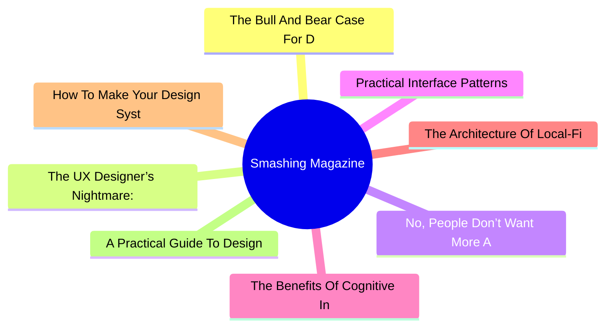
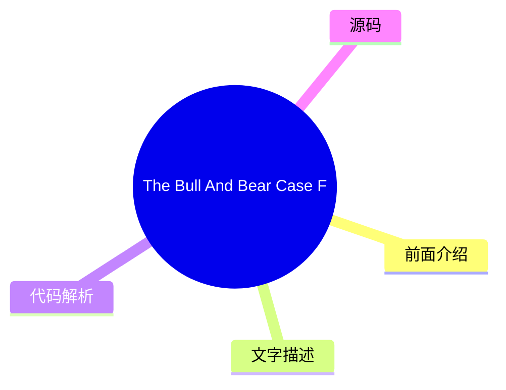
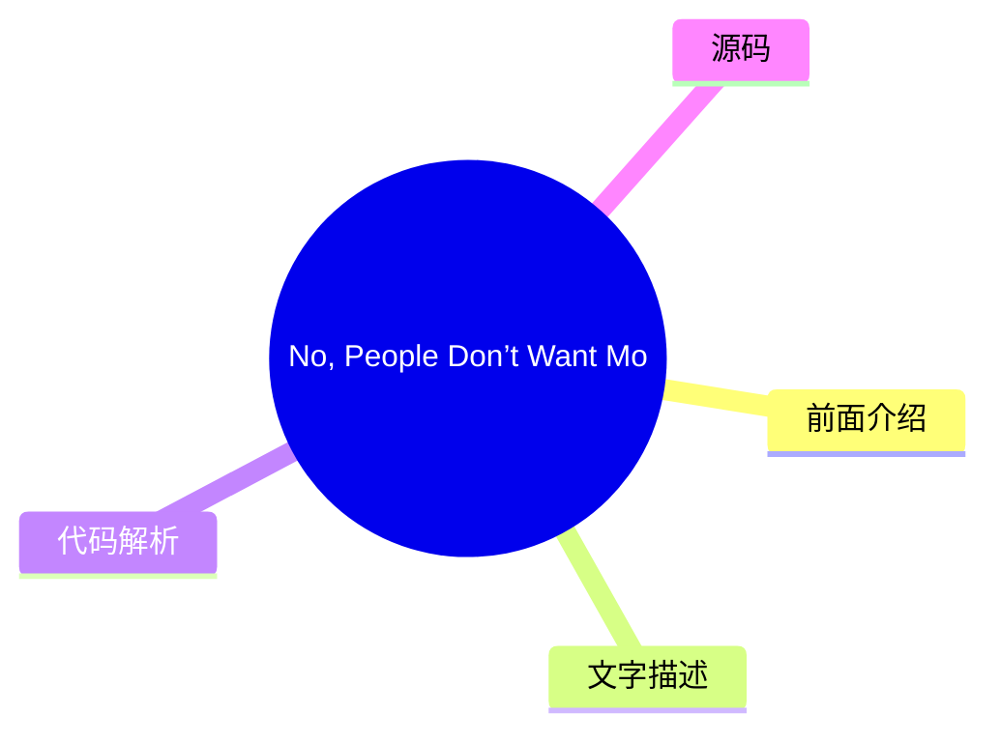
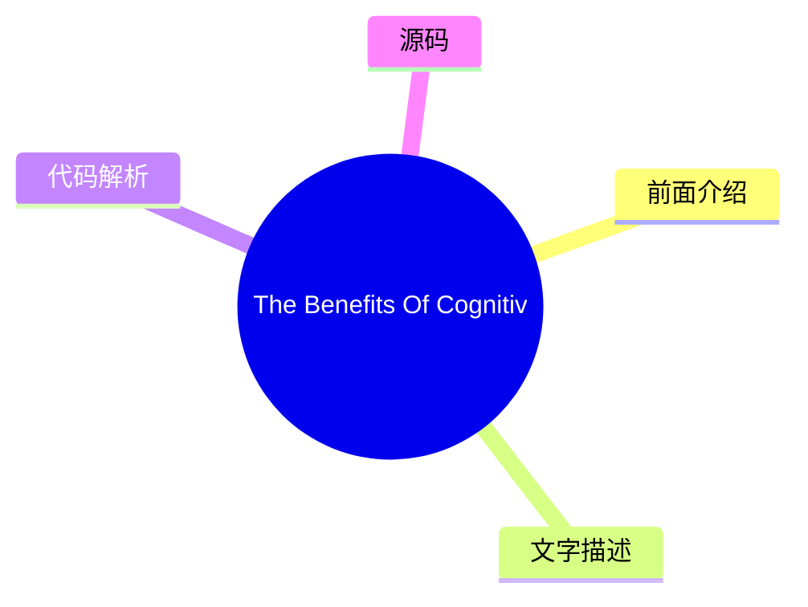
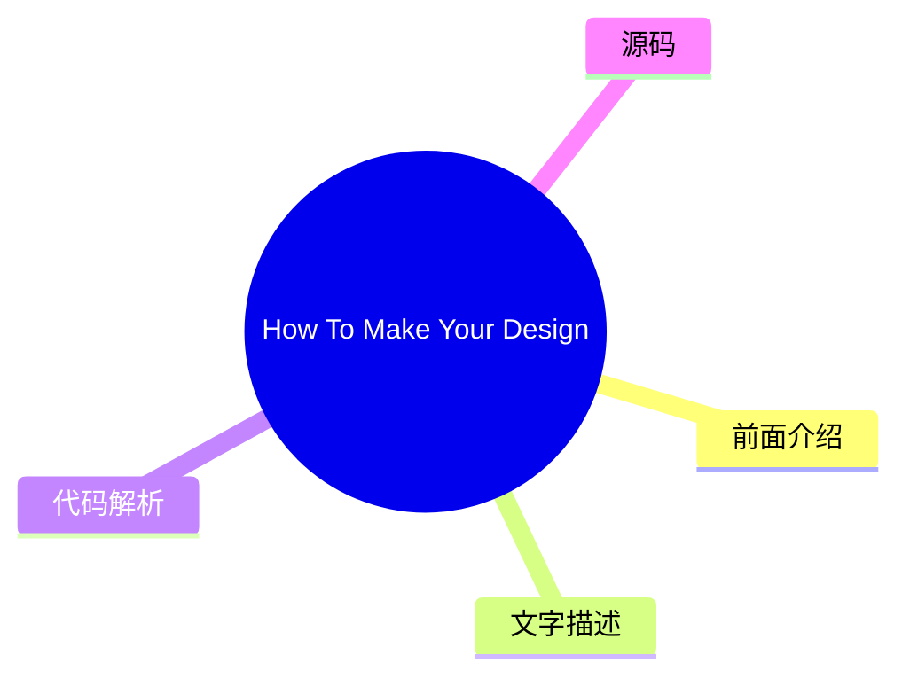
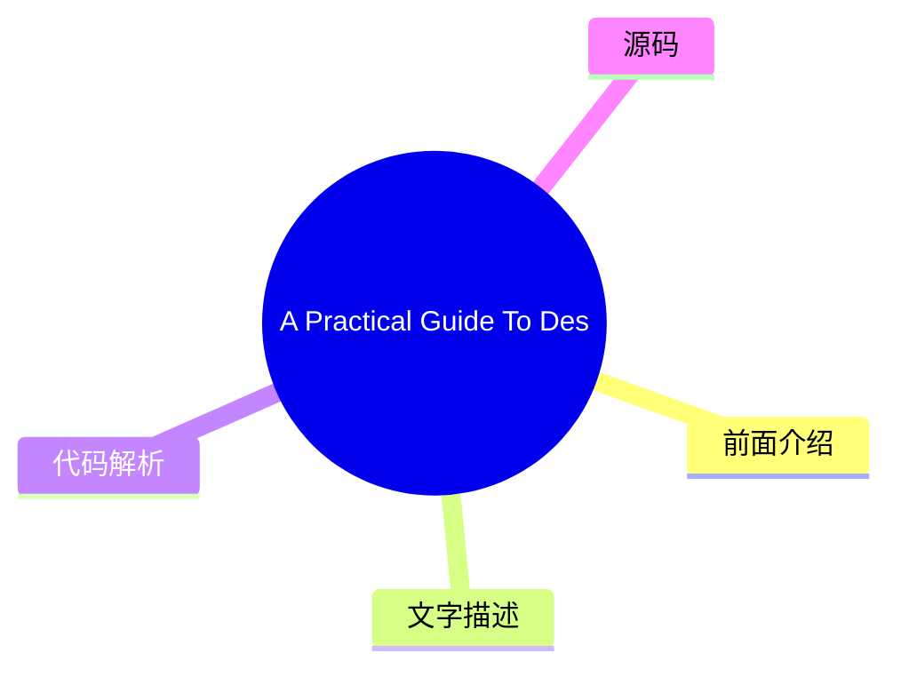

# 🔥 Smashing Magazine Top 8 (2026-08-07)

## 前面介绍

- 数据源：Smashing Magazine
- 抓取日期：2026-08-07
- 条目数：8
- 含完整正文：8
- 含代码片段：1
- 组织方式：前面介绍 / 树状图 / 文字描述 / 代码解析 / 源码

## 思维导图



## 详细整理（8 条，8 条含全文，1 条含代码）

### 1. The Bull And Bear Case For Digital Design In The Age Of AI
- **链接**: [https://smashingmagazine.com/2026/07/bull-and-bear-case-digital-design-age-ai/](https://smashingmagazine.com/2026/07/bull-and-bear-case-digital-design-age-ai/)
- **发布**: Wed, 29 Jul 2026 13:00:00 GMT

#### 前面介绍

- As AI reshapes product design, it could give designers greater autonomy or expose the gaps that autonomy makes harder to hide. Exploring both the bull and bear cases, Andy Budd examines what happens when designers need less permission to act.
- 发布时间：Wed, 29 Jul 2026 13:00:00 GMT

#### 树状图



#### 文字描述

- Designers have spent years saying they would do better work if the organisation got out of the way. Not always in those exact words, obviously. It usually comes out as something more reasonable: we didn’t get enough engineering time, product had already decided the solution, the roadmap was too packed, leadership only cared about this quarter’s numbers, research got cut, the ex
- ## The Bull Case: Designers Need Less Permission A good designer can now move from *“we should fix this”* to *“I fixed this, and pushed it live.”* They can prototype the alternative onboarding flow, write and test clearer product copy, build a rough working version of the interaction, clean up small pieces of design debt without waiting three months for a roadmap slot, and make
- ## The Bear Case: Autonomy Exposes The Gaps Autonomy has teeth. If AI gives designers more room to act, it also removes some of the cover. The same constraints that held good designers back have also protected weaker ones from being tested too directly. For years, it has been easy to say: I had a better idea, but we never got the engineering time. Sometimes that was exactly wha
- ## Where I Think We Might End Up The painful part is that both futures can be true at the same time. AI can make the best designers more capable and many average designers less necessary. It can give design more agency while reducing design headcount. It can help a small number of designers move closer to product leadership while pushing others into governance and clean-up work

#### 代码解析

- 本文未检测到明确代码块，内容更偏新闻、观点或方法论。

#### 源码

#### 中文节选

Designers have spent years saying they would do better work if the organisation got out of the way. Not always in those exact words, obviously. It usually comes out as something more reasonable: we didn’t get enough engineering time, product had already decided the solution, the roadmap was too packed, leadership only cared about this quarter’s numbers, research got cut, the experiment was never run properly, the design debt was known about, but nobody wanted to spend a sprint fixing it.

Much of this is true. Most designers have worked inside that awkward middle space between product and engineering. Product frames the problem, or at least thinks it does. Engineering decides what is feasible, or at least what is affordable. Design is expected to make the thing clearer, simpler, more coherent, more usable, and occasionally more desirable, while also being careful not to disrupt the plan too much.

That position has always been uncomfortable.

Designers are told to think strategically, but often lack the power to act strategically.

They can spot the broken onboarding flow, the confusing upgrade path, the empty state that makes users feel stupid, the feature that looks reasonable in a product review but makes no sense in real use. Seeing the problem is one thing. Getting it fixed is another.

So design often becomes an **argument**. You make the case. You annotate the flow. You bring the research clip. You point to the support tickets. You show the Figma prototype. You explain why the *“small edge case”* is actually the first-run experience for half your new users. Then everyone nods, agrees it matters, and moves on to whatever had already made it onto the roadmap.

This is one reason AI is more interesting for design than the usual *“will it replace designers?”* debate suggests. The real change is not that designers can make more screens. Nobody needs more screens. The interesting change is that designers **may need less permission**.

## The Bull Case: Designers Need Less Permission


A good designer can now move from *“we should fix this”* to *“I fixed this, and pushed it live.”* They can prototype the alternative onboarding flow, write and test clearer product copy, build a rough working version of the interaction, clean up small pieces of design debt without waiting three months for a roadmap slot, and make the better thing **visible enough** that it becomes **harder to ignore**.

That changes the politics of the work. Design has often relied on persuasion because designers lacked direct means of production. AI weakens that dependency. Not everywhere, and not for everything. Complex products still have architecture, infrastructure, data models, permissions, security, compliance, legacy systems, and all the other unglamorous reasons software is hard. But the boundary is moving.

More of the gap between having the idea and making the idea real can now be crossed by a motivated designer with the right tools.

In this version of the future, design

#### 完整正文（中文）

Designers have spent years saying they would do better work if the organisation got out of the way. Not always in those exact words, obviously. It usually comes out as something more reasonable: we didn’t get enough engineering time, product had already decided the solution, the roadmap was too packed, leadership only cared about this quarter’s numbers, research got cut, the experiment was never run properly, the design debt was known about, but nobody wanted to spend a sprint fixing it.

Much of this is true. Most designers have worked inside that awkward middle space between product and engineering. Product frames the problem, or at least thinks it does. Engineering decides what is feasible, or at least what is affordable. Design is expected to make the thing clearer, simpler, more coherent, more usable, and occasionally more desirable, while also being careful not to disrupt the plan too much.

That position has always been uncomfortable.

Designers are told to think strategically, but often lack the power to act strategically.

They can spot the broken onboarding flow, the confusing upgrade path, the empty state that makes users feel stupid, the feature that looks reasonable in a product review but makes no sense in real use. Seeing the problem is one thing. Getting it fixed is another.

So design often becomes an **argument**. You make the case. You annotate the flow. You bring the research clip. You point to the support tickets. You show the Figma prototype. You explain why the *“small edge case”* is actually the first-run experience for half your new users. Then everyone nods, agrees it matters, and moves on to whatever had already made it onto the roadmap.

This is one reason AI is more interesting for design than the usual *“will it replace designers?”* debate suggests. The real change is not that designers can make more screens. Nobody needs more screens. The interesting change is that designers **may need less permission**.

## The Bull Case: Designers Need Less Permission


A good designer can now move from *“we should fix this”* to *“I fixed this, and pushed it live.”* They can prototype the alternative onboarding flow, write and test clearer product copy, build a rough working version of the interaction, clean up small pieces of design debt without waiting three months for a roadmap slot, and make the better thing **visible enough** that it becomes **harder to ignore**.

That changes the politics of the work. Design has often relied on persuasion because designers lacked direct means of production. AI weakens that dependency. Not everywhere, and not for everything. Complex products still have architecture, infrastructure, data models, permissions, security, compliance, legacy systems, and all the other unglamorous reasons software is hard. But the boundary is moving.

More of the gap between having the idea and making the idea real can now be crossed by a motivated designer with the right tools.

In this version of the future, designers become **less permission-dependent**: less reliant on product to bless the problem, less reliant on engineering to make every small improvement real, less trapped in the role of internal critic, taste-provider, or Figma operator. More able to make, test, repair, and ship.

The best designers start to look less like traditional product designers and more like **hybrid product leaders**. They still care about interaction, hierarchy, language, flow, brand and craft, but they also understand the commercial shape of the problem. They can make trade-offs. They can prototype in code, or close enough to code. They can use AI to explore options quickly, then use judgment to throw most of them away. They can sit with a founder or PM and move from a vague product concern to something tangible by the end of the day.


这些人可能会变少，但更难被忽视。当前的设计组织模式部分是围绕**稀缺性**建立的：稀缺的工程时间、缓慢的生产、昂贵的原型、专家之间的交接、跨团队繁重的协调。如果 AI 减少了其中的一些稀缺性，它可能会减少围绕它而形成的一些角色的需求。乐观的情况不是每个设计师都能保住工作并获得生产力提升。那感觉像是一厢情愿。更可信的版本是，设计师的总数会减少，但留下的设计师对产品拥有**更大的直接影响力**。

这对最强的设计师来说并不是一个坏结果。这甚至可能是许多设计师多年来一直想要的。

## 熊市观点：自主性暴露了差距

自主性是有牙齿的。如果 AI 给设计师更多的行动空间，它也移除了一些掩护。那些限制优秀设计师发挥的约束，同时也保护了较弱的设计师免受过于直接的考验。

多年来，很容易说：我有一个更好的想法，但我们从未获得工程时间。有时确实如此。有时更好的想法从未真正超越批评。它没有被具体化。它没有被测试。它没有处理尴尬的权衡。它听起来很有力，因为它在已发布的产品面前安全地处于对立面。

许多设计师擅长发现哪里出了问题。擅长决定应该发生什么的人较少。能将其替代方案变得足够具体以便他人评判的人更少。AI 将暴露这一差距。

如果你能对建议进行原型设计，建议就必须变得更好。如果你能让替代方案流畅运行，流程就必须经受细节的考验。如果你能测试产品文案，你就必须关心用户阅读时会发生什么。如果你能修复那块小的设计债务，你就必须决定它是否真的值得修复。

Some designers are not as strategic as they think they are. They have learned the language of strategy without the discomfort of **owning outcomes**. They can talk about user needs, business goals, systems thinking, and product quality, but struggle when asked to make a call. They want influence, but not the **exposure** that comes with it.

The profession has spent a long time arguing that design deserves more power. Fine. But more power means fewer excuses. It means the work is judged less by the elegance of the argument and more by the quality of the thing you made, tested, or changed. That is a better standard, but it will not be kind to everyone.

There is a second bear case, and it is probably the one large design teams should worry about most. Product and engineering already have more institutional power than design in most companies. They own the roadmap, the technical architecture, the sprint machinery, the metrics, and usually the language leadership understands. Design often has to translate its concerns into someone else’s terms before they count.

AI may not rebalance that power. It may hand product and engineering enough **design capability** to make design easier to bypass. A PM who can generate a decent flow, decent copy, and a decent prototype may not feel the same need to involve design early. An engineer who can use AI to produce a reasonable interface may decide the design system covers enough of the decision-making. A founder who can get to a polished demo in an afternoon may confuse polish with product thinking.

The problem is not that these people will suddenly become great designers. The problem is that many companies do not know the difference between great design and plausible design. **Plausible design is dangerous.** It looks coherent in a product review. It uses the right components. The spacing is fine. The copy is not embarrassing. The flow mostly works. Nobody in the meeting feels strongly enough to object. So it ships.


A lot of bad product decisions already survive because they look plausible. AI will produce more of them. This is where design could lose ground quickly: not because taste, judgment, research, and interaction thinking stop mattering, but because the visible outputs of design become easier for other functions to imitate.

If a company already thinks design is mostly screens, prototypes, and polish, AI gives it a cheaper way to get those things.

In that world, design does not gain more agency. It gets narrowed. The remaining designers manage the design system, police component usage, review flows that have already been decided, tidy the interface, maintain brand consistency, and get pulled into high-stakes launches, executive demos, and the occasional messy cross-platform problem. Useful work, but a smaller surface area. Less shaping the product, more maintaining the furniture.

This is why the *“AI will automate the boring 20%”* argument feels too comforting. In some companies, perhaps that is what happens. But in large tech organisations, where design teams grew around coordination, production and process, the cut could be much deeper. Not 20%. Maybe 50%. Maybe more. Especially in places where leadership never really understood why the design team had grown so large in the first place.

## Where I Think We Might End Up

The painful part is that both futures can be true at the same time. AI can make the best designers more capable and many average designers less necessary. It can give design more agency while reducing design headcount. It can help a small number of designers move closer to product leadership while pushing others into governance and clean-up work. It can free designers from waiting for permission, then reveal that some were more comfortable waiting than acting.

“


他们会有品味，但品味是不够的。他们需要**产品判断力**、**技术好奇心**、**商业意识**，以及在每一个变量都确定之前做出决策的**胆识**。他们需要能够自如地在客户对话、原型、定价问题、品牌疑问和混乱的实现细节之间切换，而不坚持认为所有这些都属于别人。

我不完全确定我们会走向何方。我希望它更接近于*利好情况*：更少的权限结构，更多的动手制作，更多的自主权，以及更好的设计师终于能够展示他们的能力，而不受周围机器的掣肘。

我担心它可能更接近于*利空情况*：产品和工程吸纳了大部分工作，公司认为看似合理的设计就足够好了，设计失去了地位、人员编制和战略阵地。

实际上，它可能只是两者的某种令人不适的混合体。一些设计师将利用 AI 获得更多自主权。一些公司将利用它减少对设计师的需求。一些团队将产出更好的作品，因为判断与执行之间的距离缩短了。另一些团队将交付更多看似平庸的作品，因为房间里没有人能分辨出其中的差别。

多年来，设计师一直声称，如果不受周围组织的限制，他们可以创造更多价值。AI 即将验证这一说法。有些人将最终证明它是正确的。有些人会发现，这些限制其实是在帮他们的忙。

### 更多资源

- “[Good from Afar, But Far from Good: AI Prototyping in Real Design Contexts](https://www.nngroup.com/articles/ai-prototyping/)”，Huei-Hsin Wang 和 Megan Brown*(NN/Group)*
 UX 设计领域充斥着各种由 AI 驱动的原型工具，这些工具可以从自然语言提示中生成界面。尽管营销炒作巨大，但在真实设计场景下的评估显示，虽然这些工具可以遵循指令以实现一般目标，但它们往往缺乏权衡设计取舍的精细度，也无法在没有人类广泛指导的情况下产出深思熟虑的高质量设计。

- “[AI Design Tools Are Marginally Better: Status Update](https://www.nngroup.com/articles/ai-design-tools-update-2/?lm=ai-prototyping&pt=article),” Megan Brown, Caleb Sponheim and Taylor Dykes*(NN/Group)*
 AI-powered design tools have improved, yet we’re still nowhere near the usef

...（截断，原文 14445+ 字符）


### 2. The UX Designer’s Nightmare: When “Production-Ready” Becomes A Design Deliverable
- **链接**: [https://smashingmagazine.com/2026/04/production-ready-becomes-design-deliverable-ux/](https://smashingmagazine.com/2026/04/production-ready-becomes-design-deliverable-ux/)
- **发布**: Wed, 22 Apr 2026 10:00:00 GMT

#### 前面介绍

- In a rush to embrace AI, the industry is redefining what it means to be a UX designer, blurring the line between design and engineering. Carrie Webster explores what’s gained, what’s lost, and why designers need to remain the guardians of the user ex
- 发布时间：Wed, 22 Apr 2026 10:00:00 GMT

#### 树状图


#### 文字描述

- In early 2026, I noticed that the UX designer’s toolkit seemed to shift overnight. The industry standard *“Should designers code?”* debate was abruptly settled by the market, not through a consensus of our craft, but through the brute force of job requirements. If you browse LinkedIn today, you’ll notice a stark change: UX roles increasingly demand ** AI-augmented development**
- ## The LinkedIn Pressure Cooker: Role Creep In 2026 The job market is sending a clear signal. While traditional graphic design roles are expected to grow by only **3%** through 2034, UX, UI, and [Product Design roles](https://www.nobledesktop.com/careers/designer/job-outlook#:~:text=The%20projected%20future%20growth%20figures%20for%20Digital,job%20growth%20(which%20lies%20somew
- ### The Competence Trap: Two Job Skill Sets, One Average Result There is potentially a very dangerous myth circulating in boardrooms that AI makes a designer “equal” to an engineer. This narrative suggests that because an LLM can generate a functional JavaScript event handler, the person prompting it doesn’t need to understand the underlying logic. In reality, attempting to mas
- ### The “Averagely Competent” Dilemma For a senior UX designer to become a senior-level coder is like asking a master chef to also be a master plumber because “they both work in the kitchen.” You might get the water running, but you won’t know why the pipes are rattling. - **The “cognitive offloading” risk.** Research shows that while AI can speed up task completion, it often l

#### 代码解析

- 本文未检测到明确代码块，内容更偏新闻、观点或方法论。

#### 源码

#### 中文节选

In early 2026, I noticed that the UX designer’s toolkit seemed to shift overnight. The industry standard *“Should designers code?”* debate was abruptly settled by the market, not through a consensus of our craft, but through the brute force of job requirements. If you browse LinkedIn today, you’ll notice a stark change: UX roles increasingly demand ** AI-augmented development**, 

**technical orchestration,**and

**production-ready prototyping.**

For many, including myself, this is the ultimate design job nightmare. We are being asked to deliver both the “vibe” and the “code” simultaneously, using AI agents to bridge a technical gap that previously took years of computer science knowledge and coding experience to cross. But as the industry rushes to meet these new expectations, they are discovering that AI-generated functional code is not always *good* code.

## The LinkedIn Pressure Cooker: Role Creep In 2026

The job market is sending a clear signal. While traditional graphic design roles are expected to grow by only **3%** through 2034, UX, UI, and [Product Design roles](https://www.nobledesktop.com/careers/designer/job-outlook#:~:text=The%20projected%20future%20growth%20figures%20for%20Digital,job%20growth%20(which%20lies%20somewhere%20around%205%25).) are projected to grow by **16%** over the same period.

However, this growth is increasingly tied to the rise of **AI product development**, where “design skills” have recently become the #1 most in-demand capability, even ahead of coding and cloud infrastructure. Companies building these platforms are no longer just looking for visual designers; they need professionals who can “[translate technical capability into human-centered experiences](https://humbldesign.io/blog-posts/will-ai-replace-designers-2026).”


This creates a high-stakes environment for the UX designer. We are no longer just responsible for the interface; we are expected to understand the technical logic well enough to ensure that complex AI capabilities feel intuitive, safe, and useful for the human on the other side of the screen. Designers are being pushed toward a **“design engineer” model**, where we must bridge the gap between abstract [AI logic and user-facing code](https://www.refontelearning.com/blog/ui-ux-designer-engineering-in-2026-crafting-future-ready-user-experiences#skills-and-competencies-for-the-2026-uiux-designer-3).

A [recent survey](https://www.lyssna.com/blog/ux-design-trends/) found that **73% of designers** now view AI as a primary collaborator rather than just a tool. However, this “collaboration” often looks like “role creep.” Recruiters are often not just looking for someone who understands user empathy and information architecture — they want someone who can also prompt a React component into existence and push it to a repository!

This shift has created a **competency gap**.

As an experienced senior designer who has spent decades mastering the nuances of cognitive load, accessibility standards, an

#### 完整正文（中文）

In early 2026, I noticed that the UX designer’s toolkit seemed to shift overnight. The industry standard *“Should designers code?”* debate was abruptly settled by the market, not through a consensus of our craft, but through the brute force of job requirements. If you browse LinkedIn today, you’ll notice a stark change: UX roles increasingly demand ** AI-augmented development**, 

**technical orchestration,**and

**production-ready prototyping.**

For many, including myself, this is the ultimate design job nightmare. We are being asked to deliver both the “vibe” and the “code” simultaneously, using AI agents to bridge a technical gap that previously took years of computer science knowledge and coding experience to cross. But as the industry rushes to meet these new expectations, they are discovering that AI-generated functional code is not always *good* code.

## The LinkedIn Pressure Cooker: Role Creep In 2026

The job market is sending a clear signal. While traditional graphic design roles are expected to grow by only **3%** through 2034, UX, UI, and [Product Design roles](https://www.nobledesktop.com/careers/designer/job-outlook#:~:text=The%20projected%20future%20growth%20figures%20for%20Digital,job%20growth%20(which%20lies%20somewhere%20around%205%25).) are projected to grow by **16%** over the same period.

However, this growth is increasingly tied to the rise of **AI product development**, where “design skills” have recently become the #1 most in-demand capability, even ahead of coding and cloud infrastructure. Companies building these platforms are no longer just looking for visual designers; they need professionals who can “[translate technical capability into human-centered experiences](https://humbldesign.io/blog-posts/will-ai-replace-designers-2026).”


This creates a high-stakes environment for the UX designer. We are no longer just responsible for the interface; we are expected to understand the technical logic well enough to ensure that complex AI capabilities feel intuitive, safe, and useful for the human on the other side of the screen. Designers are being pushed toward a **“design engineer” model**, where we must bridge the gap between abstract [AI logic and user-facing code](https://www.refontelearning.com/blog/ui-ux-designer-engineering-in-2026-crafting-future-ready-user-experiences#skills-and-competencies-for-the-2026-uiux-designer-3).

A [recent survey](https://www.lyssna.com/blog/ux-design-trends/) found that **73% of designers** now view AI as a primary collaborator rather than just a tool. However, this “collaboration” often looks like “role creep.” Recruiters are often not just looking for someone who understands user empathy and information architecture — they want someone who can also prompt a React component into existence and push it to a repository!

This shift has created a **competency gap**.

As an experienced senior designer who has spent decades mastering the nuances of cognitive load, accessibility standards, and ethnographic research, I am suddenly finding myself being judged on my ability to debug a CSS Flexbox issue or manage a Git branch.

The nightmare isn’t the technology itself. It’s the **reallocation of value**.

“

### The Competence Trap: Two Job Skill Sets, One Average Result

There is potentially a very dangerous myth circulating in boardrooms that AI makes a designer “equal” to an engineer. This narrative suggests that because an LLM can generate a functional JavaScript event handler, the person prompting it doesn’t need to understand the underlying logic. In reality, attempting to master two disparate, deep fields simultaneously will most likely lead to being **averagely competent** at both.

### The “Averagely Competent” Dilemma

For a senior UX designer to become a senior-level coder is like asking a master chef to also be a master plumber because “they both work in the kitchen.” You might get the water running, but you won’t know why the pipes are rattling.


- **The “cognitive offloading” risk.**
 Research shows that while AI can speed up task completion, it often leads to a significant decrease in conceptual mastery. In a controlled study, participants using AI assistance scored- [17% lower](https://www.psychologytoday.com/au/blog/the-asymmetric-brain/202602/cognitive-offloading-using-ai-reduces-new-skill-formation)on comprehension tests than those who coded by hand.
- **The debugging gap.**
 The largest performance gap between AI-reliant users and hand-coders is in- [debugging](https://www.anthropic.com/research/AI-assistance-coding-skills). When a designer uses AI to write code they don’t fully understand, they don’t have the ability to identify- *when*and- *why*it fails.

So, if a designer ships an AI-generated component that breaks during a high-traffic event and cannot manually trace the logic, they are no longer an expert. They are now a liability.

### The High Cost Of Unoptimised Code

Any experienced code engineer will tell you that creating code with AI without the right prompt leads to a lot of rework. Because most designers lack the technical foundation to audit the code the AI gives them, they are inadvertently shipping massive amounts of [“Quality Debt”](https://gocrossbridge.com/blog/ai-generated-code/).

## Common Issues In Designer-Generated AI Code

- **The security flaw**
 Recent reports indicate that up to- [92% of AI-generated codebases](https://www.sherlockforensics.com/pages/ai-code-security-report-2026.html)contain at least one critical vulnerability. A designer might see a functioning login form, unaware that it has an 86% failure rate in XSS defense, which are the security measures aimed at preventing attackers from injecting malicious scripts into trusted websites.
- **The accessibility illusion**

 AI often generates “functional” applications that lack semantic integrity. A designer might prompt a “beautiful and functional toggle switch,” but the AI may provide a non-semantic- `<div>`that lacks keyboard focus and screen-reader compatibility, creating- [Accessibility Debt](https://www.levelaccess.com/blog/accessibility-debt-in-software-development-and-how-to-engineer-it-out/)that is expensive to fix later.
- **The performance penalty**
 AI-generated code tends to be verbose. AI is linked to- [4x more code duplication](https://www.netcorpsoftwaredevelopment.com/blog/ai-generated-code-statistics)than human-written code. This verbosity slows down page loads, creates massive CSS files, and negatively impacts SEO. To a business, the task looks “done.” To a user with a slow connection or a screen reader, the site is a nightmare.

## Creating More Work, Not Less

The promise of AI was that designers could ship features without bothering the engineers. The reality has been the birth of a **“Rework Tax”** that is draining engineering resources across the industry.

- **Cleaning up**
 Organisations are finding that while velocity increases, incidents per Pull Request are also rising by- [23.5%](https://blog.exceeds.ai/ai-code-analysis-benchmark-reports/). Some engineering teams now spend a significant portion of their week cleaning up “AI slop” delivered by design teams who skipped a rigorous review process.
- **The communication gap**
 Only- [69% of designers](https://www.lyssna.com/blog/ux-design-trends/)feel AI improves the quality of their work, compared to- **82% of developers**. This gap exists because “code that compiles” is not the same as “code that is maintainable.”

When a designer hands off AI-generated code that ignores a company’s internal naming conventions or management patterns, they aren’t helping the engineer; they are creating a puzzle that someone else has to solve later.

### The Solution

We need to move away from the nightmare of the “**Solo Full-Stack Designer**” and toward a model of **designer/coder collaboration**.

**The ideal reality:**

- **The Partnership**

 Instead of designers trying to be mediocre coders, they should work in a- **human-AI-human loop**. A senior UX designer should work- *with*an engineer to use AI; the designer creates prompts for- **intent, accessibility, and user flow**, while the engineer creates prompts for- **architecture and performance**.
- **Design systems as guardrails**
 To prevent accessibility debt from spreading at scale,- [accessible components must be the default](https://webaim.org/projects/million/)in your design system. AI should be used to feed these tokens into your UI, ensuring that even generated code stays within the “source of truth.”

## Beyond The Prompt

The industry is currently in a state of “AI Infatuation,” but the pendulum will eventually swing back toward quality.

“

Businesses that prioritise “designer-shipped code” without engineering oversight will eventually face a reckoning of technical debt, security breaches, and accessibility lawsuits. The designers who thrive in 2026 and beyond will be those who refuse to be “prompt operators” and instead position themselves as the **guardians of the user experience**. This is the perfect outcome for experienced designers and for the industry.

Our value has always been our ability to advocate for the human on the other side of the screen. We must use AI to augment our design thinking, allowing us to test more ideas and iterate faster, but we must never let it replace the specialised engineering expertise that ensures our designs technically *work* for everyone.

### Summary Checklist for UX Designers

- **Work Together.**
 Use AI-made code as a starting point to talk with your developers. Don’t use it as a shortcut to avoid working with them. Ask them to help you with prompts for code creation for the best outcomes.
- **Understand the “Why”.**
 Never submit code you don’t understand. If you can’t explain how the AI-generated logic works, don’t include it in your work.
- **Build for Everyone.**
 Good design is more than just looks. Use AI to check if your code works for people using screen readers or keyboards, not just to make things look pretty.


### 3. No, People Don’t Want More AI In Their Life
- **链接**: [https://smashingmagazine.com/2026/07/people-dont-want-more-ai/](https://smashingmagazine.com/2026/07/people-dont-want-more-ai/)
- **发布**: Wed, 15 Jul 2026 10:00:00 GMT

#### 前面介绍

- Many companies assume everyone craves new AI features. But the reality is that most people don't want more AI &mdash; at least not in the way most AI leaders envision it. Brought to you by Design Patterns For AI Interfaces, **friendly video courses o
- 发布时间：Wed, 15 Jul 2026 10:00:00 GMT

#### 树状图



#### 文字描述

- Many companies silently assume that everybody wants more AI in their lives. That people are **craving new AI features**, new AI products, new AI workflows — that would all magically replace all existing outdated practices and broken ways of working. But in reality, it seems like **people don’t want more AI** at all — at least not in the way most AI leaders envision it. Unsurpri
- ## The AI People Don’t Need It’s remarkably difficult to make a strong argument with senior leadership, but [AI is not a value proposition](https://www.nngroup.com/articles/powered-by-ai-is-not-a-value-proposition/). New AI features don’t magically make for happy or excited customers. Because AI features are often bolt-ons and separate tools for employees to use, they typically
- ## The AI People Actually Need I’m always puzzled by the comparison of AI features with how unreliable humans are. But people don’t compare software with other people. They **compare features with features** — and if one feature in one product is unreliable, while a similar feature works flawlessly in another, they choose the latter. It’s not about AI or not AI, but rather what
- ## Wrapping Up Perhaps I’m missing a bigger picture, and perhaps I’m just old school — but **I really do like people**. Their stories, their thinking, their emotions, their enthusiasm, their laughing. AI can be remarkably helpful in many situations, but so are people. And between the two, I would favor **spending time with a human** — however imperfect they are — every single t

#### 代码解析

- 本文未检测到明确代码块，内容更偏新闻、观点或方法论。

#### 源码

#### 中文节选

许多公司默默假设每个人都想在生活中拥有更多 AI。人们渴望新的 AI 功能、新的 AI 产品、新的 AI 工作流——这些都能神奇地取代所有现有的过时做法和糟糕的工作方式。

但在现实中，似乎人们根本不需要更多 AI——至少不是大多数 AI 领导者设想的那种方式。毫不意外，许多 AI 功能的[采用率和留存率很低](https://www.mindstudio.ai/blog/ai-adoption-gap-ibm-2026-study)——而且交付成本极高，声誉受损的风险也很大。

## 人们不需要的 AI

向高级管理层提出强有力的论点非常困难，但[AI 不是价值主张](https://www.nngroup.com/articles/powered-by-ai-is-not-a-value-proposition/)。新的 AI 功能并不会神奇地让客户感到快乐或兴奋。由于 AI 功能通常是附加项，是员工使用的独立工具，它们通常会**把人从**他们常规的工作方式中**剥离出来**。

AI 非常擅长**放大组织中的捷径和不足**——从数据质量到决策制定。它无法神奇地修复多年积累的快速补丁、技术债务、糟糕的文化和内部政治。如果有任何变化，这些不一致或相互冲突的优先级会随着 AI 变得更加明显，并直接交给用户，然后用户不得不自己去理清这些混乱。

因为在大多数组织中，工作通常需要在大量不连贯和碎片化的系统之间频繁切换，有了新的 AI 工具后，他们又多了一个需要切换的系统。这通常会产生更多工作，而且通常也不是什么有回报的工作。

此外，人们非常清楚[发现和修复 AI 幻觉的成本](https://www.nngroup.com/articles/ai-chatbots-discourage-error-checking/)。要求 AI 生成回复**可能感觉比从头开始写更容易**，但这是有代价的：

- **通读**整个 AI 输出，
- **找出**需要重点关注的关键点，
- **逐一审查/验证**关键点，
- **检查**后续内容的**理由**，

- **Articulate corrections**+ regenerate,
- **Review the response**(a number of times).

For many people, AI isn’t something they can proactively choose and explore on their own — it arrives uninvited, at someone else’s pace. On top of that, plenty of messages amplify **fears and worries about AI** replacing work — so it’s hardly surprising that the perception of AI isn’t excitement. It’s **resistance to change** and deep anxiety about one’s place in a world that seems to be changing without them.

At best, AI features might be silently accepted or nodded away. At worst, AI **raises concerns**, doubts, caution — and calls for a healthy dose of skepticism. And sometimes it’s perceived as a threat or **liability** — because unlike other features, AI is neither predictable nor reliable.

People don’t dream of

#### 完整正文（中文）

许多公司默默假设每个人都想在生活中拥有更多 AI。人们渴望新的 AI 功能、新的 AI 产品、新的 AI 工作流——这些都能神奇地取代所有现有的过时做法和糟糕的工作方式。

但在现实中，似乎人们根本不需要更多 AI——至少不是大多数 AI 领导者设想的那种方式。毫不意外，许多 AI 功能的[采用率和留存率很低](https://www.mindstudio.ai/blog/ai-adoption-gap-ibm-2026-study)——而且交付成本极高，声誉受损的风险也很大。

## 人们不需要的 AI

向高级管理层提出强有力的论点非常困难，但[AI 不是价值主张](https://www.nngroup.com/articles/powered-by-ai-is-not-a-value-proposition/)。新的 AI 功能并不会神奇地让客户感到快乐或兴奋。由于 AI 功能通常是附加项，是员工使用的独立工具，它们通常会**把人从**他们常规的工作方式中**剥离出来**。

AI 非常擅长**放大组织中的捷径和不足**——从数据质量到决策制定。它无法神奇地修复多年积累的快速补丁、技术债务、糟糕的文化和内部政治。如果有任何变化，这些不一致或相互冲突的优先级会随着 AI 变得更加明显，并直接交给用户，然后用户不得不自己去理清这些混乱。

因为在大多数组织中，工作通常需要在大量不连贯和碎片化的系统之间频繁切换，有了新的 AI 工具后，他们又多了一个需要切换的系统。这通常会产生更多工作，而且通常也不是什么有回报的工作。

此外，人们非常清楚[发现和修复 AI 幻觉的成本](https://www.nngroup.com/articles/ai-chatbots-discourage-error-checking/)。要求 AI 生成回复**可能感觉比从头开始写更容易**，但这是有代价的：

- **通读**整个 AI 输出，
- **找出**需要重点关注的关键点，
- **逐一审查/验证**关键点，
- **检查**后续内容的**理由**，

- **Articulate corrections**+ regenerate,
- **Review the response**(a number of times).

For many people, AI isn’t something they can proactively choose and explore on their own — it arrives uninvited, at someone else’s pace. On top of that, plenty of messages amplify **fears and worries about AI** replacing work — so it’s hardly surprising that the perception of AI isn’t excitement. It’s **resistance to change** and deep anxiety about one’s place in a world that seems to be changing without them.

At best, AI features might be silently accepted or nodded away. At worst, AI **raises concerns**, doubts, caution — and calls for a healthy dose of skepticism. And sometimes it’s perceived as a threat or **liability** — because unlike other features, AI is neither predictable nor reliable.

People don’t dream of **AI art museums** or AI fridges or AI hotel reception or AI-narrated children’s books. They don’t want their children to have **romantic AI partners**. Most people don’t want to actively manage (and clean up after) a **swarm of AI agents** roaming in their bank accounts and acting on their behalf in the real world. And most notably, people don’t really want a magical box to speak to or type into all the time.

## The AI People Actually Need

I’m always puzzled by the comparison of AI features with how unreliable humans are. But people don’t compare software with other people. They **compare features with features** — and if one feature in one product is unreliable, while a similar feature works flawlessly in another, they choose the latter. It’s not about AI or not AI, but rather what works consistently and reliably, and what doesn’t.

Many conversations about AI are conversations about the speed of delivery. But to many people, there is little value in increasing the speed of delivery. They want to do things well, with enough time to think and make good decisions. They also want to **enjoy the time they spend working on things**, rather than just ship faster. There is an enormous feeling of reward and achievement that slowly disappears, one vibe-coded change at a time.


People don’t change much. And after all these years, they (still) want features that are fast, accessible, **reliable, predictable and useful** — every single time. And ideally not the ones that replace their entire workflow, but that **augment** their way of working — and that take over the most mundane, annoying, and boring tasks that they find no pleasure in.

Many jobs are [exposed to AI automation](https://www.washingtonpost.com/technology/interactive/2026/jobs-most-affected-ai-automation/), but in many of them there is a rewarding, unique, creative part that requires taste, point of view, and perhaps even human intuition. And if AI **automates boring parts** of it, that’s an advantage for everyone. That’s also what enhances productivity and brings more joy in daily life.

When AI automates tedious and mentally exhausting tasks, its value is much easier to grasp. But for that, AI shouldn’t feel like a bolt-on. It should be **deeply integrated** into people’s existing workflows. It must also match existing **mental models** that they have developed and fine-tuned for years or decades. AI should adapt to how people think and make decisions, not the other way around.

And it doesn’t really matter if these features are branded as “AI”, “smart” or “automation”. However, they must work well for people using them. And that means that people must be **aware of use cases** where it actually helps them, and be inspired to find more use cases on their own.

Ironically, tools that work well there aren’t “AI-first” — they are **“AI-second”**. Subtle, humble, calm, ambient, taking a supportive role in the background for work that otherwise is remarkably dull and unnecessary.

I don’t want to readbooks written by AI. I don’t want to gaze upon paintings by AI. I don’t want AI to teach my children. I don’t want to have an AI therapist. I don’t want AI making my medical decisions. I want AI to do all thephysical and mental laborthat taxes me so I can read books written by humans and go to art galleries to engage with art made by humans. I want AI that makes my life easier rather than forces me to change myself.


—[Bo Young Lee](https://www.linkedin.com/feed/update/urn:li:share:7467162929474420737/)

## Wrapping Up

Perhaps I’m missing a bigger picture, and perhaps I’m just old school — but **I really do like people**. Their stories, their thinking, their emotions, their enthusiasm, their laughing. AI can be remarkably helpful in many situations, but so are people. And between the two, I would favor **spending time with a human** — however imperfect they are — every single time.

No, **people don’t need more AI in their lives** — they need AI to automate all the boring stuff they have to deal with every day, so they have more time and headspace to do things that they actually love and enjoy doing. That doesn’t mean spending more time with AI — but spending more time with people they love.

## Meet “Design Patterns For AI Interfaces”

Meet [ Design Patterns For AI Interfaces](https://ai-design-patterns.com/), Vitaly’s new 

**video course**with practical examples from real-life products — with a

[live UX training](https://smashingconf.com/online-workshops/workshops/ai-interfaces-vitaly-friedman/)happening soon.

[Jump to a free preview](https://www.youtube.com/watch?v=jhZ3el3n-u0).

## Useful Resources

- [AI Adoption Gap: IBM 2026 Study](https://www.mindstudio.ai/blog/ai-adoption-gap-ibm-2026-study), by MindStudio
- [Powered by AI Is Not a Value Proposition](https://www.nngroup.com/articles/powered-by-ai-is-not-a-value-proposition/), by Nielsen Norman Group
- [AI Chatbots Discourage Error Checking](https://www.nngroup.com/articles/ai-chatbots-discourage-error-checking/), by Nielsen Norman Group
- [The Jobs Most Exposed to AI Automation](https://www.washingtonpost.com/technology/interactive/2026/jobs-most-affected-ai-automation/), by The Washington Post
- [On AI and What We Actually Want From It](https://www.linkedin.com/feed/update/urn:li:share:7467162929474420737/), by Bo Young Lee


### 4. Practical Interface Patterns For AI Transparency (Part 2)
- **链接**: [https://smashingmagazine.com/2026/05/practical-interface-patterns-ai-transparency/](https://smashingmagazine.com/2026/05/practical-interface-patterns-ai-transparency/)
- **发布**: Wed, 13 May 2026 13:00:00 GMT

#### 前面介绍

- Why traditional loading patterns like spinners fail in agentic AI experiences, and how interface patterns that reveal the system’s process, status, and decision-making can improve transparency and build user trust.
- 发布时间：Wed, 13 May 2026 13:00:00 GMT

#### 树状图


#### 文字描述

- In the [first part of this series](https://www.smashingmagazine.com/2026/04/identifying-necessary-transparency-moments-agentic-ai-part1/), we talked about the **Decision Node Audit**. We mapped out the internal workings of our AI system to pinpoint the exact moments it makes decisions based on probabilities. This told us when the system needs to be transparent with the user. No
- ## Writing Clear Status Updates We often think of transparency as a visual design problem, but it’s really about the **words** we use. Simple, clear explanations (the microcopy) are what build trust and separate a reliable AI from one that feels broken. We need to retire generic placeholders like *Loading* or *Working*. These words are remnants of the era of static software. In
- ## The Agentic Update Formula To give people useful status updates, we need to connect what the system is *doing* with *why* it’s doing it. Keeping with our scheduling agent example, the system should break down that waiting period into at least four clear, separate steps. - First, the interface displays *Checking your calendar to find open times for a recurring Thursday call w
- ## Matching Tone to the Risk Matrix Should an AI sound like a person or act like a robot? The right answer depends on the task’s importance, which we can figure out using the **Impact/Risk Matrix** from our **Decision Node Audit**. For simple, low-risk tasks, a friendly, conversational tone works best. For example, a scheduling assistant can say it’s checking your calendar for 

#### 代码解析

- 本文未检测到明确代码块，内容更偏新闻、观点或方法论。

#### 源码

#### 中文节选

In the [first part of this series](https://www.smashingmagazine.com/2026/04/identifying-necessary-transparency-moments-agentic-ai-part1/), we talked about the **Decision Node Audit**. We mapped out the internal workings of our AI system to pinpoint the exact moments it makes decisions based on probabilities. This told us when the system needs to be transparent with the user. Now, the big question is *how* to share that information.

You’ve got your **Transparency Matrix** ready. You know which behind-the-scenes API calls need a visible status update. Your engineers are on board with the technical aspects. The next step is designing the visual container for those updates.

We face a legacy problem. For thirty years, interface designers have relied on a single pattern to handle latency: **the spinner**. The spinning wheel, the throbber, the progress bar. These patterns communicate a specific technical reality. They tell the user that the system is retrieving data. The delay is caused by bandwidth or file size.

AI agents introduce a new kind of wait time. When an agent pauses for twenty seconds, it’s not just downloading something; it’s *thinking*. It’s figuring out the best steps, weighing options, and creating the content you asked for.

If we use a basic spinning icon for this “thinking time,” users get confused and anxious. They watch a looping animation and can’t tell if the system is stalled or crashed. They don’t know if the agent is handling a very complicated task or if it has simply failed.

To build user trust, we need to turn this waiting time into a **moment for reassurance**. Instead of a passive *“something is happening,”* we need to communicate an active, *“Here is exactly how I am working to solve your problem.”*

## Writing Clear Status Updates

We often think of transparency as a visual design problem, but it’s really about the **words** we use. Simple, clear explanations (the microcopy) are what build trust and separate a reliable AI from one that feels broken.


我们需要淘汰像 *Loading* 或 *Working* 这样的通用占位符。这些词汇是静态软件时代的遗留物。相反，我们必须使用特定的公式来构建状态更新，以反映系统的自主性。让我们停止使用“Loading”或“Working”这类模糊的词汇。这些术语属于过去，那时软件简单且静态。相反，我们应该创建状态更新，明确告诉用户系统*实际上正在做什么*，并使系统的操作透明。

为了举例说明，想象一下你正在部署代理 AI，它将帮助团队成员整理日历，并在被提示后代表他们安排 recurring meetings（定期会议）。

当 AI 显示类似“Checking availability”（检查可用性）的消息并持续了一段时间时，用户往往会感到迷茫，因为它提供的信息不够充分。虽然他们理解 AI 正在查看日历，但他们不知道它查看的是*谁的*日历，还涉及哪些步骤（在之前或之后）。

#### 完整正文（中文）

In the [first part of this series](https://www.smashingmagazine.com/2026/04/identifying-necessary-transparency-moments-agentic-ai-part1/), we talked about the **Decision Node Audit**. We mapped out the internal workings of our AI system to pinpoint the exact moments it makes decisions based on probabilities. This told us when the system needs to be transparent with the user. Now, the big question is *how* to share that information.

You’ve got your **Transparency Matrix** ready. You know which behind-the-scenes API calls need a visible status update. Your engineers are on board with the technical aspects. The next step is designing the visual container for those updates.

We face a legacy problem. For thirty years, interface designers have relied on a single pattern to handle latency: **the spinner**. The spinning wheel, the throbber, the progress bar. These patterns communicate a specific technical reality. They tell the user that the system is retrieving data. The delay is caused by bandwidth or file size.

AI agents introduce a new kind of wait time. When an agent pauses for twenty seconds, it’s not just downloading something; it’s *thinking*. It’s figuring out the best steps, weighing options, and creating the content you asked for.

If we use a basic spinning icon for this “thinking time,” users get confused and anxious. They watch a looping animation and can’t tell if the system is stalled or crashed. They don’t know if the agent is handling a very complicated task or if it has simply failed.

To build user trust, we need to turn this waiting time into a **moment for reassurance**. Instead of a passive *“something is happening,”* we need to communicate an active, *“Here is exactly how I am working to solve your problem.”*

## Writing Clear Status Updates

We often think of transparency as a visual design problem, but it’s really about the **words** we use. Simple, clear explanations (the microcopy) are what build trust and separate a reliable AI from one that feels broken.


我们需要停用像 *Loading* 或 *Working* 这样的通用占位符。这些词汇是静态软件时代的遗留产物。相反，我们必须使用特定的公式来构建状态更新，以反映系统的主动性。让我们停止使用“Loading”或“Working”这类模糊的词汇。这些术语属于过去，那时的软件简单且静态。相反，我们应该创建状态更新，明确告诉用户系统*实际上正在做什么*，并使系统的操作透明化。

为了举例说明，想象一下你正在部署一个代理 AI，它会在被提示后帮助团队成员整理日程并代为安排定期会议。

当 AI 显示类似“Checking availability”（检查可用性）的消息并持续未知的时间时，用户往往会感到迷茫，因为提供的信息不够充分。虽然他们理解 AI 正在查看日历，但他们不知道*谁的*日历，涉及哪些其他步骤（之前或之后），或者 AI 是否记得了预约请求中的人和目的。等待最终结果可能是一种紧张、不安的体验，就像在期待一个你怀疑可能是恶作剧的礼物一样。

Perplexity AI 提供了正确处理状态更新的绝佳范例。下图 1 显示，当用户提问时，界面会实时显示它正在执行的确切操作。你会看到活动列表随着任务的完成而更新。用户无需猜测 AI 工作时正在发生什么。

## 代理更新公式

为了向用户提供有用的状态更新，我们需要将系统*正在做什么*与*为什么做*联系起来。沿用我们的日程安排代理示例，系统应该将这段等待时间分解为至少四个清晰、独立的步骤。

- 首先，界面显示 *Checking your calendar to find open times for a recurring Thursday call with [Name(s)]*（正在检查您的日历，以查找与 [Name(s)] 进行每周四通话的空闲时间）。
- 然后，它更新为：*Cross-checking availability with [Name(s)] calendars*（正在与 [Name(s)] 的日历交叉核对可用性）。
- 接下来，它可能会显示：*Syncing [Name(s)] schedules to secure your meeting time on [Data and Time]*（正在同步 [Name(s)] 的日程，以锁定您在 [Data and Time] 的会议时间）。

- 最后，在结束时，代理可能会声明他们已成功完成任务，并请求用户检查其电子邮件，以确认已发送给有定期会议的群组的邀请。

这种沟通过程将技术流程建立在用户的实际生活中。

让 AI 的进展易于理解，归结为一个三部分结构：一个强有力的**动作词**，AI 正在处理的内容（**具体项目**），以及它必须遵守的任何**限制**或规则。

想象一下 AI 帮你预订旅行。一个薄弱、无用的更新只会是：*正在搜索航班……*

一个更好的更新使用了以下公式：

- **动作词：**- *扫描*
- **具体项目：**- *汉莎航空和联合航空的价格*
- **限制/规则：**- *寻找任何低于 600 美元的航班。*

这种方法清楚地表明用户，AI 理解了他们的请求，并且正在设定的边界内工作。

## 匹配语气与风险矩阵

AI 应该听起来像人还是表现得像个机器人？正确的答案取决于任务的重要性，我们可以使用我们**决策节点审计**中的**影响/风险矩阵**来确定这一点。

对于简单、低风险的任务，友好、对话式的语气效果最好。例如，日程安排助手可以说它正在检查您的日历以寻找最佳时间。这为用户创造了一种舒适、轻松的体验。

然而，高风险任务需要清晰、机械的准确性。如果 AI 正在管理大额资金转账或复杂的数据库迁移，用户不想要一个有趣的界面；他们需要的是精确性。一个显示 *“我正在为您的资金深思熟虑”* 的屏幕可能会引起恐慌。相反，界面应该使用像 *“正在验证账户路由号码”* 这样的直接语言。通过调整 AI 的“个性”以匹配风险水平，我们为用户提供了他们在那一刻确切需要的体验。虽然影响/风险矩阵提供了必要的起点，但适当 AI 语音和语气的最终决定因素是严格的**用户研究**。

It’s impossible for any set of rules to predict the exact words or tone that will build trust or cause stress for every group of users or in every situation. That’s why hands-on research is essential. You need to:

- [Run A/B tests](https://medium.com/@alienoghli/the-essential-guide-to-a-b-testing-a84b853c16e0)
- [Conduct usability studies](https://uxplanet.org/usability-testing-the-complete-guide-e162898f68db)
- [Perform interviews](https://ixdf.org/literature/article/how-to-conduct-user-interviews)

This kind of research ensures the AI’s “personality” is comfortable and appropriate for the actual people who will be using the system in their specific context.

We’ve now covered the *“what”* — the critical microcopy, the clear action words, and the necessary limits that make an AI status update honest and informative. But words alone aren’t enough. A perfect sentence hidden in a poor interface is still a failure of transparency.

The next challenge is the *“how”* — designing the physical delivery system for that message. You can think of the status update formula as the engine, and the interface pattern as the car. A powerful engine needs a reliable, well-designed chassis to carry it down the road.

## Interface Patterns: A Library For Agents

Once we have the right words, we need **the right container**. The key is matching the message’s weight to the pattern’s visibility. A tiny background task (like an agent gently tidying up your files) doesn’t need a loud, flashing banner. That message is best delivered subtly. A high-stakes, multi-step process (like moving money) potentially demands a more robust container that forces the user to pay attention.

By creating a library of these patterns, we ensure the right level of transparency is delivered at the right moment, turning the anxiety of waiting into a moment of informed confidence. Let’s review a few common, critical patterns.

### The Living Breadcrumb: AI Working in the Background

For those low-importance tasks that an AI is handling quietly in the background, we need a way to show users it’s working without constantly distracting them. We can call this the living breadcrumb.


Think of an email app where an AI is drafting a reply for you. You don’t want a disruptive pop-up message. Instead, a small, subtle status indicator pulses within the application’s border or menu area.

The solution needs to go beyond a static icon. The living breadcrumb smoothly transitions between different text updates. It might pulse from *Reading email* to *Drafting reply* to *Checking tone*. It’s there if you want to check on its progress, offering a quiet assurance that the task is underway, but it won’t demand your immediate attention.

### Dynamic Checklists

When dealing with critical, high-stakes tasks — like processing a complex financial transaction or migrating a large, intricate dataset — we recommend using a **Dynamic Checklist** (illustrated in Figure 3).

This pattern serves as a powerful anchor for the user, providing clarity and confidence about the **process’s progress**. Instead of a simple bar, the Dynamic Checklist lays out every planned step the AI agent will take. It clearly highlights the step that is currently in progress, marks preceding steps as complete, and lists future actions as pending.

For example:

- **Step 1**: Verify Account Balance- **[Complete]**.
- **Step 2**: Convert Currency- **[Processing]**.
- **Step 3**: Transfer Funds- **[Pending]**.

The Dynamic Checklist offers a significant advantage over a traditional progress bar because it expertly manages unpredictable time. If the currency conversion (Step 2) unexpectedly requires an extra ten seconds, the user won’t feel sudden anxiety or panic. They have full visibility into the system’s exact location, understanding that the delay is occurring during the *Converting Currency* step. Because they recognize this is a potentially complex action, they are naturally more patient and trusting of the system’s ongoing work.


The pattern itself is a compelling UI idea, but designers must remember that its implementation transforms the task into a full-stack design requirement. Unlike a simple loading flag, the dynamic checklist requires a robust front-end state management system to listen for step-completion events, which are typically triggered by a back-end webhook structure. This ensures the interface is always reflecting the agent’s real-time position in the workflow.

### The Thinking Toggle

Some users with higher information needs or higher needs for transparency may not trust a simple summary; they want to see the system’s raw processing. For this audience, we’ve designed the **Thinking Toggle**.

This is a simple progressive disclosure UI control, like a chevron or a “View Logs” button, that lets the user expand a friendly status update into a raw terminal view. It displays the sanitized logic logs of the AI agent, such as:

- *Querying API endpoint /v2/search*;
- *Response received: 200 OK*;
- *Filtering results by relevance score > 0.8*.

Many people will never open this view. However, for the user who needs deep transparency, the very presence of this toggle is a signal of trust. It reassures them that the system is not concealing anything.

Keep in mind, with this deep transparency comes a critical technical risk. Even for your most expert audience, you must sanitize and abstract these raw logs before display. This step is non-negotiable to prevent accidentally exposing proprietary business logic, internal data structure names, or security tokens that could be exploited. This process ensures trust is built through honesty, not security vulnerability.

### Designing For Partial Success

In standard software, things are often black or white. A file either saves or it doesn’t. But with AI agents, things ar

...（截断，原文 21693+ 字符）


### 5. The Benefits Of Cognitive Inclusion In UX Research
- **链接**: [https://smashingmagazine.com/2026/06/benefits-cognitive-inclusion-ux-research/](https://smashingmagazine.com/2026/06/benefits-cognitive-inclusion-ux-research/)
- **发布**: Wed, 10 Jun 2026 10:00:00 GMT

#### 前面介绍

- Findings from an exploratory user research study highlighting the unique insights and practical UX recommendations shared by participants with cognitive disabilities.
- 发布时间：Wed, 10 Jun 2026 10:00:00 GMT

#### 树状图



#### 文字描述

- In the summer of 2024, I became co-chair of a working group of expert researchers who came together to determine how best to perform accessibility testing with people with cognitive disabilities. This was work I did for Fable, where I am currently VP of Innovation. Cognitive disability is an umbrella term for several disabilities that impact how people process information, and 
- ## The Cognitive Usability Study I decided to run a joint study with Fable’s partners at the University of California, Irvine, in collaboration with Syed Fatiul Huq and with help from Fable researchers Pranav Pidathala, Ali Brown, and Michael Fagan to see if my hypothesis about finding more insights with cognitive testers proved true or not. I generated three websites for the s
- ### Table 1: Websites And Tasks Tested | Website | [Strong Snacks](https://v0-strong-snacks.vercel.app/) | [Turning Pages](https://v0-bookstore-nu.vercel.app/) | [Crown & Comb](https://v0-crown-and-comb.vercel.app/) | |---|---|---|---| | Description | This is a website for three-ingredient high-protein recipes. Recipes can be browsed by category (vegan, muscle building, etc.). 
- ## Data Analysis Approach I reviewed all the study recordings and transcripts and made note of every time a participant raised a concern, question, difficulty, or asked a question about how something worked. I counted all of these as issues. I also noted where a participant missed something that was part of a task, even if they didn’t notice it themselves. I also noted every su

#### 代码解析

- 本文未检测到明确代码块，内容更偏新闻、观点或方法论。

#### 源码

#### 中文节选

In the summer of 2024, I became co-chair of a working group of expert researchers who came together to determine how best to perform accessibility testing with people with cognitive disabilities. This was work I did for Fable, where I am currently VP of Innovation.

Cognitive disability is an umbrella term for several disabilities that impact how people process information, and it usually affects memory, focus, and/or learning. It is the most prevalent disability in the U.S. (13.9% via [CDC](https://www.cdc.gov/disability-and-health/articles-documents/disability-impacts-all-of-us-infographic.html)), and cognitive disability is increasing rapidly ([Yale study](https://news.yale.edu/2025/09/24/growing-number-us-adults-report-cognitive-disability)).

We set four goals for ourselves to learn how to work with this audience:

- How should we recruit and screen participants?
- What are best practices for research with cognitive participants?
- Do these methods work in a real study?
- Documenting what we learned so that we could share it.

We created a screener to recruit people who self-identified as having challenges with memory, focus, and learning. We also reviewed published studies that involved cognitive testers to learn best practices for working with them.

Next, we tested these best practices with an initial group of 25 testers in a pilot study. We fine-tuned our approach iteratively and created a guide to running user interviews with cognitive testers and a survey that could quantify their experiences using digital products. Finally, we [documented what we learned](https://makeitfable.com/article/cognitive-accessibility-pilot-case-study/).

After our pilot study with this new group of testers finished, I felt that they would uncover more usability insights than the general population (gen pop) user research participants I’d worked with in the past. I set out to validate this hunch.

## The Cognitive Usability Study


I decided to run a joint study with Fable’s partners at the University of California, Irvine, in collaboration with Syed Fatiul Huq and with help from Fable researchers Pranav Pidathala, Ali Brown, and Michael Fagan to see if my hypothesis about finding more insights with cognitive testers proved true or not.

I generated three websites for the study using an AI prototyping tool. I wanted three different types of sites with different user goals and content so I could test a variety of tasks in the study.

### Table 1: Websites And Tasks Tested

| Website | [Strong Snacks](https://v0-strong-snacks.vercel.app/) | [Turning Pages](https://v0-bookstore-nu.vercel.app/) | [Crown & Comb](https://v0-crown-and-comb.vercel.app/) | 
|---|---|---|---|
| Description | This is a website for three-ingredient high-protein recipes. Recipes can be browsed by category (vegan, muscle building, etc.). The site also features blog posts about protein and contact information. | This website is for a bookstore with a catalog of curated reads. It features ext

#### 完整正文（中文）

In the summer of 2024, I became co-chair of a working group of expert researchers who came together to determine how best to perform accessibility testing with people with cognitive disabilities. This was work I did for Fable, where I am currently VP of Innovation.

Cognitive disability is an umbrella term for several disabilities that impact how people process information, and it usually affects memory, focus, and/or learning. It is the most prevalent disability in the U.S. (13.9% via [CDC](https://www.cdc.gov/disability-and-health/articles-documents/disability-impacts-all-of-us-infographic.html)), and cognitive disability is increasing rapidly ([Yale study](https://news.yale.edu/2025/09/24/growing-number-us-adults-report-cognitive-disability)).

We set four goals for ourselves to learn how to work with this audience:

- How should we recruit and screen participants?
- What are best practices for research with cognitive participants?
- Do these methods work in a real study?
- Documenting what we learned so that we could share it.

We created a screener to recruit people who self-identified as having challenges with memory, focus, and learning. We also reviewed published studies that involved cognitive testers to learn best practices for working with them.

Next, we tested these best practices with an initial group of 25 testers in a pilot study. We fine-tuned our approach iteratively and created a guide to running user interviews with cognitive testers and a survey that could quantify their experiences using digital products. Finally, we [documented what we learned](https://makeitfable.com/article/cognitive-accessibility-pilot-case-study/).

After our pilot study with this new group of testers finished, I felt that they would uncover more usability insights than the general population (gen pop) user research participants I’d worked with in the past. I set out to validate this hunch.

## The Cognitive Usability Study


I decided to run a joint study with Fable’s partners at the University of California, Irvine, in collaboration with Syed Fatiul Huq and with help from Fable researchers Pranav Pidathala, Ali Brown, and Michael Fagan to see if my hypothesis about finding more insights with cognitive testers proved true or not.

I generated three websites for the study using an AI prototyping tool. I wanted three different types of sites with different user goals and content so I could test a variety of tasks in the study.

### Table 1: Websites And Tasks Tested

| Website | [Strong Snacks](https://v0-strong-snacks.vercel.app/) | [Turning Pages](https://v0-bookstore-nu.vercel.app/) | [Crown & Comb](https://v0-crown-and-comb.vercel.app/) | 
|---|---|---|---|
| Description | This is a website for three-ingredient high-protein recipes. Recipes can be browsed by category (vegan, muscle building, etc.). The site also features blog posts about protein and contact information. | This website is for a bookstore with a catalog of curated reads. It features extensive filtering by book genre, a book swiping feature to build a profile of likes and dislikes, custom book lists, a shopping cart, and checkout. | A website for a hair salon that allows you to book appointments and consultations online. It has a VIP program and a variety of special packages visitors can buy. | 
| Design | Simple, brutalist, bright, lots of pictures. | Moody, classic, dark, lots of pictures of book covers. | Bold, clean, black and white with bursts of color. | 
| Content | Recipes, blog posts. | Books and book lists. | Services, experience guide, membership information. | 
| Key functionality | Filter by category, newsletter subscription. | Shopping cart, book matching, book lists, recommendations. | Appointment booking. | 
| Tasks | 
 | 
 | 
 | 

We used a single screener with questions about memory, focus, and learning, and screened participants into two groups based on whether they self-identified as having cognitive challenges or not.


Cognitive disability includes neurodiversity. Neurodivergent is an umbrella term used to describe people whose brains process information and learn differently. It is most commonly used for people who have learning disabilities (e.g., Dyslexia), ADHD, and Autism.

We ran 30 user interviews, 10 per website, with an even 5⁄5 split between cognitive and gen pop participants for each website. In each session, a participant completed all the tasks for one website during an online user interview facilitated by one of the researchers involved in the study.

All participants completed an [Accessible Usability Scale (AUS) survey](https://makeitfable.com/accessible-usability-scale/) at the end of their session. This is a free, Creative Commons-licensed 10-question survey to evaluate the usability of websites and mobile apps.

## Data Analysis Approach

I reviewed all the study recordings and transcripts and made note of every time a participant raised a concern, question, difficulty, or asked a question about how something worked. I counted all of these as issues. I also noted where a participant missed something that was part of a task, even if they didn’t notice it themselves. I also noted every suggestion for improvement made by participants.

Examples of issues found included:

- Photo is too tall and requires a lot of scrolling to get to content (noted by participant).
- I get no feedback when I like or dislike a book (noted by participant).
- Participant missed the required P.O. Box checkbox the first time (observed by me).

Examples of suggestions included:

- I would like to see a protein comparison in a table.
- The “More information” tab should be moved up higher.
- I would like more information on how the recommendation list is created.

Issues and suggestions were counted once per participant, even if they mentioned the same thing twice, but there are, of course, repeat issues and suggestions across the different participants. It is expected in UX research with multiple participants that you’ll find similar issues with each participant, and that is a signal that an issue is a universal challenge.

## Findings Of The Cognitive Usability Study


Across the three websites tested:

- Cognitive participants identified 197 issues.
- Gen pop participants identified 113 issues.
- Cognitive participants made 93 suggestions.
- Gen pop participants made 54 suggestions.
- Cognitive participants surfaced more issues related to content, buttons, icons, visual elements, and media than gen pop participants.

The results aligned with my instincts: participants with cognitive disabilities identified 1.8 times more issues and made 1.8 times more suggestions than gen pop participants.

Let’s dive deeper into the data for each website. Note that an AUS score ranges from 0 to 100, with higher numbers representing better usability than lower numbers.

### Table 2: Strong Snacks

This site had the simplest design and content of all websites tested in the study and accordingly had the lowest overall issues and the highest median AUS scores. The data aligns with what you’d expect from an easy-to-use and simple website.

On this website, cognitive participants found 3.4 more issues and made 2.2 more suggestions on average. Their average score of the overall experience was 13.7 points lower than that of the gen pop participants.

| Total issues | Average issues | Median issues | Total suggestions | Average suggestions | Median suggestions | Average AUS | Median AUS | |
|---|---|---|---|---|---|---|---|---|
| Gen pop | 32 | 6.4 | 6 | 13 | 2.6 | 2 | 90.5 | 97.5 | 
| Cognitive | 49 | 9.8 | 9 | 24 | 4.8 | 4 | 76.8 | 73.0 | 

### Table 3: Turning Pages

This was the website with the most varied functionality and the most tasks to complete (4), so it’s not surprising that participants found the most issues.

Here, cognitive participants found 6 more issues and made 3.2 more suggestions on average. They also scored the overall experience 17.2 points lower than gen pop participants on average.

| Total issues | Average issues | Median issues | Total suggestions | Average suggestions | Median suggestions | Average AUS | Median AUS | |
|---|---|---|---|---|---|---|---|---|
| Gen pop | 55 | 11 | 10 | 26 | 5.2 | 4 | 78.0 | 80.0 | 
| Cognitive | 86 | 17 | 15 | 42 | 8.4 | 6 | 60.8 | 58.0 | 

### Table 4: Crown & Comb


这个网站是故意设计得很复杂的，任务 3（寻找婚纱套餐）本意就是极难完成的。

在这个最后一个网站上，认知型参与者平均发现了 7 个更多的问题，并提出了 2.4 个更多建议。他们对整体体验的平均得分比普通人群参与者高 14.3 分。

| 总问题数 | 平均问题数 | 中位数问题数 | 总建议数 | 平均建议数 | 中位数建议数 | 平均 AUS | 中位数 AUS | |
|---|---|---|---|---|---|---|---|---|
| 普通人群 | 26 | 5 | 4 | 15 | 3 | 3 | 49.5 | 35.0 | 
| 认知型 | 62 | 12 | 11 | 27 | 5.4 | 2 | 63.8 | 68.0 | 

认知型和普通人群参与者在表 3 和表 4 中的 AUS 得分上发生了一些有趣的变化。认知型参与者对 Crown & Comb 的评分高于 Turning Pages，但普通人群的评分则相反——Turning Pages 更高，Crown & Comb 更低。如果我要猜测原因，我怀疑在 Turning Pages 上发现更多问题对认知型参与者可用性感知的影响，比普通人群参与者更大。

这两个网站之间的另一个主要区别，如下表 5 所示，是认知型参与者在 Turning Pages 上发现了更多关于按钮和链接的问题，而在 Crown & Comb 上发现了更多关于图标和视觉元素的问题。这在我看来表明，Turning Pages 上的交互更具挑战性，比视觉元素的问题更具挑战性。

### 定性发现

至于更定性的发现，我研究了两组参与者发现的问题类型的趋势。

**认知型参与者**：

- 更倾向于标记图标或视觉元素的问题。
- 更频繁地暴露内容方面的问题。
- 提供了更丰富的定性评论，经常解释为什么某物难以找到或令人困惑。

**普通人群参与者**：

- 较少标记概念或理解障碍方面的问题。
- 提供的反馈较短，通常在任务完成后就停止了。

### 表 5：按类别统计的问题数量

When I grouped issues by category, the following issues surfaced more often with cognitive participants: content, buttons and links (affordances and function), icons or visual elements, and media (video, animations). They nearly tied with gen pop participants on navigation issues (45 vs 46).

| Strong Snacks | Turning Pages | Crown & Comb | ||||
|---|---|---|---|---|---|---|
| Issue category | Gen pop | Cognitive | Gen pop | Cognitive | Gen pop | Cognitive | 
| Content | 11 | 22 | 11 | 30 | 23 | 36 | 
| Navigation | 18 | 22 | 25 | 17 | 2 | 7 | 
| Buttons and links | 0 | 5 | 7 | 20 | 3 | 0 | 
| Icons or visual elements | 3 | 16 | 2 | 3 | 4 | 23 | 
| Media | 0 | 2 | 0 | 1 | 0 | 0 | 

Let’s look at the commentary provided by one cognitive participant versus one gen pop participant in the Crown & Comb sessions. The cognitive participant gave an AUS score of 38, and the gen pop participant gave an AUS score of 27.5. I chose to compare these two participants because they both gave the lowest scores within their group.

Notice the differences in how they described the overall experience in the quotes below. The gen pop participant explained it was frustrating and not engaging. The cognitive participant felt drained and less able to focus. I interpreted the experience as having a more profound impact on the cognitive participant’s overall wellbeing.

Gen pop participant quote

“As soon as you have a name of a treatment and a little explanation and like the duration and the price, as soon as you click onto that, it should be that you can interact with that service straight away. And

...（截断，原文 21693+ 字符）


### 6. The Architecture Of Local-First Web Development
- **链接**: [https://smashingmagazine.com/2026/05/architecture-local-first-web-development/](https://smashingmagazine.com/2026/05/architecture-local-first-web-development/)
- **发布**: Wed, 06 May 2026 10:00:00 GMT

#### 前面介绍

- An honest perspective on building local-first web apps in 2026, written for developers who’ve been doing this long enough to be skeptical of silver bullets.
- 发布时间：Wed, 06 May 2026 10:00:00 GMT

#### 树状图


#### 文字描述

- Last October, I was sitting in a hotel room in Lisbon, the night before I was supposed to demo a project management tool my team had spent four months building. The hotel Wi-Fi was doing that thing where it *connects* but nothing actually loads. And I watched our app, this thing I was genuinely proud of, render a blank screen with a spinner. Then a timeout error. Then nothing. 
- ## What “Local-First” Actually Means (And The Confusion That Won’t Die) I need to clear something up because I keep having this conversation at meetups. **Local-first is not offline-first.** It’s not “add a service worker and call it a day.” It’s not a synonym for PWA. I’ve seen all of these conflated in conference talks, and it drives me a little crazy. Offline-first means you
- ## Be Honest Early: When You Should Not Do This I’m putting this near the top because I’ve watched too many developers (including myself, once) get excited about a new architecture and shoehorn it into projects where it doesn’t belong. I wasted about six weeks trying to make a local-first approach work for an internal analytics dashboard at a previous job. My colleague Sarah fi
- ## Replicas, Not Requests If you’ve used Git, you already understand the mental model. SVN (remember SVN?) was centralized. One server. You check out files, make changes, and commit to the server. Server down? Can’t commit. Can’t even see history. Git gave every developer a full clone. You commit locally, branch locally, and merge locally. Push and pull when you’re ready. The r

#### 代码解析

- `text`: 包含函数或类定义，适合直接抽成可复用实现。

#### 源码

#### 源码片段 1（text）

```text
import { SQLiteAPI } from 'wa-sqlite';
import { OPFSCoopSyncVFS } from 'wa-sqlite/src/examples/OPFSCoopSyncVFS.js';
async function initDatabase() {
  const module = await SQLiteAPI.initialize();
  const vfs = new OPFSCoopSyncVFS('pm-tool-db');
  await vfs.initialize(module);
  const db = await module.open_v2('workspace.db');
  // HACK: wa-sqlite doesn't handle concurrent writes well on Safari,
  // so we serialize through a queue. See vlcn-io/wa-sqlite#247
  await module.exec(db, `PRAGMA journal_mode=WAL`);
  await module.exec(db, `
    CREATE TABLE IF NOT EXISTS tasks (
      id TEXT PRIMARY KEY,
      title TEXT NOT NULL,
      status TEXT DEFAULT 'backlog',
      assignee_id TEXT,
      project_id TEXT NOT NULL,
      position REAL DEFAULT 0,
      created_at TEXT DEFAULT (datetime('now')),
      updated_at TEXT DEFAULT (datetime('now'))
    )
  `);
  return db;
}
```

#### 完整正文（中文）

Last October, I was sitting in a hotel room in Lisbon, the night before I was supposed to demo a project management tool my team had spent four months building. The hotel Wi-Fi was doing that thing where it *connects* but nothing actually loads. And I watched our app, this thing I was genuinely proud of, render a blank screen with a spinner. Then a timeout error. Then nothing.

I pulled out my phone, tethered to cellular, and got a shaky connection. The app loaded, but every click was a two-second wait. Create a task? Spinner. Move a task between columns? Spinner. I sat there thinking: we built a front end in React, a back end in Node, a Postgres database, a Redis cache, a GraphQL API with six resolvers just for the task board. All that infrastructure, and the damn thing can’t show me my own data without a round-trip to a server 3,000 miles away.

That was the night I started seriously looking at **local-first architecture**. Not because I read a blog post or saw a tweet. Because I was *embarrassed*.

I want to be upfront about something: I spent the first year or so dismissing local-first as academic. I read the [Ink & Switch “Local-First Software” paper](https://www.inkandswitch.com/local-first-software/) when it came out in 2019 and thought, *“Cool research, not practical for real apps.”* I was wrong. The tooling in 2019 genuinely wasn’t ready. But I was also being lazy, defaulting to the architecture I already knew. The paper laid out seven ideals for software: **fast, multi-device, offline, collaboration, longevity, privacy, user ownership**. And I remember thinking those sounded like a wish list, not engineering requirements.

Seven years later, I’ve shipped three production apps using local-first patterns. I’ve also ripped local-first out of two projects where it was the wrong call. I have opinions. Some of them are probably wrong. But they’re earned.

So here’s what I actually think about building local-first web apps in 2026, written for developers who’ve been doing this long enough to be skeptical of silver bullets.

## What “Local-First” Actually Means (And The Confusion That Won’t Die)


I need to clear something up because I keep having this conversation at meetups. **Local-first is not offline-first.** It’s not “add a service worker and call it a day.” It’s not a synonym for PWA. I’ve seen all of these conflated in conference talks, and it drives me a little crazy.

Offline-first means your app handles network loss gracefully, but [the server is still the source of truth](https://www.smashingmagazine.com/2019/04/cloudflare-workers-serverless/). When the network comes back, the server wins. Cache-first (service workers caching responses) is a performance optimization. You’re serving stale data faster, which is great, but you haven’t changed who *owns* the data. PWAs are a delivery mechanism: installable, cached, push notifications. None of these is a data architecture.

**Local-first is a data architecture.** Your user’s device holds the primary copy of their data. The app reads and writes to a local database. Renders instantly. Syncs with servers or other devices in the background. The server, when it exists, is a sync peer with some special authority (authentication, backup, access control). But it’s not the gatekeeper.

The Ink & Switch paper defined seven ideals, and I think they still hold up. But the one that matters most in practice, the one that changes how you build everything, is this:

The client is not a thin view requesting permission to show data. The client is anodein a distributed system with its own database.

That distinction sounds subtle. It isn’t. It changes your entire stack.

## Be Honest Early: When You Should Not Do This

I’m putting this near the top because I’ve watched too many developers (including myself, once) get excited about a new architecture and shoehorn it into projects where it doesn’t belong. I wasted about six weeks trying to make a local-first approach work for an internal analytics dashboard at a previous job. My colleague Sarah finally pulled me aside and said, *“The data is generated on the server. There’s nothing to replicate to the client. What are you doing?”* She was right.


Local-first is a bad fit when your data is primarily server-generated. Analytics dashboards, social media feeds, search results: the server *produces* this data, so the client consuming it via API requests is completely fine.

It’s wrong for systems that need strong transactional consistency. Banking, payment processing, and inventory management. If two people try to buy the last item in stock, you need a single authoritative database making that decision with [ACID](https://en.wikipedia.org/wiki/ACID) guarantees. Eventual consistency will lose you money, or worse.

It’s overkill for simple CRUD apps with no offline or collaboration needs. If you’re building an internal admin panel used by five people in an office with good internet, adding a sync engine is over-engineering. And it’s physically impractical for massive datasets that won’t fit on client devices.

But here’s where it shines: note-taking, document editing, collaborative design tools, project management, field apps with unreliable connectivity, basically anything where **data privacy is a selling point**, as well as anything with **real-time collaboration**. In other words, it’s great for **user-generated data** that benefits from instant interaction and should survive the server going down.

One more thing I wish someone had told me earlier: you don’t have to go all-in. I’ve had the best results using local-first for *specific features* within otherwise traditional apps. Offline drafts in a blog editor. Real-time collaborative notes inside a project management tool that’s otherwise standard REST.

“

## Replicas, Not Requests

If you’ve used Git, you already understand the mental model.

SVN (remember SVN?) was centralized. One server. You check out files, make changes, and commit to the server. Server down? Can’t commit. Can’t even see history.

Git gave every developer a full clone. You commit locally, branch locally, and merge locally. Push and pull when you’re ready. The remote repository is important, but it’s not the only copy of the truth.


**本地优先的 Web 开发就是应用程序数据的 Git。** 每个客户端设备都持有相关数据的副本（完整或部分）。写入操作发生在本地。同步在后台进行推送/拉取。冲突通过定义好的合并策略来解决。

我记得第一次在实践中理解这一点的时候。我正在原型化一个任务看板，并编写了一个添加任务的函数。在我们旧有的架构中，流程是这样的：

- 向 API 发送 POST 请求。
- 等待响应。
- 如果成功，更新本地状态。
- 如果失败，显示错误提示，并可能回滚乐观更新。

而在本地优先版本中，流程是：写入本地 SQLite，完成。UI 立即更新，因为它读取的是同一个本地数据库。同步随时发生。没有加载状态，没有针对写入本身的错误处理，没有乐观更新逻辑（因为没有什么需要“乐观”的；本地写入*就是*状态）。

这种影响会波及方方面面。你不需要 React Query 或 SWR 来获取数据，因为你根本不需要获取。你不需要 Redux 或 Zustand 来管理服务器派生的状态，因为本地数据库*就是*你的状态。你的路由不会触发 API 调用。认证的工作方式也不同了，因为服务器不会在每次读取时都检查权限。

如果你是那种（像我一样）喜欢从空间角度思考的人，下面这张视觉对比图可能会有帮助：

在左边，每一次用户交互都是一次往返。点击，等待，渲染。在右边，读取和写入直接命中本地数据库。同步服务器依然存在，但它是在后台工作。用户永远不会等待它。这就是根本性的转变。

但我可能说得有点太早了。在讨论同步和冲突之前，我们需要先谈谈数据实际上在客户端的哪里。

## 数据在客户端的存储位置

忘掉 `localStorage` 吧。它是同步的（会阻塞主线程），上限只有 5-10 MB，而且只能存储字符串。它用来存储主题偏好是没问题的。但它不是数据库。

IndexedDB is the workhorse that nobody loves. It’s in every browser, it’s asynchronous, it can handle hundreds of megabytes, and its API is absolutely miserable to work with. I’ve used it directly a grand total of once. Now I use it through abstractions or, more often, I don’t use it at all.

Because the real story in 2026 is SQLite running in the browser via WebAssembly.

I know that sounds like a party trick, but it’s not. SQLite compiled to WASM, persisted to the Origin Private File System (OPFS), gives you a *real relational database* in the browser. Full SQL queries. Transactions. Indexes. The works.

OPFS is the newer API that makes this practical. It gives web apps a sandboxed file system with high-performance synchronous access (in Web Workers), which is exactly what SQLite needs. Before OPFS, you could run SQLite in memory and manually persist to IndexedDB, which worked but was slow and fragile.

Here’s roughly what initialization looks like in a real project (I’m using [ wa-sqlite](https://github.com/rhashimoto/wa-sqlite) here, which is the library I’ve had the best luck with):

```
import { SQLiteAPI } from 'wa-sqlite';
import { OPFSCoopSyncVFS } from 'wa-sqlite/src/examples/OPFSCoopSyncVFS.js';
async function initDatabase() {
  const module = await SQLiteAPI.initialize();
  const vfs = new OPFSCoopSyncVFS('pm-tool-db');
  await vfs.initialize(module);
  const db = await module.open_v2('workspace.db');
  // HACK: wa-sqlite doesn't handle concurrent writes well on Safari,
  // so we serialize through a queue. See vlcn-io/wa-sqlite#247
  await module.exec(db, `PRAGMA journal_mode=WAL`);
  await module.exec(db, `
    CREATE TABLE IF NOT EXISTS tasks (
      id TEXT PRIMARY KEY,
      title TEXT NOT NULL,
      status TEXT DEFAULT 'backlog',
      assignee_id TEXT,
      project_id TEXT NOT NULL,
      position REAL DEFAULT 0,
      created_at TEXT DEFAULT (datetime('now')),
      updated_at TEXT DEFAULT (datetime('now'))
    )
  `);
  return db;
}
```

在生产环境中，我将所有数据库访问都包装在一个写入队列中，该队列会对变更进行序列化。我还将每次失败的写入都记录到 Sentry 中，包含完整的 SQL 语句（显然已去除个人身份信息），因为在用户的浏览器中调试数据库问题没有这些遥测数据简直是地狱。

我浪费了将近两天时间的一个陷阱：Safari 的 OPFS 实现在细微之处与 Chrome 的表现不同。具体来说，我遇到了一个 bug，即 `createSyncAccessHandle()` 在 Safari 18 的某些 iframe 上下文中会静默失败。没有错误，也没有异常。它就是不工作。我最终在 Safari 上回退到了基于 IndexedDB 的持久化方案，虽然速度较慢，但至少能用。（据我了解 [Safari 19⁄26](https://developer.apple.com/documentation/safari-release-notes/safari-26-release-notes) 修复了这个问题，但我尚未验证。）

我实际使用过的选项的快速比较：

| 存储 | 适用于 | 注意事项 | 
|---|---|---| 
| IndexedDB | 广泛兼容性，中等数据量 | 极差的开发体验，不支持 SQL，代码冗长 | 
| OPFS + SQLite WASM | 关系型数据，复杂查询，严肃应用 | Safari 的怪异行为，增加约 400KB 打包体积 | 
| PGlite (WASM 中的 Postgres) | 客户端上的完整 Postgres 兼容性 | 较新，打包体积较大，仍在成熟中 | 

我也尝试过 [ cr-sqlite](https://github.com/vlcn-io/cr-sqlite)，它直接在 SQLite 表中添加了 CRDT 列支持。想法很巧妙，但我在 2025 年底评估时发现它对于生产使用来说太早了。合并语义有时会令人意外，在 SQLite 中调试 CRDT 状态非常痛苦。我今年晚些时候会重新考虑它。

## 真正困难的部分

在本地存储数据是一个已解决的问题。跨设备和用户可靠地同步数据才是让你生出白发的地方。

...（截断，原文 40266+ 字符）


### 7. How To Make Your Design System AI-Ready
- **链接**: [https://smashingmagazine.com/2026/06/how-make-design-system-ai-ready/](https://smashingmagazine.com/2026/06/how-make-design-system-ai-ready/)
- **发布**: Wed, 03 Jun 2026 13:00:00 GMT

#### 前面介绍

- Practical guide on how to reduce drifts, minimize mistakes, maintain context, and improve the quality of AI-generated prototypes. Brought to you by Design Patterns For AI Interfaces, **friendly video course on UX** and design patterns by Vitaly.
- 发布时间：Wed, 03 Jun 2026 13:00:00 GMT

#### 树状图



#### 文字描述

- **AI-generated prototypes** often don’t deliver consistently decent results because of tiny inconsistencies scattered all across a design system. I’s decisions made but not documented, hard-coded values never cleaned up, or **relying too much on AI** making sense of mock-ups or design flows on its own. Yesterday I stumbled upon a [useful practical guide](https://hvpandya.com/ll
- ## 1. Design Decisions Are Infrastructure Unsurprisingly, better AI prototypes **come from better data** — but also from better human guidance. We shouldn’t assume that AI knows how to choose the right component and how to design with accessibility in mind. It needs priorities, a clear path on how we make decisions, design principles, examples, do’s and don’ts. In fact, we shou
- ## 2. Auditing: FigmaLint One of the useful tools to audit the quality of the design system is [FigmaLint](https://www.figma.com/community/plugin/1521241390290871981/figmalint). It’s a useful **free Figma plugin** for auditing tokens, states, accessibility, binding tokens, renaming layers, detecting detached instances, missing interactive states and hard-coded values — and prep
- ## 3. Three Layers: Spec Files + Token Layer + Auditing To ensure quality, we establish design principles, guidelines, and rules in the form of “**spec files”**. It’s structured Markdown files that include spacing rules, color choices, component usage guidelines, priorities, etc. AI is going to read and reuse that spec file every time it’s going to generate a prototype. Because

#### 代码解析

- 本文未检测到明确代码块，内容更偏新闻、观点或方法论。

#### 源码

#### 中文节选

**AI 生成的原型**往往无法交付一致且良好的结果，这是因为设计系统中散布着许多微小的不一致之处。这些不一致可能源于未记录的决策、从未清理过的硬编码值，或者**过度依赖 AI** 去自行理解线框图或设计流程。

昨天，我偶然发现了 Atlassian 的 Hardik Pandya 发布的一篇[实用指南](https://hvpandya.com/llm-design-systems)，内容是关于**如何减少偏差**、最大限度地减少错误、保持上下文以及提高 AI 生成原型的质量。让我们来看看它是如何运作的。

## 1. 设计决策即基础设施

不出所料，更好的 AI 原型**源于更好的数据**——但也源于更好的人工指导。我们不应假设 AI 知道如何选择正确的组件，也不应假设 AI 会考虑无障碍设计。它需要优先级、清晰的决策路径、设计原则、示例以及注意事项。

事实上，我们应该将设计决策视为**基础设施**。这意味着，每当我们做出决策时——不仅仅是设计决策，甚至包括如何实际确定工作优先级以及我们如何在此做出决策——都必须有一条路径进入规范文件，然后由 AI 消费这些文件。

## 2. 审计：FigmaLint

审计设计系统质量的有用工具之一是 [FigmaLint](https://www.figma.com/community/plugin/1521241390290871981/figmalint)。这是一个有用的**免费 Figma 插件**，用于审计令牌、状态、无障碍性、绑定令牌、重命名图层、检测分离的实例、缺失的交互状态和硬编码值——以及准备设计文档。

如果你经常需要与**供应商和第三方**合作，他们向你提供设计系统和组件库，那么这是一个很好的助手——特别是如果你想提高原型的质量、AI 生成的代码和 AI 编写的文档质量。

## 3. 三层结构：规范文件 + 令牌层 + 审计

为了确保质量，我们以“**规范文件**”的形式建立设计原则、指南和规则。它是一种结构化的 Markdown 文件，包含间距规则、颜色选择、组件使用指南、优先级等。AI 在每次生成原型时都会读取并重用该规范文件。

由于规范文件是文本文件，它不仅**成本效益更高**，而且准确得多，这是因为我们不是依赖 AI 从线框图中识别或解码模式，而是获取具体的指南。事实上，扩展代码通常比从线框图生成代码更有效。

**令牌层**列出了并维护了设计系统中使用的所有令牌。AI 总是从一组封闭的命名变量中选择，而不是临时编造看似合理的值。

**审计脚本**会捕获 AI 的错误。它会扫描原型，并标记所有硬编码的值，并在必要时进行标记。它可以是执行此操作的常规软件，与

#### 完整正文（中文）

**AI 生成的原型**往往无法交付一致且良好的结果，这是因为设计系统中散布着许多微小的不一致之处。这些不一致可能源于未记录的决策、从未清理过的硬编码值，或者**过度依赖 AI** 去自行理解线框图或设计流程。

昨天，我偶然发现了 Atlassian 的 Hardik Pandya 发布的一篇[实用指南](https://hvpandya.com/llm-design-systems)，内容是关于**如何减少偏差**、最大限度地减少错误、保持上下文以及提高 AI 生成原型的质量。让我们来看看它是如何运作的。

## 1. 设计决策即基础设施

不出所料，更好的 AI 原型**源于更好的数据**——但也源于更好的人工指导。我们不应假设 AI 知道如何选择正确的组件，也不应假设 AI 会考虑无障碍设计。它需要优先级、清晰的决策路径、设计原则、示例以及注意事项。

事实上，我们应该将设计决策视为**基础设施**。这意味着，每当我们做出决策时——不仅仅是设计决策，甚至包括如何实际确定工作优先级以及我们如何在此做出决策——都必须有一条路径进入规范文件，然后由 AI 消费这些文件。

## 2. 审计：FigmaLint

审计设计系统质量的有用工具之一是 [FigmaLint](https://www.figma.com/community/plugin/1521241390290871981/figmalint)。这是一个有用的**免费 Figma 插件**，用于审计令牌、状态、无障碍性、绑定令牌、重命名图层、检测分离的实例、缺失的交互状态和硬编码值——以及准备设计文档。

如果你经常需要与**供应商和第三方**合作，他们向你提供设计系统和组件库，那么这是一个很好的助手——特别是如果你想提高原型的质量、AI 生成的代码和 AI 编写的文档质量。

## 3. 三层结构：规范文件 + 令牌层 + 审计

To ensure quality, we establish design principles, guidelines, and rules in the form of “**spec files”**. It’s structured Markdown files that include spacing rules, color choices, component usage guidelines, priorities, etc. AI is going to read and reuse that spec file every time it’s going to generate a prototype.

Because the spec files are text files, it’s much more **cost-effective** but also much more accurate, just because we don’t rely on AI recognizing or decoding patterns from mock-ups but get specific guidelines instead. In fact, extending code is often a more effective way than generating code from mock-ups.

The **token layer** lists and keeps updated all tokens used throughout the design system. AI always chooses from a closed set of named variables instead of inventing plausible values ad hoc.

An **audit script** catches what AI gets wrong. It scans the prototype and flags every hard-coded value and flags it if necessary. It can be a regular software doing that, with AI waiting for its feedback to come back.

Finally, when a design system **ships updates**, a sync routine flags which spec files need updating. The goal is to make sure that AI always reads up-to-date, current specs, not the ones written against an outdated version.

## 4. Examples of AI-Ready Design Systems

## Wrapping Up

Ultimately, AI **cannot magically resolve** technical debt or design debt without proper guidance. It relies heavily on clear decisions, established priorities, and well-defined principles.

The more **deliberate and precise** designers are in guiding AI, the better the overall outcomes will be. This requires not just cleaning up and improving design systems but also maintaining them over time as decisions need to trickle down into Markdown files. We’ll be busy for years to come.

## Meet “Design Patterns For AI Interfaces”

Meet [ Design Patterns For AI Interfaces](https://ai-design-patterns.com/), Vitaly’s new 

**video course**with 100s of real-life examples and UX guidelines to design AI features that people actually use — with a

[live UX training](https://smashingconf.com/online-workshops/workshops/ai-interfaces-vitaly-friedman/)later this year.


[跳转到免费预览](https://www.youtube.com/watch?v=jhZ3el3n-u0).

## 有用资源

- [FigmaLint](https://www.figma.com/community/plugin/1521241390290871981/figmalint)，作者 TJ Pitre
- [Atlassian AI-Ready Design System Example](https://atlassian.design/)，作者 Atlassian
- [Carbon AI-Ready Design System Example](https://carbondesignsystem.com/llms.txt)，作者 IBM
- [CMS Design System AI-Ready Example](https://design.cms.gov/llms.txt)，作者 Centers for Medicare & Medicaid Services
- [Nordhealth AI-Ready Design System Example](https://nordhealth.design/ai/)，作者 Nordhealth


### 8. A Practical Guide To Design Principles
- **链接**: [https://smashingmagazine.com/2026/04/practical-guide-design-principles/](https://smashingmagazine.com/2026/04/practical-guide-design-principles/)
- **发布**: Wed, 01 Apr 2026 10:00:00 GMT

#### 前面介绍

- Design principles with references, examples, and methods for quick look-up. Brought to you by Design Patterns For AI Interfaces, **friendly video courses on UX** and design patterns by Vitaly.
- 发布时间：Wed, 01 Apr 2026 10:00:00 GMT

#### 树状图



#### 文字描述

- We often see design principles as rigid guidelines that dictate design decisions. But actually, they are an incredible tool to **rally the team around a shared purpose** and document the values and beliefs that an organization embodies. They align teams and inform decision-making. They also keep us afloat amidst all the hype, big assumptions, desire for faster delivery, and AI 
- ## Real-World Design Principles In times when we can generate any passable design and code within minutes, we need to decide better **what’s worth designing and building** — and what values we want our products to embody. It’s similar to voice and tone. You might not design it intentionally, but then end users will define it for you. And so, without principles, many company ini
- ## 10 Principles Of Good Design There is no shortage of principles out there. But the good ones are more than just being *visionary* — they **have a point of view**, and they explain what we *don’t do* as much as what we do. They also explain what **we stand for** in the world — beyond profits, stock prices, and all the hype and noise around us. Many years ago, I encountered [D
- ### Examples Of Design Principles There are plenty of **wonderful examples** that I keep close: - [Anthropic’s Constitution](https://www.anthropic.com/constitution) - [Principles of Product Design](https://principles.design/examples/principles-of-product-design), by Joshua Porter - [Guiding Principles for Experience Design](https://principles.design/examples/20-guiding-principl

#### 代码解析

- 本文未检测到明确代码块，内容更偏新闻、观点或方法论。

#### 源码

#### 中文节选

我们经常把设计原则视为僵化的准则，用来规定设计决策。但实际上，它们是**团结团队围绕共同目标**的惊人工具，也是记录组织所体现的价值观和信念的文档。

它们统一团队并指导决策。它们还能让我们在所有的炒作、巨大的假设、对更快交付的渴望以及 AI 产生的垃圾内容中保持清醒。但是，我们如何选择合适的原则，又如何开始呢？让我们来一探究竟。

## 现实世界中的设计原则

在我们可以在几分钟内生成任何可用的设计和代码的时代，我们需要更好地决定**什么值得设计和构建**——以及我们希望我们的产品体现什么样的价值观。

这类似于语调和语气。你可能不会有意去设计它，但最终用户会为你定义它。因此，如果没有原则，许多公司举措都是**随机的、零星的、临时的**——对外界来说，它们感觉模糊、不一致，或者仅仅是枯燥乏味。

**设计原则**是设计师在[有 discretion（酌情）的情况下应用的设计指南和设计考量](https://ixdf.org/literature/topics/design-principles)——默认情况下，无需对已经达成共识的内容进行辩论或讨论。

多年来我一直反复参考的一个绝佳资源是 Ben Brignell 的 [Principles.design](https://principles.design)。它拥有**230 条关于设计原则和方法**的指针，可搜索和标记，涵盖了从语言和基础设施到硬件和组织的一切内容。

## 良好设计的 10 条原则

这里的原则并不匮乏。但好的原则不仅仅是*具有远见*——它们**有自己的观点**，它们解释了我们*不做什么*，就像解释我们做什么一样多。它们还解释了我们在世界上**代表什么**——超越利润、股价以及我们周围所有的炒作和噪音。

多年前，我遇到了 [Dieter Rams 的良好设计 10 条原则](https://www.vitsoe.com/gb/about/good-design#good-design-is-innovative)（见上文），这是对原则非常**谦逊、务实且具体**的概述，这些原则在指导、塑造和守护他在 Braun 的设计工作。

我们**没有**任何宏大的愿景或大胆的声明：只是对我们所做之事的清晰概述，以及我们在设计的产品中，其雄心与关怀所在。它是诚实、真诚的，在许多方面都**充满人性**。

### 设计原则示例

有许多**精彩**的例子，我将其珍藏于心：

- [Anthropic 的宪法](https://www.anthropic.com/constitution)
- [Joshua Porter 的《产品设计原则》](https://principles.design/examples/principles-of-product-design)
- [Whitney Hess, PCC 的《体验设计指导原则》](https://principles.design/examples/20-guiding-principles-for-experience-design)
- [Heydon Pickering 的《Web 可访问性原则》](https://github.com/Heydon/principles-of-web-accessibility)
- [Jon Yablonski 的《设计人性化》](https://humanebydesign.com)

#### 完整正文（中文）

我们经常把设计原则视为僵化的准则，用来规定设计决策。但实际上，它们是**团结团队围绕共同目标**的惊人工具，也是记录组织所体现的价值观和信念的文档。

它们统一团队并指导决策。它们还能让我们在所有的炒作、巨大的假设、对更快交付的渴望以及 AI 产生的垃圾内容中保持清醒。但是，我们如何选择合适的原则，又如何开始呢？让我们来一探究竟。

## 现实世界中的设计原则

在我们可以在几分钟内生成任何可用的设计和代码的时代，我们需要更好地决定**什么值得设计和构建**——以及我们希望我们的产品体现什么样的价值观。

这类似于语调和语气。你可能不会有意去设计它，但最终用户会为你定义它。因此，如果没有原则，许多公司举措都是**随机的、零星的、临时的**——对外界来说，它们感觉模糊、不一致，或者仅仅是枯燥乏味。

**设计原则**是设计师在[有 discretion（酌情）的情况下应用的设计指南和设计考量](https://ixdf.org/literature/topics/design-principles)——默认情况下，无需对已经达成共识的内容进行辩论或讨论。

多年来我一直反复参考的一个绝佳资源是 Ben Brignell 的 [Principles.design](https://principles.design)。它拥有**230 条关于设计原则和方法**的指针，可搜索和标记，涵盖了从语言和基础设施到硬件和组织的一切内容。

## 良好设计的 10 条原则

这里的原则并不匮乏。但好的原则不仅仅是*具有远见*——它们**有自己的观点**，它们解释了我们*不做什么*，就像解释我们做什么一样多。它们还解释了我们在世界上**代表什么**——超越利润、股价以及我们周围所有的炒作和噪音。

多年前，我遇到了 [Dieter Rams 的良好设计 10 条原则](https://www.vitsoe.com/gb/about/good-design#good-design-is-innovative)（见上文），这是对原则非常**谦逊、务实且具体**的概述，这些原则在指导、塑造和守护他在 Braun 的设计工作。

There are **no visionary claims**, and no big bold statements: just a clear overview of what we do, and where our ambition and care lie for the products we are designing. It’s honest, sincere, and in many ways beautifully **humane**.

### Examples Of Design Principles

There are plenty of **wonderful examples** that I keep close:

- [Anthropic’s Constitution](https://www.anthropic.com/constitution)
- [Principles of Product Design](https://principles.design/examples/principles-of-product-design), by Joshua Porter
- [Guiding Principles for Experience Design](https://principles.design/examples/20-guiding-principles-for-experience-design), by Whitney Hess, PCC
- [Principles of Web Accessibility](https://github.com/Heydon/principles-of-web-accessibility), by Heydon Pickering
- [Humane by Design](https://humanebydesign.com), by Jon Yablonski
- [Designing Voice UX Principles](https://principles.design/examples/designing-for-voice-interfaces), by Brian Colcord
- [Agentic Design Principles](https://linear.app/developers/aig), by Linear
- [AI Chatbot Design Principles](https://www.intercom.com/blog/principles-bot-design/), by Emmet Connolly
- [Voice UX Principles](https://voiceprinciples.com), by Ben Sauer

### Design Principles In Design Systems

## How To Establish Design Principles

Design principles can be personal, but usually they are committed to and shaped by the **entire product team**. Design principles **aren’t just for designers**. User’s experience is *everything* from performance to support to customer service, and ideally, participants would cover these areas as well.

In practice, though, establishing principles might feel incredibly challenging. They are abstract and fluffy and often ambiguous, and often very difficult to agree upon.

You can get started with a **simple 8-step workshop** (inspired by [Marcin Treder](https://medium.com/@marcintreder/design-system-sprint-4-design-principles-8efb22d8a208), [Maria Meireles](https://medium.com/design-bootcamp/design-principles-workshop-a-template-15c7c90458f2) and [Better](https://www.better.care/blog-en/establishing-design-principles-for-a-design-system-and-what-it-taught-us/)):

- **Pre-session Research**

 Study how users speak about the products, what they appreciate, and the words they use.
- **Get Into Principles Mode**
 Invite 6–8 participants, ask them to choose their favorite object, and describe it in 3 words.
- **Product Analogies**
 Compare product to tangible items (e.g., ‘A Porsche 911’ or ‘a Braun audio system’).
- **Extract Attributes**
 Individually, in silence, everyone writes 3–5 initial principles, which are then grouped by theme for review.
- **Link Attributes To Research**
 Link attributes to actual user pain points or desires, to make sure they are grounded in reality.
- **Value Statements**
 We write- *‘We want X because of Y’*sentences that express the rationale behind our thinking.
- **Move to Principles**
 Remove analogies to create enduring rules that will guide our design process.
- **Reality Check**
 Search for both positive and negative examples in our products to see where principles are being met or ignored.

### Useful Starter Kits For Principles Workshops

- [Design Principles Workshop (Figma Template)](https://medium.com/design-bootcamp/design-principles-workshop-a-template-15c7c90458f2), by Maria Meireles
- [Design Principles Workshop (FigJam Template)](https://www.figma.com/community/file/1051212964426062558), by Richard Picot
- [How to Create Design Principles (Miro Workshop Template)](https://miro.com/templates/design-principles-workshop/), by NanoGiants

## Wrapping Up

Creating principles is only a small portion of the work; most work is about **effectively sharing and embedding them**. It’s difficult to get anywhere without finding ways to **make design principles a default** — by revisiting settings, templates, naming conventions, and output.

Principles help **avoid endless discussions** that often stem from personal preferences or taste. But design should not be a matter of taste; it must be guided by our goals and values. Design principles can help with just that.

## Meet “Design Patterns For AI Interfaces”

Meet [ Design Patterns For AI Interfaces](https://ai-design-patterns.com/), Vitaly’s new 

**video course**with 100s of real-life examples and UX guidelines to design AI features that people actually use — with a


[live UX training](https://smashingconf.com/online-workshops/workshops/ai-interfaces-vitaly-friedman/)later this year.

[Jump to a free preview](https://www.youtube.com/watch?v=jhZ3el3n-u0).

## Useful Resources

- [Design Principles Collection](https://principles.design), by Ben Brignell
- “[How To Establish Design Principles](https://medium.com/@marcintreder/design-system-sprint-4-design-principles-8efb22d8a208)”, by Marcin Treder
- “[Establishing Design Principles for a Design System and What It Taught Us](https://www.better.care/blog-en/establishing-design-principles-for-a-design-system-and-what-it-taught-us/)”, by Better Design Team
- [Design Principles](https://principles.adactio.com), by Jeremy Keith
- [Design Principles Collection](https://www.designprinciplesftw.com), by Gabriel Svennerberg
- [Design Principles Workshop (Figma Template)](https://medium.com/design-bootcamp/design-principles-workshop-a-template-15c7c90458f2), by Maria Meireles
- [Design Principles Workshop (FigJam Template)](https://www.figma.com/community/file/1051212964426062558), by Richard Picot
- [How to Create Design Principles (Miro Workshop Template)](https://miro.com/templates/design-principles-workshop/), by NanoGiants
- [Modals in Design Systems](https://designsystems.surf/components/modal)

