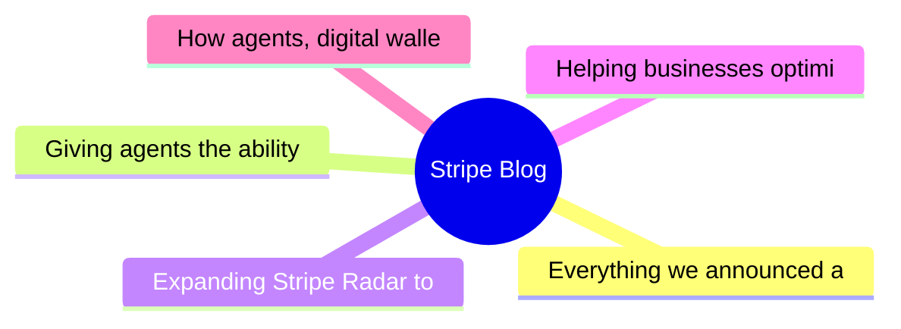

# 💳 Stripe Blog Top 5 (2026-06-09)

## 思维导图

## 列表（5 条）

### 1. Everything we announced at Sessions 2026
- **链接**: [https://stripe.com/blog/everything-we-announced-at-sessions-2026](https://stripe.com/blog/everything-we-announced-at-sessions-2026)
- **发布**: Wed, 29 Apr 2026 00:00:00 +0000
- **简介**: We’re making Stripe even more programmable; protecting and propelling your business with the strength of the Stripe network; and building economic infrastructure for AI.

### 2. Giving agents the ability to pay
- **链接**: [https://stripe.com/blog/giving-agents-the-ability-to-pay](https://stripe.com/blog/giving-agents-the-ability-to-pay)
- **发布**: Wed, 29 Apr 2026 00:00:00 +0000
- **简介**: Link’s wallet for agents gives agents programmatic access to Link, including the ability to generate a one-time-use card or Shared Payment Token (SPT) backed by the cards and bank accounts already in your wallet. It’s bu

### 3. Expanding Stripe Radar to protect more of your business
- **链接**: [https://stripe.com/blog/expanding-stripe-radar-to-protect-more-of-your-business](https://stripe.com/blog/expanding-stripe-radar-to-protect-more-of-your-business)
- **发布**: Wed, 27 May 2026 00:00:00 +0000
- **简介**: Radar now blocks high-risk transactions across all supported payment methods; defends against new fraud types like multi-account abuse and pay-as-you-go abuse, regardless of which payment processor you use; and gives pla

### 4. Helping businesses optimize network costs with the Visa Digital Commerce Authentication Program (DCAP)
- **链接**: [https://stripe.com/blog/helping-businesses-optimize-network-costs-with-visa-digital-commerce-authentication-program](https://stripe.com/blog/helping-businesses-optimize-network-costs-with-visa-digital-commerce-authentication-program)
- **发布**: Wed, 03 Jun 2026 00:00:00 +0000
- **简介**: We moved quickly to help Stripe businesses take advantage of DCAP and capture interchange savings while protecting authorization rates. Here’s what we did.

### 5. How agents, digital wallets, and trust are rewriting checkout
- **链接**: [https://stripe.com/blog/global-checkout-trends](https://stripe.com/blog/global-checkout-trends)
- **发布**: Tue, 07 Apr 2026 00:00:00 +0000
- **简介**: We analyzed checkout activity across more than 20K businesses, surveyed shoppers and ecommerce leaders, and gathered insights from businesses on the Stripe network to understand what’s changing in online conversion.
