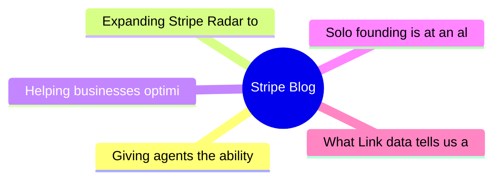

# 💳 Stripe Blog Top 5 (2026-06-20)

## 思维导图

## 列表（5 条，2 条含全文）

### 1. Giving agents the ability to pay
- **链接**: [https://stripe.com/blog/giving-agents-the-ability-to-pay](https://stripe.com/blog/giving-agents-the-ability-to-pay)
- **发布**: Wed, 29 Apr 2026 00:00:00 +0000
- **简介**: Link’s wallet for agents gives agents programmatic access to Link, including the ability to generate a one-time-use card or Shared Payment Token (SPT) backed by the cards and bank accounts already in your wallet. It’s bu

📄 全文（4021 字符，点击展开）

In the [Sessions keynote](https://stripe.com/blog/everything-we-announced-at-sessions-2026), we talked about how agents are becoming active participants in the internet economy, and how we’re building the infrastructure to support them.

Agents have become increasingly capable in recent months, but making purchases across the internet remains difficult. While [machine payments protocols](https://stripe.com/blog/machine-payments-protocol) are still gaining adoption, agents need to work with the payment options sellers and consumers use today.

Today we’re launching [Link](https://link.com/)’s wallet for agents, built on top of Stripe’s new Issuing for agents. You can now give agents programmatic access to Link and the ability to get a one-time-use card or a [Shared Payment Token](https://docs.stripe.com/agentic-commerce/concepts/shared-payment-tokens) (SPT), backed by the cards and bank accounts already in your wallet. The agent never gets access to your raw payment credentials. 

You can review and approve each spend request from the agent on the web, or in Link’s new [iOS](https://apps.apple.com/us/app/link-a-smarter-wallet/id1623228342) and [Android](https://play.google.com/store/apps/details?id=com.stripe.link.android) apps. This makes it easy for consumers to enable personal AI agents such as OpenClaw to make an authorized purchase on their behalf.

If you’re a developer or business building consumer-facing agents, such as personal assistants, Link’s wallet for agents removes the need to build wallet infrastructure from scratch. Link handles the abstraction across payment options your agent might need—like cards and SPTs (with stablecoins and other payment methods coming soon). It also takes care of fund flow complexity and helps you reach Link’s customer base of more than 200 million consumers.

## How Link’s wallet for agents works

Imagine you are building a shopping agent that recommends apparel to your consumers. First, the consumer grants your agent access to their Link wallet via a standard OAuth flow.

Once your agent has access, it can create a spend request to get either a one-time-use card or an SPT to complete the transaction. Your agent provides context on the transaction, so the person can understand and approve the request. In both card and machine-native flows, the payment credential can be scoped with controls like amount, currency, and merchant. Support for agentic tokens, stablecoins, and other payment types are coming soon.

The consumer gets a notification and approves the spend request in Link (on the web, or in the Link [iOS](https://apps.apple.com/us/app/link-a-smarter-wallet/id1623228342) or [Android](https://play.google.com/store/apps/details?id=com.stripe.link.android) app). Today, each request requires the person’s review before the credential is shared with your agent. We’re planning on expanding these controls to let people set spending limits, and choose when agents can act without additional approval.  

After approval, Link returns the one-time-use card or SPT to your agent for it to complete the purchase. The person can track agent spending and manage connected agents directly in Link.

## Stripe Issuing for agents

Link’s wallet for agents is built directly on top of Stripe’s Issuing primitives. For businesses that want to build and customize their own agentic wallets and cards, Issuing for agents gives developers access to the full set of [Issuing APIs](https://docs.stripe.com/issuing) to power agentic spending and custom financial workflows for agents and their users.

Businesses can design user-facing experiences to fit their product, including onboarding, fund flows, and spending controls. They can define when and how agents move funds, set permissions at the card level, introduce fraud controls at transaction authorization, and gain visibility into historical and real-time card activity.

Issuing for agents provides the underlying infrastructure for these experiences, from single-use

...（截断，原文 4860+ 字符）

### 2. Expanding Stripe Radar to protect more of your business
- **链接**: [https://stripe.com/blog/expanding-stripe-radar-to-protect-more-of-your-business](https://stripe.com/blog/expanding-stripe-radar-to-protect-more-of-your-business)
- **发布**: Wed, 27 May 2026 00:00:00 +0000
- **简介**: Radar now blocks high-risk transactions across all supported payment methods; defends against new fraud types like multi-account abuse and pay-as-you-go abuse, regardless of which payment processor you use; and gives pla

📄 全文（4022 字符，点击展开）

Last month at Stripe Sessions, we shared the biggest expansion we’ve ever made to [Stripe Radar](https://stripe.com/radar), our AI-powered fraud prevention tool. Radar now blocks high-risk transactions across all supported payment methods; defends against new fraud types like multi-account abuse and pay-as-you-go abuse, regardless of which payment processor you use; and gives platforms new tools to evaluate and mitigate merchant risk on and off Stripe. We also launched additional ways to fight disputes with smarter evidence and automated evidence libraries.

Here’s a closer look at what we announced.

## Protect more transactions with global payment coverage, new multiprocessor signals, and custom models

Fraud protection is getting more complex. Businesses need to defend across a range of payment methods, and they need more precision in the signals they use to catch fraud before it happens—on and off Stripe. Radar now addresses both, along with the ability to use custom fraud models.

**Block high-risk transactions across all supported global payment methods
**

Radar now protects [all supported payment volume globally](https://docs.stripe.com/radar/local-payment-methods), including bank debits, buy now, pay later (BNPL) options, crypto, digital wallets, real-time payments, and cash vouchers. When Radar detects a fraudulent pattern on a transaction, that information becomes available to protect transactions across all payment methods. For example, if a fraudulent actor uses a stolen credit card at one business on Stripe, and we detect and block it, that same IP address and device fingerprint are now flagged across bank debits, wallets, and BNPL transactions network-wide. We found that Radar reduced suspected fraud by 71% during a five-month period for businesses using Affirm, Cash App, Klarna, and PayPal. 

**Improve your fraud decisioning with new multiprocessor signals
**

Businesses use Radar’s risk signals for off-Stripe transactions to complement their in-house fraud models and make more precise fraud decisions across payment processors. Now, you can further improve your fraud decisioning with additional signals for off-Stripe transactions to help you prevent fraud before it happens.

Stripe can now identify whether a payment is [likely to trigger an early fraud warning](https://docs.stripe.com/radar/multiprocessor#early-fraud-warning) from the card network. You can then choose to proactively refund the transaction and protect your dispute rate. 

Stripe can also predict whether a payment is [likely to result in a fraudulent dispute](https://docs.stripe.com/radar/multiprocessor#fraudulent-dispute). You can use this signal to issue refunds, gather evidence, or adjust your dispute strategy. 

We plan to add new signals that can be used across your entire payments stack.

**Access enterprise-grade custom fraud models
**

For businesses with more complex risk profiles, Radar now offers [custom fraud models](https://docs.stripe.com/radar/custom-fraud-models). You can pass signals unique to your business to Stripe, such as product catalog data, loyalty status, behavioral metrics, or any structured metadata relevant to your risk profile. Stripe then combines this information with our global network data to deploy a model customized specifically to your business. For early adopters, custom models are detecting at least 15% more fraud with no increase in false positives.

## Defend against new types of fraud

Fraudulent actors have become as sophisticated at stealing compute as they are at stealing money. They abuse policies by cycling through free trials, setting up multiple accounts, or intentionally not paying their next invoice. As businesses scale AI products, token abuse has become an expensive fraud vector.

Last month, we shared how Radar addresses one of these fraud vectors with [free trial abuse prevention](https://stripe.com/blog/how-stripe-radar-helps-prevent-free-trial-abuse). At Sessions, we highlighted new ways to 

...（截断，原文 10513+ 字符）

### 3. Helping businesses optimize network costs with the Visa Digital Commerce Authentication Program (DCAP)
- **链接**: [https://stripe.com/blog/helping-businesses-optimize-network-costs-with-visa-digital-commerce-authentication-program](https://stripe.com/blog/helping-businesses-optimize-network-costs-with-visa-digital-commerce-authentication-program)
- **发布**: Wed, 03 Jun 2026 00:00:00 +0000
- **简介**: We moved quickly to help Stripe businesses take advantage of DCAP and capture interchange savings while protecting authorization rates. Here’s what we did.

### 4. Solo founding is at an all-time high: Top performers have these traits in common
- **链接**: [https://stripe.com/blog/top-solo-founder-traits](https://stripe.com/blog/top-solo-founder-traits)
- **发布**: Thu, 28 May 2026 00:00:00 +0000
- **简介**: In 2025, solo founders in the top decile generated 61 times the revenue of the median solo founder in their first six months. We analyzed the data to understand what drives that gap.

### 5. What Link data tells us about AI spending
- **链接**: [https://stripe.com/blog/what-link-data-tells-us-about-ai-spending](https://stripe.com/blog/what-link-data-tells-us-about-ai-spending)
- **发布**: Thu, 18 Jun 2026 00:00:00 +0000
- **简介**: We analyzed spending patterns across the 250 million customers paying with Link. We found that Link customers are spending more on AI than they were three months prior, investing heavily in platforms that let them build 
