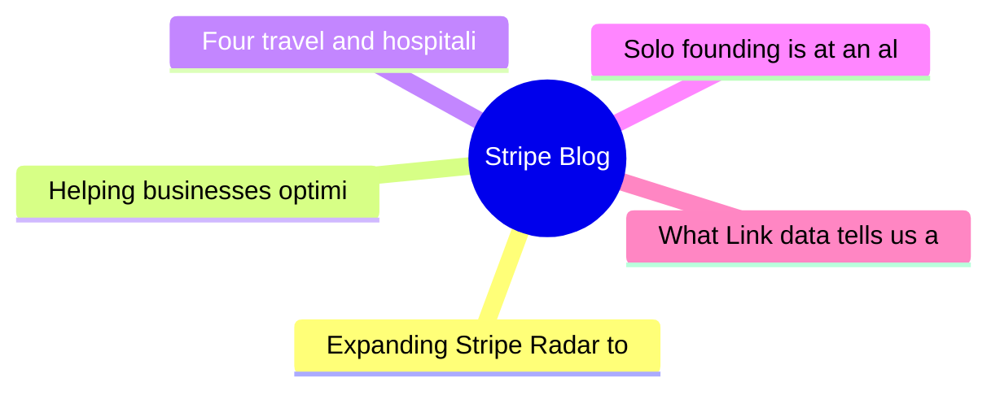

# 💳 Stripe Blog Top 5 (2026-07-14)

## 思维导图

## 列表（5 条，2 条含全文）

### 1. Expanding Stripe Radar to protect more of your business
- **链接**: [https://stripe.com/blog/expanding-stripe-radar-to-protect-more-of-your-business](https://stripe.com/blog/expanding-stripe-radar-to-protect-more-of-your-business)
- **发布**: Wed, 27 May 2026 00:00:00 +0000
- **简介**: Radar now blocks high-risk transactions across all supported payment methods; defends against new fraud types like multi-account abuse and pay-as-you-go abuse, regardless of which payment processor you use; and gives pla

📄 全文（4022 字符，点击展开）

Last month at Stripe Sessions, we shared the biggest expansion we’ve ever made to [Stripe Radar](https://stripe.com/radar), our AI-powered fraud prevention tool. Radar now blocks high-risk transactions across all supported payment methods; defends against new fraud types like multi-account abuse and pay-as-you-go abuse, regardless of which payment processor you use; and gives platforms new tools to evaluate and mitigate merchant risk on and off Stripe. We also launched additional ways to fight disputes with smarter evidence and automated evidence libraries.

Here’s a closer look at what we announced.

## Protect more transactions with global payment coverage, new multiprocessor signals, and custom models

Fraud protection is getting more complex. Businesses need to defend across a range of payment methods, and they need more precision in the signals they use to catch fraud before it happens—on and off Stripe. Radar now addresses both, along with the ability to use custom fraud models.

**Block high-risk transactions across all supported global payment methods
**

Radar now protects [all supported payment volume globally](https://docs.stripe.com/radar/local-payment-methods), including bank debits, buy now, pay later (BNPL) options, crypto, digital wallets, real-time payments, and cash vouchers. When Radar detects a fraudulent pattern on a transaction, that information becomes available to protect transactions across all payment methods. For example, if a fraudulent actor uses a stolen credit card at one business on Stripe, and we detect and block it, that same IP address and device fingerprint are now flagged across bank debits, wallets, and BNPL transactions network-wide. We found that Radar reduced suspected fraud by 71% during a five-month period for businesses using Affirm, Cash App, Klarna, and PayPal. 

**Improve your fraud decisioning with new multiprocessor signals
**

Businesses use Radar’s risk signals for off-Stripe transactions to complement their in-house fraud models and make more precise fraud decisions across payment processors. Now, you can further improve your fraud decisioning with additional signals for off-Stripe transactions to help you prevent fraud before it happens.

Stripe can now identify whether a payment is [likely to trigger an early fraud warning](https://docs.stripe.com/radar/multiprocessor#early-fraud-warning) from the card network. You can then choose to proactively refund the transaction and protect your dispute rate. 

Stripe can also predict whether a payment is [likely to result in a fraudulent dispute](https://docs.stripe.com/radar/multiprocessor#fraudulent-dispute). You can use this signal to issue refunds, gather evidence, or adjust your dispute strategy. 

We plan to add new signals that can be used across your entire payments stack.

**Access enterprise-grade custom fraud models
**

For businesses with more complex risk profiles, Radar now offers [custom fraud models](https://docs.stripe.com/radar/custom-fraud-models). You can pass signals unique to your business to Stripe, such as product catalog data, loyalty status, behavioral metrics, or any structured metadata relevant to your risk profile. Stripe then combines this information with our global network data to deploy a model customized specifically to your business. For early adopters, custom models are detecting at least 15% more fraud with no increase in false positives.

## Defend against new types of fraud

Fraudulent actors have become as sophisticated at stealing compute as they are at stealing money. They abuse policies by cycling through free trials, setting up multiple accounts, or intentionally not paying their next invoice. As businesses scale AI products, token abuse has become an expensive fraud vector.

Last month, we shared how Radar addresses one of these fraud vectors with [free trial abuse prevention](https://stripe.com/blog/how-stripe-radar-helps-prevent-free-trial-abuse). At Sessions, we highlighted new ways to 

...（截断，原文 10513+ 字符）

### 2. Helping businesses optimize network costs with the Visa Digital Commerce Authentication Program (DCAP)
- **链接**: [https://stripe.com/blog/helping-businesses-optimize-network-costs-with-visa-digital-commerce-authentication-program](https://stripe.com/blog/helping-businesses-optimize-network-costs-with-visa-digital-commerce-authentication-program)
- **发布**: Wed, 03 Jun 2026 00:00:00 +0000
- **简介**: We moved quickly to help Stripe businesses take advantage of DCAP and capture interchange savings while protecting authorization rates. Here’s what we did.

📄 全文（3169 字符，点击展开）

Visa recently launched the [Digital Commerce Authentication Program (DCAP)](https://support.stripe.com/questions/understand-the-visa-digital-commerce-authentication-program-%28dcap%29-on-stripe), a new global framework designed to reduce fraud and increase authorization rates for card-not-present transactions. The program rewards businesses in the US for sharing richer transaction data with issuers during authentication, such as device ID, billing address, IP address, and customer email. Qualifying transactions receive a net interchange reduction of five basis points.

New network programs create opportunity, but they also introduce complexity. Businesses need to understand which transactions qualify, ensure their integration passes the required data, and determine whether participating will improve their end-to-end transaction economics or have unintended consequences, such as hurting authorization rates.

To participate in DCAP, businesses need to share required cardholder data with issuers via frictionless authentication in their checkout. This might introduce latency and uncertainty around how issuers interpret these newer signals.

We moved quickly to help Stripe businesses take advantage of DCAP and capture interchange savings while protecting authorization rates. Here’s what we did.

### Optimizing DCAP savings without sacrificing conversion

Before rolling out DCAP, we worked with Visa to run readiness testing and identify the right implementation approach. This collaborative testing underscored the need for transaction-level intelligence.

With [Stripe Authorization Boost](https://stripe.com/authorization-boost), we intelligently select which transactions should go through [Data Only 3DS](https://docs.stripe.com/payments/3d-secure/strong-customer-authentication-exemptions#data-only), which sends additional risk data from the card network to the issuer for authorization. Rather than applying static rules, Authorization Boost evaluates cost savings, conversion impact, and fraud risk at the individual transaction level to determine when to apply Data Only 3DS. This allows businesses to capture DCAP savings while limiting the impact to the customer experience and optimizing authorization rates.

Since April 18, we’ve helped Stripe businesses capture $18.4 million in annualized network cost savings from DCAP. By helping businesses collect and pass the required data, we saw an 8x increase in the number of DCAP-eligible transactions. We’re continuing to work with Visa to optimize eligibility, so more transactions can benefit from DCAP.

## Automatically benefit from DCAP optimizations

If you use Authorization Boost and are collecting the required data points, you’re already automatically benefiting from DCAP optimizations. For businesses using [standalone 3DS](https://docs.stripe.com/payments/3d-secure/standalone-3d-secure), you can participate by setting **flow_preference[type]** to `data_share` on authentication requests and ensuring required fields are populated.

Learn more about how [Authorization Boost](https://docs.stripe.com/payments/analytics/optimization) can help optimize your payments performance.

### 3. Four travel and hospitality trends from HITEC 2026
- **链接**: [https://stripe.com/blog/trends-from-hitec](https://stripe.com/blog/trends-from-hitec)
- **发布**: Tue, 23 Jun 2026 00:00:00 +0000
- **简介**: More than 6,000 hospitality executives and operators gathered in San Antonio last week for the HITEC conference. The big topic: whether the industry’s AI investment is actually working. Across four days and over 50 meeti

### 4. Solo founding is at an all-time high: Top performers have these traits in common
- **链接**: [https://stripe.com/blog/top-solo-founder-traits](https://stripe.com/blog/top-solo-founder-traits)
- **发布**: Thu, 28 May 2026 00:00:00 +0000
- **简介**: In 2025, solo founders in the top decile generated 61 times the revenue of the median solo founder in their first six months. We analyzed the data to understand what drives that gap.

### 5. What Link data tells us about AI spending
- **链接**: [https://stripe.com/blog/what-link-data-tells-us-about-ai-spending](https://stripe.com/blog/what-link-data-tells-us-about-ai-spending)
- **发布**: Thu, 18 Jun 2026 00:00:00 +0000
- **简介**: We analyzed spending patterns across the 250 million customers paying with Link. We found that Link customers are spending more on AI than they were three months prior, investing heavily in platforms that let them build 
