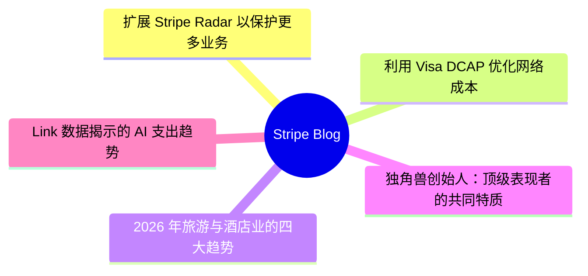
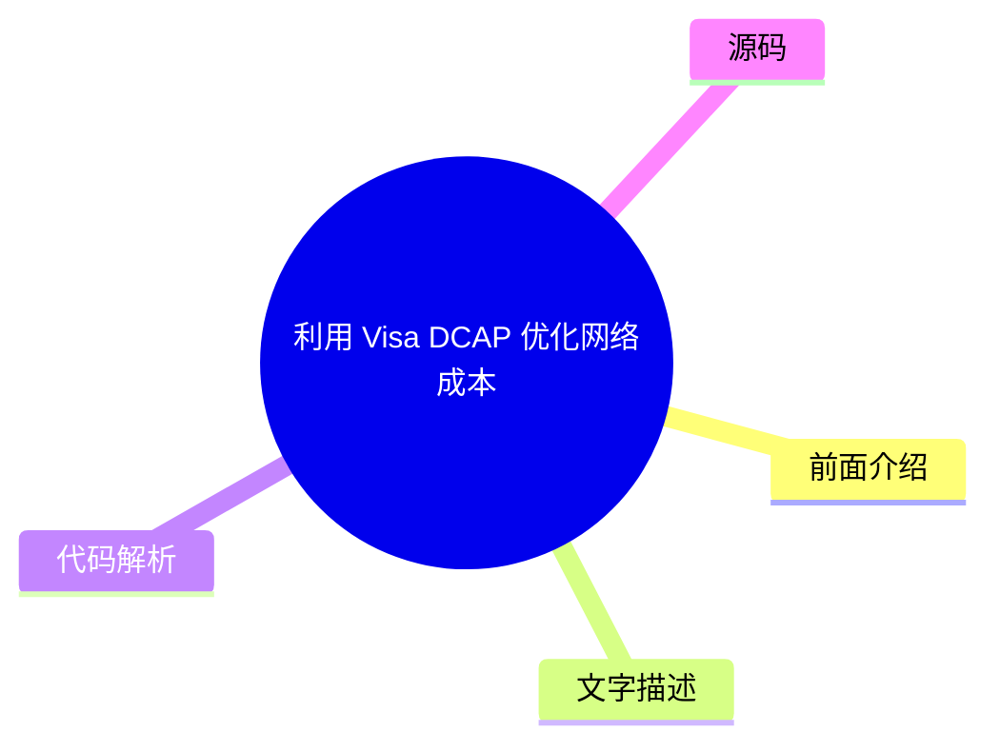
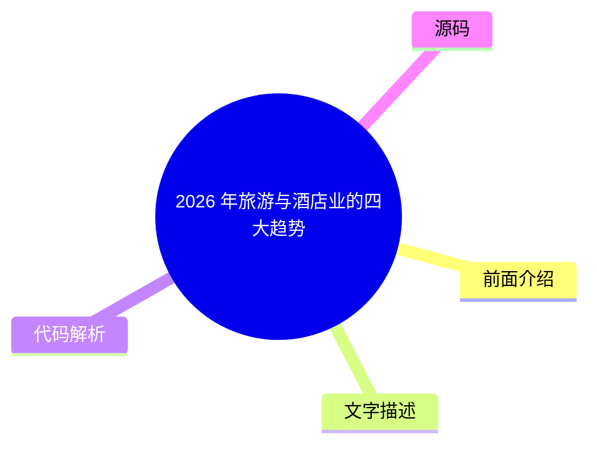
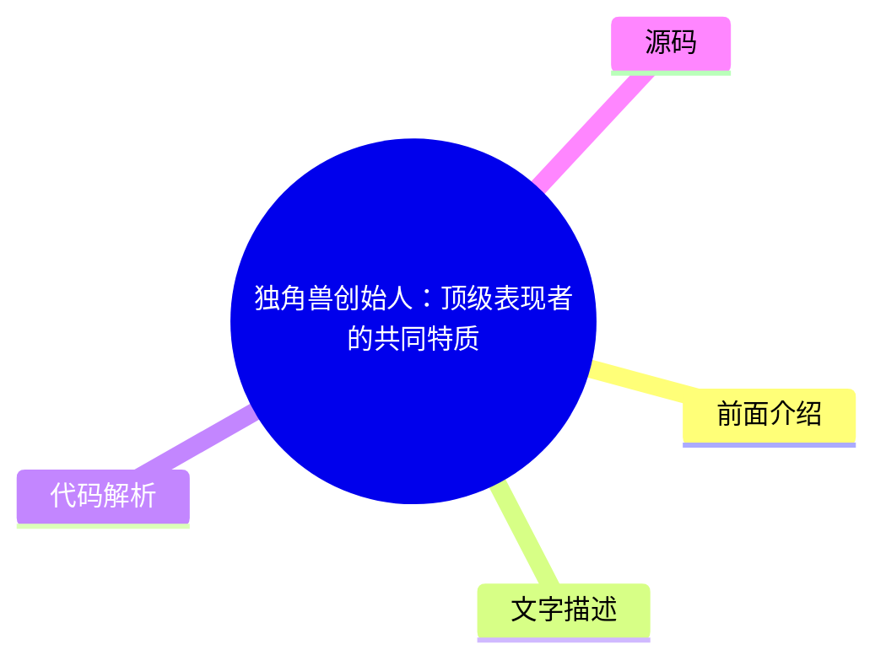

# 💳 Stripe Blog Top 5 (2026-07-18)

## 前面介绍

- 数据源：Stripe Blog
- 抓取日期：2026-07-18
- 条目数：5
- 含完整正文：5
- 含代码片段：0
- 组织方式：前面介绍 / 树状图 / 文字描述 / 代码解析 / 源码

## 思维导图

## 详细整理（5 条，5 条含全文，0 条含代码）

### 1. 扩展 Stripe Radar 以保护更多业务
- **链接**: [https://stripe.com/blog/expanding-stripe-radar-to-protect-more-of-your-business](https://stripe.com/blog/expanding-stripe-radar-to-protect-more-of-your-business)
- **发布**: Wed, 27 May 2026 00:00:00 +0000

#### 前面介绍

- Radar 现在可以拦截所有支持支付方式的高风险交易。
- 能够防御多账户滥用和按量付费滥用等新型欺诈。
- 为平台提供新的工具来评估和缓解商户风险。

#### 树状图

#### 文字描述

- Radar 现在为所有支持的全球支付方式提供保护，包括银行借记、先买后付（BNPL）、加密货币、数字钱包、实时支付和现金券。
- 当 Radar 检测到欺诈模式时，该信息可用于保护跨所有支付方式的交易。
- 新增多处理器信号功能，Stripe 可以识别支付是否可能触发卡组织的早期欺诈警告或欺诈性争议。
- 引入企业级自定义欺诈模型，允许企业传入产品目录、忠诚度状态等独特信号。
- 自定义模型在早期采用者中检测到了至少 15% 的更多欺诈，且误报率没有增加。
- 针对多账户滥用，Radar 可以实时评估每个新账户，利用设备指纹、IP 地址等网络数据进行拦截。

#### 代码解析

- 本
- 文
- 未
- 提
- 供
- 源
- 码
- ，
- 以
- 下
- 为
- 实
- 现
- 思
- 路
- 或
- 结
- 构
- 解
- 析

#### 源码

#### 中文节选

上个月在 Stripe Sessions 上，我们分享了迄今为止对 [Stripe Radar](https://stripe.com/radar)（我们的人工智能驱动的欺诈预防工具）进行的最大规模扩展。Radar 现在可以阻止所有支持的支付方式下的高风险交易；无论您使用哪个支付处理器，都能防御多账户滥用和按量付费滥用等新型欺诈；并为平台提供了新的工具，用于评估和缓解 Stripe 内外商户的风险。我们还推出了更智能的证据和自动化证据库，以帮助应对争议。

以下是我们要宣布内容的详细情况。

## 利用全球支付覆盖范围、新的多处理器信号和自定义模型保护更多交易

欺诈保护正变得越来越复杂。企业需要在多种支付方式下进行防御，并且需要在欺诈发生之前（无论是在 Stripe 上还是 Stripe 外）使用更精确的信号来捕捉欺诈。Radar 现在同时解决了这两个问题，并增加了使用自定义欺诈模型的能力。

**阻止所有支持的全球支付方式下的高风险交易**

Radar 现在保护 [全球所有支持的交易量](https://docs.stripe.com/radar/local-payment-methods)，包括银行借记、先买后付 (BNPL) 选项、加密货币、数字钱包、实时支付和现金代金券。当 Radar 检测到交易中的欺诈模式时，该信息将可用于保护所有支付方式下的交易。例如，如果欺诈行为者在 Stripe 上的某家企业使用被盗信用卡，而我们检测并阻止了该行为，那么该 IP 地址和设备指纹现在会在银行借记、钱包和 BNPL 交易网络范围内被标记。我们发现，对于使用 Affirm、Cash App、Klarna 和 PayPal 的企业，Radar 在五个月内将可疑欺诈减少了 71%。

**利用新的多处理器信号改进您的欺诈决策**

企业使用 Radar 的风险信号来处理 Stripe 以外的交易，以补充其内部欺诈模型，并在各个支付处理商处做出更精准的欺诈决策。现在，您可以通过为 Stripe 以外的交易添加更多信号来进一步改善欺诈决策，从而帮助您在欺诈发生前加以预防。

Stripe 现在可以识别支付是否可能触发卡组织的[早期欺诈警告](https://docs.stripe.com/radar/multiprocessor#early-fraud-warning)。然后，您可以选择主动退款交易，以保护您的拒付率。

Stripe 还可以预测支付是否可能导致[欺诈性拒付](https://docs.stripe.com/radar/multiprocessor#fraudulent-dispute)。您可以使用此信号来发起退款、收集证据或调整您的拒付策略。

我们计划添加可用于您整个支付体系的新信号。

**访问企业级自定义欺诈模型**

对于风险概况更复杂的企业，Radar 现在提供[自定义欺诈模型](https://docs.stripe.com/radar/custom-

#### 完整正文（中文）

上个月在 Stripe Sessions 上，我们分享了迄今为止对 [Stripe Radar](https://stripe.com/radar)（我们的人工智能驱动的欺诈预防工具）进行的最大规模扩展。Radar 现在可以阻止所有支持的支付方式下的高风险交易；无论您使用哪个支付处理器，都能防御多账户滥用和按量付费滥用等新型欺诈；并为平台提供了新的工具，用于评估和缓解 Stripe 内外商户的风险。我们还推出了更智能的证据和自动化证据库，以帮助应对争议。

以下是我们要宣布内容的详细情况。

## 利用全球支付覆盖范围、新的多处理器信号和自定义模型保护更多交易

欺诈保护正变得越来越复杂。企业需要在多种支付方式下进行防御，并且需要在欺诈发生之前（无论是在 Stripe 上还是 Stripe 外）使用更精确的信号来捕捉欺诈。Radar 现在同时解决了这两个问题，并增加了使用自定义欺诈模型的能力。

**阻止所有支持的全球支付方式下的高风险交易**

Radar 现在保护 [全球所有支持的交易量](https://docs.stripe.com/radar/local-payment-methods)，包括银行借记、先买后付 (BNPL) 选项、加密货币、数字钱包、实时支付和现金代金券。当 Radar 检测到交易中的欺诈模式时，该信息将可用于保护所有支付方式下的交易。例如，如果欺诈行为者在 Stripe 上的某家企业使用被盗信用卡，而我们检测并阻止了该行为，那么该 IP 地址和设备指纹现在会在银行借记、钱包和 BNPL 交易网络范围内被标记。我们发现，对于使用 Affirm、Cash App、Klarna 和 PayPal 的企业，Radar 在五个月内将可疑欺诈减少了 71%。

**利用新的多处理器信号改进您的欺诈决策**

企业使用 Radar 的风险信号来处理 Stripe 以外的交易，以补充其内部欺诈模型，并在各个支付处理商处做出更精确的欺诈决策。现在，您可以通过针对 Stripe 以外交易的额外信号进一步改进欺诈决策，帮助您在欺诈发生前加以防范。

Stripe 现在可以识别付款是否可能触发卡组织的[早期欺诈警告](https://docs.stripe.com/radar/multiprocessor#early-fraud-warning)。然后，您可以选择主动退款交易，以保护您的拒付率。

Stripe 还可以预测付款是否可能导致[欺诈性拒付](https://docs.stripe.com/radar/multiprocessor#fraudulent-dispute)。您可以使用此信号来发起退款、收集证据或调整您的拒付策略。

我们计划添加可在您整个支付系统中使用的新信号。

**访问企业级自定义欺诈模型**

对于风险概况更复杂的企业，Radar 现在提供[自定义欺诈模型](https://docs.stripe.com/radar/custom-fraud-models)。您可以将您业务独有的信号传递给 Stripe，例如产品目录数据、忠诚度状态、行为指标或任何与您的风险概况相关的结构化元数据。Stripe 然后将此信息与我们全球网络数据相结合，部署专门针对您业务定制的模型。对于早期采用者，自定义模型在不增加误报的情况下，至少能多检测出 15% 的欺诈。

## 防范新型欺诈

欺诈行为者在窃取资金方面的手段与窃取计算资源一样老练。他们通过循环使用免费试用、开设多个账户或故意不支付下一张账单来滥用政策。随着企业扩展 AI 产品，令牌滥用已成为一种昂贵的欺诈手段。

上个月，我们分享了 Radar 如何通过[防止免费试用滥用](https://stripe.com/blog/how-stripe-radar-helps-prevent-free-trial-abuse)来应对这些欺诈手段之一。在 Sessions 上，我们重点介绍了保护您的业务免受多账户滥用、按量付费欺诈和欺诈机器人驱动付款侵害的新方法。

**阻止多账户滥用**

多账户滥用是指单个欺诈行为人创建多个账户，以重复使用促销优惠券，或将被盗卡交易分散到多个账户中，从而延长逃避检测的时间。在整个 Stripe 网络中，每六家 AI 公司的注册用户中就有一家与多账户滥用有关。

现在，Radar 可以[实时评估每个新账户](https://docs.stripe.com/radar/multi-account-and-account-sharing-abuse#multi-account-abuse)，以便在滥用行为发生之前阻止可疑账户——无论是在 Stripe 内部还是外部。我们的解决方案利用了整个 Stripe 网络中过往滥用行为的信息，包括设备指纹、IP 地址、电子邮件域名等。在过去的两个月里，ElevenLabs 每天成功阻止了 2,000 名用户滥用其免费层级。

**预测按量付费滥用**

按量付费滥用是指客户通过大量使用服务来累积费用，但在账单到期时没有付款意图。这些不良行为者利用了基于消费的定价结构，即费用在计费周期内累积，但付款发生在之后。例如，客户可能在一个月内消耗数千美元的计算资源，在月底被计费，然后永远不付款。

Radar 现在可以帮助[在费用累积时预测未付款滥用](https://docs.stripe.com/radar/pay-as-you-go-abuse)，从而允许您在向客户计费之前进行干预。这使您能够要求充值、切断服务，或采取任何符合您风险承受能力的措施。

**检测并防止欺诈机器人驱动的支付**

随着代理商务的扩展，区分代表客户行事的合法代理和恶意机器人变得越来越重要。两者都是进行购买的非人类流量，但一个是客户授权的代理，另一个可能会利用您的结账流程购买库存有限的商品、滥用促销定价或绕过购买限制。

Radar 现在为 Stripe Checkout 上的支付分配了机器人评分，评估其是否由[恶意机器人发起](https://docs.stripe.com/radar/bot-abuse)的可能性。您可以使用此评分来执行反脚本或反机器人策略。例如，您可以阻止限量商品的自动购买，或将高频率订单标记为待审核。

## 保护您的平台免受账户欺诈

欺诈行为者正在使用生成式 AI 创建虚假身份、文件和网站，这些内容足以绕过许多平台的验证系统。平台面临一个权衡：在入职流程中要求提供更多信息并增加摩擦，还是保持入职流程轻量级并承担潜在的重大风险。

[平台现在可以利用 Radar 降低业务风险](https://docs.stripe.com/radar/radar-for-platforms)，其功能包括为每个业务和交易提供 0 到 100 的欺诈评分；解释为何账户被标记的 AI 驱动洞察；用于帮助团队了解账户背景的备注和账户历史记录；以及针对争议、拒付、退款和支付的账户级指标。

我们还推出了三种新方式，供平台监控和评估商户风险，包括在 Stripe 内部和外部。

- [欺诈网站](https://docs.stripe.com/radar/fraudulent-website)信号会像人类欺诈分析师一样分析企业的网站，寻找诸如奢侈品以不切实际的价格出售、AI 生成的文案、拼写错误的品牌 URL 或其他表明网站存在欺诈的迹象等危险信号。平台可以在入职流程期间使用此信号来自动验证、标记账户以进行人工审核，或在批准业务之前将其作为自身风险评分的输入。
- [欺诈商户](https://docs.stripe.com/radar/fraudulent-merchant)信号根据对 Stripe 网络内模式的分析（包括银行账户信息、业务详情、交易活动和争议），确定新账户或现有账户是否存在欺诈风险。然后，平台可以发起审核、暂停付款、暂停提现、拒绝账户、设置储备金或要求身份验证。

- [商户拖欠风险](https://docs.stripe.com/radar/merchant-delinquency-risk)信号预测企业是否面临产生负余额的风险；具体而言，它预测该余额是否可能持续保持负值 60 天或更久。平台可利用此信号来决定是否主动调整结算时间表、对高风险账户要求预留金，或在损失累积之前标记商户以进行更深入的审查。

## 利用更智能的证据和自动化证据库更有效地应对争议

[智能争议](https://docs.stripe.com/disputes/smart-disputes)是我们基于 AI 的争议管理产品，一直以来都会代表您整理并提交证据。现在，智能争议可以制定更定制化的策略，以提高您赢得每起争议的几率。

智能争议会分析每起争议，并为特定证据字段（如追踪号码或客户使用日志）提供 [AI 驱动的建议](https://docs.stripe.com/disputes/set-up-smart-disputes#provide-more-data-at-dispute-time)。通过智能争议添加我们 AI 推荐证据的企业，其胜诉频率比未添加任何证据的企业高出 3 倍。

我们还在减少提交证据所需的人工工作量。许多争议需要相同的支持材料：条款和条件、退货政策和服务协议。借助证据库，您只需上传并存储这些文档一次，智能争议便会根据争议原因代码、网络要求和持卡人主张，自动选择并将它们包含在您的证据包中——无需手动重新提交。

## 接下来是什么

在 Sessions 上，我们还发布了 [我们的公开路线图](https://stripe.com/roadmap)：一份包含数百个详细条目的清单，涵盖 2027 年第一季度，其中包括 [Radar 产品、功能和改进](https://stripe.com/roadmap?product=Radar)。

想了解更多 Radar 如何保护您的业务，请加入我们在全球主要城市举办的 [Stripe Tour 2026](https://stripetour.com/)。您也可以 [阅读我们的文档](https://docs.stripe.com/radar) 或 [联系我们的专家团队](https://stripe.com/contact/sales)。

### 2. 利用 Visa DCAP 优化网络成本
- **链接**: [https://stripe.com/blog/helping-businesses-optimize-network-costs-with-visa-digital-commerce-authentication-program](https://stripe.com/blog/helping-businesses-optimize-network-costs-with-visa-digital-commerce-authentication-program)
- **发布**: Wed, 03 Jun 2026 00:00:00 +0000

#### 前面介绍

- Visa 推出了数字商务认证计划（DCAP）以减少欺诈并提高授权率。
- Stripe 通过智能选择交易来帮助企业捕获 DCAP 节省的交换费用。
- 自 4 月 18 日起，已帮助客户捕获了 1840 万美元的年度化网络成本节省。

#### 树状图

#### 文字描述

- DCAP 奖励企业通过无摩擦认证向发卡机构分享更丰富的交易数据，如设备 ID、账单地址等。
- 符合条件的交易可获得 5 个基点的净交换费减免。
- 使用 Stripe Authorization Boost 智能选择哪些交易应通过 Data Only 3DS 进行认证。
- Authorization Boost 在交易级别评估成本节省、转化影响和欺诈风险，而非使用静态规则。
- 通过帮助客户收集和传递所需数据，DCAP 合格交易数量增加了 8 倍。

#### 代码解析

- 本
- 文
- 未
- 提
- 供
- 源
- 码
- ，
- 以
- 下
- 为
- 实
- 现
- 思
- 路
- 或
- 结
- 构
- 解
- 析

#### 源码

#### 中文节选

Visa 最近推出了 [数字商务认证计划 (DCAP)](https://support.stripe.com/questions/understand-the-visa-digital-commerce-authentication-program-%28dcap%29-on-stripe)，这是一个旨在减少欺诈并提高非接触式交易授权率的新全球框架。该计划奖励美国企业在与发卡行进行认证时分享更丰富的交易数据，例如设备 ID、账单地址、IP 地址和客户电子邮件。符合条件的交易可获得 5 个基点的净交换费减免。

新的网络计划带来了机遇，但也引入了复杂性。企业需要了解哪些交易符合资格，确保其集成传递了所需数据，并确定参与是否有助于改善其端到端交易经济状况，或者是否会产生意想不到的后果，例如损害授权率。

要参与 DCAP，企业需要通过结账流程中的无摩擦认证与发卡行共享所需的持卡人数据。这可能会引入延迟，并导致发卡行对如何解读这些较新的信号产生不确定性。

我们迅速采取行动，帮助 Stripe 企业参与 DCAP，在保护授权率的同时获取交换费节省。以下是我们的做法。

### 在不牺牲转化率的情况下优化 DCAP 节省

在推出 DCAP 之前，我们与 Visa 合作进行了就绪性测试，并确定了正确的实施方法。这种协作测试强调了交易级智能的必要性。

使用 [Stripe Authorization Boost](https://stripe.com/authorization-boost)，我们会智能选择哪些交易应该通过 [Data Only 3DS](https://docs.stripe.com/payments/3d-secure/strong-customer-authentication-exemptions#data-only)，该流程会从卡组织向发卡行发送额外的风险数据。Authorization Boost 不会应用静态规则，而是在交易层面评估成本节约、转化影响和欺诈风险，以确定何时应用 Data Only 3DS。这使企业能够在限制对客户体验的影响的同时，捕获 DCAP 节省，并优化授权率。

自 4 月 18 日起，我们已帮助 Stripe 企业从 DCAP 中捕获了 1840 万美元的年度化网络成本节约。通过帮助企业收集和传递所需数据，我们观察到符合 DCAP 条件的交易数量增加了 8 倍。我们正在继续与 Visa 合作优化资格条件，以便更多交易能够受益于 DCAP。

## 自动受益于 DCAP 优化

如果您使用 Authorization Boost 并正在收集所需的数据点，您已经自动受益于 DCAP 优化。对于使用 [standalone 3DS](https://docs.stripe.com/payments/3d-secure/standalone-3d-secure) 的企业，您可以通过在认证请求上将 **flow_preference[type]** 设置为 `data_share` 并确保 require

#### 完整正文（中文）

Visa 最近推出了 [数字商务认证计划 (DCAP)](https://support.stripe.com/questions/understand-the-visa-digital-commerce-authentication-program-%28dcap%29-on-stripe)，这是一个旨在减少欺诈并提高非接触式交易授权率的新全球框架。该计划奖励美国企业在与发卡行进行认证时分享更丰富的交易数据，例如设备 ID、账单地址、IP 地址和客户电子邮件。符合条件的交易可获得 5 个基点的净交换费减免。

新的网络计划带来了机遇，但也引入了复杂性。企业需要了解哪些交易符合资格，确保其集成传递了所需数据，并确定参与是否有助于改善其端到端交易经济状况，或者是否会产生意想不到的后果，例如损害授权率。

要参与 DCAP，企业需要通过结账流程中的无摩擦认证与发卡行共享所需的持卡人数据。这可能会引入延迟，并导致发卡行对如何解读这些较新的信号产生不确定性。

我们迅速采取行动，帮助 Stripe 企业参与 DCAP，在保护授权率的同时获取交换费节省。以下是我们的做法。

### 在不牺牲转化率的情况下优化 DCAP 节省

在推出 DCAP 之前，我们与 Visa 合作进行了就绪性测试，并确定了正确的实施方法。这种协作测试强调了交易级智能的必要性。

通过 [Stripe Authorization Boost](https://stripe.com/authorization-boost)，我们会智能选择哪些交易应通过 [Data Only 3DS](https://docs.stripe.com/payments/3d-secure/strong-customer-authentication-exemptions#data-only)，该流程会从卡组织向发卡行发送额外的风险数据。Authorization Boost 不会应用静态规则，而是在交易层面评估成本节约、转化影响和欺诈风险，以确定何时应用 Data Only 3DS。这使企业能够在限制对客户体验的影响并优化授权率的同时，捕获 DCAP 节省。

自 4 月 18 日以来，我们已经帮助 Stripe 企业从 DCAP 中获得了 1840 万美元的年度化网络成本节约。通过帮助企业收集和传递所需数据，我们观察到符合 DCAP 条件的交易数量增加了 8 倍。我们正在继续与 Visa 合作优化资格条件，以便更多交易能够受益于 DCAP。

## 自动受益于 DCAP 优化

如果您使用 Authorization Boost 并正在收集所需的数据点，您已经自动受益于 DCAP 优化。对于使用 [standalone 3DS](https://docs.stripe.com/payments/3d-secure/standalone-3d-secure) 的企业，您可以通过在认证请求上将 **flow_preference[type]** 设置为 `data_share` 并确保填写了必填字段来参与其中。

了解更多关于 [Authorization Boost](https://docs.stripe.com/payments/analytics/optimization) 如何帮助优化您的支付表现。

### 3. 2026 年旅游与酒店业的四大趋势
- **链接**: [https://stripe.com/blog/trends-from-hitec](https://stripe.com/blog/trends-from-hitec)
- **发布**: Tue, 23 Jun 2026 00:00:00 +0000

#### 前面介绍

- AI 投资的实际效果成为行业关注焦点，但许多企业仍缺乏必要的数字基础设施。
- 直接预订的竞争已从搜索引擎排名转向 AI 回答。
- 大多数酒店 AI 应用因数据碎片化而表现不佳，缺乏战略清晰度和数据基础。

#### 树状图

#### 文字描述

- IDC 预测到 2030 年，30% 的旅行预订将由 AI 代理完成。
- 65% 的触发 AI 概览的 Google 搜索最终没有点击任何网站，移动端比例高达 78%。
- AI 包含要求结构化数据（如房型、设施、政策）的准确性和机器可读性，而非关键词密度。
- 超过 90% 的住宿网站对 AI 模型仍不可见，这可能导致错失预订。
- AI 代理正在改变旅行行为，56% 的旅行者在过去 12 个月内使用过 AI 进行行程规划。
- 许多酒店缺乏现代财务基础设施，导致支付系统效率低下，影响客户留存。

#### 代码解析

- 本
- 文
- 未
- 提
- 供
- 源
- 码
- ，
- 以
- 下
- 为
- 实
- 现
- 思
- 路
- 或
- 结
- 构
- 解
- 析

#### 源码

#### 中文节选

超过 6,000 名酒店高管和经营者上周齐聚圣安东尼奥，参加年度 HITEC 酒店技术会议，其中包括万豪酒店度假村、凯悦、洲际酒店集团、喜达屋酒店以及数百家独立物业的领导者。

核心议题：行业的人工智能投资是否真的有效。IDC 预测，到 2030 年，30% 的所有旅行预订将由人工智能代理完成。但行业的发展方向与当前具备的支持能力之间存在巨大差距。

根据 BCG 的数据，25% 的酒店企业报告目前正在积极扩展人工智能，但不到 10% 的企业被认为是“AI 未来构建型”——这意味着它们已将人工智能嵌入核心运营、拥有支持性的数据基础，并取得了可衡量的回报。“许多公司只是在盲目尝试，看能不能行得通，”佛罗里达国际大学酒店技术副教授 Dale Gomez 说。“他们想要看到投资回报率。”

其他变革已经展开。许多酒店企业仍缺乏现代金融基础设施，无法充分受益于人工智能预期带来的自动化、速度和互操作性。曾经被认为是“足够好”的支付系统现在正在造成可衡量的收入损失，而不断上升的客人期望已将低效的技术从一个小麻烦变成了不再回头的原因。

在四天的时间里，举行了 50 多次会议，四个趋势脱颖而出。

## 直接预订的竞争已从搜索排名转向 AI 回答

多年来，酒店行业应对在线旅行社（OTA）依赖症的答案是 SEO：投资内容、提高搜索排名，并在客人最终出现在 Expedia 或 Booking.com 之前将其转化。这种方法正变得越来越无效。

Salesforce 的首席解决方案工程师 Jack Wang 提供的数据凸显了一种转变：现在，65% 触发 AI 概览的 Google 搜索最终都没有用户点击任何网站。在移动端，这一数字上升至 78%。随着 AI 生成的摘要取代了 SEO 旨在赢得的排名链接列表，传统搜索流量在整个行业范围内下降了约 25%。

被 AI 生成的答案收录需要与 SEO 奖励的内容有所不同。SEO 响应的是关键词密度、反向链接和页面权威性。AI 收录响应的是结构化属性数据的准确性和机器可读性，如房型、设施详情、政策、本地背景或取消条款。一家酒店可能在传统搜索中排名靠前，但对大语言模型却不可见：超过 [90%](https://www.nokumo.net/en/ai-visibility-in-hospitality-what-3-600-ai-responses-and-1-337-website-audits-reveal?utm_campaign=ennismore-proves-tech-investment-pays-off-and-94-of-hotels-are-invisible-to-ai) 的住宿

#### 完整正文（中文）

超过 6,000 名酒店高管和经营者上周齐聚圣安东尼奥，参加年度 HITEC 酒店技术会议，其中包括万豪酒店度假村、凯悦、洲际酒店集团、喜达屋酒店以及数百家独立物业的领导者。

核心议题：行业的人工智能投资是否真的有效。IDC 预测，到 2030 年，30% 的所有旅行预订将由人工智能代理完成。但行业的发展方向与当前具备的支持能力之间存在巨大差距。

根据 BCG 的数据，25% 的酒店企业报告目前正在积极扩展人工智能，但不到 10% 的企业被认为是“AI 未来构建型”——这意味着它们已将人工智能嵌入核心运营、拥有支持性的数据基础，并取得了可衡量的回报。“许多公司只是在盲目尝试，看能不能行得通，”佛罗里达国际大学酒店技术副教授 Dale Gomez 说。“他们想要看到投资回报率。”

其他变革已经展开。许多酒店企业仍缺乏现代金融基础设施，无法充分受益于人工智能预期带来的自动化、速度和互操作性。曾经被认为是“足够好”的支付系统现在正在造成可衡量的收入损失，而不断上升的客人期望已将低效的技术从一个小麻烦变成了不再回头的原因。

在四天的时间里，举行了 50 多次会议，四个趋势脱颖而出。

## 直接预订的竞争已从搜索排名转向 AI 回答

多年来，酒店行业应对在线旅行社（OTA）依赖症的答案是 SEO：投资内容、提高搜索排名，并在客人最终出现在 Expedia 或 Booking.com 之前将其转化。这种方法正变得越来越无效。

Salesforce 的首席解决方案工程师 Jack Wang 提供的数据凸显了这一转变：现在，65% 触发 AI 概览的谷歌搜索最终都没有用户点击任何网站。在移动端，这一数字上升至 78%。随着 AI 生成的摘要取代了 SEO 旨在赢得的排名链接列表，传统搜索流量在整个行业下降了约 25%。

被 AI 生成的答案收录需要与 SEO 奖励的内容有所不同。SEO 响应的是关键词密度、反向链接和页面权威性。AI 收录响应的是结构化属性数据的准确性和机器可读性，如房型、设施详情、政策、本地背景或取消条款。一家酒店可能在传统搜索中排名很高，但对 LLM 来说却是不可见的：超过 [90%](https://www.nokumo.net/en/ai-visibility-in-hospitality-what-3-600-ai-responses-and-1-337-website-audits-reveal?utm_campaign=ennismore-proves-tech-investment-pays-off-and-94-of-hotels-are-invisible-to-ai) 的住宿网站仍被 AI 模型遗漏。

我们已经看到了下游效应。根据 Phocuswright 的研究，[56%](https://www.phocuswire.com/news/online/shift-travel-behavior-ai-surge-phocuswright-research) 的旅行者在过去 12 个月中曾使用 AI 进行行程规划、预订或在目的地提供协助。对于运营商来说，第一步是审计，而不是投资。潜在客人使用的 LLM 能否准确描述您酒店的房型、设施、政策和本地背景？如果答案是否定的，这个差距很可能会让您损失预订。

如今，酒店集团可以像 OTA 一样使用结账和支付工具，包括本地支付方式和货币、一键结账以及全球欺诈保护。捕捉代理需求的旅游品牌正在将 AI 驱动的可发现性与准确的实时库存以及能够高效转化需求的现代化结账体验相结合。

## 大多数酒店业 AI 都以可预测的方式未能达标

HITEC 期间反复出现了一个令人不安的事实：酒店业正在发生的许多 AI 扩展都是脆弱的。大多数企业都在采用 AI，却缺乏维持其发展的战略清晰度、数据基础和运营架构。

根本原因通常是数据碎片化。孤立的物业管理系统、CRM、忠诚度、餐饮和支付系统各自只掌握了关于同一客人的部分信息，而 AI 推荐的准确性仅取决于其使用的内容。导致 AI 个性化失效的同一数据问题，在财务上表现为过长的对账时间，在运营上表现为不完整的客人档案，在客人体验上则表现为摩擦。

Salesforce 首席解决方案工程师 Amanda Sharp 将这一问题重构为 AI 运营化，而非采用，并呼吁进行“氛围运营”：这是酒店业对“氛围编码”的回应。如今，许多酒店品牌都能构建 AI 功能。但在生产环境中可靠地运行它们，并将其集成到触发实际操作的真正工作流程中，则要困难得多。

在这方面做得好的企业拥有干净且连接良好的数据，能够在采取行动的时机内，将有用的情报直接传递到工作流程中。例如，达美航空在其移动应用中内置了实时 AI 礼宾，利用 SkyMiles 档案和运营数据，在客户关怀体验中提供上下文感知的支持。在 Wynn 拉斯维加斯，当业绩低于目标时，收益经理会收到预测性警报以及附带的建议行动。

对于大多数旅游运营商来说，瓶颈在于数据连接，而非模型质量。

## 支付摩擦具有可衡量的成本，但大多数酒店仍不知道其具体金额

酒店业历史上一直将支付视为一种成本和商品：需要维持运转、尽量减少费用，并尽量不碍事。我们在 HITEC 会议上进行的许多支付相关讨论，都围绕着这种观念的转变，以及人们日益认识到支付已成为酒店品牌竞争的关键因素。我们的数据也支持这一观点：在 Stripe 委托的一项针对近 400 名酒店高管进行的调查中，90% 的人表示支付对增长很重要，37% 的人表示缺乏支付选项对客人体验产生最大的负面影响。此外，58% 的人表示他们的欺诈系统会拦截合法交易，74% 的人报告称，碎片化的系统导致团队在对账上花费过多时间。

这些数据凸显了支付为何已成为一种结构性优势。在线旅行社（OTA）之所以能够负担得起大规模的支付团队，是因为其收入证明了雇佣人员的合理性。独立酒店和较小的运营商无法直接匹配这种投资，但一支精干的团队配合正确的基础设施，现在可以以远低于大型内部运营的成本，支持数十个国家的支付方式。

覆盖范围的缺失直接导致预订流失。“一旦我们不再支持[某种支付方式]，客人就会立刻转向其他支持其首选支付方式的平台或渠道，”Cloudbeds 战略合作伙伴副总裁 Sebastien Leitner 说。客人在其首选支付方式适用的地方预订。一家不支持目标市场主流支付方式的酒店，不仅是在制造摩擦——它实际上是将预订分流到了支持该方式的 OTA 那里。

## 最好的酒店技术是那种不被注意到的技术

“对于那些无法正常工作的技术，人们没有任何同理心，”Oracle Hospitality 全球战略与产品管理副总裁 Tanya Pratt 说道。“如果它无法工作，它造成的挫败感将比前台排长队更严重，因为人们对后者已经习以为常。”当技术失效时，客人并不总是会投诉。他们只是不再回来。

真正的成功衡量标准在于，技术运作得足够好，以至于客人根本不会去想它。喜达屋酒店（Starwood Hotels）的首席信息官 Denise Walker 描述了这一愿景：一位回头客抵达房间时，温度适宜，电视上播放着他们偏好的频道，床上的枕头也符合他们喜欢的硬度。没有人会解释他们是如何知道的。“它不需要以一种‘你怎么知道这些？’的方式呈现。”

拉斯维加斯 Resorts World 的酒店运营副总裁 Shannon McCallum 进一步说道：“我们正从‘我告诉了你这些，所以你知道关于我的事’转变为‘我什么都没告诉你，而你现在却预测到了’。”

无论是这种看不见的个性化，还是它所支持的人性化时刻，都需要一个连接数据的基础——即能够整合现有技术栈、将客人信息整合到单一系统中的技术。这种基础设施使企业能够在客人浏览网站或站在前台时识别出同一位客人。

## Stripe 如何提供帮助

越来越多的客人将通过 AI 助手而不是搜索引擎发现您的物业。他们预订的行程可能由代理完成。而区分高绩效运营商的收入将来自于能够实现转化的支付体验、覆盖所有市场的支付方式以及协同工作的财务系统。Stripe 数据管道将支付数据与您的预订和客户系统连接起来，为运营商提供统一的收入视图，而无需拼接式的报告。

Stripe 的支付基础设施帮助酒店运营商保护收入、提升客人在店内的消费支出，并简化运营。

**获取直接预订。** 在客人实际使用的各种支付方式上，以及在您服务的每个市场中，能够促成转化的支付体验都有助于将预订保留在您的直接渠道上。随着代理商务务的扩展，这意味着默认在每笔 Stripe 交易上运行的欺诈检测，以及允许代理在不暴露客人凭证的情况下进行交易的支付令牌。

**增加行程消费。** 来自餐饮、体验和合作伙伴的辅助收入需要能够在整个物业范围内运作的支付基础设施，支持新的商业模式，并与外部合作伙伴连接。Stripe Billing 处理会员和忠诚度计划背后的定期支付逻辑，包括自动续费、分级定价和失败支付恢复——无需运营商自行维护该基础设施。例如，[Cloudbeds](https://stripe.com/customers/cloudbeds) 发现，使用 Cloudbeds Payments 的企业收入增长了 15%，而通过其 Stripe 合作伙伴关系直接消除支付摩擦、扩展支付方式的企业，收入平均增加了 14.8%。

**降低成本。** 更高效的 B2B 资金流动和欺诈保护减少了对账工作并限制了损失，从而在不增加人员的情况下释放利润空间。

[了解更多](https://stripe.com/industries/travel) 关于 Stripe 如何支持酒店业务，或 [联系我们](https://stripe.com/contact/sales)。

### 4. 独角兽创始人：顶级表现者的共同特质
- **链接**: [https://stripe.com/blog/top-solo-founder-traits](https://stripe.com/blog/top-solo-founder-traits)
- **发布**: Thu, 28 May 2026 00:00:00 +0000

#### 前面介绍

- 2025 年顶级独角兽创始人在前六个月产生的收入是中位数的 61 倍。
- AI 原生产品是顶级独角兽创始人的显著特征。
- 他们从启动之初就面向全球销售，且更倾向于构建 B2B 业务。

#### 树状图

#### 文字描述

- 通过 Stripe Atlas 注册的 C 公司中，63% 是由没有联合创始人的个人创立的，创历史新高。
- 顶级独角兽创始人在前六个月产生的收入比中位数高出 61 倍，而中位数收入下降了 23%。
- 顶级独角兽创始人构建 AI 原生产品的可能性是中位数创始人的两倍。
- 到第 24 个月，AI 原生初创公司的收入几乎是其他独角兽初创公司的两倍。
- 顶级独角兽创始人在第一个月平均向 10 个国家销售，而中位数仅为 3 个。
- 到第 24 个月，顶级独角兽创始人平均向 40 个非美国国家销售，而中位数仅为 6 个。
- 国际销售占顶级独角兽创始人收入的 51%，而中位数仅为 2%。
- 顶级独角兽创始人构建 B2B 企业的可能性比中位数高出近 30%。
- 到第 24 个月，中位数独角兽 B2B 创始人的收入是 B2C 创始人的四倍以上。
- 顶级独角兽 B2B 创始人的收入几乎是 B2C 同行的两倍。
- 顶级独角兽创始人在第一个月保留了近 30% 的客户，而中位数仅为 8%。

#### 代码解析

- 本
- 文
- 未
- 提
- 供
- 源
- 码
- ，
- 以
- 下
- 为
- 实
- 现
- 思
- 路
- 或
- 结
- 构
- 解
- 析

#### 源码

#### 中文节选

Solo startup founders, defined here as people who launched a startup through Stripe Atlas without any cofounders, account for 63% of C corps formed so far in the second quarter of 2026—an all-time high.

As more founders start companies on their own, the gap between typical companies and top performers is widening. Among solo-founded startups incorporated through Atlas, median initial six-month revenue in 2025 was down 23% year over year, while revenue at the top decile was up 19%.

Four years ago, top-decile solo founders made about 34 times the revenue of the median solo founder in their first six months. In 2025, that figure had grown to 61 times. The number of solopreneurs earning over $100,000 per year has [increased a third](https://x.com/emilygsands/status/2049943675485253640) since 2022. 

As AI tools make it easier for one person to build, ship, support customers, and iterate, it’s worth asking what separates the companies that break out from those that don’t. To understand this divide, we analyzed thousands of solo-founded Atlas startups incorporated in 2022 and 2023, each with at least two years of revenue data. Within that group, we compared middle-decile solo founders with those in the top decile by total revenue in their first two years to understand what differentiates the strongest outliers. A few patterns among the top decile stood out.

## 1. They build AI-native products

The most successful solo founders are building AI-native products, meaning the product’s core functionality depends on AI models. Top-decile solo founders were about twice as likely as median founders to be building AI-native companies. The next generation of solo founders will be less defined by technical pedigree and more by speed,” says [Marc Lou](https://marclou.com/), who has founded 34 startups solo. “They’ll be no-code people focused on solving a problem, shipping crazy fast with AI, and cracking distribution on social media.”

到两年时，AI 原生独立创业公司的收入几乎是其他独立创业公司的两倍。起初，我们预期这一结果是由少数几家表现突出的公司拉高了平均值，但事实并非如此：99 分位数的收入对于 AI 原生和其他创业公司来说几乎相同。差异来自于更广泛的分布，AI 原生创业公司在大约 50 到 95 分位数的范围内表现更好。

## 2. 它们在发布时就实现了全球销售

在第一个月，前十分位数的独立创始人平均销售到 10 个国家，而中位数独立创始人仅为 3 个。随着时间的推移，这一差距持续扩大。到第 24 个月时，前十分位数的独立创始人平均销售到 40 个非美国国家，而中位数独立创始人仅为 6 个。

顶尖的独立创始人也从其本土市场之外获得了更大比例的收入。国际销售占前十分位数独立创始人收入的 51%，而中位数独立创始人仅为 2%。这种差异的很大一部分……

#### 完整正文（中文）

Solo startup founders, defined here as people who launched a startup through Stripe Atlas without any cofounders, account for 63% of C corps formed so far in the second quarter of 2026—an all-time high.

As more founders start companies on their own, the gap between typical companies and top performers is widening. Among solo-founded startups incorporated through Atlas, median initial six-month revenue in 2025 was down 23% year over year, while revenue at the top decile was up 19%.

Four years ago, top-decile solo founders made about 34 times the revenue of the median solo founder in their first six months. In 2025, that figure had grown to 61 times. The number of solopreneurs earning over $100,000 per year has [increased a third](https://x.com/emilygsands/status/2049943675485253640) since 2022. 

As AI tools make it easier for one person to build, ship, support customers, and iterate, it’s worth asking what separates the companies that break out from those that don’t. To understand this divide, we analyzed thousands of solo-founded Atlas startups incorporated in 2022 and 2023, each with at least two years of revenue data. Within that group, we compared middle-decile solo founders with those in the top decile by total revenue in their first two years to understand what differentiates the strongest outliers. A few patterns among the top decile stood out.

## 1. They build AI-native products

The most successful solo founders are building AI-native products, meaning the product’s core functionality depends on AI models. Top-decile solo founders were about twice as likely as median founders to be building AI-native companies. The next generation of solo founders will be less defined by technical pedigree and more by speed,” says [Marc Lou](https://marclou.com/), who has founded 34 startups solo. “They’ll be no-code people focused on solving a problem, shipping crazy fast with AI, and cracking distribution on social media.”

到两年节点时，AI 原生个人初创公司的营收几乎是其他个人创立初创公司的两倍。起初，我们预期这一结果是由少数几家爆发式增长的公司拉高了平均值，但事实并非如此：99 分位数的营收对于 AI 原生和其他初创公司几乎相同。差异来自于更广泛的分布，AI 原生初创公司在大约 50% 到 95% 的分位数区间内表现更优。

## 2. 从启动起即进行全球销售

在第一个月，前十分位数的个人创始人平均销售至 10 个国家，而中位数个人创始人仅为 3 个。随着时间的推移，这一差距持续扩大。到第 24 个月，前十分位数的个人创始人平均销售至 40 个非美国国家，而中位数个人创始人为 6 个。

顶尖的个人创始人也从非本土市场获得了更大比例的营收。国际销售占前十分位数个人创始人营收的 51%，而中位数个人创始人为 2%。这种差异很大程度上归结于创始人的所在地：前十分位数的个人创始人略微更有可能位于美国以外，因此许多人早期就进入了美国市场。由于美国通常是软件最大的且消费最高的市场，早期在那里销售可以加速增长。

## 3. 他们面向企业客户构建产品

顶尖的个人创始人构建 B2B 业务的概率比中十分位数的创始人高出近 30%。“我通过每天与用户交流，只构建多位客户要求的功能，并专注于成为我特定细分领域的最佳服务，将我的 SaaS 营收增长到了 1 万欧元 MRR，且没有使用广告，”[Pauline Clavelloux](https://x.com/Pauline_Cx) 说道，她个人创立了四家公司，包括 [Refindie](https://www.refindie.com/)。

B2B 个人创始人在各方面表现都更好。到第 24 个月，中位数个人 B2B 创始人的营收是中位数个人 B2C 创始人的四倍以上。

这一模式在顶尖表现者中依然成立。前十分位数的个人 B2B 创始人的营收几乎是其 B2C 同行的两倍。

一个常见的假设是，这主要是由资金驱动的，因为 B2B 创始人往往更容易筹集资金。但数据表明情况并非如此。即使在自力更生的初创公司中，单人 B2B 创始人产生的收入也高于单人 B2C 创始人，无论是在中位数还是前十分位数上。

## 4. 早期拥有更高的客户留存率

顶尖的个人创始人比中等分位数的创始人保留了更大比例的首月客户，这表明他们更早地实现了产品市场契合。“在投入太多时间或金钱之前，先用付费用户进行验证，”Clavelloux 说。“追求进步胜过完美：快速发布并频繁迭代。”

顶尖分位数的个人初创公司中，近 30% 的客户在次月回流，而中等分位数的初创公司仅为 8%。到了第六个月，顶尖分位数的个人创始人也开始赢回流失的客户——比中等分位数的创始人早了大约三个月。

这种早期的留存优势随着时间的推移得到了回报。在第二年开始时，在顶尖分位数的初创公司中，首月获取的客户花费比最初增加了 47%——这大约是中等分位数初创公司看到的两倍增长。

这种差异在 B2B 业务中尤为明显。在单人创立的 B2B 初创公司中，顶尖分位数的创始人在首月客户留存率上是中位数创始人的六倍。

顶尖个人创始人保留更多客户的部分原因可能是他们更有可能使用循环计费。基于 Stripe 的数据，顶尖分位数的 B2B 和 B2C 创始人比他们的中等分位数同行更有可能使用循环计费模式，分别高出 26 和 20 个百分点。

虽然这些模式突出了许多顶尖个人创始人的共同点，但它们并没有显示单人创立的公司与多创始人团队相比如何。

## 5. 多创始人初创公司往往会随着时间的推移领先，但顶尖的个人创始人在迎头赶上

早期，单人创立的初创公司带来的收入多于多创始人初创公司，但在第 24 个月时情况发生了逆转：顶尖分位数的多创始人初创公司产生的收入比顶尖分位数的个人创始人多 53%。即使考虑了投资者资金，这一情况依然成立。

然而，在对比最顶尖的自力更生型初创企业时，多创始人优势几乎消失了。在 99 分位数的水平上，自力更生的单人创始人在两年后的收入仅比自力更生的多创始人初创企业低 5%，两者非常接近。“最强的单人创始人往往极具足智多谋和高能动性：他们能构建、撰写和发布产品，但也知道如何通过优秀的招聘、顾问和创始人网络来拓展自身能力，”[Fatima Rizwan](https://www.linkedin.com/in/frizwan/) 说道，她曾单人创立了 [Okara](https://okara.ai/) 和 [TechJuice](https://www.techjuice.pk/)。

## 以单人创始人的身份起步

借助 Stripe Atlas，单人创始人可以在两天内从世界任何地方完成公司注册、开设银行账户、接受付款和筹集资金。

- **公司注册与股权：**注册公司，获取 EIN，设置创始人股权归属，并提交 83(b) 税务选举。
- **投资者就绪文件：**您的公司法律文件将由 Cooley（一家领先的初创企业律师事务所）协助起草。
- **增长资源：**访问价值 5 万美元的合作伙伴福利、2,500 美元的 Stripe 信用额度，并可通过仪表板使用 SAFEs 进行融资。

了解更多关于 [Stripe Atlas](https://stripe.com/atlas) 的信息。

### 5. Link 数据揭示的 AI 支出趋势
- **链接**: [https://stripe.com/blog/what-link-data-tells-us-about-ai-spending](https://stripe.com/blog/what-link-data-tells-us-about-ai-spending)
- **发布**: Thu, 18 Jun 2026 00:00:00 +0000

#### 前面介绍

- Link 客户在 AI 产品上的支出比三个月前有所增加。
- 顶级 10% 的 Link 客户在 AI 产品上的月支出几乎翻倍。
- 客户正大量投资于 AI 应用构建平台。

#### 树状图

#### 文字描述

- Link 客户中，80% 在过去一个月使用过基于聊天的代理，一半人每月至少使用 AI 进行购物研究。
- 顶级 10% 的 Link 客户在 AI 产品上的月支出从 2025 年 12 月的 183 美元增加到 2026 年 3 月的 359 美元。
- 从 84 美元增长到 183 美元花费了 22 个月，但仅用 3 个月就从 183 美元翻倍至 359 美元。
- 即使是第 50 百分位，AI 产品的月支出也从 60 美元增加到 72 美元。
- 顶级 10% 的 Link 客户在 AI 应用构建平台（如 Replit、Lovable、Bolt）上的支出比 2025 年 1 月高出 5 倍。
- 随着代理能力的增强，它们需要具备与企业和彼此交易的能力。
- Stripe 构建了 Link 的代理钱包，允许客户授权代理代表其支付并设置消费控制。

#### 代码解析

- 本
- 文
- 未
- 提
- 供
- 源
- 码
- ，
- 以
- 下
- 为
- 实
- 现
- 思
- 路
- 或
- 结
- 构
- 解
- 析

#### 源码

#### 中文节选

我们对 394 名使用 [Link](https://stripe.com/payments/link)（Stripe 构建的数字钱包）的客户进行了 AI 使用习惯调查。其中 80% 的客户在过去一个月内使用过基于聊天的代理，一半的客户至少每月使用 AI 进行购物研究。

这种使用情况转化为消费了吗？为了弄清楚这一点，我们分析了 2.5 亿使用 Link 支付的客户的消费模式。我们发现 Link 客户在 AI 上的支出比三个月前更多，并且大量投资于允许他们使用 AI 进行构建的平台。

以下是数据所显示的内容。

### Link 客户每月在 AI 产品上的支出更多

我们将 Link 客户按其在 AI 产品上的月度支出进行了分组。支出最高的前 10% 的 Link 客户，其月度支出从 2025 年 12 月的 183 美元增加到 2026 年 3 月的 359 美元——在短短一个季度内几乎翻了一番。

值得注意的是时间点：同一组客户从 84 美元增长到 183 美元花费了 22 个月，但从 183 美元翻倍到 359 美元仅用了 3 个月。即使在第 50 个百分位，AI 产品的月度支出也从 60 美元增加到 72 美元。

### Link 客户在 AI 应用构建平台上的支出更多

当我们单独分析在 Replit、Lovable 和 Bolt 等 AI 应用构建平台上的支出时，增长更为显著。支出最高的前 10% 的 Link 客户，与 2025 年 1 月相比，现在每月在应用构建平台上的支出增加了 5 倍。

### 构建支持代理的基础设施

Link 客户在 AI 上的支出更多，并使用代理进行购物研究。随着这些代理变得越来越强大，它们将越来越需要与企业以及其他代理进行交易的能力。

这就是我们构建 [Link 的代理钱包](https://link.com/agents) 的原因。它允许客户授权代理代表其进行支付，并设置他们自己的消费控制；它赋予代理在 Stripe 上的任何卖家处进行广泛购买访问的权限，并让企业无需复杂的集成即可获得经过验证的交易。

了解如何让代理具备使用 [Link 的代理钱包](https://link.com/agents) 支付的能力。

#### 完整正文（中文）

我们对 394 名使用 [Link](https://stripe.com/payments/link)（Stripe 构建的数字钱包）的客户进行了 AI 使用习惯调查。其中 80% 的客户在过去一个月内使用过基于聊天的代理，一半的客户至少每月使用 AI 进行购物研究。

这种使用情况转化为消费了吗？为了弄清楚这一点，我们分析了 2.5 亿使用 Link 支付的客户的消费模式。我们发现 Link 客户在 AI 上的支出比三个月前更多，并且大量投资于允许他们使用 AI 进行构建的平台。

以下是数据所显示的内容。

### Link 客户每月在 AI 产品上的支出更多

我们将 Link 客户按其在 AI 产品上的月度支出进行了分组。支出最高的前 10% 的 Link 客户，其月度支出从 2025 年 12 月的 183 美元增加到 2026 年 3 月的 359 美元——在短短一个季度内几乎翻了一番。

值得注意的是时间点：同一组客户从 84 美元增长到 183 美元花费了 22 个月，但从 183 美元翻倍到 359 美元仅用了 3 个月。即使在第 50 个百分位，AI 产品的月度支出也从 60 美元增加到 72 美元。

### Link 客户在 AI 应用构建平台上的支出更多

当我们单独分析在 Replit、Lovable 和 Bolt 等 AI 应用构建平台上的支出时，增长更为显著。支出最高的前 10% 的 Link 客户，与 2025 年 1 月相比，现在每月在应用构建平台上的支出增加了 5 倍。

### 构建支持代理的基础设施

Link 客户在 AI 上的支出更多，并使用代理进行购物研究。随着这些代理变得越来越强大，它们将越来越需要与企业以及其他代理进行交易的能力。

这就是我们构建 [Link 的代理钱包](https://link.com/agents) 的原因。它允许客户授权代理代表其进行支付，并设置他们自己的消费控制；它赋予代理在 Stripe 上的任何卖家处进行广泛购买访问的权限，并让企业无需复杂的集成即可获得经过验证的交易。

了解如何让代理具备使用 [Link 的代理钱包](https://link.com/agents) 支付的能力。

