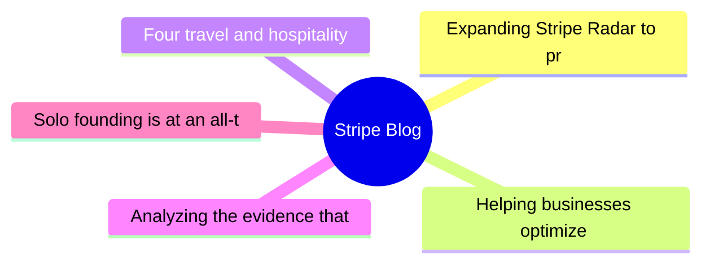
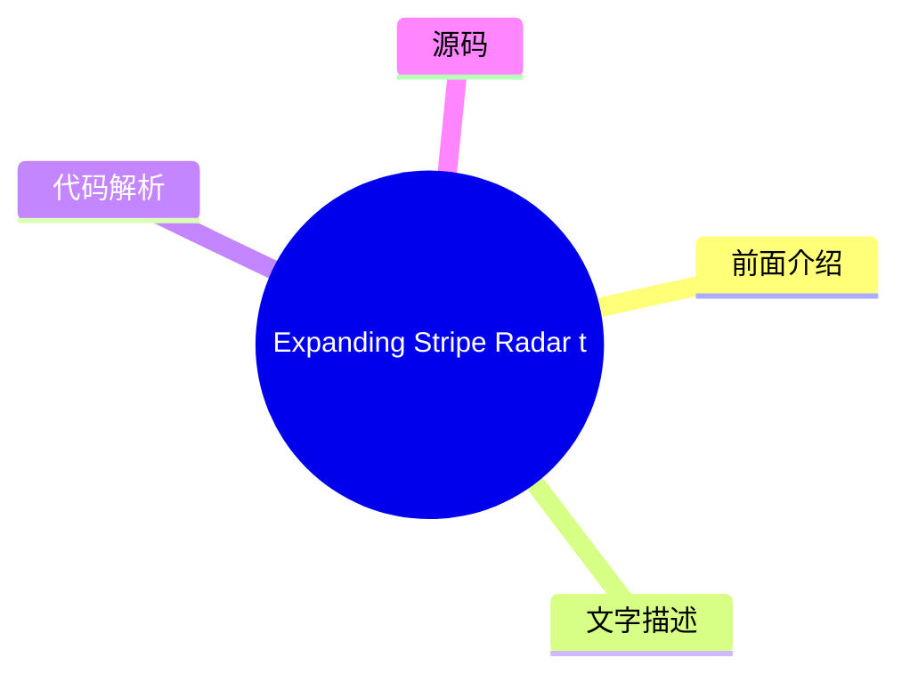
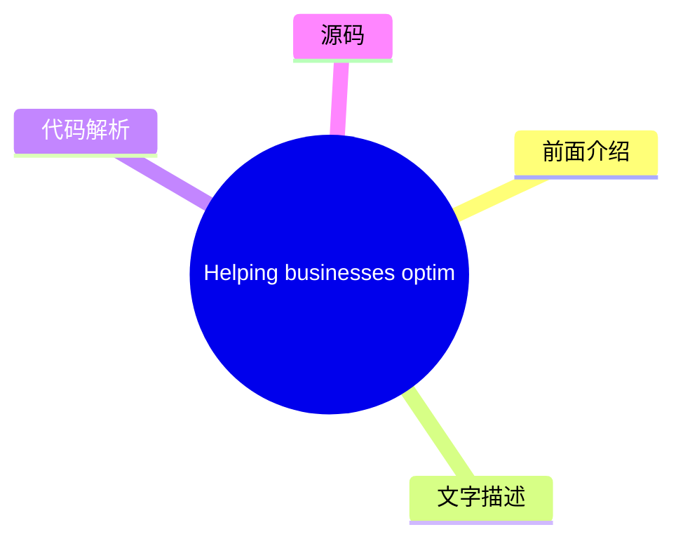
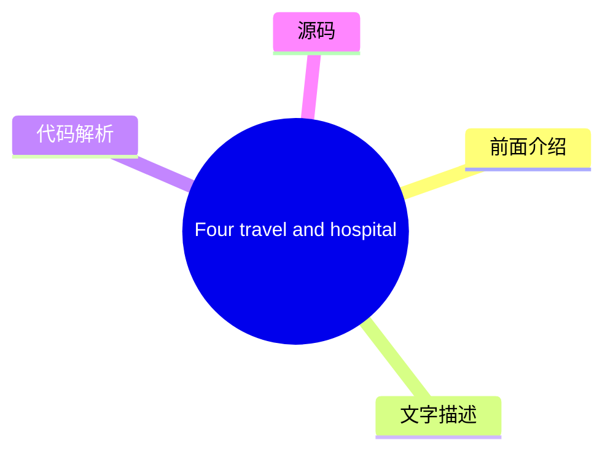
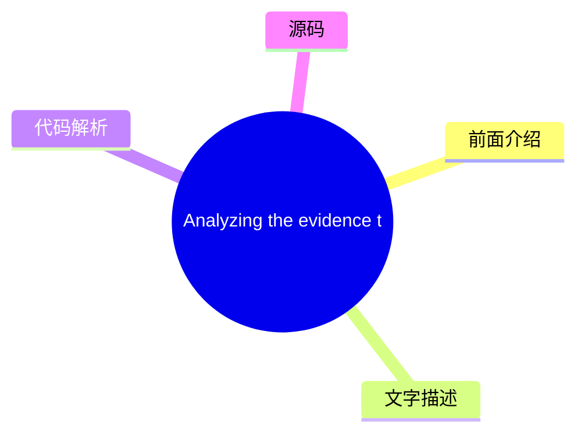
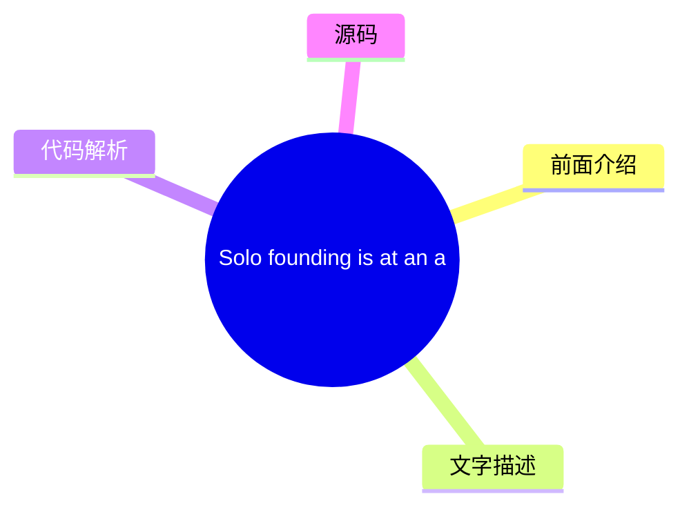

# 💳 Stripe Blog Top 5 (2026-07-27)

## 前面介绍

- 数据源：Stripe Blog
- 抓取日期：2026-07-27
- 条目数：5
- 含完整正文：5
- 含代码片段：0
- 组织方式：前面介绍 / 树状图 / 文字描述 / 代码解析 / 源码

## 思维导图

## 详细整理（5 条，5 条含全文，0 条含代码）

### 1. Expanding Stripe Radar to protect more of your business
- **链接**: [https://stripe.com/blog/expanding-stripe-radar-to-protect-more-of-your-business](https://stripe.com/blog/expanding-stripe-radar-to-protect-more-of-your-business)
- **发布**: Wed, 27 May 2026 00:00:00 +0000

#### 前面介绍

- Radar now blocks high-risk transactions across all supported payment methods; defends against new fraud types like multi-account abuse and pay-as-you-go abuse, regardless of which payment processor you use; and gives platforms new tools to evaluate a
- 发布时间：Wed, 27 May 2026 00:00:00 +0000

#### 树状图

#### 文字描述

- Last month at Stripe Sessions, we shared the biggest expansion we’ve ever made to [Stripe Radar](https://stripe.com/radar), our AI-powered fraud prevention tool. Radar now blocks high-risk transactions across all supported payment methods; defends against new fraud types like multi-account abuse and pay-as-you-go abuse, regardless of which payment processor you use; and gives p
- ## Protect more transactions with global payment coverage, new multiprocessor signals, and custom models Fraud protection is getting more complex. Businesses need to defend across a range of payment methods, and they need more precision in the signals they use to catch fraud before it happens—on and off Stripe. Radar now addresses both, along with the ability to use custom frau
- ## Defend against new types of fraud Fraudulent actors have become as sophisticated at stealing compute as they are at stealing money. They abuse policies by cycling through free trials, setting up multiple accounts, or intentionally not paying their next invoice. As businesses scale AI products, token abuse has become an expensive fraud vector. Last month, we shared how Radar 
- ## Protect your platform from account fraud Fraudulent actors are using generative AI to create fake identities, documents, and websites convincing enough to bypass many platforms’ verification systems. Platforms face a trade-off: request additional information during onboarding and increase friction, or keep the onboarding flow lightweight and take on potentially significant r

#### 代码解析

- 本文未检测到明确代码块，内容更偏新闻、观点或方法论。

#### 源码

#### 中文节选

上个月在 Stripe Sessions 上，我们分享了迄今为止对 [Stripe Radar](https://stripe.com/radar)（我们的人工智能驱动的欺诈防范工具）进行的最大规模扩展。Radar 现在可以阻止所有支持的支付方式下的高风险交易；无论您使用哪个支付处理器，都能防御多账户滥用和按量付费滥用等新型欺诈；并为平台提供了新的工具，用于评估和缓解 Stripe 内外商户的风险。我们还推出了更多方式，利用更智能的证据和自动证据库来处理争议。

以下是关于我们宣布内容的详细情况。

## 利用全球支付覆盖范围、新的多处理器信号和自定义模型保护更多交易

欺诈防范正变得日益复杂。企业需要在多种支付方式下进行防御，并且需要在交易发生前（无论是在 Stripe 上还是 Stripe 外）使用更精确的信号来识别欺诈。Radar 现在解决了这两个问题，并增加了使用自定义欺诈模型的能力。

**阻止所有支持的全球支付方式下的高风险交易**

Radar 现在保护[全球所有支持的交易量](https://docs.stripe.com/radar/local-payment-methods)，包括银行借记、先买后付 (BNPL) 选项、加密货币、数字钱包、实时支付和现金代金券。当 Radar 检测到交易中的欺诈模式时，该信息将可用于保护所有支付方式下的交易。例如，如果欺诈行为者在 Stripe 上的某家企业使用被盗信用卡，而我们检测并阻止了该行为，那么相同的 IP 地址和设备指纹现在会在银行借记、钱包和 BNPL 交易的网络范围内被标记。我们发现，对于使用 Affirm、Cash App、Klarna 和 PayPal 的企业，Radar 在五个月内将可疑欺诈减少了 71%。

**利用新的多处理器信号改进欺诈决策**

企业使用 Radar 的风险信号来处理 Stripe 以外的交易，以补充其内部欺诈模型，并在各个支付处理商处做出更精准的欺诈决策。现在，您可以通过针对 Stripe 以外交易的额外信号进一步改进欺诈决策，从而帮助您在欺诈发生前进行预防。

Stripe 现在可以识别支付是否可能触发发卡网络的[早期欺诈警告](https://docs.stripe.com/radar/multiprocessor#early-fraud-warning)。然后，您可以选择主动退款交易，以保护您的拒付率。

Stripe 还可以预测支付是否可能导致[欺诈性拒付](https://docs.stripe.com/radar/multiprocessor#fraudulent-dispute)。您可以使用此信号来发起退款、收集证据或调整您的拒付策略。

我们计划添加可在您整个支付体系中使用的新信号。

**访问企业级自定义欺诈模型**

对于风险概况更复杂的企业，Radar 现在提供[自定义欺诈模型](https://docs.stripe.com/radar/custom-

#### 完整正文（中文）

上个月在 Stripe Sessions 上，我们分享了迄今为止对 [Stripe Radar](https://stripe.com/radar)（我们的人工智能驱动的欺诈防范工具）进行的最大规模扩展。Radar 现在可以阻止所有支持的支付方式下的高风险交易；无论您使用哪个支付处理器，都能防御多账户滥用和按量付费滥用等新型欺诈；并为平台提供了新的工具，用于评估和缓解 Stripe 内外商户的风险。我们还推出了更多方式，利用更智能的证据和自动证据库来处理争议。

以下是关于我们宣布内容的详细情况。

## 利用全球支付覆盖范围、新的多处理器信号和自定义模型保护更多交易

欺诈防范正变得日益复杂。企业需要在多种支付方式下进行防御，并且需要在交易发生前（无论是在 Stripe 上还是 Stripe 外）使用更精确的信号来识别欺诈。Radar 现在解决了这两个问题，并增加了使用自定义欺诈模型的能力。

**阻止所有支持的全球支付方式下的高风险交易**

Radar 现在保护[全球所有支持的交易量](https://docs.stripe.com/radar/local-payment-methods)，包括银行借记、先买后付 (BNPL) 选项、加密货币、数字钱包、实时支付和现金代金券。当 Radar 检测到交易中的欺诈模式时，该信息将可用于保护所有支付方式下的交易。例如，如果欺诈行为者在 Stripe 上的某家企业使用被盗信用卡，而我们检测并阻止了该行为，那么相同的 IP 地址和设备指纹现在会在银行借记、钱包和 BNPL 交易的网络范围内被标记。我们发现，对于使用 Affirm、Cash App、Klarna 和 PayPal 的企业，Radar 在五个月内将可疑欺诈减少了 71%。

**利用新的多处理器信号改进欺诈决策**

Businesses use Radar’s risk signals for off-Stripe transactions to complement their in-house fraud models and make more precise fraud decisions across payment processors. Now, you can further improve your fraud decisioning with additional signals for off-Stripe transactions to help you prevent fraud before it happens.

Stripe can now identify whether a payment is [likely to trigger an early fraud warning](https://docs.stripe.com/radar/multiprocessor#early-fraud-warning) from the card network. You can then choose to proactively refund the transaction and protect your dispute rate. 

Stripe can also predict whether a payment is [likely to result in a fraudulent dispute](https://docs.stripe.com/radar/multiprocessor#fraudulent-dispute). You can use this signal to issue refunds, gather evidence, or adjust your dispute strategy. 

We plan to add new signals that can be used across your entire payments stack.

**Access enterprise-grade custom fraud models
**

For businesses with more complex risk profiles, Radar now offers [custom fraud models](https://docs.stripe.com/radar/custom-fraud-models). You can pass signals unique to your business to Stripe, such as product catalog data, loyalty status, behavioral metrics, or any structured metadata relevant to your risk profile. Stripe then combines this information with our global network data to deploy a model customized specifically to your business. For early adopters, custom models are detecting at least 15% more fraud with no increase in false positives.

## Defend against new types of fraud

Fraudulent actors have become as sophisticated at stealing compute as they are at stealing money. They abuse policies by cycling through free trials, setting up multiple accounts, or intentionally not paying their next invoice. As businesses scale AI products, token abuse has become an expensive fraud vector.

Last month, we shared how Radar addresses one of these fraud vectors with [free trial abuse prevention](https://stripe.com/blog/how-stripe-radar-helps-prevent-free-trial-abuse). At Sessions, we highlighted new ways to protect your business against multi-account abuse, pay-as-you-go fraud, and fraudulent bot-driven payments.

**阻止多账户滥用**

多账户滥用是指单个欺诈行为人创建多个账户，以重复使用促销优惠券或将被盗卡交易分散到多个账户中，从而延长逃避检测的时间。在整个 Stripe 网络中，AI 公司的注册用户中有六分之一以上与多账户滥用有关。

现在，Radar 可以[实时评估每个新账户](https://docs.stripe.com/radar/multi-account-and-account-sharing-abuse#multi-account-abuse)，以便您在滥用行为发生之前（无论是在 Stripe 内部还是外部）阻止可疑账户。我们的解决方案利用了整个 Stripe 网络中过往滥用行为的信息，包括设备指纹、IP 地址、电子邮件域名等。在过去的两个月里，ElevenLabs 每天能够阻止 2,000 名用户滥用其免费层级。

**预测按量付费滥用**

按量付费滥用是指客户通过积累使用量来滥用您的服务，且在账单到期时没有付款的意图。这些不良行为者利用了基于消费的定价结构，即费用在计费周期内累积，但付款发生在之后。例如，客户可能在一个月内消耗数千美元的计算资源，在月底被计费，然后永远不付款。

Radar 现在可以帮助[在用量累积时预测未付款滥用](https://docs.stripe.com/radar/pay-as-you-go-abuse)，从而允许您在客户被计费之前进行干预。这使您能够要求充值、切断服务，或采取任何符合您风险承受能力的行动。

**检测并防止欺诈机器人驱动的支付**

随着代理商务的扩展，区分代表客户行事的合法代理和恶意机器人变得越来越重要。两者都是进行购买的非人类流量，但一个是客户授权的代理，另一个可能会利用您的结账系统购买库存有限的商品、滥用促销定价或绕过购买限制。

Radar 现在为 Stripe Checkout 上的支付分配机器人评分，评估其是否由[恶意机器人发起](https://docs.stripe.com/radar/bot-abuse)的可能性。您可以使用此评分来强制执行反脚本或反机器人策略。例如，您可以阻止限量版商品的自动购买，或将高频率订单标记为待审核。

## 保护您的平台免受账户欺诈

欺诈行为者正在使用生成式 AI 创建虚假身份、文件和网站，这些网站足以绕过许多平台的验证系统。平台面临一个权衡：在入职流程中要求提供更多信息并增加摩擦，还是保持入职流程轻量级并承担潜在的重大风险。

[平台现在可以利用 Radar 降低整个业务的风险](https://docs.stripe.com/radar/radar-for-platforms)，其功能包括为每个业务和交易提供 0 到 100 的欺诈评分；解释为何账户被标记的 AI 驱动洞察；用于帮助您的团队了解账户背景的备注和账户历史；以及针对争议、拒付、退款和支付的账户级指标。

我们还引入了三种新方法，供平台监控和评估商户风险，包括在 Stripe 内部和外部。

- [欺诈网站](https://docs.stripe.com/radar/fraudulent-website)信号会像人类欺诈分析师一样分析企业的网站，寻找诸如以不切实际的价格出售奢侈品、AI 生成的文案、拼写错误的品牌 URL 或其他表明网站存在欺诈的迹象等危险信号。平台可以在入职流程中使用此信号来自动化验证、标记账户以进行人工审核，或在批准业务前将其作为自身风险评分的输入。
- [欺诈商户](https://docs.stripe.com/radar/fraudulent-merchant)信号根据对 Stripe 网络内模式的分析（包括银行账户信息、业务详情、交易活动和争议），确定新账户或现有账户是否存在欺诈风险。然后，平台可以发起审核、暂停付款、暂停提现、拒绝账户、设置预留金或要求身份验证。

- The [merchant delinquency risk](https://docs.stripe.com/radar/merchant-delinquency-risk)signal predicts whether a business is at risk of accruing a negative balance; specifically, it predicts whether that balance is likely to remain negative for 60 days or more. Platforms can use this signal to decide whether to proactively adjust payout schedules, require reserves on high-risk accounts, or flag merchants for closer review before losses accumulate.

## Fight disputes more effectively with smarter evidence and automated evidence libraries

[Smart Disputes](https://docs.stripe.com/disputes/smart-disputes), our AI-powered dispute management product, has always compiled and submitted evidence on your behalf. Now, Smart Disputes can develop a more customized strategy to improve your chances of winning each dispute. 

Smart Disputes analyzes each dispute and surfaces [AI-powered recommendations](https://docs.stripe.com/disputes/set-up-smart-disputes#provide-more-data-at-dispute-time) for specific evidence fields, such as tracking numbers or customer usage logs. Businesses that add our AI-recommended evidence through Smart Disputes are winning 3x more often than those that don’t add any evidence. 

We’re also reducing the manual effort involved in submitting evidence. Many disputes require the same supporting materials: terms and conditions, return policies, and service agreements. With the evidence library, you upload and store these documents once, and Smart Disputes automatically selects and includes them in your evidence packet based on the dispute’s reason code, network requirements, and cardholder claims—no manual resubmission needed.

## What’s next

At Sessions, we also launched [our public roadmap](https://stripe.com/roadmap): an itemized list with hundreds of detailed entries through the first quarter of 2027, including [products, features, and improvements across Radar](https://stripe.com/roadmap?product=Radar). 

想了解更多 Radar 如何保护您的业务，请加入我们在全球主要城市的 [Stripe Tour 2026](https://stripetour.com/)。您也可以 [阅读我们的文档](https://docs.stripe.com/radar) 或 [联系我们的专家团队](https://stripe.com/contact/sales)。

### 2. Helping businesses optimize network costs with the Visa Digital Commerce Authentication Program (DCAP)
- **链接**: [https://stripe.com/blog/helping-businesses-optimize-network-costs-with-visa-digital-commerce-authentication-program](https://stripe.com/blog/helping-businesses-optimize-network-costs-with-visa-digital-commerce-authentication-program)
- **发布**: Wed, 03 Jun 2026 00:00:00 +0000

#### 前面介绍

- We moved quickly to help Stripe businesses take advantage of DCAP and capture interchange savings while protecting authorization rates. Here’s what we did.
- 发布时间：Wed, 03 Jun 2026 00:00:00 +0000

#### 树状图

#### 文字描述

- Visa recently launched the [Digital Commerce Authentication Program (DCAP)](https://support.stripe.com/questions/understand-the-visa-digital-commerce-authentication-program-%28dcap%29-on-stripe), a new global framework designed to reduce fraud and increase authorization rates for card-not-present transactions. The program rewards businesses in the US for sharing richer transact
- ### Optimizing DCAP savings without sacrificing conversion Before rolling out DCAP, we worked with Visa to run readiness testing and identify the right implementation approach. This collaborative testing underscored the need for transaction-level intelligence. With [Stripe Authorization Boost](https://stripe.com/authorization-boost), we intelligently select which transactions s
- ## Automatically benefit from DCAP optimizations If you use Authorization Boost and are collecting the required data points, you’re already automatically benefiting from DCAP optimizations. For businesses using [standalone 3DS](https://docs.stripe.com/payments/3d-secure/standalone-3d-secure), you can participate by setting **flow_preference[type]** to `data_share` on authentica

#### 代码解析

- 本文未检测到明确代码块，内容更偏新闻、观点或方法论。

#### 源码

#### 中文节选

Visa 最近推出了 [数字商业认证计划 (DCAP)](https://support.stripe.com/questions/understand-the-visa-digital-commerce-authentication-program-%28dcap%29-on-stripe)，这是一个旨在减少欺诈并提高无卡交易授权率的新全球框架。该计划奖励美国企业，要求其在认证过程中与发卡行分享更丰富的交易数据，例如设备 ID、账单地址、IP 地址和客户电子邮件。符合条件的交易可获得 5 个基点的净交换费减免。

新的网络计划带来了机遇，但也引入了复杂性。企业需要了解哪些交易符合资格，确保其集成能够传递所需数据，并确定参与该计划是否能改善其端到端的交易经济性，或者是否会产生意想不到的后果，例如损害授权率。

要参与 DCAP，企业需要在结账流程中通过无摩擦认证与发卡行分享所需的持卡人数据。这可能会引入延迟，并导致发卡行在解读这些较新的信号时存在不确定性。

我们迅速采取行动，帮助 Stripe 企业利用 DCAP 并在保护授权率的同时获取交换费节省。以下是我们所做的工作。

### 在不牺牲转化率的情况下优化 DCAP 节省

在推出 DCAP 之前，我们与 Visa 合作进行了就绪性测试，并确定了正确的实施方法。这种协作测试强调了交易级智能的必要性。

With [Stripe Authorization Boost](https://stripe.com/authorization-boost), we intelligently select which transactions should go through [Data Only 3DS](https://docs.stripe.com/payments/3d-secure/strong-customer-authentication-exemptions#data-only), which sends additional risk data from the card network to the issuer for authorization. Rather than applying static rules, Authorization Boost evaluates cost savings, conversion impact, and fraud risk at the individual transaction level to determine when to apply Data Only 3DS. This allows businesses to capture DCAP savings while limiting the impact to the customer experience and optimizing authorization rates.

Since April 18, we’ve helped Stripe businesses capture $18.4 million in annualized network cost savings from DCAP. By helping businesses collect and pass the required data, we saw an 8x increase in the number of DCAP-eligible transactions. We’re continuing to work with Visa to optimize eligibility, so more transactions can benefit from DCAP.

## Automatically benefit from DCAP optimizations

If you use Authorization Boost and are collecting the required data points, you’re already automatically benefiting from DCAP optimizations. For businesses using [standalone 3DS](https://docs.stripe.com/payments/3d-secure/standalone-3d-secure), you can participate by setting **flow_preference[type]** to `data_share` on authentication requests and ensuring require

#### 完整正文（中文）

Visa 最近推出了 [数字商业认证计划 (DCAP)](https://support.stripe.com/questions/understand-the-visa-digital-commerce-authentication-program-%28dcap%29-on-stripe)，这是一个旨在减少欺诈并提高无卡交易授权率的新全球框架。该计划奖励美国企业，要求其在认证过程中与发卡行分享更丰富的交易数据，例如设备 ID、账单地址、IP 地址和客户电子邮件。符合条件的交易可获得 5 个基点的净交换费减免。

新的网络计划带来了机遇，但也引入了复杂性。企业需要了解哪些交易符合资格，确保其集成能够传递所需数据，并确定参与该计划是否能改善其端到端的交易经济性，或者是否会产生意想不到的后果，例如损害授权率。

要参与 DCAP，企业需要在结账流程中通过无摩擦认证与发卡行分享所需的持卡人数据。这可能会引入延迟，并导致发卡行在解读这些较新的信号时存在不确定性。

我们迅速采取行动，帮助 Stripe 企业利用 DCAP 并在保护授权率的同时获取交换费节省。以下是我们所做的工作。

### 在不牺牲转化率的情况下优化 DCAP 节省

在推出 DCAP 之前，我们与 Visa 合作进行了就绪性测试，并确定了正确的实施方法。这种协作测试强调了交易级智能的必要性。

借助 [Stripe Authorization Boost](https://stripe.com/authorization-boost)，我们可以智能选择哪些交易应通过 [Data Only 3DS](https://docs.stripe.com/payments/3d-secure/strong-customer-authentication-exemptions#data-only)，该流程会从卡组织向发卡行发送额外的风险数据。与使用静态规则不同，Authorization Boost 会在单笔交易层面评估成本节约、转化影响和欺诈风险，以确定何时应用 Data Only 3DS。这使企业能够在限制对客户体验的影响并优化授权率的同时，捕获 DCAP 节省。

自 4 月 18 日以来，我们已帮助 Stripe 企业从 DCAP 中获得了 1840 万美元的年度化网络成本节约。通过帮助企业收集和传递所需数据，我们观察到符合 DCAP 条件的交易数量增加了 8 倍。我们正在继续与 Visa 合作优化资格条件，以便更多交易能够受益于 DCAP。

## 自动受益于 DCAP 优化

如果您使用 Authorization Boost 并正在收集所需的数据点，您已经自动受益于 DCAP 优化。对于使用 [standalone 3DS](https://docs.stripe.com/payments/3d-secure/standalone-3d-secure) 的企业，您可以通过在认证请求上将 **flow_preference[type]** 设置为 `data_share` 并确保填写了必填字段来参与其中。

了解有关 [Authorization Boost](https://docs.stripe.com/payments/analytics/optimization) 如何帮助优化您的支付表现的更多信息。

### 3. Four travel and hospitality trends from HITEC 2026
- **链接**: [https://stripe.com/blog/trends-from-hitec](https://stripe.com/blog/trends-from-hitec)
- **发布**: Tue, 23 Jun 2026 00:00:00 +0000

#### 前面介绍

- More than 6,000 hospitality executives and operators gathered in San Antonio last week for the HITEC conference. The big topic: whether the industry’s AI investment is actually working. Across four days and over 50 meetings, four trends stood out.
- 发布时间：Tue, 23 Jun 2026 00:00:00 +0000

#### 树状图

#### 文字描述

- More than 6,000 hospitality executives and operators gathered in San Antonio last week for the annual HITEC hospitality technology conference, including leaders from Wyndham Hotels & Resorts, Hyatt, IHG Hotels & Resorts, Starwood Hotels, and hundreds of independent properties. The big topic: whether the industry’s AI investment is actually working. IDC forecasts that [30%](http
- ## The race for direct bookings has moved from search rankings to AI answers For years, the hospitality industry’s answer to online travel agency (OTA) dependency was SEO: invest in content, improve search rankings, and convert guests before they end up on Expedia or Booking.com. That approach is becoming less effective. Jack Wang, principal solution engineer at Salesforce, off
- ## Most hospitality AI is falling short in a predictable way An uncomfortable truth surfaced repeatedly throughout HITEC: much of the AI scaling happening across hospitality is fragile. The majority of businesses are adopting AI without the strategic clarity, data foundation, and operational architecture to sustain it. The root cause is often fragmented data. Siloed property ma
- ## Payments friction has a measurable cost, but most hotels still don’t know what it is The hospitality industry has historically treated payments as a cost and commodity: something to keep running, minimize fees on, and keep out of the way. Many of the payments-specific conversations we had at HITEC revolved around how that approach is changing, along with a growing recognitio

#### 代码解析

- 本文未检测到明确代码块，内容更偏新闻、观点或方法论。

#### 源码

#### 中文节选

More than 6,000 hospitality executives and operators gathered in San Antonio last week for the annual HITEC hospitality technology conference, including leaders from Wyndham Hotels & Resorts, Hyatt, IHG Hotels & Resorts, Starwood Hotels, and hundreds of independent properties.

The big topic: whether the industry’s AI investment is actually working. IDC forecasts that [30%](https://www.idc.com/resource-center/blog/agentic-ai-will-redefine-travel-and-hospitality-in-2026/) of all travel bookings will be made by AI agents by 2030. But the gap between where the industry is headed and what it’s currently equipped to support is wide.

While 25% of hospitality businesses report actively scaling AI today, fewer than 10% are considered “AI future-built,” according to [BCG](https://www.bcg.com/publications/2026/ai-first-hotels-leaner-faster-smarter)—meaning they have AI embedded across core operations, a supporting data foundation, and measurable returns to show for it. “A lot of companies are throwing spaghetti at the wall to see if it sticks,” said Dale Gomez, associate teaching professor in hospitality technology at Florida International University. “They want to see ROI.” 

Other shifts are already underway. Many hospitality businesses still lack the modern financial infrastructure needed to fully benefit from the automation, speed, and interoperability AI is expected to drive. Payment systems once considered “good enough” are now costing measurable revenue, and rising guest expectations have turned inefficient technology from a minor inconvenience to a reason not to return.

Across four days and over 50 meetings, four trends stood out.

## The race for direct bookings has moved from search rankings to AI answers

For years, the hospitality industry’s answer to online travel agency (OTA) dependency was SEO: invest in content, improve search rankings, and convert guests before they end up on Expedia or Booking.com. That approach is becoming less effective.

Jack Wang, Salesforce 的首席解决方案工程师，提供了一组凸显转变的数据：现在，触发 AI 概览的 Google 搜索中有 65% 以用户未点击任何网站而结束。在移动端，这一数字上升至 78%。随着 AI 生成的摘要取代了 SEO 旨在赢得的排名链接列表，传统搜索流量在整个行业下降了约 25%。

被 AI 生成的答案收录需要与 SEO 奖励的内容不同。SEO 响应关键词密度、反向链接和页面权威性。AI 收录响应的是结构化属性数据的准确性和机器可读性，如房型、设施详情、政策、本地背景或取消条款。一家酒店可能在传统搜索中排名良好，但对 LLM 来说却不可见：超过 [90%](https://www.nokumo.net/en/ai-visibility-in-hospitality-what-3-600-ai-responses-and-1-337-website-audits-reveal?utm_campaign=ennismore-proves-tech-investment-pays-off-and-94-of-hotels-are-invisible-to-ai) 的住宿

#### 完整正文（中文）

More than 6,000 hospitality executives and operators gathered in San Antonio last week for the annual HITEC hospitality technology conference, including leaders from Wyndham Hotels & Resorts, Hyatt, IHG Hotels & Resorts, Starwood Hotels, and hundreds of independent properties.

The big topic: whether the industry’s AI investment is actually working. IDC forecasts that [30%](https://www.idc.com/resource-center/blog/agentic-ai-will-redefine-travel-and-hospitality-in-2026/) of all travel bookings will be made by AI agents by 2030. But the gap between where the industry is headed and what it’s currently equipped to support is wide.

While 25% of hospitality businesses report actively scaling AI today, fewer than 10% are considered “AI future-built,” according to [BCG](https://www.bcg.com/publications/2026/ai-first-hotels-leaner-faster-smarter)—meaning they have AI embedded across core operations, a supporting data foundation, and measurable returns to show for it. “A lot of companies are throwing spaghetti at the wall to see if it sticks,” said Dale Gomez, associate teaching professor in hospitality technology at Florida International University. “They want to see ROI.” 

Other shifts are already underway. Many hospitality businesses still lack the modern financial infrastructure needed to fully benefit from the automation, speed, and interoperability AI is expected to drive. Payment systems once considered “good enough” are now costing measurable revenue, and rising guest expectations have turned inefficient technology from a minor inconvenience to a reason not to return.

Across four days and over 50 meetings, four trends stood out.

## The race for direct bookings has moved from search rankings to AI answers

For years, the hospitality industry’s answer to online travel agency (OTA) dependency was SEO: invest in content, improve search rankings, and convert guests before they end up on Expedia or Booking.com. That approach is becoming less effective.

Jack Wang, principal solution engineer at Salesforce, offered data that spotlights a shift: 65% of Google searches that trigger an AI Overview now end without the user clicking any website. On mobile, that number climbs to 78%. Traditional search traffic is declining roughly 25% across the industry, as AI-generated summaries replace the ranked link lists that SEO was designed to win.

Inclusion in an AI-generated answer requires something different from what SEO rewards. SEO responds to keyword density, backlinks, and page authority. AI inclusion responds to the accuracy and machine-readability of structured property data, like room types, amenity details, policies, local context, or cancellation terms. A hotel can rank well in traditional search and be invisible to an LLM: over [90%](https://www.nokumo.net/en/ai-visibility-in-hospitality-what-3-600-ai-responses-and-1-337-website-audits-reveal?utm_campaign=ennismore-proves-tech-investment-pays-off-and-94-of-hotels-are-invisible-to-ai) of accommodation sites are still undetected by AI models.

We’re already seeing a downstream effect. According to Phocuswright research, [56%](https://www.phocuswire.com/news/online/shift-travel-behavior-ai-surge-phocuswright-research) of travelers have used AI for trip planning, booking, or in-destination assistance in the past 12 months. For operators, the first step is an audit, not an investment. Can the LLMs your prospective guests are using accurately describe your property’s room categories, amenities, policies, and local context? If the answer is no, that gap is likely costing you bookings.

Today, hotel chains have access to the same checkout and payment tools as OTAs, including local payment methods and currencies, one-click checkout, and global fraud protection. The travel brands capturing agentic demand are combining AI-driven discoverability with accurate real-time inventory and a modern checkout experience that converts demand efficiently.

## Most hospitality AI is falling short in a predictable way

在整个 HITEC 期间，一个令人不安的事实反复出现：酒店业正在发生的许多 AI 扩展都是脆弱的。大多数企业采用 AI 时缺乏维持其发展的战略清晰度、数据基础和运营架构。

根本原因通常是数据碎片化。孤立的物业管理系统、CRM、忠诚度、餐饮和支付系统各自只持有关于同一客人的部分视图——而 AI 推荐的准确性仅取决于它们所依据的内容。同样导致 AI 个性化失效的数据问题，在财务上表现为过长的对账时间，在运营上表现为不完整的客人档案，在客人体验上则表现为摩擦。

Salesforce 首席解决方案工程师 Amanda Sharp 将问题重新定义为 AI 的落地运营，而非采用，并呼吁进行“氛围式运营”：这是酒店业对“氛围编码”的回应。如今，许多酒店品牌构建 AI 功能已成为可能。但在生产环境中可靠地运行它们，并将其集成到触发实际操作的现有工作流程中，则要困难得多。

在这方面做得好的企业拥有干净、连接的数据，能够在采取行动的宝贵时间内将有用的情报直接传递到工作流程中。例如，达美航空在移动应用中内置了实时 AI 礼宾，利用 SkyMiles 档案和运营数据，在客户关怀体验中提供情境感知支持。在永利拉斯维加斯，收益经理在业绩低于目标时，会收到预测性警报以及附带的建议行动。

对于大多数旅游运营商来说，瓶颈在于数据连接，而非模型质量。

## 支付摩擦具有可衡量的成本，但大多数酒店仍不知道其具体数额

酒店业历史上一直将支付视为成本和商品：一种需要维持运转、尽量降低费用并尽量不碍事的东西。我们在 HITEC 会议上进行的许多支付相关讨论都围绕着这种做法如何改变展开，以及人们日益认识到支付已成为酒店品牌竞争的关键因素。我们的数据也支持这一观点：在 Stripe 委托的一项针对近 400 名酒店高管进行的调查中，90% 的人表示支付对增长很重要，37% 的人表示缺乏支付选项对客人体验产生最大的负面影响。此外，58% 的人表示他们的欺诈系统会拦截合法交易，74% 的人报告称，碎片化的系统导致他们的团队在对账上花费过多时间。

这些数据凸显了为什么支付已成为一种结构性优势。在线旅行社（OTA）之所以能够负担得起大规模的支付人员配置，是因为它们的收入证明了这种人力配置的合理性。独立酒店和较小的运营商无法直接匹配这种投资，但在正确的基础设施上配备精简的团队，现在可以以大型内部运营成本的一小部分，支持跨越数十个国家的支付方式。

覆盖范围的缺失直接导致预订流失。“一旦我们不支持 [某种支付方式]，客人就会去其他地方，去支持他们首选支付方式的平台或渠道，”Cloudbeds 战略合作伙伴副总裁 Sebastien Leitner 说。客人在其首选支付方式适用的地方预订。一家不支持目标市场主流支付方式的酒店，不仅是在制造摩擦——它实际上是将预订引导给了支持该方式的 OTA。

## 最好的酒店技术是那种不起眼的技术

“对于那些无法正常工作的技术，人们毫无同理心，”Oracle Hospitality 全球战略与产品管理副总裁 Tanya Pratt 说道。“如果它无法工作，它造成的挫败感将比在前台排长队更甚，因为人们已经习惯了排长队。”当技术失效时，客人并不总是会投诉。他们只是不再回头。

真正的成功衡量标准是，技术运作得足够好，以至于客人根本不会去思考它。万豪酒店的首席信息官 Denise Walker 描述了这一愿景：一位回头客到达房间时，温度适宜，电视上播放着他们偏好的频道，床上的枕头也符合他们喜欢的硬度。没有人会说明他们是如何知道的。“它不需要以一种‘你怎么知道这些的？’的方式呈现出来。”

拉斯维加斯永利度假村的酒店运营副总裁 Shannon McCallum 走得更远。“我们正从‘我告诉了你这些，所以你知道关于我的事’转变为‘我什么都没告诉你，而你现在却在预测它’。”

这两种隐形的个性化以及它所支持的人性化时刻，都需要一个连接数据的基石——即能够整合现有技术栈、将客人信息整合到单一系统中的技术。这种基础设施使企业能够在客人浏览网站或站在前台时识别出同一位客人。

## Stripe 如何提供帮助

越来越多的客人将通过 AI 助手而不是搜索引擎找到您的物业。他们预订的行程可能由代理完成。而区分高绩效运营商的收入将来自于能够实现转化的支付体验、覆盖每个市场的支付方式以及协同工作的财务系统。Stripe 数据管道将支付数据与您的预订和客户系统连接起来，为运营商提供统一的收入视图，而无需拼接式的报告。

Stripe 的支付基础设施帮助酒店运营商保护收入、提升客人在物业内的消费支出，并简化运营。

**获取直接预订。** 在客人实际使用的各种支付方式以及您服务的每个市场中，能够促进转化的支付体验有助于将预订保留在您的直接渠道上。随着代理商务务的扩展，这意味着默认情况下每笔 Stripe 交易都会运行欺诈检测，以及允许代理在不暴露客人凭证的情况下进行交易的支付令牌。

**增加旅行消费。** 来自餐饮、体验和合作伙伴的附属收入需要能够在整个物业范围内运作的支付基础设施，支持新的商业模式，并与外部合作伙伴连接。Stripe Billing 处理会员和忠诚度计划背后的定期支付逻辑，包括自动续费、分级定价和失败付款恢复——无需运营商自行维护该基础设施。例如，[Cloudbeds](https://stripe.com/customers/cloudbeds) 发现，使用 Cloudbeds Payments 的企业收入增长了 15%，而通过其 Stripe 合作伙伴关系直接消除支付摩擦并扩展支付方式的企业，平均收入增加了 14.8%。

**降低成本。** 更高效的 B2B 资金流动和欺诈保护减少了对账工作并限制了损失，从而在不增加人员的情况下释放利润空间。

[了解更多](https://stripe.com/industries/travel) 关于 Stripe 如何支持酒店业务，或 [联系我们](https://stripe.com/contact/sales)。

### 4. Analyzing the evidence that helps businesses win “product not received” disputes
- **链接**: [https://stripe.com/blog/analyzing-the-evidence-that-helps-businesses-win-product-not-received-disputes](https://stripe.com/blog/analyzing-the-evidence-that-helps-businesses-win-product-not-received-disputes)
- **发布**: Tue, 21 Jul 2026 00:00:00 +0000

#### 前面介绍

- To understand what can influence win rates, we analyzed evidence packets from one million disputes over a 16-week period. Here’s what the data shows and what it means for how you mitigate disputes.
- 发布时间：Tue, 21 Jul 2026 00:00:00 +0000

#### 树状图

#### 文字描述

- “[Product not received](https://docs.stripe.com/disputes/categories)” disputes—where a cardholder claims they didn’t receive what they paid for—are the most common nonfraud dispute category on Stripe. It can be challenging to know which claims are legitimate and which are not: some customers genuinely never received what they paid for, while others incorrectly claim they didn’t
- ## Businesses that submitted evidence after the delivery was confirmed saw a 27 percentage point higher win rate Many businesses submit a shipping tracking ID as proof of delivery. However, depending on the status of the package at the time you submit the evidence, the tracking number might only confirm that the package left your facility. Our analysis found that win rates incr
- ## Businesses that submitted digital activity and usage logs saw a 10 percentage point higher win rate Businesses selling digital goods also need to provide proof of fulfillment, though the supporting evidence looks different. Disputes with digital activity and usage logs—such as JSON telemetry logs from common analytics platforms showing that a user streamed, downloaded, or ac
- ## Businesses that included evidence of a refund issued through Stripe saw a 63 percentage point higher win rate Cardholders can still initiate [a dispute even after a refund has been processed](https://support.stripe.com/questions/disputes-on-a-refunded-transaction-faq), often because the refund and dispute were filed around the same time or because the issuing bank didn’t che

#### 代码解析

- 本文未检测到明确代码块，内容更偏新闻、观点或方法论。

#### 源码

#### 中文节选

“[Product not received](https://docs.stripe.com/disputes/categories)” disputes—where a cardholder claims they didn’t receive what they paid for—are the most common nonfraud dispute category on Stripe. It can be challenging to know which claims are legitimate and which are not: some customers genuinely never received what they paid for, while others incorrectly claim they didn’t receive the order. 

To understand what can influence win rates, we analyzed evidence packets from one million disputes over a 16-week period. We compared win rates for packets that included various types of evidence—such as delivery confirmation or content consumption logs—against those that didn’t, isolating which features correlated with higher win rates.

Here’s what the data shows for businesses broadly, what’s different for businesses selling digital goods, and what it means for how you mitigate disputes.

**Businesses that submitted delivery information saw a 44 percentage point higher win rate**

For businesses selling physical goods, disputes with delivery confirmation as evidence had a 27 percentage point higher win rate than disputes without it. Adding a GPS delivery map as evidence, which shows where the carrier scanned the package, lifted win rates by an additional 15 percentage points on top of delivery confirmation alone. And including a recipient signature as evidence added a further two percentage point lift. Together, disputes with delivery confirmation, a GPS map, and a signature had a 44 percentage point higher win rate than disputes without them.

Yet many businesses still don’t include delivery confirmation in their dispute responses. Part of this gap is awareness, but the bigger barrier is operational. For most businesses, shipping data and dispute workflows live in separate systems. Matching a specific dispute to the right order and confirmed delivery status often requires manual work and is hard to scale.

## Businesses that submitted evidence after the delivery was confirmed saw a 27 percentage point higher win rate

Many businesses submit a shipping tracking ID as proof of delivery. However, depending on the status of the package at the time you submit the evidence, the tracking number might only confirm that the package left your facility.

Our analysis found that win rates increased based on what the tracking ID showed when a business submitted it—specifically, whether delivery had been confirmed. Disputes with evidence submitted after delivery was confirmed had a 27 percentage point higher win rate than disputes with no delivery confirmation. On the other hand, disputes with evidence submitted when the package was still in transit had only a two percentage point higher win rate than disputes with no delivery confirmation.

This suggests that the timing of your evidence submission matters. Customers might file a “product not received” dispute before an order arrives, especially if a shipment is delayed or still in transit. Because most business

#### 完整正文（中文）

“[Product not received](https://docs.stripe.com/disputes/categories)” disputes—where a cardholder claims they didn’t receive what they paid for—are the most common nonfraud dispute category on Stripe. It can be challenging to know which claims are legitimate and which are not: some customers genuinely never received what they paid for, while others incorrectly claim they didn’t receive the order. 

To understand what can influence win rates, we analyzed evidence packets from one million disputes over a 16-week period. We compared win rates for packets that included various types of evidence—such as delivery confirmation or content consumption logs—against those that didn’t, isolating which features correlated with higher win rates.

Here’s what the data shows for businesses broadly, what’s different for businesses selling digital goods, and what it means for how you mitigate disputes.

**Businesses that submitted delivery information saw a 44 percentage point higher win rate**

For businesses selling physical goods, disputes with delivery confirmation as evidence had a 27 percentage point higher win rate than disputes without it. Adding a GPS delivery map as evidence, which shows where the carrier scanned the package, lifted win rates by an additional 15 percentage points on top of delivery confirmation alone. And including a recipient signature as evidence added a further two percentage point lift. Together, disputes with delivery confirmation, a GPS map, and a signature had a 44 percentage point higher win rate than disputes without them.

Yet many businesses still don’t include delivery confirmation in their dispute responses. Part of this gap is awareness, but the bigger barrier is operational. For most businesses, shipping data and dispute workflows live in separate systems. Matching a specific dispute to the right order and confirmed delivery status often requires manual work and is hard to scale.

## Businesses that submitted evidence after the delivery was confirmed saw a 27 percentage point higher win rate

Many businesses submit a shipping tracking ID as proof of delivery. However, depending on the status of the package at the time you submit the evidence, the tracking number might only confirm that the package left your facility.

Our analysis found that win rates increased based on what the tracking ID showed when a business submitted it—specifically, whether delivery had been confirmed. Disputes with evidence submitted after delivery was confirmed had a 27 percentage point higher win rate than disputes with no delivery confirmation. On the other hand, disputes with evidence submitted when the package was still in transit had only a two percentage point higher win rate than disputes with no delivery confirmation.

This suggests that the timing of your evidence submission matters. Customers might file a “product not received” dispute before an order arrives, especially if a shipment is delayed or still in transit. Because most businesses have 20 or more days to respond, consider holding your submission until the carrier confirms arrival if your dispute window allows it. If you do need to submit before delivery is confirmed, consider including documentation showing that the order is still within the delivery time frame the customer agreed to at checkout.

## Businesses that submitted digital activity and usage logs saw a 10 percentage point higher win rate

Businesses selling digital goods also need to provide proof of fulfillment, though the supporting evidence looks different.

Disputes with digital activity and usage logs—such as JSON telemetry logs from common analytics platforms showing that a user streamed, downloaded, or accessed the specific product they purchased—had a 10 percentage point higher win rate than disputes without them. And disputes with service documentation, such as provisioning records, had an eight percentage point higher win rate than disputes without them.

这种模式与我们在销售实物商品的企业中发现的规律一致：具体细节总是更好的。服务文档可能只能证明客户有访问权限。而另一方面，内容消费日志可以证明客户流式传输、下载或访问了他们付费购买的具体产品。

## 包含通过 Stripe 发放退款证据的企业，胜诉率高出 63 个百分点

持卡人仍可能在退款处理完成后发起[争议](https://support.stripe.com/questions/disputes-on-a-refunded-transaction-faq)，这通常是因为退款和争议是在同一时间提交的，或者是发卡行在提交争议前未检查退款状态。当这种情况发生时，许多企业会在争议回复中包含退款证据，以证明他们已经让客户满意。但我们的分析显示，对于销售数字商品的企业，“退款证明”对胜诉率的影响取决于退款的处理方式。

通过 Stripe 发放的全额退款是销售数字商品的企业获得高胜诉率的最强预测指标。包含此类证据的争议，其胜诉率比不包含此类证据的争议高出 63 个百分点。另一方面，通过其他渠道（如商店积分）发放的退款，其争议的胜诉率仅比不包含此类证据的争议高出 6 个百分点。

这可能是因为发卡行只能对可以验证的信息采取行动。当退款通过你的支付处理商处理时，发卡行可以验证卡网络上的信用额度。发卡行无法以同样的方式验证通过支付处理商之外渠道发放的退款；因为没有记录。

## Stripe 如何提供帮助

[智能争议](https://docs.stripe.com/disputes/smart-disputes) 旨在为你应用这些最佳实践，帮助你节省时间并挽回收入。它使用人工智能为符合条件的卡争议自动组装量身定制的证据包，应用本分析中确定的基于数据的最佳实践，因此你无需逐笔争议地手动实施这些实践。

You can increase your win rates by providing Smart Disputes with a shipping carrier and tracking number when you receive a dispute. Stripe supports more than 12 shipping providers and automatically works with them to pull the entire fulfillment history, such as delivery status, time stamps, and location data. You can also add any additional evidence, such as customer communications or supplementary documentation, and Stripe will merge it with the auto-generated packet to create the strongest possible response.

Stripe then assembles that information into a compelling evidence packet for you, optimizing packet content and structure based on the specific dispute, down to the network, region, issuer, and reason code. If you don’t take any action before the dispute deadline, Smart Disputes submits the evidence on your behalf to ensure disputes are not lost due to missed deadlines.

No additional integration is required if you already use Stripe. To learn more about Smart Disputes, [read our docs](https://docs.stripe.com/disputes/smart-disputes). 

*The insights, projections, and forward-looking statements contained here are for informational purposes only and should not be relied upon. These are based on assumptions and information currently available, but actual results may differ materially.*

### 5. Solo founding is at an all-time high: Top performers have these traits in common
- **链接**: [https://stripe.com/blog/top-solo-founder-traits](https://stripe.com/blog/top-solo-founder-traits)
- **发布**: Thu, 28 May 2026 00:00:00 +0000

#### 前面介绍

- In 2025, solo founders in the top decile generated 61 times the revenue of the median solo founder in their first six months. We analyzed the data to understand what drives that gap.
- 发布时间：Thu, 28 May 2026 00:00:00 +0000

#### 树状图

#### 文字描述

- Solo startup founders, defined here as people who launched a startup through Stripe Atlas without any cofounders, account for 63% of C corps formed so far in the second quarter of 2026—an all-time high. As more founders start companies on their own, the gap between typical companies and top performers is widening. Among solo-founded startups incorporated through Atlas, median i
- ## 1. They build AI-native products The most successful solo founders are building AI-native products, meaning the product’s core functionality depends on AI models. Top-decile solo founders were about twice as likely as median founders to be building AI-native companies. The next generation of solo founders will be less defined by technical pedigree and more by speed,” says [M
- ## 2. They sell globally from launch In the first month, top-decile solo founders sold into an average of 10 countries, versus just three for median solo founders. That gap continued to widen over time. By month 24, top-decile solo founders were selling into 40 non-US countries, on average, compared to six for median solo founders. Top solo founders also generated a much larger
- ## 3. They build for businesses Top solo founders were nearly 30% more likely than middle-decile founders to build B2B businesses. “I grew my SaaS to €10K MRR without ads by talking to users every day, only building features that multiple customers asked for, and focusing on being the best service in my specific niche,” says [Pauline Clavelloux](https://x.com/Pauline_Cx), who s

#### 代码解析

- 本文未检测到明确代码块，内容更偏新闻、观点或方法论。

#### 源码

#### 中文节选

独自创业的创始人，在此定义为通过 Stripe Atlas 创立公司且没有联合创始人的个人，占 2026 年第二季度迄今为止成立的 C 型公司的 63%——这是一个历史新高。

随着越来越多的创始人独自创办公司，典型公司与顶尖表现者之间的差距正在扩大。在通过 Atlas 成立的独自创业公司中，2025 年的中位初始六个月收入同比下降了 23%，而收入处于顶层十分位的公司则增长了 19%。

四年前，顶层十分位的独自创业创始人在前六个月创造的收入约为中位独自创业创始人的 34 倍。到 2025 年，这一数字已增长到 61 倍。自 2022 年以来，年收入超过 10 万美元的独立创业者数量增加了三分之一。

随着 AI 工具让一个人能够更容易地构建、发布、支持客户和迭代，值得思考的是，是什么将那些脱颖而出的公司与那些没有脱颖而出的公司区分开来。为了了解这种差异，我们分析了 2022 年和 2023 年成立的数千家 Atlas 独自创业公司，每家公司至少都有两年的收入数据。在该群体中，我们将收入处于中位十分位的独自创业创始人与前两年总收入处于顶层十分位的创始人进行了比较，以了解是什么区分了最强的异常值。顶层十分位中出现了几个明显的模式。

## 1. 他们构建 AI 原生产品

最成功的独自创业创始人在构建 AI 原生产品，这意味着产品的核心功能依赖于 AI 模型。顶层十分位的独自创业创始人构建 AI 原生公司的可能性约为中位创始人的两倍。“下一代独自创业创始人将不再由技术背景定义，而更多地由速度定义，”创立了 34 家独自创业公司的 [Marc Lou](https://marclou.com/) 说。“他们将是专注于解决问题的无代码人员，利用 AI 极速发布，并在社交媒体上破解分发渠道。”

到两年时，AI 原生独立初创公司的收入几乎是其他独立创立初创公司的两倍。起初，我们预期这一结果是由少数几家表现突出的公司拉高了平均值，但事实并非如此：99 分位数的收入对于 AI 原生和其他初创公司几乎相同。差异来自于更广泛的分布，AI 原生初创公司在大约第 50 到第 95 个百分位的表现优于其他初创公司。

## 2. 它们在发布时就进行全球销售

在第一个月，前十分位数的独立创始人平均销售到 10 个国家，而中位数独立创始人仅为 3 个。随着时间的推移，这一差距持续扩大。到第 24 个月时，前十分位数的独立创始人平均销售到 40 个非美国国家，而中位数独立创始人仅为 6 个。

顶尖独立创始人也从其本土市场之外获得了更大比例的收入。国际销售占前十分位数独立创始人收入的 51%，而中位数独立创始人仅为 2%。这种差异的很大一部分

#### 完整正文（中文）

独自创业的创始人，在此定义为通过 Stripe Atlas 创立公司且没有联合创始人的个人，占 2026 年第二季度迄今为止成立的 C 型公司的 63%——这是一个历史新高。

随着越来越多的创始人独自创办公司，典型公司与顶尖表现者之间的差距正在扩大。在通过 Atlas 成立的独自创业公司中，2025 年的中位初始六个月收入同比下降了 23%，而收入处于顶层十分位的公司则增长了 19%。

四年前，顶层十分位的独自创业创始人在前六个月创造的收入约为中位独自创业创始人的 34 倍。到 2025 年，这一数字已增长到 61 倍。自 2022 年以来，年收入超过 10 万美元的独立创业者数量增加了三分之一。

随着 AI 工具让一个人能够更容易地构建、发布、支持客户和迭代，值得思考的是，是什么将那些脱颖而出的公司与那些没有脱颖而出的公司区分开来。为了了解这种差异，我们分析了 2022 年和 2023 年成立的数千家 Atlas 独自创业公司，每家公司至少都有两年的收入数据。在该群体中，我们将收入处于中位十分位的独自创业创始人与前两年总收入处于顶层十分位的创始人进行了比较，以了解是什么区分了最强的异常值。顶层十分位中出现了几个明显的模式。

## 1. 他们构建 AI 原生产品

最成功的独自创业创始人在构建 AI 原生产品，这意味着产品的核心功能依赖于 AI 模型。顶层十分位的独自创业创始人构建 AI 原生公司的可能性约为中位创始人的两倍。“下一代独自创业创始人将不再由技术背景定义，而更多地由速度定义，”创立了 34 家独自创业公司的 [Marc Lou](https://marclou.com/) 说。“他们将是专注于解决问题的无代码人员，利用 AI 极速发布，并在社交媒体上破解分发渠道。”

By the two-year mark, AI-native solo startups generated almost twice the revenue of other solo-founded startups. Initially, we expected that result to be driven by a small handful of breakout companies inflating the average, but that’s not the case: revenue at the 99th percentile was nearly the same for AI-native and other startups. The difference comes from the broader distribution, with AI-native startups outperforming from roughly the 50th to the 95th percentile.

## 2. They sell globally from launch

In the first month, top-decile solo founders sold into an average of 10 countries, versus just three for median solo founders. That gap continued to widen over time. By month 24, top-decile solo founders were selling into 40 non-US countries, on average, compared to six for median solo founders.

Top solo founders also generated a much larger share of revenue from outside their home market. International sales accounted for 51% of revenue for top-decile solo founders, compared with 2% for median solo founders. Much of that difference came down to where founders were based: top-decile solo founders were slightly more likely to be located outside the US, so many sold into the US early. Since the US is often the largest and highest-spending market for software, selling there early can accelerate growth.

## 3. They build for businesses

Top solo founders were nearly 30% more likely than middle-decile founders to build B2B businesses. “I grew my SaaS to €10K MRR without ads by talking to users every day, only building features that multiple customers asked for, and focusing on being the best service in my specific niche,” says [Pauline Clavelloux](https://x.com/Pauline_Cx), who solo-founded four companies, including [Refindie](https://www.refindie.com/).

B2B solo founders performed better across the board. By month 24, revenue for the median solo B2B founder was more than four times that of the median solo B2C founder.

That pattern held among top performers. Solo B2B founders in the top decile earned nearly twice as much revenue as their B2C peers.

A common assumption is that this is mainly driven by funding, since B2B founders tend to raise capital more easily. The data suggests otherwise. Even among bootstrapped startups, solo B2B founders generated more revenue than solo B2C founders at both the median and the top decile.

## 4. They have higher customer retention early on

Top solo founders retained a much larger share of their first-month customers than middle-decile founders, suggesting they reach product-market fit earlier. “Validate with paying users before you invest too much time or money,” says Clavelloux. “Progress over perfection: launch fast and iterate often.”

Nearly 30% of customers at top-decile solo startups returned the following month, compared with 8% at middle-decile startups. By the sixth month, top-decile solo founders also began winning back churned customers—roughly three months sooner than middle-decile founders.

That early retention advantage pays off over time. By the start of the second year, customers acquired in the company’s first month were spending 47% more at top-decile startups than they were initially—about twice the increase seen at middle-decile startups.

This contrast was especially pronounced in B2B businesses. Among solo-founded B2B startups, top-decile founders retained first-month customers at six times the rate of median founders.

Part of the reason top solo founders retained more customers might be that they were much more likely to use recurring billing. Based on Stripe data, top-decile B2B and B2C founders were 26 and 20 percentage points more likely to use a recurring billing model than their middle-decile peers, respectively.

While these patterns highlight what many top solo founders have in common, they don’t show how solo-founded companies stack up against multifounder teams.

## 5. Multifounder startups tend to pull ahead over time, but the top solo founders are catching up

Early on, solo-founded startups brought in more revenue than multifounder startups, but that flipped by month 24: top-decile multifounder startups generated 53% more revenue than top-decile solo founders. That remained true even after accounting for investor funding.

然而，在对比最顶尖的自力更生型初创企业时，多创始人优势几乎消失殆尽。在 99 分位数的水平上，自力更生的单人创始人在两年后与自力更生的多创始人初创企业相差无几，收入差距仅为 5%。“最强的单人创始人往往极具足智多谋和高能动性：他们既能构建、撰写和发布产品，也知道如何通过招募优秀人才、聘请顾问和利用创始人网络来拓展自身能力，”[Fatima Rizwan](https://www.linkedin.com/in/frizwan/) 说道，她曾单人创立了 [Okara](https://okara.ai/) 和 [TechJuice](https://www.techjuice.pk/)。

## 以单人创始人身份起步

借助 Stripe Atlas，单人创始人可以在两天内从世界任何地方完成公司注册、开设银行账户、接受付款和筹集资金。

- **公司注册与股权：** 注册公司，获取 EIN，设置创始人股权归属，并提交 83(b) 税务选择。
- **投资者就绪文档：** 您公司的法律文件由 Cooley 开发，这是一家领先的初创企业律师事务所。
- **增长资源：** 访问价值 50,000 美元的合作伙伴权益、2,500 美元的 Stripe 信用额度，并可通过仪表板使用 SAFEs 进行融资。

了解更多关于 [Stripe Atlas](https://stripe.com/atlas) 的信息。

